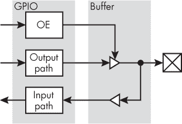
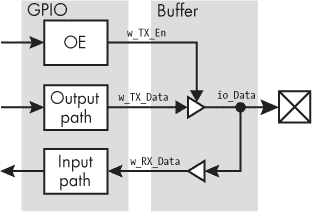
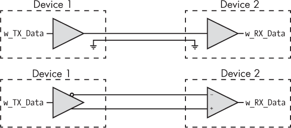
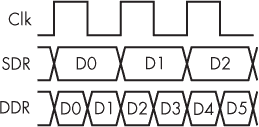
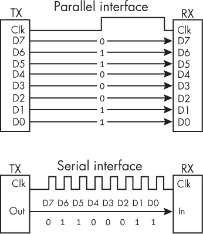
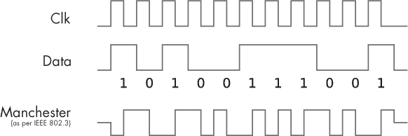
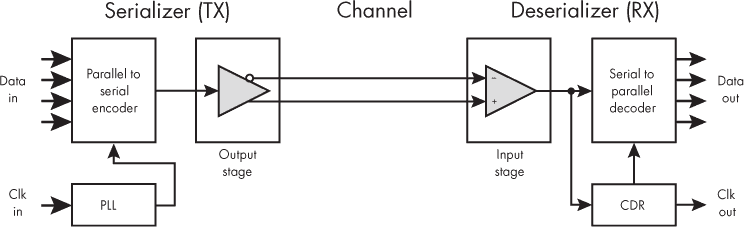

# 第四章：11 通过 I/O 和 SERDES 进出数据


本书一直专注于 FPGA 的内部结构，这也是 FPGA 设计过程中的典型情况。FPGA 设计主要围绕编写面向内部组件（如触发器、查找表（LUTs）、块 RAM 和 DSP 块）的 Verilog 或 VHDL 代码。但设备边缘发生了什么呢？数据是如何进出 FPGA 的？

将数据输入和输出到 FPGA 涉及的复杂性超乎想象。根据我的经验，这也是大多数棘手的 FPGA 设计问题出现的地方。理解*输入/输出 (I/O)*的工作原理将帮助你解决这些问题。你将能够花更少的时间担心外部接口，更多的时间解决内部任务。

使用 I/O 是“软件人员”和“硬件人员”之间的分界线。你需要了解你正在接口的电信号的细节，以便正确配置 FPGA 引脚。它们在什么电压下工作？信号是单端还是差分的？（那到底意味着什么？）你如何使用双倍数据速率或串行/解串行器以非常高的速度发送数据？本章将回答这些问题以及更多内容。即使你没有电气工程背景，也会学到将 FPGA 与外部世界连接的基础知识。

## 使用 GPIO 引脚

FPGA 上的大多数引脚是*通用输入输出（GPIO）*引脚，意味着它们可以作为数字输入或输出。我们在本书的项目中使用了这些引脚来接收来自按钮的信号，并输出信号点亮 LED，但我们并未关注它们实际如何工作的细节。在这一节中，我们将探讨 GPIO 引脚如何与 FPGA 接口，以及如何将它们配置为输入数据、输出数据或两者兼有。

当我刚开始接触 FPGA 设计时，我完全不了解引脚配置中的细微差别。这里有许多需要调整的参数和设置。彻底理解你的 GPIO 引脚非常重要，尤其是在高速设计中，因为在整个设计中保持信号完整性和性能始于引脚。

### I/O 缓冲器

GPIO 引脚通过*缓冲器*与 FPGA 接口，缓冲器是电子电路元件，用于将输入与输出隔离。这些缓冲器使得你可以将一些引脚配置为输入，而另一些配置为输出。正如你很快会看到的，它们甚至允许你在 FPGA 运行时将引脚在输入和输出之间切换。图 11-1 显示了一个简化的 Intel FPGA 上 GPIO 引脚接口的框图，说明了缓冲器如何充当引脚和 FPGA 内部逻辑之间的中介。



图 11-1：简化的 GPIO 模块图

图像右侧的框（内含 X）代表物理引脚。引脚的左边紧邻一个标记为 Buffer 的模块，代表 I/O 缓冲区。它包含两个主要组件，由三角形表示。指向右侧的三角形是*输出缓冲区*；它将数据推送到引脚上。指向左侧的三角形是*输入缓冲区*；它将数据从引脚传送到 FPGA。

图表最左边是一个标记为 GPIO 的模块，代表与引脚通过缓冲区直接交互的内部 FPGA 逻辑。这里需要注意的主要路径是 OE，代表*输出使能*。它控制输出缓冲区的开关，决定引脚是作为输出还是输入。当 OE 为高时，输出缓冲区会将输出路径上的数据驱动到引脚上。如果输出路径上的数据为低，引脚也会是低电平；如果输出路径上的数据为高，引脚则是高电平。当 OE 为低时，引脚被配置为输入模式，因此输出缓冲区停止将其输入传递到输出。此时，缓冲区的输出变为*高阻抗*（也称为*高 Z*或*三态*），意味着它几乎不接受任何电流。高阻抗的输出缓冲区不再影响引脚上的任何操作。相反，引脚的状态由外部输入信号决定。输入缓冲区可以自由读取该信号，并将其传递到输入路径，以供 FPGA 内部使用。

表 11-1 展示了一个输出缓冲区的真值表，总结了该行为。

表 11-1： 输出缓冲区的真值表

| 输入 | OE | 输出 |
| --- | --- | --- |
| 0 | 0 | Z |
| 1 | 0 | Z |
| 0 | 1 | 0 |
| 1 | 1 | 1 |

从这个表格可以看出，当 OE 为高时，缓冲区输入的值会被直接传递到输出。但当 OE 为低时，缓冲区的输出变为高阻抗（通常用*Z*表示），无论输入值是什么。

在本书中的项目中，我们已在设计代码的顶层定义了输入和输出信号。输入通过关键字input（Verilog）或in（VHDL）表示，而输出则通过关键字output（Verilog）或out（VHDL）表示。在构建 FPGA 时，综合工具会看到每个方向定义了哪些信号，并相应地设置缓冲区。如果信号是输入，OE 将被设置为低电平。如果信号是输出，OE 将被设置为高电平。然后，在布置和布线过程中，物理约束文件将信号映射到 FPGA 的特定引脚。这就是 GPIO 引脚如何配置为专用输入或输出引脚的方式。

#### 半双工通信的双向数据

虽然设计中的大多数引脚通常被固定为输入或输出，但 GPIO 引脚可以配置为*双向*，这意味着它可以在同一设计中在输入和输出之间切换。当 FPGA 需要通过双向引脚输出数据时，它会将 OE 信号驱动为高电平，然后将要传输的数据放到输出路径上。当 FPGA 需要通过双向引脚接收数据作为输入时，它会将 OE 信号驱动为低电平。这将把输出缓冲区设置为三态（高阻抗），使 FPGA 能够监听引脚上的数据并将其传递到输入路径。当引脚配置为这种双向时，它充当的是*收发器*，而不仅仅是一个发射器或接收器。

双向引脚对于*半双工*通信非常有用，其中两个设备通过一个共享的传输线（一个引脚）交换数据。任何一个设备都可以充当发射器，但每次只能有一个设备进行传输，而另一个设备进行接收。这与*全双工*通信相对，后者允许两个设备同时传输和接收数据。全双工通信需要两条传输线（两个引脚），一条用于从设备 1 到设备 2 发送数据，另一条用于从设备 2 到设备 1 发送数据，这与半双工通信中的单一传输线不同。

半双工通信的一个常见例子是双向无线电。讲解者只有在按住无线电上的按钮时才能传输信息。当讲解者在传输时，听者无法进行传输，因此讲解者和听者必须商定谁先发言。这也是为什么电影中人们在使用对讲机时总是会说“Over”——这是一个信号，表示讲解者已经讲完，听者现在可以自由回应。

对于物理线路，如果两端没有轮流共享通信通道，就会发生数据碰撞。这种碰撞可能会损坏数据，导致任何一方都无法接收到信息。为了避免这种情况，设备必须达成一种*协议*，即一组管理通信的规则。协议确定了设备如何发起事务，建立了其他设备在时间上有明确的时机进行回应（类似于说“完毕”），等等。有些协议甚至能够通过检测数据损坏并重新发送损坏的数据来处理数据碰撞，尽管这需要额外的复杂性。

半双工通信通常比使用专用的发送和接收通道更复杂，但仍然非常常见。例如，*I2C*（或 I²C，发音为“eye-squared-see”或“eye-two-see”，是*集成电路间通信*的缩写）是一种广泛使用的半双工协议。无数独特的集成电路——包括 ADC、DAC、加速度计、陀螺仪、温度传感器、微控制器等——都使用 I2C 来通信，因为它相对简单易实现，并且由于其半双工的特性，只需要极少的引脚。I2C 只使用两个引脚：时钟和数据，这也是为什么它有时被称为*TWI（双线接口）*的原因。

#### 双向引脚实现

让我们看看如何使用 Verilog 或 VHDL 编写双向引脚代码。在查看此代码时，请参考图 11-2，以查看代码中的信号如何与图 11-1 中的框图匹配：

Verilog

```
❶ module bidirectional(inout io_Data,
   `--snip--`
❷ assign w_RX_Data = io_Data;
❸ assign io_Data   = w_TX_En ? w_TX_Data : 1'bZ;
   `--snip--`
```

VHDL

```
entity bidirectional is
❶ port (io_Data : inout std_logic,
   `--snip--`
❷ w_RX_Data <= io_Data;
❸ io_Data   <= w_TX_Data when w_TX_En = '1' else 'Z';
   `--snip--`
```

我们在 Verilog 和 VHDL 中使用关键字 inout 声明双向引脚 (io_Data) ❶。此时我们可以想象自己已经位于引脚处，正如 图 11-2 中标签 io_Data 所示。我们需要在物理约束文件中将这个信号映射到 FPGA 的一个引脚。在输入功能方面，我们仅需通过赋值操作将引脚的数据驱动到 w_RX_Data ❷。在输出端，我们通过使用信号 w_TX_En 来选择性地启用输出缓冲区 ❸。我们在 Verilog 中使用三元操作符，或在 VHDL 中使用条件赋值。驱动到 io_Data 上的数据将是 w_TX_Data 或高阻抗（在 Verilog 中表示为 1'bZ，在 VHDL 中为 'Z'），具体取决于输出使能信号 (w_TX_En) 的状态。这种代码模式对于双向数据来说非常常见，综合工具足够智能，能够识别并推断出一个 I/O 缓冲区。



图 11-2：带标签的双向接口

你可能会注意到，任何驱动到 w_TX_Data 的数据都会被接收到 w_RX_Data，因为它们通过 io_Data 连接在一起。你需要在代码的其他地方处理这个问题，通过告知接收器在 w_TX_En 为高电平时忽略 io_Data 上的任何数据。否则，你的 FPGA 会“听到”自己发出的数据。

### 电气特性

对于每个 GPIO 引脚，你可以指定许多不同的电气特性。我们将讨论三种：工作电压、驱动强度和上升/下降速率。我们还将看看单端和差分数据传输之间的电气差异。

阅读时，请记住，这些并不是你可以控制的唯一引脚设置。例如，你还可以将引脚设置为开漏，加入上拉或下拉电阻，或者终端电阻等。你的 FPGA 的 I/O 可以以多种方式配置，这取决于设备本身内置的 GPIO 属性。如果你需要实现简单信号接口之外的功能，建议查阅相关数据手册，确保你正确地使用 I/O 缓冲器。关于 FPGA I/O 的所有具体信息通常可以在 I/O 用户手册中找到，这是一个很好的参考，可以帮助你了解 FPGA 能够与哪些类型的电子设备进行接口。

#### 操作电压

*操作电压*指定引脚在逻辑 1 输出时将被驱动到的电压，并设置逻辑 1 输入的预期电压。最常见的是，FPGA 引脚使用 0V 表示 0，3.3V 表示 1。这种标准称为*LVCMOS33*（LVCMOS 是*低电压互补金属氧化物半导体*的缩写）。你还可能遇到另一种标准：0V 表示 0，5V 表示 1，这称为*TTL*（*晶体管–晶体管逻辑*的缩写）。如今，TTL 在 FPGA 中不太常见，因为许多 FPGA 内部不允许使用高达 5V 的电压。还有 LVCMOS25 标准，它使用 0V 表示 0，2.5V 表示 1。

LVCMOS33、LVCMOS25 和 TTL 都是*单端*I/O 标准的例子，意味着相关信号是以地为参考的。如你很快会看到的，还有*差分*标准，其中信号不以地为参考。单端标准的种类比我提到的三种更多。一个典型的 FPGA 支持大约十几种单端 I/O 标准。

关于设置操作电压，有一个重要的注意事项：同一组引脚上的所有信号必须使用相同的操作电压。*银行*是指一组引脚，它们都使用一个共同的参考电压，通常称为*VCCIO*。你的 FPGA 上可能有八个银行，每个银行可以使用独特的操作电压。例如，你可能将银行 1 配置为使用 1.8V，将银行 2 配置为使用 3.3V，将银行 3 配置为使用 2.5V。关键在于同一银行内的所有引脚必须在相同电压下工作。你不能将一个 LVCMOS33 引脚与 LVCMOS25 引脚放在同一个银行，因为前者需要 3.3V 的 VCCIO，而后者需要 2.5V 的 VCCIO。在进行原理图审查时，始终检查确保每个银行的信号共享相同的参考电压。如果你尝试在同一银行中混合不同的电压，放置与布线工具很可能会生成错误，或者至少会发出一个非常强烈的警告。

#### 驱动强度

*驱动强度*决定了一个引脚可以驱动的电流大小（以毫安 mA 为单位）。例如，一个设置为 8 mA 驱动强度的引脚将能够吸入或输出最多 8 mA 的电流。驱动强度可以根据每个引脚单独调整，并应足够高以匹配你所连接的电路需求。通常情况下，所有引脚的驱动强度设置可以保留为默认值。除非你有高电流需求，否则不太可能需要修改默认设置。

#### 斜率

*斜率*设定了输出信号允许变化的速率。通常以定性术语表示，如*快*、*中*或*慢*。斜率设置会影响引脚从 0 变为 1 或从 1 变为 0 的速度。和驱动强度一样，斜率通常可以保留为每个引脚的默认设置。唯一的例外是，当你需要与某个要求非常快速数据传输速率的组件进行接口时，这时你可能需要选择最快的选项。然而，选择更快的斜率可能会增加系统噪声，因此除非确实需要，否则不建议使用更快的斜率。

#### 差分信号传输

*差分信号传输*是一种数据传输方法，其中有两个信号，它们不是参考地面，而是相互参考。如我之前所提，这与*单端信号传输*形成对比，后者只有一个数据信号参考地面。图 11-3 展示了它们之间的区别。



图 11-3：单端与差分接口

图的上半部分展示了单端配置：我们有设备 1 通过单根线将数据传输给设备 2，另有一根线用于地面路径。地面线没有数据，但它是保持设备间一致地面参考所必需的。数据通过数据线以电压的形式传送：0 V 表示 0，或根据工作电压为 1 的其他值（如 3.3 V）。如果我们想增加另一条数据路径，只需在两个设备之间再加一根单独的线；地面参考可适用于多个数据路径。

图片的下半部分展示了一个差分配置。在这里，我们没有地参考线通过设备之间传递。相反，我们有一对数据线。注意到上行线起始处的气泡，这是设备 1 的传输缓冲区输出端。这看起来像我们在第三章中看到的 NOT 门和 NAND 门的气泡，且这是我们拥有差分对的常见标志。如果接收端的+端和–端之间的电压差超过某个阈值并为正电压，那么信号被解码为 1；如果电压差为负并低于某个阈值，则信号被解码为 0。具体细节取决于差分标准。例如，TIA/EIA-644，通常称为*LVDS（低电压差分信号传输）*，规定两条电线之间的电压差应约为+/-350 毫伏（mV）。这个电压比大多数单端信号使用的电压要低得多，这意味着系统可以在更低的功耗下工作，这是差分通信相对于单端通信的一个优势。典型的 FPGA 支持的差分标准数量大致与单端标准相同（大约十几种）。

你可能已经注意到一个缺点，那就是差分通信每条数据路径需要使用两倍数量的电线。对于单端数据传输，每条数据路径只需要一根电线。如果我们想要 10 条数据路径，我们需要 10 根电线（通常还至少需要 1 根地线）。而要使用差分信号创建相同的 10 条数据路径，我们需要 20 根电线（但不需要地线）。这些额外的电线会增加成本，并需要更大的连接器。然而，差分信号具有一些独特的特性，在某些应用中，这种折衷是值得的。

一个重要的优势是，差分信号比单端信号对*噪声*或*电磁干扰（EMI）*的免疫能力要强得多。电磁干扰是一种由电磁场变化引起的现象——例如，来自附近微波炉、手机或电力线的变化——它会在其他系统中造成干扰。你可以把一根传输数据的电线想象成一个小天线，它会接收各种不需要的电信号，产生噪声，这些噪声会在电线上以电压波动的形式表现出来。单端信号上的电压波动足够大时，可能会破坏数据，使 0 变成 1，或者 1 变成 0。然而，对于差分信号来说，电压波动会对两条电线产生相同的影响，这意味着两根电线之间的电压差保持不变。由于重要的是电压差，而不是电压的精确值，因此噪声会被有效地抵消。

差分通信的另一个好处是发射器和接收器可以参考不同的地电压，同时仍然能够可靠地发送和接收数据。这可能听起来有些奇怪，但地电压并不总是完全为 0V。系统中的地电压可能会受到噪声的影响，就像数据线一样，因此如果你依赖地电压作为系统中唯一的参考电压，就可能出现问题。特别是，对于相距较远的两个设备，很难维持一个共同的地电压参考，这也是为什么差分信号常常被用于长距离传输数据的原因。例如，RS-485 作为一种差分电气标准，可以在近 1 英里的距离内以每秒 10 兆比特（Mb/s）的速度传输数据，而单端信号无法实现这一点。即使在较短的距离下，也有一些情况，其中一个系统可能根本不以地电压为参考，而是*浮空*或*与地电压隔离*。为了与隔离系统通信，你需要一种不依赖于共享地电压参考的通信方式，差分通信就是这样一种方式。

差分信号能够以比单端信号更快的速度传输数据。当发射器需要从 0 切换到 1 时，它必须将线路的电压从对应 0 的电压驱动到对应 1 的电压，这个过程需要一定的时间（称为变化速率）。电压之间的差异越大，需要驱动到线路上的电流就越大，过程所需的时间也越长。由于单端协议通常要求在 0 和 1 之间有更宽的电压波动，它们天生比差分协议更慢。例如，LVCMOS33 的电压摆幅为 3.3V，远大于 LVDS 的电压摆幅+/- 350 mV。因此，几乎所有高速应用都使用差分信号。我们将在本章后续讨论 SerDes 时详细了解这一点，但像 USB、SATA 和以太网这样的接口都使用差分信号，以实现尽可能高的数据传输速率。

#### 如何修改引脚设置

如果你想为引脚指定工作电压、驱动强度或变化速率值，或者控制哪些引脚用于单端信号，哪些引脚用于差分信号，应该在物理约束文件中进行配置。回想一下，这个文件列出了 FPGA 的引脚如何与设计中的信号连接。除了指定引脚映射之外，你还可以添加这些其他参数，进一步定义 I/O 行为。以下是一个来自 Lattice 约束文件的片段，其中包含一些附加参数：

```
LOCATE COMP "o_Data" SITE "A13";
IOBUF PORT "o_Data" IO_TYPE=LVCMOS33 DRIVE=8 SLEWRATE=FAST;
```

第一行将信号o_Data映射到 A13 引脚。第二行将操作电压设置为LVCMOS33，驱动强度设置为8，上升率设置为FAST。你应参考你特定 FPGA 的约束用户指南，以了解如何设置这些参数；因为语法在不同设备之间并不通用。你也可以在你的 IDE 中使用 GUI 来设置这些参数，而无需学习所需的精确语法。

### 通过双倍数据速率实现更快的数据传输

快速发送数据是 FPGA 的优势所在，而加速传输的一种方式是使用*双倍数据速率（DDR）*。到目前为止，我已经指出，FPGA 中的信号应该与时钟的上升沿同步。然而，在双倍数据速率下，信号会在时钟的上升*和*下降沿发生变化。这使得你可以在相同的时钟频率下发送两倍的数据量，如图 11-4 所示。



图 11-4：单倍数据速率与双倍数据速率

如你所见，在单倍数据速率模式下，数据在每个上升时钟沿发送，你可以在三个时钟周期内移动三个位的数据（D0 到 D2）。相比之下，在双倍数据速率模式下，数据在上升沿和下降沿都发送，你可以在相同的三个时钟周期内发送六个位的数据（D0 到 D5）。这种技术广泛用于 LPDDR 内存，即*低功耗双倍数据速率*，这是一种常见于计算机、智能手机和其他电子设备中的 RAM。改变时钟的上下沿的数据可提高内存的带宽。

你需要在任何需要使用 DDR 进行数据传输的地方创建双倍数据速率输出（ODDR）缓冲区。不同 FPGA 厂商之间的具体实现有所不同，但我一般建议在 Verilog 或 VHDL 中直接创建这些 ODDR 缓冲区，通过实例化的方式，因为它们的配置并不复杂。作为例子，我们可以看看来自 AMD Virtex-7 库用户指南中的 ODDR 缓冲区实例化模板：

Verilog

```
ODDR #(
.DDR_CLK_EDGE("OPPOSITE_EDGE"),
.INIT(1'b0), // Initial value of Q: 1'b0 or 1'b1
.SRTYPE("SYNC") // Set/reset type: "SYNC" or "ASYNC"
) ODDR_inst (
❶ .Q(Q), // 1-bit DDR output
.C(C), // 1-bit clock input
.CE(CE), // 1-bit clock enable input
.D1(D1), // 1-bit data input (positive edge)
.D2(D2), // 1-bit data input (negative edge)
.R(R), // 1-bit reset
.S(S) // 1-bit set
);
```

VHDL

```
ODDR_inst : ODDR
generic map(
DDR_CLK_EDGE => "OPPOSITE_EDGE",
INIT => '0', -- Initial value for Q port ('1' or '0')
SRTYPE => "SYNC") -- Reset type ("ASYNC" or "SYNC")
port map (
❶ Q => Q, -- 1-bit DDR output
C => C, -- 1-bit clock input
CE => CE, -- 1-bit clock enable input
D1 => D1, -- 1-bit data input (positive edge) D2 => D2, -- 1-bit data input (negative edge)
R => R, -- 1-bit reset input
S => S -- 1-bit set input
);
```

理解这里的每一行并不关键。最重要的连接是输出引脚本身 ❶；这是<sup class="SANS_TheSansMonoCd_W5Regular_11">ODDR</sup>模块连接到引脚的地方。两个数据输入端口，D1和D2，将以交替模式将数据传送到输出引脚。D1在上升（或正）沿驱动，D2在下降（或负）沿驱动。

双倍数据速率可以加速数据传输，但如果你真的想让数据飞速传输，一些 FPGA 配备了一种名为 SerDes 的专用接口，能够实现更高速的输入和输出。接下来，我们将探讨这个令人兴奋的 FPGA 特性。

## SerDes

*SerDes*（即*串行器/解串器*）是某些（但并非所有）FPGA 的原始功能，负责以极高的速度输入或输出数据，达到每秒吉比特（Gb/s）的传输速率。简单来说，它通过将并行数据流转换为串行数据流进行高速传输。而在接收端，串行数据会被转换回并行数据。正因如此，FPGA 能够以非常快的数据速率与其他设备交换数据。虽然看起来串行传输——一次传输一位数据——比并行传输——一次传输多个比特——速度更快似乎不太直观，但这正是 SerDes 的魔力所在。我们稍后将讨论为什么这会有效。

SerDes 原语有时被称为*SerDes 收发器*，这反映了它们既可以发送也可以接收数据。话虽如此，SerDes 收发器几乎总是全双工的，意味着它们不必像我们之前在双向通信中看到的那样在发送器和接收器之间来回切换。你通常会将一个数据路径设置为从 FPGA 发出的发送器，另一个设置为输入到 FPGA 的接收器。

SerDes 收发器帮助 FPGA 以其他设备无法实现的速率发送或接收大量数据。这是一个关键特性，使得 FPGA 在接收来自视频摄像头的数据等应用场景中具有吸引力。高分辨率摄像头的像素空间可能为 1,920×1,080，每个像素 32 位数据，并且以 60 Hz 的频率捕获新图像。如果将这些数字相乘，就意味着每秒有 3.9Gb 的未压缩原始数据——非常大！——而有些摄像头甚至可以更高，达到 4K 和 120 Hz。SerDes 收发器使得 FPGA 能够接收大量数据，并以一种可以正确处理的方式解包数据。另一个常见的应用场景是网络通信，在这种情况下，以每秒数百吉比特的速率传输以太网数据包。你可能会有多个 SerDes 收发器共同工作，在一个设备上正确路由数据包，同样，这些数据传输速率在标准 I/O 引脚上是无法实现的。

SerDes 的核心功能是实现并行数据和串行数据之间的转换。为了理解这种转换的必要性，我们需要更详细地了解串行和并行数据传输之间的差异。

### 并行与串行通信

*并行通信*意味着我们使用多个通信通道（通常是线路）来发送数据，数据被分割到不同的通道上。*串行通信*则意味着我们在单一通道上传输数据，每次传输一个比特。图 11-5 展示了两者之间的差异。



图 11-5：并行与串行接口

图的上半部分展示了一个 8 位宽的同步并行接口。*同步*意味着我们在设备之间传送时钟信号，数据与时钟信号对齐。在这个接口下，我们可以在一个时钟周期内发送整个字节的数据，每根线传输一个比特。在这个例子中，我们传输的是值01100011，或者0x63。虽然在这个例子中我们有八条并行数据路径，但理论上你可以创建任何宽度的并行接口——你可以有一个 2 位宽的接口、一个 32 位宽的接口、一个 64 位宽的接口，或者任何其他任意大小的接口。

图的下半部分展示了相同的数据传输值01100011，但它是通过同步串行流发送的。再次强调，设备之间共享时钟信号，但现在数据通过一根单一的线传输，每个时钟周期传输一个比特。这样，传输0x63需要八个时钟周期，而在并行的情况下，只需一个时钟周期。

由于并行通信允许你在一个时钟周期内传输多个比特，似乎传输数据的并行方式总是能比串行传输在单位时间内发送更多的数据。事实上，随着带宽的增加，并行数据传输会遇到一些严重的限制。物理原理无法轻易地扩展以支持今天高速数据的需求，这也是为什么并行接口今天比过去更少见的原因。

如果你足够老，记得带状打印机的时代，那时它们通过 LPT 端口连接到计算机，LPT 是一种并行接口。另一个例子是老式的 PCI 总线，它是将调制解调器和声卡等设备插入桌面主板的常见方式。这些接口现在已经不常用了，因为它们无法跟上我们对更快数据的需求。

为了说明这一点，让我们考虑一下如何计算像 PCI 这样的并行接口上的数据传输速度（或带宽）。PCI 的第一个版本的时钟频率为 33 MHz，宽度为 32 位，这意味着有 32 根独立的数据线需要在两个设备之间连接。将这些数字相乘，我们得到 1,056Mb/s，或者每秒 132 兆字节（MB/s）的带宽。这对于 1990 年代的计算需求来说是足够的，但对更多数据的需求很快开始增加。举个例子，我们需要更好的显卡，而支持这种数据传输的总线也需要相应增长。PCI 设计师通过将时钟频率加倍到 66 MHz 来回应这一需求，从而将总带宽从 132MB/s 加倍至 264MB/s。这满足了需求几年，但还不够，于是 PCI 接下来将连接器的宽度从 32 位加倍到 64 位，这意味着现在有 64 根数据线。这提供了大约 528MB/s 的带宽，虽然又满足了几年需求，但仍然不够。

到这时，PCI 已经到了收益递减的阶段。对于像 PCI 这样的并行接口，增加数据吞吐量只有两种方式：让总线变宽或提高时钟频率。在 64 位宽时，PCI 连接器已经有几英寸长。要想再宽一些，比如 128 位，连接器将变得非常庞大。将这些连接器布线到电路板上也变得极为复杂。继续加宽总线显然没有意义。

增加时钟速度也面临着巨大的挑战。当你有一个宽的数据总线，并且你要在数据旁边发送时钟信号，如图 11-5 中的同步并行接口那样，你需要保持时钟和数据之间的紧密关系。时钟将被输入到接收端每个触发器的时钟输入中：例如，对于一个 128 位宽的总线，有 128 个独立的触发器，它们都需要相同的时钟。然而，随着并行触发器数量的增加，你开始遇到*时钟偏移*的问题，时钟由于传播延迟的原因在不同的时间到达每个触发器。

正如我们在第七章中讨论的那样，信号不会瞬间传播；相反，它存在一些延迟，信号传播的距离越长（也就是线路越长），传播延迟就越大。在一个 128 位宽的总线中，时钟信号传递到比特 0 触发器的距离与传递到比特 127 触发器的距离可能大不相同。随着时钟频率的增加，这种差异可能会产生足够的时钟偏移，触发亚稳态条件并导致数据损坏。

显然，并行通信存在问题。你可以达到的速度和一次性发送的位数有着基本的限制。最终，问题归结于需要在数据旁边发送单独的时钟信号。解决方案是将时钟和数据一起串行发送，作为一个单一的组合信号。

### 自同步信号

将时钟和数据结合成一个信号给你带来了一个叫做*自同步信号*的东西。创建这个信号的过程有时被称为*将时钟嵌入数据中*，这是通过 SerDes 实现高速串行数据传输的关键技术。如果你将时钟和数据作为一个信号一起发送，那么时钟偏移问题就不再是问题，因为时钟和数据是同时到达的；它们是同一个信号！随着时钟偏移问题的消失，你可以大幅度提高时钟频率（从而提高数据频率）。

有许多不同的系统，称为*编码方案*，用于将时钟嵌入数据中。常见的包括曼彻斯特编码、高级数据链路控制（HDLC）和 8B/10B。我们将重点讨论曼彻斯特编码，因为它是一个相对简单的编码方案，可以用来展示如何创建自同步信号。图 11-6 展示了曼彻斯特编码的工作原理。



图 11-6：使用曼彻斯特编码将时钟嵌入数据

要实现曼彻斯特编码，你需要对时钟信号和数据信号进行异或（XOR，异或运算），生成一个结合了这两者的新信号。在任意给定的时钟周期内，数据信号要么是 1，要么是 0，而时钟信号在周期的前一半是 1，后一半是 0。因此，生成的曼彻斯特编码信号也会在时钟周期的中点发生变化，以响应时钟信号的转换。根据该周期内的数据值，曼彻斯特信号要么是先低后高（当数据为 1 时），要么是先高后低（当数据为 0 时）。表 11-2 是基于不同数据/时钟组合的曼彻斯特信号真值表。你可以使用此表来理解图 11-6 中曼彻斯特信号的模式。

表 11-2： 曼彻斯特编码真值表

| 数据 | 时钟 | 曼彻斯特编码 |
| --- | --- | --- |
| 0 | 0 | 0 |
| 0 | 1 | 1 |
| 1 | 0 | 1 |
| 1 | 1 | 0 |

这实际上是一个两输入异或逻辑门的真值表，其中输入为数据信号和时钟信号。正如我们在第三章中讨论的，异或执行的是“非此即彼”操作，而不是“既是又是”，因此当恰好一个输入为高电平时输出为高电平，而当两个输入都是高电平或两个输入都是低电平时，输出则为低电平。查看图 11-6 中的波形，可以注意到每当时钟和数据都为高电平时，编码值是低电平；当时钟和数据都为低电平时，编码值也是低电平；而当只有一个输入为高电平时，编码值为高电平。

曼彻斯特编码信号使你可以将时钟信号和数据信号通过一根电缆一起传输。如前所述，这就是实现高速串行数据传输的关键技术。你不再需要担心时钟与数据的对齐问题，因为*时钟就是数据*，*数据就是时钟*。

在接收端，你需要将时钟从数据中分离出来，这一过程称为*时钟数据恢复（CDR）*。这通过使用 XOR 门和接收端的一些小型附加逻辑来实现。然后，你可以将恢复的时钟作为时钟输入提供给触发器，并将恢复的数据送入同一触发器的数据输入。通过这种方式，你可以确保时钟和数据之间的完美同步。我们在并行数据传输中看到的时钟偏移问题消失了，从而使得数据传输速率能够远远超出并行数据传输的极限。

曼彻斯特编码只是生成自时钟信号的一种方式，它是一种简单的编码方案。它并不用于现代更复杂的 SerDes 应用，但它确实具有一些至关重要的特性。例如，曼彻斯特编码的信号保证在每个时钟周期都有转换。如果你正在发送一连串的 0 数据，编码后的信号中仍会有转换。这些转换对于接收端执行时钟数据恢复（CDR）至关重要。如果没有这些保证的转换，接收端将无法锁定输入数据流。它无法知道数据是否以 3 吉比特每秒（Gb/s）的速率传输，或者以 1.5Gb/s 的速率传输，或者是否根本没有传输。

曼彻斯特编码的另一个重要特性是它是*直流平衡*的，这意味着生成的数据流中高电平和低电平的数量是相等的。这有助于保持信号完整性，并在高速数据传输过程中克服导线上的非理想条件。我们通常认为导线是完美的导体，但实际上并非如此；每根导线都有一定的电容、电感和电阻。在低速数据传输时这些因素不太重要，但当数据速率达到 Gb/s 级别时，就需要考虑这些影响。例如，由于导线中存在电容，导线可以像电容器一样充电。当导线稍微被充电时，例如处于高电平状态，那么将其放电至低电平状态需要更多的能量。理想情况下，你不希望导线被充电：换句话说，你希望保持直流平衡。在 SerDes 中发送相等数量的高电平和低电平转换对于保持良好的信号完整性至关重要，所有时钟和数据编码方案都具备这一特性。

### SerDes 的工作原理

现在，我们已经讨论了串行通信相较于并行通信的速度优势，并且了解了如何将时钟和数据合并为一个信号，接下来我们将深入探讨 SerDes 的实际工作原理。图 11-7 展示了一个简化的 SerDes 接口框图。



图 11-7：简化的 SerDes 框图

从整体上看，左侧是一个序列化器，充当发送器，右侧是一个反序列化器，充当接收器。我们有时钟和数据信号输入到左侧的序列化器，而时钟和数据信号则从右侧的反序列化器输出。这就是我们在做 SerDes 时真正想要实现的：从发送器发送一些数据和时钟信号到接收器。然而，要以高速数据传输进行这一操作，需要比我们在简单输入输出缓冲区中看到的更多的功能。

首先，注意在发送端的左下角有一个锁相环（PLL），位于图 11-7 中。通常这是一个专门为 SerDes 收发器设计的 PLL，它使用参考时钟（Clk In）生成将驱动序列化器的时钟。这个时钟决定了 SerDes 的整体运行速率。你实际想要发送的数据（Data In）以并行形式进入 SerDes 模块。我这里画了四条线，但也可以有任意数量的线。序列化器接收 PLL 的输出和并行数据，使用编码协议进行编码，并以所需的 SerDes 速率生成串行数据流。例如，如果你有一个并行接口，每次接受 4 位数据，时钟频率为 250 MHz，那么序列化器将生成一个该数据的串行版本，可以以 1Gb/s 的速度传输，即该速度的四倍。

注意

*根据编码方案，实际的串行数据流可能会以超过 1Gb/s 的速度运行。例如，8B/10B 编码方案将 8 位数据编码为 10 位数据。这样做有两个目的：确保时钟中的跃迁，从而在接收器端进行时钟数据恢复，以及保持直流平衡。然而，将 8 位数据转化为 10 位数据会增加 20%的开销，因此，为了以 1Gb/s 的速度发送数据，我们需要以 1.2Gb/s 的速度发送实际的串行数据流。*

接下来是输出阶段。注意，输出阶段包含一个差分输出缓冲区。出于之前讨论的原因，例如能够以较高的速率发送数据、低功耗以及抗噪声能力，SerDes 收发器使用差分数据。输出阶段还会执行一些额外的信号调理，以提高信号的完整性。一旦信号的调理完成，它就会通过数据通道传输。

以高速发送数据要求数据路径各个部分进行优化，包括数据通道本身。对于铜线，必须控制材料的阻抗，以确保良好的信号完整性。通道也可以使用不同于铜的材料。例如，可以使用光纤，其中光而非电流通过细小的玻璃或塑料线传输。光纤提供了出色的信号完整性，并且免受电磁干扰（EMI），但它比传统铜线更昂贵。

在接收端，输入阶段会执行自己的信号调节，以提取尽可能高质量的信号。然后，数据会被发送到 CDR 块和串行到并行转换与解码块。CDR 从数据流中恢复时钟信号，然后解串器利用提取的时钟信号对数据进行采样。可能看起来有些奇怪，你能从同一个信号中恢复时钟并利用该时钟采样数据，但这就是 SerDes 工作的魔力！最后，在输出端，数据再次被转换为并行格式。继续之前的例子，你将会恢复通过四根并行输出线传输的 250 MHz 数据流。

这个例子提到的是 1Gb/s 的数据速率，但现在这已经不算特别快了。随着数据速率的不断提升，我们需要持续优化这个过程的每一部分。维持高信号完整性对 SerDes 应用至关重要。在高速数据传输时，小的电阻、电容和电感都会影响线路的信号完整性。通过连接器（例如 USB 插头）传输数据时，也会在数据路径中造成一些小的缺陷，从而影响信号完整性，因此优化每个环节变得至关重要。

SerDes 是现代 FPGA 的杀手级特性之一，但它涉及了很多复杂的内容。正如你刚才所看到的，像高速数据传输这样看似简单的操作，实际上涉及多个步骤，包括数据的串行化、传输、接收以及再反序列化。即使有了这个过程，我们依然要与物理学作斗争，以便让数据能够以越来越快的速度传输。

## 总结

成为一名成功的 FPGA 设计师，有助于深入了解 I/O。这是 FPGA 工程师在电气工程和软件工程交汇处的工作领域。本章解释了 FPGA 如何使用缓冲区来接收数据并发送数据，并探讨了 FPGA 设计师在配置 I/O 时需要注意的一些常见设置，包括操作电压、驱动强度和上升/下降速率。你了解了单端和差分通信的区别，并且看到 DDR 如何利用时钟的上升和下降沿来更快地发送数据。我们还探讨了 SerDes，这一强大的输入/输出特性使得 FPGA 在高速数据应用中表现出色。
