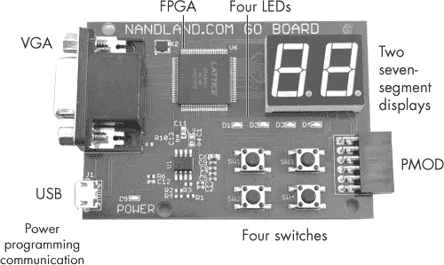

# 第五章：A FPGA 开发板

本附录列出了几款示例 FPGA 开发板，供你在本书的项目中使用。你可以编程的开发板是一个宝贵的学习工具。没有什么比让 LED 闪烁、按下按钮和与外部设备交互更令人满意了！你完全可以在不完成实际例子的情况下，从本书中学到很多内容。但要真正解锁它的价值，我建议你购买一款开发板，例如这里提到的设备，并通过物理硬件完成所有项目。

在第二章中，我们讨论了选择开发板的一些标准，包括完成本书项目所需的功能。特别是，我建议选择一款具有 Lattice iCE40 FPGA、USB 连接以及 LED、按钮和七段显示器等外设的开发板。这里介绍的开发板要么是现成符合这些要求，要么可以通过连接一些额外的外设来满足要求。当然，还有其他可用的开发板；你可以使用这些开发板，或将这些建议作为你自己研究的起点。

## Nandland Go 开发板

我在 2016 年通过一项成功的 Kickstarter 众筹项目创建了 Nandland Go 开发板（图 A-1），填补了市场上的一个空白：缺乏有趣、实惠且易于初学者使用的 FPGA 开发板。我设计了这款开发板，配备了许多外设，以便实现多种有趣的项目。Go 开发板具备完成本书所有项目所需的一切，无需任何修改。

图 A-1：Nandland Go 开发板

Go 开发板上的 FPGA 是 iCE40 HX1K，相较于现代的 AMD 和 Intel FPGA，虽然它比较小，但足够强大，可以在 VGA 显示器上创建 *Pong* 游戏。该开发板有四个 LED，四个按钮开关，两个七段显示器，一个 Pmod 接口，一个 VGA 接口，以及一个用于供电、编程和通信的 USB 接口。它的价格约为 65 美元，价格适中，可以让你尝试多种不同的项目，使用 Verilog 或 VHDL 编程。它可以通过 [*https://<wbr>nandland<wbr>.com*](https://nandland.com) 购买。

## Lattice iCEstick

Lattice 设计了 iCEstick FPGA 开发板，可以像 U 盘一样直接插入计算机的 USB 端口。它采用与 Go 开发板相同的 FPGA（iCE40 HX1K），但在内建外设方面略显有限。它有五个 LED， 一个 Pmod 接口，以及一个用于发送和接收红外数据的 IrDA 收发器。

截至本文写作时，iCEstick 的价格大约为 50 美元，可以直接从 Lattice 的官网购买（[*https://<wbr>latticesemi<wbr>.com*](https://latticesemi.com)）或通过电子元器件分销商如 Digi-Key（[*https://<wbr>digikey<wbr>.com*](https://digikey.com)）进行购买。要在本书的项目中使用此开发板，您需要使用 Pmod 连接器来扩展其功能。最低限度，我建议购买一个带有额外按钮输入的扩展板；例如，Digilent（[*https://<wbr>digilent<wbr>.com*](https://digilent.com)）出售一个带有四个按键开关的 Pmod 模块。

iCEstick 的 Pmod 连接器数量不足，无法同时与七段显示器和按钮模块连接，无法完成第八章中的状态机项目。然而，如果你想实现项目中的七段显示器部分，可以利用板边的 16 个通孔 I/O 连接器连接单个显示器。

## Alchitry Cu

Alchitry Cu 与 iCEstick 类似，都是相对简单的开发板，拥有单个 FPGA 和连接器，并且板载外设不多。不同之处在于，Alchitry Cu 提供了更多的连接器，因此可以连接更多外设。此外，它使用的是更大的 FPGA，iCE40 HX8K，拥有更多资源，适用于更大、更复杂的项目。

Alchitry Cu 可以与 Alchitry Io 扩展板配合使用，以扩展其功能：Io 直接安装在 Cu 的顶部，类似于 Arduino 扩展板，增加了 4 个七段显示器、5 个按键、24 个 LED 和 24 个开关。这是这里讨论的三个选项中最贵的一种；截至本文写作时，Cu 和 Io 的组合大约需要 85 美元。你可以在[*https://<wbr>sparkfun<wbr>.com*](https://sparkfun.com)购买这些开发板。

## 切换开发板

正如我在第二章中提到的，Verilog 和 VHDL 的优势在于它们是与 FPGA 无关的。你为一个开发板编写的代码可以很好地迁移到另一个开发板上，通常无需修改，前提是你没有使用特定设备的硬件 IP 特性，像第九章中讨论的那些特性。这样一来，开始使用低成本、易于使用的基于 iCE40 的开发板（如本书中描述的那些）进行 FPGA 学习，然后随着经验的积累，升级到更高级的开发板是非常自然的。你将能够将为第一个开发板开发的所有项目迁移到新的、更先进的开发板上，并且只需进行最小的修改。
