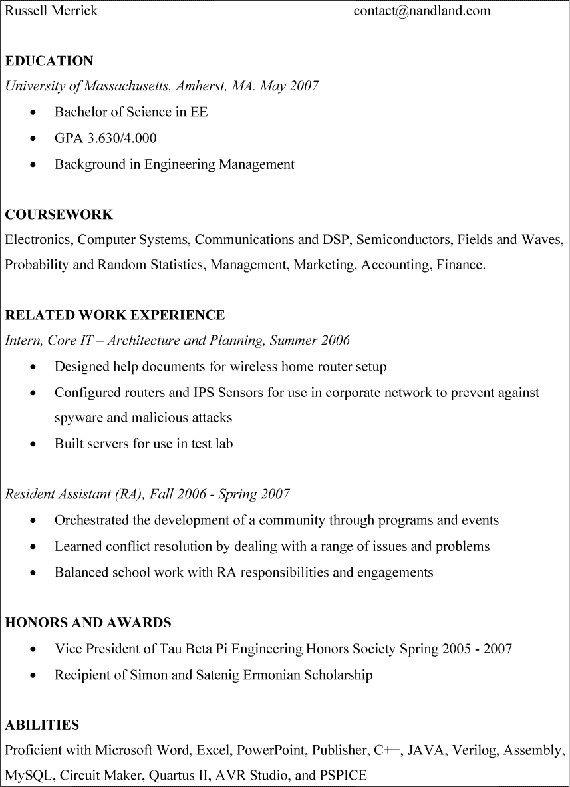
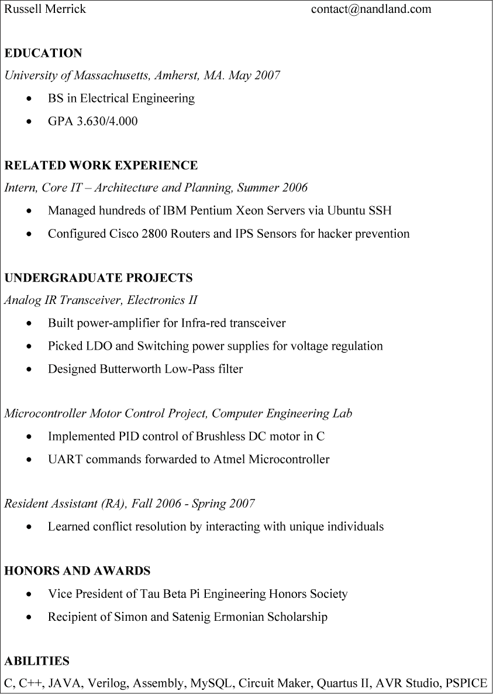

# 第六章：B FPGA 工程师职业生涯建议

也许这本书已经激起了你对 FPGA 设计的兴趣，甚至让你考虑将其作为职业生涯。与 FPGA 工作是一项真正充实的工作：你每天早晨醒来，都会解决有趣且相关的问题。就像设计 FPGA 需要实践一样，申请工作也是一种可以磨练的技能。本附录讨论了如何获得 FPGA 工程师好工作的策略。

我曾经站在求职过程的两个角度——既是面试者也是面试官，所以我总结了一些能帮助你找到令人满意工作的技巧，也了解雇主的需求。在本附录中，我将首先分享一些如何改善简历的建议，帮助你获得面试机会；然后是如何在面试中表现出色，提升获得工作的机会；最后，我们将讨论如何谈判以获得最优的聘用条件。

## 简历

简历的目的是让你进入面试的门槛。就是这么简单。一旦进入面试，简历的作用就完成了。在我的职业生涯中，我审阅了数百份简历，在尝试填补职位时，只有少数简历促成了面试。我们来探讨一些技巧，帮助你让简历脱颖而出。

### 保持简洁

一位优秀的工程师知道如何迅速展示什么是重要的，什么是不重要的。通过在简历中直奔主题来展示这一点。如果你工作经验少于五年，那么简历不应该超过一页。许多求职者认为更长的简历会显得更有经验，但在简历中填充无关内容只会适得其反。招聘人员一眼就能看出填充内容。例如，“与来自世界各地的团队协调，分担责任和任务”这样的句子实际上毫无意义。去除多余的部分，直奔重点。

与其包括空洞的套话，不如利用简历突出你的实际技能、成功经验和成就。如果你没有工作经验，那也没关系，但你需要通过其他方式展示你的资格。例如，描述你在本科课程中学到的具体技能和技术。如果你参与了一个大型项目并与团队合作，那么这个项目应该在简历中占有一席之地。

### 包括学术信息

许多公司要求工程学本科学位作为最低的工作资格，因此你的简历应该包含有关你教育背景的信息。然而，我最喜欢工程学的地方之一就是它非常讲究实绩。最重要的不是你上的是哪所学校，而是你的知识和能力。这意味着，如果你没有去过最著名的私立学校，也不必担心（即使你去了，也未必能让你如你预期的那样占据优势）。当我看简历时，我通常不太关注申请人上的是哪所学校。我更关心的是看到他们学到了什么，以及他们如何利用这些知识取得成就。

很多人常常想知道是否应该在简历中列出自己的 GPA。个人而言，如果 GPA 高于 3.0，我建议列出；如果低于 3.0，可以不列。一些公司确实有 GPA 要求（如果你的 GPA 没有列出，或者低于某个标准，他们甚至不会看你的简历），但近年来这种情况似乎变得不那么常见。招聘经理明白，成为一名成功的工程师并不总是与在哲学课上取得最高分相关。

如果你没有工程学本科学位，你的求职之路可能会更加艰难。不过并不是所有公司都有学位要求。特别是小公司，通常对最低要求会更加宽松。你可能通过强调你的实践经验来弥补缺乏相关教育背景的不足。一定要描述你参与的项目，展示你在该领域的掌握情况。

### 根据职位描述定制简历

职位描述详细列出了公司期望新员工承担的所有角色和责任。公司正在描述他们理想中的候选人，因此你应尽可能通过简历体现这些理想。这意味着你应该准备根据每个职位申请的要求来调整简历。突出与公司需求相匹配的部分，并考虑删除不太相关的内容。包括相关的流行词汇和你有经验的特定技术。尤其是缩写，特别引人注目，能吸引眼球。

从招聘经理的角度考虑你的简历。职位描述是他们寻找的要素清单。不要让他们难以找到这些要素。简历中出现的职位描述关键词越多，越好。然而，请记住，在面试时，你应该能够通过详细的知识支持简历中写的任何内容。没有什么比在面试中证明你在简历上做了虚假陈述更糟糕的了。

为了说明如何量身定制简历，假设你的大部分经验都在 Verilog 中，但你也了解 VHDL。一份 FPGA 职位的招聘描述通常会说明公司使用的语言。如果你遇到一份要求 VHDL 的工作，你应该调整简历，突出你在 VHDL 方面的项目。甚至可能值得将一些 Verilog 代码转换为 VHDL，以提升你的技能。另一个例子是，公司可能需要有图像处理经验的人。在这种情况下，你应该在简历中增加一项，列出你在该领域的任何工作。相反，如果职位来自一个无线产品公司，重点突出你在无线通信方面的经验。确保你在突出技能时具体明确：“具有 BLE 通过 UART 的 FPGA 经验”要比“从事过无线通信”更好。

### 批评一个示例简历

让我们看一下一个名为 Russell Merrick 的应届大学毕业生的简历，看看可以改进的地方。图 B-1 展示了我申请大学毕业后第一份工作的实际简历。

图 B-1：示例简历

这并不是特别糟糕，但回头看，显然还有很大的改进空间。最大的问题是没有足够的技术内容或引人注目的流行词。我在大学时学到了很多关于工程的知识，但从这份简历来看，你是看不出来的。我没有包含任何展示我经验的具体项目细节；我做的只是列出我所上的课程名称。此外，我还详细描述了与我申请的工作无关的非工程类工作。让我们来改进一下。

首先，我们可以从教育部分删除“工程管理背景”。当时，我认为完成了一些管理课程会是一个资产，但我很快意识到，作为一名初级员工，你处于金字塔的底层。没有人需要管理，因此你的领导能力不具相关性。将来某一天你可能会晋升，拥有下属，但那肯定不是我当时申请的职位所能实现的。以同样的方式，我会从课程部分删除“管理、市场营销、会计、财务”。这些对一名初级 FPGA 工程师来说并不相关。

在相关工作经验部分，我描述了我在信息技术（IT）领域的一次短期实习。这对我来说是一次宝贵的经验，因为它让我学到了一项重要的教训：我不想从事 IT 工作！在这里，使用更多的流行词和具体细节会很有帮助。例如，我曾与 Linux 计算机和思科路由器一起工作，但我并没有在简历上写这些。

另一项工作经验，关于我作为 RA（研究助理）的经历，可以精简一下。它太长了，并且与 FPGA 工作没有特别的相关性。能力部分也可以删减。现在大家都认为求职者能使用 Microsoft Word，所以不需要包括这一项。通过这些删减，会腾出更多空间来突出我在学位课程中所做的一些技术项目。

现在让我们来看一下改进版的简历。图 Figure B-2 中的版本实施了这些建议的修改。

图 B-2：改进后的简历示例

这个修订版大大改进了。我增加了一个部分，详细描述了我参与的几个项目，通过具体示例展示我在大学期间学到的东西。在描述这些项目时，我列举了我使用过的许多具体技术，比如 UART、PID、LDO、IR 等。像这样的缩写词有助于吸引招聘经理的注意。我还删除了一些过于笼统的内容，同时在其他部分变得更加具体，比如描述我的 IT 实习经历。凭借这个新的改进版简历，过去的 Russell 可能能得到更多的面试机会！

## 面试

你的简历是为了让你有机会进入面试，但面试才是你真正需要表现出色的地方，才能超越竞争者，获得这份工作。面试实际上就是一个口试，像所有考试一样，准备充分会有帮助。你应该练习本节中的建议，直到你感到自如为止。尽管这可能会让你感到有些尴尬，但找一个朋友或亲戚和你一起练习这些技巧。与他人一起大声练习，远比自己在脑海里默默练习效果好得多。

### 展示你的热情

除了证明你的技术资质，面试还是一个展示你对当前职位热情的机会。为此，提前了解公司是非常有帮助的。确保你了解公司的产品，以及他们所在行业的整体情况。这样，你就可以通过展示你对公司的参与程度和对公司面临问题的了解，给面试官留下深刻印象。你甚至可以提出一些关于解决这些问题的想法！

在面试前直接联系公司的人也从不吃亏。你可能会认为这样做会让公司招聘人员感到烦恼，但实际上，他们很难分辨出哪些简历是那些仅仅回应他们遇到的每一条招聘广告的人提交的，哪些简历是那些真正对具体职位感兴趣的人。我曾有求职者通过 LinkedIn 或电子邮件直接联系我，每次遇到候选人采取这样的额外步骤时，我总是印象深刻。这表明他们真的对这份工作感兴趣，并且有决心实现自己的目标。

我遇到过的最有干劲的候选人，实际上是为了进入我的公司工作而开始了一个关于太空行业的播客。他写了、编辑了并发布了十几集节目，就为了能得到一个面试机会。我并不是建议你也要创建一个播客来找到梦想公司的工作，但只要知道，没人会因为过度的热情而被拒绝。

### 预见问题

在准备面试时，预测可能会被问到的问题非常有帮助。我推荐的第一件事就是回顾职位描述。描述中提到的主题最有可能在面试中出现，因为这些是招聘经理对该职位最感兴趣的内容。你可能没有每个描述中提到的领域的经验，这完全没问题。然而，我建议你做些研究，了解一些你不熟悉的主题，这样在讨论时至少有一些背景知识。如果你在简历上标明的技能是你擅长的内容，确保你能流利地讲解。

职位描述通常是一个很好的起点，但如果你想要更多的准备方法，以下是一些常见的 FPGA 相关职位面试问题：

+   描述触发器和锁存器之间的区别。

+   为什么你会选择 FPGA 而不是微控制器？

+   在可综合代码中，for循环的作用是什么？

+   PLL 的作用是什么？

+   描述推断与实例化之间的区别。

+   什么是亚稳态，如何防止它？

+   什么是 FIFO？

+   什么是块 RAM？

+   描述 UART 如何工作，它可能在哪里使用？

+   同步逻辑和异步逻辑之间有什么区别？

+   什么是移位寄存器？

+   描述 Verilog 与 VHDL 之间的一些区别。

+   在跨时钟域时你需要关注什么？

+   描述设置时间和保持时间。如果违反了这些要求会发生什么？

+   合成工具的作用是什么？

+   在布局与布线过程中会发生什么？

+   什么是 SerDes 收发器，它们在哪里使用？

+   DSP 块的作用是什么？

如果我面试一个初级 FPGA 职位的候选人，我一定会问这些类型的问题。好消息是，这些问题在本书中都有答案。所以，赶快复习，准备好迎接面试吧！

### 转折

当你不知道问题的答案时，我建议你通过提供一些你*确实*知道的相关信息来转移话题。例如，假设你只有使用 SVN 进行版本控制的经验，从未使用过 Git。如果面试官问，“你如何在 Git 中创建分支？”不要直接回答，“我不知道，我从未使用过 Git。”这个回答是不够的。你可以这样说：“嗯，我还没有使用 Git 进行版本控制，但在 SVN 中，我使用分支来跟踪独立的开发线——例如，当我修复一个 Bug 或添加一个新特性时。在 SVN 中，这可以通过命令SVN COPY来完成。”

这是一个很棒的回答。尽管面试官没有得到他们所期望的信息，但你已经展示了你理解分支的目的，并且有相关经验。面试官知道你不可能知道所有答案，而且新的工具和技能可以在工作中学到。即使你不能给出完整的答案，也要抓住机会解释你对提问问题的理解。

## 工作邀请与谈判

到此为止，你已经击败了竞争对手，招聘经理决定向你提供工作邀请。恭喜你，你现在是一名专业工程师了！是时候庆祝一下了。然后，等你冷静下来后，我总是建议你要求更好的报价。你可能会想，“但是，拉塞尔，那不是很不知足吗？我应该为得到任何一个邀请而高兴。如果我要求他们提高条件，他们会不会撤回我的邀请？”

这是你可以从这本书中获得的一个人生经验：*问问看总是没坏处*。入住酒店？问问看他们是否有房间升级。想从商店买贵重物品？问问看他们是否有可用的优惠券或折扣。收到了第一份工作邀请？问问看他们是否能提高薪资、股票期权或签约奖金。只要你礼貌专业，公司绝不会收回工作邀请，但每次我向公司要求更好的待遇时，他们都会答应。人力资源部门绝不会一开始就给出最优的报价。他们预期谈判是过程的一部分。他们希望以尽可能低的薪水聘请你（当然，不会侮辱你）。他们总是会留下些钱，但能不能拿到这些钱就看你自己了。所以要保持礼貌，但也不要害怕问他们是否能提高报价。

## 总结

我写这本书的目标是传播我在工程师职业生涯中积累的知识。我希望这本书能帮助你提升 FPGA 技能，成为世界级的表现者。当你成功时，发个消息告诉我。你可以的！
