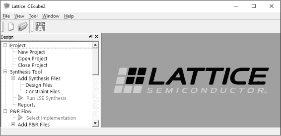
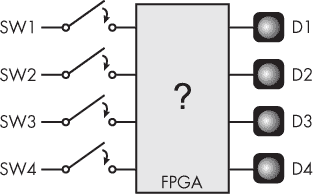
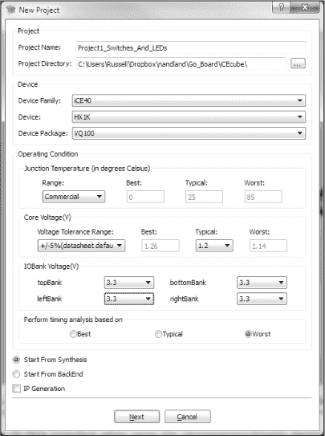
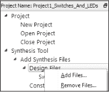
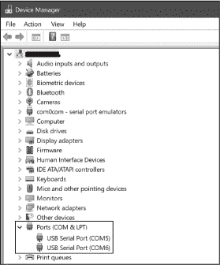
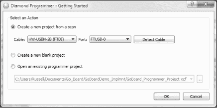
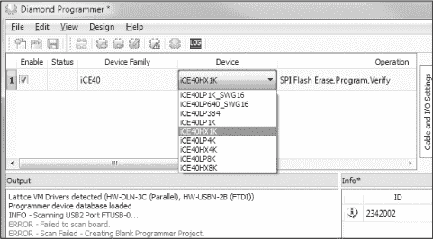
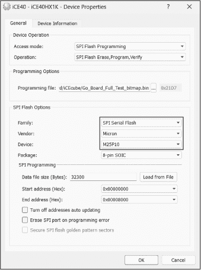
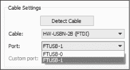

# 第七章：2 设置你的硬件和工具


本章将引导你完成选择 FPGA 开发板的过程，并设置相关的软件工具，这些工具将帮助你将 Verilog 或 VHDL 代码转换为 FPGA 上的物理电路。你将了解在选择开发板时需要关注的特性，下载并安装你需要的工具，并通过设计你的第一个 FPGA 项目来进行测试，以便在开发板上运行。这个项目还将为你提供 FPGA 开发过程的主要步骤概述。

使用这本书并不严格要求你拥有 FPGA 开发板。即使没有开发板，你仍然可以通过项目进行学习，而且你总是可以通过像 EDA Playground 这样的免费在线 FPGA 模拟器工具来测试你的 Verilog 或 VHDL 代码（这一主题将在第五章中讲解）。然而，编写一些代码，将其编程到开发板上，并看到结果付诸实践——即使只是像闪烁一个 LED 这样简单的功能——这总是令人满意的。因此，我强烈建议你在学习 FPGA 时拥有一块开发板。

## 选择 FPGA 开发板

FPGA 开发板（或 *开发板*）是一块带有 FPGA 的印刷电路板（PCB），可以让你用 Verilog 或 VHDL 代码对 FPGA 进行编程并进行测试。该开发板可能还会有连接到 FPGA 的外设，如 LED、开关和用于将 FPGA 与其他设备连接的接口。FPGA 开发板的价格从不到 100 美元的口香糖大小设备到几千美元的笔记本大小设备不等。由于选择范围如此广泛，选择开发板时有许多因素需要考虑，包括价格、易用性和乐趣：

**成本**

对于 FPGA 初学者，我建议从一块价格便宜的开发板开始。更大、价格更高的开发板通常具有许多额外的功能，如 SerDes 和 DDR 内存，这些对于新手来说并不必要，而且可能会让人感到困惑。随着你的技能提高，你可以随时投资购买这些更先进的开发板，并逐步超越你的第一块开发板。

**简易性**

你开始使用的开发板和所需的软件应该简单易用。了解 FPGA 的工作原理已经足够具有挑战性；如果还需要学习如何使用复杂的设计工具，过程将变得更加困难。我推荐关注基于 Lattice Semiconductor 的 iCE40 系列 FPGA 的开发板，因为这些 FPGA 与一套轻量且简单的软件工具兼容：iCEcube2 和 Diamond Programmer。这些程序经过简化，能够完成构建 FPGA 所需的最低要求，而不包含更高级程序中的繁杂功能。本章将教你如何使用这两款工具。

**乐趣**

FPGA 开发板应该易于使用，配备如 LED、按键和七段显示器等外设，以便你在不同的项目中加以利用。有些价格较便宜的开发板通过去除外设来削减成本，它们仅有一个 FPGA，没有其他功能。能将 FPGA 与其他设备连接，进行更多有趣的互动，能让 FPGA 开发变得更加有趣。

在考虑市面上的开发板时，记得牢记以下因素。

## 本书要求

如果你能跟随项目一起进行并编程自己的开发板，那么你将从本书中获得最大的价值。为了准确地按照书中的方式完成项目，你需要确保开发板具备以下特点（附录 A 列出了几款满足这些要求的开发板，或者经过一些修改后能满足要求的开发板）：

**Lattice iCE40 FPGA**

iCE40 FPGA 已成为 FPGA 初学者的最佳选择。它们已经推出多年，价格适中，同时提供足够的资源来支持有趣的项目。iCE40 架构相对简单，功能不会过于复杂，因此你可以专注于重要的内容。正如我之前提到的，iCE40 FPGA 兼容免费且易用的 iCEcube2 和 Diamond Programmer 软件工具，本章我们将一一探索这些工具。iCE40 系列还兼容开源 FPGA 工具，如果你希望完全避免使用专有软件，也可以选择这些工具。

**USB**

你的开发板应该配备 USB 接口，以便为板子供电并进行编程。这样，你只需要一根 USB 数据线就可以开始使用了。较旧的 FPGA 开发板通常需要外接编程器（一个独立的硬件设备，可能需要数百美元），所以确保你选择的开发板能够支持简单的内建 USB 编程。

**LED**

本书的项目假设你的开发板上有四个 LED。这些 LED 是从 FPGA 获取输出的便捷方式。例如，本章的第一个项目将涉及点亮这些 LED，这样你就能立即得到反馈，确认你已成功编程 FPGA。没有什么比看到第一个 LED 点亮更令人满足的了！

**开关**

对于每个 LED，你需要一个相应的按键开关。这些开关为 FPGA 提供输入，使你能够轻松地改变开发板的状态。

**七段显示器**

你的开发板需要一个七段显示器来实现第八章中的记忆游戏项目。这种显示器提供了一种有趣的输出数据方式。点亮单个 LED 是一回事，但在七段显示器上显示数字和字母则要更有趣得多。

如果你的开发板不符合所有这些要求，也不用担心：你仍然可以通过做一些调整来完成本书的项目。例如，如果你更愿意使用基于另一种 FPGA 的开发板，你是可以的。正如我们在后面的章节中将讨论的那样，不同的 FPGA 具有不同的高级功能，但本书项目的代码足够通用，应该可以在任何现代 FPGA 上运行。这也是 Verilog 和 VHDL 的魅力之一：它们与 FPGA 无关。

但需要注意的是，如果你不是在使用 iCE40 FPGA，你将需要使用与本章讨论的不同的软件工具。每个 FPGA 厂商提供的工具都是专门为其 FPGA 设计的。例如，AMD（赛灵思）有 Vivado，Intel（阿尔特拉）有 Quartus。如果你的开发板使用了其中某家公司的 FPGA，可以在线查找关于使用相应软件的资源。

如果你没有本书项目所需的所有外设，你有几个选择。首先，你可以修改项目的 Verilog 或 VHDL 代码，使用更少的 LED 和开关。大多数情况下这样做是可行的，尽管如果你减少了 LED 和开关的数量，第八章中的记忆游戏项目可能就不那么令人满意了。

另外，许多 FPGA 开发板，包括附录 A 中讨论的一些开发板，都有用于连接外部外设的接口点。特别是，寻找带有 Pmod（外设模块）连接器的开发板。Pmod 是一个标准连接器，由 Digilent 公司使其广为人知，用于连接带有额外外设的附加板——不仅仅是本书中使用的外设，还包括温度传感器、加速度计、音频插孔、microSD 卡等设备。如果你曾经使用过 Arduino Shields，它们的概念是一样的。如果你的开发板有 Pmod 连接器，那将大大扩展你可以用 FPGA 进行的项目范围。

## 设置你的开发环境

要在你的开发板上使用 iCE40 FPGA，你需要在计算机上安装两个软件工具：iCEcube2 和 Diamond Programmer。这些来自 Lattice Semiconductor 的免费工具是专门为 iCE40 FPGA 设计的。本节将指导你完成这些工具的安装过程。如果你是 Windows 用户，将会最为方便，因为这些工具是为 Windows 操作系统设计的。对于 Linux 或 macOS 用户，我建议在你的计算机上创建一个 Windows 虚拟机，然后在其中运行 Lattice 工具。网上有许多关于如何使用 VirtualBox 或类似产品创建 Windows 虚拟机的教程。

### iCEcube2

iCEcube2 是 Lattice 提供的免费集成开发环境（IDE），可以将你在计算机上编写的 VHDL 或 Verilog 代码转换成 FPGA 可编程的文件。它比其他 IDE（如 Vivado、Quartus，甚至 Lattice Diamond 工具，后者用于处理更复杂的 FPGA）更易于使用。它与 iCEcube2 的兼容性是 iCE40 FPGA 成为初学者特别好选择的原因之一。其他这些程序的体积都在几个 gigabytes 以上，而且非常复杂。它们有许多功能，大多数在刚开始时你并不需要。相反，iCEcube2 更加简洁，是学习 FPGA 的更直接的工具。

要下载并安装 iCEcube2，请按照以下步骤操作：

1.  访问 [*https://<wbr>latticesemi<wbr>.com<wbr>/icecube2*](https://latticesemi.com/icecube2) 或在网上搜索 “iCEcube2 download”。

2.  找到 iCEcube2 最新版本的 Windows 下载链接，无论你是直接使用 Windows 还是在虚拟机中使用。如果你是 Linux 用户，你可能会想下载 Linux 版本，但我不建议这样做。该版本存在一些漏洞，可能会成功，也可能不会。

3.  当你点击下载链接时，系统会要求你在 Lattice 网站上创建一个账户。你必须创建账户才能获取此工具的许可证。确保使用真实的电子邮件地址，因为他们会通过邮件将免费许可证发送给你。一旦创建了账户，你应该能够下载该软件。

4.  在软件下载的同时，找到下载页面上的 **iCECube2 Software Free License** 链接，点击它来请求许可证。

5.  你需要计算机的 MAC 地址来获取许可证。要在 Windows 上找到它，点击开始按钮并搜索“cmd”来打开命令提示符。然后在命令行中输入 ipconfig /all。你应该会看到类似这样的信息：

```
C:\> **ipconfig /all**
`--snip--`
Ethernet adapter Local Area Connection:
   Connection-specific DNS Suffix  . :
   Description . . . . . . . . . . . : Intel(R) Ethernet Connection I217-V
   Physical Address. . . . . . . . . : 38-D3-21-F5-A3-09
   DHCP Enabled. . . . . . . . . . . : Yes
   Autoconfiguration Enabled . . . . : Yes
```

6.  你的 MAC 地址是紧挨着 物理地址 的 12 位十六进制数字。将其复制到 Lattice 许可证请求表单中并提交，以便将许可证文件发送到你的电子邮件地址。

7.  下载完成后，启动 iCEcube2 安装程序，并指向你的许可证文件。

注意

*如果你在获取许可证之前已安装了 iCEcube2，可以使用位于工具安装文件夹中的程序* LicenseSetup.exe *来指向你的许可证文件。*

安装完成后，启动 iCEcube2。主窗口将类似于 图 2-1。



图 2-1：iCEcube2 主窗口

四处点击以熟悉程序的使用。我们将在本章的后续部分通过一个项目深入探索，带你完成整个 FPGA 构建过程。

### Diamond Programmer

Diamond Programmer 是 Lattice 提供的免费独立编程工具，它接收 iCEcube2 的输出，并通过开发板的 USB 连接编程你的 FPGA。像 Vivado 和 Quartus 这样的更复杂的软件工具有内置的编程器，因此你不需要单独下载程序。遗憾的是，iCEcube2 并未内置编程器，但这就是 iCE40 FPGA 设计师的生活！以下是如何安装 Diamond Programmer：

1.  访问 [*https://<wbr>latticesemi<wbr>.com<wbr>/programmer*](https://latticesemi.com/programmer) 或在互联网上搜索“lattice diamond software”来找到下载页面。

2.  Diamond Programmer 页面有多个下载链接可供选择。找到并点击 Windows 版 64 位的 Programmer Standalone 最新版本的链接。

警告

*请确保下载 Programmer Standalone 而不是 Programmer Standalone Encryption Pack。后者是不需要的。*

3.  Diamond Programmer 不需要许可证，因此下载后只需运行安装程序即可。

现在你已经准备好开始你的第一个 FPGA 项目，在这个项目中，你将学习如何使用这些工具并编程你的 FPGA。

## 项目 #1：开关与 LED 的连接

在这个项目中，你将通过创建一个简单的 FPGA 设计来熟悉构建过程：当你按下 FPGA 开发板上的某个按钮开关时，某个 LED 应该点亮。该项目假设你有四个开关和四个 LED，因此你需要设计和编程 FPGA，将每个开关与一个 LED 相连。（如前所述，如果需要，你可以调整项目使用更少的开关和 LED。）图 2-2 显示了我们要实现的目标示意图。



图 2-2：项目 #1 方框图

在左侧是板上的四个开关，标记为 SW1 到 SW4。默认情况下，这些开关将是打开状态（未连接），这意味着当开关未被按下时，FPGA 的对应输入引脚将有低电压，因为板载有下拉电阻。当你按下一个开关时，FPGA 将看到连接到该开关的输入引脚上有高电压。在输出侧，我们有四个 LED，标记为 D1 到 D4。我们希望创建一个 FPGA，使得例如当用户按下 SW1 时，D1 LED 会点亮。我们将实际创建一个物理连接，将 SW1 输入和 D1 输出连接起来，使用我们的 FPGA。换句话说，通过 FPGA，你在如此低的层级编程，实际上是为引脚之间创建了连接线，贯穿整个设备。

为了实现这个项目，我们将经过四个主要步骤。这些步骤在图 2-3 中做了总结，构成了 FPGA 构建过程的主要阶段。


图 2-3：FPGA 构建过程

你将在这个项目中对这些步骤有一个大致的了解。然后，在全书中，你将进一步扩展对每个步骤的认识。这四个步骤是：

1. **设计（Design）**。在这一步，你编写描述 FPGA 如何工作的 Verilog 或 VHDL 代码。你可能还会编写测试，确保你的代码按预期工作，这一概念我们将在第五章中讨论。

2. **综合（Synthesis）**。综合过程是将你的代码转化为在 FPGA 上执行实际功能的低级组件。这类似于编程语言（如 C 语言）中的编译器将你的 C 代码转换为汇编指令。在本书中，我们将使用 iCEcube2 作为综合工具。

3. **布局与布线（Place and route）**。这个过程将把你综合后的设计映射到你特定 FPGA 的物理布局上。它将布线（route）组件之间的连接，包括将输入输出引脚连接到 FPGA 内部组件。创建引脚和信号之间链接的一个重要目的就是*物理约束文件*。你将在这个项目中看到如何编写约束文件。iCEcube2 在处理综合的同时，也会处理布局与布线的步骤。

4. **编程（Programming）**。在这一步，你将把前一步的输出加载到实际的 FPGA 中。编程文件实际上在引脚和 FPGA 组件之间，以及 FPGA 内部，创建了连接。这个项目将仅创建引脚之间的连接线，但在未来的项目中，我们还将使用其他 FPGA 组件。编程步骤在 Diamond Programmer 中进行。

本书中的所有项目都将遵循相同的基本过程。当你进行后续项目时，如果需要复习如何使用 iCEcube2 和 Diamond Programmer，可以回顾本节内容。

### 编写代码

让我们设计一个 FPGA，用 Verilog 或 VHDL 将开关输入连接到 LED 输出。希望到这个时候你已经选择了想要学习的语言；我建议现在专注于学习一种，但你也可以稍后学习另一种。本书中的所有代码示例都以两种语言展示，所以你也可以进行对比和对照。

我成功地在 Visual Studio Code (VS Code) 中编写了 FPGA 代码，VS Code 是微软提供的一款免费的工具。你可以下载扩展插件，使其支持 Verilog 或 VHDL 语法高亮及其他实用功能，例如直接从代码编辑器连接到 GitHub 仓库。你也可以直接在 iCEcube2 中编写代码，但我不推荐这样做，因为它不支持语法高亮。

无论你选择什么工具，输入以下 Verilog 或 VHDL 代码并将其保存在电脑中。请记住文件名和位置，因为稍后会用到。书中的所有代码也可以在本书的 GitHub 仓库中找到，[*https://<wbr>github<wbr>.com<wbr>/nandland<wbr>/getting<wbr>-started<wbr>-with<wbr>-fpgas*](https://github.com/nandland/getting-started-with-fpgas)。

Verilog

```
❶ module Switches_To_LEDs
❷  (input  i_Switch_1,
  input  i_Switch_2,
  input  i_Switch_3,
  input  i_Switch_4,
❸ output o_LED_1,
  output o_LED_2,
  output o_LED_3,
  output o_LED_4);
❹ assign o_LED_1 = i_Switch_1;
  assign o_LED_2 = i_Switch_2;
  assign o_LED_3 = i_Switch_3;
  assign o_LED_4 = i_Switch_4;
endmodule
```

VHDL

```
library ieee;
use ieee.std_logic_1164.all;
❶ entity Switches_To_LEDs is
  port (
  ❷ i_Switch_1 : in std_logic;
     i_Switch_2 : in std_logic;
     i_Switch_3 : in std_logic;
     i_Switch_4 : in std_logic;
  ❸ o_LED_1    : out std_logic;
     o_LED_2    : out std_logic;
     o_LED_3    : out std_logic;
     o_LED_4    : out std_logic);
end entity Switches_To_LEDs;
architecture RTL of Switches_To_LEDs is
begin
❹ o_LED_1 <= i_Switch_1;
   o_LED_2 <= i_Switch_2;
   o_LED_3 <= i_Switch_3;
   o_LED_4 <= i_Switch_4;
end RTL;
```

让我们广泛地考虑一下这段代码的结构，因为我们所有的项目都将遵循相同的基本格式。FPGA 的设计被封装在一个或多个 *模块*（在 Verilog 中）或 *实体*（在 VHDL 中）中。这些模块/实体定义了代码块的接口。接口包含信号，这些信号可以是输入或输出。在 FPGA 的最高层次，这些信号将连接到设备上的物理引脚，从而创建与其他组件（如开关和 LED）的接口。

在 Verilog 中创建一个模块时，你需要使用 module 关键字，并提供一个描述性的名称——在这个例子中是 Switches_To_LEDs ❶。在模块内部，首先要声明所有的输入 ❷ 和输出 ❸ 信号，这些信号放在一对括号中。接下来是你希望模块执行的代码，我们稍后会详细讨论，最后是 endmodule 关键字。

查看 VHDL 版本时，首先你可能会注意到它比 Verilog 版本稍长。这是典型现象；与 Verilog 相比，VHDL 通常需要更多的输入来完成相同的任务。额外的长度主要出现在代码的最开始部分，在这里我们指定了将使用的 VHDL 库和包。在这种情况下，我们使用来自 ieee 库的 std_logic_1164 包。我们需要这个包来访问 std_logic 数据类型，它通常用来表示 FPGA 中的二进制值（0，1）。你需要习惯在每个 VHDL 设计中包含这个库和包。

在 Verilog 中，你声明输入和输出，并将模块的实际逻辑编码在同一个代码块中；而在 VHDL 中，你会用两个独立的代码块来完成这些操作。这是 VHDL 版本较长的另一个原因。首先，你使用 entity 关键字声明 VHDL 实体❶，为其命名并指定输入❷和输出❸。然后，在一个独立的代码块中，你使用 architecture 关键字声明实体的 *架构*，这是定义实体功能的代码。你几乎总是会在一个 VHDL 文件中使用一个实体/架构对，实体描述输入/输出接口，而架构描述功能。

现在我们已经讲解了代码的结构，让我们来看一下具体内容。在 Verilog 和 VHDL 版本中，我们都定义了对应于四个开关的四个输入信号❷：i_Switch_1、i_Switch_2、i_Switch_3 和 i_Switch_4。在 Verilog 中，这些输入默认定义为 1 位宽（单个 0 或 1），而在 VHDL 中，我们明确地将它们定义为 std_logic，这是一种 1 位宽的数据类型。我们同样定义了四个输出：o_LED_1、o_LED_2、o_LED_3 和 o_LED_4，对应四个 LED ❸。注意，我喜欢在输入信号名称前加上 i_，在输出信号名称前加上 o_。这样可以帮助我跟踪每个信号的方向。

注意

*你可以按任意顺序定义输入和输出，但通常习惯先定义输入。*

最后，我们通过*分配*输入和输出来定义设计的逻辑——实际上执行工作的代码❹。例如，我们将输入i_Switch_1的值分配给输出o_LED_1。当 FPGA 构建完成后，这将创建这两个引脚之间的物理连接。在 Verilog 中，我们使用assign关键字，并需要使用=进行实际的信号分配。在 VHDL 中，我们只需使用<=赋值符号，即可在输入和输出之间创建连接线。

### 创建新 iCEcube2 项目

完成编码后，就可以将设计导入到 iCEcube2 中进行构建。打开 iCEcube2，选择**文件****新建项目**。系统会弹出一个窗口，要求输入有关 FPGA 板的信息，如图 2-4 所示。我们先来查看这个窗口中的设置。



图 2-4：iCEcube2 新建项目窗口

对于项目名称，给你的项目取一个名字；对于项目目录，选择你希望将项目保存到计算机的位置。接下来，你需要告诉工具你使用的是哪款 FPGA。工具需要知道 FPGA 的资源数量、引脚分配以及如何工作，才能正确地将你的代码转化为与你的特定设备兼容的格式。为此，选择**iCE40**作为设备系列，从设备和设备封装下拉框中选择你 FPGA 的具体设备名称和封装。例如，如果你使用的是 Nandland Go 板（附录 A 中讨论的板之一），你会选择 HX1K 作为设备，VQ100 作为封装，然后在 topBank、leftBank、bottomBank 和 rightBank 下拉框中选择 3.3。这表示所有引脚的电压为 3.3 伏特。窗口中的其他设置可以保持默认。完成后，点击**下一步**。

注意

*你将在每个项目中使用这些相同的设置，因此每次创建新项目时，你可以参考这一部分内容。*

系统将带你进入另一个对话框，提示你添加之前创建的 Verilog 或 VHDL 源文件。你可以添加文件，或者点击**完成**跳过此步骤。如果你选择跳过文件添加，可以稍后通过展开 iCEcube2 主项目窗口左侧的综合工具菜单，右击设计文件，选择添加文件，如图 2-5 所示。



图 2-5：将 Verilog 或 VHDL 源文件添加到你的项目中

此设计文件菜单还允许在项目创建后向现有项目添加额外文件，或删除和替换先前添加的文件。

### 添加引脚约束

构建过程中的下一步是将引脚约束添加到你的项目中。这些约束在*.pcf（物理约束文件）*文件中声明（有时称为引脚约束文件），它们告诉工具你在 Verilog 或 VHDL 代码中的哪些信号将连接到 FPGA 上的哪些物理引脚。这些信息对构建过程中的布局与布线阶段至关重要，在该阶段，综合过程的输出将映射到 FPGA 上的物理资源。工具需要知道哪些引脚连接到开关和 LED，以便将设计中的所有连线路由到它们需要去的地方。

每个 FPGA 制造商都有自己的约束编写关键字。要声明 Lattice iCEcube2 的引脚约束，你需要使用 set_io 关键字，后跟设计中信号的名称，然后是 FPGA 上对应的引脚号。以下是该项目的物理约束文件的示例，但请记住，实际的引脚编号将根据你的开发板有所不同。例如，这些引脚编号适用于 Nandland Go 开发板：

```
# LED pins:
❶ set_io o_LED_1 56
set_io o_LED_2 57
set_io o_LED_3 59
set_io o_LED_4 60
# Push-button switches:
set_io i_Switch_1 53
set_io i_Switch_2 51
set_io i_Switch_3 54
set_io i_Switch_4 52
```

每一行将我们代码中的一个信号映射到 FPGA 上的一个引脚。例如，我们将 Verilog/VHDL 信号o_LED_1设置为连接到 FPGA 上的引脚56 ❶。你在物理约束文件中使用的信号名称必须与 Verilog/VHDL 代码中的信号名称完全匹配。如果名称不匹配，工具将不知道哪个信号连接到设备上的哪个物理引脚。

注意

*请注意，物理约束文件中的注释前面有一个#符号——这是一个井号、磅号或标签，具体取决于你的年龄。*

在设置引脚约束时，你需要查看 FPGA 开发板的参考原理图。该原理图包含电路板的接线图，告诉你 FPGA 的哪个引脚连接到哪个 LED、按钮、连接器引脚或其他设备。学习如何阅读这些基本的原理图信息是 FPGA 设计师的关键技能，因为设置引脚约束是常见的任务。

要将物理约束文件添加到项目中，在 iCEcube2 项目窗口左侧菜单中找到 P&R 流程部分，展开 **添加 P&R 文件**，右键点击 **约束文件**，然后点击 **添加文件**，选择你的 *.pcf* 文件。完成后，你将看到该文件列在约束文件下。

忘记添加物理约束文件是使用 FPGA 时常见的错误。如果没有添加该文件，工具不会给你任何警告。它们会将你代码中的信号随机连接到设备上的引脚，这几乎肯定是错误的，导致你的设计无法按预期工作。

### 运行构建

现在你已经准备好在 iCEcube2 中运行构建了。为此，只需点击 **工具****全部运行**。这将执行综合、布局与布线的过程，创建你将用来编程 FPGA 的 FPGA 映像文件。iCEcube2 会为每个步骤生成报告，可以在报告部分查看。你可以随意查看这些报告，了解它们包含了哪些信息；我们将在后续章节中详细探讨。

### 连接你的开发板

现在你需要将开发板连接到电脑，以便编程 FPGA。花一点时间确保这个连接正常，并且电脑能识别设备。拔掉开发板后，打开 Windows 中的设备管理器，并展开“端口（COM 与 LPT）”部分。然后通过 USB 插入开发板。你应该会看到两个标记为“USB 串口 (COM*X*)”的设备，如 图 2-6 所示。具体的 COM 端口编号不重要。如果一切正常，那说明你的开发板已成功连接到电脑，你可以开始工作了。



图 2-6：在设备管理器中查看开发板连接情况

如果在设备管理器中没有看到 USB 串口，可以尝试以下几种故障排除方法。首先，检查开发板上是否有电源指示灯，用于显示电源是否开启。如果有，但指示灯没有亮起，说明没有供电，请检查 USB 电缆是否已牢固插入开发板和电脑。如果指示灯 *亮着*，那么下一个最可能的问题就是 USB 电缆本身。一些 Micro-USB 电缆仅支持“充电”，即没有传输数据的线缆。请更换一条你知道可以正常进行数据传输的电缆。

### 编程 FPGA

过程的最后一步是使用 Diamond Programmer 将设计编程到 FPGA 中。FPGA 开发板通常配备一个集成电路，将其 USB 连接转为 SPI 接口，Diamond Programmer 使用该接口对安装在板上的闪存芯片进行编程。完成后，FPGA 将从闪存启动，你将看到努力的成果！

在连接好开发板后，打开 Diamond Programmer 开始操作。你将看到如图 2-7 所示的对话框。点击**确定**以创建新项目。



图 2-7：Diamond Programmer 对话框

一旦点击确定，工具将尝试扫描开发板并自动识别连接的 FPGA。这将失败。没关系；我们可以从下一个界面手动告诉 Diamond Programmer 目标 FPGA，具体内容如图 2-8 所示。



图 2-8：Diamond Programmer 设备选择界面

将设备系列设置为**iCE40**，并从设备下拉框中选择你的具体 FPGA，如图 2-8 所示。接下来，双击操作字段下的内容。你将看到一个新窗口，如图 2-9 所示。请注意，你可能需要将访问模式更改为 SPI 闪存编程，以查看此处显示的内容。



图 2-9：Diamond Programmer 设备属性窗口

这个窗口让你可以告诉 Diamond Programmer 如何编程 FPGA。在设备操作部分，将访问模式设置为**SPI 闪存** **编程**。对于 SPI 闪存选项部分，你需要参考你的开发板的编程指南，以确定使用的是哪个 SPI 闪存设备。例如，对于 Go 开发板，你需要将系列设置为 SPI 串行闪存，供应商设置为 Micron，设备设置为 M25P10，如图 2-9 所示。

最后，在编程选项部分，点击编程文件框旁边的三个点，选择要编程到 FPGA 的*.bin*文件。这个文件是你通过 iCEcube2 生成的，位于保存 iCEcube2 项目的目录下的*/<Project_Name>_Implmnt/sbt/outputs/bitmap/*子目录中。保留其他所有设置为默认值，并点击**确定**以关闭此窗口。现在你已经准备好进行编程了。

打开**设计**菜单并选择**程序**。如果一切操作正确，几秒钟后你应该看到 INFO — 操作：成功。这意味着你的 SPI 闪存已被编程，FPGA 正在运行！尝试按下开发板上的每个开关。按住按钮时，相应的 LED 灯应亮起。恭喜你，你已经完成了第一个 FPGA 项目！

注意

*我建议保存你的 Diamond Programmer 项目，这样你可以将设置用于书中的其他项目。你只需要选择一个不同的*.bin*文件来编程到 FPGA 中。*

如果编程失败，你可能会遇到类似这样的CHECK_ID错误：

```
ERROR — Programming failed.
ERROR — Function:CHECK_ID
Data Expected: h10   Actual: hFF
ERROR — Operation: unsuccessful.
```

如果你看到这个错误，请转到 Diamond Programmer 右侧面板中的 Cable Settings 部分，并将端口从 FTUSB-0 更改为**FTUSB-1**，如图 2-10 所示。



图 2-10：排查 CHECK_ID 错误

一旦你进行更改，再次尝试编程设备。这次应该能成功。

## 总结

在本章中，你创建了一个 FPGA 开发环境，并学习了如何使用开发板。通过你的第一个项目，你了解了 FPGA 开发过程中的主要步骤：设计，即使用 Verilog 或 VHDL 编写 FPGA 代码；综合，即将代码转换为 FPGA 组件；布置与布线，即将综合设计映射到特定 FPGA 的资源；以及编程，即将设计物理地传输到 FPGA 中。我们将在本书后面更详细地探讨这些概念，但在进行其他项目时，如果你需要复习使用 FPGA 工具的基础知识，可以随时参考本章。
