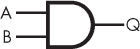
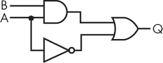
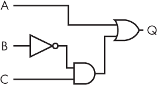
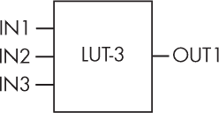
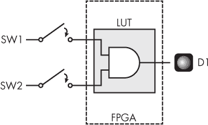

# 第八章：3 布尔代数与查找表


布尔代数是数学和逻辑领域的重要分支，理解它对于操作 FPGA 等设备至关重要。在布尔代数中，输入和输出的值只有真假两种，通常用 1 和 0，或者高低电压表示。与乘法和除法等运算不同，布尔代数包括与（AND）、或（OR）和非（NOT）等运算。每个运算接收一些 0 和 1 作为输入，评估它们并输出 0 或 1。如果代数课讲的是布尔代数，它肯定会简单很多！

你可能在其他编程语言中遇到过布尔运算，比如 C 或 Python。例如，你可能希望程序只有在用户选择后，并且文件名有效的情况下，才会写入文件。类似地，在 FPGA 中，你经常需要检查多个输入，以确定输出的状态。假设你想在按下两个开关中的任意一个时点亮 LED。一个 FPGA 可以通过 OR 运算来实现这一点：如果任意一个开关*或*另一个（或者两个开关同时）提供 1 作为输入，FPGA 就会输出 1 给 LED，LED 就会亮起。

布尔代数使得像这样的任务成为可能。但更重要的是，布尔代数描述了 FPGA 中所有底层的数据运算。将足够多的布尔运算串联在一起，你就能进行数学运算、存储数据，甚至更多。通过操作 1 和 0，你可以做出令人惊讶的事情。

在本章中，我们将探讨如何用逻辑门表示简单的布尔运算，并了解这些逻辑门如何组合成更复杂的布尔方程。然后，我们将研究 FPGA 如何通过将不同逻辑门的功能结合到一个叫做查找表的单一设备中来执行逻辑运算。如你所见，查找表是 FPGA 中最重要的组成部分之一。

## 逻辑门及其真值表

在设计 FPGA 时，我们用*逻辑门*表示简单的布尔运算，逻辑门是一种接收电信号作为输入，对其进行布尔运算，并输出相应电信号的设备。针对各种布尔运算，如与（AND）、或（OR）、非（NOT）、异或（XOR）和与非（NAND），都有不同的逻辑门。每种逻辑门都可以通过*真值表*来描述，真值表列出了布尔代数方程的所有可能输入组合，并展示了相应的输出。

我们接下来将讨论一些常见的逻辑门，并检查它们的真值表。但首先，重要的是要理解我们接下来要查看的真值表中的 1 和 0 究竟意味着什么。在 FPGA 内部，数字数据通过电压表示：0 伏特表示 0，某个高于 0 的电压，称为*核心电压*，表示 1。核心电压依赖于具体的 FPGA，但通常在 0.8 伏特到 1.2 伏特之间。当我们说一个信号是*高*时，我们指的是该信号处于核心电压状态，并表示数据值为 1。类似地，*低*信号为 0 伏特，表示数据值为 0。考虑到这一点，让我们来看一些逻辑门。

### 与门（AND Gates）

*与门*是一种逻辑门，当所有输入都为高电平时，其输出为高电平。我们将以一个两输入与门为例，但与门可以有任意数量的输入。对于一个两输入与门，当输入 A *和* 输入 B 都为高电平时，输出才为高电平，这也是“与门”这个名称的由来。表 3-1 显示了该与门的真值表。请注意，只有当两个输入都为 1 时，输出才为 1。

表 3-1： 两输入与门的真值表

| 输入 A | 输入 B | 输出 Q |
| --- | --- | --- |
| 0 | 0 | 0 |
| 0 | 1 | 0 |
| 1 | 0 | 0 |
| 1 | 1 | 1 |

在真值表中，行通常按输入的十进制顺序排列。在与门的真值表中，第一行表示输入 A = 0 和输入 B = 0，对应的表示为 b00，即二进制的 00，或十进制的 0。接下来是 b01（十进制 1），然后是 b10（十进制 2），接着是 b11（十进制 3）。如果与门有额外的输入，那么我们的真值表中将有更多的行需要填写。例如，对于一个三输入的与门，真值表会有八行，从 b000 到 b111，即从十进制的 0 到 7。

注意

*逻辑门的输出用 Q 表示。这个约定源于英国数学家艾伦·图灵，他在著名的图灵机中使用字母 Q 来表示状态。Q 代表*量子*，这是一个离散状态（例如 0 或 1），而不是一个可以具有连续值范围的状态。*

每个逻辑门都有一个独特的符号，用于电路图中。两个输入的与门符号如图 3-1 所示。该符号表示输入 A 和 B 从左侧进入门，而输出 Q 从右侧出来。



图 3-1：与门符号

随着我们对逻辑门的进一步探索，大多数我们要研究的门都有两个输入和一个输出。和与门一样，这些其他类型的门也可能有额外的输入，但为了简化起见，我们将仅讨论两个输入的版本。（例外是非门，它只有一个输入和一个输出。）为了简便，从现在起提到某个逻辑门时，我将省略*两个输入*这一描述。

### 或门

*或门*（图 3-2）是一种逻辑门，当任一输入为高电平时，输出为高电平；即当输入 A *或* 输入 B 为高电平时，输出为高电平。


图 3-2：或门符号

表 3-2 显示了或门的真值表。

表 3-2： 或门的真值表

| 输入 A | 输入 B | 输出 Q |
| --- | --- | --- |
| 0 | 0 | 0 |
| 0 | 1 | 1 |
| 1 | 0 | 1 |
| 1 | 1 | 1 |

请注意，当两个输入都是高电平时，OR 门的输出也是高电平。对于 OR 门，唯一重要的是至少有一个输入是高电平，这在两个输入都是高电平时也成立。

### NOT 门

一个*NOT 门*（图 3-3）有一个输入和一个输出。这种门简单地将输入反转（输出不是输入），因此也称为反转器。


图 3-3：NOT 门符号

请注意 NOT 门符号三角形尖端的气泡，它表示反转。它也出现在 NAND 门中，我们稍后会讨论，还可能出现在某些输入上。NOT 门的真值表见于表 3-3。

表 3-3： NOT 门的真值表

| 输入 A | 输出 Q |
| --- | --- |
| 0 | 1 |
| 1 | 0 |

如真值表所示，无论门的输入值是什么，输出都是相反的。

### XOR 门

*XOR 门*（发音为“ex-or”，即*异或*）的输出当且仅当其中一个输入为高电平时为高电平，而当两个输入都为高电平时输出为低电平。换句话说，门检测是否仅有一个输入为高电平。XOR 门的符号见于图 3-4。


图 3-4：XOR 门符号

该符号看起来像 OR 门的符号，但左侧的额外线条将其区分开来。表 3-4 展示了 XOR 门的真值表。

表 3-4： XOR 门的真值表

| 输入 A | 输入 B | 输出 Q |
| --- | --- | --- |
| 0 | 0 | 0 |
| 0 | 1 | 1 |
| 1 | 0 | 1 |
| 1 | 1 | 0 |

尽管这种类型的门乍一看似乎并不特别有用，但它的应用比你想象的要频繁。例如，XOR 门用于生成 *循环冗余校验（CRC）*，一种验证数据完整性的方法，用于确保传输信息的正确性。

### NAND 门

*NAND 门*（即 *非与门*）的输出与 AND 门相反。你可以从 NAND 门的电路符号中推断这一点，参见 图 3-5：它看起来与 AND 门完全相同，只是输出端多了一个圆圈表示取反。


图 3-5：NAND 门符号

因此，NAND 门的输出与 AND 门相同，但取反。如果输入 A 和输入 B 都为高电平，输出 Q 将为低电平。在其他所有情况下，输出 Q 将为高电平。这个逻辑在 表 3-5 的真值表中有所展示。

表 3-5： NAND 门的真值表

| 输入 A | 输入 B | 输出 Q |
| --- | --- | --- |
| 0 | 0 | 1 |
| 0 | 1 | 1 |
| 1 | 0 | 1 |
| 1 | 1 | 0 |

NAND 门广泛应用于 USB 闪存、固态硬盘（SSD）和其他类型的数据存储设备。它们也启发了我的网站名称，[*https://<wbr>nandland<wbr>.com*](https://nandland.com)。

### 其他门

我们在这里探讨了最常见的几种逻辑门，以帮助你理解它们是如何工作的，但这并不是一个详尽无遗的列表。还有其他类型的逻辑门，例如 NOR（即*非或*）和 XNOR（*异或非*）门。此外，正如前面所提到的，虽然我们在这里集中讲解了两输入版本，但所有这些门（除了 NOT）都可以有多个输入。本节旨在帮助你熟悉布尔代数中的标准逻辑运算。接下来，我们将探讨如何将这些运算组合起来，构建更复杂的表达式。

## 将门与布尔代数结合

你已经了解了单个逻辑门的工作原理。然而，通常你可能需要编写比单一逻辑运算更复杂的代码。好消息是，你可以将多个逻辑门链接起来，表示更复杂的布尔方程，并使用布尔代数来确定结果。

在布尔代数中，每个逻辑运算都有其独特的符号。一组常见的符号在表 3-6 中展示。例如，*表示与运算，而+表示或运算。这些符号使得编写更复杂的布尔代数方程变得更加简便。

表 3-6： 布尔代数符号

| 符号 | 含义 |
| --- | --- | --- |
| * | 与 |
| + | 或 |
| ′ | 非 |
| ^ | 异或 |

布尔代数还有自己的*运算顺序*。要解决一个布尔方程，首先要计算非（NOT），然后是与（AND），最后是或（OR）。与常规代数一样，你可以使用括号来绕过运算顺序；括号中的内容将首先计算。

现在，你已经知道如何编写和评估包含多个逻辑运算的布尔方程，比如 Q = A * B + A′。用简单的语言来讲，你可以把它读作：“输出 Q 等于 A *与* B *或非* A。”表 3-7 展示了这个方程的真值表。

表 3-7： A * B + A′ 的真值表

| 输入 A | 输入 B | 输出 Q |
| --- | --- | --- |
| 0 | 0 | 1 |
| 0 | 1 | 1 |
| 1 | 0 | 0 |
| 1 | 1 | 1 |

图 3-6 显示了这个方程的电路等效图，它是通过组合逻辑门构建的。



图 3-6：A * B + A′ 的电路图

如你所见，尽管我们依然只有两个输入，但由于这些输入经过三种不同的逻辑运算，我们的真值表的可能输出比单独的逻辑门更有趣。让我们考虑当两个输入都为 0 时（真值表中的第一行）这个方程的情况。方程中没有括号，所以我们首先看 NOT A，结果为 1。然后我们进行 A 和 B 的“与”操作，结果为 0。最后，我们对这两种表达式的结果进行“或”操作，得到输出 1。考虑到其他可能的输入，你应该会看到，每当 A 为 0，或者 A 和 B 都为 1 时，输出 Q 都为 1。否则，输出为 0。

虽然这个例子只有两个输入，但布尔方程可以有任意数量的输入。每增加一个输入，真值表中的行数就会增加一倍：一个输入时有两行，两个输入时有四行，三个输入时有八行，以此类推。用数学术语表示，对于 *n* 个输入，真值表有 2*^n* 行。

为了演示，让我们考虑一个有三个输入的示例方程：Q = A + (C * B′)。注意，括号表示在执行“或”操作之前，先进行“与非”操作。这实际上遵循了常规的布尔代数操作顺序，但括号使得方程更易读。包含三个输入的真值表见表 3-8。

表 3-8： A + (C * B′) 的真值表

| 输入 A | 输入 B | 输入 C | 输出 Q |
| --- | --- | --- | --- |
| 0 | 0 | 0 | 0 |
| 0 | 0 | 1 | 1 |
| 0 | 1 | 0 | 0 |
| 0 | 1 | 1 | 0 |
| 1 | 0 | 0 | 1 |
| 1 | 0 | 1 | 1 |
| 1 | 1 | 0 | 1 |
| 1 | 1 | 1 | 1 |

对应的电路如图 3-7 所示。



图 3-7：A 的电路图 + (C * B′)

要生成这个真值表，首先我们应该执行括号内的操作。这是 C AND NOT B。在括号内，最高优先级是对 B 应用的取反运算，之后与 C 进行与（AND）运算。总的来说，当 C 为高电平且 B 为低电平时，括号内的部分会得到高电平。由于方程的其余部分是或（OR）运算，我们也可以知道当 C 为高电平且 B 为低电平时，整体输出为高电平。这个情况出现在真值表的第二行，也出现在第五行，所以我们可以将这两行填上 1。最后，考虑 OR 运算符另一边的 A。当 A 为高电平时，如真值表中的最后四行，输出将为高电平。我们可以将剩余的行填上 0 来完成真值表。

在编程中，将逻辑运算组合起来以执行更复杂的功能是很常见的。在 FPGA 中，通过将简单的逻辑门功能连接在一起，也可以实现相同的功能。

## 查找表

到目前为止，我们一直在学习个别的逻辑门，但你可能会惊讶地发现，这些逻辑门在 FPGA 中并不真正存在。没有一个与门和或门的阵列，供你随意取用并连接起来创建布尔代数逻辑。相反，存在着更好的东西：*查找表（LUTs）*。这些设备可以被编程为执行你能想到的任何布尔代数方程，无论涉及到哪些特定的逻辑门。如果你需要一个与门，一个查找表就可以完成。如果你需要一个异或门，查找表也能做到。一个查找表也可以评估一个包含多个逻辑门的方程，就像我们在前一节中考虑的那样。任何你能想到的真值表，查找表都能生成。这就是查找表的强大之处。

注意

*早期的可编程逻辑设备，如可编程阵列逻辑（PAL），确实有与门和或门阵列。而在 FPGA 中，这些已被更强大的查找表（LUTs）所取代。*

查找表（LUT）按它们能接受的输入数量分类。例如，最新的 FPGA 上有二输入、三输入、四输入、五输入，甚至六输入的查找表。大多数查找表产生单一的输出。图 3-8 展示了一个三输入查找表（通常称为 LUT-3）的样子。



图 3-8：一个三输入查找表（LUT）

这个查找表是一个空白的基板，可以编程执行任何具有三输入和一个输出的布尔代数操作。例如，回顾一下图 3-7 中的电路，该电路表示布尔方程 Q = A + (C * B′)。绘制该方程的电路需要三个逻辑门——一个非门、一个与门和一个或门——但我们可以用一个三输入查找表来替代这三个逻辑门。这个查找表也可以被编程为表示方程 Q = (A + B + C)′，或者 Q = (A + B)′ * C。

如果我们有一个包含超过三个输入的布尔代数方程，会发生什么呢？这没问题，因为可以将查找表串联在一起执行非常长的逻辑序列。实际上，典型的 FPGA 包含数百甚至数千个查找表，随时可以编程以执行你需要的任何逻辑操作。这就是为什么查找表是 FPGA 中两个最重要的组件之一：它们执行你代码中的逻辑操作。另一个关键组件是触发器，我们将在下一章讨论。

尽管我们在这里绘制了真值表和逻辑门图，但在实际应用中，你很少会用这种方式定义 FPGA 操作。相反，你会编写代码。通常，你写的代码会比单独的逻辑门更高层次：你可能会编写代码来比较两个数字、增加计数器或检查条件是否为真，然后综合工具会将代码拆解成必要的布尔逻辑操作，并将这些操作分配给查找表（LUT）。然而，本书的目的是教你理解 FPGA 的工作原理，从根本上说，FPGA 通过执行布尔代数来工作。一旦你了解了 FPGA 的工作原理，你将能够更深入地理解你用代码创建的内容，并能更好地使用 Verilog 或 VHDL。这将帮助你创建高效且可靠的 FPGA 设计。

## 项目 #2：用逻辑门点亮 LED

现在你已经准备好将你学到的布尔逻辑和查找表知识应用到 FPGA 开发板上的实际例子中了。这个项目应该会点亮一个 LED，但只有当两个开关同时被按下时才会点亮。换句话说，你通过实现与门（AND gate）来使用你的第一个 LUT。图 3-9 显示了这个项目的框图。



图 3-9：项目 #2 的框图

这个项目将整个 FPGA 转变为一个单一的与门。对于一个非常强大的 FPGA 来说，这可能有些过头，但它是一个很好的方法来直观展示 LUT 在实际中的工作原理。表 3-9 显示了与这个项目相对应的真值表。

表 3-9： 项目 #2 的真值表

| SW1 | SW2 | D1 |
| --- | --- | --- |
| 0 | 0 | 0 |
| 0 | 1 | 0 |
| 1 | 0 | 0 |
| 1 | 1 | 1 |

这个真值表看起来和我们为与门（AND gate）创建的真值表完全一样，不过列标签已经被替换为表示开发板上的两个开关和一个 LED。正如预期的那样，只有当输入 SW1 和 SW2 都为高电平时，输出 D1 才会为高电平。

### 编写代码

实现一个与门（AND gate）使用的资源非常少：三个连接（两个输入和一个输出）以及一个 LUT。让我们看看如何通过 Verilog 和 VHDL 使 LED 亮起：

Verilog

```
module And_Gate_Project
 (input i_Switch_1,
  input i_Switch_2,
  output o_LED_1);
❶ assign o_LED_1 = i_Switch_1 & i_Switch_2;
endmodule
```

VHDL

```
library ieee;
use ieee.std_logic_1164.all;
entity And_Gate_Project is
  port (
    i_Switch_1 : in std_logic;
    i_Switch_2 : in std_logic;
    o_LED_1    : out std_logic);
end entity And_Gate_Project;
architecture RTL of And_Gate_Project is
begin
  ❶ o_LED_1 <= i_Switch_1 and i_Switch_2;
end RTL;
```

我们首先将输入定义为 i_Switch_1 和 i_Switch_2，输出定义为 o_LED_1。然后，我们持续将输出与两个输入的与运算进行赋值❶。在 Verilog 中，与运算的符号是 &，而在 VHDL 中，and 是一个保留关键字。

### 构建和编程 FPGA

现在，你已经准备好将你的 Verilog 或 VHDL 代码通过第二章中讨论的构建过程运行。综合工具将生成一份报告，概述 FPGA 上的资源利用情况。以下是报告中最有趣的部分：

```
`--snip--`
Resource Usage Report for And_Gate_Project
Mapping to part: ice40hx1kvq100
Cell usage:
SB_LUT4         1 use
❶ I/O ports: 3
I/O primitives: 3
SB_IO          3 uses
I/O Register bits:                  0
Register bits not including I/Os:   0 (0%)
Total load per clock:
Mapping Summary:
❷ Total  LUTs: 1 (0%)
```

本报告告诉我们，FPGA 上的三个 I/O 端口（输入/输出端口，或称引脚，意味着与外部世界的连接）已被用于实现我们的电路设计❶，最重要的是，我们使用了一个 LUT❷。最后一行中的 (0%) 表示 FPGA 上的资源利用率。在这个特定的 FPGA 上，有超过 1000 个 LUT 可供使用，而我们只使用了其中的 1 个。由于综合报告显示一个 LUT 的资源利用率为 0%，工具可能在此处进行了四舍五入（1 / 1,000 = 0.1）。

请继续编程你的开发板，注意到只有在两个开关同时按下时，LED 才会亮起。LUT 在正常工作！

你可以随意修改代码，使用与（AND）以外的其他布尔运算。例如，你可以使用 | 或 ^ 符号在 Verilog 中创建一个或门（OR gate）或异或门（XOR gate），或者使用 VHDL 中的 or 或 xor 关键字。你还可以尝试将多个运算结合起来，使 LED 根据你想到的任何复杂布尔代数方程亮起，或者尝试增加更多的开关输入或 LED 输出来实现更复杂的真值表。你可以通过编写你自己的真值表，使用开关作为输入，LED 作为输出，然后测试所有可能的开关组合，查看它们是否按预期工作，来检查综合工具是否真的根据你的代码生成了正确的 LUT。

## 总结

在本章中，你了解了 FPGA 两个最重要组成部分之一：查找表（LUT）。你已经看到，LUT 可以通过给定数量的输入实现任何布尔代数方程，从简单的逻辑门（如与门（AND）、或门（OR）、非门（NOT）、异或门（XOR）和与非门（NAND））到将这些门组合起来的更复杂的方程式。在下一章中，我们将重点介绍另一个关键的 FPGA 组件：触发器（flip-flop）。
