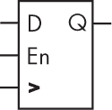
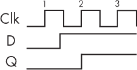
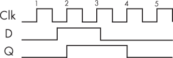
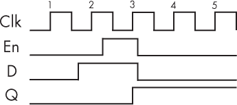
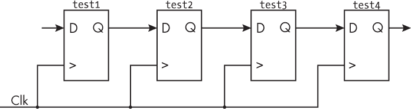
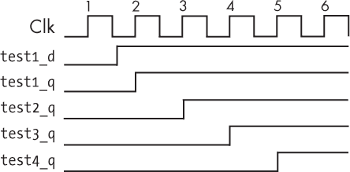
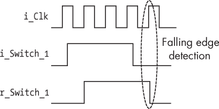
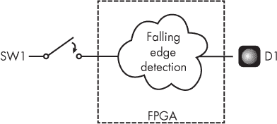
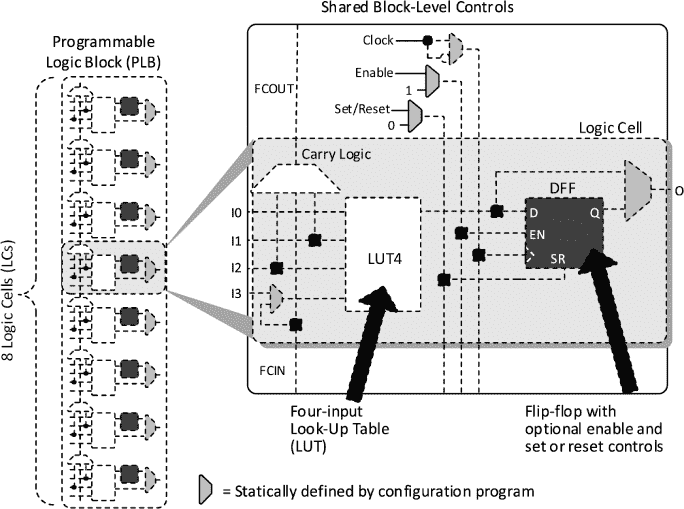

# 第九章：4 使用触发器存储状态


除了查找表，FPGA 中的另一个主要组件是*触发器*。触发器使得 FPGA 能够记住或存储状态。在本章中，我们将探讨触发器的工作原理，并了解它们为何对 FPGA 的功能至关重要。

触发器弥补了查找表的一个不足。LUT（查找表）在接收到输入后立即生成输出。如果你只使用 LUT，FPGA 可以执行所有可能的布尔代数运算，但输出将仅仅基于当前的输入确定。FPGA 将无法知道它的过去状态，这会非常有限。例如，实现一个计数器就不现实，因为计数器需要知道一个可以递增的先前值；存储某些数学运算的结果作为变量也是不可能的。仅仅使用 LUT，甚至像时间的概念这样的关键操作也无法实现；你只能基于现在来计算值，而不能参考过去的任何信息。触发器赋予了 FPGA 这些有趣的能力，这也是它在 FPGA 操作中至关重要的原因。

## 触发器的工作原理

触发器通过高电平或低电平电压的形式存储状态，分别对应二进制的 1 或 0，或者真/假的值。它通过定期检查输入上的值，将该值传递到输出，并保持在那里。考虑图 4-1 所示的基本*D 触发器*图示。D 触发器是 FPGA 中最常见的触发器类型，也是本章的重点。（接下来我将省略*D*，直接称其为*触发器*。）



图 4-1：D 触发器的示意图

请注意，组件左侧有三个输入，右侧有一个输出。左上角的输入标记为*D*，是触发器的*数据输入*。数据（以 1 或 0 的形式）通过这里输入。左下角的输入标有类似大于号（>）的符号，是*时钟输入*，它同步触发器的工作。在固定的时间间隔内，时钟输入触发触发器，从数据输入获取值并将其传递到输出（在图示中标记为*Q*）。

中左侧的输入标记为*En*，即*时钟使能*。只要时钟使能信号为高电平，时钟输入就会持续触发触发器更新其输出。然而，如果时钟使能输入变为低电平，触发器将忽略时钟和数据输入，基本上会冻结当前的输出值。

为了更好地理解触发器的工作原理，我们需要更仔细地观察进入时钟输入的信号。

### 时钟信号

*时钟信号*，通常简称为*时钟*，是一种在高低之间稳定交替的数字信号，如图 4-2 所示。这个信号通常通过 FPGA 外部的专用电子元件提供。时钟是 FPGA 操作的关键：它触发其他组件，如触发器，执行它们的任务。如果你把 FPGA 想象成一组齿轮，那么时钟就像是那个带动其他齿轮转动的大齿轮。如果主齿轮不转动，其他齿轮也不会转动。你也可以把时钟看作系统的心脏，因为它为整个 FPGA 保持节拍。FPGA 中的每个触发器都会在时钟心跳的脉冲下更新。


图 4-2：时钟信号

注意时钟信号图中的竖直线，信号从低到高或从高到低的跳变。这些信号的突变称为*边沿*。当时钟从低到高时，称为*上升沿*；而当时钟从高到低时，称为*下降沿*。触发器通常在时钟的每个上升沿触发：每当时钟信号从低到高变化时，触发器就会更新其输出，以匹配数据输入。

注意

*虽然可以通过时钟的下降沿触发触发器，但这比使用上升沿*要*少见得多。*

每个时钟都有一个*占空比*，即信号为高的时间比例。例如，一个 25% 占空比的信号，信号高时占四分之一的时间，低时占四分之三的时间。几乎所有的时钟，包括图 4-2 中所示的时钟，都有 50% 的占空比：它们是半开半关的。

时钟还有*频率*，即每秒钟从低到高再到低（称为一个周期）的重复次数。频率以赫兹（Hz）来衡量，即每秒钟的周期数。你可能对电脑 CPU 的频率比较熟悉，通常用千兆赫兹（GHz）来表示，其中 1 GHz 等于 10 亿赫兹。FPGA 的运行速度通常没有那么快。更常见的是，FPGA 时钟信号的频率在几十到几百兆赫（MHz）之间，其中 1 MHz 等于 100 万赫兹。例如，围棋棋盘上的时钟（在附录 A 中讨论）运行在 25 MHz，即每秒 2500 万个周期。

描述时钟速度的另一种方式是指其*周期*，即单个时钟周期的持续时间。你可以通过计算 1 ÷ *频率* 来得到周期。例如，在围棋棋盘的情况下，时钟周期是 40 纳秒（ns）。

### 触发器的工作实例

触发器在其时钟输入的跃迁上工作。如前所述，当触发器看到时钟的上升沿时，它会检查数据输入信号的状态，并将其复制到输出端——前提是时钟使能引脚设置为高电平。这个过程称为*注册*，也就是说，“触发器*注册*输入数据”。由于这一术语，一组触发器被称为*寄存器*，因此，单个触发器也可以称为*一位寄存器*。一个触发器本身能够注册一个比特的数据。

为了了解注册操作在实际中的工作方式，我们将检查几个触发器的输入及其对应的输出。首先，考虑 图 4-3。



图 4-3：触发器行为的一个例子

该图展示了三种波形：顶部的一个（Clk）代表 FPGA 的时钟信号，中间的一个（D）是触发器的数据输入，底部的一个（Q）是触发器的输出。假设时钟使能信号为高，触发器始终处于启用状态。我们可以看到时钟的三个周期波形；每个时钟周期的上升沿用数字 1、2 和 3 标示。在时钟的第一次和第二次上升沿之间，D 输入从低电平变为高电平，但请注意，输出不会在输入变高时立即跟随。相反，触发器需要一些时间来注册输入的变化。具体来说，直到*下一个上升沿*，触发器的输出才会跟随输入。

触发器只在时钟的上升沿查看输入数据，并使输出与输入匹配，绝不会在边沿之间变化。在这种情况下，在第二个时钟周期的上升沿，输出 Q 看到了 D 从低电平变为高电平。此时，Q 取与 D 相同的值。在第三个上升沿，Q 再次检查 D 的值并注册它。由于 D 没有变化，Q 依然保持高电平。Q 在第一个时钟周期的上升沿也注册了 D，但由于那时 D 和 Q 都是低电平，Q 并没有发生变化。

现在考虑 图 4-4，它展示了触发器如何响应另一个例子场景。



图 4-4：另一个触发器行为的例子

这里我们再次看到触发器在几个时钟周期内的操作。同样，假设触发器始终处于启用状态。在时钟的第一次和第二次上升沿之间，输入 D 从低电平变为高电平。在第二次上升沿，Q 看到 D 已变高，因此它也从低电平切换为高电平。在第三次上升沿，Q 看到 D 保持高电平，因此 Q 也保持高电平。在第三次和第四次上升沿之间，D 变为低电平，输出也在第四次上升沿变为低电平。在最后一次上升沿，D 仍为低电平，因此 Q 也保持低电平。

之前的示例都假设时钟使能输入为高电平。现在让我们展示当触发器的时钟使能不是始终为高时会发生什么。图 4-5 展示了与图 4-4 完全相同的时钟和数据波形，但时钟使能信号并不是始终为高，而是在第三个上升沿时才为高。



图 4-5：带有时钟使能信号的触发器行为

现在，随着时钟使能（En）的参与，生成了完全不同的输出 Q。Q 不再“看到”在时钟周期二时 D 变为高电平，因为此时时钟使能为低电平。相反，Q 只在时钟周期三时从低变为高，当时钟使能为高电平时。在时钟周期四时，D 已变为低电平，但 Q 并没有跟随 D 的变化。相反，Q 保持为高电平。这是因为此时时钟使能已变为低电平，锁定了输出状态。触发器将不再将 D 的变化注册到 Q 上。

这些示例展示了触发器的行为，说明触发器的活动如何通过时钟来协调。此外，我们已经看到关闭时钟使能引脚可以让触发器保持状态，即使输入 D 在变化。这使得触发器能够长时间存储数据。

### 触发器链

触发器通常是串联在一起的，一个触发器的输出直接进入另一个触发器的数据输入。例如，图 4-6 展示了四个触发器的链式连接。为了简化，假设这些触发器始终是使能的。



图 4-6：四个触发器的链式连接

四个触发器，从test1到test4，通过链式连接，其中test1的输出连接到test2的输入，test2的输出连接到test3的输入，依此类推。所有四个触发器都由相同的时钟驱动。时钟同步它们的操作：每当时钟上升沿到来时，所有四个触发器都会检查输入上的值，并将该值注册到输出端。

假设test1触发器在其输入端注册了一个变化。图 4-7 展示了这个变化如何传播通过触发器链，直到test4的输出端。



图 4-7：输入变化通过触发器链传播

图中显示了时钟信号、test1触发器的输入和输出（分别为test1_d和test1_q）以及每个后续触发器的输出。在第一个时钟周期的上升沿（标记为 1），test1_d为低，因此test1_q也保持为低。直到第二个上升时钟沿，触发器才“看到”输入变为高，并将其注册到输出中。test1触发器的输出也是test2触发器的输入，但注意到test2的输出并不会在test1的输出变高时立即变高。相反，test2_q会在第三个上升时钟沿时变化。然后，在第四个上升沿时，我们看到test3_q变高，最后在第五个上升沿时test4_q变高并保持高。

通过在test1后面添加三个触发器，我们将输出延迟了三个时钟周期，因为信号通过链条传播。链中的每个触发器都会增加一个时钟周期的延迟。这种通过添加触发器链来延迟信号的技术，在使用 FPGA 时是一个有用的设计实践。设计师们可以通过链式连接触发器来创建电路，以便延迟或记住数据一段时间，或将串行数据转换为并行数据（或反之）。

## 项目 #3：闪烁 LED

现在你已经了解了触发器的工作原理，我们将在一个项目中使用几个触发器，在这个项目中，FPGA 必须记住它自身状态的信息。具体来说，我们将每次释放开关时切换 LED 的状态。如果在释放开关之前 LED 是关闭的，它应该打开；如果 LED 是打开的，它应该关闭。

这个项目使用了两个触发器。第一个用于记住 LED 的状态：它是开着还是关着。如果没有这个记忆功能，FPGA 就无法知道每次释放开关时是否需要切换 LED 的状态；它无法知道 LED 是开着需要关闭，还是关着需要打开。

第二个触发器使得 FPGA 能够检测到开关被释放的时刻。具体来说，我们要检测的是开关电信号的下降沿：从高电平到低电平的过渡。在 FPGA 中检测下降沿的一个好方法是将信号通过触发器进行注册。当触发器的输入值（即未注册的值）为 0，而前一个输出值（即已注册的值）为 1 时，我们就知道发生了下降沿。开关的下降沿不应与时钟的上升沿混淆；我们仍然使用时钟的上升沿来驱动所有的触发器。图 4-8 显示了需要查找的模式。



图 4-8：使用触发器进行下降沿检测

在这里，i_Clk 是时钟信号；i_Switch_1 代表来自开关的电信号，该信号传递到触发器；r_Switch_1 是触发器的输出。在圈出的上升时钟沿上，我们可以看到 i_Switch_1 处于低电平，但 r_Switch_1 处于高电平。这个模式就是我们如何检测信号的下降沿。需要注意的是，虽然 r_Switch_1 在上升时钟沿会变为低电平，但当逻辑在同一上升时钟沿评估 r_Switch_1 的状态时，它仍然会“看到” r_Switch_1 为高电平。只有在短暂的延迟后，r_Switch_1 的输出才会变为低电平，跟随 i_Switch_1 的状态。

这个项目还需要在两个触发器之间实现一些逻辑，形式上将通过 LUT（查找表）来实现。这将是你第一次看到触发器和 LUT 如何在 FPGA 中协同工作来完成任务。图 4-9 显示了该项目的总体框图。



图 4-9：项目 #3 的框图

开发板上的一个开关（SW1）的输出进入 FPGA，其中实现了下降沿检测逻辑。该逻辑的输出驱动着板上的一个 LED（D1）。接下来我们将看看如何实现这个设计。

### 编写代码

我们可以使用 Verilog 或 VHDL 来编写 LED 切换的代码：

Verilog

```
module LED_Toggle_Project(
  input  i_Clk,
  input  i_Switch_1,
  output o_LED_1);
❶ reg r_LED_1    = 1'b0;
  reg r_Switch_1 = 1'b0;
❷ always @(posedge i_Clk)
  begin
  ❸ r_Switch_1 <= i_Switch_1;
  ❹ if (i_Switch_1 == 1'b0 && r_Switch_1 == 1'b1)
     begin
     ❺ r_LED_1 <= ~r_LED_1;
     end
  end
  assign o_LED_1 = r_LED_1;
endmodule
```

VHDL

```
library ieee;
use ieee.std_logic_1164.all;
entity LED_Toggle_Project is
  port (
     i_Clk      : in  std_logic;
     i_Switch_1 : in  std_logic;
     o_LED_1    : out std_logic
  );
end entity LED_Toggle_Project;
architecture RTL of LED_Toggle_Project is
❶ signal r_LED_1    : std_logic := '0';
  signal r_Switch_1 : std_logic := '0';
begin
❷ process (i_Clk) is
  begin
     if rising_edge(i_Clk) then
     ❸ r_Switch_1 <= i_Switch_1;
     ❹ if i_Switch_1 = '0' and r_Switch_1 = '1' then
        ❺ r_LED_1 <= not r_LED_1;
        end if;
     end if;
  end process;
  o_LED_1 <= r_LED_1;
end architecture RTL;
```

我们首先定义两个输入（时钟和开关）和一个输出（LED）。然后我们创建两个信号❶：r_LED_1 和 r_Switch_1。我们通过使用 reg 关键字（即 *寄存器* 的缩写）在 Verilog 中定义，或者在 VHDL 中使用 signal 关键字。最终，这些信号将实现为触发器或寄存器，因此我们在它们的名称前加上字母 r。将任何你知道会变成寄存器的信号标记为 r_signal_name 是一种良好的编程习惯，因为它有助于保持代码的有序性和易于搜索。

接下来，我们在 Verilog 中初始化一个被称为 always 的代码块，或者在 VHDL 中初始化一个 process 代码块❷。这种类型的代码块会在一个或多个信号发生变化时触发，具体由代码块的 *敏感列表* 指定，敏感列表会在声明代码块时放在括号中。在这种情况下，该代码块对时钟信号 i_Clk 敏感。具体来说，每当时钟从 0 变为 1 时，这个代码块就会被触发，也就是说，在每个上升沿时触发。请记住，当你使用时钟来触发 FPGA 中的逻辑时，你几乎总是会使用时钟的上升沿。在 Verilog 中，我们通过关键字 posedge（即 *正沿* 的缩写，另一个说法是 *上升沿*）在敏感列表中进行指示：always @(posedge i_Clk)。然而，在 VHDL 中，我们只将信号名称放入敏感列表中，并在两行后指定观察上升沿，使用 if rising_edge(i_Clk) then。

在always或process块内，我们通过将输入信号i_Switch_1注册到r_Switch_1 ❸，创建了本项目的第一个触发器。此行代码将生成一个触发器，D 输入为i_Switch_1，Q 输出为r_Switch_1，时钟输入为i_Clk。此触发器的输出将对输入的任何变化产生一个时钟周期的延迟。这实际上让我们可以访问开关的前一个状态，而我们需要知道这个状态来检测开关信号的下降沿。

接下来，我们检查开关是否已经释放 ❹。为此，我们将开关的当前状态与其前一个状态进行比较，使用我们刚刚创建的触发器 ❸。如果当前状态（i_Switch_1）为 0，*并且*前一个状态（r_Switch_1）为 1，则表示我们检测到了下降沿，意味着开关已经释放。*并且*检查将通过查找表（LUT）来完成。

到此为止，也许你已经注意到了一些令人惊讶的地方。首先，我们将i_Switch_1赋值给了r_Switch_1 ❸，然后我们检查i_Switch_1是否为 0 且r_Switch_1为 1 ❹。你可能会想，既然我们刚刚将i_Switch_1赋值给了r_Switch_1，它们应该始终相等，那么if语句应该永远不会为真。对吧？错！在always或process块中的赋值语句，如果使用的是<=，赋值并不会立即发生。相反，它们会在每个时钟上升沿时进行，因此*所有赋值同时执行*。如果在时钟上升沿时i_Switch_1为 0 且r_Switch_1为 1，if语句将被评估为真，即使r_Switch_1同时从 1 切换到 0 以匹配i_Switch_1。

现在我们在并行思考，而不是串行思考！我们已经生成了同时发生的赋值，而不是逐个赋值。这与传统编程语言如 C 和 Python 完全不同，后者的赋值是一个接一个发生的。为了进一步说明这一点，你可以把r_Switch_1的赋值移到always或process块的最后一行，一切仍然会照常工作。从正式角度讲，我们称<=赋值为*非阻塞赋值*，意味着它不会阻止（“阻塞”）其他赋值同时发生。在第十章中，我们将重新审视这一概念，并比较非阻塞赋值和阻塞赋值。

一旦进入if语句，我们就切换 LED 的状态 ❺。这样就生成了该项目中使用的第二个触发器。我们获取r_LED_1的当前值，将其反转，并将结果存回触发器中。这个听起来可能不可能，但它完全有效。触发器的输出将通过一个查找表（LUT），在这里充当反向门（NOT gate），然后反馈到触发器的输入端。这样，如果 LED 是亮的，它就会熄灭，反之亦然。

### 添加约束

一旦代码准备好，就该运行工具来构建 FPGA 镜像并编程你的开发板了。首先，由于这个项目使用了时钟，你需要添加一个约束，告诉 FPGA 工具时钟的周期。时钟周期告诉时序工具有多少时间可以在触发器之间布线。随着时钟速度的增加，FPGA 要*满足时序要求*，即在每个时钟周期内完成所有任务，变得越来越困难。对于频率在数十兆赫兹数量级的较慢时钟，你不应该遇到时序问题。一般来说，只有当时钟速度超过 100 MHz 时，才可能会开始遇到时序问题。

时钟周期会因开发板不同而有所不同，可以在开发板的文档中找到。为了让 Lattice iCEcube2 知道时钟周期，创建一个新的文本文件，文件扩展名为 *.sdc*，内容可以像下面这样：

```
create_clock  -period 40.00 -name {i_Clk} [get_ports {i_Clk}]
```

这将创建一个周期为 40 纳秒（25 MHz 频率）的时钟，并将该约束赋给设计中的信号i_Clk。这个约束适用于 Go Board 作为示例，但如果你的开发板时钟周期不同，请将40.00替换为适当的值。

右键点击**约束文件**，位于**综合工具**下，选择*.sdc*文件并将其添加到 iCEcube2 中的项目中。记住，在第二章中，我们之前有一个单一的*.pcf*约束文件，告诉工具将哪些信号映射到哪些引脚。现在，我们有了一个额外的专门用于时钟的约束文件。这两个文件对确保 FPGA 正常工作至关重要。

我们还需要更新*.pcf*文件，加入与新时钟信号对应的引脚。例如，在 Go Board 上，时钟连接到 FPGA 的引脚 15，因此您需要添加以下引脚约束：

```
set_io i_Clk 15
```

检查开发板的原理图，查看哪个引脚作为时钟输入，并根据需要替换15。

### 构建和编程 FPGA

现在您已经准备好运行构建了。运行时，工具将生成一些报告。综合报告应该类似于以下内容：

```
`--snip--`
Resource Usage Report for LED_Toggle_Project
Mapping to part: ice40hx1kvq100
Cell usage:
SB_DFF 2 uses
SB_LUT4 1 use
I/O ports: 3
I/O primitives: 3
SB_GB_IO 1 use
SB_IO 2 uses
I/O Register bits: 0
❶ Register bits not including I/Os: 2 (0%)
Total load per clock:
 ❷ LED_Toggle_Project|i_Clk: 1
Mapping Summary:
❸ Total LUTs: 1 (0%)
```

这份报告告诉我们，我们正在使用两个寄存器位❶，这意味着我们的设计包含两个触发器。这正是我们预期的。报告还显示我们使用了一个 LUT❸。这个单一的 LUT 将能够执行代码中所需的与、非操作。还要注意，工具将信号i_Clk识别为时钟❷。

现在让我们来看一下布局和布线报告，您可以通过在 iCEcube2 中转到**P&R 流程****输出文件****报告**来查看。这里有两个报告。第一个是引脚报告，它告诉您哪些信号被映射到哪些引脚。您可以用它来确认信号是否正确映射。第二个是时序报告。它有一个名为“时钟频率汇总”的部分，应该类似于下面的内容：

```
`--snip--`
 1::Clock Frequency Summary
==========================================================
Number of clocks: 1
Clock: i_Clk | Frequency: 654.05 MHz | Target: 25.00 MHz |
`--snip--`
```

本节告诉你约束文件是否已正确接受。在这里，我们看到工具已经找到了我们的时钟，i_Clk。Target属性表明工具已识别时钟上施加了 25 MHz 的约束（你的数字可能不同，具体取决于开发板），而Frequency属性告诉我们 FPGA 理论上能够成功运行代码的最大频率。在这种情况下，我们可以将 FPGA 运行在 654.05 MHz 下，并且仍然可以保证正确工作。真是相当快！只要Frequency属性高于Target属性，你就不应当遇到任何问题。若目标时钟频率大于工具能够达到的频率，这里会出现*时序错误*。在第七章中，我们将更深入地探讨时序错误的原因以及如何修复它们。

现在你已经成功构建了 FPGA 设计，可以编程并测试你的项目。尝试多次按下开关。每次开关释放时，你应该看到 LED 的状态切换。恭喜你，第一次触发器已经工作了！

然而，你可能会注意到一些奇怪的现象。LED 的状态似乎没有随着每次开关释放而改变。你可能以为 FPGA 没有注册开关的释放信号，但实际上 LED 每次释放时都会迅速切换两次或更多次，以至于你的眼睛没有察觉到。其原因与开关本身的物理特性有关。为了解决这个问题，开关需要进行*去抖动*处理。你将在下一章中学习这是什么意思以及如何处理。

## 组合逻辑与时序逻辑

FPGA 内部有两种逻辑：组合逻辑和时序逻辑。*组合逻辑*是输出由当前输入决定的逻辑，不记忆先前的状态。这种逻辑通过 LUT 实现，正如你所记得，LUT 仅根据当前输入生成输出。*时序逻辑*则不同，它的输出由当前输入和先前的输出共同决定。时序逻辑通过触发器实现，因为触发器不会立即将输入变化反映到输出，而是等到时钟的上升沿才对新的输入数据做出反应。

注意

*你可能也会看到组合逻辑和时序逻辑分别被称作*组合逻辑*和*同步逻辑*。*

可能不太明显的是，触发器的输出取决于其先前的输出，因此让我们通过一个例子来更具体地说明这个问题。假设触发器已启用，输入为低电平，时钟为低电平，输出为低电平。然后输入突然变为高电平，之后又迅速回到低电平。那么输出会发生什么呢？什么都不发生！它保持低电平，因为没有时钟边缘来触发状态变化。那么，如果该触发器具有相同的初始条件，但输出为高电平，会发生什么呢？当然，在这种情况下，输出将保持高电平。但是，如果我们只看输入（D、En 和 Clk），*我们将无法预测输出的状态*。你需要知道触发器的输出是什么（它的先前状态），才能确定触发器的当前状态。这就是为什么触发器是顺序逻辑的原因。

知道你的代码是会实例化查找表（组合逻辑）还是触发器（顺序逻辑）对于成为一个优秀的 FPGA 设计师至关重要，但有时很难分辨二者的区别。特别是，一个 always 块（在 Verilog 中）或 process 块（在 VHDL 中）可以定义一个组合逻辑或顺序逻辑的代码块。我们将考虑每种情况的示例，以查看它们的区别。

首先，这里是一个在 Verilog 和 VHDL 中的组合逻辑实现示例：

Verilog

```
always @ (input_1 or input_2)
  begin
    and_gate <= input_1 & input_2;
  end
```

VHDL

```
process (input_1, input_2)
begin
  and_gate <= input_1 and input_2;
end process;
```

这里我们创建了一个带有敏感列表（括号中的信号）的 always 或 process 块，该敏感列表包括两个信号：input_1 和 input_2。该代码块对这两个信号执行与操作。

这段 Verilog 或 VHDL 代码只会生成查找表（LUT）；它不会生成任何触发器。对于我们的目的来说，触发器需要一个时钟输入，而这里没有时钟。由于没有生成触发器，因此这是组合逻辑。

现在考虑对刚才展示的例子做一个轻微的修改：

Verilog

```
always @ (posedge i_Clk)
  begin
    and_gate <= input_1 & input_2;
  end
```

VHDL

```
process (i_Clk)
begin
  if rising_edge(i_Clk) then
    and_gate <= input_1 and input_2;
  end if;
end process;
```

这段代码看起来与之前的示例非常相似，唯一的不同是现在 always 或 process 块的敏感列表已经改变，变得对信号 i_Clk 敏感。由于该块对时钟敏感，它现在被认为是顺序逻辑。这个代码块实际上仍然需要一个 LUT 来执行与操作，但除了这个之外，输出将会使用一个触发器，因为时钟在控制输出的更新频率。

虽然本节中的所有示例代码都是有效的，但我要特别给 FPGA 初学者一个建议：编写代码时，只创建*顺序*的 always 块（在 Verilog 中）或 process 块（在 VHDL 中）。做到这一点的方法是确保该块的灵敏度列表中只有时钟（时钟和复位也可以，我们将在本章后面讨论）。组合 always 块和 process 块可能会导致问题：你可能会无意间生成锁存器。我们将在下一节中探讨锁存器，基本上，它们是坏的。此外，我发现，如果你知道每次遇到 always 块或 process 块时，它总是生成顺序逻辑，代码会更加易读。

对于仅含组合逻辑的部分，应将其写在< sAmp class="SANS_TheSansMonoCd_W5Regular_11">always 块或 process 块之外。在 Verilog 中，关键字 assign 很有用。在 VHDL 中，你可以简单地使用 <= 赋值语句来创建组合逻辑。

## 锁存器的危险性

*锁存器* 是一种可以在不使用时钟的情况下存储状态的数字组件。通过这种方式，锁存器执行的功能与触发器相似（即存储状态），但它们使用的方法不同，因为没有涉及时钟。锁存器很危险，在处理组合逻辑代码时可能会不小心生成它们。在我的职业生涯中，我从未故意生成过锁存器，都是意外产生的。你也很不可能真的需要生成锁存器，因此了解如何避免它们是很重要的。

你始终希望你的 FPGA 设计是可预测的。锁存器之所以危险，是因为它们违背了这一原则。FPGA 工具在理解锁存器的时序关系以及连接到它的其他组件的表现时非常困难。如果你确实通过代码生成了锁存器，FPGA 工具会用警告告诉你，你做了一个可怕的事情。请不要忽视这些警告。

那么如何会发生这种情况呢？当你编写一个组合型 process 块或条件赋值（在 VHDL 中）或组合型 always 块（在 Verilog 中）时，如果进行 *不完全赋值*，即在所有可能的输入条件下输出没有被赋值，就会创建一个锁存器。这是错误的，应该避免。表 4-1 显示了一个会生成锁存器的真值表示例。

表 4-1： 创建锁存器的真值表

| 输入 A | 输入 B | 输出 Q |
| --- | --- | --- |
| 0 | 0 | 0 |
| 0 | 1 | 1 |
| 1 | 0 | 1 |
| 1 | 1 | 未定义 |

这个真值表有两个输入和一个输出。当两个输入都为 0 时，输出为 0；当输入 A 为 0 且输入 B 为 1，或者输入 A 为 1 且输入 B 为 0 时，输出为 1。但是，当两个输入都为 1 时会发生什么呢？我们没有明确说明会发生什么情况。在这种情况下，FPGA 工具假设输出应保持其先前的状态，就像触发器能够做到的那样，但不使用时钟。例如，如果输出为 0 且两个输入都变高，输出将保持为 0。如果输出为 1 且两个输入都变高，输出将保持为 1。这就是锁存器的行为：在没有时钟的情况下存储状态的能力。

让我们来看看如何在 Verilog 和 VHDL 中创建这个真值表。不要像这样写代码！

Verilog

```
❶ always @ (i_A or i_B)
begin
  if (i_A == 1'b0 && i_B == 1'b0)
     o_Q <= 1'b0;
       else if (i_A == 1'b0 && i_B == 1'b1)
         o_Q <= 1'b1;
       else if (i_A == 1'b1 && i_B == 1'b0)
         o_Q <= 1'b1;
  ❷ // Missing one last ELSE statement!
end
```

VHDL

```
❶ process (i_A, i_B)
begin
  if i_A = '0' and i_B = '0' then
    o_Q <= '0';
  elsif i_A = '0' and i_B = '1' then
    o_Q <= '1';
  elsif i_A = '1' and i_B = '0' then
    o_Q <= '1';
❷ -- Missing one last ELSE statement!
  end if;
end process;
```

在这里，我们的< samp class="SANS_TheSansMonoCd_W5Regular_11">always或< samp class="SANS_TheSansMonoCd_W5Regular_11">process块是组合式的，因为在灵敏度列表❶或块本身中没有时钟，只有两个输入，< samp class="SANS_TheSansMonoCd_W5Regular_11">i_A和< samp class="SANS_TheSansMonoCd_W5Regular_11">i_B。我们通过条件检查模拟输出< samp class="SANS_TheSansMonoCd_W5Regular_11">o_Q的不完全真值表赋值。请注意，我们没有显式地检查< samp class="SANS_TheSansMonoCd_W5Regular_11">i_A和< samp class="SANS_TheSansMonoCd_W5Regular_11">i_B都为 1 的条件。大错误！

如果你尝试合成这段有问题的代码，FPGA 工具会生成一个锁存器，并在合成报告中给你警告。警告可能是这样的：

```
@W: CL118 :"C:\Test.v":8:4:8:5|Latch generated from always block for signal
o_Q; possible missing assignment in an if or case statement.
```

这些工具非常好。它们会告诉你是否有锁存器，并告诉你是哪一个信号（o_Q），还会告诉你为什么可能会发生这种情况。

为了避免生成锁存器，我们可以添加一个< samp class="SANS_TheSansMonoCd_W5Regular_11">else语句❷，它将覆盖所有剩余的可能性。只要对所有可能的输入定义了输出，我们就能确保安全。然而，一个更好的解决方案是根本不使用组合式< samp class="SANS_TheSansMonoCd_W5Regular_11">always或< samp class="SANS_TheSansMonoCd_W5Regular_11">process块。我不推荐使用组合式< samp class="SANS_TheSansMonoCd_W5Regular_11">always或< samp class="SANS_TheSansMonoCd_W5Regular_11">process块，正因为它容易犯下遗漏< samp class="SANS_TheSansMonoCd_W5Regular_11">else语句的错误。相反，我们可以使用顺序式< samp class="SANS_TheSansMonoCd_W5Regular_11">always或< samp class="SANS_TheSansMonoCd_W5Regular_11">process块。如下所示：

Verilog

```
❶ always @ (posedge i_Clk)
begin
  if (i_A == 1'b0 && i_B == 1'b0)
    o_Q <= 1'b0;
  else if (i_A == 1'b0 && i_B == 1'b1)
    o_Q <= 1'b1;
  else if (i_A == 1'b1 && i_B == 1'b0)
    o_Q <= 1'b1;
end
```

VHDL

```
❶ process (i_Clk)
begin
  if rising_edge(i_Clk) then
    if i_A = '0' and i_B = '0' then
      o_Q <= '0';
    elsif i_A = '0' and i_B = '1' then
      o_Q <= '1';
    elsif i_A = '1' and i_B = '0' then
      o_Q <= '1';
   end if;
  end if;
end process;
```

现在我们有一个顺序的 always 或 process 块，因为我们在敏感列表 ❶ 中以及块内部使用了时钟。因此，o_Q 将创建一个触发器，而不是锁存器。触发器没有像锁存器那样不可预测的时序问题。记住，触发器可以利用其 en 输入保持一个值。当 i_A 和 i_B 都为高时，触发器的 en 输入将被禁用。这将使触发器保持其先前的输出状态，表现出与锁存器相同的行为，但以安全、可预测的方式进行。

切换到顺序 always 或 process 块的一个副作用是，现在输出更新需要一个完整的时钟周期。如果必须确保该逻辑是组合逻辑——即输出一旦某个输入变化就立即更新，且没有时钟延迟——那么你需要确保在所有可能的输入条件下都为输出指定值。

在 VHDL 中，还有一种生成锁存器的方式。VHDL 有一个关键字 when，可以用于条件赋值。Verilog 没有等效的语法，因此这段代码仅适用于 VHDL：

```
o_Q <= '0' when (i_A = '0' and i_B = '0') else
       '1' when (i_A = '0' and i_B = '1') else
       '1' when (i_A = '1' and i_B = '0');
```

这段代码位于 process 块之外，我们仍然没有明确声明当 i_A 和 i_B 都为 1 时 o_Q 应该赋值为什么，因此 FPGA 工具将推断出一个锁存器。在这种情况下，锁存器将允许输出保持其先前的状态，但这可能不是我们想要的。相反，我们应该在代码中明确指定，并确保有一个 else 条件来为所有可能的输入设置 o_Q。

## 重置触发器

触发器有一个额外的输入，我们还没有讨论过，叫做 *set/reset*，或者通常只是 *reset*。这个引脚将触发器重置回初始状态，可能是 0 或 1。复位触发器在 FPGA 上电初始化时非常有用。例如，你可能希望将控制状态机的触发器复位到初始状态（我们将在第八章讨论状态机）。你也可能希望将计数器复位为某个初始值，或者将滤波器复位为零。复位触发器是确保触发器在操作之前处于特定状态的一种方法。

复位有两种类型：同步复位和异步复位。*同步复位*与时钟边缘同时发生，而 *异步复位* 可以在任何时间发生。你可能通过外部按钮按下触发异步复位，例如，因为按钮按下可以在任何时刻发生。让我们先从同步复位开始，看看如何编写复位代码：

Verilog

```
❶ always @ (posedge i_Clk)
begin
❷ if (i_Reset)
     o_Q <= 1'b1;
❸ else
`--snip--`
```

VHDL

```
❶ process (i_Clk)
begin
  if rising_edge(i_Clk) then
  ❷ if i_Reset = '1' then
       o_Q <= '1';
  ❸ else
`--snip--`
```

这里我们有一个带有普通敏感度列表的 always 或 process 块；它只对时钟变化敏感 ❶。在该块内部，我们首先检查 i_Reset 的状态 ❷。如果它为高电平，则将信号 o_Q 重置为 1。这是我们的同步复位，因为它发生在时钟的边缘。如果 i_Reset 为低电平，我们将继续执行该块的 else 分支 ❸，在这里我们会编写在正常操作（非复位）条件下希望执行的代码。

注意，在这个示例中，我们检查复位是否为高电平。有时复位是低电平有效的，通常通过信号名称末尾的 _L 或 _n 来表示。如果这是一个低电平有效的复位，我们将检查信号是否为 0，而不是 1。

现在让我们来看一个异步复位的例子：

Verilog

```
❶ always @ (posedge i_Clk or i_Reset)
begin
❷ if (i_Reset)
     o_Q <= 1'b1;
❸ else
`--snip--`
```

VHDL

```
❶ process (i_Clk, i_Reset)
begin
❷ if (i_Reset = '1') then
     o_Q <= '1';
❸ elsif rising_edge(i_Clk) then
`--snip--`
```

注意我们已将 i_Reset 添加到 always 或 process 块的敏感度列表中 ❶。现在，我们首先检查复位状态 ❷，而不是时钟状态。如果复位为高电平，我们执行所需的复位条件，在这种情况下将 o_Q 设置为 1。否则，我们按正常流程执行 ❸。

关于同步复位和异步复位的选择，应在你特定 FPGA 的用户指南中进行说明——某些 FPGA 优化了其中之一。此外，复位如果没有得到正确处理，可能会导致奇怪的错误。因此，我强烈建议查阅文档，确保你正确地为设备复位触发器。

## 真实 FPGA 中的查找表和触发器

现在你明白了 LUT 和触发器存在于 FPGA 中，但它们可能仍然显得有些抽象。为了更具体地了解它们的实际工作方式，让我们看看 LUT 和触发器是如何在真实 FPGA 中连接在一起的。图像来自图 4-10，取自 Lattice iCE40 LP/HX 系列 FPGA 的数据手册，这种 FPGA 与 iCEcube2 兼容。

*数据手册*被电子行业广泛用于解释组件的工作原理。每个 FPGA 至少有几本独特的数据手册，包含不同的信息，而更复杂的 FPGA 可能会有几十本。



图 4-10：真实 FPGA 中的 LUT 和触发器

每个 FPGA，无论是 Lattice、AMD、Intel 还是其他公司，都会在其特定系列的数据手册中包含类似于图 4-10 的图像。这个特定的图像展示了 Lattice iCE40 FPGA 的基本构建块，Lattice 称之为*可编程逻辑块（PLB）*。每个 FPGA 公司都有自己独特的名称来描述这些基本构建块；例如，AMD 称其为*可配置逻辑块（CLB）*，而 Intel 则使用*自适应逻辑模块（ALM）*。我们将以 Lattice 的 PLB 为例，详细了解其工作原理。

从图像的左侧来看，我们看到每个 PLB 中有八个逻辑单元。右侧显示的是单个逻辑单元的放大版本。在其中，注意到有一个矩形框标有 LUT4\。这就是一个四输入查找表！还有一个深灰色的框，标有 DFF。这是一个 D 触发器！LUT 和触发器确实是 FPGA 内部最关键的两个组件。

这个图表告诉我们，在最基本的层面上，每个逻辑单元中都有一个查找表（LUT）和一个触发器（flip-flop），而一个 PLB 中包含八个逻辑单元。PLB 在 FPGA 内部被复制粘贴成百上千次，以提供足够的 LUT 和触发器来完成所有必要的工作。

在 DFF 组件（触发器）的左侧，注意到我们在图 4-1 中看到的三个输入：数据（D）、时钟使能（EN）和时钟（>）。组件底部的第四个输入是我们在前一节中讨论过的设置/复位（SR）输入。

正如你所看到的，时钟使能输入允许触发器在多个时钟周期中保持其输出状态。如果没有 En 输入，输出将仅跟随输入，并且有一个时钟周期的延迟。添加 En 输入后，触发器可以存储一个状态更长的时间。

在图示中最后需要注意的是进位逻辑块，它位于 LUT4 的上方和左侧。这个块主要用于加速算术运算，如加法、减法和比较。

虽然回顾这个图示让我们对 FPGA 内部有了一个有趣的了解，并突出了 LUT 和触发器的核心作用，但记住 PLB 架构的每一个细节并不是至关重要的。你不需要记住所有的连接以及它们如何与邻居连接。在实际应用中，你编写 Verilog 或 VHDL 代码，而 FPGA 工具会处理将代码映射到 FPGA 资源上的工作。如果你想从一种 FPGA 切换到另一种（比如从 Lattice 切换到 AMD），这点尤其有用。Verilog 和 VHDL 的优点在于代码通常是可移植的；相同的代码可以在不同的 FPGA 上运行，只要它们有足够的 LUT 和触发器来满足你的需求。

## 总结

在本章中，你学习了触发器，它与 LUT 一起，是 FPGA 中最重要的两个组件之一。你看到触发器如何通过仅在时钟信号的正边沿注册输入到输出的数据，让 FPGA 保持状态或记住过去的值。你了解了由触发器和时钟信号驱动的逻辑是顺序逻辑，这与 LUT 的组合逻辑不同，并且你通过一个切换 LED 的项目首次了解了触发器和 LUT 如何协同工作。你还学习了如何避免生成锁存器以及如何将触发器重置为默认状态。

在未来的章节中，当你构建更复杂的代码模块时，你将更加熟悉触发器和查找表（LUT）如何相互作用，并且你会看到如何仅通过这两种组件来创建大型、复杂的 FPGA 设计。你还会看到触发器在跟踪计数器和状态机中的作用。
