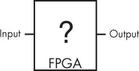
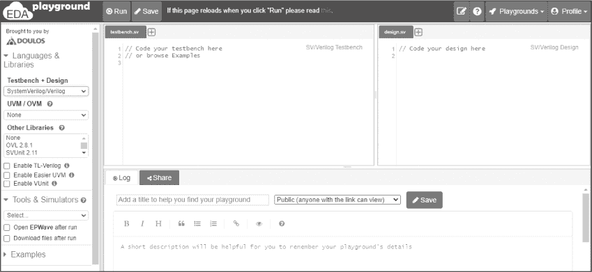
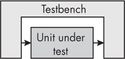
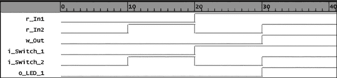
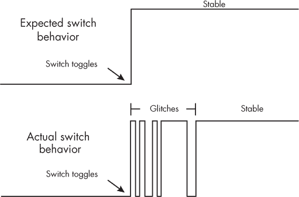
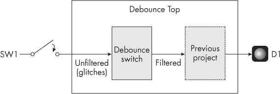
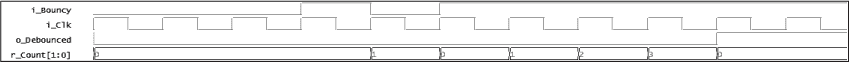

# 第十章：5 使用仿真测试你的代码


有两种方法可以找到 FPGA 设计中不可避免出现的错误。第一种方法是编程 FPGA，运行它，看看发生了什么。这被称为在*硬件*上找错。另一种方法是使用计算机将测试用例注入到 FPGA 代码中，看看代码在你实际编程 FPGA 之前如何响应。这被称为在*仿真*中找错。

对于非常简单的项目，比如本书到目前为止我们所探索的项目，直接跳过任何形式的仿真，直接编程 FPGA 可能是一个合理的方式（这也是我们到目前为止所采取的方式）。然而，随着 FPGA 设计的复杂度增加，发现硬件中的错误变得极其困难。在几乎所有情况下，在仿真中发现错误要容易得多。在彻底仿真和调试设计之后，没有什么比最终编程 FPGA 并且第一次就让一切工作完美更令人满足的了。

在这一章中，你将学习仿真是如何工作的，并了解它为何是 FPGA 设计过程中的一个重要步骤。我们将探索一个免费的仿真工具，并且我将介绍测试平台，展示如何编写测试代码来测试你的设计。你将通过为前一章中的 LED 切换项目（项目#3）添加去抖电路并仿真设计来实践这些概念。最后，我们将看看验证，这是一种更正式和严格的 FPGA 和 ASIC 设计测试过程。

## 为什么仿真很重要

仿真很重要，因为你的 FPGA 本质上是一个黑箱，正如图 5-1 所示。当你编程 FPGA 时，你能够更改输入并查看输出如何响应，但你无法看到箱子内部发生的具体细节。你不能追踪各个变量和数据信号在 FPGA 内部的流动。



图 5-1: 箱子里有什么？

如果黑箱内部出了问题（而且它一定会出现问题），并且输出结果与预期不符，找出问题所在是非常困难的。解决方案是使用计算机仿真黑箱的内部工作原理，以一种你可以理解的方式来查看。仿真有效地打开了 FPGA 的黑箱，让你能够看到内部发生了什么。

让我给你一个这个工具有多么有用的例子。在我过去的一份工作中，有一个同事在尝试修复他 FPGA 设计中的一个问题。由于某种原因，数据在 FPGA 内部被混淆了。他花了几个星期用示波器和逻辑分析仪将数据从 FPGA 中送出，以便查找问题的根源。有一次，我问他是否做过仿真设计。他没有做过：他没有仿真经验，也觉得自己没有时间去学习。我从版本控制中取出了他的代码，并为其制作了仿真模型，在几个小时内找出了问题。

仿真你的设计能够对其进行压力测试，看看它的反应。在这种情况下，我能够在仿真中重新创建出相同的故障，并迅速修复问题。具有讽刺意味的是，我的同事在硬件上调试问题时所花费的时间，他完全可以花时间学习如何进行仿真。考虑到一旦掌握了仿真原理，你可以反复使用这一技能，这无疑是一个更具吸引力的选择。

## FPGA 仿真工具

有几款流行的 FPGA 仿真工具可供选择。FPGA 构建工具通常会捆绑一个仿真工具，作为一个大型可下载的包提供；FPGA 公司知道他们的设计师需要运行仿真，因此他们希望简化这一过程。这些工具通常是免费的且方便使用，但它们的文件大小可能有好几个 GB，而且对初学者来说，工具的复杂性可能会让人不知所措。

针对大型 FPGA 工具的另一种解决方案是使用独立的仿真器。这样做的好处是，如果你从 Intel（Altera）切换到 AMD（Xilinx），例如，你不需要学习一个全新的工具；你的仿真器可以保持不变。我通常推荐两款流行的独立仿真工具：ModelSim 和 EDA Playground。ModelSim 可能是最流行的商业仿真器。它可以在 Windows 和 Linux 上下载并安装。完整版许可证很贵，价格大约为 2000 美元，但有一个功能有限的免费版本。

相比之下，EDA Playground 是一个免费提供的基于 Web 的仿真工具。我推荐在你刚开始学习 FPGA 设计时使用它，原因有几个。首先，它是免费的。其次，由于它是基于 Web 的，因此无需下载。最后，EDA Playground 允许你通过网页链接与他人共享代码。对于本书的目的，我们将重点介绍这个工具。

要开始使用 EDA Playground，首先访问 [*https://<wbr>edaplayground<wbr>.com*](https://edaplayground.com)。要运行仿真并保存进度，你需要创建一个账户并登录。登录后，你应该会看到像图 5-2 所示的界面。



图 5-2：EDA Playground 主界面

注意，有两个主要的代码窗口。右侧窗口，标题为*design.sv*，是你要测试的 FPGA 设计代码所在的地方。这个代码通常被称为*被测试单元（UUT）*或*被测试设备（DUT）*。左侧窗口，称为*testbench.sv*，是你编写*测试平台*的地方，测试平台代码将在仿真过程中对你的 FPGA 设计进行操作。我们将在下一节讨论测试平台的工作原理。

默认情况下，EDA Playground 配置为 SystemVerilog/Verilog 设计，这就是为什么两个窗口标签有 *.sv*（SystemVerilog）文件扩展名的原因。如果你希望将 EDA Playground 配置为 VHDL，请在窗口左侧的 Testbench + Design 下拉菜单中选择**VHDL**。

在你可以在 EDA Playground 中运行代码之前，你需要选择一个仿真工具。这是实际运行你代码的产品。你可以在“工具和仿真器”下拉菜单中尝试不同的工具，看看是否更喜欢其中的某一个。通常，我发现它们的行为非常相似，尽管有些工具是专门为 Verilog 或 VHDL 设计的。我使用 Mentor Questa 或 Aldec Riviera 取得过不错的成果。

EDA Playground 的另一个有趣功能是工具栏中的示例部分。在这里，你可以查看一些免费的示例测试平台。你可以了解它们的工作原理并修改它们用于自己的实验，或许还能获得一些写自己代码的巧妙思路。

## 测试平台

测试平台的目的是在仿真环境中对你的 UUT 进行操作，以便你可以分析它并查看它是否按预期工作。测试平台代码实例化了 UUT。如图 5-3 所示，测试平台提供了所有必需的输入给 UUT，并监控所有的输出。



图 5-3：测试平台对 UUT 进行操作，以便你进行分析。

如果你的被测试单元（UUT）有一个时钟作为输入，例如，测试平台将需要生成该时钟并将其馈送到 UUT 中。类似地，如果 UUT 有数据接口，测试平台可能需要生成一些样本数据并将其提供给该接口。测试平台会监控 UUT 的所有输出，从而了解 UUT 如何响应输入数据。在仿真过程中，你还可以深入查看 UUT 本身，了解其所有内部信号如何响应测试平台的输入。你可以监控设计中的每个元素——每个寄存器、时钟、信号线、存储器等等——并确保它们按预期工作。

### 编写测试平台

让我们通过为第三章（项目#2）中的与门项目编写一个测试平台来查看一个简单的例子。首先，回顾一下，这是我们要测试的原始项目代码：

Verilog

```
module And_Gate_Project
 (input i_Switch_1,
  input i_Switch_2,
  output o_LED_1);
assign o_LED_1 = i_Switch_1 & i_Switch_2;
endmodule
```

VHDL

```
library ieee;
use ieee.std_logic_1164.all;
entity And_Gate_Project is
  port (
    i_Switch_1 : in std_logic;
    i_Switch_2 : in std_logic;
    o_LED_1    : out std_logic);
end entity And_Gate_Project;
architecture RTL of And_Gate_Project is
begin
  o_LED_1 <= i_Switch_1 and i_Switch_2;
end RTL;
```

将模块或实体的代码输入到 EDA Playground 右侧的*design.sv*或*design.vhd*窗口中。为了完全测试代码，我们需要对其进行操作，确保输出在所有可能的输入组合下表现如预期。在这种情况下，输入组合的总范围相当小：由于有两个输入，因此只需要测试四种可能的组合，就能完全验证 UUT 的功能。我们将分别在 Verilog 和 VHDL 中创建测试平台，以实例化 UUT 并通过传入每种输入组合来进行测试。将以下代码输入到 EDA Playground 中的*testbench.sv*或*testbench.vhd*窗口中：

Verilog

```
❶ module And_Gate_TB();
  reg r_In1, r_In2;
  wire w_Out;
❷ And_Gate_Project UUT
  (.i_Switch_1(r_In1),
   .i_Switch_2(r_In2),
   .o_LED_1(w_Out));
❸ initial
    begin
    ❹ $dumpfile("dump.vcd"); $dumpvars;
       r_In1 <= 1'b0;
       r_In2 <= 1'b0;
       #10;
       r_In1 <= 1'b0;
       r_In2 <= 1'b1;
       #10;
       r_In1 <= 1'b1;
       r_In2 <= 1'b0;
       #10;
       r_In1 <= 1'b1;
       r_In2 <= 1'b1;
       #10;
       $finish();
    end
endmodule
```

VHDL

```
library IEEE;
use IEEE.std_logic_1164.all;
use std.env.finish;
❶ entity And_Gate_TB is
end entity And_Gate_TB;
architecture behave of And_Gate_TB is
  signal r_In1, r_In2, w_Out : std_logic;
begin
❷ UUT : entity work.And_Gate_Project
  port map (
    i_Switch_1 => r_In1,
    i_Switch_2 => r_In2,
    o_LED_1    => w_Out);
❸ process is
  begin
    r_In1 <= '0';
    r_In2 <= '0';
    wait for 10 ns;
    r_In1 <= '0';
    r_In2 <= '1';
    wait for 10 ns;
    r_In1 <= '1';
    r_In2 <= '0';
    wait for 10 ns;
    r_In1 <= '1';
    r_In2 <= '1';
    wait for 10 ns;
    wait for 10 ns;
    finish;
  end process;
end behave;
```

首先，请注意，这是我们第一次看到没有声明任何输入或输出的 Verilog 模块或 VHDL 实体❶。这是因为该测试平台没有连接任何外部信号；正如你在图 5-3 中看到的，测试平台本身提供输入。

在模块/实体内部，我们实例化了 UUT ❷。我们将 UUT 的输入连接到在测试平台中声明的r_In1和r_In2信号。这些信号将作为刺激输入，用于观察 UUT 的响应。我们将监控输出w_Out，以查看它如何响应变化的输入。我喜欢在信号名上使用w_前缀，表示 FPGA 内的电线或互连。记住，我们需要确保与门按预期工作。

我们开始在 Verilog 中的initial块或 VHDL 中的process块内驱动刺激（输入）。这个块会在仿真开始时执行，并按顺序从上到下执行。我们将逐一将四种可能的输入组合发送到 UUT。使用延时语句，我们在每个输入组合之间添加 10 纳秒的暂停，以便仿真有时间在每次变化后更新w_Out信号。在 Verilog 中，我们使用#10延时特性，在 VHDL 中则使用wait for 10 ns;。正如你将在本章稍后看到的，这些基于时间的延时——事实上，任何关于时间流逝的引用——都是不可综合的，意味着它们在实际 FPGA 上无法工作；然而，在仿真中它们可以完美运行。

在 Verilog 版本中，请注意 EDA Playground 需要$dumpfile指令❹。这使得模拟器能够生成波形，我们将在下一节进行讲解。VHDL 中不需要此行代码。

### 运行测试平台并查看波形

运行测试平台会生成*波形*，即测试环境中信号的可视化表示，展示信号如何随时间变化。波形是用于检查 FPGA 设计在仿真过程中失败的强大工具；你与 FPGA 打交道的时间越长，越会花时间盯着波形看。EDA Playground 通过内置的波形查看器 EPWave 使得查看波形变得更加简便。

让我们运行与门测试平台，并在 EPWave 中查看结果波形。首先，在 EDA Playground 窗口左侧的工具和仿真器部分勾选**运行后打开 EPWave**复选框。如果你使用的是 VHDL，你需要指定设计的顶层实体。为此，在“顶层实体”对话框中输入And_Gate_TB。然后从下拉菜单中选择一个仿真器工具并点击**运行**。图 5-4 显示了生成的波形。



图 5-4：与与门测试平台波形输出

在这里，我们可以看到设计中所有的信号，并且可以记录下每个信号从高到低或从低到高变化时的时间，单位为纳秒。顶部的三个信号（r_In1、r_In2、w_Out）是测试平台信号。底部的三个信号（i_Switch_1、i_Switch_2、o_LED_1）则位于被测单元（UUT）中。由于我们在实例化 UUT 时将测试平台和 UUT 信号连接在一起，因此对应的测试平台/UUT 信号是相同的。例如，r_In1的波形与i_Switch_1相同。注意，如果 UUT 中有其他内部信号没有从模块中引出，你也可以看到这些信号的波形，而且它们不会有对应的测试平台信号。

从波形图中，我们可以看到 UUT 的工作情况符合预期。只有当两个输入都为高时，AND 门的输出（o_LED_1 和 w_Out）才为高。当只有一个输入为高，或两个输入都为低时，输出为低。在检查波形时，回顾测试平台代码，注意波形中的变化是如何对应到<sub>initial</sub>或<sub>process</sub>块中的语句。例如，在代码中，两个输入一开始为低，之后<sub>r_In2</sub>在 10 ns 后变为高。查看波形中的 10 ns 位置，你可以看到<sub>r_In2</sub>和<sub>i_Switch_2</sub>从低变为高。

尽管这是一个简单的示例，但它展示了测试平台的强大功能，能够模拟你的 FPGA 设计并让你看到所有发生的事情。你可以监控设计中的所有交互，如果某个信号未按预期工作，你可以调查原因，修改代码，并重新运行测试平台生成新的波形。在调试问题时，我通常会重新运行数十次模拟，直到设计按预期工作为止。

在这种情况下，由于我们只测试了一个基本模块，因此我们可以使用一个测试平台文件来评估所有内容。然而，对于更复杂的模拟，测试平台可能包含多个文件，这些文件协同工作，模拟、监视并检查你的设计，以确保它按预期工作。

在我们的下一个项目中，你将更详细地了解测试平台的工作原理，我们将在项目中编写一个测试平台，并在编程硬件之前模拟 FPGA 设计。这将帮助你确认代码是否正常工作，并允许你在过程早期发现并修复任何 bug。该项目还展示了 FPGA 上时间概念的工作方式，即使你没有 FPGA 可以编程，我仍然建议阅读这一部分。

## 项目#4：去抖动一个开关

在第四章中，我们编程了一个 FPGA，使其在按下按钮时切换 LED 的状态。然而，存在一个问题：按下按钮并不能稳定地切换 LED 的状态。这是因为任何物理开关，包括按钮或切换开关，都容易受到*抖动*的影响，抖动是指当开关被切换或翻转时，信号发生快速波动。抖动发生在开关内部的金属触点快速接触后又迅速分开，未能及时稳定到稳定状态。图 5-5 展示了这一过程如何影响开关的输出信号。



图 5-5: 机械开关中的抖动

如果你不了解抖动，你可能会期待开关表现得像图 5-5 的上半部分。按钮被按下时，输出立即从低变高。然而，在现实世界中，抖动会在输出信号中产生毛刺，这表现为输出信号的快速低到高再到低的过渡，直到它最终保持高电平。这再次是因为机械开关接触点在快速接合和分开后，才稳定在一个稳定的输出状态。

我们在 LED 切换项目中的代码是寻找一个单一的下降沿来指示按钮的按下和释放，但由于抖动，FPGA 在每次按下/释放时都会看到多个下降沿。如果在抖动过程中看到了奇数个下降沿，那么 LED 就成功切换。如果看到的是偶数个下降沿，LED 则没有改变状态，因为每对下降沿实际上是相互抵消的。

开关上的抖动次数是有些随机的，因此按下开关足够多次，LED 才会成功切换。然而，如果每次按下和释放开关时，LED 都能按预期切换，那将更好。为了实现这一点，我们需要在开关上添加一个*去抖动滤波器*。也就是说，我们需要编程 FPGA 来忽略抖动。图 5-6 展示了这将如何工作。



图 5-6: 项目 #4 块图

我们将会在前一个项目的代码中加入一个去抖动滤波器，以确保按钮的单次按下只切换一次 LED。来自开关的信号将通过去抖动滤波器，然后再传递给我们在上一章中编写的 LED 切换逻辑。

我们通过确保来自开关的输入在允许驱动 LED 输出发生变化之前保持稳定一段时间来创建去抖动滤波器。因此，我们需要在 FPGA 中有某种关于时间流逝的概念。然而，将时间引入 FPGA 设计带来了一些有趣的挑战。

### 在 FPGA 上测量时间

时间在 FPGA 中本身并不存在。FPGA 不会自动知道现在是否是星期六上午 11:00，或者如何等待 100 毫秒，例如。确实，Verilog 和 VHDL 代码中有些部分是与时间相关的。例如，我们已经看到如何在 Verilog 中使用 #10 或在 VHDL 中使用 wait for 10 ns; 来给我们的与门测试平台添加 10 ns 的延迟。再举个例子，在 Verilog 中，你可以使用 $time 来获取当前时间，而在 VHDL 中，保留字 now 会获取当前时间的时间戳。然而，像这些特性在仿真中可以正常工作，但它们 100% 无法在你的 FPGA 上运行。它们是*无法综合的*。

我们已经讨论过几次综合。综合是构建过程中，FPGA 工具将你的 Verilog 或 VHDL 代码转化为触发器、查找表（LUT）和其他组件的部分。不幸的是，综合工具无法综合任何与时间相关的内容。这是无法实现的。因此，像 $time 和 now 这样的语言构造将被简单地忽略，或者在综合过程中产生错误。在第七章中，我们将更详细地了解哪些 VHDL 和 Verilog 特性无法在 FPGA 上综合。目前，先接受这样一个事实：我们无法使用与时间相关的某些内建特性。

如果时间在 FPGA 中不存在，如何追踪已过去的时间，以便执行去抖动开关或其他许多与你希望 FPGA 执行的时间相关的任务呢？答案是*计算时钟周期*。如果你知道已经发生了多少个时钟周期，并且你知道时钟的周期，就能知道已经过去了多少时间。让我们通过一个例子来演示。

假设你有一个时钟，它的频率为 25 MHz，时钟的周期——即单个周期的持续时间——是 40 ns。根据这些规格，经过 400 ns 需要多少个时钟周期？答案：10。那经过 4,000 ns 需要多少个时钟周期？答案：100。只需将你想要等待的时间除以时钟的周期，就能得到在该时间过去之前需要计数的时钟周期数。这项技术将在我们的去抖动项目中至关重要。

### 编写代码

让我们来看一下如何实现去抖动滤波器。我们将从顶层模块开始，它实例化并连接两个低层模块，一个用于去抖动开关，另一个用于切换 LED：

Verilog

```
module Debounce_Project_Top
  (input  i_Clk,
  input  i_Switch_1,
  output o_LED_1);
  wire w_Debounced_Switch;
❶ Debounce_Filter ❷ #(.DEBOUNCE_LIMIT(250000)) Debounce_Inst
  (.i_Clk(i_Clk),
   .i_Bouncy(i_Switch_1),
   .o_Debounced(w_Debounced_Switch));
❸ LED_Toggle_Project LED_Toggle_Inst
  (.i_Clk(i_Clk),
   .i_Switch_1(w_Debounced_Switch),
   .o_LED_1(o_LED_1));
endmodule
```

VHDL

```
library ieee;
use ieee.std_logic_1164.all;
entity Debounce_Project_Top is
  port (
    i_Clk       : in  std_logic;
    i_Switch_1  : in  std_logic;
    o_LED_1     : out std_logic
    );
end entity Debounce_Project_Top;
architecture RTL of Debounce_Project_Top is
  signal w_Debounced_Switch : std_logic;
begin
❶ Debounce_Inst : entity work.Debounce_Filter
    generic map(
    ❷ DEBOUNCE_LIMIT => 250000)
    port map (
      i_Clk      => i_Clk,
      i_Bouncy   => i_Switch_1,
      o_Debounced => w_Debounced_Switch);
❸ LED_Toggle_Inst : entity work.LED_Toggle_Project
    port map (
      i_Clk      => i_Clk,
      i_Switch_1 => w_Debounced_Switch,
      o_LED_1    => o_LED_1);
end architecture RTL;
```

这段代码与图 5-6 中的框图相匹配。在最高层，我们有 Debounce_Project_Top，它实例化了两个其他模块。第一个是新的去抖动滤波器 ❶，我们将在下文中检查它。第二个是我们在上一章创建的 LED_Toggle_Project 模块 ❸。值得花点时间跟踪这里的信号。我们可以看到输入信号 i_Switch_1 进入去抖动滤波器。从中输出 w_Debounced_Switch，这是该输入的去抖动版本。这个信号被传入 LED_Toggle_Project 模块。该模块的输出是 o_LED_1，它将连接到你开发板上的 LED 引脚。请注意，通过信号的名称来指示信号的方向，如我们在这里使用的 i_ 和 o_ 前缀，在设计变得更大且包含更多信号时非常有帮助。

在编写 FPGA 代码时，创建可重用模块的价值非常重要。与其从头开始编写所有项目的代码，不如在这里复用上一章的 LED_Toggle_Project 模块，并通过与另一个模块接口来改进其功能。另一个使模块可重用的方法是将 Verilog 的 *参数* 或 VHDL 的 *泛型* 纳入模块中。这些是模块中的变量，可以通过更高层的代码覆盖它们。当我们实例化 Debounce_Filter 模块时，就会这样做。具体来说，我们用值 250000 ❷ 来覆盖模块的参数/泛型 DEBOUNCE_LIMIT。正如你稍后会看到的，这个值设置了去抖动开关时需要等待的时钟周期数。将其编码为参数/泛型使得修改该值变得容易。通常，Verilog 中的参数和 VHDL 中的泛型是保持代码可移植的非常有用的方法。它们让你可以改变模块的行为，而无需实际修改模块的文件。

现在让我们来看看去抖动滤波模块的代码：

Verilog

```
module Debounce_Filter #(parameter DEBOUNCE_LIMIT = 20) (
  input  i_Clk,
  input  i_Bouncy,
  output o_Debounced);
❶ reg [$clog2(DEBOUNCE_LIMIT)-1:0] r_Count = 0;
  reg r_State = 1'b0;
  always @(posedge i_Clk)
  begin
  ❷ if (i_Bouncy !== r_State && r_Count < DEBOUNCE_LIMIT-1)
     begin
       r_Count <= r_Count + 1;
     end
  ❸ else if (r_Count == DEBOUNCE_LIMIT-1)
     begin
       r_State <= i_Bouncy;
       r_Count <= 0;
     end
     else
     begin
     ❹ r_Count <= 0;
     end
   end
❺ assign o_Debounced = r_State;
endmodule
```

VHDL

```
library ieee;
use ieee.std_logic_1164.all;
use ieee.numeric_std.all;
entity Debounce_Filter is
  generic (DEBOUNCE_LIMIT : integer := 20);
  port (
    i_Clk       : in  std_logic;
    i_Bouncy    : in  std_logic;
    o_Debounced : out std_logic
    );
end entity Debounce_Filter;
architecture RTL of Debounce_Filter is
❶ signal r_Count : integer range 0 to DEBOUNCE_LIMIT := 0;
  signal r_State : std_logic := '0';
begin
  process (i_Clk) is
  begin
    if rising_edge(i_Clk) then
    ❷ if (i_Bouncy /= r_State and r_Count < DEBOUNCE_LIMIT-1) then
         r_Count <= r_Count + 1;
    ❸ elsif r_Count = DEBOUNCE_LIMIT-1 then
         r_State <= i_Bouncy;
         r_Count <= 0;
       else
       ❹ r_Count <= 0;
       end if;
     end if;
  end process;
❺ o_Debounced <= r_State;
end architecture RTL;
```

该模块的整体目的是去除输入(i_Bouncy)中的任何抖动或故障，并产生一个稳定的输出(o_Debounced)。为了做到这一点，我们检查输入和输出是否不同。如果不同，我们知道输入正在变化，但我们不希望立即更新输出，因为开关可能还在抖动。相反，我们希望确保输入在更新输出之前已经稳定了一段足够长的时间。由于 FPGA 没有固有的时间概念，我们通过计数时钟周期来实现延迟。

假设我们希望输入在更新输出之前稳定 10 毫秒。我们需要计算出一个表示经过 10 毫秒（或 1000 万纳秒）时间的时钟周期数。例如，Go 板的时钟周期为 40 纳秒，所以在这种情况下，我们将 1000 万除以 40，得到 250,000 个时钟周期的延迟。这就是我们在顶层模块Debounce_Project_Top中使用的< samp class="SANS_TheSansMonoCd_W5Regular_11">DEBOUNCE_LIMIT参数/通用项的值。如果你的开发板有不同的时钟周期，你需要相应地调整DEBOUNCE_LIMIT。

用于创建我们时钟周期计数器❶的代码在 Verilog 和 VHDL 版本之间有所不同。在 Verilog 中，我们使用一种常见的技巧：内建函数$clog2()（表示向上取整的以 2 为底的对数）计算我们想要计数的时钟周期数量的对数[2]，并向上取整。这告诉我们实现计数器所需的二进制位数。得益于$clog2()函数，我们可以根据输入参数动态调整r_Count寄存器的大小，因此如果输入参数发生变化（因为你的时钟周期不同，或者因为你想要延长等待时间），代码将会自动适应并合成出合适大小的r_Count。这比将r_Count硬编码为某个任意限制要好得多，因为在代码重用时，硬编码可能会导致问题。

在 VHDL 中，我们能够以更简单的方式实现相同的动态大小调整，使用range关键字。这不仅会正确地调整变量的大小，而且还会在模拟时产生警告，如果r_Count的值超出了整数范围限制。模拟器能够在运行测试平台时提供这些类型的警告，这也是使用仿真的另一个重要原因。

我们通过一系列在每个时钟周期评估的 if 语句来实现去抖动滤波器。首先，我们处理输入与输出不同的情况（即输入发生变化），但 r_Count 小于 DEBOUNCE_LIMIT-1 ❷。这意味着我们还没有等待足够的时间，确保开关停止抖动，所以我们将时钟周期计数器加 1。在这个 if 语句中，我们实际上是在等待一定的时间，以确保输入是稳定的，然后再更新输出值。

接下来，我们处理计数器达到上限的情况，这样我们就知道我们已经等待了完整的 10 毫秒（或与 DEBOUNCE _LIMIT 对应的时间长度）❸。此时，我们可以将输入的当前值（i_Bouncy）注册到 r_State 中，其值接着被赋给输出（o_Debounced）❺。我们还将计数器重置为 0，以便为下一个事件做准备。最后，else 语句 ❹ 处理输入和输出状态相同的情况。在这种情况下，我们重置计数器，因为没有需要去抖动的内容，并且我们希望我们的去抖动滤波器始终准备好处理下一个事件。

### 创建测试平台和仿真

现在，我们将创建一个测试平台来测试我们的项目，并确保它按预期工作。回想一下，测试平台将实例化我们需要测试的单元并模拟其输入，同时监控其输出。在这种情况下，我们希望测试平台模拟来自抖动开关的不稳定输入，以便确认去抖动滤波器在开关稳定后才会延迟输出。以下是代码：

Verilog

```
module Debounce_Filter_TB ();
  reg r_Clk = 1'b0, r_Bouncy = 1'b0;
❶ always #2 r_Clk <= !r_Clk;
❷ Debounce_Filter #(.DEBOUNCE_LIMIT(4)) UUT
  (.i_Clk(r_Clk),
   .i_Bouncy(r_Bouncy),
   .o_Debounced(w_Debounced));
❸ initial begin
    $dumpfile("dump.vcd"); $dumpvars;
    repeat(3) @(posedge r_Clk);
 ❹ r_Bouncy <= 1'b1; // toggle state of input pin
    @(posedge r_Clk);
 ❺ r_Bouncy <= 1'b0; // simulate a glitch/bounce of switch
    @(posedge r_Clk);
 ❻ r_Bouncy <= 1'b1; // bounce goes away
    repeat(6) @(posedge r_Clk);
    $display("Test Complete");
    $finish();
  end
endmodule
```

VHDL

```
library ieee;
use ieee.std_logic_1164.all;
use std.env.finish;
entity Debounce_Filter_TB is
end entity Debounce_Filter_TB;
architecture test of Debounce_Filter_TB is
  signal r_Clk, r_Bouncy, w_Debounced : std_logic := '0';
begin
❶ r_Clk <= not r_Clk after 2 ns;
❷ UUT : entity work.Debounce_Filter
     generic map (DEBOUNCE_LIMIT => 4)
     port map (
        i_Clk       => r_Clk,
        i_Bouncy    => r_Bouncy,
        o_Debounced => w_Debounced);
❸ process is
  begin
     wait for 10 ns;
  ❹ r_Bouncy <= '1';  -- toggle state of input pin
     wait until rising_edge(r_Clk);
  ❺ r_Bouncy <= '0';  -- simulate a glitch/bounce of switch
     wait until rising_edge(r_Clk);
  ❻ r_Bouncy <= '1';  -- bounce goes away
     wait for 24 ns;
     finish;  -- need VHDL-2008
  end process;
end test;
```

与我们的与门测试平台不同，这个测试平台必须向 UUT 提供一个时钟信号，以及其他输入。我们用一个简单的技巧来创建时钟信号❶：在固定的时间间隔后反转信号，以生成一个 50% 占空比的信号，整个测试平台执行过程中信号会不断切换。该信号每 2 纳秒反转一次，每周期时钟周期为 4 纳秒。这个速度远远超过典型 FPGA 开发板的实际时钟周期，但对于此次模拟来说是可以的。

当我们实例化 UUT ❷时，我们将DEBOUNCE_LIMIT的值覆盖为4。这意味着我们的去抖动滤波器在认为输出已去抖动之前，将仅检查四个时钟周期的稳定性。在真实的 FPGA 中，这段时间非常短（不到 1 微秒），可能不足以实际解决问题。然而，请记住这个测试平台的目的：我们希望确保 FPGA 逻辑按预期工作。无论我们等待 4 个时钟周期还是 250,000 个时钟周期，这些逻辑在功能上是相同的。使用较小的数字将使仿真更快速，且更容易评估波形，同时仍能提供关于设计是否有效的真实反馈。缩短计数器的值是处理大规模设计时的一个实用技巧：此类设计的仿真可能需要很多分钟才能完成，但使用较小的计数器限制将加速仿真，使你能够更快速地调试代码。一旦设计完全调试并验证完毕，你可以用实际的计数器长度更新仿真，以验证最终设计。这意味着，在任何代码问题通过缩短仿真时间解决后，你只需忍受一次较长的仿真时间。

接下来，我们开始向 UUT ❸提供刺激信号。在同步设计中，我们希望确保输入信号与时钟同步。因此，我们设置代码，在测试平台时钟的上升沿更改刺激信号。否则，我们可能会引入一些在真实 FPGA 设计中不存在的奇怪时序效应。（记住，UUT 中的所有触发器都将使用时钟的上升沿，因此你的测试平台刺激信号也应当响应时钟的上升沿。）

当测试开始时，输入为低电平。经过一段短时间后，输入变为高电平，持续一个时钟周期 ❹，然后再次变为低电平 ❺，以模拟因抖动引起的故障。我们希望确保该模块的去抖动输出不会对这个故障做出反应。在测试的后期，我们将输入再次拉高并保持高电平 ❻。这时，我们希望输出与输入一致，但仅在去抖动滤波器完成四个时钟周期的计数后才会匹配。

在 EDA Playground（或任何你偏好的仿真器）中运行此测试平台代码后，你应该会得到一个类似于图 5-7 所示的波形。



图 5-7：去抖动仿真波形

波形显示，当i_Bouncy仅在一个时钟周期内变高时，输出o_Debounced保持低电平。然后，在模拟的后期，我们看到输出变为高电平，与输入匹配，但只有当输入保持高电平达到四个时钟周期后。去抖动滤波器工作正常！

虽然我们编写的测试平台比没有测试要好，但它肯定可以改进。例如，我们没有检查输入再次变低时的情况，以确保输出正确响应。此外，我们可能还需要检查更高的DEBOUNCE_LIMIT值（大于4）是否会导致任何问题。设置多个测试用例来测试你设计的主要部分，尤其是任何极限情况，是良好的测试设计实践。

### 构建和编程 FPGA

在模拟设计后，我们现在有了一定的信心，如果继续编程 FPGA，它很可能会按预期工作。让我们试试看！在 iCEcube2 中创建一个新项目，并将以下模块添加到项目中：Debounce_Filter、Debounce_Project_Top和LED_Toggle_Project。确保你还包括了时钟约束文件以及物理约束文件。

当一切准备就绪后，构建项目。然后再仔细检查是否有错误，并检查你的利用率报告。构建 FPGA 后的合成报告将类似于以下内容：

```
`--snip--`
Register bits not including I/Os:   21 (1%)
Total load per clock:
   i_Clk: 1
Mapping Summary:
Total  LUTs: 31 (2%)
`--snip--`
```

从这份报告中，我们可以看到我们使用的 LUT 和触发器比第 3 号项目多。这是有道理的；去抖动滤波器需要这些额外的资源。尽管如此，FPGA 仍然有充足的资源可供使用。

继续编程你的 FPGA，然后尝试按下按钮以开关 LED。你应该会注意到，LED 现在会随着每次按下按钮而稳定切换。我们已经成功地过滤掉了开关的抖动。

如你在这个项目中所见，模拟对于建立设计信心和调试 Verilog 与 VHDL 中的问题是不可或缺的。然而，即使在这个相对简单的示例中，你可能也注意到一个缺点：查看波形以确定设计是否正常工作可能非常繁琐，尤其是当你需要不断修改设计并重新运行模拟时。如果测试平台能直接告诉你模拟是否成功，而无需你去分析波形，那将方便得多。正如我们接下来要探讨的，完全可以编写具备这种能力的测试平台。

## 自检测试平台

一个*自检测试平台*是一个你编程的测试平台，用来验证你的 UUT 是否按预期工作，而无需手动检查输出。自检测试平台将运行一系列步骤，并告知你是否有任何步骤失败，在这种情况下你可以检查故障并修复它。这可以避免你在仿真过程中需要视觉检查波形，以确定设计是否按预期工作。虽然设置自检测试平台需要更多的努力，但几乎总是值得花时间去做。

设置自检测试平台时，你的目标是向你的 UUT 注入许多不同的测试用例，然后监控输出并检查，或*断言*，它们是否符合你的预期。*断言*是在仿真过程中某一特定时刻信号值的声明，它们可能是自检测试平台中最关键的部分。通常，自检测试平台会包含数百个断言，每个断言都能为设计的正确性提供更多的信心。

自检测试平台在你为旧代码添加新功能时特别有用。它可能是你几年没看过的东西，而突然间你需要尝试回忆（或者如果是别人写的，你需要学习）它是如何工作的。根据经验，我可以告诉你，开始时使用一个包含许多检查的测试平台是一个巨大的优势。你可以打开仿真，查看自检测试平台中的所有断言，并确保旧代码中的所有功能仍然有效。然后你可以添加新代码，并为其添加新的测试。一旦所有旧的*和*新的测试都通过，你就可以非常有信心地认为新代码按预期执行——同样重要的是，*你没有破坏任何旧代码*。

为了说明自检测试平台是如何工作的，让我们回到本章前面我们为与门项目编写的简单测试平台。以下的 Verilog 和 VHDL 代码基于我们写的原始测试平台，并在其中添加了一些断言检查。这些断言将自动运行，以验证实际输出是否处于预期状态。新的代码以**粗体**显示：

Verilog

```
`--snip--`
  initial
    begin
       $dumpfile("dump.vcd"); $dumpvars;
       r_In1 <= 1'b0;
       r_In2 <= 1'b0;
       #10;
    ❶ **assert (w_Out** == **1'b0);**
       r_In1 <= 1'b0;
       r_In2 <= 1'b1;
       #10;
       **assert (w_Out** == **1'b0);**
`--snip--`
```

VHDL

```
`--snip--`
process is
  begin
    r_In1 <= '0';
    r_In2 <= '0';
    wait for 10 ns;
 ❶ **assert (w_Out** = **'0') severity failure;**
    r_In1 <= '0';
    r_In2 <= '1';
    wait for 10 ns;
    **assert (w_Out** = **'0') severity failure;**
`--snip--`
```

在这段来自测试平台的摘录中，我们添加了两个检查。我们首先使用assert关键字 ❶确认当两个输入都为低时，输出为低，然后确认当一个输入为低，另一个输入为高时，输出依然为低。assert关键字仅存在于 SystemVerilog 中，而在普通的 Verilog 中并没有。这个例子展示了 SystemVerilog 如何为测试平台提供了改进的功能。与此同时，VHDL 中内建了assert，其严重性可以是note、warning或failure，具体取决于你希望检查的断言级别。每个级别有不同的升级方式，因此你可以在报告中进行过滤。在这种情况下，我们选择了failure，因为当输入为低时，我们肯定不希望 AND 门的输出为高。

如果这个断言评估为true，则仿真会继续进行。然而，如果发生了问题并且断言失败，你将看到屏幕上打印出的输出。在 Verilog 中，你会看到类似这样的内容：

```
# ASSERT: Error: ASRT_0301 testbench.sv(20): Immediate assert
condition (w_Out==1'b1) FAILED at time: 10ns, scope: And_Gate_TB
```

在 VHDL 中，失败信息将如下所示：

```
# ** Failure: Assertion violation.
#    Time: 10 ns Iteration: 0  Process: /and_gate_tb/line__22
File: testbench.vhd
```

这非常有帮助！我们不仅知道测试平台失败了，而且知道它在仿真开始的第 10ns 时发生了失败，这使得我们可以立即在波形查看器中定位到失败位置。我们还知道导致失败的确切代码行：在 Verilog 中是第 20 行，VHDL 中是第 22 行。这些信息使得我们更容易调查问题、理解原因并修复它。我建议在可能的情况下将断言添加到你的测试中。

自检测试平台是 SystemVerilog 特别出色的一个方面。除了常规 Verilog 提供的功能，许多新增的特性都旨在编写更好的测试平台。例如，SystemVerilog 提供了验证事件序列的功能。这对分析不同信号之间的交互非常有用，可以确保它们按正确顺序发生（也就是说，首先发生一件事，然后在下一个时钟周期发生另一件事）。SystemVerilog 还提供了类，使你能够使用面向对象编程技术来简化测试平台代码。其他 SystemVerilog 功能允许你将数据随机注入到设计中，从而使测试变得更加全面和健壮。这些功能的详细内容超出了本书的范围，但当你开始编写更多的测试平台，特别是自检测试平台时，我鼓励你深入了解 SystemVerilog。

## 初始信号条件

默认情况下，如果信号没有赋予初始条件，那么在开始仿真时它将处于未知状态。通常，这会在波形查看器中通过红色信号和 X 标记表示。仿真器告诉你，在测试平台开始运行时，它不知道如何处理该信号。应该是 0 还是 1？仿真器不知道。

有两种方法可以将默认状态分配给信号，以便它们从已知状态开始。第一种方法是使用复位信号。正如我们在第四章中讨论的，复位信号为触发器分配一个初始默认值。在仿真开始时驱动复位输入将把信号设置为已知状态，从而开始测试。这适用于所有分配了复位条件的信号。

另一种将信号设置为初始状态的方法是使用 Verilog 和 VHDL 中的初始化功能。这在仿真中尤其有用。它和为信号赋值一样简单。在 Verilog 中，例如，reg r_State = 1'b0; 将< s r_State信号初始化为 0。在 VHDL 中，signal r_State : std_logic := '0'; 也可以达到相同效果。你可以使用信号可以合法设置的任何状态作为初始化值。

初始信号赋值仅在某些 FPGA 上可合成，因为并非所有 FPGA 在编程后启动时都能将初始状态加载到触发器中。由于并非所有 FPGA 都支持此功能，我通常不推荐依赖它。一种更好的、具有更好可移植性的解决方案是使用复位信号将信号设置为某个默认值。复位信号在所有 FPGA 制造商中广泛支持，因此如果你需要更换 FPGA，代码会更加可移植。

## FPGA 上调试

本章早些时候，我告诉过你，一旦进入硬件，你就像是在看一个黑箱。你可以看到输入和输出，但看不清楚内部发生了什么。事实上，这并不完全正确。*确实*有一种方法可以进行有限的 FPGA 上调试。然而，这种方法有显著的缺点，应该仅在必要时使用。

在 FPGA 上调试是通过添加一个*逻辑分析仪*来实现的，逻辑分析仪是一种工具，能够同时显示多个数字信号的状态（高或低）。这可以让你实时监控 FPGA 的内部信号。通过查看这些信号，你可以调试问题，看到数据为何未按预期行为运行。

每个主要的 FPGA 公司在其工具套件中都有一个独特的产品，用于在 FPGA 内部创建逻辑分析仪。AMD 有一个叫做集成逻辑分析仪（ILA）的功能，Intel 有 Signal Tap，Lattice 有 Reveal。它们的工作方式基本相同：它们将 FPGA 的一部分资源转化为逻辑分析仪。你运行 FPGA 代码，逻辑分析仪“嗅探”数据，然后将结果展示在你的计算机屏幕上，以便你调试设计。

然而，这个过程存在几个问题。第一个问题是它非常耗时。如果你想在 FPGA 中添加逻辑分析仪，你需要重新构建并重新编程整个设计。你还需要提前决定你希望用逻辑分析仪监控哪些信号，因为你的 FPGA 资源可能不足以查看所有内容。如果你想在 FPGA 正在运行时更改查看的内容，那就算了！你必须从头开始重新构建整个 FPGA，并重新开始整个过程。另一方面，模拟可以轻松地查看 FPGA 上*所有*信号的状态；你不必挑选和选择。

FPGA 上调试的另一个问题是，添加逻辑分析仪基本上是一次性的工作。一旦你找到并修复了一个问题，你就不再需要调试工具了。事实上，由于它使用 FPGA 的资源（而资源是有限的），你可能不希望将其保留在设计中。你可以保存并重新运行模拟，但逻辑分析仪是一次性调试工作。

最后一个，可能也是最糟糕的问题是，当你在 FPGA 中添加逻辑分析仪时，你实际上是在改变 FPGA 的设计，这可能会带来意想不到的后果。那些可能受到小的时序变化影响的问题，可能会因为添加逻辑分析仪的动作而得到解决，或者可能会出现新的问题。例如，如果你正试图使用逻辑分析仪来调试 FPGA 内部的竞态条件，添加逻辑分析仪所带来的设计变化可能会使竞态条件消失。科学家称之为*观察者效应*，即现象因调查行为而发生变化。

这并不是说这些在 FPGA 上的调试工具完全没有用。当你试图调查一个难以模拟的情况时，它们是有帮助的。例如，假设你的 FPGA 与某个外部接口存在问题，但这些问题只在硬件上出现，而模拟却正常。在这种情况下，你可能想启动一个逻辑分析仪，看看为什么你的模拟与现实不符。一旦弄明白了原因，你应该努力让模拟尽可能逼真，将通过真实世界测试识别到的故障模式加入其中。

这些工具在我的职业生涯中救过我几次，但一般来说，我尽量避免使用它们。

## 验证

*验证*是确保 FPGA 或 ASIC 设计按预期工作的一种过程。这是一个全面的过程，远远超出仅仅编写几个测试平台和运行仿真的范围——以至于有些人专门从事验证工作，这些人被称为验证工程师。验证的具体细节超出了本书的范围。实际上，有整本书专门讲解这个主题。本节只是简要介绍这个话题，让你了解验证在现实世界中的 FPGA 和 ASIC 设计中可以发挥的重要作用。

设想一个像 DVD 播放器这样的设备。如果 DVD 正在播放，然后用户暂停播放、弹出 DVD，并按下快进按钮，会发生什么？代码是否正确处理了这一系列事件？或者，意外的快进指令是否让处理器陷入了一个奇怪的状态？验证工程师必须测试所有这些极端情况，确保设计不会在处理一些奇怪的情况时出错。

在第一章中，我提到过制造 ASIC 是一个非常昂贵且耗时的过程。一旦 ASIC 在铸造厂完成制造，你就得付出一大笔费用。如果设计中有关键的错误，导致 ASIC 无法按预期工作，那么你就失去了所有的钱，而且还需要重新进行 ASIC 制造过程。验证工程师的工作就是确保设计在一开始就正确，因为事后发现并修复错误是非常昂贵的。

排除错误是很棒的，但这只是好处的一半。验证的另一个主要目标是确保设计按预期执行。如果你收到了一份关于 ASIC 性能的规格说明，可能会有一些模糊或缺失的信息。通常，一个或多个设计师会根据规格进行设计，而一个或多个独立的验证工程师会同时验证设计是否符合规格。如果出现任何不一致，两个团队可以聚在一起，更新规格，以便大家都能明确理解设计意图。

大多数验证工程师会利用 SystemVerilog 内置的额外功能来彻底测试设计。自检查的测试平台是绝对必须的。随机测试设计也是非常有帮助的，因此有一些代码块可以将随机的测试用例注入到设计中，确保它按预期工作。

像这样的代码验证可不是小事。通常，验证设计是否正确工作比创建设计本身还要昂贵且耗时！因此，与 ASIC 不同，并不是所有 FPGA 设计都经过专门的验证过程。在大多数情况下，这实在是太昂贵了。记住，FPGA 代表*现场可编程*门阵列，所以如果允许一些错误漏网，设备总是可以在现场或客户手中进行更新。

通常，只有那些要求非常高可靠性或在现场无法更新的 FPGA 设计才会进行验证。例如，一些 FPGA 是*一次性可编程（OTP）*的，意味着它们只能编程一次；之后，功能被锁定且无法更改。一些外太空应用使用这些 OTP FPGA，因为它们对辐射更具抵抗力。此外，OTP FPGA 被认为不容易受到逆向工程的影响，因此它们更适用于高安全性的应用。OTP FPGA 设计通常需要验证；然而，这对于典型的 FPGA 设计来说并不常见。

对于我们的目的，测试平台足以在 FPGA 设计中找到漏洞，但对于需要验证的 ASIC 或 FPGA 来说，验证至关重要。

## 总结

在这一章中，你了解了如何模拟你的 FPGA 代码，并看到运行模拟是非常值得的。与硬件调试相比，模拟让你能够可视化设计中的所有信号，观察它们如何相互作用，并创建刺激来测试你的代码并查看其响应。你练习了编写测试平台的代码，或者是实例化 UUT、注入样本输入并监控输出的代码。你看到了通过观察模拟过程中生成的波形是一种很好的方法来检查设计是否正常工作，但更好的是添加自检测试，使你的测试平台能够自我验证。减少硬件调试，增加漂亮的模拟：这就是让 FPGA 设计师快乐的原因。
