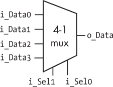
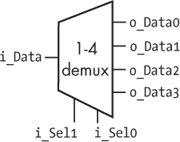
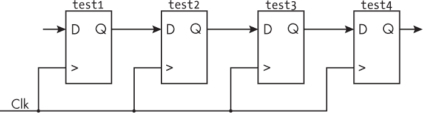
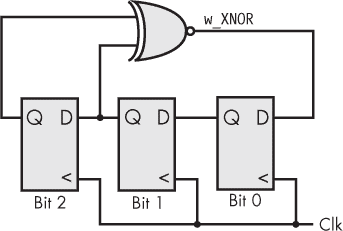
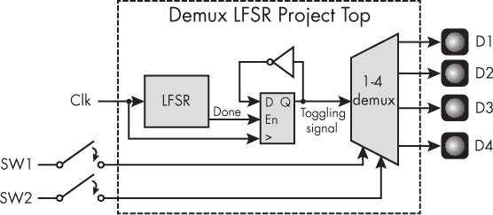
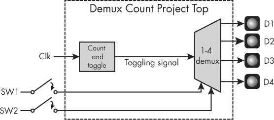
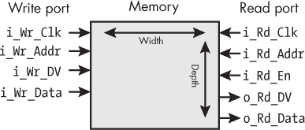
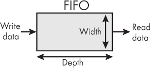
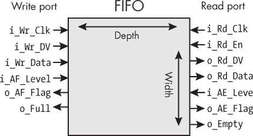
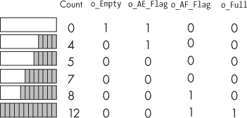

# 第十一章：6 常见的 FPGA 模块


使用 FPGA 的工作方式有点像用乐高积木搭建：你手头有有限种类的小积木，但通过巧妙地堆叠它们，你可以创造出非常复杂的设计。在最低层次上，你正在使用查找表（LUT）和触发器（flip-flops）。在稍微高一点的层次上，FPGA 设计中反复出现几个基本构件，包括多路复用器和解复用器、移位寄存器、先进先出（FIFO）以及其他类型的存储器。

这些元件都是非常常见的。事实上，很可能在你以后参与的每一个 FPGA 项目中，都至少会用到其中一个或多个。在本章中，我将向你展示这些基本构件如何工作，以及如何用 Verilog 和 VHDL 实现它们。对于每一个常见的元素，你将创建一个自包含模块，以便在 FPGA 设计中需要该元素时随时重用。这将巩固你的 FPGA 编程知识，并为你的项目打下坚实的基础。

## 多路复用器和解复用器

*多路复用器*和*解复用器*是电路元件，它们允许你在两个或更多的选项之间进行选择。对于多路复用器（有时拼写为 *multiplexor*，通常缩写为 *mux*），你有多个输入信号，并选择其中一个信号发送到单个输出。而解复用器（简写为 *demux*）正好相反：你有一个输入信号，选择将其发送到多个输出中的哪一个。

多路复用器和解复用器有很多应用。例如，一个 mux 可以用来选择风扇的运行速度：低-中-高开关可能作为一个 mux 来控制哪个设置被发送到风扇控制器。一个解复用器可以与开关配合工作，用来选择点亮哪个四个 LED：每次只会点亮一个 LED，但你可以指定点亮的是哪个。

Mux 和 demux 根据输入和输出的数量进行分类。例如，一个 4-1（发音为 *四对一*）mux 有四个输入和一个输出。相反，一个 1-4（发音为 *一对四*）demux 有一个输入和四个输出。你可以根据电路的需求设计具有任意数量输入的 mux：你可以有一个 2-1 mux、一个 3-1 mux、一个 8-1 mux、一个 13-1 mux，或者任何你想要的设计。同样，你也可以设计一个具有所需输出数量的 demux。

### 实现多路复用器

让我们考虑如何在 FPGA 上创建一个多路复用器。具体来说，我们将查看如何创建一个 4-1 mux，但你可以将相同的逻辑应用到任何输入数量的 mux 上。图 6-1 展示了一个 4-1 mux 的框图。



图 6-1：一个 4-1 多路复用器（mux）

我们的多路复用器左侧有四个输入：i_Data0、i_Data1、i_Data2 和 i_Data3。右侧是单一输出，称为 o_Data。底部是两个额外的输入，标记为 i_Sel1 和 i_Sel0。*Sel* 是 *select* 的缩写。这些选择输入决定哪个数据输入传递到输出。 表 6-1 的真值表显示了 i_Sel1 和 i_Sel0 如何一起工作以确定多路复用器的输出。

表 6-1： 4-1 多路复用器的真值表

| i_Sel1 | i_Sel0 | o_Data |
| --- | --- | --- |
| 0 | 0 | i_Data0 |
| 0 | 1 | i_Data1 |
| 1 | 0 | i_Data2 |
| 1 | 1 | i_Data3 |

从 表 6-1 中我们可以看到，当 i_Sel1 和 i_Sel0 都为 0 时，i_Data0 被连接到输出。当 i_Sel1 为 0，i_Sel0 为 1 时，输出得到 i_Data1；当 i_Sel1 为 1，i_Sel0 为 0 时，输出得到 i_Data2；当两个选择器都为 1 时，输出得到 i_Data3。

注意

*由于多路复用器（mux）用于选择哪些输入连接到哪些输出，因此它们通常被称为* 选择器*。实际上，select 是 VHDL 中的一个保留字，可以用来生成多路复用器。*

在 Verilog 或 VHDL 中实现这个真值表，只需评估 i_Sel1 和 i_Sel0 并将适当的数据输入分配给输出即可。以下代码显示了如何实现（我省略了信号定义，以便专注于实际的多路复用器代码，更多上下文可以在书籍的 GitHub 仓库中找到，链接为 *[`<wbr>github<wbr>.com<wbr>/nandland<wbr>/getting<wbr>-started<wbr>-with<wbr>-fpgas`](https://github.com/nandland/getting-started-with-fpgas)*）：

Verilog

```
assign o_Data = !i_Sel1 & !i_Sel0 ? i_Data0 :
                !i_Sel1 &  i_Sel0 ? i_Data1 :
                 i_Sel1 & !i_Sel0 ? i_Data2 : i_Data3;
```

VHDL

```
o_Data <= i_Data0 when i_Sel1 = '0' and i_Sel0 = '0' else
          i_Data1 when i_Sel1 = '0' and i_Sel0 = '1' else
          i_Data2 when i_Sel1 = '1' and i_Sel0 = '0' else
          i_Data3;
```

Verilog 版本使用条件（或三元）运算符，用问号（?）表示。这是一个简写方式，用于在不使用 if…else 语句的情况下编写条件表达式。该运算符的工作原理是首先评估问号前的条件（例如，!i_Sel1 & !i_Sel0）。如果条件为真，表达式选择冒号前的条件；如果条件为假，则选择冒号后的条件。在这里，我们将多个 ? 运算符串联在一起，以处理两个选择输入的所有可能组合。

在 VHDL 版本中，我们通过链式使用多个 when/else 语句来实现相同的功能。由于 VHDL 版本使用了更多的显式关键词，因此可读性稍强，但 Verilog 更加简洁。在 Verilog 和 VHDL 版本中，逻辑检查会被逐一评估，直到某个检查为真。如果没有任何检查为真，则使用链中的最后一个赋值语句。

### 实现解复用器

对于一个 1-4 解复用器，块图看起来像是一个 4-1 多路复用器的镜像版本，正如在 图 6-2 中所示。



图 6-2：一个 1-4 解复用器（demux）

这个解复用器（demux）接受左侧的单个数据输入（i_Data），并选择将其连接到哪个输出。该解复用器进行的是 1-4 选择，因此需要两个输入选择器来在四个可能的输出之间进行选择。表格 6-2 显示了所有可能的组合。

表 6-2： 1-4 解复用器的真值表

| i_Sel1 | i_Sel0 | o_Data3 | o_Data2 | o_Data1 | o_Data0 |
| --- | --- | --- | --- | --- | --- |
| 0 | 0 | 0 | 0 | 0 | i_Data |
| 0 | 1 | 0 | 0 | i_Data | 0 |
| 1 | 0 | 0 | i_Data | 0 | 0 |
| 1 | 1 | i_Data | 0 | 0 | 0 |

从表格中可以看到，i_Data一次只能连接到四个输出中的一个，这取决于i_Sel1和i_Sel0选择器输入。当i_Sel1和i_Sel0都为 0 时，o_Data0获取i_Data；否则它的值为 0。当i_Sel1为 0 且i_Sel0为 1 时，o_Data1获取i_Data；否则它的值为 0。当i_Sel1为 1 且i_Sel0为 0 时，o_Data2获取i_Data；否则它的值为 0。最后，当i_Sel1为 1 且i_Sel0为 1 时，o_Data3获取i_Data；否则它的值为 0。接下来我们来看看如何在 Verilog 和 VHDL 中实现这个真值表：

Verilog

```
module Demux_1_To_4
 (input  i_Data,
  input  i_Sel1,
  input  i_Sel0,
  output o_Data0,
  output o_Data1,
  output o_Data2,
  output o_Data3);
❶ assign o_Data0 = !i_Sel1 & !i_Sel0 ? i_Data : 1'b0;
assign o_Data1 = !i_Sel1 &  i_Sel0 ? i_Data : 1'b0;
assign o_Data2 = i_Sel1 & !i_Sel0 ? i_Data : 1'b0;
assign o_Data3 = i_Sel1 &  i_Sel0 ? i_Data : 1'b0;
endmodule
```

VHDL

```
library ieee;
use ieee.std_logic_1164.all;
entity Demux_1_To_4 is
  port (
    i_Data  : in  std_logic;
    i_Sel0  : in  std_logic;
    i_Sel1  : in  std_logic;
    o_Data0 : out std_logic;
    o_Data1 : out std_logic;
    o_Data2 : out std_logic;
    o_Data3 : out std_logic);
end entity Demux_1_To_4;
architecture RTL of Demux_1_To_4 is
begin
❶ o_Data0 <= i_Data when i_Sel1 = '0' and i_Sel0 = '0' else '0';
  o_Data1 <= i_Data when i_Sel1 = '0' and i_Sel0 = '1' else '0';
  o_Data2 <= i_Data when i_Sel1 = '1' and i_Sel0 = '0' else '0';
  o_Data3 <= i_Data when i_Sel1 = '1' and i_Sel0 = '1' else '0';
end architecture RTL;
```

注意到这段代码中的每个输出都是独立设置的。输入i_Data一次只能赋值给一个输出。例如，当两个选择器输入都为 0 ❶时，我们将其赋值给第一个输出o_Data0。当输出没有连接到输入数据时，它会被设置为 0，以禁用该输出。

实际上，由于多路复用器（mux）或解复用器（demux）可以通过几行代码创建，因此你不太可能会创建一个模块来实例化一个单独的多路复用器或解复用器。通常情况下，你最好将构建 mux 或 demux 的代码直接放入需要它的模块中。然而，多路复用器和解复用器是非常常见的电路设计元件，因此理解如何实现它们非常重要。接下来，我们将看另一个常见组件：移位寄存器。

## 移位寄存器

一个*移位寄存器*是由一系列触发器组成，其中一个触发器的输出连接到下一个触发器的输入。在第四章中，我们讨论过触发器链，但为了简单起见，我当时没有介绍这个术语。回顾一下，图 6-3 展示了一个四个触发器组成的链条，我们现在可以称之为*4 位移位寄存器*。如第四章所讨论，链中的每一个附加触发器都会为输出增加一个时钟周期的延迟。



图 6-3：移位寄存器

移位寄存器有很多用途。例如，它们可以延迟数据若干固定的时钟周期，或者将数据从串行转换为并行，或从并行转换为串行，甚至可以创建线性反馈移位寄存器。在本节中，我们将看到每种应用的示例。

### 延迟数据

在 FPGA 中创建延迟是移位寄存器最常见的应用。延迟通常用于对齐数据的时间。例如，当你通过数学运算发送输入数据时，可能需要几个时钟周期才能产生结果。如果需要将输出结果与原始输入数据对齐，那么原始输入数据就需要延迟与数学运算所需时钟周期的数量相同的时间。

正如我们所看到的，移位寄存器仅仅是由一串触发器组成，链中触发器的数量决定了输入数据传播到输出所需的时钟周期数。考虑到这一点，下面的代码将创建一个移位寄存器，它在某些输入数据上生成四个时钟周期的延迟：

Verilog

```
❶ reg [3:0] r_Shift;
always @ (posedge i_Clk)
  begin
  ❷ r_Shift[0]   <= i_Data_To_Delay;
  ❸ r_Shift[3:1] <= r_Shift[2:0];
  end
```

VHDL

```
❶ signal r_Shift : std_logic_vector(3 downto 0);
process (i_Clk)
begin
  if rising_edge(i_Clk) then
  ❷ r_Shift(0)          <= i_Data_To_Delay;
  ❸ r_Shift(3 downto 1) <= r_Shift(2 downto 0);
  end if;
end process;
```

这里我们创建了一个名为r_Shift的移位寄存器，它的长度为四个触发器❶。请记住，名字中的r_是一个提示，表示信号由触发器组成，并将在一个时钟驱动的always块（在 Verilog 中）或process块（在 VHDL 中）中赋值。我们将链中的第一个触发器（位置0）加载为输入信号i_Data_To_Delay❷。然后，我们使用一个技巧，通过一行代码创建剩余三个触发器的赋值，而不是三行：我们将触发器0到2的值赋给触发器1到3❸。这样，链中第一个触发器中的数据被移到第二个触发器，第二个触发器中的数据被移到第三个，以此类推。如果你愿意，也可以将此步骤分解为单独的操作，如下所示：

```
r_Shift[3] <= r_Shift[2];
r_Shift[2] <= r_Shift[1];
r_Shift[1] <= r_Shift[0];
```

这个例子展示的是 Verilog 版本。对于 VHDL，使用括号替换方括号。

分别写出每个赋值操作可以更明确地展示数据如何逐位通过移位寄存器移动，但这两种方法的效果是一样的。现在我们可以将<sup class="SANS_TheSansMonoCd_W5Regular_11">r_Shift</sup>的第3位用于我们的目的，因为这是代表输入数据i_Data_To_Delay延迟四个时钟周期的触发器。如果我们需要一个三时钟周期的延迟，可以使用第2位的数据，或者我们可以在链中添加更多的触发器来创建更长的延迟。

### 串行与并行数据之间的转换

将串行数据转换为并行数据，反之亦然，是移位寄存器的另一个常见用途。当与外部芯片接口进行通信时，可能需要进行这种转换，尤其是当这些接口串行地发送和接收数据时。一个具体的例子是与*通用异步接收发送器（UART）*的接口。这是一种通过将字节数据拆分成单个比特来发送的设备，然后在接收端重新组装成字节。当数据发送时，它会从并行转换为串行：一个字节中的八个并行比特依次串行发送。当数据接收时，它会从串行（单个比特）转换回并行（一个完整的字节）。

UART 被广泛用于设备之间的数据发送和接收，因为它们简单且高效，且非常适合应用于移位寄存器。一个八位移位寄存器可以通过一次读取一个触发器来发送一个字节的数据，或者通过将比特逐个移入触发器链来接收一个字节的数据。例如，假设我们要发送和接收 ASCII 编码的字符，每个字符都可以在一个字节的数据中表示。首先，我们来看 UART 的接收端。表 6-3 中的每一行表示接收到一个数据比特。右侧的列展示了通过移位寄存器将比特逐个移入后，如何构建完整的字节。

表 6-3： 通过 UART 接收一个字节的数据

| 比特索引 | 接收到的比特 | 字节内容 |
| --- | --- | --- |
| 0 | 1 | 1 |
| 1 | 1 | 11 |
| 2 | 0 | 011 |
| 3 | 1 | 1011 |
| 4 | 0 | 01011 |
| 5 | 0 | 001011 |
| 6 | 1 | 1001011 |
| 7 | 0 | 01001011 |
|  |  | ASCII=0x4B='K' |

UART 通常从最低有效位（最右边的位）开始接收数据。接收到的第一个比特会从最左边的最高有效位位置通过移位寄存器移到最低有效位位置，随着更多比特的到来。让我们来看看这个过程是如何工作的。

在表格的第一行，我们接收到第一个比特，它的值是1。我们将其放入最重要的比特位置，即移位寄存器中的第一个触发器。当我们接收到第二个比特，它也是1时，我们将现有的比特向右移动，并将新接收到的比特放入最重要的比特位置。我们接收到的第三个比特是0。我们再次将其放入最重要的位置，其余的比特向右移动。当我们接收到所有八个比特时，移位寄存器已满，最后一个比特被放入最重要的比特位置，第一个比特被放入最不重要的位置。此时，字节已经完成。在我们的示例中，我们接收到的是01001011，它等同于0x4B（即十六进制的4B），这是字母 K 的 ASCII 编码。通过一次接收一个比特，并使用移位寄存器将接收到的比特向右移动，我们将串行数据转换为并行数据。

现在让我们来看一下 UART 的传输端。表格 6-4 显示了如何传输字节00110111，即0x37，它在 ASCII 中的表示是数字 7。

表格 6-4： 通过 UART 传输字节数据

| 比特索引 | 字节内容 | 传输的比特 |
| --- | --- | --- |
|  | ASCII=0x37='7' |  |
| 0 | 00110111 | 1 |
| 1 | 0011011 | 1 |
| 2 | 001101 | 1 |
| 3 | 00110 | 0 |
| 4 | 0011 | 1 |
| 5 | 001 | 1 |
| 6 | 00 | 0 |
| 7 | 0 | 0 |

在这种情况下，我们从一个 8 位移位寄存器中加载整个字节的数据。再次强调，UART 从最低有效位到最高有效位传输数据，因此这里我们从最右边的位开始发送，并在每一步将整个字节向右移位。通过使用移位寄存器一次发送一位，并将剩余的位向右移，我们正在将并行数据转换为串行数据。

### 创建线性反馈移位寄存器

移位寄存器的最后一个常见应用是创建*线性反馈移位寄存器（LFSR）*。这是一个移位寄存器，其中链中的某些触发器被接入，并作为输入传递给 XOR 或 XNOR 门（我们将使用 XNOR）。该门的输出被反馈到移位寄存器的起始位置，因此在名称中有*反馈*一词。*线性*来自于这一安排生成的输入位是 LFSR 前一个状态的线性函数。图 6-4 显示了一个 3 位 LFSR 的示例，但请记住，LFSR 可以具有任意数量的位。



图 6-4：一个 3 位 LFSR

这个 LFSR 由三个链式触发器组成，表示移位寄存器中的位 0 到位 2。位 1 和位 2 触发器的输出通过 XNOR 门，门的输出被送到移位寄存器第一个位的输入。LFSR 在任何给定时钟周期的值就是这三个触发器输出的值。

注意

*图 6-4 中的触发器与我们通常看到的情况相反，输入 D 在右侧，输出 Q 在左侧。我将它们画成这样是为了让最低有效位（位 0）出现在右侧，以便与我们写数字的方式匹配，但这里没有特别之处；这些触发器和我们熟悉的没什么区别，只是镜像了。*

当一个 LFSR（线性反馈移位寄存器）运行时，单个触发器生成的模式是*伪随机*的，这意味着它接近但并不完全是随机的。它之所以是伪随机，是因为从 LFSR 模式的任何状态中，你都可以预测到下一个状态。表 6-5 展示了当 3 位 LFSR 初始化为零时，然后时钟开始切换时发生的情况。

表 6-5： 3 位 LFSR 的伪随机输出

| 时钟周期 | LFSR 数据（按二进制表示） | LFSR 数据（按十进制表示） |
| --- | --- | --- |
| 0 | 000 | 0 |
| 1 | 001 | 1 |
| 2 | 011 | 3 |
| 3 | 110 | 6 |
| 4 | 101 | 5 |
| 5 | 010 | 2 |
| 6 | 100 | 4 |
| 7 | 000 | 0 |
| 8 | 001 | 1 |
| 9 | 011 | 3 |
| 10 | 110 | 6 |
| … | … | … |

LFSR 在第一个时钟周期从 000 转变为 001。这很有意义，因为位 2（0）和位 1（0）的 XNOR 结果是 1，这个值被写入到位 0。在下一个时钟周期，LFSR 从 001 转变为 011。我们再次进行了位 2（0）和位 1（0）的 XNOR，得到了新的位 0 值 1。与此同时，旧的位 0 值（1）已经移到位 1。根据表格中的其他值，它们看起来相对随机——甚至是伪随机的！

请注意，表格在第七个时钟周期时会重复，因此 3 位 LFSR 可以有七个独特的值：000、001、010、011、100、101 和 110。它永远不会有 111 的值。如果你想知道为什么，请考虑如果这个值出现会发生什么。在下一个时钟周期，新的位 0 将是 1 和 1 的 XNOR，结果是 1，而其他位将移位，得到 111。LFSR 将永远停留在 111，因此它会实际上停止运行！作为规则，对于一个长度为 *N* 位的 LFSR，它运行遍历所有组合的最大时钟周期数是 2*^N* − 1。对于 3 位，是 2³ − 1 = 7；对于 4 位，是 2⁴ − 1 = 15；依此类推。

由于其伪随机性，LFSR 具有许多应用。它们可以作为低利用率计数器、测试模式生成器、数据加扰器，或用于加密。LFSR 轻量化，因此这些数学运算可以以少量资源进行，这对于节省珍贵的 FPGA 触发器和查找表（LUT）以执行其他任务非常有利。

让我们看看 图 6-4 中的 LFSR 如何在 Verilog 和 VHDL 中实现：

Verilog

```
❶ reg [2:0] r_LFSR;
wire     w_XNOR;
always @(posedge i_Clk)
begin
❷ r_LFSR <= {r_LFSR[1:0], w_XNOR};
end
❸ assign w_XNOR = r_LFSR[2] ^~ r_LFSR[1];
```

VHDL

```
❶ signal r_LFSR : std_logic_vector(2 downto 0)
signal w_XNOR : std_logic;
begin
  process (i_Clk) is
  begin
    if rising_edge(i_Clk) then
    ❷ r_LFSR <= r_LFSR(1 downto 0) & w_XNOR;
    end if;
  end process;
❸ w_XNOR <= r_LFSR(2) xnor r_LFSR(1);
```

首先，我们声明一个 3 位宽的 LFSR ❶。我们执行移位并通过连接操作合并 XNOR 运算的结果 ❷。在 Verilog 中，我们通过将值放在大括号中，{}，用逗号分隔它们来进行连接，而在 VHDL 中我们使用单个与号(&)。移位和连接操作一起构建出一个单一的 3 位宽值，其中w_XNOR位于最低有效位位置。最后，我们基于寄存器中第 2 位和第 1 位的值，赋值给w_XNOR门 ❸。这是一个连续赋值，发生在<code>always</code>或<code>process</code>块之外，并将由 FPGA 中的 LUT 实现。

注意

*这个例子展示了一个非常简单的 3 位宽 LFSR，但 LFSR 通常会有初始化和复位逻辑，帮助避免和从任何不允许的状态中恢复。更完整的代码，包括复位逻辑和将 LFSR 大小调整为任意位数的功能，可以在本书的 GitHub 仓库中找到。*

LFSR 是一种简单而高效的方式，用于执行若干有用的任务。它们还突出了 FPGA 的一个优势，即能够用较少的资源快速执行数学运算。试想一下，您可以在单个 FPGA 上并行运行数百个 LFSR，且不会有任何问题，这就能让您看到 FPGA 如何在并行执行快速数学运算方面表现出色。

## 项目 #5：选择性地闪烁 LED

现在我们已经介绍了一些基本构件，接下来让我们开始将它们组合在一起。这个项目的要求是让开发板上的四个 LED 逐个闪烁，但每次只能有一个 LED 闪烁。您将使用两个开关来选择要闪烁的 LED。表 6-6 展示了 LED 选择是如何进行的。

表 6-6： LED 选择

| i_Switch_2 | i_Switch_1 | 要闪烁的 LED | 信号名称 |
| --- | --- | --- | --- |
| 0 | 0 | D1 | o_LED_1 |
| 0 | 1 | D2 | o_LED_2 |
| 1 | 0 | D3 | o_LED_3 |
| 1 | 1 | D4 | o_LED_4 |

从表格中我们可以看到，当两个输入开关都为 0（未按下）时，D1 LED 会闪烁。当仅按下开关 1（将其设置为 1）时，我们选择让 D2 LED 闪烁。当仅按下开关 2 时，D3 应该闪烁，最后，当我们同时按下两个按钮时，D4 应该闪烁。这听起来像是解复用器的工作！我们将有一个开关信号，时常切换开和关，我们需要将它路由到四个 LED 中的一个。那么，我们如何生成这个切换信号呢？

开发板上的时钟速度相当快。例如，在 Go Board 上（在附录 A 中讨论过），时钟频率为 25 MHz。如果我们直接将这个信号传送到 LED 上，那么 LED 的闪烁频率将是 25 MHz。对于人眼来说，这看起来就像 LED 一直亮着，因为这个频率太快，人眼无法察觉。我们需要生成一个自身切换的信号，但频率要比时钟慢得多，例如 2 至 4 Hz。这个频率足够快，以至于你能看出 LED 正在快速闪烁，但不会太快到人眼无法看清。然而，记住，FPGA 并没有内建的时间概念，因此我们不能通过编写类似于下面的代码来让 LED 闪烁：

```
r_LED <= 1;
wait for 0.20 seconds
r_LED <= 0;
wait for 0.20 seconds
```

正如在第五章中讨论的那样，FPGA 可以通过计数时钟周期来确定经过了多少时间。为了等待 0.20 秒的时间，我们需要计数每秒时钟周期的五分之一。在 Go Board 上，由于每秒有 25,000,000 个时钟周期（25 MHz 时钟），我们需要计数到 25,000,000 / 5 = 5,000,000。一旦计数到达这个限制，我们可以将其重置为零，并切换 LED 的状态。

但还有另一种方法！回想一下，LFSR（线性反馈移位寄存器）的一个可能用途是创建一个低资源消耗的计数器。以某种模式（例如全零）启动 LFSR，它将需要 2*^N* − 1 个时钟周期才能使该模式再次出现，其中 *N* 是构成 LFSR 的触发器数量。创建一个具有足够多触发器的 LFSR，并且其值循环的速度足够慢，就可以以令人满意的频率切换 LED。例如，一个 22 位的 LFSR 会在每 2²² − 1 = 4,194,303 个时钟周期后重复其模式。使用 Go Board 的 25 MHz 时钟，这将约等于 0.20 秒。

注意

*如果你的板子有不同的时钟频率，你需要尝试调整 LFSR 中的位数。例如，对于 Alchitry Cu 上的 100 MHz 时钟（参见 附录 A），可以尝试使用 24 位：2**²⁴* − *1* = *16,777,215 周期，约 0.17 秒。*

每次 LFSR 返回到全零状态时，它将切换一个信号，我们将使用这个信号来闪烁当前选中的 LED。所有这些操作所需的 FPGA 资源，比传统计数器少得多。图 6-5 显示了它如何工作的框图。



图 6-5：项目 #5 的框图

本项目将实例化两个模块：LFSR 和 1-4 线选择器。在这两个模块之间，我们将有一个触发器和一个 NOT 门（它将变成一个查找表 LUT）。LFSR 的输入是时钟，输出是一个信号，当 LFSR 达到极限并重新开始其模式时，信号会在一个时钟周期内变为高电平。我们称之为 *完成脉冲*。*脉冲*是一个在信号上持续一个时钟周期的 1（高电平），这个特定的脉冲信号表示 LFSR 完成了每次模式循环。

我们不能直接使用 LFSR 输出信号来闪烁 LED，但我们可以利用它来生成一个切换信号。我们通过将 LFSR 输出信号输入到触发器的使能端来实现这一点。触发器的输出将是其输入的反转（使用一个 NOT 门）。这样，每次 LFSR 完成一次模式循环时，完成脉冲将使触发器在一个时钟周期内启用，并触发触发器输出的变化，无论是从 0 到 1，还是从 1 到 0。最终结果是一个占空比为 50% 且频率约为 3 Hz 的信号，非常适合以人眼能看到的频率切换 LED。这个切换信号将作为输入传递给 demux 模块。1-4 线选择器根据两个开关（SW1 和 SW2）的值来选择将哪个 LED 接收切换信号。每次只有一个 LED 会闪烁，而开关未选择的 LED 将保持关闭。

### 编写代码

让我们来看一下这个项目的 Verilog 和 VHDL 代码，从顶层代码开始：

Verilog

```
module Demux_LFSR_Project_Top
  (input i_Clk,
  input i_Switch_1,
  input i_Switch_2,
  output o_LED_1,
  output o_LED_2,
  output o_LED_3,
  output o_LED_4);
  reg r_LFSR_Toggle = 1'b0;
  wire w_LFSR_Done;
❶ LFSR_22 LFSR_Inst
  (.i_Clk(i_Clk),
 ❷ .o_LFSR_Data(), // unconnected
 ❸ .o_LFSR_Done(w_LFSR_Done));
  always @(posedge i_Clk)
  begin
  ❹ if (w_LFSR_Done)
      r_LFSR_Toggle <= !r_LFSR_Toggle;
  end
❺ Demux_1_To_4 Demux_Inst
  (.i_Data(r_LFSR_Toggle),
   .i_Sel0(i_Switch_1),
   .i_Sel1(i_Switch_2),
   .o_Data0(o_LED_1),
   .o_Data1(o_LED_2),
   .o_Data2(o_LED_3),
   .o_Data3(o_LED_4));
endmodule
```

VHDL

```
library ieee;
use ieee.std_logic_1164.all;
entity Demux_LFSR_Project_Top is
  port (
    i_Clk      : in  std_logic;
    i_Switch_1 : in  std_logic;
    i_Switch_2 : in  std_logic;
    o_LED_1    : out std_logic;
    o_LED_2    : out std_logic;
    o_LED_3    : out std_logic;
    o_LED_4    : out std_logic);
end entity Demux_LFSR_Project_Top;
architecture RTL of Demux_LFSR_Project_Top is
  signal r_LFSR_Toggle : std_logic := '0';
  signal w_LFSR_Done   : std_logic;
begin
❶ LFSR_22 : entity work.LFSR_22
  port map (
    i_Clk       => i_Clk,
 ❷ o_LFSR_Data => open, -- unconnected
 ❸ o_LFSR_Done => w_LFSR_Done);
  process (i_Clk) is
  begin
    if rising_edge(i_Clk) then
    ❹ if w_LFSR_Done  = '1' then
         r_LFSR_Toggle <= not r_LFSR_Toggle;
       end if;
    end if;
  end process;
❺ Demux_Inst : entity work.Demux_1_To_4
  port map (
    i_Data  => r_LFSR_Toggle,
    i_Sel0  => i_Switch_1,
    i_Sel1  => i_Switch_2,
    o_Data0 => o_LED_1,
    o_Data1 => o_LED_2,
    o_Data2 => o_LED_3,
    o_Data3 => o_LED_4);
end architecture RTL;
```

我们的项目有三个顶层输入——时钟和两个开关——以及四个输出用于四个 LED。在声明这些后，我们实例化 LFSR 模块 ❶。我们接下来会仔细查看这个模块，但现在请注意它的 o_LFSR_Done 输出 ❸，我们将其连接到 w_LFSR_Done。这个输出将在每次 LFSR 循环时发出脉冲。

对于这个项目，我们实际上并不需要 LFSR 输出其寄存器中的当前值，但在其他情况下这可能很重要，因此 LFSR 模块为此目的提供了一个<sup class="SANS_TheSansMonoCd_W5Regular_11">o_LFSR_Data</sup>输出。实例化模块时，如果输出未使用，有一个方便的小技巧是将这些输出保持不连接，这里我们就用<sup class="SANS_TheSansMonoCd_W5Regular_11">o_LFSR_Data</sup> ❷。在 Verilog 中，我们只需将输出名称后的括号保持为空，而在 VHDL 中，我们使用<sup class="SANS_TheSansMonoCd_W5Regular_11">open</sup>关键字。当这个设计被综合时，综合工具将会修剪掉任何未使用的输出，移除不再使用的逻辑。这样，你就可以复用模块，而不用担心将宝贵的 FPGA 资源浪费在未使用的功能上。综合工具足够智能，可以优化你的设计，去除不必要的信号。

在我们的顶层逻辑中，我们检查<sup class="SANS_TheSansMonoCd_W5Regular_11">w_LFSR_Done</sup>是否为高电平，这意味着 LFSR 已经输出了完成脉冲 ❹。如果是，我们会反转<sup class="SANS_TheSansMonoCd_W5Regular_11">r_LFSR_Toggle</sup>信号。这个信号将被发送到 1-4 解复用器，我们接下来将实例化该解复用器 ❺。选择由两个输入开关执行，解复用器的输出直接连接到四个输出 LED。

我们已经在第 94 页的《实现解复用器》一章中看过了 1-4 解复用器模块的代码。现在我们来看一下 LFSR 模块：

Verilog

```
module LFSR_22 (
  input         i_Clk,
  output [21:0] o_LFSR_Data,
  output        o_LFSR_Done);
❶ reg [21:0] r_LFSR;
wire       w_XNOR;
always @(posedge i_Clk)
begin
❷ r_LFSR <= {r_LFSR[20:0], w_XNOR};
end
❸ assign w_XNOR = r_LFSR[21] ^~ r_LFSR[20];
❹ assign o_LFSR_Done = (r_LFSR == 22'd0);
❺ assign o_LFSR_Data = r_LFSR;
endmodule
```

VHDL

```
library IEEE;
use IEEE.std_logic_1164.all;
entity LFSR_22 is
   port (
    i_Clk       : in std_logic;
    o_LFSR_Data : out std_logic_vector(21 downto 0);
    o_LFSR_Done : out std_logic);
end entity LFSR_22;
architecture RTL of LFSR_22 is
❶ signal r_LFSR : std_logic_vector(21 downto 0);
signal w_XNOR : std_logic;
begin
  process (i_Clk) begin
    if rising_edge (i_Clk) then
    ❷ r_LFSR <= r_LFSR(20 downto 0) & w_XNOR;
    end if;
  end process;
❸ w_XNOR      <= r_LFSR(21) xnor r_LFSR(20);
❹ o_LFSR_Done <= '1' when (r_LFSR = "0000000000000000000000") else '0';
❺ o_LFSR_Data <= r_LFSR;
end RTL;
```

本模块类似于我们在本章前面讨论过的 3 位 LFSR，但 LFSR 寄存器已扩展为 22 位宽 ❶。（如果需要不同的位宽，可以根据板子的时钟速度修改代码。）该模块还包含额外的逻辑来生成完成脉冲，并输出 LFSR 数据，这在其他应用中可能会有用。

我们将 LFSR 寄存器向右移，并将结果与最右边的位的新值❷连接，就像我们在 3 位 LFSR 模块中做的那样。然后，我们对寄存器中最左边的两位进行异或操作，得到新的最右边位值❸。当所有构成 LFSR 的触发器的输出为零时，我们在<code class="SANS_TheSansMonoCd_W5Regular_11">o_LFSR_Done</code>输出上生成完成脉冲❹。由于这个状态会持续一个时钟周期，因此脉冲的宽度为一个时钟周期。否则，<code class="SANS_TheSansMonoCd_W5Regular_11">o_LFSR_Done</code>会保持低电平。最后，我们将 LFSR 寄存器的内容分配给<code class="SANS_TheSansMonoCd_W5Regular_11">o_LFSR_Data</code>输出❺。这样，模块提供了对 LFSR 数据本身的访问，但请记住，在这种情况下，<code class="SANS_TheSansMonoCd_W5Regular_11">o_LFSR_Data</code>输出不会被合成，因为我们在这个特定应用中不需要这些数据。

现在，你可以构建并编程 FPGA。当项目开始运行时，你应该能看到其中一个 LED 在闪烁，但你可以通过按下两个开关中的一个或两个来选择不同的 LED 进行闪烁。

### 尝试另一种方式

这个项目展示了像 LFSR 和解复用器这样的简单构建模块如何组合起来构建更大的项目，并且展示了 LFSR 的一个有趣应用。然而，在现实世界中，你可能不会像这样使用 LFSR 作为计数器，因为它提供的灵活性不大。假设我们想要改变计数上限。对于 LFSR 的实现，我们只能根据 LFSR 中位数的不同，选择少数几种可能的选项。对于 LED 闪烁来说，这完全可以接受，因为我们不在乎 LED 到底闪烁得多快——2 到 4 赫兹之间的任何频率都可以。但如果我们需要计数到一个非常具体的值——比如，4000000，而不是 4194303——我们就很难用 LFSR 来实现了。下一个最低的选择是使用 21 位 LFSR 代替 22 位 LFSR，这样我们只能计数到 2²¹ − 1 = 2097151。对于 2097151 到 4194303 之间的任何值，我们都无能为力。

为了提供更多的灵活性，我创建了另一个使用传统计数器的版本。图 6-6 显示了这个替代代码的框图。



图 6-6：修订后的项目#5 框图

在这里，我们用一个模块替换了 LFSR 模块，这个新模块只会计数到某个值，然后切换其输出。这个方法还让我们能够去除项目中两个模块之间的触发器和非门。让我们来看看这个新模块<code class="SANS_TheSansMonoCd_W5Regular_11">Count_And_Toggle</code>的代码：

Verilog

```
module Count_And_Toggle #(COUNT_LIMIT = 10)
 (input i_Clk,
  input i_Enable,
  output reg o_Toggle);
❶ reg [$clog2(COUNT_LIMIT-1):0] r_Counter;
  always @(posedge i_Clk)
  begin
    if (i_Enable == 1'b1)
    begin
    ❷ if (r_Counter == COUNT_LIMIT - 1)
       begin
       ❸ o_Toggle   <= !o_Toggle;
       ❹ r_Counter <= 0;
       end
       else
       ❺ r_Counter <= r_Counter + 1;
    end
    else
       o_Toggle <= 1'b0;
  end
endmodule
```

VHDL

```
library ieee;
use ieee.std_logic_1164.all;
use ieee.numeric_std.all;
entity Count_And_Toggle is
  generic (COUNT_LIMIT : natural);
  port (
    i_Clk      : in std_logic;
    i_Enable : in std_logic;
    o_Toggle : out std_logic);
end Count_And_Toggle;
architecture RTL of Count_And_Toggle is
❶ signal r_Counter : natural range 0 to COUNT_LIMIT - 1;
begin
  process (i_Clk) is
  begin
    if rising_edge(i_Clk) then
       if i_Enable = '1' then
       ❷ if r_Counter = COUNT_LIMIT - 1 then
          ❸ o_Toggle  <= not o_Toggle;
          ❹ r_Counter <= 0;
          else
          ❺ r_Counter <= r_Counter + 1;
          end if;
       else
          o_Toggle <= '0';
       end if;
    end if;
  end process;
end RTL;
```

这段代码比 LFSR 代码更容易阅读和理解。我们声明了一个将作为计数器的寄存器，使用COUNT_LIMIT参数/通用参数来定义其大小 ❶。如果模块已启用，我们检查计数器是否已达到其限制 ❷。如果是这样，我们反转输出信号 ❸并重置计数器 ❹。如果计数器没有达到限制，它只会简单地增加 1 ❺。通过这段代码，我们可以将计数器设置为任何任意值，它将准确地计数到该值。

注意

*在 VHDL 代码中，我们在赋值的右侧有一个输出信号 o_Toggle* ❸*，这意味着我们正在访问输出的值。这在 VHDL-2008 及以后版本中有效，但在旧版本的 VHDL 中会抛出错误。我建议在设计中使用 VHDL-2008，因为像这样的改进值得采用。*

现在让我们看看使用这个新的Count_And_Toggle模块代替 LFSR 所需的顶层代码的更改：

Verilog

```
`--snip--`
  output o_LED_3,
  output o_LED_4);
  // Equivalent to 2²² - 1, which is what the LFSR counted up to
  localparam COUNT_LIMIT = 4194303;
  wire w_Counter_Toggle;
❶ Count_And_Toggle #(.COUNT_LIMIT(COUNT_LIMIT)) Toggle_Counter
   (.i_Clk(i_Clk),
    .i_Enable(1'b1),
    .o_Toggle(w_Counter_Toggle));
  Demux_1_To_4 Demux_Inst
❷ (.i_Data(w_Counter_Toggle),
   .i_Sel0(i_Switch_1),
   .i_Sel1(i_Switch_2),
   .o_Data0(o_LED_1),
   .o_Data1(o_LED_2),
   .o_Data2(o_LED_3),
   .o_Data3(o_LED_4));
endmodule
```

VHDL

```
`--snip--`
architecture RTL of Demux_LFSR_Project_Top is
  -- Equivalent to 2²² - 1, which is what the LFSR counted up to
  constant COUNT_LIMIT : integer := 4194303;
  signal w_Counter_Toggle : std_logic;
begin
❶ Toggle_Counter : entity work.Count_And_Toggle
  generic map (
    COUNT_LIMIT => COUNT_LIMIT)
  port map (
    i_Clk      => i_Clk,
    i_Enable => '1',
    o_Toggle => w_Counter_Toggle);
  Demux_Inst : entity work.Demux_1_To_4
  port map (
  ❷ i_Data   => w_Counter_Toggle,
    i_Sel0   => i_Switch_1,
    i_Sel1   => i_Switch_2,
    o_Data0 => o_LED_1,
    o_Data1 => o_LED_2,
    o_Data2 => o_LED_3,
    o_Data3 => o_LED_4);
end architecture RTL;
```

我已经剪掉了相同部分。LFSR 已被移除，并用Count_And_Toggle模块替代 ❶。由于该模块生成了一个切换信号，我们不再需要两个模块之间的触发器。相反，我们可以将w_Counter_Toggle（Count_And_Toggle模块的输出）直接送入解复用器 ❷。

### 比较两种方法

正如你所看到的，使用传统计数器比使用 LFSR 更简单、更灵活。然而，之前我曾断言实现 LFSR 比传统计数器需要更少的资源。让我们比较一下这两种方法在该项目中的资源使用报告，看看资源节省有多显著。首先，这里是 LFSR 版本的报告：

```
`--snip--`
Register bits not including I/Os:  23 (1%)
Mapping Summary:
Total  LUTs: 13 (1%)
```

这是计数器版本的报告：

```
`--snip--`
Register bits not including I/Os:  24 (1%)
Mapping Summary:
Total  LUTs: 36 (2%)
```

LFSR 方法比计数器少用了 1 个触发器和 23 个 LUT，因此 LFSR 确实需要更少的资源。然而，将其放到具体情况中来看更有帮助。现代 FPGA 拥有成千上万个 LUT，你真的不应该每一个都去计算。通过使用 LFSR，我们可能会节省 1%的 FPGA 总资源（甚至更少），但我们在设计上失去了可读性和灵活性。总的来说，我更倾向于实现那些合理且简单的解决方案，而在这种情况下，LFSR 并不是最简单的解决方案。

除了向你展示如何闪烁 LED 并通过组合各种基础构建块创建一个复杂的项目外，这个项目还说明了简洁性与资源之间常常存在权衡。你会发现，在 FPGA 中通常有几种方法可以解决问题，你需要确定哪种解决方案最适合你。可能最节省资源的解决方案并不是最简单的，但另一方面，最简单的解决方案可能并不会显著增加资源的使用。在许多情况下，你可能会用不同的方法对一个设计进行迭代，测试每一种方法。这始终是一个很好的练习；当你探索多种编写代码的方式时，你会成为一名更强的 FPGA 工程师。

## 随机存取存储器

*随机存取存储器（RAM）* 允许你在 FPGA 中存储数据并在稍后读取。这在 FPGA 设计中是一个非常常见的需求。例如，你可能想要存储从相机、计算机或微控制器接收到的数据，并在稍后处理时提取它，或者你可能需要为数据创建一个存储空间，然后将其保存到 microSD 卡中。这些只是 RAM 的一些使用场景的例子。名称中的*随机存取*部分意味着你可以以任何顺序访问数据。例如，在一个时钟周期内，你可以读取内存的第一个位置，然后在下一个时钟周期读取内存的最后一个位置。

RAM 通常设计为*单端口*或*双端口*。在单端口 RAM 中，只有一个接口进入内存，因此在一个时钟周期内，你要么读取内存，要么写入内存，但不能同时进行。双端口 RAM 允许你在同一个时钟周期内既读取又写入内存。后者更具多功能性且使用更为广泛，因此我们将重点讲解如何在 FPGA 上实现这一功能。图 6-7 高层次地展示了我们将要创建的内容。请注意，这只是一个可能的实现方式；确切的信号名称可能会有所不同。



图 6-7：双端口 RAM 框图

在图形的中间，内存本身由大矩形表示。内存的大小由其宽度和深度定义。深度决定了可用内存位置的数量，而宽度决定了每个位置可以存储多少位数据。例如，如果内存的宽度为 8 位，那么每个位置可以存储一个字节的数据。将宽度乘以深度可以告诉你可用内存的总位数。例如，如果我们有一个宽度为 8 位、深度为 16 的内存，那么总共有 8 × 16 = 128 位内存。

内存有两个端口，一个用于写入（在左侧），一个用于读取（在右侧）。每个端口都有各自的时钟信号，i_Wr_Clk 和 i_Rd_Clk。为了方便起见，我们将这两个信号连接到同一个时钟，但需要注意的是，每个端口也可以根据其独立的时钟工作。我们将在第七章讨论如何处理多个时钟，或者说是 *跨时钟域* 问题。现在，先知道这个模块在设计时就考虑了这一特性。

每个端口都有一个地址信号，i_Wr_Addr 和 i_Rd_Addr，它们用于传递写入或读取操作应该进行的内存位置。如果你有过 C 语言编程经验，这就像是数组的索引。这些索引通常从 0 到(*depth* - 1)，因此我们在物理内存中总共有 *depth* 个位置。

在写入数据时，我们需要正确设置写入地址，将要写入的数据放在 i_Wr_Data 上，并在一个时钟周期内脉冲 i_Wr_DV。这里的 DV 代表 *数据有效*，通常用来表示数据信号应该被模块“关注”。如果我们想继续写入内存，可以更改地址和数据，并持续脉冲数据有效信号。

在读取数据时，我们将 i_Rd_En 信号置高，同时将读取地址设置为我们想要读取的地址。执行读取操作的模块可以简单地监控输出 o_Rd_DV，观察它何时变高；这表明 o_Rd_Data 上有有效数据，这是从内存中读取的数据。

### RAM 实现

现在你已经大致了解了 RAM 的工作原理，我们来看看实现内存的代码：

Verilog

```
module RAM_2Port ❶ #(parameter WIDTH = 16, DEPTH = 256)
   (
   // Write signals
   input                     i_Wr_Clk,
   input [$clog2(DEPTH)-1:0] i_Wr_Addr,
   input                     i_Wr_DV,
   input [WIDTH-1:0]         i_Wr_Data,
   // Read signals
   input                     i_Rd_Clk,
   input [$clog2(DEPTH)-1:0] i_Rd_Addr,
   input                     i_Rd_En,
   output reg                o_Rd_DV,
   output reg [WIDTH-1:0]    o_Rd_Data
   );
❷ reg [WIDTH-1:0] r_Mem[DEPTH-1:0];
   always @ (posedge i_Wr_Clk)
   begin
   ❸ if (i_Wr_DV)
      begin
      ❹ r_Mem[i_Wr_Addr] <= i_Wr_Data;
      end
   end
   always @ (posedge i_Rd_Clk)
   begin
   ❺ o_Rd_Data <= r_Mem[i_Rd_Addr];
   ❻ o_Rd_DV   <= i_Rd_En;
   end
endmodule
```

VHDL

```
library ieee;
use ieee.std_logic_1164.all;
use ieee.numeric_std.all;
entity RAM_2Port is
❶ generic (
     WIDTH : integer := 16;
     DEPTH : integer := 256
     );
   port (
     -- Write signals
     i_Wr_Clk  : in std_logic;
     i_Wr_Addr : in std_logic_vector; -- sized at higher level
     i_Wr_DV   : in std_logic;
     i_Wr_Data : in std_logic_vector(WIDTH-1 downto 0);
     -- Read signals
     i_Rd_Clk  : in std_logic;
     i_Rd_Addr : in std_logic_vector; -- sized at higher level
     i_Rd_En   : in std_logic;
     o_Rd_DV   : out std_logic;
     o_Rd_Data : out std_logic_vector(WIDTH-1 downto 0)
     );
end RAM_2Port;
architecture RTL of RAM_2Port is
   type t_Mem is array (0 to DEPTH-1) of std_logic_vector(WIDTH-1 downto 0);
❷ signal r_Mem : t_Mem;
begin
   process (i_Wr_Clk)
   begin
     if rising_edge(i_Wr_Clk) then
     ❸ if i_Wr_DV = '1' then
        ❹ r_Mem(to_integer(unsigned(i_Wr_Addr))) <= i_Wr_Data;
        end if;
     end if;
   end process;
   process (i_Rd_Clk)
   begin
     if rising_edge(i_Rd_Clk) then
     ❺ o_Rd_Data <= r_Mem(to_integer(unsigned(i_Rd_Addr)));
     ❻ o_Rd_DV   <= i_Rd_En;
     end if;
   end process;
end RTL;
```

我们已经将内存实现为一个名为RAM_2Port的模块。请注意，该模块有两个参数（在 Verilog 中）或泛型（在 VHDL 中）：WIDTH和DEPTH ❶。这使我们能够灵活地创建任何大小的 RAM，而无需修改模块代码。如果我们需要一个宽度为 4 位，深度为 16 个位置的内存，这段代码可以实现；如果我们需要一个宽度为 16 位，深度为 1,024 的内存，这段代码也可以实现。我们只需在实例化模块时选择不同的WIDTH和DEPTH值。

查看模块的信号声明，我们可以看到在图 6-7 中显示的所有信号，这些信号构成了写入和读取接口。信号i_Wr_Addr和i_Rd_Addr将分别提供写入和读取位置的索引。这些地址信号的位宽足够大，可以表示内存中包含DEPTH个元素的任何索引。例如，如果需要访问 128 个内存位置（DEPTH = 128），则需要 7 位（2⁷ = 128），因此地址信号将为 7 位宽。在 Verilog 中，这种地址大小与第五章中描述的$clog2()技巧配合使用。在 VHDL 中，我们可以将向量的长度未定义，并在更高层次的模块中实例化此内存时设置它。实例化本身必须是固定宽度的，这将指定此模块中的地址信号宽度。我们使用参数/泛型来调整信号大小的最后一个地方是i_Wr_Data和o_Rd_Data。它们分别承载写入或读取的实际数据，并根据WIDTH的值进行大小调整，以适应内存中每个位置的完整宽度。

我们将内存本身实例化为r_Mem ❷。它将具有WIDTH位宽和DEPTH深度，总存储量为WIDTH × DEPTH位。这在代码中实例化了一个二维（2D）数组。在 Verilog 中，我们通过设置特定宽度的寄存器来创建它，就像以前做过的那样，但在末尾加上额外的括号，以根据DEPTH指定内存位置的数量。在 VHDL 中，我们需要创建一个名为t_Mem的自定义数据类型，定义二维数组；然后我们可以创建类型为t_Mem的内存信号r_Mem。

接下来，我们为写操作和读操作分别设置自己的always或process块，这些块分别由i_Wr_Clk和i_Rd_Clk时钟信号触发。（再说一次，除非需要跨时钟域，否则可以在实例化该模块的更高层代码中将这些信号连接到相同的时钟。）对于写操作，我们首先检查i_Wr_DV信号是否为高电平 ❸。如果是，我们将i_Wr_Data上的数据存储到i_Wr_Addr指定的位置 ❹。这看起来很像更新数组中的一个值，因为我们基本上就是在做这件事。

对于读操作，o_Rd_Data输出将更新为由i_Rd_Addr给定地址的存储器中的值 ❺。同时，i_Rd_En上的值会传递到o_Rd_DV ❻。当高层模块确实尝试读取数据时，它将把i_Rd_En设置为高，并将此信号传递给o_Rd_DV，从而生成一个数据有效脉冲，告知高层模块数据可以安全读取。然而，请注意，i_Rd_En并不真正控制数据何时在该模块中读取。实际上，更新o_Rd_Data ❺的代码会在每个时钟周期运行，并更新为存储在i_Rd_Addr地址位置的任何内容，无论我们是否明确尝试从存储器中读取数据。这没关系！即使我们最终忽略被读取的数据，在每个时钟周期读取内存也不会造成任何 harm。

要在仿真中查看双端口存储器的工作情况，请从代码库下载代码并运行此模块的测试平台。

### FPGA 上的 RAM

我们已经编写了一个双端口 RAM 的代码，但构成内存本身的 FPGA 组件是什么？答案是，*这取决于情况*。如果内存足够小——例如，宽度为 4，深度为 8——则存储元件将是单独的触发器。然而，如果内存足够大，综合工具将决定使用块 RAM（BRAM）。我们将在第九章中详细讨论块 RAM。现在，只需知道它是 FPGA 中存在的一个大型内存存储组件，专门用于这个目的。

你不想使用触发器来存储大型内存，因为你会受到可用于存储内存的触发器数量的限制。你希望将这些宝贵的触发器用于 FPGA 中的主要工作，而不仅仅是将单个位的数据存储在大型内存中。综合工具很聪明；它们知道将大型内存实例化为一个或多个块 RAM 是最好的做法。

## FIFO：先进先出

*先进先出（FIFO）*是 FPGA 中用于存储和检索数据的另一个常见构建模块。FIFO 的概念非常简单：数据一次一个条目地进入，然后按从最旧到最新的顺序读取。图 6-8 显示了 FIFO 的高级表示。



图 6-8：FIFO 的高级框图

如你所见，FIFO 有一个写接口，左侧将数据推入，右侧有一个读接口将数据拉出。与图 6-7 中的双端口 RAM 图相比，注意到这里我调换了宽度和深度。这有助于可视化 FIFO 的关键行为：先写入的数据是先读出的数据。从这个角度看，数据通过 FIFO 的流动就像车通过隧道一样。第一辆车进隧道，也是第一辆车出隧道。其他编程语言通常有某种队列结构，表现方式与此相同。然而，在 FPGA 中的 FIFO，你是用真实的组件构建了一个真实的队列！

FIFO 在 FPGA 设计中被广泛使用。每当你需要在生产者和消费者之间缓冲一些数据时，FIFO 充当了这个缓冲区。例如，要将数据写入外部存储元素，如低功耗双倍数据速率（LPDDR）内存，你会使用多个 FIFO 来排队数据，然后将其迅速从 FPGA 传输到 LPDDR。同样，如果你与摄像头接口，可能会将像素数据的行存储到 FIFO 中，以进行图像处理，如模糊或亮度增强。最后，每当你需要跨时钟域发送数据时，FIFO 就能胜任：一个时钟协调将数据加载到 FIFO 中，而另一个时钟协调将数据读取出来。

当 FIFO 没有更多可用的存储位置来写入新数据时，FIFO 就是满的。当 FIFO 没有任何内容时，它就是空的。这导致了两个关键规则，你必须遵循这些规则，以确保 FIFO 按预期行为工作：

1.  永远不要写入满的 FIFO。

2.  永远不要从空 FIFO 读取。

写入满的 FIFO 是坏的，因为它可能导致数据丢失：你最终会覆盖之前存储的数据。从空 FIFO 读取也是不好的，因为你无法知道会从中读取到什么数据。违反这两个规则之一是我在职业生涯中遇到过的最常见的 FPGA 错误之一。它也是较难发现的错误之一，因为写入满的 FIFO 或从空 FIFO 读取可能会导致奇怪的行为，如意外的数据和数据丢失。通常这些损坏的数据看起来像是数据本身有问题，而不是 FIFO 的问题，因此导致错误的原因很难诊断。我们在讨论 FIFO 如何工作的细节时，请记住这些规则。

### 输入和输出信号

FIFO 基本上是双端口 RAM 的一个版本，额外添加了一些信号来实现 FIFO 的行为。在我们查看 FIFO 的代码之前，让我们先考虑一下这些信号是什么。图 6-9 展示了 FIFO 的更详细的块图。



图 6-9：详细的 FIFO 块图

像双端口 RAM 一样，FIFO 有用于写入和读取的端口。每个端口都有自己的专用时钟。FIFO 通常用于跨时钟域，因此i_Wr_Clk与i_Rd_Clk不同。然而，我们要探索的 FIFO 具有一个单独的时钟，既用于写入端口也用于读取端口，为了简化设计并提高在不同 FPGA 上的可移植性。

接下来，在写入端，i_Wr_DV（数据有效）输入信号表示当i_Wr_Data上有数据需要写入时，将数据推送到 FIFO 中。在读取端，i_Rd_En和i_Rd_DV信号类似地表示何时希望读取数据，而o_Rd_Data输出则检索实际的数据。所有这些就像我们在 RAM 中看到的一样。然而，与 RAM 不同的是，我们不再需要担心记录要写入或读取的地址。FIFO 知道在读写时会顺序循环通过内存地址，一个接一个。因此，我们不再需要像 RAM 中那样的i_Wr_Addr和i_Rd_Addr输入信号。相反，剩余的输入和输出信号帮助跟踪 FIFO 的使用情况，同时确保我们不会向已满的 FIFO 写入或从空 FIFO 读取。

在写入端，当 FIFO 中的所有位置都被写入时，o_Full输出会变高。当用户看到o_Full变高时，他们必须停止写入 FIFO，直到有空间释放并且o_Full再次变低。正如你现在所知道的，写入已满的 FIFO 是非常不好的，应该避免。

i_AF_Level 和 o_AF_Flag 信号，同样在写入端，并不总是包含在 FIFO 模块中，但它们非常有用。AF 是 *几乎满* 的缩写，这些信号允许用户在 FIFO 填满之前设置一个水位线。如果 FIFO 中的元素数量（有时称为 *字*）大于或等于由 i_AF_Level 设置的值，则 o_AF_Flag 将为高电平。否则，o_AF_Flag 将为低电平。这个特性在数据批量写入 FIFO 的情况下尤其有用。例如，假设写入接口 *必须* 在一个突发中最少写入四个元素，意味着一旦接口开始写入，即使 o_Full 标志在突发过程中变为高电平，它也不能停止。为了防止数据丢失，我们希望将 i_AF_Level 设置为 *深度* − 4，然后在每次写入四个元素的突发前，检查 o_AF_Flag 是否为低电平。这样可以确保在开始写入操作之前，FIFO 中有足够的空间容纳所有四个元素。

读端有一组类似的 FIFO 特定信号。o_Empty 当 FIFO 中没有数据时将为高电平。为了确保我们不会从空的 FIFO 中读取数据，我们应该在尝试读取数据之前检查 o_Empty 标志，以了解是否有数据可供读取。

i_AE_Level 和 o_AE_Flag 信号的行为类似于 i_AF_Level 和 o_AF_Flag，保证在 FIFO 中不会在读突发过程中变为空（AE 是 *几乎空* 的缩写）。例如，假设你的 FIFO 深度为 1,024 位，宽度为 1 字节，而你有一个 LPDDR 接口，要求数据以 256 字节的突发模式写入。同样，由于突发不能被中断，如果 FIFO 在读过程中变为空，你不能简单地停止读取。为了保证在发送 256 字节的数据突发到 LPDDR 之前，FIFO 中至少有 256 字节可供读取，可以将 i_AE_Level 设置为 256，并在读取数据之前检查 o_AE_Flag 是否为低电平。

注意

*如果您的应用不需要几乎满或几乎空的行为，您可以在设计中忽略 i_AF_Level、o_AF_Flag、i_AE_Level 和 o_AE_Flag 信号。*

图 6-10 显示了一些总结我们学到的 FIFO 信号的示例。



图 6-10：FIFO 标志示例

该图示例了一个深度为 12 字（宽度不重要）的 FIFO。假设我们将<`samp class="SANS_TheSansMonoCd_W5Regular_11">i_AE_Level`设置为 4，<`samp class="SANS_TheSansMonoCd_W5Regular_11">i_AF_Level`设置为 8。在第一行中，我们可以看到，如果 FIFO 为空，则计数为零，且<`samp class="SANS_TheSansMonoCd_W5Regular_11">o_Empty`和<`samp class="SANS_TheSansMonoCd_W5Regular_11">o_AE_Flag`信号都被设置为 1。请记住，当计数小于或等于<`samp class="SANS_TheSansMonoCd_W5Regular_11">i_AE_Level`时，<`samp class="SANS_TheSansMonoCd_W5Regular_11">o_AE_Flag`会被设置。接下来，我们看到有四个字被写入，FIFO 不再为空，但<`samp class="SANS_TheSansMonoCd_W5Regular_11">o_AE_Flag`仍然被设置。直到第五个字被写入，<`samp class="SANS_TheSansMonoCd_W5Regular_11">o_AE_Flag`才会变低。从第五个字到第七个字，所有标志都为低，但当 FIFO 中有八个字时，<`samp class="SANS_TheSansMonoCd_W5Regular_11">o_AF_Flag`变为高（因为<`samp class="SANS_TheSansMonoCd_W5Regular_11">i_AF_Level`被设置为 8）。当 FIFO 满时，我们看到<`samp class="SANS_TheSansMonoCd_W5Regular_11">o_AF_Flag`和<`samp class="SANS_TheSansMonoCd_W5Regular_11">o_Full`都为高。

### FIFO 实现

现在我们将考虑用于实现图 6-9 所示 FIFO 的 Verilog 和 VHDL 代码。该代码在“RAM 实现”一节中讨论的<`samp class="SANS_TheSansMonoCd_W5Regular_11">RAM_2Port`模块的基础上，增加了将 RAM 转换为 FIFO 的功能。完整代码可在本书的 GitHub 代码库中找到，那里还有测试平台。此处不展示模块信号或内存（来自前一节的双端口 RAM）的实例化，我们将专注于实现 FIFO 功能的代码：

Verilog

```
`--snip--`
  always @(posedge i_Clk or negedge i_Rst_L)
  begin
  ❶ if (~i_Rst_L)
    begin
      r_Wr_Addr <= 0;
      r_Rd_Addr <= 0;
      r_Count   <= 0;
    end
    else
    begin
    ❷ if (i_Wr_DV)
      begin
        if (r_Wr_Addr == DEPTH-1)
          r_Wr_Addr <= 0;
        else
          r_Wr_Addr <= r_Wr_Addr + 1;
      end
   ❸ if (i_Rd_En)
     begin
       if (r_Rd_Addr == DEPTH-1)
         r_Rd_Addr <= 0;
       else
         r_Rd_Addr <= r_Rd_Addr + 1;
     end
   ❹ if (i_Rd_En & ~i_Wr_DV)
     begin
       if (r_Count != 0)
       begin
         r_Count <= r_Count - 1;
       end
     end
   ❺ else if (i_Wr_DV & ~i_Rd_En)
     begin
       if (r_Count != DEPTH)
       begin
         r_Count <= r_Count + 1;
       end
     end
      if (i_Rd_En)
      begin
        o_Rd_Data <= w_Rd_Data;
      end
    end // else: !if(~i_Rst_L)
  end // always @ (posedge i_Clk or negedge i_Rst_L)
❻ assign o_Full  = (r_Count == DEPTH) ||
                   (r_Count == DEPTH-1 && i_Wr_DV && !i_Rd_En);
  assign o_Empty = (r_Count == 0);
  assign o_AF_Flag = (r_Count > DEPTH - i_AF_Level);
  assign o_AE_Flag = (r_Count < i_AE_Level);
`--snip--`
```

VHDL

```
`--snip--`
  process (i_Clk, i_Rst_L) is
  begin
  ❶ if not i_Rst_L then
      r_Wr_Addr <= 0;
      r_Rd_Addr <= 0;
      r_Count   <= 0;
    elsif rising_edge(i_Clk) then

    ❷ if i_Wr_DV then
        if r_Wr_Addr = DEPTH-1 then
          r_Wr_Addr <= 0;
        else
          r_Wr_Addr <= r_Wr_Addr + 1;
        end if;
      end if;
    ❸ if i_Rd_En then
        if r_Rd_Addr = DEPTH-1 then
          r_Rd_Addr <= 0;
        else r_Rd_Addr <= r_Rd_Addr + 1;
        end if;
      end if;
    ❹ if i_Rd_En = '1' and i_Wr_DV = '0' then
        if (r_Count /= 0) then
          r_Count <= r_Count - 1;
        end if;
    ❺ elsif i_Wr_DV = '1' and i_Rd_En = '0' then
        if r_Count /= DEPTH then
          r_Count <= r_Count + 1;
        end if;
      end if;
      if i_Rd_En = '1' then
        o_Rd_Data <= w_Rd_Data;
      end if;

    end if;
  end process;

❻ o_Full <= '1' when ((r_Count = DEPTH) or
                      (r_Count = DEPTH-1 and i_Wr_DV = '1' and i_Rd_En = '0'))
                     else '0';
  o_Empty <= '1' when (r_Count = 0) else '0';

  o_AF_Flag <= '1' when (r_Count > DEPTH - i_AF_Level) else '0';
  o_AE_Flag <= '1' when (r_Count < i_AE_Level) else '0';
`--snip--`
```

这段代码的大部分是主要的always块（在 Verilog 中）或process块（在 VHDL 中），它处理内存寻址、计数 FIFO 中的元素数量以及读写操作。请注意，这个块在灵敏度列表中有一个复位信号i_Rst_L，除此之外还有时钟信号。如果复位信号为低电平，则我们处于复位状态，并复位控制读地址、写地址和 FIFO 计数❶的信号。复位信号名称末尾的_L提示它是低有效信号。

注意

*正如我之前提到的，FIFO 在跨时钟域时非常有用，但这种特定实现的 FIFO 不能实现这一点。它只有一个时钟，即 i_Clk 信号。跨时钟域是一个高级特性，我们在本书的这个阶段还没有准备好实现。*

接下来，我们创建写地址❷和读地址❸的逻辑。对于这两个地址，我们每次执行写操作或读操作时，都简单地递增地址。当我们到达 FIFO 中的最后一个地址，即DEPTH-1时，我们会从地址 0 重新开始。得益于这个系统，元素按顺序写入内存，并且以相同的顺序从内存中读取，确保遵循先进先出的原则。

为了跟踪 FIFO 中的元素数量，首先我们检查是否正在进行读操作但没有写操作❹。在这种情况下，FIFO 中的总元素数减少 1。接下来，我们检查是否正在进行写操作但没有读操作❺，在这种情况下，FIFO 中的总元素数增加 1。也有可能同时进行读写操作，但请注意代码并未显式处理这种情况。这是故意的；在这种情况下，计数将保持不变。我们可以通过写r_Count <= r_Count;来显式处理，但这并不是必须的。默认情况下，计数变量保持其值不变。

我们还在always或process块外执行了几个信号赋值 ❻。回想一下，这将生成组合逻辑（与顺序逻辑相对）。首先，我们赋值o_Full标志，当r_Count等于DEPTH，或者当r_Count等于DEPTH-1 *并且*有写操作 *并且*没有读操作时，标志为高。这第二种情况允许满标志“预示”写操作，并告诉上层模块停止写入，因为 FIFO 即将满。

接下来是o_Empty赋值，它稍微简单一些。当计数为零时，FIFO 为空；否则，它不为空。之后，我们赋值几乎满（o_AF_Flag）和几乎空（o_AE_Flag）标志。对于这些，我们需要将 FIFO 的计数与由i_AF_Level和i_AE_Level分别确定的阈值进行比较。这是我们第一次在 Verilog 和 VHDL 中看到<和>比较操作符的使用。这些在组合信号赋值中是完全有效的。

通过从上层模块监控这些状态标志，你将能够精确控制数据何时可以进出 FIFO。

## 总结

在本章中，你学习了 FPGA 设计中几个常见的构建模块，包括多路复用器和解多路复用器、移位寄存器、RAM 和 FIFO。你了解了这些组件的工作原理，并学会了如何用 Verilog 和 VHDL 实现它们。通过这些基础的代码模块，你可以开始看到如何将非常大的 FPGA 设计分解成许多较小的模块并将它们结构化组合起来。
