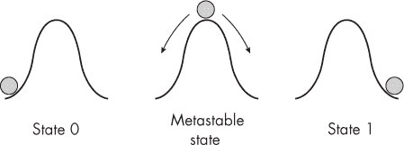
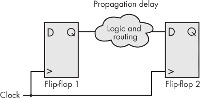
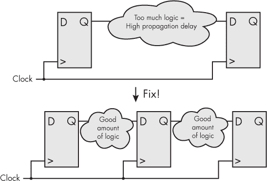
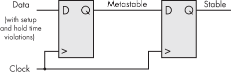
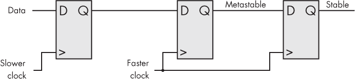
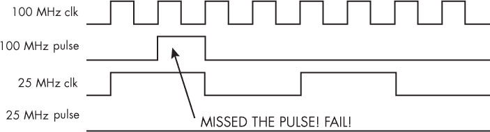
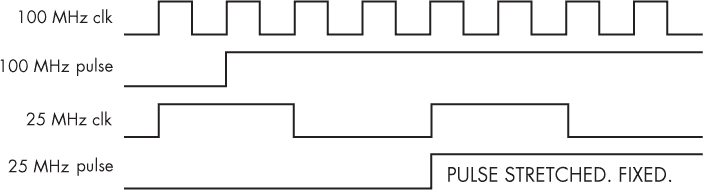

# 第十二章：7 综合、放置与布线，以及跨时钟域


在第二章中，我提供了 FPGA 构建过程的概述，帮助你熟悉运行本书项目所需的工具。接下来，我们将更深入地了解构建过程，帮助你更清楚地理解当你点击“构建 FPGA”按钮时究竟发生了什么。一旦你对 FPGA 工具的工作原理有了清晰的了解，你将能够避免许多常见的错误，并编写高可靠性的代码。

正如你在第二章中学到的，写完 Verilog 或 VHDL 代码后，FPGA 设计会经历三个阶段：综合、放置与布线、以及编程。如果其中任何一个过程失败，FPGA 构建将无法成功。在本章中，我们将重点讨论前两个阶段。我们将详细讨论综合，并区分可综合和不可综合的代码。之后，我们将回顾放置与布线过程，并探讨在这一阶段常见的一个问题：时序错误。你将学习这些错误的原因，并了解如何修复它们。最后，我们将详细探讨一个在 FPGA 设计中尤其容易遇到时序问题的情况：当信号跨越运行在不同时钟频率下的 FPGA 设计部分时。你将学习如何安全地跨越时钟域。

## 综合

*综合*是将你的 Verilog 或 VHDL 代码分解并转换为在特定 FPGA 上存在的简单组件（如查找表、触发器、块 RAM 等）的过程。从这个意义上讲，FPGA 综合工具类似于编译器，它将类似 C 语言的代码分解为 CPU 能够理解的非常简单的指令。

为了确保过程正常工作，综合工具需要确切知道你正在使用的 FPGA 类型，以便它知道有哪些资源可用。然后，由于这些资源是有限的，综合工具的任务就是找出如何尽可能高效地使用它们。这被称为*逻辑优化*（或*逻辑最小化*），它是综合过程中的一个重要部分。正如我在第三章中提到的，你无需手动执行逻辑优化；你可以简单地将其交给综合工具。但这并不意味着，编写能够智能利用可用资源的代码不重要。了解你的代码将如何综合成硬件是成为一个优秀 FPGA 设计师的关键。

合成过程的一个重要输出是你的*资源使用报告*，它告诉你在设计中使用了多少 LUT、触发器、块 RAM 和其他资源。我们在过去的章节中曾经分析过部分资源使用报告；我建议你总是通读这个报告，以确保你的预期与实际使用的资源相符。

### 注释、警告和错误

合成过程通常会生成大量的注释和警告，即使在运行成功时也是如此。若运行失败，过程还会生成错误。注释大多是信息性的，告诉你工具是如何解读你的代码的。警告则值得关注，以确保你没有犯错误。然而，在大型设计中，可能会有数百个警告，这会让人感到不堪重负。一些工具允许在你对警告感到满意时将其隐藏。这是一个有用的功能，可以帮助你专注于真正的问题。

有一个特别值得注意的警告是*推断锁存器*警告。正如你在第四章中学到的，锁存器是有问题的。它们通常是偶然创建的，而工具在 FPGA 设计的时序上下文中可能会很难分析它们。如果你创建了一个锁存器，在合成过程中会收到通知。你会收到如下警告：

```
[Synth 8-327] inferring latch for variable 'o_test' [test_program.vhd:19]
```

不要忽视这个警告。除非你确信真的需要在设计中使用这个锁存器，否则你应该尽量去除它。我做 FPGA 设计已经很多年了，我从来没有需要使用锁存器，因此如果你打算保留它，必须有非常充分的理由。

如果在合成过程中出现问题，你将得到一个错误而不是警告。你会遇到的两个最常见的错误是语法错误和资源使用错误；我们接下来会详细讨论这两种错误。

#### 语法错误

当你开始合成过程时，工具首先会检查你的 Verilog 或 VHDL 代码是否有语法错误。这些是你最常遇到的错误。代码中可能潜藏着数百种语法错误；例如，你可能忘记定义一个信号、错误拼写了一个关键字，或者遗漏了分号。在最后这种情况下，你可能会在 Verilog 中看到如下错误信息：

```
** Error: (vlog-13069) design.v(5): near "endmodule": syntax error,
unexpected endmodule, expecting ';' or ','.
```

或者在 VHDL 中出现这样的警告：

```
** Error: design.vhd(5): near "end": (vcom-1576) expecting ';'.
```

合成工具会告诉你在哪个文件的哪一行遇到了错误。例如，在前面的错误信息中，Verilog 中的design.v(5)或 VHDL 中的design.vhd(5)告诉你检查名为*design*的文件的第 5 行。你可以利用这些信息来编辑代码，以通过语法检查。

有时，你可能会遇到大量的语法错误。此时最好的做法是先找到第一个错误并修复它。通常，错误的级联是由第一个错误引起的。这是工程中的一个好规则：先解决第一个问题。一旦解决了第一个语法错误，就重新运行综合过程。如果仍然有错误，再找到第一个错误，修复它，然后重新运行综合。这一过程是迭代的，通常需要几个循环才能解决所有语法错误并成功完成综合。

#### 资源利用错误

一旦你的代码通过语法检查，接下来你最常遇到的错误就是*资源利用错误*，这意味着你的设计需要的组件数量超出了 FPGA 可用的资源。例如，如果你的 FPGA 有 1,000 个触发器，而你的代码要求 2,000 个，那么你就会遇到资源利用错误。设计根本无法适配到你的 FPGA 上，所以你需要想办法精简代码，以便实例化更少的触发器。一个好的经验法则是，尽量确保所用的 LUT 或触发器不超过可用资源的 80%。这样可以让布局和布线过程更容易完成，以确保你的设计满足时序要求（更多内容将在本章后面讨论），同时也能为未来修改设计或增加新功能提供更多灵活性。

如果你的代码无法适配到选定的 FPGA 上，你有几种选择：

1.  切换到更大的 FPGA。

2.  识别最占资源的模块并重新编写它们。

3.  移除功能。

切换到更大的 FPGA 可能是个大问题，但并不总是如此。许多 FPGA 厂商提供相同物理封装的高资源 FPGA 与低资源版本。高资源版本通常价格稍贵，因此你需要为额外的资源支付一些额外费用，但新的 FPGA 不会占用电路板上的额外空间。在为项目选择 FPGA 时，最好选择一个可以升级资源的 FPGA 家族和封装，以防你需要的资源超过预期。

如果你不能切换到不同的 FPGA，那么下一步是分析你的代码，看看它是否使用了比必要更多的资源。这并不是为了优化低级逻辑，去削减一些 LUT 或触发器——这些工具会为你做这些工作。实际上，有些方法可能会让你无意中写出使用比预期更多资源的代码。例如，我曾追踪一个高资源利用率的错误，最终发现是因为一行代码在做两个数字的除法操作。正如你将在第十章中学到的，除法通常是 FPGA 中一个非常资源密集的操作。我通过创建一个输入输出映射表，将除法操作转化为内存操作。这使用了块 RAM，但释放了用于除法的 LUT 和触发器，帮助 FPGA 顺利通过综合过程。以减少资源利用为重点的代码重写是你随着 FPGA 经验的积累而不断提高的技能。你可以深入查看每个模块的利用率报告，找出哪些模块使用了最多资源，然后单独检查它们。

降低资源利用率的另一种方法是让不同的输入共享同一个 FPGA 资源。FPGA 经常在多个输入通道上执行相同的操作。与其为每个通道分配专用的 FPGA 资源，不如使用一个单一的实现，让每个通道轮流共享硬件。例如，假设你有 100 个通道，每个通道每秒都需要执行一次余弦运算。你可以让第 1 个通道在前 10 毫秒执行余弦运算，然后让第 2 个通道在接下来的 10 毫秒执行相同的余弦运算，依此类推。通过这种方式，用于执行余弦运算的硬件可以在所有通道之间共享，并且只需要实例化一次，而不是为每个通道实例化 100 次。

这样可以大大降低整体资源利用率，但只有在你有足够时间共享资源的情况下才有效。如果你的时间安排非常紧张，这种方法可能行不通。此外，这确实增加了一些复杂性，因为现在你需要构建一个组件来协商资源共享。我们将共享资源的过程称为*仲裁*，而执行共享的组件通常被称为*仲裁者*。仲裁者也可以被构建来共享 FPGA 之外的资源。例如，我们可能有多个模块需要将数据写入 MicroSD 卡。可以设计一个仲裁者，让这些模块共享同一张 MicroSD 卡，并防止两个模块在同一时间尝试写入数据，从而导致数据丢失或损坏。

如果你已经编写了非常高效的代码，但仍然无法将其放入 FPGA，唯一的选择就是去除某些功能。也许在同一块板子上有一个微控制器，可以执行 FPGA 本来应该完成的某些任务。或者，可能你只需要告诉你的团队，代码无法实现。FPGAs 确实有其能容纳的限制。

### 不可综合代码

在 Verilog 和 VHDL 语言中，许多关键字无法通过综合工具转化为 FPGA 组件；它们是不可综合的。如果在项目代码中包含这些关键字，综合工具将简单地忽略它们。它可能会生成警告或提示，但不会产生错误。工具会继续进行综合过程，忽略最终设计中的不可综合部分——如果你依赖这些不可综合代码的功能，可能会导致问题。

在 Verilog 和 VHDL 中出现不可综合的关键字可能看起来很奇怪，但它们对于仿真和测试平台是有用的。正如我们在第五章中讨论的，测试代码至关重要，而这些语言提供了帮助测试的关键字。实际上，你可以在项目代码中包含不可综合的元素用于仿真目的，并在运行代码通过综合时保留它们，因为工具会忽略这些部分。为了安全起见，你可以明确告诉工具不要尝试综合这些代码部分，通过在其前面加上 synthesis translate_off，在其后面加上 synthesis translate_on。这种技巧适用于 Verilog 和 VHDL。例如，如果你在设计一个 FIFO，你可能希望在仿真代码时断言不向满的 FIFO 写入数据，或者不从空的 FIFO 读取数据。synthesis translate_off 和 synthesis translate_on 指令让你将这些断言直接嵌入到实际的设计代码中，而不必担心维护仿真和综合的独立代码。

非可综合代码常见的几个领域包括跟踪时间、打印文本、处理文件和循环。我们现在来考虑这些问题。

#### 跟踪时间

正如你所知道的，FPGA 本身没有内建的时间测量方式。相反，我们依赖于计数时钟周期。然而，VHDL 和 Verilog 中有些部分是与时间相关的：例如，Verilog 中的 $time 或 VHDL 中的 now 会提供当前的时间戳，而像 Verilog 中的 #100 或 VHDL 中的 wait for 100 ns; 这样的语句会创建一个短暂的延迟。这些特性对于运行仿真非常有用——例如，用来在精确的时间间隔触发输入信号——但它们不能被合成。

#### 打印

在测试过程中，获取反馈的常见方式之一是将文本发送到终端。例如，在 C 和 Python 中，你有像 printf() 和 print() 这样的函数，它们会将文本发送到控制台，让你看到发生了什么。Verilog 和 VHDL 中也有类似的函数。在 Verilog 中，你可以使用 $display() 将文本发送到终端。在 VHDL 中，这有点复杂，提供了几种选择。例如，你可以使用 assert 后跟 report 和 severity note 将文本发送到屏幕，示例如下：

```
assert false report "Hello World" severity note;
```

这些文本输出只在仿真中有效。它们无法被合成，因为物理 FPGA 上没有控制台或终端的概念。

#### 与文件的工作

在大多数情况下，你不能合成涉及读取或写入文件的 Verilog 或 VHDL 代码。FPGA 没有“文件”或任何操作系统的概念；如果你真的需要这些功能，你必须自己构建。考虑一下从温度传感器存储数据的情况。你可能希望每秒从传感器读取数据，并将这些值写入文件。这在仿真中是可以做到的，通过 Verilog 中的函数 $fopen() 和 $fwrite()，或者 VHDL 中的 file_open() 和 write()，但是在综合时，忘了它吧。

一个例外是，一些 FPGA 允许你使用文本文件来预加载（初始化）块 RAM。不同厂商实现的具体方式有所不同，如果你需要做这件事，参阅你 FPGA 的内存使用指南。

#### 循环

循环语句*是*可以合成的，但它们可能不会按你预期的方式工作。你可能熟悉像 C 或 Python 这样的软件语言中的 for 循环：它们允许你编写简洁的代码，重复执行某个操作特定次数，依次进行。在仿真中，Verilog 或 VHDL 的 for 循环就是这样工作的。然而，在可合成的 FPGA 代码中，for 循环的工作方式不同；它们用于压缩重复的逻辑，提供了一种简便的方式来编写几条相似的语句，这些语句是为了*同时执行，而不是依次执行*。为了演示，考虑这个 4 位移位寄存器的示例代码：

Verilog

```
always @(posedge i_Clk)
  begin
    r_Shift[1] <= r_Shift[0];
    r_Shift[2] <= r_Shift[1];
    r_Shift[3] <= r_Shift[2];
  end
```

VHDL

```
process (i_Clk)
begin
  if rising_edge(i_Clk) then
    r_Shift(1) <= r_Shift(0);
    r_Shift(2) <= r_Shift(1);
    r_Shift(3) <= r_Shift(2);
  end if;
end process;
```

每个时钟周期，这段代码将数据通过 r_Shift 寄存器进行移位。位 0 的值被移到位 1，位 1 的值被移到位 2，依此类推。完成这一操作的赋值语句遵循完全可预测的模式：r_Shift[i] 的值被赋给 r_Shift[i+1]。可合成的 Verilog 和 VHDL for 循环提供了一种更简洁的方式来编写像这样的可预测代码。使用 for 循环，我们可以将移位寄存器代码重写如下：

Verilog

```
always @(posedge i_Clk)
  begin
  ❶ for(i=0; i<3; i=i+1)
     ❷ r_Shift[i+1] <= r_Shift[i];
  end
```

VHDL

```
process (i_Clk)
begin
  if rising_edge(i_Clk) then
  ❶ for i in 0 to 2 loop
     ❷ r_Shift(i+1) <= r_Shift(i);
     end loop;
  end if;
end process;
```

在这里，我们声明了一个增量变量为 for 循环 i ❶。每次迭代时，执行将位 i 的值赋给位 i + 1 ❷ 的语句。例如，在循环的第一次迭代中，i 为 0，所以执行的语句是 r_Shift[0 + 1] <= r_Shift[0]。第二次循环时，i 为 1，所以我们得到 r_Shift[1 + 1] <= r_Shift[1]。在第三次也是最后一次迭代时，我们得到 r_Shift[2 + 1] <= r_Shift[2]。

这里需要意识到的重要一点是，*这一切都发生在一个时钟周期内*。实际上，所有的循环迭代是同时执行的，就像没有 for 循环的版本中那三条独立的赋值语句会同时执行一样。两种版本做的事情完全一样（并且会合成到完全相同的 FPGA 资源上），只是 for 循环版本写得更简洁。

初学者常犯的一个错误是将 for 循环放在时钟驱动的 always 或 process 块中，并期望每次循环迭代都需要一个时钟周期。例如，考虑以下这段 C 代码：

```
for (i=0; i<10; i++)
  data[i] = data[i] + 1;
```

这里我们有一个数组，data，我们通过一个for循环将数组中的每个值增加 1。（我们假设data有 10 个元素。）如果您尝试使用 Verilog 或 VHDL 中的for循环，期待它运行 10 个时钟周期，您会非常困惑，因为该循环实际上会在单个时钟周期内执行。如果您*确实*希望将这样的操作运行多个时钟周期，可以在一个if语句中更新值，该语句检查索引值是否超过某个阈值，像这样：

Verilog

```
always @(posedge i_Clk)
  begin
  ❶ if (r_Index < 10)
      begin
      ❷ r_Data[r_Index] <= r_Data[r_Index] + 1;
      ❸ r_Index         <= r_Index + 1;
      end
  end
```

VHDL

```
process (i_Clk)
begin
  if rising_edge(i_Clk) then
  ❶ if r_Index < 10 then
     ❷ r_Data(r_Index) <= r_Data(r_Index) + 1;
     ❸ r_Index         <= r_Index + 1;
     end if;
  end if;
end process;
```

在这里，我们使用if语句来复制停止for循环的检查 ❶。在这种情况下，我们希望操作运行 10 次，或者直到r_Index不再小于 10。（我们假设索引值从 0 开始，尽管在代码中没有显示。）接下来，我们使用r_Index访问数组中的正确项，增加r_Data的值 ❷。最后，我们增加r_Index ❸，该值将在下一个时钟周期中用于更新数组中的下一个值。总的来说，这将需要 10 个时钟周期来执行。一般来说，当试图编写像常规for循环那样迭代的代码时，通常只需添加一个计数信号（如r_Index）并使用if语句来监控它，正如您在这里看到的那样。

在您非常确信 FPGA for循环的工作原理之前，我建议在任何可综合代码中避免使用它们。

## 放置与布线

*放置与布线*是将合成设计映射到特定 FPGA 上的物理位置的过程。放置与布线工具决定了 FPGA 中将使用哪些查找表（LUT）、触发器、块 RAM（以及我们尚未讨论的其他组件），并将它们全部连接起来。过程结束时，您将获得一个可以加载到 FPGA 上的文件。如您所见，实际上使用此文件对 FPGA 进行编程通常是一个单独的步骤。

布局与布线，顾名思义，实际上是两个过程：将合成后的设计放入 FPGA 中，然后使用物理布线将设计连接起来。布线过程通常是构建过程中最耗时的步骤，特别是对于大型设计。在单台计算机上，布线一个复杂的 FPGA 可能需要几个小时。这也是模拟非常重要的一个主要原因。由于构建过程非常耗时，每天你可能只有几次机会在实际 FPGA 上测试你的设计，因此在开始这个过程之前，通过模拟尽可能解决问题是最好的。*

### 约束

要运行布局与布线过程，你需要约束设计中的至少两个方面：引脚和时钟（如果你有多个时钟域，稍后我们会讨论）。当然，也可以约束其他元素——输入/输出延迟、特定的布线路径等等，但这两个是最基本的。

引脚约束告诉布局与布线工具，Verilog 或 VHDL 代码中的哪些信号映射到 FPGA 上的哪些物理引脚。当你在处理电路板时，你需要查看 PCB 原理图，以了解哪些 FPGA 引脚连接到开关，哪些引脚连接到 LED，等等。这是一个在 FPGA 设计师中，具备一定原理图阅读知识非常有帮助的例子。

时钟约束告诉工具用于驱动 FPGA 的时钟频率（或者如果你有多个时钟域，时钟频率可能不同，正如我们将在本章稍后讨论的那样）。时钟约束对布线过程至关重要，尤其是因为信号的传输距离和在单个时钟周期内可以处理的内容有物理限制。当布局与布线过程完成时，它将生成一个时序报告，并考虑到时钟约束。如果在指定的时钟约束下，所有内容都能正常工作，那么设计就被认为是符合时序的，报告会显示这一点。但是，如果工具判断时钟约束可能对你的设计来说过于严格，它将在时序报告中显示时序错误。正如你接下来会看到的，时序错误是非常严重的问题！

### 时序错误

时序错误发生在你的设计和时钟约束要求 FPGA 组件和连线以比规划和布局工具保证它们能够处理的更快的速度工作时。这意味着你的 FPGA 可能无法按照预期工作。我说*可能*是因为尽管存在时序错误，它也有可能完美运行——事先没有办法确定这一点。这部分是因为 FPGA 的性能受到其工作条件的影响；例如，它的表现可能会因电压和温度的变化而有所不同。听起来可能很奇怪，FPGA 在低温和高温下的表现稍有不同，但这就是现实。

规划和布局工具的任务是对你的设计进行压力测试，并分析它在所有可能的操作条件下如何表现，包括最坏情况。如果设计能够在所有这些条件下以你指定的时钟频率运行，工具可以保证 FPGA 满足时序要求；否则，它将报告时序错误。这些工具不会阻止你用包含时序错误的设计编程 FPGA。也许它们应该阻止，但实际上没有。原因在于无法确定时序错误如何表现出来。工具并不知道你是把设计运行在室温下的桌面上，还是运行在真空空间中的卫星上。在任何一种情况下，设计可能正常工作，也可能失败，或者在运行了五分钟后，才表现出一个小错误。时序错误会导致奇怪的行为。

我曾经参与过一个相机产品的 FPGA 设计，这个设计充满了时序错误，而之前的设计师并没有处理这些问题。相反，他们设计了这个方案，查看了报告，发现报告中有数十个时序错误，但仍然将 FPGA 编程完成。然后，他们在自己的桌面上测试了这个设计，查看它是否能正常工作。他们运行了几分钟，没有遇到问题，于是认为它没问题，并将其集成到产品中。随后，产品开始以奇怪的方式出现故障。像素会闪烁，或者场景会闪烁，但只是偶尔发生，所以用户可能会忽视。更奇怪的是，只有部分产品出现问题，且问题的严重程度在不同单元之间有所不同。

一旦有人意识到问题的严重性，就开始了一个认真的努力，修复时序错误，并制作一个能够 100% 正常运行的 FPGA 设计。FPGA 工具一直在尝试告诉原设计师，可能存在问题。这并不是一个*功能性*问题——代码在理论上是正确的——但是在给定的时钟约束下，它有可能在所有操作条件下无法正确运行。这个故事的寓意是，当 FPGA 行为奇怪时，很有可能是你没有仔细查看时序报告（或者，像我以前的同事一样，完全忽视了它！）。

从根本上讲，时序错误的产生是因为 FPGA 受限于物理限制。到目前为止，我们一直在一个理想的世界中工作。我们假设所有信号可以立即从源头传输到目标，并且所有触发器在看到上升沿时可以立即改变其输出。我们一直假设如果代码正确，那么一切都会正常工作。

欢迎来到现实世界！在真实世界中，什么事情都不是真正的瞬时发生的，当组件被要求过快工作时，它们的表现会变得不可预测。导致 FPGA 时序错误的三个物理限制因素是设置时间、保持时间和传播延迟。让我们快速看看这些因素，然后我们将探讨如何修复时序错误。

#### 设置时间和保持时间

*设置时间*是指触发器输入信号在时钟沿到来之前需要保持稳定的时间，以确保触发器能够在该时钟沿上准确地注册输入数据到输出。*保持时间*是指触发器输入信号在时钟沿之后需要保持稳定的时间，以确保触发器能够可靠地保持当前的输出值，直到下一个时钟沿。这在图 7-1 中有所示意。


图 7-1：设置时间（tsu）和保持时间（th）

我们期望触发器在图中间的上升沿处注册一些数据。上升沿之前的时间是设置时间，标记为*t*su；上升沿之后的时间是保持时间，标记为*t*h。如果触发器的数据输入在设置时间和保持时间之外变化，那么一切都能正常工作。然而，如果数据输入在设置时间和保持时间窗口内变化，就会发生不良情况。具体来说，触发器可能变得*亚稳*，进入一个输出不稳定的状态：它可能是 1，可能是 0，甚至可能处于两者之间。图 7-2 显示了一个亚稳事件的例子。


图 7-2：亚稳态条件

这里我们看到一个时钟信号以及触发器的输入和输出信号。输入信号中标记为*t*su 的阴影区域表示触发器的设置时间，即在上升沿之前的时间段。如你所见，触发器的数据输入在设置窗口期间从低电平过渡到高电平。这导致输出在一段时间内处于亚稳态，之后才会稳定为 0 或 1。

为了理解亚稳态，人们常常用一个平衡在山顶的球的类比，如图 7-3 所示。球可能朝左或朝右滚下山，无法预测它会滚向哪个方向。一个随机的阵风可能把它吹向任何方向。如果它滚向左边，那就是状态 0；如果滚向右边，那就是状态 1。当触发器的输出处于亚稳态时，就像是一个摇摇欲坠的球，试图找到一个更稳定的状态来停靠。



图 7-3：亚稳态

除了不知道球会朝哪个方向滚动外，还无法知道球滚下山的时间。它可能快速滚下，也可能需要一段时间。这被称为*亚稳态解析时间*，即亚稳态变为稳定状态所需的时间。

无法提前知道输出最终会稳定在哪个状态。有时它可能是 0，而其他时候，当这种情况发生时，它可能是 1。如果数据输入没有再次变化，则在下一个上升沿时，输出肯定会是 1，因为触发器会再次将输入值传送到输出。然而，在这一个时钟周期内，输出究竟会是什么是无法预测的，这种行为在 FPGA 中是不期望出现的。

如果你的设计有时序错误，FPGA 工具会告诉你，某些触发器的设置时间和保持时间窗口可能被违反，这可能导致它们进入亚稳态。然而，亚稳态是概率性的，因此无法保证它一定会发生。你的设计可能在报告时序错误的情况下完全正常，但也有可能 FPGA 会表现出奇怪且不可预测的行为。在 FPGA 设计中，我们喜欢预测性，因此即使是亚稳态发生的微小可能性也是一个问题。

亚稳态可能在违反设置时间或保持时间时发生，但设置时间和保持时间是 FPGA 的物理属性，无法控制。你不能以改变设置时间或保持时间的方式修改设计。为了修复时序错误，必须集中精力解决 FPGA 的另一个主要物理限制：传播延迟。

#### 传播延迟

*传播延迟*是信号从源到目的地传播所需的时间。如前所述，在现实世界中，这不是瞬时的：电压变化在电线中传播需要一些时间，尽管这个时间非常短。一个不错的经验法则是，信号沿着电线传播的速度为每纳秒 1 英尺。听起来可能不算很长延迟，但考虑到 FPGA 内部有成千上万条细小的电线，电线的物理长度加起来可能非常长，考虑到芯片的尺寸如此之小。这会导致显著的传播延迟，尤其是信号从一个触发器传播到另一个触发器时。

此外，信号经过的每一段逻辑——例如，表示与门的查找表（LUT）——都会增加一些传播延迟，因为这些逻辑操作也不是完全瞬时的。这个概念在图 7-4 中有所说明。



图 7-4：两个触发器之间的传播延迟

这里有两个触发器，数据从一个触发器的输出传输到另一个触发器的输入。触发器之间的逻辑和布线可能包括电线和/或 LUT。传播延迟发生在这里，且云中包含的物体越多——例如，更长的电线或更多的 LUT——从触发器 1 的输出到触发器 2 的输入所需的时间就越长。如果传播延迟过长，设计将无法满足请求的时钟约束。

这里的问题是，两个触发器都由同一个时钟驱动。如果触发器 1 在一个上升时钟沿上看到输入变化并将该变化注册到输出，我们期望触发器 2 在下一个上升时钟沿看到该变化并将其注册。信号只有一个时钟周期的时间从触发器 1 传播到触发器 2。如果信号能够在这个时间内安全到达，设计将正常工作。但如果触发器之间的逻辑和布线产生的传播延迟过长，我们就会遇到时序错误。FPGA 设计中可能有成千上万的触发器，放置和布线工具的责任是分析每一条路径，并从时序角度向我们显示最严重的问题。

事实上，信号从触发器 1 传播到触发器 2 所需的时间比一个时钟周期的长度还要短，因为我们还需要考虑建立时间。传播延迟可能小于时钟周期，但正如我们刚才看到的，如果信号在触发器 2 的建立窗口内到达，触发器 2 的输出将是不确定的。这就导致了以下计算设计正常工作的时钟周期所需的公式：

*t*clk(min) = *t*su + *t*p

在这里，*t*clk(min) 是设计正常工作且没有时序错误所需的最小时钟周期，*t*su 是设置时间，*t*p 是设计在两个触发器之间可能出现的最坏传播延迟。例如，假设 FPGA 上所有触发器的设置时间固定为 2 ns，且我们的设计在两个特定触发器之间会产生最多 10 ns（在最坏情况下）的传播延迟。我们的公式告诉我们，时钟周期需要至少为 2 + 10 = 12 ns，这相当于 83.3 MHz 的频率。如果我们想，我们完全可以使用更慢的时钟来运行设计，这样周期会更长；但如果我们想让 FPGA 更快运行，例如 100 MHz，则时钟周期会太短，导致时序错误。

#### 如何修复时序错误

如你所见，时钟周期、设置时间和传播延迟是导致时序错误的主要因素。由于设置时间是固定的，解决时序错误有两种基本方法：

+   降低时钟频率。

+   通过将逻辑划分为多个阶段来减少传播延迟。

降低时钟频率可能看起来是最直观的选择。如果你能够让 FPGA 运行得更慢，你的时序会得到改善。然而，你不太可能自由地更改时钟频率；通常它会由于某些特定原因被固定，比如你可能需要与一个必须在特定频率下运行的外设进行接口。很可能你无法仅仅为了放松时序而降低时钟频率。

将逻辑划分为多个阶段，也称为 *流水线*，是更为稳健（且通常是唯一的）选择。如果你在任何两个触发器之间做得“更少”，传播延迟将会减少，设计也更容易满足时序要求。图 7-5 展示了这一过程如何工作。



图 7-5：通过流水线减少传播延迟

在图的上半部分，两个触发器之间有大量的逻辑——多到设计的传播延迟过长，无法通过时序验证。解决方案（如图下半部分所示）是将逻辑拆分为两个阶段，并在中间增加另一个触发器。这样，部分逻辑可以在触发器 1 和 2 之间完成，另一部分则在触发器 2 和 3 之间完成。每个阶段的传播延迟应足够短，以便每个阶段可以在一个时钟周期内完成，整体上，工具将有两个时钟周期来完成我们最初打算在一个时钟周期内完成的任务。

当你将设计中的单一阶段拆分为多个阶段时，你实际上是在创建一个*流水线*操作，并在每个阶段之间使用触发器来与时钟同步操作。一个良好的流水线设计将大大提高在高时钟频率下满足时序要求的机会。为了演示，我们来看一个时序表现不佳的代码示例，然后探讨如何对逻辑进行流水线处理以避免时序错误。首先，这里是有问题的代码：

Verilog

```
module timing_error
  (input            i_Clk,
  input [7:0]       i_Data,
  output reg [15:0] o_Data);
  reg [7:0] r0_Data = 0;
  always @(posedge i_Clk)
  begin
     r0_Data <= i_Data;
  ❶ o_Data  <= ((r0_Data / 3) + 1) * 5;
  end
endmodule
```

VHDL

```
library ieee;
use ieee.std_logic_1164.all;
use ieee.numeric_std.all;
entity timing_error is
  port (
    i_Clk  : in std_logic;
    i_Data : in unsigned(7 downto 0);
    o_Data : out unsigned(15 downto 0));
end entity timing_error;
architecture RTL of timing_error is
  signal r0_Data : unsigned(7 downto 0);
begin
  process (i_Clk) is
  begin
    if rising_edge(i_Clk) then
       r0_Data <= i_Data;
    ❶ o_Data <= ((r0_Data / 3) + 1) * 5;
    end if;
  end process;
end RTL;
```

我无法想象为什么有人会写出这样的代码，但它足以用作演示。问题出现在我们对r0_Data ❶进行一些数学运算——除法、加法和乘法——时。所有这三种操作都在同一行内、在一个同步的always或process块内执行，这意味着它们必须在一个时钟周期内完成。为了执行这些数学运算，8 位宽的寄存器r0_Data的输出将通过一堆 LUT，然后进入o_Data的触发器输入，所有这些操作都在一个时钟周期内完成。这使得我们进入了图 7-5 的上半部分：这些数学操作需要大量的逻辑，并且会产生相当大的传播延迟。

让我们看看当我们使用 100 MHz 时钟约束将这段代码通过布局与布线时会发生什么。以下是生成的时序报告：

```
`--snip--`
4.1::Critical Path Report for i_Clk
***********************************
Clock: i_Clk
❶ Frequency: 89.17 MHz | Target: 100.00 MHz
++++++++++++++++++++++++++++++++++++++++++++++++++++++++++
❷ Path Begin : r0_Data_fast_5_LC_1_9_5/lcout
❸ Path End : o_DataZ0Z_7_LC_5_12_5/in3
Capture Clock : o_DataZ0Z_7_LC_5_12_5/clk
Setup Constraint : 10000p
❹ Path slack : -1215p
`--snip--`
```

我们可以看到，我们尝试将时钟频率提升到 100 MHz，但布线工具只能保证时序达到 89.17 MHz ❶。当目标频率高于最大可实现的频率时，就会出现时序错误。时序报告接着告诉我们设计中最严重的路径，虽然表达有些模糊。首先，报告标识了每条问题路径的开始 ❷ 和结束 ❸。注意，r0_Data 出现在 Path Begin 的信号名称中，而 o_Data 出现在 Path End 的信号名称中，但那里还有一些额外的内容。工具加入了这些附加信息，以便识别 FPGA 中相关组件的确切位置。缺点是这些信息不太容易理解，但由于核心信号名称保持不变，我们可以看出，从 r0_Data 到 o_Data 的路径是失败的路径。此外，报告还精确告诉我们路径的失败程度 ❹。*路径裕度*是指路径有多大的可调整空间来满足时序要求，负值则告诉我们时序过慢；我们需要额外的 1,215 皮秒（ps），即 1.215 纳秒（ns），来消除这个时序错误。这是有道理的，因为 89.17 MHz 和 100 MHz 之间的时钟周期差正好是 1,215 ps。

现在我们已经确定了失败的路径，可以通过使用触发器将数学运算分解，来实现该路径的流水线处理。下面是可能的样子：

Verilog

```
module timing_error
  (input            i_Clk,
  input [7:0]       i_Data,
  output reg [15:0] o_Data);
  reg [7:0] r0_Data, r1_Data, r2_Data = 0;
  always @(posedge i_Clk)
  begin
     r0_Data <= i_Data;
  ❶ r1_Data <= r0_Data / 3;
  ❷ r2_Data <= r1_Data + 1;
  ❸ o_Data  <= r2_Data * 5;
  end
endmodule
```

VHDL

```
library ieee;
use ieee.std_logic_1164.all;
use ieee.numeric_std.all;
entity timing_error is
  port (
    i_Clk  : in  std_logic;
    i_Data : in  unsigned(7 downto 0);
    o_Data : out unsigned(15 downto 0));
end entity timing_error;
architecture RTL of timing_error is
  signal r0_Data, r1_Data, r2_Data : unsigned(7 downto 0);
begin
  process (i_Clk) is
  begin
    if rising_edge(i_Clk) then
       r0_Data <= i_Data;
    ❶ r1_Data <= r0_Data / 3;
    ❷ r2_Data <= r1_Data + 1;
    ❸ o_Data  <= r2_Data * 5;
    end if;
  end process;
end RTL;
```

我们把原本一行的代码拆分成了三行。首先，我们只执行除法操作，并将结果写入中间信号 r1_Data ❶。接着，我们对 r1_Data 执行加法操作，并将结果赋值给 r2_Data ❷，最后对 r2_Data 执行乘法操作，并将结果赋值给我们的原始输出 o_Data ❸。我们引入了新的信号，将原本在一个时钟周期内发生的大数学运算分布到多个时钟周期中。这样应该能减少传播延迟。实际上，如果我们将新的流水线设计进行布线，就会得到以下的时序报告：

```
`--snip--`
4.1::Critical Path Report for i_Clk
***********************************
Clock: i_Clk
Frequency: 110.87 MHz | Target: 100.00 MHz
`--snip--`
```

现在我们已经满足了时序要求：布图和布线工具可以保证在目标频率为 100 MHz 时，性能达到 110.87 MHz 的时钟频率。如你所见，修复时序错误涉及到一些权衡。我们不得不在设计中添加触发器，将逻辑拆分为多个阶段，因此我们的设计现在比以前使用了更多的 FPGA 资源。此外，原本应该在一个时钟周期内完成的数学运算，现在需要三个时钟周期。然而，请记住，我们的模块仍然能够以 100 MHz 的速率接收新的输入值，并以 100 MHz 的速率输出计算结果，这正是我们在原始设计中的预期；只是*第一个*从流水线输出的结果由于添加的触发器需要额外的两个时钟周期。

#### 意外的时序错误

你可以通过对设计进行流水线化来修复大多数时序错误，从而减少传播延迟并避免亚稳态条件。然而，布图和布线工具无法预测所有时序错误。这些工具并不完美；它们只能根据所拥有的信息分析你的设计。即使你在时序报告中没有看到任何错误，也有两种情况下亚稳态条件仍然可能发生，而布图和布线工具无法可靠地预测：

+   当采样一个与 FPGA 时钟不同步的信号时

+   当跨时钟域时

当你有一个外部信号作为输入信号传递到 FPGA 时，采样一个与 FPGA 时钟不同步的信号是非常常见的。输入信号会直接传递到设计中触发器的输入端，但它是异步的，也就是说，它没有由主 FPGA 时钟协调。例如，想象一下有人按下按钮。这个按钮的按下可以在任何时刻发生，因此如果它恰好发生在触发器的建立时间内，那么这个触发器将处于亚稳态。布图和布线工具并不了解这个潜在的问题，因此不会将其标记为时序错误。但你，亲爱的 FPGA 设计师，可以预见并解决这个问题。解决方案是通过让输入数据通过一个额外的触发器来实现*双触发器*，如图 7-6 所示。



图 7-6：通过双触发器修复亚稳态

在这个图中，一个与时钟不同步的信号正在被第一个触发器采样。由于我们无法保证这个输入相对于时钟的时序，它可能会违反设置时间或保持时间，并在第一个触发器的输出处产生亚稳态。正如前面讨论的那样，亚稳态的发生是概率性的，且相当罕见。即使第一个触发器进入了亚稳态，也极不可能第二个触发器也进入亚稳态。事实上，将第二个触发器与第一个串联起来，可以将亚稳态在输出处的可能性降到几乎为零。（如果再加一个第三个触发器，亚稳态的可能性会进一步降低，但 FPGA 专家已经得出结论，两个触发器串联就足够了。）我们现在可以使用设计内部的稳定信号，并确信不会看到奇怪的行为。

另一种可能遇到亚稳态的情况是，当你在 FPGA 中跨越时钟域时。这是一个很大的话题，值得单独成章讨论。

## 跨越时钟域

正如我之前提到的，单个 FPGA 中可能有多个时钟域，不同的时钟驱动设计的不同部分。例如，你可能需要一个工作在 25.725 MHz 的摄像头接口和一个工作在 148.5 MHz 的 HDMI 接口。如果你想将摄像头的数据发送到 HDMI，以便在显示器上显示，这些数据就必须跨越时钟域，从由 25.725 MHz 时钟控制的部分移动到由 148.5 MHz 时钟控制的部分。然而，无法保证这些时钟域之间的对齐；它们可能会彼此偏移然后再对齐。即使时钟之间看似有可预测的关系，比如 50 MHz 时钟和 100 MHz 时钟，你也不能确定它们是否在同一时刻开始。

注意

*例外情况是，如果你使用了一种名为*相位锁定环（PLL）*的 FPGA 组件，它可以生成独特的时钟频率并在它们之间建立关系。PLL 在第九章中有详细讨论。*

最终结论是，当你有彼此不同步的时钟域时，跨越这些时钟域的信号可能会在某些触发器中产生亚稳态。在本节中，我们将探讨如何安全地跨越时钟域，从慢时钟到快时钟，反之亦然，并避免亚稳态。我们还将讨论如何使用 FIFO 在时钟域之间传送大量数据。

### 从慢时钟到快时钟的跨越

最简单的情况是从较慢时钟域切换到较快时钟域。为避免问题，您只需要在数据进入更快的时钟域时进行双触发器处理，如图 7-7 所示。这与我们修复外部异步信号时采用的方法相同，因为它本质上是相同的问题：来自较慢时钟域的信号与它进入的较快时钟域是异步的。



图 7-7：从较慢时钟域到较快时钟域的跨越

在图 7-7 中，我们有三个串联的触发器。第一个由较慢的时钟驱动，后面的由较快的时钟驱动。较慢的时钟是您的*源时钟域*，较快的时钟是您的*目标时钟域*。由于时钟彼此之间是异步的，我们无法保证来自较慢时钟域的数据不会违反中间触发器（即较快时钟域中的第一个触发器）的建立时间或保持时间，从而触发亚稳态。然而，我们知道，第二个触发器的输出将是稳定的，可以在较快的时钟域中使用该数据。让我们看看如何用代码实现这个设计：

Verilog

```
always @(posedge i_Fast_Clk)
  begin
  ❶ r1_Data <= i_Slow_Data;
  ❷ r2_Data <= r1_Data;
  end
```

VHDL

```
process (i_Fast_Clk) is
begin
  if rising_edge(i_Fast_Clk) then
  ❶ r1_Data <= i_Slow_Data;
  ❷ r2_Data <= r1_Data;
  end if;
end process;
```

该代码由一个always或process块组成，该块在较快时钟的正沿上运行。首先，来自较慢时钟域的信号i_Slow_Data进入触发器r1_Data ❶。如果i_Slow_Data的变化违反了建立时间或保持时间，这个触发器的输出可能会变成亚稳态，但我们通过双触发器处理来解决这个亚稳态问题，将数据传递给第二个触发器r2_Data ❷。此时，我们得到了稳定的数据，可以在较快时钟域中使用，而无需担心亚稳态问题。

关于为使用两个时钟域的 FPGA 编写代码，有一点需要特别注意：一定要小心将两个时钟域的代码分开。将所有较慢的信号放在一个always或process块中，与较快的信号在另一个always或process块中明确分开（跨时钟域的信号是个例外）。实际上，我发现将运行在不同时钟域中的代码放在完全不同的文件中是很有帮助的，这样可以确保我不会将信号混合使用。

### 从更快的时钟域到较慢的时钟域

从一个更快的时钟域到一个较慢的时钟域要比反过来更复杂，因为在较慢的时钟域看到数据之前，较快的时钟域中的数据可能已经发生变化。例如，考虑一个在 100 MHz 时钟域中发生的脉冲，它持续一个时钟周期，而你试图在一个 25 MHz 时钟域中检测这个脉冲。很有可能你永远也看不到这个脉冲，如图 7-8 所示。



图 7-8：从更快的时钟域到较慢的时钟域的失败示例

该图显示了 25 MHz 时钟的两个周期。在时钟的第一次上升沿之后，但在第二次上升沿之前，100 MHz 脉冲来去匆匆，速度太快，以至于 25 MHz 时钟从未“看到”并注册它。这是因为脉冲并没有出现在 25 MHz 时钟的上升沿。因此，这个脉冲在 25 MHz 时钟域中完全没有被察觉。解决这个问题的方法是将任何从更快时钟域传入较慢时钟域的信号进行*拉伸*，直到它们足够长，确保它们能被注意到。图 7-9 展示了这个原理的实际运作。



图 7-9：从更快的时钟域到较慢的时钟域的成功示例

查看 100 MHz 脉冲的新波形，我们可以看到它已经从一个 100 MHz 时钟周期拉伸到了多个时钟周期，确保在 25 MHz 时钟域中的上升沿可以看到这个脉冲。一般来说，从一个更快的时钟域传递到一个较慢的时钟域的脉冲应该拉伸，至少持续两个时钟周期。这样，即使脉冲违反了较慢时钟域中第一个时钟周期的建立和保持时间，并触发了一个亚稳态，它也会在第二个时钟周期稳定下来。在我们的例子中，我们应该将 100 MHz 脉冲拉伸至至少八个 100 MHz 时钟周期，相当于两个 25 MHz 时钟周期。如果需要，您可以将信号拉伸得更长。

### 使用 FIFO

在前面的例子中，我们研究了如何在时钟域之间传输简单的脉冲。但如果你想在两个时钟域之间传输大量数据，比如将相机数据发送到 HDMI 接口呢？在这种情况下，最常见的方法是使用 FIFO。你按照一个时钟将数据写入 FIFO，然后按照另一个时钟将其读取出来。当然，这里最关键的要求是 FIFO 必须支持两个不同的时钟频率，而我们在第六章中看到的 FIFO 只支持一个时钟。

要跨时钟域使用 FIFO，你可能需要使用一个**原语**，这是由制造商为特定 FPGA 设计的专用 FPGA 组件。例如，Intel 会有预编写的 FIFO 原语，可以在不同的时钟域中运行，但创建这些原语的 Verilog 或 VHDL 代码将与 AMD 的 FIFO 原语不同。（我们将在第九章中探索更多关于原语的示例。）

使用 FIFO 时，始终记住不要违反两个基本规则：不要从空的 FIFO 中读取，也不要写入到满的 FIFO 中。许多 FIFO 原语提供了 FIFO 中单词数（元素数）的输出计数，但我不建议依赖它。相反，我建议多使用在“输入和输出信号”（第 117 页）中介绍的**AF**和**AE**（几乎满和几乎空）标志。最好在跨时钟域时，以固定大小的突发方式从 FIFO 读取和写入数据，并利用这个突发大小来确定你的 AF 和 AE 阈值。将你的 AE 水平设置为固定的突发大小，将你的 AF 水平设置为 FIFO 深度减去突发大小。通过这种设置，你可以确保永远不会违反这两个关键规则。AF 标志可以通过确保 FIFO 没有足够的空间容纳另一个突发时，禁用写时钟接口来调节写入速度。同样，AE 标志可以通过确保 FIFO 中没有完整的突发数据时，调节读时钟接口，避免读端尝试从 FIFO 中取出数据。

让我们来看一个例子。假设有一个模块在 33 MHz 的时钟下向 FIFO 写入数据。在读取端，我们尽可能快速地将数据转存到外部存储器中。假设读取时钟频率为 110 MHz。在这种情况下，由于读取时钟比写入时钟快得多，读取端大部分时间都会处于空闲状态，即使写入操作在每个时钟周期内都在进行。为了避免从空的 FIFO 中读取数据，你可以将 AE 标志设置为某个数值，指示读取代码有一批数据准备好被读取。例如，如果你将其设置为 50 个单词，那么一旦 FIFO 中有 50 个单词，AE 标志将从 1 变为 0，这将触发读取端的逻辑，从 FIFO 中精确地读取 50 个单词。

这通常是跨时钟域实现的方式。如果你正在使用你的**AE/AF**标志，那说明你做得对。尽量不要依赖于那些告诉你 FIFO 是否完全满或空的标志，也绝对不要使用一些 FIFO 支持的计数器。

### 解决时序错误

在将包含多个时钟域的设计通过布局与布线过程时，你需要在时钟约束中包含每个时钟的频率。布局与布线工具会分析在这些时钟接口之间发送和接收的数据，并报告它所观察到的任何时序错误。正如你所看到的，这是工具告诉你，可能会遇到设置时间和保持时间被违反的情况，这可能会触发亚稳态条件。

假设你已经很好地处理了时钟域跨越，使用了前面章节中讨论的双触发器、数据拉伸和 FIFO 方法。你知道可能会出现亚稳态，并且你已经做好了准备。然而，工具并不知道你所采取的步骤。它无法看到你是一个聪明的 FPGA 设计师，且你已经掌控了一切。为了抑制时序报告中的错误，你需要创建一些独特的*时序约束*，这些约束将放宽工具的要求，告诉它们你是一个有能力的设计师，并且你知道你的设计可能会出现亚稳态。如何创建这些时序约束超出了本书的范围，因为每个 FPGA 厂商都有其独特的风格。

你应该始终力求设计中没有时序错误。然而，作为 FPGA 设计师，你不可避免地会遇到跨越时钟域的情况。你需要清楚地理解这些情况中可能出现的常见陷阱。如果跨越简单，你可以通过双触发器或者执行数据拉伸来解决。对于许多情况，你可能需要使用支持两个时钟的 FIFO，一个用于读取，一个用于写入。在编写处理时钟域跨越的代码时，要特别小心，不要将来自不同时钟域的信号混合使用。

## 总结

在本章中，我们详细探讨了 FPGA 构建过程，仔细分析了 FPGA 代码在综合和通过布局与布线过程中发生了什么。你了解了不同类型的不可综合代码，特别是你看到`for`循环的综合方式可能与你预期的不同。在检查布局与布线过程时，你了解了 FPGA 的一些物理限制，并看到了这些限制如何导致时序错误。最后，你学习了一些修复时序错误的策略，包括在跨越时钟域时可能出现的错误。有了这些知识，你将能够更自信地编写 Verilog 或 VHDL 代码，并能够解决构建过程中常见的问题。
