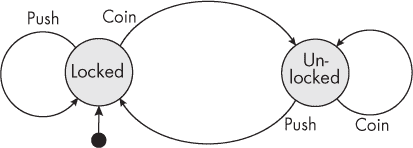
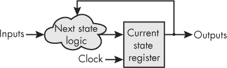
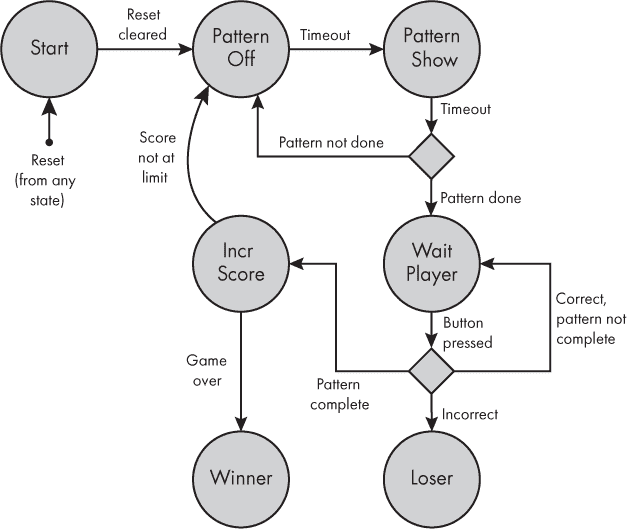
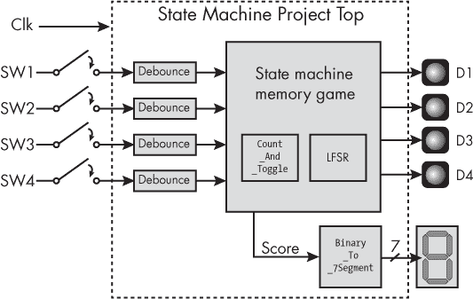
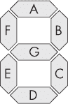
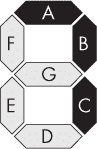

# 第十三章：8 状态机


*状态机* 是一种控制一系列动作的模型。在状态机中，一项任务被分解成一系列的阶段，或*状态*。系统沿着预定的路径在这些状态之间流动，根据输入或其他触发条件从一个状态转换到另一个状态。状态机被广泛用于组织 FPGA 中的操作，因此理解它们的工作原理对于开发复杂的 FPGA 设计至关重要。

状态机的常见示例包括电梯、交通信号灯和自动售货机。这些设备在任何给定时刻只能处于一个独特的状态，并且可以根据输入执行不同的动作。例如，在电梯的情况下，电梯厢会停留在当前楼层，直到有人按下按钮请求乘坐。电梯所在的楼层就是它的状态，而按下按钮就是触发状态变化的输入。交通信号灯的情况也是类似，可能的状态有红色、黄色和绿色，信号灯会根据某种输入变化——可能是定时器或运动传感器。某些状态转换是可能的，例如从红色到绿色，或者从黄色到红色，而其他转换，比如从黄色到绿色，则不可能。

在 FPGA 中，可能有多个状态机执行不同的独立任务，所有任务同时运行。例如，你可能有一个状态机初始化 LPDDR 内存，另一个接收来自外部传感器的数据，第三个用于与外部微控制器通信。由于 FPGA 是并行设备，这些状态机会并行运行，每个状态机协调其自己的复杂操作序列。

本章中，你将学习状态机背后的基本概念，并了解如何使用 Verilog 和 VHDL 设计它们。你将学习保持状态机简洁清晰的策略，从而减少设计中出现 bug 的可能性。最后，你将通过设计一个 Simon 风格的记忆游戏来获得使用状态机的实践经验，适用于你的开发板。

## 状态、转换与事件

状态机围绕三个相互关联的概念展开：状态、转换和事件。*状态*描述的是系统在等待执行转换时的状态。以电梯为例，如果从未按下按钮，电梯将保持在当前状态，也就是停留在当前楼层。状态机一次只能处于一个状态（电梯不能同时在两个楼层），而且它只能处于有限数量的状态（我们还没有解决如何建造一个具有无限楼层的建筑的问题）。因此，状态机也被称为*有限状态机（FSMs）*。

*转换*是指从一个状态移动到另一个状态的动作。对于电梯来说，这包括开关门、运行电机升降轿厢等。转换通常由*事件*引起，事件可以是按键或计时器到期等输入。状态之间的转换也可能在没有外部事件的情况下发生，这称为内部转换。相同的事件可能根据当前状态触发不同的转换。例如，如果电梯在十楼，按下 5 号按钮会让电梯向下行驶；如果电梯在一楼，按下 5 号按钮则会让电梯向上行驶。电梯的下一个状态受到当前状态和输入事件的共同影响。

设计状态机需要确定所有可能的状态，规划状态之间的转换，并识别可以触发这些转换的事件。最简单的方法是绘制一个图表。为了演示这一点，让我们探讨一个简单的状态机例子，它控制着一个硬币投币的旋转门，类似于你在地铁站入口处可能会使用的设备。图 8-1 展示了这个状态机的图示。



图 8-1：一个旋转门的状态机

在状态机图中，状态通常用带标签的圆圈表示，转换用圆圈之间的箭头表示，事件则用触发这些转换的文本表示。我们的旋转门状态机有两个可能的状态：锁定和解锁。锁定状态下方的黑点表示锁定是机器的*初始状态*。当首次通电或用户按下重置按钮时，状态机将进入此状态。

让我们考虑一旦我们处于 Locked 状态时会发生什么。有两个可能的事件可以触发转换：推旋转门或投币。Push 事件导致从 Locked 状态返回到 Locked 状态，这由图中左侧的箭头表示。在这种情况下，状态机保持在 Locked 状态。直到用户投币（Coin 事件）时，我们才会转换到 Unlocked 状态。此时，如果用户推旋转门，它将让他们通过，然后转换回 Locked 状态以供下一个用户使用。最后，请注意，如果用户将硬币投到一个已经是 Unlocked 状态的系统中，它将转换回 Unlocked 状态。

通过这种方式定义地铁旋转门的行为可能显得微不足道，但它是了解状态机如何组织和表示的好方法。对于那些有大量状态、事件和转换的系统，明确地记录状态机对于生成期望的行为至关重要。即使是像计算器这样简单的东西，也可能需要一个出人意料复杂的状态机。

## 实现状态机

让我们看看如何在 FPGA 中使用 Verilog 或 VHDL 实现我们的基本地铁旋转门状态机。我们将考虑两种常见的方法：第一种方法使用两个 always 或 process 块，而第二种方法只使用一个。理解这两种实现状态机的方法非常重要，因为它们都被广泛使用。然而，正如你将看到的，有理由更倾向于后一种方法。

### 使用两个 always 或 process 块

使用两个 always 或 process 块是实现状态机的更传统方法。历史上，FPGA 合成工具并不十分出色，它们在尝试合成状态机时可能会出错。两个块的方法就是为了解决这些限制而设计的。一个 always 或 process 块控制同步逻辑，使用寄存器来跟踪当前状态。另一个 always 或 process 块控制组合逻辑；它寻找触发事件并确定下一个状态应该是什么。图 8-2 说明了这种安排。



图 8-2：使用两个 always 或 process 块的状态机框图

请注意，图中的下一个状态逻辑没有时钟作为输入。它基于当前状态和任何输入（事件）立即确定下一个状态。只有当前状态寄存器才有时钟输入，用来注册下一个状态逻辑的输出。通过这种方式，它存储机器的当前状态。

以下是使用这种双块方法实现转闸状态机的方式：

Verilog

```
module Turnstile_Example
 (input i_Reset,
  input i_Clk,
  input i_Coin,
  input i_Push,
  output o_Locked);
❶ localparam LOCKED   = 1'b0;
  localparam UNLOCKED = 1'b1;
  reg r_Curr_State, r_Next_State;
  // Current state register
❷ always @(posedge i_Clk or posedge i_Reset)
  begin
    if (i_Reset)
    ❸ r_Curr_State <= LOCKED;
    else
    ❹ r_Curr_State <= r_Next_State;
  end
  // Next state determination
❺ always @(r_Curr_State or i_Coin or i_Push)
  begin
     r_Next_State <= r_Curr_State;
  ❻ case (r_Curr_State)
       LOCKED:
         if (i_Coin)
         ❼ r_Next_State <= UNLOCKED;
       UNLOCKED:
         if (i_Push)
            r_Next_State <= LOCKED;
       ❽
     endcase
  end
❾ assign o_Locked = (r_Curr_State == LOCKED);
endmodule
```

VHDL

```
library ieee;
use ieee.std_logic_1164.all;
entity Turnstile_Example is
  port (
    i_Reset  : in std_logic;
    i_Clk    : in std_logic;
    i_Coin   : in std_logic;
    i_Push   : in std_logic;
    o_Locked : out std_logic);
end entity Turnstile_Example;
architecture RTL of Turnstile_Example is
❶ type t_State is (LOCKED, UNLOCKED);
  signal r_Curr_State, r_Next_State : t_State;
begin
  -- Current state register
❷ process (i_Clk, i_Reset) is
  begin
    if i_Reset = '1' then
    ❸ r_Curr_State <= LOCKED;
    elsif rising_edge(i_Clk) then
    ❹ r_Curr_State <= r_Next_State;
    end if;
  end process;
  -- Next state determination
❺ process (r_Curr_State, i_Coin, i_Push)
  begin
    r_Next_State <= r_Curr_State;
 ❻ case r_Curr_State is
      when LOCKED =>
        if i_Coin = '1' then
        ❼ r_Next_State <= UNLOCKED;
        end if;
      when UNLOCKED =>
        if i_Push = '1' then
          r_Next_State <= LOCKED;
        end if;
     ❽
    end case;
  end process;
❾ o_Locked <= '1' when r_Curr_State = LOCKED else '0';
end RTL;
```

我们使用枚举 ❶ 来创建状态，意味着每个状态名称都有一个分配的编号。在 Verilog 中，你需要手动创建状态列表。我喜欢使用 localparam 来定义每个状态，并按递增顺序为它们分配编号。在 VHDL 中，你则创建一个用户定义的类型来表示状态机（t_State）。然后按顺序列出这些状态，VHDL 会自动为它们分配编号。如果你熟悉 C 编程，VHDL 的方法类似于 C 中枚举的工作方式。

注意

*SystemVerilog 支持自动枚举，但常规 Verilog 中没有此功能，因此我们在 Verilog 代码中手动编号状态。*

第一个 always 或 process 块 ❷，当前状态寄存器，由时钟驱动。它通过在每个时钟上升沿 ❹ 时将 r_Next_State 赋值给 r_Curr_State 来跟踪当前状态。请注意，这个块的敏感列表中还包含 i_Reset 信号，并且该信号在块中会被检查。包括一种方法来将状态机重置到初始状态非常重要，我们使用 i_Reset 来实现。块中的 if…else 语句（Verilog）或 if…elsif 语句（VHDL）会先检查 i_Reset 是否为高电平，再检查时钟是否有上升沿。这意味着我们使用的是 *异步复位*；复位可以在任何时间发生，而不必在时钟的上升沿发生。当 i_Reset 为高时，我们将当前状态设置为 LOCKED ❸。这与 图 8-1 中的初始状态表示一致。

第二个 always 或 process 块 ❺ 是组合逻辑块。它包含了确定如何设置 r_Next_State 的逻辑。请注意，敏感列表 ❺ 和块本身并不包含时钟，因此该块不会生成任何触发器，只会生成查找表（LUT）。我们通过与当前状态 ❻ 相关联的 case 语句来设置 r_Next_State，并根据输入来确定下一状态。例如，如果当前状态是 LOCKED 且 i_Coin 输入为高电平，那么下一个状态将是 UNLOCKED ❼。将 case 语句和条件逻辑与 图 8-1 中的状态机图进行对比，你会看到我们已经涵盖了图中所有导致状态实际变化的转换和事件。对于那些不会导致信号变化的转换，我们无需编写代码。例如，如果当前状态是 LOCKED 且 i_Push 为高电平，我们将保持在 LOCKED 状态。我们本可以在 LOCKED 情况下添加对 i_Push 的检查，并写出 r_Next_State <= LOCKED 来明确表达这一点，但这是不必要的。添加这一行可以让设计者的意图更加明确，但也会使代码变得臃肿，增加了不必要的赋值。究竟选择哪种风格，取决于你的个人偏好。

我们也可以在 endcase 或 end case 语句 ❽ 之前添加一个 default 情况（在 Verilog 中）或 when others 情况（在 VHDL 中），以覆盖状态机中没有显式列出的所有条件。同样，这不是强制要求的，但这可能是一个好主意；如果你忘记或遗漏了某个情况，默认情况会捕捉到它。在这种情况下，我选择不包括默认情况。事实上，当我尝试在 VHDL 中包括它时，我的代码编辑器会显示一个建议：

```
Case statement contains all choices explicitly. You can safely remove the
redundant 'others'(13).
```

这段代码通过赋值模块的单个输出<sup class="SANS_TheSansMonoCd_W5Regular_11">o_Locked❾来结束。当我们处于LOCKED状态时，它会为高电平，否则为低电平。如果这段代码实际上是在控制一个物理的旋转门，我们会使用这个输出的变化来触发状态转换过程中发生的动作，比如启用或禁用旋转门的锁定机制。

### 使用一个 always 或 process 块

实现状态机的另一种方法是将所有逻辑合并到一个单独的always或process块中。随着综合工具的不断改进，它们在理解你想要创建状态机的场景上变得更加精准。曾经这种单块方法可能难以综合，现在它完全可行（并且可以说更加简单易懂）。以下是使用单个always或process块实现的相同旋转门状态机：

Verilog

```
module Turnstile_Example
 (input i_Reset,
  input i_Clk,
  input i_Coin,
  input i_Push,
  output o_Locked);
  localparam LOCKED   = 1'b0;
  localparam UNLOCKED = 1'b1;
  reg r_Curr_State;
  // Single always block approach
❶ always @(posedge i_Clk or posedge i_Reset)
  begin
    if (i_Reset)
      r_Curr_State <= LOCKED;
    else
    begin
    ❷ case (r_Curr_State)
        LOCKED:
          if (i_Coin)
            r_Curr_State <= UNLOCKED;
        UNLOCKED:
          if (i_Push)
            r_Curr_State <= LOCKED;
      endcase
    end
  end
  assign o_Locked = (r_Curr_State == LOCKED);
endmodule
```

VHDL

```
library ieee;
use ieee.std_logic_1164.all;
entity Turnstile_Example is
  port (
    i_Reset  : in std_logic;
    i_Clk    : in std_logic;
    i_Coin   : in std_logic;
    i_Push   : in std_logic;
    o_Locked : out std_logic);
end entity Turnstile_Example;
architecture RTL of Turnstile_Example is
  type t_State is (LOCKED, UNLOCKED);
  signal r_Curr_State : t_State;
begin
  -- Single always block approach
❶ process (i_Clk, i_Reset) is
  begin
    if (i_Reset) then
      r_Curr_State <= LOCKED;
    elsif rising_edge(i_Clk) then
  ❷ case r_Curr_State is
      when LOCKED =>
         if i_Coin = '1' then
           r_Curr_State <= UNLOCKED;
         end if;
      when UNLOCKED =>
         if i_Push = '1' then
           r_Curr_State <= LOCKED;
         end if;
    end case;
  end if;
end process;
 o_Locked <= '1' when r_Curr_State = LOCKED else '0';
end RTL;
```

在这两种方法中，一切运行方式相同；它们的区别完全是风格上的，而不是功能上的。在这一版本的状态机中，我们有一个单独的always或process块❶，它对时钟和复位信号敏感。与其需要同时关注r_Curr_State和r_Next_State，现在我们只需要关注r_Curr_State。然而，实际的逻辑并没有改变。我们所做的只是将原本在组合always或process块中执行的工作移动到了顺序块中，因此case语句将在每个时钟上升沿❷时被评估。

我不太喜欢我们刚才看过的第一种方法，涉及两个always或process块。原因有几个。首先，将基于 LUT 的逻辑和基于触发器的逻辑分成两个独立的块可能会让人困惑，特别是对于初学者来说。与单一块的解决方案相比，设计更复杂、不够直观，也更容易出错。其次，正如我在第四章中所说，我倾向于避免使用仅由组合逻辑构成的always或process块。如果不小心，它们可能会生成锁存器，从而导致不期望的行为。我建议将状态机逻辑保持在一个单独的always或process块内。这样代码更容易阅读和理解，而且如今工具足够强大，可以正确构建状态机。

### 测试设计

让我们为这个状态机生成一个测试平台，以确保我们得到期望的输出：

Verilog

```
module Turnstile_Example_TB();
❶ reg r_Reset = 1'b1, r_Clk = 1'b0, r_Coin = 1'b0, r_Push = 1'b0;
  wire w_Locked;
  Turnstile_Example UUT
   (.i_Reset(r_Reset),
   .i_Clk(r_Clk),
   .i_Coin(r_Coin),
   .i_Push(r_Push),
   .o_Locked(w_Locked));
  always #1 r_Clk <= !r_Clk;
  initial begin
    $dumpfile("dump.vcd");
    $dumpvars;
    #10;
 ❷ r_Reset <= 1'b0;
    #10;
    ❸ assert (w_Locked == 1'b1);
 ❹ r_Coin <= 1'b1;
    #10;
    assert (w_Locked == 1'b0);
    r_Push <= 1'b1;
    #10;
    assert (w_Locked == 1'b1);
    r_Coin <= 1'b0;
    #10;
    assert (w_Locked == 1'b1);
    r_Push <= 1'b0;
    #10;
    assert (w_Locked == 1'b1);
    $finish();
  end
endmodule
```

VHDL

```
library ieee;
use ieee.std_logic_1164.all;
use std.env.finish;
entity Turnstile_Example_TB is
end entity Turnstile_Example_TB;
architecture test of Turnstile_Example_TB is
❶ signal r_Reset : std_logic := '1';
  signal r_Clk, r_Coin, r_Push : std_logic := '0';
  signal w_Locked : std_logic;
begin
  UUT : entity work.Turnstile_Example
  port map (
    i_Reset  => r_Reset,
    i_Clk    => r_Clk,
    i_Coin   => r_Coin,
    i_Push   => r_Push,
    o_Locked => w_Locked);
  r_Clk <= not r_Clk after 1 ns;
  process is
  begin
    wait for 10 ns;
  ❷ r_Reset <= '0';
    wait for 10 ns;
  ❸ assert w_Locked = '1' severity failure;
  ❹ r_Coin <= '1';
    wait for 10 ns;
    assert w_Locked = '0' severity failure;
    r_Push <= '1';
    wait for 10 ns;
    assert w_Locked = '1' severity failure;
    r_Coin <= '0';
    wait for 10 ns;
    assert w_Locked = '1' severity failure;
    r_Push <= '0';
    wait for 10 ns;
    assert w_Locked = '1' severity failure;
    finish;  -- need VHDL-2008
  end process;
end test;
```

这个测试平台驱动所有可能组合的输入，并监控单一输出（w_Locked）来查看它的行为。例如，r_Reset在开始时被初始化为高电平❶，这应该将我们置于<|samp class="SANS_TheSansMonoCd_W5Regular_11">LOCKED状态。然后，在 10ns 后，我们将<|samp class="SANS_TheSansMonoCd_W5Regular_11">r_Reset拉低❷。这应该对状态没有影响，因此我们在 VHDL 和 Verilog 中都使用assert关键字来验证我们是否处于<|samp class="SANS_TheSansMonoCd_W5Regular_11">LOCKED状态（由w_Locked值为1指示）❸。然后，我们继续操作其他输入，并断言预期的输出（例如，将r_Coin拉高❹应该将我们置于<|samp class="SANS_TheSansMonoCd_W5Regular_11">UNLOCKED状态）。我们通过使用assert语句自动提醒我们任何失败，使得这个测试平台成为一个自检的工具。

注意

*对于 Verilog 用户，请记住，assert 仅在 SystemVerilog 中存在。请确保告诉模拟器你的测试平台是 SystemVerilog 文件，而不是常规的 Verilog 文件。*

## 状态机最佳实践

在继续之前，我想分享一些关于开发成功状态机的建议。这些是我在编写 FPGA 状态机时发现有帮助的指导原则，它们都以我们在上一节回顾过的转闸示例为模型：

**每个文件包含一个状态机。**

当然，你可以在一个文件中编写多个状态机，但我强烈建议你将任何给定的 Verilog 或 VHDL 文件的范围限制为一个状态机。当你把两个或更多的状态机放在同一个文件里时，它们很容易逻辑上交织在一起。虽然将其分解为多个文件可能需要更多的输入，但它将在调试阶段节省时间。

**使用单块方法。**

如我所说，我发现如果只有一个always或process块需要关注，而不是两个，会更容易写出更干净、出错更少的状态机。这种单块方法还避免了需要组合性always或process块的情况，如果不小心，可能会生成锁存器。

**为你的状态命名有意义的名称。**

阅读一个包含实际单词的case语句要容易得多，前提是你为你的状态命名时考虑周到。例如，使用描述性的名称，如IDLE、START_COUNT、LOCKED、UNLOCKED等，而不是像S0、S1、S2、S3这类通用名称。具有意义的状态名称可以帮助其他阅读代码的人理解发生了什么。此外，当你几个月后重新回到自己的代码时，你会感谢自己为状态命名时的描述性命名。枚举允许你做到这一点。枚举是一种常见的编程技术，它允许你在代码中用单词代替整数。这可以通过 Verilog 中的localparam或 VHDL 中的用户定义类型来实现。

**在编码之前绘制状态机流程。**

直接跳进编写状态机的代码是灾难的开始。首先绘制你想要实现的状态机图表，就像你在图 8-1 中看到的那样。这将帮助你确保你已经思考了整个流程，从初始状态到所有可能的变换。如果你在开始编写代码后发现自己漏掉了什么，也没关系；只要确保回去更新你的图表，使其与正在编写的代码保持同步。如果你有这些文档，你未来的自己会感谢你的。

遵循这些建议绝非强制性的，但这样做将有助于你避免一些常见的陷阱，并在你的 FPGA 中创建无错、易懂且易于维护的状态机。你的状态机越复杂，这些最佳实践就越有帮助。

## 项目 #6：创建一个记忆游戏

现在，我们将把你学到的关于状态机的知识付诸实践，创建一个在你的开发板上运行的记忆游戏。玩家需要记住并重现一个随着游戏进展而变得越来越长的模式，类似于 Simon 游戏。如果玩家能记住整个模式，他们就赢了。

这个模式通过四个 LED 显示。它从简单的一个 LED 开始点亮。然后轮到玩家通过按下与 LED 对应的开关来重现模式。如果按错了开关，游戏就结束。如果按对了开关，游戏继续，模式扩展到两个 LED 的闪烁序列。模式将继续扩展，直到达到七次闪烁（虽然你可以调整代码使其更长）。如果玩家正确重现了最后的模式，他们可以选择再来一局，生成新的模式。

这个项目利用了我们之前没有使用过的外设：*七段显示器*。这个设备使用七个 LED 的排列显示数字 0 到 9（以及一些字母），就像你在数字时钟上看到的那样。它将作为记分板，跟踪玩家在模式中的进度。我们还将使用它来显示 F（表示*失败*），如果玩家犯错，或者显示 A，当游戏获胜时。

注意

*如果你的开发板没有四个 LED 和开关，你可以调整项目的代码以适应可用的资源。如果没有七段显示器，可以尝试将一个连接到你的板子上，例如使用 Pmod 连接器。*

### 规划状态机

为了创建这个游戏，我们需要控制 FPGA 在不同操作状态之间的流转，比如显示模式和等待玩家的回应。听起来这是使用状态机的完美时机！按照我们的最佳实践，我们会在编写任何代码之前，使用图示来规划状态机。图 8-3 展示了一个满足游戏描述的状态机图示。



图 8-3：记忆游戏状态机图示

从左上角开始，我们有一个复位/初始条件，它会让状态机从任何其他状态跳转到开始状态（Start）。为了避免图示杂乱，我没有从每个状态画回到开始状态的箭头；只要记住，当复位条件发生时，您总是可以从任何状态跳回开始状态。我们会保持在开始状态，直到复位被清除，此时我们过渡到模式关闭（Pattern Off）状态。在此状态下，所有 LED 灯会关闭，并保持一段时间，然后我们过渡到模式显示（Pattern Show）状态，在这里我们点亮模式中的一个 LED，同样保持一段时间。如果这是模式中的最后一个 LED（模式已完成），我们则过渡到等待玩家（Wait Player）状态，等待玩家的回应。如果 LED 模式尚未完成，我们则过渡回模式关闭状态。我们在模式显示和模式关闭状态之间不断循环，一次点亮模式中的一个 LED，直到模式完成。过渡回模式关闭状态为每次闪烁之间增加了暂停，避免了在模式中有相同 LED 连续两次出现时的歧义。这部分是游戏的关键，LED 模式正在展示给玩家，以便他们稍后尝试重新创建。

注意

*图中的菱形位于模式显示（Pattern Show）和等待玩家（Wait Player）状态之间，表示一个*守卫条件*，它是一个布尔表达式，用于确定状态机的流转。在这种情况下，守卫条件检查模式是否完成。*

一旦进入等待玩家（Wait Player）状态，FPGA 会监控按钮的输入，直到发生以下两种情况之一。如果玩家按错了序列中的按钮，我们就过渡到失败（Loser）状态，并在七段显示器上显示 F。如果玩家成功地重新创建了整个模式，我们就过渡到增加得分（Incr Score）状态。在这里，我们检查游戏是否完成，如果完成，则玩家获胜，我们过渡到胜利（Winner）状态，并在七段显示器上显示 A。如果游戏尚未完成，我们则回到模式关闭状态，准备再次显示模式，并在序列中增加一个额外的 LED 闪烁。

设计状态机的可能性几乎是无穷无尽的，因此图 8-3 所示的排列并不是唯一的选择。例如，我们可以将“Pattern Off”和“Pattern Show”合并为一个状态，用于处理 LED 的开关。但我们的设计在状态数量和每个状态的复杂性之间找到了一个平衡。一般来说，如果一个状态负责多个动作，那么这可能是一个信号，表明该状态应该被拆分成两个或更多状态。

### 组织设计

接下来，我们将查看项目的整体组织。图 8-4 显示了设计的框图。



图 8-4：项目#6 的框图

让我们追踪数据流通过框图的过程。首先，我们有四个开关（按钮），用于控制整个游戏。记住，这些是机械开关，因此它们会有抖动。为了获得可靠的按钮响应，这些输入必须进行消抖，这是我们对每个开关信号进行的第一步处理，处理时信号进入 FPGA。我们将使用在第五章中实现的消抖滤波模块来处理它们。FPGA 还有一个时钟输入，我们将用它来驱动设计中的所有触发器。

接下来是记忆游戏模块本身，就是状态机所在的地方。我们将很快详细探讨这段代码。请注意，这个模块实例化了两个子模块：Count_And_Toggle和 LFSR 模块，你在第六章中见过它们。记住，LFSR 是伪随机模式生成器，因此我们将在这里使用它来创建游戏的随机模式。我们将使用<сamp class="SANS_TheSansMonoCd_W5Regular_11">Count_And_Toggle模块来跟踪每个 LED 在模式序列中显示的时间；该模块的切换将触发状态之间的转换。

最后，我们有<сamp class="SANS_TheSansMonoCd_W5Regular_11">Binary_To_7Segment模块，它接收一个表示玩家得分的二进制输入，并驱动七段显示器点亮该分数。我们接下来将探讨这个模块的工作原理。

### 使用七段显示器

七段显示器由七个 LED 组成，可以通过不同的组合点亮这些 LED，从而产生不同的模式。图 8-5 显示了显示器的七个部分，标记为 A 到 G。在这个项目中，我们将使用其中一个显示器来跟踪得分，每当玩家成功重复模式时，得分会递增。



图 8-5：七段显示器

通常，七段显示器用于显示十进制数字 0 到 9，但我们可以通过显示十六进制数字 A 到 F（即 10 到 15）来扩展显示器的显示范围。然而，我们不能简单地告诉显示器点亮某个特定的数字，因为显示器中的每一段都是单独控制的。因此，我们的Binary _To_7Segment模块接收要显示的数字，并将其转换为驱动显示器的适当信号。让我们看看代码：

Verilog

```
module Binary_To_7Segment
  (input      i_Clk,
❶ input [3:0] i_Binary_Num,
  output      o_Segment_A,
  output      o_Segment_B,
  output      o_Segment_C,
  output      o_Segment_D,
  output      o_Segment_E,
  output      o_Segment_F,
  output      o_Segment_G);
  reg [6:0]   r_Hex_Encoding;
  always @(posedge i_Clk)
    begin
    ❷ case (i_Binary_Num)
         4'b0000 : r_Hex_Encoding <= 7'b1111110; // 0x7E
         4'b0001 : r_Hex_Encoding <= 7'b0110000; // 0x30
         4'b0010 : r_Hex_Encoding <= 7'b1101101; // 0x6D
         4'b0011 : r_Hex_Encoding <= 7'b1111001; // 0x79
         4'b0100 : r_Hex_Encoding <= 7'b0110011; // 0x33
         4'b0101 : r_Hex_Encoding <= 7'b1011011; // 0x5B
         4'b0110 : r_Hex_Encoding <= 7'b1011111; // 0x5F
      ❸ 4'b0111 : r_Hex_Encoding <= 7'b1110000; // 0x70
         4'b1000 : r_Hex_Encoding <= 7'b1111111; // 0x7F
         4'b1001 : r_Hex_Encoding <= 7'b1111011; // 0x7B
         4'b1010 : r_Hex_Encoding <= 7'b1110111; // 0x77
         4'b1011 : r_Hex_Encoding <= 7'b0011111; // 0x1F
         4'b1100 : r_Hex_Encoding <= 7'b1001110; // 0x4E
         4'b1101 : r_Hex_Encoding <= 7'b0111101; // 0x3D
         4'b1110 : r_Hex_Encoding <= 7'b1001111; // 0x4F
         4'b1111 : r_Hex_Encoding <= 7'b1000111; // 0x47
         default : r_Hex_Encoding <= 7'b0000000; // 0x00
      endcase
    end
❹ assign o_Segment_A = r_Hex_Encoding[6];
  assign o_Segment_B = r_Hex_Encoding[5];
  assign o_Segment_C = r_Hex_Encoding[4];
  assign o_Segment_D = r_Hex_Encoding[3];
  assign o_Segment_E = r_Hex_Encoding[2];
  assign o_Segment_F = r_Hex_Encoding[1];
  assign o_Segment_G = r_Hex_Encoding[0];
endmodule
```

VHDL

```
library ieee;
use ieee.std_logic_1164.all;
entity Binary_To_7Segment is
  port (
    i_Clk        : in std_logic;
 ❶ i_Binary_Num : in std_logic_vector(3 downto 0);
    o_Segment_A  : out std_logic;
    o_Segment_B  : out std_logic;
    o_Segment_C  : out std_logic;
    o_Segment_D  : out std_logic;
    o_Segment_E  : out std_logic;
    o_Segment_F  : out std_logic;
    o_Segment_G  : out std_logic
    );
end entity Binary_To_7Segment;
architecture RTL of Binary_To_7Segment is
  signal r_Hex_Encoding : std_logic_vector(6 downto 0);
begin
  process (i_Clk) is
  begin
     if rising_edge(i_Clk) then
     ❷ case i_Binary_Num is
          when "0000" =>
            r_Hex_Encoding <= "1111110"; -- 0x7E
          when "0001" =>
            r_Hex_Encoding <= "0110000"; -- 0x30
          when "0010" =>
            r_Hex_Encoding <= "1101101"; -- 0x6D
          when "0011" =>
            r_Hex_Encoding <= "1111001"; -- 0x79
          when "0100" =>
            r_Hex_Encoding <= "0110011"; -- 0x33
          when "0101" =>
            r_Hex_Encoding <= "1011011"; -- 0x5B
          when "0110" =>
            r_Hex_Encoding <= "1011111"; -- 0x5F
        ❸ when "0111" =>
            r_Hex_Encoding <= "1110000"; -- 0x70
          when "1000" =>
            r_Hex_Encoding <= "1111111"; -- 0x7F
          when "1001" =>
            r_Hex_Encoding <= "1111011"; -- 0x7B
          when "1010" =>
            r_Hex_Encoding <= "1110111"; -- 0x77
          when "1011" =>
            r_Hex_Encoding <= "0011111"; -- 0x1F
          when "1100" =>
            r_Hex_Encoding <= "1001110"; -- 0x4E
          when "1101" =>
            r_Hex_Encoding <= "0111101"; -- 0x3D
          when "1110" =>
            r_Hex_Encoding <= "1001111"; -- 0x4F
          when "1111" =>
            r_Hex_Encoding <= "1000111"; -- 0x47
          when others =>
            r_Hex_Encoding <= "0000000"; -- 0x00
      end case;
    end if;
  end process;
❹ o_Segment_A <= r_Hex_Encoding(6);
  o_Segment_B <= r_Hex_Encoding(5);
  o_Segment_C <= r_Hex_Encoding(4);
  o_Segment_D <= r_Hex_Encoding(3);
  o_Segment_E <= r_Hex_Encoding(2);
  o_Segment_F <= r_Hex_Encoding(1);
  o_Segment_G <= r_Hex_Encoding(0);
end architecture RTL;
```

该模块接收一个 4 位二进制输入❶，并使用七个输出根据输入点亮显示屏中相应的段。case语句❷捕捉所有可能的输入，从0000到1111（0 到 15），并通过 7 位的r_Hex_Encoding寄存器将每个数字转换为正确的输出模式。寄存器中的每一位都映射到显示器中的一个段：位 6 映射到段 A，位 5 映射到段 B，依此类推。为了理解这一点，我们可以考虑一个特定的输入——比如0111，即数字 7——作为例子。图 8-6 展示了如何点亮七段显示器以显示这个数字。



图 8-6：在七段显示器上点亮数字 7

如图所示，我们需要点亮段 A、B 和 C，同时保持其他段关闭，以显示数字 7。在❸处的代码中，我们将r_Hex_Encoding设置为0x70，即二进制的1110000，将 1 放在对应段 A、B 和 C 的三个位上。然后，在case语句外，我们从寄存器中提取每一位，并通过连续赋值❹将其传递到相应的输出。这种将模式编码到r_Hex_Encoding寄存器中的方法节省了大量的代码；我们不需要在每个case语句的每个分支中分配所有七个输出。

### 编码顶层模块

接下来，让我们进入项目的顶层模块，看看一切是如何在最高层级连接的。如果你回顾一下 图 8-4 中的框图，你会看到这个模块由带虚线的方框表示：

Verilog

```
module State_Machine_Project_Top
 (input i_Clk,
  // Input switches for entering pattern
  input i_Switch_1,
  input i_Switch_2,
  input i_Switch_3,
  input i_Switch_4,
  // Output LEDs for displaying pattern
  output o_LED_1,
  output o_LED_2,
  output o_LED_3,
  output o_LED_4,
  // Scoreboard, 7-segment display
  output o_Segment2_A,
  output o_Segment2_B,
  output o_Segment2_C,
  output o_Segment2_D,
  output o_Segment2_E,
  output o_Segment2_F,
  output o_Segment2_G);
❶ localparam GAME_LIMIT     = 7;        // Increase to make game harder
  localparam CLKS_PER_SEC   = 25000000; // 25 MHz clock
  localparam DEBOUNCE_LIMIT = 250000;  // 10 ms debounce filter
  wire w_Switch_1, w_Switch_2, w_Switch_3, w_Switch_4;
  wire w_Segment2_A, w_Segment2_B, w_Segment2_C, w_Segment2_D;
  wire w_Segment2_E, w_Segment2_F, w_Segment2_G;
  wire [3:0] w_Score;
  // Debounce all switch inputs to remove mechanical glitches
❷ Debounce_Filter #(.DEBOUNCE_LIMIT(DEBOUNCE_LIMIT)) Debounce_SW1
  (.i_Clk(i_Clk),
   .i_Bouncy(i_Switch_1),
   .o_Debounced(w_Switch_1)); Debounce_Filter #(.DEBOUNCE_LIMIT(DEBOUNCE_LIMIT)) Debounce_SW2
  (.i_Clk(i_Clk),
   .i_Bouncy(i_Switch_2),
   .o_Debounced(w_Switch_2));
  Debounce_Filter #(.DEBOUNCE_LIMIT(DEBOUNCE_LIMIT)) Debounce_SW3
  (.i_Clk(i_Clk),
   .i_Bouncy(i_Switch_3),
   .o_Debounced(w_Switch_3));
  Debounce_Filter #(.DEBOUNCE_LIMIT(DEBOUNCE_LIMIT)) Debounce_SW4
  (.i_Clk(i_Clk),
   .i_Bouncy(i_Switch_4),
   .o_Debounced(w_Switch_4));
❸ State_Machine_Game #(.CLKS_PER_SEC(CLKS_PER_SEC),
                       .GAME_LIMIT(GAME_LIMIT)) Game_Inst
  (.i_Clk(i_Clk),
   .i_Switch_1(w_Switch_1),
   .i_Switch_2(w_Switch_2),
   .i_Switch_3(w_Switch_3),
   .i_Switch_4(w_Switch_4),
   .o_Score(w_Score),
   .o_LED_1(o_LED_1),
   .o_LED_2(o_LED_2),
   .o_LED_3(o_LED_3),
   .o_LED_4(o_LED_4));
❹ Binary_To_7Segment Scoreboard
  (.i_Clk(i_Clk),
   .i_Binary_Num(w_Score),
   .o_Segment_A(w_Segment2_A),
   .o_Segment_B(w_Segment2_B),
   .o_Segment_C(w_Segment2_C),
   .o_Segment_D(w_Segment2_D),
   .o_Segment_E(w_Segment2_E),
   .o_Segment_F(w_Segment2_F),
   .o_Segment_G(w_Segment2_G));
❺ assign o_Segment2_A = !w_Segment2_A;
  assign o_Segment2_B = !w_Segment2_B;
  assign o_Segment2_C = !w_Segment2_C;
  assign o_Segment2_D = !w_Segment2_D;
  assign o_Segment2_E = !w_Segment2_E;
  assign o_Segment2_F = !w_Segment2_F;
  assign o_Segment2_G = !w_Segment2_G;
endmodule
```

VHDL

```
library IEEE;
use IEEE.std_logic_1164.all;
entity State_Machine_Project_Top is port (
    i_Clk : in std_logic;
    -- Input switches for entering pattern
    i_Switch_1 : in std_logic;
    i_Switch_2 : in std_logic;
    i_Switch_3 : in std_logic;
    i_Switch_4 : in std_logic;
    -- Output LEDs for displaying pattern
    o_LED_1 : out std_logic;
    o_LED_2 : out std_logic;
    o_LED_3 : out std_logic;
    o_LED_4 : out std_logic;
    -- Scoreboard, 7-segment display
    o_Segment2_A : out std_logic;
    o_Segment2_B : out std_logic;
    o_Segment2_C : out std_logic;
    o_Segment2_D : out std_logic;
    o_Segment2_E : out std_logic;
    o_Segment2_F : out std_logic;
    o_Segment2_G : out std_logic);
end entity State_Machine_Project_Top;
architecture RTL of State_Machine_Project_Top is
❶ constant GAME_LIMIT      : integer := 7;       -- Increase to make game harder
   constant CLKS_PER_SEC   : integer := 25000000; -- 25 MHz clock
   constant DEBOUNCE_LIMIT : integer := 250000;   -- 10 ms debounce filter
   signal w_Switch_1, w_Switch_2, w_Switch_3, w_Switch_4 : std_logic;
   signal w_Score : std_logic_vector(3 downto 0);
   signal w_Segment2_A, w_Segment2_B, w_Segment2_C, w_Segment2_D : std_logic;
   signal w_Segment2_E, w_Segment2_F, w_Segment2_G : std_logic;
begin
❷ Debounce_SW1 : entity work.Debounce_Filter
     generic map (
       DEBOUNCE_LIMIT => DEBOUNCE_LIMIT)
     port map (
       i_Clk       => i_Clk,
       i_Bouncy    => i_Switch_1,
       o_Debounced => w_Switch_1);
   Debounce_SW2 : entity work.Debounce_Filter
     generic map (
       DEBOUNCE_LIMIT => DEBOUNCE_LIMIT)
     port map (
       i_Clk       => i_Clk,
       i_Bouncy    => i_Switch_2,
       o_Debounced => w_Switch_2);
   Debounce_SW3 : entity work.Debounce_Filter
     generic map (
       DEBOUNCE_LIMIT => DEBOUNCE_LIMIT) port map (
       i_Clk       => i_Clk,
       i_Bouncy    => i_Switch_3,
       o_Debounced => w_Switch_3);
   Debounce_SW4 : entity work.Debounce_Filter
     generic map (
       DEBOUNCE_LIMIT => DEBOUNCE_LIMIT)
     port map (
       i_Clk => i_Clk,
       i_Bouncy => i_Switch_4,
       o_Debounced => w_Switch_4);
❸ Game_Inst : entity work.State_Machine_Game
   generic map (
     CLKS_PER_SEC => CLKS_PER_SEC,
     GAME_LIMIT   => GAME_LIMIT)
   port map (
     i_Clk      => i_Clk,
     i_Switch_1 => w_Switch_1,
     i_Switch_2 => w_Switch_2,
     i_Switch_3 => w_Switch_3,
     i_Switch_4 => w_Switch_4,
     o_Score    => w_Score,
     o_LED_1    => o_LED_1,
     o_LED_2    => o_LED_2,
     o_LED_3    => o_LED_3,
     o_LED_4    => o_LED_4);
❹ Scoreboard : entity work.Binary_To_7Segment
     port map (
       i_Clk        => i_Clk,
       i_Binary_Num => w_Score,
       o_Segment_A  => w_Segment2_A,
       o_Segment_B  => w_Segment2_B,
       o_Segment_C  => w_Segment2_C,
       o_Segment_D  => w_Segment2_D,
       o_Segment_E  => w_Segment2_E,
       o_Segment_F  => w_Segment2_F,
       o_Segment_G  => w_Segment2_G);
❺ o_Segment2_A <= not w_Segment2_A;
   o_Segment2_B <= not w_Segment2_B;
   o_Segment2_C <= not w_Segment2_C;
   o_Segment2_D <= not w_Segment2_D;
   o_Segment2_E <= not w_Segment2_E;
   o_Segment2_F <= not w_Segment2_F;
   o_Segment2_G <= not w_Segment2_G;
end RTL;
```

我编写设计顶层模块的目标，尤其是当设计变得越来越复杂时，是尽量减少其中的功能代码量。理想情况下，执行功能的代码应该被推送到更低的层级，这样顶层就只需要包含信号线和模块实例化。这样有助于保持代码的整洁，并确保每个模块专注于执行其需要完成的任务，而不是将功能分散到多个层次。

对于这个项目，我们首先实例化四个去抖动滤波模块，每个按钮一个 ❷。然后我们实例化了 State_Machine_Game 模块，它包含了状态机和游戏本身的逻辑 ❸。这个模块的输入，w_Switch_1 到 w_Switch_4，是去抖动滤波器的输出，因此该模块可以信任输入信号是稳定的。请注意，该模块有两个参数（Verilog）或泛型（VHDL），CLKS_PER_SEC 和 GAME_LIMIT，这两个参数在之前已设置 ❶。前者指定每秒钟的时钟周期数（用于跟踪时间），并且它的存在是为了适应设计在不同时钟频率下运行。后者控制模式的最大长度。

接下来，我们实例化了 Binary_To_7Segment 模块 ❹，它将游戏中的 w_Score 输出作为输入，以便将分数显示给玩家。不过需要注意的是，我们在将显示模块的所有输出传递到顶层之前，都会先对其进行反转 ❺。由于七段显示器的连接方式可能不同，输出端可能需要低电平而不是高电平来点亮每个段。如果你的显示器行为不符合预期，尝试去掉 Verilog 中的 ! 或 VHDL 中的 not，避免反转输出。

我们的顶层模块并没有直接实例化 LFSR 或 Count_And_Toggle 模块：这些模块是在 State_Machine_Game 模块中实例化的。你开始能看到 FPGA 内部如何建立层次结构，以及如何从相对简单的模块构建起复杂的设计。

### 状态机编码

现在让我们进入项目的核心部分：状态机本身。我们将分部分地检查 State_Machine_Game 模块，但请记住，你可以在书籍的 GitHub 仓库中查看完整的代码列表（[*https://<wbr>github<wbr>.com<wbr>/nandland<wbr>/getting<wbr>-started<wbr>-with<wbr>-fpgas*](https://github.com/nandland/getting-started-with-fpgas)）。该模块首先像往常一样，声明输入、输出和内部信号：

Verilog

```
module State_Machine_Game # (parameter CLKS_PER_SEC = 25000000,
                             parameter GAME_LIMIT = 6)
 (input i_Clk,
  input i_Switch_1,
  input i_Switch_2,
  input i_Switch_3,
  input i_Switch_4,
  output reg [3:0] o_Score,
  output o_LED_1,
  output o_LED_2,
  output o_LED_3,
  output o_LED_4
  ); ❶ localparam START        = 3'd0;
  localparam PATTERN_OFF  = 3'd1;
  localparam PATTERN_SHOW = 3'd2;
  localparam WAIT_PLAYER  = 3'd3;
  localparam INCR_SCORE   = 3'd4;
  localparam LOSER        = 3'd5;
  localparam WINNER       = 3'd6;
❷ reg [2:0] r_SM_Main;
  reg r_Toggle, r_Switch_1, r_Switch_2, r_Switch_3;
  reg r_Switch_4, r_Button_DV;
❸ reg [1:0] r_Pattern[0:10]; // 2D array: 2 bits wide x 11 deep
  wire [21:0] w_LFSR_Data;
  reg [$clog2(GAME_LIMIT)-1:0] r_Index; // Display index
  reg [1:0] r_Button_ID;
  wire w_Count_En, w_Toggle;
`--snip--`
```

VHDL

```
library IEEE;
use IEEE.std_logic_1164.all;
use IEEE.numeric_std.all;
entity State_Machine_Game is
  generic (
    CLKS_PER_SEC : integer := 25000000;
    GAME_LIMIT   : integer := 6);
  port(
    i_Clk      : in std_logic;
    i_Switch_1 : in std_logic;
    i_Switch_2 : in std_logic;
    i_Switch_3 : in std_logic;
    i_Switch_4 : in std_logic;
    o_Score    : out std_logic_vector(3 downto 0);
    o_LED_1    : out std_logic;
    o_LED_2    : out std_logic;
    o_LED_3    : out std_logic;
    o_LED_4    : out std_logic);
end entity State_Machine_Game;
architecture RTL of State_Machine_Game is
❶ type t_SM_Main is (START, PATTERN_OFF, PATTERN_SHOW,
                     WAIT_PLAYER, INCR_SCORE, LOSER, WINNER);
❷ signal r_SM_Main : t_SM_Main;
  signal w_Count_En, w_Toggle, r_Toggle, r_Switch_1 : std_logic;
  signal r_Switch_2, r_Switch_3, r_Switch_4, r_Button_DV : std_logic;
  type t_Pattern is array (0 to 10) of std_logic_vector(1 downto 0);
❸ signal r_Pattern : t_Pattern; -- 2D Array: 2-bit wide x 11 deep signal w_LFSR_Data : std_logic_vector(21 downto 0);
  signal r_Index : integer range 0 to GAME_LIMIT;
  signal w_Index_SLV : std_logic_vector(7 downto 0);
  signal r_Button_ID : std_logic_vector(1 downto 0);
  signal r_Score : unsigned(3 downto 0);
`--snip--`
```

我们使用章节前面描述的枚举方法来命名每个状态 ❶。r_SM_Main 信号 ❷ 将跟踪当前状态。它需要足够的位数来表示所有可能的状态。在这种情况下，我们总共有七个状态，可以适配一个 3 位宽的寄存器。在 Verilog 中，我们明确声明该信号为 3 位。而在 VHDL 中，我们只是创建一个自定义的状态机信号 t_SM_Main 数据类型（我们之前创建的枚举 ❶），它会自动调整大小。

我们正在创建的另一个重要信号是 r_Pattern，它存储游戏模式 ❸。这是我们在 FPGA 中创建的第二个二维信号（第一次是在第六章时，我们创建了 RAM）。具体来说，r_Pattern 宽度为 2 位，深度为 11 项，总共存储 22 位。该信号中的每一对位对应四个 LED 之一（00 表示 LED1，01 表示 LED2，以此类推），从而为我们提供一个 LED 序列来点亮（以及一个按键序列）。表 8-1 显示了这个 2D 寄存器中数据的示例。

表 8-1： 模式存储示例

| 索引 | 二进制 | LED/开关 |
| --- | --- | --- |
| 0 | 01 | 2 |
| 1 | 11 | 4 |
| 2 | 11 | 4 |
| 3 | 00 | 1 |
| 4 | 10 | 3 |
| 5 | 00 | 1 |
| 6 | 01 | 2 |
| 7 | 01 | 2 |
| 8 | 11 | 4 |
| 9 | 00 | 1 |
| 10 | 10 | 3 |

在这个例子中，索引为 0 的值是 01，它与第二个 LED/开关相关联，索引为 1 的值是 11，它与第四个 LED/开关相关联，依此类推。我们可以使用索引逐步遍历寄存器，每个索引获取 2 位数据。二进制模式本身来自 LFSR，每次都会是随机的。LFSR 的宽度是 22 位，因此 LFSR 输出的每一位都映射到该 2D 寄存器中的一位。这意味着我们可以创建的最大内存模式长度是 11 个 LED 闪烁。但在多次玩这个游戏之后，我可以告诉你，记住这么高的模式会变得非常有挑战性。正如我之前提到的，游戏的实际限制由参数/泛型 GAME_LIMIT 设置，可以从顶层模块覆盖。如果你想将游戏设置为最大难度，可以尝试将 GAME_LIMIT 改为 11。

模块继续处理复位条件：

Verilog

```
`--snip--`
  always @(posedge i_Clk)
  begin
    // Reset game from any state
  ❶ if (i_Switch_1 & i_Switch_2)
       r_SM_Main <= START;
    else
    begin
       // Main state machine switch statement
    ❷ case (r_SM_Main)
`--snip--`
```

VHDL

```
`--snip--`
begin
  process (i_Clk) is
  begin
    if rising_edge(i_Clk) then
       -- Reset game from any state
    ❶ if i_Switch_1 = '1' and i_Switch_2 = '1' then
        r_SM_Main <= START;
      else
         -- Main state machine switch statement
      ❷ case r_SM_Main is
`--snip--`
```

玩家必须同时按下开关 1 和开关 2 才能触发 START 状态。我们通过 if 语句 ❶ 来检查这一点。请注意，这个检查发生在状态机的主要 case 语句之外，我们在 else 分支中启动它 ❷。这意味着在每个时钟周期，我们都会检查两个开关是否都被按下，如果是的话，就进入 START 状态，否则运行游戏的状态机。如果我们有一个专门用于重置状态机的第五个按钮，那就容易多了，但遗憾的是，我没有，所以我不得不在这里稍微动点脑筋。

现在让我们看看 case 语句中的前几个状态：

Verilog

```
`--snip--`
     // Main state machine switch statement
        case (r_SM_Main) // Stay in START state until user releases buttons
        ❶ START:
           begin
              // Wait for reset condition to go away
           ❷ if (!i_Switch_1 & !i_Switch_2 & r_Button_DV)
              begin
                o_Score   <= 0;
                r_Index   <= 0;
                r_SM_Main <= PATTERN_OFF;
              end
           end
        ❸ PATTERN_OFF:
           begin
             if (!w_Toggle & r_Toggle) // Falling edge found
                r_SM_Main <= PATTERN_SHOW;
           end
           // Show the next LED in the pattern
        ❹ PATTERN_SHOW:
           begin
             if (!w_Toggle & r_Toggle) // Falling edge found
             ❺ if (o_Score == r_Index)
                begin
                ❻ r_Index   <= 0;
                   r_SM_Main <= WAIT_PLAYER;
                end
                else
                begin
                ❼ r_Index   <= r_Index + 1;
                   r_SM_Main <= PATTERN_OFF;
                end
           end
`--snip--`
```

VHDL

```
`--snip--`
      -- Main state machine switch statement
      case r_SM_Main is
      -- Stay in START state until user releases buttons
   ❶ when START =>
         -- Wait for reset condition to go away
         ❷ if (i_Switch_1 = '0' and i_Switch_2 = '0' and
                r_Button_DV = '1') then
              r_Score   <= to_unsigned(0, r_Score'length);
              r_Index   <= 0;
              r_SM_Main <= PATTERN_OFF;
            end if;
      ❸ when PATTERN_OFF =>
            if w_Toggle = '0' and r_Toggle = '1' then -- Falling edge found r_SM_Main <= PATTERN_SHOW;
            end if;
         -- Show the next LED in the pattern
      ❹ when PATTERN_SHOW =>
           if w_Toggle = '0' and r_Toggle = '1' then -- Falling edge found
           ❺ if r_Score = r_Index then
              ❻ r_Index   <= 0;
                 r_SM_Main <= WAIT_PLAYER;
              else
              ❼ r_Index   <= r_Index + 1;
                 r_SM_Main <= PATTERN_OFF;
              end if;
            end if;
`--snip--`
```

首先我们处理 START 状态 ❶，在这个状态中，我们等待复位条件被解除。这个条件在释放开关 1 和开关 2 时发生 ❷。请注意，我们不仅仅是检测两个开关的低电平，还要检测 r_Button_DV 的高电平。我们在整个模块中使用这个信号来检测下降沿——也就是开关的释放——你将在代码中看到它是如何工作的。当复位被清除时，我们将得分和模式索引设置为 0，然后进入 PATTERN_OFF 状态。

PATTERN_OFF 状态 ❸ 仅仅等待由 Count_And _Toggle 模块驱动的计时器到期。当这种情况发生时，我们过渡到 PATTERN _SHOW 状态 ❹，在此期间我们将点亮其中一个 LED（稍后你将看到点亮 LED 的代码）。从 PATTERN_SHOW 状态的过渡也是由 Count_And_Toggle 模块中的计时器触发的。当计时器到期时，我们需要决定是否完成了模式的显示，方法是检查玩家的得分（o_Score）是否等于当前模式索引（r_Index） ❺。如果不相等，说明我们没有完成，于是我们增加 r_Index，准备点亮下一个 LED ❼，并回到 PATTERN_OFF 状态。如果完成了，我们将 r_Index 重置为 0 ❻ 并过渡到 WAIT_PLAYER 状态。现在我们来看一下：

Verilog

```
`--snip--`
       WAIT_PLAYER:
       begin
       ❶ if (r_Button_DV)
          ❷ if (r_Pattern[r_Index] == r_Button_ID && r_Index == o_Score)
             begin
               r_Index   <= 0;
               r_SM_Main <= INCR_SCORE;
             end
          ❹ else if (r_Pattern[r_Index] != r_Button_ID)
               r_SM_Main <= LOSER;
          ❺ else
               r_Index <= r_Index + 1;
       end
`--snip--`
```

VHDL

```
`--snip--`
        when WAIT_PLAYER =>
        ❶ if r_Button_DV = '1' then
           ❷ if (r_Pattern(r_Index) = r_Button_ID and
                ❸ unsigned(w_Index_SLV) = r_Score) then
                r_Index   <= 0;
                r_SM_Main <= INCR_SCORE;
           ❹ elsif r_Pattern(r_Index) /= r_Button_ID then
                r_SM_Main <= LOSER;
           ❺ else
                r_Index <= r_Index + 1;
              end if;
           end if;
`--snip--`
```

在 WAIT_PLAYER 状态下，我们等待 r_Button_DV 变高，表示玩家已经按下并释放了一个开关 ❶。然后我们检查玩家是否正确按下了下一个模式中的开关。正如你稍后将看到的，每次有开关被释放时，r_Button_ID 会被设置为指示是哪一个开关 (00 代表开关 1，01 代表开关 2，依此类推)，因此我们将 r_Button_ID 与 r_Pattern 中的值进行比较，使用 r_Index 作为二维数组的索引。这里有三种可能性。如果开关是正确的并且我们已经到达模式的末尾 ❷，我们会重置 r_Index 并转换到 INCR_SCORE 状态。如果开关是错误的，我们会转换到 LOSER 状态 ❹。否则，开关是正确的，但我们还没有完成模式，所以我们会增加 r_Index 并等待下一个按下 ❺。注意，在这种情况下，我们没有显式地分配状态，因此 r_SM_Main 会保留其之前的分配（WAIT_PLAYER）。我们可以在 else 语句的末尾添加一行代码：r_SM_Main <= WAIT_PLAYER;，但这并不是必须的。如果 r_SM_Main 没有被分配值，那么我们知道该路径不会导致状态变化。

Verilog 和 VHDL 之间的一个区别是，在后者中我们需要非常明确地指定我们要比较的类型。在 VHDL 中，我们需要将 w_Index_SLV 强制转换为 unsigned 类型 ❸，这样我们才能将其与同样是 unsigned 类型的 r_Score 进行比较。Verilog 则宽容得多，因此我们不需要这个额外的转换。我们将在 第十章 中详细讨论数值数据类型。

现在让我们看一下 case 语句中的其余状态：

Verilog

```
`--snip--`
         // Used to increment score counter
      ❶ INCR_SCORE:
         begin
           o_Score <= o_Score + 1;
           if (o_Score == GAME_LIMIT-1)
             r_SM_Main <= WINNER;
           else
             r_SM_Main <= PATTERN_OFF;
         end
         // Display 0xA on 7-segment display, wait for new game
      ❷ WINNER:
         begin
           o_Score <= 4'hA; // Winner!
         end
         // Display 0xF on 7-segment display, wait for new game
      ❸ LOSER:
         begin
           o_Score <= 4'hF; // Loser!
         end
      ❹ default:
           r_SM_Main <= START;
      endcase
    end
  end
`--snip--`
```

VHDL

```
`--snip--`
          -- Used to increment score counter
       ❶ when INCR_SCORE =>
            r_Score <= r_Score + 1;
            if r_Score = GAME_LIMIT then
              r_SM_Main <= WINNER;
            else
              r_SM_Main <= PATTERN_OFF;
            end if;
          -- Display 0xA on 7-segment display, wait for new game
       ❷ when WINNER =>
            r_Score <= X"A"; -- Winner!
          -- Display 0xF on 7-segment display, wait for new game
       ❸ when LOSER =>
            r_Score <= X"F"; -- Loser!
       ❹ when others =>
            r_SM_Main <= START;
       end case;
     end if;
   end if;
  end process;
`--snip--`
```

在INCR_SCORE ❶ 中，我们递增得分变量并与GAME_LIMIT进行比较，检查游戏是否结束。如果是，我们进入WINNER状态；如果不是，我们返回到PATTERN_OFF状态继续记忆序列。请注意，我们将在此状态中停留一个时钟周期。你或许可以认为INCR_SCORE不是一个必要的状态，且这段逻辑应当在WAIT_PLAYER中执行。我选择将INCR_SCORE作为一个独立的状态，以避免使WAIT_PLAYER变得过于复杂。

对于WINNER ❷ 和 LOSER ❸ 状态，我们简单地设置得分值，在七段显示器上显示 A 或 F，并保持当前状态。状态机只有在重置条件下才会离开这些状态，重置条件是同时按下开关 1 和开关 2。

我们还在case语句 ❹ 的末尾包括了一个默认子句，用于指定当r_SM_Main不是之前定义的状态时应该采取什么行为。虽然这种情况不应该发生，但创建一个默认的情况是好的做法，在这里我们会返回到START状态。这个清单末尾的end语句结束了case语句、if…else语句以及包含状态机的always或process块。

我们现在已经完成了状态机本身的编码。模块中的其余代码处理帮助完成在不同状态下发生的任务的逻辑。首先是生成模式的代码：

Verilog

```
`--snip--`
  // Register in the LFSR to r_Pattern when game starts
  // Each 2 bits of LFSR is one value for r_Pattern 2D array
  always @(posedge i_Clk)
  begin
  ❶ if (r_SM_Main == START)
     begin
       r_Pattern[0]  <= w_LFSR_Data[1:0];
       r_Pattern[1]  <= w_LFSR_Data[3:2];
       r_Pattern[2]  <= w_LFSR_Data[5:4];
       r_Pattern[3]  <= w_LFSR_Data[7:6];
       r_Pattern[4]  <= w_LFSR_Data[9:8];
       r_Pattern[5]  <= w_LFSR_Data[11:10];
       r_Pattern[6]  <= w_LFSR_Data[13:12];
       r_Pattern[7]  <= w_LFSR_Data[15:14];
       r_Pattern[8]  <= w_LFSR_Data[17:16];
       r_Pattern[9]  <= w_LFSR_Data[19:18];
       r_Pattern[10] <= w_LFSR_Data[21:20];
     end
  end
`--snip--`
```

VHDL

```
`--snip--`
  -- Register in the LFSR to r_Pattern when game starts
  -- Each 2 bits of LFSR is one value for r_Pattern 2D array
  process (i_Clk) is
  begin
     if rising_edge(i_Clk) then
     ❶ if r_SM_Main = START then
          r_Pattern(0)  <= w_LFSR_Data(1 downto 0);
          r_Pattern(1)  <= w_LFSR_Data(3 downto 2);
          r_Pattern(2)  <= w_LFSR_Data(5 downto 4);
          r_Pattern(3)  <= w_LFSR_Data(7 downto 6);
          r_Pattern(4)  <= w_LFSR_Data(9 downto 8);
          r_Pattern(5)  <= w_LFSR_Data(11 downto 10);
          r_Pattern(6)  <= w_LFSR_Data(13 downto 12);
          r_Pattern(7)  <= w_LFSR_Data(15 downto 14);
          r_Pattern(8)  <= w_LFSR_Data(17 downto 16); r_Pattern(9)  <= w_LFSR_Data(19 downto 18);
          r_Pattern(10) <= w_LFSR_Data(21 downto 20);
        end if;
     end if;
  end process;
❷ w_Index_SLV <= std_logic_vector(to_unsigned(r_Index, w_Index_SLV'length));
`--snip--`
```

我们需要在每次游戏开始时生成不同的模式，同时确保模式一旦开始游戏就会“锁定”。为此，我们首先检查是否处于START状态 ❶。如果是，则说明游戏当前没有进行，因此我们使用 LFSR 生成新模式。回想一下，我们的 LFSR 输出是一个伪随机的位串，每个时钟周期都会变化。我们从 LFSR 的输出中提取 2 位的片段，并将它们放入r_Pattern的 11 个槽位中。每个时钟周期都会继续进行，直到玩家释放开关 1 和开关 2，从而触发从START状态的转换。此时，r_Pattern的当前值将被锁定，直到游戏结束。

在 VHDL 中，我们还需要创建一个中间信号w_Index_SLV ❷，它只是r_Index的std_logic_vector表示。再次强调，由于 VHDL 是强类型的，你经常会看到使用中间信号来生成“正确”的信号类型。我本可以把这行代码放在任何地方，因为它是一个组合赋值；只要它不在process块内，它在文件中的位置对功能没有任何影响。

接下来是用于点亮四个 LED 的代码：

Verilog

```
`--snip--`
  assign o_LED_1 = (r_SM_Main == PATTERN_SHOW &&
                    r_Pattern[r_Index] == 2'b00) ? 1'b1 : i_Switch_1;
  assign o_LED_2 = (r_SM_Main == PATTERN_SHOW &&
                    r_Pattern[r_Index] == 2'b01) ? 1'b1 : i_Switch_2;
  assign o_LED_3 = (r_SM_Main == PATTERN_SHOW &&
                    r_Pattern[r_Index] == 2'b10) ? 1'b1 : i_Switch_3;
  assign o_LED_4 = (r_SM_Main == PATTERN_SHOW &&
                    r_Pattern[r_Index] == 2'b11) ? 1'b1 : i_Switch_4;
`--snip--`
```

VHDL

```
`--snip--`
  o_LED_1 <= '1' when (r_SM_Main = PATTERN_SHOW and
                       r_Pattern(r_Index) = "00") else i_Switch_1;
  o_LED_2 <= '1' when (r_SM_Main = PATTERN_SHOW and
                       r_Pattern(r_Index) = "01") else i_Switch_2;
  o_LED_3 <= '1' when (r_SM_Main = PATTERN_SHOW and
                       r_Pattern(r_Index) = "10") else i_Switch_3;
  o_LED_4 <= '1' when (r_SM_Main = PATTERN_SHOW and
                       r_Pattern(r_Index) = "11") else i_Switch_4;
`--snip--`
```

这里有四个连续赋值语句，每个 LED 一个。在每个语句中，我们使用三元运算符（?）在 Verilog 中，或者在 VHDL 中使用<sam class="SANS_TheSansMonoCd_W5Regular_11">when/else来在两种情况下点亮 LED。首先，如果我们处于PATTERN_SHOW状态，且当前r_Pattern的当前索引与当前 LED 匹配，我们会驱动 LED 为高电平。这将仅在一次显示一个 LED 时成立，因此每次PATTERN_SHOW时只能点亮一个 LED。其次，如果我们不处于PATTERN_SHOW状态，LED 将根据其相关开关的输入进行驱动。这样，当玩家按下相应开关时，LED 会亮起，给他们关于正在输入的模式的可视反馈。

代码的下一部分使用下降沿检测来识别超时和按钮按下事件：

Verilog

```
`--snip--`
  // Create registers to enable falling edge detection
  always @(posedge i_Clk)
  begin
  ❶ r_Toggle   <= w_Toggle;
  ❷ r_Switch_1 <= i_Switch_1;
     r_Switch_2 <= i_Switch_2;
     r_Switch_3 <= i_Switch_3;
     r_Switch_4 <= i_Switch_4;
  ❸ if (r_Switch_1 & !i_Switch_1)
     begin
       r_Button_DV <= 1'b1;
       r_Button_ID <= 0;
     end
     else if (r_Switch_2 & !i_Switch_2)
     begin
       r_Button_DV <= 1'b1;
       r_Button_ID <= 1;
     end
     else if (r_Switch_3 & !i_Switch_3)
     begin
       r_Button_DV <= 1'b1;
       r_Button_ID <= 2;
     end
     else if (r_Switch_4 & !i_Switch_4)
     begin
       r_Button_DV <= 1'b1;
       r_Button_ID <= 3;
     end
  ❹ else
     begin
       r_Button_DV <= 1'b0;
       r_Button_ID <= 0;
     end
  end
`--snip--`
```

VHDL

```
`--snip--`
  -- Create registers to enable falling edge detection
  process (i_Clk) is
  begin if rising_edge(i_Clk) then
    ❶ r_Toggle   <= w_Toggle;
    ❷ r_Switch_1 <= i_Switch_1;
       r_Switch_2 <= i_Switch_2;
       r_Switch_3 <= i_Switch_3;
       r_Switch_4 <= i_Switch_4;
    ❸ if r_Switch_1 = '1' and i_Switch_1 = '0' then
         r_Button_DV <= '1';
         r_Button_ID <= "00";
       elsif r_Switch_2 = '1' and i_Switch_2 = '0' then
         r_Button_DV <= '1';
         r_Button_ID <= "01";
       elsif r_Switch_3 = '1' and i_Switch_3 = '0' then
         r_Button_DV <= '1';
         r_Button_ID <= "10";
       elsif r_Switch_4 = '1' and i_Switch_4 = '0' then
         r_Button_DV <= '1';
         r_Button_ID <= "11";
    ❹ else
         r_Button_DV <= '0';
         r_Button_ID <= "00";
       end if;
    end if;
  end process;
`--snip--`
```

请注意，我们仍然使用时钟的上升沿；我们只是为了超时和按钮按下事件寻找下降沿。回想一下，下降沿用于在状态机中推进。我们在<sup class="SANS_TheSansMonoCd_W5Regular_11">Count_And_Toggle</sup>模块的输出上执行下降沿检测，该输出表示定时器过期。我们首先注册其输出<sup class="SANS_TheSansMonoCd_W5Regular_11">w_Toggle</sup>，并将其分配给<sup class="SANS_TheSansMonoCd_W5Regular_11">r_Toggle</sup> ❶。（<sup class="SANS_TheSansMonoCd_W5Regular_11">Count_And_Toggle</sup>模块的实际实例化将在稍后处理。）这会创建一个<sup class="SANS_TheSansMonoCd_W5Regular_11">w_Toggle</sup>在<sup class="SANS_TheSansMonoCd_W5Regular_11">r_Toggle</sup>上的一个时钟周期延迟版本。然后，如前所示，我们寻找当前值（<sup class="SANS_TheSansMonoCd_W5Regular_11">w_Toggle</sup>）为低，而前一个值（<sup class="SANS_TheSansMonoCd_W5Regular_11">r_Toggle</sup>）为高的情况。我们之前用这个来触发从<sup class="SANS_TheSansMonoCd_W5Regular_11">PATTERN_OFF</sup>和<sup class="SANS_TheSansMonoCd_W5Regular_11">PATTERN_SHOW</sup>状态的过渡。

对于我们的开关，当开关按下时，其值为 1；当开关未按下时，其值为 0。我们正在寻找开关从 1 到 0 的情况，即开关的下降沿，表示开关被释放。我们注册每个开关❷以检测开关释放时的下降沿。接下来是实际的边缘检测逻辑❸。对于每个开关，当我们看到下降沿时，我们将<sup class="SANS_TheSansMonoCd_W5Regular_11">r_Button_DV</sup>设置为高。如你在其他代码中看到的，这个信号作为标志，指示某个开关（任意开关）已被释放。我们还将<sup class="SANS_TheSansMonoCd_W5Regular_11">r_Button_ID</sup>设置为开关的 2 位二进制代码，这样我们就知道是哪个开关被释放。<sup class="SANS_TheSansMonoCd_W5Regular_11">else</sup>语句❹清除<sup class="SANS_TheSansMonoCd_W5Regular_11">r_Button_DV</sup>和<sup class="SANS_TheSansMonoCd_W5Regular_11">r_Button_ID</sup>，为下一个下降沿做好准备。

注意

*我选择让状态机响应按钮释放事件，而不是按钮按下事件。你可以尝试反转测试用例* ❸ *来查看区别。我认为如果游戏在按钮按下的瞬间做出响应，而不是在按钮释放的瞬间响应，你可能会觉得有点不自然。*

代码的最后一部分实例化了Count_And_Toggle和LFSR_22模块。记住，你之前在第六章中已经见过这些模块的代码：

Verilog

```
`--snip--`
   // w_Count_En is high when state machine is in
   // PATTERN_SHOW state or PATTERN_OFF state, else low
❶ assign w_Count_En = (r_SM_Main == PATTERN_SHOW ||
                        r_SM_Main == PATTERN_OFF);
❷ Count_And_Toggle #(.COUNT_LIMIT(CLKS_PER_SEC/4)) Count_Inst
    (.i_Clk(i_Clk),
     .i_Enable(w_Count_En),
     .o_Toggle(w_Toggle));
   // Generates 22-bit-wide random data
❸ LFSR_22 LFSR_Inst
    (.i_Clk(i_Clk),
     .o_LFSR_Data(w_LFSR_Data),
   ❹ .o_LFSR_Done()); // leave unconnected
endmodule
```

VHDL

```
`--snip--`
   -- w_Count_En is high when state machine is in
   -- PATTERN_SHOW state or PATTERN_OFF state, else low
❶ w_Count_En <= '1' when (r_SM_Main = PATTERN_SHOW or
                           r_SM_Main = PATTERN_OFF) else '0';
❷ Count_Inst : entity work.Count_And_Toggle
   generic map (
     COUNT_LIMIT => CLKS_PER_SEC/4)
   port map (
     i_Clk   => i_Clk,
     i_Enable => w_Count_En,
     o_Toggle => w_Toggle);
   -- Generates 22-bit-wide random data
❸ LFSR_Inst : entity work.LFSR_22
   port map (
     i_Clk       => i_Clk,
     o_LFSR_Data => w_LFSR_Data,
   ❹ o_LFSR_Done => open); -- leave unconnected
❺ o_Score <= std_logic_vector(r_Score);
end RTL;
```

首先，我们实例化Count_And_Toggle模块❷。正如你在第六章中看到的，它通过在每个时钟周期递增寄存器，直到达到COUNT_LIMIT参数/泛型，从而计量出一定的时间。在这里，我们将COUNT_LIMIT设置为CLKS_PER_SEC/4，使得每个PATTERN_OFF和PATTERN_SHOW状态持续四分之一秒，但你可以自由修改这个值，使游戏运行得更快或更慢。请记住，CLKS_PER_SEC/4是一个常量（在此情况下为 25,000,000 / 4 = 6,250,000），综合工具会提前计算出这个值，因此除法操作（通常会消耗大量资源）不必在 FPGA 内部执行。持续分配w_Count_En❶仅在PATTERN_OFF和PATTERN_SHOW状态下启用计数器，因为我们不希望它在游戏的其他阶段运行。

接下来，我们实例化LFSR_22模块❸。回顾第六章，这个模块有两个输出：o_LFSR_Data用于数据本身，o_LFSR_Done用于指示每次 LFSR 周期的重复。对于这个项目，我们不需要<	samp class="SANS_TheSansMonoCd_W5Regular_11">o_LFSR_Done，因此我们在 Verilog 中将未使用的输出保持未连接，或者在 VHDL 中使用open关键字❹。当我们编写像这样的通用模块时，并不总是需要每个应用中的每个输出。当我们不使用某个输出时，综合工具足够智能，能够去除相关的逻辑，因此即使我们有未使用的代码，也不会影响我们的资源利用率。

最后，在 VHDL 中我们需要执行另一个操作：将r_Score（无符号类型）转换为std_logic_vector，以便我们可以将该值赋给o_Score❺。由于 VHDL 是强类型的，因此在查看 VHDL 代码时，你会经常看到这种类型转换。

### 测试记忆游戏

我们在这里看到的代码和状态机图表示的是游戏的最终版本，但在我开发过程中，它经历了一些改进和修复。很多更改是我实际玩游戏并通过实验来了解我喜欢和不喜欢的部分的结果。例如，当我最初设计状态机时，我直接从START跳到PATTERN_SHOW，没有经过PATTERN_OFF。这导致第一个 LED 立即亮起，令人困惑，很难判断游戏是否已经开始。因此，我调整了顺序，在开始时加入了一个延迟。

我做的大多数更改都遵循了这个相同的模式：编程板子，玩游戏，发现不喜欢的行为，修改代码，继续玩游戏。另一个例子是最初 LED 的点亮时间太长了，因此我将其缩短，以使游戏节奏更快。这类问题更多是关乎“感觉”，而运行仿真是无法发现这些问题的。

仿真和测试平台对于理解错误发生的原因及如何修复它们非常有价值。我的大多数“问题”并不是错误，而是基于我玩游戏的经验，我希望改变的行为。不过，我确实创建了一个测试平台，允许我模拟按键按下，以观察State_Machine_Game模块的响应。如果你有兴趣查看，这段代码可以在本书的 GitHub 仓库中找到。这是一个简单的测试平台，并没有执行任何自检，但它在我最初编写状态机时，确实帮助我找到了几个 bug。

### 添加引脚约束

由于我们在最高层添加了一个新接口（七段显示器），因此需要将这些信号添加到我们的物理约束文件中。如果我们忘记这一步，放置和布线工具可能会自动为我们选择引脚，而这些引脚几乎肯定是错误的。你需要参考开发板的原理图，追踪七段显示器到 FPGA 的信号路径。以下是 Go 板所需的约束示例：

```
set_io o_Segment2_A 100
set_io o_Segment2_B 99
set_io o_Segment2_C 97
set_io o_Segment2_D 95
set_io o_Segment2_E 94
set_io o_Segment2_F 8
set_io o_Segment2_G 96
```

请参阅第二章以回顾如何将物理约束添加到你的 iCEcube2 项目中。

### 构建和编程 FPGA

现在，我们准备为 FPGA 构建代码。让我们看一下 Verilog 和 VHDL 的综合结果。你的报告应该类似于以下内容：

Verilog

```
`--snip--`
Register bits not including I/Os: 164 (12%)
`--snip--`
Total LUTs: 239 (18%)
```

VHDL

```
`--snip--`
Register bits not including I/Os: 163 (12%)
`--snip--`
Total LUTs: 225 (17%)
```

Verilog 和 VHDL 版本的结果非常接近；我们为这个项目使用了大约 12%的可用触发器和 18%的可用查找表（LUT）。我们有一个包含几百行代码的完整记忆游戏，而且我们只用了 FPGA 主资源的不到 20%。不错！

编程你的开发板并玩游戏。看看你能不能赢，如果能，试着通过将GAME_LIMIT增加到最大难度 11 来提高挑战性。我发现这很有挑战性！

## 总结

在本章中，你学习了状态机，它是许多编程学科中的关键构建块，包括 FPGA。状态机用于精确控制一系列操作的流动。这些操作被组织成一个状态网络，事件触发状态之间的转换。在回顾一个简单的例子后，你设计并实现了一个复杂的状态机来控制开发板上的记忆游戏。该项目结合了我们在书中讨论的许多元素，包括去抖动逻辑来清理来自开关的输入，一个用于伪随机数生成的 LFSR，以及一个用于跟踪时间的计数器。你还学会了使用七段显示器来创建游戏的得分板。
