# 第十四章：9 有用的 FPGA 原语


到目前为止，您已经学习了两个最基本的 FPGA 组件：LUT 和触发器。这些通用组件是 FPGA 中的主要工作单元，但也有其他专用组件，常用于 FPGA 设计中执行更为专业的任务。这些组件通常被称为*原语*，但有时也称为*硬 IP* 或 *核心*。

使用原语可以帮助您最大限度地发挥 FPGA 的性能。事实上，许多现代 FPGA 开发都围绕着将这些预先存在的原语链接在一起，必要时添加自定义代码以实现特定应用的逻辑。在本章中，我们将探讨三个重要的原语：块 RAM（BRAM）、数字信号处理器（DSP）块和锁相环（PLL）。您将了解它们在 FPGA 中的作用，并学习如何通过 Verilog 或 VHDL 代码创建它们，或者借助构建工具的帮助来创建它们。

我们将讨论的原语在高端 FPGA 上尤其重要，这些 FPGA 比我们之前关注的 iCE40 FPGA 更加先进。在这些功能丰富的 FPGA 中，配套的 GUI 软件已经成为构建过程中的关键部分。这些 GUI 比我们一直使用的 iCEcube2 工具更加复杂，其复杂性的一大部分来自于这些原语的创建和连接。一旦您理解了原语的工作原理，您将更有准备开始使用这些更先进的工具，并充分利用专业级 FPGA 的常见内置功能。

## 如何创建原语

创建 FPGA 原语有几种不同的方法。到目前为止，我们一直在编写 Verilog 或 VHDL 代码，并让综合工具为我们决定如何将这些代码转化为原语。我们信任这些工具能理解我们何时需要创建触发器或查找表（LUT）。这被称为*推断*，因为我们让工具根据我们的代码推断（或做出合理的猜测）我们想要什么。

通常，工具能够很好地理解我们的意图。然而，某些原语是综合工具无法推断的。要创建这些原语，您需要使用另一种方法：您可以在代码中显式实例化原语，或者使用大多数综合工具内置的 GUI 来自动化创建过程。

### 实例化

*实例化*是通过 FPGA 厂商编写的代码模板来创建一个原始组件。当你实例化一个原始组件时，看起来就像在实例化一个 Verilog 或 VHDL 模块——但在这种情况下，你实例化的模块并不是你自己创建的。相反，它是为你特定 FPGA 构建的工具的一部分。这些原始组件背后的实际模块代码通常无法查看；它是 FPGA 厂商喜欢保密的“秘方”之一。

让我们看一个如何实例化块 RAM 的示例（我们将在本章稍后讨论这些原始组件）：

Verilog

```
RAMB18E1 #(
  // Address Collision Mode: "PERFORMANCE" or "DELAYED_WRITE"
  .RDADDR_COLLISION_HWCONFIG("DELAYED_WRITE"),
  // Collision check: Values ("ALL", "WARNING_ONLY", "GENERATE_X_ONLY" or "NONE")
  .SIM_COLLISION_CHECK("ALL"),
  // DOA_REG, DOB_REG: Optional output register (0 or 1)
  .DOA_REG(0),
  .DOB_REG(0),
  // INITP_00 to INITP_07: Initial contents of parity memory array
.INITP_00(256'h0000000000000000000000000000000000000000000000000000000000000000),
`--snip--` .INIT_3F(256'h0000000000000000000000000000000000000000000000000000000000000000),
  // INIT_A, INIT_B: Initial values on output ports
  .INIT_A(18'h00000),
   .INIT_B(18'h00000),
  // Initialization File: RAM initialization file
  .INIT_FILE("NONE"),
  // RAM Mode: "SDP" or "TDP"
  .RAM_MODE("TDP"),
  // READ_WIDTH_A/B, WRITE_WIDTH_A/B: Read/write width per port
  .READ_WIDTH_A(0),                    // 0-72
  .READ_WIDTH_B(0),                    // 0-18
  .WRITE_WIDTH_A(0),                   // 0-18
  .WRITE_WIDTH_B(0),                   // 0-72
  // RSTREG_PRIORITY_A, RSTREG_PRIORITY_B: Reset or enable priority ("RSTREG" or "REGCE")
  .RSTREG_PRIORITY_A("RSTREG"),
  .RSTREG_PRIORITY_B("RSTREG"),
  // SRVAL_A, SRVAL_B: Set/reset value for output
  .SRVAL_A(18'h00000),
  .SRVAL_B(18'h00000),
  // Simulation Device: Must be set to "7SERIES" for simulation behavior
  .SIM_DEVICE("7SERIES"),
  // WriteMode: Value on output upon a write ("WRITE_FIRST", "READ_FIRST", or "NO_CHANGE")
  .WRITE_MODE_A("WRITE_FIRST"),
  .WRITE_MODE_B("WRITE_FIRST")
)
RAMB18E1_inst (
  // Port A Data: 16-bit (each) output: Port A data
  .DOADO(DOADO), ❶             // 16-bit output: A port data/LSB data
  .DOPADOP(DOPADOP),            // 2-bit output: A port parity/LSB parity
  // Port B Data: 16-bit (each) output: Port B data
  .DOBDO(DOBDO),                // 16-bit output: B port data/MSB data
  .DOPBDOP(DOPBDOP),            // 2-bit output: B port parity/MSB parity
  // Port A Address/Control Signals: 14-bit (each) input: Port A address and control signals
  // (read port when RAM_MODE="SDP")
  .ADDRARDADDR(ADDRARDADDR),    // 14-bit input: A port address/Read address
  .CLKARDCLK(CLKARDCLK),        // 1-bit input: A port clock/Read clock
`--snip--`
```

VHDL

```
RAMB18E1_inst : RAMB18E1
generic map (
  -- Address Collision Mode: "PERFORMANCE" or "DELAYED_WRITE"
  RDADDR_COLLISION_HWCONFIG => "DELAYED_WRITE",
  -- Collision check: Values ("ALL", "WARNING_ONLY", "GENERATE_X_ONLY" or "NONE")
  SIM_COLLISION_CHECK => "ALL",
  -- DOA_REG, DOB_REG: Optional output register (0 or 1)
  DOA_REG => 0,
  DOB_REG => 0,
  -- INITP_00 to INITP_07: Initial contents of parity memory array
  INITP_00 => X"0000000000000000000000000000000000000000000000000000000000000000",
`--snip--`
  INIT_3F => X"0000000000000000000000000000000000000000000000000000000000000000", -- INIT_A, INIT_B: Initial values on output ports
  INIT_A => X"00000",
  INIT_B => X"00000",
  -- Initialization File: RAM initialization file
  INIT_FILE => "NONE",
  -- RAM Mode: "SDP" or "TDP"
  RAM_MODE => "TDP",
  -- READ_WIDTH_A/B, WRITE_WIDTH_A/B: Read/write width per port
  READ_WIDTH_A => 0,             -- 0-72
  READ_WIDTH_B => 0,             -- 0-18
  WRITE_WIDTH_A => 0,            -- 0-18
  WRITE_WIDTH_B => 0,            -- 0-72
  -- RSTREG_PRIORITY_A, RSTREG_PRIORITY_B: Reset or enable priority ("RSTREG" or "REGCE")
  RSTREG_PRIORITY_A => "RSTREG",
  RSTREG_PRIORITY_B => "RSTREG",
  -- SRVAL_A, SRVAL_B: Set/reset value for output
  SRVAL_A => X"00000",
  SRVAL_B => X"00000",
  -- Simulation Device: Must be set to "7SERIES" for simulation behavior
  SIM_DEVICE => "7SERIES",
  -- WriteMode: Value on output upon a write ("WRITE_FIRST", "READ_FIRST", or "NO_CHANGE")
  WRITE_MODE_A => "WRITE_FIRST",
  WRITE_MODE_B => "WRITE_FIRST"
)
port map (
  -- Port A Data: 16-bit (each) output: Port A data
  DOADO => DOADO, ❶             -- 16-bit output: A port data/LSB data
  DOPADOP => DOPADOP,            -- 2-bit output: A port parity/LSB parity
  -- Port B Data: 16-bit (each) output: Port B data
  DOBDO => DOBDO,                -- 16-bit output: B port data/MSB data
  DOPBDOP => DOPBDOP,            -- 2-bit output: B port parity/MSB parity
  -- Port A Address/Control Signals: 14-bit (each) input: Port A address and control signals
  -- (read port when RAM_MODE="SDP")
  ADDRARDADDR => ADDRARDADDR,    -- 14-bit input: A port address/Read address
  CLKARDCLK => CLKARDCLK,        -- 1-bit input: A port clock/Read clock
`--snip--`
```

这段代码是一个实例化 AMD FPGA 中的 RAMB18E1 组件（块 RAM 一种类型）的示例。该代码通过将块 RAM 内部信号连接到块 RAM 外部的信号，使块 RAM 可供使用：例如，它将块 RAM 的内部 DOADO 信号（16 位输出）连接到同名的外部信号 ❶。我省略了许多其他行的代码，这些代码完成类似的连接。理解这些代码的细节并不重要；这只是用来展示实例化是什么样子的。显然，块 RAM 是一个复杂的组件，具有许多功能可供你使用。实例化指定了原始组件的每个输入和输出，并允许你根据需要精确地设置它们。然而，它也要求你对正在实例化的原始组件有深入的了解。如果连接不当，它就无法按预期工作。

如果你愿意，实际上是可以实例化，而不是推断，甚至是像触发器这样的简单组件。以下是 AMD 的 Verilog 模板，用于实例化一个单一的触发器（AMD 称之为 FDSE）：

Verilog

```
FDSE #(
  .INIT(1'b0) // Initial value of register (1'b0 or 1'b1)
) FDSE_inst (
  .Q(Q),      // 1-bit data output
  .C(C),      // 1-bit clock input
  .CE(CE),    // 1-bit clock enable input
  .S(S),      // 1-bit synchronous set input
  .D(D)       // 1-bit data input
);
```

VHDL

```
FDSE_inst : FDSE
generic map (
  INIT => '0') -- Initial value of register ('0' or '1')
port map (
  Q => Q,      -- Data output
  C => C,      -- Clock input
  CE => CE,    -- Clock enable input
  S => S,      -- Synchronous set input
  D => D       -- Data input
);
```

请注意，这个原始组件具有我们期望从触发器中看到的正常连接，包括数据输出（Q）、时钟输入（C）、时钟使能（CE）和数据输入（D）。在实例化这个触发器之后，你就可以在代码中使用这些连接了。然而，如果你必须实例化整个 FPGA 中的每一个触发器，那将需要写非常多的代码！

注意

*我在 AMD 的在线库指南中找到了 RAM18E1 块 RAM 和 FDSE 触发器的模板，该指南包含了 AMD FPGA 所有原始组件的模板。每个 FPGA 厂商都有类似的资源，你可以在其中找到它的原始组件的实例化模板。*

实例化原语的好处在于它能精确地给你你想要的功能。你不需要依赖综合工具来猜测你想要做什么。然而，显然也有一些缺点。正如你刚才看到的，实例化比推断需要更多的代码。它还要求你正确连接每个连接点，否则设计将无法按预期运行。这意味着你需要深入理解原语。最后，每个原语都需要使用特定于你的 FPGA 供应商的专用模板来实例化，有时甚至仅针对 FPGA 系列中的某些设备。例如，我们之前实例化的 RAMB18E1 块 RAM 组件只存在于 AMD FPGA 中；Intel 和 Lattice FPGA 有自己的块 RAM。因此，实例化使得你的代码不如编写更通用的 Verilog 或 VHDL 便于移植，在这些语言中，工具可以根据你所针对的 FPGA 来推断原语。接下来，我们将看看另一种选择：使用 GUI。

### 图形用户界面方法

每个 FPGA 供应商都有自己的 GUI 或 IDE 用于 FPGA 开发，且该 GUI 将有一个部分让你查看可用原语库。你可以选择一个要添加到项目中的原语，工具会引导你完成整个过程。此外，GUI 还会解释原语是如何工作的以及每个设置控制的内容。图 9-1 展示了使用 Lattice Diamond GUI 创建块 RAM 的示例。如第二章中提到的，这就是 Lattice 的 IDE，用于处理具有本章讨论的原语等功能的高端 FPGA。（iCEcube2 IDE 没有用于创建原语的 GUI，因为它主要用于处理简单的 FPGA。）

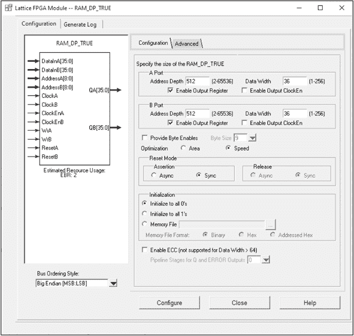

图 9-1：使用 GUI 实例化块 RAM

窗口左侧的框图直观地展示了块 RAM 的输入和输出。在右侧的配置部分，可以清楚地看到哪些原语的选择是互斥的。这些通过单选按钮表示，例如初始化为全 0 或初始化为全 1。我们还可以看出哪些选项可以启用或禁用。这些通过复选框表示，例如启用输出寄存器或启用输出时钟使能。此外，右下角还有一个方便的帮助按钮，如果你不确定该选择什么，它可以帮助你做出决策。

一旦你使用 GUI 配置了原语，你将获得一个实例化模板，可以将其放入你的 Verilog 或 VHDL 代码中，就像我们在上一节中看到的那样。该模板将根据你在 GUI 中选择的具体设置进行定制，这样你就可以连接你的原语，而不需要猜测如何配置它。

与直接实例化相比，GUI 方法对于初学者来说更容易上手。使用 GUI 时，由于菜单的引导，你更不容易出错，但你仍然可以像实例化时一样精确控制所得到的内容。然而，这种方法也有一个重要的缺点。如果你需要更改原语中的某个设置，就需要打开 GUI 并重新执行整个过程。这听起来可能不算什么大事，但如果你的设计中有许多使用 GUI 创建的原语，进行调整可能会变得非常繁琐且耗时。

## 块 RAM

*块 RAM (BRAM)* 是内建于 FPGA 中的专用存储组件。仅次于查找表（LUTs）和触发器，块 RAM 是第三种最常见的 FPGA 原语。在第六章中，我们简要提到过块 RAM，当时我们讨论了常见的内存模块，如 RAM 和 FIFO。如同我在那一章中提到的，当你需要一个超过某个大小的内存时，它将使用块 RAM 而非触发器来创建。

为存储数据创建内存是 FPGA 中非常常见的任务。你可能会使用块 RAM 来存储只读数据，如校准值，或者你可能会定期将数据从外部设备（如模数转换器（ADC））写入块 RAM，然后稍后再从中读取。块 RAM 也常用于在生产者和消费者之间缓冲数据，包括在时钟域之间传输数据的情况。在这种情况下，块 RAM 可以配置为 FIFO，具有专门设计的功能来处理跨越时钟域时出现的亚稳态问题（我们在第七章中讨论过如何跨时钟域传输数据）。

可用的块 RAM 数量以及每个块 RAM 的具体特性在不同 FPGA 和不同供应商之间会有所不同。你应该始终查阅你 FPGA 的 datasheet 和内存指南，以获取与你的型号相关的详细信息。例如，图 9-2 展示了 Intel Cyclone V 系列 FPGA 上的块 RAM 的 datasheet。

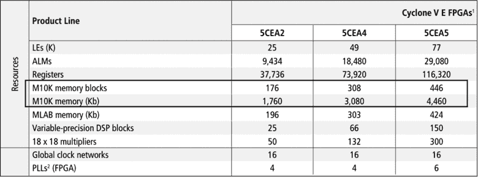

图 9-2：Cyclone V 产品系列上的块 RAM

Intel 将块 RAM 称为*内存块*。datasheet 中标出的一行首先告诉我们每三种 FPGA 型号中有多少个内存块：5CEA2 FPGA 有 176 个，5CEA4 有 308 个，5CEA5 有 446 个。datasheet 中的下一行显示了可用块 RAM 存储的总千比特数（Kb）。每个内存块可容纳 10Kb（因此名称中的*M10K*），所以 5CEA2 FPGA 上有 1,760Kb 的 BRAM 存储，5CEA4 上有 3,080Kb，5CEA5 上有 4,460Kb。

你可能会对其实际存储容量感到惊讶。即便是最大的 4,460Kb，也不到 1MB！考虑到你可以以大约 10 美元的价格购买一个 32GB 的 MicroSD 卡，它的存储空间比这个大成千上万倍，你就会开始理解 FPGA 并不是为了存储大量数据而设计的。相反，块 RAM 用于在 FPGA 上缓冲数据，以供临时使用。如果你需要存储大量数据，你将需要使用外部芯片来实现这一点。MicroSD 卡、DDR 内存、SRAM 和闪存是 FPGA 可能连接的常见芯片类型，以扩展其内存存储和检索能力。

你还应该注意，在 图 9-2 中，块 RAM 是 Cyclone V 数据表中 FPGA 资源列表中的第四项，位于 LEs、ALMs 和寄存器之后。这些是 Intel 用来描述 LUT 和触发器的术语（LE 代表逻辑单元，ALM 代表自适应逻辑模块）。虽然你可能并不总是需要很多块 RAM 来满足应用需求，但在数据表中的这一重要位置突出显示了块 RAM 通常是选择 FPGA 时必须考虑的最重要原始组件之一。

### 特性与限制

在使用块 RAM 时，有一些常见的特性和一些限制需要记住。首先，块 RAM 通常在 FPGA 上只有一种尺寸；每个块 RAM 16Kb 是常见的。这种“一刀切”的方法意味着，如果你只需要使用 16Kb 中的 4Kb，你仍然需要使用整个块 RAM 元件。无法将单个块 RAM 组件划分成多个内存，因此块 RAM 在这方面具有一定的限制。

然而，从其他角度来看，块 RAM 还是相当灵活的。你可以按照自己需要的宽度存储数据：例如，使用 16Kb 的块 RAM，你可以存储宽度为 1 位、深度为 16,384 位（2¹⁴）的数据，或者宽度为 8 位、深度为 2,048 位，或者宽度为 32 位、深度为 512 位等。还可以创建比单个块 RAM 更大的存储器。例如，如果你需要存储 16KB 的数据，就需要使用八个单独的块 RAM（16Kb × 8 = 16KB）。工具足够智能，能够级联这些块 RAM，使它们看起来像一个大存储器，而不是八个需要单独索引的组件。

其他常见的功能包括错误检测和修正，其中块 RAM 预留了一些额外的位来检测和修正内存本身可能发生的任何错误（即，当 1 变为 0，或反之）。如果内存发生这种情况，某个值可能会被完全破坏，并且当 FPGA 尝试分析它时会产生非常奇怪的行为。

错误检测和纠正是两个独立但相关的过程：FPGA 可以*检测*一些位错误并通知你它们的存在，另外，它也可以自动*纠正*一些位错误。通常，能够纠正的位错误数量小于能够检测的位错误数量。这里重要的一点是，块 RAM 中的错误检测和纠正是自动执行的，你无需做任何操作。

许多块 RAM 还可以初始化为默认值。如果你需要存储大量初始值，或者如果你想创建只读内存（ROM），这可能是一个有用的功能。将这些值推送到块 RAM，而不是占用触发器进行数据存储，是节省资源的一种有价值的方法。我们在第七章中提到过这个想法，当时我们在看可综合和不可综合的 Verilog 和 VHDL 部分时，虽然从文件读取通常是不可综合的——记住，FPGA 上没有文件系统，除非你自己创建——但是我们可以作为综合过程的一部分，从文件读取数据，以便将默认值预加载到块 RAM 中。同样，我建议你查阅特定 FPGA 的内存指南，以了解它支持哪些功能。

### 创建

在你的设计中使用块 RAM 时，我通常建议推导出它。正如你在第六章中看到的，当我们创建一个二维内存元素时，工具会轻松识别它。这个内存是否会被推送到块 RAM 取决于其大小。再说一次，综合工具在这方面很聪明：它知道你创建了多少位内存，如果超过某个阈值，它就会将其推送到块 RAM，否则，工具只会使用触发器。例如，如果你创建了一个存储 16 字节的内存，它很可能会被推送到触发器。你只需要 16 × 8 = 128 位内存，因此，使用整个 16Kb 的块 RAM 来存储这点数据就不太有意义。

工具开始将内存推送到块 RAM 而不是使用触发器的时机，通常取决于具体情况。要了解你的工具为特定设计做出的决定，请在综合后查阅你的利用率报告。以下是一个示例：

```
`--snip--`
Number of registers:   1204 out of 84255 (1%)
`--snip--`
Number of LUT4s:       1925 out of 83640 (2%)
`--snip--`
❶ Number of block RAMs:  3 out of 208 (1%)
```

利用率报告列出了所需的块 RAM 数量❶，就像它列出了触发器（寄存器）和 LUT（LUT4，或者在此情况下是四输入 LUT）的数量一样。如果你看到没有使用块 RAM，那么你的内存可能被推导为触发器了。作为提醒，我总是建议你仔细检查利用率报告，确保工具推导出了你预期的结果。

如果你对推断大容量内存元素感到担忧，或者不确定在块 RAM 中应该利用哪些特性，使用图形用户界面（GUI）创建它是你最好的选择。GUI 会引导你完成整个过程，因此对于初学者来说非常有帮助。使用 GUI 也是确保在跨时钟域时正确使用 FIFO 的最佳方式，因为它可以帮助你处理其中的复杂性。

## 数字信号处理模块

*数字信号处理（DSP）* 是对数字系统中的信号执行基于数学的操作的统称。这些数学操作通常需要非常快速地并行执行，这使得 FPGA 成为执行此任务的极好工具。由于 DSP 是 FPGA 中一个非常常见的应用，另一种 FPGA 原语，*DSP 块*，也为此目的存在。DSP 块（也称为 *DSP 瓦片*）专门用于执行数学操作，特别是 *乘法–累加（MAC）* 操作，这是一个先进行乘法操作再进行加法操作的过程。然而，在我们更深入地研究这些原语之前，值得先回顾一下模拟信号和数字信号之间的区别。

### 模拟信号与数字信号

*模拟信号*是一个连续的信号，表示某种物理量的测量。一个常见的例子是储存在黑胶唱片上的音频信号（这是一种大而黑的光亮物体，上面有音乐，有时可以在老电影或新潮的酒吧里看到）。唱片上刻有一条连续的凹槽，反映了音频的连续波形。然后，唱片播放机用针头读取这个波形，并放大得到的信号来回放声音。信息始终是模拟的，无需转换。

*数字信号*则不同，它们不是连续的，而是在各个时间点上由离散的测量值组成，中间有间隔。一个常见的例子是储存在 CD 上的音频信号，其中声音以一系列的 1 和 0 来表示。如果你有足够的离散测量值，你可以填补这些间隔，从这些数字值中创建出一个 reasonably accurate 逼真的模拟信号近似值。CD 播放器读取这些数字值，并从中重建出模拟波形。结果总是原始模拟信号的近似，因此一些音响爱好者更喜欢唱片的真实模拟信号，而不是 CD 或 MP3 等数字媒体。

在你常见的 FPGA 结构中，例如查找表（LUT）和触发器，数据是以数字形式表示的。那么，如果你有一个需要输入到 FPGA 中的模拟信号该怎么办呢？这就是 ADC 的作用：它通过 *采样*，即在离散的时间点记录其值，将模拟信号转换为数字信号。图 9-3 显示了这一过程是如何工作的。

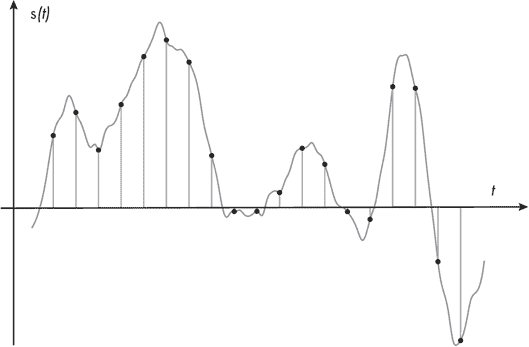

图 9-3：模拟信号的数字采样

图中从左到右移动的波动线表示一个连续的模拟信号，而沿着这条线的黑点则表示对该信号进行采样并将其转换为数字形式。注意，采样是按规律的时间间隔进行的。模拟信号的采样频率被称为*采样频率*或*采样率*。采样率越高，我们就能越准确地表示模拟信号，因为将离散的点连接成类似于原始波形的形状会更加容易。然而，较高的采样率也意味着我们需要处理更多的数据：每个点代表一定数量的数字数据，所以点越多，我们处理的位数就越多。

### 常见的 DSP 任务

FPGA 通常将模拟信号作为输入，将其数字化，然后进行一些数学运算来处理这些数字数据。例如，假设我们有一个音频信号，我们已经在 FPGA 中对其进行了采样。进一步假设录制的数据太小，播放时很难听清。我们如何操作数字信号，使输出音量更大呢？我们可以做的一件简单的事是将每个数字值乘以一个常数，例如 1.6。这就是对信号应用*增益*。那么我们如何在 FPGA 中实现这一点呢？其实非常简单：

```
gain_adjusted <= input_signal * 1.6;
```

我们获取 input_signal，将信号中每个离散的数字值乘以 1.6，然后将结果存储在 gain_adjusted 输出中。这时，DSP 原语就派上用场了。当我们编写这样的代码时，综合工具会看到我们在执行乘法操作，并自动推断出一个 DSP 块来处理这一操作。

对输入信号应用增益不需要并行处理。每个数据样本只有一次乘法运算，数据样本可以一个接一个地处理。然而，通常你需要通过同时运行多个 DSP 块来执行多个数学运算。一个常见的例子是创建一个*滤波器*，它对信号执行数学运算，以减少或增强输入信号的某些特征。例如，*低通滤波器 (LPF)* 会保留信号中低于某个截止频率的频率成分，同时减少高于该截止频率的频率，这对于去除输入信号中的高频噪声非常有用。降低音响系统中高音的滑块是应用低通滤波器的一个现实世界例子，因为它会减少音频中的高频部分。数字低通滤波器的实现细节超出了本书的范围，但由于它需要同时进行许多乘法和加法运算，因此 FPGA 非常适合完成这一任务。

另一个可能在 FPGA 中执行的并行数学运算的例子是处理视频数据以创建模糊效果。视频模糊涉及用一组邻近像素的平均值替换单个像素值。这需要同时对图像中的许多像素进行数学运算，并且由于视频数据每秒包含许多图像，这必须迅速完成。FPGA 能够使用 DSP 块高效地执行这些并行数学运算。

### 功能

DSP 块是多功能的原语，提供许多有助于执行不同数学运算的功能。你并不总是需要为你的应用程序使用所有功能——通常，你只需要进行乘法或加法运算——但对于更复杂的场景，DSP 块可以配置来解决广泛的问题。图 9-4 详细展示了 AMD FPGA 中的 DSP 块。每个制造商的 DSP 原语有所不同，但这个示例代表了典型的可用功能。

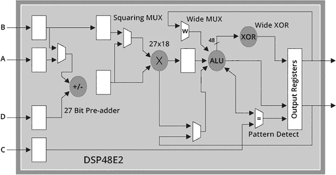

图 9-4：DSP 原语的框图

这个图实际上展示了 DSP 块的简化版本。理解原语的完整结构并非至关重要，但值得指出几点。首先，注意到这个 DSP 块最多可以接受四个输入并有两个输出。这使得它比仅仅进行两个数字相乘的应用更具扩展性：例如，MAC，其中乘法结果在下一个时钟周期反馈到输入以进行加法运算。

在框图的左侧，你可以看到一个*预加法器*块。如果请求在执行其他数学操作之前进行加法操作，可以启用该块。在它的右侧，接近图的中间位置，是一个带有 X 的圆圈。这就是*乘法器*，它是 DSP 块的核心，执行高速的乘法操作。在它的右侧是一个标有 ALU 的圆圈，ALU 代表*算术逻辑单元*，可以执行更多操作，如加法和减法。最后，还有内建的输出寄存器，可以启用以采样输出并帮助在快速数据速率下满足时序要求。

与块 RAM 数量一样，可用的 DSP 块数量因 FPGA 而异。一些高端 FPGA 内部有成千上万个 DSP 块；同样，你应该查阅你 FPGA 的数据手册，以获取与你型号相关的具体细节。举个例子，图 9-5 显示了 Intel Cyclone V 产品线数据手册中关于 DSP 块的信息。

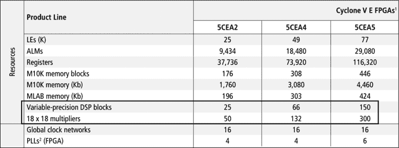

图 9-5：Cyclone V FPGA 上的 DSP 块

请注意，DSP 块的信息紧跟在块 RAM 信息之后，这再次强调了这些原语在 FPGA 开发中的重要性。5CEA2 FPGA 有 25 个 DSP 块，但 5CEA4 为 66 个，5CEA5 为 150 个。每个 DSP 块有两个乘法器，因此在第二行高亮显示的地方，我们可以看到 18×18 乘法器的数量是 DSP 块的两倍（其中 18 是输入的位宽）。

注意

*如果你的 FPGA 上没有可用的 DSP 块，这并不意味着你不能执行这些类型的操作。乘法和加法操作将仅使用 LUT 实现，而不是使用专用的 DSP 块。我们将在第十章进一步讨论这个问题。*

### 创建

与块 RAM 一样，我通常建议使用推理来创建 DSP 块。你需要执行的大多数乘法操作将需要两个输入和一个输出，就像我们之前对信号应用增益时看到的那样。用 Verilog 或 VHDL 编写相关代码并让工具处理其余部分非常简单。记得检查你的综合报告，以确保你得到了预期的结果，但我在使用综合工具理解我的加法和乘法意图时运气不错，它们会将这些操作推送到相关的 DSP 中。你所使用的 FPGA 的用户指南还将提供如何编写 Verilog 或 VHDL 代码的建议，帮助确保工具理解你的意图。

如果你的 DSP 块有更复杂的需求，或者你想深入探索它们的所有特性和功能，那么你可能应该通过 GUI 来创建它们，以确保能够得到你想要的功能。图 9-6 展示了在 Lattice Diamond GUI 中创建乘法器的示例。

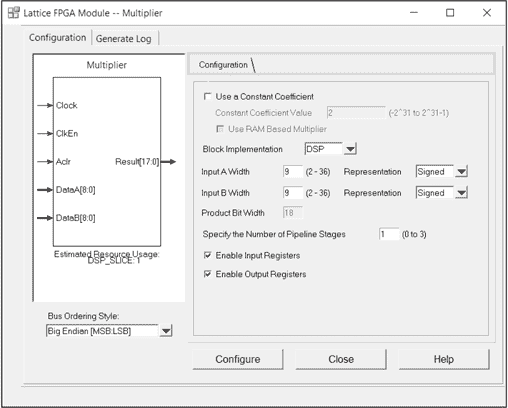

图 9-6：通过 GUI 创建 DSP 块

这里需要特别强调的是“块实现”下拉菜单。你可以将其从 DSP 改为 LUT，以使用查找表而非 DSP 块来执行乘法运算。如前所述，LUT 和 DSP 都可以执行数学运算，包括乘法。然而，使用 DSP 块，你可以节省 LUT 资源，并且能够以更高的时钟频率运行数学运算，因为你将使用一个专门为数学运算高度优化的原语。

## 锁相环（PLL）

*锁相环（PLL）* 是一种常用于作为整个 FPGA 主时钟生成器的原语。通常情况下，你会有一个外部时钟芯片，它运行在某个频率上。在某些 FPGA 上，你可以直接使用这个输入时钟来驱动所有同步逻辑，就像我们在本书的项目中做的那样。在这种情况下，你的逻辑频率将固定为你选择的外部时钟频率。但是，如果你需要更改频率会怎样呢？没有 PLL 的话，你需要物理地移除外部时钟芯片，并将其替换为一个生成你想要切换到的时钟频率的不同组件。然而，使用 PLL 后，你可以通过改变几行代码，在 FPGA 内部生成不同的时钟频率，而无需新的外部组件。

PLL 还使得在 FPGA 设计中使用多个时钟域变得更加容易。假设你有一些外部内存，它的运行频率是 100 MHz，但你希望主逻辑运行在 25 MHz。如果你想要实现这一点，你*可以*购买第二个外部时钟并将其输入到 FPGA 中，但更好的解决方案是使用 PLL，因为这个原语可以同时生成多个时钟频率。

不是所有的 FPGA 都有 PLL，但许多 FPGA 至少有一个，而有些 FPGA 则有多个。数据手册会告诉你有哪些可用的 PLL。例如，图 9-7 展示了英特尔 Cyclone V 产品线上的 PLL。

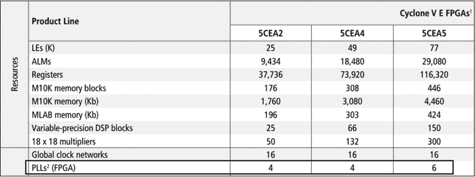

图 9-7：Cyclone V 产品线上的 PLL

5CEA2 和 5CEA4 FPGA 都有四个 PLL，而 5CEA5 则有六个。鉴于每个 PLL 都可以生成多个时钟频率，这应该足以满足你所有的时钟需求。

### 工作原理

PLL 作为你在 FPGA 中时钟分发的源头，通过接收一个单一的时钟输入，通常称为*参考时钟*，并从中生成一个或多个时钟输出。输入时钟来自一个专用的外部组件，输出时钟可以与输入时钟以及彼此的频率完全不同。图 9-8 中的框图展示了 PLL 上最常见的信号。

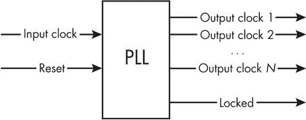

图 9-8：常见的 PLL 信号

PLL 通常有两个输入：一个时钟信号和一个复位信号。当复位信号被激活时，PLL 将停止运行。

在输出端，PLL 有一定数量的输出时钟，范围从 1 到*N*，最大值取决于 FPGA。输出时钟的频率可以不同，具体取决于设计的需求。这些频率通过对输入参考时钟进行乘法和/或除法运算来实现，从而得到所需的值。例如，假设你有一个 10 MHz 的输入参考时钟，并且你需要一个 15 MHz 的输出时钟。PLL 会将参考时钟乘以 3（得到 30 MHz），然后再除以 2 得到 15 MHz。乘法和除法的因子必须是整数，因此必须注意你不能从 PLL 获得任何任意的频率。例如，无法从 10 MHz 的时钟输入获得 π MHz 的时钟输出，因为 π 是一个无法表示为两个整数比值的无理数。

除了可以改变输出时钟的频率外，PLL 还可以改变它们的相位。信号的*相位*是信号在其重复波形中的当前位置，以 0 到 360 度的角度来测量。通过比较两个共享相同频率但时间上不同步的信号，可以更容易地理解这一点。图 9-9 演示了一些常见的时钟信号相位偏移。

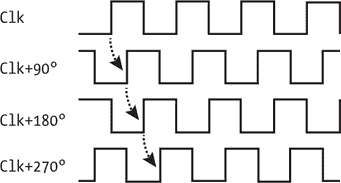

图 9-9：常见的相位偏移

如图所示，时钟信号的相位偏移会导致其上升沿的位置发生变化。将没有相位偏移的<	samp class="SANS_TheSansMonoCd_W5Regular_11">Clk的第一个上升沿与相位偏移 90 度的<	samp class="SANS_TheSansMonoCd_W5Regular_11">Clk+90°的第一个上升沿进行比较。Clk+90°的上升沿比<	samp class="SANS_TheSansMonoCd_W5Regular_11">Clk延迟了一个时钟周期的四分之一。每增加 90 度，相位偏移都会使信号再延迟一个四分之一周期。继续图中的示例，得到<	samp class="SANS_TheSansMonoCd_W5Regular_11">Clk+180°，该信号比<	samp class="SANS_TheSansMonoCd_W5Regular_11">Clk+90°延迟了 90 度，相比<	samp class="SANS_TheSansMonoCd_W5Regular_11">Clk延迟了 180 度。请注意，Clk+180°实际上与如果你将<	samp class="SANS_TheSansMonoCd_W5Regular_11">Clk信号反转（交换高低电平）得到的波形是相同的。最后，Clk+270°比原始<	samp class="SANS_TheSansMonoCd_W5Regular_11">Clk信号延迟了三个四分之一时钟周期。如果你将相位偏移到 360 度，你将恢复到原始信号。这个例子演示了正相位偏移，但相位也可以是负的，意味着信号相对于另一个信号在时间上被向后偏移。当然，你可以以任何任意角度来调整相位，而不仅限于 90 度的步长。

注意

*在简单设计中，使用相位偏移来创建时钟并不常见，但在某些应用中可能会很有用。例如，这对于与外部组件的接口可能很重要，比如一些非 FPGA 内存。*

回到图 9-8 中的框图，PLL 通常还有一个*锁定*输出信号，告诉下游的任何模块 PLL 正在工作，你可以“信任”这些时钟。使用这个锁定信号作为依赖于 PLL 时钟的其他模块的复位信号是一种常见的设计实践。当 PLL 没有锁定时，PLL 下游的模块将保持复位状态，直到 PLL 锁定并准备好为止，这意味着输出时钟可以被你 FPGA 设计中的其他模块使用。当 PLL 的复位输入被驱动为高电平时，其锁定输出将变为低电平，将下游模块恢复到复位状态。

如果你在设计中使用 PLL（相位锁定环），建议*仅*使用 PLL 的输出端来满足所有时钟需求。即使你设计中的一部分与外部参考时钟的频率相同，也不应直接使用外部时钟来驱动该部分设计。相反，应该让 PLL 输出与外部参考时钟相同频率的时钟信号。通过只使用 PLL 的输出，你可以精确控制输出时钟之间的关系。此外，你可以放心地使用 PLL 锁定的输出作为复位电路，知道它反映了你设计中*所有*时钟的工作状态。

### 创建

我推荐使用 GUI 来创建 PLL，因为综合工具无法推断 PLL。虽然也可以通过实例化来创建 PLL，但这容易出错。你需要选择兼容的 PLL 设置才能成功工作，在实例化时很容易选择不兼容的设置。例如，如果你有一个 10 MHz 的参考时钟，并且想生成一个 15 MHz 的输出和一个独立的 89 MHz 输出，这可能根本行不通，但你可能会在实例化过程中忽略这个事实。

当你通过 GUI 创建 PLL 时，你需要提供输入参考时钟和期望的输出时钟频率，工具会告诉你是否能找到一个可行的解决方案。以 10/15/89 MHz 为例，GUI 可能告诉你它能够提供的最接近 89 MHz 的频率是 90 MHz（因为 90 MHz 是 10 MHz 和 15 MHz 的倍数，这应该是可行的）。然后，你需要决定 90 MHz 是否适合你的设计，或者你是否真的需要 89 MHz，如果是这样，可能需要使用一个单独的 PLL 或者更改你的参考时钟。图 9-10 显示了 Lattice Diamond 中 PLL GUI 的示例。

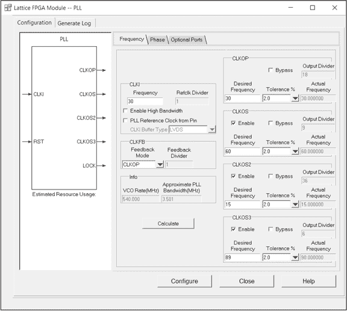

图 9-10：使用 GUI 创建 PLL

正如你所看到的，GUI 帮助我们引导 PLL 创建过程。在这个例子中，我们在CLKI上有一个 30 MHz 的参考频率，我们将期望的输出频率设置为：在CLKOP上为 30 MHz，CLKOS上为 60 MHz，CLKOS2上为 15 MHz，以及CLKOS3上为 89 MHz。请注意，除了CLKOS3之外，每个时钟的实际频率（最右侧）都与期望频率相匹配。对于CLKOS3，当我第一次尝试以 0.0%的容差创建一个 89 MHz 的时钟时，我得到了图 9-11 中显示的错误信息。

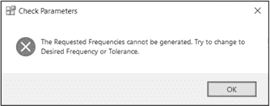

图 9-11：无效 PLL 设置的可操作反馈

直到我将容差改为 2.0%时，错误信息才消失；工具选择了 90 MHz 的实际频率，这在请求频率的 2.0%范围内。如果你尝试直接实例化 PLL，工具不会提供这种类型的指导。

GUI 的另一个有用功能是 PLL 框图，显示在图 9-10 的左半部分。如果你修改了输入或输出，这个图示会更新。例如，如果我们禁用了CLKOS3，该输出将在框图中消失，表示我们只希望输出三个时钟信号。这个功能对于确保你正在创建预期的内容非常有用。请注意，窗口顶部还有一个单独的“Phase”标签，允许我们为输出时钟指定相位偏移。

在 GUI 中设计 PLL 之后，你可以通过正常的综合过程运行你的设计。利用率报告将确认你确实得到了 PLL，因为它是报告中突出的主要原语之一。以下是一个示例：

```
`--snip--`
Number of PLLs:   1 out of 4 (25%)
```

这表示在这个特定 FPGA 中，正在使用四个 PLL 中的一个。

## 总结

你大部分的 Verilog 和 VHDL 代码将用于创建 LUTs 和触发器，这两者是 FPGA 中最基本的组件。然而，正如你在本章中所看到的，FPGA 还包含其他原语组件，如块 RAM、DSP 块和 PLL，它们增加了专用的功能。块 RAM 提供了专用内存，DSP 块启用了高速并行数学运算，而 PLL 则允许你生成不同的内部时钟频率。通过这些 FPGA 构建模块的组合，你将能够高效地解决广泛的问题。
