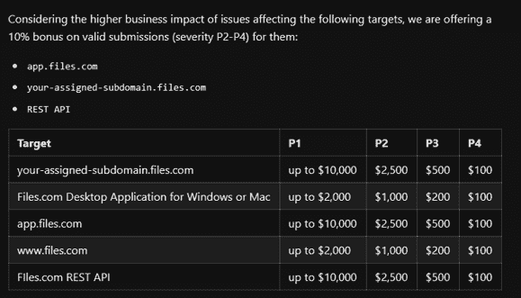

# 为你的安全测试做准备

API 安全测试并不完全符合一般渗透测试的模式，也不完全符合 Web 应用渗透测试的模式。由于许多组织的 API 攻击面规模和复杂性，API 渗透测试是一个独特的服务。在本章中，我将讨论你在攻击前应该包括在测试中的 API 特性，并进行文档记录。本章内容将帮助你评估进行合作所需的活动量，确保你计划测试目标 API 的所有特性，并帮助你避免麻烦。

API 渗透测试需要一个充分发展的*范围*，即允许你测试的目标和特征的描述，确保客户和测试者对所做的工作有共同的理解。API 安全测试的范围包括几个因素：你的方法论、测试的规模、目标特性、测试的任何限制、报告要求，以及是否计划进行修复测试。

## 接受授权

在攻击 API 之前，极其重要的是你必须收到一份签署的合同，其中包括合作范围，并授权你在特定时间范围内攻击客户的资源。

对于 API 渗透测试，合同可以采取签署的工作声明（SOW）形式，列出已批准的目标，确保你和你的客户就他们希望你提供的服务达成一致。这包括就将测试哪些 API 方面达成协议，确定任何排除项，并设置约定的时间进行测试。

仔细检查签署合同的人是否为目标客户的代表，且有权授权测试。还要确保待测试的资产属于客户；否则，你需要与正确的所有者重新执行这些指令。记得考虑客户托管其 API 的位置，以及他们是否确实有权对软件和硬件进行测试授权。

有些组织在范围文档上可能过于严格。如果你有机会制定范围，我建议你用自己冷静的语言，友善地向客户解释，犯罪分子是没有范围或限制的。真正的罪犯不会考虑其他消耗 IT 资源的项目；他们不会避免包含敏感生产服务器的子网，也不会在不方便的时间避免进行攻击。努力说服客户理解进行不那么严格的合作的价值，然后与他们合作记录具体事项。

与客户会面，明确说明将要发生的事情，然后将其准确地记录在合同、提醒邮件或笔记中。如果你遵守所请求服务的书面协议，你应该是合法且符合道德的。然而，减少风险的做法可能是与律师或法务部门进行咨询。

## API 测试的威胁建模

*威胁建模*是用来绘制 API 提供者威胁的过程。如果你根据相关威胁来建模 API 渗透测试，你将能够选择针对该攻击的工具和技术。最有效的 API 测试是那些与实际威胁相匹配的测试。

*威胁行为者*是 API 的对手或攻击者。对手可以是任何人，从偶然发现 API 并对应用程序知之甚少的公众成员，到使用该应用程序的客户、不法商业伙伴或了解应用程序很多内容的内部人员。为了进行一项对 API 安全性最有价值的测试，理想的做法是绘制出可能的对手及其黑客技术。

你的测试方法应直接来源于威胁行为者的视角，因为这个视角应决定你所获得的关于目标的信息。如果威胁行为者对 API 一无所知，他们将需要进行研究以确定他们可能如何攻击应用程序。然而，一个不法的商业伙伴或内部威胁可能已经知道关于应用程序的很多信息，而无需进行侦察。为了应对这些不同情况，存在三种基本的渗透测试方法：黑盒、灰盒和白盒。

黑盒测试模拟了机会攻击者的威胁——这种攻击者可能偶然发现了目标组织或其 API。在一个真正的黑盒 API 测试中，客户不会向测试者透露任何关于攻击面的信息。你可能从仅知道签署 SOW（服务工作说明书）的公司名称开始你的测试工作。从这里开始，测试工作将包括利用开源情报（OSINT）进行侦察，尽可能多地了解目标组织。你可能通过结合使用搜索引擎研究、社交媒体、公开财务记录和 DNS 信息，来发现目标的攻击面，了解尽可能多关于该组织域名的信息。这种方法的工具和技术将在第六章中有更详细的介绍。一旦你完成了 OSINT，你应该已经整理出一份目标 IP 地址、URL 和 API 端点的清单，可以呈交给客户进行审查。客户应查看你的目标清单，然后授权进行测试。

灰箱测试是一种更为信息丰富的参与方式，旨在重新分配侦察上花费的时间，将更多时间投入到主动测试中。在进行灰箱测试时，你将模仿一个信息更为充分的攻击者。你会获得一些信息，例如哪些目标在范围内，哪些目标超出范围，还可能访问 API 文档，甚至可能会获得一个基础用户账户。你可能还会被允许绕过某些网络外围安全控制。

漏洞悬赏计划通常介于黑箱测试和灰箱测试之间。漏洞悬赏计划是一种参与方式，公司允许黑客测试其 Web 应用程序的漏洞，成功发现漏洞后，主办公司会向发现者支付悬赏金。漏洞悬赏并不完全是“黑箱”测试，因为悬赏猎人会被提供一些已批准的测试目标、超出范围的目标、会奖励的漏洞类型以及允许的攻击方式。由于有了这些限制，漏洞悬赏猎人仅受限于自身的资源，因此他们可以自行决定在侦察与其他技术之间分配多少时间。如果你有兴趣深入了解漏洞悬赏狩猎，我强烈推荐 Vickie Li 的 *漏洞悬赏训练营*（[`nostarch.com/bug-bounty-bootcamp`](https://nostarch.com/bug-bounty-bootcamp)）。

在白箱方法中，客户会尽可能披露他们环境的内部工作原理。除了灰箱测试提供的信息外，这还可能包括访问应用程序源代码、设计信息、用于开发应用程序的软件开发工具包（SDK）等。白箱测试模拟的是内部攻击者的威胁——一个了解组织内部工作原理并且有实际源代码访问权限的人。你在白箱测试中获得的信息越多，目标就会被越彻底地测试。

客户决定将参与范围设定为白盒测试、黑盒测试，还是介于两者之间的方式，应基于威胁模型和威胁情报。通过使用威胁建模，与客户一起确定该组织最可能的攻击者。例如，假设你正在与一个小型企业合作，该企业在政治上无关紧要；它不是一个更重要公司的供应链的一部分，也不提供基本服务。在这种情况下，假设该组织的对手是一个资金充足的先进持续威胁（APT），如一个国家级黑客组织，显然是不合理的。对这个小企业使用 APT 的技术就像对一个小偷使用无人机打击。相反，为了给客户提供最大价值，你应该使用威胁建模来制定一个现实的威胁。在这种情况下，最可能的攻击者可能是一个机会主义、技能中等的个人，他偶然发现了该组织的网站，并可能只会利用已知漏洞的公开利用工具。适合这种机会主义攻击者的测试方法是有限的黑盒测试。

为客户制定威胁模型的最有效方式是与他们进行问卷调查。调查需要揭示客户面临的攻击暴露范围、其经济重要性、政治参与度、是否参与任何供应链、是否提供基本服务以及是否有其他潜在的动机可能促使犯罪分子攻击他们。你可以自行开发调查问卷，或者根据现有的专业资源（如 MITRE ATT&CK（[`attack.mitre.org`](https://attack.mitre.org)）或 OWASP（[`cheatsheetseries.owasp.org/cheatsheets/Threat_Modeling_Cheat_Sheet.html`](https://cheatsheetseries.owasp.org/cheatsheets/Threat_Modeling_Cheat_Sheet.html)））制作问卷。

你选择的测试方法将决定剩余的大部分范围工作。由于黑盒测试人员通常只提供非常有限的范围信息，剩余的范围项目对于灰盒测试和白盒测试更为相关。

## 你应该测试的 API 特性

确定 API 安全测试的范围的主要目标之一是发现你需要执行的工作量。因此，你必须找出需要测试的唯一 API 端点、方法、版本、功能、认证与授权机制以及权限级别的数量。测试的规模可以通过与客户的访谈、审查相关的 API 文档和访问 API 集合来确定。一旦你获得了所需的信息，你应该能够评估出测试客户 API 所需的小时数。

### API 认证测试

确定客户希望如何处理经过身份验证和未经过身份验证的用户的测试。客户可能希望你测试不同的 API 用户和角色，以查看是否在不同的权限级别中存在漏洞。客户也可能希望你测试他们用于身份验证和用户授权的过程。对于 API 弱点来说，许多有害的漏洞通常出现在身份验证和授权中。在黑盒测试中，你需要弄清楚目标的身份验证过程，并设法进行身份验证。

### Web 应用防火墙

在白盒测试中，你需要注意是否有 Web 应用防火墙（WAF）在使用。*WAF* 是 Web 应用和 API 的一种常见防御机制。WAF 是一种控制到达 API 的网络流量的设备。如果 WAF 设置得当，你会在测试过程中很快发现当进行简单扫描后，访问 API 被拒绝。WAF 对限制意外请求和阻止 API 安全测试非常有效。一个有效的 WAF 会检测请求的频率或请求失败，并封禁你的测试设备。

在灰盒和白盒测试中，客户可能会将 WAF 向你公开，此时你将面临一些决策。关于是否应该为了提高测试的有效性而放松安全性，意见分歧，但分层的网络安全防御是有效保护组织的关键。换句话说，任何人都不应该将所有的“鸡蛋”都放在 WAF 这一个篮子里。给足够的时间，持续的攻击者可能会学会 WAF 的边界，找出绕过它的方法，或者利用一个使其无效的零日漏洞。

理想情况下，客户会允许你的攻击 IP 地址绕过 WAF，或者调整他们的边界安全级别，以便你可以测试暴露给 API 消费者的安全控制。如前所述，做出此类计划和决策实际上是进行威胁建模。最好的 API 测试是那些与 API 提供者的实际威胁相一致的测试。为了得到对 API 安全最有价值的测试，理想的做法是绘制出可能的对手及其黑客技巧。否则，你会发现自己在测试 API 提供者的 WAF 有效性，而不是他们的 API 安全控制的有效性。

### 移动应用测试

许多组织拥有移动应用程序，这些应用程序扩展了攻击面。此外，移动应用程序通常依赖于 API 在应用程序内和支持服务器之间传输数据。你可以通过手动代码审查、自动源代码分析和动态分析来测试这些 API。*手动*代码审查涉及访问移动应用程序的源代码，并寻找潜在的漏洞。*自动化*源代码分析类似，区别在于它使用自动化工具来帮助寻找漏洞和有趣的工件。最后，*动态*分析是在应用程序运行时进行测试。动态分析包括拦截移动应用程序的客户端 API 请求和服务器 API 响应，然后尝试找出可以被利用的弱点。

### 审计 API 文档

API 的*文档*是一本描述如何使用该 API 的手册，包括身份验证要求、用户角色、使用示例和 API 端点信息。良好的文档对于任何自给自足 API 的商业成功至关重要。如果没有有效的 API 文档，企业将不得不依赖培训来支持他们的消费者。正因如此，你可以肯定你的目标 API 会有文档。

然而，这些文档可能充满了不准确、过时的信息和信息泄露漏洞。作为 API 黑客，你应该搜索目标的 API 文档，并利用它为自己谋取优势。在灰盒和白盒测试中，API 文档审计应该纳入测试范围。审查文档可以通过暴露漏洞（包括业务逻辑缺陷）来提升目标 API 的安全性。

### 速率限制测试

*速率限制*是对 API 消费者在给定时间范围内可以发出的请求数量的限制。它由 API 提供方的网络服务器、防火墙或 Web 应用程序防火墙强制执行，主要有两个重要目的：它允许 API 提供方通过 API 变现，并防止过度消耗提供方的资源。由于速率限制是允许组织通过 API 获利的关键因素，因此在 API 交互过程中你应该将其纳入测试范围。

举个例子，一家企业可能允许免费层 API 用户每小时发起一次请求。一旦请求发出，消费者将无法在一小时内发起其他请求。然而，如果用户支付该企业费用，他们每小时就可以发起数百次请求。如果没有足够的控制措施，这些不付费的 API 消费者可能会找到绕过限制的方式，随意消费数据。

限速测试不同于拒绝服务（DoS）测试。DoS 测试是指旨在干扰服务并使系统和应用无法提供给用户的攻击。与此不同，DoS 测试旨在评估一个组织计算资源的韧性，而限速测试则试图绕过限制请求数量的限制，即在给定时间框架内发送的请求数量。绕过限速并不一定会导致服务中断，反而可能有助于其他攻击，并展示组织在其 API 获利方式上的弱点。

通常，组织会在 API 文档中发布其 API 的请求限制，内容可能类似于以下内容：

> 你可以在 *X* 时间框架内发送 *Y* 请求。如果你超过这个限制，你将从我们的 Web 服务器收到 *Z* 响应。

例如，Twitter 会根据你的授权对请求进行限制，一旦你通过身份验证，第一级别每 15 分钟可以发送 15 个请求，下一层级每 15 分钟可以发送 180 个请求。如果你超过了请求限制，你将收到 HTTP 错误 420，如 图 0-1 所示。

图 0-1：来自 [`developer.twitter.com/en/docs`](https://developer.twitter.com/en/docs) 的 Twitter HTTP 状态码

如果没有足够的安全控制来限制对 API 的访问，API 提供者将因消费者作弊而失去收入，因使用额外的主机资源而产生额外成本，并且可能面临 DoS 攻击的风险。

## 限制和排除

除非渗透测试授权文档中另有说明，否则你应假设自己不会执行 DoS 和分布式 DoS（DDoS）攻击。根据我的经验，获得授权进行此类操作的情况非常罕见。当 DoS 测试被授权时，通常会在正式文档中明确说明。此外，除非是某些对手模拟演习，渗透测试和社会工程通常是两个独立的活动。因此，在进行渗透测试时，务必检查是否可以使用社会工程攻击（如钓鱼、语音钓鱼和短信钓鱼）。

默认情况下，没有任何漏洞奖励计划接受社会工程攻击、DoS 或 DDoS 攻击、攻击客户或访问客户数据的行为。在你可以对用户执行攻击的情况下，程序通常建议创建多个账户，并在相关机会出现时攻击你自己的测试账户。

此外，特定的程序或客户可能会列出已知的问题。API 的某些方面可能被认为是安全漏洞，但也可能是为了便利而故意设计的功能。例如，忘记密码功能可能会显示一条消息，告知最终用户其电子邮件或密码是否正确；这同样的功能可能赋予攻击者暴力破解有效用户名和电子邮件的能力。组织可能已经决定接受这种风险，并且不希望你进行测试。

要特别注意合同中的任何排除条款或限制条款。在涉及 API 时，程序可能只允许测试特定部分的 API，并可能限制在已批准的 API 中某些路径的访问。例如，银行 API 提供商可能与第三方共享资源，而可能没有授权允许进行测试。因此，他们可能会明确说明你可以攻击 */api/accounts* 端点，但不能攻击 */api/shared/accounts*。另外，目标的身份验证过程可能通过一个你没有授权攻击的第三方进行。你需要特别关注测试范围，以便进行合法的授权测试。

### 安全测试云 API

现代 Web 应用程序通常托管在云端。当你攻击一个云托管的 Web 应用程序时，实际上是在攻击云服务提供商的物理服务器（可能是 Amazon、Google 或 Microsoft）。每个云服务提供商都有自己的一套渗透测试条款和服务，你需要熟悉这些内容。到 2021 年为止，云服务提供商普遍变得更加友好对待渗透测试人员，且需要授权提交的情况大大减少。不过，仍然有一些云托管的 Web 应用程序和 API 需要你获得渗透测试授权，例如某些组织的 Salesforce API。

在进行攻击之前，你应始终了解目标云服务提供商当前的要求。以下列表描述了最常见的提供商的政策。

1.  **Amazon Web Services (AWS)** AWS 在渗透测试方面已经大大改善了其立场。截至目前，AWS 允许其客户进行各种安全测试，除了 DNS 区域遍历、DoS 或 DDoS 攻击、模拟 DoS 或 DDoS 攻击、端口泛洪、协议泛洪和请求泛洪等行为。对于任何不允许的行为，你必须发送电子邮件给 AWS 并请求进行测试的许可。如果你请求一个例外，确保包括你的测试日期、涉及的账户和资产、电话号码以及你提议的攻击描述。

1.  **Google Cloud Platform (GCP)** Google 简单声明，在进行渗透测试时，无需向公司请求许可或通知公司。然而，Google 也声明，你必须遵守其可接受使用政策（AUP）和服务条款（TOS），并且保持在授权范围内。AUP 和 TOS 禁止非法行为、网络钓鱼、垃圾邮件、分发恶意或破坏性文件（如病毒、蠕虫和木马），以及中断 GCP 服务。

1.  **Microsoft Azure** Microsoft 采取了对黑客友好的方式，不要求在测试之前通知公司。此外，它还提供了“渗透测试参与规则”页面，明确规定了允许进行哪些类型的渗透测试（[`www.microsoft.com/en-us/msrc/pentest-rules-of-engagement`](https://www.microsoft.com/en-us/msrc/pentest-rules-of-engagement)）。

至少目前，云服务提供商对渗透测试活动持积极态度。只要你遵守服务提供商的条款，确保只测试你被授权攻击的目标，并避免进行可能导致服务中断的攻击，你应该是合法的。

### DoS 测试

我提到过 DoS 攻击通常不在测试范围内。与客户合作，了解他们在特定参与中的风险承受能力。你应该将 DoS 测试视为一种可选服务，提供给那些希望测试其基础设施性能和可靠性的客户。否则，与客户合作，看看他们愿意允许什么。

DoS 攻击对 API 安全构成巨大的威胁。故意或偶然的 DoS 攻击将中断目标组织提供的服务，使得 API 或 Web 应用程序无法访问。这样的突发性业务中断通常是组织寻求法律追索的触发因素。因此，务必小心，仅进行你被授权执行的测试！

最终，是否将 DoS 测试作为测试范围的一部分取决于客户的*风险承受能力*，即组织为实现目标愿意承担的风险程度。了解组织的风险承受能力可以帮助你量身定制测试。如果一个组织处于前沿，且对其安全性充满信心，那么它可能对风险有较大的承受能力。针对较大风险承受能力的参与将涉及连接到每个功能，并运行你想要的所有漏洞攻击。相反，位于风险谱系另一端的是极为风险规避的组织。这类组织的参与就像是走在蛋壳上。此类参与的范围会有许多细节：你能够攻击的任何机器都将被明确列出，并且你可能需要在运行某些漏洞时先获得许可。

## 报告与修复测试

对于你的客户来说，最有价值的部分是你提交的报告，它将传达你关于他们 API 安全控制有效性的发现。报告应详细列出你在测试过程中发现的漏洞，并向客户解释如何进行修复，以提高他们 API 的安全性。

最后需要检查的内容是 API 提供商是否希望进行修复测试。一旦客户获得了报告，他们应该尝试修复 API 漏洞。对之前发现的问题进行重新测试将验证漏洞是否已成功修复。重新测试可以仅探测薄弱点，或者进行全面的重新测试，查看对 API 所做的更改是否引入了新的弱点。

## 关于漏洞赏金范围的说明

如果你希望成为一名职业黑客，一个很好的入门方式是成为一个漏洞赏金猎人。像 BugCrowd 和 HackerOne 这样的组织已经创建了平台，使任何人都可以轻松创建账户并开始寻找漏洞。此外，许多组织也自行运营漏洞赏金计划，包括 Google、Microsoft、Apple、Twitter 和 GitHub。这些计划中包含了大量的 API 漏洞赏金，许多还提供额外奖励。例如，Files.com 在 BugCrowd 上托管的漏洞赏金计划就包括针对 API 的漏洞赏金，如图 0-2 所示。

图 0-2：Files.com 在 BugCrowd 上的漏洞赏金计划，这是许多激励 API 相关发现的计划之一

在漏洞赏金计划中，你应关注两个合同：漏洞赏金提供方的服务条款和计划的范围。违反其中任何一项合同不仅可能导致被漏洞赏金提供方封禁，还可能引发法律问题。漏洞赏金提供方的服务条款将包含有关赚取赏金、报告发现以及赏金提供方、测试者、研究人员和参与者与目标之间关系的重要信息。

范围将提供目标 API、描述、奖励金额、参与规则、报告要求以及限制。对于 API 漏洞赏金，范围通常包括 API 文档或文档的链接。表 0-1 列出了在测试前需要了解的一些主要漏洞赏金注意事项。

表 0-1：漏洞赏金测试注意事项

| **目标** | 被批准进行测试和奖励的 URL。请注意列出的子域名，因为有些可能不在范围内。 |
| --- | --- |
| **披露条款** | 关于你发布发现的能力的规则。 |
| **排除项** | 不包括在测试和奖励范围内的 URL。 |
| **测试限制** | 对组织将奖励的漏洞类型的限制。通常，你必须能够证明你的发现可以在现实世界的攻击中得到利用，通过提供漏洞利用的证据来证明。 |
| **法律** | 由于组织、客户和数据中心的地理位置，适用的额外政府法规和法律。 |

如果你是漏洞挖掘新手，我建议你查看 BugCrowd 大学，这里有一段由 Sadako 制作的关于 API 安全测试的介绍视频和页面（[`www.bugcrowd.com/resources/webinars/api-security-testing-for-hackers`](https://www.bugcrowd.com/resources/webinars/api-security-testing-for-hackers)）。另外，别忘了查看*Bug Bounty Bootcamp*（No Starch Press, 2021），这是一本非常适合入门漏洞赏金的资源，它甚至有一章专门讲解 API 黑客攻击！

确保在投入时间和精力之前了解每种类型漏洞的潜在奖励（如果有的话）。例如，我曾见过一个漏洞赏金被认为是垃圾邮件的有效速率限制利用。查看过去的披露提交，看看组织是否表现出抵触情绪，或者是否不愿为看似有效的提交支付奖励。此外，关注那些成功获得赏金的提交。漏洞猎人提供了什么类型的证据？他们是如何报告发现的，以便让组织轻松地确认漏洞是有效的？

## 总结

在本章中，我回顾了 API 安全测试范围的组成部分。制定 API 测试范围应该帮助你理解要部署的测试方法以及测试的范围。你还应该明确什么可以测试，什么不能测试，以及在测试过程中将使用哪些工具和技术。如果测试方面已经明确规定，并且你在这些规格内进行测试，你将为成功的 API 安全测试奠定基础。

在下一章中，我将介绍你需要了解的 Web 应用程序功能，以便理解 Web API 是如何工作的。如果你已经掌握了 Web 应用程序的基础知识，可以直接跳到第二章，在那里我将讲解 API 的技术结构。
