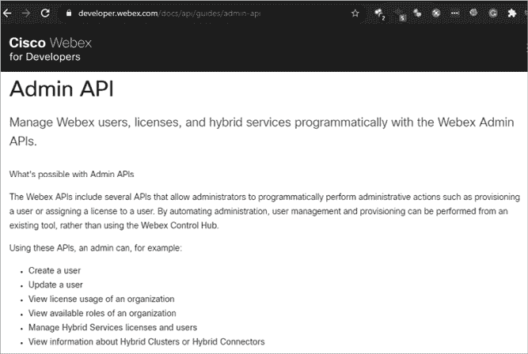

# 常见的 API 漏洞


了解常见的漏洞将帮助你在测试 API 时识别弱点。在本章中，我将介绍 Open Web Application Security Project（OWASP）API 安全十大漏洞列表中的大部分漏洞，以及另外两个有用的弱点：信息泄露和业务逻辑缺陷。我将描述每个漏洞、其重要性以及利用这些漏洞的技术。在后续章节中，你将通过实践获得发现和利用这些漏洞的经验。

## 信息泄露

当 API 及其支持的软件与无权限的用户共享敏感信息时，该 API 存在*信息泄露*漏洞。信息可能通过 API 响应或公共资源（如代码库、搜索结果、新闻、社交媒体、目标网站和公共 API 目录）泄露。

敏感数据可以包括攻击者能够利用的任何信息。例如，一个使用 WordPress API 的网站可能在不知情的情况下将用户信息与任何访问 API 路径 */wp-json/wp/v2/users* 的人共享，该路径返回所有 WordPress 用户名或“别名”。例如，看看以下请求：

```
GET https://www.sitename.org/wp-json/wp/v2/users
```

它可能返回以下数据：

```
[{"id":1,"name":"Administrator", "slug":"admin"}],
{"id":2,"name":"Vincent Valentine", "slug":"Vincent"}]
```

这些别名可以用于尝试通过暴力破解、凭证填充或密码喷洒攻击登录已泄露的用户账户。（第八章详细描述了这些攻击。）

另一个常见的信息泄露问题涉及详细的错误信息。错误消息帮助 API 使用者排查与 API 的交互问题，并让 API 提供者理解应用程序的问题。然而，它也可能暴露有关资源、用户和 API 基础架构的敏感信息（如 web 服务器或数据库的版本）。例如，假设你尝试认证到一个 API 并收到错误消息“提供的用户 ID 不存在”。接下来，假设你使用另一个电子邮件地址，错误消息变为“密码不正确”。这就让你知道你已经提供了一个有效的 API 用户 ID。

查找用户信息是开始访问 API 的一个好方法。以下信息也可以在攻击中被利用：软件包、操作系统信息、系统日志和软件漏洞。通常，任何可以帮助我们找到更严重漏洞或协助利用的 信息，都可以视为信息泄露漏洞。

通常，通过与 API 端点交互并分析响应，你可以收集到最多的信息。API 响应可以揭示头部、参数和详细错误中的信息。其他好的信息来源包括 API 文档以及在侦察过程中收集的资源。第六章介绍了许多用于发现 API 信息泄露的工具和技术。

## 错误的对象级别授权

API 中最常见的漏洞之一是 *破坏的对象级授权（BOLA）*。BOLA 漏洞发生在 API 提供方允许 API 消费者访问他们未被授权访问的资源时。如果一个 API 端点没有对象级访问控制，它将不会检查以确保用户只能访问他们自己的资源。当这些控制缺失时，用户 A 将能够成功请求用户 B 的资源。

API 使用某种值，如名称或数字，来识别不同的对象。当我们发现这些对象的 ID 时，我们应该测试是否可以在未认证或以其他用户身份认证的情况下与其他用户的资源进行交互。例如，假设我们只被授权访问用户 Cloud Strife 的信息。我们将向 *https://bestgame.com/api/v3/users?id=5501* 发送初始的 GET 请求，并收到以下响应：

```
{
  "id": "5501",
  "first_name": "Cloud",
  "last_name": "Strife",
  "link": "https://www.bestgame.com/user/strife.buster.97",
  "name": "Cloud Strife",
  "dob": "1997-01-31",
  "username": "strife.buster.97"
}
```

这不会构成问题，因为我们被授权访问 Cloud 的信息。然而，如果我们能够访问其他用户的信息，则存在一个严重的授权问题。

在这种情况下，我们可能会通过使用接近 Cloud 的 ID 5501 的另一个标识号来检查这些问题。假设我们能够通过发送请求 *https://bestgame.com/api/v3/users?id=5502* 并收到以下响应来获取其他用户的信息：

```
{
  "id": "5502",
  "first_name": "Zack",
 "last_name": "Fair",
  "link": " https://www.bestgame.com/user/shinra-number-1",
  "name": "Zack Fair",
  "dob": "2007-09-13",
  "username": "shinra-number-1"
}
```

在这个案例中，Cloud 发现了一个 BOLA。请注意，可预测的对象 ID 并不一定表明你发现了 BOLA。为了使应用程序容易受到攻击，必须未能验证某个用户只能访问他们自己的资源。

一般来说，你可以通过了解 API 的资源结构并尝试访问你不应访问的资源来测试 BOLA。通过在 API 路径和参数中检测模式，你应该能够预测其他潜在的资源。以下 API 请求中的加粗部分应该引起你的注意：

```
GET /api/resource/**1**
GET /user/account/find?user_id=**15**
POST /company/account/**Apple**/balance
POST /admin/pwreset/account/**90**
```

在这些情况下，你可能通过更改加粗的值来猜测其他潜在的资源，如下所示：

```
GET /api/resource/**3**
GET /user/account/find?user_id=**23**
POST /company/account/**Google**/balance
POST /admin/pwreset/account/**111**
```

在这些简单的示例中，你只是通过用其他数字或词语替换加粗的部分执行了攻击。如果你能够成功访问不应有权限访问的信息，那么你就发现了 BOLA 漏洞。

在第九章，我将演示如何轻松地对 URL 路径中的 *user_id=* 等参数进行模糊测试，并整理结果以判断是否存在 BOLA 漏洞。在第十章，我们将重点讨论攻击像 BOLA 和 BFLA（功能级别授权失败，稍后在本章讨论）这样的授权漏洞。BOLA 可能是一个低门槛的 API 漏洞，你可以通过模式识别轻松发现它，并通过几个请求来测试。有时，由于对象 ID 和用于获取其他用户资源的请求的复杂性，它可能变得相当难以发现。

## 用户认证失效

*用户认证失效*指的是 API 认证过程中存在的*任何*弱点。这些漏洞通常发生在 API 提供方未实现认证保护机制或错误地实现了机制时。

API 认证可能是一个复杂的系统，包含多个过程，且有很大的失败空间。几十年前，安全专家布鲁斯·施奈尔（Bruce Schneier）曾说：“数字系统的未来是复杂性的，而复杂性是安全性的最大敌人。”正如我们在第二章讨论的 REST API 六大约束所知，RESTful API 应该是无状态的。为了实现无状态，提供方不应该需要记住消费者从一次请求到另一次请求的状态。为了使这一约束生效，API 通常要求用户经过注册过程，以获得一个独特的令牌。用户随后可以在请求中包含该令牌，以证明他们有权限进行这些请求。

因此，用于获取 API 令牌的注册过程、令牌的处理方式以及生成令牌的系统都可能存在各自的弱点。例如，为了确定*令牌生成过程*是否脆弱，我们可以收集一批令牌并分析它们的相似性。如果令牌生成过程不依赖于高水平的随机性或熵值，那么我们有可能自己创建一个令牌，或者劫持他人的令牌。

*令牌处理*可能包括令牌的存储、通过网络传输令牌的方法、硬编码令牌的存在等。我们可能在分析 Web 应用时，检测到 JavaScript 源文件中的硬编码令牌，或者直接捕获它们。一旦我们捕获到令牌，就可以用它来访问以前隐藏的端点，或者绕过检测。如果 API 提供商将身份归属于令牌，我们就能通过劫持被盗的令牌来获取该身份。

其他可能存在漏洞的认证过程包括*注册系统*的各个方面，例如密码重置和多因素认证功能。例如，假设一个密码重置功能要求你提供电子邮件地址和六位数字验证码来重置密码。如果 API 允许你进行任意数量的请求，你只需进行一百万次请求，就可以猜到验证码并重置任何用户的密码。而四位数字验证码只需进行 10,000 次请求。

还需注意是否可以在未经认证的情况下访问敏感资源；API 密钥、令牌和凭证是否出现在 URL 中；认证时是否缺少速率限制；以及是否存在冗长的错误信息。例如，提交到 GitHub 仓库的代码可能会暴露硬编码的管理员 API 密钥：

```
"oauth_client":
[{"client_id": "12345-abcd",
"client_type": "admin",
"api_key": "AIzaSyDrbTFCeb5k0yPSfL2heqdF-N19XoLxdw"}]
```

由于 REST API 的无状态特性，公开暴露的 API 密钥相当于发现了用户名和密码。使用暴露的 API 密钥，攻击者将获得与该密钥关联的角色权限。在第六章中，我们将运用侦察技能，查找互联网上暴露的密钥。

在第八章中，我们将对 API 身份验证进行多种攻击，例如身份验证绕过、暴力破解攻击、凭证填充攻击以及各种针对令牌的攻击。

## 过度的数据暴露

*过度的数据暴露*是指 API 端点响应时返回了超过请求所需的信息。这通常发生在提供方期望 API 消费者进行结果筛选时；换句话说，当消费者请求特定信息时，提供方可能会返回各种信息，假设消费者会从响应中移除他们不需要的数据。当这种漏洞存在时，它就像是你问某人他们的名字，而他们却告诉你他们的名字、出生日期、电子邮件地址、电话号码以及他们认识的每一个人的身份。

例如，如果 API 消费者请求他们自己的账户信息，但却收到了其他用户账户的信息，那么 API 就暴露了过多的数据。假设我请求了我的账户信息，且请求内容如下：

```
GET /api/v3/account?name=Cloud+Strife
```

现在假设我在响应中得到了以下 JSON：

```
{
  "id": "5501",
  "first_name": "Cloud",
  "last_name": "Strife",
  "privilege": "user",
       "representative": 

        "name": "Don Corneo",
        "id": "2203"
        "email": "dcorn@gmail.com",
        "privilege": "super-admin"
        "admin": true
        "two_factor_auth": false,
        }
```

我请求了一个用户的账户信息，结果提供方返回了创建我账户的人的信息，包括管理员的全名、管理员的 ID 号，以及管理员是否启用了双重身份验证。

过度的数据暴露是一个极其危险的 API 漏洞，它能够绕过所有的安全控制措施，保护敏感信息的方式完全失效，攻击者只需使用 API，就能轻松获得所有数据。要检测过度的数据暴露，只需测试目标 API 端点并审查响应中发送的信息。

## 资源不足和速率限制

其中一个需要测试的重要漏洞是*资源不足和速率限制*。速率限制在 API 的货币化和可用性中起着重要作用。如果不限制消费者可以发出的请求数量，API 提供方的基础设施可能会被请求压垮。请求过多而资源不足将导致提供方的系统崩溃并变得不可用——这就是*拒绝服务（DoS）*状态。

除了可能造成 API 的拒绝服务（DoS）攻击外，绕过速率限制的攻击者还可能为 API 提供商带来额外的成本。许多 API 提供商通过限制请求次数来盈利，允许付费客户请求更多信息。例如，RapidAPI 允许每月 500 次免费请求，但付费客户每月可请求 1,000 次。一些 API 提供商还具有自动扩展的基础设施，能够根据请求数量自动调节。在这些情况下，无限制的请求将导致基础设施成本的显著增加，这种情况是完全可以预防的。

在测试应该具有速率限制的 API 时，你首先要检查的是速率限制是否有效，可以通过向 API 发送大量请求来进行验证。如果速率限制有效，你应该收到某种响应，告知你无法再发送额外请求，通常是 HTTP 429 状态码的形式。

一旦你被限制不能再发送额外请求，接下来就可以尝试查看速率限制是如何被执行的。你能否通过添加或移除参数、使用不同的客户端，或更改 IP 地址来绕过速率限制？第十三章介绍了绕过速率限制的各种方法。

## 功能级别授权缺失（BFLA）

*功能级别授权缺失（BFLA）*是一种漏洞，指的是某个角色或用户组的用户能够访问另一个角色或用户组的 API 功能。API 提供商通常会为不同类型的账户设置不同的角色，比如公共用户、商户、合作伙伴、管理员等。如果你能够使用另一个特权级别或用户组的功能，就存在 BFLA 漏洞。换句话说，BFLA 可能是一种横向移动，你使用的是具有相似权限的组的功能，或者它可能是特权升级，你能够使用更高权限组的功能。特别值得关注的 API 功能包括涉及敏感信息、属于其他组的资源，以及管理功能，如用户账户管理。

BFLA 类似于 BOLA（业务对象级别授权缺失），不同之处在于它是一个关于执行操作的授权问题，而不是访问资源的授权问题。例如，考虑一个脆弱的银行 API。当 API 存在 BOLA 漏洞时，你可能能够访问其他账户的信息，如支付历史、用户名、电子邮件地址和账户号码。如果存在 BFLA 漏洞，你可能能够进行转账，甚至更新账户信息。BOLA 是关于未授权访问，而 BFLA 是关于未授权操作。

如果一个 API 具有不同的权限级别或角色，它可能会使用不同的端点来执行特权操作。例如，一家银行可能会使用 */{user}/account/balance* 端点来允许用户访问其帐户信息，而使用 */admin/account/{user}* 端点来允许管理员访问用户帐户信息。如果应用程序没有正确实施访问控制，我们将能够通过简单地发起管理员请求来执行管理操作，如查看用户的完整帐户详情。

一个 API 并不总是使用管理端点来执行管理功能。相反，这些功能可能基于 HTTP 请求方法，如 GET、POST、PUT 和 DELETE。如果提供者没有限制消费者可以使用的 HTTP 方法，那么仅仅通过使用不同方法发起未经授权的请求，就可能表明存在 BFLA 漏洞。

在寻找 BFLA 漏洞时，寻找任何可能对你有利的功能，包括修改用户帐户、访问用户资源和获取对受限端点的访问。例如，如果一个 API 允许合作伙伴向合作伙伴组添加新用户，但没有将此功能限制到特定的组，则任何用户都可以将自己添加到任何组中。而且，如果我们能够将自己添加到某个组， chances are we’ll be able to access that group’s resources。

发现 BFLA 漏洞的最简单方法是找到管理 API 文档，并以没有特权的用户身份发起请求，测试管理员功能和能力。[图 3-1 显示了公开的 Cisco Webex 管理 API 文档，它提供了一个方便的操作列表，供你测试 Cisco Webex 时尝试。



图 3-1：Cisco Webex 管理 API 文档

作为一个没有特权的用户，发起包含在管理员部分中的请求，例如尝试创建用户、更新用户帐户等。如果已实施访问控制，你很可能会收到 HTTP 401 Unauthorized 或 403 Forbidden 响应。然而，如果你能够成功发起请求，那么你就发现了一个 BFLA 漏洞。

如果没有关于特权操作的 API 文档，你将需要发现或逆向工程用于执行特权操作的端点，然后再进行测试；更多内容将在第七章中讨论。一旦你找到管理端点，就可以开始发起请求。

## 大规模赋值

*大规模赋值*是指当 API 用户在请求中包含比应用程序预期更多的参数时，应用程序将这些参数添加到代码变量或内部对象中。在这种情况下，用户可能能够编辑对象属性或提升权限。

例如，一个应用可能具有账户更新功能，用户应该仅用于更新用户名、密码和地址。如果用户可以在请求中包含其他与账户相关的参数，比如账户权限级别或敏感信息如账户余额，并且应用程序在没有将这些参数与允许的操作白名单进行检查的情况下接受这些参数，用户就可能利用这个漏洞修改这些值。

假设有一个 API 被调用来创建一个账户，传递的参数为 `"User"` 和 `"Password"`：

```
{
"User": "scuttleph1sh",
"Password": "GreatPassword123"
}
```

在阅读有关账户创建过程的 API 文档时，假设你发现有一个额外的键 `"isAdmin"`，消费者可以用它来成为管理员。你可以使用像 Postman 或 Burp Suite 这样的工具将该属性添加到请求中，并将值设置为 `true`：

```
{
"User": "scuttleph1sh",
"Password": "GreatPassword123",
"isAdmin": true
}
```

如果 API 没有清理请求输入，它就容易受到大规模赋值攻击，你可以利用更新后的请求创建一个管理员账户。在后端，易受攻击的 Web 应用会将键值对属性 `{"isAdmin":"true"}` 添加到用户对象中，从而使用户成为管理员。

你可以通过在 API 文档中查找有趣的参数，并将这些参数添加到请求中，来发现大规模赋值漏洞。寻找涉及用户账户属性、关键功能和管理操作的参数。拦截 API 请求和响应也可能揭示值得测试的参数。此外，你还可以猜测或模糊化 API 请求中的参数。（第九章讲述了模糊测试的技巧。）

## 安全配置错误

*安全配置错误*包括开发者在 API 支持的安全配置中可能犯的所有错误。如果安全配置错误足够严重，它可能导致敏感信息泄露或系统完全被接管。例如，如果 API 的安全配置暴露了一个未修补的漏洞，攻击者有可能利用发布的漏洞轻松“攻陷” API 及其系统。

安全配置错误实际上是一组漏洞，包括配置错误的头部、配置错误的传输加密、使用默认账户、接受不必要的 HTTP 方法、缺乏输入清理以及冗长的错误消息。

*缺乏输入净化* 可能使攻击者将恶意有效载荷上传到服务器。API 通常在自动化过程中起着关键作用，因此可以想象将有效载荷上传到服务器，服务器自动将其处理成可能被远程执行或被毫无防备的最终用户执行的格式。例如，如果上传端点用于将上传的文件传递到 Web 目录，可能会允许上传脚本。访问该文件所在的 URL 可能会启动脚本，从而直接访问 Web 服务器的 shell。此外，缺乏输入净化还可能导致应用程序出现意外行为。在第三部分中，我们将模糊测试 API 输入，尝试发现诸如安全配置错误、不当的资产管理和注入漏洞等问题。

API 提供者使用*头部*来向消费者提供处理响应和安全要求的指令。配置错误的头部可能导致敏感信息泄露、降级攻击和跨站脚本攻击。许多 API 提供者会在其 API 旁边使用额外的服务来增强与 API 相关的指标或提高安全性。那些额外的服务常常会在请求中添加头部，以提供指标，并可能作为某种程度的保证。例如，以下是一个响应：

```
HTTP/ 200 OK
`--snip--`
**X-Powered-By: VulnService 1.11**
**X-XSS-Protection: 0**
**X-Response-Time: 566.43**
```

`X-Powered-By` 头部揭示了后端技术。像这样的头部通常会展示确切的支持服务及其版本。你可以利用这些信息搜索针对该版本软件发布的漏洞。

`X-XSS-Protection` 就是它看起来的样子：一个旨在防止跨站脚本（XSS）攻击的头部。XSS 是一种常见的注入漏洞，攻击者可以将脚本插入网页，并诱使最终用户点击恶意链接。在第十二章中，我们将讨论 XSS 和跨 API 脚本（XAS）。`X-XSS-Protection` 的值为 `0` 表示没有保护措施，而值为 `1` 表示已启用保护。这个头部，以及类似的头部，清楚地揭示了是否存在安全控制。

`X-Response-Time` 头部是中间件，用于提供使用指标。在前面的示例中，它的值表示 566.43 毫秒。然而，如果 API 配置不当，这个头部可能作为一个旁路渠道，用于揭示现有资源。例如，如果 `X-Response-Time` 头部对不存在的记录有一致的响应时间，但对某些其他记录的响应时间有所增加，这可能表明这些记录存在。以下是一个示例：

```
HTTP/**UserA** 404 Not Found
`--snip--`
**X-Response-Time: 25.5**

HTTP/**UserB** 404 Not Found
`--snip--`
**X-Response-Time: 25.5**

HTTP/**UserC** 404 Not Found
`--snip--`
**X-Response-Time: 510.00**
```

在这种情况下，UserC 的响应时间值是其他资源响应时间的 20 倍。鉴于样本量较小，很难断定 UserC 是否存在。然而，假设你有数百或数千个请求的样本，并且知道某些存在和不存在的资源的平均 `X-Response-Time` 值。例如，假设你知道一个虚假帐户，如 */user/account/thisdefinitelydoesnotexist876*，它的平均 `X-Response-Time` 为 25.5 毫秒。你还知道你的现有帐户 */user/account/1021* 的 `X-Response-Time` 为 510.00 毫秒。如果你接着对所有帐户编号从 1000 到 2000 进行暴力破解请求，你可以查看结果并看到哪些帐户编号导致响应时间急剧增加。

任何向消费者提供敏感信息的 API 应该使用传输层安全协议（TLS）来加密数据。即使 API 仅在内部、私下或在合作伙伴层级提供，使用 TLS——这一加密 HTTPS 流量的协议——也是确保 API 请求和响应在网络传输过程中得到保护的最基本方法之一。配置错误或缺失的传输加密可能导致 API 用户在网络中以明文形式传递敏感 API 信息，在这种情况下，攻击者可以通过中间人（MITM）攻击捕获请求和响应并直接读取它们。攻击者需要能够访问与目标相同的网络，然后使用网络协议分析工具，如 Wireshark，来截获网络流量，从而查看消费者与提供者之间传递的信息。

当服务使用*默认帐户和凭证*，并且默认凭证已知时，攻击者可以使用这些凭证假冒该帐户的角色。这可能使他们能够访问敏感信息或管理功能，从而潜在地导致支持系统的安全漏洞。

最后，如果 API 提供者允许*不必要的 HTTP 方法*，则增加了应用程序无法正确处理这些方法或导致敏感信息泄露的风险。

你可以使用 web 应用程序漏洞扫描器（如 Nessus、Qualys、OWASP ZAP 和 Nikto）来检测这些安全配置错误。这些扫描器会自动检查 web 服务器版本信息、头部、cookie、传输加密配置和参数，以查看是否缺少预期的安全措施。如果你知道查找的内容，也可以手动检查这些安全配置错误，通过检查头部、SSL 证书、cookie 和参数来识别问题。

## 注入攻击

*注入漏洞* 出现的原因是请求被传递到 API 支持的基础设施时，API 提供者没有过滤输入以去除不需要的字符（这一过程被称为 *输入清理*）。因此，基础设施可能会将请求中的数据当作代码来执行。当这种漏洞存在时，你就能够进行注入攻击，如 SQL 注入、NoSQL 注入和系统命令注入。

在这些注入攻击中，API 会将未清理的负载直接传递给运行应用程序或其数据库的操作系统。因此，如果你向一个使用 SQL 数据库的易受攻击的 API 发送包含 SQL 命令的负载，API 会将这些命令传递给数据库，数据库会处理并执行这些命令。易受攻击的 NoSQL 数据库和受影响的系统也会发生类似的情况。

详细的错误信息、HTTP 响应码和意外的 API 行为都可能是你发现注入漏洞的线索。举个例子，如果你在账户注册过程中发送了 `OR 1=0--` 作为地址，API 可能会将该负载直接传递给后台的 SQL 数据库，在那里 `OR 1=0` 语句会失败（因为 1 不等于 0），从而引发 SQL 错误：

```
POST /api/v1/register HTTP 1.1
Host: example.com
`--snip--`
{
"Fname": "hAPI",
"Lname": "Hacker",
"Address": **"' OR 1=0--"**,
}
```

后端数据库的错误可能会以响应的形式反馈给用户。在这种情况下，你可能会收到类似 “错误：你的 SQL 语法有误……” 的响应。任何直接来自数据库或支持系统的响应都是注入漏洞的明显指示。

注入漏洞往往伴随其他漏洞，如输入清理不当。以下示例中，你可以看到一个代码注入攻击，它利用 API 的 GET 请求来利用一个弱查询参数。在这种情况下，弱查询参数将请求中的任何数据直接传递到底层系统，而不会首先进行清理：

```
GET http://10.10.78.181:5000/api/v1/resources/books?show=/etc/passwd
```

以下响应体显示了 API 端点被篡改，显示了主机的 */etc/passwd* 文件，暴露了系统中的用户信息：

```
root:x:0:0:root:/root:/bin/bash
daemon:x:1:1:daemon:/usr/sbin:/usr/sbin/nologin
bin:x:2:2:bin:/dev:/usr/sbin/nologin
sync:x:4:65534:sync:/bin:/bin/sync
games:x:5:60:games:/usr/games:/usr/sbin/nologin
man:x:6:12:man:/var/cache/man:/usr/sbin/nologin
lp:x:7:7:lp:/var/spool/lpd:/usr/sbin/nologin
mail:x:8:8:mail:/var/mail:/usr/sbin/nologin
news:x:9:9:news:/var/spool/news:/usr/sbin/nologin
```

查找注入漏洞需要认真测试 API 端点，注意 API 的响应方式，然后构造尝试操控后台系统的请求。像目录遍历攻击一样，注入攻击已经存在了几十年，因此有许多标准的安全控制措施来保护 API 提供者免受这些攻击。我将在第十二章和第十三章展示执行注入攻击、编码流量和绕过标准控制的方法。

## 不当的资产管理

*不当资产管理* 是指组织暴露了已经退休或仍在开发中的 API。与任何软件一样，旧版 API 更容易存在漏洞，因为它们不再进行修补和升级。同样，仍在开发中的 API 通常不如生产版 API 安全。

不当资产管理可能导致其他漏洞，如过度数据暴露、信息泄露、大规模赋值、不当速率限制和 API 注入。对于攻击者来说，发现不当资产管理漏洞仅是进一步利用 API 的第一步。

你可以通过仔细关注过时的 API 文档、更新日志和仓库中的版本历史，发现不当的资产管理。例如，如果一个组织的 API 文档没有随着 API 的端点更新，它可能包含指向已不再支持的部分 API 的引用。组织通常会在端点名称中包含版本信息，以区分旧版和新版，例如 */v1/*、*/v2/*、*/v3/* 等等。仍在开发中的 API 通常使用类似 */alpha/*、*/beta/*、*/test/*、*/uat/* 和 */demo/* 的路径。如果你知道某个 API 当前使用 *apiv3.org/admin*，但部分 API 文档仍提到 *apiv1.org/admin*，你可以尝试测试不同的端点，看看 *apiv1* 或 *apiv2* 是否仍然活跃。此外，组织的更新日志可能会透露 *v1* 被更新或淘汰的原因。如果你能访问 *v1*，你可以测试这些弱点。

除了通过文档使用外，你还可以通过猜测、模糊测试或暴力请求来发现不当的资产管理漏洞。留意 API 文档或路径命名模式中的规律，然后基于你的假设进行请求。

## 业务逻辑漏洞

*业务逻辑漏洞*（也称为 *业务逻辑缺陷* 或 *BLFs*）是应用程序的预期功能，攻击者可以恶意利用它们。例如，如果一个 API 有一个上传功能，但没有验证编码后的负载，用户只要将文件编码后上传就可以。这将允许最终用户上传并执行任意代码，包括恶意负载。

这种类型的漏洞通常源于假设 API 消费者会遵循指示、值得信任或仅以某种方式使用 API。在这些情况下，组织基本上依赖于信任作为一种安全控制，期望消费者行为良好。不幸的是，即便是心地善良的 API 消费者也会犯错误，从而导致应用程序的安全性受到威胁。

2021 年初的 Experian 合作伙伴 API 泄漏事件就是一个 API 信任失败的典型例子。某个 Experian 合作伙伴被授权使用 Experian 的 API 进行信用检查，但该合作伙伴将 API 的信用检查功能添加到了他们的 web 应用中，意外地将所有合作伙伴级别的请求暴露给用户。当使用该合作伙伴的 web 应用时，请求可能会被拦截，如果请求中包含姓名和地址，Experian API 会返回该个人的信用分数和信用风险因素。造成这个业务逻辑漏洞的主要原因之一是 Experian 信任合作伙伴不会暴露 API。

另一个关于信任的问题是，凭据，如 API 密钥、令牌和密码，经常被盗取和泄露。当一个受信任的消费者的凭据被盗时，该消费者就可能变成披着羊皮的狼，造成严重破坏。如果没有强有力的技术控制，业务逻辑漏洞往往会产生最大的影响，导致被利用和妥协。

你可以搜索 API 文档，寻找业务逻辑漏洞的明显迹象。像以下的声明应该能点亮你脑袋上的灯泡：

1.  “仅使用功能 X 来执行功能 Y。”

1.  “不要使用端点 Y 执行 X 操作。”

1.  “只有管理员应该执行请求 X。”

这些声明可能表明，API 提供商信任你不会执行任何被禁止的操作，如同指示的那样。当你攻击他们的 API 时，确保不遵守这些请求，以测试安全控制是否存在。

另一个业务逻辑漏洞出现在开发者假设消费者仅会使用浏览器与 web 应用交互，并且不会捕获发生在背后 API 请求的情况下。利用这种弱点所需的只是使用 Burp Suite Proxy 或 Postman 等工具拦截请求，然后在请求发送给提供商之前修改 API 请求。这可能使你能够捕获共享的 API 密钥或使用可能对应用程序安全产生负面影响的参数。

举个例子，考虑一个用户通常用来验证自己账户的 web 应用认证门户。假设 web 应用发出了以下 API 请求：

```
POST /api/v1/login HTTP 1.1
Host: example.com
`--snip--`
UserId=hapihacker&password=arealpassword!&**MFA=true**
```

我们有可能通过简单地将参数 `MFA` 改为 `false` 来绕过多因素认证。

测试业务逻辑缺陷可能具有挑战性，因为每个业务都是独特的。自动化扫描器很难检测到这些问题，因为这些缺陷是 API 预期用途的一部分。你必须理解业务和 API 的运作方式，然后考虑如何利用这些特性为自己谋利。以对立的心态研究应用程序的业务逻辑，并尝试打破任何已做出的假设。

## 总结

在这一章中，我介绍了常见的 API 漏洞。熟悉这些漏洞非常重要，这样你可以轻松识别它们，在渗透测试中利用它们，并将其报告给组织，防止罪犯将你的客户拖入头条新闻。

现在你已经熟悉了 web 应用、API 及其弱点，是时候准备好你的黑客工具并开始在键盘上动手了。
