# 第五章：您的 API 黑客系统


本章将指导您设置 API 黑客工具包。我们将介绍三个特别有用的 API 黑客工具：Chrome 开发者工具、Burp Suite 和 Postman。

除了探索付费版本 Burp Suite Pro 中的功能外，我还将提供一份工具列表，用于弥补免费版 Burp Suite Community Edition 中缺失的功能，以及一些其他有助于发现和利用 API 漏洞的工具。在本章末，我们将通过一个实验室，您将学习如何使用这些工具与我们的第一个 API 进行交互。

## Kali Linux

在本书中，我们将使用 Kali 运行工具和实验，Kali 是基于 Debian 的开源 Linux 发行版，专为渗透测试设计，已经安装了许多有用的工具。您可以在 [`www.kali.org/downloads`](https://www.kali.org/downloads) 下载 Kali。很多教程可以指导您设置所选的虚拟化平台并安装 Kali。我推荐 Null Byte 的《如何开始使用 Kali Linux》或 [`www.kali.org/docs/installation`](https://www.kali.org/docs/installation) 上的教程。

在您的 Kali 实例设置完成后，打开终端并执行更新和升级：

```
$ **sudo apt update**
$ **sudo apt full-upgrade -y**
```

接下来，安装 Git、Python 3 和 Golang（Go），这些工具是您在使用某些黑客工具时需要的：

```
$ **sudo apt-get install git python3 golang**
```

安装了这些基础工具后，您应该准备好设置剩余的 API 黑客工具。

## 使用 DevTools 分析 Web 应用

Chrome 的开发者工具（DevTools）是内置于 Chrome 浏览器中的一套开发工具，允许您从 Web 开发者的角度查看您的浏览器正在运行的内容。DevTools 是一个常被低估的资源，但它对 API 黑客来说非常有用。我们将使用它与目标 Web 应用进行首次交互，以发现 API；通过控制台与 Web 应用进行交互；查看请求头、预览和响应；分析 Web 应用的源代码文件。

要安装包含 DevTools 的 Chrome，请运行以下命令：

```
$ **sudo wget https://dl.google.com/linux/direct/google-chrome-stable_current_amd64.deb**
$ **sudo apt install ./google-chrome-stable_current_amd64.deb**
```

您可以通过命令行使用 `google-chrome` 命令启动 Chrome。一旦 Chrome 启动，导航到您想要调查的 URL，并通过按 ctrl-shift-I 或 F12 或进入 **设置**▶**更多工具**，选择 **开发者工具** 菜单来启动 DevTools。接下来，刷新当前页面以更新 DevTools 面板中的信息。您可以通过 ctrl-R 快捷键来实现此操作。在网络面板中，您应该看到从 API 请求的各种资源（见 图 4-1）。

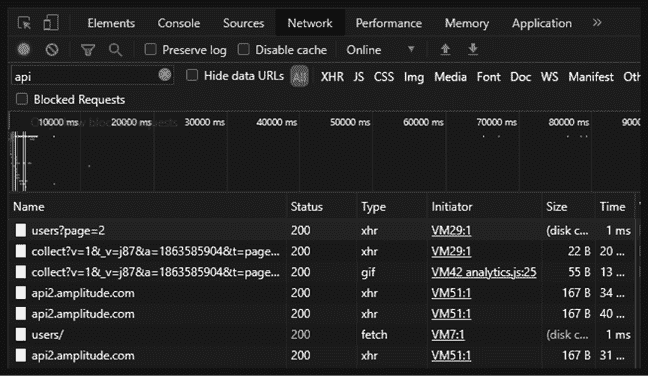

图 4-1：Chrome DevTools 网络面板

通过选择顶部的选项卡切换面板。开发者工具面板列出了不同选项卡的功能。我已在表 4-1 中总结了这些内容。

表 4-1：开发者工具面板

| **面板** | **功能** |
| --- | --- |
| 元素 | 允许你查看当前页面的 CSS 和文档对象模型（DOM），从而使你能够检查构建网页的 HTML。 |
| 控制台 | 提供警告信息并让你与 JavaScript 调试器互动，以修改当前网页。 |
| 源代码 | 包含构成 web 应用程序的目录以及源文件的内容。 |
| 网络 | 列出了构成客户端视角的 web 应用程序的所有源文件请求。 |
| 性能 | 提供记录和分析加载网页时发生的所有事件的方法。 |
| 内存 | 让你记录和分析浏览器如何与系统内存互动。 |
| 应用程序 | 提供应用程序清单、存储项（如 cookies 和会话信息）、缓存和后台服务。 |
| 安全性 | 提供关于传输加密、源内容来源和证书详细信息的洞察。 |

当我们第一次开始与 web 应用程序交互时，通常会从网络面板开始，以概览支持 web 应用程序的资源。在图 4-1 中，每一项都表示为特定资源发出的请求。通过网络面板，你可以深入每个请求，查看使用的请求方法、响应状态码、头部信息和响应体。为此，只需在名称栏下点击感兴趣的 URL 名称。这将打开开发者工具右侧的面板。现在你可以在“头部”标签下查看发出的请求，并在“响应”标签下查看服务器的回应。

深入分析 web 应用程序时，你可以使用源代码面板来检查应用程序中使用的源文件。在抓旗（CTF）事件中（有时在现实中也是如此），你可能会在这里发现 API 密钥或其他硬编码的密钥。源代码面板配备了强大的搜索功能，可以帮助你轻松发现应用程序的内部工作原理。

控制台面板对于运行和调试网页的 JavaScript 非常有用。你可以使用它来检测错误、查看警告并执行命令。你将在第六章的实验中使用控制台面板。

我们大多数时间会花在控制台、源代码和网络面板中。不过，其他面板也同样有用。例如，性能面板主要用于提升网站速度，但我们也可以使用它来观察 web 应用程序何时与 API 互动，如图 4-2 所示。

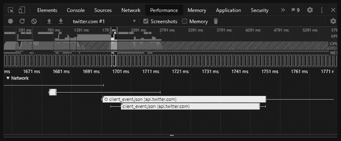

图 4-2：DevTool 性能标签页，显示 Twitter 应用与 Twitter API 交互的确切时刻

在图 4-2 中，我们看到 1,700 毫秒时，一个客户端事件触发了 Twitter 应用与 API 的交互。作为客户端，我们可以将这个事件与我们在页面上执行的操作相关联，例如登录到 Web 应用，以了解 Web 应用如何使用 API。我们能在攻击 API 前收集到的信息越多，找到并利用漏洞的机会就越大。

欲了解更多有关 DevTools 的信息，请查看 Google 开发者文档：[`developers.google.com/web/tools/chrome-devtools`](https://developers.google.com/web/tools/chrome-devtools)。

## 使用 Burp Suite 捕获和修改请求

Burp Suite 是一套由 PortSwigger 开发并不断改进的精彩 Web 应用测试工具。所有 Web 应用安全专家、漏洞奖励猎人和 API 黑客都应该学习使用 Burp，它允许你捕获 API 请求、爬取 Web 应用、模糊测试 API 等等。

*爬虫*，或称 *网页爬取*，是一种自动检测主机 URL 路径和资源的方法。通常，爬虫是通过扫描网页 HTML 中的超链接来完成的。爬虫是了解网页内容的一个好方法，但它无法找到 *隐藏的* 路径，或者那些在网页中没有超链接的路径。要找到隐藏路径，我们需要使用像 Kiterunner 这样的工具，它能有效执行目录暴力攻击。在这种攻击中，应用会请求各种可能的 URL 路径，并根据主机的响应验证这些路径是否存在。

如 OWASP 社区页面所述，*模糊测试*是“自动寻找漏洞的艺术”。使用这种攻击技术，我们会向 HTTP 请求发送各种类型的输入，试图找到能够使应用以意外方式响应并暴露漏洞的输入或负载。例如，如果你在攻击 API 时发现可以向 API 提供者发送数据，那么你可以尝试发送各种 SQL 命令。如果提供者没有对这些输入进行过滤，就有可能收到一个响应，表明 SQL 数据库正在使用中。

Burp Suite Pro 是 Burp 的付费版，提供所有功能且没有限制，但如果你只能使用免费的 Burp Suite Community Edition（CE），也是可以工作的。然而，一旦你获得了漏洞奖励，或者一旦能说服你的雇主，你应该升级到 Burp Suite Pro。本章包含一个“补充工具”部分，帮助替代 Burp Suite CE 中缺失的功能。

Burp Suite CE 已包含在最新版本的 Kali 中。如果由于某种原因未安装，可以运行以下命令：

```
$ **sudo apt-get install burpsuite**
```

在接下来的部分中，我们将准备我们的 API 攻击工具来使用 Burp Suite，了解 Burp 各个模块的概况，学习如何拦截 HTTP 请求，深入研究 Intruder 模块，并了解一些可以用来增强 Burp Suite Pro 的扩展插件。

### 设置 FoxyProxy

Burp Suite 的一个关键特性是能够拦截 HTTP 请求。换句话说，Burp Suite 会在将请求转发到服务器之前接收你的请求，然后在将服务器的响应发送到浏览器之前接收服务器的响应，这样你就可以查看并与这些请求和响应进行交互。为了使此功能正常工作，我们需要定期将请求从浏览器发送到 Burp Suite。这是通过使用网络代理实现的。代理是一种将网页浏览器流量重定向到 Burp 的方式，然后再发送给 API 提供者。为了简化这个过程，我们将在浏览器中添加一个名为 FoxyProxy 的工具，帮助我们通过点击按钮来代理流量。

网络浏览器自带代理功能，但每次想使用 Burp 时都要修改和更新这些设置会很麻烦。相反，我们将使用一个名为 FoxyProxy 的浏览器插件，它可以让你通过简单点击按钮开启和关闭代理。FoxyProxy 支持 Chrome 和 Firefox 浏览器。

按照以下步骤安装 FoxyProxy：

1.  前往你的浏览器插件或扩展商店，搜索**FoxyProxy**。

1.  安装 FoxyProxy Standard 并将其添加到你的浏览器。

1.  点击浏览器右上角的狐狸图标（在 URL 旁边），然后选择**选项**。

1.  选择**代理**▶**添加新代理**▶**手动代理配置**。

1.  添加**127.0.0.1**作为主机 IP 地址。

1.  更新端口为**8080**（Burp Suite 的默认代理设置）。

1.  在“常规”标签下，将代理重命名为**Hackz**（在整个实验中我会引用这个代理设置）。

现在你只需要点击浏览器插件并选择你想使用的代理，将流量发送到 Burp。当你完成拦截请求后，可以通过选择禁用 FoxyProxy 选项来关闭代理。

### 添加 Burp Suite 证书

*HTTP 严格传输安全（HSTS）*是常见的 Web 应用程序安全策略，它阻止 Burp Suite 拦截请求。无论是使用 Burp Suite CE 还是 Burp Suite Pro，你都需要安装 Burp Suite 的证书授权（CA）证书。要添加此证书，请按照以下步骤操作：

1.  启动 Burp Suite。

1.  打开你选择的浏览器。

1.  使用 FoxyProxy，选择 Hackz 代理。导航至*http://burpsuite*，如图 4-3 所示，点击**CA 证书**。这将启动下载 Burp Suite CA 证书。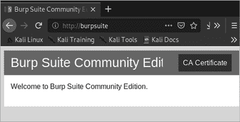

    图 4-3：下载 Burp Suite CA 证书时应看到的登录页面

1.  将证书保存在你可以找到的位置。

1.  打开浏览器并导入证书。在 Firefox 中，打开 **偏好设置**，使用搜索框查找 **证书**，然后导入证书。

1.  在 Chrome 中，打开 **设置**，使用搜索框查找 **证书**，选择 **更多**▶**管理证书**▶**授权机构**，然后导入证书（见 图 4-4）。如果没有看到证书，你可能需要将文件类型选项扩展为 “DER” 或 “所有文件”。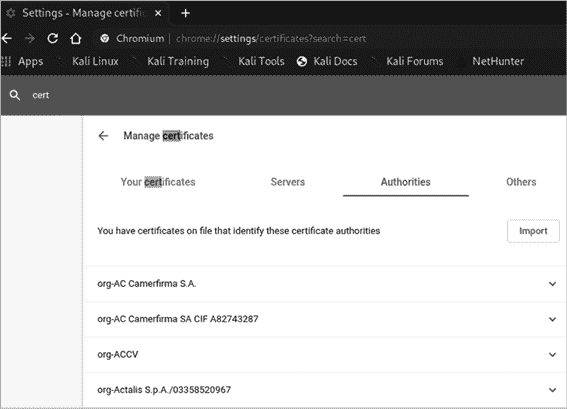

    图 4-4：选择了 Authorities 标签的 Chrome 证书管理器

现在你已经将 PortSwigger CA 证书添加到浏览器中，你应该能够正常拦截流量而不会遇到问题。

### 浏览 Burp Suite

如你在 图 4-5 中所见，Burp 的顶部有 13 个模块。

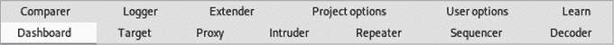

图 4-5：Burp Suite 模块

*Dashboard* 提供了对事件日志和你针对目标运行的扫描的概览。在 Burp Suite Pro 中，Dashboard 比在 CE 中更有用，因为它还会显示测试过程中检测到的任何问题。

*Proxy* 标签是我们开始捕获来自 Web 浏览器和 Postman 的请求和响应的地方。我们设置的代理将把任何发往你浏览器的 Web 流量发送到这里。我们通常会选择转发或丢弃捕获的流量，直到找到我们希望与之交互的目标站点。从 Proxy，我们将请求或响应转发到其他模块进行交互和篡改。

在 *Target* 标签中，我们可以看到网站的地图并管理我们打算攻击的目标。你还可以使用此标签通过选择 Scope 标签来配置测试范围，并包括或排除 URL。将 URL 包含在范围内将限制被攻击的 URL 仅限于你有权限攻击的那些。

在使用 Target 标签时，你应该能够找到 *Site Map*，在这里你可以看到 Burp Suite 在当前会话中检测到的所有 URL。当你执行扫描、爬虫或代理流量时，Burp Suite 会开始编译目标 Web 应用程序和已发现目录的列表。这是另一个可以添加或移除 URL 的地方。

*Intruder* 标签是我们将执行模糊测试和暴力破解攻击的地方。一旦你捕获了 HTTP 请求，就可以将其转发到 Intruder，在那里你可以选择请求中要替换为有效载荷的具体部分，然后再将其发送到服务器。

*Repeater* 是一个模块，允许你对 HTTP 请求进行实际操作，发送它们到目标 Web 服务器，并分析 HTTP 响应的内容。

*Sequencer* 工具将自动发送数百个请求，并通过熵分析来判断给定字符串的随机性。我们主要使用该工具分析 cookies、令牌、密钥和其他参数是否真正具有随机性。

*Decoder* 是一种快速编码和解码 HTML、base64、ASCII 十六进制、十六进制、八进制、二进制和 Gzip 的方式。

*Comparer* 可用于比较不同的请求。通常情况下，你会希望比较两个相似的请求，并找出其中被移除、添加或修改的部分。

如果 Burp Suite 对你的黑客眼睛来说太亮了，可以前往 **用户选项**▶**显示**，将 **外观** 改为 **Darcula**。在用户选项标签下，你还可以找到其他连接配置、TLS 设置以及一些杂项选项，用来学习快捷键或配置你自己的快捷键。然后，你可以通过项目选项保存你的首选设置，这允许你为每个项目保存和加载特定的配置。

*Learn* 是一套精彩的资源，帮助你学习如何使用 Burp Suite。这个标签包含视频教程、Burp Suite 支持中心、Burp 功能的引导式介绍，以及 PortSwigger Web 安全学院的链接。如果你是 Burp 新手，强烈建议你查看这些资源！

在仪表板下，你可以找到 Burp Suite Pro 扫描器。*Scanner* 是 Burp Suite Pro 的 web 应用漏洞扫描器。它可以自动爬取 web 应用并扫描漏洞。

*Extender* 是我们获取和使用 Burp Suite 扩展的地方。Burp 有一个应用商店，允许你找到简化 Web 应用测试的插件。许多扩展需要 Burp Suite Pro，但我们将充分利用免费的扩展，将 Burp 打造成一个 API 破解强大工具。

### 拦截流量

一次 Burp Suite 会话通常从拦截流量开始。如果你已经正确设置了 FoxyProxy 和 Burp Suite 证书，那么以下过程应该会顺利进行。你可以按照这些步骤用 Burp Suite 拦截任何 HTTP 流量：

1.  启动 Burp Suite 并将拦截选项更改为 **拦截已开启** ‌（参见 图 4-6）。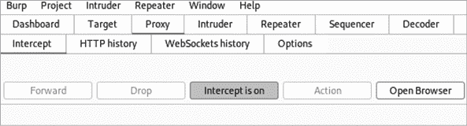

    图 4-6：Burp Suite 中拦截已开启。

1.  在浏览器中，使用 FoxyProxy 选择 Hackz 代理并访问你的目标网站，比如 [`twitter.com`](https://twitter.com)（参见 图 4-7）。该网页不会在浏览器中加载，因为它从未发送到服务器；相反，请求应该会等待你在 Burp Suite 中处理。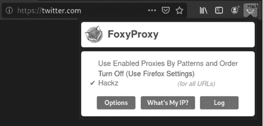

    图 4-7：通过 Hackz 代理，向 Burp Suite 发送的 Twitter 请求。

1.  在 Burp Suite 中，你应该会看到类似于 图 4-8 的内容。这应该能告诉你，你已成功拦截了一个 HTTP 请求。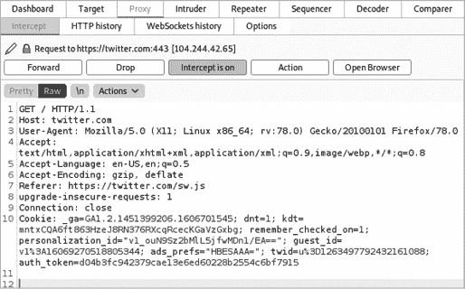

    图 4-8：Burp Suite 拦截的 Twitter HTTP 请求

捕获请求后，你可以选择对其执行某些操作，比如将截获的请求转发到 Burp Suite 的其他模块。你可以通过点击请求窗格上方的“操作”按钮，或者右键点击请求窗口来执行操作。然后，你将有机会将请求转发到其他模块，例如 Repeater（参见图 4-9）。

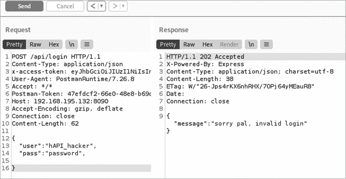

图 4-9：Burp Suite Repeater

Repeater 模块是查看 Web 服务器如何响应单个请求的最佳方式。这对于在发起攻击之前了解 API 可能的响应非常有用。它也有助于你在需要对请求进行细微修改并查看服务器响应时使用。

### 使用 Intruder 修改请求

我们已经提到过，Intruder 是一个 Web 应用程序模糊测试和扫描工具。它的工作原理是让你在截获的 HTTP 请求中创建变量，将这些变量替换为不同的 Payload 集，并向 API 提供者发送一系列请求。

捕获的 HTTP 请求的任何部分都可以通过用**§**符号将其包围来转换为变量或*攻击位置*。Payload 可以是从字典列表到一组数字、符号，甚至是任何其他有助于你测试 API 响应类型的输入。例如，在图 4-10 中，我们已将密码选择为攻击位置，正如§符号所示。

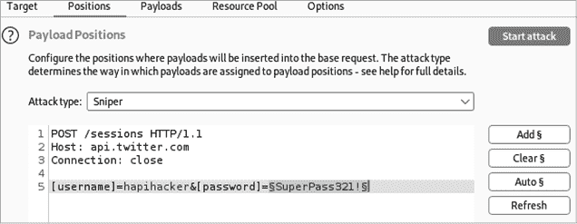

图 4-10：针对 api.twitter.com 的 Intruder 攻击

这意味着`SuperPass321!`将会被从 Payloads 中的字符串列表中替换。前往 Payloads 标签页查看这些字符串，如图 4-11 所示。

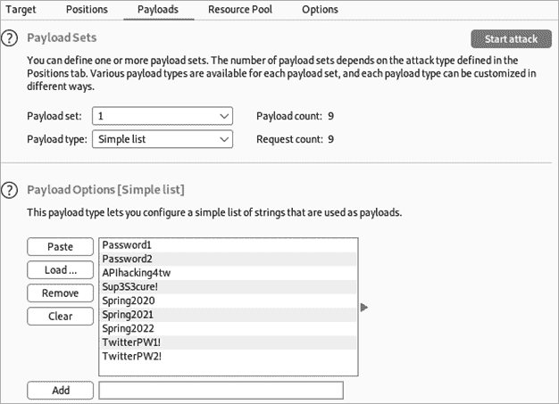

图 4-11：Intruder 的 Payloads，显示了一系列密码列表

根据这里展示的 Payload 列表，Intruder 会针对列出的每个 Payload 执行一次请求，总共进行九次请求。当攻击开始时，Payload 选项下的每个字符串会依次替换`SuperPass123!`，并生成请求发送到 API 提供者。

Intruder 攻击类型决定了 Payload 如何处理。正如在图 4-12 中所见，攻击类型有四种：狙击手、重锤、叉子和集束炸弹。

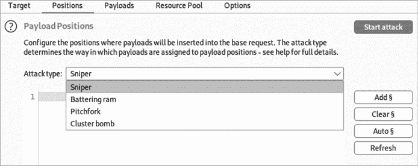

图 4-12：Intruder 攻击类型

*狙击手*是最简单的攻击类型；它将新增的攻击位置替换为从单一有效载荷集合中提供的字符串。狙击手攻击仅使用单一的有效载荷，但可以有多个攻击位置。狙击手攻击将在每个请求中替换一个攻击位置，循环通过每个请求中的不同攻击位置。如果你用单一有效载荷攻击三个不同的变量，它可能会是这样：

```
§`Variable1`§*,* §`variable2`§*,* §`variable3`§
Request 1:    **Payload1**, variable2, variable3
Request 2:    Variable1, **payload1**, variable3
Request 3:    Variable1, variable2, **payload1**
```

*冲击锤*类似于狙击手攻击，因为它也使用单一的有效载荷，但它会在请求中的所有攻击位置上使用该有效载荷。如果你正在测试请求中的多个输入位置上的 SQL 注入漏洞，你可以通过冲击锤同时对它们进行模糊测试。

*叉形攻击*用于同时测试多个有效载荷组合。例如，如果你有一个泄露的用户名和密码组合列表，你可以将两个有效载荷一起使用，测试这些凭证是否在正在测试的应用程序中被使用。然而，这种攻击并不会尝试不同的有效载荷组合；它只会按以下方式循环通过有效载荷集：*user1:pass1*，*user2:pass2*，*user3:pass3*。

*集群炸弹*会循环通过所有提供的有效载荷的可能组合。如果你提供了两个用户名和三个密码，以下的组合会被使用：*user1:pass1*，*user1:pass2*，*user1:pass3*，*user2:pass1*，*user2:pass2*，*user2:pass3*。

使用哪种攻击类型取决于你的情况。如果你正在模糊测试单一的攻击位置，使用狙击手。如果你要同时对多个攻击位置进行模糊测试，使用冲击锤。当你需要测试一组有效载荷的组合时，使用叉形攻击。对于密码喷射攻击，使用集群炸弹。

Intruder 应该帮助你找到 API 漏洞，如破损的对象级授权、过度的数据暴露、破损的身份验证、破损的功能级授权、大规模赋值、注入和不当的资产管理。Intruder 本质上是一个智能模糊测试工具，它提供包含单个请求和响应的结果列表。你可以与你想要模糊测试的请求进行交互，并用你选择的输入替换攻击位置。这些 API 漏洞通常是通过将正确的有效载荷发送到正确的位置来发现的。

例如，如果一个 API 对像 BOLA 这样的授权攻击存在漏洞，我们就能够用一个包含可能资源 ID 列表的有效载荷来替换请求的资源 ID。然后我们可以用 Intruder 发起攻击，Intruder 会发出所有请求并为我们提供一个结果列表供审查。我将在第九章讨论 API 模糊测试，第十章讨论 API 授权攻击。

## 在 Postman 中构造 API 请求，一个 API 浏览器

我们将使用 Postman 来帮助我们构建 API 请求并可视化响应。您可以将 Postman 看作是一个专为与 API 交互而设计的 Web 浏览器。最初作为 REST API 客户端设计，它现在具备与 REST、SOAP 和 GraphQL 交互的各种能力。该应用程序具有创建 HTTP 请求、接收响应、脚本编写、链式请求、自动化测试和管理 API 文档等众多功能。

我们将使用 Postman 作为我们发送 API 请求到服务器的首选浏览器，而不是默认使用 Firefox 或 Chrome。本节将介绍 Postman 中最重要的功能，并包括使用 Postman 请求构建器的说明、与集合合作的概述，以及构建请求测试的一些基础知识。稍后在本章中，我们将配置 Postman 以便与 Burp Suite 无缝协作。

要在 Kali 上设置 Postman，请打开终端并输入以下命令：

```
$ **sudo wget https://dl.pstmn.io/download/latest/linux64 -O postman-linux-x64.tar.gz**
$ **sudo tar -xvzf postman-linux-x64.tar.gz -C /opt**
$ **sudo ln -s /opt/Postman/Postman /usr/bin/postman**
```

如果一切按计划进行，您应该能够通过在终端中输入`postman`来启动 Postman。使用电子邮件地址、用户名和密码注册一个免费帐户。Postman 使用帐户进行协作并在设备之间同步信息。或者，您可以通过点击**跳过登录并直接进入应用程序**按钮跳过登录界面。

接下来，您需要再次完成 FoxyProxy 设置过程（请参考本章前面的“设置 FoxyProxy”部分），以便 Postman 可以拦截请求。返回到步骤 4 并添加一个新代理。添加相同的主机 IP 地址，**127.0.0.1**，并将端口设置为**5555**，这是 Postman 代理的默认端口。在常规选项卡下更新代理的名称为**Postman**并保存。您的 FoxyProxy 标签现在应类似于图 4-13。


图 4-13：配置 Hackz 和 Postman 代理的 FoxyProxy

从启动板打开一个新标签页，就像在其他浏览器中一样，通过点击新标签按钮（+）或使用 ctrl-T 快捷键。如图 4-14 所示，如果您不熟悉 Postman 的界面，它可能会有点令人不知所措。

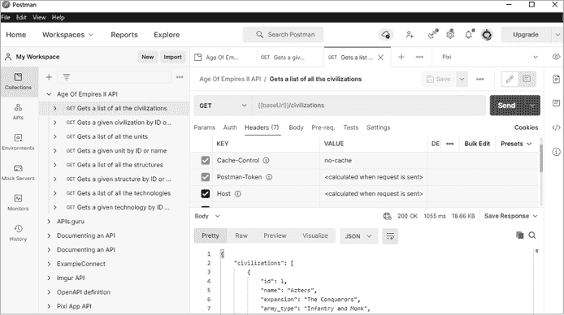

图 4-14：Postman 的主登录页面，显示来自 API 集合的响应

让我们从讨论请求构建器开始，当您打开一个新标签时，您将看到它。

### 请求构建器

请求构建器，如图 4-15 所示，是您可以通过添加参数、授权头等来构建每个请求的地方。

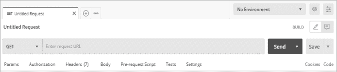

图 4-15：Postman 请求构建器

请求构建器包含几个有助于精确构建请求参数、头信息和正文的标签。*Params* 标签是您可以在请求中添加查询和路径参数的地方。基本上，这允许您输入各种键值对，并附上这些参数的描述。Postman 的一个优秀功能是，当创建请求时，您可以利用变量的强大功能。如果您导入了一个 API，并且它包含像 *:company* 这样的变量，出现在 *http://example.com/****:company****/profile* 中，Postman 会自动检测到这一点，并允许您将变量更新为不同的值，例如实际的公司名称。我们将在本节稍后讨论集合和环境。

*Authorization* 标签页包含多种标准的授权头，供您在请求中使用。如果您已在环境中保存了一个令牌，您可以选择令牌类型，并使用变量名称来包含它。将鼠标悬停在变量名称上时，您可以看到相关的凭据。在 Type 字段下，有几种授权选项可以帮助您自动格式化授权头。授权类型包括一些常见的选项，如无身份验证、API 密钥、Bearer Token 和 Basic Auth。此外，您还可以选择通过选择 **inherit auth from parent** 来使用为整个集合设置的授权。

*Headers* 标签页包含某些 HTTP 请求所需的键值对。Postman 具有一些内置功能，可以自动创建必要的头信息，并提供常见头信息的预设选项。

在 Postman 中，参数、头信息和正文部分的值可以通过在 Key 列和相应的 Value 列中输入信息来添加（请参见 图 4-16）。一些头信息会自动创建，但在必要时您可以添加自己的头信息。

在键值对中，您还可以使用集合变量和环境变量。（我们稍后会介绍集合。）例如，我们使用变量名称 `{admin_creds}` 来表示密码键的值。

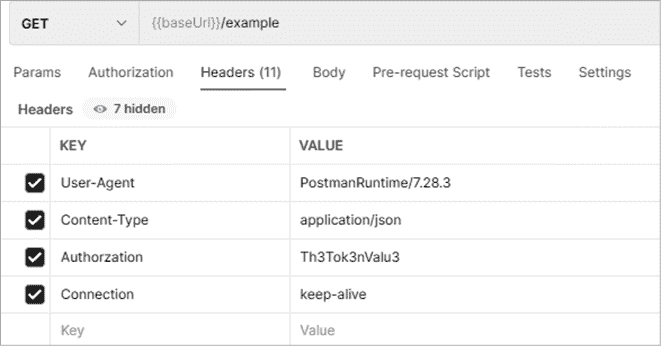

图 4-16：Postman 键值头信息

请求构建器还可以运行预请求脚本，这可以将不同的请求链式连接在一起，互相依赖。例如，如果请求 1 返回一个资源值，而该资源值是后续请求所需的，您可以通过脚本将该资源值自动添加到请求 2 中。

在 Postman 的请求构建器中，你可以使用多个面板来构造合适的 API 请求并查看响应。一旦你发送了请求，响应会显示在响应面板中（见图 4-17）。 

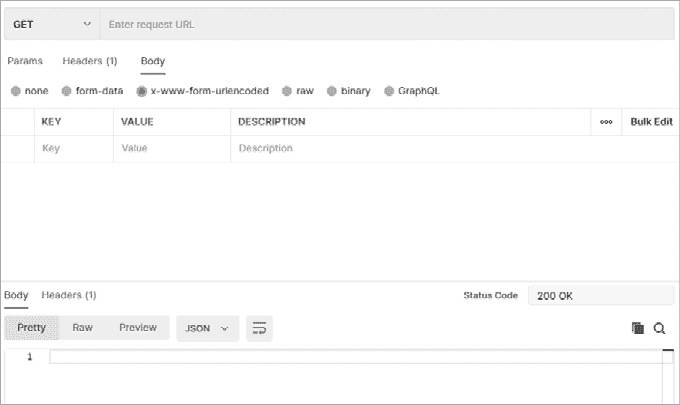

图 4-17：Postman 请求和响应面板

你可以将响应面板设置为位于请求面板的右侧或下方。通过按 ctrl-alt-V，你可以在单窗格视图和拆分窗格视图之间切换请求和响应面板。

在表 4-2 中，我已将项目分为请求面板和响应面板。

表 4-2：请求构建器面板

| **面板** | **用途** |
| --- | --- |
| *请求* |
| HTTP 请求方法 | 请求方法位于请求 URL 栏的左侧（在图 4-17 的左上角，有一个 GET 的下拉菜单）。选项包括所有标准请求：GET、POST、PUT、PATCH、DELETE、HEAD 和 OPTIONS。它还包括其他一些请求方法，如 COPY、LINK、UNLINK、PURGE、LOCK、UNLOCK、PROPFIND 和 VIEW。 |
| 正文 | 在图 4-17 中，这是请求面板中的第三个标签页。它允许向请求中添加正文数据，主要用于在使用 PUT、POST 或 PATCH 时添加或更新数据。 |
| 正文选项 | 正文选项是响应的格式。这些选项位于选中正文标签时下面。目前的选项包括无、表单数据、x-www-formurlencoded、原始、二进制和 GraphQL。这些选项让你以不同的形式查看响应数据。 |
| 请求前脚本 | 基于 JavaScript 的脚本，可以在发送请求之前添加并执行。这可用于创建变量、帮助排查错误以及更改请求参数。 |
| 测试 | 这个区域允许编写基于 JavaScript 的测试，用于分析和测试 API 响应。它用于确保 API 响应按预期工作。 |
| 设置 | 各种设置，用于控制 Postman 如何处理请求。 |
| *响应* |
| 响应正文 | HTTP 响应的正文。如果 Postman 是一个典型的网页浏览器，这将是查看请求信息的主窗口。 |
| Cookies | 这显示了 HTTP 响应中包含的所有 cookie（如果有的话）。该标签会包含关于 cookie 类型、cookie 值、路径、过期时间和 cookie 安全标志的信息。 |
| 请求头 | 这是所有 HTTP 响应头所在的位置。 |
| 测试结果 | 如果你为请求创建了任何测试，可以在这里查看这些测试的结果。 |

### 环境

*环境*提供了一种在多个 API 之间存储和使用相同变量的方法。*环境变量*是一个值，它将在环境中替代一个变量。例如，假设你正在攻击一个生产环境的 API，但发现了一个生产环境的*测试*版本；你可能会希望使用环境来在两个 API 的请求之间共享值。毕竟，生产 API 和测试 API 可能共享诸如 API 令牌、URL 路径和资源 ID 等值。

要创建环境变量，找到请求构建器右上角的**环境**（默认显示为“无环境”的下拉菜单），然后按 ctrl-N 打开**创建新**面板并选择**环境**，如图 4-18 所示。

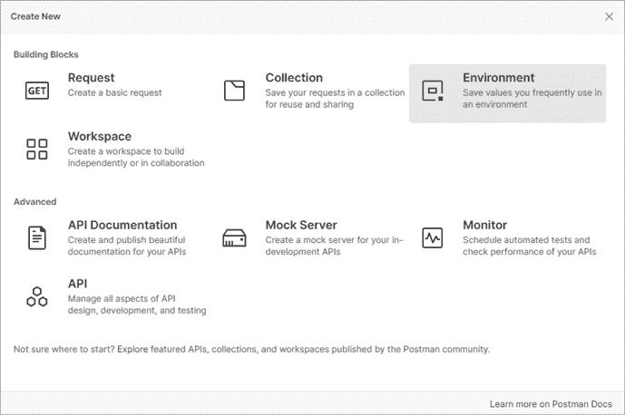

图 4-18：Postman 中的创建新面板

你可以为环境变量设置初始值和当前值（参见图 4-19）。*初始值*会在你与团队共享 Postman 环境时共享，而当前值则不会共享，仅保存在本地。例如，如果你有一个私钥，你可以将私钥存储为当前值。这样，你就能在需要粘贴私钥的地方使用该变量。

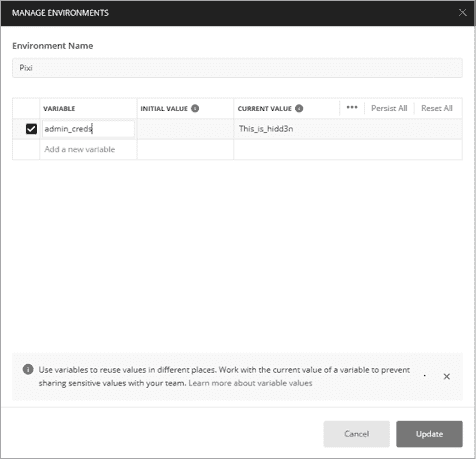

图 4-19：Postman 中的管理环境窗口，展示了变量 `admin_creds`，其当前值为 `This_``i``s_hidd3n`

### 集合

*集合*是可以导入到 Postman 中的一组 API 请求。如果 API 提供者提供了集合，你就不必手动输入每个请求。相反，你只需要导入它的集合。理解这个功能的最佳方式是从 [`www.postman.com/explore/collections`](https://www.postman.com/explore/collections) 下载一个公共 API 集合到你的 Postman。在本节的示例中，我将引用《帝国时代 II》集合。

导入按钮允许你导入集合、环境和 API 规范。目前，Postman 支持 OpenAPI 3.0、RAML 0.8、RAML 1.0、GraphQL、cURL、WADL、Swagger 1.2、Swagger 2.0、Runscope 和 DHC。如果你能导入目标 API 规范，你的测试工作将变得更轻松。这样做可以节省你手动编写所有 API 请求的时间。

集合、环境和规范都可以作为文件、文件夹、链接或原始文本导入，或者通过连接你的 GitHub 账户进行导入。例如，你可以从 *https://age-of-empires-2-api.herokuapp.com/apispec.json* 导入经典 PC 游戏 *帝国时代 II* 的 API，如下所示：

1.  点击位于 Postman 左上角的**导入**按钮。

1.  选择**链接**标签（见图 4-20）。

1.  粘贴 API 规范的 URL 并点击**继续**。

1.  在“确认导入”页面，点击**导入**。

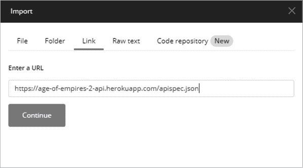

图 4-20：在 Postman 中使用导入面板中的链接标签导入 API 规范

完成此步骤后，你应该已将帝国时代 II 集合保存到 Postman 中。现在进行测试。选择图 4-21 中显示的集合中的一个请求并点击**发送**。

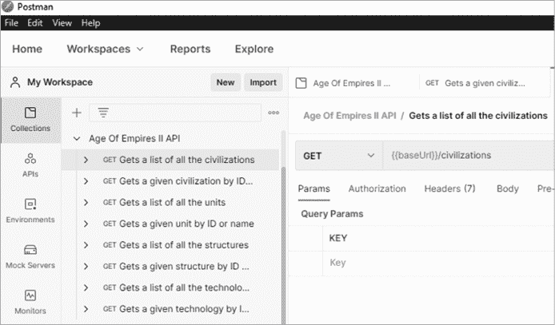

图 4-21：导入的帝国时代 II API GET 请求的集合侧边栏

为了使请求正常工作，你可能需要先检查集合的变量，以确保它们设置为正确的值。要查看集合的变量，你需要通过点击**查看更多操作**按钮（由三个圆圈表示，如图 4-22 所示）进入“编辑集合”窗口。

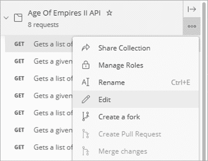

图 4-22：在 Postman 中编辑集合

一旦进入“编辑集合”窗口，选择**变量**，如图 4-23 所示。

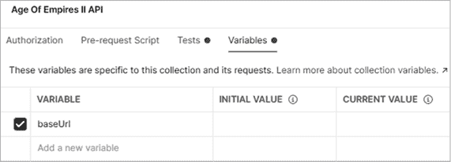

图 4-23：帝国时代 II API 集合变量

例如，帝国时代 II API 集合使用变量`{{baseUrl}}`。当前`{{baseUrl}}`的问题是没有值。我们需要将此变量更新为公共 API 的完整 URL，*https://age-of-empires-2-api.herokuapp.com/api/v1*。添加完整的 URL 并点击**保存**来更新你的更改（见图 4-24）。

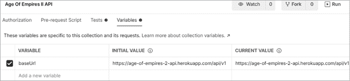

图 4-24：更新后的`baseURL`变量

现在变量已更新，你可以选择其中一个请求并点击**发送**。如果成功，你应该会收到类似于图 4-25 所示的响应。

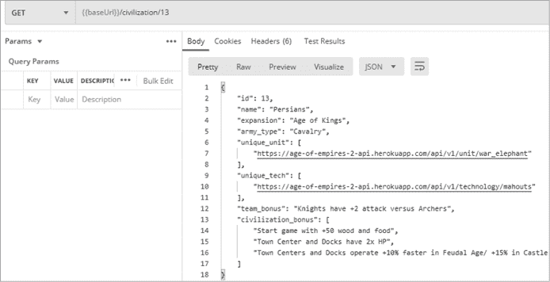

图 4-25：在 Postman 中成功使用帝国时代 II API 集合

每当你导入一个集合并遇到错误时，可以使用此过程来排查集合的变量问题。也请确保检查是否遗漏了任何授权要求。

### 集合运行器

集合运行器允许你运行集合中所有保存的请求（见图 4-26）。你可以选择你想运行的集合、与之配对的环境、你希望运行集合的次数，以及如果有速率限制要求时的延迟。

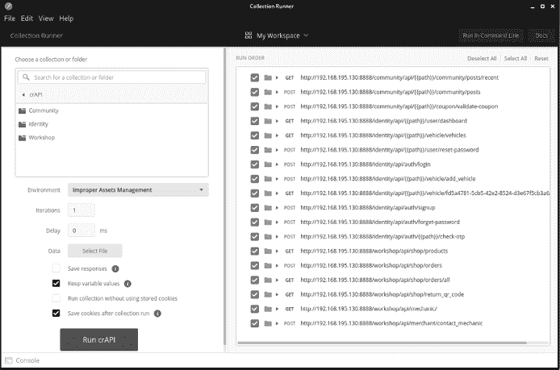

图 4-26：Postman 集合运行器

请求还可以按特定顺序排列。一旦集合运行器执行完毕，你可以查看运行摘要，了解每个请求是如何处理的。例如，如果我打开集合运行器，选择 Twitter API v2 并运行集合运行器，我可以看到该集合中所有 API 请求的概览。

### 代码片段

除了面板外，你还应注意代码片段功能。在请求面板的右上角，你会看到一个代码按钮。这个按钮可以用来将已构建的请求转换为多种不同的格式，包括 cURL、Go、HTTP、JavaScript、NodeJS、PHP 和 Python。当我们使用 Postman 构建请求后，如果需要切换到其他工具，这个功能非常有用。你可以在 Postman 中构建复杂的 API 请求，生成一个 cURL 请求，然后将其与其他命令行工具一起使用。

### 测试面板

测试面板允许你创建将在响应中运行的脚本。如果你不是程序员，你会欣赏 Postman 在测试面板右侧提供了预构建的代码片段。你可以通过找到一个预构建的代码片段、点击它，并调整测试以适应你的测试需求，轻松构建一个测试。我建议查看以下代码片段：

+   `状态码：代码为 200`

+   `响应时间小于 200 毫秒`

+   `响应体：包含字符串`

这些 JavaScript 代码片段相当直接。例如，`状态码：代码为 200` 的测试如下：

```
pm.test("Status code is 200", function () {
    pm.response.to.have.status(200);
});
```

你可以看到，将在测试结果中显示的测试名称是“状态码为 200”。该功能正在检查以确保 Postman 响应的状态是 200。我们可以轻松调整 JavaScript 代码，通过简单地将 `(200)` 更新为我们所需的状态码，并更改测试名称以适应。例如，如果我们想检查状态码 400，可以按如下方式修改代码：

```
pm.test("Status code is 400", function () {
    pm.response.to.have.status(400);
});
```

就这么简单！你真的不需要是程序员就能理解这些 JavaScript 代码片段。

图 4-27 显示了一系列与 AOE2 公共 API 请求一起包含的测试。这些测试包括检查 200 状态码、小于 200 毫秒的延迟，以及响应字符串中包含“波斯人”。

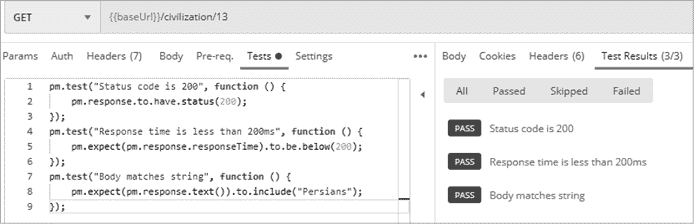

图 4-27：AOE2 公共 API 测试

配置好测试后，你可以查看响应的测试结果标签，了解测试是成功还是失败。创建测试的一个好习惯是确保测试会失败。测试只有在通过和失败时按预期发生时才有效。因此，发送一个请求，创建你预期通过或失败的条件，以确保测试功能正常。关于创建测试脚本的更多信息，请查阅 Postman 文档（[`learning.postman.com/docs/writing-scripts/test-scripts`](https://learning.postman.com/docs/writing-scripts/test-scripts)）。

现在，你可以在 Postman 中探索许多其他选项。像 Burp Suite 一样，Postman 有一个学习中心（[`learning.postman.com`](https://learning.postman.com)），为那些想要深入了解该软件的用户提供在线资源。或者，如果你想查阅 Postman 文档，可以访问[`learning.postman.com/docs/getting-started/introduction`](https://learning.postman.com/docs/getting-started/introduction)。

## 配置 Postman 以与 Burp Suite 配合使用

Postman 用于与 API 交互，而 Burp Suite 是一个强大的网页应用测试工具。如果你将这两个应用结合使用，你可以在 Postman 中配置并测试 API，然后通过代理将流量传送到 Burp Suite 进行目录暴力破解、篡改参数以及进行模糊测试。

如同设置 FoxyProxy 时，你需要配置 Postman 代理，通过以下步骤将流量发送到 Burp Suite（见图 4-28）：

1.  按下 ctrl-,（逗号）或导航到**文件**▶**设置**以打开 Postman 设置。

1.  点击**代理**选项卡。

1.  勾选添加自定义代理配置的复选框。

1.  确保将代理服务器设置为**127.0.0.1**。

1.  将代理服务器端口设置为**8080**。

1.  选择**常规**选项卡并关闭 SSL 证书验证**关闭**。

1.  在 Burp Suite 中，选择**代理**选项卡。

1.  点击按钮以启用拦截**开启**。

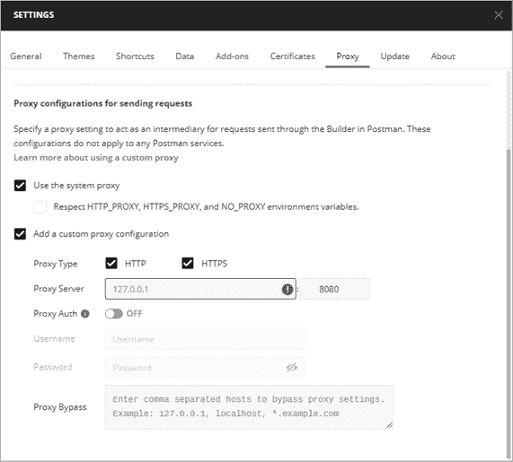

图 4-28：Postman 的代理设置已配置为与 Burp Suite 交互

尝试使用 Postman 发送请求；如果请求被 Burp Suite 拦截，则说明你已正确配置一切。现在你可以保持代理开启，并在需要捕获请求和响应时切换 Burp Suite 的“开启拦截”功能。

## 补充工具

本节旨在提供额外的选项，并帮助那些受到 Burp Suite CE 功能限制的用户。以下工具在其领域表现优秀，且是开源免费的。特别是这里介绍的 API 扫描工具在你积极测试目标时发挥了多重作用。像 Nikto 和 OWASP ZAP 这样的工具可以帮助你主动发现 API 端点、安全配置错误和有趣的路径，并提供一些 API 的表面测试。换句话说，当你开始积极与目标互动时，这些工具非常有用，而像 Wfuzz 和 Arjun 这样的工具则在你发现 API 并希望集中测试时更为有用。使用这些工具积极测试 API，发现独特的路径、参数、文件和功能。每个工具都有自己独特的关注点和目的，能够补充免费版 Burp Suite Community Edition 中缺失的功能。

### 使用 OWASP Amass 进行侦察

OWASP Amass 是一个开源信息收集工具，可用于被动和主动侦察。这个工具是 OWASP Amass 项目的一部分，由 Jeff Foley 领导。我们将使用 Amass 来发现目标组织的攻击面。只需目标的域名，你就可以使用 Amass 扫描许多互联网资源，查找与目标相关的域名和子域名，获取潜在的目标 URL 和 API 列表。

如果未安装 OWASP Amass，请使用以下命令：

```
$ **sudo** **apt-get install amass**
```

Amass 在没有太多设置的情况下也非常有效。然而，通过设置来自各种源的 API 密钥，你可以将它打造成一个信息收集的强大工具。我建议至少注册 GitHub、Twitter 和 Censys 的帐户。设置好这些帐户后，你可以为这些服务生成 API 密钥，并通过将其添加到 Amass 的配置文件 *config.ini* 中，插入到 Amass 中。Amass 的 GitHub 仓库有一个 *config.ini* 文件模板，你可以在 [`github.com/OWASP/Amass/blob/master/examples/config.ini`](https://github.com/OWASP/Amass/blob/master/examples/config.ini) 找到。

在 Kali 上，Amass 将尝试在以下位置自动查找 *config.ini* 文件：

```
$ **HOME/.config/amass/config.ini**
```

要下载示例 *config.ini* 文件的内容并将其保存到默认的 Amass 配置文件位置，请从终端运行以下命令：

```
$ **mkdir $HOME/.config/amass**
$ **curl https://raw.githubusercontent.com/OWASP/Amass/master/examples/config.ini >$HOME/.config/amass/config.ini**
```

下载该文件后，你可以编辑它并添加你想要包含的 API 密钥。它应该类似于以下内容：

```
# https://umbrella.cisco.com (Paid-Enterprise)
# The apikey must be an API access token created through the Investigate management UI
#[data_sources.Umbrella]
#apikey =

#https://urlscan.io (Free)
#URLScan can be used without an API key
#apikey =

# https://virustotal.com (Free)
#[data_sources.URLScan]
#apikey =
```

如你所见，你可以删除注释（`#`），然后简单地粘贴你想使用的服务的 API 密钥。*config.ini* 文件中甚至指明了哪些密钥是免费的。你可以在 [`github.com/OWASP/Amass`](https://github.com/OWASP/Amass) 查找到可以用来增强 Amass 的 API 源列表。虽然这可能需要一些时间，但我建议至少利用所有在 APIs 下列出的免费源。

### 使用 Kiterunner 发现 API 端点

Kiterunner ([`github.com/assetnote/kiterunner`](https://github.com/assetnote/kiterunner)) 是一款专门为发现 API 资源而设计的内容发现工具。Kiterunner 是用 Go 编写的，虽然它能够以每秒 30,000 个请求的速度进行扫描，但它会考虑到负载均衡器和 Web 应用防火墙可能会执行速率限制的因素。

在处理 API 时，Kiterunner 的搜索技术优于其他内容发现工具，如 dirbuster、dirb、Gobuster 和 dirsearch，因为该工具是针对 API 进行优化的。它的字典文件、请求方法、参数、头部和路径结构都专注于发现 API 端点和资源。值得注意的是，该工具包含了来自 67,500 个 Swagger 文件的数据。Kiterunner 还被设计用来检测不同 API 的特征，包括 Django、Express、FastAPI、Flask、Nginx、Spring 和 Tomcat（仅举几个例子）。

该工具最有用的功能之一是请求重放功能，我们将在第六章中利用它。如果 Kiterunner 在扫描时检测到端点，它会在命令行中显示此结果。你可以进一步探索触发该结果的确切请求，从而深入分析。

要安装 Kiterunner，请运行以下命令：

```
$ **git clone https://github.com/assetnote/kiterunner.git**
$ **cd kiterunner**
$ **make build**
$ **sudo ln -s $(pwd)/dist/kr /usr/local/bin/kr**
```

然后，你应该能够通过在命令行输入以下命令来使用 Kiterunner：

```
$ **kr**
kite is a context based webscanner that uses common api paths for content discovery of an applications api paths.

Usage:
  kite [command]

Available Commands:
  brute       brute one or multiple hosts with a provided wordlist
  help        help about any command
  kb          manipulate the kitebuilder schema
  scan        scan one or multiple hosts with a provided wordlist
  version     version of the binary you're running
  wordlist    look at your cached wordlists and remote wordlists

Flags:
      --config string    config file (default is $HOME/.kiterunner.yaml)
  -h, --help             help for kite
  -o, --output string    output format. can be json,text,pretty (default "pretty")
  -q, --quiet            quiet mode. will mute unnecessary pretty text
  -v, --verbose string   level of logging verbosity. can be error,info,debug,trace (default "info")

Use "kite [command] --help" for more information about a command.
```

你可以为 Kiterunner 提供各种字典文件，然后它会将这些字典作为有效载荷用于一系列请求。这些请求将帮助你发现有趣的 API 端点。Kiterunner 允许你使用 Swagger JSON 文件、Assetnote 的 *.kites* 文件和 *.txt* 字典。目前，Assetnote 每月发布包含从其全球网络扫描中收集的搜索词的字典文件。所有字典文件都托管在 [`wordlists.assetnote.io`](https://wordlists.assetnote.io) 上。你可以按照如下方式创建一个 API 字典目录：

```
$ **mkdir -p ~/api/wordlists**
```

然后，你可以选择你需要的字典文件并将它们下载到 */api/wordlists* 目录中：

```
$ **curl https://wordlists-cdn.assetnote.io/data/automated/httparchive_apiroutes_2021_06_28.txt > latest_api_wordlist.txt**
  % Total    % Received % Xferd  Average Speed   Time    Time     Time  Current
                                 Dload  Upload   Total   Spent    Left  Speed
100 6651k  100 6651k    0     0  16.1M      0 --:--:-- --:--:-- --:--:-- 16.1M
```

你可以用任何适合你的字典文件替换 *httparchive_apiroutes_2021_06_028.txt*。或者，直接一次性下载所有的 Assetnote 字典文件：

```
$ **wget -r --no-parent -R "index.html*" https://wordlists-cdn.assetnote.io/data/ -nH**
```

请注意，下载所有 Assetnote 字典文件需要大约 2.2GB 的空间，但保存它们绝对是值得的。

### 使用 Nikto 扫描漏洞

Nikto 是一款命令行 Web 应用漏洞扫描工具，对于信息收集非常有效。我通常在发现 Web 应用存在后立即使用 Nikto，因为它能指引我关注应用程序的有趣部分。Nikto 会提供关于目标 Web 服务器、安全配置错误和其他 Web 应用漏洞的信息。由于 Nikto 已包含在 Kali 中，因此应该不需要任何特殊设置。

要扫描一个域名，可以使用以下命令：

```
$ **nikto -h https://example.com**
```

要查看 Nikto 的额外选项，请在命令行中输入 `nikto -Help`。你可能会发现一些有用的选项，包括 `-output` `filename` 用于将 Nikto 结果保存到指定文件，以及 `-maxtime` `#ofseconds` 用于限制 Nikto 扫描的持续时间。

Nikto 扫描的结果将包括应用程序允许的 HTTP 方法、有趣的头部信息、潜在的 API 端点和其他可能值得检查的目录。有关 Nikto 的更多信息，请查阅文档 *https://cirt.net/nikto2-docs*。

### 使用 OWASP ZAP 扫描漏洞

OWASP 开发了 ZAP，这是一个开源的 Web 应用程序扫描工具，它是另一个重要的 Web 应用程序安全测试工具。OWASP ZAP 应该已经包含在 Kali 中，但如果没有，你可以从 GitHub 克隆它，地址是 [`github.com/zaproxy/zaproxy`](https://github.com/zaproxy/zaproxy)。

ZAP 有两个组件：自动扫描和手动探索。ZAP 的*自动扫描*会执行 Web 抓取、检测漏洞，并通过更改请求参数来测试 Web 应用程序响应。自动扫描非常适合检测 Web 应用程序的表面目录，包括发现 API 端点。要运行它，输入目标 URL 到 ZAP 界面并点击按钮开始攻击。一旦扫描完成，你将收到一个按发现严重性分类的警报列表。ZAP 自动扫描的问题在于，它可能充满了误报，因此检查和验证警报非常重要。该测试也仅限于 Web 应用程序的表面。除非有无意暴露的目录，否则 ZAP 无法突破身份验证要求深入扫描。这时，ZAP 的手动探索选项就派上了用场。

ZAP 的*手动探索*功能对于深入探索 Web 应用程序非常有用。它也被称为 ZAP Heads Up Display（ZAP HUD），手动探索将你的 Web 浏览器流量通过 ZAP 代理，当你浏览时，ZAP 会显示警报和功能覆盖在网页上。启动时，输入要探索的 URL 并打开你选择的浏览器。当浏览器启动时，看起来就像你正常地浏览该站点；然而，ZAP 的警报和功能会叠加在网页上。这使你能够更好地控制何时开始抓取、何时运行主动扫描，以及何时开启“攻击模式”。例如，你可以在 ZAP 扫描器运行时完成用户账户创建过程和身份验证/授权过程，以自动检测这些过程中的漏洞。你检测到的任何漏洞都会像游戏成就一样弹出。我们将使用 ZAP HUD 来发现 API。

### 使用 Wfuzz 进行模糊测试

Wfuzz 是一个基于 Python 的开源 Web 应用程序模糊测试框架。Wfuzz 应该已经包含在最新版本的 Kali 中，但你也可以从 GitHub 上安装它，地址是 [`github.com/xmendez/wfuzz`](https://github.com/xmendez/wfuzz)。

您可以使用 Wfuzz 在 HTTP 请求中注入负载，通过将 *FUZZ* 替换为字典中的单词；然后 Wfuzz 会迅速发出许多请求（每分钟约 900 次）并使用指定的负载。由于模糊测试的成功很大程度上依赖于使用优质的字典，我们将在第六章花费相当多的时间讨论字典的使用。

这是 Wfuzz 的基本请求格式：

```
`$` **wfuzz** `options` **-z** `payload,params url`
```

运行 Wfuzz，使用以下命令：

```
$ **wfuzz -z file,/usr/share/wordlists/list.txt http://targetname.com/FUZZ**
```

此命令将 URL *http://targetname.com/FUZZ* 中的 *FUZZ* 替换为来自 */usr/share/wordlists/list.txt* 中的单词。`-z` 选项指定了一个负载类型，后跟实际的负载。在这个例子中，我们指定了负载是一个文件，然后提供了字典文件的路径。我们还可以使用 `-z` 搭配 `list` 或 `range`。使用 `list` 选项意味着我们将在请求中指定负载，而 `range` 则表示一个数字范围。例如，您可以使用 `list` 选项来测试端点是否支持一组 HTTP 动词：

```
$ **wfuzz -X POST -z list,admin-dashboard-docs-api-test http://targetname.com/FUZZ**
```

`-X` 选项指定 HTTP 请求方法。在前面的示例中，Wfuzz 将执行一个 POST 请求，将字典用作路径，替代 *FUZZ* 占位符。

您可以使用 `range` 选项轻松扫描一系列数字：

```
$ **wfuzz -z range,500-1000 http://targetname.com/account?user_id=FUZZ**
```

这将自动模糊测试从 500 到 1000 的所有数字。当我们测试 BOLA 漏洞时，这非常有用。

要指定多个攻击位置，您可以列出多个 `-z` 标志，然后为相应的 `FUZZ` 占位符编号，例如 `FUZZ`、`FUZ1`、`FUZ2`、`FUZ3` 等，如下所示：

```
$ wfuzz -z list,A-B-C -z range,1-3 http://targetname.com/**FUZZ**/user_id=**FUZZ2**
```

对目标运行 Wfuzz 可能会生成大量结果，这可能使得难以发现任何有趣的内容。因此，您应该熟悉 Wfuzz 的过滤选项。以下过滤器仅显示特定的结果：

1.  `--sc` 仅显示具有特定 HTTP 响应代码的响应

1.  `--sl` 仅显示具有指定行数的响应

1.  `--sw` 仅显示包含指定数量单词的响应

1.  `--sh` 仅显示具有指定字符数的响应

在以下示例中，Wfuzz 将扫描目标并仅显示包含 200 状态码的结果：

```
$ **wfuzz -z file,/usr/share/wordlists/list.txt –sc 200 http://targetname.com/FUZZ**
```

以下过滤器隐藏某些结果：

1.  `--hc` 隐藏具有特定 HTTP 状态代码的响应

1.  `--hl` 隐藏具有指定行数的响应

1.  `--hw` 隐藏具有指定单词数的响应

1.  `--hh` 隐藏具有指定字符数的响应

在以下示例中，Wfuzz 将扫描目标并隐藏所有状态码为 404 的结果，同时隐藏具有 950 个字符的结果：

```
$ **wfuzz -z file,/usr/share/wordlists/list.txt –sc 404 –sh 950 http://targetname.com/FUZZ**
```

Wfuzz 是一个功能强大的多用途模糊测试工具，您可以使用它彻底测试端点并找出其弱点。欲了解更多关于 Wfuzz 的信息，请查看 [`wfuzz.readthedocs.io/en/latest`](https://wfuzz.readthedocs.io/en/latest) 上的文档。

### 使用 Arjun 发现 HTTP 参数

Arjun 是另一个基于 Python 的开源 API 模糊测试工具，专门用于发现 Web 应用程序参数。我们将使用 Arjun 来发现基本的 API 功能、查找隐藏参数以及测试 API 端点。你可以将其作为黑盒测试中 API 端点的首选扫描工具，或者用它轻松查看 API 的文档参数是否与扫描结果相符。

Arjun 配备了一个包含近 26,000 个参数的词汇表，且与 Wfuzz 不同，它使用预配置的异常检测为你进行部分过滤。要设置 Arjun，首先从 GitHub 克隆它（你需要一个 GitHub 账户）：

```
$ **cd /opt/**
$ **sudo git clone https://github.com/s0md3v/Arjun.git**
```

Arjun 的工作原理是，首先向目标 API 端点发送标准请求。如果目标返回 HTML 表单，Arjun 会将表单名称添加到参数列表中。然后，Arjun 会发送一个包含预期返回不存在资源的参数请求。这样做是为了记录失败的参数请求的行为。接着，Arjun 会启动 25 个请求，其中包含近 26,000 个参数的有效负载，比较 API 端点的响应，并开始对异常进行进一步扫描。

要运行 Arjun，请使用以下命令：

```
$ **python3 /opt/Arjun/arjun.py -u http://target_address.com**
```

如果你希望输出结果以某种特定格式呈现，可以使用`-o`选项并指定所需的文件类型：

```
$ **python3 /opt/Arjun/arjun.py -u http://target_address.com -o arjun_results.json**
```

如果你遇到有速率限制的目标，Arjun 可能会触发速率限制并导致安全控制机制阻止你。Arjun 甚至在目标不配合时会给出内建的建议。Arjun 可能会弹出错误信息，如“目标无法处理请求，请尝试 --stable 开关。”如果发生这种情况，只需添加`--stable`标志。以下是一个示例：

```
$ **python3 /opt/Arjun/arjun.py -u http://target_address.com -o arjun_results.json --stable**
```

最后，Arjun 可以同时扫描多个目标。使用`-i`标志来指定目标 URL 列表。如果你使用 Burp Suite 代理流量，你可以选择站点地图中的所有 URL，使用“复制选定的 URL”选项，将该列表粘贴到文本文件中。然后像这样同时对所有 Burp Suite 目标运行 Arjun：

```
$ **python3 /opt/Arjun/arjun.py -i burp_targets.txt**
```

## 摘要

在本章中，你将设置本书中用于破解 API 的各种工具。此外，我们还花了一些时间深入探讨了功能丰富的应用程序，如 DevTools、Burp Suite 和 Postman。熟悉这些 API 破解工具将帮助你知道何时使用哪个工具，以及何时需要调整策略。

## 实验 #1：枚举 REST API 中的用户账户

欢迎来到你的第一个实验。

在本实验中，我们的目标很简单：使用本章中讨论的工具，找出 *reqres.in* 这个 REST API 中的用户账户总数。你本可以通过猜测账户总数并检查这个数字来轻松得出答案，但我们将通过 Postman 和 Burp Suite 的强大功能，更快速地找到答案。当测试实际目标时，你可以使用这个过程来发现是否存在基本的 BOLA 漏洞。

首先，访问[`reqres.in`](http://reqres.in)查看是否可以获得 API 文档。在登录页面，我们找到了相当于 API 文档的内容，并可以看到一个示例请求，示例中包含向*/api/users/2*端点发出请求（见图 4-29）。


图 4-29：[`reqres.in`](https://reqres.in)上找到的 API 文档，包含请求`user id:2`的说明

你会注意到一个“列出用户”（List Users）端点；我们将在实验中忽略它，因为它不会帮助你学习预期的概念。相反，我们将使用“单个用户”（Single User）端点，因为它将帮助你培养发现漏洞的技能，如 BOLA 和 BFLA。对于单个用户的推荐 API 请求是通过向*/api/users/*发送 GET 请求来向消费者提供所请求用户的账户信息。我们可以很容易地假设用户账户按其`id`号码在*user*目录中进行组织。

让我们通过尝试向不同 ID 号码的用户发送请求来验证这个理论。由于我们将与 API 交互，让我们使用 Postman 设置 API 请求。将方法设置为 GET，并添加 URL *http://reqres.in/api/users/1*。点击**发送**，确保你收到响应。如果你请求的是 ID 为 1 的用户，响应应该显示 George Bluth 的用户信息，如图 4-30 所示。

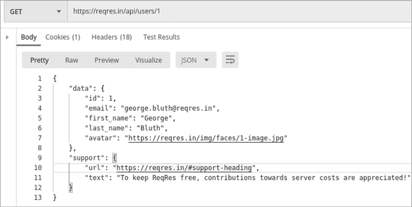

图 4-30：使用 Postman 发出的标准 API 请求，从[`reqres.in`](https://reqres.in)数据库中检索用户 1

为了通过此方法高效地检索所有用户的数据，我们将使用 Burp 的 Intruder。将来自*reqres.in*端点的流量通过代理发送到 Burp Suite，并在 Postman 中提交相同的请求。然后切换到 Burp Suite，在 Burp Suite 的代理标签页中，你应该能看到拦截到的流量（见图 4-31）。

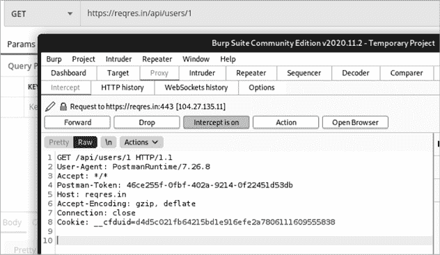

图 4-31：使用 Postman 发出的拦截请求，用于检索用户 1

使用快捷键 Ctrl-I 或右键点击拦截的请求，选择**发送到 Intruder**。选择**Intruder**▶**Positions**标签页以选择负载位置。首先，选择**清除§**以移除自动负载定位。然后选择 URL 末尾的数字，点击标记为**添加§**的按钮（见图 4-32）。

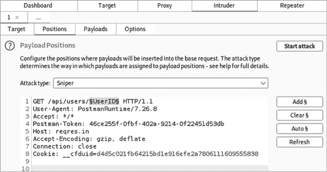

图 4-32：Burp Suite 的 Intruder 配置，攻击位置设置在路径的*UserID*部分

一旦选择了攻击位置，点击**Payloads**选项卡（见图 4-33）。由于我们的目标是找出存在多少个用户账户，我们希望用一系列数字替换用户 ID。将载荷类型更改为**数字**。更新数字范围，测试从 0 到 25，每次递增 1。步长选项告诉 Burp 每次载荷增加多少数字。选择 1 意味着我们让 Burp 自动生成所有的载荷。这将帮助我们发现 ID 在 0 到 25 之间的所有用户。通过这些设置，Burp 将发送总共 26 个请求，每个请求包含一个从 0 到 25 的数字。

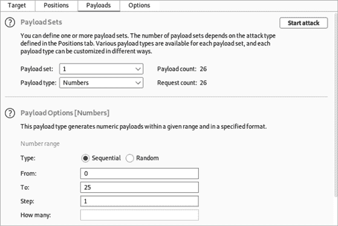

图 4-33：Intruder 的 Payloads 选项卡，载荷类型设置为数字

最后，点击**开始攻击**将 26 个请求发送到*reqres.in*。分析结果应该能清楚地显示所有的活跃用户。API 提供者对于用户账户 1 到 12 的请求返回状态 200，而对随后的请求返回 404 状态。根据这些结果，我们可以得出结论，这个 API 总共有 12 个有效用户账户。

当然，这只是练习。你在未来的 API 攻击中替换的值可能是用户 ID 号码，但它们也可以是银行账户号码、电话号码、公司名称或电子邮件地址。本实验室已经帮助你了解了基本的 BOLA 漏洞；我们将在第十章进一步扩展这些知识。

作为进一步的练习，尝试使用 Wfuzz 执行相同的扫描。
