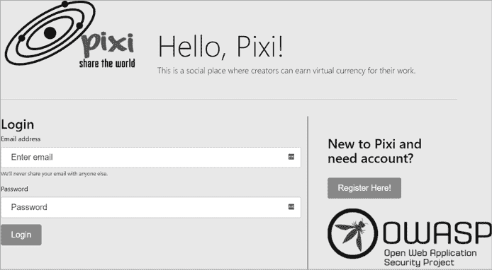
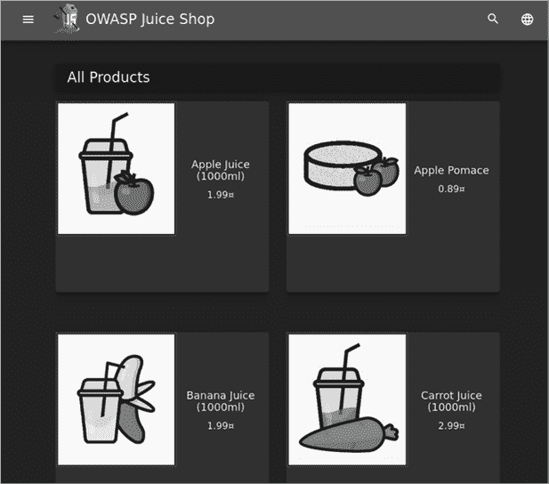
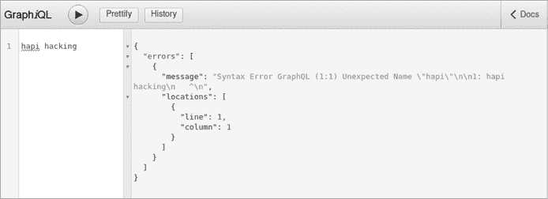
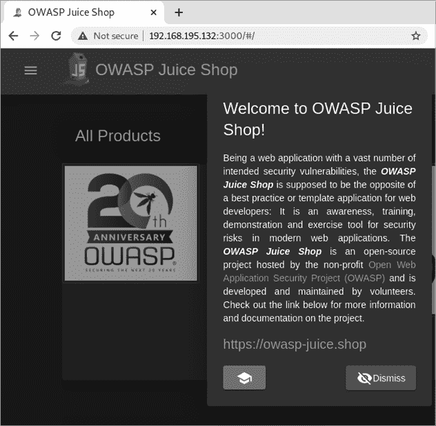
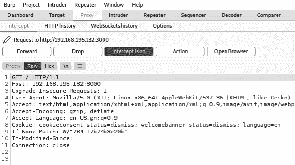

# 5

设置易受攻击的 API 目标


在本章中，你将构建自己的 API 目标实验室，在随后的章节中进行攻击。通过针对你控制的系统，你可以安全地练习你的技术，并从进攻和防御的角度看到它们的影响。你还可以犯错，并尝试一些你可能在真实攻击中尚不熟悉的漏洞利用技术。

你将在本书的实验室部分针对这些机器进行攻击，了解工具的工作原理，发现 API 弱点，学习模糊测试输入，并利用所有的发现。实验室中的漏洞将远远超出本书的覆盖范围，因此我鼓励你去发现它们，并通过实验发展新的技能。

本章将引导你设置 Linux 主机中的先决条件，安装 Docker，下载并启动我们将用作目标的三个易受攻击的系统，并找到用于 API 黑客目标的其他资源。

## 创建一个 Linux 主机

你需要一个主机系统来运行易受攻击的应用程序。为了简化操作，我建议将易受攻击的应用程序保存在不同的主机系统上。当它们托管在一起时，可能会出现应用程序使用的资源冲突，并且对一个易受攻击的 Web 应用的攻击可能会影响到其他应用。将每个易受攻击的应用程序放在独立的主机系统上会更为简便。

我推荐使用一个最近的 Ubuntu 镜像，它可以托管在虚拟化平台（如 VMware、Hyper-V 或 VirtualBox）上，或者托管在云端（如 AWS、Azure 或 Google Cloud）。设置主机系统并将它们联网的基础知识超出了本书的范围，并且在其他地方有广泛的覆盖。你可以找到许多优秀的免费指南，帮助你设置家庭或云端的黑客实验室。以下是我推荐的一些：

1.  Cybrary，“教程：如何在家搭建虚拟渗透测试实验室”，[`www.cybrary.it/blog/0p3n/tutorial-for-setting-up-a-virtual-penetration-testing-lab-at-your-home`](https://www.cybrary.it/blog/0p3n/tutorial-for-setting-up-a-virtual-penetration-testing-lab-at-your-home)

1.  Black Hills Information Security，“网络广播：如何搭建家庭实验室”，[`www.blackhillsinfosec.com/webcast-how-to-build-a-home-lab`](https://www.blackhillsinfosec.com/webcast-how-to-build-a-home-lab)

1.  Null Byte，“如何创建一个虚拟黑客实验室”，[`null-byte.wonderhowto.com/how-to/hack-like-pro-create-virtual-hacking-lab-0157333`](https://null-byte.wonderhowto.com/how-to/hack-like-pro-create-virtual-hacking-lab-0157333)

1.  Hacking Articles，“在 AWS 上设置 Web 应用渗透测试实验室”，[`www.hackingarticles.in/web-application-pentest-lab-setup-on-aws`](https://www.hackingarticles.in/web-application-pentest-lab-setup-on-aws)

使用这些指南来设置你的 Ubuntu 机器。

## 安装 Docker 和 Docker Compose

一旦你配置好了主机操作系统，就可以使用 Docker 将漏洞应用托管在容器中。Docker 和 Docker Compose 使得下载这些漏洞应用并在几分钟内启动它们变得异常简单。

按照官方指南 [`docs.docker.com/engine/install/ubuntu`](https://docs.docker.com/engine/install/ubuntu) 在你的 Linux 主机上安装 Docker。你可以通过运行 hello-world 镜像来确认 Docker Engine 是否正确安装：

```
$ **sudo docker run hello-world**
```

如果你能成功运行 hello-world 容器，说明你已经成功设置了 Docker，恭喜！否则，你可以按照官方 Docker 指南进行故障排查。

Docker Compose 是一个工具，可以让你通过一个 YAML 文件运行多个容器。根据你的实验室设置，Docker Compose 允许你通过简单的命令 `docker-compose up` 启动你的漏洞系统。关于安装 Docker Compose 的官方文档可以在 [`docs.docker.com/compose/install`](https://docs.docker.com/compose/install) 查阅。

## 安装漏洞应用

我选择了以下这些漏洞应用程序在实验室中运行：OWASP crAPI、OWASP Juice Shop、OWASP DevSlop 的 Pixi 和 Damn Vulnerable GraphQL。这些应用将帮助你培养基本的 API 黑客技能，例如发现 API、模糊测试、配置参数、测试认证、发现 OWASP API 安全 Top 10 漏洞，并攻击发现的漏洞。本节将介绍如何设置这些应用。

### 完全荒谬的 API (crAPI)

完全荒谬的 API，如 图 5-1 所示，是由 OWASP API 安全项目开发并发布的漏洞 API。如本书致谢部分所述，该项目由 Inon Shkedy、Erez Yalon 和 Paulo Silva 主导。crAPI 漏洞 API 的设计旨在展示最关键的 API 漏洞。我们将在大部分实验中专注于黑客攻击 crAPI。


图 5-1：crAPI 商店

通过在 Ubuntu 终端中运行以下命令，下载并部署 crAPI ([`github.com/OWASP/crAPI`](https://github.com/OWASP/crAPI))：

```
$ curl -o docker-compose.yml https://raw.githubusercontent.com/OWASP/crAPI/main/deploy/docker/docker-compose.yml
$ sudo docker-compose pull
$ sudo docker-compose -f docker-compose.yml --compatibility up -d
```

crAPI 应用包含一个现代化的 web 应用，一个 API 和一个 Mail Hog 邮件服务器。在这个应用中，你可以购买汽车配件、使用社区聊天功能，并将车辆与当地修理店进行关联。crAPI 应用使用了 OWASP API 安全 Top 10 漏洞的真实实现，你将从中学到很多东西。

### OWASP DevSlop 的 Pixi

Pixi 是一个基于 MongoDB、Express.js、Angular、Node (MEAN) 技术栈的 Web 应用程序，设计时故意采用了易受攻击的 API（参见 图 5-2）。它是在 OWASP DevSlop 项目中创建的，这是一个展示与 DevOps 相关错误的 OWASP 孵化项目，由 Nicole Becher、Nancy Gariché、Mordecai Kraushar 和 Tanya Janca 开发。



图 5-2：Pixi 登录页面

你可以将 Pixi 应用程序看作是一个具有虚拟支付系统的社交媒体平台。作为攻击者，你会发现 Pixi 的用户信息、管理功能和支付系统特别有趣。

Pixi 的另一个优点是它非常容易启动和运行。运行以下命令：

```
$ **git clone https://github.com/DevSlop/Pixi.git**
$ **cd Pixi**
$ **sudo docker-compose up**
```

然后使用浏览器访问 *http://localhost:8000* 查看登录页面。如果之前按照本章的描述设置了 Docker 和 Docker Compose，那么启动 Pixi 应该就这么简单。

### OWASP Juice Shop

OWASP Juice Shop，如 图 5-3 所示，是一个由 Björn Kimminich 创建的 OWASP 旗舰项目。它的设计包含了 OWASP Top 10 和 OWASP API 安全 Top 10 中的漏洞。Juice Shop 的一个很棒的特点是它会跟踪你的黑客进展，并包含一个隐藏的得分板。Juice Shop 是使用 Node.js、Express 和 Angular 构建的，它是一个由 REST API 驱动的 JavaScript 应用程序。



图 5-3：OWASP Juice Shop

在我们将安装的所有应用程序中，Juice Shop 是目前得到最多支持的，拥有超过 70 名贡献者。要下载并启动 Juice Shop，请运行以下命令：

```
$ **docker pull bkimminich/juice-shop**
$ **docker run --rm -p 80:3000 bkimminich/juice-shop**
```

Juice Shop 和 Damn Vulnerable GraphQL Application (DVGA) 默认都运行在 3000 端口。为了避免冲突，`-p 80:3000` 参数会将 Juice Shop 配置为通过 80 端口运行。

要访问 Juice Shop，浏览至 *http://localhost*。（在 macOS 和 Windows 上，如果你使用的是 Docker Machine 而非本地 Docker 安装，则浏览至 *http://192.168.99.100*。）

### Damn Vulnerable GraphQL Application

DVGA 是一个故意设计为易受攻击的 GraphQL 应用程序，由 Dolev Farhi 和 Connor McKinnon 开发。我将 DVGA 纳入本实验室，因为 GraphQL 在 Facebook、Netflix、AWS 和 IBM 等组织中的普及和应用日益增加。此外，你可能会对 GraphQL 集成开发环境（IDE）被公开供所有人使用的频繁程度感到惊讶。GraphiQL 是你会遇到的较为流行的 GraphQL IDE 之一。了解如何利用 GraphiQL IDE 将帮助你与其他 GraphQL API 进行交互，无论它们是否有友好的用户界面（参见 图 5-4）。



图 5-4：托管在 5000 端口上的 GraphiQL IDE 网页

要下载并启动 DVGA，请从 Ubuntu 主机终端运行以下命令：

```
$ **sudo docker pull dolevf/dvga**
$ **sudo docker run -t -p 5000:5000 -e WEB_HOST=0.0.0.0 dolevf/dvga**
```

要访问它，请使用浏览器并访问 *http://localhost:5000*。

## 添加其他漏洞应用

如果你对额外的挑战感兴趣，可以将其他机器添加到你的 API 黑客实验室中。GitHub 是一个很好的来源，提供了故意存在漏洞的 API 来增强你的实验室。表 5-1 列出了几个可以轻松从 GitHub 克隆的带有漏洞的系统。

表 5-1：其他带有漏洞 API 的系统

| **名称** | **贡献者** | **GitHub 链接** |
| --- | --- | --- |
| VAmPI | Erev0s | [`github.com/erev0s/VAmPI`](https://github.com/erev0s/VAmPI) |
| DVWS-node | Snoopysecurity | [`github.com/snoopysecurity/dvws-node`](https://github.com/snoopysecurity/dvws-node) |
| DamnVulnerable MicroServices | ne0z | [`github.com/ne0z/DamnVulnerableMicroServices`](https://github.com/ne0z/DamnVulnerableMicroServices) |
| Node-API-goat | Layro01 | [`github.com/layro01/node-api-goat`](https://github.com/layro01/node-api-goat) |
| 漏洞 GraphQL API | AidanNoll | [`github.com/CarveSystems/vulnerable-graphql-api`](https://github.com/CarveSystems/vulnerable-graphql-api) |
| Generic-University | InsiderPhD | [`github.com/InsiderPhD/Generic-University`](https://github.com/InsiderPhD/Generic-University) |
| vulnapi | tkisason | [`github.com/tkisason/vulnapi`](https://github.com/tkisason/vulnapi) |

## 在 TryHackMe 和 HackTheBox 上黑客攻击 API

TryHackMe ([`tryhackme.com`](https://tryhackme.com)) 和 HackTheBox ([`www.hackthebox.com`](https://www.hackthebox.com)) 是允许你攻击漏洞机器、参加夺旗（CTF）比赛、解决黑客挑战并在黑客排行榜上攀升的网页平台。TryHackMe 提供了一些免费的内容，并且通过月度订阅可以解锁更多内容。你可以通过浏览器部署其预构建的黑客机器并进行攻击。它包括几台带有漏洞 API 的优秀机器：

+   Bookstore（免费）

+   Carpe Diem 1（免费）

+   ZTH：隐蔽 Web 漏洞（付费）

+   ZTH：Web2（付费）

+   GraphQL（付费）

这些脆弱的 TryHackMe 机器涵盖了许多黑客攻击 REST API、GraphQL API 和常见 API 认证机制的基本方法。如果你是黑客新手，TryHackMe 使得部署攻击机器变得像点击“开始攻击盒子”一样简单。几分钟之内，你将拥有一台基于浏览器的攻击机器，配备本书中将使用的许多工具。

HackTheBox（HTB）也提供免费的内容和订阅模型，但假设你已经具备了基本的黑客技能。例如，HTB 当前不为用户提供攻击机器实例，因此需要你自己准备攻击机器。为了能够使用 HTB，你需要能够接受其挑战，并通过破解邀请代码流程进入系统。

HTB 免费套餐与付费套餐的主要区别在于对脆弱机器的访问。通过免费访问，你将能够访问最近的 20 台脆弱机器，其中可能包括与 API 相关的系统。然而，如果你想访问 HTB 的脆弱机器库，尤其是具有 API 漏洞的机器，你将需要购买 VIP 会员，才能访问已退役的机器。

在表 5-2 中列出的退役机器都包括 API 攻击方面的内容。

表 5-2：具有 API 攻击组件的退役机器

| Craft | Postman | Smasher2 |
| --- | --- | --- |
| JSON | Node | Help |
| PlayerTwo | Luke | Playing with Dirty Socks |

HTB 提供了提升黑客技能并扩展黑客实验室体验的最佳途径之一，超出了你自己防火墙的范围。除了 HTB 的机器，像 Fuzzy 这样的挑战可以帮助你提升关键的 API 攻击技能。

像 TryHackMe 和 HackTheBox 这样的网络平台是你黑客实验室的极好补充，并且能帮助提升你的 API 攻击能力。当你没有在现实世界中进行黑客攻击时，应该通过 CTF 竞赛来保持技能的锐利。

## 总结

在本章中，我带领你设置了自己的一套脆弱应用程序，你可以在家庭实验室中托管这些应用程序。随着你学习新技能，这些应用程序将成为你练习发现和利用 API 漏洞的场所。通过在家庭实验室中运行这些脆弱应用，你将能够跟随接下来的章节和实验中的工具与技术。我鼓励你超越我的建议，独立探索和学习，通过扩展或冒险，超越这个 API 攻击实验室。

## 实验室#2：寻找你的脆弱 API

让我们开始动手操作吧。在这个实验中，我们将使用一些基础的 Kali 工具来发现并与刚才设置的脆弱 API 进行交互。我们将使用 Netdiscover、Nmap、Nikto 和 Burp Suite 在本地网络中搜索 Juice Shop 实验应用。

在启动实验室之前，我建议先了解一下你的网络中能找到哪些设备。在启动脆弱实验室之前，使用 Netdiscover 来扫描，等实验室启动后再继续使用：

```
$ **sudo netdiscover**
Currently scanning: 172.16.129.0/16   |   Screen View: Unique Hosts

 13 Captured ARP Req/Rep packets, from 4 hosts.   Total size: 780

------------------------------------------------------------------------------
   IP            At MAC Address     Count     Len  MAC Vendor / Hostname
------------------------------------------------------------------------------
 192.168.195.2   00:50:56:f0:23:20      6     360  VMware, Inc.
 192.168.195.130 00:0c:29:74:7c:5d      4     240  VMware, Inc.
 **192.168.195.132 00:0c:29:85:40:c0      2     120  VMware, Inc.**
 192.168.195.254 00:50:56:ed:c0:7c      1      60  VMware, Inc.
```

你应该能在网络上看到一个新的 IP 地址出现。发现脆弱实验室 IP 后，你可以使用 ctrl-C 来停止 Netdiscover。

现在你已经得到了脆弱主机的 IP 地址，使用一个简单的 Nmap 命令来查看该虚拟设备上正在使用的服务和端口：

```
$ **nmap 192.168.195.132**
Nmap scan report for 192.168.195.132
Host is up (0.00046s latency).
Not shown: 999 closed ports
PORT         STATE         SERVICE
3000/tcp     open          ppp

Nmap done: 1 IP address (1 host up) scanned in 0.14 seconds
```

我们可以看到，目标 IP 地址仅开放了 3000 端口（这与我们最初设置 Juice Shop 时的预期一致）。为了获取更多关于目标的信息，我们可以在扫描时加入`-sC`和`-sV`标志，运行默认的 Nmap 脚本并进行服务枚举：

```
$ **nmap -sC -sV 192.168.195.132**
Nmap scan report for 192.168.195.132
Host is up (0.00047s latency).
Not shown: 999 closed ports
PORT     STATE SERVICE VERSION
3000/tcp open  ppp?
| fingerprint-strings:
|   DNSStatusRequestTCP, DNSVersionBindReqTCP, Help, NCP, RPCCheck, RTSPRequest:
|     HTTP/1.1 400 Bad Request
|     Connection: close
|   GetRequest:
     HTTP/1.1 200 OK
`--snip--`
     Copyright (c) Bjoern Kimminich.
     SPDX-License-Identifier: MIT
     <!doctype html>
     <html lang="en">
     <head>
     <meta charset="utf-8">
     <title>**OWASP Juice Shop**</title>
```

通过运行此命令，我们得知 HTTP 正在 3000 端口上运行。我们找到了一款名为 "OWASP Juice Shop" 的 web 应用。现在，我们应该可以通过 web 浏览器访问 Juice Shop，只需导航到该 URL（见 图 5-5）。在我的案例中，URL 是 *http://192.168.195.132:3000*。



图 5-5：OWASP Juice Shop

此时，你可以使用你的网页浏览器浏览该 web 应用，查看它的各种功能，并发现 Juice Shop 中的精华内容。一般来说，点击一些内容并留意这些点击生成的 URL，以便找出正在工作的 API。探索完 web 应用后，一个典型的第一步是测试它的漏洞。使用以下 Nikto 命令扫描你实验室中的 web 应用：

```
$ **nikto -h http://192.168.195.132:3000**
---------------------------------------------------------------------------
+ Target IP:          192.168.195.132
+ Target Hostname:    192.168.195.132
+ Target Port:        3000
---------------------------------------------------------------------------
+ Server: No banner retrieved
+ Retrieved access-control-allow-origin header: *
+ The X-XSS-Protection header is not defined. This header can hint to the user agent to protect against some forms of XSS
+ Uncommon header 'feature-policy' found, with contents: payment 'self'
+ No CGI Directories found (use '-C all' to force check all possible dirs)
+ Entry '/ftp/' in robots.txt returned a non-forbidden or redirect HTTP code (200)
+ "robots.txt" contains 1 entry which should be manually viewed.
```

Nikto 会高亮一些有用的信息，比如 *robots.txt* 文件和有效的 FTP 条目。然而，这里没有任何迹象表明有 API 正在工作。

由于我们知道 API 在 GUI 之外操作，接下来通过代理我们所有的流量并通过 Burp Suite 捕获网页流量是有意义的。确保将 FoxyProxy 设置为你的 Burp Suite 入口，并确认 Burp Suite 的拦截选项已打开（见 图 5-6）。接着，刷新 Juice Shop 的网页。



图 5-6：拦截到的 Juice Shop HTTP 请求

一旦你用 Burp Suite 拦截到请求，你应该能看到类似于 图 5-6 中所示的内容。然而，仍然没有 API！接下来，慢慢点击 **Forward** 按钮，将自动生成的请求一个接一个地发送到 web 应用，并注意到网页浏览器的 GUI 是如何逐步构建的。

一旦你开始转发请求，你应该看到以下内容，指示 API 端点：

1.  `GET /rest/admin/application-configuration`

1.  `GET /api/Challenges/?name=Score%20Board`

1.  `GET /api/Quantitys/`

很棒！这个简短的实验展示了如何在本地网络环境中搜索一个易受攻击的机器。我们运用了第四章中设置的工具来帮助我们找到其中一个易受攻击的应用，并捕获一些看起来很有趣的 API 请求，这些请求是在我们通常在 web 浏览器的 GUI 中无法看到的。
