# 第七章：发现


在你攻击目标的 API 之前，必须先定位这些 API，并验证它们是否正常运行。在这个过程中，你还需要寻找凭证信息（如密钥、密码、用户名和密码）、版本信息、API 文档以及有关 API 商业用途的信息。你收集的关于目标的信息越多，发现和利用与 API 相关漏洞的机会就越大。本章描述了被动和主动侦察过程以及完成这些任务的工具。

在识别一个 API 时，考虑其用途会有所帮助。API 旨在供内部使用、合作伙伴和客户使用或公开使用。如果一个 API 旨在公开或供合作伙伴使用，它可能会有开发者友好的文档，描述 API 端点和使用说明。利用这些文档来识别该 API。

如果 API 是为特定客户或内部使用的，你必须依赖其他线索：命名约定、HTTP 响应头信息，如`Content-Type: application/json`、包含 JSON/XML 的 HTTP 响应，以及关于应用程序的 JavaScript 源文件的信息。

## 被动侦察

*被动侦察*是指在不直接与目标设备互动的情况下获取有关目标的信息。当你采用这种方法时，你的目标是发现并记录目标的攻击面，而不让目标察觉到你的调查。在这种情况下，*攻击面*是通过网络暴露的所有系统集合，从中可能提取数据、通过它们进入其他系统，或者通过它们对系统的可用性造成干扰。

通常，被动侦察利用*开源情报（OSINT）*，即从公开可用的来源收集的数据。你将寻找 API 端点、凭证信息、版本信息、API 文档以及关于 API 商业用途的信息。任何发现的 API 端点将在主动侦察过程中成为你的目标。凭证相关信息将帮助你作为认证用户，或者更好地，作为管理员进行测试。版本信息将帮助你了解潜在的不当资产和其他过往漏洞。API 文档将告诉你如何准确地测试目标 API。最后，发现 API 的商业用途可以为你提供有关潜在商业逻辑漏洞的见解。

在收集开源情报的过程中，你完全有可能会发现一些关键的数据暴露，如 API 密钥、凭证、JSON Web Tokens（JWT）和其他秘密，这些可能导致一次性成功。其他高风险发现包括泄露的个人身份信息（PII）或敏感的用户数据，如社会安全号码、全名、电子邮件地址和信用卡信息。这些类型的发现应立即记录并报告，因为它们代表了一个有效的关键弱点。

### 被动侦察过程

当你开始进行被动侦察时，可能对目标了解甚少。收集到一些基本信息后，你可以将你的开源情报（OSINT）工作集中在组织的不同方面，建立目标的攻击面资料。API 的使用在不同行业和商业目的之间会有所不同，因此在学习新信息时，你需要进行调整。从使用各种工具来收集数据开始，然后根据收集到的数据进行更有针对性的搜索，以获取更精炼的信息。重复这一过程，直到你绘制出目标的攻击面。

#### 第一阶段：撒网

在互联网上搜索一些非常通用的术语，以便了解关于目标的一些基本信息。像 Google、Shodan 和 ProgrammableWeb 这样的搜索引擎可以帮助你找到关于 API 的一般信息，如其使用方法、设计和架构、文档以及商业目的，还可以找到与行业相关的信息和许多其他潜在的重要项目。

此外，你还需要调查目标的攻击面。这可以通过使用像 DNS Dumpster 和 OWASP Amass 这样的工具来完成。DNS Dumpster 通过显示与目标域名相关的所有主机及其相互连接的方式来执行 DNS 映射。（你可能会在稍后攻击这些主机！）我们在第四章中已经介绍了 OWASP Amass 的使用。

#### 第二阶段：调整与聚焦

接下来，基于第一阶段的发现，调整你的开源情报工作，结合收集到的信息。这可能意味着增加搜索查询的具体性，或结合来自不同工具的信息以获得新的见解。除了使用搜索引擎外，你还可以在 GitHub 上搜索与你的目标相关的代码库，使用 Pastehunter 等工具查找暴露的敏感信息。

#### 第三阶段：记录攻击面

做笔记对执行有效攻击至关重要。记录并截图所有有趣的发现。创建一个任务列表，列出可能对攻击过程中的其他阶段有用的被动侦察发现。稍后，当你积极尝试利用 API 漏洞时，可以回到任务列表，看看是否漏掉了什么。

以下部分将深入探讨你在整个过程中使用的工具。一旦你开始使用这些工具进行实验，你会注意到它们返回的信息之间会有所重叠。然而，我鼓励你使用多个工具来确认你的结果。例如，你不希望错过在 GitHub 上公开发布的特权 API 密钥，特别是如果某个犯罪分子后来发现了这些易得的信息并突破了你的客户的安全。

### Google 黑客技术

*Google 黑客技术*（也称为*Google dorking*）涉及巧妙使用高级搜索参数，可以揭示关于目标的各种公开 API 相关信息，包括漏洞、API 密钥和用户名，这些信息你可以在参与中加以利用。此外，你还可以找到目标组织的行业信息以及它如何使用 API。表 6-1 列出了有用的查询参数（完整列表请参见“Google 黑客技术”维基百科页面）。

表 6-1: Google 查询参数

| **查询操作符** | **目的** |
| --- | --- |
| `intitle` | 搜索页面标题 |
| `inurl` | 搜索 URL 中的词语 |
| `filetype` | 搜索所需的文件类型 |
| `site` | 限制搜索范围到特定网站 |

从广泛的搜索开始，查看有哪些信息可用；然后添加特定于目标的参数，以聚焦结果。例如，`inurl: /api/`的通用搜索将返回超过 2,150,000 条结果——这多得无法做出有效分析。为了缩小搜索结果的范围，可以包括目标的域名。像`intitle:"<targetname> api key"`这样的查询会返回更少且更相关的结果。

除了你自己精心制作的 Google 搜索查询，你还可以使用 Offensive Security 的 Google 黑客数据库（GHDB，[`www.exploit-db.com/google-hacking-database`](https://www.exploit-db.com/google-hacking-database)）。GHDB 是一个包含揭示公开暴露的易受攻击系统和敏感信息的查询库。表 6-2 列出了一些来自 GHDB 的有用 API 查询。

表 6-2: GHDB 查询

| **Google 黑客查询** | **预期结果** |
| --- | --- |
| `inurl:"/wp-json/wp/v2/users"` | 查找所有公开可用的 WordPress API 用户目录。 |
| `intitle:"index.of" intext:"api.txt"` | 查找公开可用的 API 密钥文件。 |
| `inurl:"/includes/api/" intext:"index of /"` | 查找可能有趣的 API 目录。 |
| `ext:php inurl:"api.php?action="` | 查找所有存在 XenAPI SQL 注入漏洞的网站。（这个查询发布于 2016 年，四年后，结果达到 141,000 条。） |
| `intitle:"index of" api_key OR "api key" OR apiKey -pool` | 列出可能暴露的 API 密钥。（这是我最喜欢的查询之一。） |

如图 6-1 所示，最终的查询返回了 2,760 个搜索结果，这些网站公开暴露了 API 密钥。

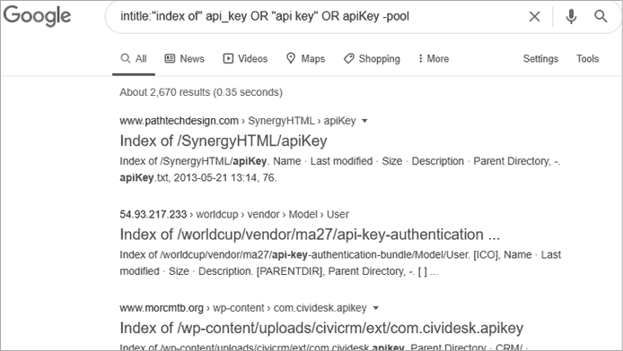

图 6-1：Google 对 API 进行黑客攻击的结果，包括几个暴露 API 密钥的网页

### ProgrammableWeb 的 API 搜索目录

ProgrammableWeb ([`www.programmableweb.com`](https://www.programmableweb.com)) 是获取 API 相关信息的首选来源。要了解 API，你可以使用它的 API 大学。要收集目标信息，可以使用 API 目录，这是一个包含超过 23,000 个 API 的可搜索数据库（见图 6-2）。你可以找到 API 端点、版本信息、业务逻辑信息、API 状态、源代码、SDK、文章、API 文档和 Changelog。


图 6-2：ProgrammableWeb API 目录

假设你通过 Google 查询发现你的目标正在使用 Medici 银行 API，你可以在 ProgrammableWeb API 目录中搜索并找到图 6-3 中的列表。

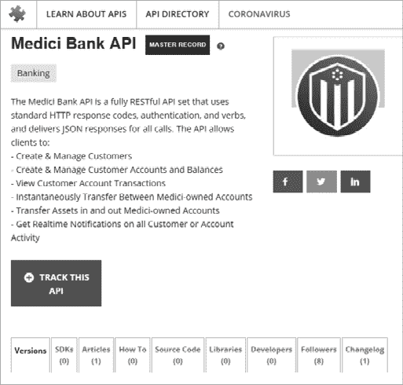

图 6-3：ProgrammableWeb 的 Medici 银行 API 目录列表

列表显示 Medici 银行 API 与客户数据交互并促进金融交易，因此它是一个高风险 API。当你发现像这样的敏感目标时，你会想找到任何可以帮助你攻击它的信息，包括 API 文档、端点和门户的位置、源代码、Changelog 以及它使用的认证模型。

点击目录列表中的各个标签并记录你找到的信息。要查看 API 端点位置、门户位置和认证模型，请点击 Versions 标签下的特定版本，如图 6-4 所示。在这种情况下，门户和端点链接也会指向 API 文档。

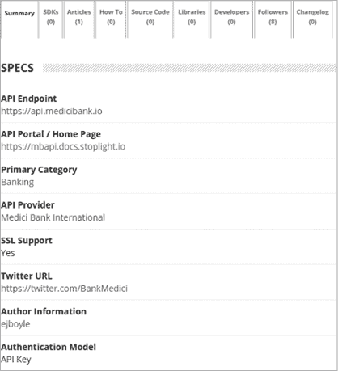

图 6-4：Medici 银行 API 规格部分提供 API 端点位置、API 门户位置和 API 认证模型。

Changelog 标签会告诉你过去的漏洞、以前的 API 版本以及最新 API 版本的重大更新（如果有的话）。ProgrammableWeb 将 Libraries 标签描述为“一个特定平台的软件工具，安装后将提供特定的 API。”你可以使用此标签来发现用于支持 API 的软件类型，其中可能包括易受攻击的软件库。

根据不同的 API，你可能会发现源代码、教程（How To 标签）、拼接应用和新闻文章，所有这些都可能提供有价值的 OSINT。其他拥有 API 资源库的网站包括[`rapidapi.com`](https://rapidapi.com)和[`apis.guru/browse-apis`](https://apis.guru/browse-apis)。

### Shodan

Shodan 是一个用于查找可以从互联网访问的设备的搜索引擎。Shodan 定期扫描整个 IPv4 地址空间，查找具有开放端口的系统，并将收集的信息公开发布在[`shodan.io`](https://shodan.io)。你可以使用 Shodan 来发现面向外部的 API，并获取关于目标开放端口的信息，如果你只有 IP 地址或组织名称，也能发挥它的作用。

与 Google dork 类似，你可以通过输入目标的域名或 IP 地址在 Shodan 上进行简单搜索；或者，你可以像编写 Google 查询一样使用搜索参数。表 6-3 展示了一些有用的 Shodan 查询。

表 6-3：Shodan 查询参数

| **Shodan 查询** | **目的** |
| --- | --- |
| `hostname:"targetname.com"` | 使用`hostname`可以对目标的域名进行基本的 Shodan 搜索。这个查询应该与以下查询结合使用，以获取与目标相关的具体结果。 |
| `"content-type: application/json"` | API 的`content-type`应该设置为 JSON 或 XML。此查询将过滤出响应为 JSON 的结果。 |
| `"content-type: application/xml"` | 这个查询将过滤出响应为 XML 的结果。 |
| `"200 OK"` | 你可以在搜索查询中加入`"200 OK"`来获取请求成功的结果。然而，如果一个 API 不接受 Shodan 请求的格式，它可能会返回 300 或 400 响应。 |
| `"wp-json"` | 该查询将搜索使用 WordPress API 的网页应用程序。 |

你可以组合 Shodan 查询来发现 API 端点，即使这些 API 没有标准的命名约定。如图 6-5 所示，假设我们的目标是 eWise（[`www.ewise.com`](https://www.ewise.com)），一家资金管理公司，我们可以使用以下查询查看 Shodan 是否扫描过它的 API 端点：

```
"ewise.com" "content-type: application/json"
```

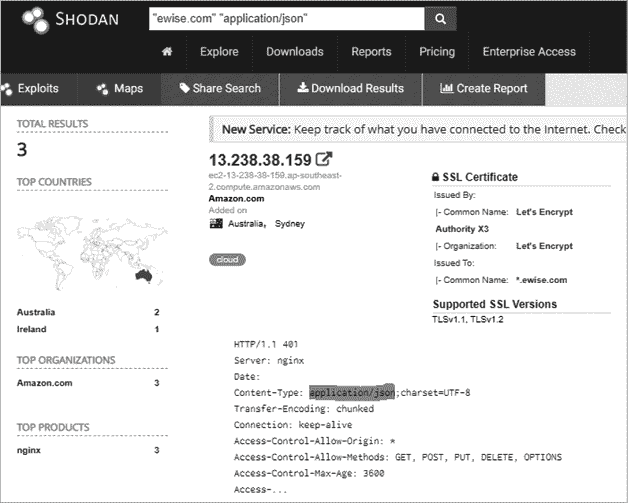

图 6-5：Shodan 搜索结果

在图 6-5 中，我们看到 Shodan 为我们提供了一个潜在的目标端点。进一步调查这个结果时，揭示了与 eWise 相关的 SSL 证书信息——即，网页服务器是 Nginx，并且响应包含`application/json`头。该服务器发出了一个常用于 REST API 的 401 JSON 响应代码。我们能够发现一个没有任何与 API 相关的命名约定的 API 端点。

Shodan 还提供了浏览器扩展，可以让你在浏览网站时方便地查看 Shodan 扫描结果。

### OWASP Amass

在第四章中介绍过，OWASP Amass 是一个命令行工具，通过从 55 个不同的来源收集 OSINT 来映射目标的外部网络。你可以设置它执行被动或主动扫描。如果选择主动选项，Amass 将直接向目标请求证书信息来收集数据。否则，它会从搜索引擎（如 Google、Bing 和 HackerOne）、SSL 证书来源（如 GoogleCT、Censys 和 FacebookCT）、搜索 API（如 Shodan、AlienVault、Cloudflare 和 GitHub）以及网络档案 Wayback 中收集数据。

请参阅第四章，了解如何设置 Amass 和添加 API 密钥。以下是对 *twitter.com* 进行的被动扫描，使用 grep 仅显示与 API 相关的结果：

```
$ **amass enum -passive -d twitter.com |grep api**
legacy-api.twitter.com
api1-backup.twitter.com
api3-backup.twitter.com
tdapi.twitter.com
failover-urls.api.twitter.com
cdn.api.twitter.com
pulseone-api.smfc.twitter.com
urls.api.twitter.com
api2.twitter.com
apistatus.twitter.com
apiwiki.twtter.com
```

该扫描显示了 86 个独特的 API 子域名，包括 *legacy-api.twitter.com*。正如我们从 OWASP API 安全十大中得知的，名为 *legacy* 的 API 可能特别值得关注，因为它似乎表明存在不当的资产管理漏洞。

Amass 提供了几个有用的命令行选项。使用 `intel` 命令可以收集 SSL 证书、搜索反向 Whois 记录并查找与目标相关的 ASN ID。首先提供目标的 IP 地址：

```
$ **amass intel -addr** `<target IP addresses>`
```

如果此扫描成功，它将提供域名。这些域名可以传递给 `intel` 命令并使用 `whois` 选项执行反向 Whois 查找：

```
$ **amass intel -d** `<target domain>` **–whois**
```

这样可能会给你带来大量的结果。聚焦于与目标组织相关的有趣结果。一旦你拥有了有趣的域名列表，就可以切换到 `enum` 子命令开始枚举子域名。如果你指定了 `-passive` 选项，Amass 将避免直接与目标进行交互：

```
$ **amass enum -passive -d** `<target domain>`
```

主动的 `enum` 扫描将执行与被动扫描类似的扫描，但它将添加域名解析、尝试 DNS 区域传输，并抓取 SSL 证书信息：

```
$ **amass enum -active -d** `<target domain>`
```

要提升你的技能，可以添加 `-brute` 选项来强行列出子域名，使用 `-w` 来指定 API_superlist 字典，然后使用 `-dir` 选项将输出发送到你选择的目录：

```
$ **amass enum -active -brute -w /usr/share/wordlists/API_superlist -d** `<target domain>` **-dir** `<directory name>`
```

如果你想要可视化 Amass 返回数据之间的关系，可以使用 `viz` 子命令，如下所示，生成一个外观酷炫的网页（见 图 6-6）。这个页面允许你放大并查看不同的相关域名，并希望能找到一些 API 端点。

```
$ **amass viz -enum -d3 -dir** `<directory name>`
```

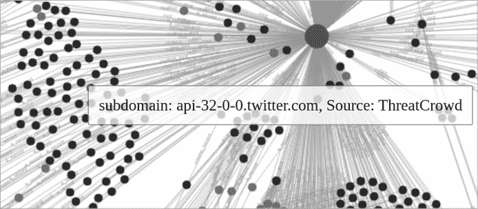

图 6-6：使用 `-d3` 选项对 Amass 发现的结果进行 HTML 导出，以可视化 *t**witter**.com* 的数据

你可以使用此可视化图来查看 DNS 记录类型、不同主机之间的依赖关系以及不同节点之间的关系。在 图 6-6 中，左侧的所有节点是 API 子域名，而大圆圈代表 *twitter.com*。

### GitHub 上公开的信息

无论你的目标是否进行自主开发，检查 GitHub（[`github.com`](https://github.com)）以发现敏感信息泄露都是值得的。开发者使用 GitHub 进行软件项目的协作。在 GitHub 上搜索开放源情报（OSINT）可能揭示你目标的 API 能力、文档和秘密，如管理员级别的 API 密钥、密码和令牌，这些信息可能在攻击过程中非常有用。

首先，在 GitHub 上搜索你目标组织的名称，并搭配可能敏感的信息类型，如“api-key”、“password”或“token”。然后，调查 GitHub 上的各种仓库标签，发现 API 端点和潜在的弱点。分析代码标签中的源代码，在问题标签中查找软件漏洞，并在拉取请求标签中审查提议的更改。

#### 代码

代码标签包含当前的源代码、README 文件和其他文件（见图 6-7）。此标签将提供最近提交该文件的开发者名称、提交时间、贡献者以及实际源代码。

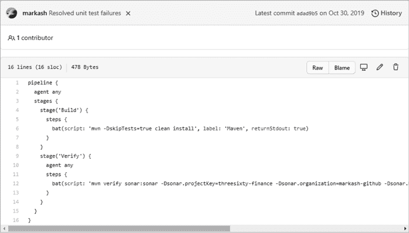

图 6-7：GitHub 代码标签示例，你可以在这里查看不同文件的源代码

使用代码标签，你可以查看当前版本的代码，或者使用 ctrl-F 搜索你感兴趣的术语（如“API”、“key”和“secret”）。此外，通过使用图 6-7 右上角的历史按钮，查看代码的历史提交。如果你遇到了一个问题或评论，导致你认为代码中曾经有过漏洞，你可以查看历史提交，看看这些漏洞是否仍然可见。

查看提交时，使用分屏按钮查看文件版本的并排对比，找出代码更改的确切位置（见图 6-8）。

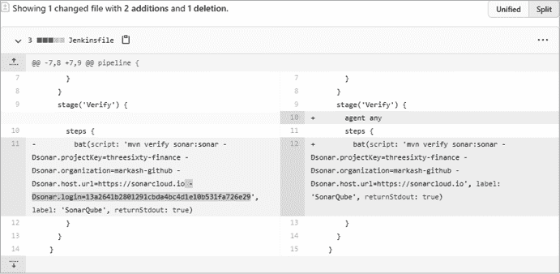

图 6-8：分屏按钮允许你将之前的代码（左侧）与更新后的代码（右侧）分开显示。

在这里，你可以看到对一个金融应用程序的提交，该提交移除了 SonarQube 私有 API 密钥，揭示了该密钥及其使用的 API 端点。

#### 问题

问题标签是开发者跟踪漏洞、任务和功能请求的地方。如果一个问题处于开放状态，那么该漏洞很可能仍然存在于代码中（见图 6-9）。

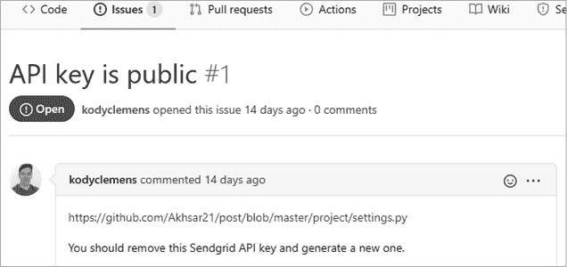

图 6-9：一个公开的 GitHub 问题，提供了暴露的 API 密钥在应用程序代码中的准确位置

如果问题已关闭，请记录该问题的日期，然后查找该时间段内的提交历史，查看是否有相关更改。

#### 拉取请求

拉取请求标签是一个允许开发者协作修改代码的地方。如果你审查这些提议的更改，有时你可能会幸运地发现一个正在解决的 API 泄露问题。例如，在图 6-10 中，开发者已经提交了一个拉取请求，试图从源代码中移除暴露的 API 密钥。

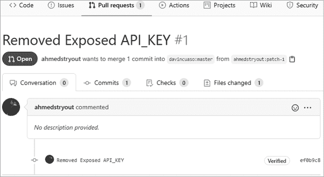

图 6-10：开发者在拉取请求对话中的评论可能会泄露私有 API 密钥。

由于这个更改尚未与代码合并，我们可以清楚地看到在文件更改标签下，API 密钥仍然暴露（见图 6-11）。

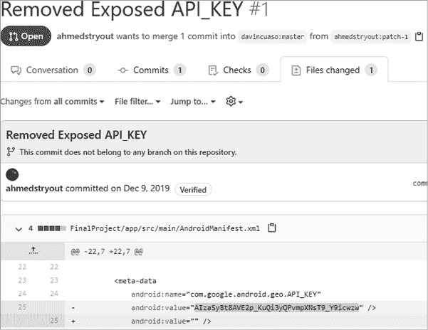

图 6-11：更改文件标签展示了对代码的提议更改。

文件更改标签揭示了开发者尝试更改的代码部分。正如你所看到的，API 密钥在第 25 行；下一行是提议的更改，旨在移除该密钥。

如果你在 GitHub 仓库中没有发现弱点，可以改为用它来建立你的目标资料。记录使用的编程语言、API 端点信息和使用文档，这些都将对你今后的工作大有裨益。

## 主动侦察

执行被动侦察的一个缺点是，你收集的信息来源于间接渠道。作为 API 黑客，验证这些信息的最佳方式是通过端口扫描、漏洞扫描、ping、发送 HTTP 请求、进行 API 调用以及与目标环境的其他交互形式，直接从目标获取信息。

本节将专注于使用检测扫描、实地分析和定向扫描发现组织的 API。章节末的实验将展示这些技术的实际应用。

### 主动侦察过程

本节讨论的主动侦察过程应能有效且彻底地调查目标，揭示任何可以用来访问系统的弱点。每个阶段都利用前一阶段的信息来聚焦：第一阶段，检测扫描，使用自动化扫描来查找运行 HTTP 或 HTTPS 的服务；第二阶段，实地分析，从最终用户和黑客的角度审视这些服务，以找出值得关注的点；第三阶段利用第二阶段的发现，将扫描重点放大，彻底探索已发现的端口和服务。这个过程高效，因为它让你在自动化扫描后台运行的同时，始终与目标进行互动。每当分析遇到瓶颈时，回到自动化扫描中检查是否有新发现。

这个过程不是线性的：在每个逐渐有针对性的扫描阶段之后，你会分析结果，然后利用你的发现进行进一步的扫描。在任何时候，你可能会发现一个漏洞并尝试利用它。如果你成功地利用了漏洞，就可以进入后渗透阶段。如果没有，你则返回到扫描和分析阶段。

#### 零阶段：机会性利用

如果你在任何时候的主动侦察过程中发现漏洞，你应该抓住机会尝试利用它。你可能会在扫描的前几秒钟发现漏洞，或者在偶然发现一个部分开发的网页中的评论时发现漏洞，或者是在几个月的研究后发现漏洞。一旦发现漏洞，就立刻进行利用，然后根据需要返回到分阶段的过程。随着经验的积累，你会学会何时避免迷失在潜在的“兔子洞”中，何时全力以赴进行利用。

#### 第一阶段：检测扫描

检测扫描的目标是揭示潜在的调查起点。首先进行一般性扫描，旨在检测主机、开放端口、运行的服务和当前使用的操作系统，如本章“使用 Nmap 进行基线扫描”部分所述。API 使用 HTTP 或 HTTPS，因此一旦扫描检测到这些服务，允许扫描继续运行并进入第二阶段。

#### 第二阶段：实际分析

实际分析是指使用浏览器和 API 客户端探索 web 应用程序的过程。目标是了解你可以交互的所有潜在杠杆并进行测试。从实际角度出发，你将检查网页、拦截请求、寻找 API 链接和文档，并理解涉及的业务逻辑。

你通常应该从三个角度考虑应用程序：访客、认证用户和网站管理员。*访客* 是匿名用户，可能是第一次访问该站点。如果网站托管的是公共信息且不需要认证用户，它可能只有访客用户。*认证用户* 是经过某种注册流程并被授予一定访问权限的用户。*管理员* 拥有管理和维护 API 的权限。

你的第一步是使用浏览器访问网站，探索网站，并从这些角度考虑它。以下是每个用户群体的一些考虑因素：

1.  访客 新用户如何使用这个网站？新用户可以与 API 进行交互吗？API 文档是公开的吗？这个群体能执行哪些操作？

1.  认证用户 认证后你能做的事情是什么，是作为访客无法做到的？你能上传文件吗？你能探索 web 应用的其他部分吗？你能使用 API 吗？web 应用如何识别用户是否已认证？

1.  管理员在哪里登录以管理 Web 应用程序？页面源代码中有什么内容？各个页面上留下了什么评论？使用了哪些编程语言？网站的哪些部分正在开发或试验中？

接下来，通过使用 Burp Suite 拦截 HTTP 流量来分析应用程序，作为一个黑客。当你使用 Web 应用程序的搜索栏或尝试进行身份验证时，应用程序可能会使用 API 请求来执行请求的操作，你将在 Burp Suite 中看到这些请求。

当你遇到障碍时，是时候审查后台运行的第一阶段扫描的新结果，并启动第三阶段：有针对性扫描。

#### 第三阶段：有针对性扫描

在有针对性的扫描阶段，你要精细化扫描，并使用针对目标的特定工具。而检测扫描是广泛涵盖，有针对性扫描则应专注于特定类型的 API、其版本、Web 应用程序类型、发现的任何服务版本、应用程序是在 HTTP 还是 HTTPS 上运行、任何活动的 TCP 端口，以及从理解业务逻辑中获得的其他信息。例如，如果发现 API 在非标准 TCP 端口上运行，可以设置扫描器更仔细地检查该端口。如果发现 Web 应用程序是用 WordPress 制作的，请检查 WordPress API 是否可以通过访问*/wp-json/wp/v2*来访问。此时，你应该知道 Web 应用程序的 URL，并可以开始使用 Brute-Forcing URIs with Gobuster 章节中描述的方法来查找隐藏的目录和文件。一旦这些工具启动并运行，随着结果的流入，审查结果以进行更有针对性的实际分析。

接下来的章节将描述你在主动侦察的各个阶段中将使用的工具和技术，包括使用 Nmap 进行检测扫描、使用 DevTools 进行实际分析，以及使用 Burp Suite 和 OWASP ZAP 进行有针对性扫描。

### 使用 Nmap 进行基线扫描

Nmap 是一个强大的工具，用于扫描端口、搜索漏洞、枚举服务和发现活跃主机。它是我在第一阶段检测扫描中首选的工具，但我也会用它进行有针对性的扫描。关于 Nmap 的强大功能，你可以在书籍和网站上找到详细介绍，所以我这里就不深入讨论了。

对于 API 的发现，你应该运行两个特定的 Nmap 扫描：通用检测和全端口扫描。Nmap 通用检测扫描使用默认脚本和服务枚举针对目标进行扫描，然后将输出保存在三种格式中供以后审查（`-oX`用于 XML，`-oN`用于 Nmap，`-oG`用于可搜索格式，或`-oA`用于这三种格式）。

```
$ **nmap -sC -sV** `<target address or network range>` **-oA nameofoutput**
```

Nmap 的全端口扫描将快速检查所有 65,535 个 TCP 端口上运行的服务、应用程序版本和正在使用的主机操作系统：

```
$ **nmap -p-** `<target address>` **-oA allportscan**
```

一旦常规检测扫描开始返回结果，启动全端口扫描。然后开始对结果进行实际分析。你很可能通过查看与 HTTP 流量和其他 Web 服务器指示相关的结果来发现 API。通常，你会发现它们运行在端口 80 和 443 上，但 API 可以托管在各种不同的端口上。一旦发现 Web 服务器，打开浏览器并开始分析。

### 寻找隐藏的路径在 robots.txt 文件中

*Robots.txt* 是一个常见的文本文件，告诉网络爬虫忽略搜索引擎的结果。具有讽刺意味的是，它也告诉我们目标网站希望保密的路径。你可以通过导航到目标的 */robots.txt* 目录来找到 *robots.txt* 文件（例如，[`www.twitter.com/robots.txt`](https://www.twitter.com/robots.txt)）。

以下是来自一个活跃 Web 服务器的实际 *robots.txt* 文件，其中包含一个被禁止的 */api/* 路径：

```
User-agent: *
Disallow: /appliance/
Disallow: /login/
Disallow: /api/
Disallow: /files/
```

### 使用 Chrome DevTools 寻找敏感信息

在第四章中，我提到过 Chrome DevTools 包含一些被严重低估的 Web 应用程序黑客工具。以下步骤将帮助你轻松系统地筛选数千行代码，从而在页面源代码中找到敏感信息。

首先打开你的目标页面，然后按 F12 或 ctrl-shift-I 打开 Chrome DevTools。调整 Chrome DevTools 窗口，直到有足够的空间可以进行操作。选择“网络”选项卡，然后刷新页面。

现在，寻找感兴趣的文件（你可能会找到一个名为“API”的文件）。右键点击任何你感兴趣的 JavaScript 文件，并点击 **在源面板中打开**（参见 图 6-12）来查看其源代码。或者，点击 XHR 查看正在发出的 Ajax 请求。

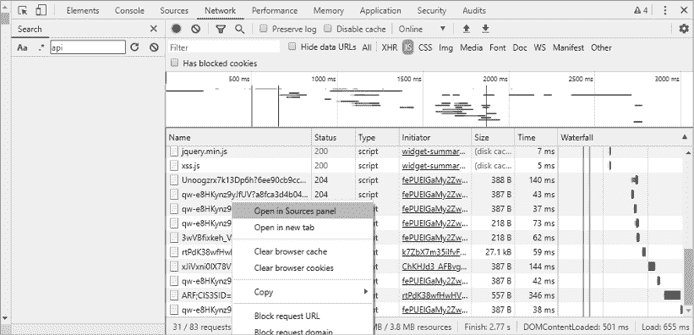

图 6-12：DevTools 网络选项卡中的“在源面板中打开”选项

搜索可能感兴趣的 JavaScript 行。可以搜索的关键字包括“API”、“APIkey”、“secret”和“password”。例如， 图 6-13 演示了你如何发现一个 API，它深埋在一个脚本的近 4,200 行代码中。

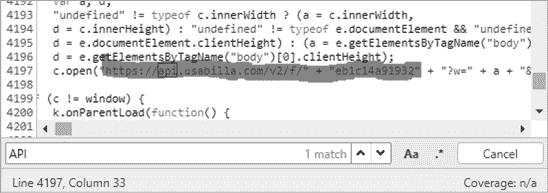

图 6-13：在此页面源代码的第 4,197 行，正在使用一个 API。

你还可以利用 DevTools 的内存选项卡，它可以让你拍摄内存堆分布的快照。有时，静态 JavaScript 文件包含各种信息和数千行代码。换句话说，可能并不完全清楚 Web 应用程序是如何利用 API 的。相反，你可以使用内存面板来记录 Web 应用程序如何使用资源与 API 交互。

打开开发者工具后，点击**内存**标签。在“选择剖析类型”下，选择**堆快照**。然后，在“选择 JavaScript 虚拟机实例”下，选择目标进行查看。接下来，点击**拍摄快照**按钮（参见图 6-14）。

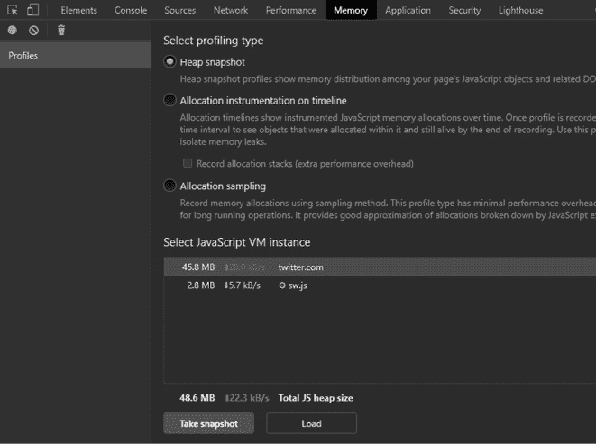

图 6-14：DevTools 中的内存面板

一旦文件在左侧的堆快照部分编译完成，选择新的快照并使用 ctrl-F 搜索潜在的 API 路径。尝试搜索常见的 API 路径术语，如“api”、“v1”、“v2”、“swagger”、“rest”和“dev”。如果你需要更多灵感，可以查看 Assetnote API 字典（[`wordlists.assetnote.io`](http://wordlists.assetnote.io)）。如果你已经按照第四章构建了攻击机器，这些字典应可以通过 */api/wordlists* 获得。图 6-15 展示了在 DevTools 的内存面板中搜索“api”时可能看到的结果。

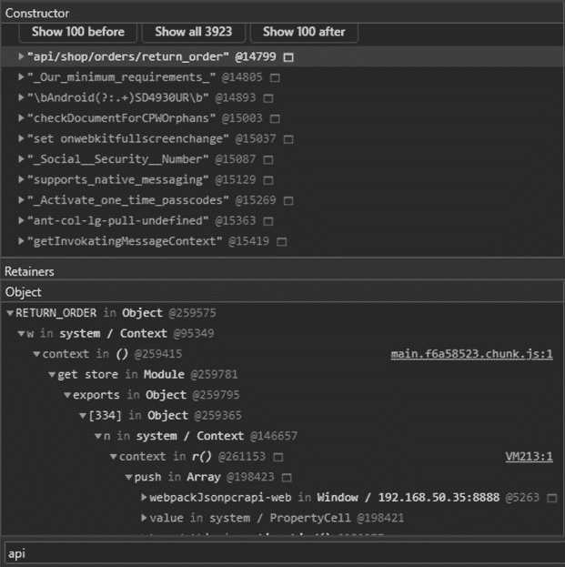

图 6-15：内存快照的搜索结果

如你所见，内存模块可以帮助你发现 API 及其路径。此外，你还可以使用它来比较不同的内存快照。这有助于你看到在认证和未认证状态下、在网页应用的不同部分以及在其不同功能中使用的 API 路径。

最后，使用 Chrome 开发者工具的性能标签页记录某些操作（如点击按钮），并通过一个按毫秒划分的时间轴查看这些操作。这让你能够查看在某个网页上发起的事件是否在后台发送了 API 请求。只需点击圆形的录制按钮，在网页上执行操作，然后停止录制。之后，你可以查看触发的事件并调查已发起的操作。图 6-16 展示了点击网页登录按钮的录制结果。

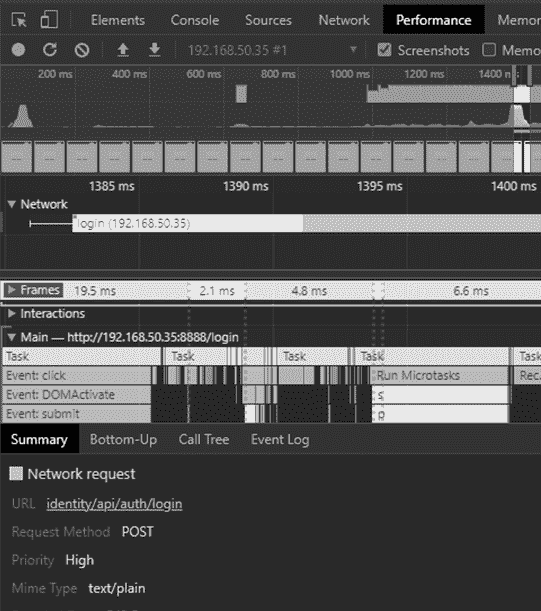

图 6-16：DevTools 中的性能录制

在“主”部分，你可以看到发生了一个点击事件，发起了对 URL */identity/api/auth/login* 的 POST 请求，这清楚地表明你已经发现了一个 API。为了帮助你在时间轴上定位活动，查看位于顶部附近的图表中的峰值和谷值。一个峰值代表一个事件，例如点击。导航到峰值并通过点击时间轴来调查事件。

如你所见，开发者工具充满了强大的工具，可以帮助你发现 API。不要低估它各种模块的实用性。

### 使用 Burp Suite 验证 API

Burp Suite 不仅能帮助你找到 API，还能成为验证你发现的主要工具。要使用 Burp 验证 API，拦截浏览器发送的 HTTP 请求，然后使用“Forward”按钮将其发送到服务器。接着，将请求发送到 Repeater 模块，你可以在此查看原始的 Web 服务器响应（参见图 6-17）。

如你在这个示例中看到的，服务器返回了一个 401 Unauthorized 状态码，这意味着我没有权限使用该 API。将此请求与请求一个不存在的资源进行比较，你会看到目标通常会以某种方式回应不存在的资源。（要请求一个不存在的资源，只需在 Repeater 中的 URL 路径后添加一些无意义的字符，比如*GET /user/test098765*。发送请求并查看 Web 服务器的响应。通常，你会收到 404 或类似的响应。）

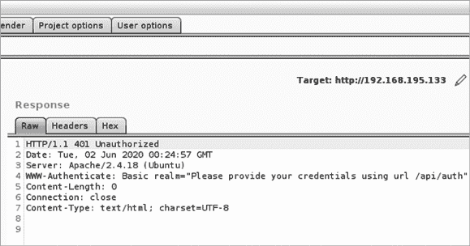

图 6-17：Web 服务器返回 HTTP 401 Unauthorized 错误。

在`WWW-Authenticate`头部找到的详细错误信息揭示了路径*/api/auth*，验证了该 API 的存在。返回第四章，学习如何使用 Burp。

### 使用 OWASP ZAP 爬行 URI

主动侦察的目标之一是发现网页的所有目录和文件，也称为*URI*，即*统一资源标识符*。发现站点 URI 有两种方法：爬行和暴力破解。OWASP ZAP 通过扫描每个页面，查找对其他网页的引用和链接，来爬行网页以发现内容。

要使用 ZAP，打开它并点击跳过会话弹窗。如果它没有被选中，点击图 6-18 中显示的**Quick Start**标签。输入目标 URL 并点击**Attack**。

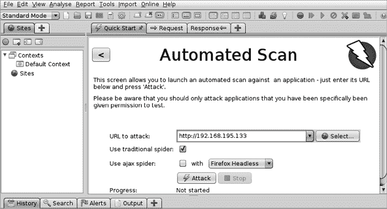

图 6-18：使用 OWASP ZAP 设置自动化扫描以扫描目标

自动化扫描开始后，你可以通过 Spider 或 Sites 标签查看实时结果。在这些标签中，你可能会发现 API 端点。如果没有找到明显的 API，请使用图 6-19 中显示的 Search 标签，并查找诸如“API”、“GraphQL”、“JSON”、“RPC”和“XML”等术语，以寻找潜在的 API 端点。

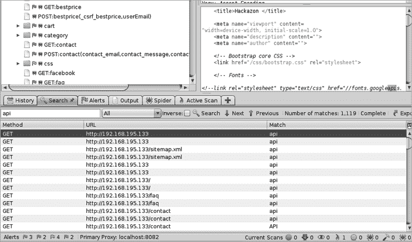

图 6-19：在 ZAP 自动化扫描结果中搜索 API 的强大功能

一旦你找到一个网站部分，想要更深入地调查，就开始使用 ZAP HUD 进行手动探索，与你的 Web 应用程序的按钮和用户输入字段互动。在此过程中，ZAP 会执行额外的漏洞扫描。导航到**快速开始**选项卡并选择**手动探索**（你可能需要点击返回箭头以退出自动扫描）。在手动探索屏幕上，如图 6-20 所示，选择你想要的浏览器，然后点击**启动浏览器**。

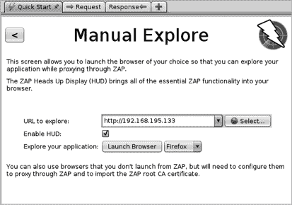

图 6-20：启动 Burp Suite 手动探索选项

ZAP HUD 应该已经启用。在 ZAP HUD 欢迎屏幕中点击**继续到你的目标**（见图 6-21）。

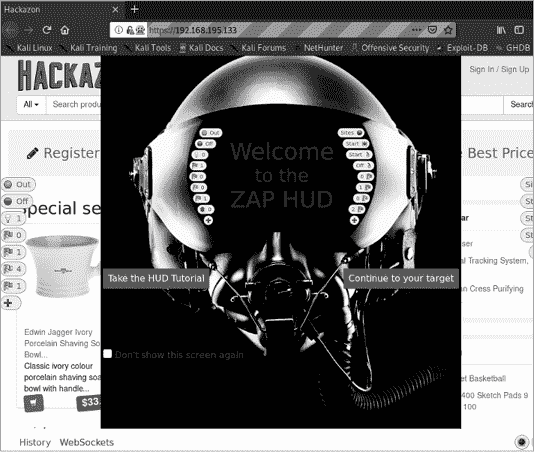

图 6-21：这是你启动 ZAP HUD 时看到的第一个屏幕。

现在你可以手动探索目标 Web 应用程序，同时 ZAP 会在后台自动扫描漏洞。此外，ZAP 在你浏览网站时会继续搜索其他路径。浏览器的左右边框现在应该有几个按钮。彩色标旗代表页面警报，这些可能是漏洞发现或有趣的异常。这些标记的警报将在你浏览网站时更新。

### 使用 Gobuster 进行暴力破解 URI

Gobuster 可以用来从命令行暴力破解 URI 和 DNS 子域名。（如果你更喜欢图形用户界面，可以查看 OWASP 的 Dirbuster。）在 Gobuster 中，你可以使用常见目录和子域名的字典，自动请求字典中的每一项，发送这些项目到 Web 服务器，并过滤有趣的服务器响应。Gobuster 生成的结果将为你提供 URL 路径和 HTTP 状态响应代码。（虽然你可以使用 Burp Suite 的 Intruder 进行 URI 的暴力破解，但 Burp Community 版本比 Gobuster 慢得多。）

每当你使用暴力破解工具时，都需要平衡字典的大小和完成结果所需的时间。Kali 在 */usr/share/wordlists/dirbuster* 下存储了目录字典，这些字典非常全面，但需要一些时间才能完成。你也可以使用我们在第四章中设置的 *~/api/wordlists*，它会加速你的 Gobuster 扫描，因为该字典相对较短，并且只包含与 API 相关的目录。

以下示例使用一个特定于 API 的字典来查找 IP 地址上的目录：

```
$ **gobuster dir -u http://192.168.195.132:8000 -w /home/hapihacker/api/wordlists/common_apis_160**
========================================================
Gobuster
by OJ Reeves (@TheColonial) & Christian Mehlmauer (@firefart)
========================================================
[+] Url:                     http://192.168.195.132:8000
[+] Method:                  GET
[+] Threads:                 10
[+] Wordlist:                /home/hapihacker/api/wordlists/common_apis_160
[+] Negative Status codes:   404
[+] User Agent:              gobuster
[+] Timeout:                 10s
========================================================
09:40:11 Starting gobuster in directory enumeration mode
========================================================
/api                  (Status: 200) [Size: 253]
/admin                (Status: 500) [Size: 1179]
/admins               (Status: 500) [Size: 1179]
/login                (Status: 200) [Size: 2833]
/register             (Status: 200) [Size: 2846]
```

一旦你找到像此输出中显示的*/api*目录这样的 API 目录，无论是通过爬虫还是暴力破解，你都可以使用 Burp 进一步调查它们。Gobuster 还有更多选项，你可以通过使用 `-h` 选项来列出它们：

```
$ **gobuster dir -h**
```

如果你想忽略某些响应状态码，可以使用 `-b` 选项。如果你想查看其他状态码，可以使用 `-x`。你可以通过以下方式增强 Gobuster 搜索：

```
$ **gobuster dir -u http://targetaddress/ -w /usr/share/wordlists/api_list/common_apis_160 -x 200,202,301 -b 302**
```

Gobuster 提供了一种快速枚举活动 URL 和查找 API 路径的方法。

### 使用 Kiterunner 发现 API 内容

在第四章中，我介绍了 Assetnote 的 Kiterunner，这是一款发现 API 端点和资源的最佳工具。现在是时候将这款工具投入使用了。

虽然 Gobuster 非常适合快速扫描 Web 应用程序以发现 URL 路径，但它通常依赖于标准的 HTTP GET 请求。Kiterunner 不仅会使用所有常见的 API HTTP 请求方法（GET、POST、PUT 和 DELETE），还会模仿常见的 API 路径结构。换句话说，Kiterunner 会尝试 POST *POST /api/v1/user/create*，而不是请求 GET */api/v1/user/create*，更真实地模拟请求。

你可以像这样快速扫描目标的 URL 或 IP 地址：

```
$ **kr scan http://192.168.195.132:8090 -w ~/api/wordlists/data/kiterunner/routes-large.kite**

+----------------------+------------------------------------------------------------------------------------------+-------------------------------------------------------------------
| SETTING              | VALUE                                                                |
+----------------------+------------------------------------------------------------------------------------------+-------------------------------------------------------------------
| delay                | 0s                                                                   |
| full-scan            | false                                                                |
| full-scan-requests   | 1451872                                                              |
| headers              | [x-forwarded-for:127.0.0.1]                                          |
| kitebuilder-apis     | [/home/hapihacker/api/wordlists/data/kiterunner/routes-large.kite]   |
| max-conn-per-host    | 3                                                                    |
| max-parallel-host    | 50                                                                   |
| max-redirects        | 3                                                                    |
| max-timeout          | 3s                                                                   |
| preflight-routes     | 11                                                                   |
| quarantine-threshold | 10                                                                   |
| quick-scan-requests  | 103427                                                               |
| read-body            | false                                                                |
| read-headers         | false                                                                |
| scan-depth           | 1                                                                    |
| skip-preflight       | false                                                                |
| target               | http://192.168.195.132:8090                                          |
| total-routes         | 957191                                                               |
| user-agent           | Chrome. Mozilla/5.0 (Macintosh; Intel Mac OS X 10_15_7) AppleWebKit/537.36 (KHTML, like Gecko) Chrome/88.0.4324.96 Safari/537.36                      |
+----------------------+-----------------------------------------------------------------------

POST    400 [    941,   46,  11] http://192.168.195.132:8090/trade/queryTransationRecords 0cf689f783e6dab12b6940616f005ecfcb3074c4
POST    400 [    941,   46,  11] http://192.168.195.132:8090/event 0cf6890acb41b42f316e86efad29ad69f54408e6
GET     301 [    243,    7,  10] http://192.168.195.132:8090/api-docs -> /api-docs/?group=63578528&route=33616912 0cf681b5cf6c877f2e620a8668a4abc7ad07e2db
```

如你所见，Kiterunner 会提供一份有趣的路径列表。服务器对某些 */api/* 路径的响应不同，表明该 API 存在。

注意，我们在没有任何授权头的情况下进行了此扫描，而目标 API 可能需要授权头。接下来，我将在第七章演示如何在使用 Kiterunner 时加入授权头。

如果你想使用文本字典而不是 *.kite* 文件，可以使用 `brute` 选项，并选择你想要的文本文件：

```
$ **kr brute** `<target>` **-w ~/api/wordlists/data/automated/nameofwordlist.txt**
```

如果你有多个目标，可以将目标列表保存为行分隔的文本文件，并将该文件用作目标。你可以使用以下任一行分隔的 URI 格式作为输入：

1.  *Test.com*

1.  *Test2.com:443*

1.  *http://test3.com*

1.  *http://test4.com*

1.  *http://test5.com:8888/api*

Kiterunner 最酷的功能之一是能够重放请求。因此，你不仅能得到一个有趣的结果进行调查，还能深入剖析该请求为何有趣。要重放请求，只需将整行内容复制到 Kiterunner 中，使用 `kb replay` 选项粘贴，并包含你使用的字典：

```
$ **kr kb replay "GET     414 [    183,    7,   8] http://192.168.50.35:8888/api/privatisations/count 0cf6841b1e7ac8badc6e237ab300a90ca873d571" -w ~/api/wordlists/data/kiterunner/routes-large.kite**
```

运行此命令会重放请求并提供 HTTP 响应。然后你可以检查响应内容，看看是否有值得调查的地方。我通常会审查有趣的结果，然后转向使用 Postman 和 Burp Suite 测试它们。

## 总结

在本章中，我们深入实践了如何使用被动和主动侦察发现 API。信息收集可以说是黑客攻击 API 最重要的部分，原因有几点。首先，如果找不到 API，你是无法攻击它的。被动侦察将为你提供有关组织的公开曝光和攻击面的一些见解。你可能会发现一些简单的漏洞，例如密码、API 密钥、API 令牌和其他信息泄露漏洞。

接下来，积极地与客户的环境互动，将揭示其 API 的当前操作上下文，例如托管 API 的服务器操作系统、API 版本、API 类型、所使用的支持软件版本、API 是否易受已知漏洞攻击、系统的预期用途以及它们如何协同工作。

在下一章，你将开始操作和模糊测试 API 以发现漏洞。

## 实验#3：为黑盒测试执行主动侦察

你的公司收到了知名汽车服务公司 crAPI Car Services 的委托，该公司希望你进行 API 渗透测试。在一些合作中，客户会提供像 IP 地址、端口号，甚至可能是 API 文档的详细信息。然而，crAPI 希望进行黑盒测试。公司希望你能找到它的 API，并最终测试是否存在任何漏洞。

在继续之前，确保你的 crAPI 实验实例已启动并运行。使用你的 Kali API 黑客机，首先发现 API 的 IP 地址。我的 crAPI 实例位于*192.168.50.35*。要发现你本地部署实例的 IP 地址，运行`netdiscover`，然后通过在浏览器中输入 IP 地址来确认你的发现。一旦你有了目标地址，使用 Nmap 进行常规检测扫描。

从常规 Nmap 扫描开始，了解你所面对的情况。如前所述，`nmap -sC -sV 192.168.50.35 -oA crapi_scan`通过使用服务枚举和默认的 Nmap 脚本扫描目标，并将结果保存为多种格式以供后续查看。

```
Nmap scan report for 192.168.50.35
Host is up (0.00043s latency).
Not shown: 994 closed ports
PORT     STATE SERVICE    VERSION
1025/tcp open  smtp       Postfix smtpd
|_smtp-commands: Hello nmap.scanme.org, PIPELINING, AUTH PLAIN,
5432/tcp open  postgresql PostgreSQL DB 9.6.0 or later
| fingerprint-strings:
|   SMBProgNeg:
|     SFATAL
|     VFATAL
|     C0A000
|     Munsupported frontend protocol 65363.19778: server supports 2.0 to 3.0
|     Fpostmaster.c
|     L2109
|_    RProcessStartupPacket
8000/tcp open  http-alt   WSGIServer/0.2 CPython/3.8.7
| fingerprint-strings:
|   FourOhFourRequest:
|     HTTP/1.1 404 Not Found
|     Date: Tue, 25 May 2021 19:04:36 GMT
|     Server: WSGIServer/0.2 CPython/3.8.7
|     Content-Type: text/html
|     Content-Length: 77
|     Vary: Origin
|     X-Frame-Options: SAMEORIGIN
|     <h1>Not Found</h1><p>The requested resource was not found on this server.</p>
|   GetRequest:
|     HTTP/1.1 404 Not Found
|     Date: Tue, 25 May 2021 19:04:31 GMT
|     Server: WSGIServer/0.2 CPython/3.8.7
|     Content-Type: text/html
|     Content-Length: 77
|     Vary: Origin
|     X-Frame-Options: SAMEORIGIN
|     <h1>Not Found</h1><p>The requested resource was not found on this server.</p>
```

这个 Nmap 扫描结果显示，目标有多个开放端口，包括 1025、5432、8000、8080、8087 和 8888。Nmap 提供了足够的信息，让你知道端口 1025 正在运行 SMTP 邮件服务，端口 5432 是 PostgreSQL 数据库，剩余的端口收到了 HTTP 响应。Nmap 扫描还揭示了 HTTP 服务正在使用 CPython、WSGIServer 和 OpenResty Web 应用服务器。

注意来自 8080 端口的响应，其头信息表明这是一个 API：

```
Content-Type: application/json and "error": "Invalid Token" }.
```

在进行常规 Nmap 扫描后，进行全端口扫描，以查看是否有隐藏在非常规端口上的内容：

```
$ **nmap -p- 192.168.50.35**

Nmap scan report for 192.168.50.35
Host is up (0.00068s latency).
Not shown: 65527 closed ports
PORT      STATE SERVICE
1025/tcp  open  NFS-or-IIS
5432/tcp  open  postgresql
8000/tcp  open  http-alt
8025/tcp  open  ca-audit-da
8080/tcp  open  http-proxy
8087/tcp  open  simplifymedia
8888/tcp  open  sun-answerbook
27017/tcp open  mongod
```

全端口扫描发现 MailHog Web 服务器运行在 8025 端口，而 MongoDB 则运行在非常规端口 27017。这些可能在我们稍后的实验中尝试利用 API 时派上用场。

初始 Nmap 扫描的结果显示，端口 8080 上运行着一个 Web 应用程序，这应该是下一个合乎逻辑的步骤：对 Web 应用程序进行动手分析。访问所有向 Nmap 发送 HTTP 响应的端口（即端口 8000、8025、8080、8087 和 8888）。

对我来说，这意味着在浏览器中输入以下地址：

1.  *http://192.168.50.35:8000*

1.  *http://192.168.50.35:8025*

1.  *http://192.168.50.35:8080*

1.  *http://192.168.50.35:8087*

1.  *http://192.168.50.35:8888*

端口 8000 返回了一个空白网页，显示消息“请求的资源在此服务器上未找到”。

端口 8025 显示了 MailHog Web 服务器，内容为“欢迎使用 crAPI”的邮件。我们将在后续实验中回到这个问题。

端口 8080 返回了我们在第一次 Nmap 扫描中收到的 `{ "error": "Invalid Token" }`。

端口 8087 显示“404 页面未找到”错误。

最后，端口 8888 显示了 crAPI 登录页面，如图 6-22 所示。

由于授权相关的错误和信息，开放端口对你作为已认证用户可能更有用。

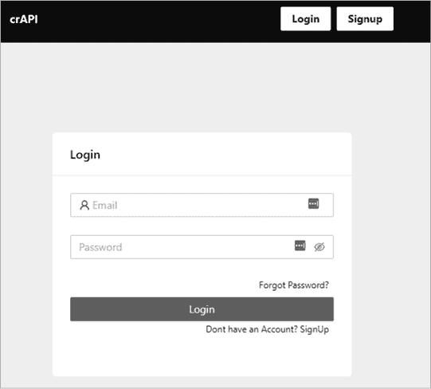

图 6-22：crAPI 登录页面

现在，使用 DevTools 调查该页面上的 JavaScript 源文件。访问网络（Network）选项卡并刷新页面，以便源文件加载。选择一个你感兴趣的源文件，右键点击并将其发送到源面板（Sources panel）。

你应该查找 */static/js/main.f6a58523.chunk.js* 源文件。在此文件中搜索“API”，你将找到 crAPI API 端点的引用（见图 6-23）。

恭喜你！你已经使用 Chrome DevTools 通过主动侦察发现了你的第一个 API。只需通过浏览源文件，你就找到了许多独特的 API 端点。

现在，如果你查看源文件，你应该能注意到与注册过程相关的 API。作为下一步，拦截这些请求以查看 API 的实际操作是个不错的主意。在 crAPI 网页上，点击**注册**按钮。填写姓名、电子邮件、电话和密码字段。然后，在点击页面底部的注册按钮之前，启动 Burp Suite 并使用 FoxyProxy Hackz 代理拦截你的浏览器流量。一旦 Burp Suite 和 Hackz 代理运行起来，点击**注册**按钮。

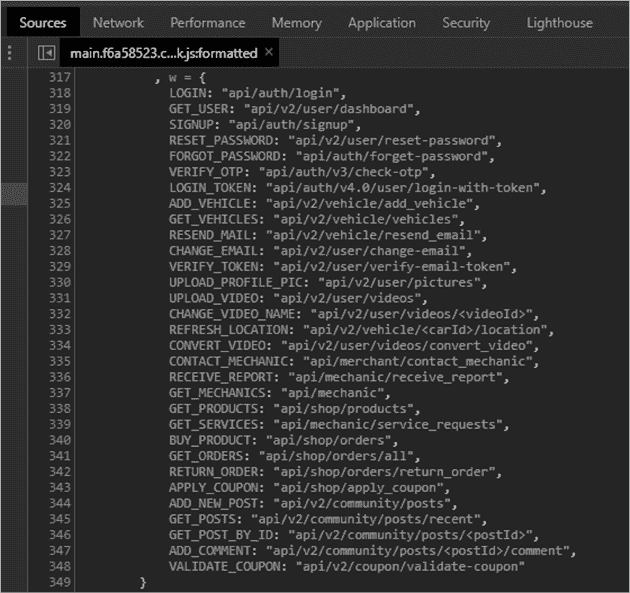

图 6-23：crAPI 主 JavaScript 源文件

在图 6-24 中，你可以看到，当你注册新账户时，crAPI 注册页面会向 */identity/api/auth/signup* 发出 POST 请求。这个请求在 Burp 中被捕获，验证了你发现了 crAPI API 的存在，并首次确认了已识别端点的一个功能。

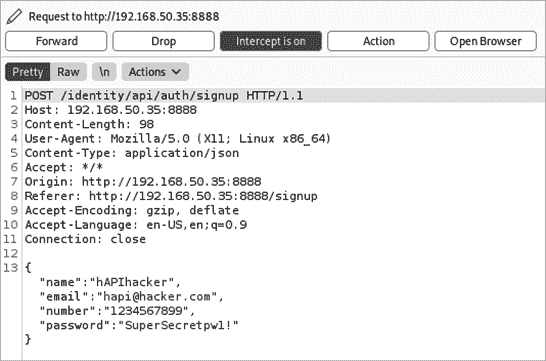

图 6-24：使用 Burp Suite 拦截的 crAPI 注册请求

干得好！你不仅发现了一个 API，还找到了与之交互的方式。在我们的下一个实验中，你将与这个 API 的功能进行交互，并识别它的弱点。我鼓励你继续测试其他工具，看看能否找到更多的 API。你能通过其他方式发现 API 吗？
