# 9

模糊测试


在本章中，你将探索使用模糊测试技术来发现第三章中讨论的几个顶级 API 漏洞。成功发现大多数 API 漏洞的关键是知道在哪些地方进行模糊测试，以及用什么进行模糊测试。实际上，你很可能通过对 API 端点发送输入的模糊测试发现许多 API 漏洞。

使用 Wfuzz、Burp Suite Intruder 和 Postman 的 Collection Runner，我们将介绍两种提高成功率的策略：广泛模糊测试和深度模糊测试。我们还将讨论如何通过模糊测试寻找不当的资产管理漏洞，找到请求的接受 HTTP 方法，并绕过输入净化。

## 有效的模糊测试

在前几章中，我们将 API 模糊测试定义为向端点发送各种类型的输入请求，以引发非预期的结果。虽然“各种类型的输入”和“非预期的结果”听起来可能有些模糊，但这仅仅是因为可能性太多。你的输入可能包括符号、数字、表情符号、小数、十六进制、系统命令、SQL 输入和 NoSQL 输入等。例如，如果 API 没有实施验证检查来处理有害输入，你可能会得到冗长的错误、独特的响应，或者（最坏的情况）某种内部服务器错误，表明你的模糊测试导致了服务拒绝，导致应用程序崩溃。

成功的模糊测试需要仔细考虑应用程序可能的期望。例如，考虑一个银行 API 调用，目的是允许用户从一个账户转账到另一个账户。该请求可能看起来像这样：

```
POST /account/balance/transfer
Host: bank.com
x-access-token: hapi_token

{
"userid": 12345,
"account": 224466,
"transfer-amount": 1337.25,
}
```

要对这个请求进行模糊测试，你可以轻松地设置 Burp Suite 或 Wfuzz 提交巨大的有效载荷作为 `userid`、`account` 和 `transfer-amount` 的值。然而，这可能会触发防御机制，导致更强的速率限制或你的令牌被封锁。如果 API 没有这些安全控制，尽管放开手脚去做。否则，你最好的选择是一次只向其中一个值发送几个有针对性的请求。

请考虑 `transfer-amount` 值可能期望一个相对较小的数字。Bank.com 并不预计用户会转账超过全球 GDP 的金额。它也很可能期望一个小数值。因此，你可能想评估发送以下内容时会发生什么：

+   数值达到千万亿

+   字母串而非数字

+   一个大数值或负数

+   空值，如 `null`、`(null)`、`%00` 和 `0x00`

+   类似以下符号：`!@#$%^&*();':''|,./?>`

这些请求可能会导致冗长的错误信息，暴露更多关于应用程序的细节。数值达到千万亿时，还可能导致未处理的 SQL 数据库错误作为响应返回。这一条信息可能帮助你识别 API 中的 SQL 注入漏洞。

因此，模糊测试的成功将取决于你进行模糊测试的位置以及你使用的模糊测试内容。关键是寻找 API 输入，这些输入供消费者与应用程序交互，并发送可能导致错误的输入。如果这些输入没有足够的输入处理和错误处理，它们通常会导致漏洞利用。这类 API 输入的示例包括用于认证表单、账户注册、上传文件、编辑 Web 应用内容、编辑用户信息、编辑账户信息、用户管理、搜索内容等请求中涉及的字段。

发送的输入类型实际上取决于你攻击的输入类型。一般来说，你可以发送各种符号、字符串和数字，这些可能会导致错误，然后你可以根据收到的错误来调整攻击方法。以下所有内容都可能导致有趣的响应：

+   当预期为小数字时发送异常大的数字

+   发送数据库查询、系统命令和其他代码

+   当预期为数字时发送一串字母

+   当预期为短字符串时发送一串长字母

+   发送各种符号（`-_\!@#$%^&*();':''|,./?>`）

+   发送来自意外语言的字符（漢, さ, Ж, Ѫ, Ѭ, Ѧ, Ѩ, Ѯ）

如果在模糊测试过程中被阻止或禁止，你可能需要部署第十三章中讨论的规避技术，或者进一步限制你发送的模糊请求数量。

### 选择模糊测试有效负载

不同的模糊测试有效负载可以引发不同类型的响应。你可以使用通用的模糊测试有效负载，也可以使用更有针对性的模糊测试有效负载。*通用有效负载*是我们到目前为止讨论的内容，包含符号、空字节、目录遍历字符串、编码字符、大数字、长字符串等。

*针对性*模糊测试有效负载旨在针对特定技术和漏洞类型引发响应。针对性模糊测试有效负载可能包括 API 对象或变量名称、跨站脚本（XSS）有效负载、目录、文件扩展名、HTTP 请求方法、JSON 或 XML 数据、SQL 或 NoSQL 命令，或者特定操作系统的命令。在本章及未来章节中，我们将介绍使用这些有效负载的模糊测试示例。

通常，你会根据 API 响应中收到的信息，从通用模糊测试转向更具针对性的模糊测试。类似于第六章中的侦察工作，你需要根据通用测试的结果调整模糊测试并集中精力。知道使用的技术后，针对性的模糊测试有效性更强。如果你向一个只使用 NoSQL 数据库的 API 发送 SQL 模糊测试有效负载，那么你的测试将不会那么有效。

模糊测试负载的最佳来源之一是 SecLists（[`github.com/danielmiessler/SecLists`](https://github.com/danielmiessler/SecLists)）。SecLists 有一个专门的模糊测试部分，其*big-list-of-naughty-strings.txt*词表在引发有用响应方面表现出色。fuzzdb 项目是另一个很好的模糊测试负载来源（[`github.com/fuzzdb-project/fuzzdb`](https://github.com/fuzzdb-project/fuzzdb)）。此外，Wfuzz 也有许多有用的负载（[`github.com/xmendez/wfuzz`](https://github.com/xmendez/wfuzz)），其中包括一个很棒的列表，结合了多个目标负载，位于其注入目录中，名为*All_attack.txt*。

此外，你可以快速轻松地创建自己的通用模糊测试负载列表。在文本文件中，结合符号、数字和字符，将每个负载作为以换行符分隔的条目创建，像这样：

1.  `AAAAAAAAAAAAAAAAAAAAAAAAAAAAAAAAAAAAAAAA`

1.  `9999999999999999999999999999999999999999`

1.  `~'!@#$%^&*()-_+`

1.  `{}[]|\:''; '<>?,./`

1.  `%00`

1.  `0x00`

1.  `$ne`

1.  `%24ne`

1.  `$gt`

1.  `%24gt`

1.  `|whoami`

1.  `-- -`

1.  `' ''`

1.  `' OR 1=1-- -`

1.  `'' ''''''`

1.  `漢, さ, Ж, Ѫ, Ѭ, Ѧ, Ѩ, Ѯ`

1.  😀 😃 😄 😁 😆

请注意，与你使用 40 个`A`或`9`的情况不同，你可以编写包含成百上千个这些字符的负载。像这样的简单列表作为模糊测试负载，可能会从 API 中引发各种有用和有趣的响应。

### 检测异常

在进行模糊测试时，你的目标是让 API 或其支持的技术发送信息给你，这些信息可以被用来进行进一步的攻击。当 API 请求负载被正确处理时，你应该收到某种 HTTP 响应代码和消息，表明你的模糊测试未能成功。例如，当预期接收数字时，发送一串字母可能会导致如下简单的响应：

```
HTTP/1.1 400 Bad Request
{
        "error": "number required"
}
```

从这个响应中，你可以推断出开发者已配置 API 来正确处理像你这样的请求，并准备了一个定制的响应。

当输入未正确处理并导致错误时，服务器通常会在响应中返回该错误。例如，如果你向一个处理不当的端点发送了类似`~'!@#$%^&*()-_+`的输入，你可能会收到类似下面的错误：

```
HTTP/1.1 200 OK
`--snip--`

SQL Error: There is an error in your SQL syntax.
```

这个响应立刻揭示了你正在与一个未正确处理输入的 API 请求交互，并且该应用程序的后端正在使用 SQL 数据库。

通常，你将分析数百或数千个响应，而不仅仅是两个或三个。因此，你需要过滤响应以便检测异常。做到这一点的一种方法是了解普通响应的样子。你可以通过发送一组预期的请求来建立这个基准，或者如你稍后在实验中看到的那样，发送你预计会失败的请求。然后，你可以查看结果，看看大多数是否是相同的。例如，如果你发出 100 个 API 请求，其中 98 个返回 HTTP 200 响应码且响应大小相似，你可以将这些请求视为基准。同时，检查一些基准响应的内容，以了解它们的内容。一旦你知道基准响应已被正确处理，再检查两个异常响应。找出导致差异的输入，特别关注 HTTP 响应码、响应大小和响应内容。

在某些情况下，基准请求和异常请求之间的差异可能微乎其微。例如，HTTP 响应码可能完全相同，但某些请求的响应大小可能比基准响应大几字节。当出现这样的小差异时，使用 Burp Suite 的比较器来进行响应差异的并排比较。右键点击你感兴趣的结果并选择**发送到比较器（响应）**。你可以将任意多个响应发送到比较器，但至少需要发送两个。然后切换到比较器标签，如图 9-1 所示。


图 9-1：Burp Suite 的比较器

选择你想要比较的两个结果，并使用**比较单词**按钮（位于窗口右下角）来显示响应的并排比较（参见图 9-2）。

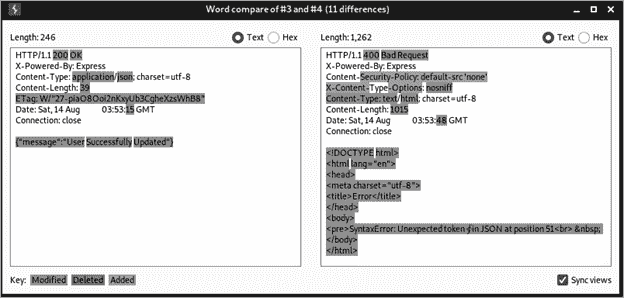

图 9-2：使用比较器比较两个 API 响应

一个位于右下角的有用选项，称为“同步视图”（Sync Views），将帮助你同步两个响应。当你在寻找大响应中的细微差异时，Sync Views 特别有用，因为它会自动突出显示两个响应之间的差异。这些高亮标记表示差异是否已被修改、删除或添加。

## 模糊测试广泛与深入

本节将向你介绍两种模糊测试技术：广泛模糊测试和深入模糊测试。*广泛模糊测试*是指将输入发送到 API 的所有独特请求，以尝试发现漏洞。*深入模糊测试*是指对单个请求进行彻底测试，使用各种输入替换请求中的头部、参数、查询字符串、端点路径和请求体。你可以将广泛模糊测试理解为测试一英里宽但只有一英寸深，而深入模糊测试则是测试一英寸宽但有一英里深。

广泛和深入的模糊测试可以帮助你充分评估大型 API 的每个功能。当你进行黑客攻击时，你会很快发现 API 的规模差异很大。某些 API 可能只有几个端点和少数独特的请求，因此你可以通过发送少量请求轻松进行测试。然而，一个 API 可能有许多端点和独特的请求。此外，单个请求可能包含许多头部和参数。

这就是两种模糊测试技术发挥作用的地方。广泛模糊测试最适合用于测试所有独特请求中的问题。通常，你可以使用广泛模糊测试来检测不当的资产管理（稍后在本章中详细讨论），查找所有有效的请求方法、令牌处理问题和其他信息泄露漏洞。深入模糊测试最适合用于测试单个请求的多个方面。其他大多数漏洞发现将通过深入模糊测试完成。在后续章节中，我们将使用深入模糊测试技术发现不同类型的漏洞，包括 BOLA、BFLA、注入漏洞和批量赋值漏洞。

### 使用 Postman 进行广泛模糊测试

我推荐使用 Postman 进行广泛的模糊测试，以检查 API 中的漏洞，因为该工具的集合运行器使得对所有 API 请求进行测试变得容易。如果一个 API 包含 150 个独特的请求，你可以设置一个变量为模糊测试载荷，并在所有 150 个请求中进行测试。当你已经构建了一个集合或将 API 请求导入到 Postman 时，这样做尤其简单。例如，你可以使用此策略来测试是否有任何请求未能处理各种“坏”字符。发送一个单一的载荷到整个 API，并检查是否有异常。

创建一个 Postman 环境，用于保存一组模糊测试变量。这样，你就可以无缝地将环境变量从一个集合传递到下一个集合。一旦设置了模糊测试变量，就像在图 9-3 中所示，你可以保存或更新该环境。

在右上角选择模糊测试环境，然后在任何你希望测试值的地方使用变量快捷方式 `{{``变量名``}}`。在图 9-4 中，我将 `x-access-token` 头部替换为第一个模糊测试变量。

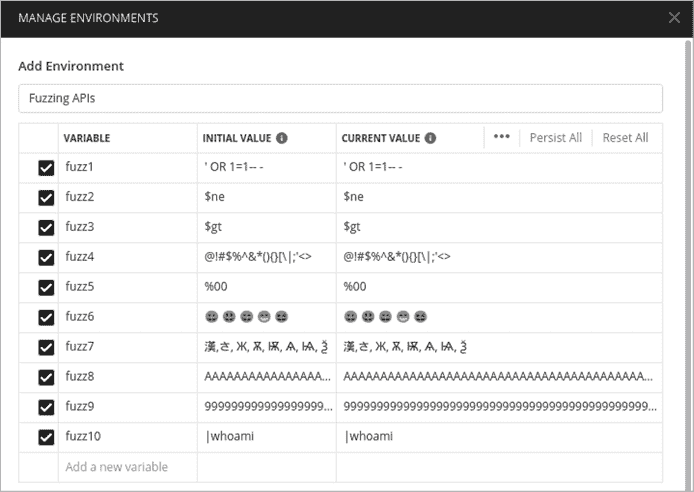

图 9-3：在 Postman 环境编辑器中创建模糊测试变量

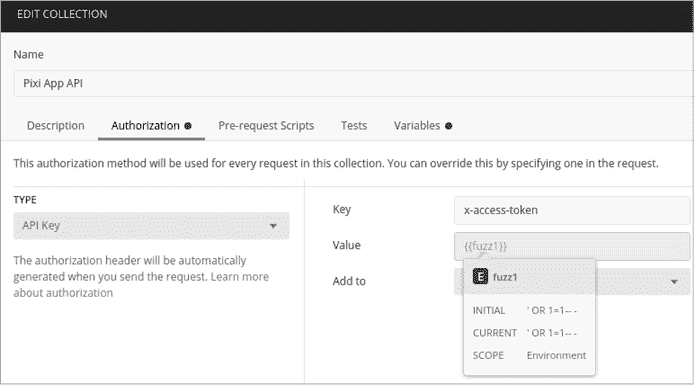

图 9-4：对集合令牌头进行模糊测试

此外，你还可以替换 URL 中的部分内容、其他头部，或你在集合中设置的任何自定义变量。然后，你使用集合运行器来测试集合中的每个请求。

另一个在广泛模糊测试时有用的 Postman 特性是“查找和替换”，它位于 Postman 左下角。查找和替换让你搜索集合（或所有集合），并将某些术语替换为你选择的替代项。例如，如果你正在攻击 Pixi API，你可能会注意到许多占位符参数使用像 `<email>`、`<number>`、`<string>` 和 `<boolean>` 这样的标签。这使得搜索这些值并将其替换为合法值或你的一些模糊测试变量（如 `{{fuzz1}}`）变得非常容易。

接下来，尝试在“Tests”面板中创建一个简单的测试，帮助你检测异常。例如，你可以设置第四章中提到的测试，检查集合中的所有请求是否返回状态码 200：

```
pm.test("Status code is 200", function () {
    pm.response.to.have.status(200);
});
```

在这个测试中，Postman 将检查响应是否返回状态码 200，当响应为 200 时，它将通过测试。你可以通过将 200 替换为你喜欢的状态码来轻松定制这个测试。

启动集合运行器有几种方式。你可以点击 **Runner Overview** 按钮、集合旁边的箭头，或点击 **Run** 按钮。如前所述，你需要通过发送没有值或预期值的请求到目标字段，来开发一个正常响应的基线。获得这样的基线的一种简单方法是取消勾选 **Keep Variable Values** 复选框。关闭此选项后，变量将在第一次集合运行时不会被使用。

当我们使用原始请求值运行这个示例集合时，13 个请求通过了状态码测试，5 个请求失败了。这并不奇怪。失败的 5 次尝试可能缺少参数或其他输入值，或者它们的响应代码不是 200。在我们没有做额外修改的情况下，这个测试结果可以作为基准。

现在让我们尝试对集合进行模糊测试。确保你的环境设置正确，响应已保存以供审查，**Keep Variable Values** 选项已选中，并且任何生成新令牌的响应都已禁用（我们可以使用深度模糊测试技术测试这些请求）。在 图 9-5 中，你可以看到这些设置已应用。

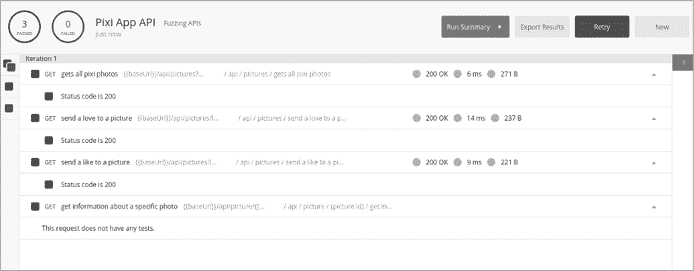

图 9-5：Postman 集合运行器结果

运行集合后，查看是否有偏离基准响应的情况。还要注意请求行为的变化。例如，当我们使用值`Fuzz1('OR 1=1-- -)`运行请求时，集合运行器通过了三次测试，然后未能处理任何额外请求。这表明 Web 应用程序对第四个请求中的模糊尝试产生了问题。虽然我们没有收到有趣的响应，但行为本身表明你可能发现了一个漏洞。

一旦你循环完成一次集合运行，更新模糊值为下一个你想测试的变量，执行另一次集合运行，并比较结果。你可以通过在 Postman 中广泛进行模糊测试来发现几个漏洞，比如不当的资产管理、注入漏洞以及其他可能导致更有趣发现的信息泄露。当你耗尽了广泛模糊测试的尝试或发现了有趣的响应时，是时候将测试转向深入模糊测试了。

### 使用 Burp Suite 进行深入模糊测试

当你想要深入分析特定请求时，应该进行深入模糊测试。这项技术对于彻底测试每个单独的 API 请求尤其有用。对于这个任务，我建议使用 Burp Suite 或 Wfuzz。

在 Burp Suite 中，你可以使用 Intruder 对每个头部、参数、查询字符串和端点路径进行模糊测试，以及请求体中包含的任何项。例如，在如图 9-6 所示的 Postman 请求中，请求体包含许多字段，你可以进行深入的模糊测试，将成百上千的模糊输入传入每个值，以查看 API 如何响应。

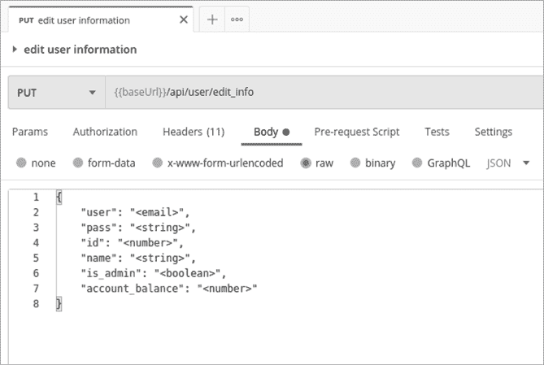

图 9-6：Postman 中的 PUT 请求

虽然你最初可能在 Postman 中构建请求，但确保将流量代理到 Burp Suite。启动 Burp Suite，配置 Postman 的代理设置，发送请求，并确保它已被拦截。然后将其转发到 Intruder。使用负载位置标记，选择每个字段的值，将负载列表作为每个值发送。狙击攻击会将单一的字典列表循环通过每个攻击位置。初步模糊攻击的负载可能类似于本章“选择模糊负载”部分描述的列表。

在开始之前，考虑请求的字段是否期望某些特定的值。例如，查看以下 PUT 请求，其中标签（`< >`）表明 API 配置为期望某些值：

```
PUT /api/user/edit_info HTTP/1.1
Host: 192.168.195.132:8090
Content-Type: application/json
x-access-token: eyJhbGciOiJIUzI1NiIsInR5cCI...
`--snip--`

{
    "user": "§<email>§",
    "pass": "§<string>§",
    "id": "§<number>§",
    "name": "§<string>§",
    "is_admin": "§<boolean>§",
    "account_balance": "§<number>§"
}
```

当你进行模糊测试时，始终值得请求意外的内容。如果一个字段期望电子邮件，发送数字。如果它期望数字，发送字符串。如果它期望一个小字符串，发送一个巨大的字符串。如果它期望布尔值（true/false），发送其他任何内容。另一个有用的技巧是发送预期值并在该值后添加一个模糊测试尝试。例如，电子邮件字段是相当可预测的，开发人员通常会对输入验证进行严格检查，以确保你发送的是有效的电子邮件。因为是这种情况，当你对电子邮件字段进行模糊测试时，你可能会收到相同的响应：“无效的电子邮件”。在这种情况下，检查如果你发送一个看起来有效的电子邮件，并在其后添加模糊测试有效载荷会发生什么。这将看起来像这样：

```
"user": "hapi@hacker.com§test§"
```

如果你收到相同的响应（“无效的电子邮件”），很可能是时候尝试不同的有效载荷或转到其他字段了。

在进行深度模糊测试时，注意你将发送多少请求。一个包含 12 个有效载荷、跨 6 个有效载荷位置的狙击攻击将导致 72 个总请求。这是一个相对较小的请求数量。

当你收到结果时，Burp Suite 提供了一些工具来帮助检测异常。首先，按列组织请求，例如状态码、响应长度和请求编号，这些都能提供有用的信息。此外，Burp Suite Pro 允许你按搜索词进行筛选。

如果你注意到一个有趣的响应，选择该结果并选择**响应**标签，分析 API 提供方如何响应。在图 9-7 中，使用有效载荷 `{}[]|\:";'<>?,./` 对任何字段进行模糊测试，结果是 HTTP 400 响应代码和响应 `SyntaxError: Unexpected token in JSON at position 32`。

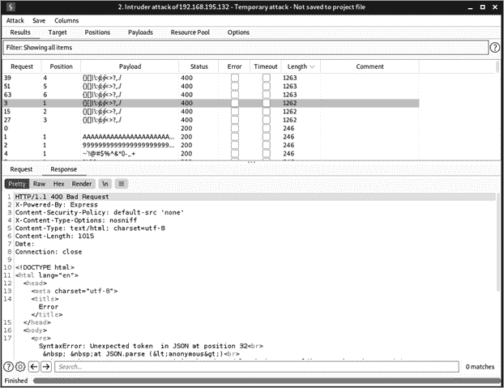

图 9-7：Burp Suite 攻击结果

一旦你得到像这样的有趣错误，你可以改进有效载荷，以精确确定导致错误的原因。如果你找出导致问题的确切符号或符号组合，尝试将其他有效载荷与其配对，看看能否获得更多有趣的响应。例如，如果返回的响应指示数据库错误，你可以使用针对这些数据库的有效载荷。如果错误指示操作系统或特定的编程语言，使用针对它的有效载荷。在这种情况下，错误与意外的 JSON 令牌有关，因此看到该端点如何处理 JSON 模糊测试有效载荷，以及当添加更多有效载荷时会发生什么，将会很有趣。

### 使用 Wfuzz 进行深度模糊测试

如果你使用的是 Burp Suite CE，Intruder 会限制你发送请求的速率，因此在发送大量有效负载时，你应该使用 Wfuzz。最初，使用 Wfuzz 发送一个大的 POST 或 PUT 请求可能会让人感到有些复杂，因为你需要在命令行中正确地添加大量信息。然而，只要掌握几个技巧，你应该能够在 Burp Suite CE 和 Wfuzz 之间来回切换，而不会遇到太多挑战。

Wfuzz 的一个优点是它比 Burp Suite 快得多，因此我们可以增加有效负载的大小。以下示例使用了一个名为 *big-list-of-naughty-strings.txt* 的 SecLists 有效负载，其中包含超过 500 个值：

```
$ **wfuzz -z file,/home/hapihacker/big-list-of-naughty-strings.txt**
```

让我们一步步构建 Wfuzz 命令。首先，为了匹配前一节中讨论的 Burp Suite 示例，我们需要包含 `Content-Type` 和 `x-access-token` 头，以便从 API 获取认证后的结果。每个头部通过 `-H` 选项指定，并用引号括起来。

```
$ **wfuzz -z file,/home/hapihacker/big-list-of-naughty-strings.txt -H "Content-Type: application/json" -H "x-access-token: [...]"**
```

接下来，请注意请求方法是 PUT。你可以通过 `-X` 选项指定它。此外，为了过滤掉状态码为 400 的响应，可以使用 `--hc 400` 选项：

```
$ **wfuzz -z file,/home/hapihacker/big-list-of-naughty-strings.txt -H "Content-Type: application/json" -H "x-access-token: [...]" -p 127.0.0.1:8080:HTTP --hc 400 -X PUT**
```

现在，使用 Wfuzz 模糊测试请求体时，通过 `-d` 选项指定请求体，并将请求体粘贴到命令中，用引号括起来。请注意，Wfuzz 通常会删除引号，因此需要使用反斜杠来保留它们。在这种情况下，我们将要模糊测试的参数替换为 `FUZZ`。最后，我们使用 `-u` 来指定我们要攻击的 URL：

```
$ **wfuzz -z file,/home/hapihacker/big-list-of-naughty-strings.txt -H "Content-Type: application/json" -H "x-access-token: [...]" --hc 400 -X PUT -d "{**
 **\"user\": \"FUZZ\",**
 **\"pass\": \"FUZZ\",**
 **\"id\": \"FUZZ\",**
 **\"name\": \"FUZZ\",**
 **\"is_admin\": \"FUZZ\",**
 **\"account_balance\": \"FUZZ\"**
**}" -u http://192.168.195.132:8090/api/user/edit_info**
```

这是一个相当复杂的命令，有足够的空间让人出错。如果你需要故障排除，建议将请求代理到 Burp Suite，这将帮助你可视化发送的请求。要将流量代理回 Burp，使用 `-p` 代理选项，并指定 Burp Suite 运行所在的 IP 地址和端口：

```
$ **wfuzz -z file,/home/hapihacker/big-list-of-naughty-strings.txt -H "Content-Type: application/json" -H "x-access-token: [...]" -p 127.0.0.1:8080 --hc 400 -X PUT -d "{**
 **\"user\": \"FUZZ\",**
 **\"pass\": \"FUZZ\",**
 **\"id\": \"FUZZ\",**
 **\"name\": \"FUZZ\",**
 **\"is_admin\": \"FUZZ\",**
 **\"account_balance\": \"FUZZ\"**
**}" -u http://192.168.195.132:8090/api/user/edit_info**
```

在 Burp Suite 中，检查拦截的请求并将其发送到 Repeater，以查看是否有任何拼写错误或其他问题。如果你的 Wfuzz 命令正常运行，执行它并查看结果，应该像这样：

```
********************************************************
* Wfuzz - The Web Fuzzer                         *
********************************************************

Target: http://192.168.195.132:8090/api/user/edit_info
Total requests: 502

==========================================================
ID           Response   Lines    Word       Chars       Payload
==========================================================

000000001:   200        0 L      3 W        39 Ch       "undefined - undefined - undefined - undefined - undefined - undefined"
000000012:   200        0 L      3 W        39 Ch       "TRUE - TRUE - TRUE - TRUE - TRUE - TRUE"
000000017:   200        0 L      3 W        39 Ch       "\\ - \\ - \\ - \\ - \\ - \\"
000000010:   302        10 L    63 W        1014 Ch       "<a href='\xE2\x80..."
```

现在，你可以寻找异常并执行额外的请求来分析你发现的内容。在这种情况下，值得观察 API 提供方如何回应导致 302 响应代码的有效负载。使用这个有效负载在 Burp Suite 的 Repeater 或 Postman 中进行测试。

### 广泛模糊测试不当资产管理

不当资产管理漏洞通常发生在组织暴露了已退役、处于测试环境中或仍在开发中的 API。在这些情况下，API 可能比其支持的生产环境版本具有更少的保护。不当资产管理可能仅影响单个端点或请求，因此通常需要广泛模糊测试，以检查 API 中的任何请求是否存在不当资产管理。

如第三章所述，你可以通过密切关注过时的 API 文档来发现不当的资产管理漏洞。如果一个组织的 API 文档没有随着组织的 API 端点更新，它可能会包含指向不再受支持的 API 部分的引用。此外，检查任何类型的变更日志或 GitHub 仓库。如果变更日志中提到“解决了 v3 中的对象级授权漏洞”，那么找到仍在使用 v1 或 v2 的端点将变得更加容易。

除了使用文档，你还可以通过模糊测试（fuzzing）来发现不当的资产漏洞。最好的方法之一是观察业务逻辑中的模式并测试你的假设。例如，在图 9-8 中，你可以看到在该集合的所有请求中使用的`baseURL`变量是*https://petstore.swagger.io/v2*。尝试将*v2*替换为*v1*，然后使用 Postman 的集合运行器（Collection Runner）进行测试。

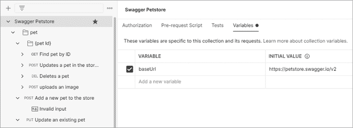

图 9-8：在 Postman 中编辑集合变量

示例 API 的生产版本是*v2*，因此，测试一些关键词会是个好主意，如*v1*、*v3*、*test*、*mobile*、*uat*、*dev*和*old*，以及在分析或侦察测试过程中发现的任何有趣路径。此外，一些 API 提供商通过在版本号前后添加*/internal/*，允许访问管理功能，路径可能如下所示：

1.  */api/v2/****internal****/users*

1.  */api/****internal****/v2/users*

如前所述，首先使用 API 预期的版本路径，通过集合运行器（Collection Runner）开发一个基准，了解 API 对典型请求的响应。弄清楚 API 如何响应成功的请求以及如何响应错误的请求（或对不存在的资源的请求）。

为了简化我们的测试，我们将设置与本章前面使用的相同的状态码为 200 的测试。如果 API 提供商通常对不存在的资源返回状态码 404，那么对于这些资源返回 200 状态码很可能表明该 API 存在漏洞。确保在集合级别插入此测试，以便在使用集合运行器时在每个请求上运行它。

现在保存并运行你的集合。检查通过此测试的请求的结果。查看结果后，换一个新关键字继续测试。如果你发现了不当的资产管理漏洞，下一步将是测试非生产环境端点，寻找更多弱点。这时，你的信息收集技巧将派上用场。在目标的 GitHub 或更新日志中，你可能会发现 API 的旧版本曾遭受 BOLA 攻击，因此你可以尝试对该漏洞端点进行攻击。如果在侦察过程中没有找到任何线索，可以结合本书中的其他技术来利用漏洞。

## 使用 Wfuzz 测试请求方法

一种实际使用模糊测试的方法是确定给定 API 请求的所有可用 HTTP 请求方法。你可以使用我们介绍的几种工具来执行这个任务，但这一节将使用 Wfuzz 演示如何进行。

首先，捕获或构造你希望测试的 API 请求及其可接受的 HTTP 方法。在本例中，我们将使用以下请求：

```
GET /api/v2/account HTTP/1.1
HOST: restfuldev.com
User-Agent: Mozilla/5.0
Accept: application/json
```

接下来，使用 Wfuzz 创建请求，使用`-X FUZZ`来专门模糊测试 HTTP 方法。运行 Wfuzz 并查看结果：

```
$ **wfuzz -z list,GET-HEAD-POST-PUT-PATCH-TRACE-OPTIONS-CONNECT- -X FUZZ http://testsite.com/api/v2/account**

********************************************************
* Wfuzz 3.1.0 - The Web Fuzzer                         *
********************************************************

Target: http://testsite.com/api/v2/account
Total requests: 8

==========================================================
ID           Response   Lines    Word       Chars       Payload
==========================================================

000000008:   405        7 L      11 W       163 Ch      "CONNECT"
000000004:   405        7 L      11 W       163 Ch      "PUT"
000000005:   405        7 L      11 W       163 Ch      "PATCH"
000000007:   405        7 L      11 W       163 Ch      "OPTIONS"
000000006:   405        7 L      11 W       163 Ch      "TRACE"
000000002:   200        0 L      0 W        0 Ch        "HEAD"
000000001:   200        0 L      107 W      2610 Ch     "GET"
000000003:   405        0 L      84 W       1503 Ch     "POST"
```

根据这些结果，你可以看到基础响应通常包括 405 状态码（方法不被允许）和 163 个字符的响应长度。异常响应包括两个请求方法，它们返回 200 状态码。这证实了 GET 和 HEAD 请求都有效，但没有透露什么新的信息。然而，这个测试也表明，你可以对*api/v2/account*端点使用 POST 请求。如果你正在测试的 API 文档中没有包括这种请求方法，那么你可能发现了一个不应对最终用户开放的功能。未记录的功能是一个很好的发现，应该进一步测试是否存在其他漏洞。

## 对输入清洗进行“更深”模糊测试以绕过限制

在进行深度模糊测试时，你需要有策略地设置有效载荷位置。例如，对于 PUT 请求中的邮箱字段，API 提供者可能会通过要求请求体的内容符合邮箱地址的格式来做得相当不错。换句话说，任何不是邮箱地址的值发送到该字段可能会导致相同的 400 错误（错误请求）。类似的限制可能也适用于整数和布尔值。如果你已经彻底测试了某个字段并且没有得到任何有趣的结果，你可能会选择将其排除在后续测试之外，或者将其保留用于在单独的攻击中进行更深入的测试。

另外，为了对特定字段进行更深层次的模糊测试，你可以尝试绕过任何已有的限制。所谓的*绕过*，是指欺骗服务器的输入清洗代码，使其处理原本应当限制的有效载荷。你可以使用一些技巧来针对受限字段进行攻击。

首先，尝试发送一个看起来像是受限字段的内容（如果是电子邮件字段，包含一个看起来有效的电子邮件），然后添加空字节，再添加另一个有效载荷位置，用于插入模糊测试的有效载荷。以下是一个示例：

```
"user": "a@b.com%00§test§"
```

不要使用空字节，试着发送管道符号（`|`）、引号、空格以及其他转义符号。更好的是，有足够多的符号可以发送，你可以为典型的转义字符添加第二个有效载荷位置，如下所示：

```
"user": "a@b.com§escape§§test§"
```

使用一组潜在的转义符号作为 `§escape§` 有效载荷，以及你希望执行的 `§test§` 有效载荷。进行此测试时，使用 Burp Suite 的集群炸弹攻击，它会循环通过多个有效载荷列表，并对每个有效载荷进行尝试：

1.  Escape1

1.  Escape1

1.  Escape1

1.  Escape2

1.  Escape2

1.  Escape2

1.  Payload1

1.  Payload2

1.  Payload3

1.  Payload1

1.  Payload2

1.  Payload3

集群炸弹模糊测试攻击非常擅长耗尽某些有效载荷组合，但要注意，请求数量将呈指数增长。当我们在第十二章尝试注入攻击时，我们会花更多时间讲解这种模糊测试风格。

## 目录遍历模糊测试

另一个可以进行模糊测试的弱点是目录遍历。目录遍历，也称为路径遍历，*目录遍历* 是一种漏洞，攻击者可以利用它让 Web 应用程序通过某种形式的 `../` 表达式转到父目录，然后读取任意文件。你可以利用一系列路径遍历的点和斜杠来代替前一节中描述的转义符号，例如以下这些：

1.  `..`

1.  `..\`

1.  `../`

1.  `\..\`

1.  `\..\.\`

这种弱点已经存在多年，通常会采取各种安全控制措施，包括用户输入净化，以防止此类问题的发生，但如果使用合适的有效载荷，你可能能够绕过这些控制措施和 Web 应用防火墙。如果你能够退出 API 路径，可能就能访问到敏感信息，如应用逻辑、用户名、密码以及额外的个人身份信息（如姓名、电话号码、电子邮件和地址）。

目录遍历可以使用广度和深度模糊测试技术进行。理想情况下，你会对整个 API 的所有请求进行深度模糊测试，但由于这可能是一项庞大的任务，因此可以先进行广度模糊测试，然后再专注于特定的请求值。确保利用从侦察、端点分析和包含错误或其他信息披露的 API 响应中收集的信息来丰富你的有效载荷。

## 总结

本章介绍了模糊测试 API 的技术，这是你需要掌握的最重要的攻击技术之一。通过向 API 请求的正确部分发送正确的输入，你可以发现各种 API 弱点。我们讨论了两种策略：广度模糊测试和深度模糊测试，它们有助于测试大型 API 的整个攻击面。在接下来的章节中，我们将回到深度模糊测试技巧，发现并攻击更多的 API 漏洞。

## 实验 #6：模糊测试不当资产管理漏洞

在本实验中，你将针对 crAPI 测试你的模糊测试技能。如果你还没有这么做，请按照第七章的步骤构建一个 crAPI Postman 集合，并获取一个有效的令牌。现在我们可以开始进行广泛的模糊测试，然后根据我们的发现转向深度模糊测试。

让我们开始进行不当资产管理漏洞的模糊测试。首先，我们将使用 Postman 对不同的 API 版本进行广泛的模糊测试。打开 Postman，导航到环境变量（使用位于 Postman 右上角的眼睛图标作为快捷方式）。向 Postman 环境添加一个名为 `path` 的变量，并将其值设置为 *v3*。现在，你可以更新并测试与版本相关的路径（如 *v1*、*v2*、*internal* 等）。

为了从 Postman Collection Runner 中获得更好的结果，我们将使用 Collection Editor 配置一个测试。选择 crAPI 集合选项，点击 **编辑**，然后选择 **测试** 标签。添加一个检测状态码 404 返回的测试，这样任何不返回 404 Not Found 响应的内容都会被视为异常。你可以使用以下测试：

```
pm.test("Status code is 404", function () {
    pm.response.to.have.status(404);
});
```

使用 Collection Runner 对 crAPI 集合进行基线扫描。首先，确保你的环境是最新的，并且 **保存响应** 已勾选（参见 图 9-9）。

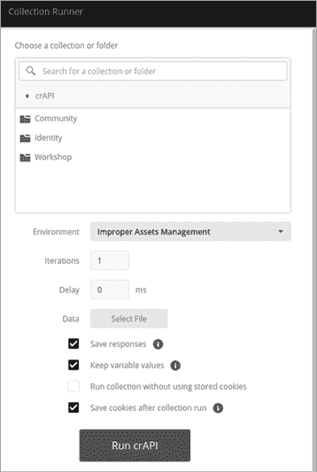

图 9-9：Postman 集合运行器

由于我们正在寻找不当的资产管理漏洞，我们将仅测试路径中包含版本信息的 API 请求。使用 Postman 的查找和替换功能，将集合中的 *v2* 和 *v3* 替换为 `path` 变量（参见 图 9-10）。

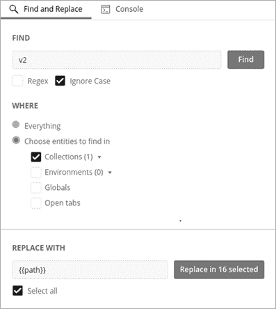

图 9-10：用 Postman 变量替换路径中的版本信息

你可能已经注意到我们集合中的一个有趣事项：除了密码重置端点 */identity/api/auth/v3/check-otp* 使用 *v3*，所有其他端点的路径中都包含 *v2*。

变量设置好后，使用我们预计在所有端点中都会失败的路径运行基线扫描。如 图 9-11 所示，`path` 变量的当前值设置为 `fail12345`，这个值在任何端点中都不太可能有效。了解 API 在失败时的反应将帮助我们理解 API 对不存在路径的请求的响应方式。这一基线将有助于我们使用 Collection Runner 进行广泛模糊测试（参见 图 9-12）。如果请求不存在的路径时返回成功的 200 响应，我们就需要注意其他指标，以帮助检测异常。

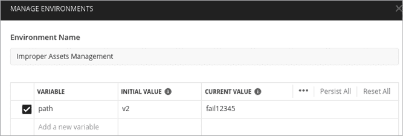

图 9-11：不当的资产管理漏洞

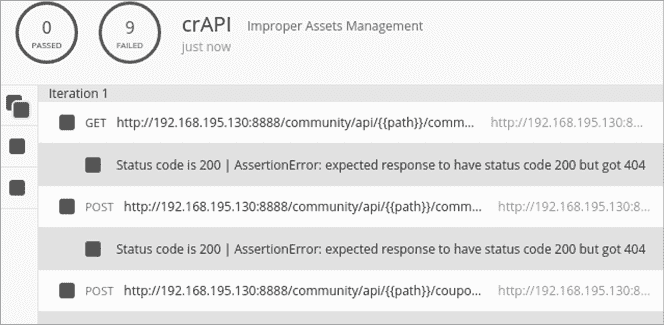

图 9-12：一个基础的 Postman Collection Runner 测试

如预期的那样，图 9-12 显示所有九个请求都失败了，因为 API 提供者返回了 404 状态码。现在，我们可以轻松地发现测试路径时的异常，比如*test*、*mobile*、*uat*、*v1*、*v2*和*v3*。将`path`变量的当前值更新为这些其他可能不受支持的路径，然后再次运行 Collection Runner。要快速更新变量，请点击 Postman 右上角的眼睛图标。

当你返回到路径值*/v2*和*/v3*时，事情应该开始变得有趣。当`path`变量设置为*/v3*时，所有请求都会失败。这有点奇怪，因为我们之前提到过密码重置请求是使用*/v3*路径的。为什么这个请求现在失败了呢？根据 Collection Runner，密码重置请求实际上收到了一个 500 内部服务器错误，而所有其他请求都收到了 404 未找到状态码。异常！

进一步调查密码重置请求会发现，使用*/v3*路径时发出了 HTTP 500 错误，因为应用程序有一个限制，限制了你尝试发送一次性验证码（OTP）的次数。将相同的请求发送到*/v2*也会导致 HTTP 500 错误，但响应稍微大一些。也许可以尝试在 Burp Suite 中重新发送这两个请求，并使用 Comparer 查看其中的细微差异。*/v3*密码重置请求响应为`{"message":"ERROR..","status":500}`。*/v2*密码重置请求响应为`{"message":"Invalid OTP! Please try again..","status":500}`。

密码重置请求并未按照我们开发的基准来响应，当 URL 路径未使用时，应该返回 404 状态码。相反，我们发现了一个不当的资产管理漏洞！这个漏洞的影响是*/v2*路径没有限制我们猜测 OTP 的次数。使用四位数的 OTP，我们应该能够通过模糊测试深入并在 10,000 个请求内发现任何 OTP。最终，你会收到一条表明你成功的消息：`{"message":"OTP verified","status":200}`。
