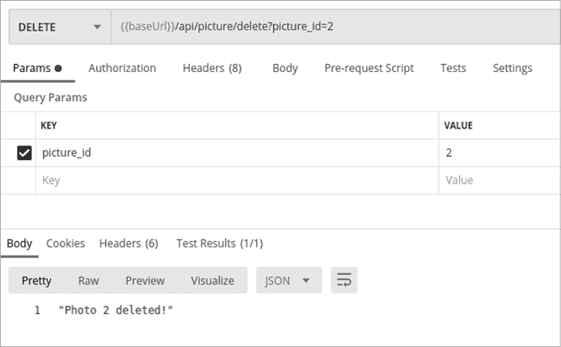
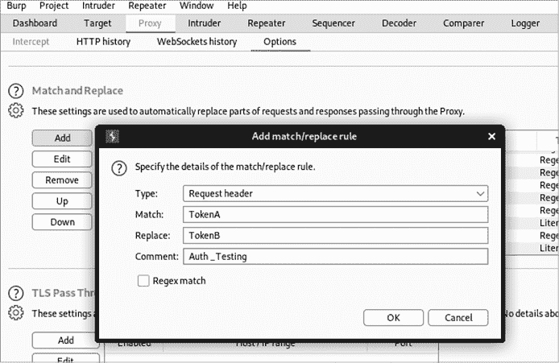
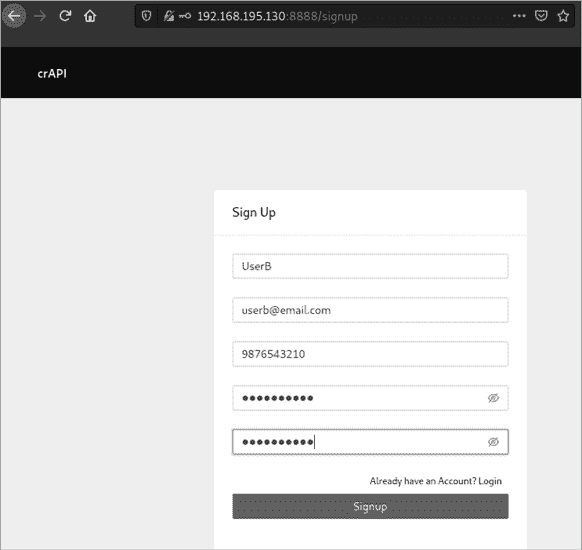
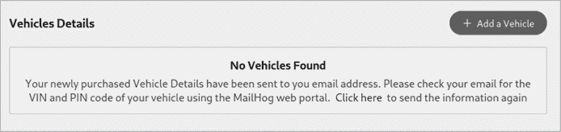
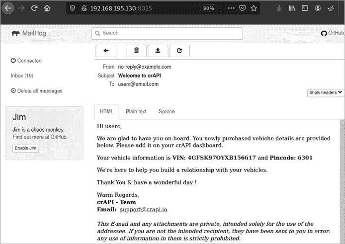
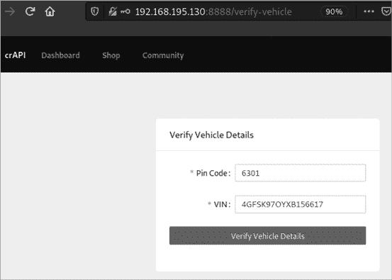

# 10

利用授权漏洞


在本章中，我们将介绍两种授权漏洞：BOLA 和 BFLA。这些漏洞暴露了授权检查的弱点，授权检查确保经过身份验证的用户只能访问他们自己的资源或使用与其权限级别相匹配的功能。在此过程中，我们将讨论如何识别资源 ID，使用 A-B 和 A-B-A 测试，以及如何通过 Postman 和 Burp Suite 加速测试。

## 寻找 BOLA 漏洞

BOLA 仍然是最突出的与 API 相关的漏洞之一，但它也可能是最容易测试的漏洞之一。如果你看到 API 列出了遵循某种模式的资源，你可以使用该模式测试其他实例。例如，假设你注意到在完成购买后，应用程序通过 API 在以下位置提供收据：*/api/v1/receipt/135*。知道这一点后，你可以通过在 Burp Suite 或 Wfuzz 中使用 135 作为负载位置，并将 135 更改为 0 到 200 之间的数字来检查其他数字。这正是我们在第四章实验中对 *reqres.in* 进行用户账户总数测试时所做的。

本节将介绍与寻找 BOLA 漏洞相关的其他考虑因素和技术。在寻找 BOLA 漏洞时，请记住，它们不仅仅是通过 GET 请求发现的。尝试使用所有可能的方法与你不应该有权限访问的资源进行交互。同样，易受攻击的资源 ID 不仅仅局限于 URL 路径。确保考虑其他可能的位置来检查 BOLA 漏洞，包括请求的主体和头部。

### 定位资源 ID

到目前为止，本书已经通过类似顺序请求资源的例子演示了 BOLA 漏洞：

1.  `GET /api/v1/user/account/``1111`

1.  `GET /api/v1/user/account/``1112`

要测试这个漏洞，你可以简单地暴力破解某个范围内的所有账户号码，并检查请求是否返回成功响应。

有时，找到 BOLA 漏洞实际上是如此简单。然而，要进行全面的 BOLA 测试，你需要密切关注 API 提供者用来获取资源的信息，因为这些信息可能并不那么显而易见。查找用户 ID 名称或号码、资源 ID 名称或号码、组织 ID 名称或号码、电子邮件、电话号码、地址、令牌，或在请求中用于获取资源的编码负载。

请记住，可预测的请求值并不会让 API 容易受到 BOLA 攻击；只有当 API 允许未经授权的用户访问请求的资源时，API 才被认为是脆弱的。通常，不安全的 API 会犯一个错误，即验证用户是否已通过身份验证，但未检查该用户是否被授权访问请求的资源。

如表 10-1 所示，你可以尝试多种方式获取你不应有权限访问的资源。这些例子基于实际成功的 BOLA 发现。在每一个请求中，请求者都使用了相同的 UserA 令牌。

表 10-1: 资源的有效请求及其对应的 BOLA 测试

| **类型** | **有效请求** | **BOLA 测试** |
| --- | --- | --- |
| 可预测 ID | `GET /api/v1/account/``2222` `Token: UserA_token` | `GET /api/v1/account/``3333` `Token: UserA_token` |
| ID 组合 | `GET /api/v1/``UserA``/data`/`2222` `Token: UserA_token` | `GET /api/v1/``UserB``/data/``3333` `Token: UserA_token` |

| 整数作为 ID | `POST /api/v1/account/` `Token: UserA_token`

`{"Account":` `2222``}` | `POST /api/v1/account/` `Token: UserA_token`

`{"Account": [``3333``]}` |

| 电子邮件作为用户 ID | `POST /api/v1/user/account` `Token: UserA_token`

`{"email": "``UserA@email.com``"}` | `POST /api/v1/user/account` `Token: UserA_token`

`{"email": "``UserB@email.com``"}` |

| 组 ID | `GET /api/v1/group/``CompanyA` `Token: UserA_token` | `GET /api/v1/group/``CompanyB` `Token: UserA_token` |
| --- | --- | --- |

| 组和用户组合 | `POST /api/v1/group/``CompanyA` `Token: UserA_token`

`{"email": "``userA@CompanyA.com``"}` | `POST /api/v1/group/``CompanyB` `Token: UserA_token`

`{"email": "``userB@CompanyB.com``"}` |

| 嵌套对象 | `POST /api/v1/user/checking` `Token: UserA_token`

`{"Account":` `2222``}` | `POST /api/v1/user/checking` `Token: UserA_token`

`{"Account":``{"Account" :3333}}` |

| 多个对象 | `POST /api/v1/user/checking` `Token: UserA_token`

`{"Account":` `2222``}` | `POST /api/v1/user/checking` `Token: UserA_token`

`{"Account":` `2222, "Account": 3333, "Account": 5555``}` |

| 可预测令牌 | `POST /api/v1/user/account` `Token: UserA_token`

`{"data": "DflK1df7jSdfa``1ac``aa"}` | `POST /api/v1/user/account` `Token: UserA_token`

`{"data": "DflK1df7jSdfa`**2df**`aa"}` |

有时，仅请求资源并不足够；你需要以正确的方式请求资源，通常需要同时提供资源 ID 和用户 ID。因此，由于 API 的组织方式，正确的资源请求可能需要如表 10-1 所示的*ID* *组合*格式。同样，你可能需要知道组 ID 和资源 ID，就像在*组和用户组合*格式中那样。

*嵌套对象*是 JSON 数据中常见的结构。这些对象是创建在一个对象内部的额外对象。由于嵌套对象是有效的 JSON 格式，只要用户输入验证未阻止，系统会处理该请求。通过使用嵌套对象，你可以通过在嵌套对象中包括一个没有相同安全控制的键/值对，从而绕过或逃避应用于外部键/值对的安全措施。如果应用程序处理这些嵌套对象，它们是授权漏洞的一个优秀载体。

### A-B 测试中的 BOLA

我们所说的*A-B 测试*是通过一个账户创建资源，然后尝试以另一个账户获取这些资源的过程。这是识别资源如何被识别以及用于获取它们的请求的最佳方法之一。A-B 测试过程如下：

+   **以 UserA 的身份创建资源。** 注意资源如何被识别，以及资源是如何被请求的。

+   **将您的 UserA 令牌替换为另一个用户的令牌。** 在许多情况下，如果存在账户注册过程，您将能够创建第二个账户（UserB）。

+   **使用 UserB 的令牌，发起请求获取 UserA 的资源。** 重点关注私人信息资源。测试任何 UserB 不应访问的资源，如全名、电子邮件、电话号码、社会保障号码、银行账户信息、法律信息和交易数据。

这个测试的规模较小，但如果您能够访问一个用户的资源，您可能能够访问所有同一特权级别用户的资源。

A-B 测试的一种变体是创建三个账户进行测试。这样，您可以在这三个不同的账户中创建资源，检测资源标识符中的任何模式，并检查哪些请求用于请求这些资源，如下所示：

+   **在您有权限的每个特权级别上创建多个账户。** 请记住，您的目标是测试和验证安全控制，而不是破坏某人的业务。在执行 BFLA 攻击时，您可能会成功删除其他用户的资源，因此最好将此类危险攻击限制在您创建的测试账户上。

+   **使用您的账户，在 UserA 的账户中创建一个资源，并尝试使用 UserB 的账户与其交互。** 使用所有可以使用的方法。

### 旁路通道 BOLA

我最喜欢的从 API 获取敏感信息的方法之一是通过旁路通道泄露。实质上，这指的是从意外的来源获取的信息，比如时间数据。在前面的章节中，我们讨论了 API 如何通过中间件（如 `X-Response-Time`）揭示资源的存在。旁路通道发现是为什么使用 API 按照预期的方式进行并开发正常响应基准的另一个原因。

除了时间因素，您还可以使用响应代码和响应长度来判断资源是否存在。例如，如果 API 对不存在的资源返回 404 Not Found，但对存在的资源返回不同的响应，如 405 Unauthorized，您将能够进行 BOLA 旁路通道攻击，发现现有的资源，如用户名、账户 ID 和电话号码。

表 10-2 给出了几种可能对侧信道 BOLA 信息泄露有用的请求和响应示例。如果 404 Not Found 是不存在资源的标准响应，那么其他状态码可以用于枚举用户名、用户 ID 和电话号码。当 API 对不存在的资源和你没有权限查看的现有资源返回不同响应时，这些请求仅提供了可以收集的一些信息示例。如果这些请求成功，它们可能会导致敏感数据的严重泄露。

表 10-2: 侧信道 BOLA 信息泄露示例

| **请求** | **响应** |
| --- | --- |
| `GET /api/user/test987123` | `404 Not Found HTTP/1.1` |

| `GET /api/user/hapihacker` | `405 Unauthorized HTTP/1.1` `{`

`}` |

| `GET /api/user/1337` | `405 Unauthorized HTTP/1.1` `{`

`}` |

| `GET /api/user/phone/2018675309` | `405 Unauthorized HTTP/1.1` `{`

`}` |

单独来看，这个 BOLA 漏洞可能显得微不足道，但类似的信息在其他攻击中可能会变得非常有价值。例如，你可以利用通过侧信道信息泄露收集到的信息，进行暴力破解攻击，以便访问有效的账户。你还可以利用这种信息执行其他 BOLA 测试，比如在表 10-1 中展示的 ID 组合 BOLA 测试。

## 寻找 BFLA

寻找 BFLA 就是寻找你不该访问的功能。BFLA 漏洞可能允许你更新对象值、删除数据，或者以其他用户的身份执行操作。要检查此漏洞，可以尝试更改或删除资源，或者访问属于其他用户或权限级别的功能。

请注意，如果你成功发送了 DELETE 请求，你将不再能够访问给定的资源……因为你已将其删除。因此，除非你在测试环境中进行测试，否则在模糊测试时避免进行 DELETE 测试。假设你向 1,000 个资源标识符发送 DELETE 请求；如果请求成功，你将删除可能有价值的信息，而你的客户端肯定不会高兴。相反，从小规模开始进行 BFLA 测试，避免造成重大中断。

### A-B-A 测试用于 BFLA

就像 BOLA 的 A-B 测试一样，A-B-A 测试是指使用一个账户创建和访问资源，然后尝试用另一个账户更改资源。最后，你应该使用原始账户验证任何更改。A-B-A 测试过程应该是这样的：

+   **作为 UserA 创建、读取、更新或删除资源。** 注意资源是如何标识的，以及资源是如何被请求的。

+   **将你的 UserA 令牌换成 UserB 的。** 如果存在账户注册流程，可以创建第二个测试账户。

+   **使用 UserB 的令牌发送 GET、PUT、POST 和 DELETE 请求，以访问 UserA 的资源。** 如果可能，通过更新对象的属性来更改资源。

+   **检查 UserA 的资源，以验证是否通过 UserB 的令牌进行了更改。** 无论是使用相应的 Web 应用程序，还是通过使用 UserA 的令牌发送 API 请求，都需要检查相关资源。例如，如果 BFLA 攻击是试图删除 UserA 的个人资料图片，则加载 UserA 的个人资料，查看图片是否丢失。

除了在单一权限级别下测试授权漏洞外，还需确保检查其他权限级别的漏洞。如前所述，API 可能具有各种不同的权限级别，例如普通用户、商户、合作伙伴和管理员。如果你能够访问不同权限级别的帐户，那么你的 A-B-A 测试可以增加新的层次。尝试将 UserA 设置为管理员，将 UserB 设置为普通用户。如果你能够在这种情况下利用 BLFA，那么它就会变成权限升级攻击。

### 在 Postman 中测试 BFLA

从授权请求 UserA 资源开始你的 BFLA 测试。如果你正在测试是否能够修改社交媒体应用中其他用户的图片，像 清单 10-1 中显示的那样发送一个简单的请求就足够了：

```
GET /api/picture/2
Token: UserA_token
```

清单 10-1：BFLA 测试的示例请求

这个请求告诉我们，资源是通过路径中的数字值来识别的。此外，如 清单 10-2 所示，响应表明资源的用户名（`"UserA"`）与请求令牌匹配。

```
200 OK
{
    "_id": 2,
    "name": "development flower",
    "creator_id": 2,
    "username": "UserA",
    "money_made": 0.35,
    "likes": 0
}
```

清单 10-2：BFLA 测试的示例响应

现在，鉴于这是一个用户可以共享图片的社交媒体平台，如果其他用户能够成功发送一个 GET 请求来获取图片 2，这并不令人惊讶。这不是 BOLA 的实例，而是一个功能特性。然而，UserB 不应能够删除属于 UserA 的图片。这就是我们跨入 BFLA 漏洞的地方。

在 Postman 中，尝试发送一个 DELETE 请求，删除包含 UserB 令牌的 UserA 资源。如 图 10-1 所示，使用 UserB 令牌的 DELETE 请求能够成功删除 UserA 的图片。为了验证图片是否已删除，发送后续的 GET 请求，查询 `picture_id=2`，你会确认 UserA 的 ID 为 2 的图片不再存在。这是一个非常重要的发现，因为单个恶意用户可能轻易删除所有其他用户的资源。



图 10-1：使用 Postman 成功进行 BFLA 攻击

如果你有文档访问权限，找出与权限升级相关的 BFLA 漏洞会更为简便。或者，你可能会在集合中找到清晰标注的管理操作，或者你可能已经反向工程了管理功能。如果不是这种情况，你需要对管理员路径进行模糊测试。

测试 BFLA 最简单的方法之一是以低权限用户身份发出管理请求。如果一个 API 允许管理员通过 POST 请求搜索用户，尝试发出相同的管理员请求，看看是否有任何安全控制措施阻止你成功。查看清单 10-3 中的请求。在清单 10-4 的响应中，我们看到 API 并没有做出此类限制。

```
POST /api/admin/find/user
Token: LowPriv-Token

{"email": "hapi@hacker.com"} 
```

清单 10-3：请求用户信息

```
200 OK HTTP/1.1

{
"fname": "hAPI",
"lname": "Hacker",
"is_admin": false,
"balance": "3737.50"
"pin": 8675
}
```

清单 10-4：带有用户信息的响应

搜索用户并获取另一个用户的敏感信息本应仅限于持有管理员令牌的人员。然而，通过请求*/admin/find/user*端点，你可以测试是否存在任何技术性限制。由于这是一个管理请求，成功响应可能还会提供敏感信息，比如用户的全名、余额和个人识别号码（PIN）。

如果存在限制，可以尝试更改请求方法。使用 POST 请求代替 PUT 请求，或反之。有时 API 提供者会针对某一种请求方法做出授权保护，但可能忽略了另一种方法。

## 授权绕过技巧

攻击一个拥有数百个端点和成千上万独特请求的大型 API 可能非常耗时。以下策略应有助于你在整个 API 中测试授权漏洞：在 Postman 中使用集合变量，和使用 Burp Suite 的匹配与替换功能。

### Postman 的集合变量

就像进行广泛模糊测试时一样，你可以使用 Postman 对一个集合中的变量进行修改，将你的授权令牌设置为集合变量。首先测试你的资源的各种请求，确保它们在 UserA 身份下正常工作。然后将令牌变量替换为 UserB 的令牌。为了帮助你找到异常响应，使用集合测试来定位 200 响应码或 API 的等效响应。

在集合运行器中，仅选择那些可能包含授权漏洞的请求。好的候选请求包括那些包含属于 UserA 的私人信息的请求。启动集合运行器并检查结果。检查结果时，留意那些 UserB 令牌能够返回成功响应的实例。这些成功响应可能表示 BOLA 或 BFLA 漏洞，应该进一步调查。

### Burp Suite 匹配与替换

当你攻击一个 API 时，你的 Burp Suite 历史记录将会填充上独特的请求。与其筛选每个请求并对其进行授权漏洞测试，不如使用匹配与替换选项，进行大规模的变量替换，比如替换授权令牌。

首先，作为 UserA 收集你历史中的几个请求，重点关注那些应该需要授权的操作。例如，关注涉及用户账户和资源的请求。接下来，将授权头替换为 UserB 的，并重复这些请求（参见图 10-2）。



图 10-2：Burp Suite 的匹配与替换功能

一旦你发现了 BOLA 或 BFLA 漏洞，尝试利用它来获取所有用户和相关资源的信息。

## 总结

在这一章中，我们详细查看了攻击 API 授权常见弱点的技术。由于每个 API 都是独一无二的，重要的不仅是弄清楚资源是如何标识的，还要发出请求，访问不属于你当前账户的资源。

授权漏洞可能会导致一些最严重的后果。BOLA 漏洞可能允许攻击者泄露组织的最敏感信息，而 BFLA 漏洞则可能允许你提升权限或执行未经授权的操作，从而危及 API 提供者。

## 实验#7：查找另一个用户的车辆位置

在本实验中，我们将搜索 crAPI 以发现正在使用的资源标识符，并测试我们是否能未经授权访问另一个用户的数据。在此过程中，我们将看到将多个漏洞结合起来以增强攻击影响力的价值。如果你已经完成了其他实验，你应该已经有一个包含各种请求的 crAPI Postman 集合。

你可能会注意到，资源 ID 的使用相对较轻。然而，有一个请求确实包含了一个独特的资源标识符。crAPI 仪表板底部的“刷新位置”按钮发出了以下请求：

```
GET /identity/api/v2/vehicle/**fd5a4781-5cb5-42e2-8524-d3e67f5cb3a6**/location.
```

这个请求获取用户的 GUID 并请求用户车辆的当前位置。另一个用户车辆的位置听起来像是值得收集的敏感信息。我们应该检查 crAPI 开发者是否依赖 GUID 的复杂性来进行授权，或者是否有技术控制确保用户只能查看自己车辆的 GUID。

那么问题是，你应该如何执行这个测试呢？你可能想利用第九章中的模糊测试技巧，但如此长度的字母数字 GUID 需要极其巨大的时间来进行暴力破解。相反，你可以获取另一个现有的 GUID，并用它进行 A-B 测试。为了做到这一点，你需要注册一个第二个帐户，如图 10-3 所示。



图 10-3：在 crAPI 中注册 UserB

在图 10-3 中，你可以看到我们创建了第二个账户，名为 UserB。使用这个账户，按照步骤通过 MailHog 注册一辆车。正如你可能记得的，在第六章的实验中，我们进行了侦查并发现了一些与 crAPI 相关的开放端口。其中一个端口是 8025，MailHog 就位于这个端口。

作为已认证用户，点击仪表板上的**点击这里**链接，如图 10-4 所示。这将生成一封包含你车辆信息的邮件，并将其发送到你的 MailHog 账户。



图 10-4：crAPI 新用户仪表板

更新地址栏中的 URL，使用以下格式访问端口 8025：*http://yourIPaddress:8025*。进入 MailHog 后，打开“Welcome to crAPI”邮件（参见图 10-5）。



图 10-5：crAPI MailHog 邮件服务

获取邮件中提供的 VIN 和 pincode 信息，并使用这些信息通过点击**添加车辆**按钮重新在 crAPI 仪表板上注册你的车辆。这将导致图 10-6 所示的窗口。



图 10-6：crAPI 车辆验证屏幕

一旦你注册了 UserB 的车辆，点击**刷新位置**按钮捕获请求。它应该像这样：

```
GET /identity/api/v2/vehicle/d3b4b4b8-6df6-4134-8d32-1be402caf45c/location HTTP/1.1
Host: 192.168.195.130:8888
User-Agent: Mozilla/5.0 (X11; Linux x86_64; rv:78.0) Gecko/20100101 Firefox/78.0
Accept: */*
Content-Type: application/json
Authorization: Bearer **UserB-Token**
Content-Length: 376
```

现在你有了 UserB 的 GUID，你可以替换掉 UserB 的 Bearer token，并使用 UserA 的 Bearer token 发送请求。列表 10-5 显示了请求，列表 10-6 显示了响应。

```
GET /identity/api/v2/vehicle/d3b4b4b8-6df6-4134-8d32-1be402caf45c/location HTTP/1.1
Host: 192.168.195.130:8888
Content-Type: application/json
Authorization: Bearer **UserA-Token**
```

列表 10-5：BOLA 攻击

```
HTTP/1.1 200

{
"carId":"d3b4b4b8-6df6-4134-8d32-1be402caf45c",
"vehicleLocation":
     {
     "id":2,
     "latitude":"39.0247621",
     "longitude":"-77.1402267"
     },
"fullName":"**UserB**"
}
```

列表 10-6：对 BOLA 攻击的响应

恭喜你，发现了 BOLA 漏洞。也许有办法发现其他有效用户的 GUID，将这一发现提升到新的层次。好吧，记住在第七章中，拦截的 GET 请求到*/community/api/v2/community/posts/recent*导致了数据过度曝光。乍一看，这个漏洞似乎没有严重的后果。然而，现在我们可以充分利用这些暴露的数据。看看从过度数据暴露中得到的以下对象：

```
{
"id":"sEcaWGHf5d63T2E7asChJc",
"title":"Title 1",
"content":"Hello world 1",
"author":{
"nickname":"Adam",
"email":"adam007@example.com",
"vehicleid":**"2e88a86c-8b3b-4bd1-8117-85f3c8b52ed2",**
"profile_pic_url":"",
}
```

这些数据揭示了一个`vehicleid`，它与刷新位置请求中使用的 GUID 非常相似。用 UserA 的 token 替换这些 GUID。列表 10-7 显示了请求，列表 10-8 显示了响应。

```
GET /identity/api/v2/vehicle/2e88a86c-8b3b-4bd1-8117-85f3c8b52ed2/location HTTP/1.1
Host: 192.168.195.130:8888
Content-Type: application/json
Authorization: Bearer **UserA-Token**
Connection: close
```

列表 10-7：请求另一个用户的 GUID

```
HTTP/1.1 200
{
"carId":"2e88a86c-8b3b-4bd1-8117-85f3c8b52ed2",
"vehicleLocation":{
     "id":7,
     "latitude":"37.233333",
     "longitude":"-115.808333"},
"fullName":"Adam"
}
```

列表 10-8：响应

果然，你可以利用 BOLA 漏洞来发现用户车辆的位置。现在，你只需通过一次 Google 地图搜索，就能发现用户的确切位置，并获得随时间追踪任何用户车辆位置的能力。像本实验中一样结合漏洞发现，将使你成为一名 API 黑客大师。
