# 应用规避技术和速率限制测试


本章将介绍绕过或规避常见 API 安全控制的技术。然后，我们将应用这些规避技术来测试和绕过速率限制。

在测试几乎任何 API 时，你都会遇到一些安全控制措施，它们会妨碍你的进度。这些控制可能表现为扫描你请求的 WAF（Web 应用防火墙），对你发送的输入进行验证的输入验证，或者限制你能发送请求数量的速率限制。

由于 REST API 是无状态的，API 提供商必须找到有效的方式来追踪请求的来源，并利用这些细节来阻止攻击。正如你将很快看到的，如果我们能发现这些细节，我们通常可以欺骗 API。

## 绕过 API 安全控制

你可能遇到的一些环境中会有 Web 应用防火墙（WAF）和“人工智能” Skynet 机器监控网络流量，准备阻止你发送的任何异常请求。WAF 是最常见的 API 安全控制，旨在保护 API 免受攻击。WAF 本质上是一种软件，用于检查 API 请求中的恶意活动。它会衡量所有流量是否超过某个阈值，如果发现任何异常，就会采取行动。如果你注意到存在 WAF，你可以采取预防措施，以避免在与目标交互时被阻止。

### 安全控制是如何工作的

安全控制可能因 API 提供商的不同而有所不同，但从大体上看，它们会设置某个恶意活动的阈值，一旦超出该阈值就会触发反应。例如，WAF 就能通过多种方式触发：

+   对不存在的资源发送过多请求

+   在短时间内发送过多请求

+   常见的攻击尝试，如 SQL 注入和 XSS 攻击

+   异常行为，如授权漏洞测试

假设某个 WAF 对每一类请求的阈值是三次请求。在第四次看似恶意的请求时，WAF 会作出某种反应，无论是发送警告，通知 API 防守人员，监控你的活动，还是直接阻止你。例如，如果存在 WAF 并且它正常工作，像以下的常见攻击尝试（如注入攻击）将会触发反应：

1.  `' OR 1=1`

1.  `admin'`

1.  `<script>alert('XSS')</script>`

问题是，当 API 提供商的安全控制检测到这些信息时，它们如何阻止你？这些控制必须有某种方式来确定你是谁。*归属*是使用一些信息来唯一地识别攻击者及其请求。记住，RESTful API 是无状态的，所以任何用于归属的信息必须包含在请求中。这些信息通常包括你的 IP 地址、来源头部、授权令牌和元数据。*元数据*是由 API 防御者推断出的信息，例如请求的模式、请求的频率以及请求中头部的组合。

当然，更高级的产品可能会基于模式识别和异常行为来阻止你。例如，如果 99%的 API 用户按照特定方式发起请求，API 提供商可以使用一种技术来建立预期行为的基准，然后阻止任何异常请求。然而，一些 API 提供商可能不愿使用这些工具，因为它们有可能阻止那些偏离常规的潜在客户。在便利性和安全性之间，常常会存在拉锯战。

### API 安全控制检测

检测 API 安全控制的最简单方法就是采用攻击性策略。如果你通过扫描、模糊测试和发送恶意请求来猛攻 API，你很快就能发现安全控制是否会妨碍你的测试。这个方法唯一的问题是，你可能只能学到一件事：那就是你被阻止了，无法再向主机发送任何请求。

我推荐你在采取攻击性策略之前，首先按照 API 设计的方式使用它。这样，你应该有机会在遇到麻烦之前理解应用程序的功能。你可以，例如，查看文档或构建一个有效请求的集合，然后以有效用户的身份绘制 API 地图。你还可以利用这个时间来检查 API 响应，以寻找 WAF 的迹象。WAF 的响应中通常会包含相关的头部信息。

还要注意请求或响应中的诸如`X-CDN`之类的头部信息，它们表示 API 正在利用*内容分发网络（CDN）*。CDN 通过缓存 API 提供商的请求，在全球范围内减少延迟。除此之外，CDN 通常还会提供 WAF 服务。通过 CDN 代理流量的 API 提供商通常会包括类似的头部信息：

1.  `X-CDN: Imperva`

1.  `X-CDN: Served-By-Zenedge`

1.  `X-CDN: fastly`

1.  `X-CDN: akamai`

1.  `X-CDN: Incapsula`

1.  `X-Kong-Proxy-Latency: 123`

1.  `Server: Zenedge`

1.  `Server: Kestrel`

1.  `X-Zen-Fury`

1.  `X-Original-URI`

检测 WAF（特别是 CDN 提供的 WAF）的一种方法是使用 Burp Suite 的 Proxy 和 Repeater 来观察你的请求是否被发送到代理。如果 302 响应将你转发到 CDN，那就表明可能是这种情况。

除了手动分析响应，你还可以使用 W3af、Wafw00f 或 Bypass WAF 等工具主动检测 WAF。Nmap 也有一个脚本可以帮助检测 WAF：

```
$ **nmap -p 80 –script http-waf-detect http://hapihacker.com**
```

一旦你发现了如何绕过 WAF 或其他安全控制，自动化你的绕过方法将有助于发送更大的有效载荷。在本章结束时，我将演示如何利用 Burp Suite 和 Wfuzz 中的功能来实现这一点。

### 使用临时账户

一旦你发现了 WAF 的存在，就该开始了解它如何对攻击作出响应。这意味着你需要建立 API 安全控制的基准，就像你在第九章模糊测试时建立的基准一样。为了进行这项测试，我建议使用临时账户。

*临时账户*是指你可以丢弃的账户或令牌，如果 API 防御机制封禁了你。这些账户可以使你的测试更加安全。其思路很简单：在进行攻击之前，先创建多个额外的账户，然后获取一份短的授权令牌列表，在测试过程中使用。当注册这些账户时，确保使用与你其他账户无关的信息。否则，聪明的 API 防御者或防御系统可能会收集你提供的数据，并将其与你创建的令牌关联起来。因此，如果注册过程要求提供电子邮件地址或全名，确保为每个账户使用不同的名字和电子邮件地址。根据你的目标，你甚至可能需要进一步采取措施，通过使用 VPN 或代理来伪装你的 IP 地址，以便注册账户。

理想情况下，你不需要浪费任何这些账户。如果你能在一开始就避免被检测，就不需要担心绕过控制，因此我们从这里开始。

### 规避技术

绕过安全控制是一个反复试验的过程。有些安全控制可能不会通过响应头部显示其存在，而是秘密等待你的失误。临时账户将帮助你识别哪些操作会触发响应，然后你可以尝试避免这些操作，或者使用下一个账户绕过检测。

以下措施可以有效绕过这些限制。

#### 字符串终止符

空字节和其他符号组合通常作为*字符串终止符*，或者用作结束字符串的元字符。如果这些符号没有被过滤，它们可能会终止 API 安全控制过滤器。例如，当你成功发送一个空字节时，许多后端编程语言会将其解释为停止处理的标志。如果空字节被后端程序处理，并且该程序验证用户输入，那么该验证程序可能会被绕过，因为它会停止处理输入。

这是你可以使用的潜在字符串终止符列表：

1.  `%00`

1.  `0x00`

1.  `//`

1.  `;`

1.  `%`

1.  `!`

1.  `?`

1.  `[]`

1.  `%5B%5D`

1.  `%09`

1.  `%0a`

1.  `%0b`

1.  `%0c`

1.  `%0e`

字符串终止符可以放置在请求的不同部分，以尝试绕过任何现有的限制。例如，在以下对用户资料页面的 XSS 攻击中，输入的空字节负载可以绕过禁止脚本标签的过滤规则：

```
POST /api/v1/user/profile/update
`--snip--`

{
"uname": "<s**%00**cript>alert(1)**;**</s**%00**cript>"
"email": "hapi@hacker.com"
}
```

市面上一些字典可以用于一般的模糊测试尝试，例如 SecLists 的元字符列表（可以在 Fuzzing 目录下找到）和 Wfuzz 的坏字符列表（可以在 Injections 目录下找到）。在防御严密的环境中使用这样的字典时，要小心被封禁的风险。在敏感环境中，最好通过不同的临时账户缓慢测试元字符。你可以通过将元字符插入不同的攻击中，并查看独特的错误或其他异常，来向你正在测试的请求添加元字符。

#### 大小写切换

有时，API 的安全控制非常简单。它们甚至可能愚蠢到只需要改变攻击负载中字符的大小写，就能绕过它们。尝试将一些字母大写，另一些保持小写。一次跨站脚本攻击可能变成这样：

```
<sCriPt>alert('supervuln')</scrIpT>
```

或者你可以尝试以下 SQL 注入请求：

```
SeLeCT * RoM all_tables
sELecT @@vErSion
```

如果防御系统使用规则来阻止某些攻击，改变大小写可能会绕过这些规则。

#### 编码负载

为了将你的 WAF 绕过尝试提升到一个新层次，尝试编码负载。编码后的负载常常能够欺骗 WAF，同时仍然被目标应用程序或数据库处理。即使 WAF 或输入验证规则阻止某些字符或字符串，它也可能会忽略这些字符的编码版本。安全控制取决于分配给它们的资源；预测每种攻击是不现实的，API 提供商无法做到这一点。

Burp Suite 的 Decoder 模块非常适合快速编码和解码负载。只需输入你想要编码的负载并选择你想要的编码类型（参见图 13-1）。

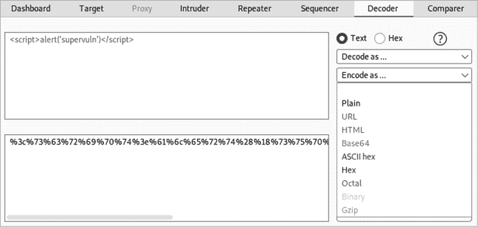

图 13-1：Burp Suite Decoder

在大多数情况下，URL 编码最有可能被目标应用程序解释，但 HTML 编码或 base64 编码也常常有效。

在编码时，重点关注可能被阻止的字符，例如以下这些：

1.  `< > ( ) [ ] { } ; ' / \ |`

你可以选择对负载的部分或整个负载进行编码。以下是编码后的 XSS 负载示例：

```
%3cscript%3ealert %28%27supervuln%27%28%3c%2fscript %3e
%3c%73%63%72%69%70%74%3ealert('supervuln')%3c%2f%73%63%72%69%70%74%3e
```

你甚至可以对 payload 进行双重编码。如果检查用户输入的安全控制执行了解码过程，而应用的后端服务执行第二轮解码，则双重编码的 payload 可能绕过安全控制的检测，之后传递到后端，在那里再次进行解码并处理。

### 使用 Burp Suite 自动化规避攻击

一旦你发现了绕过 WAF 的成功方法，就可以利用模糊测试工具中内置的功能来自动化你的规避攻击。我们从 Burp Suite 的 Intruder 开始。在 Intruder Payloads 选项下，有一个名为 Payload Processing 的部分，允许你添加规则，Burp 会在发送每个 payload 之前应用这些规则。

点击添加按钮会弹出一个界面，允许你为每个 payload 添加各种规则，例如前缀、后缀、编码、哈希和自定义输入（见图 13-2）。它还可以匹配并替换各种字符。

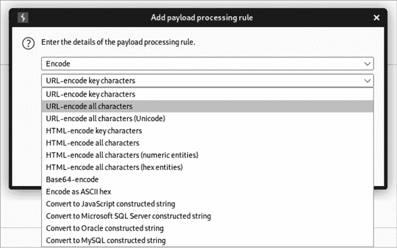

图 13-2：添加 Payload 处理规则界面

假设你发现通过在 URL 编码的 payload 前后添加一个空字节，可以绕过 WAF。你可以编辑字典文件以匹配这些要求，或者添加处理规则。

在我们的示例中，我们需要创建三条规则。Burp Suite 会按从上到下的顺序应用 payload 处理规则，因此，如果我们不希望空字节被编码，比如，我们需要首先对 payload 进行编码，然后再添加空字节。

第一条规则是对 payload 中的所有字符进行 URL 编码。选择**编码**规则类型，选择**URL 编码所有字符**选项，然后点击**确定**以添加该规则。第二条规则是在 payload 之前添加空字节。这可以通过选择**添加前缀**规则并将前缀设置为**%00**来完成。最后，创建一条规则，在 payload 后添加空字节。为此，使用**添加后缀**规则并将后缀设置为**%00**。如果你跟着操作，你的 payload 处理规则应该与图 13-3 一致。

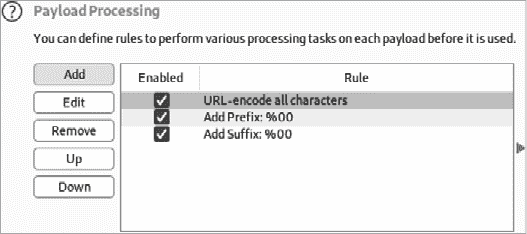

图 13-3：Intruder 的 payload 处理选项

要测试你的 payload 处理，启动一次攻击并检查请求的 payload：

```
POST /api/v3/user?id=%00%75%6e%64%65%66%69%6e%65%64%00
POST /api/v3/user?id=%00%75%6e%64%65%66%00
POST /api/v3/user?id=%00%28%6e%75%6c%6c%29%00
```

检查攻击的 Payload 列，确保 payload 已经正确处理。

### 使用 Wfuzz 自动化规避攻击

Wfuzz 也具有很棒的 payload 处理功能。你可以在[`wfuzz.readthedocs.io`](https://wfuzz.readthedocs.io)的高级用法部分找到其 payload 处理文档。

如果你需要对有效负载进行编码，首先需要知道你想使用的编码器名称（参见表 13-1）。要查看所有 Wfuzz 编码器的列表，请使用以下命令：

```
$ **wfuzz -e encoders**
```

表 13-1：可用 Wfuzz 编码器示例

| **类别** | **名称** | **总结** |
| --- | --- | --- |
| 哈希 | `base64` | 使用 base64 对给定的字符串进行编码。 |
| URL | `urlencode` | 使用`%xx`转义替换字符串中的特殊字符。字母、数字和字符`' _ . - '`永远不会被转义。 |
| 默认 | `random_upper` | 将字符串中的随机字符替换为大写字母。 |
| 哈希 | `md5` | 对给定的字符串应用 MD5 哈希。 |
| 默认 | `none` | 返回所有字符而不做任何更改。 |
| 默认 | `hexlify` | 将每个字节数据转换为相应的两位十六进制表示。 |

接下来，要使用编码器，请在有效负载后添加逗号并指定其名称：

```
$ **wfuzz -z file,wordlist/api/common.txt,base64 http://hapihacker.com/FUZZ**
```

在这个例子中，每个有效负载都会在发送请求之前进行 base64 编码。

编码器功能还可以与多个编码器一起使用。要让一个有效负载通过多个编码器在单独的请求中处理，使用连字符指定它们。例如，假设你指定了有效负载“a”并应用了如下编码：

```
$ **wfuzz -z list,a,base64-md5-none**
```

你将接收到一个 base64 编码的有效负载，一个通过 MD5 编码的有效负载，以及一个原始形式的有效负载（`none`编码表示“未编码”）。这将导致三个不同的有效负载。

如果你指定了三个有效负载，使用连字符连接三个编码器将会发送九个请求，如下所示：

```
$ **wfuzz -z list,a-b-c,base64-md5-none -u http://hapihacker.com/api/v2/FUZZ**
000000002:   404        0 L      2 W        155 Ch      "0cc175b9c0f1b6a831c399e269772661"
000000005:   404        0 L      2 W        155 Ch      "92eb5ffee6ae2fec3ad71c777531578f"
000000008:   404        0 L      2 W        155 Ch      "4a8a08f09d37b73795649038408b5f33"
000000004:   404        0 L      2 W        127 Ch      "Yg=="
000000009:   404        0 L      2 W        124 Ch      "c"
000000003:   404        0 L      2 W        124 Ch      "a"
000000007:   404        0 L      2 W        127 Ch      "Yw=="
000000001:   404        0 L      2 W        127 Ch      "YQ=="
000000006:   404        0 L      2 W        124 Ch      "b"
```

如果你希望每个有效负载都由多个编码器处理，可以使用`@`符号分隔编码器：

```
$ **wfuzz -z list,aaaaa-bbbbb-ccccc,base64@random_upper -u http://192.168.195.130:8888/identity/api/auth/v2/FUZZ**
000000003:   404        0 L      2 W        131 Ch      "Q0NDQ2M="
000000001:   404        0 L      2 W        131 Ch      "QUFhQUE="
000000002:   404        0 L      2 W        131 Ch      "YkJCYmI="
```

在这个例子中，Wfuzz 首先会对每个有效负载应用随机大写字母，然后对该有效负载进行 base64 编码。这样每个有效负载都会发送一个请求。

这些 Burp Suite 和 Wfuzz 选项将帮助你以不同的方式处理攻击，帮助你突破任何阻挡你前进的安全控制。要深入了解 WAF 绕过的话，我推荐你查看这个令人惊叹的 Awesome-WAF GitHub 仓库（[`github.com/0xInfection/Awesome-WAF`](https://github.com/0xInfection/Awesome-WAF)），你会发现很多精彩的资料。

## 测试速率限制

现在你已经了解了几种规避技术，让我们用它们来测试 API 的速率限制。如果没有速率限制，API 用户可以随时请求他们想要的任何信息，且可以频繁请求。这样，提供方可能会增加与计算资源相关的额外费用，甚至可能成为拒绝服务（DoS）攻击的受害者。此外，API 提供方通常使用速率限制作为将 API 货币化的一种方式。因此，速率限制是黑客进行测试时的重要安全控制。

要识别速率限制，首先查阅 API 文档和市场推广资料，寻找相关信息。API 提供商可能会在其网站或 API 文档中公开其速率限制的详细信息。如果没有公开这些信息，可以检查 API 的头部。API 通常会包括以下头部，让你知道在违反限制之前还可以发送多少请求：

1.  `x-rate-limit:`

1.  `x-rate-limit-remaining:`

其他 API 不会有任何速率限制指示符，但如果你超过了限制，你会发现自己被暂时封锁或禁止。你可能开始收到新的响应代码，例如 429 Too Many Requests。这些响应可能包含类似 `Retry-After:` 的头部，指示你何时可以提交额外的请求。

为了让速率限制生效，API 必须做对很多事情。这意味着攻击者只需找到系统中的一个弱点。像其他安全控制措施一样，速率限制只有在 API 提供商能够将请求归属于单个用户时才能生效，通常通过他们的 IP 地址、请求数据和元数据来实现。用于阻止攻击者的最明显因素是他们的 IP 地址和授权令牌。在 API 请求中，授权令牌作为身份的主要凭证，因此如果从某个令牌发送了过多的请求，它可能会被列入黑名单并被暂时或永久封禁。如果未使用令牌，WAF 可能会以相同方式处理某个 IP 地址。

测试速率限制有两种方法。一种是完全避免被速率限制。另一种是在被速率限制后绕过限制机制。我们将在本章的其余部分探讨这两种方法。

### 关于宽松的速率限制说明

当然，有些速率限制可能非常宽松，以至于你无需绕过它们就能进行攻击。假设速率限制设置为每分钟 15,000 次请求，而你想通过暴力破解 150,000 种不同的密码。你完全可以在 10 分钟内依次尝试每个可能的密码，保持在速率限制内。

在这些情况下，你只需要确保你的暴力破解速度不会超过这个限制。例如，我曾体验过 Wfuzz 在不到 24 秒的时间里达到每秒 10,000 次请求（即每秒 428 次请求）。在这种情况下，你需要限制 Wfuzz 的速度，以保持在这个限制内。使用 `-t` 选项可以指定并发连接数，而 `-s` 选项允许你指定请求之间的时间延迟。表 13-2 显示了可能的 Wfuzz `-s` 选项。

表 13-2：Wfuzz `-s` 选项用于请求速率限制

| **请求之间的延迟（秒）** | **大致发送的请求次数** |
| --- | --- |
| 0.01 | 每秒 10 次 |
| 1 | 每秒 1 次 |
| 6 | 每分钟 10 次 |
| 60 | 每分钟 1 次 |

由于 Burp Suite CE 的 Intruder 设计上有速率限制，它提供了另一种保持在某些低速率限制内的好方法。如果你使用的是 Burp Suite Pro，请设置 Intruder 的资源池来限制请求发送的速率（参见图 13-4）。

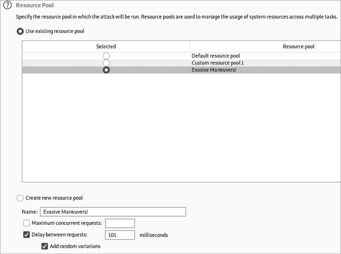

图 13-4：Burp Suite Intruder 资源池

与 Wfuzz 不同，Intruder 以毫秒为单位计算延迟。因此，设置 100 毫秒的延迟将导致每秒发送 10 个请求。表 13-3 可以帮助你调整 Burp Suite Intruder 的资源池值，从而创建不同的延迟。

表 13-3：Burp Suite Intruder 资源池的请求延迟选项

| **请求之间的延迟（毫秒）** | **大致请求次数** |
| --- | --- |
| 100 | 每秒 10 次 |
| 1000 | 每秒 1 次 |
| 6000 | 每分钟 10 次 |
| 60000 | 每分钟 1 次 |

如果你能够在不超过 API 速率限制的情况下攻击 API，那么你的攻击可以作为速率限制漏洞的演示。

在你继续绕过速率限制之前，确定消费者超出速率限制是否会面临任何后果。如果速率限制配置错误，超出限制可能不会造成任何后果。如果是这种情况，你已经找到了一个漏洞。

### 路径绕过

绕过速率限制的最简单方法之一是稍微修改 URL 路径。例如，尝试在请求中使用大小写切换或字符串终止符。假设你正在通过对以下 POST 请求中的`uid`参数进行 IDOR 攻击，针对一个社交媒体网站：

```
POST /api/myprofile
`--snip--`
{uid=§0001§}
```

该 API 可能允许每分钟 100 次请求，但根据`uid`值的长度，你知道要进行暴力破解，你需要发送 10,000 个请求。你可以在一个小时 40 分钟的时间内缓慢发送请求，或者尝试完全绕过这个限制。

如果你达到了该请求的速率限制，尝试通过字符串终止符或各种大小写字母修改 URL 路径，如下所示：

1.  `POST /api/myprofile%00`

1.  `POST /api/myprofile%20`

1.  `POST /api/myProfile`

1.  `POST /api/MyProfile`

1.  `POST /api/my-profile`

这些路径变体可能会导致 API 提供者以不同的方式处理请求，可能绕过速率限制。你也可能通过在路径中包含无意义的参数来达到相同的结果：

1.  `POST /api/myprofile?test=1`

如果无意义的参数导致请求成功，它可能会重新启动速率限制。在这种情况下，尝试在每个请求中更改参数的值。只需为无意义的参数添加一个新的负载位置，然后使用与要发送的请求数相同长度的数字列表：

```
POST /api/myprofile?test=**§1§**
`--snip--`
{uid=**§0001§}**
```

如果你使用 Burp Suite 的 Intruder 进行此攻击，你可以将攻击类型设置为 pitchfork，并且在两个负载位置使用相同的值。这种战术可以让你使用最少的请求数量来暴力破解 `uid`。

### Origin 请求头伪造

一些 API 提供者使用请求头来实施速率限制。这些*origin*请求头告诉 web 服务器请求来源。如果客户端生成了 origin 请求头，我们可以操控它们以绕过速率限制。尝试在请求中包含常见的 origin 请求头，如下所示：

1.  `X-Forwarded-For`

1.  `X-Forwarded-Host`

1.  `X-Host`

1.  `X-Originating-IP`

1.  `X-Remote-IP`

1.  `X-Client-IP`

1.  `X-Remote-Addr`

至于这些请求头的值，发挥你的对抗思维并创造性地尝试。你可以尝试包括私有 IP 地址、localhost IP 地址（127.0.0.1），或者与你的目标相关的 IP 地址。如果你做了足够的侦察，你可以使用目标攻击面中的其他 IP 地址。

接下来，尝试同时发送所有可能的 origin 请求头，或者将它们包含在单独的请求中。如果你同时包含所有请求头，可能会收到 431 Request Header Fields Too Large 状态码。在这种情况下，逐个请求地发送较少的请求头，直到成功。

除了 origin 请求头，API 防御者还可能会添加 `User-Agent` 请求头来归属请求给某个用户。`User-Agent` 请求头用于识别客户端浏览器、浏览器版本信息和客户端操作系统。以下是一个示例：

```
GET / HTTP/1.1
Host: example.com
**User-Agent: Mozilla/5.0 (X11; Linux x86_64; rv:78.0) Gecko/20100101 Firefox/78.0**
```

有时，这个请求头会与其他请求头一起使用，以帮助识别并阻止攻击者。幸运的是，SecLists 包含了 `User-Agent` 字典文件，你可以在目录 *seclists/Fuzzing/User-Agents* 中找到它们，用来在请求中循环使用不同的值 ([`github.com/danielmiessler/SecLists/blob/master/Fuzzing/User-Agents/UserAgents.fuzz.txt`](https://github.com/danielmiessler/SecLists/blob/master/Fuzzing/User-Agents/UserAgents.fuzz.txt))。只需将负载位置添加到 `User-Agent` 值周围，并在每个请求中更新它。你也许能够绕过速率限制。

如果你成功了，你会看到 `x-rate-limit` 请求头重置，或者在被阻止后仍然能够成功发起请求。

### 在 Burp Suite 中轮换 IP 地址

一项可以彻底阻止模糊测试的安全措施是 WAF 的基于 IP 的限制。你可能会启动一个 API 扫描，结果发现你的 IP 地址被封锁。如果发生这种情况，你可以做出一些假设——即 WAF 包含某种逻辑，在短时间内收到多个错误请求时，会封禁请求的 IP 地址。

为了帮助破解基于 IP 的封锁，Rhino Security Labs 发布了一个 Burp Suite 扩展和指南，用于执行一种非常棒的规避技术。这个扩展叫做 IP Rotate，适用于 Burp Suite 社区版。要使用它，你需要一个 AWS 账户，通过该账户可以创建 IAM 用户。

从高层次来看，这个工具允许你通过 AWS API 网关代理你的流量，然后循环使用 IP 地址，使每个请求都来自一个独特的地址。这是下一代的规避技术，因为你没有伪造任何信息；相反，你的请求实际上来自 AWS 区域中的不同 IP 地址。

要安装该扩展，你需要一个名为 Boto3 的工具以及 Jython 实现的 Python 编程语言。要安装 Boto3，请使用以下`pip3`命令：

```
$ **pip3 install boto3**
```

接下来，从[`www.jython.org/download.html`](https://www.jython.org/download.html)下载 Jython 独立文件。下载完成后，进入 Burp Suite 扩展选项，在 Python 环境下指定 Jython 独立文件，如图 13-5 所示。

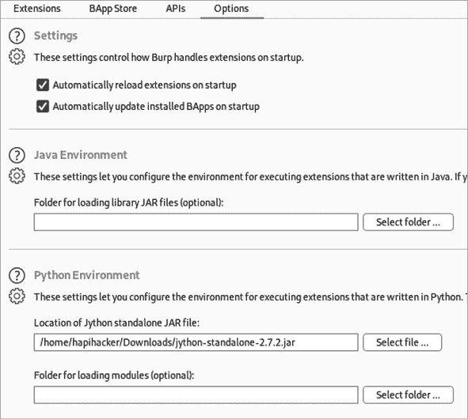

图 13-5：Burp Suite 扩展选项

导航到 Burp Suite 扩展器的 BApp 商店，搜索 IP Rotate。现在你应该能够点击**安装**按钮（见图 13-6）。

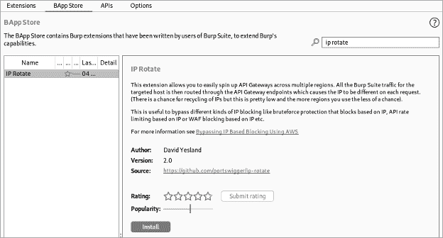

图 13-6：BApp 商店中的 IP Rotate

登录到你的 AWS 管理账户后，导航到 IAM 服务页面。你可以通过搜索 IAM 或通过服务下拉选项来访问该页面（见图 13-7）。

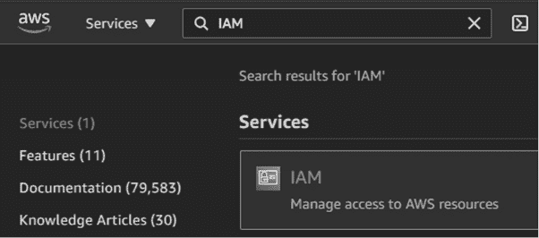

图 13-7：找到 AWS IAM 服务

加载 IAM 服务页面后，点击**添加用户**，并创建一个选择了程序访问权限的用户账户（见图 13-8）。接着进入下一页。

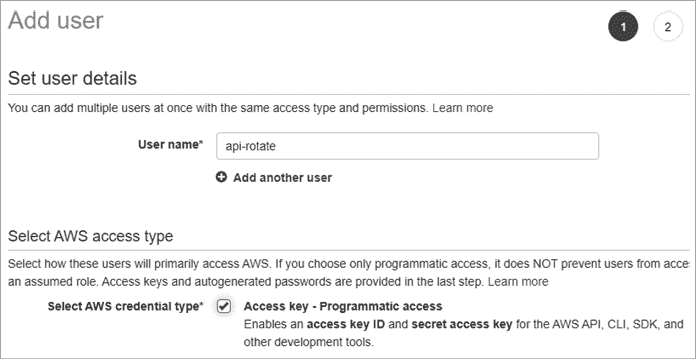

图 13-8：AWS 设置用户详情页面

在设置权限页面，选择**直接附加现有策略**。接下来，通过搜索“API”来过滤策略。选择**AmazonAPIGatewayAdministrator**和**AmazonAPIGatewayInvokeFullAccess**权限，如图 13-9 所示。

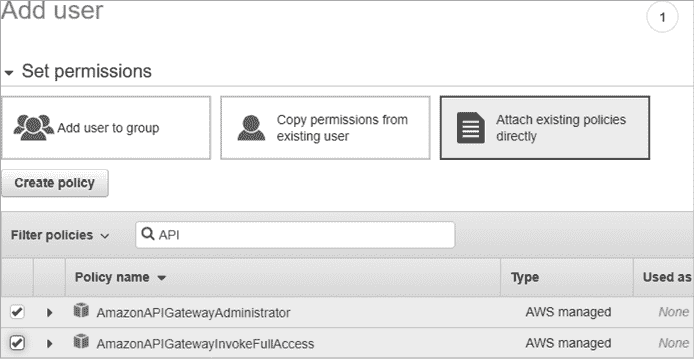

图 13-9：AWS 设置权限页面

进入审核页面。不需要标签，您可以跳过这一步并创建用户。现在，您可以下载包含用户访问密钥和秘密访问密钥的 CSV 文件。一旦您拥有这两个密钥，打开 Burp Suite 并导航到 IP Rotate 模块（见图 13-10）。

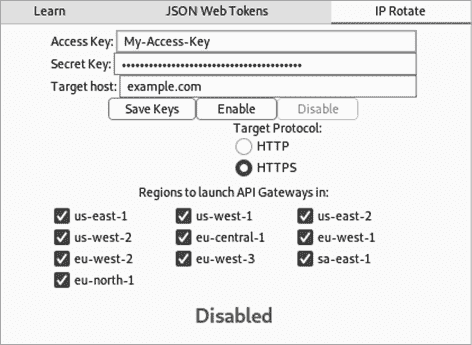

图 13-10：Burp Suite 的 IP Rotate 模块

将您的访问密钥和秘密密钥复制并粘贴到相应的字段中。点击**保存密钥**按钮。当您准备好使用 IP Rotate 时，更新目标主机字段为您的目标 API，然后点击**启用**。请注意，您无需在目标主机字段中输入协议（HTTP 或 HTTPS）。相反，请使用**目标协议**按钮来指定 HTTP 或 HTTPS。

您可以做一个很酷的测试来查看 IP Rotate 的实际效果，指定*ipchicken.com*作为您的目标。（IPChicken 是一个显示您公共 IP 地址的网站，如图 13-11 所示。）然后，代理请求到[`ipchicken.com`](https://ipchicken.com)。转发该请求，并观察每次刷新[`ipchicken.com`](https://ipchicken.com)时，您的旋转 IP 如何被显示。

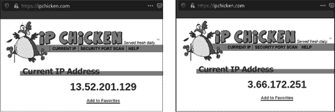

图 13-11：IPChicken

现在，单纯基于 IP 地址封锁您的安全控制将无力应对。

## 总结

在本章中，我讨论了您可以用来规避 API 安全控制的技巧。在发起全面攻击之前，务必作为最终用户收集尽可能多的信息。此外，如果您的账户被封禁，可以创建临时账户继续测试。

我们运用了规避技巧来测试最常见的 API 安全控制之一：速率限制。找到绕过速率限制的方法可以让您拥有一个无限的、全方位的攻击 API 的通行证，您可以用尽全力进行暴力攻击。在接下来的章节中，我们将应用本书中开发的技巧来攻击一个 GraphQL API。
