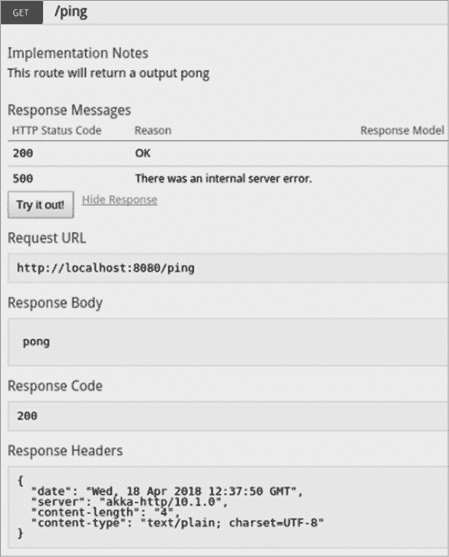
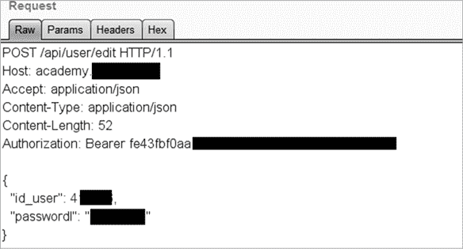

# 数据泄露和漏洞赏金


本章讨论的真实世界 API 泄露和漏洞赏金应该能展示实际黑客如何利用 API 漏洞，漏洞是如何组合的，以及你可能发现的弱点的重要性。

记住，一个应用的安全性只有在最薄弱环节的保护下才算强大。如果你面对的是防火墙最强、基于多因素认证的零信任应用，但蓝队并没有投入资源保护他们的 API，那么就会有一个类似死星热排气口的安全漏洞。此外，这些不安全的 API 和排气口往往故意暴露给外界宇宙，为破坏和摧毁提供了明显的路径。在黑客攻击时，可以利用以下常见的 API 漏洞来获取优势。

## 泄露事件

在数据泄露、泄漏或曝光之后，人们经常相互指责并甩锅。我更喜欢将这些视为昂贵的学习机会。需要明确的是，*数据泄露*指的是犯罪分子利用系统漏洞来危害企业或窃取数据的已确认事件。*泄漏*或*曝光*则指的是发现了可能导致敏感信息泄露的漏洞，但尚不清楚是否真的有攻击者成功泄露了数据。

当数据泄露发生时，攻击者通常不会披露他们的发现，因为那些在网上炫耀他们战利品细节的人通常会最终被逮捕。遭到攻击的组织也很少披露发生了什么，可能是因为他们太尴尬了，或者是为了保护自己免受额外的法律追诉，或者（在最糟糕的情况下）他们根本不知道发生了什么。因此，我将提供我自己对于这些数据泄露是如何发生的猜测。

### Peloton

1.  **数据量：** 超过三百万个 Peloton 订阅用户

1.  **数据类型：** 用户 ID、位置、年龄、性别、体重和锻炼信息

2021 年初，安全研究员 Jan Masters 披露了未经认证的 API 用户可以查询 API 并获取所有其他用户的信息。这一数据曝光特别有趣，因为美国总统乔·拜登在披露时正是 Peloton 设备的拥有者。

由于 API 数据泄露，攻击者可以使用三种不同的方法获取敏感用户数据：向*/stats/workouts/details*端点发送请求、向*/api/user/search*功能发送请求，以及进行未经认证的 GraphQL 请求。

#### /stats/workouts/details 端点

这个端点旨在根据用户的 ID 提供他们的锻炼详细信息。如果用户希望他们的数据是私密的，他们可以选择一个应该隐藏数据的选项。然而，隐私功能并未正常运作，端点返回了数据给任何消费者，而不管是否授权。

通过在 POST 请求体中指定用户 ID，攻击者将收到包含用户年龄、性别、用户名、锻炼 ID 和 Peloton ID 的响应，并且还会显示一个值，指示其个人资料是否为私密：

```
POST /stats/workouts/details HTTP/1.1
Host: api.onepeloton.co.uk
User-Agent: Mozilla/5.0 (Windows NT 10.0; Win64; x64; rv:84.0) Gecko/20100101 Firefox/84.0
Accept: application/json, text/plain, */*
`--snip--`
{"ids":["10001","10002","10003","10004","10005","10006",]}
```

攻击中使用的 ID 可以通过暴力破解获得，或者更好的是，可以通过使用 web 应用程序收集，这样应用程序会自动填充用户 ID。

#### 用户搜索

用户搜索功能容易受到业务逻辑漏洞的影响。向 */api/user/search/:<username>* 端点发送 GET 请求时，会暴露出通向用户个人资料照片、位置、ID、隐私状态以及社交信息（如关注者数量）的 URL。任何人都可以利用这一数据暴露功能。

#### GraphQL

几个 GraphQL 端点允许攻击者发送未经身份验证的请求。像以下这样的请求将提供用户的 ID、用户名和位置：

```
POST /graphql HTTP/1.1
Host: gql-graphql-gateway.prod.k8s.onepeloton.com
`--snip--`
{"query":
"query SharedTags($currentUserID: ID!) (\n  User: user(id: "currentUserID") (\r\n__typename\n  id\r\n  location\r\n  )\r\n)". "variables": ( "currentUserID": "**REDACTED**")}
```

通过将 `REDACTED` 用户 ID 作为有效载荷位置，未经身份验证的攻击者可以暴力破解用户 ID，以获取私密用户数据。

Peloton 数据泄露展示了使用 API 时抱有敌意心态可能导致的重大发现。它也表明，如果一个组织没有保护其某个 API，你应该将此视为一个号召，去测试其其他 API 是否存在漏洞。

### USPS Informed Visibility API

1.  **数据量：**大约 6000 万暴露的 USPS 用户

1.  **数据类型：**电子邮件、用户名、实时包裹更新、邮寄地址、电话号码

2018 年 11 月，*KrebsOnSecurity* 揭露了美国邮政服务（USPS）网站泄露了 6000 万用户的数据。USPS 的一个名为 Informed Visibility 的程序向经过身份验证的用户提供了一个 API，使消费者能够获取所有邮件的近实时数据。唯一的问题是，任何拥有 API 访问权限的 USPS 身份验证用户都可以查询任意 USPS 账户的详细信息。更糟糕的是，API 允许通配符查询。这意味着攻击者可以轻松地通过以下查询请求例如所有 Gmail 用户的数据：*/api/v1/find?email=*@gmail.com*。

除了明显的安全配置错误和业务逻辑漏洞外，USPS API 还存在过度数据暴露的问题。当请求一个地址的相关数据时，API 会返回与该地址相关的所有记录。黑客可以通过搜索各种物理地址并留意结果来发现这一漏洞。例如，以下请求可能会显示该地址的所有当前和过去居住者的记录：

```
POST /api/v1/container/status
Token: UserA
`--snip--`

{
"street": "475 L' Enfant Plaza SW",
"city": Washington DC"
}
```

具有这种过度数据暴露的 API 可能会返回类似如下的内容：

```
{
       "street":"475 L' Enfant Plaza SW",
       "City":"Washington DC",
       "customer": [
              {
                     "name":"Rufus Shinra",
                     "username":"novp4me",
                     "email":"rufus@shinra.com",
                     "phone":"123-456-7890",
              },
              {
                     "name":"Professor Hojo",
                     "username":"sep-father",
                     "email":"prof@hojo.com",
                     "phone":"102-202-3034",
              }
              ]
}
```

USPS 数据泄露是一个很好的例子，说明为什么更多的组织需要进行以 API 为中心的安全测试，无论是通过漏洞奖励计划还是渗透测试。事实上，信息可见性项目的监察长办公室在*《KrebsOnSecurity》*文章发布前一个月进行了漏洞评估。评估人员未提及任何关于 API 的内容，而在监察长办公室的“信息可见性漏洞评估”报告中，测试人员判断“整体上，IV 网页应用程序的加密和身份验证是安全的”（[`www.uspsoig.gov/sites/default/files/document-library-files/2018/IT-AR-19-001.pdf`](https://www.uspsoig.gov/sites/default/files/document-library-files/2018/IT-AR-19-001.pdf)）。该公开报告还包括了描述所使用的漏洞扫描工具，这些工具用来测试网页应用程序，但却给 USPS 的测试人员带来了假阴性结果。这意味着，他们的工具向他们保证没有问题，实际上却存在严重的问题。

如果有任何安全测试专注于 API，测试人员将会发现明显的业务逻辑漏洞和身份验证弱点。USPS 数据泄露展示了 API 作为一种攻击向量如何被忽视，以及它们多么急需用正确的工具和技术进行测试。

### T-Mobile API 数据泄露

1.  **数据量：** 超过 200 万 T-Mobile 客户

1.  **数据类型：** 姓名、电话号码、电子邮件、出生日期、账户号码、账单邮政编码

2018 年 8 月，T-Mobile 在其官网发布了一则公告，称其网络安全团队“发现并关闭了对某些信息的未授权访问。”T-Mobile 还通过短信通知了 230 万用户他们的数据遭到暴露。通过攻击 T-Mobile 的一个 API，攻击者得以获取客户的姓名、电话号码、电子邮件、出生日期、账户号码和账单邮政编码。

正如常见的情况一样，T-Mobile 没有公开泄露的具体细节，但我们可以大胆猜测。一年前，一名 YouTube 用户发现并公开了一个可能与被利用的漏洞相似的 API 漏洞。在一段名为“针对 T-Mobile 信息泄露漏洞利用”的视频中，用户“moim”演示了如何利用 T-Mobile Web 服务网关 API。这个早期的漏洞允许消费者通过使用单一授权令牌，并在 URL 中添加任意用户的电话号码来访问数据。以下是请求返回的数据示例：

```
implicitPermissions:
0:
user:
IAMEmail:
"rafae1530116@yahoo.com"
userid:
"U-eb71e893-9cf5-40db-a638-8d7f5a5d20f0"
lines:
0:
accountStatus: "A"
ban:
"958100286"
customerType: "GMP_NM_P"
givenName: "Rafael"
insi:
"310260755959157"
isLineGrantable: "true"
msison:
"19152538993"
permissionType: "inherited"
1:
accountStatus: "A"
ban:
"958100286"
customerType: "GMP_NM_P"
givenName: "Rafael"
imsi:
"310260755959157"
isLineGrantable: "false"
msisdn:
"19152538993"
permissionType: "linked"
```

当你查看这个端点时，我希望你已经开始联想到一些 API 漏洞。如果你能使用 `msisdn` 参数来查询自己的信息，你能否用它查询其他电话号码？实际上，你是可以的！这就是 BOLA 漏洞。更糟糕的是，电话号码非常可预测，并且通常是公开的。在利用视频中，moim 从 Pastebin 上的一个信息泄露攻击中随机获取了一个 T-Mobile 电话号码，并成功地获取了该客户的信息。

这个攻击只是一个概念验证，但仍有改进的空间。如果你在进行 API 测试时发现类似的问题，我建议你与提供商合作，获取带有不同电话号码的额外测试账户，以避免在测试过程中暴露真实的客户数据。利用这些发现，然后描述一次真实攻击可能对客户环境造成的影响，特别是如果攻击者暴力破解电话号码并泄露大量客户数据。

毕竟，如果这个 API 是导致数据泄露的罪魁祸首，攻击者本可以轻松地暴力破解电话号码，从而收集到那 230 万个泄露的电话号码。

## 悬赏

漏洞悬赏计划不仅奖励黑客发现并报告那些犯罪分子本可能利用的弱点，而且他们的报告也是学习 API 黑客技术的绝佳资源。如果你留心观察这些报告，可能会学到一些可以在自己测试中使用的新技巧。你可以在像 HackerOne 和 Bug Crowd 这样的漏洞悬赏平台上找到这些报告，或者在独立的来源中找到，例如 Pentester Land、ProgrammableWeb 和 APIsecurity.io。

我在这里展示的报告仅代表其中一小部分悬赏内容。我选择了这三个例子，旨在展示漏洞猎人在捕获漏洞过程中遇到的多样问题和他们使用的攻击方式。正如你所看到的，在某些情况下，这些黑客通过结合利用技巧、追踪多个线索以及实施新颖的 Web 应用攻击，深入挖掘了一个 API。你可以从漏洞猎人那里学到很多。

### 优质 API 密钥的代价

1.  **漏洞猎人：** Ace Candelario

1.  **悬赏：** $2,000

Candelario 开始他的漏洞狩猎工作时，首先调查了目标网站上的一个 JavaScript 源文件，搜索其中可能暗示泄露密钥的词汇，比如 *api*、*secret* 和 *key*。果然，他发现了一个用于 BambooHR 人力资源软件的 API 密钥。正如你所看到的，这个密钥是 base64 编码的：

```
function loadBambooHRUsers() {
var uri = 'https://api.bamboohr.co.uk/api/gateway.php/example/v1/employees/directory');
return $http.get(uri, { headers: {'Authorization': 'Basic **VXNlcm5hbWU6UGFzc3dvcmQ=**'};
}
```

因为代码片段中也包含了 HR 软件的端点，所以任何发现该代码的攻击者都可能尝试将这个 API 密钥当作自己的参数，发送 API 请求到该端点。或者，他们也可以解码 base64 编码的密钥。在这个例子中，你可以做以下操作来查看编码的凭证：

```
hAPIhacker@Kali:~$ **echo 'VXNlcm5hbWU6UGFzc3dvcmQ=' | base64 -d**
`Username`:`Password`
```

到这时，你可能已经有了一个强有力的漏洞报告。尽管如此，你仍然可以进一步行动。例如，你可以尝试使用这些凭证访问 HR 网站，以证明你能够访问目标的敏感员工数据。Candelario 就这样做，并使用员工数据的截图作为他的概念验证。

这样的暴露 API 密钥是身份验证漏洞的一个例子，你通常会在 API 发现过程中找到它们。发现这些密钥的漏洞悬赏将取决于它们能用于的攻击严重性。

**经验教训**

+   花时间研究你的目标并发现 API。

+   时刻留意凭证、密钥和秘密信息，并测试你能利用这些发现做些什么。

### 私有 API 授权问题

1.  **漏洞奖励猎人：** Omkar Bhagwat

1.  **奖励：** $440

通过执行目录枚举，Bhagwat 发现了一个 API 及其文档，位于 *academy.target.com/api/docs*。作为一个未认证用户，Omkar 能够找到与用户和管理员管理相关的 API 端点。此外，当他发送 GET 请求到 */ping* 端点时，Bhagwat 注意到该 API 在没有使用任何授权令牌的情况下响应了他（见 图 15-1）。这引起了 Bhagwat 对该 API 的兴趣，他决定彻底测试它的功能。



图 15-1：Omkar Bhagwat 为漏洞奖励报告提供的示例，展示了 API 在回应他的 */ping* 请求时的 “pong” 响应

在测试其他端点时，Bhagwat 最终收到了一条包含“授权参数丢失”的 API 响应。他搜索了该网站，发现许多请求都使用了暴露的授权 Bearer 令牌。

通过将该 Bearer 令牌添加到请求头中，Bhagwat 能够编辑用户账户（见 图 15-2）。他然后可以执行管理员操作，如删除、编辑和创建新账户。



图 15-2：Omkar 成功的 API 请求，修改用户账户密码

几个 API 漏洞导致了这一攻击。API 文档泄露了关于 API 操作和如何操作用户账户的敏感信息。公开这些文档没有任何商业目的；如果没有这些文档，攻击者可能会直接跳过此目标，继续寻找下一个目标。

通过彻底调查目标，Bhagwat 发现了一个暴露的授权 Bearer 令牌形式的身份验证漏洞。利用该 Bearer 令牌和文档，他接着发现了一个 BFLA。

**经验教训**

+   当某个事物引起你的兴趣时，启动对 Web 应用程序的彻底调查。

+   API 文档是信息的宝藏，利用它对你有利。

+   将你的发现结合起来，发现新的漏洞。

### Starbucks：从未发生的漏洞事件

1.  **漏洞赏金猎人：** Sam Curry

1.  **赏金：** $4,000

Curry 是一个安全研究员和漏洞猎人。在参与 Starbucks 的漏洞赏金计划时，他发现并披露了一个漏洞，阻止了近 1 亿个 Starbucks 客户的个人身份信息（PII）记录泄露。根据 Net Diligence 的泄露计算器，这么大规模的 PII 数据泄露可能会让 Starbucks 支付 1 亿美元的监管罚款，2.25 亿美元的危机管理费用，以及 2500 万美元的事件调查费用。即使按照每条记录 3.50 美元的保守估算，这样的泄露也可能导致大约 3.5 亿美元的费用。Sam 的发现，至少可以说，是史诗般的。

在他的博客[`samcurry.net`](https://samcurry.net)上，Curry 详细介绍了他入侵 Starbucks API 的过程。最吸引他注意的是，Starbucks 的礼品卡购买过程包含了带有敏感信息的 API 请求，发送到`*/bff/proxy*`端点：

```
POST /bff/proxy/orchestra/get-user HTTP/1.1
HOST: app.starbucks.com

{
"data":
"user": {
"exId": "77EFFC83-7EE9-4ECA-9849-A6A23BF1830F",
"firstName": "Sam",
"lastName": "Curry",
"email": "samwcurry@gmail.com",
"partnerNumber": null,
"birthDay": null,
"birthMonth": null,
"loyaltyProgram": null
}
}
```

正如 Curry 在博客中解释的那样，*bff*代表“前端的后端”，意味着应用程序将请求传递给另一个主机以提供功能。换句话说，Starbucks 使用了一个代理来在外部 API 和内部 API 端点之间传输数据。

Curry 尝试探测这个`*/bff/proxy/orchestra*`端点，但发现它无法将用户输入转发到内部 API。然而，他发现了一个`*/bff/proxy/user:id*`端点，该端点允许用户输入通过代理传输：

```
GET /bff/proxy/stream/v1/users/me/streamItems/..\ HTTP/1.1
Host: app.starbucks.com

{
"errors": [
{
"message": "Not Found",
"errorCode": 404
}]}
```

通过在路径末尾使用`..\`，Curry 试图遍历当前工作目录，并查看他可以访问服务器上的其他内容。他继续测试各种目录遍历漏洞，直到发送了以下内容：

```
GET /bff/proxy/stream/v1/me/stramItems/web\..\.\..\.\..\.\..\.\..\..\..\.\..\
```

这个请求导致了一个不同的错误信息：

```
"message": "Bad Request",
"errorCode": 400
```

这个错误请求的突然变化意味着 Curry 发现了某些东西。他使用 Burp Suite Intruder 暴力破解不同的目录，直到他找到了一个使用*/search/v1/accounts*的 Microsoft Graph 实例。Curry 查询了 Graph API，并捕获了一个概念验证，证明他可以访问一个包含 ID、用户名、全名、电子邮件、城市、地址和电话号码的内部客户数据库。

因为他了解 Microsoft Graph API 的语法，Curry 发现他可以通过添加查询参数`$count=true`来获取条目数，总数为 99,356,059，接近 100 百万。

Curry 通过密切关注 API 的响应并在 Burp Suite 中过滤结果，找到了一个独特的 400 状态码，这在所有标准的 404 错误中是独一无二的。如果 API 提供者没有披露这个信息，响应可能会与其他所有的 404 错误混合，攻击者很可能会转向另一个目标。

通过结合信息泄露和安全配置错误，他能够暴力破解内部目录结构并找到 Microsoft Graph API。额外的 BFLA 漏洞使 Curry 能够使用管理功能执行用户账户查询。

**经验教训**

+   密切关注 API 响应之间的细微差异。使用 Burp Suite Comparer 或仔细对比请求和响应，以识别 API 中的潜在弱点。

+   调查应用程序或 WAF 如何处理模糊测试和目录遍历技术。

+   利用回避技术绕过安全控制。

### 一个 Instagram GraphQL BOLA

+   **漏洞赏金猎人：** Mayur Fartade

+   **赏金：** $30,000

在 2021 年，Fartade 在 Instagram 上发现了一个严重的 BOLA 漏洞，使他能够向位于 */api/v1/ads/graphql/* 的 GraphQL API 发送 POST 请求，查看其他用户的私密帖子、故事和短视频。

问题源于缺乏针对涉及用户媒体 ID 请求的授权安全控制。要发现媒体 ID，可以使用暴力破解或通过其他方式获取 ID，如社交工程或 XSS。例如，Fartade 使用了如下的 POST 请求：

```
POST /api/v1/ads/graphql HTTP/1.1
Host: i.instagram.com
Parameters:
doc_id=[REDACTED]&query_params={"query_params":{"access_token":"","id":"**[****MEDIA_ID]**"}}
```

通过针对 `MEDIA_ID` 参数并为 `access_token` 提供空值，Fartade 能够查看其他用户私密帖子的详细信息：

```
"data":{
"instagram_post_by_igid":{
"id":
"creation_time":1618732307,
"has_product_tags":false,
"has_product_mentions":false,
"instagram_media_id":
006",
"instagram_media_owner_id":"!
"instagram_actor": {
"instagram_actor_id":"!
"id":"1
},
"inline_insights_node":{
"state": null,
"metrics":null,
"error":null
},
"display_url":"https:\/\/scontent.cdninstagram.com\/VV/t51.29350-15\/
"instagram_media_type":"IMAGE",
"image":{
"height":640,
"width":360
},
"comment_count":
"like_count":
"save_count":
"ad_media": null,
"organic_instagram_media_id":"
`--snip--`
]
}
}
```

这个 BOLA 漏洞使 Fartade 仅通过指定给定 Instagram 帖子的媒体 ID 就能发起信息请求。利用这一弱点，他能够访问如喜欢、评论以及与 Facebook 关联的任何用户私密或归档帖子等详细信息。

**经验教训**

+   努力寻找 GraphQL 端点，并应用本书中涵盖的技术；回报可能非常丰厚。

+   当第一次攻击失败时，结合回避技术，例如通过使用空字节与攻击一起使用，再次尝试。

+   尝试使用令牌绕过授权要求。

## 总结

本章使用了 API 漏洞和漏洞赏金报告，展示了你如何在真实环境中利用常见的 API 漏洞。研究对手和漏洞赏金猎人的战术将有助于你拓展自己的黑客技能，从而更好地保护互联网安全。这些故事也揭示了网络中存在着大量的低悬果实。通过结合简单的技术，你可以创造出一个 API 黑客杰作。

熟悉常见的 API 漏洞，深入分析各个端点，利用你发现的漏洞进行攻击，报告你的发现，并沉浸在防止下一次重大 API 数据泄露的荣耀中。
