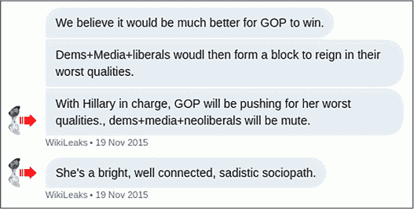
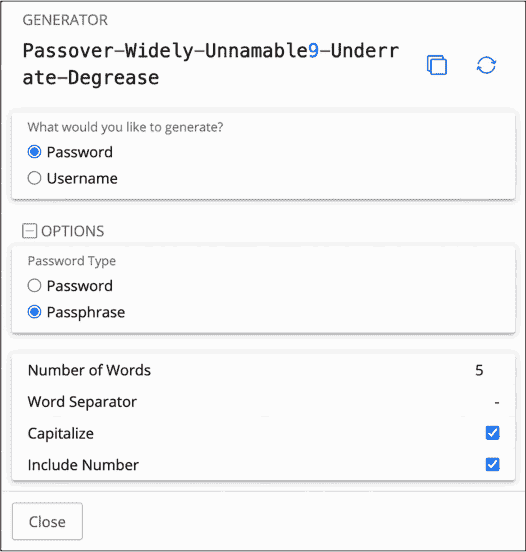
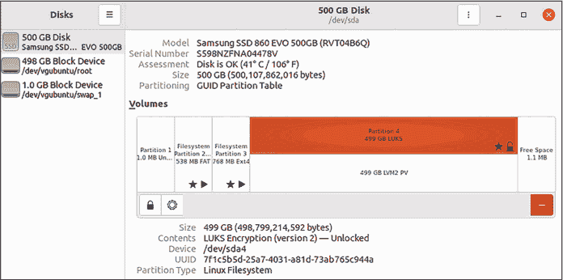
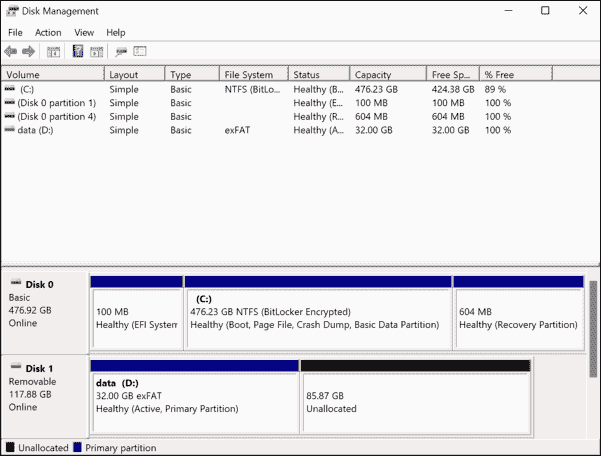
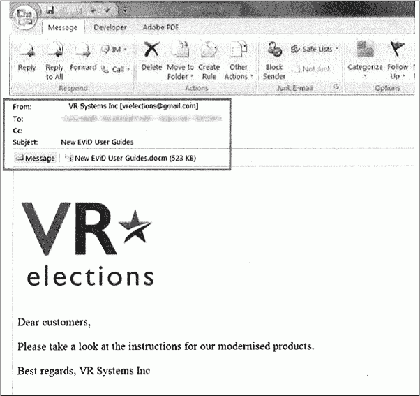
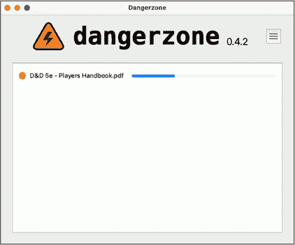

<hgroup>

## <samp class="SANS_Futura_Std_Bold_Condensed_B_11">1</samp> <samp class="SANS_Dogma_OT_Bold_B_11">保护消息来源和你自己</samp>

</hgroup>

我们中的大多数人并不十分意识到这一点，但我们都在接受监控。电信公司和科技巨头掌握着关于每个使用手机和互联网的人的大量私人数据，从我们随时所在的精确位置，到我们的短信和电子邮件内容，而且他们可以与泄密调查员共享这些数据。

即使我们的私人数据没有直接传送给科技公司，我们的设备仍会在本地记录我们的一举一动。你能回忆起上个月访问的每一个网页吗？你的网页浏览器可能能，而跨越互联网跟踪你活动的网络追踪器也能。

除了每个人都面临的持续背景监控外，拥有敏感数据集访问权限的工作人员往往还会受到更加严格的公司或政府监控。他们的工作计算机和手机预装了间谍软件，监控他们的所有活动。数据库系统会记录谁在何时搜索了哪些关键词，打开了哪些文档，下载或打印了哪些文件。

正是在这种环境中，普通人开始成为消息来源。在工作过程中，他们目睹了一些不道德或令人不安的事情。他们可能会创建一个包含有罪证据的文件夹，或者截取公司聊天记录的屏幕截图，或者在内部数据库中进行一些搜索，了解更多信息并确保他们的怀疑是正确的。他们可能会将一些文件通过邮件发送给自己，或者将文件复制到一个插入工作计算机的 USB 闪存驱动器中。他们可能会向朋友或家人发送短信，寻求建议，并思考接下来该怎么做。大多数消息来源在联系记者或监管者时，并未意识到他们已经留下了庞大的数字痕迹。

本章将介绍如何保护消息来源和确保你从他们那里获得的数据集的安全。我将讨论编辑和伦理方面的考虑，包括如何编辑文档和决定发布哪些信息，以及根据数据的敏感性该将其存储在哪里。我还会向你展示如何验证数据集的真实性，讲述我过去如何验证来自 COVID-19 疫情中的黑客数据和 WikiLeaks 的聊天记录。验证数据集的真实性不仅对撰写准确的报道至关重要，而且对保护作为记者的声誉也至关重要。最后，你将学习如何使用密码管理器，加密磁盘，并保护自己免受恶意文档的侵害。

### <samp class="SANS_Futura_Std_Bold_B_11">与消息来源的安全沟通</samp>

由于我们所做的一切都会留下数据痕迹，保护来源既复杂又困难。在你基于匿名举报人提供的信息发布了一篇震撼性的报道后，你应该预期你所调查的目标会对你的来源展开调查。保密来源与追踪其身份的调查人员之间的权力不对称非常严重。如果你是记者或研究人员，试图保护你的来源，即使完美地做到所有正确的事情也不一定足够。由于许多源保护的事情超出了你的控制范围，因此集中精力做好那些能控制的少数事项非常重要。

作为记者或研究人员，验证你获得的数据是否真实是你的一项核心责任。验证文件的最简单方法是询问发布它们的公司或政府是否真实，但这对你的来源而言充满了风险。在某些情况下，你可能不想透露任何可能揭示你来源身份的细节。稍后在本章的“验证数据集”部分，我会进一步讨论这一点。你也可能不想透露具体的文件已被泄露，这是你将在本章的“删减”部分了解的一个话题。

在本节中，我将描述哪些来源面临风险，哪些来源没有风险，并提供减少这些风险的策略。我还将讨论与那些合法获得内部信息的保密来源合作和与黑客合作（黑客通过违法手段获取信息）之间的区别。作为调查员，仔细考虑你的选择如何影响你的来源是非常重要的，最好在开始与来源接触之前就能做好考虑。

#### <samp class="SANS_Futura_Std_Bold_Condensed_Oblique_BI_11">使用公共数据</samp>

一些数据集对来源根本没有任何风险。当政府回应公共记录请求发布一组文件时，或者当文件作为诉讼的一部分公开时，你可以在报告中包含任何你想要的数据。这些数据可能包含一些有权势的人不希望任何人知道的内容，但分享这些信息不会使任何人面临报复的风险，因为这些数据已经是公开的。

类似地，对于那些可能包含敏感数据但已经是公开并广泛可获得的数据集，比如你将在第二章中下载的 BlueLeaks 数据集，你不需要担心源的保护。你从该数据集中发现的任何信息已经被 FBI 调查人员仔细查阅，他们在尝试确定黑客身份。在这些情况下，不管有多少人访问过这些文件，都没有关系。当你询问数据是否真实以及是否有声明时，向政府或企业媒体办公室提供太多细节也不会不小心暴露你的来源。由于该数据集已经是公开的，源的损害已经发生。

#### <samp class="SANS_Futura_Std_Bold_Condensed_Oblique_BI_11">保护敏感信息</samp>

如果你正在处理来自*机密*来源的数据集，透露他们的身份可能会导致你的来源被解雇、逮捕，甚至被谋杀。保护你来源的最基本步骤就是不要和任何与你的调查没有紧密合作的人谈论他们。不要在社交媒体上发布任何你不打算公开的来源细节，不要在聚会上跟朋友谈论他们，甚至不要和不参与调查的同事谈论他们。

如果你正在采访某家公司或政府机构，关于你获得的泄露数据集，不要透露任何关于你机密来源的细节，即使他们直接询问。如果你被逮捕，警方要求你透露你的来源是谁，你有权保持沉默，并且应该行使这一权利：不要向警方提供他们尚未掌握的任何信息。唯一必须透露你来源信息的情况是法官下令要求你这样做——即便如此，你仍然可以抗拒。

#### <samp class="SANS_Futura_Std_Bold_Condensed_Oblique_BI_11">最小化数字痕迹</samp>

确保在与来源沟通时，留下最少的数字痕迹。尽可能避免通过电子邮件、短信、电话、社交媒体应用中的直接消息等方式进行沟通。不要在社交媒体上关注你的机密来源，确保他们也不关注你。

如果你必须发送消息或打电话，使用像 Signal 这样的加密消息应用，我将在第二章中讲解，确保你的消息来源删除与您聊天的任何记录。你通常需要记录你的来源所告诉你的信息以便进行报道，但请采取措施保护这些记录，例如将它们从手机上的消息应用中删除，并保存在本地计算机中而不是云服务中。如果在发布报告后你不再需要保存对话记录——比如用于潜在的后续报道——那么就删除它们。

确保你的消息来源知道不要为你或你已发布的报告进行互联网搜索，避免这些信息与他们相关联。过去，谷歌搜索历史曾被用作证据反对消息来源。例如，在 2018 年，财政部举报人 Natalie Mayflower Sours Edwards 因涉嫌向 BuzzFeed 记者 Jason Leopold 提供一份秘密数据集而被起诉。她被指控泄露的文件详细描述了涉及共和党工作人员、唐纳德·特朗普 2020 年竞选活动的高级成员、与克里姆林宫有联系的俄罗斯特工以及俄罗斯寡头的可疑财务交易。在泄露调查期间，FBI 获得了搜索令，访问了她的互联网搜索历史，她的起诉书指控她在相关内容发布后不久，搜索了多篇基于她涉嫌泄露内容的文章。

#### <samp class="SANS_Futura_Std_Bold_Condensed_Oblique_BI_11">与黑客和举报人合作</samp>

你必须采取的保护消息来源的步骤因人的技术熟练程度而异。并不是所有的消息来源都是*举报人*，即拥有内部数据集或文件的人员，因道德原因泄露不正当行为的证据。有时，你的消息来源可能是*黑客活动分子*，他们希望摧毁他们认为不公正的公司或政府机构。

与大多数举报人不同，黑客往往明白他们正在被监视，并且他们所做的一切都会留下数字痕迹，因此他们通常会采取对策来隐藏他们的足迹。举报人通常会为了验证原因向记者透露自己的身份，即使他们的名字没有公开，而黑客通常会保持完全匿名。然而，黑客通常能够提供技术信息，你可以利用开放源代码情报来独立验证数据集的真实性。像对待任何消息来源一样，你不一定能完全信任黑客告诉你的信息，但他们的专业知识可以帮助你独立验证他们发送给你的数据是否真实。正因为如此，发布来自黑客的文件相比发布来自举报人的文件，往往对消息来源的风险较小。

与黑客来源沟通时，重要的是要坚持你作为记者或研究员的角色。在美国，仅仅与一个黑客来源交谈并不违法，但*你的来源几乎肯定通过入侵公司或政府并窃取数据来违法*。不要做任何可能被解释为与他们合谋的事情。例如，不要要求他们为你获取特定数据；让他们提供任何他们选择的数据。如果你是与一家知名新闻机构合作的记者，你可能比自由职业者更能抵御法律威胁。虽然每个人都应该在法律下平等受到保护，但新闻机构通常拥有律师和辩护基金等资源。当你不确定自己正在做的事情是否会让你陷入麻烦时，咨询律师是很重要的。

有时，来源可能伪装成黑客活动分子或举报人，但实际上是由国家资助的黑客。例如，俄罗斯军事黑客在 2016 年通过入侵民主党和希拉里·克林顿的总统竞选活动，伪装成黑客活动分子，向 WikiLeaks 发送被黑的数据集，干扰美国选举。这类数据集可能是真实的且具有新闻价值，但你不希望最终成为别人信息战中的一枚棋子。如果你不确定你的来源的可信度，或者认为他们可能有其他动机，或者你确信他们对你不诚实，那么在报道中提到你对来源的怀疑以及你为什么产生怀疑是很重要的。WikiLeaks 做了相反的事情：它坚持其来源不是俄罗斯情报部门，尽管它知道事实并非如此，甚至散布了一个阴谋论，声称民主党职员塞思·里奇是该组织的真实来源，导致里奇家人多年来遭受骚扰。

### <samp class="SANS_Futura_Std_Bold_B_11">数据集的安全存储</samp>

在准备接收来自来源的数据集时，首先评估你认为该数据集的敏感度，因为这将决定你如何保护它，以及如何继续保护你的来源。如前所述，一些数据集是完全公开的，而其他数据集是高度机密的国家安全秘密，还有一些数据集则介于两者之间。你可能会遇到一个独特的、无法归类为上述任何一种的特殊数据集，但一般来说，数据集的敏感性可以分为三个级别：低、中和高。

#### <samp class="SANS_Futura_Std_Bold_Condensed_Oblique_BI_11">低敏感度数据集</samp>

如果一个数据集满足以下某些标准，它可能是低敏感度的：

+   它已经完全公开，例如响应公共记录请求的文件，或任何人都可以从像分布式拒绝秘密（DDoSecrets）这样的透明集体下载的公共数据集。（你将在第二章中了解更多关于 DDoSecrets 的信息。）

+   执法机关或敌对公司已经获得了数据集的访问权限，意味着你如何存储数据不会导致对你的信息来源的报复。

+   它不包含*个人身份信息*，即*PII*，我在第 14 页的“数据涂改”部分中详细描述了这一点。

基本上，如果你无法想到如果某个数据集被比你原本打算的范围更广泛地共享，包括与执法机关或泄密调查人员共享，会带来什么样的危害，那么它很可能是低敏感度的。

在*云端*上处理低敏感度数据是安全的，我指的是像 Google Drive、iCloud 和 Dropbox 这样的存储服务；像 Amazon Web Services (AWS)这样的托管服务；以及任何其他服务，除你和你合作的人外，其他人可以访问数据。然而，所有云服务都容易受到法律请求的影响，因此如果你正在调查政府或拥有强大律师团队的公司，他们可以向云服务提供商发出传票，获取与你账户相关的数据。此外，你存储在云端的数据只有在你的账户安全的情况下才是安全的。确保你设置了强密码，并启用了如双重身份验证等功能，这样可以使账户更加难以被黑客攻击。

#### <samp class="SANS_Futura_Std_Bold_Condensed_Oblique_BI_11">中等敏感度数据集</samp>

大多数不是低敏感度的数据集属于中等敏感度；也就是说，它们尚未公开，但保护这些数据并不需要采取极端措施。例如，本章稍后我会描述的一个数据集，其中包含了数十万患者的医疗记录，就是一个中等敏感度的数据集。这些数据集应该存储在*加密*的磁盘中，或者以某种方式加锁，只有所有者才能解锁访问数据。这样，如果你的笔记本被盗、丢失或在警方突袭中被扣押，没人可以访问你的文件。如果你还没有加密你的磁盘，你将在练习 1-1 和 1-2 中完成这项工作。

中等敏感度数据也应存储在你计算机的硬盘或可移动磁盘上。除非你有充分理由这样做，或者你能够以云服务无法解密的方式加密它，否则避免将数据存储在云服务中。将数据集存储在本地加密磁盘上能大大降低其他人未经授权访问数据的风险。

你可以在你的常规工作计算机上处理中等敏感度的数据，只要你确保你的设备安全。具体做法如下：

+   确保你的计算机硬盘已加密。

+   采取措施保护你的计算机的物理安全。确保屏幕在短时间的无操作后自动锁定，并要求密码才能解锁。

+   及时安装软件更新，并谨慎选择你在计算机上安装的程序以及打开的文档。如果你不小心运行了恶意软件或打开了恶意文档，黑客可能会入侵你的计算机并获得对数据集的访问权限。

+   将数据集存储在外部 USB 磁盘上，这样可以存储比计算机硬盘更多的数据，也意味着你可以带着笔记本电脑旅行，而不用担心保护存储在其中的数据集。确保你的外部磁盘也已经加密（有关说明，请参见第 21 页的“磁盘加密”部分）。

+   不要将文件存储在自动上传到云端的计算机位置。例如，许多 Mac 用户会将他们的*文档*文件夹配置为上传到 iCloud，这是苹果的云存储服务。如果你的计算机是这样设置的，那么不要把与你的调查相关的文件放在那个文件夹里。

一般来说，要*本地*处理中等敏感性的数据，意思是将文件存储在硬盘上，而不通过任何在线服务暴露这些文件。在某些情况下，远程处理中等敏感性数据是合理的。如果你和其他人合作，可能需要使用加密的文件共享解决方案，这样服务提供商无法解密文件，而你和你的同事可以解密。一个简单的选择是使用 Signal 通讯应用程序来交换文件。如果你或你的组织托管了一个安全工具用于搜索数据集，例如 Aleph（在第五章中介绍），那么将数据复制到该工具中也是合理的。

本书中你将处理的所有数据集都是低敏感性的，因为它们已经公开。你将在全书中学习的技术也适用于中等敏感性数据集，因为你将以本地存储的方式处理这些数据。虽然在云端处理这些特定的数据集是可以的，但学习如何本地处理它们将为你处理更敏感的数据集提供必要的实践。

#### <samp class="SANS_Futura_Std_Bold_Condensed_Oblique_BI_11">高敏感性数据集</samp>

高敏感性数据集是迄今为止最难处理的数据集，这是有充分理由的。例如，斯诺登档案就是高敏感性数据集。我花了数年时间报道这批来自美国国家安全局（NSA）吹哨人爱德华·斯诺登的庞大秘密政府文件，斯诺登揭露了美国及其盟国的间谍机构在毫无授权的情况下，进行大规模的监视和隐私侵犯。我们不希望 FBI 或 NSA 能够获取这些文件，这使得云服务成为不可能选择，但更重要的是，我们也不希望外国情报机构访问这些数据。我们认为，除非我们采取措施确保文件从不连接到任何远程网络，否则国家级攻击者几乎有能力远程黑入我们使用的任何计算机。

详细讲解如何进行高敏感性调查超出了本书的范围，你也不需要这些技能来完成后续章节。然而，供未来参考，本节概述了如果你发现自己正在处理一批绝密文件，应该如何进行。

如果数据集具有高度敏感性，在接近发布报告之前，只能使用*空气隔离*的计算机存储或访问数据——这些计算机从不连接互联网。只有在文件已经删除敏感信息并且是发布所必需时，才能将文件从空气隔离计算机中移出。简而言之，购买一台新计算机，永远不将其连接到互联网，使用它。或者，如果你有一台旧计算机也能使用，可以格式化其硬盘，重新安装操作系统，并在不连接互联网的情况下使用这台计算机。这些步骤将帮助你确保从一个没有现有跟踪器或恶意软件的干净系统开始。为了提高安全性，可以拆开计算机外壳，物理移除无线硬件。

你会遇到各种挑战，涉及将数据从空气隔离计算机转移到普通工作计算机——例如，在空气隔离计算机上安装或更新软件时，需要先在另一台计算机上下载软件，仔细验证其合法性，然后将其转移到空气隔离计算机上进行安装。尽管有额外步骤，但当数据泄露可能导致严重后果时，这些步骤是值得的。

同样重要的是，你的空气隔离计算机上的硬盘以及你与其一起使用的任何 USB 硬盘都应该使用强密码加密。同时，还要考虑存放空气隔离计算机和 USB 硬盘的物理安全性。如果可能，将它们存放在有良好锁具的保险箱或金库中。如果做不到，至少将它们保存在一个少数人持有钥匙的上锁房间内。当你不使用空气隔离计算机时，务必将其关闭，以增加破解磁盘加密的难度。

在使用空气隔离计算机时，要留意周围的互联网连接电子设备，尤其是带有麦克风或摄像头的设备。避免在麦克风的听力范围内讨论与高度敏感文档相关的内容，并考虑是否有附近的摄像头（包括智能手机）可能会拍摄到你的屏幕。

### <samp class="SANS_Futura_Std_Bold_B_11">验证数据集</samp>

你不能相信互联网上看到的所有内容，匿名人士发送给你的有趣文档或数据集也不例外。虚假信息盛行。在发布报告时，重要的是至少简要说明你对数据有信心的原因。如果你无法验证其真实性，但仍希望发布报告以防它是真实的——或以防其他人*能够*验证它——要明确说明这一点。如果有疑虑，应倾向于透明度。

验证数据集是否真实的方式完全取决于数据的内容。你必须根据具体情况逐一解决问题。验证数据集的最佳方法是使用*开放源情报（OSINT）*，即任何具备足够技能的人都能找到的公开信息。这可能意味着要搜寻社交媒体账户，查阅互联网档案馆的“时光机”([*https://<wbr>web<wbr>.archive<wbr>.org*](https://web.archive.org))，检查公共图片或文档的元数据，支付服务费用以获取历史域名注册数据，或查看其他类型的公共记录。如果你的数据集包括从某个网站获取的数据库，例如，你可以将数据库中的信息与该网站上公开的相关信息进行对比，以确认它们是否一致。

本书关于 OSINT 的讨论重点是我在自己调查中如何使用它。如果你想了解更多，可以参考迈克尔·巴泽尔的*OSINT 技巧：揭示在线信息的资源*，以及[*https://<wbr>inteltechniques<wbr>.com<wbr>/tools*](https://inteltechniques.com/tools)网站上列出的配套工具。巴泽尔描述了大量的工具和技术，可以帮助你使用 OSINT 验证数据集的细节。

在本节中，我将分享两个来自我亲身经历的数据认证案例：一个关于反疫苗组织美国前线医生的数据集，另一个关于 WikiLeaks Twitter 群组的泄露聊天记录。

> <samp class="SANS_Dogma_OT_Bold_B_21">注意</samp>

*在 2023 年，Twitter 更名为 X。在本书中，我将继续称更名之前存在的账户和帖子为“Twitter 账户”和“推文”。*

#### <samp class="SANS_Futura_Std_Bold_Condensed_Oblique_BI_11">AFLDS 数据集</samp>

2021 年底，在 COVID-19 大流行期间，一名匿名黑客向我发送了来自与美国前线医生（AFLDS）合作的远程医疗公司数十万份患者和处方记录。AFLDS 是一个极右翼反疫苗组织，误导公众关于 COVID-19 疫苗的安全性，并诱使患者花费数百万美元购买像伊维菌素和羟氯喹这样的药物，这些药物在预防或治疗病毒方面无效。该组织最初是为了帮助唐纳德·特朗普 2020 年竞选连任而成立的，该组织的领导人西蒙·戈尔德因在 2021 年 1 月 6 日冲击美国国会大厦而被逮捕。2022 年，她因参与袭击事件被判入狱两个月。

我的消息来源告诉我，他们通过编写一个程序，向一家由远程医疗公司 Cadence Health 运营的网站发出了数千个网页请求，每个请求返回一个不同患者的数据。为了验证这一点，我自己在 Cadence Health 网站上创建了一个账户。一切看起来都很合法。关于 255,000 名患者的信息与我在创建账户时需要提供的完全一致，并且数据集中的各种类别名称和 ID 与我在网站上看到的相匹配。但我怎么能确信这些患者数据本身就是真实的，这些人并不是凭空捏造的呢？

我编写了一个简单的 Python 脚本，遍历 72,000 名患者（那些为假医疗付费的人），并将每个患者的电子邮件地址写入一个文本文件。然后，我将这些电子邮件地址与一个完全独立的数据集进行了交叉比对，数据集中包含了 Gab 用户的个人身份信息（PII），Gab 是一个在法西斯分子、反民主活动家和反疫苗人士中受欢迎的社交网络。2021 年初，一位名为“JaXpArO 和我的小匿名复兴项目”的黑客活动者入侵了 Gab，并窃取了 65GB 的数据，其中包括大约 38,000 名 Gab 用户的电子邮件地址。我认为 AFLDS 和 Gab 用户之间可能有重叠，因此我编写了另一个简单的 Python 程序，比较了每个组的电子邮件地址，并显示了同时出现在两个列表中的所有地址。确实有几个重叠的地址。

拥有了这些信息后，我开始在公共的 Gab 时间线中查找那些其电子邮件地址出现在两个数据集中的用户，寻找关于 AFLDS 的帖子。通过这种方法，我找到了多位在 Gab 上分享自己 AFLDS 经历的患者，这让我相信这些数据是可信的。例如，根据被黑客获取的数据集中的咨询记录，一位患者在一个远程医疗网站上创建了账户，四天后进行了远程医疗咨询。大约一个月后，他们在 Gab 上发布了这样一条消息：“前线医生终于提供了 HCQ/Zinc 的配送”（HCQ 是羟氯喹的缩写）。

第十三章完全聚焦于我的 AFLDS 调查，并更深入地描述了我的 Python 脚本的技术细节。当你完成前面的章节时，你将掌握足够的 Python 知识来理解那个脚本是如何工作的。

#### <samp class="SANS_Futura_Std_Bold_Condensed_Oblique_BI_11">维基解密 Twitter 小组聊天</samp>

2017 年底，记者 Julia Ioffe 在*大西洋月刊*上发表了一则爆料：维基解密进入了特朗普 Jr.的 Twitter 私信（DM）中。除此之外，在 2016 年大选之前，维基解密向特朗普 Jr.建议，即使他的父亲败选，他也不应承认失败。“嗨，唐，”经过验证的@WikiLeaks Twitter 账号写道，“如果你父亲‘输了’，我们认为他不承认失败，而是花时间挑战媒体和发生的其他类型的作弊行为会更有趣——正如他暗示可能会做的那样。”

一位长期为维基解密志愿者，化名 Hazelpress 的成员，在 2015 年中期与维基解密及其最大支持者建立了一个私人 Twitter 小组。在观察到该小组变得更加右翼、阴谋论化且不道德，尤其是在得知维基解密与特朗普的儿子特朗普 Jr.之间的秘密私信后，Hazelpress 决定揭露这个自我揭露的团体。此后，她公开亮相为 Mary-Emma Holly，一位曾多年担任维基解密志愿法律研究员的艺术家。

为了进行维基解密的泄露，Holly 登录到她的 Twitter 账号，设置为私人模式，取消关注所有人，并删除了所有推文。她还删除了所有私信，除了维基解密的私人 Twitter 小组外，并更改了她的 Twitter 用户名。然后，她使用 Firefox 浏览器进入了这个包含 11,000 条消息、持续了两年半的私信对话，并查看了小组中的最新消息。她向上滚动，等待 Twitter 加载更多消息，再次向上滚动，继续这样做了*四个小时*，直到她到达小组中的第一条消息。接着，她使用 Firefox 的“另存为”功能保存了该网页的 HTML 版本，以及一个包含小组中发布的图片等资源的文件夹。

现在，她手里有了这个 DM 小组的所有消息的本地离线副本，Holly 将其泄露给了媒体。2018 年初，她通过 Signal 应用向 The Intercept 的提示页面上列出的电话号码发送了一条消息。那时，我恰好是负责查看 Signal 新提示的人。使用 OnionShare——我为此目的开发的软件，我在第二章中有详细描述——她向我发送了一个加密并压缩的文件，以及解密密码。在解压后，我发现了一个 37MB 的 HTML 文件——它大到在我尝试打开时使我的网页浏览器失去响应，后来我将它拆分成几个单独的文件以便处理——还有一个包含 82MB 资源的文件夹。

我如何验证如此庞大的 HTML 文件的真实性？如果我能直接从 Twitter 的服务器上访问相同的数据，那就可以验证了；只有 Twitter 内部人员才有可能伪造出显示在 Twitter 网站上的假私信，即便如此也极其困难。当我向 Holly（当时我还只知道她是 Hazelpress）解释这一点时，她给了我她的 Twitter 用户名和密码。她已经删除了该账户的所有其他信息。在她的同意下，我用她的凭据登录了 Twitter，进入她的私信页面，找到了相关的 Twitter 群组。它立刻看起来包含了与 HTML 文件中相同的消息，我确认了经验证的账户 @WikiLeaks 确实频繁发布消息到该群组。

按照这些步骤操作让我对数据集的真实性充满信心，但我决定更进一步地进行验证。我能否下载 Twitter 群组的单独副本，以便与 Holly 发给我的版本进行对比？我四处搜索，找到了 DMArchiver，这是一款可以完成这项任务的 Python 程序。利用这个程序，并结合 Holly 的用户名和密码，我下载了该 Twitter 群组的所有私信文本版本。使用这个工具只花了几分钟，而不是在网页浏览器中滚动四个小时。

> <samp class="SANS_Dogma_OT_Bold_B_21">注意</samp>

*经过这次调查后，由于 Twitter 端的变动，DMArchiver 程序停止了工作，目前该项目已经被废弃。然而，如果你在未来的调查中面临类似的挑战，可以搜索可能适合你的工具。你还可以考虑自己开发一个，利用你在第七章和第八章中学到的编程技能。*

DMArchiver 输出的 1.7MB 文本文件比巨大的 HTML 文件更容易处理，它还包含了准确的时间戳。以下是该文本版本的一个片段：

```
[2015-11-19 13:46:39] <WikiLeaks> We believe it would be much better for GOP to win.

[2015-11-19 13:47:28] <WikiLeaks> Dems+Media+liberals woudl then form a block to reign in their worst qualities.

[2015-11-19 13:48:22] <WikiLeaks> With Hillary in charge, GOP will be pushing for her worst qualities., dems+media+neoliberals will be mute.

[2015-11-19 13:50:18] <WikiLeaks> She's a bright, well connected, sadistic sociopath.
```

我可以在网页浏览器中查看 HTML 版本，看到它与最初在 Twitter 上呈现的完全一致，这对于截取屏幕截图并包含在我们的最终报告中也非常有用，如图 1-1 所示。



<samp class="SANS_Futura_Std_Book_Oblique_I_11">图 1-1：泄露的 HTML 文件截图</samp>

我和才华横溢的记者 Cora Currier 一起，开始了长时间的过程，阅读所有 11,000 条聊天消息，特别关注来自 @WikiLeaks 账户的 10% 消息——该账户大概率是由 WikiLeaks 的编辑 Julian Assange 控制——并筛选出所有与公众利益相关的信息。我们发现了以下细节：

+   Assange 表示希望共和党赢得 2016 年的总统选举。

+   阿桑奇和他的支持者高度关注诋毁两名控告他强奸和猥亵的瑞典女性，以及诋毁她们的律师。阿桑奇和他的辩护者花了数周时间讨论如何破坏女权主义记者写的关于他强奸案件的文章。

+   阿桑奇试图诋毁纪录片导演劳拉·波特拉斯，因为她在 2016 年关于维基解密的纪录片《*风险*》中对他进行了描绘。影片中有一幕，阿桑奇告诉他的律师，他的指控者是“彻底庸俗的激进女权政治立场的一部分”，另一幕中他说，“这个案件中的一部分问题是有两个女性，而公众甚至无法把她们分开。如果只有一个，你可以说，‘她是个坏女人。’我想现在就会发生这种事。”

+   阿桑奇在谈论他的 2010 年来源切尔西·曼宁及其朋友时使用了恐跨性别和厌女的语言。我在第二章中进一步讨论了曼宁与维基解密的关系。

+   在美联社记者拉斐尔·萨特（Raphael Satter）写了一篇关于维基解密发布个人身份信息所造成伤害的报道后，阿桑奇称他为“老鼠”，并说，“他是犹太人，参与了((()))问题”，指的是一种反犹太的纳粹迷因。然后他告诉他的支持者，“拖垮他，让他展示出自己的偏见。”

你可以在[*https://<wbr>theintercept<wbr>.com<wbr>/2018<wbr>/02<wbr>/14<wbr>/julian<wbr>-assange<wbr>-wikileaks<wbr>-election<wbr>-clinton<wbr>-trump<wbr>/*](https://theintercept.com/2018/02/14/julian-assange-wikileaks-election-clinton-trump/) 阅读我们关于这个数据集的报道。在《拦截者》发布这篇文章后，阿桑奇和他的支持者也对我进行了反犹太主义的攻击，俄罗斯今天（RT）这个国家电视台也播出了关于我的节目。我在第二章中更深入地讨论了维基解密及其历史。

你可以用来验证数据集的技术会根据具体情况有很大差异。有时你可以依赖开源情报（OSINT），有时你可以依赖你的来源的帮助，有时你需要想出完全不同的方法。

### <samp class="SANS_Futura_Std_Bold_B_11">删节</samp>

一旦你验证了数据集的真实性，你必须考虑是否以及如何进行删节——也就是说，在发布调查结果之前，是否隐藏或删除敏感信息。在某些情况下，可能可以安全地发布原始文档而不进行删节，而在其他情况下，你可能选择根本不发布任何文档。在这一节中，我将讨论如何做出这些决策，以及你可能选择删节或不删节信息的原因。

#### <samp class="SANS_Futura_Std_Bold_Condensed_Oblique_BI_11">发布哪些数据</samp>

在决定发布多少数据时，要考虑你报道这些揭露内容的方法是否会让泄密调查人员发现你的来源。例如，如果一家公司的人力资源部门向所有 10000 名员工发送电子邮件，而其中一名员工将消息泄露给你，那么公司就很难找到泄露者。但是，如果只有 10 个人能访问一份文件，或者数据库日志显示最近有 10 个人访问过该文件，那么公司就可以根据这些信息缩小调查范围，找到嫌疑人。

你获取的数据有多少人能够访问，它的敏感程度、你的来源面临的风险，以及他们的舒适度，都是决定你发布多少数据和什么类型数据的因素。以下列表提供了一些选项供你考虑，按对来源的风险从大到小排序：

+   发布未经修改的文档或数据集。

+   在编辑并去除元数据后发布文档。

+   在重新创建文档时，通过手动输入并制作新的独立文档来发布，而不是直接使用原文档。通过这种方式，你去除了所有隐藏的跟踪器，并使得无法从文档本身判断你的来源是通过拍摄屏幕、复制到 U 盘、上传到网站，还是使用其他方式获得这些文件的。

+   完全不要发布文档，仅描述和引用其中的内容。

+   不要直接引用文档内容，只描述它们所包含的揭露信息。如果泄密调查人员不知道哪些文档被泄露，只知道某个准确的新闻报道揭示了机密信息，他们将很难推进调查。

发布文档对读者来说更具透明度，提供直接证据能使你的工作更具可信度，但这样做必须权衡保护来源的风险。你需要根据具体情况做出这些决定，但始终记住你的来源所面临的风险。

#### <samp class="SANS_Futura_Std_Bold_Condensed_Oblique_BI_11">需要编辑的信息</samp>

如果你已经仔细考虑了对来源的风险，并决定发布文档而不是仅仅描述它们，下一步就是决定在发布前需要编辑哪些信息（如果有的话）。编辑的原因有三个：继续保护你的来源、保护其他相关人员的隐私，或是保护应该保持机密的政府或企业信息。

##### <samp class="SANS_Futura_Std_Bold_Condensed_B_11">保护你的来源</samp>

如果你的数据集包含了私人网站的存档或数据库，而你的数据源曾登录过这些网站，你需要在发布前删除他们的用户名或任何其他能够识别身份的信息。此外，确保不要无意中发布可能泄露数据源身份的元数据。本书不会描述可能发生的多种方式，但这里有两个常见的例子：Word 文档通常会包含作者的名字，照片常常包括 GPS 坐标和所使用的相机类型。

2012 年，争议不断的百万富翁软件高管约翰·麦卡菲正在逃亡。警方突袭了他在伯利兹的住所，他逃离了该国。在一篇博客文章中，他写道：“我现在很安全，和两位*勇敢*的 Vice 杂志记者在一起……我们不在伯利兹，但还没有完全脱离险境。”那一天，*Vice*发布了关于麦卡菲的文章，并附有一张照片。根据照片的元数据，这张照片是用 iPhone 4S 拍摄的，并且包括了指向危地马拉某个具体住所的 GPS 坐标。由于没有删除照片的元数据，*Vice*意外地发布了他的准确位置。如果*Vice*只是截图这张图片并发布，杂志就可以去除元数据并保持位置的秘密。

2017 年，当唐纳德·特朗普总统不断称俄罗斯干预美国选举的指控为“假新闻”时，NSA 吹 whistle 的现实赢家匿名将一份绝密文件邮寄给《Intercept》杂志，提供了 NSA 实际上已经目睹了俄罗斯针对地方选举官员的网络攻击的证据。《Intercept》发布了这份文件，不久后现实赢家被逮捕。发布的文件包含了一种元数据，叫做*打印点*，这是打印机在纸张上添加的几乎看不见的黄色点，其中包括打印机的序列号和打印时间戳。虽然没有证据表明泄密调查员在现实赢家被逮捕之前注意到这些点（她是打印这份文件的六个人之一，也是唯一一个给《Intercept》写过邮件的人），这些打印点也有可能揭露她的身份。《Intercept》本可以通过重新创建文件（重新打字并重新制作艺术作品）来避免这个问题，而不是发布原始文件的扫描版本。

##### <samp class="SANS_Futura_Std_Bold_Condensed_B_11">数据集中的个人信息保护</samp>

许多数据集包含非公众人物的姓名、电子邮件地址、用户名、电话号码、家庭住址、密码以及其他类似的个人身份信息。许多政府和公司文件也包含这些无关紧要的个人身份信息，这些信息对你的报道没有任何帮助，反而可能使这些人成为骚扰的目标。即使是公众人物，在大多数情况下，除非发布这些信息对你的报道有价值，否则仍然应该将其个人身份信息删去。例如，如果你调查的重点是一位亿万富翁拥有的豪华大宅，那么发布该大宅的地址是合理的。然而，如果你写的是关于这位亿万富翁的无关故事，就没有必要包含他们的家庭住址。

即使你认为你调查的对象是个混蛋，如果发布他们的个人身份信息对你的报道没有增加任何价值，最好还是将其删除。即使是混蛋也有隐私权，不必要地发布个人身份信息可能会被用来诋毁你的报道，无论其中揭露了多少不法行为。

这一规则的例外情况是，当公开揭露某人是你报道中重要的一部分，并且可能会保护其他人的安全时。例如，公开揭露职场或行业中的施暴者，或者揭露某人是仇恨团体成员，这是符合伦理的。即使是在公开揭露某人时，也不要发布不必要的个人身份信息（PII），比如他们的家庭住址。如果你这么做，可能会被指控为骚扰，这可能会转移人们对你试图揭露的不法行为的关注。

##### <samp class="SANS_Futura_Std_Bold_Condensed_B_11">保护合法机密</samp>

偶尔，政府和公司确实有保守机密的正当理由。在我的经验中，这种情况很少——美国政府有严重的过度分类问题。尽管如此，这也是在你发布报道之前，向相关方请求评论的重要原因之一：政府机构或公司可能会提供一些背景信息，帮助你决定是否公开这些数据。例如，我曾参与过一项决定，删除了一份与其他国家核武器项目相关的美国政府顶级机密文件中的一些细节。

### <samp class="SANS_Futura_Std_Bold_B_11">请求评论</samp>

始终给你报道的个人或公司一个机会，让他们讲述自己的观点。即使你确信他们不会诚实回应或根本不回应，你仍然应该尝试联系他们，解释你将发布的内容，并给他们一个辩解的机会。如果他们回应了，在你的报道中引用他们的回应（如果你知道他们没有说实话，也要在引用中说明）。如果他们没有回应或拒绝发表评论，也应在报告中提到这一点。

例如，在 2017 年，我报道了来自新纳粹分子的泄露聊天记录，这部分内容在第十四章中有介绍。在我的文章中，我提到了一个亲奴隶制仇恨团体“南方联盟”的成员，他在致命的夏洛茨维尔（弗吉尼亚州）“联合右派”抗议活动中因携带隐藏手枪被逮捕。他曾在聊天室里发布信息，表示他与当地反法西斯分子有“清算”之事，因为他们让他丢了工作。通过公共记录，我追踪到了他的电话号码。我使用 Google Voice 设置了一个新的虚拟电话号码，并用它打电话给他，因为我不想透露我的私人号码。我留下了留言，但他从未回复。

如果你的调查是对抗性的——也就是说，你调查的人不会对其感到高兴——那么等到你发布报告前不久再联系他们并揭露你的调查内容。这时，至少给他们 24 小时回应的时间是礼貌的，同时也能减少他们破坏你报道的机会。他们可能会将你的报道泄露给友好的出版物，抢先发布并给予积极的解读，或者通知他们的追随者一篇负面文章即将发布，甚至尝试通过法律手段阻止你发布报道。我曾参与过的调查中，以上所有情况都曾发生过。

很可能，你并不是你报道内容的所有方面的专家，因此，向外部专家（如大学教授、作家、科学家等）咨询通常是个好主意，并且可以在发布的报告中引用他们的意见。在我自己的报道中，我曾采访过密码学教授、虚假信息研究人员、医学博士和为非营利组织工作的民权倡导者。即使你是调查主题的专家，提供外部声音往往能增强你的报道，帮助你提出更有力的论点。

只要你信任与你交谈的专家，提前在报道过程中联系他们是完全可以的。与专家共享机密文件也很常见，只要他们同意在你发布之前保持文件的秘密。对于高度敏感的文件，你可能需要安排外部专家亲自来访，并在没有网络连接的计算机上查看文件。有时这些专家能引导你去一些你自己可能没有想到的研究方向。

现在你已经了解了如何保护你的消息来源以及验证他们提供的信息，让我们来看看一些方法，帮助你保护你的计算机和在线账户，确保你的数据集和其他敏感记录的安全。

### <samp class="SANS_Futura_Std_Bold_B_11">密码管理器</samp>

大多数人的密码并不唯一，这意味着它们在多个地方被重复使用。这是一个非常糟糕的主意，因为任何重复的密码的安全性只与你使用它的最不安全的地方的安全性相等。访问[*https://<wbr>haveibeenpwned<wbr>.com*](https://haveibeenpwned.com)，搜索你的电子邮件地址或电话号码，你将看到你包含在其中的数据泄露列表。如果你的 LinkedIn 密码在几年前的数据泄露中被暴露，但它与用于 Gmail 账户、登录笔记本电脑或解锁充满敏感数据集的加密 USB 磁盘的密码相同，那么你可能会遇到麻烦。

解决方案是让你的所有密码既独特又强大，这实际上意味着它们足够长和随机，无法预测。不幸的是，强密码很难记住，而且人类不可能记住数百个既强大又独特的密码。然而，我们每天都需要使用数百个密码。

幸运的是，我们可以让计算机帮我们记住大部分密码。密码管理器是能够跟踪加密密码数据库的程序，你用一个主密码解锁它，主密码是你唯一需要记住的密码。密码管理器通常允许你将密码数据库同步到云端，只要你使用强密码就没问题。如果黑客窃取了你的加密密码数据库，或者如果你的密码管理器公司将其交给 FBI 或其他当局，在没有主密码的情况下，他们是无法解锁的。没有主密码，任何人都无法访问加密的密码数据库。如果你的主密码足够强大，黑客根本无法猜出，它将保护你的其他密码安全。加密就是这么酷。

你可能会想，“使用密码管理器不就等于把所有的鸡蛋放在一个篮子里吗？如果它被黑客攻击，这不就意味着黑客可以访问*所有*的内容吗？”这确实是对的——确保你的密码管理器安全非常重要——但是完全不使用密码管理器就像是试图用手拿住数百个鸡蛋，不用篮子，而且还不让它们破掉。如果你尝试这样做，最终你肯定会掉很多鸡蛋。你也可以选择为不同的项目使用多个密码管理器（多个篮子），这样如果一个被攻击，其他的仍然安全。

现在有几款优秀的密码管理器，如果你已经知道一个你喜欢的，尽管使用它。以下是我推荐的三款：

**Bitwarden** 这款管理器是免费的且开源的，它可以在你的电脑和手机之间同步密码。它还提供浏览器扩展，在你登录网站时自动填写密码。它是一个很好的日常密码管理器。你可以在[*https://<wbr>bitwarden<wbr>.com*](https://bitwarden.com)下载它。

**1Password** 像 Bitwarden 一样，1Password 可以在你的电脑和手机之间同步密码，并且有浏览器扩展。它也是日常密码管理的一个好选择。它需要付费，但 1Password 会向记者提供免费许可证。你可以在 [*https://<wbr>1password<wbr>.com*](https://1password.com) 下载，或查看 [*https://<wbr>1password<wbr>.com<wbr>/for<wbr>-journalism<wbr>/*](https://1password.com/for-journalism/) 了解更多有关免费许可证计划的信息。

**KeePassXC** 这个软件非常适合高安全需求的场合。与 Bitwarden 和 1Password 不同，KeePassXC 不会将你的加密密码数据库同步到云端，这使得它不如前者方便，但可能更安全。它在隔离网络的电脑上运行得很好。你可以在 [*https://<wbr>keepassxc<wbr>.org<wbr>*](https://keepassxc.org) 下载。

如果你想使用 Bitwarden、1Password 或类似的密码管理器（支持设备之间同步），请按照其网站上的安装说明，在你的电脑、手机和浏览器扩展中安装该程序。如果你使用的是像 KeePassXC 这样的本地密码管理器，只需在电脑上安装即可。

在你第一次设置密码管理器时，记住不要忘记你的主密码。这与大多数网站密码不同，主密码不能重置。如果你忘记了它，你将永远无法访问你的密码管理器，并且会丢失所有密码。将主密码写在纸上，直到你记住它，然后销毁这张纸。

最好的主密码是 *密码短语*，即从字典中随机挑选的一串单词。它们比完全随机的密码更容易记住。一个好的密码短语的例子是 *movie-flanked-census6-casino-change*。它没有任何意义，但通过练习，记住它并不难。

设置好密码管理器账户后，添加你其他的密码到管理器中。从你最常用的密码开始：也许是你的邮箱密码或社交媒体账户的密码。如果你曾经重复使用过这些密码，趁此机会 *更改它们* 并使它们更安全。每当你创建一个新密码时，使用密码管理器的密码生成器，这个工具帮助你生成强密码。通常，密码生成器有一些设置，允许你选择生成密码或密码短语，是否包含数字或特殊字符，密码的长度等。

比如，Bitwarden 可以生成密码或密码短语。图 1-2 展示了 Bitwarden 的密码生成器，它被配置为生成一个由五个单词组成的密码短语，单词之间用连字符分隔，首字母大写，并包含一个数字。

Bitwarden 还可以生成强密码，比如 *Frz6ioX4o@cCY*。你所有的密码应该是强密码短语或像这样的密码。

1Password、KeePassXC 以及其他密码管理器中包含的密码生成器都具有类似的功能。虽然 Bitwarden 允许你独立打开密码生成工具，但有些密码管理器要求你在密码数据库中添加新项目或编辑现有项目才能访问生成器。

当你需要创建一个新密码时，无论是选择使用密码还是密码短语，只要它强大且唯一都没有关系。然而，密码短语往往更容易记住且输入起来更方便。基于这个原因，我倾向于在登录网站时使用密码（我的密码管理器会自动填充），而将密码短语用于任何我可能需要记住或输入的东西，比如磁盘加密密码短语或用来登录电脑的密码短语。

每次你创建一个新账户或登录现有账户时，记得将密码添加到你的密码管理器中。



<samp class="SANS_Futura_Std_Book_Oblique_I_11">图 1-2：Bitwarden 的密码生成器</samp>

### <samp class="SANS_Futura_Std_Bold_B_11">磁盘加密</samp>

磁盘加密可以保护你的数据免受那些拥有你手机、笔记本电脑或 USB 磁盘物理访问权限的人的侵害。如果你丢失设备、设备被盗、在过境或检查站被扣押，或者你的家或办公室被突袭，磁盘加密可以防止任何人访问设备上的数据。例如，当你的笔记本电脑内置磁盘没有加密时，任何能物理接触它的人都可以打开笔记本电脑外壳，取出磁盘并将其连接到自己的计算机上，无需知道你的密码即可访问所有数据。但当你的磁盘被加密时，所有这些数据对于没有正确密钥的人来说完全无法访问。如果启用了磁盘加密，他们需要先解锁磁盘，通常使用密码、PIN 码或指纹、面部扫描等生物特征识别。你将在本章的练习中学习如何加密你的内置磁盘和 1TB USB 磁盘。

尽管磁盘加密是保护数据的重要组成部分，但它不能防御远程攻击。例如，如果你的笔记本电脑已经加密，但有人诱使你打开一个恶意的 Word 文档来攻击你的计算机，磁盘加密不会阻止他们访问你的文件。如果攻击者在设备解锁状态下获得了对你的设备的访问权限，磁盘加密也不会起到太大作用——例如，如果你在咖啡店离开笔记本电脑而没有锁屏，或者攻击者通过强迫你使用生物识别解锁你的手机轻松地解锁了你的设备。例如，警方在逮捕你后，可能会将你的手机对着你的脸进行面部扫描以解锁它。

当然，你不会依赖磁盘加密来从事犯罪活动，但罗斯·乌布里希特（Ross Ulbricht）的故事却很好地说明了磁盘加密可能会让你失望。2013 年，乌布里希特正在旧金山公共图书馆使用他加密的笔记本电脑，两名卧底 FBI 探员通过假装是吵架中的情侣来分散他的注意力。在确保他的屏幕未被锁定后，他们迅速逮捕了他，并将他电脑中的重要文件复制了出来。如果他的屏幕被锁定，并且他设置了一个强密码，磁盘加密可能就能防止他们访问他的数据。乌布里希特被控洗钱、黑客攻击、毒品贩运及其他罪行。

加密笔记本电脑的内部磁盘是每个人都应该采取的基本安全措施。它设置快捷且简单，不需要你定期做任何额外的工作，而且如果你丢失设备，它可以保护你的隐私。你可以把它当作系安全带一样：没有什么理由不去做。尤其是当你处理敏感数据时，加密笔记本的内部磁盘尤为重要。

### <samp class="SANS_Futura_Std_Heavy_B_21">练习 1-1：加密你的内部磁盘</samp>

本练习将指导你如何加密电脑内部磁盘，无论你使用的是 Windows、Mac 还是 Linux 操作系统。跳到适合你操作系统的部分即可。

#### <samp class="SANS_Futura_Std_Bold_Condensed_Oblique_BI_11">Windows</samp>

不同版本的 Windows 和 PC 型号支持不同类型的磁盘加密。Windows 的专业版包括 BitLocker，微软的磁盘加密技术，而家庭版则包含设备加密，本质上是带有有限功能的 BitLocker。尽管这些功能只有在你的电脑足够新的情况下才有效。如果你的电脑在购买时至少安装了 Windows 10，它应该支持磁盘加密，但如果是较早版本的 Windows，可能不支持。对于这种情况，我会在本节末尾讨论如何处理的选项。

##### <samp class="SANS_Futura_Std_Bold_Condensed_B_11">BitLocker</samp>

要检查你的电脑是否包含 BitLocker，点击**开始**（电脑左下角的 Windows 图标），搜索**bitlocker**，然后打开**管理 BitLocker**。如果你的 Windows 版本支持它，窗口应该会显示 BitLocker 是否在你的*C:*系统盘上启用，并且你应该有启用它的选项。如果是这样，现在就启用它。

当你启用 BitLocker 时，它会要求你将恢复密钥保存到你的 Microsoft 账户、非加密 USB 磁盘上的文件，或打印的文档中。将恢复密钥保存到 Microsoft 账户是最简单的选项，但这意味着 Microsoft 或任何可以访问你 Microsoft 账户的人都可以获取解锁磁盘所需的密钥。如果你不希望 Microsoft 拥有这个权限，可以选择打印恢复密钥。你还应该将密钥保存在密码管理器中。如果你的计算机出现故障，你将需要恢复密钥来访问加密磁盘上的任何数据。

##### <samp class="SANS_Futura_Std_Bold_Condensed_B_11">设备加密</samp>

如果你的 Windows 版本不包含 BitLocker，尝试设备加密。点击**开始**，然后导航至**设置**▸**更新与安全**（或**隐私与安全**，具体取决于你的 Windows 版本）。然后进入设备加密标签页检查是否已启用；如果没有，启用它。

如果你没有看到“设备加密”标签，说明你的 PC 不支持设备加密。你有几种选择。最简单的选择是升级到 Windows 专业版，通常价格约为 $100，然后使用 BitLocker。或者，使用 VeraCrypt。

##### <samp class="SANS_Futura_Std_Bold_Condensed_B_11">VeraCrypt</samp>

VeraCrypt 是一款免费的开源磁盘加密软件。首先，从[*https://<wbr>veracrypt<wbr>.fr*](https://veracrypt.fr)下载 VeraCrypt，安装并打开它。

点击**创建卷**打开 VeraCrypt 卷创建向导。VeraCrypt 让你从三种加密卷类型中进行选择。选择**加密系统分区或整个系统驱动器**，然后点击**下一步**。

在“系统加密类型”页面，选择**普通**，然后点击**下一步**。在“加密区域”页面，选择**加密 Windows 系统分区**，点击**下一步**。在“操作系统数量”页面，选择**单系统启动**，点击**下一步**（除非你的电脑上有多个操作系统，在这种情况下选择**多系统启动**）。在“加密选项”页面，使用默认设置并点击**下一步**。

下一页是密码页面。你需要想出一个强密码，每次启动 Windows 时都要输入它。如果密码弱，你的磁盘加密也会很弱。我建议生成一个强密码并将其保存在密码管理器中——这样，如果下次重启计算机时忘记了密码，你可以在手机上的密码管理器中查找它。输入密码两次，然后点击**下一步**。

下一页是“收集随机数据”页面。VeraCrypt 包含一个功能，要求你在窗口中随机移动鼠标，以便收集鼠标移动的信息来增强加密的安全性。继续移动鼠标，直到屏幕底部的进度条变为绿色，然后点击**下一步**。在“生成密钥”页面，再次点击**下一步**。

“恢复磁盘”页面提示你创建一个 VeraCrypt 恢复磁盘，若磁盘损坏且你无法启动 Windows 时，可以使用该磁盘。创建恢复磁盘超出了本书的范围，因此请勾选**跳过恢复磁盘验证**并点击**下一步**。在“恢复磁盘已创建”页面，点击**下一步**。

在“擦除模式”页面，选择**无（最快）**作为擦除模式并点击**下一步**。在“系统加密预先测试”页面，点击**测试**来测试磁盘加密在你的电脑上是否能正常工作——这将重启你的电脑，并且你需要输入 VeraCrypt 密码才能启动。

当你重启电脑时，它应该会启动到 VeraCrypt 启动加载程序，你需要输入 VeraCrypt 密码才能继续。在 PIM 下，直接按 ENTER。如果一切顺利，操作将成功，Windows 将启动，且你在登录后会看到 VeraCrypt 在“预先测试完成”页面上再次打开。点击**加密**开始使用 VeraCrypt 加密你的内置磁盘。从现在开始，每次启动电脑时，你都需要输入 VeraCrypt 密码，但你的所有数据也会通过此密码得到保护。

#### <samp class="SANS_Futura_Std_Bold_Condensed_Oblique_BI_11">macOS</samp>

苹果的磁盘加密技术叫做 FileVault。如果你正在使用 macOS Ventura 或更高版本，打开“系统设置”应用，点击左侧的**隐私与安全**，然后滚动到 FileVault 部分。（如果你使用的是比 Ventura 版本更旧的 macOS，打开“系统偏好设置”应用，点击**安全与隐私**，确保你在 FileVault 标签下。）如果 FileVault 被关闭，请将其开启。

解锁你 Mac 磁盘的密码就是你用于登录账户的密码。确保你的 Mac 密码足够强大；如果密码较弱，你的磁盘加密也会较弱。

启用 FileVault 时，它会要求你保存恢复密钥。将密钥保存在你的密码管理器中。如果你忘记了 Mac 密码，你将需要恢复密钥才能访问任何数据。如果你使用的是不与云同步的本地密码管理器（如 KeePassXC），也请将恢复密钥的副本保存在其他地方，比如写在纸上并保存在安全地点。

#### <samp class="SANS_Futura_Std_Bold_Condensed_Oblique_BI_11">Linux</samp>

Linux 使用名为 LUKS 的技术进行磁盘加密。你可以查看“磁盘”程序（在大多数 Linux 版本中，按下 Windows 键，输入**disks**，然后按 ENTER 键）以查看你的内置磁盘是否被加密。该程序会显示你电脑上所有连接的磁盘，并允许你格式化它们（见图 1-3）。如果你的内置磁盘有一个解锁的 LUKS 加密分区，则磁盘加密已启用。

在这个例子中，我的内置磁盘是 图 1-3 左侧列出的 500GB Samsung SSD。我的磁盘分为四个部分，最后一个部分（分区 4）为 499GB，并已使用 LUKS 加密。你的磁盘可能与我的不同，但如果主分区显示 LUKS，那就说明它已经加密。

不幸的是，你不能仅仅通过开启或关闭 LUKS 来加密磁盘。如果你的磁盘没有加密，唯一的加密方式是重新安装 Linux，并确保在安装过程中加密磁盘。在安装 Linux 时，安装过程的第一步通常是对磁盘进行分区；请确保在这一步启用加密。如果你要重新安装 Linux，请务必先备份数据。选择加密密码短语后，将其保存在密码管理器中；每次启动计算机时你都需要用到它。



<samp class="SANS_Futura_Std_Book_Oblique_I_11">图 1-3：在 Linux 中使用磁盘管理器管理磁盘和分区</samp>

### <samp class="SANS_Futura_Std_Heavy_B_21">练习 1-2：加密 USB 磁盘</samp>

你的内置磁盘可能不足以存储你需要处理的所有数据集。正如书籍介绍中提到的，为了完成本书中的练习并处理大量数据集，你需要一个*至少 1TB* 的 USB 磁盘。要加密这个 USB 磁盘，你还需要对其进行格式化，这会删除磁盘上的所有数据。本练习将展示如何在你使用的操作系统中进行这些操作。

在开始之前，让我们了解一些关于大容量存储设备（如硬盘、SD 卡等）如何工作的背景知识。存储设备通常被划分为一个或多个*分区*，也叫做*卷*，每个分区使用一种称为*文件系统*的格式。你可以把分区想象成使用不同架构系统（文件系统）来组织数据的柜子。不同的操作系统使用不同的文件系统。Windows 常用的文件系统是 NTFS，macOS 常用的是 APFS，Linux 常用的是 ext4。也有一些文件系统是三种操作系统都可以使用的，例如 ExFAT。

当你清除一个存储设备时，你会删除其上的所有分区，使其只剩下未分配的空间。然后你可以创建一个新分区——对于 USB 磁盘，你通常会创建一个占用所有未分配空间的单一分区——并使用与你操作系统匹配的文件系统进行格式化。

无论你是在 Windows、macOS 还是 Linux 中工作，首先将你的 USB 磁盘插入计算机。打开密码管理器，并使用密码管理器的密码生成器创建一个新的强密码短语并保存。将密码命名为 **datasets USB disk encryption**。

要开始加密磁盘，请跳转到适合你操作系统的子章节。

#### <samp class="SANS_Futura_Std_Bold_Condensed_Oblique_BI_11">Windows</samp>

安装了 BitLocker 的 Windows 用户应按照以下小节操作；如果你没有 BitLocker，请跳到 VeraCrypt 部分。

##### <samp class="SANS_Futura_Std_Bold_Condensed_B_11">BitLocker</samp>

如果你有一台安装了 BitLocker 的 Windows 电脑，可以使用它来加密你的 USB。首先，确保将 USB 磁盘格式化为 NTFS。为此，点击**开始**，搜索**磁盘管理**，然后打开**创建和格式化硬盘分区**。这将打开 Windows 磁盘管理应用程序，如图 1-4 所示，列出所有连接到电脑的磁盘，并让你格式化它们。



<samp class="SANS_Futura_Std_Book_Oblique_I_11">图 1-4：Windows 中的磁盘管理应用程序</samp>

窗口的底部显示了每个连接到你电脑的磁盘以及它们如何分割成多个分区。磁盘 0 是我的内部硬盘（如你所见，其中一个分区是*C:*），磁盘 1 是一个 USB 磁盘（其中一个分区是*D:*）。在我的电脑上，磁盘 1 有一个 32GB 的分区，以及大约 86GB 的未分配空间。

找到你需要格式化的 USB 磁盘。右键点击每个分区并选择**删除卷**，直到你删除磁盘上的所有分区。然后右键点击磁盘中的未分配空间，选择**新建简单卷**，这将打开一个向导来帮助你创建该卷。选择整个磁盘空间并将其格式化为 NTFS。向导会要求你输入一个*卷标签*，这只是你分区的名称；在图 1-4 中，*D:*的标签是*data*。我建议将此磁盘命名为*datasets*。

格式化磁盘后，点击**开始**，搜索**bitlocker**，然后打开**管理 BitLocker**。现在你应该能看到你的 USB 磁盘，并可以选择启用 BitLocker。当你在 USB 磁盘上启用 BitLocker 时，一个窗口会弹出，询问你希望如何解锁此驱动器。选择**使用密码解锁驱动器**，然后将你的 USB 磁盘加密密码从密码管理器中复制并粘贴到密码字段中。你还需要将其粘贴到字段中以重新输入密码。当你启用 BitLocker 时，系统会要求你将恢复密钥保存到文件中。然而，由于你已经在密码管理器中保存了密码，因此你不需要恢复密钥，可以删除该文件。

##### <samp class="SANS_Futura_Std_Bold_Condensed_B_11">VeraCrypt</samp>

如果你使用的是 Windows Home 且电脑上没有 BitLocker，可以使用 VeraCrypt 来加密 USB 磁盘。

如果你还没有 VeraCrypt，可以从[*https://<wbr>veracrypt<wbr>.fr*](https://veracrypt.fr)下载，安装到你的电脑上并打开它。点击**创建卷**以打开 VeraCrypt 卷创建向导。在向导的第一页，VeraCrypt 让你从三种加密卷类型中选择。选择**加密非系统分区/驱动器**并点击**下一步**。

在“卷类型”页面，VeraCrypt 会询问你是否需要标准卷还是隐藏卷。选择**标准 VeraCrypt 卷**并点击**下一步**。在“卷位置”页面，点击**选择设备**，选择你要加密的 USB 磁盘，然后点击**下一步**。在“卷创建模式”页面，选择**创建加密卷并格式化它**，然后点击**下一步**。在“加密选项”页面，使用默认设置并点击**下一步**。在“卷大小”页面，你不能进行任何操作，因为你是加密整个分区而不是创建加密文件容器，所以直接点击**下一步**。

在“卷密码”页面，从你的密码管理器中复制并粘贴 USB 磁盘的加密密码到密码字段，并再次粘贴到确认字段中。然后点击**下一步**。在“大文件”页面，VeraCrypt 会询问你是否打算在 VeraCrypt 卷中存储超过 4GB 的文件。选择**是**并点击**下一步**。在“卷格式”页面，在文件系统下拉菜单中，选择**exFAT**并勾选**快速格式化**旁边的框。VeraCrypt 还提供了一个功能，你可以随机移动鼠标以收集鼠标移动信息，从而使加密更加安全。将鼠标移动直到屏幕底部的进度条变绿，然后点击**格式化**。

会弹出一个窗口，警告你 USB 磁盘上的所有数据将被擦除，并询问你是否确定要继续。点击**是**，然后等待 VeraCrypt 在你的 USB 磁盘上创建加密分区。只要你在前一页选择了快速格式化，这个过程应该只需几秒钟。在“卷创建完成”页面，点击**退出**以退出向导并返回到 VeraCrypt 主窗口。

在使用 VeraCrypt 加密 USB 磁盘后，你需要使用 VeraCrypt 来*挂载*它，或者让它作为驱动器字母在你的电脑上可用。在 VeraCrypt 主窗口中，选择一个可用的驱动器字母（如*F:*），点击**选择设备**，选择你的 VeraCrypt 加密 USB 磁盘，然后点击**确定**，再点击**挂载**。输入解锁所需的加密密码后，VeraCrypt 将挂载你的加密 USB 磁盘，供你使用。现在，你保存到这个驱动器的任何文件都会加密存储在磁盘上。

在拔出 USB 磁盘之前，通过在 VeraCrypt 中选择驱动器字母并点击**卸载**来卸载它。

> <samp class="SANS_Dogma_OT_Bold_B_21">注意</samp>

*如果你需要在不同操作系统之间访问同一个加密磁盘，VeraCrypt 也非常有用——例如，如果你需要在 Windows 电脑和 Mac 上都使用它。然而，就本书而言，只有没有 BitLocker 的 Windows 用户应该使用 VeraCrypt。一般来说，如果你坚持使用操作系统自带的磁盘加密软件，会减少很多麻烦。*

#### <samp class="SANS_Futura_Std_Bold_Condensed_Oblique_BI_11">macOS</samp>

打开磁盘工具应用程序，您可以在*应用程序/实用工具*文件夹中找到它。该应用程序列出了所有连接到您计算机的磁盘，并允许您格式化它们。

在磁盘工具中，选择你插入的 USB 磁盘，然后点击**抹掉**按钮。将磁盘命名为*datasets*，并选择格式为**APFS（加密）**。然后系统会提示你输入解锁加密磁盘的密码。从密码管理器中复制并粘贴在本练习开始时创建的 USB 磁盘加密密码短语，粘贴到磁盘工具中。磁盘工具还会提示你输入密码提示，但由于你已经将这个密码短语保存在密码管理器中，而不打算记住它，你可以将密码提示留空。

#### <samp class="SANS_Futura_Std_Bold_Condensed_Oblique_BI_11">Linux</samp>

打开像在练习 1-1 中那样的磁盘应用程序。选择左侧磁盘列表中的 USB 磁盘，然后点击菜单按钮，选择**格式化磁盘**。这将删除 USB 上的所有数据。

点击 + 按钮以添加一个新分区，并将分区大小设置为最大选项。将磁盘命名为*datasets*，选择**仅供 Linux 系统使用的内部磁盘**，并勾选**密码保护卷 (LUKS)**。系统会提示你输入密码。从密码管理器中复制并粘贴在本练习开始时创建的 USB 磁盘加密密码短语，粘贴到磁盘应用程序中。

### <samp class="SANS_Futura_Std_Bold_B_11">保护自己免受恶意文档的侵害</samp>

在开始使用加密 USB 磁盘上的任何数据集之前，您应该知道如何保护自己免受其中可能包含的恶意文档的危害。

是否曾有人告诉你要避免打开来自未知发件人的电子邮件附件？这是非常可靠的计算机安全建议，但不幸的是，对于研究人员、记者、活动家以及许多其他人来说，这几乎是不可能遵循的。在这些职业中，打开陌生人发来的文件，包括泄露或被黑客攻击的数据集，往往是你的*工作*内容之一。

打开你不信任的文档是危险的，因为它可能让其他人入侵你的电脑。PDF 文件以及 Microsoft Office 或 LibreOffice 文档都极其复杂。它们可以被设置为自动加载来自远程服务器的图像，跟踪文档何时被打开以及来自哪个 IP 地址。它们可能包含 JavaScript 或宏，取决于你的软件配置，可能会在打开时自动执行代码，潜在地接管你的电脑。就像所有软件一样，你用来打开文档的程序，比如 Microsoft Office 和 Adobe Reader，也有漏洞，这些漏洞有时会被利用来接管你的电脑。

这正是俄罗斯军事情报在 2016 年美国大选期间所做的。例如，俄罗斯联邦武装力量总参谋部（GRU）首先黑客入侵了美国一家名为 VR Systems 的选举供应商，并获得了其在摇摆州选举工作人员的客户名单。随后，它从*vrelections@gmail.com*这个邮箱地址向 VR Systems 的客户发送了 122 封电子邮件，附件是*New EViD User Guides.docm*。如果有任何选举工作人员打开了该附件，且使用的是 Windows 中存在漏洞的 Microsoft Word 版本，恶意软件将会在他们的电脑中创建一个后门，供俄罗斯黑客入侵。（我们无法确定是否有目标打开了恶意附件。）

以这种方式向特定目标发送恶意电子邮件作为黑客攻击的一部分，被称为*spearphishing*。 图 1-5 展示了一封针对北卡罗来纳州选举工作人员的 spearphishing 邮件，The Intercept 通过公开记录请求获取了这封邮件。

2017 年，Reality Winner 将一份描述这种 spearphishing 攻击的机密文件泄露给了 The Intercept。多亏了她的吹哨行为，公众对俄罗斯 2016 年对美国大选的攻击了解得比原本要多得多。事实上，像北卡罗来纳州这样的美国州政府，只有通过*阅读 The Intercept*才知道他们正遭受俄罗斯黑客的攻击。2022 年，两个前选举官员告诉*60 Minutes*，Reality Winner 的泄露帮助保护了 2018 年中期选举，免受类似的黑客攻击。

为了更安全地打开不可信的文档，我开发了一个名为 Dangerzone 的开源应用程序。当你在 Dangerzone 中打开一个不可信的文档时，应用会将其转换为 *已知安全* 的 PDF——一个你可以放心使用的版本。使用名为 *Linux 容器* 的技术——它就像是在你正常计算机内部运行的快速、小型、自包含的 Linux 计算机——它将原始文档转换为 PDF（如果它原本不是 PDF 格式的话），将 PDF 分割成不同的页面，并将每一页转换为原始像素数据。然后，在另一个 Linux 容器中，它会将像素数据转换回 PDF。你还可以让 Dangerzone 使用 *光学字符识别（OCR）* 技术——这是一种可以识别文本图像并分析其中字符的软件——将文本层加回到 PDF 中，这样你就可以对文本进行搜索了。



<samp class="SANS_Futura_Std_Book_Oblique_I_11">图 1-5：针对选举工作人员的鱼叉式网络钓鱼邮件</samp>

Dangerzone 本质上是打印文档并重新扫描的数字等效物，能剥离文档中的恶意内容，并移除原始文档的数字元数据。如果你使用 Dangerzone 打开恶意的 *New EViD User Guides.docm* 文档，它将创建一个名为 *New EViD User Guides-safe.pdf* 的新文档。你可以安全地打开这个 PDF，毫无风险。作为额外的好处，你不需要互联网连接来使用 Dangerzone，因此它非常适合在隔离网络的计算机上使用。

你将在第五章中了解更多关于 Dangerzone 和 Linux 容器的内容，该章涵盖了如何使数据集可搜索。在此之前，练习 1-3 会展示如何开始使用它。

### <samp class="SANS_Futura_Std_Heavy_B_21">练习 1-3：安装并使用 Dangerzone</samp>

在这个练习中，你将安装 Dangerzone 并使用它将文档转换为已知安全的版本。图 1-6 展示了 Dangerzone 正在运行的截图——在这个例子中，它将不可信的文档 *D&D 5e - Players Handbook.pdf* 转换为一个已知安全的版本，名为 *D&D 5e - Players Handbook-safe .pdf*，并且该版本也经过了 OCR 处理，可以进行搜索。



<samp class="SANS_Futura_Std_Book_Oblique_I_11">图 1-6：Dangerzone 正在运行</samp>

从 [*https://<wbr>dangerzone<wbr>.rocks*](https://dangerzone.rocks) 下载并安装 Dangerzone。该应用依赖于 Linux 容器。如果您在 Windows 或 macOS 机器上工作，运行容器的最简单方法是使用名为 Docker Desktop 的软件，首次打开 Dangerzone 时，系统会提示您安装它。（目前您无需对 Docker Desktop 做任何操作；只需安装并打开即可。您将在第五章中了解更多关于 Docker 的内容。）

现在已经安装了 Dangerzone，试着使用它。将计算机上的任何 PDF、Microsoft Office 文档、LibreOffice 文档或图片在 Dangerzone 中打开，并将其转换为安全的 PDF。如果有人在电子邮件中附加了您不信任的文档，首先下载一份副本，打开 Dangerzone，然后点击**选择可疑文档**。接着浏览您下载的文档，使用 Dangerzone 将其转换为已知安全的版本。

Dangerzone 对 PDF 和 Word 文档效果很好，但对电子表格支持较差。无论您在 Dangerzone 中打开什么类型的文件，最终都会得到一个安全的 PDF，而电子表格本来就不适合以这种格式阅读。

如果 Dangerzone 在打开您想阅读的文档时表现得不够好，您可以通过其他几种方式打开文档，同时尽量减少风险。如果您认为文档不含敏感信息，可以将其上传到 Google Drive，并通过 Google 的网页界面打开。这样，从技术上讲，是 Google 在它们的计算机上打开恶意文档，而不是您在自己的计算机上打开。

### <samp class="SANS_Futura_Std_Bold_B_11">总结</samp>

在本章中，您学习了如何在当今广泛数字监控的世界中思考源保护。您还了解了根据数据集的敏感性来安全存储数据集；验证数据集的真实性；以及在发布最终报告之前从文档中删除敏感信息。您开始使用密码管理器来保护密码，并加密了内部硬盘，设置了加密的*数据集* USB 硬盘。最后，您通过使用 Dangerzone 将潜在的恶意文档转化为您知道是安全打开的文档，进行了实践。

在下一章中，您将通过下载第一个被黑的数据集，将您的*数据集*硬盘派上用场。
