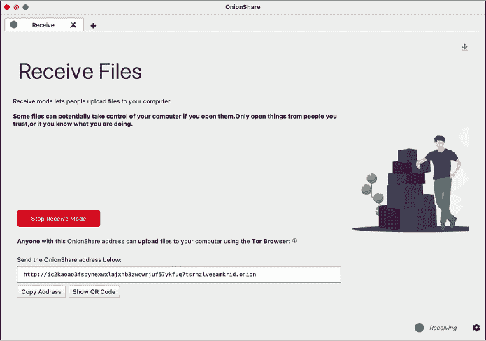
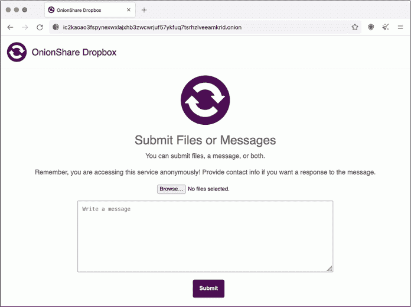
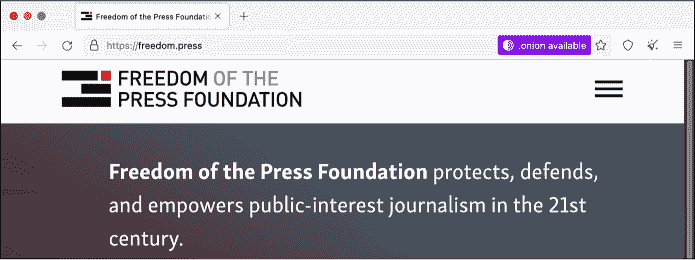

<hgroup>

## <samp class="SANS_Futura_Std_Bold_Condensed_B_11">2</samp> <samp class="SANS_Dogma_OT_Bold_B_11">获取数据集</samp>

</hgroup>

2010 年 1 月初，22 岁的切尔西·曼宁坐在巴格达东部一个临时的敏感信息隔离设施（SCIF）内，使用一台 Windows 电脑。她正在从军事网络 SIPRNet 下载 50 万份秘密的“重要活动”报告，SIPRNet 是美国国防部用于传输机密信息的计算机网络。

作为一名为美国陆军工作的情报分析员，曼宁需要定期访问这些数据库，因此她将它们下载以便工作使用。拥有本地副本在网络访问可能不可靠的战区尤其有用。直到那个月稍晚些时候，她才决定将这些文件泄露给公众，因为她意识到这些文件记录了美国在伊拉克和阿富汗的战争罪行。这些文件很快成为 21 世纪最重要的公共数据集之一。“我相信，如果普通公众，尤其是美国公众，能够接触到[伊拉克战争日志和阿富汗战争日志]中的信息，这将激发关于军队角色和我们外交政策的一场国内辩论，”她在军事法庭听证会上后来这样说。

在 SCIF 的电脑前，曼宁使用名为 WinRAR 的程序压缩文件，将其刻录到可重写 CD 上，并将其留在 SCIF 内以便参考。几周后，在一个星期五的夜班结束时，她将 CD 放入自己的货裤口袋，前往宿舍，将数据复制到自己的笔记本电脑上。最终，她将其复制到数码相机的 SD 卡中，并在 1 月 23 日带着 SD 卡飞抵华盛顿特区外的里根国家机场。

2010 年，像这样的巨大泄密事件是前所未有的。今天，这种事情时有发生。那时，WikiLeaks 是唯一可以供消息来源泄露信息的地方——传统新闻机构并未准备好处理这种泄密事件。然而，现在有了很多选择：消息来源可以将文件发送给像“分布式否认机密”（DDoSecrets）这样的透明性组织，也可以通过 Signal 和 OnionShare 等工具直接联系记者，或者他们可以通过新闻机构的公开提示页面上的指示与新闻机构取得联系。

在这一章中，你将学习安全获取公共和私人数据集的最佳实践。你将了解更多关于维基解密和 DDoSecrets 的历史，然后使用名为 BitTorrent 的技术从 DDoSecrets 获取你自己的 BlueLeaks 数据集副本。你将下载 Signal 即时通讯应用程序来安全地与消息源沟通，并学习 PGP 加密，这是另一种保护消息的方式。你将练习使用 Tor 和 OnionShare 匿名传输数据，接着阅读我如何使用这些工具与消息源沟通的故事。最后，我将概述几种从消息源安全接收数据的其他方法，包括适用于专业新闻机构而非单个记者的技术。

### <samp class="SANS_Futura_Std_Bold_B_11">维基解密的终结</samp>

在决定泄露《战争日志》之后，曼宁首先联系了*华盛顿邮报*的一名记者，但她感觉他们没有认真对待她。她又试图联系*纽约时报*，但只留下了语音邮件，报社从未回电。最终，她选择了维基解密，一个由澳大利亚信息活动家朱利安·阿桑奇于 2006 年创办的泄密网站。事实证明，当时这个选择是非常正确的。除了发布这些文件外，维基解密还与世界各地的报纸合作，包括*纽约时报*、*卫报*和*明镜周刊*，一起披露关于美国帝国主义的重大新闻。与 25 万个被称为 Cablegate 的美国国务院电报数据集一起，曼宁泄露的两个数据集成为了阿拉伯之春的催化剂，这是 2011 年推动中东和北非地区推翻政府的亲民主运动，其中包括埃及和突尼斯的专制政权。

当时，维基解密具有革命性，通过使大量数据集对公众开放，启动了基于文档的透明度运动。曼宁泄露的文件是其首次发布的具有国际影响力的重要文件，这使得维基解密成为一个概念验证，证明了允许任何人匿名提交泄露文件的网站是可行的。如今，几乎每个美国的大型新闻机构以及世界上许多新闻机构都可以使用像 SecureDrop 这样的开源软件具备这种能力，尽管新闻机构很少像维基解密那样发布原始数据集。

曼宁几年前将这些数据集发送给 WikiLeaks，当时这个透明度组织及其编辑阿桑奇从一个基于“信息应当自由”的新闻事业转变为一个道德上有疑问的政治组织，致力于帮助唐纳德·特朗普在 2016 年当选总统。在那次美国大选期间，WikiLeaks 和阿桑奇彻底失控。该组织发布了一个充满被黑客窃取的民主党全国委员会（DNC）和克林顿竞选邮件的数据集，恰好分散了新闻周期的注意力，而那个周期正在报道特朗普在“好莱坞访问”录音带中的丑闻，这段录音展示了他吹嘘性侵行为。阿桑奇对公众撒谎，声称数据的来源是俄罗斯军事情报，从而助长了“塞思·里奇”阴谋论，声称这位在华盛顿特区被谋杀的无关民主党工作人员才是数据的真实来源。WikiLeaks 还推广了“披萨门”阴谋论，声称高层民主党官员涉及一个由披萨店经营的儿童性贩运团伙。

今天，WikiLeaks 仅仅是一个 X（前身为 Twitter）账号。它的文档提交系统已经停止工作，网站也不再维护。WikiLeaks 的消失对于全球的调查性新闻事业来说是一次悲剧，但一个新的、更好的组织已经崛起，取而代之：DDoSecrets。

### <samp class="SANS_Futura_Std_Bold_B_11">分布式秘密拒绝</samp>

分布式秘密拒绝（DDoSecrets）是一个美国非营利透明度集体，由 Emma Best 于 2018 年成立。它类似于 WikiLeaks，但没有朱利安·阿桑奇那种有毒的自负，而且在集体决策方面具有更多透明度，并且大部分由酷儿群体运营。

DDoSecrets 托管了之前由 WikiLeaks 发布的数据集，如 DNC 电子邮件数据集，也包括那些 WikiLeaks 拒绝发布的内容，比如“克里姆林宫黑暗面”数据集，其中包含了来自俄罗斯寡头和政治家的超过 100GB 的文件和电子邮件。值得注意的是，它还托管了大量在 2022 年 2 月俄罗斯入侵乌克兰后泄露的数据。在那时，黑客——大多声称自己是黑客活动分子，许多人认同匿名黑客运动——对俄罗斯发动了网络攻击。他们黑入了数十个俄罗斯组织，包括政府机构、石油和天然气公司以及金融机构，并向 DDoSecrets 提交了数十 TB 的数据，供公众和记者传播。

> <samp class="SANS_Dogma_OT_Bold_B_21">注意</samp>

*我与 DDoSecrets 密切合作，担任顾问，有时也会做志愿者工作。*

任何人都可以从 DDoSecrets 下载以下数据集：

**BlueLeaks**

BlueLeaks 是一个包含 270GB 文件的集合，来自数百个美国执法机构和警察融合中心网站，这些文件在 2020 年黑人命也是命（Black Lives Matter）运动高峰期发布。到本书结束时，你会非常熟悉这个数据集，并且你将在本章的第一个练习中下载它。

**Parler**

Parler 数据集包含 32TB（是的，TB）的视频，这些视频来自右翼社交网络 Parler，其中包括许多 2021 年 1 月 6 日美国国会大厦反民主骚乱的视频。这些视频中的许多被用作唐纳德·特朗普第二次弹劾调查的证据。你将在第十一章中了解更多关于该数据集的信息。

**Epik Fail**

Epik Fail 数据集包含来自 Epik 的 10 年域名注册数据，Epik 是一家以为新纳粹分子及其他极端组织托管域名和网站而臭名昭著的公司。你将在第十二章中探讨这个数据集。

除了像这样的公共数据集外，DDoSecrets 还托管许多仅对请求访问的记者和研究人员开放的私有数据集。包含大量个人身份信息（PII）如姓名、电子邮件地址、出生日期或密码的数据集通常会被保密。例如，Oath Keepers 数据集包括来自美国极右翼准军事组织的数 GB 数据，包括充满该组织成员和捐赠者记录的电子表格。该部分数据仅限于请求访问的记者和研究人员，但另一部分 5GB 的电子邮件和聊天记录对公众开放。你将在第四章下载这部分数据，并在第六章中使用它。

DDoSecrets 发布了比这些更多的数据集，并且它持续不断地发布新的数据集。欲了解所有可用的数据集清单，以及如何请求访问限量分发数据集的说明，请访问 [*https://<wbr>ddosecrets<wbr>.com*](https://ddosecrets.com)。

> <samp class="SANS_Dogma_OT_Bold_B_21">注意</samp>

*你将无法在 X 上分享 DDoSecrets 的链接。在 DDoSecrets 发布 BlueLeaks 后不久，Twitter 永久封禁了 @DDoSecrets 账户，并审查了所有指向* [`ddosecrets.com`](https://ddosecrets.com)*的链接，*理由是其对发布被黑客攻击数据的政策执行不力。Twitter，现在称为 X，阻止包含 DDoSecrets 链接的推文甚至私信通过，尽管 WikiLeaks 并未面临类似的审查。*

DDoSecrets 使用一种名为 BitTorrent 的协议来分发公共数据集。要下载数据集，你需要学习如何使用它。

### <samp class="SANS_Futura_Std_Bold_B_11">使用</samp> <samp class="SANS_Futura_Std_Bold_B_11">BitTorrent 下载数据集</samp>

在 21 世纪初，早在像 Netflix 和 Spotify 这样的服务让在线娱乐变得廉价且普及之前，像 Napster、LimeWire 和 Kazaa 这样的点对点文件共享服务因其让下载盗版媒体和软件变得如此简单而风靡一时。版权行业迅速通过诉讼关闭了这些集中式服务，但去中心化技术从它们的废墟中崛起。最受欢迎的去中心化技术之一就是 BitTorrent。除了盗版，BitTorrent 也常用于合法分发大型文件，如 Linux 操作系统以及庞大的数据集。

BitTorrent 非常适合分享有争议的数据，如 BlueLeaks，因为没有人——无论是美国政府、警察部门、科技公司、互联网服务提供商，还是其他任何人——能轻易地对其进行审查。传统上，互联网上的一台计算机托管数据（例如在一个网站上），所有其他计算机连接到这个主机下载数据。如果有人想要审查这些数据，他们只需要关闭那个唯一的主机。然而，使用 BitTorrent 时，数据托管在*swarms*中，swarms 是当前共享特定文件集的计算机集合。如果你想下载某个数据，你可以通过在你的 BitTorrent 软件中打开一个指向数据的链接，称为*torrent*，加入这个 swarm 并成为一个*peer*。你的 BitTorrent 软件从 swarm 中的其他同伴那里下载你需要的文件片段，作为回报，你将自己已拥有的数据片段上传给其他需要的同伴。一旦你拥有了所有所需的数据，你可以继续留在 swarm 中，并与其他同伴继续分享，只要你保持 BitTorrent 软件打开，这样你就成为一个*seed*。如果你有足够的网络带宽并且被允许分享这些文件，通常的好习惯是保持做种，尤其是在其他种子较少的情况下。

每个 BitTorrent 下载群体需要至少一个种子，才能让同伴完成所有数据的下载。数据越受欢迎，群体越大，下载速度越快——而审查也变得越难。很难阻止一个下载群体中的每一个同伴（群体可能有数万名同伴），也没有什么能阻止更多的同伴加入。没有单一的实体可以起诉或施加财务压力。下载群体通常由分布在全球的计算机组成，因此国家法律也无法实现它们可能追求的审查。

使用 BitTorrent 共享你合法允许共享的文件并不违法。暴雪娱乐甚至采用了这项技术来分发大型视频游戏，比如*魔兽世界*，并且互联网档案馆（位于[*https://<wbr>archive<wbr>.org*](https://archive.org)的非营利数字图书馆）也使用 BitTorrent 来分发像广播和电视节目这样的庞大文件。BitTorrent 的托管结构使得下载速度更快，并且带宽成本在整个下载群体中分担。

大多数公开可用的 DDoSecrets 数据集是通过 BitTorrent 分发的。为了通过 BitTorrent 下载某些内容，你需要以下条件：

+   程序已安装在你的计算机中，称为*BitTorrent 客户端*。你可以使用任何你喜欢的客户端，包括命令行版本，但我喜欢一个叫 Transmission 的客户端。它是免费的开源软件，在 Windows、macOS 和 Linux 中表现得都很出色。

+   一个*.torrent*文件，你可以在你的 BitTorrent 客户端中打开它，或者一个*磁力链接*，这是一种以*magnet:*开头的 URL，告诉你的 BitTorrent 客户端去哪里找到完整的*.torrent*文件。

+   大约 1TB 的存储空间，至少如果你想下载本书中使用的数据集。我建议你将数据下载到你在练习 1-2 中设置的加密*数据集*USB 磁盘上。

稍后，你将使用 BitTorrent 下载 BlueLeaks 数据集的副本，但首先让我们来看看这些数据的来源。

### <samp class="SANS_Futura_Std_Bold_B_11">BlueLeaks 的起源</samp>

美国地方、州和联邦执法机构的不同监视系统收集了足够的情报，提前发现了 2001 年 9 月 11 日恐怖袭击的关键线索。然而，每个机构将这些信息保留在自己手中，未能阻止此次袭击。事后，美国政府决定这些机构需要改善彼此之间的信息共享。国会指示新成立的国土安全部（DHS）在全国范围内创建*融合中心*，这些中心是联邦机构（如 DHS 和 FBI）与州和地方警察部门之间的合作，旨在共享情报并防止未来的恐怖袭击。这些融合中心是 BlueLeaks 数据的主要来源之一。

根据 2012 年参议院的一份报告，这些融合中心“没有提供有用的情报来支持联邦反恐工作”，而它们所产生的情报报告“往往不靠谱，时效性差，有时危及公民的公民自由和隐私法保护，偶尔是从已经发布的公共来源中获取的，且大多数情况下与恐怖主义无关。”融合中心还曾被发现渗透并监视反战活动人士，并且在 2008 年，美国公民自由联盟发布了一份关于融合中心滥用的报告，包括对宗教团体的监视，违反了第一修正案。

2020 年 6 月，一名自称为匿名者运动的黑客攻击了 251 个执法网站，其中大多数是融合中心及相关组织。被黑客攻击的数据被称为 BlueLeaks，包含了数千份警察文件和电子表格，共有超过 1600 万行数据。这些数据的时间跨度从 2007 年到 2020 年 6 月 14 日，正值乔治·弗洛伊德被警察谋杀引发的黑人生命也重要运动（Black Lives Matter）全面爆发之时。

虽然来自 Anonymous 的黑客活动者在闯入这些警察网站并窃取所有这些数据时违反了法律，但在美国，下载 BlueLeaks、调查它并发布你的发现是合法的。

### <samp class="SANS_Futura_Std_Heavy_B_21">练习 2-1：下载 BlueLeaks 数据集</samp>

在这个练习中，你将把 BlueLeaks 数据集下载到你在上一章加密的 1TB USB 硬盘上。稍后你将研究该数据集的内容。

下载 Transmission（[*https://<wbr>transmissionbt<wbr>.com*](https://transmissionbt.com)）或任何你选择的 BitTorrent 客户端，并根据你的操作系统安装它。加载 DDoSecrets 网站上的 BlueLeaks 页面，地址为 [*https://<wbr>ddosecrets<wbr>.com<wbr>/wiki<wbr>/BlueLeaks*](https://ddosecrets.com/wiki/BlueLeaks)。从那里找到 BlueLeaks 种子的磁力链接并将其复制到剪贴板。

接下来，打开 Transmission。点击 **文件**▸**打开种子地址**，粘贴磁力链接，然后点击 **打开** 开始下载数据。当你第一次将这个种子添加到客户端时，它会询问你想将其保存到哪里。将其保存到你的 *datasets* USB 硬盘上，然后坐下来，看着 BitTorrent 按照自己的方式工作。它应该会连接到 swarm，开始从其他节点下载 BlueLeaks 的数据块（同时也可能将数据块上传到其他节点），并在下载完成时提醒你。当下载完成后，你将为 BlueLeaks 种子做种，允许其他人从你这里下载，直到你将种子从 Transmission 中移除。

269GB 的下载可能需要几个小时，甚至几天，如果你的网络连接比较慢的话。在等待的同时，请继续阅读。

### <samp class="SANS_Futura_Std_Bold_B_11">使用加密消息应用程序进行沟通</samp>

你在线上沟通的大多数方式并不十分安全，即使你发送的是表面上看似私密的消息。如果你在 Slack、短信或社交媒体上的私信中讨论一些非敏感的信息，这倒是没问题。然而，当你与一个可能因为和你交谈而面临报复的机密来源沟通时，你应该始终使用加密的消息应用程序。

在 WhatsApp 和 iMessage 等加密消息应用中，Signal 因其源通信的最佳选择而脱颖而出。与其他应用不同，Signal 无法被强迫与执法机构或泄漏调查员分享关于其用户的大多数信息，因为它根本无法访问这些用户数据。公司唯一能检索到的信息是用户创建 Signal 账户的日期，以及该账户最后一次连接到 Signal 的日期。即便是那些通常能够监视你通信的人，如消息应用的员工、云托管提供商或互联网监控机构，也无法访问你的 Signal 消息。Signal 是我处理敏感工作通信和个人消息的主要应用。如果我一开始在其他平台（如 SMS、社交媒体的私信等）与人聊天，我会尽快将对话转移到 Signal 上。

更详细地说，Signal 如何确保尽可能少地收集关于用户的信息：

+   由于消息和通话是*端到端加密*的，Signal 服务无法访问它们的内容。这意味着，如果你在手机（你的端）上给我发送一条 Signal 消息并点击发送，Signal 应用会为我加密消息，换句话说，会创建一条完全混乱的消息版本，只有我才能解密它。这条加密消息随后会传输到 Signal 的服务器，服务器将其转发到我的手机（我的端）。一旦消息到了我的手机，Signal 应用就会解密它，这样我就能读取原始消息。Signal 的服务器本身永远无法访问原始消息，只有加密版本，并且它们永远没有能力解密——只有消息接收者才有能力解密。

+   Signal 服务器不会存储元数据，即你发送消息的时间和对象记录。它们也无法访问你的联系人列表，甚至无法查看与你的电话号码关联的名字和头像。

+   Signal 发明了一种名为*密封发送者*的技术，利用加密技术防止除了你和消息接收者之外的任何人知道你在与谁通信。即使 Signal 秘密地想要存储你的元数据（或者有人黑客入侵了 Signal 的服务器来监视元数据），它们仍然无法访问这些数据。

+   Signal 并不知道哪些电话号码属于哪些 Signal 群组，或有关该群组的任何元数据，例如群组的名字或头像。

Signal 的代码是开源的，这让专家们可以检查其中的缺陷和后门，且其加密协议已经得到加密专家的同行评审。

Signal 的安全协议与其他加密通讯应用的协议形成鲜明对比。例如，WhatsApp 经常与执法机关共享元数据，比如监控目标与哪些电话号码进行通讯，以及何时使用这些号码。WhatsApp 甚至可以实时共享这些数据，用作证据对付像财政部员工 Natalie Mayflower Sours Edwards 这样的告密者，她在 第一章 中被提到。当她在 2018 年被起诉并指控将一份秘密数据集分享给 BuzzFeed 记者 Jason Leopold 时，针对她的证据包括来自加密通讯应用的实时元数据。这些元数据显示 Edwards 和 Leopold 在 Leopold 发布多篇基于该数据集的文章时交换了数百条消息。如果她们使用的是 Signal，就能避免这种情况。

> <samp class="SANS_Dogma_OT_Bold_B_21">注意</samp>

*网页* [`<wbr>signal<wbr>.org<wbr>/bigbrother<wbr>/`](https://signal.org/bigbrother/) *列出了 Signal 被要求与执法机关共享数据的少数几次以及他们的回应。在所有情况下，Signal 要么未共享任何数据（因为该组织表示，“我们根本无法交出我们从未接触过的数据”），要么只共享了目标 Signal 账户创建的日期和最近连接到服务的日期。*

为了提高安全性，你可以与另一位 Signal 用户比对 *安全号码*，这样你可以验证与此人之间的端到端加密是否安全，且未被 Signal 服务、你的互联网服务提供商或其他任何人篡改。在 Signal 聊天中，你可以点击与之对话的人的名字，然后点击 **查看安全号码**。这会显示你的安全号码，既有数字形式，也有二维码。如果你的安全号码与对方相同，你可以确认端到端加密是安全的。如果你们在同一个房间内，可以通过安全号码界面扫描对方的二维码以确认。如果是远程确认，你可以复制安全号码并粘贴到其他通讯应用中（不是 Signal），然后发送给同一个人。如果你确认安全号码匹配，点击 **标记为已验证**。一旦你与联系人验证了安全号码，Signal 会明确标明该号码已验证，并且如果安全号码发生变化，会发出警告——这可能意味着加密受到攻击，但更有可能只是意味着你正在对话的人换了新手机，你需要重新验证。

一旦 Signal 消息到达你的设备，它们的安全性就取决于你的手机本身。泄露调查员如果搜查你的手机或你源头的手机，将能访问每个设备上的所有消息。为了防止设备被搜索，始终使用 Signal 的消失消息功能，该功能会在你查看消息后自动删除消息，除非你有充分的理由保留某个特定对话的消息。你可以选择在查看消息后 30 秒到 4 周之间删除消息，或者设置自定义时间。我通常将消失消息设置为 4 周，如果我发送像密码这样的机密信息，会把它更改为一小时左右，然后再改回 4 周。在你的 Signal 隐私设置中，我建议选择让所有新对话默认启用消失消息功能。你还应该采取措施锁定你的手机，例如使用强随机密码，确保只有你能轻松解锁设备。

Signal 不仅非常安全，而且非常容易使用。任何两个人只要安装了这个应用，就可以互相发送加密的文本消息、分享加密文件，并进行加密语音通话和视频通话，或者进行多用户的群聊。

### <samp class="SANS_Futura_Std_Heavy_B_21">练习 2-2：安装并练习使用 Signal</samp>

在本次练习中，你将安装 Signal 到手机和电脑，并练习使用它。

从手机开始：打开 iPhone 的 App Store 或 Android 的 Play Store，下载 Signal 私人消息应用。打开应用后，你需要验证你的手机号码并设置 PIN 码（请将此 PIN 码保存在密码管理器中）。Signal 还会请求一些权限。在我看来，授予所有权限是完全安全的。Signal 使用联系人权限来发现哪些联系人也在使用此应用，但它的方式是不能直接访问你的联系人列表的。（如果你授予了访问权限，当你的某个联系人创建 Signal 账户时，应用会通知你。）

接下来，从[*https://<wbr>signal<wbr>.org*](https://signal.org)下载 Signal 到你的电脑。安装后，你需要扫描手机上的二维码，将电脑设置为已链接设备。请记住，现在你的 Signal 消息将同时复制到两个设备上，因此确保这两个设备都保持安全。

为了练习发送加密消息，可以让一些朋友也安装 Signal。发送消息给他们，玩一下消失消息功能，尝试加密语音通话和视频通话。如果你在 Signal 上有足够多的朋友，可以创建一个 Signal 群组。

### <samp class="SANS_Futura_Std_Bold_B_11">使用 PGP 加密消息</samp>

除了通过安全消息应用进行通信外，你还可以使用 PGP（“非常好的隐私”）加密来加密消息。该加密方法最早于 1991 年开发，用于加密电子邮件。在与消息来源及其他记者进行安全通信时，PGP 一直非常重要；我在报道斯诺登档案时广泛使用过它。与现代加密消息应用程序（如 Signal）相比，PGP 复杂且容易出错，因此我建议如果可以的话避免使用它，而选择一些更好的替代方案。不过，如果你的某个消息来源使用 PGP，你可能会在未来的调查中发现它有用。

PGP 的工作原理如下：用户在他们的计算机上创建一个名为*PGP 密钥*的文件，该文件可以分为两部分，一个是*公钥*，另一个是*私钥*。如果你拥有该用户的公钥副本，你可以使用它加密消息，这样只有拥有该私钥的人才能解密该消息。然后你可以将这个加密的消息通过电子邮件发送给拥有私钥的 PGP 用户。如果其他人访问了该电子邮件，消息将被加密，他们无法阅读内容。然而，当拥有私钥的人查看这封邮件时，他们可以解密并阅读原始消息。

有时人们仍然会给我发送 PGP 加密的电子邮件，我也会使用 PGP 安全地回复他们。你可以在我的个人网站上找到我的 PGP 公钥，[*https://<wbr>micahflee<wbr>.com*](https://micahflee.com)。我将我的 PGP 私钥保存在一个名为 YubiKey 的 USB 设备中，它看起来像一个带按钮的 USB 闪存盘。YubiKey（和其他安全密钥）主要用于保护在线账户。即使黑客知道我的 Google 账户的用户名和密码，例如，他们也无法登录，除非先物理盗取我的 YubiKey，将其插入他们的计算机，并在尝试登录时按下按钮。YubiKey 也可以用来安全存储 PGP 私钥。

### <samp class="SANS_Futura_Std_Bold_B_11">使用 Tor 和 OnionShare 保持在线匿名</samp>

Tor 和 OnionShare 是与希望匿名发送数据的来源合作以及进行需要保持自己匿名的调查时的重要工具。

Tor 是一个由志愿者服务器组成的去中心化网络，称为*节点*。它通过将你的互联网连接通过一系列这些节点转发来保持你在线上的匿名性。Tor 浏览器是一个将所有网页流量通过 Tor 网络发送的浏览器。使用 Tor 浏览器的方式类似于使用 Chrome 或 Firefox。假设你想匿名访问“有组织犯罪与腐败报道项目”（OCCRP）的官方网站[*https://<wbr>www<wbr>.occrp<wbr>.org*](https://www.occrp.org)，你只需要打开 Tor 浏览器（你可以从[*https://<wbr>www<wbr>.torproject<wbr>.org*](https://www.torproject.org)下载），等待它连接到 Tor 网络，输入**occrp.org**在地址栏中，按下回车键，页面就会加载。

> <samp class="SANS_Dogma_OT_Bold_B_21">注意</samp>

*我长期以来一直是 Tor 社区的志愿者，参加该非营利组织在全球的线下活动，有时还会运行 Tor 节点为网络做出贡献，并开发与 Tor 相关的软件。*

Tor 浏览器比普通浏览器更慢，因为它会将你的网络流量通过全球的三个随机 Tor 节点中转，然后再发送到 OCCRP 网站。没有任何一个节点知道你的真实 IP 地址（会暴露你的位置）和你访问的网站。这意味着你不需要信任这些节点就能使用它们。即使一个 Tor 节点由罪犯或间谍运营，他们也无法揭示你的身份，至少在没有利用 Tor 网络本身的漏洞之前是这样的。当你关闭 Tor 浏览器时，你的浏览会话的所有信息都会被删除，不会在本地计算机上留下痕迹。

由于 Tor 允许用户在线匿名，人们通常会用它进行黑客攻击网站、创建账户进行垃圾邮件或网络钓鱼等类似活动。因此，很多网站（包括 Google）通常对 Tor 流量非常警惕，并要求 Tor 用户跳过额外的障碍，比如填写 CAPTCHA，甚至完全封锁它们。不幸的是，这就是在线匿名的代价。

除了允许互联网用户保持匿名，Tor 还可以让服务器保持匿名。这些服务器被称为 Tor *洋葱服务*（有时也称为 *暗网*），其域名以 *.onion* 结尾。你只能通过使用 Tor 来访问洋葱服务。像 Tor 浏览器一样，洋葱服务也会选择三个随机的 Tor 节点来中转其流量。当用户在 Tor 浏览器中加载洋葱网站时，实际上需要通过 Tor 网络进行六次跳跃：三个在 Tor 浏览器端，三个在洋葱服务端。

> <samp class="SANS_Dogma_OT_Bold_B_21">注意</samp>

*“.onion”* 域名来源于属于洋葱服务的公钥的加密指纹。Tor 协议确保没有其他人能在不了解该洋葱服务的密钥的情况下使用相同的名称。

OnionShare 是我在 2014 年首次开发的，并且从那时起一直在不断添加新功能的软件，它使任何人都能轻松运行洋葱服务，允许他们匿名且安全地发送和接收文件。它直接在你的计算机上运行一个 web 服务器，并将该服务器作为洋葱服务提供给其他人，显示一个 *.onion* 地址供你发送给别人。当你启动 OnionShare 服务时，你可以选择分享模式，让他人从你的计算机上下载特定的文件，或者接收模式，让他人向你的计算机上传文件。

OnionShare 还支持其他模式。例如，在聊天模式下，你可以快速建立一个匿名聊天室。虽然它没有 Signal 群组那么多功能，但它能让你保持更强的匿名性。在网站模式下，你可以快速托管一个 *静态网站*——一个由 HTML 文件和图像、JavaScript 等资源构成的简单网站，但没有数据库或服务器上的运行代码，作为 onion 服务。如果有人在 Tor 浏览器中加载该地址，他们的连接会通过 Tor 网络传输，直到到达你的计算机，然后加载由 OnionShare 托管的网站。

图 2-1 显示了配置为匿名 Dropbox 的 OnionShare 软件，允许我的 URL 接收者（如源）匿名且安全地将文件直接上传到我的计算机。



<samp class="SANS_Futura_Std_Book_Oblique_I_11">图 2-1：OnionShare 接收模式</samp>

例如，使用 OnionShare 让源给我发送数据时，我会在计算机上打开 OnionShare，连接到 Tor 网络，点击 **接收文件**，然后点击 **启动接收模式**。该服务会给我一个类似 *http://<wbr>ic2kaoao3fspynexwxlajxhb3zwcwrjuf57ykfuq7tsrhzlveeamkrid<wbr>.onion<wbr>* 的 URL。我会把这个 URL 发送给我的源并等待。我的源会打开 Tor 浏览器，加载该 URL，这会加载一个直接托管在我计算机上的网站，然后上传他们的文件。因为 OnionShare 使用了 Tor，我无法得知源的 IP 地址，而我的源也无法得知我的 IP 地址。

图 2-2 显示了我的源所看到的网页样子。



<samp class="SANS_Futura_Std_Book_Oblique_I_11">图 2-2：使用 Tor 浏览器访问 图 2-1 中显示的 OnionShare 接收模式站点</samp>

我发送给我的源的 URL 以 *http://<wbr>* 开头，而不是 *https://<wbr>*。HTTPS 加密了网页浏览器和网络服务器之间的流量；通常情况下，只有使用普通 HTTP，网络监控者就可以窥探你正在做什么，上传了什么文件，以及你在表单中提交了哪些密码。然而，onion 服务是这个规则的例外，因为 Tor 浏览器与 onion 服务之间的连接已经是端到端加密的。虽然可以为 onion 服务添加 HTTPS，但这样做是多余且不必要的。还要注意，图 2-2 中 URL 的域名部分是由 56 个看似随机的字母和数字组成，后面跟着 *.onion*。与普通域名不同，你不能选择 onion 服务的名称，它们都像这样。

OnionShare 在您的计算机上直接运行一个 web 服务器。这意味着第三方公司无法访问共享的任何文件，但也意味着您必须把握时机。如果我发送了那个 OnionShare 链接，然后关闭了笔记本电脑让它进入睡眠状态，那么我的源在我唤醒计算机之前无法加载该网站。OnionShare 在与人实时协作时效果最佳。然而，由于它使用的是 Tor 网络，它的速度非常慢*。* 传输几 GB 的数据可能需要几个小时甚至几天。若要传输特别大的数据集，请考虑使用非 Tor 方法，稍后本章中将介绍此类方法。

> <samp class="SANS_Dogma_OT_Bold_B_21">注意</samp>

*欲了解更多信息，请阅读 OnionShare 的详细文档，访问* [`docs.onionshare.org`](https://docs.onionshare.org)*。*

如果您使用 OnionShare 发送敏感数据，我建议您仅通过加密消息应用程序（如 Signal）共享 OnionShare URL，并避免通过不安全的通信渠道（如电子邮件或社交媒体私信）发送。这样可以防止那些能够访问不安全渠道的人先加载 OnionShare URL 或修改该 URL，以诱使您的源上传文件给他们。

### <samp class="SANS_Futura_Std_Heavy_B_21">练习 2-3：玩转 Tor 和 OnionShare</samp>

在本练习中，您将安装 Tor 浏览器和 OnionShare，并进行实践操作。请从 [*https://<wbr>onionshare<wbr>.org*](https://onionshare.org) 下载 OnionShare，并从 [*https://<wbr>www<wbr>.torproject<wbr>.org*](https://www.torproject.org) 下载 Tor 浏览器，并根据您的操作系统跟随指示进行安装。

打开 Tor 浏览器，搜索任何您感兴趣的内容，并访问各种网站，看看在线体验有何不同。Tor 浏览器的默认搜索引擎是 DuckDuckGo，它在 Tor 网络上运行良好。然而，您会发现使用 Google 是很令人沮丧的，因为它不断要求您填写验证码以证明自己不是机器人。许多网站同时有 *清网* 版本（可以用常规浏览器访问）和 *.onion* 版本。如果您使用 Tor 浏览器访问一个支持两种版本的网站，例如 [*https://<wbr>freedom<wbr>.press*](https://freedom.press)，您会看到地址栏右上方有“.onion 可用”按钮。点击该按钮应能将您带到该网站的 onion 版本。

图 2-3 显示了在 Tor 浏览器中访问自由新闻基金会网站，并展示了“.onion 可用”按钮。



<samp class="SANS_Futura_Std_Book_Oblique_I_11">图 2-3：自由新闻基金会首页</samp>

接下来，试着使用 OnionShare。打开“共享文件”标签，浏览电脑上的文件，并启动服务。然后打开 Tor 浏览器，加载 OnionShare 的 URL，下载这些文件。测试一下小文件、大文件以及不同的设置。接着，尝试设置一个匿名的 Dropbox 来接收文件：打开 OnionShare，打开“接收文件”标签，启动服务。在 Tor 浏览器中，加载 OnionShare 的 URL，上传文件到你的电脑。同样，测试一下小文件、大文件和不同的设置。

### <samp class="SANS_Futura_Std_Bold_B_11">与我的 Tea Party Patriots 来源的沟通</samp>

本节描述了我如何通过多个工具从匿名来源收集数据的实际例子，这些工具你们已经见过：Twitter 私信、PGP 加密消息、通过 Signal 进行沟通，以及通过 OnionShare 接收数据集。

2021 年夏天，一名记者通过 Twitter 给我发了私信，转发了另一位人士的留言。记者并不知道留言的内容，因为它是 PGP 加密的。留言内容大致是这样的：

```
-----BEGIN PGP MESSAGE-----

`[lots of scrambled letters and numbers]`

-----END PGP MESSAGE-----
```

我插入了我的 YubiKey 并用它解密了 PGP 消息。消息简单地写道：

> 对数据感兴趣吗？
> 
> signal: *[隐藏的电话号码]*

当时，我并没有在社交媒体的个人简介或《Intercept》网站上的员工页面直接公开我的电话号码。如果我有这么做，这个来源就可以直接通过 Signal 联系我，这样会更简单。然而，使用 PGP 确保了我们之间所有的通讯都是端到端加密的，尽管使用了 Twitter 私信，Twitter 并未记录我和来源之间的任何通讯元数据。

我在电脑上打开了 Signal Desktop，输入了在 PGP 加密消息中找到的电话号码，并为这次对话启用了消失消息功能。我打了个招呼，表示我对数据感兴趣。到这时，我与我的新来源建立了安全的通信渠道。

消息来源告诉我，他们黑进了 Tea Party Patriots（茶党爱国者组织），这是一家自称是美国最大保守派草根组织之一的团体。他们想要给我发送一份包含会员名单、捐款历史和请愿数据的数据集，并询问应该如何发送。我给他们发送了一个 OnionShare 链接，让他们将数据集直接上传到我的电脑。

后来，我从这份数据集中了解到，Tea Party Patriots 组织并不像它所宣称的那样是一个草根组织：三位极其富有的捐赠者——其中两位是亿万富翁——提供了该组织大部分的捐款。我还了解到，该组织声称自己是一个拥有“300 多万爱国者”的网络，这一说法严重夸大：在被黑的数据库中，只有 144,000 名成员被标记为“活跃”。（阅读我对这份数据集的分析，链接在此：[ *https://<wbr>theintercept<wbr>.com<wbr>/2021<wbr>/08<wbr>/05<wbr>/tea<wbr>-party<wbr>-patriots<wbr>-hacked<wbr>-billionaire<wbr>-donors*<wbr>/](https://theintercept.com/2021/08/05/tea-party-patriots-hacked-billionaire-donors/).)

### <samp class="SANS_Futura_Std_Bold_B_11">获取数据集的其他选项</samp>

在本节中，你将学习几种当你已经掌握的技能不适用于当前需求时，如何与信息源沟通的方式。

#### <samp class="SANS_Futura_Std_Bold_Condensed_Oblique_BI_11">加密的 USB 驱动器</samp>

你的某些未来信息源可能希望发送给你更多的数据，而这些数据量大到无法通过 Tor 传输。在这种情况下，你可以考虑通过邮寄加密的 USB 驱动器来发送数据。

首先，你的信息源通过第一章中介绍的技术，使用强密码加密一个 USB 移动硬盘或小型 USB 闪存驱动器，然后将数据集复制到该硬盘。之后，他们将 USB 硬盘通过邮寄的方式发送给你。为了保持匿名，他们可以在包裹或信封上写下你的地址，但将回邮地址留空（至少在美国是这样），贴上正确的邮资，并将包裹投入公共邮筒。通过像 Signal 这样的加密消息应用，你的信息源可以将加密密码发送给你。当你收到包裹后，你可以使用密码解锁硬盘并访问数据集。

如果硬盘在邮寄过程中被拦截，数据已被加密，且没有密码是无法访问的。然而，邮政服务会知道包裹是从哪个公共邮筒寄出的，如果你的信息源不小心，可能会在包裹上留下手写痕迹、指纹、DNA 或其他能揭示其身份的线索。

请记住，发送加密硬盘是需要花费一定费用的，因为你需要购买硬盘并支付邮费，且包裹可能需要较长时间才能到达，因此这并不是处理时间敏感数据的最佳选择。

#### <samp class="SANS_Futura_Std_Bold_Condensed_Oblique_BI_11">虚拟专用服务器</samp>

*虚拟专用服务器（VPS）* 是一种在互联网上的虚拟计算机，由像亚马逊 Web 服务（AWS）或 DigitalOcean 这样的公司托管，通常运行 Linux 操作系统，你的信息源可以使用它来共享数据。你将在第四章中学习如何设置和使用 VPS，但在这里我们将讨论它们在某些调查中的适用情况。

VPS 选项有一些缺点：它仅在你的信息源具备必要的技术技能时有效，它需要支付少量费用，而且如果信息源尝试保持匿名，容易犯错。好的一面是，VPS 允许信息源使用极为可靠的工具来传输大量数据。这些工具还支持在传输中途失败时恢复传输，且你甚至可以通过 Tor 匿名使用 VPS。

租用一个 VPS 每月只需几美元——如果你只需要使用它一两天，费用会更低——你可以根据来源需要发送的数据量指定硬盘的大小。然后，你可以启用源使用名为*SSH*的技术远程上传数据到服务器，*SSH*代表*安全外壳*。如果他们认为数据敏感，源可以在上传前对数据集进行加密。

在本章中，你了解了个人记者如何接收来自其消息源的数据。在接下来的部分，我将介绍一些适用于成熟新闻机构的额外工具和技巧。

### <samp class="SANS_Futura_Std_Bold_B_11">举报人提交系统</samp>

正如前文所提到的，当切尔西·曼宁尝试联系*华盛顿邮报*和*纽约时报*以泄露战争日志时，两家报纸都没有接纳或甚至准备接受泄露的数据集。如今情况已不再如此。现在，许多主要新闻机构都有了自己的举报人提交系统，使得安全、匿名地提交泄露数据集或其他线索变得简单。

访问你最喜欢的新闻网站，看看是否能找到它的提示页面，解释潜在消息源和举报人如何安全地联系新闻机构。以下是一些示例：

+   *拦截者*: [*https://<wbr>theintercept<wbr>.com<wbr>/source<wbr>/*](https://theintercept.com/source/)

+   *华盛顿邮报*: [*https://<wbr>www<wbr>.washingtonpost<wbr>.com<wbr>/anonymous<wbr>-news<wbr>-tips<wbr>/*](https://www.washingtonpost.com/anonymous-news-tips/)

+   *纽约时报*: [*https://<wbr>www<wbr>.nytimes<wbr>.com<wbr>/tips*](https://www.nytimes.com/tips)

+   ProPublica: [*https://<wbr>www<wbr>.propublica<wbr>.org<wbr>/tips<wbr>/*](https://www.propublica.org/tips/)

+   CNN: [*https://<wbr>www<wbr>.cnn<wbr>.com<wbr>/tips<wbr>/*](https://www.cnn.com/tips/)

+   *卫报*: [*https://<wbr>www<wbr>.theguardian<wbr>.com<wbr>/securedrop*](https://www.theguardian.com/securedrop)

+   *环球邮报*: [*https://<wbr>sec<wbr>.theglobeandmail<wbr>.com<wbr>/securedrop<wbr>/*](https://sec.theglobeandmail.com/securedrop/)

这些提示页面上的指南大致相同，指导消息源通过以下方式安全地联系新闻机构：发送消息到专用的 Signal 电话号码，使用邮政服务邮寄文件，或者通过开放源代码的举报人提交软件*SecureDrop*联系。

已故信息活动家阿伦·斯沃茨与记者凯文·鲍尔森于 2013 年开发了一个名为 DeadDrop 的平台，供消息源与记者安全地沟通并发送文件。在斯沃茨去世后，鲍尔森将该项目交给了新闻自由基金会，并将其更名为 SecureDrop。当时，我是新闻自由基金会的首席技术官，并为该项目贡献了大量代码。

像 OnionShare 一样，SecureDrop 将计算机变成匿名的投递箱（同样由 Tor 洋葱服务提供支持），以实现文件共享。然而，它是为专业新闻机构设计的。它运行在一个始终在线的专用服务器上，供消息来源使用，并且它要求比 OnionShare 更安全、更偏执的行为——例如，它的设计使得你只能在隔离的环境中打开通过 SecureDrop 发送的文件。

SecureDrop 增强的安全性保护了那些可能冒着生命危险的消息来源，但这种安全性是有代价的。该平台需要大量的工作来设置和维护，包括每天检查新提交内容的持续工作。我曾花了多年时间为《Intercept》检查 SecureDrop，我知道当大多数提交内容是废话或本可以通过电子邮件发送时，穿越安全障碍的过程是令人沮丧的。但如果它能保护一个真正的举报人，那么这份努力是值得的。

如果你与新闻机构或一个希望接受来自消息来源或举报人的数据集的组织合作，可以在你的网站上创建一个提示页面，并了解 SecureDrop。你可以在[*https://<wbr>securedrop<wbr>.org*](https://securedrop.org)上了解更多关于 SecureDrop 项目的信息，并在[*https://<wbr>docs<wbr>.securedrop<wbr>.org*](https://docs.securedrop.org)上阅读详细文档。

### <samp class="SANS_Futura_Std_Bold_B_11">摘要</samp>

在本章中，你了解了 WikiLeaks 的衰亡以及 DDoSecrets 的诞生，并通过 BitTorrent 下载了 BlueLeaks 数据集的副本。你看到了几种与消息来源安全沟通的常用工具，如 Signal、Tor 和 OnionShare。你还学习了一些其他技术，用于安全且匿名地传输大量数据，以及关于提示页面和 SecureDrop 的信息。

下一章标志着第二部分的开始，在那里你将学习如何使用命令行界面，这是一种强大的文本控制计算机的方法。这对于深入分析像 BlueLeaks 这样的数据集至关重要。
