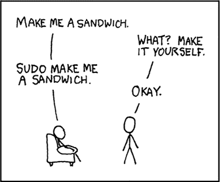
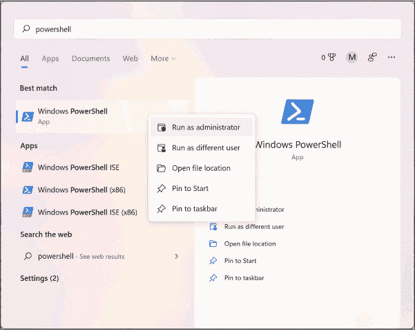
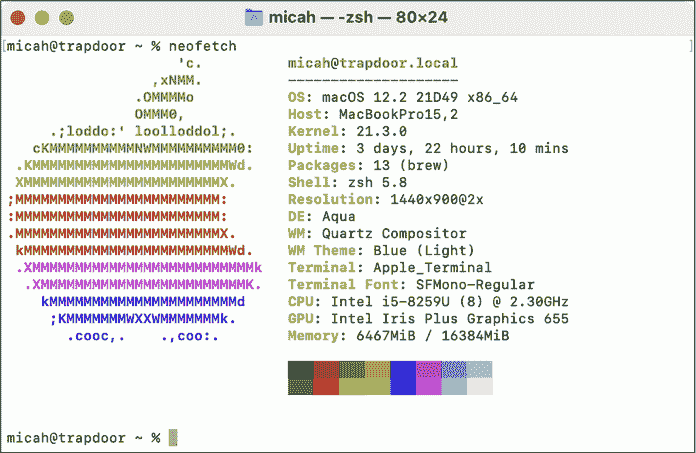
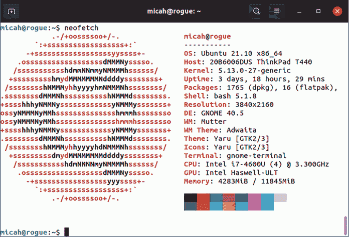
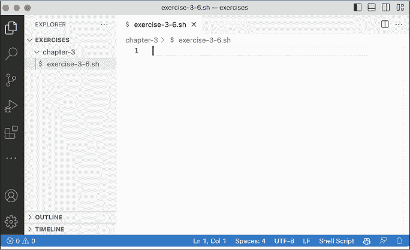

## 第三章：3 命令行界面


> *在命令行界面的时代，用户都像莫洛克人一样，必须将他们的思维转化为字母数字符号并输入，这是一个繁琐的过程，剥去了所有的模糊性，揭示了所有隐藏的假设，严厉惩罚懒惰和不精确。*
> 
> —尼尔·斯蒂芬森，*《命令行的起源》*

如果你像大多数人一样，主要通过图形桌面环境与计算机交互：你通过鼠标或触控板移动指针，点击图标来运行程序和打开文档。程序在窗口中打开，你可以调整窗口大小、最大化、最小化并在屏幕上拖动。你可以同时运行多个程序，每个程序都在不同的窗口中运行，并在它们之间切换。然而，还有一种替代方法，你可以用来与计算机进行交流并给出指令：*命令行界面 (CLI)*。

命令行界面是基于文本的，而不是图形化的，用来与计算机交互。你不再是点击图标，而是输入命令，通过*终端仿真器*（通常简称为*终端*）来运行程序。在运行命令后，你通常会看到终端中显示的基于文本的输出。

在本章中，你将学习一些基本的命令行技能，帮助你跟随本书的其余部分。不论你使用的是 Windows、macOS 还是 Linux，你将学习如何通过命令行安装和卸载软件，文件路径如何工作，如何在计算机中的文件夹之间导航，以及如何使用文本编辑器。你还将编写你的第一个*shell 脚本*，这是一种包含一系列命令的文件。

### 介绍命令行

为了让你准备好开始使用命令行，本节将解释一些基本概念：什么是 shell，用户和路径在不同操作系统中的工作方式，以及权限提升的概念。

#### Shell

*shell* 是让你运行基于文本的命令的程序，而终端是运行 shell 的图形程序。当你打开一个终端并看到一个闪烁的文本光标等待输入命令时，你正在使用一个 shell。当黑客试图突破计算机时，他们的初步目标是“弹出一个 shell”，即访问允许他们运行任意命令的文本界面。

所有操作系统，甚至像 Android 和 iOS 这样的移动操作系统，都有 shell。本书主要介绍 Unix shell，这种 shell 是 macOS 和 Linux 自带的（但 Windows 用户也可以使用）。大多数 Linux 版本使用名为 bash 的 shell，而 macOS 使用的是名为 zsh 的 shell。这些 shell 非常相似，为了本书的目的，你可以将它们视为可以互换的。

另一方面，Windows 提供了两个命令行界面：一个较旧的命令提示符（或 *cmd.exe*）和一个较新的 PowerShell。Windows 命令行使用的 *语法*——定义不同命令含义的规则——与 Unix 命令行使用的语法非常不同。如果你是 Windows 用户，本书中的示例将主要在 Unix 命令行下运行。为 Windows 配置直接运行 Linux 的环境将是本章的第一个练习。

要让你的命令行执行某个操作，例如运行程序，你需要小心输入所需的命令，然后按下 ENTER（或 Mac 键盘上的 RETURN）。要退出命令行，输入 exit 然后按 ENTER。命令行对输入非常敏感：你需要正确输入命令的大小写、标点符号和空格，否则命令不会执行。通常拼写错误只会导致错误信息，但它很容易修正。我会在第 68 页的“编辑命令”部分详细解释如何修正命令错误。

#### 用户与路径

尽管操作系统如 Windows、macOS 和 Linux 在某些方面有所不同，但它们都共享一些基本构件，包括用户和路径。

所有操作系统都有 *用户*，这些是不同的人用来登录同一台计算机的独立账户。用户通常有自己的家目录，也叫做用户目录，存放他们的文件。图 3-1 显示了我在 Ubuntu（一个流行的 Linux 发行版）中的终端界面。


图 3-1: 我的 Ubuntu 终端

我的用户名是 *micah*，我的 Ubuntu 计算机的名字是 *rogue*。你的终端界面会因操作系统、用户名和计算机名的不同而有所差异。

所有操作系统都有文件系统，它是计算机中可用的文件和文件夹的集合（在第一章中，你在加密 USB 磁盘时就已经了解了文件系统的基础）。在文件系统中，每个文件和文件夹都有一个 *路径*，你可以把它看作是文件的所在位置或地址。例如，如果你的用户名是 *alice*，那么在不同操作系统中，你的家目录路径如下所示：

+   Windows: *C:\Users\alice*

+   macOS: */Users/alice*

+   Linux: */home/alice*

Windows 文件系统在几个关键方面与 macOS 或 Linux 文件系统有所不同。首先，在 Windows 中，磁盘被标记为字母。安装 Windows 本身的主磁盘是*C:驱动器*。其他磁盘，例如 USB 磁盘，会被分配其他字母。在 Windows 中，路径中的文件夹使用反斜杠(\)分隔，而其他操作系统使用正斜杠(/)。在 Linux 中，路径区分大小写，而在 Windows 和 macOS 中（默认情况下）不区分。例如，在 Linux 中，你可以将一个名为*Document.pdf*的文件和一个名为*document.pdf*的文件存储在同一文件夹中。如果你在 Windows 中尝试这样做，保存第二个文件将覆盖第一个文件。

让我们来看一些示例路径。如果你的用户名是*alice*，并且你将名为*Meeting Notes.docx*的文件下载到*Downloads*文件夹中，路径可能如下所示：

+   Windows: *C:\Users\alice\Downloads\Meeting Notes.docx*

+   macOS: */Users/alice/Downloads/Meeting Notes.docx*

+   Linux: */home/alice/Downloads/Meeting Notes.docx*

当你插入一个 USB 磁盘时，它会在不同的操作系统中挂载到不同的路径。如果你的磁盘标记为*datasets*，那么表示该磁盘位置的路径可能如下所示：

+   Windows: *D:*（或者 Windows 决定为磁盘分配的其他驱动器字母）

+   macOS: */Volumes/datasets*

+   Linux: */media/alice/datasets*

了解如何读取路径非常重要，因为你需要在执行命令时包含数据集或其包含的文件的位置。

#### 用户权限

大多数用户在操作系统中拥有有限的权限。然而，Linux 和 macOS 中的*root 用户*以及 Windows 中的*管理员用户*拥有绝对权限。例如，*alice*可能无法将文件保存到*bob*的主文件夹中，但 root 用户有权限将文件保存到计算机的任何位置。当 Mac 提示你输入用户密码以更改系统偏好设置或安装软件，或者 Windows 提示你是否允许某个程序对计算机进行更改时，操作系统是在请求你的同意，允许从你的普通用户帐户切换到 root 或管理员用户帐户。

当你在终端中工作时，大多数时候你是以一个没有权限的用户身份运行命令。要在 Linux 和 macOS 中运行需要 root（或管理员）权限的命令，例如安装新程序，只需在命令前加上sudo并按下 ENTER 键，系统将提示你输入常规用户帐户的密码。

作为示例，whoami 命令会告诉您刚刚运行命令的用户是谁。在我的计算机上，如果我输入 whoami 而不加 sudo，输出结果是 micah。然而，如果我输入 sudo whoami，需要输入密码，输出结果是 root：

```
micah@rogue:~$ **whoami**

micah

micah@rogue:~$ **sudo whoami**

[sudo] password for micah:

root
```

如果您最近使用过 sudo，您可以在几分钟内再次运行它，而无需重新输入密码。

警告

*在以 root 身份运行命令时要非常小心，因为以 root 用户身份运行错误的命令可能会意外删除您的所有数据或破坏操作系统。在使用 sudo 之前，确保您清楚即将执行的操作。*

只有当前用户具有管理员权限时，您才能使用 sudo 获得 root 访问权限。如果您是计算机上的唯一用户，那么您很可能是管理员。要确认这一点，可以尝试使用 sudo，看是否会出现“权限被拒绝”错误。

图 3-2 展示了 Randell Munroe 从他的 XKCD 网站上得到的一幅漫画，简洁地展示了 sudo 的强大功能。



图 3-2：使用 sudo 要求三明治

在学习更多命令行代码之前，Windows 用户必须先安装 Ubuntu（请参阅练习 3-1）。Mac 或 Linux 用户可以跳到第 62 页的“基本命令行使用”部分。

### 练习 3-1：在 Windows 上安装 Ubuntu

要在 Windows 机器上使用 Ubuntu，您可以安装 Windows 和 Linux 双系统，或者在 Windows 内使用虚拟机，如第一章所述。然而，考虑到本书的目的，最简单的方法是使用*Windows Subsystem for Linux (WSL)*，这是微软的技术，可以让您直接在 Windows 中运行 Linux 程序。在 WSL 中打开一个 Ubuntu 窗口，反过来会打开一个 bash shell，让您安装并运行 Ubuntu 软件。（从技术上讲，WSL 确实使用虚拟机，但它运行快速，由 Windows 管理，并且是无干扰的，完全在后台运行。）

要安装 WSL，请以管理员身份打开 PowerShell 窗口：点击**开始**，搜索**powershell**，右键点击**Windows PowerShell**，选择**以管理员身份运行**，然后点击**是**。图 3-3 显示了此过程，具体操作可能会因您使用的 Windows 版本而略有不同。



图 3-3：在 Windows 中以管理员身份运行 PowerShell

在管理员 PowerShell 窗口中，输入以下命令并按 ENTER：

```
**wsl --install -d Ubuntu**
```

这将安装 Windows 子系统 for Linux，然后下载并安装 Ubuntu Linux 到你的计算机。

你的屏幕现在应该看起来像这样：

```
PS C :\Windows\system32> wsl --install -d Ubuntu

Installing: Windows Subsystem for Linux

Windows Subsystem for Linux has been installed.

Downloading: WSL Kernel

Installing: WSL Kernel

WSL Kernel has been installed.

Downloading: GUI App Support

Installing: GUI App Support

GUI App Support has been installed.

Downloading: Ubuntu

The requested operation is succession. Changes will not be effective until the

system is rebooted.

PS C:\Windows\system32>
```

该输出的最后一行提示你重启计算机。输入 exit 并按 ENTER（或者直接关闭窗口）退出 PowerShell，然后重启计算机。重新登录到 Windows 后，你应该会看到一个 Ubuntu 窗口，提示你安装可能需要再等几分钟完成。然后，窗口会呈现一个提示，要求你创建一个新用户：

```
Please create a default UNIX user account. The username does not need to match

your Windows username.

For more information visit: https://aka.ms/wslusers

Enter new UNIX username:
```

Ubuntu 需要管理它自己的用户，而不是你 Windows 计算机上现有的用户。

在聚焦的 Ubuntu 终端窗口中，输入一个用户名并按 ENTER。终端应该提示你创建一个密码：

```
New password:
```

你可以使用与登录 Windows 账户相同的密码，或者创建一个新密码并将其保存在密码管理器中。输入你的密码并按 ENTER。在你输入时，Ubuntu 终端中不会显示任何内容。

终端现在应该提示你重新输入新密码；输入并按 ENTER，这应该会将你带入一个 Ubuntu shell，显示一个提示符和一个闪烁的光标。我的提示符显示为 micah@cloak:~$，因为我的用户名是 *micah*，而我的 Windows 计算机名是 *cloak*：

```
New password:

Retype new password:

passwd: password updated successfully

Installation successful!

`--snip--`

micah@cloak:~$
```

你现在可以在 Windows 计算机中打开 Ubuntu。从此以后，当需要打开终端或运行命令行代码时，除非另有说明，否则请使用 Ubuntu 终端窗口。

在 Ubuntu shell 中，你可以通过 */mnt* 文件夹访问 Windows 磁盘。例如，你可以在 */mnt/c* 访问 *C:* 驱动器，在 */mnt/d* 访问 *D:* 驱动器。假设我通过浏览器下载了一个文档，并希望在 Ubuntu 中访问它。我的 Windows 系统中 *Downloads* 文件夹的路径是 */mnt/c/Users/micah/Downloads*，因此该文档将位于该文件夹。如果我想从 Ubuntu 访问下载到我的 USB 磁盘上的 BlueLeaks 数据，假设 *D:* 是 USB 磁盘的驱动器，那么路径将是 */mnt/d/BlueLeaks*。

欲了解更多关于使用 Windows 和 WSL 的详细信息，包括使用 USB 磁盘时常见问题、磁盘性能问题及其解决方法，请查阅附录 A。在你至少完成 第四章 之前，不要开始实施这些解决方案，因为这些说明涉及第四章中介绍的更高级的命令行概念。

### 基本命令行使用

在本节中，你将学习如何使用命令行浏览计算机上的文件和文件夹。这是处理数据集的前提，而数据集就是包含文件和其他文件夹的文件夹。你将学习如何打开终端、列出任何文件夹中的文件、区分相对路径和绝对路径、在 Shell 中切换不同文件夹，并从终端内部查找命令的文档。

> 注意

*在学习命令行技能时，如果遇到问题，你总是可以查找解决办法——我每天都这么做。你可能不是第一个遇到某个命令行问题的人，所以通过一些恰当的网络搜索，你可以找到别人已经找到的解决方案。*

#### 打开一个 终端

为了开始，跳转到你操作系统的子章节，学习如何打开终端。在本章的阅读过程中，保持终端打开，以便测试所有命令。

##### Windows 终端

通过点击屏幕左下角的**开始**，搜索**ubuntu**，然后点击**Ubuntu**来打开 Ubuntu 应用。

本书中你将最常使用 Ubuntu，但偶尔也需要打开 Windows 原生终端。你同样可以通过点击**开始**并搜索它们来打开 PowerShell 和命令提示符。可以查看微软的 Windows 终端程序（[*https://<wbr>aka<wbr>.ms<wbr>/terminal*](https://aka.ms/terminal)），它允许你在不同标签页中打开不同的终端，选择 PowerShell、命令提示符、Ubuntu 等。如果你选择安装它，可以通过相同的方式打开。

将 Ubuntu 应用或 Windows 终端应用固定到任务栏，这样你可以快速打开它：右键点击其图标并选择**固定到任务栏**。

##### macOS 终端

通过打开 Finder，进入*应用程序*文件夹，双击*实用工具*文件夹，再双击**终端**来打开终端应用。图 3-4 显示了我运行 zsh（macOS 默认 shell）的终端。我的用户名是*micah*，我的 Mac 名称是*trapdoor*。


图 3-4：我的 macOS 终端

将终端应用固定到你的 Dock，这样你以后可以快速打开它。操作方法是，打开终端后，按住 CTRL 并点击 Dock 上的终端图标，然后选择**选项**▸**保持在 Dock 中**。

##### Linux 终端

在大多数 Linux 发行版中，通过按下 Windows 键，输入**terminal**，然后按回车键打开终端应用程序。如果你使用的是 Ubuntu（或任何其他使用 GNOME 图形环境的 Linux 发行版），可以将终端应用程序固定到任务栏，这样以后可以快速打开。为此，右键点击终端图标，选择**添加到收藏夹**。

#### 清除屏幕并退出 Shell

在接下来的部分中练习使用终端时，你有时希望从头开始，而不必看到所有之前运行的命令及其输出或错误信息。运行以下简单命令来清理终端：

```
**clear**
```

这将清除屏幕上的所有内容，只留下一个空白的命令提示符。确保仅在不再需要查看之前命令的输出时执行此操作。（在 Windows 命令提示符和 PowerShell 中，使用 cls 而不是 clear。）

完成 CLI 操作后，可以通过运行以下命令退出你的 shell：

```
**exit**
```

你也可以关闭终端窗口以退出。如果在关闭终端时正在运行某个程序，该程序也会退出。

#### 探索文件和目录

当你打开终端时，shell 默认会进入用户的主文件夹，表示为波浪线（~）。你当前所在的文件夹是你的*当前工作目录*，简称*工作目录*。如果你忘记了自己在哪个目录中，可以运行 pwd 命令（即“打印工作目录”）来查看。

在终端中运行 ls 命令会列出工作目录中的所有文件。你可以使用这个命令检查你正在操作的文件夹的内容。如果没有文件或只有隐藏文件，ls 将不会列出任何内容。要检查隐藏文件，可以通过 -a（即 --all）来修改 ls 命令：

```
**ls -a**
```

当你在命令后添加任何内容时，例如 -a，你正在使用*命令行参数*。把参数看作是设置，它们改变了你运行的程序的行为——在这个例子中，通过显示隐藏文件而不是隐藏它们。

默认情况下，ls 命令以一种尽量占用少行终端的格式显示文件。然而，你可能希望每行显示一个文件，以便更容易阅读，并获得更多关于每个文件的信息，例如它的大小、最后修改时间、权限以及它是否是一个文件夹。使用 -l 参数（--format=long 的简写）将输出格式化为列表。

你可以像这样同时使用 -a 和 -l：

```
**ls -al**
```

在我的 Mac 上运行这个命令会给我以下输出：

```
total 8

drwxr-x---+ 13 micah  staff   416 Nov 25 11:34 .

drwxr-xr-x   6 root   admin   192 Nov  9 15:51 ..

-rw-------   1 micah  staff     3 Nov  6 15:30 .CFUserTextEncoding

-rw-------   1 micah  staff  2773 Nov 25 11:33 .zsh_history

drwx------   5 micah  staff   160 Nov  6 15:31 .zsh_sessions

drwx------+  3 micah  staff    96 Nov  6 15:30 Desktop

drwx------+  3 micah  staff    96 Nov  6 15:30 Documents

drwx------+  3 micah  staff    96 Nov  6 15:30 Downloads

drwx------+ 31 micah  staff   992 Nov  6 15:31 Library

drwx------   3 micah  staff    96 Nov  6 15:30 Movies

drwx------+  3 micah  staff    96 Nov  6 15:30 Music

drwx------+  3 micah  staff    96 Nov  6 15:30 Pictures

drwxr-xr-x+  4 micah  staff   128 Nov  6 15:30 Public
```

这个输出的第一列描述了文件的类型——它是*目录*（文件夹的另一种叫法）还是普通文件——以及文件的权限。目录以 d 开头，普通文件以连字符（-）开头。第二列表示文件的链接数，这对本书的目的不太相关。

第三列和第四列分别表示用户和拥有文件的*组*。除了用户，操作系统还有用户组，用户组也可以拥有自己的权限。例如，在 Linux 中，所有被允许使用 sudo 的用户都在*sudo*组内。如果你创建或下载一个文件，它的用户和组通常是你的用户名。第五列是文件的大小，以字节为单位。例如，在名为 *.zsh_history* 的文件中，我的输出是 2,773 字节。

输出的接下来的三列表示文件最后一次修改的时间和日期，最后一列显示文件名。

要查看工作目录以外的文件夹中的文件列表，请将该文件夹的路径添加到 ls 命令的末尾。例如，这是我如何创建我的*code/hacks-leaks-and-revelations* 文件夹的文件列表，该文件夹包含了本书发布的文件：

```
**ls -la code/hacks-leaks-and-revelations**
```

我将得到以下输出：

```
total 96

drwxr-xr-x  22 micah  staff    704 Jul 27 09:28 .

drwxr-xr-x  12 micah  staff    384 Jul 27 09:28 ..

drwxr-xr-x  12 micah  staff    384 Jul 27 09:28 .git drwxr-xr-x   3 micah  staff     96 Jul 27 09:28 .github

-rw-r--r--   1 micah  staff     30 Jul 27 09:28 .gitignore

-rw-r--r--   1 micah  staff  35149 Jul 27 09:28 LICENSE

-rw-r--r--   1 micah  staff   6997 Jul 27 09:28 README.md

drwxr-xr-x   6 micah  staff    192 Jul 27 09:28 appendix-b

drwxr-xr-x   5 micah  staff    160 Jul 27 09:28 chapter-1

drwxr-xr-x   6 micah  staff    192 Jul 27 09:28 chapter-10

drwxr-xr-x  11 micah  staff    352 Jul 27 09:28 chapter-11

drwxr-xr-x  13 micah  staff    416 Jul 27 09:28 chapter-12

drwxr-xr-x   8 micah  staff    256 Jul 27 09:28 chapter-13

drwxr-xr-x   3 micah  staff     96 Jul 27 09:28 chapter-14

drwxr-xr-x   5 micah  staff    160 Jul 27 09:28 chapter-2

drwxr-xr-x  10 micah  staff    320 Jul 27 09:28 chapter-3

drwxr-xr-x  13 micah  staff    416 Jul 27 09:28 chapter-4

drwxr-xr-x  13 micah  staff    416 Jul 27 09:28 chapter-5

drwxr-xr-x  10 micah  staff    320 Jul 27 09:28 chapter-6

drwxr-xr-x  12 micah  staff    384 Jul 27 09:28 chapter-7

drwxr-xr-x  20 micah  staff    640 Jul 27 09:28 chapter-8

drwxr-xr-x  14 micah  staff    448 Jul 27 09:28 chapter-9
```

你将在练习 3-7 中下载你自己的这些文件副本。

#### 导航相对路径和绝对路径

程序通常要求你提供文件或文件夹的路径，通常是在运行处理计算机中特定文件的程序时。之前章节中我传递给 ls 的路径 *code/hacks-leaks-and-revelations* 是一个 *相对* 路径，意味着它相对于当前工作目录，即我的主文件夹。相对路径是可以变化的。例如，如果我将工作目录从我的主文件夹（*/Users/micah*）更改为 */Users*，那么该文件夹的相对路径将变为 *micah/code/hacks-leaks-and-revelations*。

*绝对* 路径指向 *code/hacks-leaks-and-revelations* 文件夹的位置是 */Users/micah/code/hacks-leaks-and-revelations*，它始终提供该文件夹的位置，无论我的工作目录是什么。绝对路径以正斜杠（*/*）开始，也被称为根路径。

你可以使用两个关键字来访问指向特定文件夹的相对路径：.（点），它表示指向当前文件夹的相对路径；..（点点），它表示指向 *父文件夹*（当前文件夹所在的文件夹）的相对路径。

#### 更改目录

cd 命令（代表“更改目录”）允许你更改到另一个文件夹。要将工作目录更改为该文件夹，请运行：

```
**cd** **`path`**
```

对于 path，将其替换为你想要进入的文件夹的路径。你可以使用相对路径或绝对路径。

假设我使用的是 macOS，并且已经将 BlueLeaks 下载到插入电脑的 *datasets* USB 硬盘中。打开终端后，我可以运行以下命令，将工作目录更改为 *BlueLeaks* 文件夹，使用该文件夹的绝对路径：

```
cd /Volumes/datasets/BlueLeaks
```

或者，我也可以使用相对路径来访问该文件夹，在我的主文件夹中运行以下命令：

```
cd ../../Volumes/datasets/BlueLeaks
```

为什么在这个例子中相对路径以 ../.. 开始？当我打开终端时，工作目录是我的主文件夹，在 macOS 中是 */Users/micah*。相对路径 .. 代表它的父文件夹 */Users*；相对路径 ../.. 代表 */*；相对路径 ../../Volumes 代表 */Volumes*；以此类推。

如前所述，波浪线符号（~）代表你的主文件夹。无论你当前的工作目录是什么，你都可以运行以下命令返回到主文件夹：

```
**cd** **`~`**
```

使用以下语法可以进入主文件夹中的某个文件夹：

```
**cd** **`~/folder_name`**
```

例如，以下命令将使你进入 *Documents* 文件夹：

```
**cd ~/Documents**
```

如果在执行了cd命令后再次运行ls，输出应显示你刚刚切换到的文件夹中的文件。

#### 使用帮助参数

大多数命令允许使用参数-h或--help，该参数显示详细的指令，解释该命令的功能和使用方法。例如，尝试运行以下命令：

```
**unzip --help**
```

此命令应显示关于使用unzip命令时可用的各种参数的说明，该命令用于解压缩 ZIP 压缩文件。

这是我在我的 Mac 上运行该命令时得到的输出：

```
UnZip 6.00 of 20 April 2009, by Info-ZIP.  Maintained by C. Spieler.  Send

bug reports using http://www.info-zip.org/zip-bug.html; see README for details.

`--snip--` -p  extract files to pipe, no messages     -l  list files (short format)

  -f  freshen existing files, create none    -t  test compressed archive data

  -u  update files, create if necessary      -z  display archive comment only

  -v  list verbosely/show version info       -T  timestamp archive to latest

  -x  exclude files that follow (in xlist)   -d  extract files into exdir

`--snip--`
```

该输出简要描述了每个unzip命令参数的功能。例如，如果使用-l参数，命令会显示 ZIP 文件中的所有文件和文件夹的列表，而不会实际解压文件。

#### 访问手册页

许多命令也有手册，即*man 手册页*，提供有关如何使用这些命令的更多详细信息。运行以下命令以访问命令的手册页：

```
**man** **`command_name`**
```

例如，要阅读unzip命令的手册，可以运行：

```
**man unzip**
```

输出应显示如何使用unzip命令及其参数的详细说明。

使用上下箭头和翻页键滚动查看手册页，或按/并输入一个术语进行搜索。例如，要了解unzip命令的-l参数的详细信息，按/并输入-l，然后按 ENTER。这将带你到手册页中首次出现-l的地方。按 N 键跳转到下一个搜索结果。

完成后，按 Q 键退出手册页。

### 终端导航技巧

本节介绍了如何使命令行操作更便捷高效，并提供了避免和修复错误的技巧。还展示了如何处理有问题的文件名，例如包含空格、引号或其他特殊字符的文件名。对这些概念的基本理解将在未来节省大量时间。

#### 使用 Tab 补全输入命令

Shell 有一个叫做 *tab 补全* 的功能，能够节省时间并防止错误：输入命令或路径的前几个字母，然后按 TAB 键，终端会自动填充其余部分（如果可能的话）。

例如，macOS 和 Ubuntu 都自带一个叫做 hexdump 的程序。在终端中，输入 hexd 并按下 TAB 键，终端应该会自动填充剩下的 hexdump 命令。Tab 补全也适用于路径。例如，类 Unix 操作系统使用 * /tmp * 文件夹来存储临时文件。输入 ls /tm 并按下 TAB 键，终端会添加 p 来完成整个命令。

如果你只输入命令或路径的前几个字母，终端可能有多种方式来完成你的代码行。假设你在主文件夹中有 *Downloads* 和 *Documents* 文件夹，输入 ls ~/Do 并按 TAB 键，你会听到一个轻微的哔声，意味着终端无法确定如何继续。再按一次 TAB 键，终端应该会显示选项，像这样：

```
Documents/  Downloads/
```

如果你输入一个 c，使得你当前的命令是 ls ~/Doc，然后按下 TAB 键，命令应该自动补全为 ls ~/Documents/。如果你输入一个 w，使得你当前的命令是 ls ~/Dow，然后按下 TAB 键，命令应该自动补全为 ls ~/Downloads/。

如果你已经输入了文件夹的路径，也可以按 TAB 键列出该文件夹中的文件，或者如果文件夹中只有一个文件，自动完成文件名。例如，假设我将 *datasets* USB 磁盘插入了我的 Ubuntu 电脑，并且其中下载了 BlueLeaks。如果我想切换到 *BlueLeaks* 文件夹，我可以输入以下命令并按下 TAB 键：

```
cd /Vo
```

这将自动补全命令如下：

```
cd /Volumes/
```

我再次按下 TAB 键，电脑发出哔声，并列出 *Volumes* 文件夹中的文件夹，在我这台电脑上是 *Macintosh HD* 和 *datasets*。我输入 d，所以我的命令是 cd /Volumes/d，然后按下 TAB 键，终端会自动补全命令如下：

```
cd /Volumes/datasets/
```

我再次按下 TAB 键，电脑再次发出哔声，并列出我 *datasets* USB 磁盘中的所有文件和文件夹。我输入 B（BlueLeaks 的首字母）并按下 TAB 键，终端会显示如下：

```
cd /Volumes/datasets/BlueLeaks/
```

最后，我按下 ENTER 键以切换到该文件夹。

#### 编辑命令

你还可以编辑命令。当你开始输入命令时，可以按左右箭头键来移动光标，这样可以在运行命令之前编辑它。你还可以按 HOME 和 END 键——或者如果你使用的是 Mac 键盘，可以按 CONTROL-A 和 CONTROL-E——分别跳到行的开头和结尾。你还可以使用上下箭头键在你已经运行过的命令之间切换。如果你刚运行了一个命令，想要再次运行，或者想修改后再运行，按上箭头回到该命令。找到你想要的命令后，使用箭头键将光标移动到正确的位置，编辑它，然后按 ENTER 重新运行。

例如，当我不小心以普通用户身份运行命令时，系统经常会出现“权限拒绝”错误，而我应该以 root 用户身份运行这些命令。发生这种情况时，我按上箭头，然后按 CONTROL-A 跳到行首，添加sudo，然后按 ENTER 成功运行该命令。

#### 处理文件名中的空格

有时文件名包含多个由空格分隔的单词。如果你没有明确告诉 shell 空格是文件名的一部分，shell 会认为空格是用来分隔命令的各个部分。例如，以下命令列出*Documents*文件夹中的文件：

```
**ls -lh ~/Documents**
```

在底层，shell 将这个字符串拆分成几个由空格分隔的部分：ls、-lh和~/Documents。第一个部分ls是要运行的命令。其余部分是命令的参数。-lh参数告诉程序以列表形式显示输出，并使文件大小易于阅读。也就是说，它会将文件大小转换为更易读的单位，如千字节、兆字节和吉字节，而不是显示为大量字节数。~/Documents参数表示你想列出该文件夹中的文件。

假设你想使用相同的命令列出一个文件夹中的文件，而该文件夹的名称中包含空格，例如*~/My Documents*。如果你输入以下命令，就会遇到问题：

```
ls -lh ~/My Documents
```

当你的 shell 尝试将这个命令分成几部分时，它会得到 ls、-lh、~/My 和 Documents；也就是说，它将 *~/My Documents* 视为两个单独的参数，~/My 和 Documents。它会尝试列出 *~/My* 文件夹中的文件（该文件夹不存在），然后列出 *Documents* 文件夹中的文件，这不是你想要的效果。

为了解决这个问题，将文件夹名称用引号括起来：

```
**ls -lh "~/My Documents"**
```

Shell 会将引号中的任何内容视为一个整体。在这个例子中，ls 是命令，参数是 -lh，后面跟着 ~/My Documents。

另外，你可以使用反斜杠 (\) 来*转义*空格：

```
**ls -lh ~/My\ Documents**
```

在 Unix 系列操作系统中，反斜杠被称为 *转义字符*。当 shell 解析这串字符时，它会将*转义空格*（\ 后跟一个空格）视为名称的一部分。再次强调，shell 会将 ls 视为命令，将 -lh 和 ~/My Documents 视为其参数。

#### 使用单引号包围双引号

你可以使用转义字符来转义不仅仅是空格。假设你想删除一个文件名，其中包含空格*和*引号，例如 *Say “Hello”.txt*。你可以使用 rm 命令来删除文件，但以下语法将不起作用：

```
rm Say "Hello".txt
```

你的 shell 会将这个命令拆分为 rm、Say 和 Hello.txt。你可能认为只需添加更多引号就能解决这个问题。

```
rm "Say "Hello".txt"
```

但是那样也不行，因为你引用的内容已经包含了引号。相反，可以使用单引号（'）将参数包围起来，像这样：

```
**rm 'Say "Hello".txt'**
```

你的 shell 会将这个命令读作 rm，并将参数读作 Say "Hello" .txt，完全符合你的意图。

尽量避免在文件名中使用空格、引号或其他容易出问题的字符。有时你无法避免它们，特别是当你在处理别人文件的集合时。在这种情况下，Tab 补全非常有帮助，允许你只输入文件名的一部分，当你按下 TAB 键时，shell 会自动补全其余部分。例如，要删除工作目录中的文件*Say “Hello”.txt*，你可以输入rm Sa，然后按 TAB 键，命令会自动补全为rm Say\ \"Hello\".txt，并自动包含正确的转义字符，你无需自己提供正确的语法。

### 使用包管理器安装和卸载软件

在许多强大的命令行工具中，只有一些工具是预装的，剩下的你需要自己安装。虽然你可能习惯通过从网站下载安装程序并运行来安装软件，但命令行使用的是*包* *管理器*，它们是让你能够安装、卸载和更新软件的程序。几乎所有的 CLI 软件都是免费和开源的，因此 Linux 操作系统自带了大量的软件，你可以通过一个命令轻松安装或卸载。对于 macOS（Homebrew）和 Windows（Chocolately）也有相应的包管理项目。

如果你使用的是 Linux，你可能会使用名为 apt 的包管理器。这是流行的 Linux 操作系统如 Ubuntu 和 Debian 使用的包管理器，所有基于这些操作系统的 Linux 发行版（包括在 WSL 中的 Ubuntu）也都使用这个包管理器。如果你的 Linux 发行版不使用 apt，你需要查阅与你操作系统相对应的包管理器文档。

如果你使用的是 Mac，从练习 3-2 开始，学习如何使用 Homebrew。如果你使用的是 Linux 或启用了 WSL 的 Windows，跳到练习 3-3，学习如何使用 apt。本书主要使用 Unix shell，不涉及 Chocolately，它是用来安装 Windows 软件，而非 Linux 软件。

### 练习 3-2：在 macOS 上使用 Homebrew 管理软件包

要安装 Homebrew（macOS 的包管理器），打开浏览器并访问 Homebrew 的官方网站 [*https://<wbr>brew<wbr>.sh*](https://brew.sh)，你应该能找到安装该工具的命令。复制并粘贴安装命令到你的终端，然后按 RETURN 键：

```
**/bin/bash -c "$(curl -fsSL** **https://raw.githubusercontent.com/Homebrew/install/HEAD/install.sh)"**
```

这个命令使用一个名为 cURL 的程序，我将在本章稍后讨论，来从 GitHub 下载一个 shell 脚本。然后，它使用 bash shell 运行这个脚本。脚本本身使用了sudo，这意味着如果你输入密码，它将在你的计算机上以 root 用户身份执行命令。

这是我在 Mac 上的输出：

```
==> Checking for 'sudo' access (which may request your password)...

Password:
```

输入你用于登录 Mac 的密码，并按 RETURN 键将你的身份从普通用户更改为 root。在你输入密码时，终端中不会显示任何字符。

在你输入密码后，Homebrew 应该会显示它将安装的文件路径列表。输出应以以下信息结束：

```
Press RETURN to continue or any other key to abort:
```

按下 RETURN 键并等待 Homebrew 完成安装。如果出现问题，Homebrew 会失败并显示错误信息。

警告

*将命令复制并粘贴到你的终端中可能会很危险：如果黑客诱使你运行错误的 shell 脚本，他们可能会入侵你的计算机。只从你信任的来源复制并粘贴命令。*

现在你已经安装了 Homebrew，可以使用brew命令来安装更多软件。要检查 Homebrew 是否有某个程序可以安装，运行：

```
**brew search** **`program_name`**
```

例如，Neofetch 是一个命令行程序，用于显示关于你计算机的信息。要查看它是否可以在 Homebrew 中安装，运行：

```
**brew search neofetch**
```

输出应列出名称或描述中包含 *neofetch* 的软件包；在这种情况下，Neofetch 应该会列出。类似地，可以将 brew search 与其他程序名结合使用，检查它们是否可以安装。

当你找到想要安装的软件包时，运行：

```
**brew install** **`program_name`**
```

例如，要安装 Neofetch，运行：

```
**brew install neofetch**
```

这应该会下载并安装 neofetch 工具。尝试运行它：

```
**neofetch**
```

图 3-5 显示了 Neofetch 在我的 Mac 上运行的截图。图像是黑白打印的，但如果你在自己的电脑上运行该命令，你应该看到五彩斑斓的颜色。



图 3-5：在我的 Mac 上运行 Neofetch

使用 brew uninstall 命令卸载程序。例如，运行以下命令卸载 Neofetch：

```
**brew uninstall neofetch**
```

要将你通过 Homebrew 安装的所有程序更新到最新版本，运行：

```
**brew upgrade --greedy**
```

运行brew help可以查看一些使用该命令的示例。

现在你已经安装了软件包管理器，你将在练习 3-4 中练习使用命令行。

### 练习 3-3：在 Windows 或 Linux 上使用 apt 管理软件包

你必须以 root 身份运行大多数 apt 命令。在安装或更新软件之前，通过打开终端并运行以下命令，确保你的操作系统拥有最新的软件列表：

```
**sudo apt update**
```

当我在我的 Linux 计算机上运行该命令时，我得到以下输出：

```
Hit:1 http://us.archive.ubuntu.com/ubuntu jammy InRelease

Hit:2 http://security.ubuntu.com/ubuntu jammy-security InRelease

Hit:3 http://us.archive.ubuntu.com/ubuntu jammy-updates InRelease

Hit:4 http://us.archive.ubuntu.com/ubuntu jammy-backports InRelease

Reading package lists... Done

Building dependency tree... Done

Reading state information... Done

178 packages can be upgraded. Run 'apt list --upgradable' to see them.
```

这告诉我有 178 个软件包可以升级。运行以下命令来升级你自己的软件：

```
**sudo apt upgrade**
```

以下是我运行该命令时的输出：

```
Reading package lists... Done

Building dependency tree... Done

Reading state information... Done

Calculating upgrade... Done

The following packages will be upgraded:

`--snip--`

178 upgraded, 0 newly installed, 0 to remove and 0 not upgraded.

64 standard security updates

Need to get 365 MB of archives.

After this operation, 2,455 kB of additional disk space will be used.

Do you want to continue? [Y/n]
```

输入 Y 并按 ENTER 键以安装更新。

现在你已经准备好安装新软件。要检查包管理器是否有某个程序可供安装，请运行：

```
**apt search** **`program_name`**
```

你不需要在此搜索命令中使用sudo，因为它并没有安装或卸载任何内容。然而，一旦你找到想要安装的包，请运行：

```
**sudo apt install** **`program_name`**
```

例如，Neofetch 是一个命令行程序，它显示关于你计算机的信息。要查看 Neofetch 是否在你的包管理器中可用，请运行：

```
**apt search neofetch**
```

输出应该显示一个包含*neofetch*名称或描述的包列表；在这种情况下，Neofetch 应该会被列出。

要安装Neofetch工具，请运行：

```
**sudo apt install neofetch**
```

你应该看到一个列出所有必须安装的包的列表，以便使用 Neofetch。按 Y 然后 ENTER 键来下载并安装它们。

安装完成后，尝试运行 Neofetch：

```
**neofetch**
```

图 3-6 显示了在我的 Ubuntu 计算机上运行 Neofetch 的界面。图中的内容是黑白的，但如果你在自己的计算机上运行该命令，输出应该会以几种不同的颜色显示。



图 3-6：在我的 Ubuntu 计算机上运行 Neofetch

使用sudo apt remove命令卸载包。例如，要卸载 Neofetch，请运行：

```
**sudo apt remove neofetch**
```

现在你已经安装了一个包管理器，接下来你将在练习 3-4 中练习使用命令行。

### 练习 3-4：使用命令行与 cURL 进行练习

在本练习中，你将学习如何确定是否已安装某个命令，下载网页，使用重定向保存文件输出，并直接从终端查看文件内容。

cURL 程序是通过命令行加载网页的常用方法。例如，要加载网站[*https://<wbr>www<wbr>.torproject<wbr>.org*](https://www.torproject.org)的所有 HTML 代码，可以运行以下命令：

```
**curl** **https://www.torproject.org**
```

要查看 cURL 是否已安装，请使用which命令：

```
**which curl**
```

如果已安装 cURL，输出应该会显示该程序在计算机上的安装路径（类似于*/usr/bin/curl*）。如果没有，输出应该会返回到 shell 提示符。

如果你没有 cURL，可以使用包管理器进行安装。对于 Windows 的 WSL 和 Linux 机器，输入sudo apt install curl，或者对于 Mac，输入brew install curl。然后再次运行which curl，你应该能看到 cURL 程序的路径。

#### 使用 cURL 下载网页

当你加载一个网页时，浏览器会基于该页面的 HTML、CSS 和 JavaScript 代码呈现一个人类可读的版本。要查看从*https://<wbr>example<wbr>.com*托管的网页的原始 HTML 内容，可以在终端运行以下命令：

```
**curl example.com**
```

如果你在浏览器中加载该网站，然后通过在 Windows 或 Linux 中按 CTRL-U，或在 macOS 中按 z-U 来查看 HTML 源代码，你应该看到与此命令在终端中显示的相同 HTML 代码。

有些网站在你通过 cURL 访问时，会显示易于在终端中阅读的文本，而不是显示 HTML。例如，[*https://<wbr>ifconfig<wbr>.co*](https://ifconfig.co)会告诉你你的 IP 地址，进行地理定位，并告诉你它认为你所在的国家和城市。尝试运行以下命令：

```
**curl** **https://ifconfig.co**
```

这应该显示你的 IP 地址。接下来，运行以下命令：

```
**curl** **https://ifconfig.co/country**
```

当我运行此命令时，输出是United States。你可以尝试连接到另一个国家的 VPN 服务器，然后再运行一次，它应该会检测到你的网络流量来自那个国家。

#### 将网页保存到文件

运行以下命令以加载*https://<wbr>example<wbr>.com*并将其保存到文件中：

```
**cd /tmp**

**curl** **https://example.com** **> example.html**
```

第一行代码将你的工作目录更改为*/tmp*，这是一个临时文件夹，存储在其中的文件会被自动删除。第二行加载*https://<wbr>example<wbr>.com*，但它并没有将网站内容显示在终端中，而是将其重定向到文件*example.html*并且不在终端中显示任何内容。

>字符将命令左侧的输出保存到其右侧的文件名中，这叫做*重定向*。由于你在运行curl命令之前已切换到*/tmp*文件夹，而且你提供的文件名是相对路径，因此它将保存到文件*/tmp/example.html*。

运行目录列表命令，确保文件已正确保存：

```
**ls -lh**
```

这应该列出*/tmp*文件夹中的所有文件，其中应包括名为*example.html*的文件。尝试使用cat命令在终端中显示该文件的内容：

```
**cat /tmp/example.html**
```

终端并不总是查看文件内容的好地方。例如，长行会自动换行，这可能会让它们变得难以理解。在接下来的章节中，你将了解更多关于不同类型的文件以及如何在命令行中更轻松地处理它们的内容。

### 文本文件与二进制文件

有许多不同类型的文件，但它们都可以归入两个类别之一：*文本文件*和*二进制文件*。

文本文件由字母、数字、标点符号和一些特殊字符组成。源代码，例如 Python 脚本（在第七章和第八章中讨论）；Shell 脚本；以及 HTML、CSS 和 JavaScript 文件都是文本文件的例子。CSV（逗号分隔值）格式的电子表格和 JSON 文件（分别在第九章和第十一章中讨论）也是文本文件。这些文件相对简单，可以使用 cat 命令显示文本文件，就像你在前面的练习中做的那样。

二进制文件由不仅仅是字母、数字和标点符号的数据组成。它们是为计算机程序而设计的，而非人类理解。如果你尝试使用 cat 命令查看二进制文件的内容，你将只看到乱码。相反，你必须使用理解这些二进制格式的专门程序。像 PDF、Word 文档和 Excel 电子表格这样的办公文档就是二进制文件，图像（如 PNG 和 JPEG 文件）、视频（如 MP4 和 MOV 文件）以及压缩数据（如 ZIP 文件）也是二进制文件。

> 注意

*术语* 二进制文件 *从技术上讲是一个误用，因为所有文件在计算机中都是以二进制—由零和一组成的字符串—来表示的。*

文本文件并不总是容易理解（如果你不熟悉 HTML，查看它可能会看起来像乱码），但至少可以在终端中显示它们。二进制文件则不一定如此。例如，如果你尝试使用 cat 在终端中显示 PNG 图像等二进制文件的内容，输出看起来可能是这样的：

```
?PNG

IHDR?L??

?D?ؐ???? Pd@?????Y????????u???+?2???ע???@?!N???? ^?K??Eׂ?(??U?N????E??ł??.?ʛ?u_??|?????g?s?ܙ{?@;?

?sQ

 ?x?)b?hK'?/??L???t?+???eC????+?@????L??????/@c@웗7?qĶ?F

                                                        ?L????N??4Ӈ4???!?????

`--snip--`
```

你的终端无法显示构成 PNG 图像的所有字符，因此这些字符根本不会显示。如果你想查看 PNG 中存储的信息，你需要在专门设计用来查看图像的软件中打开它。

要处理数据集中的文件，或编写 Shell 脚本和 Python 代码，你需要一个*文本编辑器*，它是一个用于编辑文本文件的程序。在练习 3-5 中，你将安装一个文本编辑器，为编写第一个 Shell 脚本做准备。

### 练习 3-5：安装 VS Code 文本编辑器

在本练习中，你将下载免费的开源文本编辑器 Visual Studio Code (VS Code)，并练习使用它来查看文件。从 [*https://<wbr>code<wbr>.visualstudio<wbr>.com*](https://code.visualstudio.com) 下载并安装 VS Code。（如果你已经熟悉其他文本编辑器，可以继续使用那个编辑器。）

VS Code 配备了一个叫做 code 的命令，使你能够直接从终端在 VS Code 中打开文件。安装完成后，运行以下命令：

```
**curl** **https://example.com** **> /tmp/example.html**

**code /tmp/example.html**
```

第一行代码将来自 *https://<wbr>example<wbr>.com* 的 HTML 保存在文件 */tmp/example.html* 中，就像你在练习 3-4 中做的那样。第二行代码将此文件在 VS Code 中打开。

当你在 VS Code 中打开新文件和文件夹时，它会询问你是否信任每个文件的作者，并给你选择是否以受限模式打开文件的选项。对于本书中的练习，你可以在不使用受限模式的情况下打开文件。

当你打开 *example.html* 时，应该是这样的：

```
<!doctype html>

<html>

<head>

    <title>Example Domain</title>

    <meta charset="utf-8" />

    <meta http-equiv=”Content-type" content="text/html; charset=utf-8" />

    <meta name="viewport" content="width=device-width, initial-scale=1" />

    <style type="text/css">

    body {

        background-color: #f0f0f2;

        margin: 0;

        padding: 0;

        font-family: -apple-system, system-ui, BlinkMacSystemFont, "Segoe UI", "Open Sans",

"Helvetica Neue", Helvetica, Arial, sans-serif;

    }

`--snip--`
```

输出显示的 HTML 代码与在终端中运行 cat/tmp/example.html 时看到的相同，但这次应该更容易阅读。VS Code 和许多其他文本编辑器有一个叫做 *语法高亮* 的功能，其中文件的不同部分会以不同的颜色显示。这使得大脑更快地解读源代码，也能帮助你更容易发现语法错误。

VS Code 是高度可定制的，包含各种扩展功能，可以添加额外的功能，使程序使用起来更加愉悦。例如，当你打开新类型的文件时，VS Code 可能会询问你是否希望安装扩展程序以更好地支持这些文件。

> 注意

*要了解更多关于 VS Code 其他功能的信息，包括何时使用受限模式，请查看文档：* [`code.visualstudio.com/docs`](https://code.visualstudio.com/docs)*。*

现在你已经有了一些在 Shell 中运行命令的经验，并且设置了一个文本编辑器，你将在练习 3-6 中编写你的第一个 Shell 脚本。

### 练习 3-6：编写你的第一个 Shell 脚本

如前所述，Shell 脚本是一个包含 Shell 命令列表的文本文件。当你告诉 Shell 执行脚本时，它会一次执行一个命令。许多命令本身就是 Shell 脚本，比如你在本章中早些时候使用的 man 命令。

#### 导航到你的 USB 磁盘

确保你的 *datasets* USB 磁盘已插入并已挂载，然后打开终端。要将工作目录更改为 *datasets* 磁盘，请跳转到你操作系统的相关小节。

##### Windows

在挂载您的 USB 磁盘后，点击左侧的**此电脑**打开文件资源管理器。该页面将显示您所有连接的驱动器及其驱动器字母。注意您的 USB 磁盘的驱动器字母，然后通过运行以下命令，将工作目录更改为该磁盘，替换 d 为正确的驱动器字母：

```
**cd /mnt/****`d`****/**
```

您的 shell 工作目录现在应该是您的 *datasets* USB 磁盘。要检查，运行 ls 查看该磁盘上的文件。

##### macOS

在挂载您的 *datasets* USB 磁盘后，打开终端并通过运行以下命令，将工作目录更改为该磁盘：

```
**cd /Volumes/datasets**
```

您的 shell 工作目录现在应该是您的 *datasets* USB 磁盘。要检查，运行 ls 查看该磁盘上的文件。

##### Linux

在挂载您的 *datasets* USB 磁盘后，打开终端并通过运行以下命令，将工作目录更改为该磁盘。在 Linux 中，磁盘的路径可能类似于 */media/*<*username*>*/datasets*。例如，我的用户名是 *micah*，所以我会运行以下命令：

```
cd /media/micah/datasets
```

您的 shell 工作目录现在应该是您的 *datasets* USB 磁盘。要检查，运行 ls 查看该磁盘上的文件。

#### 创建一个练习文件夹

mkdir 命令创建一个新文件夹。现在您已经在终端的 USB 磁盘驱动器中，运行以下命令来创建一个名为 *exercises* 的新文件夹，然后切换到该文件夹：

```
**mkdir exercises**

**cd exercises**
```

现在为您的 第三章练习创建一个文件夹：

```
**mkdir chapter-3**
```

接下来，您将在 VS Code 中打开 *exercises* 文件夹。

#### 打开 VS Code 工作区

每个 VS Code 窗口被称为一个 *工作区*。您可以向工作区添加文件夹，这样可以方便地打开该文件夹中的任何文件或创建新文件。要为您的 *exercises* 文件夹打开一个 VS Code 工作区，运行以下命令：

```
**code .**
```

如果您传递给 code 的参数是一个文件夹，如 .（当前工作目录），VS Code 会将该文件夹添加到您的工作区。如果路径是一个文件，如在练习 3-5 中打开 */tmp/example.html*，它将只打开该文件。

接下来，在 *chapter-3* 文件夹中创建一个新文件。为此，右键点击 *chapter-3* 文件夹，选择 **新建文件**，命名文件为 *exercise-3-6.sh*，然后按 ENTER。这将创建一个新文件，您可以编辑。由于文件扩展名为 *.sh*，VS Code 应该能正确识别它是一个 shell 脚本，并使用正确的语法高亮。

图 3-7 显示了一个带有 *exercises* 文件夹并已创建空文件 *exercise-3-6.sh* 的 VS Code 工作区。

VS Code 窗口分为两个主要部分。左侧的资源管理器面板显示了添加到工作区的所有文件夹的内容。在这种情况下，它显示了 *exercises* 文件夹以及其中包含的所有内容：一个 *chapter-3* 文件夹和你刚刚创建的 *exercise-3-6.sh* 文件。窗口的右侧是编辑器，你将在这里输入 shell 脚本。



图 3-7：在工作区中打开带有 exercises 文件夹的 VS Code

#### 编写 Shell 脚本

在 VS Code 中将以下文本输入到 *exercise-3-6.sh* 中并保存文件：

```
#!/bin/bash

echo "Hello world! This is my first shell script."

# Display the current user

echo "The current user is:"

whoami

# Display the current working directory

echo "The current working directory is:"

pwd
```

以 #! 开头的第一行被称为 *shebang*，它告诉 shell 使用哪个 *解释器*——即打开并运行脚本的程序。在这种情况下，shell 会使用 /bin/bash，这意味着你正在编写一个 bash 脚本。在本书中，你会将相同的 shebang 添加到所有 shell 脚本的顶部。即使你使用的是除 bash 之外的其他 shell，这个 shebang 也会告诉计算机使用 bash 来运行当前脚本。

在 shell 脚本中，以井号字符（#）开头的行被称为 *注释*，它们不会影响代码本身的工作；如果你从脚本中删除这些注释，脚本的运行方式不会改变。shebang 的第一个字符是井号字符，这意味着它在 bash 和 zsh 中技术上是一个注释。

像 # Display the current user 这样的注释可以作为备注，提醒你在几个月或几年后回到你写的脚本时，代码是做什么的。其他与代码一起工作的人，可能是尝试修复问题或添加功能的人，也会因为同样的原因而感激你的注释。

echo 命令将文本显示到终端。whoami 命令显示正在运行脚本的用户的名称。pwd 命令显示当前工作目录。

#### 运行 Shell 脚本

在你运行脚本之前，你需要通过赋予它作为程序运行的权限来使其 *可执行*。chmod 命令允许你通过以下语法更改文件的权限：

```
**chmod** **`permissions filename`**
```

要将文件标记为可执行，使用 +x 作为 权限 参数。在终端中运行以下命令（从你的*exercises*文件夹中）：

```
**chmod +x ./chapter-3/exercise-3-6.sh**
```

现在，你可以通过输入脚本的绝对路径或相对路径来运行它：

```
**./chapter-3/exercise-3-6.sh**
```

以 ./ 开头的命令告诉你的 shell 你正在输入一个脚本的相对路径。

这是我在 Mac 上运行此脚本时得到的输出：

```
Hello world! This is my first shell script.

The current user is:

micah

The current working directory is:

/Volumes/datasets/exercises
```

当前用户是*micah*，当前工作目录是*/Volumes/datasets/exercises*。

此脚本根据你的工作目录显示不同的输出。为了展示差异，以下是我切换到主文件夹并再次运行时的情况：

```
micah@trapdoor exercises % **cd ~**

micah@trapdoor ~ % **/Volumes/datasets/exercises/chapter-3/exercise-3-6.sh**

Hello world! This is my first shell script.

The current user is:

micah

The current working directory is:

/Users/micah
```

这次，输出中的当前工作目录已更改为*/Users/micah*。尝试使用 cd ~ 切换到你自己的主文件夹并再次运行脚本。

该脚本还根据运行它的用户显示不同的输出。到目前为止，我一直以*micah*身份运行它，但如果以 root 用户身份运行，输出会是这样的：

```
micah@trapdoor ~ % **sudo /Volumes/datasets/exercises/chapter-3/exercise-3-6.sh**

Password:

Hello world! This is my first shell script.

The current user is:

root

The current working directory is:

/Users/micah
```

这次，输出列出了当前用户为 root。尝试以 root 用户身份在你自己的计算机上运行该脚本。

在本书中，你将编写更多的脚本。我已将每个练习的代码复制到本书的在线资源中。在练习 3-7 中，你将下载所有这些代码的副本。

### 练习 3-7：克隆书籍的 GitHub 仓库

程序员将源代码存储在*git 仓库*（或简称*git 仓库*）中，仓库由一组文件（通常是源代码）以及这些文件随时间变化的历史记录组成。通过这种方式存储脚本，你可以将它们托管在 GitHub 上，这是一个流行的 git 仓库托管网站。Git 仓库帮助你与他人共享代码，并使多人共同编写同一项目的代码变得更加容易。当你*克隆*一个 git 仓库时，你会将它的副本下载到你的计算机上。

本书附带一个 Git 仓库，地址为 [*https://<wbr>github<wbr>.com<wbr>/micahflee<wbr>/hacks<wbr>-leaks<wbr>-and<wbr>-revelations*](https://github.com/micahflee/hacks-leaks-and-revelations)，其中包含本书所有练习和案例研究的代码，以及与本书附录相关的其他说明和源代码。在本练习中，你将克隆该仓库并将其副本保存在本地计算机上。

首先，检查你的计算机上是否安装了 git 程序：

```
**which git**
```

如果已安装 git，你会在输出中看到其路径，例如 */usr/bin/git*。如果没有安装，它将不会在终端中显示任何内容。在这种情况下，通过输入适用于你操作系统的命令来安装 git：macOS 用户使用 brew install git，Linux 和 WSL 用户使用 sudo apt install git。

接下来，在终端中切换到你的 USB 磁盘文件夹。在我的 macOS 电脑上，我使用以下命令来完成：

```
cd`/Volumes/datasets`
```

如果需要，请将我的命令中的路径替换为适合你操作系统的 *datasets* USB 磁盘路径。

一旦进入 *datasets* 磁盘，运行此命令来克隆仓库：

```
**git clone** **https://github.com/micahflee/hacks-leaks-and-revelations.git**
```

这应该会创建一个名为 *hacks-leaks-and-revelations* 的新文件夹，其中包含本书仓库中的所有代码。

最后，将本书的 git 仓库文件夹添加到你的 VS Code 工作区。在 VS Code 中，点击 **文件**▸**添加文件夹到工作区**，然后浏览到你的 USB 磁盘上的 *hacks-leaks-and-revelations* 文件夹。这将把本书的代码添加到你的 VS Code 工作区，方便你浏览所有文件。

现在你可以访问所有未来练习的解决方案！在接下来的章节中，我将带你从零开始编写自己的脚本，但你也可以运行从 git 仓库获取的完整脚本，或者将它们的代码复制粘贴到自己的代码中。

### 总结

在本章中，你已经学习了命令行理论的基础，包括如何在终端中使用 shell，运行各种 shell 命令，以及使用如 Tab 完成功能导航 shell。你通过包管理器直接在终端中安装了软件，并编写了你的第一个简单 shell 脚本。

在接下来的章节中，你将实际应用这些技巧来探索数百 GB 的数据，制作可搜索的数据集，将电子邮件从专有格式转换为开放格式，并编写 Python 代码。你将在下一章开始深入探讨 BlueLeaks 数据集。
