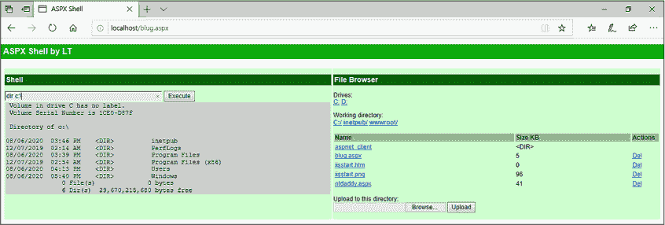
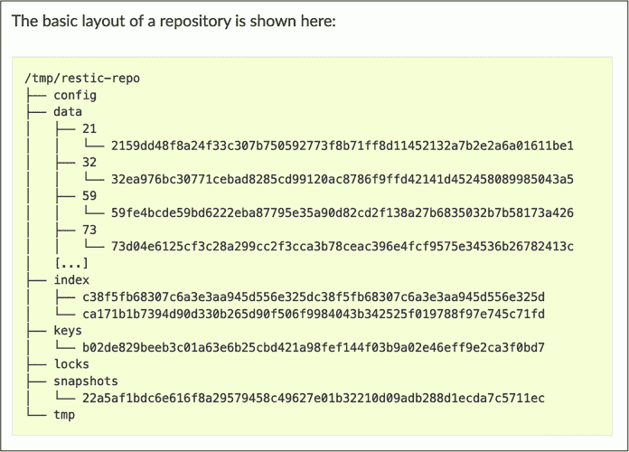
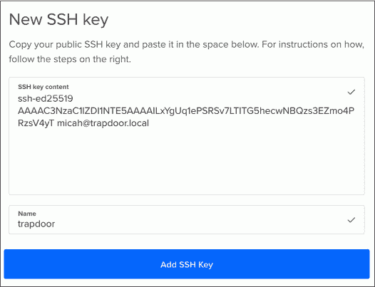
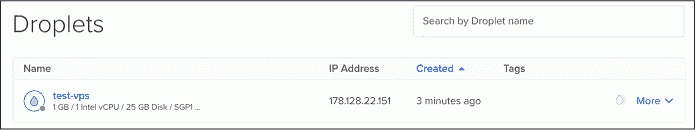

<hgroup>

## <samp class="SANS_Futura_Std_Bold_Condensed_B_11">4</samp> <samp class="SANS_Dogma_OT_Bold_B_11">在终端中探索数据集</samp>

</hgroup>

在本章中，你将继续发展你在命令行中的技能，开始研究真实的数据集。你将使用 <samp class="SANS_TheSansMonoCd_W5Regular_11">for</samp> 循环来解压 BlueLeaks 文件，然后搜索文件以确定哪些融合中心拥有最多的数据，哪些文档包含关键词 *antifa* 和 *Black Lives Matter*。我还将概述数据集中神秘的加密数据，并描述我对黑客如何收集这些数据的假设。

你还将学习如何创建 Linux 云服务器并安全连接到它们，以获得更快的网络速度和额外的磁盘空间。作为练习，你将使用远程服务器下载并简要检查来自极右翼恐怖组织“誓言守卫者”（Oath Keepers）的被黑数据，该组织参与了 2021 年 1 月 6 日的美国国会骚乱。

### <samp class="SANS_Futura_Std_Bold_B_11">介绍 for 循环</samp>

你在练习 2-1 中下载的 BlueLeaks 种子文件大小为 269GB，包含 168 个不同的 ZIP 文件，大小从 49GB 到半个千字节不等。理论上，你可以手动逐个解压这 168 个文件来访问数据。然而，这一缓慢且繁琐的过程在处理更大的数据集时就变得不切实际（想象一下逐个提取 10,000 个 ZIP 文件）。在本节中，你将学习如何通过使用 <samp class="SANS_TheSansMonoCd_W5Regular_11">for</samp> 循环自动化这一任务，从而加快速度。

<samp class="SANS_TheSansMonoCd_W5Regular_11">for</samp> 循环是一种命令，它会针对列表中的每一项运行一次代码。每次循环时，代码会将当前项存储在一个*变量*中，你可以将其视为某个值的占位符。代码变量类似于数学中的变量，*x* 的值可能因不同问题而不同，但在 shell 脚本中，变量的值可以是文本或数字。尽管每次循环都会运行相同的代码，结果可能会有所不同，因为每次循环时变量的值都会变化。

例如，以下 <samp class="SANS_TheSansMonoCd_W5Regular_11">for</samp> 循环显示数字 1、2 和 3：

```
for NUMBER in 1 2 3

do

    echo $NUMBER

done
```

这个 <samp class="SANS_TheSansMonoCd_W5Regular_11">for</samp> 循环的语法以 <samp class="SANS_TheSansMonoCd_W5Regular_11">for</samp> <samp class="SANS_TheSansMonoCd_W5Regular_Italic_I_11">variable_name</samp> <samp class="SANS_TheSansMonoCd_W5Regular_11">in</samp> <samp class="SANS_TheSansMonoCd_W5Regular_Italic_I_11">list_of_items</samp> 开始，接着是 <samp class="SANS_TheSansMonoCd_W5Regular_11">do</samp>，然后是针对列表中每个项目执行的命令，最后以 <samp class="SANS_TheSansMonoCd_W5Regular_11">done</samp> 结束。在这个例子中，<samp class="SANS_TheSansMonoCd_W5Regular_Italic_I_11">variable_name</samp> 是 <samp class="SANS_TheSansMonoCd_W5Regular_11">NUMBER</samp>，而 <samp class="SANS_TheSansMonoCd_W5Regular_Italic_I_11">list_of_items</samp> 是 <samp class="SANS_TheSansMonoCd_W5Regular_11">1 2 3</samp>。当代码第一次循环时，<samp class="SANS_TheSansMonoCd_W5Regular_11">NUMBER</samp> 变量的值是 <samp class="SANS_TheSansMonoCd_W5Regular_11">1</samp>，第二次循环时是 <samp class="SANS_TheSansMonoCd_W5Regular_11">2</samp>，第三次循环时是 <samp class="SANS_TheSansMonoCd_W5Regular_11">3</samp>。

<samp class="SANS_TheSansMonoCd_W5Regular_11">echo</samp> 命令将某些内容显示到终端，在这个例子中是 <samp class="SANS_TheSansMonoCd_W5Regular_11">$NUMBER</samp>。美元符号 (<samp class="SANS_TheSansMonoCd_W5Regular_11">$</samp>) 表示代码应显示 <samp class="SANS_TheSansMonoCd_W5Regular_11">NUMBER</samp> 变量的值，而不是单纯显示单词 <samp class="SANS_TheSansMonoCd_W5Regular_11">NUMBER</samp>。

> <samp class="SANS_Dogma_OT_Bold_B_21">注意</samp>

*使用全大写字母来命名变量是一种常见的约定，但并不是强制要求。例如，你可以将变量命名为 <samp class="mono">number</samp> 而不是 <samp class="mono">NUMBER</samp>，并用 <samp class="mono">echo $number</samp> 来显示，而不是 <samp class="mono">echo $NUMBER</samp>。变量名是区分大小写的。*

当你在终端运行上面的 <samp class="SANS_TheSansMonoCd_W5Regular_11">for</samp> 循环时，应该会看到以下输出：

```
1

2

3
```

你也可以使用 <samp class="SANS_TheSansMonoCd_W5Regular_11">for</samp> 循环来遍历另一个 shell 命令的输出，如下所示：

```
for FILENAME in $(ls *.zip)

do

    echo "ZIP filename: $FILENAME"

done
```

这段代码中的变量名是 <samp class="SANS_TheSansMonoCd_W5Regular_11">FILENAME</samp>。接下来，<samp class="SANS_TheSansMonoCd_W5Regular_11">$(ls *.zip)</samp> 告诉你的计算机运行 <samp class="SANS_TheSansMonoCd_W5Regular_11">ls *.zip</samp> 命令。此命令输出当前文件夹中所有 ZIP 文件的列表，生成文件名列表。<samp class="SANS_TheSansMonoCd_W5Regular_11">for</samp> 循环遍历该列表，并为每个文件名运行 <samp class="SANS_TheSansMonoCd_W5Regular_11">do</samp> 和 <samp class="SANS_TheSansMonoCd_W5Regular_11">done</samp> 之间的代码。在这种情况下，<samp class="SANS_TheSansMonoCd_W5Regular_11">echo</samp> 命令将文件名以 <samp class="SANS_TheSansMonoCd_W5Regular_11">ZIP 文件名:</samp> <samp class="SANS_TheSansMonoCd_W5Regular_Italic_I_11">filename</samp> 的格式打印到终端。

例如，下面是我在 macOS 上的终端中运行此代码时的样子：

```
micah@trapdoor BlueLeaks % **for FILENAME in $(ls *.zip)**

for> **do**

for>     **echo "ZIP filename: $FILENAME"**

for> **done**

ZIP filename: 211sfbay.zip

ZIP filename: Securitypartnership.zip

ZIP filename: acprlea.zip

`--snip--`
```

每次代码循环时，<samp class="SANS_TheSansMonoCd_W5Regular_11">FILENAME</samp> 的值是其中一个 ZIP 文件的名称。当 <samp class="SANS_TheSansMonoCd_W5Regular_11">echo</samp> 命令运行时，它会依次显示这些文件名。

### <samp class="SANS_Futura_Std_Heavy_B_21">练习 4-1：解压 BlueLeaks 数据集</samp>

在这个练习中，你将编写一个脚本来解压 BlueLeaks 中的所有 ZIP 文件，这样你就可以处理它们包含的数据。解压后，这些文件会占用你的 *datasets* USB 上 271GB 的额外空间。

如果你使用的是 macOS 或 Linux，接下来按照“在 macOS 或 Linux 上解压文件”的指示操作。如果你使用的是 Windows，阅读该小节了解如何在 bash 中编写 <samp class="SANS_TheSansMonoCd_W5Regular_11">for</samp> 循环，因为你稍后在书中会用到这个技能，但直到“在 Windows 上解压文件”（第 92 页）之前不需要跟着做。

#### <samp class="SANS_Futura_Std_Bold_Condensed_Oblique_BI_11">在 macOS 或 Linux 上解压文件</samp>

打开终端并通过运行以下命令导航到你的 *BlueLeaks* 文件夹，替换 <samp class="SANS_TheSansMonoCd_W5Regular_Italic_I_11">blueleaks_path</samp> 为你自己的文件夹路径：

```
**cd** **`blueleaks_path`**
```

在 Linux 上，我会使用这个命令（你的路径会不同）：

```
cd /media/micah/datasets/BlueLeaks
```

在 macOS 上，我会使用以下命令（同样，你的路径会有所不同）：

```
cd /Volumes/datasets/BlueLeaks
```

运行 <samp class="SANS_TheSansMonoCd_W7Bold_B_11">ls</samp> 查看此文件夹中的文件列表，运行 <samp class="SANS_TheSansMonoCd_W7Bold_B_11">ls -lh</samp> 查看这些文件的详细信息，例如它们的大小。

要解压单个文件，你使用以下语法：

```
**unzip** **`filename`**
```

例如，运行此命令解压 BlueLeaks 中的第一个文件：

```
**unzip 211sfbay.zip**
```

这应该将 2.6GB 的 *211sfbay.zip* 文件解压到名为 *211sfbay* 的文件夹中。再次运行 <samp class="SANS_TheSansMonoCd_W7Bold_B_11">ls</samp>，你应该能看到包含来自其中一个 BlueLeaks 网站的所有被盗数据的新文件夹。

然而，你想要解压所有的 BlueLeaks 文件。删除*211sfbay*文件夹：

```
**rm -r 211sfbay**
```

<samp class="SANS_TheSansMonoCd_W5Regular_11">rm</samp>命令本身可以删除文件；要删除整个文件夹，你需要加上<samp class="SANS_TheSansMonoCd_W5Regular_11">-r</samp>（即<samp class="SANS_TheSansMonoCd_W5Regular_11">--recursive</samp>）。<samp class="SANS_TheSansMonoCd_W5Regular_11">-r</samp>选项会删除文件夹中的所有文件，以及该文件夹中子文件夹中的所有文件，依此类推，最后删除目标文件夹。

打开文本编辑器，在你的*exercises*文件夹中创建一个名为*chapter-4*的新文件夹，并在*chapter-4*文件夹内创建一个名为*exercise-4-1-unzip.sh*的新文件。（将脚本存放在单独的文件夹中可以防止你自己的文件污染数据集。）在新文件中，输入以下代码：

```
#!/bin/bash

for FILENAME in $(ls *.zip)

do

    echo "Unzipping $FILENAME..."

    unzip -o $FILENAME

done
```

由于*exercise-4-1-unzip.sh*是一个 Shell 脚本，它以与第三章中的脚本相同的<samp class="SANS_TheSansMonoCd_W5Regular_11">#!/bin/bash</samp> shebang 开始。定义完这个<samp class="SANS_TheSansMonoCd_W5Regular_11">for</samp>循环后，脚本通过<samp class="SANS_TheSansMonoCd_W5Regular_11">do</samp>开始，使用<samp class="SANS_TheSansMonoCd_W5Regular_11">done</samp>结束，反复执行<samp class="SANS_TheSansMonoCd_W5Regular_11">echo "Unzipping $FILENAME…"</samp>和<samp class="SANS_TheSansMonoCd_W5Regular_11">unzip -o $FILENAME</samp>命令。<samp class="SANS_TheSansMonoCd_W5Regular_11">echo</samp>命令显示<FILENAME</samp>变量的值，这个值在每次循环时都会变化，<samp class="SANS_TheSansMonoCd_W5Regular_11">unzip</samp>命令则解压该文件。<samp class="SANS_TheSansMonoCd_W5Regular_11">-o</samp>参数告诉<samp class="SANS_TheSansMonoCd_W5Regular_11">unzip</samp>在必要时*覆盖*文件，也就是说，如果某个被解压的文件已经存在，脚本将用更新的版本替换它。

例如，当你在 BlueLeaks 上运行这段代码时，在第一次循环中，<samp class="SANS_TheSansMonoCd_W5Regular_11">FILENAME</samp>的值是<samp class="SANS_TheSansMonoCd_W5Regular_11">211sfbay.zip</samp>。在这个循环中运行的代码等同于以下命令：

```
echo "Unzipping 211sfbay.zip..."

unzip -o 211sfbay.zip
```

第二次代码循环时，它以<samp class="SANS_TheSansMonoCd_W5Regular_11">acprlea.zip</samp>作为<FILENAME</samp>的值，依此类推。

切换到你的*BlueLeaks*文件夹。在我的 Mac 上，我通过运行以下命令来完成此操作：

```
cd /Volumes/datasets/BlueLeaks
```

接下来，使这个 Shell 脚本具有可执行权限并运行它，方法如下：

```
**chmod** **+****x ../exercises/chapter-4/exercise-4-1-unzip.sh**

**../exercises/chapter-4/exercise-4-1-unzip.sh**
```

这些命令假设你的 *exercises* 文件夹与 *BlueLeaks* 文件夹位于同一目录下。你 *exercises* 文件夹的相对路径是 *../exercises*，而你刚刚保存的 shell 脚本的相对路径是 *../exercises/chapter-4/exercise-4-1-unzip.sh*。

运行这些命令后，你的脚本应该会开始解压所有 168 个 BlueLeaks 文件。坐下来，放松一下，或许喝点饮料，等待它完成，可能需要几个小时。

如果你不是使用 Windows，请跳过并直接查看第 93 页的“整理你的文件”部分。否则，请继续阅读。

#### <samp class="SANS_Futura_Std_Bold_Condensed_Oblique_BI_11">在 Windows 上解压文件</samp>

从为 Windows 格式化的 USB 磁盘在 WSL 中解压文件可能会*非常*慢，因为 WSL 存在性能问题。幸运的是，有一种更快速的方法可以使用 PowerShell 和一个叫做 7-Zip 的程序来解压 BlueLeaks 中的全部 168 个文件。

##### <samp class="SANS_Futura_Std_Bold_Condensed_B_11">安装 7-Zip</samp>

开源 Windows 压缩程序 7-Zip 允许你解压各种类型的压缩文件*.* 从[*https://<wbr>www<wbr>.7<wbr>-zip<wbr>.org*](https://www.7-zip.org) 下载并安装 7-Zip。你会收到一个警告，提示该程序来自一个未知的发布者，但只要你是从官方网站下载的，安装是安全的。

安装 7-Zip 后，你可以直接通过 PowerShell 使用其*7z.exe*程序来解压文件。默认情况下，*7z.exe* 应该位于 *C:\Program Files\7-Zip\7z.exe*。然而，为了能够在任何目录下运行该程序，你需要将 *C:\Program Files\7-Zip* 添加到你的 <samp class="SANS_TheSansMonoCd_W5Regular_11">Path</samp> 环境变量中。

*环境变量* 是你打开 shell 时已经存在的变量，不同于你在 <samp class="SANS_TheSansMonoCd_W5Regular_11">for</samp> 循环中或其他方式创建的变量。<samp class="SANS_TheSansMonoCd_W5Regular_11">Path</samp> 环境变量是包含程序的文件夹列表。默认情况下，它包含一些文件夹，但你也可以添加自己的文件夹。当你运行 <samp class="SANS_TheSansMonoCd_W5Regular_11">7z</samp> 时，PowerShell 会检查 <samp class="SANS_TheSansMonoCd_W5Regular_11">Path</samp> 列表中的每个文件夹，并寻找一个名为 *7z.exe* 的文件，然后运行该程序。

要将*7z.exe*添加到<samp class="SANS_TheSansMonoCd_W5Regular_11">Path</samp>，点击**开始**，搜索**环境变量**，然后点击**编辑系统环境变量**。在打开的窗口中，点击**环境变量**，你应该会看到一个包含用户变量和系统变量的窗口。双击**Path**（用户变量框中的 Path），你将看到所有存储在<samp class="SANS_TheSansMonoCd_W5Regular_11">Path</samp>中的文件夹。点击**新建**，添加*C:\Program Files\7-Zip*，然后点击**确定**保存。如果你有一个 PowerShell 窗口打开，关闭 PowerShell 并重新打开它，强制 Shell 使用更新后的<samp class="SANS_TheSansMonoCd_W5Regular_11">Path</samp>环境变量。

现在你可以使用<samp class="SANS_TheSansMonoCd_W5Regular_11">7z</samp>命令来运行 7-Zip。

##### <samp class="SANS_Futura_Std_Bold_Condensed_B_11">在 PowerShell 中使用 7-Zip 解压</samp>

在 PowerShell 终端中，切换到你*datasets* USB 磁盘上的*BlueLeaks*文件夹。例如，在我的电脑上，我运行：

```
cd D:\BlueLeaks
```

接下来，运行以下 PowerShell 命令（这是前一小节中*exercise-4-1-unzip.sh* Shell 脚本的 PowerShell 版本）：

```
$ZipFiles=Get-ChildItem -Path . -Filter "*.zip"

foreach ($ZipFile in $ZipFiles) {

    7z x $ZipFile.FullName

}
```

第一行将 PowerShell 变量<samp class="SANS_TheSansMonoCd_W5Regular_11">$ZipFiles</samp>设置为当前文件夹中找到的 ZIP 文件列表，由点（<samp class="SANS_TheSansMonoCd_W5Regular_11">.</samp>）表示。接下来是一个<samp class="SANS_TheSansMonoCd_W5Regular_11">foreach</samp>循环，它遍历此列表，将变量<samp class="SANS_TheSansMonoCd_W5Regular_11">$ZipFile</samp>设置为每个文件的名称。对于每个不同的文件名，<samp class="SANS_TheSansMonoCd_W5Regular_11">7z</samp>命令会反复执行，解压每个文件。

当我在 PowerShell 终端中运行这些命令时，我得到了以下输出：

```
Scanning the drive for archives:

1 file, 2579740749 bytes (2461 MiB)

Extracting archive: D:\BlueLeaks\211sfbay.zip

--

Path = D:\BlueLeaks\211sfbay.zip

Type = zip

Physical Size = 2579740749

`--snip--`
```

你的 PowerShell 窗口应该同样开始解压所有 168 个 BlueLeaks 文件。

> <samp class="SANS_Dogma_OT_Bold_B_21">注意</samp>

*完成本章后，阅读附录 A，并实施其中描述的避免 WSL 性能问题的解决方案，以便将来在 Windows 中更容易处理像 BlueLeaks 这样的大型数据集。你将在本书剩余部分使用 WSL，因此你需要一个解决遇到的任何问题的计划。*

#### <samp class="SANS_Futura_Std_Bold_Condensed_Oblique_BI_11">组织你的文件</samp>

现在你的*BlueLeaks*文件夹应该充满了 ZIP 文件和已解压的文件夹。现在你将创建一个单独的*BlueLeaks-extracted*文件夹用于存放已解压的数据，并将 ZIP 文件本身保存在*BlueLeaks*文件夹中，这样如果你愿意，可以继续用它们做种。

打开终端（如果你在 Windows 中，重新切换到 WSL Ubuntu 终端），更改到你的*datasets* USB 磁盘，并运行以下命令：

```
**mv BlueLeaks BlueLeaks-extracted**

**mkdir BlueLeaks**

**mv BlueLeaks-extracted/*.zip BlueLeaks**
```

<samp class="SANS_TheSansMonoCd_W5Regular_11">mv</samp>命令用于移动或重命名文件。在第一行中，它将*BlueLeaks*文件夹重命名为*BlueLeaks-extracted*。你在第三章中使用过的<samp class="SANS_TheSansMonoCd_W5Regular_11">mkdir</samp>命令创建了一个名为*BlueLeaks*的新空文件夹。第三个命令将所有 ZIP 文件从*BlueLeaks-extracted*文件夹移动到新创建的*BlueLeaks*文件夹中。

你的*数据集*USB 磁盘现在应该包含一个名为*BlueLeaks*的文件夹，其中有 250GB 的 ZIP 文件，以及另一个名为*BlueLeaks-extracted*的文件夹，里面有 269GB 的提取出的被黑警察数据。

### <samp class="SANS_Futura_Std_Bold_B_11">黑客是如何获取 BlueLeaks 数据的</samp>

我们不知道黑客是如何入侵并泄露 BlueLeaks 文件的，但我们可以根据数据集中的线索做出一个合理的猜测。

假设现在是 2020 年 6 月 6 日，也就是明尼阿波利斯的警察德里克·肖文跪压乔治·弗洛伊德脖子超过九分钟，导致弗洛伊德窒息而死，引发了夏季的黑人的命也是命运动（Black Lives Matter）对抗警察暴力的浪潮的不到两周时间。根据*纽约时报*的报道，数百万的人走上街头，要求警方负责，结束种族主义警察暴力，成为了“美国历史上最大的一次运动”。

现在，假设你是一个黑客活动分子（hacktivist）。除了在街头与警察对抗外，你还在互联网上与他们对抗。通过使用开放源情报（OSINT），你发现成百上千的警察网站使用了由德州的网络开发公司 Netsential 开发的同一个劣质 Web 应用程序。这些网站都运行在 Windows 上，使用微软的 Internet Information Services（IIS）Web 服务器软件，并采用微软的 Web 框架 ASP.NET 进行编程。它们也都托管在德州同一数据中心的 IP 地址上。

在你花了一些时间浏览其中一个网站后，发现了你在找的东西：一个*远程代码执行漏洞*，这是一种让你可以在远程服务器上运行命令的漏洞，比如运行 AZHIDTA 网站的 Windows 服务器。（我的猜测是，这个漏洞最初是通过 SQL 注入攻击的，这种技术超出了本书的范围。）

<samp class="SANS_Dogma_OT_Bold_B_21">警告</samp>

*我现在要告诉你一个潜在的黑客工具 URL，它是由黑客遗留的，但不要实际在浏览器中加载它，因为它可能是非法的。尝试访问他人的黑客工具绝对是一个法律灰色地带。*

要在此 Web 服务器上打开外壳，你需要使用 *Web 外壳*，即一个 Web 页面，当你提交包含命令的表单时，它会在 Web 服务器上运行该命令并返回其输出。通过利用你发现的漏洞，你将 Web 外壳保存到服务器磁盘上的 *blug.aspx* 文件中。在浏览器中加载 */blug.aspx*，访问 [*https://<wbr>www<wbr>.azhidta<wbr>.org*](https://www.azhidta.org) 网站，你就能在服务器上运行任何你想要的命令。

Web 外壳 *blug.aspx* 被包含在 BlueLeaks 数据集中。为了了解该 Web 外壳的工作原理，我设置了一台带有 IIS 服务器的 Windows 虚拟机进行测试，如 图 4-1 所示。截图的左侧是外壳（我在其中运行了命令 <samp class="SANS_TheSansMonoCd_W5Regular_11">dir c:\</samp>）。右侧则允许我浏览服务器的文件系统并上传新文件。



<samp class="SANS_Futura_Std_Book_Oblique_I_11">图 4-1：在 Windows 虚拟机中测试</samp> <samp class="SANS_Futura_Std_Book_11">blug.aspx</samp> <samp class="SANS_Futura_Std_Book_Oblique_I_11">Web 外壳</samp>

我不确定 BlueLeaks 被黑的具体方式，但我认为它很有可能是通过这种方式发生的。在研究 BlueLeaks 时，我发现了以下 Web 外壳文件，所有文件的时间戳都显示在 2020 年 6 月 6 日晚些时候，成为数据集中最近创建的文件之一：

***azhidta/ntdaddy.aspx*** Classic ASP Web 外壳 NTDaddy，由一位名叫 obzerve 的黑客于 2001 年左右开发

***azhidta/blug.aspx*** ASP.NET 网络外壳，名为 ASPX Shell，由一位名叫 LT 的黑客于 2007 年开发

***azhidta/pscp64.exe*** 一个与 PuTTY 一同提供的程序，PuTTY 是一款流行的 Windows 工具，用于安全地将文件从远程服务器上传和下载

***icefishx/7z.exe*** 7-Zip 压缩与解压程序的一个副本

我的猜测是，黑客活动者首先尝试创建一个 *ntdaddy.aspx* Web 外壳，但发现它无法工作，因为该外壳是使用较早版本的 ASP（即 Classic ASP）开发的，而 BlueLeaks 网站使用的是现代版 ASP.NET。于是，他们创建了 *blug.aspx* Web 外壳，使用该外壳上传了 *pscp64.exe* 和 *7z.exe*，然后用 *7z.exe* 压缩了某个警察网站的所有文件，最后通过 *pscp64.exe* 将这些数据上传到他们自己的服务器。

在手动攻破一个 BlueLeaks 网站后，黑客可能为其余的 BlueLeaks 网站自动化了这一过程。也许他们创建了一个使用 cURL 而非 web 浏览器来执行相同步骤的 shell 脚本。他们可能在一个 <samp class="SANS_TheSansMonoCd_W5Regular_11">for</samp> 循环中运行该脚本，针对所有 251 个网站，在一个周六晚上向自己上传了数百 GB 的数据。然后他们可能忘记删除 *blug.aspx*、*pscp64.exe*、*7z.exe* 和 *ntdaddy.aspx* 文件，就将数据集提交给 DDoSecrets。

### <samp class="SANS_Futura_Std_Heavy_B_21">练习 4-2：在命令行中探索 BlueLeaks</samp>

在本练习中，你将开始探索解压后的 BlueLeaks 文件内容，使用命令和高级 shell 功能，可以快速测量文件和文件夹的大小，并对输出的行进行排序和计数。

#### <samp class="SANS_Futura_Std_Bold_Condensed_Oblique_BI_11">计算文件夹占用的磁盘空间</samp>

<samp class="SANS_TheSansMonoCd_W5Regular_11">du</samp> 命令（"disk usage" 的缩写）是一个强大的工具，用于评估新的数据集。Linux 和 macOS 上的 <samp class="SANS_TheSansMonoCd_W5Regular_11">du</samp> 命令版本略有不同。Linux 版本是一个名为 GNU coreutils 的软件包的一部分，它在撰写本文时更新且更好，因此本练习中将使用该版本。

使用 Linux 和 Windows 的 WSL 用户应该已经拥有正确的内置 <samp class="SANS_TheSansMonoCd_W5Regular_11">du</samp> 工具。如果你使用的是 macOS，请在终端中运行 <samp class="SANS_TheSansMonoCd_W7Bold_B_11">brew install coreutils</samp> 来安装 coreutils。安装后，<samp class="SANS_TheSansMonoCd_W5Regular_11">du</samp> 命令将运行 macOS 版本的工具，而 <samp class="SANS_TheSansMonoCd_W5Regular_11">gdu</samp> 命令将运行你刚安装的 coreutils 版本。在接下来的命令中，macOS 用户应将 <samp class="SANS_TheSansMonoCd_W5Regular_11">du</samp> 替换为 <samp class="SANS_TheSansMonoCd_W5Regular_11">gdu</samp>。

要了解提取后的 BlueLeaks 数据集占用了多少空间，请打开终端并运行以下命令，使用你计算机上 *BlueLeaks-extracted* 文件夹的路径：

```
**du -sh --apparent-size** **`/media/micah/datasets/BlueLeaks-extracted`**
```

该命令中的 <samp class="SANS_TheSansMonoCd_W5Regular_11">-s</samp> 参数（即 <samp class="SANS_TheSansMonoCd_W5Regular_11">--summarize</samp> 的缩写）显示的是文件夹的总磁盘空间，而不是每个文件所占的空间。<samp class="SANS_TheSansMonoCd_W5Regular_11">-h</samp> 参数（即 <samp class="SANS_TheSansMonoCd_W5Regular_11">--human-readable</samp> 的缩写）以千字节、兆字节或千兆字节等单位显示文件大小，而不是以系统块为单位（系统块的大小取决于磁盘的设置）。最后，<samp class="SANS_TheSansMonoCd_W5Regular_11">--apparent-size</samp> 参数显示的是文件的实际大小，而不是它们在磁盘上占用的空间。

该命令会检查 BlueLeaks 中每个文件的大小，并将它们加在一起，因此执行需要一些时间。当它完成时，它应该会告诉你 *BlueLeaks-extracted* 文件夹占用了 269GB 的空间。

> <samp class="SANS_Dogma_OT_Bold_B_21">注意</samp>

*除了使用 <samp class="mono">-h</samp> 来生成易读的单位外，你还可以指定想要使用的单位。<samp class="mono">-b</samp> 参数是 <samp class="mono">--bytes</samp> 的缩写，它以字节为单位显示文件大小，<samp class="mono">-k</samp> 以千字节显示，<samp class="mono">-m</samp> 以兆字节显示。*

接下来，你将测量 BlueLeaks 中某个文件夹的大小。切换到你的 *BlueLeaks-extracted* 文件夹；例如，在我的 Linux 电脑上，我会运行 <samp class="SANS_TheSansMonoCd_W5Regular_11">cd /media/micah/datasets/BlueLeaks-extracted</samp>。然后，运行以下命令来测量 *ncric* 文件夹的大小，该文件夹包含来自北加州地区情报中心（NCRIC）的文档，这是我花费最多时间研究的融合中心：

```
**du -sh --apparent-size ncric**
```

输出应该会告诉你 *ncric* 文件夹占用了 19GB 的空间。

要找出 BlueLeaks 中每个文件夹的大小，你可以为每个文件夹运行 <samp class="SANS_TheSansMonoCd_W5Regular_11">du -sh --apparent-size</samp> <samp class="SANS_TheSansMonoCd_W5Regular_Italic_I_11">path</samp> 命令，但使用另一个 <samp class="SANS_TheSansMonoCd_W5Regular_11">for</samp> 循环会更快。运行以下代码：

```
**for FOLDER in $(ls); do du -sh --apparent-size $FOLDER; done**
```

如这里所示，你可以通过使用分号 (<samp class="SANS_TheSansMonoCd_W5Regular_11">;</samp>) 将多个命令放在同一行上执行。这个单行命令会循环执行 <samp class="SANS_TheSansMonoCd_W5Regular_11">ls</samp> 命令的输出，因为你当前在 *BlueLeaks-extracted* 文件夹中，所以输出的是每个 BlueLeaks 文件夹的名称。代码将这些名称存储在 <samp class="SANS_TheSansMonoCd_W5Regular_11">FOLDER</samp> 变量中，然后在循环的每次迭代中，运行 <samp class="SANS_TheSansMonoCd_W5Regular_11">du -sh --apparent-size $FOLDER</samp> 命令。

以下是输出的前几行：

```
2.8G    211sfbay

29M     Securitypartnership

216M    acprlea

65M     acticaz

748M    akorca

`--snip--`
```

这将显示每个文件夹使用的磁盘空间。

#### <samp class="SANS_Futura_Std_Bold_Condensed_Oblique_BI_11">使用管道并排序输出</samp>

你现在知道了 BlueLeaks 数据集中每个文件夹的大小。接下来，你将按磁盘空间对 168 个文件夹进行排序。通过确定哪些文件夹最大，你可以快速判断出哪些融合中心拥有最多的数据，因此它们可能是最大或最活跃的。

要按文件大小从小到大排序文件夹列表，可以使用 `<samp class="SANS_TheSansMonoCd_W5Regular_11">sort</samp>` 命令，它会接受一系列文本行，并默认按*字母数字*顺序对它们进行排序；也就是说，文本按字母顺序排序，数字按它们的首个数字排序。例如，列表 `<samp class="SANS_TheSansMonoCd_W5Regular_11">file1</samp>`、`<samp class="SANS_TheSansMonoCd_W5Regular_11">file10</samp>`、`<samp class="SANS_TheSansMonoCd_W5Regular_11">file2</samp>` 等等，将按字母数字顺序排序：由于文本行是逐字符排序的，并且因为 `<samp class="SANS_TheSansMonoCd_W5Regular_11">1</samp>` 小于 `<samp class="SANS_TheSansMonoCd_W5Regular_11">2</samp>`，所以 `<samp class="SANS_TheSansMonoCd_W5Regular_11">file10</samp>` 排在 `<samp class="SANS_TheSansMonoCd_W5Regular_11">file2</samp>` 之前。

要按文件大小对 BlueLeaks 文件进行排序，可以通过 `<samp class="SANS_TheSansMonoCd_W5Regular_11">-h</samp>` (`<samp class="SANS_TheSansMonoCd_W5Regular_11">--human-numeric-sort</samp>`) 参数来修改命令。此参数会考虑数字的*值*，而不仅仅是字符，从而正确地将较小的数值排在较大的数值之前。它还会考虑文件大小单位，这意味着它会将 2MB 排在 1GB 之前，尽管 2 在数值上大于 1。

在 shell 脚本中，*管道* 操作符 (`<samp class="SANS_TheSansMonoCd_W5Regular_11">|</samp>`) 让你将位于操作符左侧的命令输出传递给右侧的命令。当你将输入通过管道传递给 `<samp class="SANS_TheSansMonoCd_W5Regular_11">sort</samp>` 命令时，它会输出排序后的输入版本。运行上一节中的 `<samp class="SANS_TheSansMonoCd_W5Regular_11">for</samp>` 循环，这次将输出通过管道传递给 `<samp class="SANS_TheSansMonoCd_W5Regular_11">sort</samp>`：

```
**for FOLDER in $(ls); do du -sh –apparent-size $FOLDER; done | sort -h**
```

这一行首先运行 `<samp class="SANS_TheSansMonoCd_W5Regular_11">for</samp>` 循环，测量每个 BlueLeaks 文件夹所占用的空间。此代码的输出是一个文本行的列表，其中每行以文件夹的人类可读大小开始。将这些文本行作为输入传递给 `<samp class="SANS_TheSansMonoCd_W5Regular_11">sort -h</samp>` 命令后，它会按数字顺序对这些行进行排序，同时考虑文件大小单位。

你的输出应如下所示：

```
256     miacxold

256     ncric-history-good

256     ncricSteveBackup

259K    terrorismtip

548K    oaktac

625K    sccpca

`--snip--`

13G     lacleartraining

14G     jric

19G     ncric

36G     miacx

46G     repo
```

数据最少的文件夹应该排在最前面：*miacxold*、*ncric-history-good* 和 *ncricSteveBackup* 仅包含空的子文件夹。*repo* 文件夹是 BlueLeaks 中最大的文件夹，应该排在列表的最后，紧跟在 *miacx* 之后，*miacx* 是第二大文件夹。

#### <samp class="SANS_Futura_Std_Bold_Condensed_Oblique_BI_11">创建数据集中文件名的清单</samp>

当你处理像 BlueLeaks 这样庞大的数据集时，创建一个包含所有文件的清单是非常有帮助的，可以将文件列出在一个文本文件中。这样，你就可以轻松地计算数据集中的文件数量，或者在不必经过更慢的循环处理数据集过程的情况下搜索文件名。

你可以使用 <samp class="SANS_TheSansMonoCd_W5Regular_11">find</samp> 命令来创建此清单，它会输出文件夹中所有文件和文件夹的列表。在 *BlueLeaks-extracted* 文件夹中，运行以下命令来列出 BlueLeaks 中的所有文件：

```
**find . -type f**
```

<samp class="SANS_TheSansMonoCd_W5Regular_11">find</samp> 后的第一个参数是你想要列出其内容的文件夹。此命令使用点号来查找当前文件夹中的文件，但你也可以使用任何相对或绝对路径。<samp class="SANS_TheSansMonoCd_W5Regular_11">-type f</samp> 参数会筛选列表，使其只包括文件。（要只包括文件夹，请添加 <samp class="SANS_TheSansMonoCd_W5Regular_11">-type d</samp> 参数。）

当你运行这个命令时，BlueLeaks 中的众多文件名应该会开始迅速滚动显示在你的终端上。为了让输出更易于管理，再次运行该命令，这次将输出重定向到 *../BlueLeaks-filenames.txt* 文件：

```
**find . -type f > ../BlueLeaks-filenames.txt**
```

正如在第三章中讨论的，重定向指示你的 shell 将重定向操作符左侧的输出（<samp class="SANS_TheSansMonoCd_W5Regular_11">></samp>）保存到你在右侧指定的文件路径中。在这种情况下，shell 将 <samp class="SANS_TheSansMonoCd_W5Regular_11">find</samp> 命令返回的文件名列表发送到你 *datasets* USB 磁盘上的 *BlueLeaks-filenames.txt* 文件中，而不是将文件名显示在终端上。

要随时阅读这些文件名，请通过运行以下命令在 VS Code 中打开 *BlueLeaks-filenames.txt*：

```
**code ../BlueLeaks-filenames.txt**
```

在文本编辑器中缓慢滚动这些文件更容易，但文件太多，无法用肉眼计数。

#### <samp class="SANS_Futura_Std_Bold_Condensed_Oblique_BI_11">计算数据集中的文件数量</samp>

<samp class="SANS_TheSansMonoCd_W5Regular_11">wc</samp> 命令接受输入并告诉你包含多少字符、单词或行。当与 <samp class="SANS_TheSansMonoCd_W5Regular_11">-l</samp>（或 <samp class="SANS_TheSansMonoCd_W5Regular_11">--lines</samp>）参数一起使用时，它会计算行数。要计算你创建的 *BlueLeaks-filenames.txt* 文件中的行数，从而间接得出 BlueLeaks 中的文件数量，可以运行以下命令：

```
**cat ../BlueLeaks-filenames.txt | wc -l**
```

<samp class="SANS_TheSansMonoCd_W5Regular_11">cat</samp> 命令输出文件内容——在本例中是 *BlueLeaks-filenames.txt*。它不会直接显示文件内容，而是将输出传递给 <samp class="SANS_TheSansMonoCd_W5Regular_11">wc</samp>，以计算其中的行数。它应该会告诉你，BlueLeaks 中大约有 *一百万* 个文件。

获取相同结果的另一种方法是再次运行前一节中的 <samp class="SANS_TheSansMonoCd_W5Regular_11">find</samp> 命令，并将其输出传递给 <samp class="SANS_TheSansMonoCd_W5Regular_11">wc</samp>，像这样：

```
**find . -type f | wc -l**
```

然而，这个命令需要更长的时间来运行，因为它会再次搜索整个数据集（在命令完成之前，按 CTRL-C 取消该命令）。

### <samp class="SANS_Futura_Std_Heavy_B_21">练习 4-3：使用 grep 在 BlueLeaks 中查找揭露信息</samp>

2020 年夏天，当美国社会正在经历对种族主义警察杀戮规模的长期反思时，右翼媒体（和警察）却将焦点放在了抗议者本身的危险上。他们将现代民权运动分为两个类别：“黑人的命也是命”和“antifa”，后者是反法西斯主义者自 1930 年代以来使用的标签。现代美国 antifa 运动是对 2016 年唐纳德·特朗普当选和美国白人至上主义主流化的反应。

<samp class="SANS_TheSansMonoCd_W5Regular_11">grep</samp> 命令将根据关键字过滤输入，帮助你搜索数据集中的新闻信息。在本练习中，你将使用 <samp class="SANS_TheSansMonoCd_W5Regular_11">grep</samp> 来了解警察在抗议活动中如何看待 antifa。

#### <samp class="SANS_Futura_Std_Bold_Condensed_Oblique_BI_11">筛选提到 Antifa 的文档</samp>

你将从 grepping 文件名列表开始，查找包含 *antifa* 一词的文件。从 *BlueLeaks-extracted* 文件夹中，运行以下命令来搜索你在练习 4-2 中创建的 *BlueLeaks-filenames.txt* 文件：

```
**cat ../BlueLeaks-filenames.txt | grep antifa**
```

这个命令将 <samp class="SANS_TheSansMonoCd_W5Regular_11">cat ../BlueLeaks-filenames.txt</samp> 的输出，也就是包含一百万个文件名的列表，传递给 <samp class="SANS_TheSansMonoCd_W5Regular_11">grep antifa</samp>。这应该会过滤出仅包含 *antifa* 一词的文件名。然而，它没有返回任何结果。

由于 <samp class="SANS_TheSansMonoCd_W5Regular_11">grep</samp> 命令区分大小写，可以再次尝试，使用 <samp class="SANS_TheSansMonoCd_W5Regular_11">-i</samp>（或 <samp class="SANS_TheSansMonoCd_W5Regular_11">--ignore-case</samp>）参数：

```
**cat ../BlueLeaks-filenames.txt | grep -i antifa**
```

当我运行这个命令时，我得到以下输出：

```
./ociac/files/EBAT1/U-FOUO_CFIX__OCIAC_JRA_DVE Use of Social Media_**ANTIFA**_ANTI-**ANTIFA** MOVEMENTS

.pdf

./arictexas/files/DDF/ARIC-LES - Situational Awareness - **Antifa** Activity.pdf

./arictexas/files/DDF/SWTFC-LES - Situational Awareness - **ANTIFA** Event Notification.pdf

./arictexas/files/DPI/ARIC-LES - Situational Awareness - **Antifa** Activity.png

./arictexas/files/DPI/SWTFC-LES - Situational Awareness - **ANTIFA** Event Notification.png

./dediac/files/DDF/**ANTIFA** - Fighting in the Streets.pdf

./dediac/files/DDF/**ANTIFA** Sub Groups and Indicators - LES.pdf

./dediac/files/DDF/FBI_PH_SIR_Tactics_and_Targets_Identified_for_4_November_2017_**ANTIFA**_Rally_in _Philadelphia_PA-2.pdf

./dediac/files/EBAT1/**ANTIFA** - Fighting in the Streets.pdf

./dediac/files/EBAT1/**ANTIFA** Sub Groups and Indicators - LES.pdf

./dediac/files/DPI/**ANTIFA** - Fighting in the Streets.png

./dediac/files/DPI/FBI_PH_SIR_Tactics_and_Targets_Identified_for_4_November_2017_**ANTIFA**_Rally_in _Philadelphia_PA-2.png
```

该命令返回了 12 个结果，所有文件名中都包含 *antifa*（反法西斯）一词。<samp class="SANS_TheSansMonoCd_W5Regular_11">grep</samp> 命令可能会通过改变颜色来突出显示输出中的搜索词；我在这里用粗体标记了它们。你可以打开列表中的几个文档，查看它们的内容。

> <samp class="SANS_Dogma_OT_Bold_B_21">注意</samp>

*如果你愿意，可以将 BlueLeaks 文档通过 Dangerzone 进行处理，但这个数据集的风险很低。这些文档现在都是公开的，因此如果其中有任何追踪技术能够让原始文件所有者知道有人在查看该文档，那也没有太大关系。鉴于这些文档是从警察融合中心被黑客窃取的，而不是钓鱼邮件的附件或类似的东西，它们也不太可能是恶意的。*

我经常将 <samp class="SANS_TheSansMonoCd_W5Regular_11">find</samp> 和 <samp class="SANS_TheSansMonoCd_W5Regular_11">grep</samp> 结合使用，制作文件名列表并对其进行筛选，这样可以比操作系统的图形化文件搜索工具更快速、精确地在计算机上定位文件。例如，假设你正在查看 *azhidta* 文件夹中的亚利桑那州高强度毒品走私区站点。为了快速找到文件名中包含 *marijuana*（大麻）一词的任何文档，你可以运行 <samp class="SANS_TheSansMonoCd_W5Regular_11">find azhidta | grep -i marijuana</samp>。要统计文件名中包含 *marijuana* 的文件数量，你可以将所有结果通过管道传递给 <samp class="SANS_TheSansMonoCd_W5Regular_11">wc -l</samp> 命令。

#### <samp class="SANS_Futura_Std_Bold_Condensed_Oblique_BI_11">筛选特定类型的文件</samp>

除了搜索像 *antifa* 或 *marijuana* 这样的关键字外，<samp class="SANS_TheSansMonoCd_W5Regular_11">grep</samp> 还可以帮助你筛选文件名列表，仅包含特定的文件类型。要通过运行以下命令筛选 Microsoft Word 文档，即文件名以 *.docx* 结尾的文件，可以使用 grep：

```
**cat ../BlueLeaks-filenames.txt | grep -i .docx**
```

此命令使用 <samp class="SANS_TheSansMonoCd_W5Regular_11">cat</samp> 显示 BlueLeaks 中文件名的列表，然后筛选出包含 *.docx* 的文件。你应该能看到成千上万个文件名滚动过去。若想精确了解数量，可以再次运行该命令，这次将输出通过管道传递给 <samp class="SANS_TheSansMonoCd_W5Regular_11">wc -l</samp>：

```
**cat ../BlueLeaks-filenames.txt | grep -i .docx | wc -l**
```

<samp class="SANS_TheSansMonoCd_W5Regular_11">wc</samp> 命令应告诉你，前一个命令有 8,861 个结果。

#### <samp class="SANS_Futura_Std_Bold_Condensed_Oblique_BI_11">使用带正则表达式的 grep</samp>

如果你浏览刚找到的*.docx*文件名，你会发现其中一些文件其实并不是 Word 文档。例如，文件名*./arictexas/files/DDF/2014 Austin City Limits Festival - APD Threat Overview.docx.pdf*包含*.docx*，但实际上是一个 PDF 文件。

当你使用<samp class="SANS_TheSansMonoCd_W5Regular_11">grep</samp>时，可以传递一个正则表达式（简称 regex）作为参数。*正则表达式*是一个字符或字符序列，用于定义搜索模式。例如，插入符号（<samp class="SANS_TheSansMonoCd_W5Regular_11">^</samp>）代表行的开头，美元符号（<samp class="SANS_TheSansMonoCd_W5Regular_11">$</samp>）代表行的结尾。使用<samp class="SANS_TheSansMonoCd_W5Regular_11">something$</samp>进行 grep 会显示所有以*something*结尾的结果。使用<samp class="SANS_TheSansMonoCd_W5Regular_11">^something</samp>进行 grep 会显示所有以*something*开头的结果。

如果你只想搜索以*.docx*结尾的文件名，可以在你 grep 的文本末尾加上一个美元符号（<samp class="SANS_TheSansMonoCd_W5Regular_11">$</samp>）。例如，尝试运行以下命令：

```
**cat ../BlueLeaks-filenames.txt | grep -i .docx$ | wc -l**
```

输出应该会告诉你有 8,737 个结果，比之前的命令少了 124 个。这意味着数据集中有 8,737 个 Word 文档。

运行以下命令，查看*ncric*文件夹中有多少个 Word 文档：

```
**cat ../BlueLeaks-filenames.txt | grep ^./ncric/ | grep -i .docx$ | wc -l**
```

<samp class="SANS_TheSansMonoCd_W5Regular_11">cat</samp>命令输出 BlueLeaks 中文件名的列表，然后通过管道传递给第一个<samp class="SANS_TheSansMonoCd_W5Regular_11">grep</samp>命令，进而过滤出以*./ncric*开头的文件，使用<samp class="SANS_TheSansMonoCd_W5Regular_11">^</samp>。接下来，输出会通过管道传递给第二个<samp class="SANS_TheSansMonoCd_W5Regular_11">grep</samp>命令，进一步过滤出以*.docx*结尾的文件，使用<samp class="SANS_TheSansMonoCd_W5Regular_11">$</samp>。最后，剩余的输出会通过管道传递给<samp class="SANS_TheSansMonoCd_W5Regular_11">wc -l</samp>命令，告诉你剩下多少行。完整命令的输出应该告诉你*ncric*文件夹中有 600 个 Word 文档。

你可以尝试使用<samp class="SANS_TheSansMonoCd_W5Regular_11">find</samp>、<samp class="SANS_TheSansMonoCd_W5Regular_11">grep</samp> 和 <samp class="SANS_TheSansMonoCd_W5Regular_11">wc</samp> 来查找数据集中有多少 PDF（*.pdf*）和 Excel 文档（*.xlsx*）。你也可以尝试其他文件类型。

#### <samp class="SANS_Futura_Std_Bold_Condensed_Oblique_BI_11">使用 grep 批量搜索文件</samp>

除了将其他命令的输出通过管道传递给<samp class="SANS_TheSansMonoCd_W5Regular_11">grep</samp>，你还可以使用<samp class="SANS_TheSansMonoCd_W5Regular_11">grep</samp>直接在文本文件中进行搜索，语法如下：

```
**grep** **`search_term filename`**
```

例如，Linux 附带了一个名为 */etc/passwd* 的文件，里面包含了系统中所有用户的列表。要查找有关我自己的用户的那一行，我可以使用以下命令之一：

```
 grep micah /etc/passwd

  cat /etc/passwd | grep micah
```

<samp class="SANS_TheSansMonoCd_W5Regular_11">grep</samp> 命令打开 */etc/passwd* 文件并进行搜索，而 <samp class="SANS_TheSansMonoCd_W5Regular_11">cat</samp> 命令则打开该文件并将其内容传递给 <samp class="SANS_TheSansMonoCd_W5Regular_11">grep</samp>，然后由 <samp class="SANS_TheSansMonoCd_W5Regular_11">grep</samp> 来进行搜索。这两个命令的输出结果如下：

```
micah:x:1000:1000:,,,:/home/micah:/bin/bash
```

你可以使用 <samp class="SANS_TheSansMonoCd_W5Regular_11">grep</samp> 一次性搜索多个文件，甚至是包含文件的文件夹。如前所述，要搜索一个文件夹，你需要使用 <samp class="SANS_TheSansMonoCd_W5Regular_11">-r</samp>（或 <samp class="SANS_TheSansMonoCd_W5Regular_11">--recursive</samp>）参数，并指定文件夹名称。要一次指定多个文件，可以使用星号（<samp class="SANS_TheSansMonoCd_W5Regular_11">*</samp>）作为通配符。例如，你可以使用 <samp class="SANS_TheSansMonoCd_W5Regular_11">*.txt</samp> 作为文件名，来搜索当前文件夹中的所有文本文件。

每个 BlueLeaks 文件夹中都有 CSV 电子表格，包含网站数据库的内容。现在你已经通过 grep 搜索了包含 *antifa* 关键词的文件名，接下来可以使用以下命令批量搜索文件内容中是否包含 *Black Lives Matter* 这个词，而不仅仅是搜索文件名：

```
**grep -i "black lives matter" */*.csv**
```

这个命令中的 <samp class="SANS_TheSansMonoCd_W5Regular_11">-i</samp> 参数使搜索不区分大小写。<samp class="SANS_TheSansMonoCd_W5Regular_11">black lives matter</samp> 参数是搜索的关键词（因为它有空格，所以需要用引号括起来）。<samp class="SANS_TheSansMonoCd_W5Regular_11">*/*.csv</samp> 参数是搜索路径，它使用了两个通配符。这些参数告诉 <samp class="SANS_TheSansMonoCd_W5Regular_11">grep</samp> 打开每个文件夹，然后在这些文件夹中的每个以 *.csv* 结尾的文件中搜索 *black lives matter* 这个关键词。

这个命令需要一些时间来执行，因为它要搜索 BlueLeaks 中的 158,232 个 CSV 文件。完成后，它应该会显示出包含 *black lives matter* 的 CSV 文件中的行，并告诉你在哪些文件中找到了这些行。例如，以下是该命令输出的几行片段：

```
**arictexas/IncidentMap.csv**:834,"10/26/16 00:00:00",-9.7735716800000006e+01,3.0267881299999999e+0

1,"TX",,"TLO","An APD Police Explorer received a call from a blocked number in which the caller

identified himself as an activist for **Black Lives Matter**, and identified the recipient by name,

address, and personal descriptors before calling him a racist for having an interest in a LE

career.  No explicit threats were made during the call`...`

**bostonbric/EmailBuilder.csv**:<p>

<strong>BRIC SHIELD Alert: </strong>To promote public safety and situational awareness for

events taking place in the City of Boston tonight, the BRIC is sharing the information below

regarding planned activities. </p>`...`  <p><b>**Known** COB Activities for Tuesday, June 2nd</b></p>

<ul><li>Violence in Boston Inc & **Black Lives Matter** Rally and Vigil - 4:45 PM at 624 Blue Hill

Avenue. </li><li>Not One More! - 5:00 PM to 8:00 PM. Meeting at Franklin Park Road & Blue Hill

Ave and marching to Franklin Park. </li>`...`

**chicagoheat/Blog.csv**:Media sources report that the online activist group Anonymous, or a group

claiming to be Anonymous, has called for a collective 'Day of Rage' to take place in numerous

cities across the United States on Friday, July 15th. The action has been called in solidarity

with the **Black Lives Matter** movement in light of the recent controversial officer-involved

shootings that resulted in the deaths of Alton Sterling and Philando Castile. The group that

posted the call for action states that acts of violence or rioting are to be condemned.

**ncric/Requests.csv**:Organizer of a **Black Lives Matter** Protest for 06/02\.  Currently scheduled

1PM meet time at Sears parking lot of Newpark Mall.  They plan to march to City Hall and then

to Fremont PD.  She has repeated she intends for a peaceful protest.  She further claims she

reached out to City and PD to join the march.  Recent graphics encourage non-descript clothing,

heat resistant gloves, turning off Face Id on iPhone etc.
```

该命令在 BlueLeaks 的 CSV 文件中总共找到了 178 行包含 *black lives matter* 的内容。每一行都是进一步调查研究的潜在线索。

> <samp class="SANS_Dogma_OT_Bold_B_21">注意</samp>

*<samp class="SANS_TheSansMonoCd_W5Regular_Italic_I_11">grep</samp> 命令是一个用于搜索文本文件内容的强大工具，但它无法处理二进制文件，比如 Microsoft Office 文档或 PDF 文件。要批量搜索这些文件，你需要使用更复杂的工具，你将在 第五章 中学习这些工具。*

试着自己使用 <samp class="SANS_TheSansMonoCd_W5Regular_11">grep</samp> 命令来筛选 BlueLeaks 文件名列表中的特定词汇或在 CSV 文件中批量搜索关键字。如果你发现了任何有趣的文档，阅读它们看看是否具有新闻价值。找到线索后，可以通过查找其他相关文档来进一步缩小搜索范围。你可以聚焦于某一个单独的融合中心，或者像反法西斯组织（antifa）这样的跨不同中心的主题。单个文档可能包含执法术语，你可以用这些术语来搜索相关文档。在每个文档中详细记录最具揭示性的信息，如果你决定撰写发现报告时，可以依赖这些笔记。

### <samp class="SANS_Futura_Std_Bold_B_11">BlueLeaks 数据集中的加密数据</samp>

在你深入挖掘 BlueLeaks 数据集时，你会注意到一些模式。大多数文件夹包含许多 CSV 文件，以及 *aspx* 文件，这是被黑客攻击网站的源代码。它们还包含名为 *files* 的子文件夹，里面存储了上传到每个网站的大部分文件和文件夹，包括 PDF 文件和 Microsoft Office 文档。

然而，有一个文件夹，*repo*，只包含一个 *config* 文件和 *data*、*index*、*keys*、*locks* 和 *snapshots* 子文件夹。在这些子文件夹中，还有其他的子文件夹和看似随机命名的文件。没有可以打开的文档——没有电子表格或类似的文件。如你在练习 4-2 中发现的那样，*repo* 文件夹是 BlueLeaks 中最大的文件夹，大小为 46GB。它的时间戳来自 2020 年 6 月 8 日，尽管大多数数据集的其他部分的最新时间戳是 6 月 6 日。没有更多的信息，这些文件的含义和如何访问它们仍不清楚。

当我在数据集中发现这样的谜团时，我会上网搜索。这一次，我通过在搜索引擎中输入 *config data index keys locks snapshots* 来查找 *repo* 文件夹内的文件和文件夹名称，找到了一个名为 restic 的 CLI 程序的文档。根据我在 [*https://<wbr>restic<wbr>.readthedocs<wbr>.io<wbr>/en<wbr>/latest<wbr>/100<wbr>_references<wbr>.html*](https://restic.readthedocs.io/en/latest/100_references.html) 找到的文档，restic 仓库是一个存储备份数据的文件夹。Restic 仓库包含一个 *config* 文件以及名为 *data*、*index*、*keys*、*locks* 和 *snapshots* 的文件夹，如 图 4-2 所示。



<samp class="SANS_Futura_Std_Book_Oblique_I_11">图 4-2：restic 仓库的布局</samp>

这表明 BlueLeaks 中的 *repo* 文件夹包含以 restic 格式备份的数据。为了查看这个备份的内容，我安装了 <samp class="SANS_TheSansMonoCd_W5Regular_11">restic</samp> 包。使用 Linux 或 Windows（带 WSL）用户可以使用 apt 安装 <samp class="SANS_TheSansMonoCd_W5Regular_11">restic</samp>：

```
**sudo apt install restic**
```

Mac 用户可以通过以下命令从 Homebrew 安装 <samp class="SANS_TheSansMonoCd_W5Regular_11">restic</samp>：

```
**brew install restic**
```

我运行了 <samp class="SANS_TheSansMonoCd_W5Regular_11">restic --help</samp>，发现我可以使用 <samp class="SANS_TheSansMonoCd_W5Regular_11">restic snapshots</samp> 命令查看仓库中的快照，然后我用它尝试查看 *repo* 文件夹中的快照，像这样：

```
restic snapshots --repo repo/
```

我随后遇到了一个密码提示：

```
enter password for repository:
```

这个提示表示备份已加密。继续操作的唯一方法是猜测密码，但我一直没能猜到。

尽管公共泄露中的 46GB 加密数据夹非常罕见，但在像 Office 文档或 ZIP 文件这样的数据集中，偶尔会发现其他加密文件。我不禁想象，任何数据集中最有趣的部分可能正是那些加密的内容。密码破解超出了本书的范围，但如果你能破解 *repo* 的密码，请告诉我。

### <samp class="SANS_Futura_Std_Bold_B_11">云中服务器的数据分析</samp>

到目前为止，你已经在自己的计算机上*本地*使用了命令行工具，但你也可以通过云网络连接的远程服务器*远程*使用它。DigitalOcean、AWS、Microsoft Azure 和无数其他云主机公司向公众出租虚拟私人服务器（VPS），通常是每月几美元或每小时几美分。你迄今学到的所有命令行技能同样适用于远程服务器。

在云中处理海量数据集有许多优势：

+   你可以将虚拟硬盘连接到虚拟服务器上，而不是使用 USB 硬盘，如果磁盘空间不足时，还可以增加硬盘的大小。

+   VPS 的带宽通常比住宅或商业互联网服务要好得多，加速大数据集的下载。

+   你还可以为需要大量计算资源的脚本支付更强大的 VPS，这样它们就不会再花费几个小时或几天才能完成。

+   你不再需要在本地计算机上等待脚本运行，而是可以在计算机上做任何事情，甚至暂停或关机，同时远程服务器正在处理数据。

+   如果你的来源具备所需的技术技能，你可以让他们将数据上传到拥有大硬盘的 VPS，就像在第二章中讨论的那样。他们甚至可以使用 Tor 匿名上传数据。然后你可以下载数据集，或选择在 VPS 上远程分析它。

<samp class="SANS_Dogma_OT_Bold_B_21">警告</samp>

*避免在云服务器上处理高敏感度或中敏感度的数据集。云托管服务提供商对你的 VPS 以及其中的数据拥有完全访问权限，并且可能根据法律要求将这些数据副本提供给执法机关或其他方。*

本节将更详细地介绍 *SSH（安全外壳）* 软件（在 第二章 中介绍），它允许你在 VPS 上安全地获得一个 shell，此外，还会介绍两种在命令行上远程工作时必不可少的工具：基于文本的窗口管理器和 CLI 文本编辑器。掌握这些内容应该能帮助你在下一节练习中设置一个 VPS。

SSH 协议是一种安全地远程登录到另一台计算机的方法。你可以通过运行 <samp class="SANS_TheSansMonoCd_W5Regular_11">ssh</samp> 命令，并提供用户名以及你想连接的服务器的 IP 地址或域名，来远程连接到 VPS。例如，要以 root 用户身份登录到主机名为 *example.com* 的服务器，你可以运行：

```
**ssh root@example.com**
```

然后，你需要对服务器进行 *身份验证*，或者通过输入用户密码或使用 *SSH 密钥* 来证明你有权限登录。类似于 PGP 密钥（在 第二章 中讨论过），在你的计算机上生成一个 SSH 密钥会得到两个文件：一个公钥和一个私钥。将公钥放到远程服务器上后，只有在其计算机上拥有你的私钥的人（希望只是你自己）才能通过 SSH 远程登录到该服务器。如果有人监视你的互联网连接，他们无法看到你在 SSH 会话中的任何操作—他们只会看到乱码的加密数据。每个 SSH 密钥还有一个 *指纹*，它是一个唯一的字符串，用于标识该密钥。SSH 密钥比密码更安全，因此云服务提供商通常要求你使用它们。一旦你通过 SSH 连接到远程服务器，你将进入一个 shell，就像在自己计算机上操作一样，不过它是运行在互联网上的另一台计算机上。

*基于文本的窗口管理器* 是一种软件，允许你在同一终端窗口中打开并切换不同的 shell，所有这些都在同一个 SSH 会话中。基于文本的窗口管理器还允许你即使断开 SSH 连接，也能在后台保持程序运行，通过保持 VPS 上的活动 shell 会话来保护你的工作。例如，如果你的笔记本死机、丢失了网络连接或不小心关闭了终端窗口，这些程序仍然会继续运行。

例如，假设你想在 VPS 上下载 BlueLeaks，然后通过 <samp class="SANS_TheSansMonoCd_W5Regular_11">for</samp> 循环解压它。如果你在循环完成之前关闭终端窗口，你将退出远程 shell，这会关闭 <samp class="SANS_TheSansMonoCd_W5Regular_11">unzip</samp> 程序，导致远程工作停止。然而，如果你通过 SSH 连接到 VPS，进入窗口管理会话，然后开始解压 BlueLeaks 文件，你可以安全地关闭终端窗口而不会停止工作。如果稍后打开新终端，再次通过 SSH 连接到服务器，并重新打开窗口管理器，之前的会话和所有正在运行的程序应该会重新出现。在接下来的练习中，你将使用 Ubuntu 附带的 Byobu 窗口管理器。

当你通过 SSH 连接到远程服务器时，你无法轻松访问像 VS Code 这样的图形化文本编辑器。要编辑文件——例如修改一个 shell 脚本——你需要使用命令行文本编辑器。两种常见的命令行文本编辑器是 nano 和 vim。nano 编辑器相对易于使用，但没有高级功能，而 vim 更强大，但学习曲线较陡。为了简单起见，在接下来的练习中，你将使用 nano。

> <samp class="SANS_Dogma_OT_Bold_B_21">注意</samp>

*从技术上讲，你可以通过 SSH 使用 VS Code 远程编辑文件，但也有一些限制。有关 VS Code 支持通过 SSH 编辑文件的更多信息，请参见* [`<wbr>code<wbr>.visualstudio<wbr>.com<wbr>/docs<wbr>/remote<wbr>/ssh`](https://code.visualstudio.com/docs/remote/ssh) *。*

### <samp class="SANS_Futura_Std_Heavy_B_21">练习 4-4：设置 VPS</samp>

在本练习中，你将创建一个云主机服务商的帐户，生成 SSH 密钥，创建一个 VPS，并通过 SSH 连接到它，启动 Byobu 会话并安装更新。为了跟着操作，你需要花费一些小额费用。我为本练习提供了详细的 DigitalOcean 使用指南，但你也可以使用任何你喜欢的云服务商，只需注意初始步骤可能会有所不同。

访问 [*https://<wbr>www<wbr>.digitalocean<wbr>.com*](https://www.digitalocean.com)，创建帐户，并在注册时提供信用卡号。使用强密码，将其存储在密码管理器中，并启用双因素认证。

#### <samp class="SANS_Futura_Std_Bold_Condensed_Oblique_BI_11">生成 SSH 密钥</samp>

要生成 SSH 密钥，请在本地计算机上打开终端（如果你使用的是 Windows，请使用 WSL 终端）并运行：

```
**ssh-keygen -t ed25519**
```

<samp class="SANS_TheSansMonoCd_W5Regular_11">ssh-keygen</samp> 命令生成一个 SSH 密钥，而选项指定你想要生成的加密密钥类型——在这种情况下是 <samp class="SANS_TheSansMonoCd_W5Regular_11">ed25519</samp>，它使用现代椭圆曲线加密，是最安全的选项。

运行此命令后，程序会询问你一些问题，首先是你希望将密钥保存到哪里。例如，我在 Mac 上得到如下输出：

```
Generating public/private ed25519 key pair.

Enter file in which to save the key (/Users/micah/.ssh/id_ed25519):
```

按 ENTER 键使用密钥的默认位置 *~/.ssh/id_ed25519*。接下来，程序应该会要求你输入密码短语：

```
Enter passphrase (empty for no passphrase):
```

我建议在你的密码管理器中生成一个随机密码短语，将其保存为 *SSH 密钥密码短语*，然后将密码短语复制并粘贴到终端中。按下 ENTER 键后，重新输入密码短语并再次按 ENTER 键。

完成后，<samp class="SANS_TheSansMonoCd_W5Regular_11">ssh-keygen</samp> 命令应该会创建两个新文件：你的 SSH 私钥在 *~/.ssh/id_ed25519*，你的 SSH 公钥在 *~/.ssh/id_ed25519.pub*。

> <samp class="SANS_Dogma_OT_Bold_B_21">注意</samp>

*如果你使用的是 Windows，并且希望从 PowerShell 使用 SSH，你可以直接在 Windows 中安装 OpenSSH 客户端。以管理员身份打开 PowerShell 窗口并运行* <samp class="SANS_TheSansMonoCd_W7Bold_Italic_BI_11">Add-WindowsCapability -Online -Name OpenSSH.Client~~~~0.0.1.0</samp> *以启用从 PowerShell 使用 ssh 命令。*

#### <samp class="SANS_Futura_Std_Bold_Condensed_Oblique_BI_11">将你的公钥添加到云服务提供商</samp>

接下来，将你的公钥添加到新的 DigitalOcean 账户中。登录到 Web 控制台后，进入设置页面并切换到安全标签。点击 **添加 SSH 密钥**，然后将你的 SSH 公钥复制并粘贴到表单中。

返回终端，运行此命令显示公钥的内容：

```
**cat ~/.ssh/id_ed25519.pub**
```

这是我得到的输出：

```
ssh-ed25519 AAAAC3NzaC1lZDI1NTE5AAAAILxYgUq1ePSRSv7LTITG5hecwNBQzs3EZmo4PRzsV4yT micah@trapdoor

.local
```

你的输出应该类似于此，最后一个单词是你的用户名和你计算机的主机名。复制整个字符串，从 <samp class="SANS_TheSansMonoCd_W5Regular_11">ssh-ed25519</samp> 开始，并将其粘贴到 DigitalOcean 中，然后为它命名，如 图 4-3 所示。



<samp class="SANS_Futura_Std_Book_Oblique_I_11">图 4-3：向 DigitalOcean 账户添加新 SSH 密钥的表单</samp>

将你的 SSH 密钥命名为生成它们的计算机的名称，因为它们允许这台特定计算机访问远程计算机。例如，我将我的密钥命名为 *trapdoor*，这是我的 Mac 的名称。

#### <samp class="SANS_Futura_Std_Bold_Condensed_Oblique_BI_11">创建 VPS</samp>

现在，DigitalOcean 已经获取了你的 SSH 公钥，你可以创建一个新的 VPS。在 DigitalOcean 控制台顶部点击 **创建**，然后按照提示创建一个新的 *droplet*，这是 DigitalOcean 对 VPS 的称呼。为你的 VPS 选择以下设置：

1.  在 "选择镜像" 选项中，选择 **Ubuntu**。

1.  在选择计划时，选择**共享 CPU**▸**基础**，然后选择所需的内存、CPU 功率、硬盘空间和互联网带宽。性能较低的机器价格较便宜；性能较强的机器价格较贵。对于本练习，选择一个相对便宜的选项，比如 1GB 内存、1 个 CPU、25GB 硬盘空间和 1TB 带宽，每月 7 美元。

1.  对于添加块存储，你可以选择为你的 Droplet 附加一个额外的硬盘。现在不需要这么做，但将来为了处理像 BlueLeaks 这样的大数据集时，你可以增加更多的磁盘空间。

1.  在选择数据中心区域时，选择你的 VPS 所在城市。如果选择一个较近的地点，文件传输速度会更快，但你也可以在任何地方创建你的 VPS。

1.  在认证部分，选择**SSH 密钥**，并选择你刚刚添加到 DigitalOcean 账户的 SSH 密钥。

1.  在选择附加选项时，勾选“监控”框，以便从 DigitalOcean 控制台查看 VPS 使用的内存和处理器功率的统计信息。

1.  在完成并创建部分，选择一个 Droplet，并给它命名为主机名 *test-vps*。

点击**创建 Droplet**，然后等待一两分钟，直到 DigitalOcean 配置你的新 VPS，接着找到它的 IP 地址。图 4-4 显示了我 DigitalOcean 账户中的 Droplets 页面和新服务器的 IP 地址 178.128.22.151。



<samp class="SANS_Futura_Std_Book_Oblique_I_11">图 4-4：我的 test-vps IP 地址</samp>

点击 IP 地址将其复制到剪贴板。

#### <samp class="SANS_Futura_Std_Bold_Condensed_Oblique_BI_11">SSH 连接到你的服务器</samp>

运行以下命令以 SSH 连接到你的服务器：

```
**ssh** **`username@hostname`**
```

这里，<samp class="SANS_TheSansMonoCd_W5Regular_Italic_I_11">username</samp> 是你想要连接的远程服务器的用户名，而 <samp class="SANS_TheSansMonoCd_W5Regular_Italic_I_11">hostname</samp> 是远程服务器的主机名或 IP 地址。在 DigitalOcean 上，用户名是 <samp class="SANS_TheSansMonoCd_W5Regular_11">root</samp>，主机名是你的服务器的 IP 地址。

以下是我第一次通过 SSH 连接到服务器时的界面：

```
micah@trapdoor ~ % **ssh root@178.128.22.151**

The authenticity of host '178.128.22.151 (178.128.22.151)' can't be established.

ED25519 key fingerprint is SHA256:062oSOXq+G1sGLIzoQdFnQvJE/BU8GLLWnNr5WUOmAs.

This key is not known by any other names

Are you sure you want to continue connecting (yes/no/[fingerprint])?
```

远程服务器有自己的 SSH 密钥，称为*服务器密钥*。此输出会显示服务器密钥的指纹，并询问是否信任该密钥。如果你输入 <samp class="SANS_TheSansMonoCd_W5Regular_11">yes</samp>，你的 SSH 软件将把该指纹存储在 *~/.ssh/known_hosts* 文件中，该文件包含你过去连接的所有 SSH 服务器的指纹，以便下次 SSH 连接时不再提示。你也可以输入 <samp class="SANS_TheSansMonoCd_W5Regular_11">no</samp> 来取消，或者复制并粘贴你期望的服务器密钥指纹。

> <samp class="SANS_Dogma_OT_Bold_B_21">注意</samp>

*如果你通过 SSH 连接到服务器，而指纹与软件预期的不一致，SSH 会显示警告信息，这可能意味着服务器密钥已更改，或者你的 SSH 连接正在遭受攻击。这种认证机制被称为* 信任首次使用 (TOFU)*：你信任第一次看到的指纹，并在未来拒绝该服务器的所有其他指纹。*

输入 <samp class="SANS_TheSansMonoCd_W7Bold_B_11">yes</samp> 并按回车键继续。你应该会进入远程服务器的 root shell：

```
root@test-vps:~#
```

由于你已经向 DigitalOcean 提供了 SSH 公钥，你无需输入密码即可登录。如果其他人尝试通过 SSH 连接到你的服务器，他们会收到 <samp class="SANS_TheSansMonoCd_W5Regular_11">Permission denied (publickey)</samp> 错误。

环顾你的新云端系统。运行 <samp class="SANS_TheSansMonoCd_W7Bold_B_11">ls</samp> 来列出文件，运行 <samp class="SANS_TheSansMonoCd_W7Bold_B_11">ls -al</samp> 来查看隐藏文件，运行 <samp class="SANS_TheSansMonoCd_W7Bold_B_11">cd</samp> 来切换目录。

#### <samp class="SANS_Futura_Std_Bold_Condensed_Oblique_BI_11">启动 Byobu 会话</samp>

如果你使用 Ubuntu 镜像来设置你的 droplet，Byobu 窗口管理器应该已经安装。运行 <samp class="SANS_TheSansMonoCd_W7Bold_B_11">byobu</samp> 命令来启动 Byobu 会话。（如果你使用的是其他操作系统，或者由于某种原因 Byobu 没有安装，你会看到 <samp class="SANS_TheSansMonoCd_W5Regular_11">Command 'byobu' not found</samp> 错误信息。运行 <samp class="SANS_TheSansMonoCd_W7Bold_B_11">apt update</samp>，然后运行 <samp class="SANS_TheSansMonoCd_W7Bold_B_11">apt install byobu</samp> 来安装该程序。）

<samp class="SANS_TheSansMonoCd_W5Regular_11">byobu</samp> 命令会让你进入新的会话中的一个 shell。在终端底部会显示你打开的窗口，以及日期和时间等信息。每个 Byobu 窗口就像是在同一 Byobu 会话中的一个独立的 shell，你可以根据需要打开任意数量的窗口。

为了演示 Byobu 的工作方式，运行 <samp class="SANS_TheSansMonoCd_W7Bold_B_11">whoami</samp>（它应该告诉你你是 root 用户）和 <samp class="SANS_TheSansMonoCd_W7Bold_B_11">ls -l /</samp>（它应该显示服务器根目录中的文件列表）。现在按下 CTRL-A，Byobu 会询问你如何操作这个键盘命令：

```
Configure Byobu's ctrl-a behavior...

When you press ctrl-a in Byobu, do you want it to operate in:

    (1) Screen mode (GNU Screen's default escape sequence)

    (2) Emacs mode  (go to beginning of line)

Note that:

  - F12 also operates as an escape in Byobu

  - You can press F9 and choose your escape character

  - You can run 'byobu-ctrl-a' at any time to change your selection

Select [1 or 2]:
```

输入 <samp class="SANS_TheSansMonoCd_W7Bold_B_11">1</samp> 并按回车键。这将允许你通过按 CTRL-A 后接 C（表示“创建”）来打开一个新的窗口。现在尝试打开一个新的空 shell。按下 CTRL-A 后接 N（表示“下一个”）来切换回第一个窗口。要退出 Byobu 窗口，可以在该 shell 中运行 <samp class="SANS_TheSansMonoCd_W5Regular_11">exit</samp> 命令。

> <samp class="SANS_Dogma_OT_Bold_B_21">注意</samp>

*请访问* [`<wbr>www<wbr>.byobu<wbr>.org`](https://www.byobu.org) *以获取关于此程序的更完整文档，包括视频教程。*

完全关闭你的终端窗口，并点击任何警告，告知你如果继续操作，当前的活动程序将会关闭。打开一个新的终端窗口，并使用 <samp class="SANS_TheSansMonoCd_W7Bold_B_11">ssh</samp> <samp class="SANS_TheSansMonoCd_W7Bold_Italic_BI_11">username@hostname</samp> 命令重新连接到你的服务器。然后再次运行 <samp class="SANS_TheSansMonoCd_W7Bold_B_11">byobu</samp> 以附加到之前的会话。在此 Byobu 会话中运行的任何程序，在你断开 SSH 连接时不会退出。

#### <samp class="SANS_Futura_Std_Bold_Condensed_Oblique_BI_11">安装更新</samp>

在设置新服务器时，始终安装更新以保持其安全。运行以下命令（你不需要使用 <samp class="SANS_TheSansMonoCd_W5Regular_11">sudo</samp>，因为你是 root 用户）：

```
**apt update**

**apt upgrade**
```

按照指示完成更新安装。

如果你需要重新启动服务器（例如，在更新 Linux 内核后），运行 <samp class="SANS_TheSansMonoCd_W5Regular_11">reboot</samp> 命令。你将被踢出 SSH 会话，但当重启完成后，你应该能够很快重新通过 SSH 连接。你也可以通过 DigitalOcean 的 web 控制台重新启动 VPS——例如，如果整个服务器崩溃且无法通过 SSH 连接。

### <samp class="SANS_Futura_Std_Heavy_B_21">练习 4-5：远程探索 Oath Keepers 数据集</samp>

在本练习中，你将使用 BitTorrent 下载 Oath Keepers 数据集到云服务器，并使用本章中学到的技能进行探索。你还将学习如何使用 <samp class="SANS_TheSansMonoCd_W5Regular_11">rsync</samp> 命令将数据从远程服务器复制到笔记本电脑。最后，你将删除 VPS，以避免在不使用时被收取费用。

Oath Keepers 数据集包含来自极右翼激进组织的数据，该组织参与了 2021 年 1 月 6 日美国国会大厦的暴乱。2021 年 9 月，一名黑客活动分子闯入 Oath Keepers 的服务器，盗取了该组织的电子邮件消息、聊天记录、会员名单和其他数据，并将其泄露给 DDoSecrets。在你学习如何分析电子邮件数据时，你将继续使用该数据集，内容见第六章。

> <samp class="SANS_Dogma_OT_Bold_B_21">注意</samp>

*本书仅适用于 Oath Keepers 数据集的公开部分，该部分包含电子邮件消息和聊天记录。要访问诸如 Oath Keepers 的捐赠者和会员名单等包含个人身份信息（PII）的内容，请联系 DDoSecrets。*

因为你的家庭或办公室网络连接可能比云服务提供商的网络连接慢得多，将数据集下载到笔记本电脑然后上传到远程服务器效率较低。为了直接将数据集下载到你的 VPS，你将使用 <samp class="SANS_TheSansMonoCd_W5Regular_11">transmission-cli</samp>，这是你在 第二章 中用来下载 BlueLeaks 的 BitTorrent 客户端的命令行版本。在你的 VPS 上运行以下命令来安装 <samp class="SANS_TheSansMonoCd_W5Regular_11">transmission-cli</samp>：

```
**apt install transmission-cli**
```

你现在可以使用 <samp class="SANS_TheSansMonoCd_W5Regular_11">transmission-cli</samp> 命令下载文件。你必须传入 *.torrent* 文件的路径或磁力链接作为参数。在本练习中，你将使用来自 [*https://<wbr>ddosecrets<wbr>.com<wbr>/wiki<wbr>/Oath<wbr>_Keepers*](https://ddosecrets.com/wiki/Oath_Keepers) 的 torrent 文件。

运行以下命令：

```
**mkdir ~/datasets**

**cd ~/datasets**
```

这将在你的服务器上创建一个名为 *datasets* 的新文件夹，然后切换到该文件夹。从 DDoSecrets 页面下载 torrent 文件，并通过以下命令将其加载到 BitTorrent 客户端中：

```
**wget** **https://ddosecrets.com/images/0/02/Oath_Keepers.torrent**

**transmission-cli -w . Oath_Keepers.torrent**
```

<samp class="SANS_TheSansMonoCd_W5Regular_11">wget</samp> 命令下载文件——在这种情况下是 *Oath_Keepers.torrent*——并将其保存在当前文件夹中。<samp class="SANS_TheSansMonoCd_W5Regular_11">transmission-cli</samp> 命令将 3.9GB 的 torrent 文件从 BitTorrent 群组下载到你的服务器，并将其中的一部分上传到群组的其他节点。<samp class="SANS_TheSansMonoCd_W5Regular_11">-w .</samp> 参数告诉 <samp class="SANS_TheSansMonoCd_W5Regular_11">transmission-cli</samp> 将 torrent 文件下载到当前工作文件夹。（如果你想将文件下载到 *~/Downloads* 文件夹，你可以将其改为 <samp class="SANS_TheSansMonoCd_W5Regular_11">-w ~/Downloads</samp>。）

> <samp class="SANS_Dogma_OT_Bold_B_21">注意</samp>

*如果没有可用的 torrent 文件，你可以将 torrent 文件名替换为双引号中的磁力链接，并作为参数传递给 <samp class="SANS_TheSansMonoCd_W5Regular_Italic_I_11">transmission-cli</samp> 命令。*

当你完成 torrent 下载后，服务器将成为一个种子，直到你按 CTRL-C 退出程序。等待数据集下载完成时，或者如果你已下载完毕但想继续做种，你可以在另一个 Byobu shell 中操作你的 VPS。

要检查服务器剩余的空闲空间，下载完成后运行以下命令：

```
**df -h**
```

<samp class="SANS_TheSansMonoCd_W5Regular_11">df</samp> 命令告诉你每个连接的磁盘上剩余的空间，<samp class="SANS_TheSansMonoCd_W5Regular_11">-h</samp> 参数以人类可读的单位显示这些数字。在我的服务器上下载 Oath Keepers 数据集后，我得到了以下命令输出：

```
Filesystem      Size  Used Avail Use% Mounted on

tmpfs            98M 1000K   97M   2% /run

**/dev/vda1**        **25G**  **5.8G**   **19G**  **24% /**

tmpfs           486M   80K  486M   1% /dev/shm

tmpfs           5.0M     0  5.0M   0% /run/lock

/dev/vda15      105M  5.3M  100M   5% /boot/efi

tmpfs            98M  4.0K   98M   1% /run/user/0
```

如粗体所示，我的根分区挂载在<samp class="SANS_TheSansMonoCd_W5Regular_11">/</samp>上，空间为 25GB，已使用 5.8GB，剩余 19GB。

将工作目录更改为*~/datasets/Oath Keepers*，记得将文件路径放入引号中，或者对路径中的空格进行转义。例如，你可以在*~/datasets*文件夹中运行此命令：

```
**cd Oath\ Keepers**
```

运行以下命令查找 Oath Keepers 数据集占用了 3.9GB 的空间：

```
root@test-vps:~/datasets/Oath Keepers# **du -sh --apparent-size .**

3.9G    .
```

接下来，运行<samp class="SANS_TheSansMonoCd_W7Bold_B_11">ls</samp>命令列出*Oath Keepers*文件夹中的文件：

```
root@test-vps:~/datasets/Oath Keepers# **ls -lh**

total 13M

drwxr-xr-x 2 root root 4.0K Aug  2 23:47 'Oath Keepers.sbd'

-rw-r--r-- 1 root root  12M Aug  2 23:47  messages.json

-rw-r--r-- 1 root root 1.4M Aug  2 23:44  messages_old.json
```

输出显示，这个文件夹包含一个名为*Oath Keepers.sbd*的文件夹，一个 12MB 的文件*messages.json*，以及一个 1.4MB 的文件*messages_old.json*。这些 JSON 文件是聊天记录。

切换到*Oath Keepers.sbd*文件夹并再次运行<samp class="SANS_TheSansMonoCd_W7Bold_B_11">ls</samp>：

```
root@test-vps:~/datasets/Oath Keepers# **cd Oath\ Keepers.sbd/**

root@test-vps:~/datasets/Oath Keepers/Oath Keepers.sbd# **ls -lh**

total 3.9G

-rw-r--r-- 1 root root 2.2M Aug  2 23:45  Archive

-rw-r--r-- 1 root root  23K Aug  2 23:44 'Saved Correspondence'

-rw-r--r-- 1 root root  25K Aug  2 23:44  Systems

-rw-r--r-- 1 root root 2.8M Aug  2 23:44  ak

`--snip--`
```

输出显示，这个文件夹包含 100 个文件，每个文件代表一个不同的邮箱。

由于你将在本书中后续使用 Oath Keepers 数据集，接下来你将使用<samp class="SANS_TheSansMonoCd_W5Regular_11">rsync</samp>程序将其从 VPS 复制到*datasets* USB 磁盘，<samp class="SANS_TheSansMonoCd_W5Regular_11">rsync</samp>程序通过 SSH 同步本地文件夹和远程文件夹。

> <samp class="SANS_Dogma_OT_Bold_B_21">注意</samp>

*<samp class="SANS_TheSansMonoCd_W5Regular_Italic_I_11">scp</samp>命令（“secure copy”的缩写）也可以通过 SSH 从你的计算机向远程服务器复制文件和文件夹，反之亦然。BlueLeaks 黑客很可能使用了 Windows 版本的<samp class="SANS_TheSansMonoCd_W5Regular_Italic_I_11">scp</samp>，* pscp64.exe*，将数据从被黑的警察网站服务器转移到他们控制的服务器上。然而，对于非常大的文件夹，<samp class="SANS_TheSansMonoCd_W5Regular_Italic_I_11">rsync</samp>通常比<samp class="SANS_TheSansMonoCd_W5Regular_Italic_I_11">scp</samp>更合适，因为如果中途失败，你可以重新运行命令，它会从上次停止的地方继续。*

打开一个本地计算机上的终端（而不是 SSH 到你的 VPS），并运行<samp class="SANS_TheSansMonoCd_W7Bold_B_11">which rsync</samp>检查是否已安装<samp class="SANS_TheSansMonoCd_W5Regular_11">rsync</samp>。如果已安装，命令会返回程序的路径，例如*/usr/bin/rsync*。如果没有，则不会有任何输出。Windows（带 WSL）和 Linux 用户可以通过以下命令安装<samp class="SANS_TheSansMonoCd_W5Regular_11">rsync</samp>：

```
**sudo apt install rsync**
```

macOS 用户可以通过以下命令安装它：

```
**brew install rsync**
```

要从远程服务器复制文件到本地计算机，请运行以下命令：

```
**rsync -av --progress** **`remote_user@remote_host:remote_path local_path`**
```

<samp class="SANS_TheSansMonoCd_W5Regular_11">-av</samp>参数是<­samp class="SANS_TheSansMonoCd_W5Regular_11">-a</samp>（即<­samp class="SANS_TheSansMonoCd_W5Regular_11">--archive</samp>的缩写），它可以在复制时保留文件权限，和<­samp class="SANS_TheSansMonoCd_W5Regular_11">-v</samp>（即<­samp class="SANS_TheSansMonoCd_W5Regular_11">--verbose</samp>的缩写），它会在复制文件时输出每个文件的文件名。<samp class="SANS_TheSansMonoCd_W5Regular_11">--progress</samp>参数会显示每个文件的进度条。<samp class="SANS_TheSansMonoCd_W5Regular_11">rsync</samp>命令会通过 SSH 连接到服务器<samp class="SANS_TheSansMonoCd_W5Regular_Italic_I_11">remote_host</samp>，使用用户名<samp class="SANS_TheSansMonoCd_W5Regular_Italic_I_11">remote_user</samp>。如果认证成功，它会下载<samp class="SANS_TheSansMonoCd_W5Regular_Italic_I_11">remote_path</samp>路径下的文件或文件夹，并将其保存到你电脑上的<samp class="SANS_TheSansMonoCd_W5Regular_Italic_I_11">local_path</samp>路径。

例如，下面是我如何将 Oath Keepers 数据集从我的 VPS 下载到我的*datasets* USB 磁盘：

```
rsync -av --progress root@178.128.22.151:"~/datasets/Oath\ Keepers" /Volumes/datasets/
```

在这种情况下，<samp class="SANS_TheSansMonoCd_W5Regular_11">root@178.128.22.151:"~/datasets/Oath\ Keepers"</samp>是<samp class="SANS_TheSansMonoCd_W5Regular_Italic_I_11">remote_user</samp><samp class="SANS_TheSansMonoCd_W5Regular_11">@</samp><samp class="SANS_TheSansMonoCd_W5Regular_Italic_I_11">remote_host</samp><samp class="SANS_TheSansMonoCd_W5Regular_11">:</samp><samp class="SANS_TheSansMonoCd_W5Regular_Italic_I_11">remote_path</samp>参数，因为*Oath Keepers*文件夹位于我的 VPS 的根用户主目录下的*datasets*文件夹中。我将远程路径放在引号中，并用反斜杠转义文件名中的空格，这样可以告诉本地 shell，<samp class="SANS_TheSansMonoCd_W5Regular_11">root@178.128.22.151:"~/datasets/Oath\ Keepers"</samp>是一个单独的参数。<samp class="SANS_TheSansMonoCd_W5Regular_Italic_I_11">local_path</samp>参数是指向我的*datasets* USB 磁盘的<samp class="SANS_TheSansMonoCd_W5Regular_11">/media/micah/datasets/</samp>路径。

> <samp class="SANS_Dogma_OT_Bold_B_21">注意</samp>

*你也可以使用<samp class="mono">rsync</samp>将文件从你的计算机上传到远程服务器——只需将<samp class="mono">local_path</samp>参数放在前面作为源，<samp class="mono">remote_user@remote_host:remote_path</samp>放在后面作为目标。*

这是我运行这个命令时获得的输出：

```
receiving incremental file list

Oath Keepers/

Oath Keepers/messages.json

     12,109,624 100%    1.89MB/s    0:00:06 (xfr#1, to-chk=102/104)

Oath Keepers/messages_old.json

      1,393,296 100%    1.65MB/s    0:00:00 (xfr#2, to-chk=101/104)

Oath Keepers/Oath Keepers.sbd/

Oath Keepers/Oath Keepers.sbd/Archive

      2,288,916 100%   	1.81MB/s    0:00:01 (xfr#3, to-chk=99/104)

Oath Keepers/Oath Keepers.sbd/Saved Correspondence

        23,192 100%   111.02kB/s    0:00:00 (xfr#4, to-chk=98/104)

Oath Keepers/Oath Keepers.sbd/Systems

        25,382 100%   121.51kB/s    0:00:00 (xfr#5, to-chk=97/104)

Oath Keepers/Oath Keepers.sbd/ak

      2,921,276 100%    4.33MB/s    0:00:00 (xfr#6, to-chk=96/104)

Oath Keepers/Oath Keepers.sbd/al

     41,772,536 100%    6.57MB/s    0:00:06 (xfr#7, to-chk=95/104)

`--snip--`
```

<samp class="SANS_TheSansMonoCd_W5Regular_11">rsync</samp> 命令通过 SSH 从远程文件夹一个个复制文件到本地文件夹，并在每个文件名后显示该文件的下载速度和进度。你可以按 CTRL-C 取消该命令，然后重新运行，<samp class="SANS_TheSansMonoCd_W5Regular_11">rsync</samp> 将从中断处继续。这在需要复制数千兆或数太字节的数据并且数据分布在数百万个文件中的时候尤其有用——如果文件传输失败，你可以从中断点继续。

一旦 <samp class="SANS_TheSansMonoCd_W5Regular_11">rsync</samp> 完成运行，你将把 Oath Keepers 数据集的本地副本下载到你的 *datasets* USB 硬盘中。你将在第六章中再次使用这个数据集，学习研究电子邮件泄露数据的技巧。

<samp class="SANS_Dogma_OT_Bold_B_21">警告</samp>

*在你用完数字海洋的 VPS 后，可以通过数字海洋的 Web 控制台销毁它。使用一两个小时只会花费几分钱，但如果不注意，账单可能会变得很昂贵。*

### <samp class="SANS_Futura_Std_Bold_B_11">总结</samp>

在本章中，你已经通过命令行技巧进行了实践，解压了 BlueLeaks 中的压缩文件，并学会了如何快速搜索和排序数据集。你还与云服务器进行了操作，并简要探索了 Oath Keepers 数据集。

在下一章，你将继续扩展你的命令行技能，并学习两个新工具：Docker，它允许你在任何操作系统上运行 Linux 软件；Aleph，它允许你通过关键字搜索数据集。
