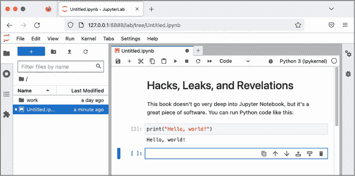
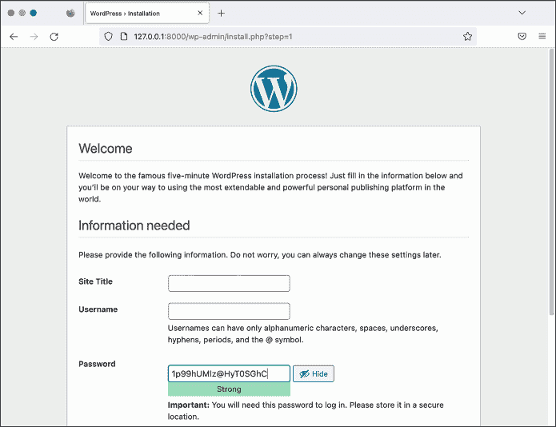
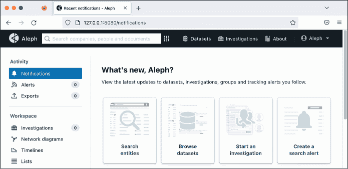
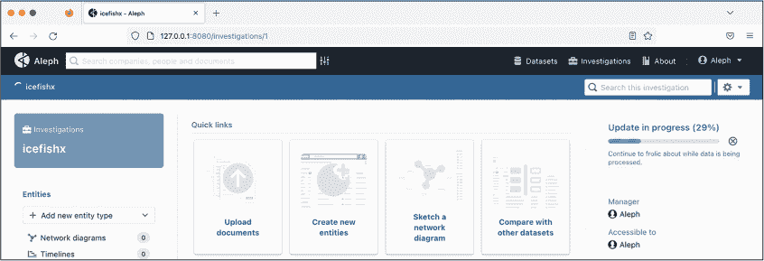
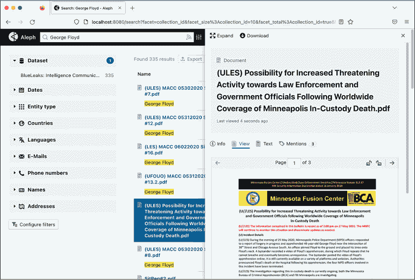

<hgroup>

## <samp class="SANS_Futura_Std_Bold_Condensed_B_11">5</samp> <samp class="SANS_Dogma_OT_Bold_B_11">DOCKER、ALEPH 与使数据集可搜索</samp>

</hgroup>

当我获得一个新的数据集时，我做的第一件事就是搜索其中是否有任何有价值且易于发现的信息。根据数据集的不同，我可能会查找政治人物、组织或我所在的城市。在上一章中，你学习了如何使用<samp class="SANS_TheSansMonoCd_W5Regular_11">grep</samp>来搜索 CSV 或 JSON 文件这样的文本文件，但<samp class="SANS_TheSansMonoCd_W5Regular_11">grep</samp>无法对像 PDF 或 Office 文档这样的二进制文件进行搜索。在本章中，你将通过 Aleph 这一开源调查工具，拓展你的搜索能力。

Aleph 是由“有组织犯罪与腐败报告项目”开发的，这个项目是一个主要基于东欧和中亚地区的调查记者团队。该工具允许你*索引*数据集，提取其中包含的所有文本，使其易于搜索。你可以使用 Aleph 搜索关键词或*实体*（例如人物、公司、组织或地址），并发现与其他数据集中的相关实体。Aleph 还可以执行光学字符识别（OCR），正如在第一章中提到的，它将扫描文档或截图等平面图像，利用人工智能识别其中的文字，并将这些文字转换成可以搜索或复制粘贴的文本。

在本章的前半部分，你将学习如何使用 Docker 和 Docker Compose，这是运行 Aleph 所需的软件。在后半部分，你将运用新学的 Docker 技能来运行 Aleph 服务器，然后对 BlueLeaks 数据集的部分内容进行索引和搜索。

### <samp class="SANS_Futura_Std_Bold_B_11">介绍 Docker 和 Linux 容器</samp>

Docker 是运行*Linux 容器*（一种软件包类型）最流行的软件。Linux 容器可以将已经配置好的 Linux 软件——包括所有依赖项、配置和源代码——打包成一个叫做*容器镜像*的单一包，这样你就可以快速且轻松地运行它。容器中的软件与计算机的其他部分是隔离的；除非你允许，否则它不能访问任何文件。

举个例子，假设你想在 Linux 中设置流行的 WordPress 博客软件。你使用像 apt 这样的包管理器来安装 WordPress 所依赖的软件包。然后，你将 WordPress 的源代码放置在磁盘上的一个位置，并设置正确的权限，配置你的 Web 服务器软件，以便它知道在哪里查找源代码，并配置一个数据库来存储博客的数据。之后，你可以将这些工作保存到一个名为<samp class="SANS_TheSansMonoCd_W5Regular_11">wordpress</samp>的 Linux 容器中，并通过一个 Docker 命令重新使用该容器来启动新的 WordPress 站点。

因为 Linux 容器与计算机其他部分是隔离的，所以多个 WordPress 容器可以同时运行而互不干扰。如果有人入侵了在容器中运行的软件，他们将无法访问存储在计算机其他地方的数据——至少，在没有黑入 Docker 本身的情况下，是无法做到的。这就是为什么 Dangerzone 依赖于 Linux 容器：如果恶意文档成功入侵你正在使用的 Dangerzone 容器，你的计算机应该依然是安全的。除了像 WordPress 这样的软件，你还可以使用 Linux 容器在大多数 Linux 发行版中运行命令，而无需安装这些操作系统。

Docker 带有两个你将在本章中使用的命令：<samp class="SANS_TheSansMonoCd_W5Regular_11">docker</samp>，用于运行单独的容器，以及 <samp class="SANS_TheSansMonoCd_W5Regular_11">docker-compose</samp>，它让你可以同时运行多个容器。你将通过运行 Ubuntu 和 Kali Linux 操作系统的 Linux 容器，以及数据科学软件 Jupyter Notebook 来练习使用 <samp class="SANS_TheSansMonoCd_W5Regular_11">docker</samp> 命令。然后，你将使用 <samp class="SANS_TheSansMonoCd_W5Regular_11">docker-compose</samp> 来运行 WordPress 服务器和 Aleph 服务器。Aleph 需要一个小型的服务网络，它们相互通信，但和 WordPress 一样，你可以使用单个 Docker 命令在各自的容器中启动所有这些独立的服务器。这个过程应该能帮助你为本书后续章节中使用 Docker 运行 Linux 容器做准备。

本章介绍了两种用于运行 Docker 容器的应用程序：Docker Desktop 和 Docker Engine。Docker Desktop 在工作站计算机的 Linux 虚拟机上运行 Docker 容器。而 Docker Engine 则直接在 Linux 计算机上运行 Docker。Windows 和 Mac 用户请转到练习 5-1 来设置 Docker Desktop。Linux 用户请转到练习 5-2 来安装 Docker Engine。

> <samp class="SANS_Dogma_OT_Bold_B_21">注意</samp>

*Linux 用户可以安装 Docker Desktop，但我不推荐在本章中使用它。没有虚拟机时，Docker 会自由地使用你计算机的所有内存和处理器，这将使 Aleph 中的数据集索引速度大大加快。*

### <samp class="SANS_Futura_Std_Heavy_B_21">练习 5-1：在 Windows 和 macOS 上初始化 Docker Desktop</samp>

当你在练习 1-3 中安装 Dangerzone 时，Docker Desktop 应该也已安装，因为 Dangerzone 需要它。通过检查你的 macOS 中的 *应用程序* 文件夹或 Windows 中的开始菜单是否有 Docker 程序来确认 Docker Desktop 是否已安装；如果没有，请从 [*https://<wbr>www<wbr>.docker<wbr>.com<wbr>/products<wbr>/docker<wbr>-desktop<wbr>/*](https://www.docker.com/products/docker-desktop/) 下载。

打开 Docker 并按照屏幕上的说明初始化软件。您可能需要重新启动计算机。Docker Desktop 的 Linux 虚拟机应已启动并运行，才能使用 Docker。如果您点击系统托盘中的 Docker 图标并看到 Docker Desktop 正在运行，说明您可以继续操作。

如果您使用的是 Windows，可以使用 PowerShell 或 Ubuntu 与 WSL 来完成本章内容，因为<samp class="SANS_TheSansMonoCd_W5Regular_11">docker</samp>和<samp class="SANS_TheSansMonoCd_W5Regular_11">docker-desktop</samp>命令在两者中都应该能正常运行。即使您在 PowerShell 中使用 Docker，它本质上也依赖于后台的 WSL。

如果您使用的是 macOS，点击系统托盘中的 Docker 图标并选择**偏好设置**。切换到“资源”标签，确保内存资源至少设置为 6GB——如果您的电脑有更多内存，可以设置得更高——确保 Docker 的 Linux 虚拟机有足够的内存来运行 Aleph。点击**应用并重启**。

对于任一操作系统，测试 Docker 是否正常工作，打开终端并运行以下命令：

```
**docker run hello-world**
```

该命令应该运行一个名为<samp class="SANS_TheSansMonoCd_W5Regular_11">hello-world</samp>的 Docker 容器镜像。如果您的计算机上尚未有<samp class="SANS_TheSansMonoCd_W5Regular_11">hello-world</samp>镜像，Docker 会先下载该镜像。输出应该类似于以下内容：

```
Unable to find image 'hello-world:latest' locally

latest: Pulling from library/hello-world

2db29710123e: Pull complete

Digest: sha256:10d7d58d5ebd2a652f4d93fdd86da8f265f5318c6a73cc5b6a9798ff6d2b2e67

Status: Downloaded newer image for hello-world:latest

 Hello from Docker!

This message shows that your installation appears to be working correctly.

`--snip--`
```

您的计算机已经准备好运行 Linux 容器。跳至第 123 页的“使用 Docker 运行容器”部分。

### <samp class="SANS_Futura_Std_Heavy_B_21">练习 5-2：在 Linux 上初始化 Docker Engine</samp>

请按照[*https://<wbr>docs<wbr>.docker<wbr>.com<wbr>/engine<wbr>/install<wbr>/*](https://docs.docker.com/engine/install/)中的详细说明安装适用于您版本的 Linux 的 Docker Engine。在 Ubuntu 中，安装过程包括将一个新的 apt 源添加到您的计算机中并安装一些 Docker 软件包。

在 Linux 上运行 Docker Engine 需要 root 权限。完成此练习后，如果您使用的是 Linux，请在本书中所有的<samp class="SANS_TheSansMonoCd_W5Regular_11">docker</samp>或<samp class="SANS_TheSansMonoCd_W5Regular_11">docker-compose</samp>命令前添加<samp class="SANS_TheSansMonoCd_W5Regular_11">sudo</samp>。要使所有 Docker 命令都自动以 root 身份运行而无需使用<samp class="SANS_TheSansMonoCd_W5Regular_11">sudo</samp>，请查阅 Docker Engine 文档，了解如何将 Linux 用户添加到<samp class="SANS_TheSansMonoCd_W5Regular_11">docker</samp>组中；但请注意，这样做会降低计算机的安全性，不建议这么做。

安装 Docker 后，打开终端并运行：

```
**sudo docker run hello-world**
```

这个命令运行一个名为 <samp class="SANS_TheSansMonoCd_W5Regular_11">hello-world</samp> 的 Docker 容器镜像。如果你的计算机上还没有 <samp class="SANS_TheSansMonoCd_W5Regular_11">hello-world</samp> 镜像，Docker 将首先下载它。输出结果应该类似于以下内容：

```
Unable to find image 'hello-world:latest' locally

latest: Pulling from library/hello-world

2db29710123e: Pull complete

Digest: sha256:507ecde44b8eb741278274653120c2bf793b174c06ff4eaa672b713b3263477b

Status: Downloaded newer image for hello-world:latest

Hello from Docker!

This message shows that your installation appears to be working correctly.

`--snip--`
```

如果 <samp class="SANS_TheSansMonoCd_W5Regular_11">hello-world</samp> 容器成功运行，你现在可以在计算机上使用 <samp class="SANS_TheSansMonoCd_W5Regular_11">docker</samp> 命令。接下来，运行以下命令来安装 <samp class="SANS_TheSansMonoCd_W5Regular_11">docker-compose</samp> 包，这将使你能够使用 <samp class="SANS_TheSansMonoCd_W5Regular_11">docker-compose</samp> 命令：

```
**sudo apt install docker-compose**
```

你的计算机现在已经准备好运行 Linux 容器。

### <samp class="SANS_Futura_Std_Bold_B_11">使用 Docker 运行容器</samp>

你刚刚安装的 <samp class="SANS_TheSansMonoCd_W5Regular_11">docker</samp> 命令允许你在计算机上运行 Linux 容器。在本节中，你将学习如何使用这个命令在容器内打开 Shell、强制运行中的容器退出、挂载卷以保存持久数据或访问特定文件、设置环境变量，以及发布端口，使你的计算机能够连接到容器内的网络服务。对 Docker 的这一基础理解将帮助你在第 5-3 章运行 Docker 容器，并帮助你排查以后与 Aleph 相关的任何问题。

> <samp class="SANS_Dogma_OT_Bold_B_21">注意</samp>

*有关 Docker 命令的更多信息，请运行* <samp class="SANS_TheSansMonoCd_W7Bold_Italic_BI_11">docker help</samp> *或查看文档* [`docs.docker.com`](https://docs.docker.com)*。*

#### <samp class="SANS_Futura_Std_Bold_Condensed_Oblique_BI_11">运行 Ubuntu 容器</samp>

你将从学习如何运行一个包含 Ubuntu 操作系统的 Linux 容器开始。人们通常在 Ubuntu 容器镜像的基础上构建更复杂的容器镜像，以便访问 apt 可以安装的所有 Ubuntu 软件。Ubuntu 容器也是一种方便的方式来访问一个干净的 Ubuntu 系统上的 Shell，允许你安装软件或测试程序。

Docker 命令使用 <samp class="SANS_TheSansMonoCd_W5Regular_11">docker</samp> <samp class="SANS_TheSansMonoCd_W5Regular_Italic_I_11">命令</samp> 语法。运行以下命令来启动你自己的 Ubuntu 容器（如果你使用的是 Linux，请记得加上 <samp class="SANS_TheSansMonoCd_W5Regular_11">sudo</samp>）：

```
**docker run -it ubuntu:latest bash**
```

此命令运行<samp class="SANS_TheSansMonoCd_W5Regular_11">ubuntu:latest</samp>，即最新版本的<samp class="SANS_TheSansMonoCd_W5Regular_11">ubuntu</samp>镜像。如果该镜像尚未存在于你的计算机中，Docker 会自动从 Docker Hub 下载该镜像，Docker Hub 是一个公开容器镜像库，网址是[*https://<wbr>hub<wbr>.docker<wbr>.com*](https://hub.docker.com)。接下来，运行<samp class="SANS_TheSansMonoCd_W5Regular_11">bash</samp>命令，为你提供容器内部的 shell 访问权限。在<samp class="SANS_TheSansMonoCd_W5Regular_11">docker run</samp>后加上<samp class="SANS_TheSansMonoCd_W5Regular_11">-it</samp>参数，它是<samp class="SANS_TheSansMonoCd_W5Regular_11">-i</samp>（或<samp class="SANS_TheSansMonoCd_W5Regular_11">--interactive</samp>）和<samp class="SANS_TheSansMonoCd_W5Regular_11">-t</samp>（或<samp class="SANS_TheSansMonoCd_W5Regular_11">--tty</samp>）的缩写，当你计划在容器内打开 shell 时使用该参数，这样你在终端中输入的任何命令都会在容器内运行。如果没有<samp class="SANS_TheSansMonoCd_W5Regular_11">-it</samp>参数，bash shell 会在你运行任何命令之前立刻退出，容器也会退出。

此命令给我以下输出：

```
micah@trapdoor ~ % **docker run -it ubuntu:latest bash**

Unable to find image 'ubuntu:latest' locally

latest: Pulling from library/ubuntu

d19f32bd9e41: Pull complete

Digest: sha256:34fea4f31bf187bc915536831fd0afc9d214755bf700b5cdb1336c82516d154e

Status: Downloaded newer image for ubuntu:latest

root@5661828c22a2:/#
```

由于我之前没有安装<samp class="SANS_TheSansMonoCd_W5Regular_11">ubuntu:latest</samp>镜像，命令下载了该镜像，启动了容器，并进入了 bash shell。我现在可以在这个容器内运行任何命令，例如安装软件或运行程序。

运行<samp class="SANS_TheSansMonoCd_W5Regular_11">exit</samp>命令退出容器。如果你启动一个新的<samp class="SANS_TheSansMonoCd_W5Regular_11">ubuntu:latest</samp>容器，它将不包含旧容器的任何数据。例如，使用以下命令，我在一个容器中创建了一个名为*test.txt*的文件，然后退出了该容器，接着启动了一个新的容器：

```
root@5661828c22a2:/# **echo "Hacks, Leaks, and Revelations" > test.txt**

root@5661828c22a2:/# **cat test.txt**

Hacks, Leaks, and Revelations

root@5661828c22a2:/# **exit**

exit

micah@trapdoor ~ % **docker run -it ubuntu:latest bash**

root@e8888f73a106:/# **cat test.txt**

cat: test.txt: No such file or directory

root@e8888f73a106:/#
```

输出显示*test.txt*文件不再存在。为了让容器中的数据在重新运行容器镜像时得以保存，你需要使用卷，具体内容我们将在第 125 页的《挂载和移除卷》中讨论。

#### <samp class="SANS_Futura_Std_Bold_Condensed_Oblique_BI_11">列出和终止容器</samp>

如果你已经退出了 Ubuntu 容器，运行一个新的容器。该容器在后台运行时，打开第二个终端窗口，运行<samp class="SANS_TheSansMonoCd_W7Bold_B_11">docker ps</samp>命令。这个命令将显示当前所有正在运行的容器列表。以下是我得到的输出示例：

```
CONTAINER ID   IMAGE           COMMAND   CREATED           STATUS         PORTS     NAMES

337a795a53b2   ubuntu:latest   "bash"    9 minutes   ago   Up 9 minutes             epic_borg
```

当你使用 <samp class="SANS_TheSansMonoCd_W5Regular_11">docker run</samp> 启动一个容器时，你可以通过参数 <samp class="SANS_TheSansMonoCd_W5Regular_11">--name</samp> <samp class="SANS_TheSansMonoCd_W5Regular_Italic_I_11">your_container_name</samp> 给它命名。否则，它将被分配一个随机名称。我的 <samp class="SANS_TheSansMonoCd_W5Regular_11">docker ps</samp> 输出中的容器名为 <samp class="SANS_TheSansMonoCd_W5Regular_11">epic_borg</samp>。

要*杀死*一个容器，或者强制它退出，你可以运行 <samp class="SANS_TheSansMonoCd_W5Regular_11">docker kill</samp> <samp class="SANS_TheSansMonoCd_W5Regular_Italic_I_11">container_name</samp>。例如，在我的另一个终端窗口中运行以下命令可以退出我的 <samp class="SANS_TheSansMonoCd_W5Regular_11">epic_borg</samp> 容器：

```
docker kill epic_borg
```

为你的容器运行这个命令。如果你切换回另一个终端窗口，容器应该已经退出，并且你应该回到正常的 shell 中。

当你退出一个容器时，Docker 仍然会追踪它，允许你在需要时重新启动它。要查看 Docker 追踪的所有容器，包括那些已经不再运行的容器，你可以运行 <samp class="SANS_TheSansMonoCd_W7Bold_B_11">docker ps -a</samp>（即 <samp class="SANS_TheSansMonoCd_W5Regular_11">--all</samp> 的简写）。以下是我运行此命令时的输出：

```
CONTAINER ID   IMAGE         ...   STATUS                     PORTS     NAMES

337a795a53b2   ubuntu:latest ...   Exited (0) 43 minutes ago            nostalgic_keldysh
```

使用 <samp class="SANS_TheSansMonoCd_W7Bold_B_11">docker rm</samp> <samp class="SANS_TheSansMonoCd_W7Bold_Italic_BI_11">container_name</samp> 来修剪你停止的 Docker 容器是一种好习惯，当你完成使用它们时。举个例子，我会运行 <samp class="SANS_TheSansMonoCd_W5Regular_11">docker rm nostalgic_keldysh</samp> 来删除我的 <samp class="SANS_TheSansMonoCd_W5Regular_11">nostalgic_keldysh</samp> 容器。

你可以运行 <samp class="SANS_TheSansMonoCd_W7Bold_B_11">docker container prune</samp> 来一次性删除所有停止的容器。当我运行这个命令时，我看到了以下输出：

```
WARNING! This will remove all stopped containers.

Are you sure you want to continue? [y/N]
```

我输入了 <samp class="SANS_TheSansMonoCd_W5Regular_11">y</samp> 并得到了以下输出：

```
Deleted Containers:

337a795a53b25e6c28888a44a0ac09fac9bf6aef4ab1c3108844ca447cce4226

Total reclaimed space: 5B
```

这会显示每个已删除容器的容器 ID，一长串看起来随机的文本。在我的例子中，我删除了一个容器。

#### <samp class="SANS_Futura_Std_Bold_Condensed_Oblique_BI_11">挂载和移除卷</samp>

容器支持*卷*，你可以把它们看作是容器中的文件夹，用于存储持久化数据。你可以使用卷来保存你在退出并删除容器后所做的更改。

例如，假设你启动了一个没有任何卷的容器，并且运行 PostgreSQL 数据库软件。你添加到容器中的任何数据都会保存在容器内的*/var/lib/postgresql/data*文件夹中。当你退出并移除容器时，所有数据都会丢失。如果你将主机操作系统中的一个文件夹*挂载*到容器中的*/var/lib/postgresql/data*，那么当容器中的软件访问该文件夹时，实际上是在访问主机操作系统中的文件夹。容器关闭并移除后，你仍然可以保留所有数据，未来你可以使用相同的数据重新启动容器。

Docker 有两种主要的卷类型：*绑定挂载*，即将主机机器上的文件夹挂载到容器中，以及普通 Docker 卷，其中 Docker 会跟踪你的持久化文件夹，而你无需提供主机操作系统中的路径。例如，如果你想将数据库容器的数据存储在主机文件系统中的*/Volumes/datasets/volumes/db-data*文件夹中，你将把这个文件夹作为绑定挂载。如果你不需要将数据存储在主机上的特定文件夹中，只需使用普通卷，Docker 会自动跟踪数据存储的位置。

> <samp class="SANS_Dogma_OT_Bold_B_21">注意</samp>

*将卷存储在带有 Docker Desktop 的 Linux 虚拟机中比绑定挂载更快，但如果你的卷变得太大（例如，如果你将大型数据集索引到 Aleph 中），虚拟机可能会用完磁盘空间。在 macOS 中，你可以通过 Docker Desktop 偏好设置中的资源选项卡增加虚拟机可用的磁盘空间。在 Windows 中，虚拟机会使用 C: 盘上需要的空间，但如果处理大量数据，该驱动器也可能会用完磁盘空间。另一种选择是使用绑定挂载，而不是卷，将数据存储在外部磁盘上。*

你还可以在容器运行时使用卷来访问容器外部的数据。在练习 5-5 中，你将把你的*datasets* USB 磁盘绑定挂载为 Aleph 容器中的一个文件夹。这样，容器就可以访问 BlueLeaks 数据集，从而进行索引。

使用此命令启动带有卷的容器：

```
**docker run --mount type=volume,src=****`volume-name`****,dst=****`/container/path image`**
```

使用此命令启动带有绑定挂载的容器：

```
**docker run --mount type=bind,src=****`/path/on/host`****,dst=****`/container/path image`**
```

<samp class="SANS_TheSansMonoCd_W5Regular_11">--mount</samp> 参数告诉 Docker 你将挂载一个卷，后面跟着有关该卷的以逗号分隔的详细信息。<samp class="SANS_TheSansMonoCd_W5Regular_11">type</samp> 参数指定挂载类型：对于卷是 <samp class="SANS_TheSansMonoCd_W5Regular_11">volume</samp>，对于绑定挂载是 <samp class="SANS_TheSansMonoCd_W5Regular_11">bind</samp>。<samp class="SANS_TheSansMonoCd_W5Regular_11">src</samp> 参数指定卷或绑定挂载的源。对于卷，它的值是卷名；对于绑定挂载，它的值是主机文件系统中你想挂载的文件夹的绝对路径。<samp class="SANS_TheSansMonoCd_W5Regular_11">dst</samp> 参数指定卷或绑定挂载的目标，在两种情况下，它都是容器内你要挂载的文件夹的绝对路径。

让我们练习这两个命令，从挂载一个卷开始。运行以下代码（你的提示符与我的会有所不同）：

```
micah@trapdoor ~ % **docker run -it --mount type=volume,src=test-data,dst=****/mnt**

**ubuntu:latest bash** root@50b8b6f86e4d:/# **echo "Hacks, Leaks, and Revelations" > /mnt/test.txt**

root@50b8b6f86e4d:/# **exit**
```

这段代码启动一个 Ubuntu 容器，并将一个名为 <samp class="SANS_TheSansMonoCd_W5Regular_11">test-data</samp> 的卷挂载到容器中的 */mnt* 文件夹。然后，它将一些数据保存到 */mnt/test.txt* 文件中，并退出容器。

使用以下命令打开一个单独的容器，将相同的卷挂载到其中，看看你的数据是否仍然存在（再次提醒，你的命令提示符会不同）：

```
micah@trapdoor ~ % **docker run -it --mount type=volume,src=****test-data,dst=/mnt**

**ubuntu:latest bash**

root@665f910bb21c:/# **cat /mnt/test.txt**

Hacks, Leaks, and Revelations

root@665f910bb21c:/# **exit**
```

这次，由于你在 <samp class="SANS_TheSansMonoCd_W5Regular_11">test-data</samp> 卷中挂载了 */mnt*，数据得以持久化。

要查看 Docker 管理的卷列表，运行 <samp class="SANS_TheSansMonoCd_W7Bold_B_11">docker volume ls</samp> 命令。你应该看到以下输出：

```
DRIVER    VOLUME NAME

local     test-data
```

你只能从已经完全从 Docker 中删除的容器中删除卷。如果你刚刚停止了一个容器，但 Docker 仍在跟踪它，它将不允许你删除该卷。通过运行 <samp class="SANS_TheSansMonoCd_W7Bold_B_11">docker container prune</samp> 完全删除所有停止的容器，然后你可以删除附加到这些容器的任何卷。你应该看到以下输出：

```
WARNING! This will remove all stopped containers.

Are you sure you want to continue? [y/N]
```

输入 <samp class="SANS_TheSansMonoCd_W7Bold_B_11">y</samp> 继续：

```
Deleted Containers:

665f910bb21ca701be416da94c05ee6a226117923367d2f7731693062683a402

50b8b6f86e4d0eab9eb0ba9bf006ae0473525d572ea687865f8afca8a92e7087

Total reclaimed space: 82B
```

现在你可以运行 <samp class="SANS_TheSansMonoCd_W7Bold_B_11">docker volume rm</samp> <samp class="SANS_TheSansMonoCd_W7Bold_Italic_BI_11">volume-name</samp> 来删除附加到这些容器的任何卷，或者运行 <samp class="SANS_TheSansMonoCd_W7Bold_B_11">docker volume prune</samp> 来删除 Docker 容器当前未使用的所有卷。运行 <samp class="SANS_TheSansMonoCd_W7Bold_B_11">docker volume rm test-data</samp> 来删除 <samp class="SANS_TheSansMonoCd_W5Regular_11">test-data</samp> 卷，然后再次运行 <samp class="SANS_TheSansMonoCd_W7Bold_B_11">docker volume ls</samp> 命令。这次，你不应该在输出中看到任何列出的卷。

接下来，你将通过将包含 BlueLeaks 数据集的文件夹挂载到运行 Kali Linux 的容器中来练习绑定挂载。这个 Linux 发行版专为*渗透测试*设计，在渗透测试中，人员在系统所有者的许可下进入系统，寻找并修复安全漏洞。

如果你是 Mac 或 Linux 用户，运行以下命令，并将路径替换为你计算机上的适当路径：

```
**docker run -it --mount type=****bind,src=****`/Volumes/datasets/BlueLeaks-extracted`****,dst=/blueleaks**

**kalilinux/kali-rolling bash**
```

这将运行一个<samp class="SANS_TheSansMonoCd_W5Regular_11">kalilinux/kali-rolling</samp>容器，将你的*BlueLeaks-extracted*文件夹挂载到路径*/blueleaks*下，并进入 bash 终端。

Windows 用户在将*datasets* USB 磁盘的文件夹绑定挂载到容器时，可能会遇到问题，因为 Windows 版 Docker Desktop 使用 WSL 运行 Linux 容器，而 WSL 并不总是能够访问你的 USB 磁盘。为避免此问题，如果你在打开 WSL 终端或使用 Docker 后插入了 USB 磁盘，请通过在 PowerShell 中运行<samp class="SANS_TheSansMonoCd_W7Bold_B_11">wsl --shutdown</samp>来重启 WSL。你应该会看到来自 Docker Desktop 的通知，询问是否要重新启动它。点击**重启**。在重启 WSL 并确保 USB 磁盘已插入后，Docker 应该能够挂载它。（有关更多信息，请参见附录 A。）

如果你在 Windows 上使用 PowerShell 进行此章节操作，运行以下命令将包含 BlueLeaks 数据的文件夹挂载到*/datasets*，并将<samp class="SANS_TheSansMonoCd_W5Regular_Italic_I_11">D:/BlueLeaks-extracted</samp>替换为适当的路径：

```
**docker run -it –mount type-bind,src=****`D:/BlueLeaks-extracted`****,dst=/blueleaks kalilinux/**

**kali-rolling bash**
```

如果你在 Windows 上使用 WSL 的 Ubuntu，可以通过以下语法从*/mnt/d*访问*D:*驱动器来挂载*BlueLeaks*文件夹：

```
**docker run -it --mount type=bind,src=****`/mnt/d/BlueLeaks-extracted`****,dst=/blueleaks kalilinux/**

**kali-rolling bash**
```

在 Kali 容器内，你可以使用 Kali 附带的工具对 BlueLeaks 数据集进行处理。默认情况下，Kali 会定制你的 bash 终端，使其与 Ubuntu 稍有不同。终端提示符大致是这样的：

```
┌──(root㉿6a36e316663c)-[/]

└─#
```

Docker 容器会被分配随机的主机名。在本例中，<samp class="SANS_TheSansMonoCd_W5Regular_11">root</samp>是当前用户的名称，<samp class="SANS_TheSansMonoCd_W5Regular_11">6a36e316663c</samp>是计算机的主机名，<samp class="SANS_TheSansMonoCd_W5Regular_11">/</samp>是当前工作目录。从这里开始，运行<samp class="SANS_TheSansMonoCd_W7Bold_B_11">ls /blueleaks/</samp>来列出*BlueLeaks*文件夹中的文件：

```
211sfbay               iowaintex               pleasantonpolice

Securitypartnership    jerseyvillagepd         prvihidta

acprlea                jric                    pspddoc

acticaz                kcpers                  publicsafetycadets

`--snip--`
```

> <samp class="SANS_Dogma_OT_Bold_B_21">注意</samp>

*你可以通过以下链接了解更多关于卷和绑定挂载的信息* [`<wbr>docs<wbr>.docker<wbr>.com<wbr>/storage<wbr>/`](https://docs.docker.com/storage/)。

#### <samp class="SANS_Futura_Std_Bold_Condensed_Oblique_BI_11">传递环境变量</samp>

你还可以使用在第四章中介绍的环境变量，将敏感信息（如数据库凭证）传递到容器中。在启动容器时，你可以使用 <samp class="SANS_TheSansMonoCd_W5Regular_11">-e</samp> <samp class="SANS_TheSansMonoCd_W5Regular_Italic_I_11">variable_name</samp><samp class="SANS_TheSansMonoCd_W5Regular_11">=</samp><samp class="SANS_TheSansMonoCd_W5Regular_Italic_I_11">value</samp>（其中 <samp class="SANS_TheSansMonoCd_W5Regular_11">-e</samp> 是 <samp class="SANS_TheSansMonoCd_W5Regular_11">--env</samp> 的简写）来传递环境变量。容器中的程序可以访问该变量的值。

例如，运行以下命令：

```
**docker run -it -e DB_USER=root -e DB_PASSWORD=yourefired ubuntu:latest bash**
```

这将启动一个 Ubuntu 容器，其中变量 <samp class="SANS_TheSansMonoCd_W5Regular_11">DB_USER</samp> 被设置为 <samp class="SANS_TheSansMonoCd_W5Regular_11">root</samp>，变量 <samp class="SANS_TheSansMonoCd_W5Regular_11">DB_PASSWORD</samp> 被设置为 <samp class="SANS_TheSansMonoCd_W5Regular_11">yourefired</samp>。在容器内，尝试使用 <samp class="SANS_TheSansMonoCd_W5Regular_11">echo $</samp><samp class="SANS_TheSansMonoCd_W5Regular_Italic_I_11">variable_name</samp> 命令来显示这些变量的值，以确认你可以在容器内访问这些信息。

```
bash-5.1# **echo $DB_USER**

root

bash-5.1# **echo $DB_PASSWORD**

yourefired
```

你将在练习 5-3 中进一步练习如何向容器传递环境变量。

#### <samp class="SANS_Futura_Std_Bold_Condensed_Oblique_BI_11">运行服务器软件</samp>

你也可以在运行在容器中的操作系统上运行强大的、完全配置的软件。这项技术主要用于访问 *服务器软件*，即可以通过网络使用网页浏览器、数据库客户端或其他类似程序连接的软件。你将在练习 5-3 中需要用到这项技能，最终你也会用它来运行 Aleph。

不同的计算机（或虚拟机、或容器），被称为 *主机*，通过 IP 地址或主机名来标识。你自己计算机的 IP 地址总是 127.0.0.1，它的主机名总是 *localhost*。主机可以在不同的端口上监听传入的网络连接，这意味着主机可以为其他主机提供网络连接。*端口* 是一个数字，计算机通过它来区分哪些网络流量应该发送到哪个应用程序。

不同的服务有不同的默认端口。例如，HTTP 和 HTTPS 服务分别使用端口 80 和端口 443。当你在浏览器中加载 URL *http://<wbr>example<wbr>.com* 时，它会尝试使用 HTTP 协议通过端口 80 连接到主机 *example.com*。如果你加载 *https://<wbr>example<wbr>.com*，它会尝试通过端口 443 使用 HTTPS 协议连接。

然而，你可以更改服务使用的默认端口。如果你在 *localhost* 上的 5000 端口运行 HTTP 服务，则该服务的 URL 是 *http://<wbr>localhost:5000*，其中 *http://<wbr>* 表示你使用 HTTP 协议，*localhost* 表示你连接到 *localhost* 主机，而 *:5000* 表示你连接到 5000 端口，而不是默认的 HTTP 端口 80。

要连接到 Docker 容器内部的网络端口，必须在运行容器时*发布*一个网络端口，使该端口在宿主操作系统上可用。为此，使用参数 <samp class="SANS_TheSansMonoCd_W5Regular_11">-p</samp> <samp class="SANS_TheSansMonoCd_W5Regular_Italic_I_11">host_port</samp><samp class="SANS_TheSansMonoCd_W5Regular_11">:</samp><samp class="SANS_TheSansMonoCd_W5Regular_Italic_I_11">container_port</samp>（<samp class="SANS_TheSansMonoCd_W5Regular_11">-p</samp> 是 <samp class="SANS_TheSansMonoCd_W5Regular_11">--publish</samp> 的缩写）。一旦容器启动，宿主操作系统会在 <samp class="SANS_TheSansMonoCd_W5Regular_Italic_I_11">host_port</samp> 上监听。如果你连接到该端口，连接会被转发到容器内部的 <samp class="SANS_TheSansMonoCd_W5Regular_Italic_I_11">container_port</samp>。

让我们来看一个运行服务器软件并发布端口的示例，这样你就可以从宿主计算机连接到它。运行以下命令：

```
**docker run -p 8000:8888 jupyter/scipy-notebook:latest**
```

这个命令应该会下载并运行最新版本的 *jupyter/scipy-notebook* 容器镜像，其中包含了最流行的与科学相关的 Python 库。（Jupyter Notebook 是一个强大的数据科学工具，用于创建和共享计算文档。）Jupyter Notebook 会在容器的 8888 端口启动一个 HTTP 服务。参数 <samp class="SANS_TheSansMonoCd_W5Regular_11">-p 8000:8888</samp> 意味着 <samp class="SANS_TheSansMonoCd_W5Regular_Italic_I_11">host_port</samp> 是 <samp class="SANS_TheSansMonoCd_W5Regular_11">8000</samp>，而 <samp class="SANS_TheSansMonoCd_W5Regular_Italic_I_11">container_port</samp> 是 <samp class="SANS_TheSansMonoCd_W5Regular_11">8888</samp>。如果你连接到 *localhost* 的 8000 端口，使用 URL *http://<wbr>localhost:8000* 或 *http://<wbr>127<wbr>.0<wbr>.0<wbr>.1:8000*，你实际上会连接到容器内部的 8888 端口。

这是前一个命令的输出：

```
Unable to find image 'jupyter/scipy-notebook:latest' locally

latest: Pulling from jupyter/scipy-notebook

08c01a0ec47e: Pull complete

`--snip--`

Status: Downloaded newer image for jupyter/scipy-notebook:latest

Entered start.sh with args: jupyter lab

Executing the command: jupyter lab

`--snip--`

    To access the server, open this file in a browser:

        file:///home/jovyan/.local/share/jupyter/runtime/jpserver-7-open.html

    Or copy and paste one of these URLs:

        http://cc4a555569e4:8888/lab?token=d570e7d9ecc59bbc77536ea4ade65d02dd575ff3c6713dd4

    or http://127.0.0.1:8888/lab?token=d570e7d9ecc59bbc77536ea4ade65d02dd575ff3c6713dd4
```

输出显示该命令从 Docker Hub 下载了最新版本的 *jupyter/scipy-notebook* 容器镜像，并且运行了它。这一次，容器没有启动 shell，而是仅运行了为其设计的服务，即 Jupyter Notebook。每当 Jupyter Notebook 输出日志信息时，终端窗口都会显示它。

输出的末尾显示了访问服务器的三个不同 URL。复制最后一个 URL，将其粘贴到浏览器中，并将端口号从 8888 更改为 8000 后加载。当您在端口 8000（127.0.0.1:8000）连接到自己的计算机时，您的连接将被转发到容器的 8888 端口。您的浏览器应该加载在容器中运行的 Jupyter Notebook 服务。当发生这种情况时，您应该看到终端中出现更多日志消息。

图 5-1 显示了我在 Mac 上运行的 Web 浏览器，连接到一个运行在我的 Linux 容器中的 Jupyter Notebook 服务器。



<samp class="SANS_Futura_Std_Book_Oblique_I_11">图 5-1：在容器中运行的 Jupyter Notebook</samp>

容器会一直运行，直到您按 CTRL-C 退出。如果在容器仍在运行时需要运行其他终端命令，您需要打开一个独立的终端窗口。现在，在终端中按 CTRL-C 退出 Jupyter Notebook 容器。

本书中不会再使用 Jupyter Notebook，但您将依靠自己对运行服务器软件的新理解来在练习 5-3 中运行 WordPress 网站。

> <samp class="SANS_Dogma_OT_Bold_B_21">注意</samp>

*有关 Jupyter Notebook 的更多信息，请访问* [`jupyter.org`](https://jupyter.org)*，* *要查看有关在 Docker 中运行 Jupyter Notebook 的详细文档，请参阅* [`jupyter-docker-stacks.readthedocs.io`](https://jupyter-docker-stacks.readthedocs.io)*。*

#### <samp class="SANS_Futura_Std_Bold_Condensed_Oblique_BI_11">释放磁盘空间</samp>

Docker 镜像占用大量磁盘空间。要快速释放空间，请使用以下命令删除您从 Docker Hub 下载的所有容器镜像以及 Docker 存储的其他数据（除了卷之外）：

```
**docker system prune -a**
```

由于此命令不会删除卷，它不会删除您的任何重要数据。下次使用 <samp class="SANS_TheSansMonoCd_W5Regular_11">docker run</samp> 命令时，您只需从 Docker Hub 重新下载所需的容器镜像。

### <samp class="SANS_Futura_Std_Heavy_B_21">练习 5-3：使用</samp> <samp class="SANS_Futura_Std_Heavy_B_21">Docker Compose 运行 WordPress 网站</samp>

更复杂的软件，如 Aleph，需要运行多个相互交互的容器。为此，您需要学习使用 Docker Compose，因为 <samp class="SANS_TheSansMonoCd_W5Regular_11">docker run</samp> 命令的参数在运行更复杂的容器时会变得很难追踪——这些容器可能有卷、环境变量、发布端口等等。运行需要多个容器的单一应用程序尤其麻烦。

Docker Compose 使得定义和运行此类 Docker 应用程序变得更容易。该工具允许你在一个文件中配置容器（选择镜像、卷、环境变量、发布端口等），并通过一个命令启动和停止所有容器。我经常使用 Docker Compose，即使是仅需要一个容器的软件，因为它简化了所有配置的跟踪。要运行 Aleph 服务器，你需要熟练使用 Docker Compose。

在本次练习中，你将通过使用 Docker Compose 来运行 WordPress，从而熟悉 Docker Compose。虽然在本书的其余部分你不需要使用 WordPress，但它作为一个示例将帮助你为使用 Docker Compose 运行 Aleph 做准备。

#### <samp class="SANS_Futura_Std_Bold_Condensed_Oblique_BI_11">创建一个 docker-compose.yaml 文件</samp>

YAML 文件格式（[*https://<wbr>yaml<wbr>.org*](https://yaml.org)）因其相对人类可读的特点而广泛受到程序员的喜爱，用于存储配置文件。YAML 文件的扩展名为*.yml*或*.yaml*。Docker Compose 在名为*docker-compose.yaml*的文件中定义容器及其设置。

打开终端并切换到你的*exercises*文件夹。为本次练习创建一个名为*wordpress*的新文件夹，然后使用文本编辑器，在该文件夹中创建一个名为*docker-compose.yaml*的文件。在*该*文件中输入以下代码（或从[*https://<wbr>github<wbr>.com<wbr>/micahflee<wbr>/hacks<wbr>-leaks<wbr>-and<wbr>-revelations<wbr>/blob<wbr>/main<wbr>/chapter<wbr>-5<wbr>/wordpress<wbr>/docker<wbr>-compose<wbr>.yaml*](https://github.com/micahflee/hacks-leaks-and-revelations/blob/main/chapter-5/wordpress/docker-compose.yaml)复制并粘贴）：

```
services:

  wordpress:

    image: wordpress:latest

    volumes:

      - wordpress_data:/var/www/html

    ports:

      - 8000:80

    restart: always

  ❶ environment:

      - WORDPRESS_DB_HOST=db

      - WORDPRESS_DB_USER=wordpress

      - WORDPRESS_DB_PASSWORD=yourefired

      - WORDPRESS_DB_NAME=wordpress

  db:

    image: mariadb:10.9

    volumes:

      - db_data:/var/lib/mysql

    restart: always

  ❷ environment:

      - MYSQL_ROOT_PASSWORD=supersecurepassword

      - MYSQL_USER=wordpress

      - MYSQL_PASSWORD=yourefired

      - MYSQL_DATABASE=wordpress

volumes:

  db_data:

  wordpress_data:
```

YAML 文件对空白字符敏感，这意味着缩进会影响代码的含义。此文件定义了两个名为<samp class="SANS_TheSansMonoCd_W5Regular_11">wordpress</samp>和<samp class="SANS_TheSansMonoCd_W5Regular_11">db</samp>的容器。对于每个容器，它定义了使用哪个容器镜像、挂载哪些卷、发布哪些端口（对于<samp class="SANS_TheSansMonoCd_W5Regular_11">wordpress</samp>容器）、设置哪些环境变量以及其他设置。

<samp class="SANS_TheSansMonoCd_W5Regular_11">wordpress</samp>容器使用<samp class="SANS_TheSansMonoCd_W5Regular_11">wordpress:latest</samp>镜像来创建一个 WordPress 网站应用实例。<samp class="SANS_TheSansMonoCd_W5Regular_11">db</samp>容器使用<samp class="SANS_TheSansMonoCd_W5Regular_11">mariadb:10.9</samp>容器镜像来创建一个 MySQL 数据库服务器实例。（MySQL 是一个流行的数据管理系统，你将在第十二章中了解更多。）

由于这两个容器在同一个 *docker-compose.yaml* 文件中定义，默认情况下它们属于同一个 Docker 网络，因此可以互相通信。<samp class="SANS_TheSansMonoCd_W5Regular_11">wordpress</samp> 容器将 <samp class="SANS_TheSansMonoCd_W5Regular_11">WORDPRESS_DB_HOST</samp> 设置为 <samp class="SANS_TheSansMonoCd_W5Regular_11">db</samp>，即另一个容器的名称，因为它连接到该主机名。<samp class="SANS_TheSansMonoCd_W5Regular_11">wordpress</samp> 的环境变量❶也与 <samp class="SANS_TheSansMonoCd_W5Regular_11">db</samp> 的环境变量❷匹配。如果这些数据库凭证不相同，WordPress 在尝试连接数据库时会收到“权限拒绝”错误。

> <samp class="SANS_Dogma_OT_Bold_B_21">注意</samp>

*本示例中的 WordPress* docker-compose.yaml *文件是 Docker 文档中示例文件的稍作修改版本，详情请参见* [`docs.docker.com/samples/wordpress/`](https://docs.docker.com/samples/wordpress/)*.* *有关如何使用 Docker Compose 的更详细说明，请参见文档。*

#### <samp class="SANS_Futura_Std_Bold_Condensed_Oblique_BI_11">启动你的 WordPress 网站</samp>

在终端中，切换到你为本次练习创建的文件夹，然后运行以下命令同时启动两个容器：

```
**docker-compose up**
```

第一次运行时，Docker 应该会从 Docker Hub 下载 <samp class="SANS_TheSansMonoCd_W5Regular_11">mariadb:10.9</samp> 和 <samp class="SANS_TheSansMonoCd_W5Regular_11">wordpress:latest</samp> 容器镜像。然后命令将启动一个 MySQL 容器和一个运行 WordPress 的 Web 服务器容器，你应该能看到两个容器的日志在终端中滚动显示。<samp class="SANS_TheSansMonoCd_W5Regular_11">db</samp> 容器的日志以 <samp class="SANS_TheSansMonoCd_W5Regular_11">db_1</samp> 开头，而 <samp class="SANS_TheSansMonoCd_W5Regular_11">wordpress</samp> 容器的日志以 <samp class="SANS_TheSansMonoCd_W5Regular_11">wordpress_1</samp> 开头。

<samp class="SANS_TheSansMonoCd_W5Regular_11">db</samp> 容器不需要公开任何端口，WordPress 就可以连接到它，因为这两个容器共享同一个 Docker 网络。然而，<samp class="SANS_TheSansMonoCd_W5Regular_11">wordpress</samp> 容器公开了 8000:80 的端口。这意味着在浏览器中加载 *http://<wbr>127<wbr>.0<wbr>.0<wbr>.1:8000* 会连接到主机操作系统的 8000 端口，并加载运行在 80 端口上的 <samp class="SANS_TheSansMonoCd_W5Regular_11">wordpress</samp> 容器中的 Web 服务器。

在浏览器中输入***http://<wbr>127<wbr>.0<wbr>.0<wbr>.1:8000***，你就成功运行了 WordPress！图 5-2 显示了我在选择英语作为语言后，在我的 Mac 上加载该 URL 时出现的 WordPress 安装过程。



<samp class="SANS_Futura_Std_Book_Oblique_I_11">图 5-2：使用 Docker Compose 在两个容器中运行 WordPress</samp>

填写表单，输入您的 WordPress 网站标题、用户名和密码，然后开始探索您的新 WordPress 网站。

要打开一个 shell 并在 Docker Compose 的活动容器中运行命令，您需要使用 <samp class="SANS_TheSansMonoCd_W5Regular_11">docker-compose exec</samp> <samp class="SANS_TheSansMonoCd_W5Regular_Italic_I_11">container_name 命令</samp> 语法。例如，以下是如何在 <samp class="SANS_TheSansMonoCd_W5Regular_11">wordpress</samp> 容器中获得一个 shell：

```
**docker-compose exec wordpress bash**
```

当 <samp class="SANS_TheSansMonoCd_W5Regular_11">docker-compose run</samp> 启动一个新容器时，<samp class="SANS_TheSansMonoCd_W5Regular_11">docker-compose exec</samp> 则在活动容器中运行一个命令——有点像在运行中的容器内打开一个新的终端窗口。

完成后退出 shell。在运行 <samp class="SANS_TheSansMonoCd_W5Regular_11">docker-compose up</samp> 的终端中，按 CTRL-C 关闭容器。现在，您已经准备好使用新的 Docker 和 Docker Compose 技能，通过 Aleph 使您的数据集可搜索。

### <samp class="SANS_Futura_Std_Bold_B_11">介绍 Aleph</samp>

> *真理无法穿透封闭的心灵。如果宇宙中的所有地方都在阿莱夫中，那么所有的星星、所有的灯、所有的光源也都在其中。*
> 
> —豪尔赫·路易斯·博尔赫斯，《阿莱夫》

有组织犯罪和腐败报道项目（OCCRP），成立于 2006 年，历史上曾发布多起高调的腐败调查，通常导致刑事调查、逮捕和赃款的查扣。该组织与全球多个新闻机构合作，依靠大规模数据集进行调查。例如，OCCRP 与国际调查记者联盟（ICIJ）共同组成联盟，调查了“巴拿马文件”这一离岸避税天堂数据集，揭露了超过 40 篇关于腐败的报道。其中一篇故事揭露了弗拉基米尔·普京的密友挪用了来自俄罗斯纳税人的 2.3 亿美元。由于 OCCRP 处理大量数据，它开发了 Aleph 作为调查工具，以便更轻松地追踪白领犯罪、追踪资金流动并交叉引用各种数据集。

OCCRP 运行一个向公众开放的 Aleph 服务器，网址为[*https://<wbr>data<wbr>.occrp<wbr>.org*](https://data.occrp.org)。该服务器包含超过 250 个公共数据集，涵盖来自 139 个不同国家和地区的文档。虽然与 DDoSecrets 发布的数据集有一些重叠，但 OCCRP 的 Aleph 服务器中的大多数公共数据集是不同的。许多数据集是定期更新的公共记录数据集：全球公司所有权注册、面临国际制裁的个人和组织名单以及法院记录。这些数据集单独看可能不那么吸引人，但当你的调查指向某个特定人物或公司时，它们对于填补空白至关重要。OCCRP 的 Aleph 服务器还包含许多私有数据集，只有申请访问的记者才能使用。

花点时间查看 OCCRP 的 Aleph 服务器，探索可用的公共数据集，并进行一些搜索。例如，如果你搜索 Rudy Giuliani（唐纳德·特朗普的密友和前律师，以及纽约市前市长），并按美国联邦法院档案数据集进行筛选，你将找到一系列涉及 Giuliani 的法院文件。

你只能在 OCCRP 为你创建账户后，才能将自己的数据集上传到 OCCRP 的 Aleph 服务器。即使你有账户，没有与第三方 OCCRP 共享数据的情况下，你也无法上传中高安全级别的数据集。这就是为什么我帮助为 The Intercept 运行一个私有 Aleph 服务器的原因。本书后面你不会再使用 OCCRP 的公共 Aleph 服务器，而是会在练习 5-4 中，在自己的笔记本电脑上运行一个小型的 Aleph 服务器，并启动 Aleph 容器。

### <samp class="SANS_Futura_Std_Heavy_B_21">练习 5-4：在 Linux 容器中本地运行 Aleph</samp>

本练习将帮助你直接在自己的计算机上使用 Docker Compose 运行服务器。你将不再通过[*https://<wbr>data<wbr>.occrp<wbr>.org*](https://data.occrp.org)访问 Aleph，而是在*http://<wbr>127<wbr>.0<wbr>.0<wbr>.1:8080*上访问自己的私有服务器。你将使用 Docker Compose 通过一个命令在计算机上运行 Aleph 所需的多个不同服务。

创建一个名为*aleph*的新文件夹，用于本练习以及接下来的练习。从 Aleph 的 Git 仓库中保存一份*docker-compose.yml*和*aleph.env.tmpl*文件，位置为[*https://<wbr>github<wbr>.com<wbr>/alephdata<wbr>/aleph*](https://github.com/alephdata/aleph)，并将其保存到*aleph*文件夹中。

*docker-compose.yml*文件描述了 Aleph 所需的九个容器及其所有配置，包括将保存索引版本数据集的卷。其中一个名为<samp class="SANS_TheSansMonoCd_W5Regular_11">shell</samp>的容器包含一个绑定挂载，将你主机文件系统中的主目录(*~*)映射到容器中的*/host*：

```
- "~:/host"
```

在你的 *docker-compose.yml* 文件中，删除这一行或通过在行首添加井号 (<samp class="SANS_TheSansMonoCd_W5Regular_11">#</samp>) 来注释掉，以使 Aleph 运行更快并避免给容器访问你的主文件夹的权限。

现在，将 *aleph.env.tmpl* 重命名为 *aleph.env*，并在文本编辑器中打开该文件。该文件包含你在不同设置下的 Aleph 实例设置，每行的格式为 <samp class="SANS_TheSansMonoCd_W5Regular_Italic_I_11">SETTING_NAME</samp><samp class="SANS_TheSansMonoCd_W5Regular_11">=</samp><samp class="SANS_TheSansMonoCd_W5Regular_Italic_I_11">setting_value</samp>，你需要在几个地方进行修改。

首先，运行以下命令为 <samp class="SANS_TheSansMonoCd_W5Regular_11">ALEPH_SECRET_KEY</samp> 生成一个随机值（Windows 用户请在你的 Ubuntu 终端中运行）：

```
**openssl rand -hex 24**
```

由于你是在本地计算机上运行 Aleph，而不是将其设置在供其他人使用的服务器上，请将 *aleph.env* 中的 <samp class="SANS_TheSansMonoCd_W5Regular_11">ALEPH_SINGLE_USER</samp> 设置为 <samp class="SANS_TheSansMonoCd_W5Regular_11">true</samp>，而不是 <samp class="SANS_TheSansMonoCd_W5Regular_11">false</samp>，这样你就可以使用 Aleph，而无需为自己创建一个管理员用户。保存文件。

Aleph 依赖于多种不同的服务来运行，包括三个数据库：PostgreSQL、Redis 和 Elasticsearch。Elasticsearch 旨在搜索大量数据中的文本字符串。为了能够快速运行，它需要将大量数据保存在内存中。Linux 的默认内存管理设置 <samp class="SANS_TheSansMonoCd_W5Regular_11">vm.max_map_count</samp> 对 Elasticsearch 来说太低，无法正常工作。如果你在使用 Linux 或 Windows（通过 WSL），请运行以下命令以增加 <samp class="SANS_TheSansMonoCd_W5Regular_11">vm.max_map_count</samp> 的值：

```
**sudo sysctl -w vm.max_map_count=262144**
```

如果你使用的是 macOS，在由 Docker Desktop 管理的 Linux 虚拟机中运行 <samp class="SANS_TheSansMonoCd_W7Bold_B_11">sysctl -w vm.max_map_count=262144</samp>。为此，运行以下命令直接在你的 Linux 虚拟机中启动一个 shell：

```
**docker run -it --rm --privileged --pid=host alpine:edge nsenter -t 1 -m -u -n -i sh**
```

一旦进入该 shell，运行以下命令：

```
**sysctl -w vm.max_map_count=262144**
```

运行 <samp class="SANS_TheSansMonoCd_W7Bold_B_11">exit</samp> 退出 Linux 虚拟机 shell。每次重启 Docker Desktop 后，这一更改都会被撤销，因此你需要再次运行这些命令才能继续使用 Elasticsearch。（参考“在 Docker Desktop 中增加 Elasticsearch 内存”框以加速未来的这一过程。）

最后，对于所有操作系统，运行以下命令以启动 Aleph：

```
**docker-compose up**
```

当你第一次运行此命令时，你将下载几个 GB 的容器镜像。在 Aleph 启动时，终端会滚动显示文本；等待其停止。

你还需要在第一次使用 Aleph 时以及每次升级其版本时运行 <samp class="SANS_TheSansMonoCd_W5Regular_11">upgrade</samp> 命令。Aleph 启动完成后，打开第二个终端，切换到 *exercises* 文件夹并运行：

```
**docker-compose run --rm shell aleph upgrade**
```

这个命令通过在 <samp class="SANS_TheSansMonoCd_W5Regular_11">shell</samp> 容器中运行命令 <samp class="SANS_TheSansMonoCd_W5Regular_11">aleph upgrade</samp> 来初始化 Aleph 使用的数据库。请等待此命令完全完成；当程序停止显示输出并返回到终端的命令提示符时，表示操作已完成。

> <samp class="SANS_Dogma_OT_Bold_B_21">注意</samp>

*有关 Aleph 的更详细文档，请参见* [`docs.aleph.occrp.org`](https://docs.aleph.occrp.org)*.*

### <samp class="SANS_Futura_Std_Bold_B_11">使用 Aleph 的网页和命令行界面</samp>

现在你已经有了一个本地的 Aleph 服务器，你可以探索其两种不同的接口：网页界面，你将用它来调查数据集；以及 CLI 界面，你将用它来索引新的数据集或管理你的 Aleph 服务器。

打开你的 Aleph 容器后，在浏览器中打开 *http://<wbr>127<wbr>.0<wbr>.0<wbr>.1:8080<wbr>/* 查看网页界面。例如，图 5-3 展示了我在 Mac 上运行的 Aleph，托管在 Docker 容器中。



<samp class="SANS_Futura_Std_Book_Oblique_I_11">图 5-3：Aleph 托管在 Docker 容器中</samp>

你将使用这个界面来搜索你上传到 Aleph 的数据。顶部的搜索框允许你一次性搜索你在 Aleph 服务器上索引的所有数据集，而搜索框右侧的滑块图标让你进行高级搜索。

顶部的“数据集”和“调查”按钮会显示 Aleph 中的数据集；目前，这两页将是空的。在 Aleph 中，数据集和调查都是文档集合，只是它们有不同的用户界面来进行探索。数据集应该是静态的，而调查是你可能还在添加文档的集合。

在 Aleph 中执行搜索后，你可以选择将搜索查询保存为提醒。此功能仅在具有多个用户并配置为发送电子邮件的服务器上有用。在这种情况下，服务器会自动搜索所有新索引到服务器的数据，并检查是否有用户保存的提醒。如果找到匹配项，它会向用户发送电子邮件。在这个例子中，你将 <samp class="SANS_TheSansMonoCd_W5Regular_11">ALEPH_SINGLE_USER</samp> 设置为 <samp class="SANS_TheSansMonoCd_W5Regular_11">true</samp>，因此该功能不适用。

除了你刚刚探索的、为记者和研究人员设计的基于网页的用户界面外，Aleph 还有一个命令行界面，专为运行 Aleph 服务器本身设计。你必须使用命令行界面来执行管理任务，如创建 Aleph 用户（如果你在未来的项目中没有使用<samp class="SANS_TheSansMonoCd_W5Regular_11">ALEPH_SINGLE_USER</samp>设置）或索引数据文件夹，这将在本章后面进行。

要使用命令行界面，请在名为<samp class="SANS_TheSansMonoCd_W5Regular_11">shell</samp>的容器内运行<samp class="SANS_TheSansMonoCd_W5Regular_11">bash</samp>，以启动 Aleph shell，如下所示：

```
**docker-compose run --rm shell bash**
```

当你第一次通过 Docker Compose 在容器中打开 shell 时，你使用了<samp class="SANS_TheSansMonoCd_W5Regular_11">docker-compose exec</samp>，它会在已运行的容器中执行命令。在这里，<samp class="SANS_TheSansMonoCd_W5Regular_11">docker-compose run</samp>则运行一个新的容器来执行你的命令。<samp class="SANS_TheSansMonoCd_W5Regular_11">--rm</samp>参数告诉 Docker 在命令执行完后立即删除该容器。在这种情况下，你的命令是<samp class="SANS_TheSansMonoCd_W5Regular_11">bash</samp>，所以你可以在 bash shell 中运行<samp class="SANS_TheSansMonoCd_W5Regular_11">exit</samp>来删除这个临时容器。

现在你可以使用<samp class="SANS_TheSansMonoCd_W5Regular_11">aleph</samp>命令。运行<samp class="SANS_TheSansMonoCd_W7Bold_B_11">aleph --help</samp>来查看 Aleph 支持的所有命令列表。要了解更多关于某个特定命令的信息，可以在该命令上运行<samp class="SANS_TheSansMonoCd_W7Bold_B_11">--help</samp>。例如，要了解更多关于<samp class="SANS_TheSansMonoCd_W5Regular_11">crawldir</samp>命令的信息（我们将在练习 5-5 中讨论），你可以运行<samp class="SANS_TheSansMonoCd_W7Bold_B_11">aleph crawldir --help</samp>。

运行<samp class="SANS_TheSansMonoCd_W7Bold_B_11">exit</samp>以退出 Aleph shell。在另一个终端窗口中，当你不再使用它们时，按 CTRL-C 以关闭所有 Aleph 容器。再次运行<samp class="SANS_TheSansMonoCd_W5Regular_11">docker-compose up</samp>启动容器时，Aleph 中的所有数据——包括你添加的任何数据集——仍然存在，因为这些数据存储在 Docker 卷中，使其保持持久性。

### <samp class="SANS_Futura_Std_Bold_B_11">在 Aleph 中索引数据</samp>

向 Aleph 添加数据称为*索引*。通过加载和处理数据集中的每个文件，Aleph 可以让你提取有用的信息，你可以通过其基于网页的用户界面浏览和搜索这些信息。

索引在不同类型的文件中工作方式不同：

**办公文档和 PDF** Aleph 从这些文档中提取所有可搜索的文本，并尝试找到任何看起来像是人名、公司名或其他 Aleph 称为*实体*的数据。它还提取任何它能找到的元数据。

**电子邮件消息**#x2003;Aleph 再次提取可搜索的文本和实体。这一次，它找到的实体可能包括姓名和电子邮件地址，这些是通过检查每封邮件的发件人和收件人来确定的。它还提取电子邮件附件，并单独索引这些附件。

**压缩文件，如 ZIP 文件** Aleph 解压这些文件，然后逐个索引其中的每个文件，必要时可以递归处理。例如，一个 ZIP 文件可能包含一个带附件的电子邮件文件，而附件里又包含另一个 ZIP 文件，依此类推。

索引数据集可能需要几个小时、几天或几周，具体取决于数据集的大小和 Aleph 服务器的计算资源。在练习 5-5 中，你将索引一个名为*icefishx*的 BlueLeaks 文件夹。

### <samp class="SANS_Futura_Std_Heavy_B_21">练习 5-5：在 Aleph 中索引 BlueLeaks 文件夹</samp>

*icefishx* 文件夹包含来自美国一个名为“情报通信企业信息共享与交换（ICEFISHX）”的警察情报网络的数据，这是明尼苏达州、北达科他州和南达科他州执法机构之间的合作。我选择了这些数据，因为它涉及到明尼阿波利斯警察德里克·肖文杀害乔治·弗洛伊德的案件，激起了 2020 年“黑人的命也是命”抗议活动。搜索此数据集中的*乔治·弗洛伊德*可能会揭示一些关于警察暴力或由此引发的抗议活动的有趣内部文件。

#### <samp class="SANS_Futura_Std_Bold_Condensed_Oblique_BI_11">将数据集挂载到 Aleph Shell 中</samp>

如果你还没有运行 Aleph，请切换到你的*aleph*文件夹并输入以下命令：

```
**docker-compose up**
```

等待 Aleph 启动。

在另一个终端中，启动 Aleph shell。然而，这次，你需要使用以下命令将*datasets* USB 磁盘绑定到容器中，并替换为你 USB 磁盘的正确路径：

```
**docker-compose run --rm -v** **`/Volumes/datasets`****:/datasets:ro shell bash**
```

该命令中的参数类似于你之前使用的<samp class="SANS_TheSansMonoCd_W5Regular_11">--mount</samp>参数，它用于通过 <samp class="SANS_TheSansMonoCd_W5Regular_11">docker</samp> 命令挂载一个卷。<samp class="SANS_TheSansMonoCd_W5Regular_11">-v</samp> 参数（<samp class="SANS_TheSansMonoCd_W5Regular_11">--volume</samp> 的缩写）后面跟着一个以冒号分隔的列表 <samp class="SANS_TheSansMonoCd_W5Regular_Italic_I_11">/Volumes/datasets</samp><samp class="SANS_TheSansMonoCd_W5Regular_11">:/datasets:ro</samp>，它包含三部分：主机操作系统中文件夹的绝对路径（在我的计算机上是*/Volumes/datasets*），容器中文件夹的绝对路径（*/datasets*），以及 <samp class="SANS_TheSansMonoCd_W5Regular_11">ro</samp> 选项。<samp class="SANS_TheSansMonoCd_W5Regular_11">ro</samp> 是“只读”的缩写，它允许容器访问绑定挂载中的文件，但不允许更改文件或创建新文件。

运行此命令时，请确保使用正确的 USB 磁盘路径。在 macOS 中，路径是*/Volumes/datasets*或类似路径；在 Linux 中，路径是*/media/micah/datasets*或类似路径；在使用 WSL 的 Windows 中，路径是*/mnt/d*或类似路径。如果你在 Windows 中使用 PowerShell，请使用以下命令将 *D:* 驱动器挂载到容器中的路径*/datasets*：

```
**docker-compose run --rm -v D:/datasets:ro shell bash**
```

总的来说，这个命令运行了一个新的 <samp class="SANS_TheSansMonoCd_W5Regular_11">shell</samp> 容器，并在其中执行了 <samp class="SANS_TheSansMonoCd_W5Regular_11">bash</samp> 命令。你主机操作系统中的 *datasets* 文件夹变成了容器中的 */datasets* 文件夹，并且以只读模式挂载，防止容器修改 USB 磁盘上的任何内容。

现在，你已经可以在 Aleph shell 中访问到你的数据集，你将开始对 *icefishx* 数据进行索引。

#### <samp class="SANS_Futura_Std_Bold_Condensed_Oblique_BI_11">索引 icefishx 文件夹</samp>

要索引一个数据集，你需要使用 <samp class="SANS_TheSansMonoCd_W5Regular_11">aleph crawldir</samp> 命令。Aleph 中使用的 *crawl* 术语意味着打开文件夹并索引其中的每个文件，然后打开它找到的每个子文件夹，并索引其中的每个文件，依此类推，直到原始文件夹中的所有内容都被索引。

运行以下命令以开始索引 *icefishx* 文件夹：

```
**aleph crawldir -l eng /datasets/BlueLeaks-extracted/icefishx**
```

这个命令告诉 Aleph 在容器中的*/datasets/BlueLeaks-extracted/icefishx* 文件夹中索引数据（这个文件夹在我的主机操作系统中实际上是*/Volumes/datasets/BlueLeaks-extracted/icefishx*）。<samp class="SANS_TheSansMonoCd_W5Regular_11">-l</samp> 选项（<samp class="SANS_TheSansMonoCd_W5Regular_11">--language</samp>的缩写）帮助你在文档上使用 OCR。因为不同语言使用不同的字母表和单词，使用<samp class="SANS_TheSansMonoCd_W5Regular_11">-l</samp>告诉 OCR 软件你正在处理的语言——在这个例子中是英语（<samp class="SANS_TheSansMonoCd_W5Regular_11">eng</samp>）。

Aleph 应该开始处理*icefishx*文件夹中的每个 19,992 个文件，总大小超过 2GB。输出应该显示每个文件的文件名，这些文件将被添加到待爬取的文件列表中。即使<samp class="SANS_TheSansMonoCd_W5Regular_11">aleph crawldir</samp>命令还没有完成，Aleph 也会开始对每个文件进行索引。

切换到运行 Docker Compose 的另一个终端窗口，观察它在索引并对每个文件进行 OCR 时的输出。

> <samp class="SANS_Dogma_OT_Bold_B_21">注意</samp>

*你也可以对非英语的文档使用 OCR。例如，要索引一个俄语数据集，你可以使用-<samp class="SANS_TheSansMonoCd_W5Regular_Italic_I_11">l rus</samp>，这样 Aleph 就能识别俄语中的西里尔字母。实际上，Aleph 使用名为 Tesseract 的软件来进行 OCR；有关 Tesseract 文档中有效语言代码的列表，请参见* [`tesseract-ocr.github.io/tessdoc/Data-Files-in-different-versions.html`](https://tesseract-ocr.github.io/tessdoc/Data-Files-in-different-versions.html)*.*

*icefishx* 文件夹在我的 Mac 上大约花了一个半小时来进行索引。它还使用了大约 17GB 的 Docker 卷。索引更多的数据可能需要几天时间，并且需要更多的磁盘空间。

#### <samp class="SANS_Futura_Std_Bold_Condensed_Oblique_BI_11">检查索引状态</samp>

在<samp class="SANS_TheSansMonoCd_W5Regular_11">aleph crawldir</samp>完成运行后，当你等待索引完成时，可以尝试其他 Aleph 命令来查询你的 Aleph 服务器并检查索引状态。

首先，运行以下命令来查看 Aleph 服务器中所有数据集和调查（统称为*集合*）的列表：

```
root@26430936533f:/aleph# **aleph collections**

Foreign ID                                         ID  Label

-----------------------------------------------  ----  ------------------

28c82cbe1ba247e6a16e3fb4b7d50a67                    1  Test Investigation

directory:datasets-blueleaks-extracted-icefishx     2  icefishx
```

<samp class="SANS_TheSansMonoCd_W5Regular_11">外部 ID</samp> 字段是每个数据集的唯一标识符，而 <samp class="SANS_TheSansMonoCd_W5Regular_11">标签</samp> 字段是 Aleph 网页应用中显示的数据集的人类可读名称。在我开始索引 *icefishx* 之前，我使用 Aleph 网页界面创建了一个名为 Test Investigation 的新调查，因此我有两个集合。当你使用网页界面创建调查时，它们会被分配完全随机的外部 ID。当你使用 <samp class="SANS_TheSansMonoCd_W5Regular_11">aleph crawldir</samp> 创建它们时，<samp class="SANS_TheSansMonoCd_W5Regular_11">外部 ID</samp> 是基于你正在索引的文件系统路径；或者，你可以使用 <samp class="SANS_TheSansMonoCd_W5Regular_11">-f</samp> <samp class="SANS_TheSansMonoCd_W5Regular_Italic_I_11">foreign_id</samp> 参数来指定你自己的 ID。

接下来，在索引 *icefishx* 时运行以下命令以检查索引状态：

```
root@26430936533f:/aleph# **aleph status**

  Collection  Job                               Stage       Pending     Running    Finished

------------  --------------------------------  -------   ---------   ---------  ----------

           2                                                  19263           4        3387

           2  a4bb59c4e23b4b96b14d747ff78c69e2  ingest        19239           3        1145

           2  a4bb59c4e23b4b96b14d747ff78c69e2  analyze          24           1        1123

           2  a4bb59c4e23b4b96b14d747ff78c69e2  index             0           0        1119
```

这个命令显示一个数据表，告诉你每个正在索引的集合的待处理、运行和已完成任务的数量，并将它们分为 <samp class="SANS_TheSansMonoCd_W5Regular_11">分析</samp>、<samp class="SANS_TheSansMonoCd_W5Regular_11">摄取</samp> 和 <samp class="SANS_TheSansMonoCd_W5Regular_11">索引</samp> 阶段。<samp class="SANS_TheSansMonoCd_W5Regular_11">集合</samp> 列显示集合的 ID——如果你回顾一下 <samp class="SANS_TheSansMonoCd_W5Regular_11">aleph collections</samp> 的输出，ICEFISHX 数据集的 ID 是 <samp class="SANS_TheSansMonoCd_W5Regular_11">2</samp>。当我运行 <samp class="SANS_TheSansMonoCd_W5Regular_11">aleph status</samp> 时，根据待处理和已完成的总数，索引大约完成了 15%（尽管这可能会产生误导；例如，其中一个待处理的文件可能是一个 ZIP 文件，包含了另外 1,000 个文件）。

如果 Aleph 在索引数据集的过程中出现故障，你可以恢复进度。如果你在 Docker Compose 日志或 Aleph 网页界面中看到很多错误信息，最简单的解决方案是重启容器。在你的 Docker Compose 终端窗口中，按下 CTRL-C 退出所有容器，然后运行 <samp class="SANS_TheSansMonoCd_W5Regular_11">docker-compose up</samp> 重新启动它们。几分钟后，你的容器应该完成启动，索引将从中断的地方继续。如果在运行 <samp class="SANS_TheSansMonoCd_W5Regular_11">aleph crawldir</samp> 命令时出现故障，你可以再次运行 <samp class="SANS_TheSansMonoCd_W5Regular_11">aleph crawldir</samp>。这将重新索引整个数据集，但第二次会更快，因为它不会重新执行一些耗时的任务，比如对已经处理过的文档执行 OCR。

你也可以通过 Aleph 网页界面查看索引状态。在浏览器中，导航到“调查”页面。从那里，点击 ICEFISHX 调查，你应该能看到一个进度条，显示索引进度。图 5-4 显示了在网页应用程序内部的索引状态。



<samp class="SANS_Futura_Std_Book_Oblique_I_11">图 5-4：ICEFISHX 数据集在索引过程中的状态</samp>

在这里，点击屏幕右上角的齿轮图标，进入 **设置**。在此你可以更改此数据集的标签、类别和摘要。例如，你可以将标签从 *icefishx* 更改为更具描述性的名称，如 *BlueLeaks: Intelligence Communications Enterprise for Information Sharing and Exchange (ICEFISHX)*。默认类别是“调查”。如果你将其更改为其他类别，如“泄露”，“法院档案”或“其他材料”，则 ICEFISHX 会出现在“数据集”下，而不是“调查”下。现在，保持“调查”类别不变。

休息一下，等待 Aleph 完成对 ICEFISHX 数据集的索引，然后继续下一部分，在那里你将开始使用 Aleph 探索数据。

> <samp class="SANS_Dogma_OT_Bold_B_21">注意</samp>

*在索引完成之前，你也可以开始浏览 Aleph 中的数据集，但最好等待完整的索引完成后再深入探索。如果你不这样做，你将只搜索到已经完成索引的数据，因此你的搜索可能会错过重要文档。*

### <samp class="SANS_Futura_Std_Bold_B_11">使用 Aleph 探索 BlueLeaks</samp>

一旦完成对 *icefishx* 文件夹的索引，导航到你刚刚在 Aleph 网页界面中导入的 ICEFISHX 数据集。它应列在页面顶部的“调查”链接下。左侧边栏中的“文档”链接让你手动浏览数据集中的文件并打开各种文档，但 Aleph 的真正优势在于其搜索引擎。

当你在搜索框中输入一个术语时，Aleph 会搜索你导入的每一个数据集。你可以通过多种方式在左侧边栏中筛选搜索结果：例如，你可以筛选到某个特定的数据集、特定的日期范围，甚至是提到特定电子邮件地址、电话号码或姓名的文档。筛选结果后，你可以点击文档进行预览。

图 5-5 显示了在 ICEFISHX 数据集中搜索术语 *George Floyd* 时的 335 条搜索结果中的一部分。



<samp class="SANS_Futura_Std_Book_Oblique_I_11">图 5-5：Aleph 的搜索界面，显示针对关键词</samp> <samp class="SANS_Futura_Std_Book_11">George Floyd</samp>的搜索结果

图 5-5 中选择的文档，分类为 U//LES（未分类、执法敏感），由明尼苏达融合中心于 2020 年 5 月 27 日创建。该文档警告称，由于乔治·弗洛伊德在警方拘留中被杀害，针对执法人员的威胁活动有所增加。根据该文档，四名涉事警察中的两人已被公开个人信息，且有人在其中一人的住所外抗议。成千上万的人开始在街头游行，并且在“白人至上主义极端主义者（WSE）在线论坛”上出现了“更多讨论”。文档建议警察“避免在工作场所以外穿戴带有组织标识的衣物”，“减少社交媒体足迹并使用化名”，并考虑“改变旅行模式以避免被监视”。

Aleph 使查找文档之间的联系变得容易。如果你点击所选文档左上角的“展开”按钮，你将进入该文档的详细页面。该页面在左侧显示文档的元数据，并列出其中找到的所有名字或电子邮件地址，这些名字或电子邮件地址也出现在其他文档中。如果你点击其中之一——例如，点击某个人的名字或电子邮件——你将进入搜索结果，列出所有提到该人的文档。

当你完成*icefishx*的探索后，可以尝试对 BlueLeaks 中的其他文件夹，甚至整个*BlueLeaks-extracted*文件夹进行索引。

### <samp class="SANS_Futura_Std_Bold_B_11">附加的 Aleph 功能</samp>

Aleph 有更多的功能尚未涉及。本节将介绍一些它可以执行的其他酷功能，随着你继续分析被黑客攻击和泄露的数据集，你会发现它们非常有用。正如你所看到的，Aleph 非常擅长对装满各种文档的文件夹进行索引，但它也支持导入*结构化数据*——遵循一致且明确定义的数据模型的数据。之前提到的 Aleph 中的实体就是结构化数据的一个例子。具体来说，Aleph 使用一种叫做 FollowTheMoney 的数据模型，其中包含像“个人”、“公司”、“组织”或“地址”等实体类型。你可以在[*https://<wbr>followthemoney<wbr>.tech*](https://followthemoney.tech)了解更多关于 FollowTheMoney 数据模型的信息，以及如何将这些实体直接导入到 Aleph 中。

当你在 Aleph 中索引一个数据集时，它会自动提取出其最佳猜测的实体——例如人名、公司名、电话号码和地址等数据——但这些猜测远非完美。Aleph 还允许你手动创建和编辑实体的更多细节。例如，你可以向一个调查中添加人员列表，提供他们的姓名、联系方式以及与其他实体（如雇主）的关系。当你在 Aleph 的网页界面中查看某个实体时，它会显示该实体的所有数据，并链接到所有与该实体相关的实体。

你还可以从电子表格中的数据（如 CSV 或 Excel 文件）生成实体。例如，ICEFISHX 数据集中有一个名为 *Registrations.csv* 的电子表格，列出了所有 6,000 名在该网站上拥有账户的人员的姓名、职务、机构、家庭地址、电子邮件地址、电话号码、主管及其他信息。在 Aleph 网页界面的该文件详细信息页中，你可以点击“Generate Entities”来精确定义这些数据应该如何映射到实体上，甚至如何将这些实体与其他实体关联起来。这可以帮助你构建一个组织结构图，展示谁向谁汇报。

除了在练习 5-5 中使用的 <samp class="SANS_TheSansMonoCd_W5Regular_11">aleph crawldir</samp> 命令外，还有其他方法可以将数据索引到 Aleph 中。首先，你可以使用一个名为 <samp class="SANS_TheSansMonoCd_W5Regular_11">alephclient</samp> 的 CLI 程序，它允许你通过 Aleph 的应用程序编程接口（API）将数据索引并推送到远程的 Aleph 服务器，而无需打开 Aleph shell。API 设计用于让软件之间进行通信，而非人类。每个 Aleph 服务器上的用户（或者，如果服务器禁用了用户功能，则是整个服务器）都有一个 API 秘密访问密钥，这是一个允许软件将数据添加到 Aleph 服务器或与其交互的凭证。你可以将这个 API 密钥作为参数传递给 <samp class="SANS_TheSansMonoCd_W5Regular_11">alephclient</samp>，用来在其他人运行的 Aleph 服务器上索引大数据集。安装 <samp class="SANS_TheSansMonoCd_W5Regular_11">alephclient</samp> 的命令是 <samp class="SANS_TheSansMonoCd_W5Regular_11">python3 -m pip install alephclient</samp>。

或者，你可以通过点击网页界面顶部的“Investigations”，然后选择“New Investigation”直接创建一个新的调查。系统会提示你为调查命名，并可以选择填写摘要和语言。你可以直接通过网页浏览器上传文件到你的调查中。如果你想上传包含姓名和电子邮件地址的电子表格，并将其与 Aleph 服务器中的其他数据交叉引用，这将非常有用。然而，对于像 BlueLeaks 这样的庞大数据集，使用 Aleph shell 或 <samp class="SANS_TheSansMonoCd_W5Regular_11">alephclient</samp> 会更简便，且错误率更低。

Aleph 最强大的功能之一是能够同时搜索多个数据集。例如，你可以索引 BlueLeaks 数据集、你在第四章中下载的 Oath Keepers 数据集以及其他几个数据集，一次性搜索它们中的某个人的姓名、电子邮件地址或电话号码。由于 BlueLeaks 数据集中充满了执法人员的个人身份信息（PII），而 Oath Keepers 以招募退休警察而闻名，你可以检查是否有 Oath Keepers 的成员或捐赠者在 BlueLeaks 中被提到。（我建议你等到在第六章进一步探索 Oath Keepers 数据集后再尝试此操作。）

Aleph 还可以将一个数据集中的实体与服务器中所有其他已索引的数据集中的实体进行交叉引用。导航到某个调查并点击左侧边栏的交叉引用，可以将该调查中的每个实体与其他所有数据集或调查中的实体进行比较。例如，你可以将你正在调查的人员名单——比如所有在白宫工作的人——上传到调查中，使用“生成实体”功能将其转换为详细的人员实体列表，然后将此列表与所有其他已索引的数据集进行交叉引用，查看是否有任何白宫员工出现在其中。

花些时间亲自尝试使用 Aleph，并熟悉它的功能。当 DDoSecrets 发布你感兴趣的数据集时，尝试下载并在 Aleph 中进行索引。探索同时搜索多个数据集以及使用交叉引用功能。Aleph 的文档可以在[*https://<wbr>docs<wbr>.aleph<wbr>.occrp<wbr>.org*](https://docs.aleph.occrp.org)找到。

### <samp class="SANS_Futura_Std_Bold_B_11">专用的 Aleph 服务器</samp>

在你的计算机上以容器方式运行 Aleph，如果你只是想自己搜索几个小数据集是很有效的。然而，要索引大量数据（例如所有的 BlueLeaks 数据集），这将占用你笔记本电脑的大量计算资源，或者如果你想和其他人一起处理相同的数据集，考虑设置一个专用的 Aleph 服务器。关于如何设置 Aleph 服务器的完整说明超出了本书的范围，但本节提供了一个入门介绍。

在第四章中，你学习了如何在云端创建服务器；在本章的早些时候，你学习了如何设置自己的 Aleph 服务器。通过结合这些技能，你应该能够在云服务器上设置运行在 Docker 容器中的 Aleph。然而，你还需要决定如何保障服务器的安全并确保它保持更新。你将如何管理其用户，如何限制对服务器的访问？如果有人入侵服务器，你将如何知晓并采取行动？如果要为你的组织运行 Aleph 服务器，我建议你请一位专业的系统管理员或 DevOps 工程师来设置并长期维护它。

在设置你的服务器时，考虑你计划使用 Aleph 的数据集的安全级别。对于低到中等安全的数据集，你可以将 Aleph 托管在云服务器上，这样可以暂时增加更多内存或处理能力，以便更快速地索引数据集。对于中到高安全的数据集，应将 Aleph 托管在物理硬件上，比如办公室中的服务器或数据中心的服务器机房中。你需要决定是否要求人们到办公室使用 Aleph，还是配置使其可以通过互联网访问。如果选择后者，你需要确保 Aleph 服务器和其中的数据安全。对于最高安全的数据集，你将需要在一台有互联网连接的计算机上下载 Linux 容器，导出数据集，并将其导入到隔离的服务器上。

### <samp class="SANS_Futura_Std_Bold_B_11">总结</samp>

在这一章，你已经学会了如何使用 Docker 在 Linux 容器中运行软件，并将这些技能应用于在你的电脑上运行 Aleph，并对来自 BlueLeaks 的*icefishx*文件夹进行索引，使其变得可搜索。对关键词*George Floyd*的搜索揭示了有关 2020 年种族正义抗议活动的有趣执法文件，这是通过仅使用<samp class="SANS_TheSansMonoCd_W5Regular_11">grep</samp>无法找到的。你还了解了 Aleph 的一些功能，未来可以自行探索，了解到除了在笔记本电脑上运行 Aleph，还可以运行独立的 Aleph 服务器，以及其他数据集索引工具。

你将在第十章中重新学习 Docker，当时你将学习如何使用 BlueLeaks Explorer；在第十二章中，你将学习 SQL 数据库。接下来的章节中，你将学习挖掘数据泄露的常用工具和技术，尤其是邮件泄露。
