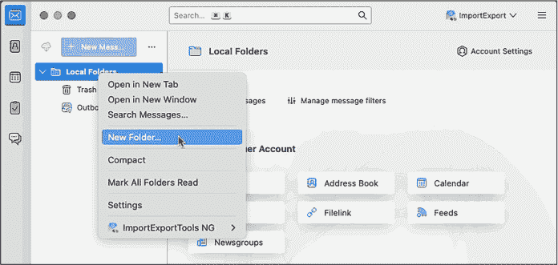
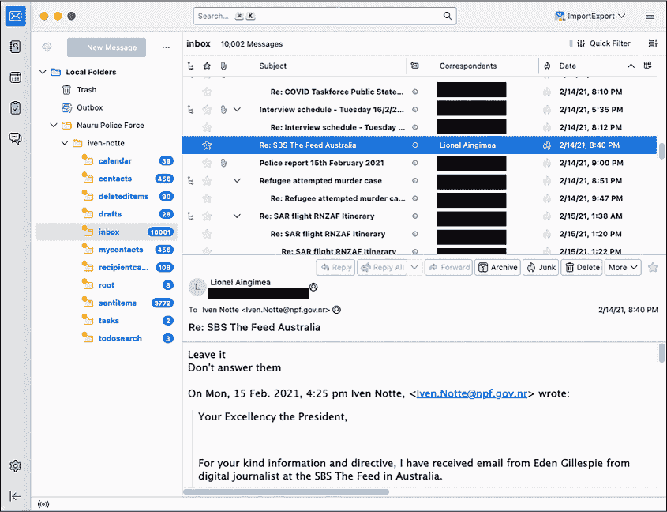
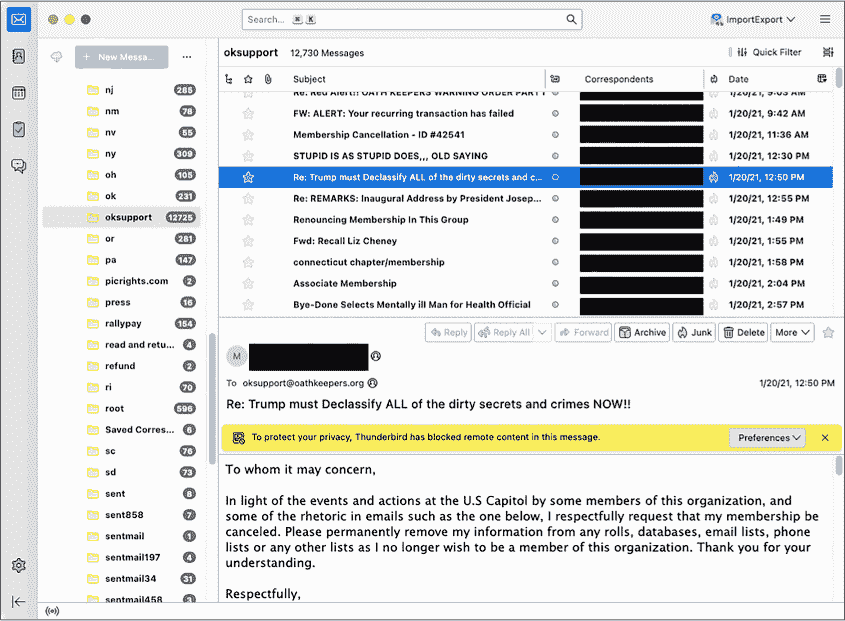
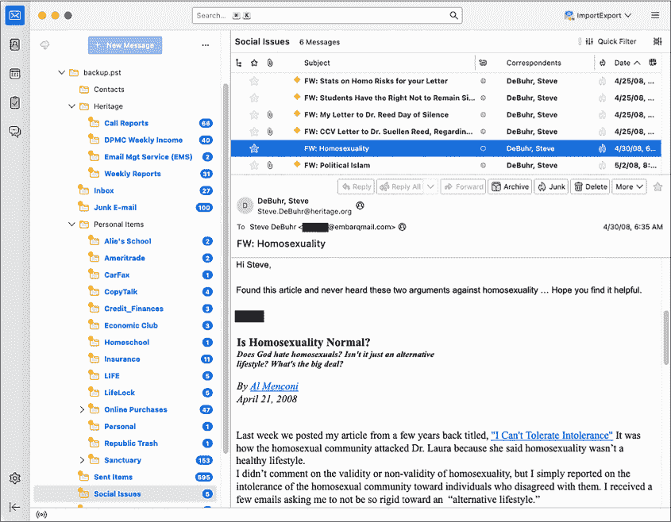
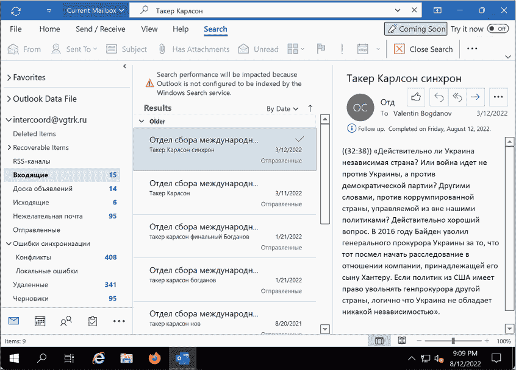

## 第六章：6 阅读他人的电子邮件


2022 年 2 月，俄罗斯入侵乌克兰后，黑客们开始将从俄罗斯组织窃取的数据大量上传到 DDoSecrets。这些数据有多种格式，但其中大部分——数 TB 的数据——是电子邮件。政府机构、石油天然气公司和投资公司的整个收件箱被完全暴露出来。

电子邮件泄漏是最常见的数据泄漏类型之一，它们可能带来严重后果。在 2016 年美国总统选举中，希拉里·克林顿与唐纳德·特朗普的竞选中，从民主党全国委员会（DNC）和克林顿竞选主席约翰·波德斯塔（John Podesta）那里泄露的电子邮件——这两者都被俄罗斯政府黑客入侵——在特朗普当选中扮演了重要角色。2020 年美国总统选举中，特朗普与乔·拜登之间的选战也涉及电子邮件泄漏——这次是从拜登的儿子亨特·拜登的笔记本电脑中窃取的。

然而，在电子邮件泄漏中有如此多的信息需要筛选，找到一个起点可能会让人感到不知所措。根据电子邮件是如何被获取的以及在被黑客入侵的服务器上运行了什么软件，泄露的数据可能有多种格式，而且可能并不清楚如何访问其中包含的消息。

在本章中，你将了解常见的电子邮件泄漏格式，Aleph 索引和搜索电子邮件的优缺点，以及如何将电子邮件数据集导入 Thunderbird 和 Microsoft Outlook。你将筛选你在第四章中下载的 Oath Keepers 数据集中的泄漏电子邮件，此外还包括来自澳大利亚离岸拘留中心和美国保守派智库遗产基金会的数据集。我们将首先看看电子邮件消息的标准组成。

### 电子邮件协议和消息结构

*协议*是软件开发人员为了使代码能够互操作而达成的共同语言。我们今天使用的电子邮件协议最早在 1980 年代初期实现，1995 年进行了重大更新，之后几乎没有变化。与现代集中式消息系统（例如 Facebook Messenger）不同，这种协议允许任何人使用自己的软件运行电子邮件服务器。例如，Google 在 gmail.com 运行一个服务器，俄罗斯搜索引擎 Yandex 在 mail.yandex.com 运行一个，瑞士公司 Proton 在 proton.me 运行一个。这些服务器由不同的软件支持，但使用相同的协议进行通信，这意味着它们可以相互发送消息。*互联网标准*，即规定某些类型软件行为的规范，确保所有电子邮件软件都使用相同的协议和相同的消息格式进行通信。

由于电子邮件消息格式是一个互联网标准，所有消息都有相似的结构。要查看该格式的样子，打开任何电子邮件并选择**显示原文**或**查看源代码**。每个消息都是一个包含两个部分的文本文件：标题和正文。标题部分包含电子邮件的元数据，格式为 Header-Field: Value，而正文部分则包含消息的主要内容。

以下是几乎每封电子邮件消息中都会包含的标题：

```
Subject: What's up?

From: Alice <alice@example.com>

To: Bob <bob@example.com>
```

这些只是众多标题中的一部分；你的电子邮件软件只显示其中的一些。当电子邮件服务器发送、转发或接收消息时，它们会添加描述这些操作的标题。例如，常见的标题 DKIM-Signature 允许你通过加密技术验证一封电子邮件确实来自它所声称发送的服务器。消息通常还会包括 Content-Type 标题，用于描述正文文本的格式。

在标题之后，电子邮件包括一个空行，然后是正文。正文通常为纯文本（没有格式的文本）、HTML 格式或多用途互联网邮件扩展（MIME）格式。在 MIME 格式的电子邮件中，最常见的格式，正文被分为文本、HTML 组件和电子邮件附件部分。

虽然电子邮件消息是文本文件，但你可以将二进制文件（如 PNG 或 ZIP）作为附件发送。你的电子邮件客户端会将二进制文件转换为文本格式，使用*Base64*编码并将该编码后的附件包含在消息中。就像你可以将任何十进制数（即使用 10 个数字表示的数）转换为二进制数（使用 2 个数字表示）并反向操作一样，你也可以将任何二进制数据转换为 Base64 数据（使用 64 个字符表示）。例如，以下是包含 1×1 透明像素的 PNG 图像的样子，每个 86 字节的数据都以二进制数字表示：

```
10001001 01010000 01001110 01000111 00001101 00001010 00011010 00001010 00000000 00000000

00000000 00001101 01001001 01001000 01000100 01010010 00000000 00000000 00000000 00000001

00000000 00000000 00000000 00000001 00001000 00000110 00000000 00000000 00000000 00011111

00010101 11000100 10001001 00000000 00000000 00000000 00000110 01100010 01001011 01000111

01000100 00000000 11111111 00000000 11111111 00000000 11111111 10100000 10111101 10100111

10010011 00000000 00000000 00000000 00001011 01001001 01000100 01000001 01010100 00001000

11010111 01100011 01100000 00000000 00000010 00000000 00000000 00000101 00000000 00000001

11100010 00100110 00000101 10011011 00000000 00000000 00000000 00000000 01001001 01000101

01001110 01000100 10101110 01000010 01100000 10000010
```

以下是相同二进制文件的 Base64 编码版本：

```
iVBORw0KGgoAAAANSUhEUgAAAAEAAAABCAYAAAAfFcSJAAAABmJLR0QA/wD/AP+gvaeTAAAAC0lE

QVQI12NgAAIAAAUAAeImBZsAAAAASUVORK5CYII=
```

Base64 编码的数据看起来像是一段看似随机的文本，包含大写字母、小写字母、数字、加号（+）和斜杠（/），有时以等号（=）结尾。某些数据的 Base64 编码版本传递的信息与解码版本相同，但它可以以更紧凑的形式包含在文本文件中，例如电子邮件。当收件人加载电子邮件时，他们的电子邮件客户端将把 Base64 文本转换回二进制文件。有时，纯文本或 HTML 邮件也会进行 Base64 编码（例如，hello world 在 Base64 中是 aGVsbG8gd29ybGQ=）。尽管电子邮件消息是文本文件，但你不能依赖 grep 来搜索它们，因为你寻找的很多内容可能是 Base64 编码的。

牢记这些基本知识后，接下来让我们讨论电子邮件泄露中通常遇到的特定格式。

### 电子邮件转储的文件格式

电子邮件*转储*或电子邮件消息集合最常见的文件格式是 EML 文件、MBOX 文件和 PST Outlook 数据文件。你将在接下来的练习中下载每种格式的电子邮件。

#### EML 文件

最简单的电子邮件转储类型是一个包含 EML 文件的文件夹，这是标准的电子邮件消息格式。EML 文件是一个带有扩展名 *.eml* 的文本文件，包含原始电子邮件消息——包括邮件头部和正文。

当你从个人账户下载电子邮件时，它将以 EML 格式保存。例如，如果你有 Gmail 账户，打开一封邮件，点击右上角的**更多**菜单（三个点图标），然后选择**下载邮件**。其他电子邮件客户端也应该允许你以 EML 格式下载单独的邮件。你有时可以在文本编辑器中阅读 EML 文件，但由于其中的 Base64 编码部分，你可能会遇到困难，因此在电子邮件程序中打开它（如 Thunderbird、Outlook 或 macOS 上的 Mail 应用）更为实用。

你可以将电子邮件作为正文或附件转发。大多数电子邮件系统默认将电子邮件转发为正文形式，将你转发的电子邮件正文内容复制到你正在撰写的邮件正文中。而当你选择以附件形式转发时，你将原始的 EML 文件附加到你正在写的邮件中。例如，在 Gmail 收件箱中，选中一封邮件旁边的框，点击**更多**菜单，然后选择**作为附件转发**。其他电子邮件客户端也应该允许你将邮件作为附件转发。EML 文件包括一些在正文转发的邮件中未包含的信息，如原始邮件的头部。

EML 文件不包括关于邮件在用户收件箱中如何组织的信息，例如邮件存储在哪个文件夹中。因此，以 EML 格式泄露电子邮件转储的人通常会将文件组织成文件夹，每个文件夹代表一个不同用户的收件箱。有时，他们还会将每个收件箱的文件组织到子文件夹中。

在练习 6-1 中，你将从瑙鲁警察局数据集中下载 EML 格式的电子邮件消息。

#### MBOX 文件

在 MBOX 电子邮件转储中，每个文件是多个电子邮件消息的集合，通常代表一个完整的邮件文件夹。MBOX 文件通常具有扩展名*.mbox*，但有时它们根本没有文件扩展名。

和 EML 文件一样，MBOX 文件是可以在文本编辑器中查看的文本文件，但由于 Base64 编码，它们并不容易被人类读取。然而，你不能像打开 EML 文件那样直接在邮件客户端中打开 MBOX 文件以阅读邮件。相反，你需要导入该文件。

誓言守卫组织的数据集是一系列 MBOX 文件，每个文件代表一个被黑的收件箱。我将在练习 6-1 中详细说明该数据集的结构。

#### PST Outlook 数据文件

电子邮件转储也可能以 PST 文件的形式出现，这是一种专有格式，表示一个 Microsoft Outlook 收件箱，文件扩展名为*.pst*。微软的邮件服务器叫做 Microsoft Exchange。每当 Outlook 用户想要创建邮件备份，或者 Exchange 服务器被黑客攻击时，数据都会以 PST 格式下载。

PST 文件表示一个完整的电子邮件收件箱，包含一个文件夹层级结构及其内容。这些文件可能会变得*非常大*。例如，在 2022 年 4 月，黑客盗取了俄罗斯最大的国有媒体公司——全俄国家电视广播公司（VGTRK）786GB 的数据，并将其泄露到 DDoSecrets。该数据集包含 252 个 PST 文件，每个文件代表一个不同的电子邮件地址。一个名为*intercoord@vgtrk.ru.pst*的文件就有 48GB 大。

在练习 6-1 中，你将下载一个包含遗产基金会电子邮件的 1GB PST 文件。

### 练习 6-1：从三个数据集中下载电子邮件转储

在本练习中，你将使用来自瑙鲁警察局、誓言守卫组织（Oath Keepers）和遗产基金会（Heritage Foundation）的三组不同数据集。你应该已经从第四章获取了誓言守卫组织的数据集，接下来你将下载另外两个数据集。你还将了解它们的内容和结构。

#### 瑙鲁警察局数据集

库努是一个位于太平洋的小岛，人口约为 10,000 人。虽然技术上它是一个独立国家，但它却是澳大利亚政府用来关押移民和寻求庇护者的滥用离岸拘留中心的所在地。Nauru Police Force 数据集（[*https://<wbr>ddosecrets<wbr>.com<wbr>/wiki<wbr>/Nauru<wbr>_Police<wbr>_Force*](https://ddosecrets.com/wiki/Nauru_Police_Force)）是一个 54GB 的种子，包含 127 个 ZIP 文件，每个文件是 npf.gov.nr（Nauru 警察局的域名）下某个特定邮箱地址的所有邮件的副本。每个 ZIP 文件内部包含若干个文件夹，里面是 EML 文件。该数据集包含超过 285,000 封邮件。

在本章中，你将使用文件 *iven-notte.zip*，文件大小约为 2.9GB。请直接从 *[`<wbr>data<wbr>.ddosecrets<wbr>.com<wbr>/Nauru%20Police%20Force<wbr>/npf<wbr>.gov<wbr>.nr<wbr>/iven<wbr>-notte<wbr>.zip<wbr>`](https://data.ddosecrets.com/Nauru%20Police%20Force/npf.gov.nr/iven-notte.zip)* 下载该文件。下载完成后，将其保存在名为 *Nauru Police Force* 的文件夹中，放入你的 *datasets* USB 磁盘中并解压。解压后，你应当得到一个名为 *iven-notte* 的文件夹，其中包含子文件夹 *calendar*、*contacts*、*deleteditems*、*drafts*、*inbox* 等。每个子文件夹中都充满了 EML 文件。

#### Oath Keepers 数据集

Oath Keepers 数据集的公开部分是一个 3.9GB 的 MBOX 文件种子，来自托管 oathkeepers.org 域名邮件的服务器。该数据集中有一个名为 *Oath Keepers.sbd* 的文件夹，里面包含名为 *ak*、*al*、*alb*、*ar*、*Archive*、*az* 等多个子文件夹，每个文件夹是一个 MBOX 文件（没有 *.mbox* 扩展名），其中包含若干封邮件。每个 Oath Keepers 民兵组织的美国州分会都有自己的收件箱，因此，例如，你可以在 *az* 文件夹中找到亚利桑那州分会的邮件。还有一些其他的 MBOX 文件，包括 *volunteers* 和 *stewart.rhodes*（斯图尔特·罗兹是民兵组织的创始人，因其组织在 2021 年 1 月 6 日美国国会大厦袭击中的作用而被定罪，判处 18 年监禁）。DDoSecrets 还分发数据集的额外部分，包含捐赠者和会员记录，仅提供给请求访问的记者和研究人员，因为其中包含大量个人身份信息（PII）。

如果你还没有下载 第四章中的 Oath Keepers 数据集，请访问 DDoSecrets 页面上的 Oath Keepers 页面 [*https://<wbr>ddosecrets<wbr>.com<wbr>/wiki<wbr>/Oath<wbr>_Keepers*](https://ddosecrets.com/wiki/Oath_Keepers)。此页面包含一个指向种子文件的链接以及磁力链接。将种子文件添加到你的 BitTorrent 客户端并下载完整的数据集，保存到你的 *datasets* USB 磁盘中。

#### The Heritage Foundation 数据集

传统基金会（The Heritage Foundation）是一个保守派智库，在里根政府时期对美国政治发挥了重要作用。这个数据集是一个 1GB 的文件，名为*backup.pst*，它是该基金会一名员工个人电子邮件账户的备份，员工在基金会的重大捐赠团队工作。该员工的电子邮件地址是通过其住宅 ISP（互联网服务提供商）在 embarqmail.com 域名下托管的。在 2015 年，Twitter 用户@jfuller290 注意到该基金会不小心将这个 PST 格式的备份文件公开放在了亚马逊 S3 存储桶中——一个用于托管文件的亚马逊云服务——并将链接发布到 Twitter 上。（起初，传统基金会声称自己遭到了黑客攻击，但实际上是他们自己不小心将该文件公开了。）这个电子邮件备份是在 2009 年制作的，比@jfuller290 发现它还早六年。

访问 DDoSecrets 网站上的传统基金会页面，链接为[*https://<wbr>ddosecrets<wbr>.com<wbr>/wiki<wbr>/Heritage<wbr>_Foundation*](https://ddosecrets.com/wiki/Heritage_Foundation)。该页面包含了该数据集的种子链接以及直接下载链接。因为数据集只是一个相对较小的 Outlook 数据文件，所以你可以直接从[*https://<wbr>data<wbr>.ddosecrets<wbr>.com<wbr>/Heritage%20Foundation<wbr>/backup<wbr>.pst*](https://data.ddosecrets.com/Heritage%20Foundation/backup.pst)下载并保存到名为*Heritage Foundation*的文件夹中，存放在你的*datasets* USB 磁盘上。

在等待这些电子邮件数据包下载完成时，继续阅读以了解你可以用来研究它们的工具。

### 使用 Thunderbird 研究电子邮件数据包

在开始阅读你下载的邮件之前，你需要安装并配置*Thunderbird*，这是一个适用于 Windows、macOS 和 Linux 的开源电子邮件程序，可以让你处理不同格式的邮件数据包。你可以使用 Thunderbird 导入包含 EML 或 MBOX 文件的文件夹，并搜索和阅读其中的所有内容。当你在 Thunderbird 中打开 EML 文件时，程序会解析该文件，Base64 解码所有内容，并让你查看 HTML 邮件和下载附件。

Thunderbird 用户通常使用该程序检查他们的个人电子邮件，有时会管理多个电子邮件账户。如果你愿意，你可以将现有的电子邮件账户添加到 Thunderbird 中，自己使用它来收发邮件。不过，为了研究目的，你将使用 Thunderbird 将电子邮件导入到*本地文件夹*中，这样你就可以在不连接电子邮件服务器的情况下，在本地计算机上处理电子邮件。使用 Thunderbird 以这种方式研究电子邮件数据包时，你不需要互联网连接，这意味着你可以使用隔离的计算机。

和它的姊妹项目 Firefox 浏览器一样，Thunderbird 支持第三方扩展，这些扩展为程序增加了功能。ImportExportTools NG 扩展对于处理邮件数据包至关重要；它支持导入 MBOX 文件和批量导入包含 EML 文件的文件夹，并保持其文件夹结构不变。然而，要将 PST 文件导入 Thunderbird，您必须先使用 readpst 程序将它们转换为 EML 文件。在本章后面，您将把所有三种文件类型导入 Thunderbird。

将邮件数据包导入 Thunderbird 后，您可以点击所有文件夹并阅读邮件，就像在阅读自己的邮件一样。您还可以使用 Thunderbird 内置的搜索功能批量搜索您导入的所有邮件。然而，您无法使用 Thunderbird 搜索附件的内容——为此，您需要像 Aleph 这样的工具，我们将在第 163 页的《研究邮件数据包的其他工具》中讨论。

### 练习 6-2：为邮件数据包配置 Thunderbird

在这个练习中，您将安装 Thunderbird 并进行配置，以便分析您下载的三个邮件数据包。

从 [*https://<wbr>www<wbr>.thunderbird<wbr>.net*](https://www.thunderbird.net) 下载 Thunderbird 并将其安装在您的计算机上。首次打开程序时，它会询问您是否想要设置一个现有的电子邮件帐户。虽然您不需要使用真实的电子邮件帐户来研究邮件数据包，但向 Thunderbird 添加一个帐户可以让您更容易地导入这些数据包。如果您不想用 Thunderbird 检查您的真实电子邮件，我建议您创建一个新的电子邮件帐户专门用于此目的。点击 **获取新电子邮件地址** 链接，在 Thunderbird 内直接通过一个名为 Mailfence 的邮件提供商创建一个新的免费电子邮件帐户。选择一个电子邮件地址，并在密码管理器中生成一个随机密码，然后提供一个现有的电子邮件地址以激活您的新帐户。创建帐户后，使用 Thunderbird 登录，您应该会看到“帐户成功创建”的消息。

接下来，切换到 Thunderbird 的主标签。在左侧的文件夹侧边栏中，您应该能看到您添加的电子邮件地址，下面会有一个叫做本地文件夹的部分。您添加电子邮件地址的目的是为了创建本地文件夹部分，所以如果您不打算使用 Thunderbird 来检查该电子邮件帐户，您可以删除它。为此，点击右上角的 Thunderbird 菜单图标，选择 **帐户设置**。确保选择了您的新电子邮件帐户，点击左下角的 **帐户操作**，然后选择 **删除帐户**。选中 **删除邮件数据** 复选框，然后点击 **删除**。现在，切换回 Thunderbird 的主窗口，左侧边栏只剩下本地文件夹部分。

接下来，要安装 ImportExportTools NG Thunderbird 插件，点击右上角的菜单图标并选择**附加组件和主题**。切换到**扩展**选项卡，搜索**ImportExportTools NG**，并安装该插件。这个插件的许多功能出现在工具栏的顶部，在 macOS 中会自动显示。要在 Windows 或 Linux 中访问它，请点击右上角的菜单图标，选择**视图**▸**工具栏**▸**菜单栏**。菜单栏应该会出现在 Thunderbird 窗口的顶部。前往**工具**▸**ImportExportTools NG**以访问插件的功能。

最后，点击 Thunderbird 菜单图标并选择**设置**。切换到**隐私与安全**选项卡，并确保取消勾选“允许邮件中的远程内容”（默认情况下应该是未勾选的）。*远程内容*是指托管在互联网上而不是邮件内部的内容，比如从 URL 加载的图片。当你打开包含远程内容的电子邮件时，比如带有图片的 HTML 邮件，加载这些图片将留下痕迹，显示该邮件是从某个 IP 地址打开的。

> 注意

*如果你愿意，Thunderbird 会始终给你加载远程内容的机会，但我建议你提前连接到 VPN，这样将会追踪 VPN 的 IP 地址，而不是你的真实 IP 地址（请参见第 255 页的“使用 VPN 服务隐藏踪迹”框）。*

### 使用 Thunderbird 阅读单独的 EML 文件

在你自己的调查中，你可能会发现数据集中只有少量的 EML 文件，或者有人可能会将电子邮件消息作为附件转发给你。Thunderbird 是一个很好的工具，可以单独检查这些邮件，而无需导入它们。

一旦你完成了第 6-1 章的下载，试着使用 Thunderbird 查看一些单独的邮件。打开文件管理器应用程序，例如 Windows 的 Explorer 或 macOS 的 Finder，浏览到 Nauru Police Force 数据集中提取的*iven-notte*文件夹。打开*inbox*文件夹，右键点击其中一个 EML 文件，并在 Thunderbird 中打开。Thunderbird 应该会显示邮件头部信息，比如邮件发送日期，以及发件人、收件人和主题行。你还可以按照原格式查看邮件，如果邮件有附件，你也可以打开它们。

就像你不应该盲目打开个人邮箱中收到的附件一样，也不要盲目打开在电子邮件数据泄露中找到的附件，因为它们可能会入侵你的计算机。请参考第一章，了解如何安全地打开此类文档的提示。

在接下来的练习中，你将把你刚刚下载的每个电子邮件数据集导入 Thunderbird，从 Nauru Police Force 数据集中的 EML 文件开始。

### 练习 6-3：导入 Nauru Police Force EML 电子邮件数据集

要通过 ImportExportTools NG 插件导入电子邮件转储，选择你想要导入的文件夹。始终将电子邮件转储导入到本地文件夹，而不是远程邮件服务器上的文件夹。从 Thunderbird 主标签页的文件夹侧边栏中，右键点击 **本地文件夹**，选择 **新建文件夹**，如 图 6-1 所示。



图 6-1：在 Thunderbird 中创建新本地文件夹

将文件夹命名为 *Nauru Police Force* 并点击 **创建文件夹**。你应该现在能在本地文件夹列表中看到 *Nauru Police Force* 文件夹。

右键点击你刚刚创建的 *Nauru Police Force* 文件夹，选择 **新建子文件夹**。将子文件夹命名为 *iven-notte*，即你将导入其收件箱数据的电子邮件帐户名称，然后点击 **创建文件夹**。右键点击刚创建的 *iven-notte* 子文件夹，选择 **ImportExportTools NG**▸**导入 EML 邮件**▸**从目录及其子目录导入所有 EML 邮件**。会弹出一个对话框，允许你浏览选择一个文件夹。选择你的 *iven-notte* 子文件夹。

这个子文件夹应该会立刻开始填充你正在导入的 14,964 封电子邮件。完成可能需要几分钟（导入这个数据集中的所有 127 个收件箱会花费更长时间）。

图 6-2 显示了加载了 *iven-notte* 收件箱的 Thunderbird。你可以看到所有文件夹以及每个文件夹中未读邮件的数量。（如果你愿意，可以将所有这些邮件标记为未读，以便追踪你尚未阅读的邮件。）



图 6-2：在 Thunderbird 中导入的电子邮件转储

图 6-2 中选中的电子邮件位于 *收件箱* 文件夹内，由当时的 Nauru 总统 Lionel Aingimea 发送。在邮件中，他指示 Nauru 警察局局长兼收件箱所有者 Iven Notte 不要回应澳大利亚记者 Eden Gillespie，后者询问了两名 Nauru 男子是否袭击了一名难民工作人员，可能撞倒了他并偷走了他的摩托车。“别理他们，”总统 Aingimea 写道。“不要回答他们。”

澳大利亚新闻网站 Crikey 的记者 Cam Wilson 深入研究了 Nauru Police Force 数据集，并揭露了“对在那里被拘留的难民和寻求庇护者的极度漠视。”你可以在 Crikey 网站上阅读 Wilson 的报道，[*https://<wbr>www<wbr>.crikey<wbr>.com<wbr>.au*](https://www.crikey.com.au)。

### 在 Thunderbird 中搜索电子邮件

现在你已经配置好 Thunderbird 并加载了数据，你可以开始探索这些数据。例如，你可能想在 Nauru 警察局的数据集中搜索其他来自 Aingimea 总统或澳大利亚政治家的邮件。你也可以搜索包含像*难民*这样的关键词的邮件，或是某些特定日期写的邮件。本节将介绍你可以在任何导入到 Thunderbird 的电子邮件数据中使用的搜索方法。

#### 快速过滤器搜索

最简单的搜索选项是过滤当前所选文件夹中显示的电子邮件。当查看文件夹时，确保 Thunderbird 窗口顶部附近的快速过滤器按钮已打开，这样额外的工具栏就会出现。该工具栏具有按钮，可以快速过滤出仅未读的邮件、包含附件的邮件或具有其他属性的邮件。

快速过滤器工具栏还包含一个搜索框，你可以用它来查找包含特定文本的邮件。你还可以根据发件人字段、收件人字段、主题行或正文中是否包含搜索词来过滤邮件。这是我在 Thunderbird 中最常用的搜索方式。例如，我在快速过滤器搜索框中输入了*Aingimea*，以便快速找到所有与总统 Aingimea 相关的电子邮件，这些邮件位于*收件箱*文件夹中。我也可以在搜索框中输入他的电子邮件地址，并过滤出他作为发件人或收件人的邮件（尽管他不会是这些邮件的收件人，因为这是 Iven Notte 的收件箱，不是他的）。

#### 搜索邮件对话框

快速过滤器搜索本质上是“搜索邮件”对话框的一个更有限的版本，而“搜索邮件”对话框是 Thunderbird 中搜索电子邮件的最强大方法。点击**编辑**菜单并选择**查找**▸**搜索邮件**可以打开这个对话框。你可以选择要搜索的文件夹，或者选择一次搜索帐户中的所有电子邮件。然后，你可以选择更细化的搜索条件。例如，你可以找到所有正文中提到*庇护*的邮件。然后你可以通过添加进一步的条件来过滤这些结果，例如只显示从特定电子邮件地址发送或接收的邮件，或只显示包含附件的邮件。

在 Thunderbird 窗口右上方，有一个搜索框，位于快速过滤器搜索框上方，它可以快速搜索整个电子邮件账户。我觉得这个功能不如“搜索邮件”对话框有用。如果我在使用快速过滤器时找不到所需的内容，我会转到“搜索邮件”对话框，这样我就可以根据需要进行更精确的搜索。

### 练习 6-4：导入 Oath Keepers MBOX 邮件数据

在本练习中，你将把 Oath Keepers 数据集中的电子邮件导入 Thunderbird。Oath Keepers 数据集包含 *messages.json* 和 *messages_old.json* 文件，它们是聊天记录，还有 *Oath Keepers.sbd* 文件夹，里面包含 100 个 MBOX 格式的文件。这里你将专注于后者。如前所述，你不能像读取 EML 文件那样直接在电子邮件客户端打开 MBOX 文件；你必须先将它们导入 Thunderbird。

为了在 Thunderbird 中将不同的数据集分开，你需要为 Oath Keepers 数据创建一个新文件夹。在左侧面板中，右键点击 **本地文件夹** 并选择 **新建文件夹**。将文件夹命名为 *Oath Keepers*，然后点击 **创建文件夹**。你现在应该能在本地文件夹列表中看到 *Oath Keepers* 文件夹。右键点击你刚创建的 *Oath Keepers* 文件夹，选择 **ImportExportTools NG**▸**导入 mbox 文件**▸**从目录导入所有 mbox 文件（包括 sbd 结构）**。浏览你的文件系统并选择 *Oath Keepers.sbd* 文件夹。

在导入 3.9GB 邮件时，Thunderbird 可能会变得没有响应，无法点击任何东西，但请耐心等待。当导入完成后，你应该会看到 100 个包含电子邮件的独立文件夹。

Oath Keepers 文件夹中邮件最多的是 *oksupport*，即 Oath Keepers 支持邮箱账户。图 6-3 展示了来自一位会员的邮件，他在 1 月 6 日袭击事件后不久就宣布放弃会员资格。

在这次邮件转储中，我没有发现很多重大揭示；大多数重要内容都包含在 Oath Keepers 数据库的私人部分，那里有会员和捐赠者名单，DDoSecrets 仅将其分发给记者和研究人员。公开可用的邮件包含很多人讨论加入民兵组织，或抱怨他们已经支付了会费，但没有得到进一步的联系。还有大量的垃圾邮件，包括右翼极端主义、阴谋论和反疫苗的大量邮件。查看你导入的各种电子邮件账户，尝试使用 Thunderbird 的搜索工具，看看是否能找到我错过的有趣内容。



图 6-3：来自 Oath Keepers 邮件转储的一封邮件

### 练习 6-5：导入 Heritage Foundation PST 邮件转储

在本练习中，你将把 Heritage Foundation 邮件转储，即一个名为 *backup.pst* 的 Microsoft Outlook PST 文件，导入 Thunderbird。由于 ImportExportTools NG 插件不支持 PST 文件，你首先需要将 PST 文件转换成 EML 或 MBOX 文件。

readpst程序可以将 PST 文件转换为多种不同格式，包括 EML 和 MBOX 文件。你可以通过在 macOS 中安装libpst包或在 Ubuntu 中安装pst-utils包来访问该程序。首先打开终端。Mac 用户，运行以下命令：

```
**brew install libpst**
```

Linux 和 Windows 使用 WSL 的用户，请运行以下命令：

```
**sudo apt update**

**sudo apt install pst-utils**
```

接下来，切换到包含*backup.pst*文件的文件夹。例如，在我的 macOS 计算机上，我运行：

```
**cd /Volumes/datasets/Heritage\ Foundation**
```

要将 PST 文件转换为 EML 文件，可以使用以下命令，其中-e参数告诉readpst输出为 EML 文件：

```
**readpst -e** **`filename.pst`**
```

以如下方式在*backup.pst*文件上运行该命令：

```
**readpst -e backup.pst**
```

该命令会创建一个名为*Personal Folders*的文件夹，其中包含额外的*Contacts*、*Heritage*、*Inbox*、*Junk E-mail*以及其他子文件夹（这就是*backup.pst*中文件的组织方式）。每个文件夹中包含几个 EML 文件，每个文件代表一封电子邮件消息。

> 注意

*我发现将readpst生成的 EML 文件导入 Thunderbird 更为简便，但你也可以使用*readpst -r filename.pst *命令将 PST 文件转换为 MBOX 文件。*

在左侧面板中，右键点击**本地文件夹**并选择**新建文件夹**，如同你在之前的练习中所做的那样。将文件夹命名为*Heritage Foundation*，然后点击**创建文件夹**。现在你应该能在本地文件夹列表中看到*Heritage Foundation*文件夹。

右键点击*Heritage Foundation*文件夹，选择**新建子文件夹**，并将新子文件夹命名为*backup.pst*。右键点击*backup.pst*子文件夹，选择**ImportExportTools NG**▸**导入 EML 消息**▸**从目录和子目录导入所有 EML 消息**。浏览你刚刚使用readpst创建的*Personal Folders*文件夹并开始导入。此文件夹应该开始填充超过千封电子邮件。

这些电子邮件消息全部属于前赫里奇基金会筹款人 Steve DeBuhr，并且被细致地组织成多个文件夹。除了赫里奇基金会的工作，这些电子邮件存档还包括 DeBuhr 的个人电子邮件。这个电子邮件存档非常旧——最新的邮件来自 2009 年——因此不太可能在这里找到太多的揭露。然而，由于 DeBuhr 与主要捐赠者合作，这个*Heritage*文件夹中的电子邮件包含了很多财务细节的附件。图 6-4 展示了这个电子邮件存档在 Thunderbird 中的情况。

特别是，当我浏览这封电子邮件时，我注意到*社会问题*文件夹包含了来自 DeBuhr 的一些恐同和其他偏执的信息，他将这些信息从他的官方 heritage.org 账户转发到了他的个人账户。



图 6-4：Heritage Foundation 在 Thunderbird 中的电子邮件

### 用于研究电子邮件泄漏的其他工具

本章重点介绍了如何使用 Thunderbird 作为研究电子邮件泄漏的工具，但在未来的工作中，你可能会发现另外两个工具也很有帮助：Microsoft Outlook 和 Aleph。在这一节中，我将介绍如何使用这两个工具导入和搜索电子邮件泄漏文件。你不需要按照本节的说明来进行本书的其余部分的学习，但跟着读会让你了解有哪些选项以及何时使用它们。

#### Microsoft Outlook

与 Thunderbird 不同，Microsoft 的桌面电子邮件程序 Outlook 支持直接导入 PST 格式的电子邮件泄漏。然而，Outlook 也有一些缺点。首先，它不是免费的；获得 Outlook 最便宜的方式是购买 Microsoft 365 许可证，按写作时的价格，这大约需要每月 $7 或每年 $70。其次，Outlook 仅适用于 Windows 和 macOS，而不支持 Linux（不过 Linux 用户可以在 Windows 虚拟机中运行 Outlook）。尽管如此，如果你熟悉这个程序并了解其高级功能，或者只是想在其原始界面中查看电子邮件，你可能会觉得 Outlook 很有用。

让我们来看一下如何将 PST 文件直接导入 Outlook，使用一个来自被黑的俄罗斯电子邮件泄漏的真实案例。首先，为 Outlook 设置一个 Windows 虚拟机（VM）。即使你是 Windows 或 macOS 用户，且已经在使用 Outlook 处理邮件，还是建议这么做，以避免混淆你的实际电子邮件和泄漏的邮件文件。Microsoft 为多种虚拟机程序（如 VirtualBox、VMWare 和 Parallels）发布了免费的 Windows 虚拟机镜像。你可以在[*https://<wbr>developer<wbr>.microsoft<wbr>.com<wbr>/en<wbr>-us<wbr>/windows<wbr>/downloads<wbr>/virtual<wbr>-machines<wbr>/*](https://developer.microsoft.com/en-us/windows/downloads/virtual-machines/) 下载该镜像并将其导入到你的虚拟机软件中。你还需要在虚拟机中安装 Microsoft Office。如果你拥有 Microsoft 365 许可证，可以通过登录并点击**安装 Office**链接来从[*https://<wbr>www<wbr>.office<wbr>.com*](https://www.office.com) 下载 Office。如果没有许可证，Microsoft 提供免费的试用版。

当你第一次打开 Outlook 时，它会提示你登录你的 Office 365 账户以检查你的许可证。之后，它会提示你设置一个电子邮件账户。在底部，点击链接**创建 Outlook.com 电子邮件地址以开始**，以便创建一个新账户。确保将你的电子邮件和密码保存在密码管理器中。完成后，点击**完成**。Outlook 应该会打开你刚创建的新电子邮件账户的空收件箱。

设置好 Outlook 后，将 PST 邮件文件导入。点击**文件**▸**账户设置**▸**账户设置**，然后点击**数据文件**▸**添加**，浏览并选择你要添加的 PST 文件。如果有足够的磁盘空间，建议复制 PST 文件并添加复制文件。所有关于这个收件箱的信息，包括哪些邮件已被标记为已读，都存储在该文件中，因此使用副本工作可以避免修改原始文件。

你添加的 PST 文件应该出现在左侧边栏中。现在，你可以像处理自己的收件箱一样浏览这个收件箱。你看到的未读邮件计数是 PST 文件导出时每个文件夹中未读邮件的实际数量。

例如，我设置了一个 Windows 虚拟机，安装了 Outlook，使用我的 Microsoft 365 账户登录，并添加了*intercoord@vgtrk.ru.pst*（本章前面提到的 48GB PST 文件，来自 VGTRK 的黑客数据）。

图 6-5 展示了这个 VGTRK 收件箱，我使用 Outlook 的搜索功能搜索了Такер Карлсон。这是 Tucker Carlson 的西里尔字母拼写方式，前福克斯新闻主持人。

选定电子邮件的主题行在图 6-5 中大致翻译为“Tucker Carlson 同步”。电子邮件正文包含一段翻译后的引用，其中 Carlson 声称乌克兰不是一个独立的国家，而是由美国民主党控制的。引用中还包括一个错误的说法，即 2016 年时，时任副总统乔·拜登因调查拜登的儿子亨特而解雇了乌克兰总检察长。（事实上，拜登利用 10 亿美元的美国援助，迫使乌克兰罢免了拒绝调查乌克兰富有人物腐败行为的总检察长维克托·肖金。拜登与欧洲的反腐败努力密切合作：欧洲领导人以及乌克兰国内的民间社会团体也要求肖金辞职，理由相同。）俄罗斯电视台可能播放了这个 Tucker Carlson 的片段，而这封电子邮件很可能是他们俄语配音版本的翻译。



图 6-5：在 Outlook 中研究 PST 文件

> 注意

*当处理你不懂的外语数据转储时，你可以依赖像 DeepL 或 Google 翻译这样的机器翻译工具——当然，前提是你愿意将泄露内容分享给第三方服务。我还发现 Google 翻译手机应用也很有用：如果你把手机的相机对准屏幕，它会实时翻译文本。即使是没有进行 OCR 处理的扫描文档也能使用这种方式。*

#### Aleph

正如你在 第五章 中学到的，你可以使用 Aleph 来索引和浏览各种电子邮件，包括 PST 或 EML 文件。当你索引一个包含 PST 文件的文件夹时，Aleph 会识别文件格式，并索引每个 PST 文件中的所有个别消息，同时保持文件夹层次结构不变。Aleph 在处理电子邮件转储时还有以下优点：

+   与 Thunderbird 和 Outlook 不同，Aleph 还会对电子邮件附件进行索引、使其可搜索，甚至为附件添加 OCR。

+   与它处理的任何数据集一样，Aleph 会自动列出它在数据集中找到的所有人员和组织，你可以使用它将这些数据与其他已索引的数据集进行交叉参考。

+   如果你为一群研究人员运行 Aleph 服务器，你可以轻松地让他们搜索电子邮件转储；他们只需要一个网页浏览器和一个 Aleph 帐户。

使用 Aleph 处理电子邮件转储有一些缺点。首先，它需要大量技术工作来启动 Aleph 服务器并索引数据集，特别是如果你计划将其发布到互联网供他人使用。根据我的经验，如果你试图将像电子邮件转储这样的庞大数据集导入 Aleph，可能会遇到 Docker 设置的技术障碍。使用 Thunderbird 是一个更简单的解决方案。

Aleph 也无法正确索引 MBOX 文件；它试图将其当作文本文件来索引，而不是作为包含多个电子邮件消息的集合。它不会对 MBOX 文件中的数据进行 Base64 解码，因此在这项任务上，它的作用与 grep 没什么区别。如果你希望将 MBOX 格式的电子邮件转储索引到 Aleph 服务器中，可以先将其导入 Thunderbird，然后再次导出（使用 ImportExportTools NG），导出格式为 EML。

Aleph 还有一些怪癖，使得处理电子邮件转储更加复杂。例如，如果电子邮件附件的格式是 Aleph 不理解的，它在查看该电子邮件时根本不会显示附件。如果你想确保你能看到电子邮件中的所有内容，可以从 Aleph 下载单个 EML 文件，并在 Thunderbird 中打开。

总之，Outlook 对于 PST 文件来说是一个合理的选择，而 Aleph 则是处理团队合作或希望将电子邮件转储与其他数据集进行交叉参考的良好选择。然而，Thunderbird 是快速开始电子邮件转储调查的最简单方法，并且支持所有电子邮件格式。

### 总结

在本章中，你学习了如何将 EML、MBOX 和 PST 格式的电子邮件转储导入 Thunderbird，以便阅读和搜索它们。你阅读了来自瑙鲁总统的电子邮件，了解了誓言守卫组织（Oath Keepers）收到的电子邮件类型，并探讨了来自传统基金会（Heritage Foundation）的旧电子邮件转储。你还看到了如何使用 Microsoft Outlook 和 Aleph 作为 Thunderbird 的替代工具。你可以在未来的电子邮件转储调查中运用你在这里学到的技巧。

在下一章中，你将通过参加 Python 编程速成课程，提升分析数据集的技术能力。
