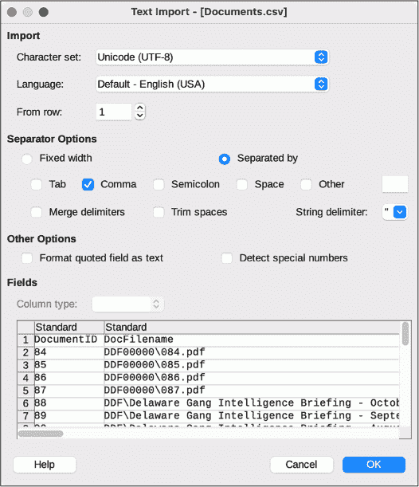
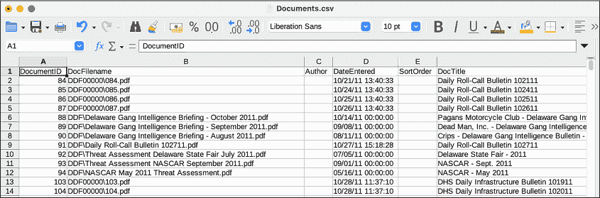
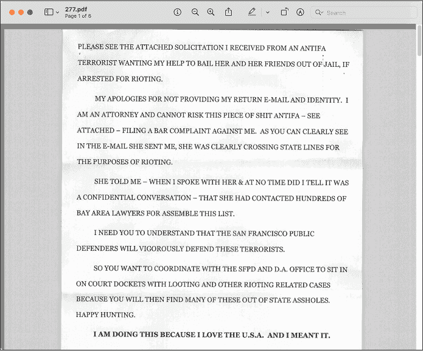
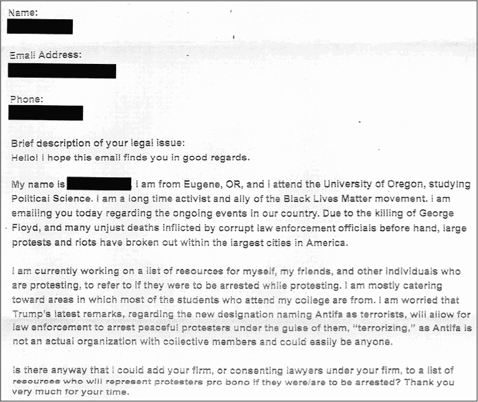
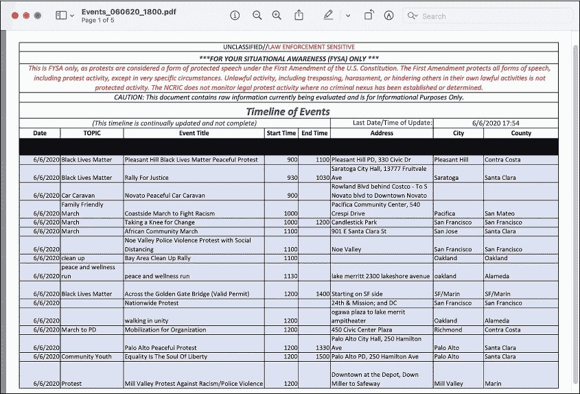
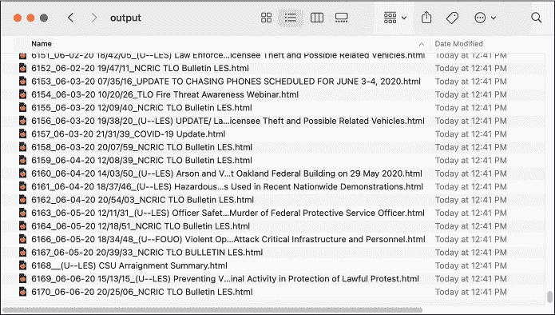
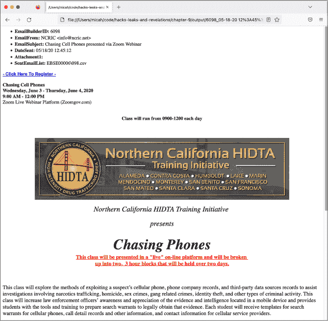
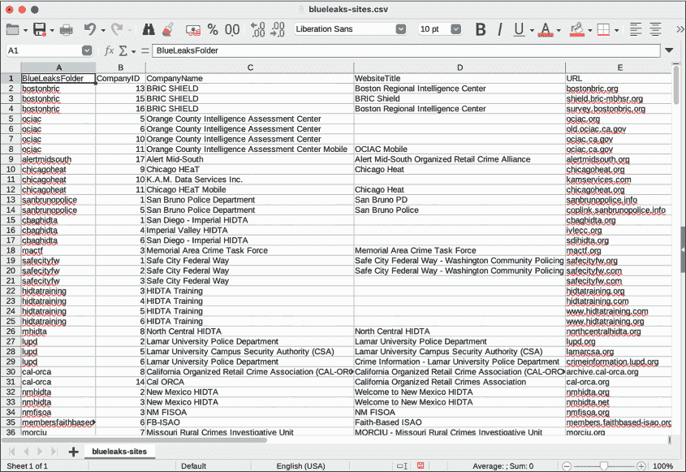

## 9 BLUELEAKS、黑人的命也是命运动与 CSV 文件格式


BlueLeaks 数据集充满了大量的文档，但一开始并不容易找到从哪里开始，也不清楚如何理解它们所包含的数据。在开始调查之前，我需要一种方法来高效地确定这些文档的重要性。在手动翻阅了很多文件后，我发现我需要的背景信息其实就在每个 BlueLeaks 文件夹中的几百个 CSV 表格里。在本章中，你将学习如何自己调查像这样的 CSV 文件。

你将使用图形化的电子表格软件和文本编辑软件查看 CSV 文件，编写 Python 代码遍历 CSV 的行，并保存你自己的 CSV 文件。然后，你将通过挖掘 BlueLeaks 数据集中的 CSV 文件，将这些知识付诸实践，重点关注来自 NCRIC 融合中心的数据。这是我自从 BlueLeaks 发布以来，主要关注的数据，但数据集中还有上百个其他文件夹，充满了值得报道的新发现。到本章结束时，你将掌握继续调查这些文件夹以及类似数据集（充满 CSV 文件）的工具。

### 安装电子表格软件

查看 CSV 文件内容的最用户友好方式是使用电子表格软件，如 LibreOffice Calc、Microsoft Excel、Apple Numbers 或 Google Sheets 打开它。电子表格软件是查看你正在处理的数据的一种很好的方式，而且它也可以是一个强大的工具，用来分析 CSV 文件。然而，在许多情况下，根据你处理的数据，你需要超越这些软件，编写自定义代码来处理 CSV 文件。

如果你已经有喜欢的电子表格程序，可以用它来进行本书中的项目。如果没有，我建议使用 LibreOffice Calc，因为它是免费的、开源的，适用于 Windows、macOS 和 Linux 系统；它也是我在本章示例中使用的工具。安装 LibreOffice（[*https://www.libreoffice.org*](https://www.libreoffice.org)）将安装一整套办公软件，其中包括 Calc。

另外，Microsoft Excel 是一个不错的选择，但它需要付费并且在 Linux 上不可用。如果你使用的是 Mac，也可以使用 Apple 的免费电子表格软件 Numbers。最后，你还可以考虑使用 Google Sheets，Google Docs 的电子表格功能。由于 Google Docs 是基于 Web 的，它在 Windows、macOS 和 Linux 上都可以使用，而且是免费的。使用 Google Sheets 和任何其他基于云的电子表格软件（比如基于 Web 的 Microsoft Excel）的问题是，你必须先将 CSV 文件上传到第三方服务才能查看。对于像 BlueLeaks 这样的公开数据集，这没问题。然而，在处理更敏感的数据集时，最好使用桌面电子表格软件。

当用于处理更复杂的电子表格格式，如 Microsoft Excel 文件（*.xlsx*）或 ODF 电子表格文件（*.ods*）时，电子表格软件功能强大且功能丰富。它可以进行数学计算，比如求和列中的所有值，还可以可视化数据，比如创建饼图或折线图。然而，CSV 文件不支持这些功能，因此我在本书中不会讨论这些内容。

一旦安装了电子表格软件，你就可以开始了解 CSV 文件的结构了。

### 介绍 CSV 文件格式

你可以把电子表格看作是数据表格。顶行通常包含每列的标题，其他行代表与这些标题匹配的数据。CSV 是最简单的电子表格格式。你可以使用像 Microsoft Excel 或 LibreOffice Calc 这样的软件打开 CSV 文件，或者你可以在文本编辑器中查看它们，并使用 CLI 工具如 grep 来搜索它们。

BlueLeaks 充满了 CSV 文件，但来自融合中心网站的原始数据并不是这种格式。BlueLeaks 数据集包含了这些网站的源代码，通过审查这些源代码，我发现每个网站实际上是将数据存储在 Microsoft Access 数据库文件中。BlueLeaks 黑客从 Access 数据库中导出了表格，并在将数据泄露到 DDoSecrets 之前将其保存为 CSV 格式。

CSV 文件只是由多行文本组成的文件，每一行代表表格中的一行。每一行包含一组值，这些值通常由逗号分隔（因此得名 *逗号分隔值*），每个值代表电子表格中的一个 *单元格*。有时，电子表格中的一行称为 *记录*，而该行中的每个单元格称为该记录中的 *字段*。通常，每一行包含相同数量的单元格。

这是一个名为 *city-populations.csv* 的 CSV 文件示例：

```
City,Country,Population

Tōkyō,Japan,37400000

Delhi,India,28514000

Shanghai,China,25582000

São Paulo,Brazil,21650000

Mexico City,Mexico,21581000

Cairo,Egypt,20076000
```

你可以在这本书的 GitHub 仓库中找到这个文件的副本：[*https://<wbr>github<wbr>.com<wbr>/micahflee<wbr>/hacks<wbr>-leaks<wbr>-and<wbr>-revelations<wbr>/blob<wbr>/main<wbr>/chapter<wbr>-9<wbr>/city<wbr>-populations<wbr>.csv*](https://github.com/micahflee/hacks-leaks-and-revelations/blob/main/chapter-9/city-populations.csv)。我将在本章后面使用这个文件作为 CSV 示例，所以现在就下载（或重新输入）并将其保存在一个文件夹中以供本章练习使用。

表格 9-1 展示了 *city-populations.csv* 文件中的数据，按行和列进行组织。

表格 9-1： 城市人口

| 城市 | 国家 | 人口 |
| --- | --- | --- |
| 东京 | 日本 | 37,400,000 |
| 德里 | 印度 | 28,514,000 |
| 上海 | 中国 | 25,582,000 |
| 圣保罗 | 巴西 | 21,650,000 |
| 墨西哥城 | 墨西哥 | 21,581,000 |
| 开罗 | 埃及 | 20,076,000 |

当一个值包含逗号时，必须将其用引号括起来。例如，“Hello, World”和“Hola, Mundo”这两个值都包含逗号。以下是它们在 CSV 文件中的表现形式，以及它们各自语言的字段：

```
Language,Greeting

English,"Hello, World"

Español,"Hola, Mundo"
```

表格 9-2 展示了这些数据以行和列的形式组织。

表格 9-2： “Hello, World” 的翻译

| 语言 | 问候语 |
| --- | --- |
| 英语 | Hello, World |
| Español | Hola, Mundo |

通常情况下，不论值中是否包含逗号，都将每个值用引号括起来。以下是之前电子表格的另一个版本，现在每个值都用引号括起来：

```
"Language","Greeting"

"English","Hello, World"

"Español","Hola, Mundo"
```

和 shell 脚本及 Python 编程一样，你可以通过使用反斜杠和双引号来转义 CSV 中的引号（\"）。例如，值"Not I," said the cow包含了引号和逗号，因此要将其添加到 CSV 文件中，你需要将整个值用引号括起来，并转义内部的引号，像这样：

```
"\"Not I,\" said the cow"
```

由于 CSV 文件格式非常简单，它是最常用的电子表格格式之一，尤其适用于那些使用代码处理电子表格的人。与 CSV 类似，SQL 数据库也存储*表格数据*（可以在表格中表示的数据），因此 CSV 是从它们中导出表格的便捷格式。事实上，BlueLeaks 中的所有 CSV 文件都是从为执法和融合中心网站提供支持的数据库中导出的 SQL 表格。（你将在第十二章学习 SQL 数据库；目前，你将处理导出的 CSV 文件。）

现在你对 CSV 文件格式有了一些了解，让我们来看一下来自 BlueLeaks 的一些真实 CSV 数据。

### 使用电子表格软件和文本编辑器探索 CSV 文件

在你的图形文件浏览器（如 Windows 中的资源管理器或 macOS 中的 Finder）中，浏览到 USB 磁盘上的*BlueLeaks-extracted*文件夹。你将首先检查*dediac*子文件夹，其中包含来自特拉华信息分析中心的数据。浏览该文件夹中的文件——几乎所有文件都是 CSV——并在你的图形电子表格软件中打开*Documents.csv*。

当你在 LibreOffice Calc 或其他电子表格软件中打开文件时，通常会弹出一个窗口，要求你确认该 CSV 的设置。图 9-1 展示了在 Mac 上我打开*Documents.csv*时弹出的窗口。



图 9-1：LibreOffice Calc 文本导入设置

最重要的设置是选择正确的分隔符字符，在这个和大多数情况下是逗号（,）。有些 CSV 文件用其他字符分隔值，如分号（;）或制表符（\t），不过这种情况比较少见。如果以后你不确定 CSV 文件使用哪个字符，你可以先在文本编辑器中打开 CSV 文件进行检查。

点击**确定**以打开电子表格。这个应该会很快打开，但有时候 CSV 文件非常大——有几百兆或几千兆——所以你可能需要等待几秒钟，甚至几分钟，直到大文件的 CSV 加载完成。

图 9-2 显示了在 LibreOffice Calc 中打开的*Documents.csv*电子表格的一部分。



图 9-2：在 LibreOffice Calc 中查看 Documents.csv 的显示

这个电子表格有 23 列和 6,934 行（其中一行为表头行）。在文件顶部，DateEntered 列中的日期是 2011 年。你可以通过*排序*电子表格来找到最新的数据，排序可以是升序（从小到大）或降序（从大到小）。我将向你展示如何在 LibreOffice Calc 中排序这个电子表格，但其他电子表格软件的操作应该类似，并适用于任何你想排序的电子表格。

首先，由于你不想排序表头行，点击**视图**▸**冻结单元格**▸**冻结首行**。这样可以冻结表头行，现在无论你如何上下滚动，表头都会始终显示在文件顶部。

接下来，你需要选择要排序的列。为了让最新的文档出现在最上面，按 DateEntered 列进行降序排序。在排序此列之前，你必须告诉电子表格软件这些字段是包含日期和时间的数据，并指定它们的格式（否则，软件可能会认为它们是字符串，并按字母顺序进行排序）。点击 D 列选择该列的所有单元格，然后点击**数据**▸**文本分列**。这将弹出一个窗口，允许你定义每列的数据类型。在窗口底部，点击 DateEntered 列，并从列类型下拉菜单中选择**日期（MDY）**，因为这些数据中的日期格式是“月-日-年”。点击**确定**。

现在，电子表格软件已经知道了**DateEntered**单元格的正确格式，你可以根据这一列进行排序。点击**DateEntered**标题单元格进行选择（确保不要选择整个列，只选择标题单元格），然后点击**数据**▸**降序排序**。这应该会重新排列所有行，使得最近的**DateEntered**日期所在的行位于最上面，最旧的行位于最底部。在*Documents.csv*文件中，最近的文件是 2020 年 6 月 6 日的，恰逢黑人的命也是命抗议活动期间。一些最近的文件标题包括“特别公告 计划抗议 060620 1800 更新”，“ANTIFA 子组织及其标志 – LES”，以及“ANTIFA - 街头冲突”。

我经常使用图形化电子表格程序来搜索 CSV 文件。在 LibreOffice 以及其他电子表格程序中，你可以使用查找功能定位特定单元格。按 CTRL-F（在 macOS 中为-F），输入你的搜索词并按回车。这将搜索电子表格中的每个单元格。你可以使用这种方法来查找包含特定 ID 号码或电子邮件地址的行。

关闭电子表格时，不要保存更改。避免修改数据集中的原始文件是一个好习惯。如果你想保留更改的记录，可以将文件另存为副本，使用 ODF 电子表格格式（*.ods*）或 Excel 格式（*.xlsx*）。

现在让我们在文本编辑器中查看同一个 CSV 文件，而不是电子表格软件。以下是*Documents.csv*文件的前几行，在类似 VS Code 这样的文本编辑器中查看时的样子：

```
DocumentID,DocFilename,Author,DateEntered,SortOrder,DocTitle,Description,ShortDescription,

PageIdentifier,Keywords,DocumentCategoryID,URLLaunchNewBrowser,URL,Featured,YoutubeLink,

YoutubeVideoName,FrontPageText,YouTubeStartTime,DocFileName2,PreviewImage,ForceSaveAsDialog,

OpenInIframe,DeleteDate

84,"DDF00000\084.pdf",,"10/21/11 13:40:33",,"Daily Roll-Call Bulletin 102111",,,52,,36,0,,0,,,,

,,"DPI00000\084.png",0,0,

85,"DDF00000\085.pdf",,"10/24/11 13:40:33",,"Daily Roll-Call Bulletin 102411",,,79,,36,0,,0,,,,

,,"DPI00000\085.png",0,0,

86,"DDF00000\086.pdf",,"10/25/11 13:40:33",,"Daily Roll-Call Bulletin 102511",,,86,,36,0,,0,,,,

,,"DPI00000\086.png",0,0,

`--snip--`
```

由于文本编辑器在查看 CSV 文件时只显示文本，而不像电子表格软件那样将列对齐，因此更难分辨每一行中哪个值对应哪个标题。数据的操作也不那么简单——你无法像在 LibreOffice Calc 或 Microsoft Excel 中那样按 DateEntered 排序。然而，写代码将 CSV 数据加载到字典中是很简单的，这样你就可以根据需要操作数据，正如你将在本章稍后看到的那样。

既然你已经熟悉了 CSV 文件的结构，现在你准备好查看我如何开始对 BlueLeaks 数据集进行调查了。

### 我的 BlueLeaks 调查

我甚至没有意识到我的本地警察情报机构——北加州地区情报中心（NCRIC，发音为“尼克-里克”）的存在，直到我在 2020 年 6 月在 BlueLeaks 数据集中发现了它。在这一节中，我将描述我如何展开对 BlueLeaks 的调查，发现了 NCRIC 部分的数据集中的哪些内容，以及我在其中一个 NCRIC CSV 文件中发现的一个特定揭示。

#### 专注于融合中心

下载 BlueLeaks 后，我将其索引到 The Intercept 的 Intella 服务器中，以便更方便地搜索。这使我和我合作的记者们能够快速搜索关键词，找到有趣的文档。然而，我意识到，仅仅搜索关键词只能带我走到一定程度。数据量实在太大了，如果我只搜索像 *Black Lives Matter* 这样的词汇，我肯定会错过很多重要内容。此外，我所做的搜索往往会把我带到 CSV 文件中，而这些文件需要更多的工作才能解开其中的复杂信息。

BlueLeaks 被拆分成了数百个文件夹，每个文件夹属于不同的执法组织。然而，由于几乎所有这些组织对我来说都不熟悉，我无法通过名称判断哪个文件夹属于哪个组织。于是，我开始了自己的电子表格，手动为每个文件夹添加行，并将组织及其网站与之对应。最终，我意识到我可以通过 Python 脚本来自动化这个过程。

我还使用了 shell 脚本来找出哪些文件夹包含最多的数据，因为我猜测它们可能是最大的或最活跃的融合中心。我很快发现，*ncric* 文件夹是数据集中最大的文件夹之一，包含了关于 NCRIC 的文件，因此我决定集中精力进行深入挖掘。

#### 介绍 NCRIC

NCRIC，总部位于旧金山，在联邦机构、北加州各地的地方警察部门以及包括科技公司在内的私人行业合作伙伴之间共享信息。通过对数据集中的 CSV 文件的深入分析，我还发现它为地方警察提供服务，比如监控社交媒体或协助破解锁定的智能手机，并为执法人员举办活动和课程。

使用我开发的一个名为 BlueLeaks Explorer 的自定义工具，我将在第十章中详细讨论它，我检查了我在 *ncric* 文件夹中能找到的所有内容，这些内容的日期是在乔治·弗洛伊德遇害与 NCRIC 被黑客攻击之间的 13 天内。我发现，每天两次，NCRIC 会向超过 14,000 名警察发送更新的“黑人的命也是命”抗议活动清单。地方警察和其他合作伙伴也可以登录 NCRIC 的网站，提交可疑活动报告（SAR），并分发给融合中心的合作伙伴。地方警察还请求 NCRIC 协助监控抗议组织者的社交媒体账户，在两个案例中，NCRIC 帮助识别威胁白人女性青少年的行为，这些青少年因发表种族主义言论和使用反黑人侮辱语而遭遇骚扰。

#### 调查 SAR

通过调查一个 CSV 文件中的一行，我发现了一份扫描的信件 PDF，内容值得关注。这封信由一名精神失常的旧金山地区律师写给当地的地区检察院，称一位来自俄勒冈州的学生为“反法西斯恐怖分子”。在这一部分，我将描述如何在 BlueLeaks 中发现这一发现，信件的内容是什么，以及 BlueLeaks 的 CSV 如何引用数据集中的其他文档。

当我在*ncric*文件夹中的 CSV 文件中使用 grep 查找*antifa*时，我发现文件*EmailBuilder.csv*、*Requests.csv*、*SARs.csv*和*Survey.csv*中只有少数几个引用。特别是在*SARs.csv*文件中的这一行很突出，因为它提到了一个学生抗议者，据称是反法西斯组织的成员，并且提到“激进化/极端主义”：

```
micah@trapdoor ncric % **grep -ri antifa *.csv**

`--snip--`

SARs.csv:14277,"06/05/20 14:20:09","6/5/2020","Marin","The attached letter was received via US Postal Service this morning. The letter was passed on from an anonymous party claiming to be a lawyer who was contacted by `[redacted name]` who is a University of Oregon student. `[Redacted name]` appears to be a member of the Antifa group and is assisting in planning protesting efforts in the Bay Area despite living in Oregon.","`[redacted IP address]`",,"NCRICLawEnforceme ntReporting",,"Unknown",,"`[redacted phone number]`","f14e1d15-a052-489c-968b-5fd9d38544e1", "20200596","0820",,"Bay Area",,0,,0,0,0,,0,0,,,0,0,0,0,,,,,"`[redacted name]`",,,,0,,,,,,," `[redacted name]`","`[redacted name]`","`[redacted name]`",,,"Marin County District Attorney's Office",,,,,"SARF100014\277.pdf",,,,,"- Other -”,,,,,,”Letter.pdf”,,,,,,,”`[redacted]`@marincounty.org","AM","1",,,,,,0,0,"Radicalization/Extremism,Suspicious Incident",,"Emergency Services,Government Facility",,,"No"

`--snip--`
```

在查看*SARs.csv*文件时，我发现该文件列出了提交给 NCRIC 的一个月内的 SAR 报告。最早的报告日期是 2020 年 5 月 6 日，最新的是 2020 年 6 月 6 日，所以我猜 NCRIC 仅保留一个月的 SAR 记录。

尝试在你的电子表格软件中打开这个文件*ncric/SARs.csv*，你会发现它很难解析。该文件有 91 列，有些单元格填充了大量文本，即使使用大屏幕，你也只能看到一行的一部分。为了更容易阅读，我将电子表格中 BriefSummary 单元格的内容复制并粘贴到我的文本编辑器中，这是我在开发 BlueLeaks Explorer 之前，处理此数据集中的 CSV 文件时经常需要做的事。以下是我注意到的那一行中的相关字段：

**SARSid** 14277

**FormTimeStamp** 06/05/20 14:20:09

**IncidentDate** 6/5/2020

**ThreatActivity** 激进化/极端主义, 可疑事件

**BriefSummary** 附件信件今天早上通过美国邮政服务收到。该信件来自一名自称为律师的匿名人士，表示他是由*[已编辑姓名]*联系的，这位学生来自俄勒冈大学。*[已编辑姓名]*似乎是反法西斯组织的成员，并且虽然居住在俄勒冈州，却协助筹划在湾区的抗议活动。

**Subjects** *[已编辑姓名]*

**AgencyOrganizationNameOther** 马林县地区检察院

**File1** SARF100014\277.pdf

**File1Name** Letter.pdf

**EmailAddress** *[已编辑]*@marincounty.org

**PhoneNumber** *[已编辑电话号码]*

SAR 中列出了提交者的全名、电子邮件地址和电话号码。我在网上查找了这些信息，发现提交者是马林县（位于旧金山北部）地区检察院的一名调查员。根据表单中的时间戳字段，6 月 5 日下午 2:20（NCRIC 被黑客攻击的前一天），他们登录了 NCRIC 网站并提交了 SAR 表单。他们附加了一个名为*Letter.pdf*的 PDF 文件（根据 File1Name 字段），尽管网站将其保存在*SARF100014*文件夹中，文件名为*277.pdf*（根据 File1 字段）。

> 注意

*托管 NCRIC 网站及所有其他 BlueLeaks 网站的服务器运行的是 Windows 操作系统，这也是为什么路径中的文件夹使用反斜杠（\）分隔，例如* SARF100014\277.pdf*，而不是使用正斜杠（/）。*

每个 BlueLeaks 文件夹中都有一个名为*files*的子文件夹，里面存放着 CSV 中提到的文件。看看你能否找到在*ncric*文件夹中提到的 PDF 文件，路径应为*ncric/files/SARF100014/277.pdf*（见图 9-3）。



图 9-3：Marin 县 DA 办公室调查员提交的 SAR 中的 PDF 附件

该 PDF 显示了一封全大写的信件，寄给 Marin 县 DA 办公室的湾区律师：“请查看我收到的一封来自一位 ANTIFA 恐怖分子的请求，内容是想要我帮忙为她和她的朋友保释，如果他们因暴乱被逮捕。”他解释说，他保持匿名是因为“不能冒险让这个 ANTIFA 的混蛋[…]对我提出律师投诉”，并警告说，“旧金山公共辩护律师将会积极为这些恐怖分子辩护。”他在信的结尾写道，“祝你好运。”

在 PDF 的后面，律师附上了来自“antifa 恐怖分子”的请求，见图 9-4。



图 9-4：俄勒冈州学生发送给加利福尼亚州律师的信件

“我是长期支持并为‘黑人的命也是命’运动提供帮助的活动家和盟友，”这位俄勒冈州学生写道。 “… 有没有可能让我把你们的律所，或者你们律所下愿意为抗议者提供免费辩护的律师，加入一份资源清单？如果抗议者因示威被逮捕，你们是否愿意提供帮助？非常感谢你们的时间。”Marin 县的检察官显然认为这条信息足够重要，因此他们登录了 NCRIC 网站，并将其提交为“可疑活动”，供北加州的其他执法人员查看。在活动类别下，他们选择了激进化/极端主义。

> 注释

*你可以从我写的关于 BlueLeaks 的第一篇文章中了解更多我的发现，文章链接是* [`theintercept.com/2020/07/15/blueleaks-anonymous-ddos-law-enforcement-hack/`](https://theintercept.com/2020/07/15/blueleaks-anonymous-ddos-law-enforcement-hack/)*。* *要了解我在研究 NCRIC 时发现的更多内容，可以查看我的深入文章，链接是* [`theintercept.com/2020/08/17/blueleaks-california-ncric-black-lives-matter-protesters/`](https://theintercept.com/2020/08/17/blueleaks-california-ncric-black-lives-matter-protesters/)*。*

理论上，我本可以在 图 9-3 中单独发现这份 PDF；我可能只是随机点击文档，恰巧打开了 *ncric/files/SARF100014/277.pdf*，即问题中的 PDF 路径。我也可以在 Aleph 中对 *ncric* 文件夹进行索引，给所有文档进行 OCR，并搜索 *antifa*。然而，单凭这份 PDF 并不能解释是谁将其上传到 NCRIC 网站、何时上传、为何上传以及他们如何描述该文档。此外，如果你对特定时间段内的融合中心活动感兴趣，通过 CSV 文件中的时间戳更容易找到相关的文档。如果你自己在研究 BlueLeaks，可以通过按日期排序电子表格，读取该时间段内 CSV 中的所有行，并查看那些行引用的文档，快速找到所有与某个时间段相关的文档。

每当你在 BlueLeaks 中找到有趣的文档时，搜索 CSV 文件中该文档的文件名，以弄清楚这个文档为何会出现在那儿。它可能是某个 SAR 的附件，或者是融合中心发送给数千名地方警察的批量电子邮件的一部分，或者由于其他原因包含在内。以 *277.pdf* 为例，现在你知道这份文档是由 DA 办公室的调查员作为 SAR 的附件上传的。CSV 文件提供了调查员对文档内容的总结，以及他们的联系方式，你可以在发布调查结果之前联系他们获取评论。

现在你已经看过了 *SARs.csv* 中包含的数据类型，你需要一种方法来轻松阅读 CSV 单元格中那些长文本，而不必将它们复制并粘贴到文本编辑器中。我们将在练习 9-1 中讨论这个问题，但首先，让我们快速学习如何编写与 CSV 文件配合使用的代码。

### 在 Python 中读取和写入 CSV 文件

正如你在 第八章 中学到的，Python 模块为你编写的脚本带来了额外的功能。使用 Python 内置的 csv 模块，可以轻松加载 CSV 文件并将每一行转换为 Python 字典。你将在本章的练习中用到 csv，因此请使用以下命令导入它：

```
**import csv**
```

导入后，你可以利用它的功能。我最常用的 csv 功能是 csv.DictReader()，它可以让你将 CSV 的每一行解析为字典，以及 csv.DictWriter()，它允许你将存储在字典中的数据保存为 CSV 文件。

以下代码加载一个 CSV 文件，并通过使用 csv.DictReader() 来循环读取其行：

```
with open(csv_path) as f:

    reader = csv.DictReader(f)

    for row in reader:

        print(row)
```

这段代码假设 CSV 文件名的路径存储在csv_path变量中，这个路径可以是你硬编码的字符串，也可以是你传入程序的 CLI 参数。打开 CSV 文件后，使用open(csv_path)并将文件对象存储为f，代码定义了一个新变量reader并将其值设置为csv.DictReader(f)，这使得你可以开始读取 CSV 的每一行。reader对象有点像一个字典列表，每个字典表示一行数据。虽然它实际上不是一个列表，但你可以像遍历列表一样使用for循环遍历它。在for循环中，row是一个字典，表示工作表中一行数据。

保存新的 CSV 文件的过程与加载它们类似，只不过这次你使用的是csv.DictWriter()。例如，下面的代码使用 Python 保存本章前面“介绍 CSV 文件格式”部分讨论的*city-populations.csv*文件：

```
headers = ["City", "Country", "Population"]

with open(csv_path, "w") as f:

    writer = csv.DictWriter(f, fieldnames=headers)

    writer.writeheader()

    writer.writerow({"City": "Tōkyō", "Country": "Japan", "Population": 37400000})

    writer.writerow({"City": "Delhi", "Country": "India", "Population": 28514000})

    writer.writerow({"City": "Shanghai", "Country": "China", "Population": 25582000})

    writer.writerow({"City": "São Paulo", "Country": "Brazil", "Population": 21650000})

    writer.writerow({"City": "Mexico City", "Country": "Mexico", "Population": 21581000})

    writer.writerow({"City": "Cairo", "Country": "Egypt", "Population": 20076000})
```

这段代码首先在列表headers中定义了工作表的表头，然后打开输出文件（csv_path）进行写入。创建csv.DictWriter()对象可以让你将数据保存到 CSV 文件中。你必须将表头作为名为fieldnames的关键字参数传入。你还必须运行writer.writeheader()，它会将表头行保存到 CSV 文件中，然后才能写入数据行。

然后，你可以通过运行writer.writerow()来向工作表添加新行，传入一个字典，其键与表头匹配。例如，第一次调用writer.writerow()时，传入字典{"City": "Tōkyō", "Country": "Japan", "Population": 37400000}。这个字典的键与 CSV 的表头相同：City、Country和Population。

在接下来的练习中，你将使用新的 CSV 编程技能编写脚本，使得隐藏在 BlueLeaks CSV 文件中的数据更容易读取和理解。

> 注意

*要了解更多关于* csv *模块的信息，你可以查看完整的文档，包括大量示例代码，网址是* [`docs.python.org/3/library/csv.html`](https://docs.python.org/3/library/csv.html)*。*

### 练习 9-1：使 BlueLeaks CSV 更易读

虽然在电子表格程序中读取 *SARs.csv* 比在文本编辑器中更容易，但仍然相当困难。如前所述，该文件有 91 列（尽管大多数列的值是空的），并且一些文本字段，如 BriefSummary，包含的文本太多，一次在电子表格单元格中无法显示完整。在本练习中，你将编写一个脚本，使 *SARs.csv*（或任何类似内容的 CSV 文件）通过一次显示一行数据变得更容易阅读。

本练习不仅旨在向你展示如何处理 *SARs.csv* 文件，还让你练习遍历 CSV 文件中的行和字段。这些技能将非常有用，每当你编写读取 CSV 数据的代码时。

如果你想挑战自己，可以尝试编写一个脚本，满足以下要求：

+   使这个脚本接受一个名为 csv_path 的参数，使用 Click 库，这个你在练习 8-3 中已经学过。

+   导入 csv 模块，并循环遍历位于 csv_path 的 CSV 文件中的所有行，按照前一部分的内容将每行加载为字典。

+   对于每一行，显示其列中所有的 *非空* 值。如果某个值为空，意味着它是一个空字符串 ("")，则跳过它。当许多列的值为空时，没有必要显示所有列。

+   将每个字段显示在单独的一行上。例如，一行可以显示 SARSid: 14277，下一行可以显示 FormTimeStamp: 06/05/20 14:20:09。

+   在每一行之间输出一条分隔线，比如 ===，这样你就能区分不同的行。

或者，跟随本练习的其余部分，我将引导你完成编程过程。首先从一个通常的 Python 脚本模板开始，保存为 *exercise-9-1.py* 文件：

```
def main():

    pass

if __name__ == "__main__":

    main()
```

接下来，你将修改脚本，使其接受 csv_path 参数。

#### 接受 CSV 路径作为参数

不再硬编码到特定的 CSV 文件路径，而是使用 Click 接受路径作为参数。下面是实现这一点的代码（修改部分以粗体显示）：

```
**import click**

**@click.command()**

**@click.argument("csv_path")**

def main(**csv_path**):

    **"""Make BlueLeaks CSVs easier to read"""**

    **print(f"CSV path: {csv_path}")**

if __name__ == "__main__":

    main()
```

就像在练习 8-4 中一样，这段代码导入了click模块，在main()函数前添加了 Click 装饰器，使其成为一个接受csv_path参数的命令，并添加了文档字符串。目前，它还显示了csv_path的值，以便你测试程序是否工作。按如下方式运行代码进行测试：

```
micah@trapdoor chapter-9 % **python3 exercise-9-1.py some-csv-path.csv**

CSV path: some-csv-path.csv
```

脚本只显示了传入的 CSV 路径。到目前为止，一切顺利。

#### 遍历 CSV 行

接下来，你将修改代码以打开位于csv_path的 CSV 文件，并使用csv模块，创建一个csv.DictReader()对象来遍历该 CSV 的每一行：

```
import click

**import csv**

@click.command()

@click.argument("csv_path")

def main(csv_path):

    """Make BlueLeaks CSVs easier to read"""

    **with open(csv_path, "r") as f:**

        **reader = csv.DictReader(f)**

        **for row in reader:**

            **print(row)**

if __name__ == "__main__":

     main()
```

这段代码现在在顶部导入了csv模块。当main()函数运行时，代码会打开位于csv_path的文件进行读取，并创建一个文件对象变量f。正如《Python 中的 CSV 文件读写》中所提到的，你可以使用csv.DictReader()来遍历 CSV 文件，以字典形式访问每一行。接下来，代码创建了一个名为reader的变量，并将其设置为csv.DictReader(f)。通过使用reader，代码随后遍历每一行并显示包含其数据的字典。

再次测试代码，这次将*SARs.csv*的路径作为 CLI 参数传入。确保你使用的是正确的 BlueLeaks 数据集路径：

```
micah@trapdoor chapter-9 % **python3 exercise-9-1.py** **`/Volumes/datasets/BlueLeaks-extracted/`****ncric/**

**SARs.csv**

{'SARSid': '14166', 'FormTimeStamp': '05/14/20 19:15:03', 'IncidentDate': '2020-05-11',

'County': 'Santa Clara', 'BriefSummary': '*INFO ONLY- no action required* \n\nThe San Francisco

PD was contacted by the CIA Threat Management Unit regarding a suspicious write-in to the

CIA\'s public website apparently by a subject `[redacted name]` (DOB: `[redacted birthdate]`). See

details below.\n\n-------- Original message --------\nFrom: ADAMCP4 \nDate: 5/13/20 12:17

(GMT-08:00)\nTo: "`[redacted name]` (POL)" \nSubject: CIA Passing Potential Threat Information\

nThis message is from outside the City email system. Do not open links or attachments from

untrusted sources.\nGood afternoon,\nPer our conversation, Mr. `[redacted name]` wrote in to

CIA's public website with the following two messages.  A CLEAR report showed Mr. `[redacted`

`name]`'s address to be in Dixon, CA.  Dixon, CA police made contact with the Subject's mother

who reported she has not had contact with him in quite some time and last knew him to be in the

Bay area, likely off his medication.  She reported he suffers from bi-polar disorder.

`--snip--`
```

输出显示，在每次循环中，row变量是一个包含该行数据的字典。到目前为止，代码只是简单地显示了整个字典。这是一个好的开始，但它仍然没有让文本更容易阅读。为了做到这一点，你将把每个字段单独显示在每一行上。

#### 将 CSV 字段显示在单独的行上

以下修改后的代码将每一行单独显示：

```
import click

import csv

@click.command()

@click.argument("csv_path")

def main(csv_path):

    """Make BlueLeaks CSVs easier to read"""

    with open(csv_path, "r") as f:

        reader = csv.DictReader(f)

        for row in reader:

            **for key in row:**

                **if row[key] != "":**

                   **print(f"{key}: {row[key]}")**

            **print("===")**

if __name__ == "__main__":

    main()
```

这段代码不是简单地显示row字典，而是循环遍历其所有键，并将每个键存储在变量key中。由于key是字典row的键，你可以通过使用row[key]来查找其对应的值。你只想显示那些非空的字段，因此，在确保该键的值不为空后，代码会显示它和它的值。最后，在遍历完每一行中的所有键后，代码会在每行之间显示分隔符===。

你可以在[*https://<wbr>github<wbr>.com<wbr>/micahflee<wbr>/hacks<wbr>-leaks<wbr>-and<wbr>-revelations<wbr>/blob<wbr>/main<wbr>/chapter<wbr>-9<wbr>/exercise<wbr>-9<wbr>-1<wbr>.py*](https://github.com/micahflee/hacks-leaks-and-revelations/blob/main/chapter-9/exercise-9-1.py)找到完整脚本的副本。按如下方式运行最终脚本：

```
micah@trapdoor chapter-9 % **python3 exercise-9-1.py** **`/Volumes/datasets/BlueLeaks-extracted/`**

**ncric/SARs.csv**

SARSid: 14166

FormTimeStamp: 05/14/20 19:15:03

IncidentDate: 2020-05-11

County: Santa Clara

BriefSummary: *INFO ONLY- no action required*

The San Francisco PD was contacted by the CIA Threat Management Unit regarding a suspicious

write-in to the CIA's public website apparently by a subject `[redacted name]` (DOB: `[redacted`

`birthdate]`). See details below.

-------- Original message --------

From: ADAMCP4

Date: 5/13/20 12:17 (GMT-08:00)

To: "`[redacted name]` (POL)"

Subject: CIA Passing Potential Threat Information

This message is from outside the City email system. Do not open links or attachments from

untrusted sources.

Good afternoon,

Per our conversation, Mr. `[redacted name]` wrote in to CIA's public website with the following

two messages.  A CLEAR report showed Mr. `[redacted name]`'s address to be in Dixon, CA.  Dixon,

CA police made contact with the Subject's mother who reported she has not had contact with him

in quite some time and last knew him to be in the Bay area, likely off his medication.  She

reported he suffers from bi-polar disorder.

`--snip--`

ThreatActivityOther: Suspicious write-in received by the CIA

ImpactedEntity: Government Facility

===

SARSid: 14167

FormTimeStamp: 05/15/20 10:46:00

IncidentDate: 5/14/2020

County: Sonoma

BriefSummary: Handheld radio went missing. Radio was in the dozer tender or in the office of

the Santa Rosa shop at station 41\. The dozer tender was parked outside of the shop. There has

been unknown individuals seen passing on the compound near the shop. Dozer tender did not

appear to have been broken into. Dozer tender is usually locked but could have been missed

while the operator was off duty. Unsure of when exactly the radio went missing. Could of been

anytime within the last month.

`--snip--`
```

这次，输出应在每行之间显示===，并且每一行的每个字段显示在单独的一行。如果有空字段，程序会跳过它们。

使用你在第三章和第四章中学到的命令行技巧，将输出重定向到一个文件，命令如下：

```
**python3 exercise-9-1.py** **`/Volumes/datasets/BlueLeaks-extracted/`****ncric/SARs.csv > SARs.txt**
```

这应该会再次运行你的脚本，这次将输出保存到*SARs.txt*文件中，而不是在终端中显示。现在，你可以在文本编辑器（如 VS Code）中轻松滚动浏览保存的输出，并搜索关键字，以了解 2020 年 5 月 6 日至 6 月 6 日期间在北加州发生的“可疑活动”。

接下来，我们将从 SARs 转到探索 NCRIC 中的另一个重要电子表格：*EmailBuilder.csv*。

### 如何从融合中心读取批量电子邮件

融合中心的主要目的是在地方、州和联邦执法机构之间共享信息。它们基本上通过向大量地方警察发送批量电子邮件来完成这一任务。你可以在每个站点文件夹中找到 BlueLeaks 中所有站点的电子邮件内容，包括 NCRIC，内容存储在*EmailBuilder.csv*文件中。这些文件包含每个融合中心直到 2020 年 6 月 6 日被黑客攻击之前发送的所有批量电子邮件的内容。

这些消息中有一些是来自联邦机构的安全公告，例如联邦调查局（FBI）或国土安全部（DHS）。其他则包含由融合中心直接创建的内容——例如，NCRIC 及美国其他融合中心在 2020 年夏季生成了关于反对警察暴力的抗议活动的详细每日清单。在我详细查看的 13 天 NCRIC 数据中，超过一半的批量邮件包含关于主要是和平的抗议活动的信息。

SARs 电子表格包含纯文本数据，因此在文本编辑器中很容易阅读。但批量邮件电子表格包含的是超文本标记语言（HTML）格式的数据，除非使用网页浏览器，否则很难阅读。在本节中，你将学习如何更轻松地读取 NCRIC 批量邮件的 HTML 内容，找到每封邮件的收件人，以及查找附加在邮件中的文档。打开*ncric/EmailBuilder.csv*，并使用你的电子表格软件进行跟进。

#### “黑人的命也是命”示威活动清单

关于“黑人的命也是命”抗议活动的大部分情报都通过 NCRIC 的反恐联络官（TLO）计划流转。该计划的目的是让情报中心的成员“保持参与，并了解当前的恐怖主义战术、技术与趋势，地区犯罪趋势与威胁，以及警员安全信息”，根据 NCRIC 网站上的 TLO 页面。在 2020 年夏季，这个反恐项目并不专注于恐怖主义，而是集中在即将举行的种族正义抗议活动上。

本节描述了 TLO 每天两次向数千名地方警察发送即将举行的抗议活动清单。这不仅具有极大的新闻价值——一个反恐项目被滥用来监控种族正义抗议活动——而且这些是我在审查的 13 天期间，NCRIC 发送的最常见的批量邮件。

例如，以下是从*ncric/EmailBuilder.csv*中最新一行最有趣的字段（该 CSV 文件总共有 81 列，大多数列不包含任何相关信息）：

**EmailBuilderID** 6170

**EmailFrom** NCRIC <info@ncric.net>

**EmailSubject** NCRIC TLO Bulletin LES

**EmailBody** <base href="https://ncric.ca.gov/"><div style= "font-family: times; text-align: center;"><font face="Calibri, Times"> 未分类//<font color="#ee0000">执法敏感</font></font></div> […]

**Attachment1** EBAT1\Events_060620_1800.pdf

**DateSent** 06/06/20 20:25:06

**EmailTable** Registrations

**SentEmailList** EBSE00006\170.csv

这一行告诉我们，2020 年 6 月 6 日晚上，NCRIC 向*EBSE00006\170.csv*中描述的人员列表发送了一封主题为“NCRIC TLO Bulletin LES”的电子邮件（LES 代表执法敏感）。邮件包含了位于*EBAT1\Events_060620_1800.pdf*的 PDF 附件。

邮件正文就是 EmailBody 列中的 HTML。HTML 是一种描述网页的标记语言，所以当你不是在网页浏览器中查看时，可能很难理解它。要读取这封邮件正文，在文本编辑器中创建一个名为*EmailBuilder-6170.html*的新文件（因为 6170 是 EmailBuilderID）。将该行在电子表格软件中的 EmailBody 字段内容复制到此文件中，粘贴并保存。现在你可以在网页浏览器中打开该文件进行查看，但在此之前，你可能想先阅读“使用 VPN 服务掩盖你的踪迹”框，考虑在打开文件时可能泄露的信息。

无论你是否已经连接到 VPN 服务（选择权在你），通过双击文件管理器中的*EmailBuilder-6170.html*，用网页浏览器打开它。图 9-5 展示了它在网页浏览器中的样子。


图 9-5：从 EmailBuilder.csv 一行的 EmailBody 字段中获取的 HTML，在网页浏览器中查看

从截图中可以看到，这封邮件正文是一个模板，而不是邮件本身。存储在 CSV 文件中的 BlueLeaks 网站的 HTML 文件都是模板。在发送邮件时，NCRIC 网站会将[AttachmentLinks]替换为实际的邮件附件链接，并替换模板中的其他占位符。附件本身在 CSV 中作为字段列出。

该邮件包含一个附件，如*EmailBuilder.csv*最新一行的 Attachment1 字段所示：PDF 文件*EBAT1\Events_060620_1800.pdf*。图 9-6 展示了该文档的第一页。

NCRIC 恐怖主义联络官项目将此列表分发给了整个北加州的地方警察。事件包括诺瓦托和平汽车车队、为变革跪下、以及诺伊谷警察暴力抗议与社交距离（毕竟，这些抗议活动发生在 COVID-19 疫情期间）。



图 9-6：文件中即将举行的“黑人的命也是命”抗议活动列表 Events_060620_1800.pdf

你可以使用 SentEmailList 和 EmailTable 值来发现多少地方警察以及哪些警察收到了这些每日简报。SentEmailList 的值是 CSV 文件的路径：*EBSE00006\170.csv*。当你打开该 CSV 文件（它位于*ncric/files*文件夹中）时，你会看到它有 14,459 行（其中一行是表头），内容如下：

```
IDs,Registrations

63861

63862

63929

63930

`--snip--`
```

简而言之，这个 CSV 包含了一大堆 ID 号码。*EmailBuilder.csv*行中的 EmailTable 值是Registrations，这是一个很好的提示。既然我知道这些 ID 必须与其他某个表格中的行匹配，我决定查看*Registrations.csv*文件。

自己打开那个电子表格，位于*ncric/Registrations.csv*。它有 185 列和超过 29,000 行，显然列出了所有在 NCRIC 网站上有账户的人。它包括每个用户的全名；他们所在的机构以及该机构是地方、州、联邦还是军事机构；他们的电子邮件地址、住址和手机号码；他们上司的姓名和联系方式；他们的密码哈希值；以及其他细节。

*Registrations.csv*的第一列名为 RegistrationsID。*EBSE00006\170.csv*文件中的每个 ID 都可以与这些注册记录中的一个交叉引用。例如，*Registrations.csv*中 RegistrationsID 为 63861 的人在圣塔克拉拉县警长办公室工作，住在圣荷西，电子邮件地址使用 pro.sccgov.org 域名，电话是 408 区号。换句话说，NCRIC 将电子邮件发送给了这份包含 14,458 个联系人列表的人，而这些联系人的详细信息可以在*Registrations.csv*文件中找到。BlueLeaks 数据集包含了所有通过这些网站接收群发邮件的人的信息。在练习 9-3 中，当你浏览 BlueLeaks 中找到的群发邮件时，你将能够查找出是谁收到了这些邮件。

#### 来自 FBI 和 DHS 的“智能”备忘录

如前所述，除了详细列出即将发生的抗议活动，NCRIC 还经常将其联邦合作伙伴的备忘录转发给超过 14,000 名地方警察——这些合作伙伴包括 FBI 和 DHS 等机构。这些备忘录大多包含互联网谣言、已经被揭穿的恶作剧，但联邦机构显然上当受骗，还有关于抗议者暴力的警告，但这些暴力并未发生。

例如，在*EmailBuilder.csv*中，EmailBuilderID 为 6169 的行中，电子邮件正文写道：“NCRIC 代表 FBI 发布此(U//LES)更新。”该行中的 Attachment1 值是*EBAT1\SITREP-6-JUN-1300_OPE.pdf*，这是一个 2020 年 6 月 6 日的未分类 FBI 文件。文件中充满了从社交媒体帖子中挑选出来的威胁暴力的引用，但没有任何背景信息。无法知道一个账户有多少粉丝，帖子有多少互动，甚至是否是恶搞。

这份 FBI 文件中的“社交媒体利用（SOMEX）”部分描述了人们使用 Facebook、Snapchat 和 Instagram 发布“寻求雇佣‘专业无政府主义者’的传单。”这似乎指的是 2020 年 5 月下旬的一个网络骗局。事实上，我在事实核查网站上找到了多篇揭穿这个骗局的文章，包括 Snopes、PolitiFact 和*Reuters*，这些文章的发布时间比 FBI 发布该备忘录早了一周。这个虚假的招聘传单表示愿意以每次直接行动支付“专业无政府主义者”200 美元，并附有“由乔治·索罗斯资助”字样。（反犹太的右翼美国人常常错误地声称，犹太亿万富翁索罗斯资助左翼抗议者。）传单上还附有一个当地民主党分支的电话号码。无论是该地方民主党分支，还是索罗斯的开放社会基金会，都确认该传单是伪造的，但这并没有阻止 FBI 将其分发给 NCRIC，后者又将其分发给了北加州 14,458 名地方警察。

DHS 还向 NCRIC 发送了几份备忘录，要求其分发给中心的名单。例如，看看*EmailBuilder.csv*中 EmailBuilderID 为 6144 的那一行。邮件正文写道：“NCRIC 代表 DHS 发布了情报备忘录‘(U//FOUO)一些暴力机会主义者可能参与有组织活动’”，附件是*EBAT1\(U—FOUO) IN - Some Violent Opportunists Probably Engaging in Organized Activities 06012020.pdf*。

附件的 PDF 声明：“随着抗议活动的持续，我们评估认为，组织化的暴力机会主义者——包括涉嫌的无政府主义极端分子——可能会越来越频繁地在全国范围内对执法部门和关键基础设施进行针对性攻击。”（这并未发生。）该备忘录接着说，NYPD 一名官员“有强有力的证据表明，涉嫌的无政府主义团体计划在抗议活动中煽动暴力，包括通过使用加密通信。”顺便提一下，如果你完成了练习 2-2 并安装了 Signal，你现在也是加密通信的用户。

正如第一章中提到的，联系你所调查的人以了解他们的观点非常重要。NCRIC 的执行董事 Mike Sena 告诉我，他的情报机构正在监控“黑人的命也是命”抗议活动，以确保它们保持安全。“我们不是在跟踪抗议活动本身，而是在确定我们将要集中人群的地方，”他说。“这是我们的关注点；我们想确保活动是安全的——如果在任何这些活动中出现与之相关的威胁，我们能够将这些威胁数据传递给任何有保护责任的机构。”

也建议联系外部专家——那些比你更了解该主题的人——进行评论。来自北加州美国公民自由联盟的资深律师 Vasudha Talla 告诉我：“实际上，我们这里涉及的是过度广泛地收集和传播人们受保护的第一修正案活动，这与法律没有任何联系。”

如你所见，*EmailBuilder.csv*中包含了许多值得注意的细节。然而，它仍然有些难以处理，特别是因为 HTML 邮件正文的存在。很快，你将编写一些代码，使大量邮件变得更容易阅读。为此，首先你需要学习 HTML 的基础知识。

### 简要的 HTML 入门

在以下练习中，你将编写一些 Python 代码，进而编写一些 HTML 代码。本节仅涉及足够的 HTML 语法，以便你完成本章内容。

HTML 由称为*标签*的组件组成。例如，考虑以下 HTML：

```
<p>Hello world</p>
```

这段代码打开一个<p>标签（表示一个段落），包含一些内容（文本Hello world），然后用</p>关闭<p>标签。你通过<tag-name>打开标签，通过</tag-name>关闭标签。

HTML 通常包括标签嵌套在标签中，再嵌套在标签中。为了可读性，HTML 代码通常会进行缩进，但与 Python 不同，缩进完全是可选的。下面是一个简单的 HTML 网页示例，已经进行了缩进，以便更易于阅读：

```
<html>

    <head>

        <title>My Super Cool Web Page</title>

    </head>

    <body>

        <h1>Under Construction</h1>

        <p>This web page is under construction!</p>

    </body>

</html>
```

整个页面被包裹在<html>标签内。在里面，有一个<head>标签，其中包含有关网页的元数据，接着是一个<body>标签，包含网页的内容。<title>标签是一个元数据标签，用来描述网页的标题，它会显示在浏览器标签页上。在<body>内，最大的标题是<h1>，然后是一个<p>段落。

HTML 中还有许多其他标签，但在接下来的练习中，你将只使用两个额外的标签：<ul> 和 <li>。<ul> 标签表示“无序列表”，它是用来在 HTML 中创建项目符号列表的。<ul> 标签内是 <li> 标签，表示“列表项”。例如，这里有一段 HTML 代码，创建一个简单的项目符号列表：

```
<ul>

    <li>Bash</li>

    <li>Python</li>

    <li>HTML</li>

</ul>
```

当在网页浏览器中显示时，该 HTML 代码会如下所示：

+   Bash

+   Python

+   HTML

小于号和大于号字符（< 和 >）用于打开和关闭 HTML 标签。如果你想在 HTML 中显示字面意义的小于号或大于号字符，你必须进行*HTML 转义*。这类似于在 Shell 脚本和 Python 代码中的转义，但语法不同。通过将 < 替换为 &lt;，并将 > 替换为 &gt; 来转义。例如，这里有一段 HTML 代码，显示文本 I <3 you，以段落形式展示：

```
<p>I &lt;3 you</p>
```

HTML 中还有一些其他特殊字符，它们以各自的方式进行转义。例如，你可以使用 &amp; 来转义和符号（&）。

在下一个练习中，你将通过编写一个脚本，自动为每封电子邮件保存一个 HTML 文件，使*EmailBuilder.csv*中的电子邮件信息更易读。这也将使你更容易找到那些值得关注的电子邮件。

### 练习 9-2: 使批量电子邮件易读

在本练习中，你将编写一个脚本，类似于在练习 9-1 中编写的那个脚本，但这次你将把 HTML 输出保存到文件中，而不是将文本输出到屏幕上。这样，你就可以查看一个包含 HTML 文件的文件夹，每个文件代表一个不同的批量电子邮件，将这些文件在网页浏览器中打开，并以更易读的格式阅读它们。虽然本练习专门为 BlueLeaks 中的*EmailBuilder.csv*文件设计，但在数据集中常常会遇到 HTML，因此能够编写类似的脚本可能对你未来有所帮助。

作为挑战，你可以尝试编写自己的脚本，满足以下要求：

+   使用 Click 使此脚本接受两个名为 emailbuilder_csv_path 和 output_folder_path 的参数。emailbuilder_csv_path 参数应为 *EmailBuilder.csv* 文件的路径，output_folder_path 参数应为保存 HTML 文件的文件夹路径。

+   确保路径为 output_folder_path 的文件夹存在，通过导入 os 模块并运行 os.makedirs(output_folder_path, exist_ok=True)。

+   导入 csv 模块，并遍历位于 emailbuilder_csv_path 的 CSV 文件中的所有行，将每一行作为字典加载。

+   对于每一行，保存一个新的 HTML 文件。该文件应包括与您的目的最相关的批量邮件字段信息：EmailBuilderID、EmailFrom、EmailSubject、DateSent、Attachment1 和 SentEmailList。它还应包含电子邮件本身的 HTML 内容，即 EmailBody。

否则，请跟随其余的练习，我将引导您完成编程过程。首先从一个名为 *exercise-9-2.py* 的文件中的常见 Python 脚本模板开始：

```
def main():

    pass

if __name__ == "__main__":

    main()
```

接下来，您将修改脚本，使其使用 Click 接受命令行参数。

#### 接受命令行参数

以下代码已修改为导入 click 模块并接受一些命令行参数：

```
**import click**

**@click.command()**

**@click.argument("emailbuilder_csv_path")**

**@click.argument("output_folder_path")**

def main(**emailbuilder_csv_path, output_folder_path**):

    **"""Make bulk email in BlueLeaks easier to read"""**

    **print(f"Path to EmailBuilder.csv: {emailbuilder_csv_path}")**

    **print(f"Output folder path: {output_folder_path}")**

if __name__ == "__main__":

    main()
```

首先，代码导入了 click 模块，然后使用 Click 装饰器将 main() 函数转变为一个 Click 命令，该命令接受两个参数：emailbuilder_csv_path 和 output_folder_path。代码中还包含两个 print() 语句，用于显示这两个参数的值。emailbuilder_csv_path 参数应指向一个 BlueLeaks *EmailBuilder.csv* 文件的路径，您将加载并遍历它，而 output_folder_path 参数应为您将保存批量电子邮件消息 HTML 文件的文件夹路径。

测试您的代码，并确保它按预期工作，将 *EmailBuilder.csv* 的路径替换为您计算机上的适当路径：

```
micah@trapdoor chapter-9 % **python3 exercise-9-2.py** **`/Volumes/datasets/BlueLeaks-extracted/`**

**ncric/EmailBuilder.csv output**

Path to EmailBuilder.csv: /media/micah/datasets/BlueLeaks-extracted/ncric/EmailBuilder.csv

Output folder path: output
```

如预期的那样，脚本显示了两个参数的值。

#### 创建输出文件夹

接下来，使用 Python 在output_folder_path中创建文件夹，用于保存 HTML 文件：

```
import click

**import os**

@click.command()

@click.argument("emailbuilder_csv_path")

@click.argument("output_folder_path")

def main(emailbuilder_csv_path, output_folder_path):

    """Make bulk emails in BlueLeaks easier to read"""

    **os.makedirs(output_folder_path, exist_ok=True)**

if __name__ == "__main__":

    main()
```

为了能够使用os.makedirs()函数，脚本首先导入os模块。然后它使用os.makedirs()函数在 Python 中创建一个新文件夹，传入要创建的文件夹路径output_folder_path。

`exists_ok=True`关键字参数告诉此函数，如果文件夹已经存在也没关系；否则，如果文件夹已存在，脚本将因错误信息而崩溃。通过这种方式，当你第一次使用特定输出文件夹运行脚本时，它会创建该文件夹并用它来存储 HTML 文件。如果将来再次运行脚本并使用相同的输出文件夹，它会使用已经存在的文件夹。

当你运行此练习末尾的完整脚本时，你将能够浏览此文件夹中的文件，阅读由融合中心发送的大量电子邮件消息。

#### 为每一行定义文件名

该脚本的目标是为电子表格中的每一行保存一个 HTML 文件。为此，你需要加载 CSV，遍历它的每一行，并找出要保存的每个 HTML 文件的文件名。接下来，定义filename变量，并根据该行中的数据命名每个 HTML 文件。为此，请做以下修改：

```
import click

import os

**import csv**

@click.command()

@click.argument("emailbuilder_csv_path")

@click.argument("output_folder_path")

def main(emailbuilder_csv_path, output_folder_path):

    """Make bulk emails in BlueLeaks easier to read"""

    os.makedirs(output_folder_path, exist_ok=True)

    **with open(emailbuilder_csv_path) as f:**

        **reader =** **csv.DictReader(f)**

        **for row in reader:**

            **filename = (**

                **f"{row['EmailBuilderID']}_{row['DateSent']}_{row['EmailSubject']}.html"**

            **)**

            **filename = filename.replace("/", "-")**

            **filename = os.path.join(output_folder_path, filename)**

            **print(filename)**

if __name__ == "__main__":

    main()
```

脚本首先导入csv模块。与前面的练习一样，代码接着打开 CSV 文件并使用csv.DictReader()创建 CSV 读取器。通过for循环，代码遍历 CSV 中的每一行。

与其仅仅显示信息，你最终是想将每一行保存为一个 HTML 文件。为了准备下一节中实际生成这些文件的代码，当前代码定义了一个 filename 变量，用于保存每一行生成的唯一 HTML 文件名。为了使文件名唯一，代码使用当前行的 EmailBuilderID、DateSent 和 EmailSubject 字段来定义 filename，并以 .html 作为文件扩展名。例如，按照这种格式，前一节中描述的大宗邮件的文件名将是 *6170_06/06/20 20:25:06_NCRIC TLO Bulletin LES.html*。

代码将 filename 定义为一个被双引号包围的 f-string（"）。其中的变量，如 row["EmailSubject"]，有自己的引号，但你不能在双引号包围的 f-string 中使用双引号字符，否则 Python 会误认为你在关闭 f-string。相反，代码使用单引号（'）来表示 f-string 内的变量：row['EmailSubject']。

DateSent 列中包含的斜杠字符（/）对于文件名来说是无效字符，因为斜杠用来分隔路径中的文件夹。为了解决这个问题，代码行 filename = filename.replace("/", "-") 会将文件名中的斜杠替换为破折号字符（-）。这生成了一个有效的文件名 *6170_06-06-20 20:25:06_NCRIC TLO Bulletin LES.html*。

最后，代码使用 os.path.join()，该方法在第八章中讨论过，用来将 filename 添加到 output_folder_path 的末尾，从而为你提供要写入的文件的完整路径。最终，你会将 HTML 文件保存在这个路径中。例如，如果文件夹路径 output_folder_path 为 output，而文件名 filename 为 6170_06-06-20 20:25:06_NCRIC TLO Bulletin LES.html，则 os.path.join() 会将 filename 更新为 output/6170_06-06-20 20:25:06_NCRIC TLO Bulletin LES.html。

为确保到目前为止一切正常，代码会显示最终的文件名。暂停并测试代码，使用适合你操作系统的正确文件路径：

```
micah@trapdoor chapter-9 % **python3 exercise-9-2.py** **`/Volumes/datasets/BlueLeaks-extracted/`**

**ncric/EmailBuilder.csv output**

output/4867_09-04-18 09:13:49_2018 CNOA Training Institute.html

output/4868_09-04-18 14:33:27_SMS Important.html

output/4869_09-04-18 14:47:52_Brian SMS from Netsential.html

output/4870_09-05-18 12:57:23_(U--LES) Officer Safety-Welfare Check Bulletin - Wesley Drake GRIFFIN.html

`--snip--`
```

输出应该显示每一行在*EmailBuilder.csv*电子表格中的唯一文件名。现在你需要做的就是实际写入这些 HTML 文件。

#### 编写每个批量电子邮件的 HTML 版本

将每行*EmailBuilder.csv*保存为 HTML 文件的目的是为了通过在网页浏览器中加载 HTML 文件，方便地阅读这些批量电子邮件信息。显然，你会希望查看电子邮件的正文，但展示一些关于电子邮件的基本元数据也会很有帮助：比如发送日期、主题等。以下代码会自动填写元数据和电子邮件正文，并写入 HTML 文件：

```
import click

import os

import csv

**import html**

@click.command()

@click.argument("emailbuilder_csv_path")

@click.argument("output_folder_path")

def main(emailbuilder_csv_path, output_folder_path):

    """Make bulk emails in BlueLeaks easier to read"""

    os.makedirs(output_folder_path, exist_ok=True)

    **important_keys = [**

        **"EmailBuilderID",**

        **"EmailFrom",**

        **"EmailSubject",**

        **"DateSent",**

        **"Attachment1",**

        **"SentEmailList",**

    **]**

    with open(emailbuilder_csv_path) as f:

        reader = csv.DictReader(f)

        for row in reader:

            filename = f"{row['EmailBuilderID']}_{row['DateSent']}_{row['EmailSubject']}.html"

            filename = filename.replace("/", "-")

            filename = os.path.join(output_folder_path, filename)

            **with open(filename, "w") as html_f:**

                **html_f.write("<html><body>\n")**

                **html_f.write("<ul****>\n")**

                **for key in important_keys:**

                    **html_f.write(f"<li>{key}: {html.escape(row[key])}</li>\n")**

                **html_f.write("</ul>****\n")**

                **html_f.write(f"{row['EmailBody']}\n")**

                **html_f.write("</body></html>\n")**

                **print(f"Saved file: {filename}")**

if __name__ == "__main__":

    main()
```

首先，代码导入了 html 模块，稍后将用于转义 HTML 代码。代码开始时定义了一个名为 important_keys 的列表，包含最终 HTML 文件中需要包含的所有重要键。该代码位于 main() 函数的顶部，在 for 循环之前，这样该变量就可以在每个循环中使用，从而确保每个 HTML 文件都会包含这些相同的字段。

在 for 循环中，代码将电子表格的每一行存储在字典 row 中，因此你可以通过键来访问其中的字段。然后，代码使用命令 with open(filename, "w") as html_f: 打开 HTML 文件进行写入（正如你在 第八章 中的“读取和写入文件”部分看到的）。HTML 文件的文件对象是 html_f 变量。在这个 with 语句内，代码开始通过调用 html_f.write() 来写入 HTML 文件，并传入包含 HTML 的字符串，首先是 <html> 和 <body> 标签，然后是表示项目符号列表的 <ul> 标签。

接下来，代码通过使用 for 循环，遍历 important_keys 中的键，将每个元数据项写入 HTML 文件中的 <li> 标签，格式如下：

```
<li><strong>`metadata_item`:</strong> `metadata_value`</li>
```

其中 metadata_item 是 key 中一个重要元数据项的名称，而 metadata_value 是该元数据项在 row[key] 中的值。例如，metadata_item 可能是 EmailBuilderID，而 metadata_value 可能是 6170，正如“黑人的命也是命示威活动列表”部分中的示例 CSV 行所示。

然而，这行代码并不是使用 row[key] 来显示值，而是使用 html.escape(row[key])。这是必要的，因为你要包含的一些字段使用了尖括号（< 和 >），这些在 HTML 中表示标签。例如，如果 FromEmail 字段的值是 NCRIC <info@ncric.net>，那么你的网页浏览器会将 <info@ncric.net> 解释为一个叫做 info@ncric.net 的 HTML 标签，而这并不是一个真实的标签，因此什么也不会显示。在 Python 中，html.escape() 函数可以让你对字符串进行 HTML 转义。例如，html.escape("NCRIC <info@ncric.net>") 返回字符串 NCRIC &lt;info@ncric.net&gt;，并且这个字符串会被保存到 HTML 文件中，这样当你稍后查看该文件时，字符串会正确显示为 NCRIC <info@ncric.net>。

当 for 循环执行完毕后，所有重要的元数据将被写入 HTML 文件。接着，代码写入 </ul> 来关闭无序列表标签。在显示了重要字段的无序列表后，代码将在 <div> 标签中显示 EmailBody 字段。这次，它不会对该字段进行 HTML 转义，因为你希望在浏览器中加载电子邮件的 HTML。最后，<body> 和 <html> 标签通过 </body></html> 被关闭。

你可以在 [*https://<wbr>github<wbr>.com<wbr>/micahflee<wbr>/hacks<wbr>-leaks<wbr>-and<wbr>-revelations<wbr>/blob<wbr>/main<wbr>/chapter<wbr>-9<wbr>/exercise<wbr>-9<wbr>-2<wbr>.py*](https://github.com/micahflee/hacks-leaks-and-revelations/blob/main/chapter-9/exercise-9-2.py) 找到完整的脚本。这是本书中你写过的最复杂的 Python 脚本，但它即将发挥作用。运行它时，使用适合你操作系统的文件路径，针对 NCRIC 数据：

```
micah@trapdoor chapter-9 % **python3 exercise-9-2.py** **`/Volumes/datasets/BlueLeaks-extracted/`**

**ncric/EmailBuilder.csv output**

Saved file: output/4867_09-04-18 09:13:49_2018 CNOA Training Institute.html

Saved file: output/4868_09-04-18 14:33:27_SMS Important.html

Saved file: output/4869_09-04-18 14:47:52_Brian SMS from Netsential.html

Saved file: output/4870_09-05-18 12:57:23_(U--LES) Officer Safety-Welfare Check Bulletin -

Wesley Drake GRIFFIN.html

`--snip--`
```

该输出与你上次运行脚本时相似，唯一不同的是，现在它还会在你指定的输出文件夹中创建一个包含 5,213 个新 HTML 文件的文件夹——每个文件对应 NCRIC 的 *EmailBuilder.csv* 文件中的一行。现在，文件名中包含的信息让你可以通过文件管理器浏览文件，查看最感兴趣的内容。

图 9-7 显示了我运行此脚本时生成的文件列表。



图 9-7：在 macOS Finder 中查看 Python 脚本生成的 HTML 文件

该文件夹包含了你的 Python 脚本刚刚创建的成千上万的 HTML 文件。文件名的第一部分是 EmailBuilderID，接着是 DateSent，再后面是 EmailSubject。要阅读其中一封群发邮件，只需双击 HTML 文件即可在网页浏览器中打开。如果你想了解有关某封特定群发邮件的更多信息，可以随时在原始电子表格中通过 EmailBuilderID 查找。

要查看最终的 HTML 输出效果，请在文本编辑器中打开其中一个文件。例如，这是来自 *6098_05-18-20 12/45/12_ 追踪手机通过 Zoom 网络研讨会呈现.html* 文件的最终 HTML 输出：

```
<html><body>

<ul>

<li><strong>**EmailBuilderID**:</strong> **6098**</li>

<li><strong>**EmailFrom**:</strong> **NCRIC &lt;info@ncric.net&gt;**</li>

<li><strong>**EmailSubject**:</strong> **Chasing Cell Phones presented via Zoom Webinar**</li>

<li><strong>**DateSent**:</strong> **05/18/20 12:45:12**</li>

<li><strong>**Attachment1**:</strong> </li>

<li><strong>**SentEmailList**:</strong> **EBSE00006\098.csv**</li>

</ul>

<div>**<base href="****https://ncric.org/">**

**<a style="font: bold 15px Arial" target="_blank" href="****https://ncric.org/EBForms.aspx?EBID=****5499**

**&EBType=R">- Click Here To Register -</a><br><br><div><div style="font-weight: bold">****Chasing**

**Cell Phones</div>**

`--snip--`

</div>

</body></html>
```

所有加粗的部分已由 Python 代码自动填写。在顶部的项目符号列表中，EmailBuilderID、EmailFrom 等是 important_keys 列表中的键，6098、NCRIC &lt;info@ncric.net&gt 等是来自 row 字典的 HTML 转义值。在项目符号列表下方，位于 <div> 标签内的是邮件正文——即 row["EmailBody"] 的值。

图 9-8 显示了这些群发邮件在网页浏览器中的样子。在这个例子中，我打开了一封于 2020 年 5 月 18 日发送的群发邮件，广告介绍了由北加州高强度毒品追踪区域主办的名为“追踪手机”的课程。该课程旨在教警察如何直接从嫌疑人的手机或第三方来源（如手机服务提供商）获取有价值的证据。



图 9-8：在网页浏览器中查看 NCRIC 批量电子邮件

您可以使用本练习中的脚本，使任何 BlueLeaks 文件夹中的批量电子邮件更易于阅读；只需在相应的*EmailBuilder.csv*文件上运行该脚本。

仅凭 BlueLeaks 文件夹的名称，我们无法立即判断哪些文件夹属于哪些组织。我们来解决这个问题，创建一个电子表格，将每个 BlueLeaks 文件夹与其组织名称、网站标题和网址关联起来。

### 发现 BlueLeaks 站点的名称和网址

根据文件夹的名称，一些 BlueLeaks 文件夹所属的组织是显而易见的。你可以合理猜测*alabamafusioncenter*文件夹包含了阿拉巴马州融合中心的数据。但大多数文件夹并不那么明显。你能猜出*ciacco*是什么吗？*nvhidta*或*snorca*又如何呢？

在手动浏览了多个 BlueLeaks 文件夹中的 CSV 文件后，我发现*Company.csv*文件在其 108 列中隐藏了每个站点的名称和网址。事实证明，一些 BlueLeaks 文件夹托管了多个站点。例如，在表 9-3 中，展示了来自 NCRIC 的*Company.csv*文件中的这些列，您可以看到*ncric*文件夹托管了 18 个不同的网址。

表 9-3： 来自 ncric/Company.csv

| 公司 ID | 公司名称 | 网站标题 | 网址 |
| --- | --- | --- | --- |
| 1 | NCRIC.net | 北加州地区情报中心 - NCRIC | ncric.net |
| 2 | NCRIC New | 北加州地区情报中心 - NCRIC | upinsmoke.ncric.net |
| 3 | NCRIC | 北加州地区情报中心 - NCRIC | ncric.org |
| 4 | NCHIDTA | 北加州地区情报中心 - NCRIC | nchidta.org |
| 7 | NCHIDTA.net | 北加州地区情报中心 - NCRIC | nchidta.net |
| 8 | NCRTTAC.org | 北加州地区情报中心 - NCRIC | ncrttac.org |
| 10 | NCRTTAC.org | 北加州地区情报中心 - NCRIC | www.ncrttac.org |
| 11 | 北加州最受通缉人物 | 北加州最受通缉人物 - 服务湾区及周边县 | northerncaliforniamostwanted.org |
| 12 | 北加州最受通缉人物 | 北加州最受通缉人物 | northerncaliforniamostwanted.com |
| 14 | 北加州最受通缉人物 | 北加州最受通缉人物 | ncmostwanted.org |
| 15 | NCRIC 私营部门移动注册 | 北加州地区情报中心 - NCRIC | psp.ncric.net |
| 16 | NCHIDTA.com | 北加州地区情报中心 - NCRIC | nchidta.com |
| 17 | NCRIC | NCRIC 移动 |  |
| 19 | NCRIC | 北加州地区情报中心 - NCRIC | passwordreset.ncric.ca.gov |
| 20 | NCHIDTA | NCHIDTA 移动 |  |
| 21 | NCHIDTA (新) | 北加州区域情报中心 - NCRIC | new.nchidta.org |
| 22 | NCRIC | 北加州区域情报中心 - NCRIC | ncric.ca.gov |
| 23 | NCRIC NEW | 北加州区域情报中心 - NCRIC | new.ncric.ca.gov |

如你所见，*ncric* 文件夹不仅托管了 NCRIC 网站，还包括北加州高强度毒品走私地区（NCHIDTA）的站点；列出通缉逃犯的北加州最通缉名单；以及其他网站。然而，所有这些网站共享相同的代码和数据库。

由于几乎每个 BlueLeaks 文件夹都包含一个列出与该文件夹相关的所有网站的 *Company.csv* 文件，我们可以编写一个脚本自动提取这些信息并将其格式化为 CSV 文件。这将为你提供选择想要研究的融合中心的机会，也许某个中心就在你附近的城市。

### 练习 9-3：制作 BlueLeaks 网站的 CSV 文件

你在这个练习中编写的脚本将遍历每个 BlueLeaks 文件夹，打开其 *Company.csv* 文件，并将该文件夹中托管网站的组织信息保存到你创建的 CSV 文件中。作为挑战，你可以尝试编写自己的脚本来执行以下操作：

+   接受两个参数：blueleaks_path，这是提取的 BlueLeaks 数据的路径，和 output_csv_path，这是脚本将创建的新 CSV 文件的路径。

+   包括以下标题：BlueLeaksFolder（BlueLeaks 文件夹名称），CompanyID，CompanyName，WebsiteTitle 和 URL（你会在各种 *Company.csv* 文件中找到这些字段）。

+   打开 output_csv_path 以进行写入，并创建一个 csv.DictWriter() 对象（参见《Python 中的 CSV 文件读写》第 248 页），传入文件对象和标题。

+   遍历 BlueLeaks 中的每个文件夹。你可以使用 os.listdir(blueleaks_path) 获取所有文件名的列表。

+   在每个 BlueLeaks 文件夹中，如果存在 *Company.csv* 文件，则打开该文件，并遍历 CSV 中的所有行。对于每一行，选择你想保存的信息，然后将其写入 CSV。

+   在输出的 CSV 文件中，明确列出每个 BlueLeaks 文件夹托管的网站。

否则，接下来的练习将引导你完成编程过程。首先从常规的 Python 脚本模板开始，保存在名为 *exercise-9-3.py* 的文件中：

```
def main():

    pass

if __name__ == "__main__":

    main()
```

接下来，修改你的脚本以接受命令行参数 blueleaks_path 和 output_csv_path：

```
**import click**

**@click.command()**

**@click.argument("blueleaks_path")**

**@click.argument("output_csv_path")**

def main(**blueleaks_path, output_csv_path**):

    **"""Make a CSV that describes all the BlueLeaks folders"""**

if __name__ == "__main__":

    main()
```

到目前为止，你已经做了足够多次，可以安全地假设参数正常工作，无需再测试脚本。

#### 打开 CSV 文件进行写入

编写此脚本的最简单方法是首先打开一个 CSV 文件进行写入，然后遍历 BlueLeaks 中的每个文件夹，为 CSV 添加行。首先仅使用以下代码打开 CSV 文件进行写入：

```
import click

**import csv**

@click.command()

@click.argument("blueleaks_path")

@click.argument("output_csv_path")

def main(blueleaks_path, output_csv_path):

    """Make a CSV that describes all the BlueLeaks folders"""

    **headers = ["BlueLeaksFolder", "CompanyID", "CompanyName", "WebsiteTitle", "URL"]**

    **with open(output_csv_path, "w") as output_f:**

        **writer = csv.DictWriter(output_f, fieldnames=headers)**

        **writer.writeheader()**

if __name__ == "__main__":

    main()
```

首先，代码导入了 csv 模块。然后在变量 headers 中定义输出 CSV 的表头。如《在 Python 中读取和写入 CSV 文件》一文所述，创建 csv.DictWriter() 对象时，需要传入 CSV 文件的表头列表。

接下来，代码打开输出 CSV 文件进行写入，这次将其命名为 output_f，并创建 csv.DictWriter() 对象，将其保存在 writer 变量中。最后，程序将表头行写入 CSV。要写入其余的行，你需要运行 writer.writerow()，并传入表示行的字典。

尝试运行目前为止的脚本：

```
micah@trapdoor chapter-9 % **python3 exercise-9-3.py** **`/Volumes/datasets/`****BlueLeaks-extracted sites**

**.csv**
```

脚本本身不应该显示任何输出；它应该只是创建一个输出 CSV 文件，*sites.csv*。尝试使用 cat 显示其内容：

```
micah@trapdoor chapter-9 % **cat sites.csv**

BlueLeaksFolder,CompanyID,CompanyName,WebsiteTitle,URL
```

你应该看到当前文件仅包含表头行。

#### 查找所有的 Company.csv 文件

现在你可以将行写入 CSV，下一步是遍历 BlueLeaks 站点，查找 *Company.csv* 文件，使用以下代码：

```
import click

import csv

**import os**

@click.command()

@click.argument("blueleaks_path")

@click.argument("output_csv_path")

def main(blueleaks_path, output_csv_path):

    """Make a CSV that describes all the BlueLeaks folders"""

    headers = ["BlueLeaksFolder", "CompanyID", "CompanyName", "WebsiteTitle", "URL"]

    with open(output_csv_path, "w") as output_f:

        writer = csv.DictWriter(output_f, fieldnames=headers)

        writer.writeheader()

        **for folder_name in os.listdir(blueleaks_path):**

            **company_csv_path = os.path.join(blueleaks_path, folder_name, "Company.csv")**

            **if os.path.exists(company_csv_path):**

                **print(company_csv_path)**

if __name__ == "__main__":

    main()
```

这段代码导入了os模块。在创建 CSV 写入器之后，它会遍历os.listdir()函数的返回值，该函数返回 BlueLeaks 文件夹内所有文件的列表。接着，它定义了一个新的company_csv_path变量，表示该 BlueLeaks 文件夹内*Company.csv*文件的路径。最后，os.path.exists()函数确保这个特定的*Company.csv*文件确实存在，如果存在，代码会显示其路径。

尝试运行到目前为止的代码：

```
micah@trapdoor chapter-9 % **python3 exercise-9-3.py** **`/Volumes/datasets/`****BlueLeaks-extracted sites**

**.csv**

/media/micah/datasets/BlueLeaks-extracted/vlnsn/Company.csv

/media/micah/datasets/BlueLeaks-extracted/njuasi/Company.csv

/media/micah/datasets/BlueLeaks-extracted/stopwesttexasgangs/Company.csv

`--snip--`
```

如你所见，脚本显示了所有*Company.csv*文件在 BlueLeaks 中的路径。（你的显示顺序可能与我的不同。）

#### 将 BlueLeaks 站点添加到 CSV

最终步骤是打开你刚刚列出路径的所有*Company.csv*文件，循环遍历它们的行，并基于这些行将新行添加到输出的 CSV 文件中：

```
import click

import csv

import os

@click.command()

@click.argument("blueleaks_path")

@click.argument("output_csv_path")

def main(blueleaks_path, output_csv_path):

    """Make a CSV that describes all the BlueLeaks folders"""

    headers = ["BlueLeaksFolder", "CompanyID", "CompanyName", "WebsiteTitle", "URL"]

    with open(output_csv_path, "w") as output_f:

        writer = csv.DictWriter(output_f, fieldnames=headers)

        writer.writeheader()

        for folder_name in os.listdir(blueleaks_path):

            company_csv_path = os.path.join(blueleaks_path, folder_name, "Company.csv")

            if os.path.exists(company_csv_path):

                **with open(company_csv_path, "r") as input_f:**

                    **reader = csv.DictReader(input_f)**

                    **for row in reader:**

                        **output_row = {**

                            **"BlueLeaksFolder": folder_name,**

                            **"CompanyID": row["CompanyID"],**

                            **"CompanyName": row["CompanyName"],**

                            **"WebsiteTitle": row["WebsiteTitle"],**

                            **"URL": row["URL"],**

                        **}**

                        **writer.writerow(output_row)**

                **print(f"Finished: {folder_name}")**

if __name__ == "__main__":

    main()
```

新增的代码打开了company_csv_path，这次是以读取模式打开，而不是写入模式，现在调用的文件对象是input_f。接着，它创建了一个csv.DictReader()对象，用来读取 CSV 中的数据，并遍历它的行。

对于每一行，代码会创建一个新的字典，名为output_row，其中包含你当前所在的 BlueLeaks 文件夹的名称，以及来自*Company.csv*的 CompanyID、CompanyName、WebsiteTitle 和 URL。然后，它使用你在前一节中创建的 CSV 写入器，将该行保存到输出的 CSV 文件中。当代码完成遍历*Company.csv*文件中的所有行时，它会显示一条消息，表示该文件夹的操作已完成。

你可以在[*https://<wbr>github<wbr>.com<wbr>/micahflee<wbr>/hacks<wbr>-leaks<wbr>-and<wbr>-revelations<wbr>/blob<wbr>/main<wbr>/chapter<wbr>-9<wbr>/exercise<wbr>-9<wbr>-3<wbr>.py*](https://github.com/micahflee/hacks-leaks-and-revelations/blob/main/chapter-9/exercise-9-3.py)找到完整的脚本。像这样运行你的最终脚本：

```
micah@trapdoor chapter-9 % **python3 exercise-9-3.py** **`/Volumes/datasets/`****BlueLeaks-extracted sites**

**.csv**

Finished: vlnsn

Finished: njuasi

Finished: stopwesttexasgangs

`--snip--`
```

当你运行这个脚本时，输出会显示每个 BlueLeaks 文件夹的行，表明它已经完成运行。但更重要的是，它会创建*sites.csv*文件。图 9-9 展示了在 LibreOffice Calc 中该文件的样子。



图 9-9：由最终练习 9-3 脚本创建的 CSV 输出

一旦你创建了 CSV 文件，你可以使用图形化电子表格软件将标题行冻结在顶部，并根据需要对列进行排序。如果你住在美国，试着找出覆盖你所在地区的融合中心；这可能是一个很好的起点。你可以使用本章中学到的技能和编写的 Python 脚本，使你选择的融合中心的文件更容易处理。

不过，在你深入进行 BlueLeaks 调查之前，我建议先阅读第十章，在那里我将向你介绍可能为你节省时间，并帮助你发现更多有趣线索的软件。

### 总结

在本章中，你开始了对 CSV 电子表格的研究。你已经学习了如何使用电子表格软件打开和检查它们，以及如何使用 Python 代码读取和写入它们，同时提高了你的编程技能。你还了解了更多关于 BlueLeaks 数据集的结构，并学会了如何在电子表格中查找隐藏的细节，例如谁发布了哪些 SARs，以及哪些文件是作为哪些批量邮件的一部分发送出去的。

到目前为止，你只探索了 BlueLeaks 中的少数几个 CSV 文件，包括 NCRIC 中的*SARs.csv*和*EmailBuilder.csv*，以及所有文件夹中的*Company.csv*，但仍有很多内容需要进一步研究。在下一章中，你将学习如何使用我自定义开发的软件 BlueLeaks Explorer 深入研究 BlueLeaks 数据集。
