## 第十章：10 BLUELEAKS EXPLORER


在某些方面，我度过了 2020 年的夏天，就像许多其他美国人一样。我大多数时间待在家里，像瘟疫一样避开 COVID-19；我花了太多时间在社交媒体上滑动，看着各种悲观信息；偶尔我会戴上 N95 口罩，拿些免洗手消毒液，走上街头，抗议警察杀害乔治·弗洛伊德、布雷安娜·泰勒以及无数其他黑人美国人。但我也花了很多时间编写代码，以便我和《拦截者》杂志的其他记者能更轻松地理解庞大的 BlueLeaks 数据集。

我的努力最终结出了一个开源软件，它作为本书的一部分发布，名为 BlueLeaks Explorer。BlueLeaks Explorer 是一个 Web 应用程序，可以让你几乎像在被黑客攻击的实际网站上以管理员身份登录一样，查看 BlueLeaks 数据。BlueLeaks Explorer 有点像一个大型 Python 脚本，它使 BlueLeaks 中的所有 CSV 文件更容易处理，就像你在第九章中编写的脚本一样。

在这一章中，你将继续调查 BlueLeaks 数据集，这一次使用 BlueLeaks Explorer。我将为你提供该软件的详细概述，包括如何在自己的电脑上安装它，以及如何使用它开始研究 BlueLeaks。我将在章末解释该应用程序背后的技术，并将其 Python 源代码指向 GitHub。如果你以后需要开发一个应用程序来调查特定的数据集，你可以以本章为灵感。

### BlueLeaks 中的未被发现的揭露

正如前一章所讨论的，我的 BlueLeaks 调查集中在*ncric*文件夹中的数据。即使在这个文件夹内，我也专注于最后两周的数据，重点关注警方对“黑人的命也是命”运动的监视。其他记者则深入挖掘数据集中的其他部分，调查如缅因州和德克萨斯州的融合中心。

值得注意的是，记者内森·伯纳德根据来自缅因州信息与分析中心（MIAC）的 BlueLeaks 文件，为当地的新闻与艺术杂志*Mainer*报道了几个故事。这些故事包括 MIAC 传播未经验证的谣言，有时这些谣言基于极右翼活动分子在社交媒体上发布的讽刺性帖子，然后被纳入 FBI 和国土安全部的情报报告中，这与第九章中讨论的 FBI 警告类似，内容是关于乔治·索罗斯资助的一个组织雇佣“职业无政府主义者”。伯纳德在一篇文章中写道：“这种虚假的情报让警察对示威活动有了一个危险扭曲的认识，将和平抗议者描绘成高度训练、有酬劳和组织的犯罪分子，意图制造混乱。”

另外，约翰·安德森（John Anderson）和布兰特·宾加蒙（Brant Bingamon）为《奥斯汀纪事报》撰写了一系列文章，这是德克萨斯州奥斯汀市的一家地方报纸，基于奥斯汀地区情报中心（ARIC）从 BlueLeaks 文件中得到的文件。安德森写道，ARIC 实践监控并分发当地黑人生命要紧运动（就像 NCRIC 在 2020 年夏天所做的一样），并详细介绍了 ARIC 发布的几份可疑活动报告，其中包括一个人邮寄玩具包裹到黎巴嫩的案例。宾加蒙撰写的文章揭示了 ARIC 监控了奥斯汀的当地左翼团体，并指出 ARIC 面向执法人员的一些课程教授了垃圾科学——包括一种称为科学内容分析（SCAN）的检测欺骗技术，一项 2016 年的研究得出结论称其“没有经验证据支持”（[*https://<wbr>www<wbr>.ncbi<wbr>.nlm<wbr>.nih<wbr>.gov<wbr>/pmc<wbr>/articles<wbr>/PMC4766305<wbr>/*](https://www.ncbi.nlm.nih.gov/pmc/articles/PMC4766305/)）。

MIAC、ARIC 和 NCRIC 是一些引起最大关注的 BlueLeaks 站点，但还有许多其他站点没有引起任何关注。到本章结束时，你将拥有所有必要的工具，可以深入研究你选择的任何 BlueLeaks 文件夹，并搜索有新闻价值的发现。首先，你将在练习 10-1 中安装 BlueLeaks Explorer。

### 练习 10-1：安装 BlueLeaks Explorer

你可以在 [*https://<wbr>github<wbr>.com<wbr>/micahflee<wbr>/blueleaks<wbr>-explorer*](https://github.com/micahflee/blueleaks-explorer) 找到 BlueLeaks Explorer 的源代码。该 GitHub 页面包含了在本地计算机上运行它的详细说明，但我也会在这个练习中解释所有步骤。

BlueLeaks Explorer 应用程序以 Docker 镜像的形式打包，并发布到 Docker Hub 的 [*https://<wbr>hub<wbr>.docker<wbr>.com<wbr>/r<wbr>/micahflee<wbr>/blueleaks<wbr>-explorer*](https://hub.docker.com/r/micahflee/blueleaks-explorer)。你将在本地计算机上使用 Docker 运行它，并指向你的 BlueLeaks 文件夹。在开始之前，请确保你已经完成了第五章中的练习，以便了解如何使用 Docker 和 Docker Compose。

#### 创建 Docker Compose 配置文件

首先创建一个名为*blueleaks-explorer*的新文件夹。该文件夹需要约 5GB 的磁盘空间。在该文件夹中创建一个名为*docker-compose.yaml*的新文件，并在文本编辑器中打开它。

> 注意

*如果你使用的是 Windows，建议你在 Ubuntu 的 WSL 环境中按照本章操作，而不是使用 PowerShell（有关在 Windows 中使用 Docker 时可能遇到的性能问题，请参见附录 A）。你可以打开一个 Ubuntu 终端，使用*mkdir blueleaks-explorer*在你的 Linux 文件系统中创建*blueleaks-explorer*文件夹，然后通过运行*code docker-compose.yaml*在 VS Code 中编辑*docker-compose.yaml*文件，所有这些都可以在 Ubuntu 中完成。*

这是我在我的 Mac 上创建文件夹并制作*docker-compose.yaml*文件的方法。你也可以在 Linux 或 Windows 的 WSL 上做相同的事情：

```
micah@trapdoor ~ % **mkdir blueleaks-explorer**

micah@trapdoor ~ % **cd ~/blueleaks-explorer**

micah@trapdoor blueleaks-explorer % **code docker-compose.yaml**
```

将以下代码添加到你的*docker-compose.yaml*文件中，将/Volumes/datasets/BlueLeaks-extracted替换为映射到你自己*BlueLeaks-extracted*文件夹中*/data/blueleaks*路径的内容：

```
version: "3.9"

services:

  app:

    image: micahflee/blueleaks-explorer:latest

    ports:

      - "8000:80"

    volumes:

      - `/Volumes/datasets/BlueLeaks-extracted`:/data/blueleaks

      - ./databases:/data/databases

      - ./structures:/data/structures
```

这个文件描述了 BlueLeaks Explorer Docker 容器的设置。容器名为app，并设置为使用最新版本的micahflee/blueleaks-explorer Docker 容器镜像，该镜像你将从 Docker Hub 下载。ports部分将你电脑上的 8000 端口映射到容器内的 80 端口。这意味着，一旦 BlueLeaks Explorer 应用程序运行，你就可以在浏览器中加载*http://<wbr>localhost:8000*。volumes部分将你机器上的文件夹映射到容器内的文件夹。

保存*docker-compose.yaml*文件。

#### 启动容器

在终端窗口中，切换到你刚才创建的*blueleaks-explorer*文件夹，然后运行以下命令以下载 BlueLeaks Explorer Docker 镜像并启动服务器：

```
**docker-compose up**
```

第一次运行该命令时，输出应该以类似这样的信息结束：

```
blueleaks-explorer-app-1  |  * Serving Flask app 'app'

blueleaks-explorer-app-1  |  * Debug mode: off

blueleaks-explorer-app-1  |    WARNING: This is a development server. Do not use

                              it in a production deployment. Use a production

                              WSGI server instead.

blueleaks-explorer-app-1  |  * Running on all addresses (0.0.0.0)

blueleaks-explorer-app-1  |  * Running on http://127.0.0.1:80

blueleaks-explorer-app-1  |  * Running on http://172.19.0.2:80

blueleaks-explorer-app-1  |  Press CTRL+C to quit
```

此时，BlueLeaks Explorer 已经在你的计算机上运行，但尚未初始化。如果你在浏览器中加载*http://<wbr>localhost:8000*，你应该会看到一个错误，告诉你这一点。

#### 初始化数据库

第一次使用 BlueLeaks Explorer 时，您必须运行一个脚本，将 BlueLeaks 中的许多 CSV 文件转换为 SQLite 数据库。SQLite 是轻量级的 SQL 数据库软件，可以将整个数据库存储在一个文件中（您将在第十二章中学习更多关于 SQL 数据库的内容）。BlueLeaks 中的所有 CSV 文件最初是作为 SQL 表格格式化的，黑客将其导出为 CSV 格式。将这些 CSV 文件转换回数据库表格，使得运行 BlueLeaks Explorer 的 Python 代码更容易查询并访问表格中的数据项，然后在 web 应用程序中显示它们。例如，当搜索包含特定字符串的 SAR 时，BlueLeaks Explorer 可能会搜索 SAR 表格中的所有 BriefSummary 字段，尝试找到提到该字符串的报告。

要初始化 BlueLeaks Explorer，打开一个单独的终端窗口，切换到您的 *blueleaks-explorer* 文件夹，并运行以下命令：

```
**docker-compose exec app poetry run python ./initialize.py**
```

这将在您已运行的 app 容器中运行 poetry run python ./initialize.py。由于它正在将成千上万的 CSV 文件转换为数百个 SQLite 数据库，*initialize.py* Python 脚本需要一些时间才能完成；我的计算机大约用了 50 分钟。

> 注意

*如果您对初始化脚本正在做什么感到好奇，可以查看源代码。BlueLeaks Explorer 是开源的，这意味着您可以查看项目 Git 仓库中的* initialize.py *文件，网址是* [`github.com/micahflee/blueleaks-explorer/blob/main/src/initialize.py`](https://github.com/micahflee/blueleaks-explorer/blob/main/src/initialize.py)*。*

当 *initialize.py* 运行完成后，刷新您的浏览器中 *http://<wbr>localhost:8000* 以加载 BlueLeaks Explorer，如图 10-1 所示。

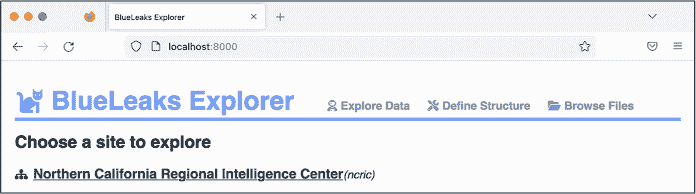

图 10-1: 新安装的 BlueLeaks Explorer 应用程序

每个融合中心都是独一无二的：它由不同的人运营，具有不同的优先级和目标，并跟踪不同的数据。为了充分利用 BlueLeaks Explorer，您需要花些时间了解目标融合中心中的数据布局。我将这种布局称为 BlueLeaks 站点的*结构*。这指的是哪些表格包含有用的信息（某些表格为空或包含与网站布局无关的数据），这些表格中哪些列是有用的，以及各种表格之间是如何关联的。

每个 BlueLeaks Explorer 页面顶部都有三个链接，如 图 10-1 所示：探索数据、定义结构和浏览文件。自动推测 BlueLeaks 网站的结构是困难的，部分原因是它是主观的—不同的用户会根据自己的需要判断哪些信息有用或无用。因此，定义结构页面将带你进入一个编辑器，在这里你可以为 BlueLeaks 网站定义自己的结构。在“探索数据”下，你可以找到你已经为单个 BlueLeaks 网站创建的结构。由于你是在自己的计算机上本地运行 BlueLeaks Explorer，你将只能访问你自己创建的结构或包含在 BlueLeaks Explorer Docker 镜像中的结构。最后，“浏览文件”列出了 BlueLeaks 中的所有文件，使你可以链接到特定文档或嵌入图像；它仅仅是 BlueLeaks 数据的一个网页界面，就像你在文件浏览器中查看它一样。

> 注意

*如果你按照 第九章 中“通过 VPN 服务掩盖你的踪迹”的描述，设置了 VPN 来隐藏你的 IP 地址，建议你在本章中也使用 VPN。尽管 BlueLeaks Explorer 托管在你自己的计算机上，查看其中的内容可能会加载来自融合中心网站的图像，点击链接可能会将你带到这些网站。*

在接下来的部分，你将开始使用我已经创建的结构探索 NCRIC 网站的数据。

### NCRIC 结构

BlueLeaks Explorer 允许你浏览和搜索你拥有结构的任何 BlueLeaks 网站中的所有表格。为了演示该应用的功能—包括列出 BlueLeaks 网站中的表格、查看和搜索这些表格中的数据、查看相关表格的数据、以及查看与数据行相关的图像和文档—你将从探索 NCRIC 数据开始。这将帮助你理解如何构建结构，在你创建自己的结构之前。

#### 探索表格和关系

如练习 10-1 中所示，确保你的 BlueLeaks Explorer Docker 容器正在运行，并在浏览器中加载 *http://<wbr>localhost:8000*。在“探索数据”部分，点击 **北加州区域情报中心**。图 10-2 显示了这个页面。

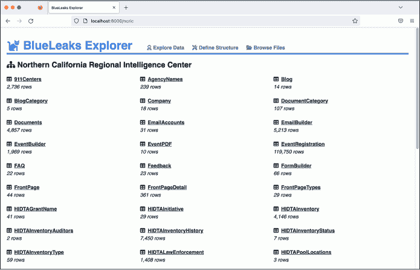

图 10-2：在 BlueLeaks Explorer 中查看 NCRIC 表格

在这里，你可以看到*ncric*文件夹中的表格列表，以及每个表格中数据的行数。例如，EmailBuilder 表格有 5,213 行。我已经隐藏了所有空表或我认为无关的信息表格，以便它们不会出现在这里。

当我第一次定义 NCRIC 结构时，我从逐个探索每个表格中的数据开始（稍后在本章中我会解释你如何对 BlueLeaks 的其他部分进行此操作）。我发现以下表格包含了最有趣且潜在的新闻价值数据：

**EmailBuilder** 包含 NCRIC 发送给其大量本地警察和私人行业合作伙伴的所有批量电子邮件。

**EventBuilder** 描述了 NCRIC 主办的活动，包括活动描述、PDF 传单和参加人员列表。

**FormBuilder**(AA)(AA)包含 NCRIC 网站上用于各种目的的表单列表，比如提交 SARs、请求技术帮助，甚至是注册融合中心账户。

**Requests** 包含地方警察请求融合中心协助处理任务的请求，比如监控社交媒体和破解锁定的手机。

**SARs** 包含可疑活动报告，正如你在上一章中所学，这些是提交给 NCRIC 的文件，其中人们报告他们认为可能是犯罪或其他可疑行为的情况。

**SurveyForm** 包含 NCRIC 要求活动参与者填写的调查问卷。

BlueLeaks 中的不同表格以各种方式彼此关联。例如，正如你在上一章中所知，许多 BlueLeaks 网站包含“Documents”和“DocumentCategory”这两个表格。这两个表格都包含一个叫做 DocumentCategoryID 的字段。例如，在*ncric*文件夹中的 Documents 表格中的一行，描述了一份标题为*FBI NSIR Tradecraft Alert Voter Suppression*的文档。DocFilename 字段包含 PDF 的路径。DocumentCategoryID 是 167。通过查看 DocumentCategory 表中具有该 DocumentCategoryID 的行，你可以看到 CategoryName 是“选举”。现在你知道 NCRIC 将这份文档放在了选举类别中。在数据库术语中，通过共享字段连接的两个表之间存在一个*关系*。SurveyForm 表格列出了 NCRIC 主办活动的与会者需要填写的调查问卷，它也与 Survey 表格相关联，后者包含了实际的调查反馈。

BlueLeaks Explorer 使得在 BlueLeaks 网站中快速找到相关信息变得更加容易。从图 10-2 中显示的表格列表中点击“Documents”表格。你应该会看到一份文档列表，每一份文档都位于 Documents 表格中的单独一行。在搜索框中输入**选民压制**以调出 FBI NSIR Tradecraft Alert 选民压制文档，如图 10-3 所示。

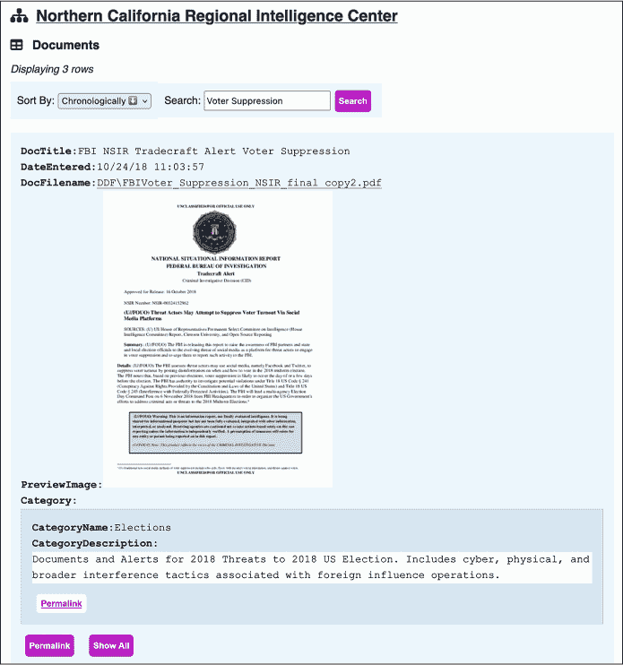

图 10-3：在 BlueLeaks Explorer 中查看 FBI NSIR 贸易技巧警告选民压制文件

当你使用我定义的 NCRIC 结构查看文档行时，BlueLeaks Explorer 将会显示该文件本身的链接——在这个例子中，是一个 PDF 文件。如果该文件有预览图，系统还会显示该文件的预览图（预览图片的路径列在 PreviewImage 字段中），以及文档类别——在这个例子中，是“选举”。

如果你点击文件名链接，PDF 文件将会打开。该文档日期为 2018 年 10 月 16 日，警告称：“FBI 评估威胁行为者可能会利用社交媒体，特别是 Facebook 和 Twitter，通过发布关于何时如何投票的虚假信息来压制选民投票率，尤其是在 2018 年中期选举中。”文档还指出了 2016 年选举中社交媒体上选民压制战术的例子，比如一个西班牙语的迷因称，选民可以通过给特定电话号码发送“希拉里”来投票给希拉里·克林顿——这种方式让选民误以为自己已经为克林顿投票。

接下来，点击选举类别下的**永久链接**以访问该类别。此时你的 URL 应该是*http://<wbr>localhost:8000<wbr>/ncric<wbr>/DocumentCategory<wbr>/167*，从这里你应该能看到所有 11 个被归类为“选举”的文档。你可以点击这些文档下的永久链接来查看它们。你可以轻松地在文档和其类别之间切换，因为我在 NCRIC 结构中定义了 Document 和 DocumentCategory 表之间的关系。永久链接会把你带到该行的唯一 URL。在调查过程中，你可以通过永久链接跟踪数据集中任何有趣的项目，方便以后快速参考。点击“显示所有”链接将会显示该行的所有隐藏字段。我已配置 Documents 表仅显示少数几个字段：DocTitle、DateEntered、DocFilename、URL、PreviewImage 以及 DocumentCategory 关系。点击“显示所有”将会显示其余隐藏字段。

#### 搜索关键词

为了更具体地说明 BlueLeaks Explorer 如何使调查 BlueLeaks 文档变得更容易，我们来回顾一下在第九章中描述的 SAR 案例，律师报告了一个学生抗议者。这一次，不需要手动 grep CSV 文件并从电子表格中复制粘贴大段文本来便于阅读，你可以在 BlueLeaks Explorer 中直接完成这些操作。

返回 NCRIC 表格列表，点击**SARs**，然后搜索**antifa**，找到特定的行。图 10-4 显示了该记录。File1 行应该显示一个可点击的链接，指向原始附加在 SAR 上的 PDF 文件，允许你快速打开该文档。如果你点击它，你将能在另一个浏览器标签中立即阅读 PDF 文件。

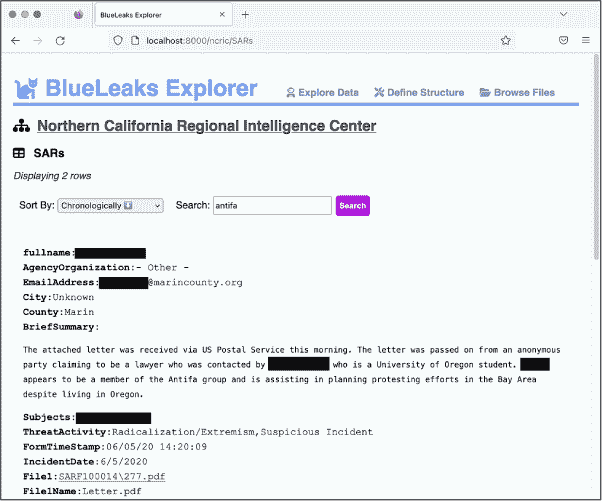

图 10-4：在 BlueLeaks Explorer 中查看 SAR

现在你已经对如何浏览 BlueLeaks Explorer 有了一定了解，轮到你去探索 BlueLeaks 数据集中的其他部分，超出 NCRIC 的范围。

### 构建你自己的 BlueLeaks 结构

在本节中，你将学习如何为另一个 BlueLeaks 网站——洛杉矶联合地区情报中心（JRIC）定义自己的结构。在本节结束时，你将掌握创建所有 BlueLeaks 网站结构所需的工具。

构建 BlueLeaks Explorer 网站结构需要一定的工作量，但它也能帮助你更清楚地理解数据。一旦你开始清理一些表格，你就可以花时间阅读它们，寻找值得报道的发现。在阅读过程中，你可能会调整结构，以帮助你进行研究，也很可能在发现与之相关的内容时开始清理新的表格。

#### 定义 JRIC 结构

一些结构，如我为 NCRIC 构建的结构，已经包含在 BlueLeaks Explorer 中。要编辑现有结构或定义新结构，请在浏览器中加载 BlueLeaks Explorer，并点击屏幕顶部的**定义结构**。图 10-5 显示了应弹出的页面。

在定义结构页面上，所有已定义的结构都列在编辑结构下。在图 10-5 中，这只有一个结构——NCRIC。要编辑结构，只需点击其名称。尚未定义结构的 BlueLeaks 网站将按其文件夹名称列在“定义新结构”下，并附有创建该新结构的按钮。向下滚动，直到看到 *jric* 的列表，然后点击**创建**。

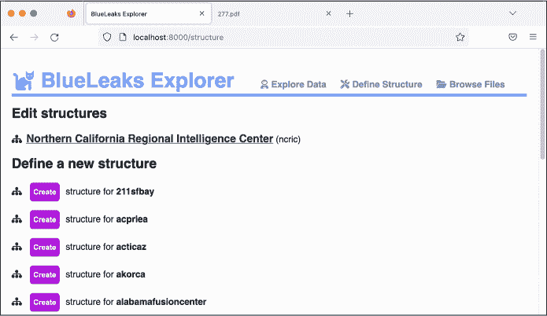

图 10-5：在 BlueLeaks Explorer 中查看定义结构页面

在打开的页面中，你可以配置 BlueLeaks Explorer 在调查 JRIC 数据时的具体操作方式，如图 10-6 所示。页面顶部显示了站点名称，默认是 BlueLeaks 文件夹名称，*jric*。

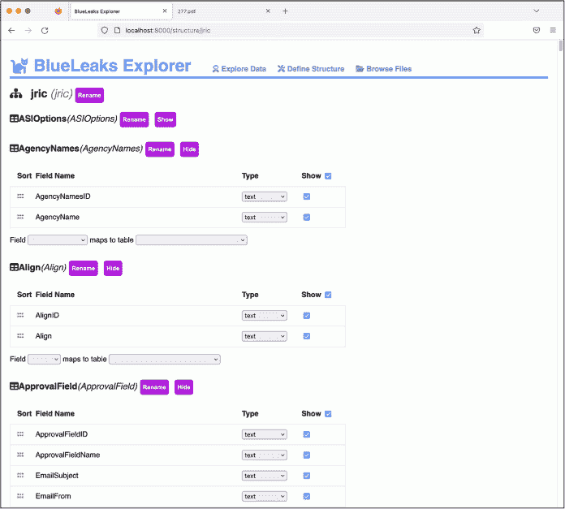

图 10-6：在 BlueLeaks Explorer 中编辑 JRIC 结构

点击站点名称旁的**重命名**，并输入**洛杉矶联合区域情报中心**。每次做出这样的更改时，底部右角会出现“您有未保存的更改”提示，并显示保存按钮。点击**保存**。

在站点名称下方，编辑结构页面列出了此 BlueLeaks 站点中的所有表格。每个表格名称旁边都有重命名按钮，以及显示或隐藏表格的按钮。BlueLeaks Explorer 会自动检测没有任何行的表格，并默认将其隐藏；这就是为什么 ASIOptions 表格一开始是隐藏的原因。你也可以手动隐藏不感兴趣的表格，以减少在后续调查该站点时的杂乱。

现在你已经创建了 JRIC 结构，打开页面顶部的**Explore Data**链接，在一个新的浏览器标签页中。你应该能看到洛杉矶联合区域情报中心站点已被添加到待探索的站点列表中。图 10-7 展示了新的 Explore Data 页面。

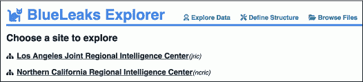

图 10-7：你创建 JRIC 结构后的 Explore Data 页面

你为其他 BlueLeaks 站点创建的任何额外结构也会出现在此页面上。

点击 JRIC 链接，查看该站点中的所有表格。在接下来的部分中，当你在 BlueLeaks Explorer 中构建结构时，保持两个标签页同时打开：Explore Data 和 Define Structure 页面。这样，当你在 Define Structure 标签页中保存更改时，你可以刷新 Explore Data 标签页查看这些更改。

#### 显示有用字段

在练习 9-3 中，你编写了一个 Python 脚本，自动创建一个电子表格，将 BlueLeaks 文件夹的名称与其关联的组织进行映射。你在*Company.csv*文件中找到了这些信息，该文件包含 108 个不同的列。只有少数几个字段与此相关，这使得它成为一个很好的练习，来展示如何只显示有用字段。

在你的“探索数据”标签页中，点击“公司”表格。你应该能看到如图 10-8 所示的页面。这里显示了 7 行数据，每行包含所有 108 个不同的字段，其中一些字段包含大量的 HTML。因为每行有这么多字段，图中只显示了第一行数据的字段。

这些字段中的文本目前并不太容易读取，但这是一个很容易解决的问题。回到你的“定义结构”标签页，向下滚动直到找到“公司”表格。对于每个字段，你可以从下拉菜单中选择类型，并通过切换复选框来设置是否希望它出现在“探索数据”页面上。例如，你可能不关心 BannerAdHeight 的值，因此你希望隐藏该字段。

你还可以点击表格顶部的“显示”复选框，来一次性切换所有复选框。现在点击它以取消勾选——也就是隐藏——所有的公司表格字段。从这里，你可以滚动浏览并选择仅显示最有用的字段。

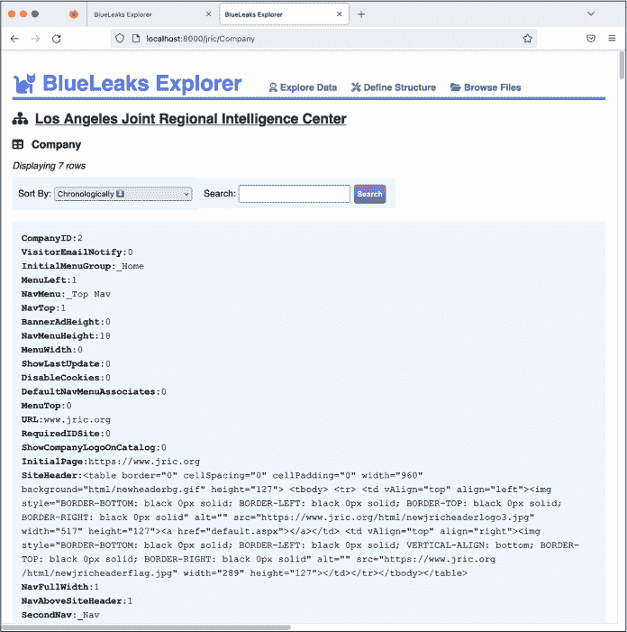

图 10-8：编辑结构前在 JRIC 公司表格中探索数据

通过浏览“探索数据”页面，我可以猜测最有用的字段包括 URL、InitialPage、SiteHeader 和 CompanyName。在“定义结构”页面，勾选这些字段旁边的复选框以显示它们，然后点击**保存**。刷新“探索数据”页面，应该会像图 10-9 那样显示。

“探索数据”页面仍然列出了公司表格中的所有七行数据，但这次只显示了你选择的四个特定字段，这使得阅读更加容易。如第二行数据所示，“探索数据”页面还会隐藏空字段——leads.jric.org 这一行在 SiteHeader 字段中没有内容，因此 BlueLeaks Explorer 跳过了该字段。

你仍然可以通过点击每行下方的“显示所有”按钮来查看所有被隐藏的字段。在调查过程中，你可能会发现你选择隐藏的某个字段其实很有用，在这种情况下，你可以再次编辑结构以显示该字段。

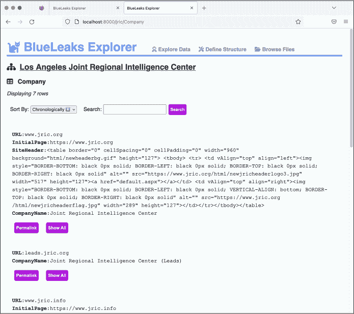

图 10-9：查看隐藏无关字段的 JRIC 公司表格

#### 更改字段类型

现在“探索数据”页面可读性大大提高，但仍然不是完美的。由于 SiteHeader 字段是一个 HTML 块，它很难阅读。如果 CompanyName 能出现在字段列表的顶部，那就更好了。让我们做最后一个更改来解决这个问题。

BlueLeaks Explorer 中的每个字段一开始都是文本类型，您需要根据需要更改其类型，如果您认为有更好的方式来显示该字段。以下是所有可用的类型：

**text** 将值显示为文本；这是所有字段的默认设置。

**html** 将值呈现为 HTML 网页。

**pre** 以固定宽度字体显示字段的值，并保留所有原始空格（请参见图 10-4 中的 BriefSummary 字段作为示例）。

**image**(AA)(AA)从路径中直接加载图像到浏览器；仅在字段包含图像路径时选择此类型（请参见图 10-3 中的 PreviewImage 字段作为示例）。

**attachment** 将文件路径显示为直接链接到文件的文本链接；仅在字段包含非图像文件的路径时选择此类型（请参见图 10-3 中的 DocFilename 字段作为示例）。

**survey** 识别 SurveyData 字段的格式，这些字段仅出现在 Survey 表格中，包含来自融合中心举办的活动的参与者反馈—并使结果更易于阅读。

返回到 Edit Structure 标签页，找到 SiteHeader 字段。此字段有一个类型下拉菜单，目前设置为文本；将其更改为 **html**。现在向下滚动，直到找到 CompanyName 字段。点击它左侧的握手图标并将其拖动到字段列表的顶部。再次点击 **Save** 并刷新 Explore Data 标签页。您的 Company 表格现在应显示为图 10-10。

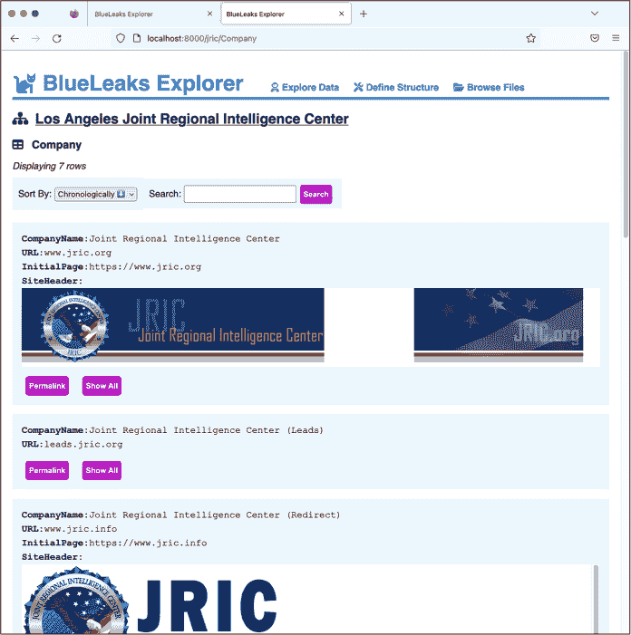

图 10-10：编辑结构后探索 JRIC 的公司表格

因为您将 SiteHeader 字段的类型从文本更改为 HTML，所以 BlueLeaks Explorer 将其渲染为 HTML，并加载从 JRIC 的 Web 服务器托管的 JRIC 头部图像。图 10-10 还显示 CompanyName 字段现在在每行的最前面。

#### 添加 JRIC 的 Leads 表格

在您的 Explore Data 标签页中，返回 JRIC 表格列表。这次，点击 Leads 表格。如果您浏览它的行，您会看到该表格充满了 SAR（可疑活动报告）。它类似于 NCRIC 的 SAR 表格，不同之处在于它的线索由融合中心的合作伙伴和公众成员提交，并且它似乎永久保留数据，而 NCRIC 的 SAR 表格仅包含一个月的 SAR 数据。为了更好地练习使用 BlueLeaks Explorer，包括在两个表格之间建立关系，接下来您将定义 Leads 表格的结构。

在你的定义结构（Define Structure）标签页中，找到 Leads 表，隐藏所有列，然后重复你在 Company 表中执行的步骤，只显示有用的字段，并为每个字段选择最合适的类型。在浏览 Explore Data 标签页中的 Leads 数据的前几行后，我决定显示 FormTimeStamp、County、PhoneNum、EmailAddress、ActivityDate、ActivityTime、ActivityDetails、fullname、Information、NSFormName、FUpload 和 FUploadName。你可以根据需要自由选择显示或隐藏不同的字段。

在保存结构并刷新 Explore Data 页面后，我从 Leads 表的第一行中获取了以下字段：

**FormTimeStamp** 06/07/20 00:39:09

**County** 洛杉矶

**PhoneNum** *[redacted]*

**EmailAddress** *[redacted]*@torrenceca.gov

**ActivityDate** 06/06/20 00:00:00

**ActivityTime** 1345

**ActivityDetails** 在上述日期和时间，警员被派往处理一个可疑包裹的报警。到达现场后，警员注意到包裹上有瓶子，瓶口处伸出布条物品[*sic*]，类似自制汽油弹（Molotov Cocktail）。这个包裹位于一个正在进行的 BLM 抗议活动附近。（见附带的报告和照片）

**NSFormName** PublicCountyLeadSheet

**FUpload** LFU00010\984.docx

**FUploadName** 200020437.docx

FUpload 和 FUploadName 字段都包含文件名。注意，FUpload 似乎是指向 BlueLeaks 数据集内某个文件的路径。在定义结构页面中，将 FUpload 的类型从文本（text）更改为附件（attachment），保存更改并刷新 Explore Data 页面。此时，FUpload 字段应该会链接到*http://<wbr>localhost:8000<wbr>/blueleaks<wbr>-data<wbr>/jric<wbr>/files<wbr>/LFU00010<wbr>/984<wbr>.docx*，该链接会从你本地的文件副本加载文档。如果你感兴趣，可以点击这个链接阅读该文件。文件名是*984.docx*，但似乎提交此条线索的人最初上传的文件名是*2000020437.docx*。

浏览 Leads 表中的其他行时，我还注意到 NSFormName 字段在不同的线索中值不同。我猜测这个字段描述了填写哪种表单来将此线索添加到 JRIC 的数据库中。大多数 NSFormName 的值似乎是 PublicCountyLeadSheet 或 LeadSheetPrivateSectorAndPublic。Leads 表是否与描述表单的其他表有关联呢？让我们来查明。

#### 建立关系

返回到列出所有 JRIC 表格的页面，并点击名为 FormBuilder 的表格。这个表格没有叫做 NSFormName 的字段，但有一个叫做 FormName 的字段。如果你在表格中搜索 PublicCountyLeadSheet 和 LeadSheetPrivateSectorAndPublic，你会看到 ID 为 1 的行的 FormName 值是 PublicCounty LeadSheet，ID 为 2 的行的 FormName 值是 LeadSheet PrivateSectorAndPublic。（在 FormBuilder 表页面上，你也可以按 FormBuilderID 升序排序，查看该表中的前两行。）由于 Leads 表中的 NSFormName 字段与 FormBuilder 表中的 FormName 字段相映射，因此这两个表之间有了关系。让我们在 BlueLeaks Explorer 中创建该关系。

返回到“定义结构”页面，滚动到 Leads 表格的底部。在字段列表之后，会有一个名为“字段映射到表格”的部分。字段和表格都是下拉菜单。点击“字段”下拉菜单，列出此表格中的所有字段，并选择**NSFormName**。点击“表格”下拉菜单，列出此 BlueLeaks 站点中的所有其他表格，选择**FormBuilder**。选择表格后，你应该会看到一个第三个下拉菜单，让你选择该表格中的字段。选择**FormName**并点击**创建关系**。应该会弹出一个提示框，询问：“此关系的名称是什么？”输入**Form**并点击**确定**，然后保存你的更改。

返回到“探索数据”选项卡，导航回到 Leads 表格。对于每个线索，你现在应该可以看到用于提交该线索的表单中的所有字段。然而，正如图 10-11 所示，这些字段的显示方式难以阅读。

如你所见，相关表单已显示，但和之前处理的公司表格一样，显示了过多的字段，包括一些难以理解的 HTML 块。为了解决这个问题，你将像处理公司表格和 Leads 表格一样编辑 FormBuilder 表格的结构。在构建结构时，我建议你先完成一个表格，使其显示得更好，然后再继续处理相关表格。

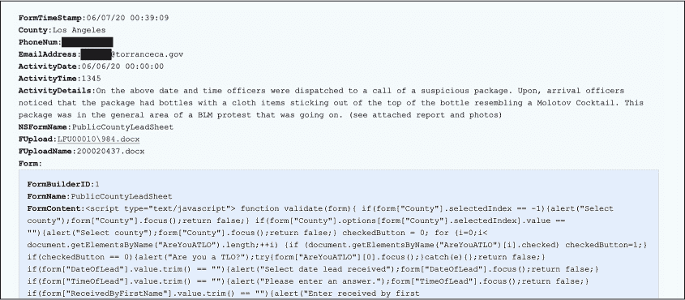

图 10-11: JRIC Leads 表中的一项，现在与 FormBuilder 表建立了关系

返回到 Define Structure 标签，找到 FormBuilder 表格，并隐藏所有字段。勾选 FormName 和 FormContent 的显示框，将 FormContent 的类型从文本更改为**html**。你已经添加了一个与 Leads 表的关系，将其链接到 FormBuilder 表，因此在这里你也可以创建一个反向的关系。滚动到 FormBuilder 表底部，添加一个新的关系：将 FormName 字段映射到 Leads 表中的 NSFormName 字段。这一次，创建关系时，命名为*Submissions*。在 Define Structure 标签中保存你的更改。

在你的 Explore Data 标签中，再次导航到 Leads 页面查看其外观。现在，当你滚动浏览每条线索时，你可以看到是哪个表单被填写并提交的。图 10-12 展示了来自 Leads 表的不同示例。

在这种情况下，是一位公众成员，而不是融合中心成员填写了这个表单，使用了假名字和电子邮件地址（John Doe 和*idont@thinkso.org*）。他们用全大写字母写了一条信息，内容关于位于内华达州帕哈伦普（加州边境附近）的一个烟花商店：

> 在星期六，所有 3 家商店都非常拥挤，超过 90%的顾客来自加利福尼亚州。他们几乎全都是黑人或墨西哥裔人。没有对种族的不尊重，但这是不是有点符合你最近描述的问题？我其实不在乎问题的原因如何，但动荡正在伤害特朗普。我敢打赌你有一些反法西斯（Antifa）的人在买烟花制造麻烦。只是想提一下。

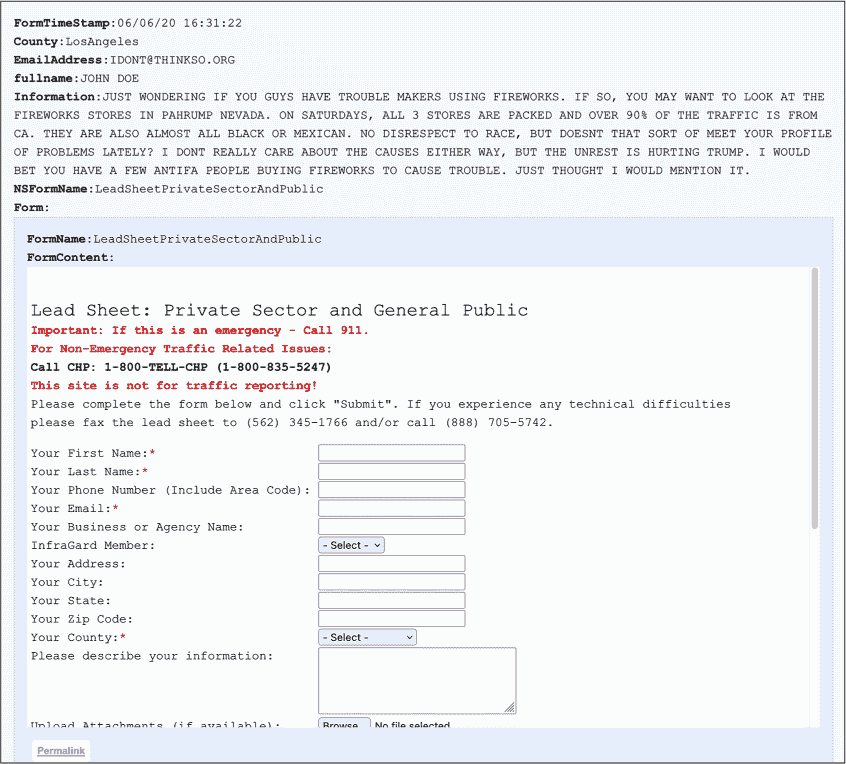

图 10-12：JRIC 线索表中的一项，清理后的与 FormBuilder 表的关系

BlueLeaks Explorer 显示了 LeadSheetPrivateSectorAndPublic，这是填写提交该线索的表单。滚动到表单底部，点击**Permalink**，进入一个只显示 LeadSheetPrivateSectorAndPublic 表单的页面，并显示在 FormBuilder 表格中。因为你创建了与提交的关系，这个页面应该会显示所有通过这个表单提交给 JRIC 的数据——即公众提交的 1,949 条线索。

### 验证 BlueLeaks 数据

每当你查看泄露或被黑客攻击的数据时，应该始终在数据集本身之外进行额外的研究，以帮助验证数据的真实性，并将其放入上下文中。通过查看上一节中的公司表格，你了解到 JRIC 网站托管在[*https://<wbr>www<wbr>.jric<wbr>.org*](https://www.jric.org)。在 Tor 浏览器（见第二章）中或连接到 VPN 时打开该链接，查看 JRIC 网站。

在写这篇文章时，从网站上我能看出这个融合中心专注于洛杉矶地区。虽然一些 BlueLeaks 网站在 2020 年的黑客事件后下线了，但像 JRIC 这样的网站仍然在线。图 10-13 显示了 JRIC 的网站，匿名加载于 Tor 浏览器中。


图 10-13：JRIC 网站的主页， [`www.jric.org`](https://www.jric.org)， 在 Tor 浏览器中加载

在我查看 JRIC 的网站之前，我并不清楚 JRIC 是一个专注于洛杉矶的融合中心，或者它的任务是什么。如果你点击 JRIC 网站上以便更好地理解它收集的各种信息，你就可以使用 BlueLeaks Explorer 来查看这些信息。例如，如果你点击首页顶部的“提交 SAR”链接，你可以找到将 SAR 添加到 Leads 表格的表单。

到目前为止，你仅仅探索了 JRIC 数据中的一小部分内容。现在是时候完成结构的构建，以便你可以探索其余的内容。

### 练习 10-2：完成 JRIC 结构的构建

在前面的章节中，你已经开始为 JRIC 数据构建结构。你清理了 Company、Leads 和 FormBuilder 表格，并在后两个表格之间创建了关系，这使你可以查看每个线索是通过哪个表单提交的，以及每个表单创建了哪些线索。在这个练习中，你将运用你新学到的知识，完成 JRIC 中其他表格的结构定义。这将帮助你更清楚地理解存储在那里的数据内容，从而使你能够更轻松地继续调查。它还将为你提供创建其他 BlueLeaks 网站结构的实践经验。

你可以随意使用 BlueLeaks Explorer 自定义 JRIC 结构，以符合你的个人偏好。然而，如果你不确定从哪里开始，我建议从第一个表格（AgencyNames）开始，然后是第二个表格（Align），依此类推，最后完成最后一个表格（VideoOptions）。如果你遇到一个与另一个表格相关的表格，应该先处理相关的表格，然后再继续往下处理。

例如，下面是我开始构建 AgencyNames 表的方式。在“探索数据”标签页中，在 JRIC 表格列表中点击**AgencyNames**。这个表格有 1,396 行，每一行只有两个字段：AgencyNamesID 和 AgencyName。名字看起来像是各种军事机构、警察部门、学区和其他组织——我猜这些都是 JRIC 的合作伙伴。这个数据本身相对容易阅读和搜索，因此我会认为这个表格已经完成了。

仍然在“探索数据”标签下，我将继续查看 Align 表格。这个表格只有三行，Align 字段分别为 Left、Right 或 Center。这个表格对调查没有任何实际用途。在“定义结构”标签中，找到 Align 表格，点击**隐藏**按钮，然后点击**保存**。返回“探索数据”标签，刷新页面，你会看到 Align 表格已经消失了。

我发现，在构建 BlueLeaks Explorer 结构时，开始时阅读一些原始数据很有帮助，这有助于理解数据是什么以及如何进行格式化。例如，如果你看到明显是 HTML 的字段，可以将其类型从文本改为**html**。一旦你理解了哪些字段是重要的，你就可以隐藏其余的字段。然后，在决定显示哪些字段以及它们的类型后，你可以根据需要添加任何相关关系。

一旦你已将 JRIC 数据结构化以便更轻松地进行探索，就可以开始调查了。JRIC 数据包括一整套恐怖主义联络办公室的培训视频，分成不同的模块。查看 Video 和 VideoCategory 表格；截至目前，还没有人报道过这些信息。

现在你已经知道如何在 BlueLeaks Explorer 中定义结构，你可以对 BlueLeaks 数据集中的其他站点进行相同的操作，以更深入地调查它们。BlueLeaks Explorer 与像 Aleph 这样的工具配合使用时最为有用，Aleph 在第五章中有所介绍，它通过索引数据让你可以通过关键词进行搜索。如果你对 BlueLeaks 中的所有数据进行索引，你就可以一次性搜索所有数据，查找不同 BlueLeaks 站点中的文档。然后，一旦你发现感兴趣的站点，你可以通过 BlueLeaks Explorer 对它们进行深入分析。

### BlueLeaks Explorer 背后的技术

有时候，一个数据集复杂到让人难以理解，而且如此具有新闻价值，以至于值得写一个自定义应用程序来帮助你理清思路。BlueLeaks Explorer 就是这样的一个应用程序。本书中涉及的信息，特别是在第七章和第八章，为你自己开发这样一个应用程序提供了坚实的基础，尤其是在进行额外的独立研究时。

编写自定义应用程序来调查数据集有很多不同的方法。在本节中，我将描述我用来开发 BlueLeaks Explorer 的技术和库：首先是我用来构建*后端*（即 Web 服务器）的技术，然后是我用来构建*前端*（即在 Web 浏览器中运行的用户界面）的技术。我个人很喜欢这个*技术栈*，即应用程序所使用的技术组合，但这绝不是所有可能性中的完整列表。这里描述的大多数技术超出了本书的范围；这一节仅提供简要的介绍，以启发未来的研究。

如果你对自己的编程技能有信心，并且愿意的话，可以在 git 仓库中改进我的 BlueLeaks Explorer 代码，并将它们提交回项目，因为它是开源的。

#### 后端

我用 Python 开发了 BlueLeaks Explorer 的后端，依赖于一个名为 Flask 的第三方 Python 包，这是一个用于构建 Web 应用的简单框架。你可以在 [*https://<wbr>flask<wbr>.palletsprojects<wbr>.com*](https://flask.palletsprojects.com) 了解更多关于使用 Flask 的内容。你还可以查看 BlueLeaks Explorer 的源代码，特别是 *app.py*，网址是 [*https://<wbr>github<wbr>.com<wbr>/micahflee<wbr>/blueleaks<wbr>-explorer<wbr>/blob<wbr>/main<wbr>/src<wbr>/app<wbr>.py*](https://github.com/micahflee/blueleaks-explorer/blob/main/src/app.py)，查看我如何在这个项目中使用 Flask。

后端还利用了内置的 Python 模块，主要是 json（你将在下一章学习）和 sqlite3，后者允许你在表示 BlueLeaks 网站的 SQLite 数据库上运行 SQL 查询。当一个网页浏览器加载由 Flask 提供支持的网页服务器时，网页服务器会返回 HTML，其中加载了一些 JavaScript 代码。这就是前端，接下来的部分将进行描述。

后端还实现了一个 API，允许前端与其进行通信。例如，当前端想要了解已构建结构的网站列表时，它可以加载后端的 */api/sites*，该接口会以 JSON 格式返回这些数据。如果它想要从某个特定网站的特定表中获取数据，可以加载 */api/*<*site*>*/*<*table*>。在这种情况下，Python 代码会使用 sqlite3 模块，在该 BlueLeaks 网站的 SQLite3 数据库中查找这些数据，并将找到的内容返回给前端。

#### 前端

为了开发 Web 应用程序，你必须用 JavaScript 编程，而不是 Python，因为这是网页浏览器能理解的编程语言。我使用一个名为 Vue.js 的 JavaScript 框架开发了 BlueLeaks Explorer 的前端，网址是 [*https://<wbr>vuejs<wbr>.org*](https://vuejs.org)。如果你像我一样，发现自己非常喜欢编写代码，我推荐你学习 JavaScript，这样你就能开发 Web 应用程序了。你可以在 [*https://<wbr>github<wbr>.com<wbr>/micahflee<wbr>/blueleaks<wbr>-explorer<wbr>/tree<wbr>/main<wbr>/src<wbr>/frontend<wbr>/src*](https://github.com/micahflee/blueleaks-explorer/tree/main/src/frontend/src) 找到前端的源代码。

使用 Vue.js，BlueLeaks Explorer 前端包括一系列页面，旨在通过向后端发起 HTTP 请求来展示检索到的数据。当你在 BlueLeaks Explorer 中保存你正在处理的结构时，前端还会将数据发送到后端，后端随后将结构保存为 JSON 文件。

### 总结

在本章中，你已经成功在自己的计算机上使用 Docker 启动并运行了 BlueLeaks Explorer。你学习了如何为每个 BlueLeaks 站点定义结构，如何使表格中的数据更易于阅读，并且如何在表格之间创建关系。现在，你已经具备了调查庞大 BlueLeaks 数据集的技能，如果你发现任何有趣的发现，随时告诉我！

在下一章中，你将学习更多关于 JSON 文件格式的内容。你将处理一个包含百万个 JSON 文件的数据集，这些文件与 2021 年 1 月 6 日美国国会大厦遭遇的袭击有关，并通过编写代码来找到其中最重要的文件，进一步提升你的 Python 技能。
