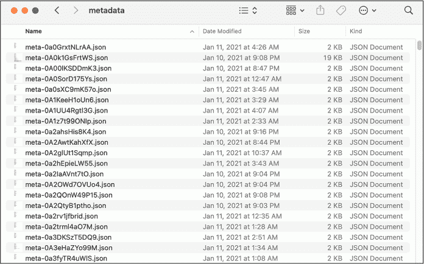
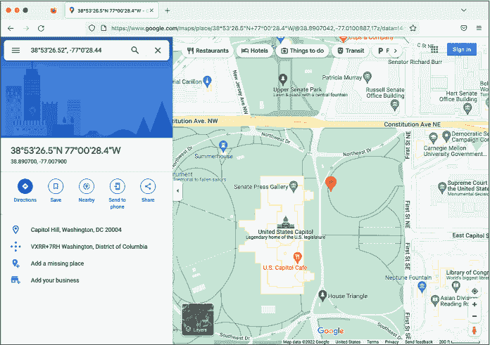
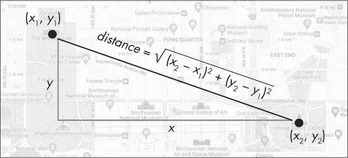
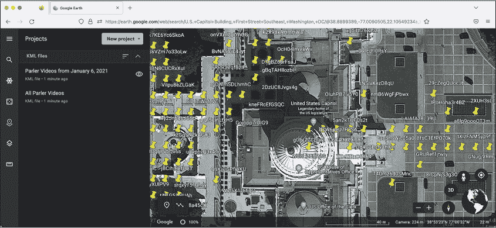
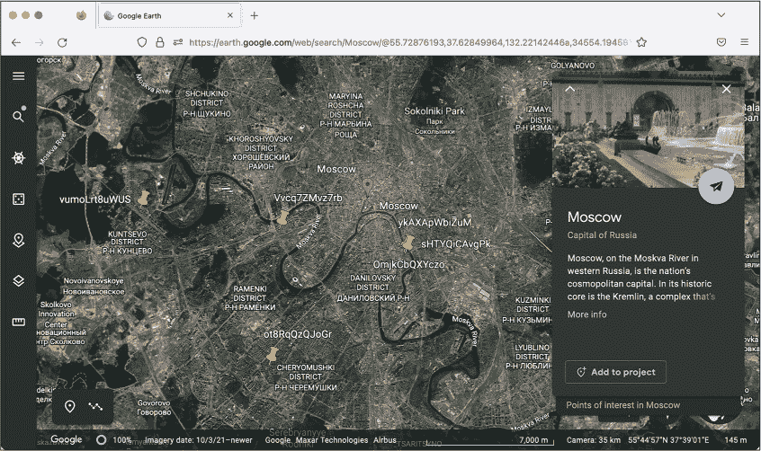

## 11 PARLER、1 月 6 日的叛乱与 JSON 文件格式


2021 年 1 月 6 日清晨，在唐纳德·特朗普以约 600 万票的差距输给乔·拜登后两个月，成千上万的特朗普支持者准备冲进位于华盛顿特区的美国国会大厦，企图颠覆民主。“我们永不放弃，我们永不让步，”特朗普在白宫南边的国家广场对人群说道。“我们拼尽全力，如果你不拼命，你就不再有这个国家了。”

手持智能手机，亲特朗普的反民主活动分子记录下了整个事件。他们将照片和视频发布到网上，许多上传至极右翼社交媒体网站 Parler。在本章中，你将学习如何使用从当天的叛乱中收集到的大量视频证据，这些证据采用了一种流行的文件格式——JavaScript 对象表示法（JSON）。你将学习 JSON 数据的结构，并编写 Python 代码，通过解析一百万个包含 Parler 视频元数据的 JSON 文件来查找特定的视频。你还将学习如何处理全球定位系统（GPS）坐标，包括如何在地图上标出点，因为许多视频的元数据中包含了 GPS 坐标。所有这些技能都将在你未来的调查中大有帮助。

让我们从 Parler 数据集公开的简短历史开始。

### Parler 数据集的起源

在美国国会骚乱中的抗议者拍摄了他们手持“不踩我”、“去你妈的拜登”和特朗普旗帜游行的过程；拆除栅栏；与防暴警察对抗；吸食大麻；砸窗户然后通过窗户冲进国会大厦；向警察投掷椅子；并威胁国会议员和副总统迈克·彭斯的生命。他们在拍摄过程中将这些视频实时上传至 Parler。

在袭击国会期间，亲特朗普的暴徒用棒球棍、旗杆和管道袭击警察，至少造成 138 名警察受伤。一名警察布赖恩·西克尼克被送医，次日死亡。在袭击后的几周和几个月内，四名当天参与应对的警察自杀身亡。一名国会警察开枪打死了艾什莉·巴比特，一名试图闯入美国参议院议场的暴徒，参议员们在那儿避难。还有三名特朗普支持者在骚乱中死亡：一人被人群压死，一人死于中风，一人死于心脏病发作。

袭击发生后的几天，因 Parler 拒绝对鼓励和煽动暴力的内容进行审核，Apple 和 Google 将 Parler 应用从他们的应用商店中下架。亚马逊 Web 服务（AWS），Parler 依赖的主要云托管服务，将该公司从其服务中踢出。Parler 花了一个半月才将网站恢复上线。不过，在网站关闭之前，一位反应迅速的档案工作者下载了超过一百万个视频。在这一节中，我将描述她是如何下载这些视频的，以及它们是如何在特朗普第二次弹劾审判中被使用的。

#### Parler 视频是如何被归档的

在 1 月 6 日袭击后的那个星期六，John Paczkowski 和 Ryan Mac 在 BuzzFeed News 发布了一封来自 Amazon AWS 信任与安全团队发送给 Parler 的电子邮件。亚马逊通知 Parler，“不能为无法有效识别和删除鼓励或煽动对他人暴力的内容的客户提供服务”，并且“我们计划从 1 月 10 日（星期日）起暂停 Parler 的账户。” 在 Parler 关闭前不到 48 小时，一位名为@donk_enby 的黑客在其他档案工作者的帮助下，迅速下载了社交网络上所有上传的视频和图像的副本。

事实证明，Parler 缺乏防止自动抓取网站数据的安全措施。*网页抓取*是一种自动化数据收集方法，你可以使用代码加载网页，而不是在浏览器中手动加载它们，并提取其数据。本章不会介绍如何像@donk_enby 那样抓取网页，但如果你感兴趣，可以在附录 B 中学习如何操作。

Parler 的网站没有任何*速率限制*，这是一种防止用户频繁访问网站的安全功能，因此没有任何东西能阻止单台计算机发出数百万个网页请求。Parler 帖子的网址似乎具有随机 ID，但@donk_enby 发现它们实际上也有隐藏的递增 ID（1, 2, 3，依此类推），因此脚本可以轻松地循环遍历每个 ID，发出网页请求以下载每个帖子，然后找到每个视频和图像的网址进行下载。尽管 Parler 从用户上传的视频中剥离了元数据，但它们仍然保留了包含这些元数据的原始视频副本，并且这些视频在可预测的网址上可用。@donk_enby 下载了包含大量隐藏信息的视频版本，其中许多视频的 GPS 坐标表明视频的拍摄地点。

当@donk_enby 将这些数据归档时，她将其保存到了 AWS S3 存储桶中，这是 AWS 用于托管文件的服务，具有无限的磁盘空间。（讽刺的是，作为回应 AWS 将 Parler 从其服务中踢出，她将这些视频的副本保存到了 AWS 的另一部分。）

由于对黑客行为的定义没有广泛共识，Parler 是否被“黑客攻击”是一个视角问题。从技术角度来看，@donk_enby 从一个公开网站抓取了公开内容，这本身并不违法，也不需要绕过任何安全措施——即使 Parler 有这样的措施，也未必能阻止这种行为。非法黑客行为通常也是如此；人们进入的是那些几乎没有保护，或者偶然向公众开放的系统。

到周日晚，@donk_enby 已成功存档了至少 32TB 的视频。“我希望这些能用来追究责任，防止更多人死亡，”她在接受 *Vice* 采访时表示。她与 DDoSecrets 合作，将该数据的副本提供给公众——你将在本章中使用的正是这个副本。

#### 数据集对特朗普第二次弹劾的影响

1 月 13 日，在国会大厦致命骚乱一周后、乔·拜登成为新总统前一周，美国众议院以“煽动叛乱”指控弹劾特朗普，这使特朗普成为美国历史上第二次被弹劾的总统。

在美国参议院的弹劾审判中，发生在拜登政府初期的 2 月，弹劾经理展示了大量特朗普支持者暴力行为的视频，这些视频是@donk_enby 从 Parler 网站上存档的，用作支持弹劾案的证据。“我有一种高效的方法来下载所有视频。我知道里面有什么，但似乎没有其他人能看到这些视频的价值，”她当时在接受 CNN 采访时说道。“我希望能激励更多拥有类似技能的人将这些技能用来做好事。”

最终，57% 的参议员，包括七名共和党成员，裁定特朗普有罪，而 43% 的参议员——全部为共和党人——认为他无罪。美国宪法要求参议院必须以三分之二多数定罪，因此特朗普被宣告无罪。然而，超过 1,000 人因参与 1 月 6 日的叛乱而被起诉。两名极右翼誓言守卫组织（Oath Keepers）的成员，包括其领袖斯图尔特·罗兹，以及四名自豪男孩（Proud Boys）仇恨团体的成员，包括前领袖恩里克·塔里奥，被判定犯有煽动叛乱罪。该组织的其他几名成员也因较轻的罪行被判刑。罗兹于 2023 年 5 月被判处 18 年监禁，塔里奥则在 2023 年 9 月被判处 22 年监禁。

进一步研究这个数据集显然符合公众利益。让我们在练习 11-1 中开始吧。

### 练习 11-1：下载并提取 Parler 视频元数据

由于 Parler 数据集非常庞大，为了本章的目的，下载全部数据并不实际。相反，您将首先仅下载 DDoSecrets 单独提供的视屏元数据。元数据包含关于每个视频的有用信息，比如文件格式、拍摄时间、使用的手机或相机类型，以及在某些情况下，描述拍摄地点的 GPS 坐标。在本练习中，您将学习如何使用这些元数据选择并下载单个视频进行观看。

> 注意

*如果您使用的是 Windows，我建议您使用 Ubuntu 终端而不是 PowerShell 来跟随本章内容，并将数据保存在您的 WSL Linux 文件系统中（例如，在* ~/datasets*），而不是保存在 Windows 格式的 USB 磁盘（*/mnt/c* 或 */mnt/d*）中。由于 WSL 的磁盘性能问题，我发现直接在 Linux 中处理这些数据比在 Windows 中更快。如果您只在 Windows 中使用过 Python，请使用命令* sudo apt install python3 python3-pip* 在 Ubuntu 中安装 Python，然后运行* python3 -m pip install click* 安装 click Python 模块。您将在本章的练习中需要使用 click 模块。如果遇到任何问题，请参考附录 A 了解更多关于解决 WSL 性能问题的内容。*

#### 下载元数据

由于 Parler 数据集占用了大量磁盘空间，DDoSecrets 无法像发布大多数其他公开发布的内容那样使用 BitTorrent 发布它。要做种这个 torrent，您需要一个拥有 32TB 数据的单个服务器，而没有人能够连接到种子网络下载数据，因为没有人会拥有 32TB 的磁盘空间。因此，DDoSecrets 将 Parler 数据托管在其公共数据 Web 服务器上。如果您知道一个 Parler 视频的文件名，您可以从*https://<wbr>data<wbr>.ddosecrets<wbr>.com<wbr>/Parler<wbr>/Videos<wbr>/<filename>*下载它。

您还可以下载完整的文件名列表，*ddosecrets-parler-listing.txt.gz*，以及所有视频文件的元数据，*metadata.tar.gz*。以*.gz*结尾的文件是使用名为 GZIP 的格式进行压缩的，因此您可以从文件名看出*ddosecrets-parler-listing.txt.gz*是一个压缩的文本文件。以*.tar*结尾的文件，称为*tarball*，也将多个文件和文件夹合并成一个文件。但 tar 文件本身并没有压缩，它们占用的磁盘空间与其中包含的所有文件一样——因此通常会使用 GZIP 进行压缩，生成*.tar.gz*文件。*metadata.tar.gz*文件是一个经过 GZIP 压缩的 tarball。

从下载*ddosecrets-parler-listing.txt.gz*和*metadata.tar.gz*开始，使用 wget 命令。这个命令类似于 curl，但它默认将文件下载并保存到磁盘，而不是显示在终端中。通过运行 which wget 检查你是否已安装 wget。如果没有，请在 macOS 上运行 brew install wget，或者在 Linux 或 WSL 的 Windows 上运行 sudo apt install wget。

打开终端。为你将下载的 Parler 数据创建一个新文件夹，并切换到该文件夹。（如果你使用的是带 WSL 的 Windows，请确保在 WSL Linux 文件系统中创建它，例如在*~/datasets/Parler*中。）例如，这是我在 Mac 上创建文件夹的方法，将其创建在我的*datasets* USB 磁盘上：

```
micah@trapdoor ~ % **cd** **`/Volumes/datasets`**
micah@trapdoor datasets % **mkdir Parler**
micah@trapdoor datasets % **cd Parler**
micah@trapdoor Parler %
```

现在，使用 wget 通过运行以下命令下载文件名列表：

```
micah@trapdoor Parler % **wget** **https://data.ddosecrets.com/Parler/Videos/ddosecrets-parler**
**-listing.txt.gz**
`--snip--`
Resolving data.ddosecrets.com (data.ddosecrets.com)... 172.67.75.15, 104.26.3.199, 104.26.2.199
Connecting to data.ddosecrets.com (data.ddosecrets.com)|172.67.75.15|:443... connected.
HTTP request sent, awaiting response... 200 OK
Length: 17790173 (17M) [application/octet-stream]
Saving to: 'ddosecrets-parler-listing.txt.gz'

ddosecrets-parler-listin 100%[==================================>]  16.97M  29.1MB/s    in 0.6s 
`...` (29.1 MB/s) - 'ddosecrets-parler-listing.txt.gz' saved [17790173/17790173]
```

输出应显示你已下载 17MB 的*ddosecrets-parler-listing.txt.gz*文件。wget程序会在你的终端显示下载进度条。

接下来，运行以下命令下载视频元数据：

```
**wget** **https://data.ddosecrets.com/Parler/Videos/metadata.tar.gz**
```

运行 ls -lh，检查是否已成功下载文件。你应该看到以下输出：

```
-rw-r--r--  1 micah  staff    17M Mar 28  2021 ddosecrets-parler-listing.txt.gz
-rw-r--r--  1 micah  staff    203M Mar 15  2021 metadata.tar.gz
```

包含文件名列表的文件应为 17MB，元数据文件应为 203MB。

#### 解压并下载单个 Parler 视频

要解压 GZIP 文件，你需要使用 gunzip 命令，语法如下： gunzip filename.gz。对 gzipped 文件运行 gunzip 会删除原文件，并留下不带*.gz*扩展名的解压版本。

通过运行以下命令解压*ddosecrets-parler-listing.txt.gz*文件：

```
**gunzip ddosecrets-parler-listing.txt.gz**
```

你的原始 17MB 文件*ddosecrets-parler-listing.txt.gz*应被替换为一个 43MB 的文本文件*ddosecrets-parler-listing.txt*，该文件包含超过一百万行，每一行代表@donk_enby 归档的一个视频。

为确保其正常工作，请再次运行 ls -lh。你的输出应类似于以下内容：

```
-rw-r--r--  1 user  staff    43M Mar 28  2021 ddosecrets-parler-listing.txt
-rw-r--r--  1 user  staff    203M Mar 15  2021 metadata.tar.gz
```

使用以下命令计算*ddosecrets-parler-listing.txt*中的文件数量：

```
**cat ddosecrets-parler-listing.txt | wc -l**
```

正如你在第四章中学到的，cat命令显示文件的内容，将该命令的输出通过管道传输到wc -l可以计算文件中的行数。输出应为1031509，这意味着*ddosecrets-parler-listing.txt*文件有 1,031,509 行。

如果你在文本编辑器中打开该文件，它应该是这样的：

```
2021-01-12  18:31:54  77632730  0002bz1GNsUP
2021-01-12  18:37:33  14586730  0003lx5cSwSB
2021-01-12  18:37:33  822706    0004D2lOBGpr
2021-01-12  18:37:33  17354739  000EyiYpWZqg
2021-01-12  18:37:33  2318606   000SbGUM7vD4
2021-01-12  18:37:33  5894269   000oDvV6Bcfd
2021-01-12  18:37:36  20806361  0012uTuxv9qQ
2021-01-12  18:37:34  45821231  0015NlY0yUB5
`--snip--`
```

第一列和第二列文本显示了@donk_enby 第一次将每个文件上传到 S3 存储桶的日期和时间，上传操作发生在抓取之后。第三列是文件的大小，单位为字节，最后一列是文件名。Parler 数据集中的所有视频文件都有类似的随机名称。这些是 Parler 为每个视频使用的原始 ID，并且它们没有文件扩展名。

现在你已经知道了每个 Parler 视频的文件名，你可以从*https://<wbr>data<wbr>.ddosecrets<wbr>.com<wbr>/Parler<wbr>/Videos<wbr>/<filename>*下载单个文件。让我们试着下载*ddosecrets-parler-listing.txt*中列出的第一个视频。首先，使用以下命令创建一个*videos*文件夹并切换到该文件夹：

```
micah@trapdoor Parler % **mkdir videos**
micah@trapdoor Parler % **cd videos**
```

接下来，运行以下命令来下载 Parler 文件*0003lx5cSwSB*：

```
**wget** **https://data.ddosecrets.com/Parler/Videos/0003lx5cSwSB**
```

通常，你可以根据文件扩展名来判断文件格式，但由于这些 Parler 视频文件没有扩展名，可以使用以下file命令来确定*0003lx5cSwSB*的格式：

```
**file 0003lx5cSwSB**
```

输出内容0003lx5cSwSB: ISO Media, MP4 v2 [ISO 14496-14]表明该文件是一个 MP4 视频。为了方便在视频播放软件中打开，你需要在文件名后添加*.mp4*扩展名。你可以使用命令mv source_path dest_path来重命名文件，它会将文件从源路径移动到目标路径。要将*0003lx5cSwSB*重命名为*0003lx5cSwSB.mp4*，可以运行以下命令：

```
**mv 0003lx5cSwSB 0003lx5cSwSB.mp4**
```

现在，你可以在如 VLC Media Player 等软件中观看*0003lx5cSwSB.mp4*。图 Figure 11-1 显示了该视频的一张截图，视频内容展示了特朗普与“假新闻”媒体作斗争，并称他为“宇宙的救世主”。


图 11-1：一张亲特朗普 Parler 视频的截图，显示了一张编辑过的特朗普骑摩托车的图像

在终端中，运行cd ..命令，退出刚才创建的*videos*文件夹，返回到 Parler 数据集文件夹。

这个数据集包含超过一百万个视频，其中大多数可能都没有新闻价值。如果你随机选择单个视频进行下载和观看，很可能会浪费很多时间。为了更高效地找到有趣的视频，让我们仔细看看元数据。

#### 提取 Parler 元数据

要查看 Parler 的元数据，你需要解压 *metadata.tar.gz* tarball 文件。在你的终端中，使用 tar 命令解压并提取 *metadata.tar.gz* 文件：

```
**tar -xvf metadata.tar.gz**
```

因为 gzip 压缩 tar 归档文件非常常见，tar 命令会自动检测文件是否已被 gzip 压缩，并为你解压缩，所以你无需手动执行 gunzip 步骤。在 -xvf 参数中，x 告诉 tar 从 *metadata.tar* 中提取文件，v（表示详细模式）告诉 tar 在终端显示每个提取的文件名，f 表示下一个参数是 tarball 文件名，该命令将在其上运行。

你的输出应该如下所示：

```
x metadata/
x metadata/.aws/
x metadata/meta-00CnBY5xCdca.json
x metadata/meta-0003lx5cSwSB.json
x metadata/meta-0070HNolzi3z.json
x metadata/meta-00BIFOMnOyi1.json
x metadata/meta-0002bz1GNsUP.json
`--snip--`
```

根据硬盘的速度，这个命令可能需要大约 10 分钟时间，将 *metadata.tar.gz* 中超过一百万个 JSON 文件解压到一个名为 *metadata* 的新文件夹中。（如果你在使用 WSL 的 Windows 系统，而且这个步骤非常缓慢，请查阅附录 A 获取性能优化建议。）

你可以随时在 *metadata* 文件夹中运行 ls 命令，或者在文件浏览器中查看，但要注意，由于文件数量太多，这些简单操作可能会花费很长时间（在我的计算机上，运行 ls 命令花费了五分钟以上的时间）。图 11-2 显示了在 macOS 中的 Finder 中查看 *metadata* 文件夹的文件。

这个文件夹中的文件名都以 *meta-*<*ID*>*.json* 命名，其中 *ID* 是 Parler 中的原始视频 ID。例如，你可以在 *metadata/meta-0003lx5cSwSB.json* 中找到之前章节中下载的视频 *0003lx5cSwSB* 的元数据。所有这些元数据文件都是 JSON 文件格式，因此现在让我们仔细了解一下这个格式。



图 11-2：一些提取的 Parler 元数据文件

### JSON 文件格式

JSON 是一种用于存储信息的文本字符串格式。它的主要优点之一是易于人类阅读。有些文件格式是为了计算机而设计的，而不是让人类理解。例如，如果你在 PDF 文件上运行 `cat` 命令，你会在终端看到看似随机的输出。你需要使用像 Adobe Reader 这样的程序打开 PDF 文件，才能理解其中的内容。然而，人类只需在文本编辑器中查看 JSON 文本格式，或使用 `cat` 命令，就能轻松阅读 JSON 数据。

JSON 是最广泛使用的数据格式之一，也是大多数 API 通信时使用的格式。每当你访问一个具有互动功能的网站时，很可能你的浏览器和该网站的服务器正在互相传递 JSON 数据。这也是为什么被黑的数据以及从 API 中抓取的数据通常包含大量 JSON 文件的原因之一。美国前线医生数据集的大部分数据都采用 JSON 格式，详细内容请参见 第十三章，此外，Appendix B 中讨论的右翼社交网络 Gab 被黑的数据也大多是 JSON 格式。

在本节中，你将了解更多关于 JSON 语法的信息，并学习如何将 JSON 数据加载到 Python 脚本中。

#### 理解 JSON 语法

JSON 中有 JavaScript 这个名字，因为它最初来源于该编程语言，但它是一个 *与语言无关* 的数据格式：你可以在 JavaScript、Python 或任何其他编程语言中使用 JSON 数据。通过各自的 JSON 库，编程语言可以将 JSON 文本字符串转换为结构化数据（如 Python 的字典和列表），并且还可以将这些结构化数据转换回 JSON 文本字符串，供任何其他编程语言的代码加载使用。

要了解 JSON 文件的结构，可以在终端中运行以下命令，显示文件名为 *0003lx5cSwSB* 的 Parler 视频的元数据：

```
**cat metadata/meta-0003lx5cSwSB.json**
```

输出应如下所示 清单 11-1。

```
[{
  "SourceFile": "-",
  "ExifToolVersion": 12.00,
  "FileType": "MP4",
  "FileTypeExtension": "mp4",
  "MIMEType": "video/mp4",
  "MajorBrand": "MP4 v2 [ISO 14496-14]",
  "MinorVersion": "0.0.0",
  "CompatibleBrands": ["mp42","mp41","iso4"],
  "MovieHeaderVersion": 0,
  "CreateDate": "2020:10:15 09:35:29",
  "ModifyDate": "2020:10:15 09:35:29",
  "TimeScale": 48000,
  "Duration": "0:01:59",
`--snip--`
```

清单 11-1：文件的高清视频元数据 0003lx5cSwSB

如你所见，FileType 是 MP4。CreateDate 是 2020:10:15 09:35:29，这意味着该视频是在 2020 年 10 月 15 日上午 9:35 拍摄的，Duration 是 0:01:59，即 1 分 59 秒。

JSON 语法与 Python 语法非常相似，但使用不同的术语来描述信息类型：

**对象**

一组键值对。对象本质上等同于 Python 中的字典，甚至使用相同的语法。然而，在 JSON 中，键*必须*是字符串。对象的定义在花括号（{和）之间，键和值之间用冒号分隔——例如，{"first_name": "Frederick", "last_name": "Douglass"}。清单 11-1 中的 JSON 输出也包含一个 JSON 对象。

**数组**

一个有序的项目列表。数组本质上等同于 Python 中的列表，并使用相同的语法。数组定义在方括号（和）之间，项目之间用逗号分隔。[清单 11-1 中的 JSON 输出包含了几个数组，例如 ["mp42","mp41","iso4"]。

**布尔值**

一个值，可以是 true 或 false。这些与 Python 中的 True 和 False 的作用相同，但在 JSON 中它们是小写的。

**数字**

任何整数或带小数的数字，例如 2600 或 3.14。这些与 Python 中的数字类似，尽管 Python 区分整数（整数）和浮点数（带小数的数字），而 JSON 则没有区分。

**字符串**

一系列文本字符——例如，"videos have metadata?"。这与 Python 中的字符串完全相同，只不过 JSON 字符串*必须*用双引号（"）括起来，而 Python 也允许使用单引号（'）。

null

代表空值的关键字。这与 Python 中的 None 关键字非常相似。

所有 JSON 数据都是由这些类型的组合构成的，因此理解它们的准确语法非常重要。如果使用任何无效的语法，例如将字符串用单引号括起来而不是双引号，或者使用布尔值 True 而不是 true，则 JSON 数据无法正确加载。

与 Python 代码不同，JSON 数据中的空格并不重要。例如，考虑这个 JSON 字符串：

```
{"abolitionists":[{"first_name":"Frederick","last_name":"Douglass"},{"first_name":"John","last
_name":"Brown"},{"first_name":"Harriet","last_name":"Tubman"}]}
```

为了将相同的 JSON 字符串写成更易读的格式，你可以将其拆分成多行并添加缩进：

```
{
    "abolitionists": [
        {
            "first_name": "Frederick",
            "last_name": "Douglass"
        },
        {
            "first_name": "John",
            "last_name": "Brown"
        },
        {
            "first_name": "Harriet",
            "last_name": "Tubman"
        }
    ]
}
```

你可能会在数据集中遇到格式不同的 JSON 文件。我经常在 VS Code 中打开 JSON 文件，并使用文本编辑器的内置格式化功能来重新格式化 JSON 以提高可读性。在 VS Code 中格式化文档，点击 **视图**▸**命令面板**▸**格式化文档**，然后按回车键。

#### 使用 Python 解析 JSON

你可以使用 Python 内置的 json 模块将 JSON 数据转换为 Python 字典和列表。首先，打开 Python 解释器并导入该模块：

```
>>> **import json**
```

我在这个模块中最常使用的函数是 json.loads()。它接受一个包含 JSON 数据的字符串作为参数，将该字符串解析为 Python 对象，如字典或列表，并返回该对象。例如，定义一个名为 json_data 的字符串，并使用以下命令将其值设置为一个 JSON 字符串：

```
>>> **json_data = '{"first_name": "Frederick", "last_name": "Douglass"}****'**
```

你设置的值 json_data 看起来像一个字典，但由于它被单引号包围，因此它实际上是一个字符串。在 Python 中，type() 函数可以告诉你变量的类型。你可以通过以下命令确认 json_data 是一个字符串：

```
>>> **type(json_data)**
<class 'str'>
```

这个输出显示 json_data 是一个类型为 str 的类（第十四章 将涉及类），这意味着它是一个字符串。现在定义一个名为 obj 的变量，并将其值设置为 json.loads() 函数的返回值：

```
>>> **obj = json.loads(json_data)**
```

这里，json.loads() 接受一个字符串作为输入，并且如果字符串包含有效的 JSON，它将其转换为结构化数据——在这个例子中，将结果对象存储在 obj 中。现在对 obj 使用 type() 函数，看看它是什么类型的变量：

```
>>> **type(obj)**
<class 'dict'>
```

输出显示你已经将这个 JSON 数据解析成了一个 Python 字典（一个 dict），现在你可以像使用其他字典一样使用它。例如，要将该字典中 last_name 键的值放入一个 f-string 并显示它，可以使用以下命令：

```
>>> **print(f"Hello, Mr. {obj['last_name']}.")**
Hello, Mr. Douglass.
```

为了练习访问结构化数据，请在终端中切换到你的 Parler 数据集文件夹，然后打开 Python 解释器。运行以下命令来将 Parler 视频的元数据作为结构化数据加载。我选择了文件 *metadata/meta-HS34fpbzqg2b.json*，但你可以随意加载任何文件：

```
>>> **import json**
>>> **with open("****`metadata/meta-HS34fpbzqg2b.json`****") as f:**
...      **json_data = f.read()**
...
>>> **obj = json.loads(json_data)**
```

现在，你已经将视频元数据存储在变量 obj 中。开始检查它的最简单方法是使用 print() 函数将其显示到屏幕上：

```
>>> **print(obj)**
[{'SourceFile': '-', 'ExifToolVersion': 12.0, 'FileType': 'MOV', 'FileTypeExtension': 'mov',
'MIMEType': 'video/quicktime', 'MajorBrand': 'Apple QuickTime (.MOV/QT)', 'MinorVersion':
'0.0.0', 'CompatibleBrands': ['qt '], 'MediaDataSize': 139501464, 'MediaDataOffset': 36,
`--snip--`
```

这个输出看起来有点像 JSON，但它是一个 Python 对象——在这种情况下，是一个包含嵌套字典的列表。使用你在 第八章 中学习过的 len() 函数来计算这个列表中的项数：

```
>>> **len(obj)**
1
```

由于任何给定的 Parler 视频元数据文件只包含一个视频的元数据，因此这个列表中只有一个项。为了访问该元数据，你需要选择列表中的第一个项。可以使用 obj[0]（记住，0 是任何列表的第一个索引）来访问，如下所示：

```
>>> **print(obj[0])**
{'SourceFile': '-', 'ExifToolVersion': 12.0, 'FileType': 'MOV', 'FileTypeExtension': 'mov',
'MIMEType': 'video/quicktime', 'MajorBrand': 'Apple QuickTime (.MOV/QT)', 'MinorVersion':
'0.0.0', 'CompatibleBrands': ['qt '], 'MediaDataSize': 139501464, 'MediaDataOffset': 36,
`--snip--`
```

这次，输出以大括号开始，意味着该项是一个字典。现在使用一个 for 循环来查看字典中的所有键：

```
>>> **for key in obj[0]:**
...     **print(key)**
...
SourceFile
ExifToolVersion
FileType
`--snip--`
GPSLatitude
GPSLongitude
Rotation
GPSPosition
```

输出中列出的每个键都代表了来自 JSON 文件的不同视频元数据。你还可以使用这些键从字典中选择相应的值。例如，尝试打印 GPSLatitude 和 GPSLongitude 键的值：

```
>>> **print(obj[0]["GPSLatitude"])**
38 deg 53' 26.52" N
>>> **print(obj[0]["GPSLongitude"])**
77 deg 0' 28.44" W
```

这些值代表了该视频拍摄地点的 GPS 坐标。

由于 JSON 使得结构化数据可以轻松地转化为字符串并进行反向转换，因此在创建 BlueLeaks Explorer 时，我使用 JSON 文件来存储 BlueLeaks 网站的结构，如 第十章 中的“BlueLeaks Explorer 背后的技术”部分所述。当你为 BlueLeaks 网站创建结构时，BlueLeaks Explorer 会将该网站的所有配置信息存储在字典中，然后将其保存到 JSON 文件中。如果你退出 BlueLeaks Explorer 然后稍后再次运行它，它会将该 JSON 文件加载回字典中。由于 Parler 元数据是以 JSON 格式提供的，你也可以编写 Python 代码加载这些 JSON 文件，以轻松访问这些元数据，正如你将在本章后面做的那样。

要了解更多关于 json 模块的信息，可以在 [*https://<wbr>docs<wbr>.python<wbr>.org<wbr>/3<wbr>/library<wbr>/json<wbr>.html*](https://docs.python.org/3/library/json.html) 找到文档和大量示例代码。

#### 使用 JSON 处理异常

如果你向 json.loads() 函数传入无效的 JSON 字符串，它会抛出异常，像这样：

```
>>> **json.loads("this isn't valid json")**
Traceback (most recent call last):
  File "<stdin>", line 1, in <module>
  File "/Library/Frameworks/Python.framework/Versions/3.10/lib/python3.10/json/__init__.py",
line 346, in loads
    return _default_decoder.decode(s) File "/Library/Frameworks/Python.framework/Versions/3.10/lib/python3.10/json/decoder.py",
line 337, in decode
    obj, end = self.raw_decode(s, idx=_w(s, 0).end())
  File "/Library/Frameworks/Python.framework/Versions/3.10/lib/python3.10/json/decoder.py",
line 355, in raw_decode
    raise JSONDecodeError("Expecting value", s, err.value) from None
json.decoder.JSONDecodeError: Expecting value: line 1 column 1 (char 0)
```

一个 json.decoder.JSONDecodeError 异常意味着你传入的字符串不包含有效的 JSON 数据。在这种情况下，它会告诉你 JSON 字符串中的错误出现在第 1 行，第 1 列，字符 0，意味着错误位于字符串的第一个字符。如果你有一个较长的 JSON 字符串，虽然大部分内容是有效的，但只有少量语法错误，这个错误信息可以帮助你找出哪个语法部分出了问题。

验证 JSON 数据是 Python 异常处理的常见用途，你在 第七章 的“异常处理”中学到过。例如，假设你有一个名为 json_data 的字符串。以下代码将在该字符串包含无效 JSON 数据时捕获异常：

```
try:
    obj = json.loads(json_data)
    print("The JSON is valid")
    print(obj)
except json.decoder.JSONDecodeError:
    print("Invalid JSON")
```

这段代码使用了 try 和 except 语句来捕捉 json.decoder.JSONDecodeError 异常，如果抛出异常的话。如果 json_data 是一个有效的 JSON 字符串，它将显示 The JSON is valid，并且显示 obj 中的信息。如果 JSON 字符串无效，脚本将显示 Invalid JSON，然后继续运行，不会崩溃。

要在 Python 函数如 main() 中加载 JSON 文件，首先必须将文件内容加载到一个字符串中，像这样：

```
with open("`filename.json`") as f:
    json_data = f.read()
```

将 filename.json 替换为你正在加载的文件名，比如 metadata/meta-HS34fpbzqg2b.json，以加载 *HS34fpbzqg2b* 视频文件的元数据。正如你在 第八章 的“文件读写”中学到的那样，这段代码将文件打开为一个文件对象 f，然后将其内容存储到一个名为 json_data 的字符串中。

接下来，你可以通过 json.loads() 将该字符串转换为结构化数据，像这样：

```
try:
    obj = json.loads(json_data)
except json.decoder.JSONDecodeError:
    print("Invalid JSON")
    return
```

当这段代码运行完毕后，如果 JSON 字符串有效，obj将包含 JSON 数据。否则，它将显示Invalid JSON并提前从函数中返回。函数中的其余代码可以访问obj中的数据。

为了准备使用这个模块编写解析 Parler 元数据文件的 Python 脚本，接下来我们将学习如何通过几个命令行程序来访问像 GPS 坐标这样的值。

### 探索 JSON 数据的工具

虽然我们主要集中在使用 Python 处理 JSON 文件上，但有时如果你只想快速搜索一大块 JSON 文本，编写 Python 脚本可能显得有些过于复杂。在这一节中，你将学会使用我们的老朋友grep，以及一个更强大的工具jq来搜索 JSON 文件。

#### 使用 grep 统计带有 GPS 坐标的视频

正如你在第四章中了解到的，命令行程序grep和wc是非常强大的工具，可以快速评估数据集。在一个命令中，无需编写 Python 脚本，你就可以使用grep高效地搜索 JSON 文件。

例如，假设你想弄清楚有多少 Parler 视频元数据文件包含 GPS 坐标。打开终端，切换到你的 Parler 数据集文件夹，并运行以下命令来 grep 查找字符串GPSCoordinates：

```
micah@trapdoor Parler % **grep -r GPSCoordinates metadata**
```

第一个参数-r（是--recursive的简写）告诉grep查找给定文件夹中的每个文件。下一个参数GPSCoordinates是要搜索的字符串。最后一个参数metadata是要搜索的文件夹名称。

当你运行这个命令时，你的终端应该会很快填充 GPS 坐标：

```
metadata/meta-31VC1ufihFpa.json:  "GPSCoordinates": "22 deg 8' 0.60\" S, 51 deg 22' 4.80\" W",
metadata/meta-ImUNiSXcoGKh.json:  "GPSCoordinates": "0 deg 0" 0.00\" N, 0 deg 0' 0.00\" E",
metadata/meta-70Tv9tAQUKyL.json:  "GPSCoordinates": "36 deg 10' 49.08\" N, 115 deg 26' 45.60\"
W, 1922.566 m Above Sea Level",
metadata/meta-P2w4QOgv5n9U.json:  "GPSCoordinates": "26 deg 14' 46.32\" N, 80 deg 5' 38.76\" W,
3.424 m Above Sea Level",
`--snip--`
```

然而，你要找的是这些视频中有多少个包含 GPS 坐标，而不一定是坐标的具体值。如果坐标还在终端中加载中，按 CTRL-C 取消命令，然后将grep的输出管道到wc -l以统计显示的行数：

```
micah@trapdoor Parler % **grep -r GPSCoordinates metadata | wc -l**
64088
```

在略多于一百万个视频中，大约有 64,000 个包含 GPS 坐标。

像 grep 和 wc 这样的程序在你尝试高效搜索大量数据时只能起到一定作用。例如，如果你正在搜索的 JSON 文件是单行格式的，而不是像 Parler 文件那样分成多行，grep 将会搜索整个 JSON 数据块中的字符串，而不是逐行搜索。你也不能使用 grep 来提取 JSON 中的特定字段。为此，最合适的工具是一个名为 jq 的程序。

#### 使用 jq 命令格式化和搜索数据

jq 程序允许你将 JSON 数据作为输入并从中选择关键信息。在本节中，你将学习如何使用它从 Parler 文件中提取特定信息。

首先，你需要安装 jq。Mac 用户可以通过运行 brew install jq 命令进行安装。Linux 或 Windows（带 WSL）的用户，请运行 sudo apt install jq 命令。

你可以使用 jq 命令在终端中缩进 JSON 数据并显示语法高亮，这样数据就更容易阅读了。例如，尝试在终端中运行以下命令：

```
**cat metadata/meta-HS34fpbzqg2b.json | jq**
```

命令的第一部分 cat metadata/meta-HS34fpbzqg2b.json 输出该 JSON 文件的内容，文件中包含单个 Parler 视频的元数据。第二部分 | jq 将该输出作为输入传递给 jq。

输出应该如下所示：

```
[
  {
    "SourceFile": "-",
    "ExifToolVersion": 12,
    "FileType": "MOV",
    "FileTypeExtension": "mov",
    "MIMEType": "video/quicktime",
    "MajorBrand": "Apple QuickTime (.MOV/QT)",
    "MinorVersion": "0.0.0",
    "CompatibleBrands": [
      "qt  "
    ],
`--snip--`
    "GPSLatitude": "38 deg 53' 26.52\" N",
    "GPSLongitude": "77 deg 0' 28.44\" W", "Rotation": 180,
    "GPSPosition": "38 deg 53' 26.52\" N, 77 deg 0' 28.44\" W"
  }
]
```

该版本包括语法高亮（如 VS Code 中的效果），并将 JSON 数据格式化，使每个数组和对象中的项目都列在单独的行上并进行缩进。

你还可以使用 jq 来筛选 JSON 数据中的详细信息。例如，假设你只想知道这个 JSON 文件中的 GPS 坐标。在前面的代码中，你可以从开头的括号字符看出，这个 JSON 数据是一个数组。数组的第一个值是一个对象，因为它以花括号字符开始，其中一个键是 GPSPosition。要筛选 GPSPosition，将 ".[0].GPSPosition" 作为参数传递给 jq 命令，如下所示：

```
micah@trapdoor Parler % **cat metadata/meta-HS34fpbzqg2b.json | jq ".[0].GPSPosition"**
"38 deg 53' 26.52\" N, 77 deg 0' 28.44\" W"
```

在这个命令中，.[0] 选择名为 *metaHS34fpbzqg2b.json* 文件中列表的第一个项，.GPSPosition 选择该对象中键为 GPSPosition 的值。输出显示了 GPSPosition 字段的值，"38 deg 53' 26.52\" N, 77 deg 0' 28.44\" W"。

如果你有兴趣了解更多如何使用 jq，可以访问它的官网 [*https://<wbr>stedolan<wbr>.github<wbr>.io<wbr>/jq*](https://stedolan.github.io/jq)。你还将在 第十四章 中回顾它，届时我将解释我如何使用它来理解泄露的 neo-Nazi 聊天记录结构。

现在你已经具备了基础的 JSON 理解，你将在练习 11-2 中尝试编写与 JSON 数据交互的 Python 代码。

### 练习 11-2：编写一个脚本，筛选出 2021 年 1 月 6 日拍摄的包含 GPS 的视频

在这个练习中，你将编写一个 Python 脚本，用于筛选出仅包含 2021 年 1 月 6 日拍摄的、元数据中包含 GPS 坐标的 Parler 视频。你将通过遍历数据集中的所有 JSON 文件，将它们转换为 Python 对象，并检查它们的元数据，从而只显示你需要的那些视频。

作为挑战，你可以尝试编写自己的脚本，满足以下要求：

+   使这个脚本接受一个参数，parler_metadata_path，使用 Click。这将是包含 JSON 文件的*元数据*文件夹路径。

+   定义一个名为 count 的新变量，用来跟踪包含 GPS 坐标的 Parler 视频的数量，并将其初始值设为 0。

+   遍历 *metadata* 文件夹中的所有 JSON 文件。对于每次循环，你的程序应该通过 json.loads() 函数将每个 JSON 文件的内容转换为 Python 对象。正如在“使用 Python 解析 JSON”部分所述，每个对象实际上是一个包含一个元素的列表，这个元素是一个字典，包含了所有视频的元数据。

+   检查该视频的元数据字典是否包含 GPSCoordinates 键，并且 CreateDate 键中存储的日期是否为 2021 年 1 月 6 日。如果这两者都为真，脚本应该显示一条消息，告知该文件包含 GPS 坐标并且来自 2021 年 1 月 6 日，并将 count 变量加 1。

+   让程序在遍历完所有元数据文件后显示一条消息，告诉用户从 2021 年 1 月 6 日起，包含 GPS 坐标的视频总数（该值应该存储在 count 变量中，既然你已经完成了计数）。

或者，按照本练习的其余部分进行，我会一步步指导你完成编程过程。

#### 接受 Parler 元数据路径作为参数

从常见的 Python 脚本模板开始：

```
def main():
    pass

if __name__ == "__main__":
    main()
```

接下来，修改你的脚本，使其接受 parler_metadata_path 命令行参数。这样，当你运行脚本时，你可以将 *metadata* 文件夹的路径作为参数传入，代码会用它来打开该文件夹中的所有 JSON 文件。修改部分已加粗显示：

```
**import click**

**@click.command()**
**@click.argument("parler_metadata_path")**
def main(**parler_metadata_path**):
    **"""Filter Parler videos with GPS that were filmed Jan 6, 2021"""**
    **print(f"Parler metadata path: {parler_metadata_path}")**

if __name__ == "__main__":
    main()
```

这段代码首先导入了 click 模块，然后使用它使得 main() 函数接受 parler_metadata_path 参数。它还添加了一个文档字符串，以展示当你用 --help 参数运行脚本时，脚本的功能。最后，print() 函数将打印 parler_metadata_path 的值到屏幕上。

测试你的代码，确保到目前为止它工作正常，将参数替换为你自己 *metadata* 文件夹的路径：

```
micah@trapdoor chapter-11 % **python3 exercise-11-2.py** **`/Volumes/datasets/Parler/metadata`**
Parler metadata path: /Volumes/datasets/Parler/metadata
```

果然，代码应该显示与你作为参数传入的字符串相同的内容，该字符串存储在 parler_metadata_path 中。

#### 遍历 Parler 元数据文件

接下来，添加一些代码，遍历*metadata*文件夹中的所有 JSON 文件，并对其内容运行json.loads()，将它们转换为 Python 中的结构化数据。修改代码如下：

```
import click
**import os**
**import json**

@click.command()
@click.argument("parler_metadata_path")
def main(parler_metadata_path):
    """Filter Parler videos with GPS that were filmed Jan 6, 2021"""
    **for filename in os.listdir(parler_metadata_path):**
        **abs_filename =** **os.path.join(parler_metadata_path, filename)**
        **if os.path.isfile(abs_filename) and abs_filename.endswith(".json"):**
            **with open(abs_filename) as f:**
                **json_data = f.read()**

            **try:**
                **metadata = json.loads(json_data)**
                **print(f"Successfully loaded JSON: {filename}")**
            **except json.decoder.JSONDecodeError:**
                **print(f"Invalid JSON: {filename}")**
                **continue**

if __name__ == "__main__":
    main()
```

代码在文件顶部导入了os和json模块，以便后续可以使用它们包含的函数。程序接着循环遍历os.listdir()函数的返回值，该函数返回*metadata*文件夹中的文件列表，将每个文件名存储在变量filename中。

在for循环内，代码定义了一个新变量abs_filename，该变量表示代码每次循环时正在处理的 JSON 文件的绝对路径。它通过使用os.path.join()函数，将parler_metadata_path与filename连接，生成绝对路径。现在代码知道了完整的文件名，它会检查确保这确实是一个文件，而不是一个文件夹，并且文件名以*.json*结尾。

如果代码确认文件是 JSON 格式，它将把该文件的所有数据加载到变量json_data中，然后使用try和except语句，将该字符串转换为结构化数据，并保存在变量metadata中，如“处理 JSON 中的异常”一节所述。如果单个 JSON 文件中没有语法错误，代码会在屏幕上显示文件加载成功的消息。否则，它会显示错误并使用continue语句跳过当前文件，继续下一个文件。在for循环中，continue语句会立即结束当前循环并进入下一个循环。

总结来说，目前的代码正在遍历*metadata*文件夹中的每一个文件，对于每个遇到的 JSON 文件，它会打开并将其内容作为文本字符串加载。然后，它使用json.loads()函数将该字符串转换为 Python 对象，并将该对象存储在metadata变量中，并显示一个加载成功的消息。如果文件没有成功加载，消息将显示 JSON 无效，代码会继续处理下一个 JSON 文件。

再次运行程序，将参数替换为你自己的*metadata*文件夹路径：

```
micah@trapdoor chapter-11 % **python3 exercise-11-2.py** **`/Volumes/datasets/Parler/metadata`**
Successfully loaded JSON: meta-gzK2iNatgLLr.json
Successfully loaded JSON: meta-31VC1ufihFpa.json
Successfully loaded JSON: meta-ZsZRse5JGx8j.json
`--snip--`
```

如果输出中显示了多个消息，表示不同的 JSON 文件加载成功，那么你的代码是正常工作的。确定输出正确后，你可以按 CTRL-C 取消脚本执行，避免其继续运行。

#### 筛选包含 GPS 坐标的视频

你的代码目前正在遍历所有的 Parler 元数据文件，加载每个文件，并将其转换为 Python 对象，以便你可以对其进行操作。接下来，你需要筛选出包含 GPS 坐标的视频并统计这些视频的数量。为此，请进行以下修改：

```
import click
import os
import json

@click.command()
@click.argument("parler_metadata_path")
def main(parler_metadata_path):
    """Filter Parler videos with GPS that were filmed Jan 6, 2021"""
    **count = 0**

    for filename in os.listdir(parler_metadata_path):
        abs_filename = os.path.join(parler_metadata_path, filename) if os.path.isfile(abs_filename) and abs_filename.endswith(".json"):
            with open(abs_filename) as f:
                json_data = f.read()

            try:
                metadata = json.loads(json_data)
            except json.decoder.JSONDecodeError:
                print(f"Invalid JSON: {filename}")
                continue

            **if "GPSCoordinates" in metadata[0]:**
                **print(f"Found GPS coordinates: {filename}")**
                **count += 1**

    **print(f"Total videos with GPS coordinates: {count:,}")**

if __name__ == "__main__":
    main()
```

这段代码定义了一个新变量count，并将其初始值设为0。这个变量将用于跟踪包含 GPS 坐标的视频数量。在每次 JSON 文件加载到metadata变量后，if语句会检查该元数据字典中是否存在GPSCoordinates键。记住在前一节中提到过，metadata是一个包含一个项目的列表，因此metadata[0]是实际被代码检查的字典。如果这个视频的元数据确实包含GPSCoordinates字段，控制流会进入if语句之后的代码块。否则，它会继续进入下一个循环。

当 Python 脚本遇到包含 GPS 坐标的元数据时，它会使用 print() 显示文件名，并将 count 增加 1。这样，在这个 for 循环结束时，count 将包含元数据中具有 GPS 坐标的视频的总数。最后，在 for 循环完成后，代码将通过第二次调用 print() 函数来显示该总数。如你在第八章中学到的，f-string 中的 :, 会使用逗号分隔符显示较大的数字。

重新运行你的程序：

```
micah@trapdoor chapter-11 % **python3 exercise-11-2.py** **`/Volumes/datasets/Parler/metadata`**
Found GPS coordinates: meta-31VC1ufihFpa.json
Found GPS coordinates: meta-ImUNiSXcoGKh.json
Found GPS coordinates: meta-70Tv9tAQUKyL.json
`--snip--`
Found GPS coordinates: meta-1FMyKoVq53TV.json
Found GPS coordinates: meta-Y0jO2wy1Z7RO.json
Found GPS coordinates: meta-aZlkDfPojhxW.json
Total videos with GPS coordinates: 63,983
```

由于这个脚本需要从超过一百万个文件中加载 JSON 数据，因此它可能需要几分钟才能完成。最终，脚本应该会找到 63,983 个包含 GPS 坐标的视频。输出应该有 63,984 行：每行一个带有 GPS 坐标的元数据文件的名称，最后一行显示总数。

#### 过滤 2021 年 1 月 6 日的视频

现在，你将进一步筛选出大约 64,000 个视频，找出其中哪些是拍摄于 2021 年 1 月 6 日的。

你可以通过视频元数据中的 CreateDate 字段来确定视频的拍摄日期，如前面在列表 11-1 中所示。该字段的值类似于以下内容：

```
"CreateDate": "2020:12:28 17:25:47",
```

若要进一步使用 CreateDate 字段来过滤结果，请对你的代码进行以下修改：

```
import click
import os
import json

@click.command()
@click.argument("parler_metadata_path")
def main(parler_metadata_path):
    """Filter Parler videos with GPS that were filmed Jan 6, 2021"""
    count = 0

    for filename in os.listdir(parler_metadata_path):
        abs_filename = os.path.join(parler_metadata_path, filename)
        if os.path.isfile(abs_filename) and abs_filename.endswith(".json"):
            with open(abs_filename, "rb") as f:
                json_data = f.read()

            try:
                metadata = json.loads(json_data)
            except json.decoder.JSONDecodeError:
                print(f"Invalid JSON: {filename}")
                continue

              **if (**
                **"GPSCoordinates" in metadata[0]**
                **and "CreateDate" in metadata[0]**
                **and metadata[0]["CreateDate"].startswith("2021:01:06")**
            **):**
                **print(f"GPS + Jan 6: {filename}")**
                count += 1

    **print(f"Total videos with GPS coordinates, filmed Jan 6: {count:,}")**

if __name__ == "__main__":
    main()
```

现在，代码不仅检查是否有带 GPS 坐标的视频，还检查那些 CreateDate 字段以 2021:01:06 开头的视频。一旦代码确定当前循环中的元数据包含 GPS 坐标并且拍摄时间是 2021 年 1 月 6 日，它会显示文件名，使用 print(f"GPS + Jan 6: {filename}")。当 for 循环结束时，它会显示总数。

这段代码中的 if 语句的表达式被括号括起来，括号内的三个条件都有缩进。这纯粹是外观上的调整；如果这些代码都写在一行上，程序依然可以正常工作，只不过这样的格式使得代码稍微容易阅读一些。

你可以在本书的 GitHub 仓库中找到最终的脚本：[*https://<wbr>github<wbr>.com<wbr>/micahflee<wbr>/hacks<wbr>-leaks<wbr>-and<wbr>-revelations<wbr>/blob<wbr>/main<wbr>/chapter<wbr>-11<wbr>/exercise<wbr>-11<wbr>-2<wbr>.py*](https://github.com/micahflee/hacks-leaks-and-revelations/blob/main/chapter-11/exercise-11-2.py)。像这样运行完成的脚本：

```
micah@trapdoor chapter-11 % **python3 exercise-11-2.py** **`/Volumes/datasets/Parler/metadata`**
GPS + Jan 6: meta-xHkUeMHMFx3F.json
GPS + Jan 6: meta-eGqmDWzz0oSh.json
GPS + Jan 6: meta-WhQeLMyPWIrG.json
`--snip--`
GPS + Jan 6: meta-fhqU4rQ4ZFzO.json
GPS + Jan 6: meta-pTbZXLmXGyyn.json
GPS + Jan 6: meta-hL60MjItBhOW.json
Total videos with GPS coordinates, filmed Jan 6: 1,958
```

脚本可能仍然需要几分钟才能运行，但这次结果应该会少一些。只有 1,958 个 Parler 视频包含 GPS 坐标，并且是在 2021 年 1 月 6 日拍摄的；这大约是所有含有 GPS 坐标的视频的 3%，也是所有视频的不到 0.2%。

虽然观看将近 2,000 个视频可能会让人不愉快，但至少是可行的。不过我们可以做得更好。很可能，其中一些 1 月 6 日的视频实际上并不是在暴动现场拍摄的，而是刚好在同一天从其他地方上传的。为了进一步过滤这个列表，以便找到在暴动现场拍摄的视频，你需要一些有关 GPS 坐标的背景知识。

### 处理 GPS 坐标

在本节中，你将学习纬度和经度坐标是如何工作的，以及如何在像 Google Maps 这样的在线地图服务中查找它们。你还将学习如何在不同的 GPS 格式之间转换，并测量两个位置之间的大致距离。我将介绍一些新的 Python 功能，包括用于修改字符串的 split() 和 replace() 方法，以及用于将字符串转换为十进制数字的 float() 函数。

#### 按纬度和经度搜索

你可以通过两个坐标定义地球上的任何位置：纬度和经度。这些坐标以度为单位进行测量，每度被分为 60 分钟，每分钟被分为 60 秒。纬度从北极的 90 度向南到赤道的 0 度，再到南极的 90 度。经度从太平洋中部的西经 180 度到切过英国的 0 度，再到太平洋中部的东经 180 度，回到同一位置。

例如，如果你查看 Parler 视频的元数据，文件名为 *HS34fpbzqg2b*（该视频显示特朗普支持者在国会大厦周围移除路障，而警察则站在一旁观看），你会发现以下 GPS 坐标：

纬度：38 度 53′26.52″ N

经度：77 度 0′28.44″ W

这意味着该视频是在北纬 38 度 53 分 26.52 秒和西经 77 度 0 分 28.44 秒的地方拍摄的。

你可以使用各种在线地图服务，如 Google 地图，通过 GPS 坐标查找并准确显示它们在地球上的位置。要搜索 Parler 元数据中的坐标，你需要稍微修改它们，以便 Google 地图识别，加载[*https://<wbr>www<wbr>.google<wbr>.com<wbr>/maps*](https://www.google.com/maps)并将这些坐标作为字符串 38°53′26.52″，−77°0′28.44 输入。现在尝试在 Google 地图中搜索这些坐标。图 11-3 显示了该视频拍摄的确切位置：美国国会大厦外，警方在此设置了路障。



图 11-3：在 Google 地图中标记靠近美国国会大厦的地点

你也可以使用 Google 地图来查找任何给定点的 GPS 坐标。如果你在地图上任意位置右键点击，一个上下文菜单将弹出，显示该点的 GPS 坐标。然而，当你这样做时，显示的坐标会有所不同，因为它们将以十进制格式显示。

在下一部分，你将学习如何将十进制格式转换为度、分、秒格式。

#### 在 GPS 坐标格式之间转换

十进制格式的 GPS 坐标显示了小数点左侧的度数和小数点右侧的转换后分钟和秒数值。例如，考虑来自*HS34fpbzqg2b*视频的 GPS 坐标：

+   纬度为 38 度 53 分 26.52 秒北纬，换算成十进制为 38.8907。

+   经度为 77 度 0 分 28.44 秒西经，换算成十进制为−77.0079。

一度等于 60 分，一分等于 60 秒，这意味着一度有 3,600 秒。将度、分、秒转换为十进制格式的公式是*度* + (*分* / 60) + (*秒* / 3,600)。南半球的纬度为负，北半球的纬度为正，西半球的经度为负，东半球的经度为正。*HS34fpbzqg2b*视频的纬度为正，而经度为负。

十进制数字在代码中更容易处理。由于 Parler 元数据中的 GPS 坐标是以度、分、秒格式表示的，我们可以使用一些 Python 代码将其转换为十进制格式。列表 11-2 中的<­samp class="SANS_TheSansMonoCd_W5Regular_11">gps_degrees_to_decimal()函数接受 Parler 元数据中的 GPS 坐标作为参数，并返回十进制版本。

```
def gps_degrees_to_decimal(gps_coordinate):
    parts = gps_coordinate.split()
    degrees = float(parts[0])
    minutes = float(parts[2].replace(" ' ", " "))
    seconds = float(parts[3].replace(' " ', " "))
    hemisphere = parts[4]
    gps_decimal = degrees + (minutes / 60) + (seconds / 3600)
    if hemisphere == "W" or hemisphere == "S":
        gps_decimal *= -1
    return gps_decimal
```

列表 11-2：gps_degrees_to_decimal()函数

这个函数介绍了一些新的 Python 特性。首先，split() 字符串方法根据空格将字符串拆分成一个部分列表。例如，这个方法会将字符串 '77 deg 0\' 28.44" W' 转换为字符串列表 ['77', 'deg', "0' ", '28.44" ', 'W']。行 parts = gps_coordinate.split() 将 gps_coordinate.split() 的返回值存储到 parts 变量中。如果你将该字符串作为 gps_coordinate 传入此函数，那么它的含义如下：

+   parts[0] 是字符串 77。

+   parts[1] 是字符串 deg。

+   parts[2] 是字符串 0'（0 后跟单引号）。

+   parts[3] 是字符串 28.44"（28.44 后跟双引号）。

+   parts[4] 是字符串 W。

在 Python 中进行字符串的数学运算之前，你必须使用 float() 函数将它们转换为*浮点数*——即可以包含小数的数字。列表 11-2 使用 float() 将 degrees 的值设置为 parts[0] 的浮点版本。在这种情况下，它将 gps_coordinate 中的字符串 77 转换为浮点数 77.0。

下一行代码类似地使用 replace() 字符串方法将 minutes 值转换为浮点数。该方法在字符串中查找第一个参数，并用第二个参数替换它。例如， "GPS is fun".replace("fun", "hard") 返回字符串 GPS is hard。当你运行 parts[2].replace(" ' ", " ") 时，你正在用空字符串替换单引号字符 (')，以便删除该字符。这将把 gps_coordinate 中的字符串 0' 转换为 0，然后将 0 转换为浮点数 0.0。

下一行使用 replace() 删除双引号字符 (")，将字符串 28.44" 从 gps_coordinates 转换为 28.44，然后将其转换为浮点数 28.44，并将其保存为 seconds。

函数的其余部分更加直接。它将变量 gps_decimal 定义为传入的 GPS 坐标的十进制版本，使用公式将坐标转换为十进制格式，公式使用了 degrees、minutes 和 seconds 中的数字。如果坐标位于西半球或南半球，代码 gps_decimal *= -1 会使 gps_decimal 变为负数。最后，函数返回 gps_decimal，即 GPS 坐标的十进制版本。

由于 Parler 数据中的 GPS 坐标以度、分、秒的字符串形式出现，在接下来的练习中，你将使用 gps_degrees_to_decimal() 函数将其转换为十进制格式。不过，首先你需要了解如何计算两个 GPS 坐标之间的距离。

#### 用 Python 计算 GPS 距离

要根据视频的 GPS 坐标确定哪些 Parler 视频是在华盛顿特区拍摄的，可以通过找到城市中心点的坐标，并想象一个围绕该点的圆圈来开始。如果视频的元数据中的经纬度都在这个圆圈内，你可以认为该视频是在城市内拍摄的。这并不能告诉你视频是否完全在华盛顿特区的市界内拍摄，但已经足够接近了。在这一节中，我将回顾完成这个计算所需的简单数学。

地球并不是平的，但为了本章的目的，假设华盛顿特区是一个平面。你可以将 GPS 坐标视为笛卡尔坐标系中的 2D 点，其中经度表示 *x* 轴（东西方向），纬度表示 *y* 轴（南北方向）。由于你可以查找华盛顿特区中心的坐标，并且知道每个视频拍摄位置的坐标，你可以使用距离公式来确定它是否在圆圈内。

距离公式，正如你在几何课上可能记得的，用来计算两点之间的距离。它表示两点之间的距离等于（（*x*[2] − *x*[1])² + (*y*[2] − *y*[1])²）的平方根，其中（*x*[1], *y*[1]）是一个点，(*x*[2], *y*[2])是另一个点。举个例子，图 11-4 显示了白宫和美国国会大厦之间的距离，其中白宫位于点（*x*[1], *y*[1]），美国国会大厦位于点（*x*[2], *y*[2]）。



图 11-4：使用距离公式计算白宫和美国国会大厦之间的距离

为了确定给定的 Parler 视频是否在华盛顿特区拍摄，你需要将城市中心与 Parler 视频的 GPS 坐标进行比较。华盛顿特区的中心点是固定的，当你遍历 Parler 元数据的 JSON 文件时，你可以找到所有相关的 GPS 坐标。如果你将这些点代入距离公式，就可以判断距离是否足够接近中心，从而判断是否在城市内。

> 注意

*由于地球实际上不是平的，使用距离公式仅在较短的距离（如 20 公里）内相对准确。使用球面几何可以计算出更精确的 GPS 坐标之间的距离，但那需要使用三角函数，如正弦、余弦和反正切。使用距离公式要简单得多，并且对于我们的目的来说已经足够准确。*

清单 11-3 显示了一个 Python distance() 函数，它实现了距离公式。

```
import math

def distance(x1, y1, x2, y2):
    return math.sqrt((x2 - x1) ** 2 + (y2 - y1) ** 2)
```

清单 11-3：distance() 函数

距离公式要求你计算一个平方根，这可以通过 Python 的 math.sqrt() 函数来完成。为了使用这个函数，首先需要在文件顶部导入 math 模块。distance() 函数接受 x1、x2、y1 和 y2 参数，然后计算距离公式，返回两点之间的距离。（在 Python 中，** 是幂运算符，所以我们写 *x*² 为 x**2。）如果你调用 distance() 并传入任意两点，它将返回这两点之间的距离。

#### 寻找华盛顿特区的中心

现在你将找到华盛顿特区中心的坐标，以便你可以使用距离公式将其与 Parler 视频的坐标进行比较。在浏览器中加载 [*https://<wbr>www<wbr>.google<wbr>.com<wbr>/maps*](https://www.google.com/maps) 并搜索 **Washington DC**。右键单击美国国会大厦，它大致位于城市的中心。Google 地图应该会显示该点的 GPS 坐标（见 图 11-5）；点击这些坐标复制它们。根据你点击的位置，你的 GPS 坐标可能会稍有不同。


图 11-5：使用 Google 地图查找华盛顿特区中心的 GPS 坐标

如果华盛顿特区周围的假想圆圈半径约为 20 公里，你可以认为任何拍摄于 0.25 度范围内的视频都在城市内部。我通过检查华盛顿特区边缘的 GPS 坐标，并将其与市中心的坐标进行比较，决定了 0.25 度的范围。

配备了 gps_degrees_to_decimal() 和 distance() Python 函数以及华盛顿特区中心的 GPS 坐标后，你已准备好完成筛选 Parler 视频，找出练习 11-3 中的叛乱视频。

### 练习 11-3：更新脚本以筛选叛乱视频

在本练习中，你将进一步筛选练习 11-2 脚本的结果，仅搜索在华盛顿特区拍摄的视频。首先，复制 *exercise-11-2.py* 并将其重命名为 *exercise-11-3.py*。现在修改 *exercise-11-3.py* 以匹配以下代码：

```
import click
import os
import json
**import math**

**def gps_degrees_to_decimal(gps_coordinate):**
    **parts = gps_coordinate.split()**
    **degrees =** **float(parts[0])**
    **minutes = float(parts[2].replace(" ' ", " "))**
    **seconds = float(parts[3].replace(' " ', " "))**
    **hemisphere = parts[4]**
    **gps_decimal = degrees + (minutes / 60) +** **(seconds / 3600)**
    **if hemisphere == "W" or hemisphere == "S":**
        **gps_decimal *= -1**
    **return gps_decimal**

**def distance(x1, y1, x2, y2):**
    **return math.sqrt((x2 - x1) ** 2 + (y2 - y1) ** 2)**

**def was_video_filmed_in_dc(metadata):**
    **dc_x = -77.0066**
    **dc_y = 38.8941**
    **x = gps_degrees_to_decimal(metadata[0]["GPSLongitude"])**
    **y = gps_degrees_to_decimal(metadata[0]["GPSLatitude"])**
    **return distance(dc_x, dc_y, x, y) <=** **0.25**

@click.command()
@click.argument("parler_metadata_path")
def main(parler_metadata_path):
  **"""Filter Parler videos that were filmed in Washington DC and on Jan 6, 2021"""**
    count = 0

    for filename in os.listdir(parler_metadata_path):
      abs_filename = os.path.join(parler_metadata_path, filename) if os.path.isfile(abs_filename) and abs_filename.endswith(".json"):
            with open(abs_filename, "rb") as f:
                json_data = f.read()

            try:
                metadata = json.loads(json_data)
            except json.decoder.JSONDecodeError:
                print(f"Invalid JSON: {filename}")
                continue

            if (
                **"GPSLongitude" in metadata[0]**
                **and "GPSLatitude" in metadata[0]**
                and "CreateDate" in metadata[0]
                and metadata[0]["CreateDate"].startswith("2021:01:06")
                **and was_video_filmed_in_dc(metadata)**
          ):
                print(f"**Found an insurrection video**: {filename}")
                count += 1

    print(f"Total videos **filmed in Washington DC on January 6**: {count:,}")

if __name__ == "__main__":
    main()
```

该代码首先定义了来自清单 11-2 的 gps_degrees_to_decimal() 函数和来自清单 11-3 的 distance() 函数，并在文件顶部导入了所需的 math 模块。随后，它将使用 gps_degrees_to_decimal() 将 Parler 视频元数据中的 GPS 坐标转换为十进制格式，并使用 distance() 计算该 GPS 坐标与华盛顿特区中心之间的距离。

接下来，代码定义了 was_video_filmed_in_dc() 函数。该函数接受一个参数 metadata，其中包含从 Parler 视频的 JSON 文件加载的元数据。如果该元数据中的 GPS 坐标位于华盛顿特区内，则返回 True，否则返回 False。

was_video_filmed_in_dc() 函数首先在变量 dc_x 和 dc_y 中定义了你为城市中心找到的 *x* 和 *y* 坐标。接下来，它定义了 Parler 视频的 *x* 和 *y* 坐标，将这些值存储在变量 x 和 y 中。由于 GPSLongitude 和 GPSLatitude 元数据字段中的 GPS 坐标不是十进制格式，它首先将这些字符串传递给 gps_degrees_to_decimal() 函数，将它们从度、分、秒转换为十进制，然后将返回值保存在 x 和 y 中。

最后，was_video_filmed_in_dc() 调用 distance() 函数来确定这两点之间的距离。返回值是以下表达式：

```
distance(dc_x, dc_y, x, y) <= 0.25
```

distance() 函数返回一个表示华盛顿特区中心与视频拍摄地点之间距离的数字。如果这个数字小于或等于 0.25（大约 20 公里），表达式的值为 True；否则，值为 False。因此，was_video_filmed_in_dc() 函数返回一个布尔值。

在文件顶部定义了这些功能后，脚本的剩余更改很小。代码更新了文档字符串，因为我们脚本的目的已经发生了变化。它还更新了检查是否找到了叛乱视频的if语句。第 11-2 练习中的版本仅检查元数据是否包含GPSCoordinates字段，但现在它还会检查GPSLongitude和GPSLatitude字段。包含 GPS 坐标的视频包含这三个字段。GPSCoordinates只是一个包含经度和纬度的单一字段。然而，由于你需要分开处理经度和纬度的值，使用已经分开的元数据字段更为简便。最后，if语句通过调用was_video_filmed_in_dc(metadata)来确认视频是否是在华盛顿 DC 拍摄的。

如果所有这些条件都为真——元数据包含GPSLongitude和GPSLatitude；元数据包含与 2021 年 1 月 6 日匹配的CreateDate字段；并且元数据中的 GPS 坐标显示视频是在华盛顿 DC 拍摄的——那么代码将显示一条消息，表明它找到了一个叛乱视频，并递增count。最后，在脚本完成遍历所有 Parler 元数据文件后，它将显示找到的叛乱视频的总数。

你可以在本书的 GitHub 仓库中找到最终脚本：[*https://<wbr>github<wbr>.com<wbr>/micahflee<wbr>/hacks<wbr>-leaks<wbr>-and<wbr>-revelations<wbr>/blob<wbr>/main<wbr>/chapter<wbr>-11<wbr>/exercise<wbr>-11<wbr>-3<wbr>.py*](https://github.com/micahflee/hacks-leaks-and-revelations/blob/main/chapter-11/exercise-11-3.py)。现在运行你的完整脚本，确保传入正确的 Parler *metadata*文件夹路径：

```
micah@trapdoor chapter-11 % **python3 exercise-11-3.py** **`/Volumes/datasets/Parler/metadata`**
Found an insurrection video: meta-QPsyYtwu4zJb.json
Found an insurrection video: meta-Hcv3lzEsnWaa.json
Found an insurrection video: meta-6dDTCsYzK3k3.json
`--snip--`
Found an insurrection video: meta-eLSgf3w5r4PI.json
Found an insurrection video: meta-goL0HLdYn3Pb.json
Found an insurrection video: meta-a7DW37R386K3.json
Total videos filmed in Washington DC on January 6: 1,202
```

脚本应该找到 1,202 个叛乱视频。这意味着在 1 月 6 日上传到 Parler 的 1,958 个包含 GPS 坐标的视频中，至少 61%的视频是关于叛乱本身的。（也有可能上传到 Parler 的更多视频来自当天的叛乱，只是它们的元数据中没有包含 GPS 坐标。）手动观看 1,202 个 Parler 视频仍然是令人不愉快的，但至少比观看 1,958 个要好一些。

你现在已经知道哪些 Parler 视频来自 1 月 6 日的叛乱，但当你在地图上可视化数据时（以及其他包含类似位置数据的数据集），你还可以得出更多有趣的结论。

### 使用 simplekml 在地图上绘制 GPS 坐标

与其仅仅显示叛乱视频文件名的列表，你可以将这些视频的位置绘制在地图上，便于你轻松选择首先观看哪些视频。你还可以绘制所有包含全球 GPS 坐标的 Parler 视频，万一这个数据集中还有其他与 1 月 6 日叛乱无关但具有新闻价值的视频。在这一部分，你将学习如何编写 Python 代码来创建一个 Parler 位置数据文件，然后将其上传到在线地图服务以进行可视化。

Google Earth ([*https://<wbr>earth<wbr>.google<wbr>.com*](https://earth.google.com))允许你上传一个 KML 文件，这是一种用于描述地理特征（例如地图上的点）的文件格式。KML 在 2004 年为 Google Earth 专门创建，并在 2008 年成为描述地理数据的标准文件格式。

清单 11-4 显示了一个 KML 文件的示例。

```
<?xml version="1.0" ?>
<kml  >
    <Document id="1">
      <Placemark id="3">
            <name>New York City</name>
            <description>The Big Apple</description>
            <Point id="2"> <coordinates>-74.006393,40.714172,0.0</coordinates>
          </Point>
      </Placemark>
    </Document>
</kml>
```

清单 11-4：一个用 KML 编写的文件， example.kml

如你所见，KML 格式与 HTML 类似。两者都是 XML（可扩展标记语言）的扩展，因此共享相同的规则。第一行以<?xml开头，被称为 XML 前导，它定义了该文件的一些元数据。KML 文件的整个内容都被包裹在<kml>标签中。在其中是一个<Document>标签，里面包含一个或多个<Placemark>标签。每个<Placemark>表示地图上的一个点：其名称、描述和以十进制度格式表示的 GPS 坐标。此示例文件描述了纽约市的一个单一位置。

要在 Google Earth 上绘制 GPS 坐标，你必须生成一个包含这些坐标的 KML 文件，然后将其上传到服务中。创建 KML 文件的最简单方法是使用simplekml Python 模块。你可以使用这个模块为每个具有 GPS 坐标的 Parler 视频创建一个新的 KML 对象，并将其保存到一个*.kml*文件中。

通过运行以下命令安装simplekml模块：

```
**python3 -m pip install simplekml**
```

现在在 Python 解释器中使用该模块从清单 11-4 生成*示例 .kml*文件：

```
>>> **import simplekml**
>>> **kml = simplekml.Kml()**
>>> **kml.newpoint(name="New York City", description="The Big Apple", coords=****[(-74.006393,**
**40.714172)])**
<simplekml.featgeom.Point object at 0x101241cc0>
>>> **kml.save("example.kml")**
```

在导入simplekml模块后，这段代码将kml变量的值定义为simplekml.Kml()的输出，该方法返回一个 KML 对象。接着，它使用kml.newpoint()方法向正在创建的 KML 文件中添加 GPS 坐标点。虽然这个示例仅添加了一个纽约市的点，描述为“纽约大苹果”，但你可以根据需要添加任意多个点。请注意，coords参数的值必须是一个元组列表，每个元组包含以十进制格式表示的经度和纬度坐标。最后，添加点之后，代码通过运行kml.save()并传递一个输出文件名来保存 KML 文件。

你可以在[*https://<wbr>simplekml<wbr>.readthedocs<wbr>.io*](https://simplekml.readthedocs.io)上找到有关simplekml Python 模块的更多文档。

你现在已经知道如何创建充满位置信息的 KML 文件，可以在 Google Earth 中进行映射。作为本章的最后一个练习，你将基于 Parler 数据集中的 GPS 坐标生成 KML 文件。

### 练习 11-4：创建 KML 文件以可视化位置信息

到目前为止，我们已经专注于查找在 1 月 6 日叛乱期间拍摄的、位于华盛顿特区的 Parler 视频。虽然这无疑是这个数据集中最具新闻价值的部分，但可能还有其他我们遗漏的内容。Parler 是一个全球性的极右翼社交网络。人们发布了哪些其他极右翼视频？它是否包含来自其他国家的有趣数据，比如俄罗斯？在这个练习中，你将编写一个脚本，从 Parler 数据集中创建两个包含 GPS 坐标的 KML 文件，以便在 Google Earth 中可视化：

+   一个包含所有视频和 GPS 坐标的*parler-videos-all.kml*文件

+   一个包含 2021 年 1 月 6 日拍摄、具有 GPS 坐标的 Parler 视频的*parler-videos-january6.kml*文件

这个练习将使你获得创建 KML 文件和使用 Google Earth 可视化位置信息的经验，这项技能对于你未来接触到包含位置信息的数据集可能会非常有用。

你将基于在练习 11-3 中编写的脚本来编写本练习的脚本。为了挑战自己，你可以尝试编写自己的脚本，以满足以下要求：

+   使用 Click 让这个脚本接受一个参数parler_metadata_path，这个参数将是包含 JSON 文件的*metadata*文件夹的路径。

+   导入 simplekml 模块并创建两个 KML 对象（每个 KML 文件对应一个对象）。遍历 Parler 视频元数据 JSON 文件，根据元数据将不同的点添加到相应的 KML 对象中。所有视频的点应添加到 *parler-videos-all.kml* 中，只有 2021 年 1 月 6 日的 CreateDate 的视频的点应添加到 *parler-videos-january6.kml* 中。

+   给你添加到 KML 对象的每个点命名、描述，并提供十进制格式的 GPS 坐标。名称应为 Parler 视频 ID（例如，HS34fpbzqg2b），描述应包含视频的下载链接（例如，https://data.ddosecrets.com/Parler/Videos/HS34fpbzqg2b）以及你感兴趣的重要元数据字段，如 CreateDate、FileTypeExtension 等。

+   让你的脚本遍历所有元数据 JSON 文件，并筛选出包含 GPS 坐标的视频。

或者，按照本练习中剩余部分的说明进行操作。

#### 为所有包含 GPS 坐标的视频创建 KML 文件

你将首先编写一个脚本，遍历所有 Parler 元数据 JSON 文件，并将找到的任何 GPS 坐标添加到一个单一的 KML 文件中，*parler -videos-all.kml*，仅在描述中包含视频 URL，而不包含任何元数据。复制 *exercise-11-3.py* 脚本并将其命名为 *exercise-11-4.py*，然后进行以下修改：

```
import click
import os
import json
**import simplekml**

**def json_filename_to_parler_id(json_filename):**
    **return json_filename.split("-")[1].split(".")[0]**

def gps_degrees_to_decimal(gps_coordinate):
    parts = gps_coordinate.split()
    degrees = float(parts[0])
    minutes = float(parts[2].replace(" ' ", " "))
    seconds = float(parts[3].replace(' " ', " "))
    hemisphere = parts[4]
    gps_decimal = degrees + (minutes / 60) + (seconds / 3600)
    if hemisphere == "W" or hemisphere == "S":
        gps_decimal *= -1
    return gps_decimal
 @click.command()
@click.argument("parler_metadata_path")
def main(parler_metadata_path):
    **"""Create KML files of GPS coordinates from Parler metadata"""**
    **kml_all = simplekml.Kml()**

    for filename in os.listdir(parler_metadata_path):
      abs_filename = os.path.join(parler_metadata_path, filename)
        if os.path.isfile(abs_filename) and abs_filename.endswith(".json"):
            with open(abs_filename) as f:
                json_data = f.read()

            try:
                metadata = json.loads(json_data)
            except json.decoder.JSONDecodeError:
                print(f"Invalid JSON: {filename}")
                continue

              **if (**
                **"GPSLongitude" in metadata[0]**
                **and "GPSLatitude" in metadata[0]**
                **and metadata[0]["GPSLongitude"] != " "**
                **and metadata[0]["GPSLatitude"] != " "**
            **):**
                **name** **= json_filename_to_parler_id(filename)**
                **description = f"URL:** **https://data.ddosecrets.com/Parler/Videos/{name}"**
                **lon = gps_degrees_to_decimal(metadata[0]["GPSLongitude"])**
                **lat = gps_degrees_to_decimal(metadata[0]["GPSLatitude"])**

                **print(f"Found a video with GPS coordinates: {filename}")**
                **kml_all.newpoint(name=name, description****=description, coords=[(lon, lat)])**

    **kml_all.save("parler-videos-all.kml")**

if __name__ == "__main__":
    main()
```

由于你将要映射这些数据，你不需要检测视频是否位于华盛顿特区的代码——你可以通过缩放到华盛顿特区来判断。因此，这段代码删除了先前脚本中的 distance() 和 was_video_filmed_in_dc() 函数，以及 math 导入。新代码在文件顶部导入了 simplekml 模块，以便你稍后在脚本中使用它。

接下来，代码定义了函数 json_filename_to_parler_id()。这个函数只有一行复杂的代码，它将 Parler 元数据 JSON 文件的文件名作为参数传入，然后返回与该文件关联的 Parler ID。例如，假设 json_filename 的值是 meta-31VC1ufihFpa.json。在这种情况下，表达式 json_filename.split("-") 会返回列表 ['meta', '31VC1ufihFpa.json']。由于 Python 的索引从零开始，代码通过在该表达式后加上 [1] 来选择该列表中的第二项（字符串 31VC1ufihFpa.json），使其变为 json_filename.split("-")[1]。接下来，它使用表达式 json_filename.split("-")[1].split(".") 以句点字符为分隔符分割 *该* 字符串，返回列表 ['31VC1ufihFpa', 'json']。然后，代码通过在该表达式后加上 [0] 来选择列表中的第一项（字符串 31VC1ufihFpa），使其变为 json_filename.split("-")[1].split(".")[0]。json_filename_to_parler_id() 函数只返回该表达式的结果，也就是 Parler ID。

在 main() 函数中，代码定义了一个新的 KML 对象 kml_all，用于包含在 Parler 元数据中找到的所有 GPS 坐标。其余的代码你应该在练习 11-2 和 11-3 中已经非常熟悉。它遍历 Parler *元数据* 文件夹，寻找 JSON 文件，并将它找到的每个文件的 JSON 数据加载到 metadata 变量中。这次，if 语句确保 metadata 字典包含键 GPSLongitude 和 GPSLatitude，且这些值不为空。

当代码找到一个包含非空 GPS 字段的 Parler 视频时，它会设置变量以便将数据添加到 KML 文件中：name、description、lon 和 lat。它将 name 定义为 json_filename _to_parler_id() 函数的返回值，意味着点的名称将是视频的 Parler ID。它将 description 定义为视频的下载 URL。通过使用 gps_degrees_to_decimal() 函数，它将 lon 和 lat 定义为在元数据中找到的 GPS 坐标的经度和纬度（十进制格式）。

在定义这些变量后，代码运行 kml_all.newpoint() 将 GPS 点添加到 KML 对象。它将点的名称设置为 name，描述设置为 description，坐标设置为包含点的列表；在这种情况下，列表中只有一个点，即包含 lon 和 lat 的元组。最后，当 for 循环完成时，代码调用 kml_all.save() 函数，将所有这些 GPS 点保存到文件 *parler-videos-all.kml* 中。

运行最终脚本，将参数中的路径更改为你 Parler *metadata* 文件夹的路径：

```
micah@trapdoor chapter-11 % **python3 exercise-11-4.py** **`/Volumes/datasets/Parler/metadata`**
Adding point 2XpiJFsho2do to kml_all: -117.6683, 33.490500000000004
Adding point bcHZhpDOFnXd to kml_all: -1.3391, 52.04648888888889
`--snip--`
```

由于 Parler 数据集包含大约 64,000 个带有 GPS 坐标的视频，因此脚本应返回大约 64,000 行输出，每行包括一个视频的 Parler ID、经度和纬度。当脚本运行完成后，它还应在与脚本相同的文件夹中创建一个大小为 20MB 的 KML 文件，名为*parler-videos-all.kml*。

在文本编辑器中打开*parler-videos-all.kml*。文件内容应如下所示：

```
<?xml version="1.0" ?>
<kml  >
    <Document id="1">
        <Placemark id="3">
            <name>2XpiJFsho2do</name>
            <description>URL:https://data.ddosecrets.com/Parler/Videos/2XpiJFsho2do</description>
            <Point id="2">
                <coordinates>-117.6683,33.490500000000004,0.0</coordinates> </Point>
        </Placemark>
        <Placemark id="5">
            <name>bcHZhpDOFnXd</name>
            <description>URL:https://data.ddosecrets.com/Parler/Videos/bcHZhpDOFnXd</description>
            <Point id="4">
                <coordinates>-1.3391,52.04648888888889,0.0</coordinates>
            </Point>
        </Placemark>
`--snip--`
```

此文件应包含 64,000 个 <Placemark> 标签，每个标签代表一个不同的 Parler 视频及其 GPS 坐标。

现在你已经创建了一个包含*所有* Parler 位置信息的 KML 文件，你将进一步修改脚本，只创建包含 2021 年 1 月 6 日视频的 KML 文件。

#### 为 2021 年 1 月 6 日的视频创建 KML 文件

你的脚本目前有一个名为 kml_all 的 KML 对象，代码将所有 Parler 元数据中的 GPS 点添加到它。对代码进行以下更改，以创建另一个 KML 对象 kml_january6，并仅将 2021 年 1 月 6 日拍摄的视频的 GPS 点添加到其中。由于这个脚本已经很长，我只引用了 main() 函数，这是唯一被修改的部分：

```
@click.command()
@click.argument("parler_metadata_path")
def main(parler_metadata_path):
    """Create KML files of GPS coordinates from Parler metadata"""
    kml_all = simplekml.Kml()
    **kml_january6 = simplekml.Kml()**

    for filename in os.listdir(parler_metadata_path):
        abs_filename = os.path.join(parler_metadata_path, filename)
        if os.path.isfile(abs_filename) and abs_filename.endswith(".json"):
            with open(abs_filename, "rb") as f:
                json_data = f.read()

            try:
                metadata = json.loads(json_data)
            except json.decoder.JSONDecodeError:
                print(f"Invalid JSON: {filename}")
                continue

            if (
                "GPSLongitude" in metadata[0]
                and "GPSLatitude" in metadata[0]
                and metadata[0]["GPSLongitude"] != " "
                and metadata[0]["GPSLatitude"] != " "
            ):
                name = json_filename_to_parler_id(filename)
                **description = f"URL:** **https://data.ddosecrets.com/Parler/Videos/{name}<br>"**
                **for key in [** **"CreateDate",**
                    **"FileTypeExtension",**
                    **"Duration",**
                    **"Make",**
                    **"Model",**
                    **"Software",**
                **]:**
                    **if key in metadata[0]:**
                        **description += f"{key}: {metadata[0][key]}<br>"**
                lon = gps_degrees_to_decimal(metadata[0]["GPSLongitude"])
                lat = gps_degrees_to_decimal(metadata[0]["GPSLatitude"])

                print(f"Adding point {name} to kml_all: {lon}, {lat}")
                kml_all.newpoint(name=name, description=url, coords=[(lon, lat)])

                **if "CreateDate" in metadata[0] and metadata[0]["CreateDate"].startswith(**
                    **"2021:01:06"**
                **):**
                    **print(f"Adding point {name} to kml_january6: {lon}, {lat}")**
                    **kml_january6.newpoint(**
                        **name=****name, description=url, coords=[(lon, lat)]**
                    **)**

    kml_all.save("parler-videos-all.kml")
    **kml_january6.save("parler-videos-january6.kml")**
```

在 main() 函数的顶部，脚本添加了另一个 KML 对象，名为 kml_january6。代码将仅从 2021 年 1 月 6 日的文件中向此文件添加点。接下来，for 循环将遍历每个 Parler 元数据文件，解析 JSON，并确定是否包含 GPS 坐标。如果是，代码将准备变量，以便将该点添加到 KML 对象中。但这次，description 变量将不仅包含视频的下载 URL，还将包括元数据。

在定义 description 时，代码在末尾添加了 <br>，这是换行符的 HTML 标签。这样，当你查看这个 KML 文件时，描述将显示在第一行的是 URL，元数据将在下一行开始。然后，代码通过元数据键的列表进行循环，将其添加到描述中，包括 CreateDate、FileTypeExtension、Duration、Make、Model 和 Software。如果你想包含其他元数据，也可以将它们添加到脚本中。

在每次循环中，代码会检查当前视频的元数据是否包含该键，如果包含，则将其值添加到 description 中，并在每个元数据之后插入一个换行符。例如，如果代码正在查看 JSON 文件 *meta-g09yZZCplavI.json*，description 将显示如下：

```
URL: https://data.ddosecrets.com/Parler/Videos/g09yZZCplavI
CreateDate: 2021:01:06 20:08:25
FileTypeExtension: mov
Duration: 25.24 s
Make: Apple
Model: iPhone XS Max
Software: 14.3
```

（description 字符串的实际值将包含 <br> 作为换行符，但这就是在 Google Earth 中显示的描述方式。）

接下来，代码使用另一个 if 语句来检查该视频是否是 2021 年 1 月 6 日创建的，如果是，它会将该点添加到 kml_january6。它通过检查文件是否具有 CreateDate 元数据字段，并且该字段中的日期是否为 2021 年 1 月 6 日，就像你在练习 11-2 中做的那样。最后，当脚本完成遍历所有 Parler 视频后，在将 kml_all 中的点保存到 *parler-videos-all.kml* 后，它还会将 kml_january6 中的点保存到 *parler-videos-january6.kml* 中。

你可以在书籍的 GitHub 仓库中找到最终的脚本，网址是 [*https://<wbr>github<wbr>.com<wbr>/micahflee<wbr>/hacks<wbr>-leaks<wbr>-and<wbr>-revelations<wbr>/blob<wbr>/main<wbr>/chapter<wbr>-11<wbr>/exercise<wbr>-11<wbr>-4<wbr>.py*](https://github.com/micahflee/hacks-leaks-and-revelations/blob/main/chapter-11/exercise-11-4.py)。像这样运行你的完整脚本：

```
micah@trapdoor chapter-11 % **python3 exercise-11-4.py** **`/Volumes/datasets/Parler/metadata`**
Adding point 2XpiJFsho2do to kml_all: -117.6683, 33.490500000000004
Adding point bcHZhpDOFnXd to kml_all: -1.3391, 52.04648888888889
`--snip--`
Adding point VNYtKrEURiZs to kml_all: -97.0244, 33.1528
Adding point VNYtKrEURiZs to kml_january6: -97.0244, 33.1528
Adding point KptnQksS5Xr8 to kml_all: -77.0142, 38.8901
`--snip--`
```

当脚本运行完毕后，它应该会生成两个 KML 文件：一个大小为 31MB 的文件，名为 *parler-videos-all.kml*（此文件更大，因为描述内容较长），另一个大小为 929KB，名为 *parler-videos-january6.kml*。

既然你已经完成了生成包含 GPS 坐标的 KML 文件的艰苦工作，那么接下来就可以进行有趣的部分：使用 Google Earth 可视化这些数据。这样，你就可以在地球上自由滚动，选择你想观看的视频。

### 使用 Google Earth 可视化位置数据

在这一部分中，你将学习如何使用 Google Earth 可视化刚刚创建的 KML 文件中的位置数据，将每个 Parler 视频标记为地图上的一个图钉。这不仅能让你准确地看到所有带有 GPS 坐标的视频的拍摄地点，而且还可以大大简化下载这些视频以供观看的过程。

当你创建这些 KML 文件时，你为每个 Parler 视频设置了包含下载 URL 的描述。一旦你将 KML 文件加载到 Google Earth 并将其转换为地图上的标记，你可以点击视频的标记查看其描述，然后点击描述中的链接下载视频。在网页浏览器中，加载 Google Earth 网站 [*https://<wbr>earth<wbr>.google<wbr>.com*](https://earth.google.com)。（你无需登录 Google 账户，但登录后可以保存你的工作并稍后访问。）在左侧菜单栏中，选择 **项目**▸**打开**▸**从计算机导入 KML 文件**。浏览到你在上一个练习中创建的 *parler-videos-all.kml* 文件并打开它。加载完成后，点击铅笔图标编辑此项目的标题，将其命名为 *所有 Parler 视频*，然后按 ENTER 键。这将为整个数据集中的每个 Parler 视频在地图上创建一个标记，标记上会显示其 ID。

对 *parler-videos-january6.kml* 重复此过程，并将其命名为 **2021 年 1 月 6 日的 Parler 视频**。在屏幕左侧的项目面板中，你应该能看到你的两个项目。

通过点击眼睛图标，你可以显示和隐藏 Google Earth 项目，选择你想要显示的 KML 文件。选择好要显示的标记后，你可以旋转地球，放大任何你想要查看的区域。你可以双击地图，点击加号（+）按钮放大，点击减号（−）按钮缩小。

例如，要仅调查暴乱视频，可以显示该项目并隐藏其他项目。图 11-6 显示了 Google Earth 放大后的华盛顿特区的美国国会大厦，只有来自 1 月 6 日暴乱的视频显示在其中。图中的标记都是 1 月 6 日暴乱的视频，而位于国会大厦上的标记是特朗普支持者在当天非法闯入美国国会时拍摄的视频。



图 11-6：Google Earth，聚焦于美国国会大厦，标记显示在 parler-videos-january6.kml

当你找到感兴趣的视频时，点击它的标记查看描述。你应该能看到视频的下载 URL，你可以使用如 VLC 媒体播放器等软件观看该视频。

你还可以使用 Google Earth 搜索一个位置，以便查看该位置的单独标记。例如，你可以隐藏 2021 年 1 月 6 日的 Parler 视频项目，而展示 All Parler Videos 项目的标记，然后搜索 *莫斯科*。图 11-7 显示了 Google Earth 放大后的俄罗斯莫斯科市。如图所示，只有少数几个包含 GPS 坐标的元数据的视频是在那里拍摄并上传到 Parler 的。



图 11-7：在莫斯科拍摄的 Parler 视频

点击标记为 *ykAXApWbiZuM* 的视频图钉。你应该能看到以下描述：

```
URL: https://data.ddosecrets.com/Parler/Videos/ykAXApWbiZuM
CreateDate: 2020:06:28 21:56:41
FileTypeExtension: mov
Duration: 0:06:51
Make: Apple
Model: iPhone 7 Plus
Software: 13.5.1
```

如你所见，这个视频是在 2020 年 6 月 28 日（黑命贵运动爆发期间）拍摄的，使用的是 iPhone 7 Plus，运行 iOS 13.5.1。右键点击链接以查看下载视频的选项。这样，你的浏览器就不会试图直接在新标签页中打开它，可能无法正常显示。

如果你有兴趣，可以使用 VLC 媒体播放器打开视频文件观看。在录音中，一名身上有纹身的美国白人至上主义者在莫斯科经营着一家以南方邦联为主题的理发店，他进行了一番种族主义和恐同的长篇大论，部分内容解释了他为何搬到俄罗斯。“我在 2016 年投票支持特朗普当选，”他说，“但事实上，什么都不会改变。事实上，所有这些特朗普支持者始终看不见真正的问题。你们真正的问题就是美国的**犹太人**。”图 11-8 显示了视频中的一张截图，画面中他正在告诉 Parler 用户，他是真正的白人至上主义者，而不是那些人所指控的自由派恶搞者。


图 11-8：一张由美国白人至上主义者在莫斯科拍摄的 Parler 视频截图

他接着幻想大规模枪击黑命贵抗议者。“我在美国看新闻。我看到那些**黑人**，那些反法西斯的**废物**，在拆毁纪念碑。这让我比任何事情都更愤怒。我不明白的是，哪里有该死的警察来制止这一切？”他问道，“怎么没人开枪打这些混蛋？如果我还在洛杉矶，看到这种骚乱和抢劫的情况，我会拿着我的 AK-47 在一栋该死的楼顶上喷射他们。”

如果你对这个视频的完整元数据感兴趣，可以查看原始文件 *meta-ykAXApWbiZuM.json*。如果你想查看该 Parler 用户发布的更多视频，你可以修改脚本，筛选出通过相同设备拍摄的视频，检查相同的 Make、Model 和 Software 字段。你可能会发现其他用户的视频，但也有可能找到更多该用户发布的视频。

媒体大部分时间都集中在聚焦那些他们知道是在华盛顿特区 insurrection（暴动）当天拍摄的 Parler 视频上。如果你有兴趣进一步探索这个数据集，你可以尝试寻找其他极右翼抗议活动的视频，或者包含极右翼反抗议者的事件。例如，你可以创建一个 KML 文件，包含特定 2020 年 Black Lives Matter 抗议活动的日期范围，并探索这些视频。你可能会找到其他犯罪的视频证据。

### 使用 ExifTool 查看元数据

当 @donk_enby 下载 Parler 视频并从中提取 JSON 格式的元数据时，她使用了一个命令行程序叫做 exiftool。这个程序是我最常使用的调查工具之一，本节将解释如何使用它。

如果你运行 exiftool 后跟文件路径，它会尝试找到该文件中存储的元数据并显示给你。它适用于多种文件格式，包括微软 Office 文档、PDF、图片和视频。你可以使用它查找这些文件中隐藏的元数据，例如 Word 文档的作者、拍摄照片时使用的手机或相机型号等。

你不需要在 Parler 视频上运行 exiftool，因为 @donk_enby 已经为你做了，但大多数时候你可能不会这么幸运。如果你想要搜索 BlueLeaks 文档中的隐藏信息，例如，你需要自己在它们上运行 exiftool。在这一小节中，为了学习 exiftool 如何工作，你将使用它来查看其中一个 Parler 视频的 JSON 格式元数据。

Mac 用户，通过运行 brew install exiftool 命令来安装 exiftool；Linux 或 Windows (WSL) 用户，通过运行 sudo apt install libimage-exiftool-perl 命令来安装。在你的终端中，进入 Parler 数据集文件夹中的 *videos* 文件夹，并使用 wget 下载 ID 为 *HS34fpbzqg2b* 的 Parler 视频：

```
**wget** **https://data.ddosecrets.com/Parler/Videos/HS34fpbzqg2b**
```

你可以通过运行 exiftool filename 来查看文件的元数据。使用以下命令在你刚下载的 *HS34fpbzqg2b* 文件上运行它：

```
**exiftool HS34fpbzqg2b**
```

输出应显示该视频文件的所有元数据：

```
`--snip--`
File Type Extension             : mov
`--snip--`
Model                           : iPhone XR
Software                        : 14.2
Creation Date                   : 2021:01:06 13:57:49-05:00
`--snip--`
GPS Position                    : 38 deg 53' 26.52" N, 77 deg 0' 28.44" W
```

除了其他信息，元数据还显示该视频的文件扩展名为*.mov*，它是在 2021 年 1 月 6 日下午 1:57，使用运行 iOS 14.2 的 iPhone XR 录制的，拍摄地点的 GPS 坐标为 38 度 53′26.52″ N，77 度 0′28.44″ W。

由于该视频的文件扩展名为*.mov*，请运行命令 mv HS34fpbzqg2b HS34fpbzqg2b.mov 来重命名它。你可以在像 VLC Media Player 这样的程序中打开*HS34fpbzqg2b.mov*，看看它包含的内容：警察在特朗普支持者移除国会大厦周围的路障时让开。

当@donk_enby 使用 exiftool 提取 Parler 视频的元数据时，她使用了 -json 参数以 JSON 格式提取数据。以下是如何对*HS34fpbzqg2b*执行此操作：

```
micah@trapdoor videos % **exiftool HS34fpbzqg2b -json**
[{
  "SourceFile": "HS34fpbzqg2b",
  "ExifToolVersion": 12.42, "FileName": "HS34fpbzqg2b",
`--snip--`
  "GPSLatitude": "38 deg 53' 26.52\" N",
  "GPSLongitude": "77 deg 0' 28.44\" W",
  "Rotation": 180,
  "GPSPosition": "38 deg 53' 26.52\" N, 77 deg 0' 28.44\" W"
}]
```

-json 参数使得输出比 exiftool 默认的输出格式更易于处理。

### 总结

在这一章中，你了解了隐藏在超过百万个上传到 Parler 的视频元数据中的秘密，其中许多视频是暴动分子在 2021 年 1 月 6 日华盛顿特区国会骚乱期间拍摄的。你学习了 JSON 文件格式的语法，并学会了如何在自己的 Python 脚本中处理 JSON 数据。你编写了一系列脚本，将百万个视频列表筛选至仅包括根据元数据显示在 2021 年 1 月 6 日，在美国国会大厦遭受特朗普支持者袭击期间拍摄的视频。你现在具备了编写代码分析 JSON 数据的能力，为你今后的调查工作奠定了基础。最后，你还学会了如何将 GPS 坐标从度数转换为十进制，并将其绘制在地图上，这为未来涉及位置数据的调查提供了极其宝贵的技能。

在下一章，你将探索在被黑客攻击和泄露的数据集中常见的另一项技术：SQL 数据库。你将运用所学的 SQL 技能，深入研究被黑客入侵的 Epik 数据库，这是一家为美国法西斯运动提供服务的托管和域名公司。
