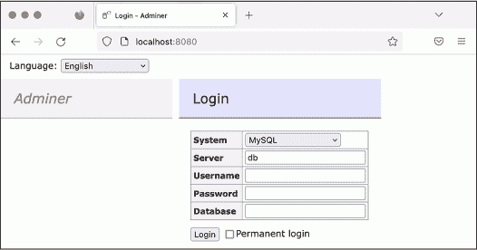
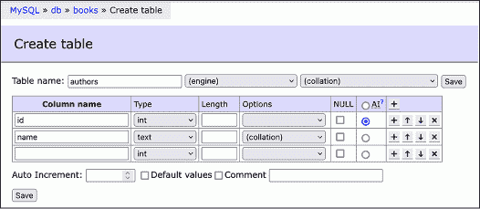
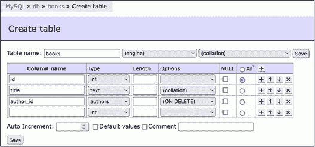
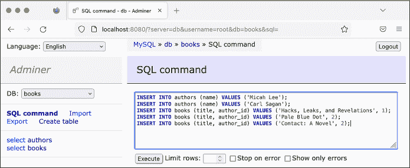
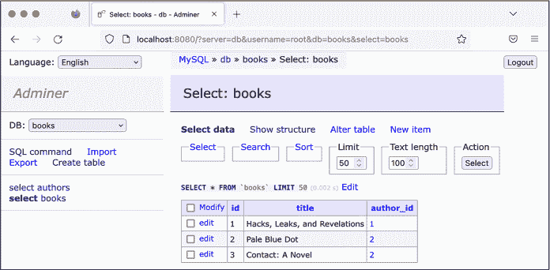
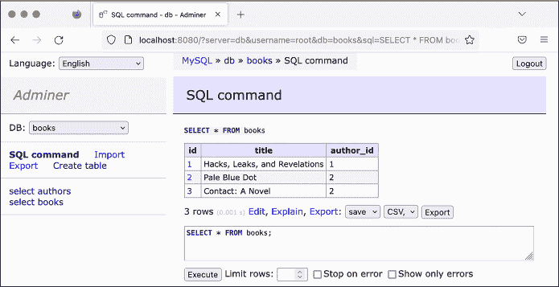
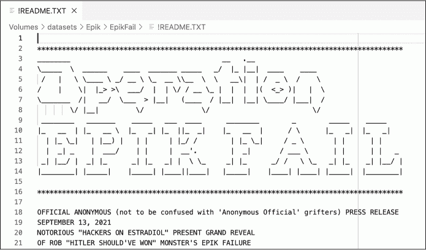

<hgroup>

## <samp class="SANS_Futura_Std_Bold_Condensed_B_11">12</samp> <samp class="SANS_Dogma_OT_Bold_B_11">EPIK 失败、极端主义研究与 SQL 数据库</samp>

</hgroup>

2018 年 10 月下旬的一个星期六早晨，在宾夕法尼亚州匹兹堡，罗伯特·鲍威尔斯在亲法西斯社交网络 Gab 上发布了一条消息。“[希伯来移民援助协会]喜欢引进那些杀害我们人民的侵略者，”他说。“我不能袖手旁观，看着我的人民被屠杀。去你的视角，我要进去了。”他在模仿“伟大替代”阴谋论，这一理论在美国由前福克斯新闻主持人塔克·卡尔森推广，声称犹太人正在用有色移民取代白人。

拿着一把 AR-15 突击步枪和三把 Glock 半自动手枪，鲍威尔斯进入了“生命之树”犹太教堂，那里有三个不同的犹太教会正在举行周六安息日服务，他在这里发动了美国历史上最致命的反犹太恐怖袭击。他杀害了 11 人，另有 6 人受伤，其中包括几位大屠杀幸存者。

那天，几家公司将 Gab 从他们的平台上踢了出去。GoDaddy，这家 Gab 曾用来购买 gab.com 域名的注册商，向 Gab 发送了一封信，称它“发现了你的网站上有大量内容，既宣传又鼓励对人们的暴力行为。”不过，Gab 只下线了几天，这多亏了域名注册商和网站托管公司 Epik，后者很快接管了 gab.com 的注册。

在本章中，你将了解 Epik、它的极端主义客户，以及 2021 年泄露的数百 GB 客户数据的泄露事件。你将下载并学习如何处理其中的大部分数据，这些数据大多数是结构化查询语言（SQL）格式的（通常发音为“sequel”）。SQL 是一种流行的数据库技术，许多网站、在线服务和本地软件都使用它来存储数据。本章重点介绍 MySQL 数据库，这是一种 Epik 使用的 SQL 软件。你还将练习使用名为 MariaDB 的数据库软件，它是 MySQL 的社区维护版本。最后，你将学习如何运行 SQL 服务器（用于托管 SQL 数据库的软件），导入数据，并编写自己的代码来搜索这些数据，这些技能将为你未来调查自己的 SQL 数据集做好准备。

### <samp class="SANS_Futura_Std_Bold_B_11">SQL 数据库的结构</samp>

我在前几章中简要讨论了 SQL 数据库，包括第十章，你在这一章中将 CSV 文件转换成了 BlueLeaks Explorer 的 SQLite 数据库。SQL 数据库有很多类型，包括 PostgreSQL、Microsoft SQL Server、Oracle SQL，以及前面提到的 MySQL 和 SQLite。虽然它们都基于 SQL，但它们之间存在一些小的差异，导致它们并不完全兼容。SQL 数据库很流行，因此 SQL 数据泄露也很常见。

有些 SQL 数据库软件是专有的。例如，Microsoft SQL Server 是微软产品所需的 SQL 版本，并且只能在 Windows 上运行。Oracle 是另一种专有的 SQL 版本；如果你获得了泄露的 Oracle 数据库，你需要使用 Oracle 软件来访问它。PostgreSQL 和 MySQL 是免费且开源的，能够在 Linux 服务器上运行，这使得它们在 web 开发中非常受欢迎且广泛使用。SQLite 也是一个免费的开源 SQL 版本。它无法处理庞大的数据库，但对于小型数据库非常简单且方便——例如，iPhone 和 Android 应用程序经常将其设置存储在 SQLite 数据库中。

> <samp class="SANS_Dogma_OT_Bold_B_21">注意</samp>

*某些数据集可能要求你搭建一个你不熟悉的 SQL 数据库服务器，或者需要弄清楚如何将它们转换成你已经知道的某种 SQL 类型，以便进行分析。我曾经参与过一项调查，调查内容基于一个泄露的中国警方数据库，揭示了中国新疆地区对维吾尔少数民族群体的压迫性监控。它是一个 Oracle 数据库，但不清楚中国警方是否为此支付了费用，或者是盗版使用的。由于 Oracle 是专有软件，* *调查技术人员没有 Oracle 许可证，也没有使用这个版本 SQL 的经验，他们决定将其转换为 PostgreSQL 数据库，以便更轻松地处理数据。阅读全文，请访问* [`theintercept.com/2021/01/29/china-uyghur-muslim-surveillance-police/`](https://theintercept.com/2021/01/29/china-uyghur-muslim-surveillance-police/)*。*

接下来我们将探讨什么是关系型数据库，SQL 服务器通常是如何工作的，以及描述 SQL 数据库及其包含数据的术语。

#### <samp class="SANS_Futura_Std_Bold_Condensed_Oblique_BI_11">关系型数据库</samp>

SQL 数据库由表格组成，你可以把它们看作是包含行列表的电子表格，每一行包含相同的列，或者说是 *字段*。SQL 数据库非常有用，因为它们是 *关系型的*，意味着不同表格中的数据可以相互关联。你在使用 BlueLeaks Explorer 时亲眼看到了这一点：BlueLeaks 文件夹中有单独的电子表格，比如 *Documents.csv* 和 *DocumentCategory.csv*，但一旦你将它们转换为 SQLite 数据库，你就可以依赖 Documents 和 DocumentCategory 表之间的关系，根据类别浏览 BlueLeaks 文档。

让我们来看一个简单的例子：一个包含两张关联表格的数据库，分别是书籍和作者。表 12-1 显示了 <samp class="SANS_TheSansMonoCd_W5Regular_11">authors</samp> 表中存储的信息。

<samp class="SANS_Futura_Std_Heavy_B_11">表 12-1：</samp> <samp class="SANS_Futura_Std_Book_11">作者</samp> <samp class="SANS_TheSansMonoCd_W5Regular_11">表</samp>

| <samp class="SANS_TheSansMonoCd_W7Bold_B_11">id</samp> | <samp class="SANS_TheSansMonoCd_W7Bold_B_11">name</samp> |
| --- | --- |
| <samp class="SANS_TheSansMonoCd_W5Regular_11">1</samp> | <samp class="SANS_TheSansMonoCd_W5Regular_11">Micah Lee</samp> |
| <samp class="SANS_TheSansMonoCd_W5Regular_11">2</samp> | <samp class="SANS_TheSansMonoCd_W5Regular_11">Carl Sagan</samp> |

表 12-2 显示了存储在 <samp class="SANS_TheSansMonoCd_W5Regular_11">books</samp> 表中的信息。

<samp class="SANS_Futura_Std_Heavy_B_11">表 12-2:</samp> <samp class="SANS_Futura_Std_Book_11">书籍</samp> <samp class="SANS_TheSansMonoCd_W5Regular_11">表</samp>

| <samp class="SANS_TheSansMonoCd_W7Bold_B_11">id</samp> | <samp class="SANS_TheSansMonoCd_W7Bold_B_11">title</samp> | <samp class="SANS_TheSansMonoCd_W7Bold_B_11">author_id</samp> |
| --- | --- | --- |
| <samp class="SANS_TheSansMonoCd_W5Regular_11">1</samp> | <samp class="SANS_TheSansMonoCd_W5Regular_11">Hacks, Leaks, and Revelations</samp> | <samp class="SANS_TheSansMonoCd_W5Regular_11">1</samp> |
| <samp class="SANS_TheSansMonoCd_W5Regular_11">2</samp> | <samp class="SANS_TheSansMonoCd_W5Regular_11">Pale Blue Dot</samp> | <samp class="SANS_TheSansMonoCd_W5Regular_11">2</samp> |
| <samp class="SANS_TheSansMonoCd_W5Regular_11">3</samp> | <samp class="SANS_TheSansMonoCd_W5Regular_11">Contact: A Novel</samp> | <samp class="SANS_TheSansMonoCd_W5Regular_11">2</samp> |

每个 SQL 数据库可以包含多个表，并且每个表都有一组定义好的字段。例如，表 12-2 具有 <samp class="SANS_TheSansMonoCd_W5Regular_11">id</samp>、<samp class="SANS_TheSansMonoCd_W5Regular_11">title</samp> 和 <samp class="SANS_TheSansMonoCd_W5Regular_11">author_id</samp> 字段。

每个 SQL 数据库中的表通常都有一个唯一的 <samp class="SANS_TheSansMonoCd_W5Regular_11">id</samp> 字段，该字段会 *自动递增*，意味着当你向表中添加数据行时，第一行会自动被赋予 <samp class="SANS_TheSansMonoCd_W5Regular_11">id</samp> 值为 1，第二行赋予 <samp class="SANS_TheSansMonoCd_W5Regular_11">id</samp> 值为 2，以此类推，从而确保每一行的 <samp class="SANS_TheSansMonoCd_W5Regular_11">id</samp> 都是唯一的。如果 表 12-1 包含两位名为 Micah Lee 的作者，在数据库中就能清楚地看出他们不是同一个人，因为每一行的 ID 值都会不同。

一般来说，表格通过这些唯一的 ID 号码彼此关联。假设你正在浏览<samp class="SANS_TheSansMonoCd_W5Regular_11">books</samp>表格，遇到了*《联系方式：一部小说》*。谁写的？根据它所在行的数据，<samp class="SANS_TheSansMonoCd_W5Regular_11">author_id</samp>是<samp class="SANS_TheSansMonoCd_W5Regular_11">2</samp>。要找出作者是谁，你需要查看<samp class="SANS_TheSansMonoCd_W5Regular_11">authors</samp>表格，找到<samp class="SANS_TheSansMonoCd_W5Regular_11">id</samp>为<samp class="SANS_TheSansMonoCd_W5Regular_11">2</samp>的行，发现作者是卡尔·萨根。

这个例子处理的是少量数据，但 SQL 数据库可能会变得庞大而复杂。例如，除了两个作者，你可能会遇到一个有 1000 万个用户的数据库，以及与之相关的各种表格，使用一个名为<samp class="SANS_TheSansMonoCd_W5Regular_11">user_id</samp>的字段。

#### <samp class="SANS_Futura_Std_Bold_Condensed_Oblique_BI_11">客户端和服务器</samp>

大多数类型的 SQL 数据库是*服务器*软件，这意味着你需要安装 SQL 服务器来保存所有数据。其他计算机则使用 SQL*客户端*与该服务器通信，进行数据查询、添加或更新。这种通信类似于网站的工作方式：网站服务器运行网站软件，而网页浏览器（客户端）则通过远程连接到服务器，加载网页、提交表单等。SQL 客户端通过 SQL 查询与服务器通信，也称为*语句*。类似于英语，SQL 查询以描述执行动作的*动词*开始，并且有进一步描述该动作的*从句*。所有 SQL 查询都以分号(<samp class="SANS_TheSansMonoCd_W5Regular_11">;</samp>)结尾。

每个 SQL 服务器可以托管多个数据库。例如，你可以在同一个 MySQL 服务器上运行 20 个不同的 WordPress 网站，通过让每个网站使用不同的数据库。Epik 数据集包含来自九个不同 MySQL 数据库的数据。如果你下载了所有数据，你可以将这九个数据库导入同一个 MySQL 服务器。由于大部分 Epik 数据是 MySQL 格式，在练习 12-1 中，你将通过 Docker 运行一个 MySQL 服务器。一旦服务器启动，你将稍后通过客户端连接到它，导入数据并开始分析。

在本章中，你将尝试两种不同的 MySQL 客户端：基于 Web 的客户端 Adminer 和 <samp class="SANS_TheSansMonoCd_W5Regular_11">mysql</samp> 命令行客户端，后者允许你从终端与数据库进行交互。对于 MySQL，Adminer 更适合手动浏览 SQL 数据库，但 <samp class="SANS_TheSansMonoCd_W5Regular_11">mysql</samp> 对于在远程服务器上工作和创建或恢复数据库备份特别有用。为了更简单地介绍如何使用客户端，你将在本章的前半部分使用 Adminer，然后转向命令行客户端。所有客户端与服务器的交互方式相同，都是发送 SQL 查询到 SQL 服务器，服务器执行并返回响应。因此，你在使用 Adminer 时学到的技能也适用于 CLI 客户端。

SQL 服务器通常也有用户和权限系统，允许你为某个用户授予访问某些数据库的权限，但不授予其他数据库的权限。MySQL 和其他数据库中的 root 用户对服务器上的所有数据库都有完全访问权限。当你在研究泄露的数据库时，可以以 root 用户身份运行所有搜索，因为通常只有你一个人在使用该服务器。然而，如果你在运行一个可能被陌生人在线访问的数据库，例如由 SQL 数据库支持的网站，那么你应该使用具有受限权限的非 root 数据库用户。这样，如果其中一个陌生人入侵了你的数据库，他们只能访问该特定数据库用户具有权限的内容。

#### <samp class="SANS_Futura_Std_Bold_Condensed_Oblique_BI_11">表格、列和类型</samp>

在 SQL 表格中的每一列只能存储一种数据类型。例如，你可以在 表格 12-2 的 <samp class="SANS_TheSansMonoCd_W5Regular_11">title</samp> 列中存储字符串，但不能存储数字（尽管你可以通过存储数字的字符串表示形式来绕过这一点，例如将字符串 <samp class="SANS_TheSansMonoCd_W5Regular_11">'1'</samp> 存储为代替数字 <samp class="SANS_TheSansMonoCd_W5Regular_11">1</samp>）。

数据类型根据你使用的 SQL 版本略有不同。然而，你通常会看到表示数字、时间或文本字符串的类型。以下列表包含一些常见的 SQL 类型，这些类型在 MySQL 中都是有效的：

<samp class="SANS_TheSansMonoCd_W7Bold_B_11">INT</samp> 整数或整数值

<samp class="SANS_TheSansMonoCd_W7Bold_B_11">DECIMAL</samp> 带有小数位的数字

<samp class="SANS_TheSansMonoCd_W7Bold_B_11">日期</samp> 一个特定的日期

<samp class="SANS_TheSansMonoCd_W7Bold_B_11">DATETIME</samp> 特定日期及其时间

<samp class="SANS_TheSansMonoCd_W7Bold_B_11">VARCHAR</samp> 指定长度的字符字符串

<samp class="SANS_TheSansMonoCd_W7Bold_B_11">文本</samp> 也可以是一个文本字符串

如果 表 12-2 存储在 MySQL 数据库中，<samp class="SANS_TheSansMonoCd_W5Regular_11">id</samp> 字段将是 <samp class="SANS_TheSansMonoCd_W5Regular_11">INT</samp> 类型，<samp class="SANS_TheSansMonoCd_W5Regular_11">title</samp> 字段将是 <samp class="SANS_TheSansMonoCd_W5Regular_11">TEXT</samp> 类型，<samp class="SANS_TheSansMonoCd_W5Regular_11">author_id</samp> 字段将是 <samp class="SANS_TheSansMonoCd_W5Regular_11">INT</samp> 类型。如果你尝试将字符串 <samp class="SANS_TheSansMonoCd_W5Regular_11">"hola"</samp> 存储到 <samp class="SANS_TheSansMonoCd_W5Regular_11">author_id</samp> 字段中，SQL 服务器会返回错误信息，因为数据类型不是整数。

在你的计算机上运行 MariaDB 服务器的最简单方法是使用 Docker 容器，就像你在练习 5-3 中通过 Docker Compose 设置本地 WordPress 网站时做的那样。在接下来的练习中，你将启动 MySQL 服务器，使用 MySQL 客户端连接到新服务器，并练习使用 SQL。

### <samp class="SANS_Futura_Std_Heavy_B_21">练习 12-1：使用 Docker 和 Adminer 创建并测试 MySQL 服务器</samp>

使用 Docker，你可以在你的计算机上快速运行不同类型的 SQL 服务器，无论你使用的是哪个操作系统。在本练习中，你将使用 Docker Compose 在你的计算机上运行 MariaDB 服务器。服务器启动并运行后，你将使用 Adminer MySQL 客户端将 表 12-1 和 12-2 的内容添加到数据库中作为测试。你稍后会在本章中使用真实的泄露数据进行操作，但现在你将从实验一些简单的示例数据库开始。

#### <samp class="SANS_Futura_Std_Bold_Condensed_Oblique_BI_11">运行服务器</samp>

创建一个文件夹用于本章的练习，并在该文件夹中创建一个 *docker-compose.yaml* 文件。将以下代码输入文件中（或者从 [*https://<wbr>github<wbr>.com<wbr>/micahflee<wbr>/hacks<wbr>-leaks<wbr>-and<wbr>-revelations<wbr>/blob<wbr>/main<wbr>/chapter<wbr>-12<wbr>/docker<wbr>-compose<wbr>.yaml*](https://github.com/micahflee/hacks-leaks-and-revelations/blob/main/chapter-12/docker-compose.yaml) 复制粘贴过来）：

```
version: '3.9'

services:

  db:

    image: mariadb:10.9

    environment:

      MARIADB_ROOT_PASSWORD: `this-is-your-root-password`

      MARIADB_ROOT_HOST: "%"

    ports:

      - 3306:3306

    volumes:

      - ./db_data:/var/lib/mysql

 adminer:

    image: adminer

    ports:

      - 8080:8080
```

练习 5-3 中的 *docker-compose.yaml* 文件使用了一个运行 MariaDB 的 <samp class="SANS_TheSansMonoCd_W5Regular_11">db</samp> 服务和一个运行 WordPress 容器的 <samp class="SANS_TheSansMonoCd_W5Regular_11">wordpress</samp> 服务。在那个案例中，<samp class="SANS_TheSansMonoCd_W5Regular_11">wordpress</samp> 服务连接到 <samp class="SANS_TheSansMonoCd_W5Regular_11">db</samp> 服务以执行查询，进而保存和加载网站内容。这个代码使用了一个 <samp class="SANS_TheSansMonoCd_W5Regular_11">adminer</samp> 服务，同样连接到 <samp class="SANS_TheSansMonoCd_W5Regular_11">db</samp> 服务。

该代码提供了 Compose 规范的版本号，该文件是用该版本编写的（<samp class="SANS_TheSansMonoCd_W5Regular_11">3.9</samp>）。接着，它定义了两个服务，并包含了 <samp class="SANS_TheSansMonoCd_W5Regular_11">mariadb</samp> 容器镜像的版本，<samp class="SANS_TheSansMonoCd_W5Regular_11">db</samp> 服务运行的是该镜像。它将数据库根用户的密码设置为 <samp class="SANS_TheSansMonoCd_W5Regular_11">this-is-your-root-password</samp>（如果需要，可以将其更改为其他密码）。如前所述，你将在本章中以数据库的根用户身份工作，因为只有你一个人访问该数据库。它发布了 3306 端口，这意味着你可以通过 *localhost* 上的 MySQL 客户端连接到服务器，端口号为 3306，并且配置了一个卷，将 MariaDB 的所有数据库文件存储在 *db_data* 文件夹中。你将把几个 GB 的数据导入到这个数据库中。

<samp class="SANS_TheSansMonoCd_W5Regular_11">adminer</samp> 服务运行的是最新版本的 <samp class="SANS_TheSansMonoCd_W5Regular_11">adminer</samp> 容器镜像。Adminer 发布了 8080 端口，因此你可以在浏览器中加载 Adminer，地址为 *http://<wbr>localhost:8080*。

打开终端，切换到本章练习的文件夹，并使用以下命令启动容器：

```
**docker-compose up**
```

第一次启动容器时，如果你的电脑尚未下载这些容器镜像，它将从 Docker Hub 下载。当容器启动后，你应该会看到一个包含数据库当前所有数据的 *db_data* 文件夹已被添加到你的 *exercises* 文件夹中。

#### <samp class="SANS_Futura_Std_Bold_Condensed_Oblique_BI_11">使用 Adminer 连接到数据库</samp>

你刚刚启动了两个容器，一个用于 MySQL 服务器，另一个用于 MySQL 客户端 Adminer。现在你将连接到 Adminer 并使用它登录到 MySQL 服务器。要访问 Adminer，请打开浏览器并加载 *http://<wbr>localhost:8080*。你应该会看到显示在 图 12-1 中的 Adminer 登录页面。在这里，你可以选择连接的数据库类型以及用于登录的凭据。将 System 保持为 MySQL，将 Server 设置为 db，将 Username 设置为 **root**，并将 Password 设置为 **this-is-your-root-password**（或你在 *docker-compose.yaml* 文件中使用的密码）。将数据库字段留空，因为你还没有导入任何数据库。

登录后，你应该会看到一个默认数据库列表：<samp class="SANS_TheSansMonoCd_W5Regular_11">information_schema</samp>、<samp class="SANS_TheSansMonoCd_W5Regular_11">mysql</samp>、<samp class="SANS_TheSansMonoCd_W5Regular_11">performance_schema</samp> 和 <samp class="SANS_TheSansMonoCd_W5Regular_11">sys</samp>。MariaDB 使用这些数据库来存储其运行数据库服务器所需的信息，因此通常情况下，你不应该修改它们。相反，你将创建新的数据库并与之进行交互。



<samp class="SANS_Futura_Std_Book_Oblique_I_11">图 12-1：Adminer 登录页面</samp>

#### <samp class="SANS_Futura_Std_Bold_Condensed_Oblique_BI_11">创建测试数据库</samp>

为了测试你的新 MySQL 服务器，你将创建一个全新的数据库，并输入表 12-1 和 12-2。点击**创建数据库**链接，在弹出的字段中输入**books**，然后点击**保存**。一旦创建了 books 数据库，点击**创建表**链接。在表名字段中输入**authors**。

在 Adminer 中添加列时，你需要在“列名”标题下输入列名，并选择数据类型。为了输入表 12-1 中的第一列，创建一个**id**列，并选择类型为**int**（如前所述，表示“整数”）。选中**AI**单选按钮，这样该列就会自动递增。完成后，创建第二列**name**，类型为**text**。

图 12-2 显示了完成后表单的样子。



<samp class="SANS_Futura_Std_Book_Oblique_I_11">图 12-2：在 Adminer 中创建 authors 表</samp>

点击**保存**完成表格在数据库中的创建。Adminer 应该会带你到新表的结构页面，显示你刚刚创建的两个列。你的表应该是空的，尚没有任何行数据。

在窗口顶部，你应该能看到页面导航链接（例如，MySQL▸db▸books，见图 12-2）。点击**books**返回到书籍数据库页面，然后再次点击**创建表**以创建表 12-2，并为其命名为**books**。添加以下列：

+   一个**id**列，类型为**int**，并选中**AI**选项

+   一个**title**列，类型为**text**

+   一个**author_id**列

> <samp class="SANS_Dogma_OT_Bold_B_21">注意</samp>

*Adminer 足够智能，可以自动判断 author_id 列使用的是 <samp class="SANS_TheSansMonoCd_W5Regular_Italic_I_11">int</samp> 类型，并与 authors.id 列相关联，因此它会自动将类型设置为 <samp class="SANS_TheSansMonoCd_W5Regular_Italic_I_11">authors</samp>。*

图 12-3 显示了添加这些列后表单的样子。



<samp class="SANS_Futura_Std_Book_Oblique_I_11">图 12-3：在 Adminer 中创建 books 表</samp>

点击 **保存**。你现在已经创建了一个 <samp class="SANS_TheSansMonoCd_W5Regular_11">books</samp> 数据库，包含两个表：<samp class="SANS_TheSansMonoCd_W5Regular_11">authors</samp> 和 <samp class="SANS_TheSansMonoCd_W5Regular_11">books</samp>，但其中还没有任何数据。

现在你已经在电脑上运行了一个 MySQL 数据库，并且可以访问 Adminer MySQL 客户端，你已经准备好运行自己的 SQL 查询。你的第一个查询将把 表格 12-1 和 12-2 中的数据添加到相应的 MySQL 表中。

### <samp class="SANS_Futura_Std_Heavy_B_21">练习 12-2：查询你的 SQL 数据库</samp>

在本练习中，你将学习 SQL 查询的语法。你将使用 MySQL，但其语法与所有其他类型的 SQL 基本相同，因此本节应该为你编写 SQL 查询打下坚实的基础。你将学习不同的动词，并通过实践运行 SQL 查询来添加、更新、删除，最重要的是，查询 SQL 数据库中的数据。

确保你在练习 12-1 中的 Docker 容器已启动，然后在浏览器中加载 Adminer，地址为 *http://<wbr>localhost:8080*。同时确保你已经以 root 用户身份登录到 MySQL 服务器，使用的是上一个练习中的密码。当你准备好后，点击 **books** 数据库以开始。

#### <samp class="SANS_Futura_Std_Bold_Condensed_Oblique_BI_11">INSERT 语句</samp>

到目前为止，你在练习 12-1 中创建的 <samp class="SANS_TheSansMonoCd_W5Regular_11">books</samp> 数据库包含了 <samp class="SANS_TheSansMonoCd_W5Regular_11">authors</samp> 和 <samp class="SANS_TheSansMonoCd_W5Regular_11">books</samp> 表，但这些表中没有任何行。

要向你的表格中添加新行，可以使用以下的 <samp class="SANS_TheSansMonoCd_W5Regular_11">INSERT</samp> 动词：

```
INSERT INTO `table_name` (`column1`, `column2`, `...`) VALUES (`value1`, `value2`, `...`);
```

在 Adminer 中，点击左侧边栏的 **SQL Command** 链接。在弹出的空白字段中，输入以下 <samp class="SANS_TheSansMonoCd_W5Regular_11">INSERT</samp> 查询：

```
INSERT INTO authors (name) VALUES ('Micah Lee');

INSERT INTO authors (name) VALUES ('Carl Sagan');

INSERT INTO books (title, author_id) VALUES ('Hacks, Leaks, and Revelations', 1);

INSERT INTO books (title, author_id) VALUES ('Pale Blue Dot', 2);

INSERT INTO books (title, author_id) VALUES ('Contact: A Novel', 2);
```

这些命令一次性将所有行插入到数据库中的两个表中。前两行将行插入到 <samp class="SANS_TheSansMonoCd_W5Regular_11">authors</samp> 表中，仅设置 <samp class="SANS_TheSansMonoCd_W5Regular_11">name</samp> 字段，而最后三行将行插入到 <samp class="SANS_TheSansMonoCd_W5Regular_11">books</samp> 表中，设置 <samp class="SANS_TheSansMonoCd_W5Regular_11">title</samp> 和 <samp class="SANS_TheSansMonoCd_W5Regular_11">author_id</samp> 字段。这些 <samp class="SANS_TheSansMonoCd_W5Regular_11">INSERT</samp> 语句没有指定 <samp class="SANS_TheSansMonoCd_W5Regular_11">id</samp> 值，因为两个表的 <samp class="SANS_TheSansMonoCd_W5Regular_11">id</samp> 字段会自动递增，从 <samp class="SANS_TheSansMonoCd_W5Regular_11">1</samp> 开始。

虽然在插入到 <samp class="SANS_TheSansMonoCd_W5Regular_11">books</samp> 表时你不需要设置 <samp class="SANS_TheSansMonoCd_W5Regular_11">id</samp> 字段，但你确实需要手动设置 <samp class="SANS_TheSansMonoCd_W5Regular_11">author_id</samp> 字段，这样你就能告诉数据库每本书的作者是谁。由于 <samp class="SANS_TheSansMonoCd_W5Regular_11">authors</samp> 表最初为空，因此 <samp class="SANS_TheSansMonoCd_W5Regular_11">Micah Lee</samp> 的作者行应该有一个 <samp class="SANS_TheSansMonoCd_W5Regular_11">id</samp> 为 <samp class="SANS_TheSansMonoCd_W5Regular_11">1</samp>（因为它是表中添加的第一行），而 <samp class="SANS_TheSansMonoCd_W5Regular_11">Carl Sagan</samp> 的行应该有一个 <samp class="SANS_TheSansMonoCd_W5Regular_11">id</samp> 为 <samp class="SANS_TheSansMonoCd_W5Regular_11">2</samp>。当代码插入 <samp class="SANS_TheSansMonoCd_W5Regular_11">Hacks, Leaks, and Revelations</samp> 这一书名时，它将 <samp class="SANS_TheSansMonoCd_W5Regular_11">author_id</samp> 设置为 <samp class="SANS_TheSansMonoCd_W5Regular_11">1</samp>，当它插入 Carl Sagan 的两本书时，它将 <samp class="SANS_TheSansMonoCd_W5Regular_11">author_id</samp> 设置为 <samp class="SANS_TheSansMonoCd_W5Regular_11">2</samp>。

> <samp class="SANS_Dogma_OT_Bold_B_21">注意</samp>

*在本章中，我将 SQL 关键字如 <samp class="SANS_TheSansMonoCd_W5Regular_Italic_I_11">INSERT</samp> 和 <samp class="SANS_TheSansMonoCd_W5Regular_Italic_I_11">WHERE</samp> 写成全大写，但这样做仅仅是一种流行的约定。SQL 关键字不区分大小写，因此你也可以使用 <samp class="SANS_TheSansMonoCd_W5Regular_Italic_I_11">insert</samp>、<samp class="SANS_TheSansMonoCd_W5Regular_Italic_I_11">where</samp>、<samp class="SANS_TheSansMonoCd_W5Regular_Italic_I_11">select</samp> 等形式。*

图 12-4 显示了通过运行这五个 <samp class="SANS_TheSansMonoCd_W5Regular_11">INSERT</samp> 查询将数据插入到 <samp class="SANS_TheSansMonoCd_W5Regular_11">authors</samp> 和 <samp class="SANS_TheSansMonoCd_W5Regular_11">books</samp> 表中的过程。



<samp class="SANS_Futura_Std_Book_Oblique_I_11">图 12-4：在 Adminer 中运行 INSERT 查询</samp>

一旦你将这一系列 SQL 查询输入到 Adminer 中，点击**执行**来运行它们，这应该会将所有这些行插入到你的数据库中。点击左侧边栏中的**选择**以查看数据库中的新数据。图 12-5 显示了 Adminer 中 <samp class="SANS_TheSansMonoCd_W5Regular_11">books</samp> 表中的所有行。



<samp class="SANS_Futura_Std_Book_Oblique_I_11">图 12-5：在 Adminer 中查看 books 表中的行</samp>

在 图 12-5 的数据表格正上方，你可以看到这一行：<samp class="SANS_TheSansMonoCd_W5Regular_11">SELECT * from 'books' LIMIT 50</samp> <samp class="SANS_TheSansMonoCd_W5Regular_11">(0.0002 s)</samp>，这是 Adminer 执行的 SQL 语句，用于从 MySQL 数据库中检索这些数据，后面跟着查询执行所花费的时间。

#### <samp class="SANS_Futura_Std_Bold_Condensed_Oblique_BI_11">SELECT 语句</samp>

当 <samp class="SANS_TheSansMonoCd_W5Regular_11">INSERT</samp> 语句向 SQL 数据库添加信息时，<samp class="SANS_TheSansMonoCd_W5Regular_11">SELECT</samp> 语句则是从数据库请求特定信息。在调查泄露的 SQL 数据库时，你很可能会花费大部分时间编写 <samp class="SANS_TheSansMonoCd_W5Regular_11">SELECT</samp> 语句。

你可以使用 <samp class="SANS_TheSansMonoCd_W5Regular_11">SELECT</samp> 语句来选择某位作者的所有书籍，或者在 Epik 数据的情况下，选择某个人注册的所有域名。以下是一般的语法：

```
SELECT `column1`, `column2`, `...` FROM `table_name` WHERE `condition` ORDER BY `column1, column2, ...`;
```

当你的 SQL 客户端运行 <samp class="SANS_TheSansMonoCd_W5Regular_11">SELECT</samp> 语句时，SQL 服务器将返回一个数据表。要选择 <samp class="SANS_TheSansMonoCd_W5Regular_11">books</samp> 表中的所有内容，请点击 Adminer 左侧边栏中的 **SQL Command** 链接，并运行以下查询：

```
SELECT * FROM books;
```

这个命令使用星号 (<samp class="SANS_TheSansMonoCd_W5Regular_11">*</samp>) 作为通配符字符，这意味着你希望返回的数据包括所有列。它还省略了 <samp class="SANS_TheSansMonoCd_W5Regular_11">WHERE</samp> 子句，因此它将包含 <samp class="SANS_TheSansMonoCd_W5Regular_11">books</samp> 表中的所有行，而不对其进行过滤。图 12-6 显示了 Adminer 中的这些结果。



<samp class="SANS_Futura_Std_Book_Oblique_I_11">图 12-6：在 Adminer 中运行 SELECT 查询</samp>

在运行 <samp class="SANS_TheSansMonoCd_W5Regular_11">SELECT</samp> 查询后，点击 Adminer 中的 **Export** 链接，将返回的数据导出为 CSV 电子表格。第一个下拉菜单中的选项有 *open*，允许你在浏览器中直接打开 CSV；*save*，用于下载 CSV；以及 *gzip*，允许你下载压缩版的 CSV。第二个下拉菜单中的三个选项则允许你将文件保存为以逗号、分号或制表符分隔的数据。

你可以在像 Microsoft Excel 或 LibreOffice Calc 这样的软件中打开通过这种方式创建的电子表格，并使用这些软件对数据进行操作。这使得与同事共享数据或使用高级功能（如可视化数据）变得更加容易。

##### <samp class="SANS_Futura_Std_Bold_Condensed_B_11">选择单独字段</samp>

你之前运行了 <samp class="SANS_TheSansMonoCd_W5Regular_11">SELECT * FROM</samp> <samp class="SANS_TheSansMonoCd_W5Regular_Italic_I_11">table_name</samp> 查询来选择表中的所有列，但你也可以只选择特定的列。假设你只想返回表中的书名列表，可以使用以下查询单独选择 <samp class="SANS_TheSansMonoCd_W5Regular_11">title</samp> 字段：

```
SELECT title FROM books;
```

这个表格不包括所有列，只包含书籍标题。SQL 服务器应返回如表 12-3 所示的结果。（为了简便起见，本节中，SQL 查询返回的信息我将以文本表格形式展示，而非 Adminer 截图。）

<samp class="SANS_Futura_Std_Heavy_B_11">表 12-3：</samp> <samp class="SANS_Futura_Std_Book_11">书籍</samp> <samp class="SANS_TheSansMonoCd_W5Regular_11">title</samp> <samp class="SANS_Futura_Std_Book_11">列</samp>

| <samp class="SANS_TheSansMonoCd_W7Bold_B_11">title</samp> |
| --- |
| <samp class="SANS_TheSansMonoCd_W5Regular_11">黑客、泄密与启示</samp> |
| <samp class="SANS_TheSansMonoCd_W5Regular_11">苍白蓝点</samp> |
| <samp class="SANS_TheSansMonoCd_W5Regular_11">联系方式：一部小说</samp> |

当你处理更大的数据库时，最好只选择你需要的列，这样查询会更快完成。

##### <samp class="SANS_Futura_Std_Bold_Condensed_B_11">排序结果</samp>

使用 <samp class="SANS_TheSansMonoCd_W5Regular_11">ORDER BY</samp> 子句来对查询结果进行排序。例如，要选择 <samp class="SANS_TheSansMonoCd_W5Regular_11">books</samp> 表中的所有列，并按书名排序，可以运行以下查询：

```
SELECT * FROM books ORDER BY title;
```

这个查询的结果将按标题列按字母顺序排列，如表 12-4 所示。

<samp class="SANS_Futura_Std_Heavy_B_11">表 12-4：</samp> <samp class="SANS_Futura_Std_Book_11">所有列，按</samp> <samp class="mono">title</samp> <samp class="SANS_Futura_Std_Book_11">列排序</samp>

| <samp class="SANS_TheSansMonoCd_W7Bold_B_11">id</samp> | <samp class="SANS_TheSansMonoCd_W7Bold_B_11">title</samp> | <samp class="SANS_TheSansMonoCd_W7Bold_B_11">author_id</samp> |
| --- | --- | --- |
| <samp class="SANS_TheSansMonoCd_W5Regular_11">3</samp> | <samp class="SANS_TheSansMonoCd_W5Regular_11">联系方式：一部小说</samp> | <samp class="SANS_TheSansMonoCd_W5Regular_11">2</samp> |
| <samp class="SANS_TheSansMonoCd_W5Regular_11">1</samp> | <samp class="SANS_TheSansMonoCd_W5Regular_11">黑客、泄密与启示</samp> | <samp class="SANS_TheSansMonoCd_W5Regular_11">1</samp> |
| <samp class="SANS_TheSansMonoCd_W5Regular_11">2</samp> | <samp class="SANS_TheSansMonoCd_W5Regular_11">Pale Blue Dot</samp> | <samp class="SANS_TheSansMonoCd_W5Regular_11">2</samp> |

默认情况下，结果按升序排序：文本字段按字母顺序排序；数字字段按从小到大的顺序排序；日期字段按从早到晚的顺序排序。你可以使用 <samp class="SANS_TheSansMonoCd_W5Regular_11">DESC</samp> 关键字将结果按降序排序。例如，使用以下查询按 <samp class="SANS_TheSansMonoCd_W5Regular_11">title</samp> 列以逆字母顺序选择所有书籍：

```
SELECT * from books ORDER BY title DESC;
```

你还可以按多个列排序结果。例如，首先按 <samp class="SANS_TheSansMonoCd_W5Regular_11">author_id</samp> 排序（这样结果中会先显示作者 1 的所有书籍，然后是作者 2 的书籍，依此类推），然后按 <samp class="SANS_TheSansMonoCd_W5Regular_11">title</samp> 排序（这样每位作者的书籍将在书单内按标题排序），执行以下查询：

```
SELECT * from books ORDER BY author_id, title;
```

这将按 <samp class="SANS_TheSansMonoCd_W5Regular_11">author_id</samp> 排序结果，然后按 <samp class="SANS_TheSansMonoCd_W5Regular_11">title</samp> 排序，如 表 12-5 所示。

<samp class="SANS_Futura_Std_Heavy_B_11">表 12-5：</samp> <samp class="SANS_Futura_Std_Book_11">书籍表中的所有列，按</samp> <samp class="mono">author_id</samp> <samp class="SANS_Futura_Std_Book_11">和</samp> <samp class="SANS_TheSansMonoCd_W5Regular_11">title</samp> <samp class="SANS_Futura_Std_Book_11">排序</samp>

| <samp class="SANS_TheSansMonoCd_W7Bold_B_11">id</samp> | <samp class="SANS_TheSansMonoCd_W7Bold_B_11">title</samp> | <samp class="SANS_TheSansMonoCd_W7Bold_B_11">author_id</samp> |
| --- | --- | --- |
| <samp class="SANS_TheSansMonoCd_W5Regular_11">1</samp> | <samp class="SANS_TheSansMonoCd_W5Regular_11">Hacks, Leaks, and Revelations</samp> | <samp class="SANS_TheSansMonoCd_W5Regular_11">1</samp> |
| <samp class="SANS_TheSansMonoCd_W5Regular_11">3</samp> | <samp class="SANS_TheSansMonoCd_W5Regular_11">Contact: A Novel</samp> | <samp class="SANS_TheSansMonoCd_W5Regular_11">2</samp> |
| <samp class="SANS_TheSansMonoCd_W5Regular_11">2</samp> | <samp class="SANS_TheSansMonoCd_W5Regular_11">Pale Blue Dot</samp> | <samp class="SANS_TheSansMonoCd_W5Regular_11">2</samp> |

在这种情况下，首先显示作者 <samp class="SANS_TheSansMonoCd_W5Regular_11">author_id</samp> 为 <samp class="SANS_TheSansMonoCd_W5Regular_11">1</samp>（Micah Lee）的所有书籍，接着显示作者 <samp class="SANS_TheSansMonoCd_W5Regular_11">author_id</samp> 为 <samp class="SANS_TheSansMonoCd_W5Regular_11">2</samp>（Carl Sagan）的书籍。每位作者的书籍将按 <samp class="SANS_TheSansMonoCd_W5Regular_11">title</samp> 字母顺序排序。

##### <samp class="SANS_Futura_Std_Bold_Condensed_B_11">计算表中的行数</samp>

SQL 数据库有内置函数，可以作为查询的一部分运行。例如，要查找 <samp class="SANS_TheSansMonoCd_W5Regular_11">books</samp> 表中的行数，可以使用 <samp class="SANS_TheSansMonoCd_W5Regular_11">COUNT()</samp> 函数：

```
SELECT COUNT(*) FROM books;
```

运行此命令后，SQL 服务器应返回表 12-6 中显示的结果。

<samp class="SANS_Futura_Std_Heavy_B_11">表 12-6:</samp> <samp class="SANS_Futura_Std_Book_11">统计</samp> <samp class="SANS_TheSansMonoCd_W5Regular_11">books</samp> <samp class="SANS_Futura_Std_Book_11">表中的行数</samp>

| <samp class="SANS_TheSansMonoCd_W7Bold_B_11">COUNT(*)</samp> |
| --- |
| <samp class="SANS_TheSansMonoCd_W5Regular_11">3</samp> |

从表中选择 <samp class="SANS_TheSansMonoCd_W5Regular_11">COUNT(*)</samp> 比选择表中的所有行然后再计数要快得多。

##### <samp class="SANS_Futura_Std_Bold_Condensed_B_11">使用 WHERE 子句筛选 SELECT 结果</samp>

你还可以使用 <samp class="SANS_TheSansMonoCd_W5Regular_11">WHERE</samp> 子句来过滤返回的结果。例如，要查找 Micah Lee 所写书籍的标题，运行以下查询：

```
SELECT title FROM books WHERE author_id=1;
```

SQL 服务器应返回表 12-7 中显示的结果。

<samp class="SANS_Futura_Std_Heavy_B_11">表 12-7:</samp> <samp class="SANS_Futura_Std_Book_11">书籍的</samp> <samp class="SANS_TheSansMonoCd_W5Regular_11">标题</samp> <samp class="SANS_Futura_Std_Book_11">当</samp> <samp class="SANS_TheSansMonoCd_W5Regular_11">作者</samp> <samp class="SANS_Futura_Std_Book_11">是</samp> <samp class="SANS_TheSansMonoCd_W5Regular_11">Micah Lee</samp>

| <samp class="SANS_TheSansMonoCd_W7Bold_B_11">title</samp> |
| --- |
| <samp class="SANS_TheSansMonoCd_W5Regular_11">Hacks, Leaks, and Revelations</samp> |

类似于 Python 的 <samp class="SANS_TheSansMonoCd_W5Regular_11">if</samp> 语句，<samp class="SANS_TheSansMonoCd_W5Regular_11">WHERE</samp> 子句也支持括号和布尔逻辑运算符 <samp class="SANS_TheSansMonoCd_W5Regular_11">AND</samp> 和 <samp class="SANS_TheSansMonoCd_W5Regular_11">OR</samp>，以及大于（<samp class="SANS_TheSansMonoCd_W5Regular_11">></samp>）、大于或等于（<samp class="SANS_TheSansMonoCd_W5Regular_11">>=</samp>）、小于（<samp class="SANS_TheSansMonoCd_W5Regular_11"><</samp>）和小于或等于（<samp class="SANS_TheSansMonoCd_W5Regular_11"><=</samp>）的比较运算符。例如，假设你想查找 `id` 在 10 和 100 之间的书籍，包括 10 但不包括 100。尝试以下查询：

```
SELECT * FROM books WHERE id >= 10 AND id < 100;
```

你可以使用等号（<samp class="SANS_TheSansMonoCd_W5Regular_11">=</samp>）操作符来搜索精确字符串。例如，运行以下命令以查找所有名为 Carl Sagan 的作者：

```
SELECT * FROM authors WHERE name='Carl Sagan';
```

该搜索区分大小写，因此虽然它会找到名为 Carl Sagan 的作者，但找不到名为 CARL SAGAN 或 carl sagan 的作者。要进行不区分大小写的搜索，请使用 <samp class="SANS_TheSansMonoCd_W5Regular_11">LIKE</samp> 操作符。尝试运行以下命令：

```
SELECT * FROM authors WHERE name LIKE 'carl sagan';
```

该命令可以找到名为 Carl Sagan、CARL SAGAN、carl sagan 或任何其他大小写组合的作者。

<samp class="SANS_TheSansMonoCd_W5Regular_11">LIKE</samp> 操作符支持通配符字符百分号 (<samp class="SANS_TheSansMonoCd_W5Regular_11">%</samp>)，该字符可以匹配任意字符。查询 <samp class="SANS_TheSansMonoCd_W5Regular_11">authors</samp> 表，其中 <samp class="SANS_TheSansMonoCd_W5Regular_11">name LIKE '%lee%'</samp> 会搜索出 <samp class="SANS_TheSansMonoCd_W5Regular_11">name</samp> 中包含任意字符（<samp class="SANS_TheSansMonoCd_W5Regular_11">%</samp>），接着是 <samp class="SANS_TheSansMonoCd_W5Regular_11">lee</samp>，后面跟着任意字符（<samp class="SANS_TheSansMonoCd_W5Regular_11">%</samp>）。例如，要查找所有名字中包含 Lee 的作者，运行：

```
SELECT * FROM authors WHERE name LIKE '%lee%';
```

该查询返回名为 <samp class="SANS_TheSansMonoCd_W5Regular_11">Micah Lee</samp> 的行，但它也会返回 Stan Lee、Lee Young-ae 和 Andrea Leeds。

如果只想查找姓氏为 Lee 的人，运行以下查询：

```
SELECT * FROM authors WHERE name LIKE '% lee';
```

在这种情况下，字符串的开头只有一个通配符字符，后面是一个空格，再后面是 <samp class="SANS_TheSansMonoCd_W5Regular_11">lee</samp>。该查询将返回 Stan Lee，因为这个名字匹配任意字符，后面跟着一个空格，再接着是 <samp class="SANS_TheSansMonoCd_W5Regular_11">lee</samp>。但是，它不会返回 Lee Young-ae；这个名字匹配任意字符，但没有空格跟着 <samp class="SANS_TheSansMonoCd_W5Regular_11">lee</samp>，并且在 <samp class="SANS_TheSansMonoCd_W5Regular_11">lee</samp> 后有额外字符。

使用逻辑操作符，你可以结合任意多个条件。例如，要查找由 Carl Sagan 编写且书名中含有 *blue* 的书籍，运行以下查询：

```
SELECT * FROM books WHERE author_id=2 AND title LIKE '%blue%';
```

你可以在该查询基础上扩展，运行以下查询，同时检查书名中是否包含 *green* 或 *red*：

```
SELECT *

FROM books

WHERE

    author_id=2 AND

    (

        title LIKE '%red%' OR

        title LIKE '%green%' OR

        title LIKE '%blue%'

    );
```

这个查询使用了逻辑运算符 <samp class="SANS_TheSansMonoCd_W5Regular_11">AND</samp> 和 <samp class="SANS_TheSansMonoCd_W5Regular_11">OR</samp>，以及括号。当你运行它时，SQL 服务器会拒绝任何 <samp class="SANS_TheSansMonoCd_W5Regular_11">author_id</samp> 不等于 <samp class="SANS_TheSansMonoCd_W5Regular_11">2</samp>，并且 <samp class="SANS_TheSansMonoCd_W5Regular_11">title</samp> 中不包含字符串 <samp class="SANS_TheSansMonoCd_W5Regular_11">red</samp>、<samp class="SANS_TheSansMonoCd_W5Regular_11">green</samp> 或 <samp class="SANS_TheSansMonoCd_W5Regular_11">blue</samp> 的行。

这个最终的查询有多行，其中一些行进行了缩进。随着查询的变长，使用这样的空白字符可以让你的 SQL 查询更易读。一般来说，我倾向于将短查询写在一行上，将较长的查询拆分成多行。在接下来的章节中，你将继续缩进你的查询。

你现在应该对如何从 SQL 数据库中的表格选择数据有了基本的了解。在接下来的章节中，你将学习如何一次性从多个表格中选择数据。

#### <samp class="SANS_Futura_Std_Bold_Condensed_Oblique_BI_11">JOIN 子句</samp>

因为 SQL 数据库是关系型的，你可以通过使用 <samp class="SANS_TheSansMonoCd_W5Regular_11">JOIN</samp> 子句同时从多个表格中选择数据并接收结果。你可以将这些子句视为 SQL 服务器将多个表格合并（连接）为一个表格，然后从该合并后的表格中选择行。

例如，假设你想编写一个查询，返回一本书的书名及其作者，依赖于 <samp class="SANS_TheSansMonoCd_W5Regular_11">books</samp> 表中的 <samp class="SANS_TheSansMonoCd_W5Regular_11">title</samp> 字段和 <samp class="SANS_TheSansMonoCd_W5Regular_11">authors</samp> 表中的 <samp class="SANS_TheSansMonoCd_W5Regular_11">name</samp> 字段。运行 Listing 12-1 中的查询，即可一次性从这两个表格的字段中选择结果。

```
SELECT

    books.title,

    authors.name

FROM books

JOIN authors ON books.author_id = authors.id;
```

<samp class="SANS_Futura_Std_Book_Oblique_I_11">Listing 12-1：使用 <samp class="SANS_TheSansMonoCd_W5Regular_Italic_I_11">JOIN</samp> 子句从 <samp class="SANS_TheSansMonoCd_W5Regular_Italic_I_11">books</samp> 和 <samp class="SANS_TheSansMonoCd_W5Regular_Italic_I_11">authors</samp> 表中选择数据</samp>

由于此查询涉及多个表，您必须以 <samp class="SANS_TheSansMonoCd_W5Regular_Italic_I_11">table_name.column_name</samp> 的格式指定要选择的列名。该 SQL 查询使用 <samp class="SANS_TheSansMonoCd_W5Regular_11">books.title</samp> 选择书名，并使用 <samp class="SANS_TheSansMonoCd_W5Regular_11">authors.name</samp> 选择作者姓名。<samp class="SANS_TheSansMonoCd_W5Regular_11">FROM</samp> 子句显示此查询是从 <samp class="SANS_TheSansMonoCd_W5Regular_11">books</samp> 表中选择数据，并将该表与 <samp class="SANS_TheSansMonoCd_W5Regular_11">authors</samp> 表连接。<samp class="SANS_TheSansMonoCd_W5Regular_11">JOIN</samp> 子句解释了这两个表之间的关系：SQL 服务器知道，若 <samp class="SANS_TheSansMonoCd_W5Regular_11">books.author_id</samp> 的值与 <samp class="SANS_TheSansMonoCd_W5Regular_11">authors.id</samp> 的值匹配，则一个 <samp class="SANS_TheSansMonoCd_W5Regular_11">books</samp> 行与一个 <samp class="SANS_TheSansMonoCd_W5Regular_11">authors</samp> 行相关联。

当您运行此查询时，SQL 数据库使用 <samp class="SANS_TheSansMonoCd_W5Regular_11">books.author_id = authors.id</samp> 关系，这个关系在 <samp class="SANS_TheSansMonoCd_W5Regular_11">JOIN</samp> 子句中指定，用来构建 表 12-8 中显示的合并表，随后从中选择数据行。

<samp class="SANS_Futura_Std_Heavy_B_11">表 12-8：</samp> <samp class="SANS_Futura_Std_Book_11">books</samp> <samp class="SANS_Futura_Std_Book_11">和</samp> <samp class="SANS_TheSansMonoCd_W5Regular_11">authors</samp> <samp class="SANS_Futura_Std_Book_11">表，按</samp> <samp class="SANS_TheSansMonoCd_W5Regular_11">books.author_id</samp> <samp class="SANS_TheSansMonoCd_W5Regular_11">=</samp> <samp class="SANS_TheSansMonoCd_W5Regular_11">authors.id</samp> 进行合并

| <samp class="SANS_TheSansMonoCd_W7Bold_B_11">books.id</samp> | <samp class="SANS_TheSansMonoCd_W7Bold_B_11">books.author_id</samp> | <samp class="SANS_TheSansMonoCd_W7Bold_B_11">books.title</samp> | <samp class="SANS_TheSansMonoCd_W7Bold_B_11">authors.id</samp> | <samp class="SANS_TheSansMonoCd_W7Bold_B_11">authors.name</samp> |
| --- | --- | --- | --- | --- |
| <samp class="SANS_TheSansMonoCd_W5Regular_11">1</samp> | <samp class="SANS_TheSansMonoCd_W5Regular_11">1</samp> | <samp class="SANS_TheSansMonoCd_W5Regular_11">Hacks, Leaks, and Revelations</samp> | <samp class="SANS_TheSansMonoCd_W5Regular_11">1</samp> | <samp class="SANS_TheSansMonoCd_W5Regular_11">Micah Lee</samp> |
| <samp class="SANS_TheSansMonoCd_W5Regular_11">2</samp> | <samp class="SANS_TheSansMonoCd_W5Regular_11">2</samp> | <samp class="SANS_TheSansMonoCd_W5Regular_11">苍白蓝点</samp> | <samp class="SANS_TheSansMonoCd_W5Regular_11">2</samp> | <samp class="SANS_TheSansMonoCd_W5Regular_11">卡尔·萨根</samp> |
| <samp class="SANS_TheSansMonoCd_W5Regular_11">3</samp> | <samp class="SANS_TheSansMonoCd_W5Regular_11">2</samp> | <samp class="SANS_TheSansMonoCd_W5Regular_11">接触：小说</samp> | <samp class="SANS_TheSansMonoCd_W5Regular_11">2</samp> | <samp class="SANS_TheSansMonoCd_W5Regular_11">卡尔·萨根</samp> |

该合并表中的每一行包含了来自《书籍》表和《作者》表的所有列。首先，请注意每一行中`books.author_id`的值与`authors.id`的值是相同的。这是因为在`JOIN`子句中指定了`books.author_id = authors.id`的关系。在每一行中，书籍字段包含来自《书籍》表的完整行，作者字段包含来自《作者》表的完整行。由于卡尔·萨根在这个数据库中有两本书，所以他的书籍占据了合并表中的两行。

在列表 12-1 中的`SELECT`查询从这个合并表中选择了`books.title`和`authors.name`这两列。查询的最终结果应包含表 12-9 中的信息。

<samp class="SANS_Futura_Std_Heavy_B_11">表 12-9：</samp> <samp class="SANS_Futura_Std_Book_11">来自列表 12-1 的查询结果</samp>

| <samp class="SANS_TheSansMonoCd_W7Bold_B_11">标题</samp> | <samp class="SANS_TheSansMonoCd_W7Bold_B_11">作者</samp> |
| --- | --- |
| <samp class="SANS_TheSansMonoCd_W5Regular_11">黑客、泄露与启示</samp> | <samp class="SANS_TheSansMonoCd_W5Regular_11">米卡·李</samp> |
| <samp class="SANS_TheSansMonoCd_W5Regular_11">苍白蓝点</samp> | <samp class="SANS_TheSansMonoCd_W5Regular_11">卡尔·萨根</samp> |
| <samp class="SANS_TheSansMonoCd_W5Regular_11">接触：小说</samp> | <samp class="SANS_TheSansMonoCd_W5Regular_11">卡尔·萨根</samp> |

SQL 服务器根据 <samp class="SANS_TheSansMonoCd_W5Regular_11">books.author_id</samp> <samp class="SANS_TheSansMonoCd_W5Regular_11">=</samp> <samp class="SANS_TheSansMonoCd_W5Regular_11">authors.id</samp> 关系（在 <samp class="SANS_TheSansMonoCd_W5Regular_11">JOIN</samp> 子句中指定）响应一个包含来自两个表的字段的单个行表。

本节中描述的连接类型在技术上称为 <samp class="SANS_TheSansMonoCd_W5Regular_11">INNER JOIN</samp>，这是 MySQL 中的默认连接类型。除了 <samp class="SANS_TheSansMonoCd_W5Regular_11">INNER</samp> 连接外，你还可以使用 <samp class="SANS_TheSansMonoCd_W5Regular_11">LEFT</samp> 和 <samp class="SANS_TheSansMonoCd_W5Regular_11">RIGHT</samp> 连接。

##### <samp class="SANS_Futura_Std_Bold_Condensed_B_11">使用 LEFT 和 RIGHT 连接</samp>

SQL 中还有两种额外的连接表的方法：<samp class="SANS_TheSansMonoCd_W5Regular_11">LEFT JOIN</samp> 和 <samp class="SANS_TheSansMonoCd_W5Regular_11">RIGHT JOIN</samp> 查询。每次连接两个表时，你选择的表是“左”表（在上一个例子中是 <samp class="SANS_TheSansMonoCd_W5Regular_11">books</samp>）。你连接的表是“右”表（在本例中是 <samp class="SANS_TheSansMonoCd_W5Regular_11">authors</samp>）。<samp class="SANS_TheSansMonoCd_W5Regular_11">LEFT JOIN</samp> 表示合并的表应包含左表中的所有行，但不一定包含右表中的所有行。正如你可能猜到的，<samp class="SANS_TheSansMonoCd_W5Regular_11">RIGHT JOIN</samp> 表示合并的表应包含右表中的所有行，但不一定包含左表中的行。最后，正如你在前面一节中看到的，<samp class="SANS_TheSansMonoCd_W5Regular_11">INNER JOIN</samp> 表示结果应仅包含关系成立的行。也就是说，如果左表中有任何行与右表中的行不匹配，反之亦然——根据连接关系，这些行将不会包含在结果中。

为了演示这个过程，使用以下查询将一行添加到 <samp class="SANS_TheSansMonoCd_W5Regular_11">authors</samp> 表，将 <samp class="SANS_TheSansMonoCd_W5Regular_Italic_I_11">Your Name</samp> 替换为你的名字：

```
INSERT INTO authors (name) VALUES ('`Your Name`');
```

现在运行 列表 12-2 中的查询。

```
SELECT

    books.title,

    authors.name

FROM authors

LEFT JOIN books ON books.author_id = authors.id;
```

<samp class="SANS_Futura_Std_Book_Oblique_I_11">列表 12-2：从 <samp class="SANS_TheSansMonoCd_W5Regular_Italic_I_11">authors</samp> 表选择并执行 <samp class="SANS_TheSansMonoCd_W5Regular_Italic_I_11">LEFT JOIN</samp> 到 <samp class="SANS_TheSansMonoCd_W5Regular_Italic_I_11">books</samp> 表</samp>

这个查询类似于列表 12-1 中的查询，但这次它从 <samp class="SANS_TheSansMonoCd_W5Regular_11">authors</samp> 表中选择数据（使其成为左表），并与 <samp class="SANS_TheSansMonoCd_W5Regular_11">books</samp> 表连接（使其成为右表），使用 <samp class="SANS_TheSansMonoCd_W5Regular_11">LEFT JOIN</samp> 而不是 <samp class="SANS_TheSansMonoCd_W5Regular_11">INNER JOIN</samp>。该查询的结果包含了表 12-10 中的信息。

<samp class="SANS_Futura_Std_Heavy_B_11">表 12-10：</samp> <samp class="SANS_Futura_Std_Book_11">来自</samp> <samp class="SANS_TheSansMonoCd_W5Regular_11">LEFT JOIN</samp> <samp class="SANS_Futura_Std_Book_11">查询的结果，左表包含更多行</samp>

| <samp class="SANS_TheSansMonoCd_W7Bold_B_11">title</samp> | <samp class="SANS_TheSansMonoCd_W7Bold_B_11">name</samp> |
| --- | --- |
| <samp class="SANS_TheSansMonoCd_W5Regular_11">Hacks, Leaks, and Revelations</samp> | <samp class="SANS_TheSansMonoCd_W5Regular_11">Micah Lee</samp> |
| <samp class="SANS_TheSansMonoCd_W5Regular_11">Pale Blue Dot</samp> | <samp class="SANS_TheSansMonoCd_W5Regular_11">Carl Sagan</samp> |
| <samp class="SANS_TheSansMonoCd_W5Regular_11">Contact: A Novel</samp> | <samp class="SANS_TheSansMonoCd_W5Regular_11">Carl Sagan</samp> |
| <samp class="SANS_TheSansMonoCd_W5Regular_11">NULL</samp> | <samp class="SANS_TheSansMonoCd_W5Regular_Italic_I_11">你的名字</samp> |

表 12-10 多出了一行，而列表 12-1 的输出中没有这一行。在这一行中，书名 <samp class="SANS_TheSansMonoCd_W5Regular_11">title</samp> 列的值是 <samp class="SANS_TheSansMonoCd_W5Regular_11">NULL</samp>，这是一个 SQL 术语，表示“空值”，而作者 <samp class="SANS_TheSansMonoCd_W5Regular_11">name</samp> 列的值是你自己的名字。由于这是一个 <samp class="SANS_TheSansMonoCd_W5Regular_11">LEFT JOIN</samp>，结果包括了左表（<samp class="SANS_TheSansMonoCd_W5Regular_11">authors</samp>）中的所有行，即使右表（<samp class="SANS_TheSansMonoCd_W5Regular_11">books</samp>）中没有与之关联的行。

如果你运行了与清单 12-2 相同的查询，但使用了 <samp class="SANS_TheSansMonoCd_W5Regular_11">INNER JOIN</samp>（或者仅仅使用 <samp class="SANS_TheSansMonoCd_W5Regular_11">JOIN</samp>，因为内连接是默认的连接类型），结果将不会包括最后一行。你的 <samp class="SANS_TheSansMonoCd_W5Regular_11">LEFT JOIN</samp> 结果包含了来自左侧表（<samp class="SANS_TheSansMonoCd_W5Regular_11">authors</samp>）的所有行，包括你添加的额外作者（你自己的名字）。但是当你进行 <samp class="SANS_TheSansMonoCd_W5Regular_11">INNER JOIN</samp> 时，结果只会包括在左右表之间存在关系的行。由于没有任何书籍的 <samp class="SANS_TheSansMonoCd_W5Regular_11">books.author_id</samp> 设置为你自己的 <samp class="SANS_TheSansMonoCd_W5Regular_11">author.id</samp>，因此关系不存在，结果中不会包括那一行。

你需要使用哪种类型的 <samp class="SANS_TheSansMonoCd_W5Regular_11">JOIN</samp>，取决于你尝试进行的分析类型。<samp class="SANS_TheSansMonoCd_W5Regular_11">INNER JOIN</samp> 是合理的默认选择，但如果你得到的 SQL 结果中缺少了你想要的数据，那么你可能会选择使用 <samp class="SANS_TheSansMonoCd_W5Regular_11">LEFT JOIN</samp>。

##### <samp class="SANS_Futura_Std_Bold_Condensed_B_11">使用带有连接的 WHERE 子句</samp>

与其他 <samp class="SANS_TheSansMonoCd_W5Regular_11">SELECT</samp> 语句一样，你可以将 <samp class="SANS_TheSansMonoCd_W5Regular_11">WHERE</samp> 子句与 <samp class="SANS_TheSansMonoCd_W5Regular_11">JOIN</samp> 子句一起使用，以过滤查询结果。为了查找卡尔·萨根（Carl Sagan）编写的所有书籍，而不需要知道他在 <samp class="SANS_TheSansMonoCd_W5Regular_11">authors</samp> 表中的 <samp class="SANS_TheSansMonoCd_W5Regular_11">id</samp>，可以运行以下查询：

```
SELECT books.title

FROM books

LEFT JOIN authors ON books.author_id = authors.id

WHERE authors.name = 'Carl Sagan';
```

这个查询从 <samp class="SANS_TheSansMonoCd_W5Regular_11">books</samp> 表中选择了 <samp class="SANS_TheSansMonoCd_W5Regular_11">books.title</samp> 列，并通过 <samp class="SANS_TheSansMonoCd_W5Regular_11">books.author_id</samp> <samp class="SANS_TheSansMonoCd_W5Regular_11">=</samp> <samp class="SANS_TheSansMonoCd_W5Regular_11">authors.id</samp> 关系将其与 <samp class="SANS_TheSansMonoCd_W5Regular_11">authors</samp> 表连接。然后，它过滤这些结果，只显示 <samp class="SANS_TheSansMonoCd_W5Regular_11">authors.name</samp> 为卡尔·萨根的行。这个查询应该返回在表 12-11 中显示的结果。

<samp class="SANS_Futura_Std_Heavy_B_11">表 12-11：</samp> <samp class="SANS_Futura_Std_Book_11">根据相关</samp> <samp class="SANS_TheSansMonoCd_W5Regular_11">authors</samp> <samp class="SANS_Futura_Std_Book_11">表中的列选择</samp> <samp class="SANS_TheSansMonoCd_W5Regular_11">books</samp> <samp class="SANS_Futura_Std_Book_11">表</samp>

| <samp class="SANS_TheSansMonoCd_W7Bold_B_11">title</samp> |
| --- |
| <samp class="SANS_TheSansMonoCd_W5Regular_11">苍蓝点</samp> |
| <samp class="SANS_TheSansMonoCd_W5Regular_11">Contact: A Novel</samp> |

与其他 <samp class="SANS_TheSansMonoCd_W5Regular_11">SELECT</samp> 语句一样，你也可以对查询结果进行排序。如果你想按标题排序，可以在查询中添加 <samp class="SANS_TheSansMonoCd_W5Regular_11">ORDER BY books.title</samp>。

现在，你已经掌握了在 SQL 数据库中查询信息的最难部分。接下来，我们将讨论另外两个简单的 SQL 动词：<samp class="SANS_TheSansMonoCd_W5Regular_11">UPDATE</samp> 和 <samp class="SANS_TheSansMonoCd_W5Regular_11">DELETE</samp>。

#### <samp class="SANS_Futura_Std_Bold_Condensed_Oblique_BI_11">UPDATE 语句</samp>

你可以使用 <samp class="SANS_TheSansMonoCd_W5Regular_11">UPDATE</samp> 动词更新表中的行，其语法如下：

```
UPDATE `table_name` SET `column1`=`value1`, `column2`=`value2`, `...` WHERE `condition`;
```

例如，尝试通过运行以下查询更新这本书的标题，以包含其副标题：

```
UPDATE books

SET title='Hacks, Leaks, and Revelations: The Art of Analyzing Hacked and Leaked Data'

WHERE id=1;
```

这应该已经更新了书籍的 <samp class="SANS_TheSansMonoCd_W5Regular_11">title</samp>，并且将 <samp class="SANS_TheSansMonoCd_W5Regular_11">id</samp> 为 <samp class="SANS_TheSansMonoCd_W5Regular_11">1</samp> 的《<samp class="SANS_TheSansMonoCd_W5Regular_11">Hacks, Leaks, and Revelations</samp>》更新为《<samp class="SANS_TheSansMonoCd_W5Regular_11">Hacks, Leaks, and Revelations: The Art of Analyzing Hacked and Leaked Data</samp>》。

#### <samp class="SANS_Futura_Std_Bold_Condensed_Oblique_BI_11">DELETE 语句</samp>

要删除表中的行，请使用 <samp class="SANS_TheSansMonoCd_W5Regular_11">DELETE</samp> 动词，其语法如下：

```
DELETE FROM `table_name` WHERE `condition`;
```

例如，你可以通过运行以下查询将 <samp class="SANS_TheSansMonoCd_W5Regular_11">Hacks, Leaks, and Revelations</samp> 这本书从数据库中删除（但现在不要这么做，因为你在本章后面的练习中还需要保留这行数据）：

```
DELETE FROM books WHERE id=1;
```

在这种情况下，条件是 <samp class="SANS_TheSansMonoCd_W5Regular_11">id</samp><samp class="SANS_TheSansMonoCd_W5Regular_11">=1</samp>，因此该查询会找到任何 <samp class="SANS_TheSansMonoCd_W5Regular_11">id</samp> 为 1 的行并删除它们。或者，如果你想删除所有由我编写的书籍，可以将条件设为 <samp class="SANS_TheSansMonoCd_W5Regular_11">author_id=1</samp>。又或者，如果你想删除所有标题中包含 *蓝色* 的书籍，条件可以是 <samp class="SANS_TheSansMonoCd_W5Regular_11">title LIKE '%blue%'</samp>。

### <samp class="SANS_Futura_Std_Bold_B_11">介绍 MySQL 命令行客户端</samp>

到目前为止，你已经通过 Adminer 运行了所有的 SQL 查询，以便在学习 SQL 基础时获得更简单的用户体验。像 Adminer 这样的 MySQL 客户端适用于浏览数据库中的数据、运行单个查询和快速创建新表等日常任务。然而，对于某些任务，你将需要使用 <samp class="SANS_TheSansMonoCd_W5Regular_11">mysql</samp> 命令行客户端。

例如，在本章后面，你将使用 <samp class="SANS_TheSansMonoCd_W5Regular_11">mysql</samp> 客户端将来自 Epik 数据集的 SQL 备份文件导入到你的 MySQL 服务器中。SQL 备份文件实际上就是文本文件，通常以 *.sql* 结尾，包含 SQL 查询——有时是几个 GB 的 SQL 查询。为了导入备份，客户端会一个接一个地运行文件中的每条查询。Adminer 的导入功能允许你上传一个 *.sql* 文件，但 Adminer Docker 服务默认的上传限制为 128MB。你将在本章后面使用的 Epik 数据集的 SQL 备份文件压缩后为 1.2GB，因此无法通过 Adminer 导入该文件。不过，一旦导入，你可以使用任意客户端在数据上运行查询。

MySQL 命令行客户端在远程服务器上也非常有用，稍后我将在本章中讨论这个内容。在通过 SSH 登录到云服务器后，你可以使用 <samp class="SANS_TheSansMonoCd_W5Regular_11">mysql</samp> 命令连接到 MySQL 服务，然后在那里运行 SQL 查询。

命令行客户端并不适用于所有任务。例如，如果你的查询结果包含许多列，输出的每一行可能会比终端窗口宽，导致输出换行，从而使其变得难以阅读。此外，命令行客户端会在终端中显示所有输出。如果你运行了多个查询，回滚终端历史以查找之前运行的特定结果可能会变得很麻烦。对于日常查询，使用像 Adminer 这样的图形化客户端会更加方便。

到目前为止，你已经在 Adminer 中看到了 SQL 查询结果以 HTML 表格的形式显示。如果你使用 <samp class="SANS_TheSansMonoCd_W5Regular_11">mysql</samp> 客户端运行相同的查询，数据将以文本的形式显示在终端中。你将在练习 12-3 中测试这一点。

### <samp class="SANS_Futura_Std_Heavy_B_21">练习 12-3：安装并测试命令行 MySQL 客户端</samp>

在这个练习中，你将安装并练习使用 MariaDB 命令行客户端 <samp class="SANS_TheSansMonoCd_W5Regular_11">mysql</samp>，它的名称与官方的 MySQL 客户端相同，且使用方式也相同。

首先，打开终端。如果你使用的是 Mac，运行以下命令通过 Homebrew 安装：

```
**brew install mariadb**
```

如果你使用的是 Linux 或者带有 WSL 的 Windows，请通过运行以下命令安装：

```
**sudo apt install mariadb-client**
```

现在，你可以使用 <samp class="SANS_TheSansMonoCd_W5Regular_11">mysql</samp> 命令连接到你的 MySQL 数据库。为此，运行以下命令：

```
**mysql -h localhost --protocol=tcp -u root -p**
```

<samp class="SANS_TheSansMonoCd_W5Regular_11">-h</samp> 参数（即 <samp class="SANS_TheSansMonoCd_W5Regular_11">--host</samp> 的简写）告诉客户端你想连接的 MySQL 服务器的 IP 地址或主机名。在这种情况下，主机名是 <samp class="SANS_TheSansMonoCd_W5Regular_11">localhost</samp>，因为服务器是在你本地的计算机上运行的。<samp class="SANS_TheSansMonoCd_W5Regular_11">--protocol</samp><samp class="SANS_TheSansMonoCd_W5Regular_11">=tcp</samp> 参数告诉 MySQL 客户端通过网络连接到服务器，这在你运行 Docker 容器中的服务器时是必需的。<samp class="SANS_TheSansMonoCd_W5Regular_11">-u</samp> 参数（即 <samp class="SANS_TheSansMonoCd_W5Regular_11">--user</samp> 的简写）告诉客户端你以 root 用户身份登录。在这种情况下，<samp class="SANS_TheSansMonoCd_W5Regular_11">-p</samp>（即 <samp class="SANS_TheSansMonoCd_W5Regular_11">--password</samp> 的简写）则告诉客户端此用户受到密码保护。

在运行完 <samp class="SANS_TheSansMonoCd_W5Regular_11">mysql</samp> 命令后，按下 ENTER 键。MySQL 客户端应该会提示你输入 root 用户的密码：

```
Enter password:
```

输入正确的密码后，你应该进入 MySQL Shell：

```
Welcome to the MariaDB monitor.  Commands end with ; or \g.

Your MariaDB connection id is 104

Server version: 10.9.4-MariaDB-1:10.9.4+maria~ubu2204 mariadb.org binary distribution

Copyright (c) 2000, 2018, Oracle, MariaDB Corporation Ab and others.

Type 'help;' or '\h' for help. Type '\c' to clear the current input statement.

MariaDB [(none)]>
```

从这里开始，你可以执行与在 Adminer 中相同的 SQL 查询。然而，为了在命令行客户端中工作，你还需要知道一些额外的查询。

### <samp class="SANS_Futura_Std_Bold_B_11">MySQL 特定查询</samp>

查询像 <samp class="SANS_TheSansMonoCd_W5Regular_11">INSERT</samp> 和 <samp class="SANS_TheSansMonoCd_W5Regular_11">SELECT</samp> 通常在不同版本的 SQL 中几乎相同，但每个版本都有特定的查询，用于执行诸如返回服务器中数据库列表或返回数据库中表列表等操作。要从命令行客户端浏览 MySQL 服务器，你需要知道以下 MySQL 特定的查询：

<samp class="SANS_TheSansMonoCd_W7Bold_B_11">SHOW DATABASES;</samp> 显示你 MySQL 服务器上的所有数据库列表

<samp class="SANS_TheSansMonoCd_W7Bold_B_11">USE *database_name*;</samp> 切换到指定数据库，以便你可以开始执行查询

<samp class="SANS_TheSansMonoCd_W7Bold_B_11">SHOW TABLES;</samp> 显示当前选定数据库中所有表的列表

<samp class="SANS_TheSansMonoCd_W7Bold_B_11">DESCRIBE TABLE *table_name*;</samp> 显示表中的列

还有其他 MySQL 特定的查询，但这些是你本书中需要了解的所有查询。

> <samp class="SANS_Dogma_OT_Bold_B_21">注意</samp>

*从技术上讲，Adminer 也使用这些查询，但它在后台为你运行它们。当你使用命令行客户端时，你需要自己运行这些查询。例如，当 Adminer 显示数据库列表时，它会为你运行 <samp class="mono">SHOW DATABASES</samp>；当你选择 <samp class="mono">books</samp> 数据库时，它会为你运行 <samp class="mono">USE books</samp>；*

让我们测试这些查询。运行以下命令列出你 MySQL 服务器上的所有可用数据库：

```
MariaDB [(none)]> **SHOW DATABASES;**

+--------------------+

| Database           |

+--------------------+

| books              |

| information_schema |

| mysql              |

| performance_schema |

| sys                |

+--------------------+

5 rows in set (0.068 sec)
```

这个查询的结果列出了 MySQL 服务器中的所有数据库。在这种情况下，它列出了你在练习 12-1 中创建的 <samp class="SANS_TheSansMonoCd_W5Regular_11">books</samp> 数据库和 MySQL 默认包含的四个数据库。

切换到 <samp class="SANS_TheSansMonoCd_W5Regular_11">books</samp> 数据库：

```
MariaDB [(none)]> **USE books;**

Reading table information for completion of table and column names

You can turn off this feature to get a quicker startup with -A

Database changed

MariaDB [books]>
```

在你运行 <samp class="SANS_TheSansMonoCd_W5Regular_11">USE books;</samp> 后，提示符应从 <samp class="SANS_TheSansMonoCd_W5Regular_11">MariaDB [(none)]></samp> 改变为 <samp class="SANS_TheSansMonoCd_W5Regular_11">MariaDB [books]></samp>，提示你当前选择的数据库是哪个。当你运行常规的 SQL 查询（如 <samp class="SANS_TheSansMonoCd_W5Regular_11">SELECT</samp> 或 <samp class="SANS_TheSansMonoCd_W5Regular_11">INSERT</samp>）时，它们会在当前选定的数据库中执行。

现在你已经选择了一个数据库，使用以下命令列出它的所有表：

```
MariaDB [books]> **SHOW TABLES;**

+-----------------+

| Tables_in_books |

+-----------------+

| authors         |

| books           |

+-----------------+

2 rows in set (0.025 sec)
```

这个数据库有两个表，<samp class="SANS_TheSansMonoCd_W5Regular_11">authors</samp> 和 <samp class="SANS_TheSansMonoCd_W5Regular_11">books</samp>。列出 <samp class="SANS_TheSansMonoCd_W5Regular_11">books</samp> 表中的所有列：

```
MariaDB [books]> **DESCRIBE books;**

+-----------+---------+------+-----+---------+----------------+

| Field     | Type    | Null | Key | Default | Extra          |

+-----------+---------+------+-----+---------+----------------+

| id        | int(11) | NO   | PRI | NULL    | auto_increment |

| title     | text    | NO   |     | NULL    |                |

| author_id | int(11) | NO   | MUL | NULL    |                |

+-----------+---------+------+-----+---------+----------------+

3 rows in set (0.023 sec)
```

这将显示一个数据表，每一行表示表中不同列的数据，包括每一列的所有属性。例如，你可以看到 <samp class="SANS_TheSansMonoCd_W5Regular_11">id</samp> 列的类型是 <samp class="SANS_TheSansMonoCd_W5Regular_11">int</samp>，并且设置为自动递增。

你刚才运行的查询返回了关于 MySQL 服务器本身的信息——它包含哪些数据库，这些数据库中包含哪些表，以及每个表中有哪些列。你也可以查询存储在数据库中的数据。例如，尝试运行以下查询，以获取 <samp class="SANS_TheSansMonoCd_W5Regular_11">books</samp> 表中所有书籍的列表：

```
MariaDB [books]> **SELECT * FROM books;**

+----+-------------------------------+-----------+

| id | title                         | author_id |

+----+-------------------------------+-----------+

|  1 | Hacks, Leaks, and Revelations |         1 |

|  2 | Pale Blue Dot                 |         2 |

|  3 | Contact: A Novel              |         2 |

+----+-------------------------------+-----------+

3 rows in set (0.012 sec)
```

你可以在 CLI 客户端中运行你在 Adminer 中运行的任何查询，查询结果会显示在你的终端中。

在任何时候，你都可以运行 <samp class="SANS_TheSansMonoCd_W5Regular_11">exit</samp> 来退出：

```
MariaDB [(books)]> **exit**

Bye
```

这将让你回到终端。

你已经通过了 SQL 的速成课程，准备开始处理真实的数据了！在本章的剩余部分，你将深入了解 Epik 及其重大数据泄露事件，然后下载并分析来自 Epik 数据集的 MySQL 数据库备份。

### <samp class="SANS_Futura_Std_Bold_B_11">Epik 的历史</samp>

Epik 是一家由 Rob Monster 于 2009 年在西雅图地区创办的公司，长期以来为新纳粹和极右翼网站提供域名和网站托管服务。它的客户包括臭名昭著的新纳粹网站《每日风暴报》（Daily Stormer）、阴谋论网站 InfoWars、骄傲男孩（Proud Boys）仇恨团体和誓言守卫者（Oath Keepers）右翼民兵组织，你在第六章中了解过这些团体。在 Gab 迁移到 Epik 之后，Monster 毫无根据地声称，Gab 上许多仇恨言论都是由希望抹黑该服务的自由派人士发布的。

正如我在本章介绍中提到的，2018 年 10 月，罗伯特·鲍尔斯在犯下美国历史上最致命的反犹恐怖袭击前不久，将一条信息发布到 Gab。GoDaddy 将 Gab 下架，因此 Gab 将其域名托管服务转移到了 Epik。这并不是 Epik 第一次在大规模枪击事件后帮助挽救一个被下架的极右翼平台。

除了帮助挽救 Gab 之外，Epik 还在 2019 年发生类似大规模枪击事件后开始为当时被称为 8chan（现已更名为 8kun）的极右翼留言板提供域名托管服务。帕特里克·克鲁修斯在杀害 23 人并在德州埃尔帕索的沃尔玛造成 23 人受伤后不久，将一份宣言发布到 8chan，这是美国近代历史上最致命的反拉美恐怖袭击事件。克鲁修斯的宣言中也提到了“伟大替代”阴谋论。袭击发生后，Cloudflare 暂停了 8chan 的服务，但 Epik 迅速介入，将该网站恢复上线。

Epik 还为 Parler 提供了域名托管服务，这个社交媒体平台在前一章中讨论过，在 2021 年 1 月 6 日美国国会大厦遭遇致命袭击后的多平台封禁下，Epik 介入使其得以继续运作。此后，Epik 成为了许多担心被下架的极右翼和保守派网站的热门域名注册商。美国前线医生（America’s Frontline Doctors），我将在下一章中讨论的反疫苗虚假信息团体，也在 Epik 注册了其域名，尽管它并不面临被下架的风险。

在本节中，你将了解 Epik 黑客事件的历史和动机，以及该数据集包含的信息类型。

#### <samp class="SANS_Futura_Std_Bold_Condensed_Oblique_BI_11">Epik 黑客事件</samp>

2021 年 9 月 1 日，距离美国最高法院 2022 年推翻宪法堕胎权的裁决不到一年，德克萨斯州通过了美国最为严格的堕胎法——在当时，这一法律比 1973 年美国最高法院裁决的《罗诉韦德案》以来的任何法律都要严格。德克萨斯心跳法案禁止怀孕六周后的堕胎，而此时许多人甚至还没有意识到自己怀孕。该法律通过民事诉讼来执行：任何相信强制生育的人都可以起诉执行或协助堕胎的人，从而对生殖健康护理产生威慑作用。

一个反堕胎的游说团体迅速建立了一个名为 ProLifeWhistleblower.com 的网站，邀请公众匿名提交他们认为正在进行或协助堕胎的人的私人信息。GoDaddy 因违反其服务条款将该团体从其平台上除名，因此该网站将域名托管转移到 Epik。Epik 很快屈服于公众压力，也停止了提供服务，但这已经足以引起黑客的注意。

在 2021 年 9 月和 10 月，在一系列被称为“行动 Epik Fail”的黑客攻击中，自称为匿名者的黑客彻底攻破了 Epik，发布了数百 GB 的数据到 BitTorrent 上。DDoSecrets 下载了这份数据并将其添加到其泄露档案中，还通过其公共数据服务器提供了下载，而不仅仅是通过 BitTorrent。大多数数据泄露仅暴露一个数据库、一堆电子邮件或一批文档。然而，这次泄露不仅包括了这些，还包括了来自 Epik 服务器的可启动磁盘镜像——本质上是驱动其服务器的整个硬盘。你可以使用这些可启动磁盘镜像，在虚拟机中运行 Epik 完整服务器的快照。经过一些工作后，你可以浏览这些服务器上托管的*所有*内容。

黑客在四周内分三部分发布了他们的泄漏数据。在首次数据泄漏的新闻稿中（见图 12-7），他们宣布已发布来自 Epik 的“十年的数据”。“这份数据集包含了追踪网络中法西斯一方所有权和管理所需的一切，而这些一直困扰着研究人员、活动家，实际上困扰着几乎所有人，”新闻稿继续写道。



<samp class="SANS_Futura_Std_Book_Oblique_I_11">图 12-7：数据集中的</samp> <samp class="SANS_Futura_Std_Book_11">!README.TXT</samp> <samp class="SANS_Futura_Std_Book_Oblique_I_11">文件顶部，由 Epik 黑客编写</samp>

的确：Epik 的数据集包括公司的 10 年数据，包括来自九个 MySQL 数据库的所有数据。这些数据库包括各种 Epik 产品的客户，例如他们的域名注册服务，称为 BitMitigate 的网站攻击保护服务以及称为 Anonymize 的 VPN 服务。数据库还包括有关域名购买、这些域名的电子邮件转发、信用卡交易、客户密码等的信息。

在我看来，Epik 数据集中最重要的数据是包含 Epik 托管的域名背后所有者信息的 WHOIS 隐私数据。

#### <samp class="SANS_Futura_Std_Bold_Condensed_Oblique_BI_11">Epik 的 WHOIS 数据</samp>

*WHOIS*（发音为“who is”）数据是购买域名时必须提供的公共所有权信息。这通常包括联系人详细信息，如姓名、电子邮件地址、电话号码和物理地址，以及域名的注册联系人、管理联系人和技术联系人（在许多情况下，同一人承担这三个角色）。WHOIS 记录的管理组织取决于所讨论的域名，但这些记录都是公开的。一个快速的互联网搜索应该能找到许多在线服务，让您查找任何给定域名的 WHOIS 数据。命令行工具<samp class="SANS_TheSansMonoCd_W5Regular_11">whois</samp>也允许您从终端查找 WHOIS 数据。

公共的 WHOIS 数据带来了重大的隐私问题，因为它允许任何人轻松发现域名的所有者以及他们的个人识别信息（PII）。为了应对这一问题，许多域名注册商提供 WHOIS 隐私服务，在这些服务中，他们会在 WHOIS 记录中放入自己的信息，或者代表客户将所有者姓名替换为诸如“隐私保护”之类的内容。

Epik 提供 WHOIS 隐私服务，从公众视野中隐藏许多极右域名的所有权信息。但 Epik 的数据集包括了这些隐藏的信息。只要域名在 2021 年 9 月的黑客攻击之前在 Epik 上注册，您可以使用这个数据集来查找其真实所有者。

您可以通过在终端中运行<samp class="SANS_TheSansMonoCd_W7Bold_B_11">whois</samp> <samp class="SANS_TheSansMonoCd_W7Bold_Italic_BI_11">domain_name</samp>命令来查找任何域名相关的 WHOIS 所有权数据。此命令将查找公共信息，这意味着如果一个域名使用了 WHOIS 隐私服务，您将无法看到实际的所有者信息。例如，您可以运行以下命令来查找有关“Oath Keepers”域名 oathkeepers.org 的所有权信息：

```
**whois oathkeepers.org**
```

当我运行这个命令时，我得到了以下输出：

```
`--snip--`

Creation Date: 2009-03-01T21:07:55Z

Registry Expiry Date: 2032-03-01T21:07:55Z

Registrar: Epik Inc.

Registrar IANA ID: 617

Registrar Abuse Contact Email: abuse@epik.com

Registrar Abuse Contact Phone: +1.425366881

Domain Status: ok https://icann.org/epp#ok

Registry Registrant ID: REDACTED FOR PRIVACY

Registrant Street: REDACTED FOR PRIVACY

Registrant City: REDACTED FOR PRIVACY

Registrant State/Province: WA

Registrant Name: REDACTED FOR PRIVACY Registrant Organization: Anonymize, Inc.

Registrant Postal Code: REDACTED FOR PRIVACY

Registrant Country: US

Registrant Phone: REDACTED FOR PRIVACY

Registrant Phone Ext: REDACTED FOR PRIVACY

Registrant Fax: REDACTED FOR PRIVACY

Registrant Fax Ext: REDACTED FOR PRIVACY

Registrant Email: Please query the RDDS service of the Registrar of Record identified in this output for information on how to contact the Registrant, Admin, or Tech contact of the queried domain name.

`--snip--`
```

公共 WHOIS 数据告诉我，oathkeepers.org 首次注册于 2009 年 3 月 1 日；该域名的到期时间为 2032 年；其当前的注册商是 Epik。然而，注册该域名的人的所有联系信息都被列为 <samp class="SANS_TheSansMonoCd_W5Regular_11">为隐私保护而已被删除</samp>，有效地将域名所有权信息从公众中隐藏。

然而，如果你在 Epik 数据集中搜索这个域名，正如你在本章稍后会学到的，你可以找到所有被隐去的站点所有权详情。当我搜索这个数据集时，我发现 oathkeepers.org 的注册组织是 Oath Keepers，注册人名是 Stewart Rhodes。正如在第六章中提到的，Rhodes 是 Oath Keepers 的创始人，他因在 2021 年 1 月 6 日的袭击中扮演的角色而被判定犯有煽动叛乱罪，并随后被判处 18 年监禁。该数据集还包含了 Rhodes 的电话号码、电子邮件地址，以及位于德克萨斯州 Granbury 的一个地址。

有趣的是，该域名的管理员和技术联系人的信息列出了公司 eJam Systems LLC，以及名为 Edward Durfee 的人，提供了一个 ejamsystems.com 的电子邮件地址，一个电话号码，以及位于新泽西州 Northvale 的家庭住址。eJam Systems LLC 似乎是一家右翼公司，由 Edward Durfee 运营，曾为 Oath Keepers 提供技术支持。这些信息在 WHOIS 记录中并未公开，但现在通过 Epik 黑客事件，这些信息全部成为了公开资料。如果你查看在第六章中导入的 *sentmail648* 文件夹，你会发现来自 *oksupport@oathkeepers.org* 地址的邮件，这些邮件都由 Edward Durfee，IT 支持人员签名。

> <samp class="SANS_Dogma_OT_Bold_B_21">注意</samp>

*在第一章中，我讨论了不要泄露不必要的个人身份信息。在这种情况下，我认为公开 Durfee 的姓名、他所在的城市以及他公司的名称符合公共利益。由于他是 Oath Keepers 的组织者之一，而该组织试图颠覆民主，因此他成为了报道的合法目标。然而，公开他的家庭住址、电话号码或电子邮件地址并不符合公共利益。*

在 Epik 黑客事件后，记者 Mikael Thalen 基于泄露的 WHOIS 数据为 Daily Dot 撰写了一篇文章，重点关注 Ali Alexander，这位是 1 月 6 日事件的主要组织者之一，也是“停止窃选”运动的主要活动家。Thalen 使用 Epik 数据展示了在骚乱发生后的几天里，Alexander 开始为他拥有的 100 多个域名开启 WHOIS 隐私保护，其中近一半与选举谎言有关，例如 stopthestealmovement.com 和 stopthestealnews.com。你可以在 [*https://<wbr>www<wbr>.dailydot<wbr>.com<wbr>/debug<wbr>/ali<wbr>-alexander<wbr>-epik<wbr>-hack<wbr>-web<wbr>-domains<wbr>-capitol<wbr>-riot<wbr>/*](https://www.dailydot.com/debug/ali-alexander-epik-hack-web-domains-capitol-riot/) 阅读 Thalen 的报道。

在练习 12-4 中，你将下载 Epik 数据集的一部分并为自己开始探索它做准备。

### <samp class="SANS_Futura_Std_Heavy_B_21">练习 12-4：下载并提取 Epik 数据集的一部分</samp>

Epik 数据集被分为三个文件夹：*EpikFail*、*EpikFailTheB:Sides* 和 *EpikFailYouLostTheGame*，你可以通过 BitTorrent 或从 DDoSecrets 的公共数据服务器下载，网址为 [*https://<wbr>data<wbr>.ddosecrets<wbr>.com<wbr>/Epik<wbr>/*](https://data.ddosecrets.com/Epik/)。在第一个文件夹 *EpikFail* 中，有三个子文件夹：*emails*、*filesystems* 和 *sql*。*emails* 文件夹包含与 Epik 相关的来自一个电子邮件帐户的电子邮件信息，而 *filesystems* 文件夹包含从 Epik 的一台 Linux 服务器上提取的所有文件。*sql* 文件夹是 Epik 数据集中第一个部分中最大的文件夹，包含 MySQL 数据库的备份。对于本练习，你将下载一个 MySQL 备份文件 *api_system.sql.gz*，它只占用 1.2GB 的磁盘空间。

在你的 *datasets* USB 磁盘上，创建一个名为 *Epik* 的新文件夹来存放 Epik 数据集，然后从 [*https://<wbr>data<wbr>.ddosecrets<wbr>.com<wbr>/Epik<wbr>/EpikFail<wbr>/sql<wbr>/api<wbr>_system<wbr>.sql<wbr>.gz*](https://data.ddosecrets.com/Epik/EpikFail/sql/api_system.sql.gz) 下载 *api_system.sql.gz* 并保存到该文件夹。现在，打开终端（如果你使用的是 Windows，请使用 Ubuntu 终端），然后像下面这样切换到 *datasets* USB 磁盘上的 *Epik* 文件夹：

```
micah@trapdoor ~ % **cd /Volumes/datasets/Epik**

micah@trapdoor Epik % **ls -lh**

total 0

-rw-r--r--  1 user  staff   1.2G Sep 17  2021 api_system.sql.gz
```

该文件是一个压缩的 MySQL 数据库备份，扩展名为 *.sql.gz*，意味着它是使用 GZIP 压缩的，具体内容在 第十一章中讨论过。要提取 *api_system.sql.gz* 文件，请运行以下命令：

```
**gunzip api_system.sql.gz**
```

SQL 数据压缩效果非常好：原始的 *api_system.sql.gz* 文件是 1.2GB，但提取后的版本 *api_system.sql* 却有 20GB，磁盘空间占用是原来的 16 倍。

现在你已经提取了文件，接下来的步骤是将它导入到你在练习 12-5 中的 MySQL 数据库。

### <samp class="SANS_Futura_Std_Heavy_B_21">练习 12-5：将 Epik 数据导入 MySQL</samp>

Epik 数据集包含九个独立的 MySQL 数据库。为了简化操作，本章的练习只要求你将 *api_system.sql* 数据库中的数据导入到 MySQL 服务器中。Epik 数据集中的每个 *.sql* 文件都代表一个包含多个表的完整数据库。为了将其中一个文件导入到 MySQL 中，你首先需要为它创建一个数据库。

#### <samp class="SANS_Futura_Std_Bold_Condensed_Oblique_BI_11">为 api_system 创建数据库</samp>

你将使用 <samp class="SANS_TheSansMonoCd_W5Regular_11">mysql</samp> 命令行客户端创建一个名为 <samp class="SANS_TheSansMonoCd_W5Regular_11">epikfail_api_system</samp> 的新数据库。为数据库名称添加前缀 <samp class="SANS_TheSansMonoCd_W5Regular_11">epikfail_</samp> 有助于将它与将来可能导入的其他数据库区分开。

打开终端并运行以下命令以 root 用户身份连接到你的 MySQL 服务器：

```
micah@trapdoor ~ % **mysql -h localhost --protocol=tcp -u root -p**

Enter password:

Welcome to the MariaDB monitor. Commands end with ; or \g.

`--snip--`
```

用 root 密码登录后，运行此命令以创建 <samp class="SANS_TheSansMonoCd_W5Regular_11">epikfail_api_system</samp> 数据库：

```
MariaDB [(none)]> **CREATE DATABASE epikfail_api_system;**

Query OK, 1 row affected (0.015 sec)

MariaDB [(none)]> **exit**

Bye
```

恭喜你，刚刚创建了一个新的数据库！

#### <samp class="SANS_Futura_Std_Bold_Condensed_Oblique_BI_11">导入 api_system 数据</samp>

将 MySQL 备份导入 MySQL 客户端的最简单方法是通过管道将数据传送到 <samp class="SANS_TheSansMonoCd_W5Regular_11">mysql</samp> 程序，运行以下命令：

```
**cat** **`filename.sql`** **| mysql -h localhost --protocol=tcp -u root -p** **`database_name`**
```

问题是，你将看不到任何输出——没有进度条或其他任何表明它正在运行的指示。这对于那些几秒钟内就能导入的小型 SQL 备份没问题，但对于需要数小时甚至几天才能导入的大型备份来说，就不太合适了。为了解决这个问题，我使用了一个叫做 <samp class="SANS_TheSansMonoCd_W5Regular_11">pv</samp> 的简单程序，它代表“管道查看器”，用来显示进度条。<samp class="SANS_TheSansMonoCd_W5Regular_11">pv</samp> 命令类似于 <samp class="SANS_TheSansMonoCd_W5Regular_11">cat</samp> 命令，但它还会显示有用的输出，让你确保命令正在运行。

如果你使用的是 Mac，可以通过 Homebrew 安装 <samp class="SANS_TheSansMonoCd_W5Regular_11">pv</samp>，运行以下命令：

```
**brew install pv**
```

如果你使用的是 Linux 或者 Windows 并启用了 WSL，可以通过运行以下命令安装 <samp class="SANS_TheSansMonoCd_W5Regular_11">pv</samp>：

```
**sudo apt install pv**
```

安装好 <samp class="SANS_TheSansMonoCd_W5Regular_11">pv</samp> 后，确保你在 *Epik* 文件夹中并运行此命令：

```
**pv api_system.sql | mysql -h localhost --protocol=tcp -u root -p epikfail_api_system**
```

就像 <samp class="SANS_TheSansMonoCd_W5Regular_11">cat</samp> 一样，<samp class="SANS_TheSansMonoCd_W5Regular_11">pv</samp> 应该从 *api_system.sql* 中加载数据，并将其传送到 <samp class="SANS_TheSansMonoCd_W5Regular_11">mysql</samp>，但这一次它应该会显示像这样的进度条，包含导入速度和预计完成时间：

```
micah@trapdoor Epik % **pv api_system.sql | mysql -h localhost --protocol****=tcp -u root -p**

**epikfail_api_system**

Enter password:

2.89GiB 0:33:47 [587KiB/s] [=====>                    ] 14% ETA 3:14:56
```

在这个例子中，我已经运行导入 33 分钟 47 秒。它已经导入了 2.89GB 的数据（14%），并估计将在 3 小时 15 分钟后完成，当前速度为每秒 587KB（尽管导入速度会根据当前运行的查询而有很大变化）。我花了总共四小时来导入 *api_system.sql*。

在继续下一部分之前，请等待 *api_system.sql* 的数据导入完成。（在数据库完全导入之前可以运行查询，但你只能得到已经导入的数据的结果。）

### <samp class="SANS_Futura_Std_Bold_B_11">探索 Epik 的 SQL 数据库</samp>

一旦*api_system.sql*导入完成，就可以开始深入查看<.samp class="SANS_TheSansMonoCd_W5Regular_11">epikfail_api_system</samp>数据库。对于这种数据库，一个好策略是手动查看每个表，尝试判断它是否包含值得进一步探索的数据。为了开始我的调查，我查看了<.samp class="SANS_TheSansMonoCd_W5Regular_11">epikfail_api_system</samp>中 49 个表的前几行，从<.samp class="SANS_TheSansMonoCd_W5Regular_11">backorder</samp>表开始，到<.samp class="SANS_TheSansMonoCd_W5Regular_11">whoisxmlapi_cache</samp>表结束。我试图了解每个表包含哪些信息，是否与数据库中的其他表相关，以及其中有多少行数据。

在这一部分，我将带你了解在<.samp class="SANS_TheSansMonoCd_W5Regular_11">epikfail_api_system</samp>数据库中我认为特别重要的表。你可以使用 Adminer 或<.samp class="SANS_TheSansMonoCd_W5Regular_11">mysql</samp>命令行客户端：它们都查询同一个 SQL 服务器，并返回相同的表数据。当你感兴趣时，你也可以尝试自己运行查询。通常建议不要在你正在调查的泄漏数据库中运行<.samp class="SANS_TheSansMonoCd_W5Regular_11">INSERT</samp>、<.samp class="SANS_TheSansMonoCd_W5Regular_11">UPDATE</samp>或<.samp class="SANS_TheSansMonoCd_W5Regular_11">DELETE</samp>查询。然而，<.samp class="SANS_TheSansMonoCd_W5Regular_11">SELECT</samp>查询不会修改数据库中的任何内容，所以你可以随时运行尽可能多的查询，完成后再继续跟随本教程。

#### <samp class="SANS_Futura_Std_Bold_Condensed_Oblique_BI_11">域名表</samp>

在<.samp class="SANS_TheSansMonoCd_W5Regular_11">epikfail_api_system</samp>数据库中的<.samp class="SANS_TheSansMonoCd_W5Regular_11">domain</samp>表包含超过 160 万行，显然是 Epik 系统中的域名列表。使用以下查询统计该表的行数：

```
SELECT COUNT(*) FROM domain;
```

表 12-12 展示了该查询的结果。

<samp class="SANS_Futura_Std_Heavy_B_11">表 12-12：</samp> <samp class="SANS_Futura_Std_Book_11">计算</samp> <samp class="SANS_TheSansMonoCd_W5Regular_11">domain</samp> <samp class="SANS_Futura_Std_Book_11">表中的行数</samp>

| <samp class="SANS_TheSansMonoCd_W7Bold_B_11">COUNT(*)</samp> |
| --- |
| <samp class="SANS_TheSansMonoCd_W5Regular_11">1688005</samp> |

<samp class="SANS_TheSansMonoCd_W5Regular_11">domain</samp> 表中的列包括 <samp class="SANS_TheSansMonoCd_W5Regular_11">id</samp>、<samp class="SANS_TheSansMonoCd_W5Regular_11">name</samp>（域名，以大写字母显示）、<samp class="SANS_TheSansMonoCd_W5Regular_11">cr_date</samp>（域名的创建日期）和 <samp class="SANS_TheSansMonoCd_W5Regular_11">exp_date</samp>（域名的过期日期）。

要查看该表中最新创建的 10 个域名，运行以下查询：

```
SELECT id, name, cr_date, exp_date

FROM domain

ORDER BY cr_date DESC

LIMIT 10;
```

该命令使用了 <samp class="SANS_TheSansMonoCd_W5Regular_11">ORDER BY cr_date DESC</samp> 子句，以降序（从最近到最早）对 <samp class="SANS_TheSansMonoCd_W5Regular_11">cr_date</samp> 列返回的数据进行排序。在接下来的行中，<samp class="SANS_TheSansMonoCd_W5Regular_11">LIMIT 10</samp> 子句将结果限制为仅 10 行；如果省略该子句，命令将返回所有 160 万行数据。

表 12-13 显示了该查询的结果。

<samp class="SANS_Futura_Std_Heavy_B_11">表 12-13：</samp> <samp class="SANS_Futura_Std_Book_11">选择最新创建的域名</samp>

| <samp class="SANS_TheSansMonoCd_W7Bold_B_11">id</samp> | <samp class="SANS_TheSansMonoCd_W7Bold_B_11">name</samp> | <samp class="SANS_TheSansMonoCd_W7Bold_B_11">cr_date</samp> | <samp class="SANS_TheSansMonoCd_W7Bold_B_11">exp_date</samp> |
| --- | --- | --- | --- |
| <samp class="SANS_TheSansMonoCd_W5Regular_11">17803243</samp> | <samp class="SANS_TheSansMonoCd_W5Regular_11">MAKEAPPLIANCESWORKAGAIN.COM</samp> | <samp class="SANS_TheSansMonoCd_W5Regular_11">2021-03-01 01:41:52</samp> | <samp class="SANS_TheSansMonoCd_W5Regular_11">2022-03-01 01:41:52</samp> |
| <samp class="SANS_TheSansMonoCd_W5Regular_11">17803233</samp> | <samp class="SANS_TheSansMonoCd_W5Regular_11">BEREANBAPTISTPORTCHARLOTTE.ORG</samp> | <samp class="SANS_TheSansMonoCd_W5Regular_11">2021-03-01 01:33:26</samp> | <samp class="SANS_TheSansMonoCd_W5Regular_11">2022-03-01 01:33:26</samp> |
| <samp class="SANS_TheSansMonoCd_W5Regular_11">17803213</samp> | <samp class="SANS_TheSansMonoCd_W5Regular_11">WECONSIGNGUNS.NET</samp> | <samp class="SANS_TheSansMonoCd_W5Regular_11">2021-03-01 01:32:04</samp> | <samp class="SANS_TheSansMonoCd_W5Regular_11">2022-03-01 01:32:04</samp> |
| <samp class="SANS_TheSansMonoCd_W5Regular_11">17803223</samp> | <samp class="SANS_TheSansMonoCd_W5Regular_11">WECONSIGNGUNS.COM</samp> | <samp class="SANS_TheSansMonoCd_W5Regular_11">2021-03-01 01:32:04</samp> | <samp class="SANS_TheSansMonoCd_W5Regular_11">2022-03-01 01:32:04</samp> |
| <samp class="SANS_TheSansMonoCd_W5Regular_11">17803183</samp> | <samp class="SANS_TheSansMonoCd_W5Regular_11">MAINEANTIQUEMALL.COM</samp> | <samp class="SANS_TheSansMonoCd_W5Regular_11">2021-03-01 01:29:42</samp> | <samp class="SANS_TheSansMonoCd_W5Regular_11">2022-03-01 01:29:42</samp> |
| <samp class="SANS_TheSansMonoCd_W5Regular_11">17803203</samp> | <samp class="SANS_TheSansMonoCd_W5Regular_11">MAINEANTIQUESTORE.COM</samp> | <samp class="SANS_TheSansMonoCd_W5Regular_11">2021-03-01 01:29:42</samp> | <samp class="SANS_TheSansMonoCd_W5Regular_11">2022-03-01 01:29:42</samp> |
| <samp class="SANS_TheSansMonoCd_W5Regular_11">17803193</samp> | <samp class="SANS_TheSansMonoCd_W5Regular_11">MAINEANTIQUESHOP.COM</samp> | <samp class="SANS_TheSansMonoCd_W5Regular_11">2021-03-01 01:29:42</samp> | <samp class="SANS_TheSansMonoCd_W5Regular_11">2022-03-01 01:29:42</samp> |
| <samp class="SANS_TheSansMonoCd_W5Regular_11">17803173</samp> | <samp class="SANS_TheSansMonoCd_W5Regular_11">WOOGITYBOOGITY.COM</samp> | <samp class="SANS_TheSansMonoCd_W5Regular_11">2021-03-01 01:20:35</samp> | <samp class="SANS_TheSansMonoCd_W5Regular_11">2022-03-01 01:20:35</samp> |
| <samp class="SANS_TheSansMonoCd_W5Regular_11">17803163</samp> | <samp class="SANS_TheSansMonoCd_W5Regular_11">NAMECAESAR.COM</samp> | <samp class="SANS_TheSansMonoCd_W5Regular_11">2021-03-01 01:17:52</samp> | <samp class="SANS_TheSansMonoCd_W5Regular_11">2022-03-01 01:17:52</samp> |
| <samp class="SANS_TheSansMonoCd_W5Regular_11">17803153</samp> | <samp class="SANS_TheSansMonoCd_W5Regular_11">SCENICBOATTOUR.COM</samp> | <samp class="SANS_TheSansMonoCd_W5Regular_11">2021-03-01 01:17:11</samp> | <samp class="SANS_TheSansMonoCd_W5Regular_11">2022-03-01 01:17:11</samp> |

要在 Epik 域名列表中搜索包含特定关键词的域名，可以在<samp class="SANS_TheSansMonoCd_W5Regular_11">WHERE</samp>子句中使用<samp class="SANS_TheSansMonoCd_W5Regular_11">LIKE</samp>操作符。例如，尝试使用以下查询，搜索提到*特朗普*一词的域名，并按创建时间最新的顺序排列：

```
SELECT id, name, cr_date, exp_date

FROM domain

WHERE name LIKE '%trump%'

ORDER BY cr_date DESC;
```

如你之前所学，使用<samp class="SANS_TheSansMonoCd_W5Regular_11">LIKE</samp>会使搜索不区分大小写，且<samp class="SANS_TheSansMonoCd_W5Regular_11">%</samp>字符是通配符。通过筛选结果 <samp class="SANS_TheSansMonoCd_W5Regular_11">name LIKE '%trump%'</samp>，将只显示在域名中包含*trump*（不区分大小写）的结果。

查询总共返回了 413 条结果。表 12-14 显示了前 10 条结果。

很明显，许多人使用 Epik 注册了与特朗普相关的域名。然而，这些结果并未包含这些域名的所有权信息。要获取缺失的信息，让我们查看一下<samp class="SANS_TheSansMonoCd_W5Regular_11">privacy</samp>表格。

<samp class="SANS_Futura_Std_Heavy_B_11">表 12-14：</samp> <samp class="SANS_Futura_Std_Book_11">包含“特朗普”一词的域名</samp>

| <samp class="SANS_TheSansMonoCd_W7Bold_B_11">id</samp> | <samp class="SANS_TheSansMonoCd_W7Bold_B_11">name</samp> | <samp class="SANS_TheSansMonoCd_W7Bold_B_11">cr_date</samp> | <samp class="SANS_TheSansMonoCd_W7Bold_B_11">exp_date</samp> |
| --- | --- | --- | --- |
| <samp class="SANS_TheSansMonoCd_W5Regular_11">17802593</samp> | <samp class="SANS_TheSansMonoCd_W5Regular_11">TRUMPISM.IO</samp> | <samp class="SANS_TheSansMonoCd_W5Regular_11">2021-02-28 23:45:44</samp> | <samp class="SANS_TheSansMonoCd_W5Regular_11">2022-02-28 23:45:44</samp> |
| <samp class="SANS_TheSansMonoCd_W5Regular_11">17750903</samp> | <samp class="SANS_TheSansMonoCd_W5Regular_11">TRUMPWONINALANDSLIDE.COM</samp> | <samp class="SANS_TheSansMonoCd_W5Regular_11">2021-02-23 08:52:33</samp> | <samp class="SANS_TheSansMonoCd_W5Regular_11">2022-02-23 08:52:33</samp> |
| <samp class="SANS_TheSansMonoCd_W5Regular_11">17750913</samp> | <samp class="SANS_TheSansMonoCd_W5Regular_11">DONALDTRUMPWONINALANDSLIDE.COM</samp> | <samp class="SANS_TheSansMonoCd_W5Regular_11">2021-02-23 08:52:33</samp> | <samp class="SANS_TheSansMonoCd_W5Regular_11">2022-02-23 08:52:33</samp> |
| <samp class="SANS_TheSansMonoCd_W5Regular_11">17676023</samp> | <samp class="SANS_TheSansMonoCd_W5Regular_11">DUMP-TRUMP.NET</samp> | <samp class="SANS_TheSansMonoCd_W5Regular_11">2021-02-22 21:38:40</samp> | <samp class="SANS_TheSansMonoCd_W5Regular_11">2022-02-22 21:38:40</samp> |
| <samp class="SANS_TheSansMonoCd_W5Regular_11">17694803</samp> | <samp class="SANS_TheSansMonoCd_W5Regular_11">TRUMPBEEGIRLS.COM</samp> | <samp class="SANS_TheSansMonoCd_W5Regular_11">2021-02-19 00:14:23</samp> | <samp class="SANS_TheSansMonoCd_W5Regular_11">2026-02-19 00:14:23</samp> |
| <samp class="SANS_TheSansMonoCd_W5Regular_11">17672243</samp> | <samp class="SANS_TheSansMonoCd_W5Regular_11">TRUMP2020.NET</samp> | <samp class="SANS_TheSansMonoCd_W5Regular_11">2021-02-17 17:43:32</samp> | <samp class="SANS_TheSansMonoCd_W5Regular_11">2022-02-17 17:43:32</samp> |
| <samp class="SANS_TheSansMonoCd_W5Regular_11">17661353</samp> | <samp class="SANS_TheSansMonoCd_W5Regular_11">FANTRUMP.COM</samp> | <samp class="SANS_TheSansMonoCd_W5Regular_11">2021-02-16 19:04:43</samp> | <samp class="SANS_TheSansMonoCd_W5Regular_11">2022-02-16 19:04:43</samp> |
| <samp class="SANS_TheSansMonoCd_W5Regular_11">17662513</samp> | <samp class="SANS_TheSansMonoCd_W5Regular_11">DONALDTRUMP.TRUTH</samp> | <samp class="SANS_TheSansMonoCd_W5Regular_11">2021-02-16 13:22:16</samp> | <samp class="SANS_TheSansMonoCd_W5Regular_11">2022-02-16 13:22:16</samp> |
| <samp class="SANS_TheSansMonoCd_W5Regular_11">17662433</samp> | <samp class="SANS_TheSansMonoCd_W5Regular_11">TRUMP.TRUTH</samp> | <samp class="SANS_TheSansMonoCd_W5Regular_11">2021-02-16 13:22:13</samp> | <samp class="SANS_TheSansMonoCd_W5Regular_11">2022-02-16 13:22:13</samp> |
| <samp class="SANS_TheSansMonoCd_W5Regular_11">17615793</samp> | <samp class="SANS_TheSansMonoCd_W5Regular_11">VOTELARATRUMP.COM</samp> | <samp class="SANS_TheSansMonoCd_W5Regular_11">2021-02-14 17:38:12</samp> | <samp class="SANS_TheSansMonoCd_W5Regular_11">2023-02-14 17:38:12</samp> |

#### <samp class="SANS_Futura_Std_Bold_Condensed_Oblique_BI_11">隐私表</samp>

<samp class="SANS_TheSansMonoCd_W5Regular_11">privacy</samp> 表格包含 721,731 行数据。与 <samp class="SANS_TheSansMonoCd_W5Regular_11">domain</samp> 表格类似，它也有一个 <samp class="SANS_TheSansMonoCd_W5Regular_11">domain</samp> 列，用于列出域名，但它还包括所有私密的 WHOIS 详细信息。相关列包括 <samp class="SANS_TheSansMonoCd_W5Regular_11">admin_org</samp>、<samp class="SANS_TheSansMonoCd_W5Regular_11">admin_name</samp>、<samp class="SANS_TheSansMonoCd_W5Regular_11">admin_email</samp>、<samp class="SANS_TheSansMonoCd_W5Regular_11">admin_address</samp>、<samp class="SANS_TheSansMonoCd_W5Regular_11">admin_phone</samp> 等类似信息。还有许多类似的列，前缀为 <samp class="SANS_TheSansMonoCd_W5Regular_11">tech_</samp>、<samp class="SANS_TheSansMonoCd_W5Regular_11">bill_</samp> 和 <samp class="SANS_TheSansMonoCd_W5Regular_11">reg_</samp>。该表格中的数据包括管理员联系人、技术联系人、账单联系人和注册人联系人的 WHOIS 数据。还有一个 <samp class="SANS_TheSansMonoCd_W5Regular_11">date_add</samp> 列，包含时间戳，可能是记录该域名添加到 Epik 系统的时间。

我之前提到过，在 2019 年，Patrick Crusius 在 8chan 上发布了一份宣言，然后在德克萨斯州的埃尔帕索市杀死了 23 人并造成 23 人受伤。在这次恐怖袭击之后，8chan 将其域名托管迁移到 Epik。考虑到这一点，搜索数据以查找 8chan.co（8chan 的域名），看看是谁在该网站背后：

```
SELECT * FROM privacy WHERE domain='8CHAN.CO';
```

表 12-15 显示了此查询的部分结果。该查询选择了所有列（<samp class="SANS_TheSansMonoCd_W5Regular_11">*</samp>），但这里只包括了 <samp class="SANS_TheSansMonoCd_W5Regular_11">admin_</samp> 列，因为 <samp class="SANS_TheSansMonoCd_W5Regular_11">tech_</samp>、<samp class="SANS_TheSansMonoCd_W5Regular_11">bill_</samp> 和 <samp class="SANS_TheSansMonoCd_W5Regular_11">reg_</samp> 列包含的数据与 <samp class="SANS_TheSansMonoCd_W5Regular_11">admin_</samp> 列中的数据完全相同。

该域名于 2019 年 8 月 4 日晚上被添加到 Epik 系统中。这是 Crusius 在 8chan 上发布宣言并展开反拉丁裔杀戮 spree 的第二天。

公开资料显示，吉姆·沃特金斯（Jim Watkins）和他的儿子罗恩·沃特金斯（Ron Watkins）曾在当时运营 8chan（他们也是今天 8kun 品牌更名背后的主要人物）。根据 Cullen Hoback 导演和制作的 HBO 纪录片迷你剧*Q: Into the Storm*，这对父子很可能是 QAnon 阴谋团体的幕后主使。吉姆·沃特金斯是美国人，曾在 Crusius 大屠杀事件发生时居住在菲律宾。正如从隐藏的 WHOIS 数据中可以看到的，管理员地址位于菲律宾的一个房产。这增强了数据的真实性，也提供了关于吉姆·沃特金斯的关键信息，假如我们需要进一步调查他：一个地址和电话号码。

<samp class="SANS_Futura_Std_Heavy_B_11">表格 12-15:</samp> <samp class="SANS_Futura_Std_Book_11">8chan.co 域名的所有权数据</samp>

| <samp class="SANS_TheSansMonoCd_W7Bold_B_11">id</samp> | <samp class="SANS_TheSansMonoCd_W7Bold_B_11">2429814</samp> |
| --- | --- |
| <samp class="SANS_TheSansMonoCd_W5Regular_11">domain</samp> | <samp class="SANS_TheSansMonoCd_W5Regular_11">8CHAN.CO</samp> |
| <samp class="SANS_TheSansMonoCd_W5Regular_11">date_add</samp> | <samp class="SANS_TheSansMonoCd_W5Regular_11">2019-08-04 23:01:11</samp> |
| <samp class="SANS_TheSansMonoCd_W5Regular_11">admin_org</samp> | <samp class="SANS_TheSansMonoCd_W5Regular_11">Loki Technology, Incorporated</samp> |
| <samp class="SANS_TheSansMonoCd_W5Regular_11">admin_name</samp> | <samp class="SANS_TheSansMonoCd_W5Regular_11">吉姆·沃特金斯</samp> |
| <samp class="SANS_TheSansMonoCd_W5Regular_11">admin_email</samp> | <samp class="SANS_TheSansMonoCd_W5Regular_11">domains@nttec.com</samp> |
| <samp class="SANS_TheSansMonoCd_W5Regular_11">admin_address</samp> | <samp class="SANS_Futura_Std_Book_Oblique_I_11">已隐去</samp> |
| <samp class="SANS_TheSansMonoCd_W5Regular_11">admin_city</samp> | <samp class="SANS_TheSansMonoCd_W5Regular_11">Pasig</samp> |
| <samp class="SANS_TheSansMonoCd_W5Regular_11">admin_state</samp> | <samp class="SANS_TheSansMonoCd_W5Regular_11">NCR</samp> |
| <samp class="SANS_TheSansMonoCd_W5Regular_11">admin_zip</samp> | <samp class="SANS_TheSansMonoCd_W5Regular_11">1600</samp> |
| <samp class="SANS_TheSansMonoCd_W5Regular_11">admin_country</samp> | <samp class="SANS_TheSansMonoCd_W5Regular_11">PH</samp> |
| <samp class="SANS_TheSansMonoCd_W5Regular_11">admin_cc</samp> | <samp class="SANS_TheSansMonoCd_W5Regular_11">PH</samp> |
| <samp class="SANS_TheSansMonoCd_W5Regular_11">admin_phone</samp> | <samp class="SANS_Futura_Std_Heavy_B_11">+</samp><samp class="SANS_TheSansMonoCd_W5Regular_11">63</samp><samp class="SANS_Futura_Std_Book_11">.</samp><samp class="SANS_Futura_Std_Book_Oblique_I_11">已隐去</samp> |

由于 Watkins 经营一个在美国恐怖分子中很受欢迎的网站，并且很可能是 QAnon 背后的人物之一，下一步的逻辑是检查他或他的公司 Loki Technology 是否在 Epik 上拥有其他域名。为此，可以尝试在 <samp class="SANS_TheSansMonoCd_W5Regular_11">epikfail_api_system</samp> 数据库中运行以下查询：

```
SELECT * FROM privacy WHERE admin_email='domains@nttec.com';
```

这个查询搜索列出 <samp class="SANS_TheSansMonoCd_W5Regular_11">admin_email</samp> 为 <samp class="SANS_TheSansMonoCd_W5Regular_11">domains@nttec.com</samp> 的域名，这是 8chan.co 上的管理员电子邮件地址。然而，它仅返回该域名的单行数据。运行以下查询，修改表达式为 <samp class="SANS_TheSansMonoCd_W5Regular_11">admin_email LIKE '%@nttec.com'</samp> 来检查 <samp class="SANS_TheSansMonoCd_W5Regular_11">admin_email</samp> 是否为 nttec.com 域名下的任何电子邮件地址：

```
SELECT * FROM privacy WHERE admin_email LIKE '%@nttec.com';
```

然而，这个查询的结果是相同的。对于下一个查询，改变策略，搜索列出 <samp class="SANS_TheSansMonoCd_W5Regular_11">admin_org</samp> 为任何提到 Loki Technology 的内容，使用 <samp class="SANS_TheSansMonoCd_W5Regular_11">admin_org LIKE '%Loki Technology%'</samp> 表达式。该表达式包含通配符字符，以防 Watkins 在不同域名上稍微不同地列出了他的公司，比如使用“Loki Technology, Inc.”而不是“Loki Technology, Incorporated”：

```
SELECT * FROM privacy WHERE admin_org LIKE '%Loki Technology%';
```

这个查询返回相同的结果。对于最终查询，搜索列出 <samp class="SANS_TheSansMonoCd_W5Regular_11">admin_name</samp> 为 <samp class="SANS_TheSansMonoCd_W5Regular_11">Jim Watkins</samp> 的域名，使用 <samp class="SANS_TheSansMonoCd_W5Regular_11">LIKE</samp> 来使搜索不区分大小写：

```
SELECT * FROM privacy WHERE admin_name LIKE 'Jim Watkins';
```

不幸的是，所有这些查询仅返回一个结果：8chan.co 行。

在接下来的部分中，您将了解我如何最终在 Epik 数据集中找到关于 Jim Watkins 拥有的域名的更多信息，只不过这些信息不在 <samp class="SANS_TheSansMonoCd_W5Regular_11">epikfail_api_system</samp> 数据库中。现在，让我们看一下该数据库中的一些最终有趣的表。

#### <samp class="SANS_Futura_Std_Bold_Condensed_Oblique_BI_11">托管和 hosting_server 表</samp>

<samp class="SANS_TheSansMonoCd_W5Regular_11">hosting</samp> 表格包含 3,934 行数据，显示了 Epik 实际运行服务器的网站，而不仅仅是域名注册信息。列包括 <samp class="SANS_TheSansMonoCd_W5Regular_11">域名</samp>、<samp class="SANS_TheSansMonoCd_W5Regular_11">创建日期</samp>、<samp class="SANS_TheSansMonoCd_W5Regular_11">用户名</samp>、<samp class="SANS_TheSansMonoCd_W5Regular_11">密码</samp>（明文存储，尽管不清楚这些用户名和密码的用途）、<samp class="SANS_TheSansMonoCd_W5Regular_11">计划</samp>（如银牌、金牌或铂金）、<samp class="SANS_TheSansMonoCd_W5Regular_11">服务器 ID</samp> 等。运行以下查询可以查看最新的几行数据：

```
SELECT id, domain, cr_date, plan, server_id

FROM hosting

ORDER BY cr_date DESC

LIMIT 5;
```

由于查询使用了 <samp class="SANS_TheSansMonoCd_W5Regular_11">ORDER BY cr_date DESC</samp> 子句，因此结果将按照从最新到最旧的顺序进行排序。<samp class="SANS_TheSansMonoCd_W5Regular_11">LIMIT 5</samp> 子句表示结果最多返回五行数据。表格 12-16 显示了此查询的结果。

<samp class="SANS_Futura_Std_Heavy_B_11">表格 12-16：</samp> <samp class="SANS_Futura_Std_Book_11">最近的行数据在</samp> <samp class="SANS_TheSansMonoCd_W5Regular_11">hosting</samp> <samp class="SANS_Futura_Std_Book_11">表格中</samp>

| <samp class="SANS_TheSansMonoCd_W7Bold_B_11">id</samp> | <samp class="SANS_TheSansMonoCd_W7Bold_B_11">域名</samp> | <samp class="SANS_TheSansMonoCd_W7Bold_B_11">创建日期</samp> | <samp class="SANS_TheSansMonoCd_W7Bold_B_11">计划</samp> | <samp class="SANS_TheSansMonoCd_W7Bold_B_11">服务器 ID</samp> |
| --- | --- | --- | --- | --- |
| <samp class="SANS_TheSansMonoCd_W5Regular_11">33613</samp> | <samp class="SANS_TheSansMonoCd_W5Regular_11">THELIBERATEDPRESS.COM</samp> | <samp class="SANS_TheSansMonoCd_W5Regular_11">2021-02-28 18:08:06</samp> | <samp class="SANS_TheSansMonoCd_W5Regular_11">bronze</samp> | <samp class="SANS_TheSansMonoCd_W5Regular_11">23</samp> |
| <samp class="SANS_TheSansMonoCd_W5Regular_11">39573</samp> | <samp class="SANS_TheSansMonoCd_W5Regular_11">REICKERTSPLUMBING.COM</samp> | <samp class="SANS_TheSansMonoCd_W5Regular_11">2021-02-28 17:30:18</samp> | <samp class="SANS_TheSansMonoCd_W5Regular_11">email</samp> | <samp class="SANS_TheSansMonoCd_W5Regular_11">23</samp> |
| <samp class="SANS_TheSansMonoCd_W5Regular_11">39563</samp> | <samp class="SANS_TheSansMonoCd_W5Regular_11">IANLAZAR.COM</samp> | <samp class="SANS_TheSansMonoCd_W5Regular_11">2021-02-28 16:50:10</samp> | <samp class="SANS_TheSansMonoCd_W5Regular_11">bronze</samp> | <samp class="SANS_TheSansMonoCd_W5Regular_11">23</samp> |
| <samp class="SANS_TheSansMonoCd_W5Regular_11">39553</samp> | <samp class="SANS_TheSansMonoCd_W5Regular_11">APAYWEEKLY.COM</samp> | <samp class="SANS_TheSansMonoCd_W5Regular_11">2021-02-28 16:16:08</samp> | <samp class="SANS_TheSansMonoCd_W5Regular_11">sitebuilder-basic</samp> | <samp class="SANS_TheSansMonoCd_W5Regular_11">23</samp> |
| <samp class="SANS_TheSansMonoCd_W5Regular_11">39543</samp> | <samp class="SANS_TheSansMonoCd_W5Regular_11">BOUNCETHEBOX.COM</samp> | <samp class="SANS_TheSansMonoCd_W5Regular_11">2021-02-28 15:24:08</samp> | <samp class="SANS_TheSansMonoCd_W5Regular_11">银</samp> | <samp class="SANS_TheSansMonoCd_W5Regular_11">23</samp> |

我尝试在浏览器中加载表格中的几个域名。其中一些无法访问，而其他一些看起来是一些随机业务的网站。我很快注意到，<samp class="SANS_TheSansMonoCd_W5Regular_11">server_id</samp> 列暗示与另一个表格之间存在关系。我猜这个相关的表格很可能是 <samp class="SANS_TheSansMonoCd_W5Regular_11">hosting_server</samp> 表格，并开始对其进行查询。

<samp class="SANS_TheSansMonoCd_W5Regular_11">hosting_server</samp> 表格只有六行，每一行代表 Epik 用于托管网站的不同服务器。运行这个查询可以查看该表的数据：

```
SELECT id, api_host, login_host, login_port, username, password

FROM hosting_server;
```

表格 12-17 显示了查询结果。

<samp class="SANS_Futura_Std_Heavy_B_11">表格 12-17：</samp> <samp class="SANS_Futura_Std_Book_11">The</samp> <samp class="SANS_TheSansMonoCd_W5Regular_11">hosting_server</samp> <samp class="SANS_Futura_Std_Book_11">表格</samp>

| <samp class="SANS_TheSansMonoCd_W7Bold_B_11">id</samp> | <samp class="SANS_TheSansMonoCd_W7Bold_B_11">api_host</samp> | <samp class="SANS_TheSansMonoCd_W7Bold_B_11">login_host</samp> | <samp class="SANS_TheSansMonoCd_W7Bold_B_11">login_port</samp> | <samp class="SANS_TheSansMonoCd_W7Bold_B_11">username</samp> | <samp class="SANS_TheSansMonoCd_W7Bold_B_11">password</samp> |
| --- | --- | --- | --- | --- | --- |
| <samp class="SANS_TheSansMonoCd_W5Regular_11">1</samp> | <samp class="SANS_TheSansMonoCd_W5Regular_11">192.187.99.50</samp> | <samp class="SANS_TheSansMonoCd_W5Regular_11">hosting.epik.com</samp> | <samp class="SANS_TheSansMonoCd_W5Regular_11">2082</samp> | <samp class="SANS_TheSansMonoCd_W5Regular_11">epikhost</samp> | <samp class="SANS_Futura_Std_Book_Oblique_I_11">已删除</samp> |
| <samp class="SANS_TheSansMonoCd_W5Regular_11">2</samp> | <samp class="SANS_TheSansMonoCd_W5Regular_11">204.12.206.186</samp> | <samp class="SANS_TheSansMonoCd_W5Regular_11">hosting5.epik.com</samp> | <samp class="SANS_TheSansMonoCd_W5Regular_11">2083</samp> | <samp class="SANS_TheSansMonoCd_W5Regular_11">hostinge</samp> | <samp class="SANS_Futura_Std_Book_Oblique_I_11">已删除</samp> |
| <samp class="SANS_TheSansMonoCd_W5Regular_11">3</samp> | <samp class="SANS_TheSansMonoCd_W5Regular_11">88.214.193.70</samp> | <samp class="SANS_TheSansMonoCd_W5Regular_11">hosting6.epik.com</samp> | <samp class="SANS_TheSansMonoCd_W5Regular_11">2083</samp> | <samp class="SANS_TheSansMonoCd_W5Regular_11">hostinge</samp> | <samp class="SANS_Futura_Std_Book_Oblique_I_11">已编辑</samp> |
| <samp class="SANS_TheSansMonoCd_W5Regular_11">13</samp> | <samp class="SANS_TheSansMonoCd_W5Regular_11">88.214.193.195</samp> | <samp class="SANS_TheSansMonoCd_W5Regular_11">hosting7.epik.com</samp> | <samp class="SANS_TheSansMonoCd_W5Regular_11">2083</samp> | <samp class="SANS_TheSansMonoCd_W5Regular_11">hostinge</samp> | <samp class="SANS_Futura_Std_Book_Oblique_I_11">已编辑</samp> |
| <samp class="SANS_TheSansMonoCd_W5Regular_11">14</samp> | <samp class="SANS_TheSansMonoCd_W5Regular_11">88.214.193.163</samp> | <samp class="SANS_TheSansMonoCd_W5Regular_11">hosting8.epik.com</samp> | <samp class="SANS_TheSansMonoCd_W5Regular_11">2083</samp> | <samp class="SANS_TheSansMonoCd_W5Regular_11">hostinge</samp> | <samp class="SANS_Futura_Std_Book_Oblique_I_11">已编辑</samp> |
| <samp class="SANS_TheSansMonoCd_W5Regular_11">23</samp> | <samp class="SANS_TheSansMonoCd_W5Regular_11">88.214.194.85</samp> | <samp class="SANS_TheSansMonoCd_W5Regular_11">hosting9.epik.com</samp> | <samp class="SANS_TheSansMonoCd_W5Regular_11">2083</samp> | <samp class="SANS_TheSansMonoCd_W5Regular_11">hostinge</samp> | <samp class="SANS_Futura_Std_Book_Oblique_I_11">已编辑</samp> |

该表中的密码都是明文密码。事实上，如果你在 Tor 浏览器中加载 *https://<wbr>hosting9<wbr>.epik<wbr>.com:2083*，你将看到 cPanel 的登录页面，这是一种用于管理像这样的共享网站托管系统的软件。<samp class="SANS_TheSansMonoCd_W5Regular_11">hosting_server</samp> 表中的用户名和密码很可能是登录到这个 cPanel 服务器的凭证——但请不要实际尝试登录。如前所述，你看到数据集中散布的密码是可以的，但实际上用这些密码登录账户是非法的。无论如何，Epik 自数据泄露事件以来可能已经更改了其密码。

<samp class="SANS_TheSansMonoCd_W5Regular_11">hosting</samp> 表中所有最近的网站都具有 <samp class="SANS_TheSansMonoCd_W5Regular_11">server_id</samp> 为 <samp class="SANS_TheSansMonoCd_W5Regular_11">23</samp>。运行查询，将其与 <samp class="SANS_TheSansMonoCd_W5Regular_11">hosting_server</samp> 表连接，以检查托管在该服务器上的网站数量：

```
SELECT COUNT(*)

FROM hosting

LEFT JOIN hosting_server ON hosting_server.id=hosting.server_id

WHERE hosting.server_id=23;
```

结果是 1,155，因此这就是 ID 为 23 的服务器托管的网站数量。

那其他的服务器怎么样？最快的方式来找出每个服务器托管多少个网站，是使用一个 <samp class="SANS_TheSansMonoCd_W5Regular_11">GROUP BY</samp> 子句，像这样：

```
SELECT

    server_id,

    COUNT(*) AS server_count

FROM hosting

LEFT JOIN hosting_server ON hosting_server.id=hosting.server_id

GROUP BY hosting.server_id;
```

这个查询按 <samp class="SANS_TheSansMonoCd_W5Regular_11">hosting.server_id</samp> 分组，这意味着结果的每一行将显示在该 <samp class="SANS_TheSansMonoCd_W5Regular_11">server_id</samp> 下，<samp class="SANS_TheSansMonoCd_W5Regular_11">hosting</samp> 表中的行数。表 12-18 显示了此查询的结果。

<samp class="SANS_Futura_Std_Heavy_B_11">表 12-18：</samp> <samp class="SANS_Futura_Std_Book_11">每台服务器托管的网站数量</samp>

| <samp class="SANS_TheSansMonoCd_W7Bold_B_11">server_id</samp> | <samp class="SANS_TheSansMonoCd_W7Bold_B_11">server_count</samp> |
| --- | --- |
| <samp class="SANS_TheSansMonoCd_W5Regular_11">3</samp> | <samp class="SANS_TheSansMonoCd_W5Regular_11">762</samp> |
| <samp class="SANS_TheSansMonoCd_W5Regular_11">13</samp> | <samp class="SANS_TheSansMonoCd_W5Regular_11">1474</samp> |
| <samp class="SANS_TheSansMonoCd_W5Regular_11">14</samp> | <samp class="SANS_TheSansMonoCd_W5Regular_11">543</samp> |
| <samp class="SANS_TheSansMonoCd_W5Regular_11">23</samp> | <samp class="SANS_TheSansMonoCd_W5Regular_11">1155</samp> |

虽然总有更多的知识可以学习，但现在你应该已经掌握了写出强大查询的 SQL 技能，这些技能能帮助你在拥有百万行数据的表中快速找到你需要的信息。

### <samp class="SANS_Futura_Std_Bold_B_11">在云中使用 Epik 数据</samp>

Epik 的 MySQL 数据库包含大量对极端主义研究有用的数据，而你为本章导入的 *api_system.sql.gz* 备份文件只包含其中的一小部分。其他一些数据库，如 *intrust.sql.gz*，包含了更多有趣的信息。如果你有兴趣，建议下载、导入并调查 Epik 数据集中的全部九个 MySQL 数据库。

其中一些数据库可能需要几天时间才能完成导入，并且需要大量的磁盘空间。将这些数据库下载到云服务器上并在云端处理会比在本地计算机上更方便。为了做到这一点，按照以下步骤操作：

1.  在云服务提供商上创建一个新的 VPS（确保它有足够的磁盘空间），并像在练习 4-4 中一样 SSH 连接到该服务器。

1.  使用 <samp class="SANS_TheSansMonoCd_W5Regular_11">wget</samp> 从 [*https://<wbr>data<wbr>.ddosecrets<wbr>.com<wbr>/Epik<wbr>/EpikFail<wbr>/sql<wbr>/*](https://data.ddosecrets.com/Epik/EpikFail/sql/) 下载仅压缩的数据库备份，总计 14GB。或者，你可以使用 CLI BitTorrent 客户端下载 Epik 数据集的第一部分，该部分数据为 35GB，类似于你在练习 4-5 中所做的。

1.  按照练习 12-4 中的方法提取压缩的 MySQL 数据库备份文件。当你完成这些文件的提取时，你将拥有 145GB 的 MySQL 备份文件。

1.  在您的 VPS 上安装 MySQL 服务器。有多种方法可以做到这一点，但其中一种选择是先在您的 VPS 上安装 Docker，并像在练习 12-3 中一样运行 MySQL 服务器。由于您的 VPS 将运行 Linux，因此只需确保按照 Linux 说明进行操作。

1.  使用命令行 MySQL 客户端，创建九个数据库，每个备份文件对应一个数据库。接下来，使用 <samp class="SANS_TheSansMonoCd_W5Regular_11">pv</samp> 和 <samp class="SANS_TheSansMonoCd_W5Regular_11">mysql</samp>，像在练习 12-5 中一样导入所有九个数据库备份。这个步骤可能需要您的 VPS 几天时间来完成，但由于是远程服务器在处理导入，因此这不会影响您电脑上的其他工作。

这些基本上是我在 The Intercept 调查 Epik 数据集时遵循的步骤。将这一切都在云端进行的缺点是，您需要向托管服务提供商支付服务器的月租费用。然而，一旦您有了一个充满 Epik 数据库的远程 MySQL 服务器，您就可以使用 MySQL 客户端连接到它并运行查询，这将使您能够分析数百 GB 的泄露数据库。

在我看来，Epik 数据集最有用的部分是您可以利用它揭开 Epik WHOIS 隐私服务的面纱。您在“探索 Epik 的 SQL 数据库”部分中做过一些，但您只查看了 <samp class="SANS_TheSansMonoCd_W5Regular_11">epikfail_api_system</samp> 数据库中的 <samp class="SANS_TheSansMonoCd_W5Regular_11">privacy</samp> 表。但那并不是唯一可以找到 WHOIS 隐私数据的地方。

Epik 数据泄露中的九个不同 MySQL 数据库似乎包含了大量重复的数据。例如，<samp class="SANS_TheSansMonoCd_W5Regular_11">epikfail_intrust</samp> 数据库中有一个名为 <samp class="SANS_TheSansMonoCd_W5Regular_11">domains_whois</samp> 的表，包含与 <samp class="SANS_TheSansMonoCd_W5Regular_11">privacy</samp> 表相同的所有列。<samp class="SANS_TheSansMonoCd_W5Regular_11">domains_whois</samp> 表有 140 万行数据，大约是 <samp class="SANS_TheSansMonoCd_W5Regular_11">privacy</samp> 表的两倍，尽管许多行似乎包含相似的数据。在 <samp class="SANS_TheSansMonoCd_W5Regular_11">epikfail_whois</samp> 数据库中，有一个名为 <samp class="SANS_TheSansMonoCd_W5Regular_11">data</samp> 的表，具有相似的列和 130 万行数据。所有三个表都包含相同 WHOIS 数据的各种重复项，因此在得出某个域名所有权不在此数据集中的结论之前，您可能需要搜索它们。

在“探索 Epik 的 SQL 数据库”部分，你在 <samp class="SANS_TheSansMonoCd_W5Regular_11">epiktrust_api_system</samp> 中运行了一些查询，试图查找 Jim Watkins 拥有的其他域名，除了 8chan.co，但这些查询并未成功。如果你导入其他数据库，能否找到他拥有的其他域名？当我在 <samp class="SANS_TheSansMonoCd_W5Regular_11">epikfail_intrust</samp> 数据库的 <samp class="SANS_TheSansMonoCd_W5Regular_11">domains_whois</samp> 表中运行类似查询时，由于这个表的数据比 <samp class="SANS_TheSansMonoCd_W5Regular_11">privacy</samp> 表更多，我获得了一些结果。如果你想自己运行此查询，你需要先下载并将 *intrust.sql* 数据库导入到你的 MySQL 服务器中。

这是我运行的查询，用来在 <samp class="SANS_TheSansMonoCd_W5Regular_11">epikfail_intrust</samp> 数据库的 <samp class="SANS_TheSansMonoCd_W5Regular_11">domains_whois</samp> 表中搜索 Jim Watkins 公司拥有的域名：

```
SELECT * FROM domains_whois WHERE admin_email LIKE '%@nttec.com';
```

表格 12-19 列出了此查询的截断结果，仅显示了一些列。如你所见，Jim Watkins 拥有结果中列出的所有域名。

在撰写本文时，域名 5ch.net 加载了一个名为 5channel 的日语网站。当我加载 2ch.net 时，Cloudflare 提示“连接超时”错误；当我加载 bbspink.com 时，Cloudflare 提示“访问被拒绝”，并说明该站点阻止来自美国的连接。我连接到欧洲的 VPN 后再次尝试，这次它被重定向到了 5ch.net。如果你愿意，可以自己尝试同样的步骤。

<samp class="SANS_Futura_Std_Heavy_B_11">表格 12-19：</samp> <samp class="SANS_Futura_Std_Book_11">来自</samp> <samp class="SANS_TheSansMonoCd_W5Regular_11">epikfail_intrust</samp> <samp class="SANS_Futura_Std_Book_11">数据库的 Jim Watkins 其他拥有的域名</samp>

| <samp class="SANS_TheSansMonoCd_W7Bold_B_11">id</samp> | <samp class="SANS_TheSansMonoCd_W7Bold_B_11">domain</samp> | <samp class="SANS_TheSansMonoCd_W7Bold_B_11">date_update</samp> | <samp class="SANS_TheSansMonoCd_W7Bold_B_11">admin_org</samp> | <samp class="SANS_TheSansMonoCd_W7Bold_B_11">admin_name</samp> | <samp class="SANS_TheSansMonoCd_W7Bold_B_11">admin_email</samp> |
| --- | --- | --- | --- | --- | --- |
| <samp class="SANS_TheSansMonoCd_W5Regular_11">8615894</samp> | <samp class="SANS_TheSansMonoCd_W5Regular_11">8CH.NET</samp> | <samp class="SANS_TheSansMonoCd_W5Regular_11">2019-10-13 01:27:05</samp> | <samp class="SANS_TheSansMonoCd_W5Regular_11">Loki Technology, Incorporated</samp> | <samp class="SANS_TheSansMonoCd_W5Regular_11">Jim Watkins</samp> | <samp class="SANS_TheSansMonoCd_W5Regular_11">domains@nttec.com</samp> |
| <samp class="SANS_TheSansMonoCd_W5Regular_11">8615904</samp> | <samp class="SANS_TheSansMonoCd_W5Regular_11">8CHAN.CO</samp> | <samp class="SANS_TheSansMonoCd_W5Regular_11">2019-10-13 01:27:06</samp> | <samp class="SANS_TheSansMonoCd_W5Regular_11">Loki Technology, Incorporated</samp> | <samp class="SANS_TheSansMonoCd_W5Regular_11">Jim Watkins</samp> | <samp class="SANS_TheSansMonoCd_W5Regular_11">domains@nttec.com</samp> |
| <samp class="SANS_TheSansMonoCd_W5Regular_11">8615944</samp> | <samp class="SANS_TheSansMonoCd_W5Regular_11">5CH.NET</samp> | <samp class="SANS_TheSansMonoCd_W5Regular_11">2019-10-13 01:27:07</samp> | <samp class="SANS_TheSansMonoCd_W5Regular_11">Loki Technology, Incorporated</samp> | <samp class="SANS_TheSansMonoCd_W5Regular_11">Jim Watkins</samp> | <samp class="SANS_TheSansMonoCd_W5Regular_11">domains@nttec.com</samp> |
| <samp class="SANS_TheSansMonoCd_W5Regular_11">8615984</samp> | <samp class="SANS_TheSansMonoCd_W5Regular_11">2CH.NET</samp> | <samp class="SANS_TheSansMonoCd_W5Regular_11">2019-10-13 01:27:08</samp> | <samp class="SANS_TheSansMonoCd_W5Regular_11">Loki Technology, Incorporated</samp> | <samp class="SANS_TheSansMonoCd_W5Regular_11">Jim Watkins</samp> | <samp class="SANS_TheSansMonoCd_W5Regular_11">domains@nttec.com</samp> |
| <samp class="SANS_TheSansMonoCd_W5Regular_11">8616004</samp> | <samp class="SANS_TheSansMonoCd_W5Regular_11">BBSPINK.COM</samp> | <samp class="SANS_TheSansMonoCd_W5Regular_11">2019-10-13 01:27:09</samp> | <samp class="SANS_TheSansMonoCd_W5Regular_11">Loki Technology, Incorporated</samp> | <samp class="SANS_TheSansMonoCd_W5Regular_11">Jim Watkins</samp> | <samp class="SANS_TheSansMonoCd_W5Regular_11">domains@nttec.com</samp> |

当你探索更多的数据库时，你会发现编写 SQL 查询以找到你所寻找的内容需要一些反复试探。有时候，某个查询的结果会告诉你接下来应该搜索什么。例如，正如你所见，我使用了 Watkins 在 8chan.co 上注册的邮箱来找到他的其他域名。当你没有找到你需要的信息时，可以调整查询，使其更广泛，或者搜索其他可能给你类似信息的字段。

### <samp class="SANS_Futura_Std_Bold_B_11">总结</samp>

在这一章中，你学习了如何使用 Docker 容器在你的计算机上运行自己的 MySQL 服务器。你进行了 SQL 快速入门，SQL 是与 SQL 服务器进行通信的语言，并且你了解了 Epik——这是一个为极右翼分子和曾犯下大规模谋杀的美国恐怖分子提供服务的在线服务提供商。最后，你从 2021 年的 Epik Fail 数据集下载了 MySQL 数据库备份，将其导入到你自己的本地 MySQL 服务器，并运行 SQL 查询开始自行调查。

这标志着第四部分的结束，本部分为你提供了探索几乎任何你能接触到的数据集的基础工具和技巧。第五部分是本书的最后两章，不包含任何练习。相反，它描述了我过去参与的一些真实数据驱动的调查，展示了我编写的代码以及编写的原因，并详细解释了我如何运用本书中教给你的技能，发现这些启示。我希望你能将这些案例研究作为你未来数据驱动调查的灵感来源。
