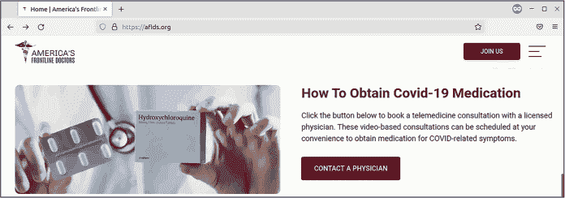
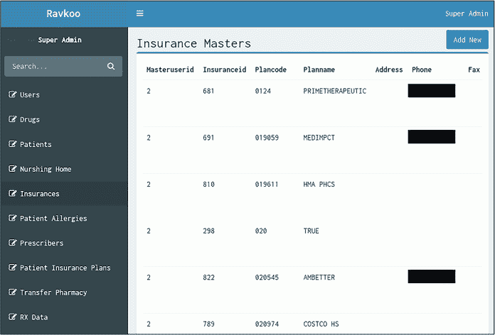
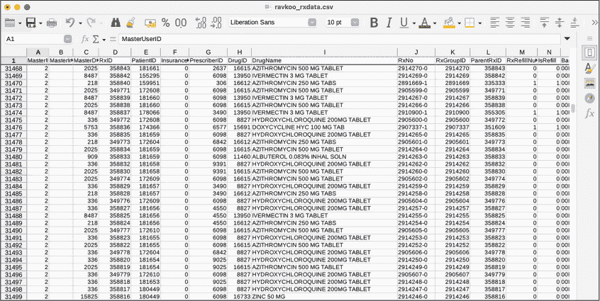
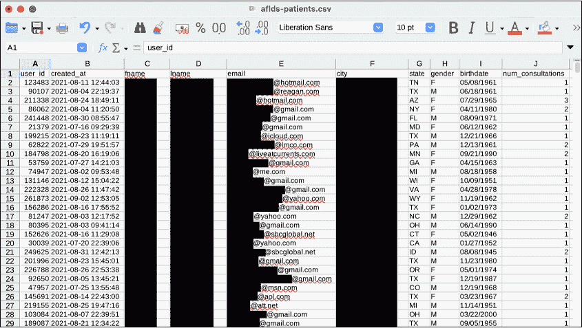
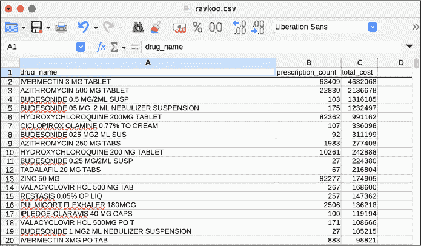
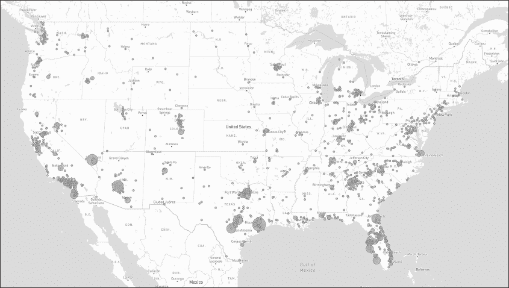

## 13 疫情牟利者与新冠病毒虚假信息


> *大约一个月前，我看到了一篇在我从未听说过的报纸《Intercept》上发表的文章。我发现《Intercept》是一家比*《纽约时报》*还要极左的报纸。*他们发表了一篇文章，指控美国前线医生（America’s Frontline Doctors）所推荐的一个远程医疗公司——一个第三方远程医疗公司——发生了患者数据泄露，称它被黑客入侵了。这让这家远程医疗公司当然非常紧张。他们认为自己已经建立了很好的防火墙，花费了大约 20 万美元来证明并没有真正发生黑客入侵，所有的都是虚构的，完全是谎言。但这却成为了克莱伯恩议员对我进行调查的依据！我心想，这听起来非常熟悉。一篇假新闻出现在一本垃圾报纸上。*
> 
> —美国前线医生创始人 Simone Gold 博士，在 2021 年 11 月由大卫·霍罗维茨自由中心主办的活动上发言，该中心是一个反伊斯兰的仇恨团体，活动地点在佛罗里达州的棕榈滩。

2021 年 9 月 11 日，一名匿名黑客向我发送了大约 100MB 的压缩数据，正如我的消息来源所说，“来自马粪药膏推销员”。我的消息来源正在调查美国前线医生（AFLDS），这是一个反科学的宣传团体，成立于 2020 年，旨在支持特朗普总统在新冠疫情期间反对公共卫生政策。

AFLDS 与一个小型的远程医疗公司网络一起，我的消息来源告诉我这些公司“极其容易”被黑客攻击，错误地向其庞大的在线观众声称新冠疫苗是危险和无效的。它还推广羟氯喹（通常用于治疗疟疾和红斑狼疮）和伊维菌素（通常作为牲畜的驱虫药）作为新冠病毒的神奇治疗药物。AFLDS 制作高质量的反疫苗宣传视频，并将其分发给数十万社交媒体平台上的追随者。

黑客给我发送了来自两家公司数据集：Cadence Health，这家公司运行着 AFLDS 用于为患者提供远程医疗咨询的平台，以及 Ravkoo Pharmacy，这家公司为这些药物开处方。在调查了这些解压后的数据集中总计超过 1GB 的 JSON 和 CSV 文件后，我发现 AFLDS 及其合作伙伴欺骗了成千上万的人，让他们寻求无效的治疗，并为这些药物的咨询和处方至少收取了 1500 万美元——可能远远不止——的费用。

我的调查结果使得美国国会新冠危机特别小组委员会（由詹姆斯·克莱本（南卡罗来纳州民主党）代表领导）对 AFLDS 和 SpeakWithAnMD 展开了调查；从技术上讲，AFLDS 直接与 SpeakWithAnMD 合作提供远程医疗咨询，而 Cadence Health 是 SpeakWithAnMD 管理技术的供应商。克莱本称这些团体为“掠夺性行为者”，他们“宣传虚假信息，并利用这些信息来推销未经证实且可能有害的新冠治疗方法。”该委员会建议联邦贸易委员会（FTC）对这些公司展开调查，并随后扩大调查范围，涵盖了 Cadence Health。

另外，针对我的报道、关于 AFLDS 的其他报道以及医学界的支持科学活动，加利福尼亚州医学委员会（MBC）对 AFLDS 的创始人西蒙妮·戈尔德博士展开了调查，决定是否应当吊销她的执业医师资格。（截至写作时，她仍然在加利福尼亚和佛罗里达州持有执照，而她已搬到佛罗里达州。）AFLDS 后来在一个停车库里用摄像机袭击了 MBC 主席克里斯蒂娜·劳森，作为它制作反科学宣传视频的一部分。

由于 AFLDS 数据集包含医疗记录和个人身份信息（PII），因此它并不是公开的，所以你无法自己操作它。相反，我将描述这些数据，展示其中经过编辑的片段，并展示我编写的 Python 代码片段，帮助理解这些数据。如果类似的数据集突然出现在你面前，你迄今为止在本书中学到的技能和本章中描述的策略，以及或许一些额外的独立学习，将能让你像我一样进行调查。

### AFLDS 的起源

在我们深入了解数据集之前，让我们先来看看 AFLDS 是如何成立的，包括它与特朗普 2020 年连任竞选活动和保守派倡导团体“茶党爱国者”的关联，以及 AFLDS 是如何通过其极为盈利的计划成功地欺骗疫苗怀疑者，花费数百万美元购买电话咨询和虚假新冠药物的。

2020 年 5 月 11 日，唐纳德·特朗普竞选连任团队的高级工作人员和共和党激进组织 CNP 行动举行了一次电话会议。会议的音频录音被泄露给了媒体与民主中心，这是一个进步的监察组织，随后将录音交给了美联社（AP），美联社对此进行了报道。讨论的一个关键话题是 reportedly 寻找“极度支持特朗普的医生”上电视，辩护特朗普迅速重启经济的计划，尽管美国疾病控制与预防中心（CDC）发布的安全指导更加谨慎。共和党活动家南希·舒尔茨（Nancy Schulze），她的丈夫是前共和党国会议员，在电话会议上表示她有一份愿意为特朗普政策辩护的医生名单，并且“这些人才是我们应该希望出现在电视和广播上帮助传播信息的人。”

高博士是他们寻找的“极度支持特朗普的医生”。在美联社报道这次电话会议时，一家公共关系公司发布了一封公开信，信中有超过 400 名医生签名，称疫情封锁政策为“大规模伤亡事件”。高博士的签名位于信件的最上方，尽管她否认与特朗普竞选团队协调她的努力。这封公开信是在美联社向电话会议上的个人和特朗普竞选团队请求评论之后发布的，但在文章发表之前。这封信似乎至少部分是为了提前发布文章并加以正面解读，当你在进行对抗性新闻报道时，像第一章中讨论的那样，可能会出现这种情况。

2020 年 6 月，在电话会议和公开信发布几周后，高博士创立了一个名为“言论自由基金会”的非营利组织，注册地点在亚利桑那州。该项目的初始资金为一百万美元年预算，并获得了美国保守派组织茶党爱国者基金会的财政赞助，该组织在第二章中有介绍。AFLDS 于 2020 年 7 月 27 日作为言论自由基金会的项目启动。高博士与其他穿白大褂的医生在最高法院大楼的台阶上举行了新闻发布会，错误地声称羟氯喹、阿奇霉素和锌的混合物能够治愈 COVID-19。活动通过布赖特巴特直播。时任总统特朗普在推特上分享了这场新闻发布会的视频，视频在被科技公司因违反疫情虚假信息规定而下架之前，获得了数百万次观看。

2021 年初，疫情已经进入相当长的一段时间，AFLDS 在其网站上建立了一个系统，提供$90 的远程医疗咨询服务，供人们获取氯喹的处方——此时在疫情中，氯喹已经被证伪为一种治疗 COVID-19 的药物。1 月 3 日，Gold 在佛罗里达州坦帕市的一个没有佩戴口罩的教堂观众面前说，AFLDS 通过他们的网站让“氯喹可供全国人民使用。然后，您可以咨询远程医疗医生。无论您是否感染了 COVID，或者您只是担心感染了 COVID，您都可以获得处方，药物会邮寄到您家。”她坚持说，“真正的斗争不是病毒，而是恐惧。”

图 13-1 显示了 AFLDS 网站上宣传 COVID-19“药物”处方的信息。

如果 AFLDS 数十万粉丝中的某一个观看了该组织的反疫苗宣传视频，并决定他们需要伊维菌素或氯喹，首先，他们会点击 AFLDS 首页上显眼的“联系医生”按钮。这个按钮会将他们带到 SpeakWithAnMD，远程医疗合作伙伴的网站。点击该网站上的按钮预约咨询后，患者会被引导到一个页面，在 Cadence Health 创建帐户，Cadence Health 是 SpeakWithAnMD 的供应商。Cadence Health 提供了 SpeakWithAnMD 使用的实际远程医疗平台。



图 13-1：AFLDS 网站 2022 年 3 月 4 日的首页

然后，患者填写一份表格，回答医疗问题；点击免责声明“作为潜在患者，我承认并理解，氯喹（HCQ）和伊维菌素被世界卫生组织（WHO）、美国食品药品监督管理局（FDA）、疾病控制与预防中心（CDC）和美国国立卫生研究院（NIH）认为‘强烈不推荐’”；并输入信用卡信息支付$90 进行咨询。在接下来的几天里，患者会接到 AFLDS 网络中一位医生的电话，该医生会给他们开出这些未经验证的药物的处方。ABC 新闻支付了$90，接到了一个电话，医生为他们开了伊维菌素的处方，并录下了开药的医生说：“就药物而言，或者甚至关于 COVID，我没有任何医学知识。”

当时，这些处方几乎总是通过在线药房 Ravkoo 处理。患者会打电话给 Ravkoo，在电话中报上他们的信用卡号，然后药物会邮寄到他们家门口。有时，患者会被收取高达$700 的伊维菌素费用；Ravkoo 不接受健康保险支付这些销售费用。

当我开始这项调查时，我对这些公司并不熟悉。显然，AFLDS 的目的是误导它的追随者关于公共卫生的信息，从而能够销售无效的替代品来预防和治疗新冠疫情。但是我并不清楚 SpeakWithAnMD、Cadence Health 或 Ravkoo 是如何融入这个计划的。他们是 AFLDS 骗局的一部分，还是仅仅是偶然与 AFLDS 合作的合法公司？

接下来，我将一步步向你展示我是如何揭开这整个新冠疫情暴利计划的，首先是描述我的黑客来源发送给我的数据集。

### Cadence Health 和 Ravkoo 数据集

我的来源提供的 100MB 压缩数据包含了数十万名患者的记录，分成两个单独的文件。这个部分描述了我如何存储和提取这些敏感文档，回顾了一些基础的命令行数据分析（正如你在第四章中学到的），并介绍了我在数据集中发现的一些关键数据类型。

#### 将数据提取到加密文件容器中

因为患者记录比其他中等敏感数据更为敏感，我采取了额外的措施来确保这个数据集及我对其的操作安全。我创建了一个加密文件容器，一个 5GB 的加密文件，我可以通过存储在密码管理器中的强密码来解锁。原始数据集，以及与此调查相关的所有笔记、代码和其他文件都保存在这里，这为我提供了额外的保护层，以防我的电脑遭到入侵。即使如此，任何访问我数据的人，如果不知道密码，仍然无法访问患者记录。

我使用了一款名为 zuluCrypt 的 Linux 软件来管理我的加密文件容器，但你在第一章中学到的 VeraCrypt 也是一个不错的选择，并且在任何操作系统上都可以使用。ZuluCrypt 与 VeraCrypt 相似，但稍微更好用，而且只在 Linux 上运行。我也可以使用 macOS 中的磁盘工具来创建加密的 DMG 文件。

我的来源给我发送了两个 tarball 文件：*hipaa_special.tar.zst*（33MB）和*horse_around_find_out.tar.zst*（74MB）。以下是它们的列表：

```
micah@trapdoor data % **ls -lh**

total 215904

-rwx------  1 micah  staff    32M Sep 14  2021 hipaa_special.tar.zst

-rwx------  1 micah  staff    73M Sep 13  2021 horse_around_find_out.tar.zst
```

在第十一章中，你处理了一个类似的文件格式，*.tar.gz*，其中文件使用 GZIP 算法进行压缩。而这些*.tar.zst*文件则是使用另一种算法 Zstandard 进行压缩的。安装 Zstandard 包后，我可以使用命令tar -xf filename来解压这类文件。-xf参数结合了-x，它告诉tar提取文件，以及-f，它表示接下来的参数是你要提取的文件名。tar程序会检测到这是一个 Zstandard 文件，并使用zstd来解压它。最后，由于tar会将文件解压到当前工作目录中，因此我创建了新文件夹，切换到这些文件夹，并将数据解压到其中。例如，下面是我解压*hipaa_special.tar.zst*的方式：

```
micah@trapdoor data % **mkdir hipaa_special**

micah@trapdoor data % **cd hipaa_special**

micah@trapdoor hipaa_special % **tar -xf ../hipaa_special.tar.zst**
```

正如你在第三章中学到的，这些命令创建了一个名为*hipaa_special*的新文件夹，切换到该文件夹，并从父文件夹中解压*hipaa_special.tar.zst*文件。

同样，以下命令会切换到父文件夹，创建一个名为*horse_around_and_find*的新文件夹，切换到该文件夹，然后将*horse_around_find_out.tar.zst*解压到该文件夹中：

```
micah@trapdoor hipaa_special % **cd ..**

micah@trapdoor data % **mkdir horse_around_find_out**

micah@trapdoor data % **cd horse_around_find_out**

micah@trapdoor horse_around_find_out % **tar -xf ../horse_around_find_out.tar.zst**
```

解压这些文件夹后，我做了每次遇到新数据集时都会做的事情：开始使用命令行工具来测量它。

#### 使用命令行工具分析数据

首先，我想知道这些文件占用了多少磁盘空间，并且每个文件夹中有多少个文件。我使用了第四章中描述的命令行技巧来弄清楚这一点：

```
micah@trapdoor data % **gdu --apparent-size -sh hipaa_special**

493M    hipaa_special

micah@trapdoor data % **find hipaa_special -type f | wc -l**

  281546

micah@trapdoor data % **gdu --apparent-size -sh horse_around_find_out**

691M   horse_around_find_out

micah@trapdoor data % **find horse_around_find_out -type f | wc -l**

     215
```

因为我在 Mac 上运行这些命令，所以我使用了来自<code>coreutils</code> Homebrew 包的gdu命令来估算磁盘空间（而不是 Linux 上的du命令）。find命令生成了给定文件夹中所有文件的列表，这个列表被传递给了wc -l命令，用来计算列出的文件数量。我的输出显示，*hipaa_special*文件夹占用了 493MB 的空间，包含 281,546 个文件，而*horse_around_find_out*文件夹占用了 691MB 的空间，包含 215 个文件。我们一个一个地来看。

##### 查看 hipaa_special 文件夹

到这一点为止，很明显 *hipaa_special* 文件夹包含的文件比我手动阅读的要多得多。我运行了以下命令，以查看 *hipaa_special* 文件夹中一些文件名的前几行，这样我就能对其中的内容有个了解，并开始接下来打开一些文件：

```
micah@trapdoor data % **ls -lh hipaa_special | head**
```

我的代码将 ls 命令的输出传输给 head 命令，后者默认显示输入的前 10 行。这样，我就不需要看到成百上千的文件名滚动过去，只是为了了解文件夹的内容。

我的输出显示文件夹包含一些数字命名且没有文件扩展名的小文件：

```
`--snip--`

-rw-r--r--  1 micah  staff   8.1K Sep 13  2021 100000

-rw-r--r--  1 micah  staff   1.3K Sep 13  2021 100001

-rw-r--r--  1 micah  staff   1.3K Sep 12  2021 100002

-rw-r--r--  1 micah  staff   1.4K Sep 13  2021 100003

-rw-r--r--  1 micah  staff   1.5K Sep 13  2021 100004

-rw-r--r--  1 micah  staff   1.5K Sep 13  2021 100005

-rw-r--r--  1 micah  staff   1.5K Sep 13  2021 100006

-rw-r--r--  1 micah  staff   1.3K Sep 13  2021 100007

-rw-r--r--  1 micah  staff   1.3K Sep 13  2021 100008
```

当我在 VS Code 中打开其中一个文件时，我很快就能看出它是一个 JSON 文件。我发现这些文件中的每一个都是 Cadence Health 系统中不同用户的记录。例如，列表 13-1 显示了文件*244273*的去标识化版本。

```
{

    "result": true,

    "provider": {

        "provider_id": null,

        "npi": null,

        "spi": null,

        "partner_id": null,

        "user_id": 244273, ❶

 `--snip--`

        "fname": "`redacted`",

        "lname": "`redacted`",

        "phone": "`redacted`",

        "work_phone": " ",

        "work_phone_ext": " ",

        "email": "`redacted`@hotmail.com",

        "state": "CA",

        "certified_states": [],

        "gender": "F",

        "fax": null,

        "ssn": 999999999,

        "birthdate": "`redacted`",

        "addressLine1": "`redacted`",

        "zipcode": "`redacted`",

        "city": "`redacted`",

        "avatar": "avatar\/default_avatar.png",

        "id": 78410,

        "partner": ",3,", ❷

        "timezone": "America\/Los_Angeles",

        "role_id": 3,

 `--snip--`

        "alcohol_type": null,

        "alcohol_amount": null,

        "current_physician": null, "consultationNotes": [ ❸

            {

                "value": 179820,

                "text": "09\/04\/2021 13:47:28", ❹

                "note": "This visit was performed via telemedicine.\nThe patient confirmed knowledge of the limitations of the use of telemedicine were verbally confirmed by the provider.\nVerification of patient identity was established.\nVerbal consent was obtained for medical treatment obtained\n\nThe patient is being interviewed via phone Platform\n\nPatient has need for covid meds in regards to: ivermectin\nSymptoms onset date: 7 days\n\nOccupation:\nChronic Medical illnesses: denies heart lung or liver problems\

`--snip--`

be required.",

                "practice": "covid19_treatment"

            }

        ],

        "internalNotes": []

    }

}
```

列表 13-1：来自 hipaa_special 的示例 JSON 文件

我可以看到，文件名 (*244273*) 与患者的用户 ID ❶ 匹配。记录中还包含一个指向合作伙伴的引用 ❷。这个值的格式很奇怪，但我很快发现它是一个以逗号分隔的合作伙伴 ID 列表，奇怪的是列表的开头和结尾有空白值。我不明白为什么 Cadence Health 选择用字符串而不是 JSON 数组来表示每个患者属于哪些合作伙伴，这样做本可以更简洁一些。然而，一旦我搞明白他们做出这个选择后，绕过它就变得足够简单了。我发现绝大多数患者的 partner 值是 ,3,，这意味着他们是 AFLDS 的患者，正如你稍后在本章中看到的那样。

记录还包括患者的姓名、电子邮件、地址、出生日期、其他个人信息以及详细的咨询记录。在一些患者记录中，consultationNotes 数组 ❸ 是空的，但在此案例中，它列出了详细信息。我猜测，拥有空咨询记录的患者在 Cadence Health 系统中创建了账户，但从未支付 $90，因此没有进行任何远程医疗咨询。这个文件中的患者在 2021 年 9 月 4 日下午 1:47 进行了 $90 的电话咨询 ❹。

该数据集包括类似于 列表 13-1 中所示的患者记录，共涉及 281,000 名患者。

我的消息来源告诉我，他们在黑客攻击 Cadence Health 系统时创建了自己的账户。使用网站时，他们观察到自己的网页浏览器加载了哪些 URL。当他们发现返回自己病历的 URL 中包含了患者 ID 时，他们尝试加载其他 ID 的类似 URL。这些 URL 返回了其他用户的病历。因此，我的消息来源写了一个脚本，下载了所有 281,000 个病人的记录，并将其存储在单独的 JSON 文件中。*hipaa_special.tar.zst* 文件包含了该脚本的输出。

##### 查看 horse_around_find_out 文件夹

*horse_around_find_out* 文件夹要小得多，处理起来也更简单。我运行了以下命令来查看它包含哪些文件（这个文件夹的文件数量足够少，没必要将其输出通过 head 进行过滤）：

```
micah@trapdoor data % **ls -lh horse_around_find_out**
```

我的输出显示，这个文件夹中的文件大多是来自 Cadence Health 的 JSON 文件和来自 Ravkoo 药房网站的 CSV 文件，还有一些其他文件：

```
`--snip--`

-rw-r--r--    1 micah  staff   387M Sep 12  2021 cadence_allpatients_all.json

-rw-r--r--    1 micah  staff    13K Sep 12  2021 cadence_allpharmacies_all.json

-rw-r--r--    1 micah  staff   317K Sep 12  2021 cadence_allproviders_all.json

-rw-r--r--    1 micah  staff   3.9K Sep 12  2021 cadence_allteams_all.json

-rw-r--r--    1 micah  staff    15K Sep 13  2021 cadence_api.txt

-rw-r--r--    1 micah  staff   103M Sep 12  2021 cadence_contacts_all.json

-rw-r--r--    1 micah  staff   1.0M Sep 12  2021 cadence_getPrescriptionPad_all.json

-rw-r--r--    1 micah  staff   983K Sep 11  2021 cadence_health_partners.json

drwxr-xr-x  202 micah  staff   6.3K Sep 12  2021 cadence_js

-rw-r--r--    1 micah  staff   238K Sep 12  2021 cadence_providers_2.json

-rw-r--r--    1 micah  staff   321K Sep 12  2021 ravkoo_contact.csv

-rw-r--r--    1 micah  staff   1.8M Sep 12  2021 ravkoo_drugs.csv

-rw-r--r--    1 micah  staff    51K Sep 12  2021 ravkoo_insurance.csv

-rw-r--r--    1 micah  staff   149M Sep 13  2021 ravkoo_rxdata.csv

-rw-r--r--    1 micah  staff    60K Sep 12  2021 ravkoo_screenshot.png

-rw-r--r--    1 micah  staff   361B Sep 12  2021 ravkoo_third_parties.csv
```

我开始手动打开这些文件，查看它们包含的内容。*cadence_api.txt* 文件似乎包含了几百行 JavaScript 代码，列出了 Cadence Health API 中的 URL，可能是黑客用来下载数据的。*cadence_js* 文件夹包含了几个难以理解的 JavaScript 文件，可能是驱动 Cadence Health 网站本身的代码。

该文件夹还包含*ravkoo_screenshot.png* 文件，这是来自 Ravkoo 超级管理员界面的截图，如图 13-2 所示。我从未访问过该界面，只看到了这个截图。左侧的链接似乎代表了 Ravkoo 数据库中的数据表，而右侧的信息显示了所选表格中的所有数据。

我的消息来源告诉我，他们发现了这个管理员界面的一个秘密 URL，尽管他们没有解释究竟是怎么发现的。任何人都可以在 Ravkoo 的系统中创建账户，只要登录了，就可以访问这个接口的 URL。在那里，他们可以点击左侧列表中的表格名称，使用网页浏览器访问 Ravkoo 的所有数据。我的消息来源通过从 Ravkoo 超级管理员界面抓取数据，构建了他们发送给我的 CSV 文件（*ravkoo_contact.csv*、*ravkoo_drugs.csv* 等），正如@donk_enby 为创建 Parler 数据集所做的那样。（有关网页抓取的更多信息，请参见附录 B。）



图 13-2：来自秘密 Ravkoo 超级管理员界面的截图

我可以看到*horse_around_and_find_out*文件夹里主要是 JSON 和 CSV 文件，但我需要进一步研究以确定它们的意义。

##### 查看 cadence_allpatients_all.json 文件

我从查看*horse_around_and_find_out*文件夹中最大的一份文件开始，即 387MB 的*cadence_allpatients_all.json*文件。这个庞大的 JSON 对象列出了每位 Cadence Health 患者的信息，包括许多与*hipaa_special*患者记录中相同的数据。列表 13-2 展示了来自该文件中一名患者的部分数据（已删减）。

```
{

    "name": "`redacted`",

    "id": 168692,

    "fname": "`redacted`",

    "mname": null,

    "lname": "`redacted`",

    "email": "`redacted`@gmail.com",

    "password": "`redacted_password_hash`",

    "ssn": 999999999,

    "phone": "`redacted`",

    "fax": null,

    "birthdate": "`redacted`",

    "gender": "F",

    "maritalStatus": null,

    "addressLine1": "`redacted`",

    "addressLine2": null,

    "zipcode": "`redacted`", "city": "`redacted`",

    "state": "NJ",

    "language": null,

`--snip--`

    "created_at": "2021-08-18 14:04:58",

    "updated_at": "2021-08-18 14:04:58",

`--snip--`
```

列表 13-2：描述 cadence_allpatients_all.json 中一名患者的 JSON 对象示例

许多字段的值为null，意味着它们为空。Cadence Health 软件可能将收集这些信息设置为可选，而 AFLDS 选择没有为其患者收集这些信息。ssn字段的值（推测是社会保障号）在此示例中为999999999。该 JSON 文件中的所有患者的 SSN 都被设置为此数字或null，因此看起来该数据集并不包含真实的 SSN。*cadence_allpatients_all.json*文件中还包括了每个用户的密码哈希值。拥有所有这些密码哈希的人可能能够恢复那些没有强密码的用户的原始密码。created_at字段的值似乎是该患者记录创建时的时间戳——换句话说，就是此人创建账户的时间。

在我的文本编辑器中阅读了几份患者记录后，我对这个文件中的数据类型有了相当好的理解，于是我开始查看较小的文件。

##### 查看 cadence_health_partners.json 文件

*cadence_health_partners.json*文件包含了一个 JSON 对象，列出了 Cadence 的 17 个合作伙伴，如美国前线医生（America’s Frontline Doctors）、SpeakWithAnMD 和 Dr. Zelenko。列表 13-3 展示了来自该文件的 AFLDS 合作伙伴的删减示例。

```
{

    "id": 3,

    "name": "America's Frontline Doctors",

    `--snip--`

    "practices": "covid19,followupvisit",

    `--snip--`

    "one_merchant_security_key": "`redacted`",

    "stripe_publishable_key": "dev+admin@cadencehealth.us",

    "stripe_secret_key": "`redacted`",

    "virtual_visit_price": {

        "covid19": "90.00",

        "followupvisit": "59.99"

    },

`--snip--`
```

列表 13-3：描述 cadence_health_partners.json 中一名合作伙伴的 JSON 对象示例

每个合作伙伴都有独特的 id 和 name 字段，以及描述合作伙伴设置的其他多个字段。该 JSON 对象的前几行显示 AFLDS 的 id 为 3。practices 字段是一个字符串，包含该合作伙伴提供的远程医疗咨询类型的逗号分隔列表（在此情况下为 covid19 和 followupvisit）。该 JSON 对象包括支付处理器的秘密令牌，在包含 one_merchant_security_key 和 stripe_secret_key 字段的行中，我已将其遮蔽。virtual_visit_price 字段是一个 JSON 对象，包含该合作伙伴提供的每种类型实践的其他字段，在此情况下，显示 AFLDS 对 COVID-19 访问收费 90 美元，对随访访问收费 59.99 美元。

在查看 *cadence_health_partners.json* 文件和 *hipaa_special* 文件夹中的患者数据后，我注意到两者之间存在关系。每个合作伙伴的 JSON 对象都有一个 id，每个患者都有一个 partner 字段。列表 13-3 显示 AFLDS 的合作伙伴 id 是 3，这意味着在 列表 13-1 中，患者的 partner 值为 ,3, 的患者是 AFLDS 的患者。

##### ravkoo_rxdata.csv 文件

在六个 Ravkoo 文件中，我发现 *ravkoo_rxdata.csv* 迄今为止是最大的一个。图 13-3 显示了该电子表格中的一部分数据。



图 13-3：在 LibreOffice Calc 格式中查看 ravkoo_rxdata.csv 文件

这个 149MB 的 CSV 电子表格包含了 340,000 行数据，每行代表一个开具的处方。每个处方包括药品名称和剂量、使用说明、续药信息、开具日期、备注栏（许多行列出了 AMERICAS FRONT LINE DOCTORS—ENCORE），以及其他信息。

在初步查看 *ravkoo_rxdata.csv* 后，明显可以看出它可能包含关于 AFLDS 及其合作公司收取虚假 COVID-19 医疗费用的揭示。然而，它当前的格式使得处理数据变得困难。我需要对数据进行转换，以便更容易理解它。

### 创建单一的患者电子表格

我想将那些为电话咨询支付了 90 美元的 AFLDS 患者与总患者名单分开，许多患者从未支付过费用，这样我就能更清楚地了解 AFLDS 骗局的规模。对于每位付费患者，我想找出他们的姓名、性别、出生日期、创建 Cadence Health 账户的日期以及他们接受的远程医疗咨询次数。

*cadence_allpatients_all.json* 文件包含了所有患者的信息，包括前面提到的 created_at 时间戳。然而，它没有包含咨询记录，而这些记录是我需要的，以确定患者实际进行了多少次咨询。与此同时，*hipaa_special* 文件夹中的 281,000 个 JSON 文件包含了所有患者的信息，包括咨询记录，但没有 created_at 时间戳。

我决定编写一个 Python 脚本，遍历 *cadence_allpatients_all.json* 文件和 *hipaa_special* 文件夹中的所有文件，提取我需要的信息，并将其保存到一个单一的 CSV 文件中。以下是我的脚本的 Python 代码（你也可以在本书的 GitHub 仓库中找到副本，链接为 [*https://<wbr>github<wbr>.com<wbr>/micahflee<wbr>/hacks<wbr>-leaks<wbr>-and<wbr>-revelations<wbr>/blob<wbr>/main<wbr>/chapter<wbr>-13<wbr>/create<wbr>-aflds<wbr>-patients<wbr>-csv<wbr>.py*](https://github.com/micahflee/hacks-leaks-and-revelations/blob/main/chapter-13/create-aflds-patients-csv.py))：

```
import json

import csv

import os

# Turn a JSON file into a Python dict or list

def data_from_json(filename):

    with open(filename) as f:

        return json.loads(f.read())

# Export a CSV full of AFLDS patients

def main():

    # Load patient data from cadence_allpatients_all.json

    patients_data = data_from_json(

        "data/horse_around_find_out/cadence_allpatients_all.json"

    )

    # Keep track of the created_at timestamps for each patient's id

    patient_ids_to_created_at = {}

    for patient in patients_data["patients"]:

        patient_ids_to_created_at[patient["id"]] = patient["created_at"]

    # Start the list of AFLDS patients that have had at least one consultation

    patient_rows = []

    # Loop through every file in the hipaa_special folder

    for patient_id in os.listdir("data/hipaa_special"):

        # Load the patient data

        data = data_from_json(os.path.join("data/hipaa_special", patient_id))

        # Some of the patient records are empty. This skips them

        if not data["result"]:

            continue

 # Make sure AFLDS (id 3) is in the list of partners

        partner_ids = data["provider"]["partner"].split(",")

        if "3" in partner_ids:

            # Count how many consultations this patient has

            num_consultations = len(data["provider"]["consultationNotes"])

            # If they have had more than one, add them to the list

            if num_consultations > 0:

                patient_rows.append(

                      {

                        "user_id": data["provider"]["user_id"],

                        "created_at": patient_ids_to_created_at[

                            data["provider"]["user_id"]

                          ],

                        "fname": data["provider"]["fname"],

                        "lname": data["provider"]["lname"],

                        "email": data["provider"]["email"],

                        "city": data["provider"]["city"],

                        "state": data["provider"]["state"],

                        "gender": data["provider"]["gender"],

                        "birthdate": data["provider"]["birthdate"],

                        "num_consultations": num_consultations,

                      }

                )

    # Write the CSV file

    csv_filename = "aflds-patients.csv"

    headers = [

        "user_id",

        "created_at",

        "fname",

        "lname",

        "email",

        "city",

        "state",

        "gender",

        "birthdate",

        "num_consultations",

    ]

    with open(csv_filename, "w") as f:

        writer = csv.DictWriter(f, headers)

        writer.writeheader()

        writer.writerows(patient_rows)

if __name__ == "__main__":

    main()
```

如果没有私有数据集的副本，你将无法运行本章中的任何脚本，因此我会总结一下它是如何工作的。

首先，脚本将 *cadence_allpatients_all.json* 加载为 Python 对象。然后，它遍历该对象中的每个患者，并在字典中跟踪每个 user_id 映射到哪个 created_at 时间戳。

它创建了一个名为<	samp class="SANS_TheSansMonoCd_W5Regular_11">aflds_patients的空列表，然后遍历*hipaa_special*文件夹中的每个文件名，其中每个文件代表一个不同的患者。对于每个文件名，它加载了对应的 JSON 文件作为表示患者的 Python 对象。如果<	samp class="SANS_TheSansMonoCd_W5Regular_11">partner字段包含 ID 3（意味着该记录与 AFLDS 相关联），并且<	samp class="SANS_TheSansMonoCd_W5Regular_11">consultationNotes字段的长度大于 0（意味着至少有一次咨询），那么它就将该患者添加到<	samp class="SANS_TheSansMonoCd_W5Regular_11">aflds_patients列表中，同时确保包含该患者的<	samp class="SANS_TheSansMonoCd_W5Regular_11">created_at时间戳。

它打开了一个新的 CSV 文件，*aflds-patients.csv*，用于写入，然后将<	samp class="SANS_TheSansMonoCd_W5Regular_11">aflds_patients列表作为行写入 CSV 文件。

在完成本书中的练习后，你应该具备编写自己类似脚本的所有技能。这对我为本次调查所编写的所有脚本都适用，你将在本章中看到它们。例如，在第八章中，你学习了字典和列表；在第九章中，你学习了如何使用<	samp class="SANS_TheSansMonoCd_W5Regular_11">csv模块创建自己的 CSV 电子表格；在第十一章中，你学习了如何加载和处理 JSON 格式的数据。这个脚本结合了所有这些技术。

运行这个脚本创建了一个 6.4MB 大小的 CSV 文件，名为*aflds-patients.csv*，包含 72,000 行。图 13-4 显示了该电子表格的隐去信息版本。如你所见，这些数据比起数十万个小的 JSON 文件和一个巨大的文件，要容易理解得多。



图 13-4: 隐去信息后的 aflds-patients.csv

这个电子表格列出了 72,000 个被推荐到 SpeakWithAnMD 并实际购买了$90 咨询的 AFLDS 患者。如果每个患者支付$90，那么仅这些咨询费用总共将花费 640 万美元。许多患者进行了多次咨询，因此我估计仅从咨询费用中，患者们被收取了*670 万美元*。从这些数据中无法知道具体的资金分配情况，但很可能是 AFLDS、其网络中的个别医生和 SpeakWithAnMD 之间进行分配的。

我的数据源的数据库包含了 Cadence Health 中所有患者的数据。当我按created_at列对电子表格进行排序时，这一列包括每位患者创建 Cadence 账户的日期，我可以看到最早的患者是在 2021 年 7 月 16 日创建了账户，而最新的患者则是在 2021 年 9 月 12 日创建了账户，那时我的数据源黑客入侵了 Cadence Health。虽然只有 72,000 名患者支付了$90 的咨询费用，但我还有来自另外 180,000 名 AFLDS 患者的数据，这些患者创建了 Cadence 账户但从未进行过咨询，这意味着在此期间 Cadence Health 数据库中的 281,000 名患者中，90%是由 AFLDS 推荐的。

尽管 AFLDS 从 2021 年 1 月起一直在销售$90 的咨询服务，但 Cadence Health 的 CEO Roque Espinal 向我确认，他的 SpeakWithAnMD 服务于 7 月 16 日启动。由于这是我所掌握的最早的患者数据，这意味着我的信息来源收集了*所有*Cadence 患者的记录。我的数据源显示，在 7 月到 9 月的两个月期间，AFLDS 仅从$90 的咨询服务中每天向其患者收取平均$100,000。如果 AFLDS 在今年上半年每天也赚取这么多，它将额外带来*1800 万美元*的收入。同样，这只是通过销售咨询服务获得的收入；不包括处方药的费用。

在我的调查进行到这一点时，显然 AFLDS 正在传播医学虚假信息，并且看起来至少 SpeakWithAnMD 和 Ravkoo 对此有所意识，并且从中获利。然而，我不确定为 SpeakWithAnMD 提供服务的 Cadence Health 是否意识到其服务的用途。但在进一步探讨这一点之前，我决定改变方向，开始查看 Ravkoo 的药物处方数据。

### 计算通过 Ravkoo 填写处方的收入

之前提到的*ravkoo_rxdata.csv*电子表格有 340,000 行，每一行代表一个已填写的处方。它包含了一个DrugName列，里面有像IVERMECTIN 3 MG TABLET这样的药品名称，一个cost列，显示该处方的价格，以及一个Fill_Date列，显示处方被填写的日期。

通过按 Fill_Date 对电子表格进行排序，我看到 Ravkoo 药房在 2020 年 11 月 27 日填写了第一张处方，而最后一张处方则是在 2021 年 8 月 24 日填写的。SpeakWithAnMD 的数据涵盖了两个月的时间段，而 Ravkoo 的数据则涵盖了九个月的时间段。也就是说，我的数据集包含了两个月的患者记录，但却包含了九个月的处方记录。在本节中，我将描述我编写的 Python 代码，目的是更好地了解 Ravkoo 销售的药物以及这些药物与 COVID-19 假治疗法的关系。

#### 查找销售药物的价格和数量

为了找出 Ravkoo 向患者收取每种特定药物的费用，我编写了另一个脚本，见 清单 13-4（你也可以在 [*https://<wbr>github<wbr>.com<wbr>/micahflee<wbr>/hacks<wbr>-leaks<wbr>-and<wbr>-revelations<wbr>/blob<wbr>/main<wbr>/chapter<wbr>-13<wbr>/create<wbr>-ravkoo<wbr>-csv<wbr>.py*](https://github.com/micahflee/hacks-leaks-and-revelations/blob/main/chapter-13/create-ravkoo-csv.py) 找到它的副本）。

```
import csv

# Export a CSV that adds up prescriptions and their costs for each drug

def main():

        # A dictionary that maps drug names to another dictionary containing the

    # prescription count and total cost for that drug

    drugs = {}

    # Add up the number of prescriptions and total cost for all drugs, to display

    # at the end

    prescription_count = 0

    total_cost = 0

    # Loop through ravkoo_rxdata.csv, and count prescriptions and costs

    with open("data/horse_around_find_out/ravkoo_rxdata.csv") as f:

        reader = csv.DictReader(f)

        for row in reader:

            if row["DrugName"] not in drugs:

               drugs[row["DrugName"]] = {"prescription_count": 0, "total_cost": 0}

            # Count prescriptions and cost for this drug

            drugs[row["DrugName"]]["prescription_count"] += 1

            drugs[row["DrugName"]]["total_cost"] += float(row["Cost"])

            # Count prescriptions and cost for _all_ drugs

            prescription_count += 1

            total_cost += float(row["Cost"])

    # Write the CSV file

    headers = [

        "drug_name",

        "prescription_count",

        "total_cost",

    ]

    csv_filename = "ravkoo.csv"

    with open(csv_filename, "w") as f:

        writer = csv.DictWriter(f, headers)

        writer.writeheader()

        for drug_name in drugs:

            writer.writerow(

                { "drug_name": drug_name,

                    "prescription_count": drugs[drug_name]["prescription_count"],

                    "total_cost": int(drugs[drug_name]["total_cost"]),

                }

            )

    print(f"Number of prescriptions: {prescription_count:,}")

    print(f"Total cost: ${int(total_cost):,}")

if __name__ == "__main__":

    main()
```

清单 13-4：Python 脚本 create-ravkoo-csv.py，该脚本汇总 Ravkoo 处方和药品费用，并导出结果的 CSV 文件

首先，脚本创建了一个名为 drugs 的空字典，该字典将药物名称映射到另一个字典，后者包含 prescription_count 和 total_cost 值。接着，它加载了 *ravkoo_rxdata.csv* 并循环处理其中的每一行。对于每一行，如果 DrugName 尚未在 drugs 字典中，脚本会将其添加进去，然后将该药物的处方数量加 1，并将 Cost 值加到该药物的总费用中。所有数据会被保存到名为 drugs 的 CSV 文件中。最后，脚本会计算出所有药物的总处方数和总费用，并将结果显示在终端中。

这是我运行脚本时得到的输出：

```
micah@trapdoor AFLDS % **python3 create-ravkoo-csv.py**

Number of prescriptions: 340,000

Total cost: $15,119,473
```

我的输出显示，患者们为所有在被泄露数据中的处方支付了超过 1500 万美元。然而，这些处方中的许多可能与 AFLDS 或虚假的 COVID-19 疗法无关。

生成的 CSV 文件*ravkoo.csv*包含了 1,552 行，代表原始*ravkoo_rxdata.csv*中独特的DrugName值。图 13-5 展示了这个电子表格，按total_cost降序排序，显示了哪些药物让患者支付了最多的钱。

这些收入中有多少来自 AFLDS 向其追随者推销的药物？累积成本最高的药物是IVERMECTIN 3 MG TABLET，共被开处方 63,409 次，总费用为 460 万美元。伊维菌素主要用于治疗牲畜的寄生虫，但偶尔也用于治疗人类的疥疮和虱子。我无法确定所有这些伊维菌素的销售是否直接来自 AFLDS，但在 COVID-19 大流行期间，关于其疗效的虚假信息泛滥，而伊维菌素却带来了如此高的收入，这点非常可疑。

另一行显示了IVERMECTIN 3MG PO TAB（同剂量的伊维菌素，只是名字略有不同，DrugName值来自*ravkoo_rxdata.csv*），它让 883 个患者额外支付了 98,900 美元。其他药物，如羟氯喹和阿奇霉素，也有相同的问题：存在不同的DrugName值，实际上代表的是同一种药物。如果我想知道每种药物的总收入，我就得把所有的伊维菌素处方合并成一行，其他药物也得如此处理。



图 13-5：在 LibreOffice Calc 中查看 ravkoo.csv 文件

#### 按药物分类处方数据

因为我正在调查 AFLDS，所以我最感兴趣的是该组织推广的药物：伊维菌素、氯喹和其他一些药物。除了伊维菌素外，AFLDS 还推广*泽连科协议*，这个名字来源于弗拉基米尔·泽连科博士，这位美国医生在 2020 年 3 月疫情初期声称（没有证据）他成功治疗了数百名 COVID-19 患者，使用了氯喹、阿奇霉素和硫酸锌的组合。（AFLDS 网站上的治疗选项也将维生素 C 列为泽连科协议的一部分。）泽连科还传播了其他医学虚假信息，例如声称更多儿童死于 COVID-19 疫苗，而不是死于病毒本身。时任总统特朗普公开赞扬了泽连科的工作，表示他自己也服用了氯喹治疗 COVID-19。

我想了解 Ravkoo 的业务中有多少部分是销售这些药物。为此，我需要重新组织数据。我需要创建一个类似的电子表格，但不是直接从黑客数据中提取药物名称的列，而是将该列改为处方类别。一旦我有了一个简单的电子表格，将单个药物与其收入相对应，我就可以将这些数据可视化——例如，以饼图的形式展示。

*ravkoo.csv*电子表格向我展示了最常见的处方药。根据这些药物的名称，我列出了一个药物类别的清单：伊维菌素、氯喹、阿奇霉素、锌、维生素 C 和其他。换句话说，最常见的处方药正是 AFLDS 所推广的药物。

然后，我写了另一个脚本，和列表 13-4 中的脚本非常相似，但多了一步。在*ravkoo_rxdata.csv*电子表格的每一行中，脚本确定该药物属于哪个类别，并汇总每个类别的处方数量和费用。然后，它将所有这些数据保存为名为*ravkoo-categories.csv*的 CSV 文件。

这是我的 Python 脚本（你也可以在[*https://<wbr>github<wbr>.com<wbr>/micahflee<wbr>/hacks<wbr>-leaks<wbr>-and<wbr>-revelations<wbr>/blob<wbr>/main<wbr>/chapter<wbr>-13<wbr>/create<wbr>-ravkoo<wbr>-categories<wbr>-csv<wbr>.py*](https://github.com/micahflee/hacks-leaks-and-revelations/blob/main/chapter-13/create-ravkoo-categories-csv.py)找到它）：

```
import csv

# Export a CSV that adds up prescriptions and their costs for each category of drug

def main():

    # A dictionary that maps drug categories to another dictionary containing the

    # prescription count and total cost for that drug category

    drug_categories = {}

    # Loop through ravkoo_rxdata.csv, and count prescriptions and costs

    with open("data/horse_around_find_out/ravkoo_rxdata.csv") as f:

        reader = csv.DictReader(f)

        for row in reader:

            if "ivermectin" in row["DrugName"].lower():

                category = "Ivermectin"

            elif "hydroxychloroquine" in row["DrugName"].lower():

                category = "Hydroxychloroquine"

            elif "azithromycin" in row["DrugName"].lower():

                category = "Azithromycin"

            elif "zinc" in row["DrugName"].lower():

               category = "Zinc"

            elif "vitamin c" in row["DrugName"].lower():

                category = "Vitamin C"

            else:

                category = "Other"

            if category not in drug_categories:

                drug_categories[category] = {"prescription_count": 0, "total_cost": 0}

            # Count prescriptions and cost for this drug category

            drug_categories[category]["prescription_count"] += 1

            drug_categories[category]["total_cost"] += float(row["Cost"])

    # Write the CSV file

    headers = [

        "drug_category",

        "prescription_count",

        "total_cost",

    ]

    csv_filename = "ravkoo-categories.csv"

    with open(csv_filename, "w") as f:

        writer = csv.DictWriter(f, headers)

        writer.writeheader() for category in drug_categories:

            writer.writerow(

                {

                    "drug_category": category,

                    "prescription_count": drug_categories[category][

                         "prescription_count"

                    ],

                    "total_cost": int(drug_categories[category]["total_cost"]),

                }

            )

if __name__ == "__main__":

    main()
```

运行这个脚本后，我最终得到了一个名为*ravkoo-categories.csv*的文件。表 13-1 展示了这个电子表格中的数据，详细列出了 Ravkoo 的处方药销售情况。

表 13-1： Ravkoo 销售的药物类别

| 药物类别 | 处方数量 | 总费用 |
| --- | --- | --- |
| 羟氯喹 | 92,646 | $1,234,727 |
| 锌 | 82,608 | $177,336 |
| 伊维菌素 | 64,300 | $4,734,163 |
| 其他 | 42,193 | $6,476,213 |
| 维生素 C | 31,281 | $52,712 |
| 阿奇霉素 | 26,972 | $2,444,319 |

这些数据清楚地揭示了 Ravkoo 在 AFLDS 骗局中的角色：*87%*的处方是 Ravkoo 销售的假冒 COVID-19 治疗药物。在九个月的时间里，患者总共向 Ravkoo 支付了*860 万美元*，购买了那些被告知可以预防或治愈 COVID-19 的“假药”。这还不包括患者向 SpeakWithAnMD 支付的约 670 万美元（以及可能更多的数百万美元）用于电话咨询。据我所知，Ravkoo 在这个计划中的唯一角色是作为药房，并且并未从电话咨询中获得任何收入。AFLDS 还曾在不同时间与不同的药房合作。

当《Intercept》发布关于 AFLDS 的调查时，Ravkoo 的首席执行官 Alpesh Patel 告诉我，他的公司已经停止与 SpeakWithAnMD 合作。“那里的人数增长得非常快，我们感觉不太舒服，”他说。“而且我们没有那么多能力来处理这么多的处方。”通过使用开源情报（OSINT），你可以在第一章中了解，我确认了 Patel 在说实话：在互联网上深入搜索关于 AFLDS 的资料，包括阅读其他记者和支持科学活动家的推文，这些人一直在追踪这个组织，我发现 AFLDS 运营了一些 Telegram 频道，其中包括专门为患者提供的频道。在这个频道里，我发现患者们发布了关于 Ravkoo 不再与 SpeakWithAnMD 或 AFLDS 合作的信息。

### 深入了解 Cadence Health 患者数据

到此为止，我知道了 72,000 名 AFLDS 患者支付了$90 的远程医疗咨询费，且 87%的 Ravkoo 处方是用于假冒的 COVID-19 治疗药物。我想进一步了解患者数据，仍有很多内容需要挖掘。除了 AFLDS，SpeakWithAnMD 的其他合作伙伴有哪些？他们为公司贡献了多少业务？我还能从 AFLDS 的患者中学到些什么？为了解答这些问题，我编写了更多的 Python 代码。

#### 查找 Cadence 的合作伙伴

我想了解 SpeakWithAnMD 的业务中有多少来自 AFLDS，进而了解 Cadence Health 的业务中有多少来自 AFLDS。文件 *cadence_health_partners.json* 包含了所有合作伙伴的列表，于是我写了一个 Python 脚本，计算每个合作伙伴相关的患者数量，结果见 Listing 13-5（你也可以在[*https://<wbr>github<wbr>.com<wbr>/micahflee<wbr>/hacks<wbr>-leaks<wbr>-and<wbr>-revelations<wbr>/blob<wbr>/main<wbr>/chapter<wbr>-13<wbr>/create<wbr>-cadence<wbr>-partners<wbr>-csv<wbr>.py*](https://github.com/micahflee/hacks-leaks-and-revelations/blob/main/chapter-13/create-cadence-partners-csv.py)找到一份副本）。

```
import json

import csv

# Turn a JSON file into a Python dict or list

def data_from_json(filename):

    with open(filename) as f:

        return json.loads(f.read())

# Convert the comma-separated list of partners, like ",3,", into a Python list

# of partners, like ["America's Frontline Doctors"]

def get_partners(partner_lookup, patient):

    partners = []

    partner_ids = patient["partner"].split(",")

    for partner_id in partner_ids:

        if partner_id != "":

            partners.append(partner_lookup[int(partner_id)])

    return partners

# Export a CSV that lists Cadence partners

def main():

    partner_rows = []

    # Load the Cadence patient data

    patients_data = data_from_json(

        "data/horse_around_find_out/cadence_allpatients_all.json"

    )

 # Load the Cadence partners data

    partners_data = data_from_json(

        "data/horse_around_find_out/cadence_health_partners.json"

    )

    # Create a dictionary that maps a partner ID with its name

    partner_lookup = {}

    for partner in partners_data:

        partner_lookup[partner["id"]] = partner["name"]

    # Loop through all of the partners

    for partner in partners_data:

        # Count how many patients use this partner

        patients = 0

        for patient in patients_data["patients"]:

            patient_partners = get_partners(partner_lookup, patient)

            for patient_partner in patient_partners:

                if patient_partner == partner["name"]:

                    patients += 1

        # Add the partner's row

        partner_rows.append(

            {

                "ID": partner["id"],

                "Name": partner["name"],

                "Domain": partner["domain"],

                "Patients": patients,

            }

        )

    # Write the CSV file

    headers = ["ID", "Name", "Domain", "Patients"]

    csv_filename = "cadence-partners.csv"

    with open(csv_filename, "w") as f:

        writer = csv.DictWriter(f, headers)

        writer.writeheader()

        writer.writerows(partner_rows)

if __name__ == "__main__":

    main()
```

Listing 13-5:  create-cadence-partners-csv.py 脚本返回每个 Cadence Health 合作伙伴相关的患者数量。

首先，我的脚本加载了 *cadence_allpatients_all.json* 和 *cadence_health_partners.json* 作为 Python 对象。它创建了一个名为 partner_rows 的空列表，然后循环遍历每个合作伙伴。在这个 for 循环内部，有一个嵌套的 for 循环，它会遍历每个患者，检查该患者是否使用了该合作伙伴的服务。脚本随后将这些信息（合作伙伴的 ID、名称和领域，以及其相关患者的统计数据）添加到 partner_rows 列表中。最后，它将结果保存在名为 *cadence-partners.csv* 的 CSV 文件中。

Table 13-2 显示了该电子表格的数据，描述了所有 Cadence Health 的合作伙伴及其患者数量。

Table 13-2: Cadence Health 合作伙伴

| ID | 名称 | 领域 | 患者数量 |
| --- | --- | --- | --- |
| 1 | Encore 远程医疗 | encore.cadencehealth.us | 7 |
| 2 | SpeakWithAnMD | speakwithanmd.cadencehealth.us | 21,193 |
| 3 | 美国前线医生 | aflds.cadencehealth.us | 255,266 |
| 4 | Corstet | corstet.cadencehealth.us | 1,604 |
| 5 | 泽伦科博士 | drzelenko.cadencehealth.us | 55 |
| 6 | Encore 演示 | encoredemo.cadencehealth.us | 5 |
| 7 | 金氏药房 | kims.cadencehealth.us | 6 |
| 8 | TelMDFirst | telmdfirst.cadencehealth.us | 2,410 |
| 9 | 茨富蒂斯博士 | drtsifutis.cadencehealth.us | 301 |
| 10 | 伊曼纽尔博士 | drimmanuel.cadencehealth.us | 3 |
| 11 | 帕伦博博士 | drpalumbo.cadencehealth.us | 29 |
| 12 | 博兹博士 | drboz.cadencehealth.us | 311 |
| 13 | Dr. Parker | drparker.cadencehealth.us | 409 |
| 14 | Dr. Johnson | drajohnson.cadencehealth.us | 3 |
| 15 | DEV | localhost:8080 | 1 |
| 16 | HablaConUnMD.com | hablaconunmd.cadencehealth.us | 0 |
| 17 | VirtuaFirst, PLLC | vf.cadencehealth.us | 0 |

在 281,603 名患者中，AFLDS 将 255,266 人转介给 SpeakWithAnMD，并间接转介给 Cadence Health。这意味着 Cadence 数据库中 90%的患者来自 AFLDS。

我从合作伙伴列表中学到了一些额外的有趣信息。列出的第一个合作伙伴 Encore Telemedicine 是 SpeakForAnMD 的母公司。第四个合作伙伴 Corstet 由 Jerome Corsi 拥有，Corsi 同时也拥有 Encore Telemedicine。Corsi 曾是阴谋论节目*InfoWars*的主持人，支持有关美国前总统奥巴马公民身份的种族主义“出生主义”阴谋论。他还曾卷入特别检察官 Robert Mueller 对 2016 年选举中俄罗斯干预的调查。合作伙伴列表还包括一些个人医生，包括因“Zelenko 协议”而出名的 Dr. Zelenko 和 Dr. Stella Immanuel，她是之前提到的在最高法院大楼前举行新闻发布会的 AFLDS 医生之一。在那次事件之后，她因声称子宫疾病子宫内膜异位症是由女性梦见与恶魔和女巫发生性关系所引起而迅速获得了病毒式的名声。

这张电子表格确认了 Cadence 的数据大部分与 AFLDS 的患者相关。我决定深入挖掘 AFLDS 患者的数据，看看其中是否隐藏着什么启示。

#### 按城市搜索患者

我创建的 *aflds-patients.csv* 电子表格来自原始数据集，包含 72,000 行病人数据，这些病人由 AFLDS 转诊，并且至少有一次咨询，表格中包括了 城市 和 州 列。这个位置数据让我能够编写另一个 Python 脚本，统计每个城市的病人数量，并查找该城市的 GPS 坐标，以便我能将它们绘制在地图上。

在第十一章中，你使用了直接从 Parler 视频元数据中找到的 GPS 坐标，并利用 Google Earth 将它们绘制在地图上。然而，在这种情况下，我只有城市和州的数据，因此我需要自己查找它们的 GPS 坐标。我编写了一个脚本，将电子表格中的城市名称转换为 GPS 坐标，这个过程叫做 *地理编码*。

列表 13-6 展示了我的 Python 脚本（你也可以在[*https://<wbr>github<wbr>.com<wbr>/micahflee<wbr>/hacks<wbr>-leaks<wbr>-and<wbr>-revelations<wbr>/blob<wbr>/main<wbr>/chapter<wbr>-13<wbr>/create<wbr>-cities<wbr>-csv<wbr>.py*](https://github.com/micahflee/hacks-leaks-and-revelations/blob/main/chapter-13/create-cities-csv.py)找到一个副本）。

```
import csv

import json

import time

import httpx

geocode_api_key = "PUT_GEOCODE_API_KEY_HERE"

# Export a CSV that for each city lists its GPS coordinates and the number of patients there

def main():

    # This dictionary maps names of cities (in format "City, State", like "New York, NY")

    # to a dictionary with info about that city (number of patients, GPS coordinates)

    cities = {}

    # Count how many patients are in each city

    with open("aflds-patients.csv") as f:

        reader = csv.DictReader(f)

        for row in reader:

            city = f"{row['city']}, {row['state']}"

            if city not in cities:

                cities[city] = {"count": 0}

            cities[city]["count"] += 1

    print(f"Found patients in {len(cities):,} cities")

    # Look up GPS coordinates for each city

    for city in cities:

        # Give each API request 3 tries, in case a connection fails

        tries = 0 success = False

        while not success:

            try:

                print(

                    f"Loading GPS coordinates for: {city} ({cities[city]['count']} patients)"

                )

                r = httpx.get(

                    "https://app.geocodeapi.io/api/v1/search",

                     params={

                        "apikey": geocode_api_key,

                        "text": city,

                        "size": 1,

                        "boundary.country": "US",

                    },

                )

                success = True

            # The connection failed

            except:

                tries += 1

                if tries == 3:

                    print("Failed, skipping")

                print("Sleeping 2s and trying again")

                time.sleep(2)

        try:

            data = json.loads(r.text)

            if "features" in data and len(data["features"]) > 0:

                cities[city]["lon"] = data["features"][0]["geometry"]["coordinates"][0]

                cities[city]["lat"] = data["features"][0]["geometry"]["coordinates"][1]

        except:

            cities[city]["lon"] = None

            cities[city]["lat"] = None

    # Write the CSV file

    headers = [

        "count",

        "city",

        "lon",

        "lat",

        "label",

    ]

    csv_filename = "cities.csv"

    with open(csv_filename, "w") as f:

        writer = csv.DictWriter(f, fieldnames=headers)

        writer.writeheader()

        for city in cities:

            writer.writerow(

                {

                    "count": cities[city]["count"],

                    "city": city,

                    "lon": cities[city]["lat"], "lat": cities[city]["lon"],

                    "label": f"{city} ({cities[city]['count']})",

                 }

            )

if __name__ == "__main__":

    main()
```

列表 13-6: 该 create-cities-csv.py 脚本进行城市和州名称的地理编码。

为了执行地理编码，脚本使用了一个 API。在众多选项中，我选择了一个叫做 Geocodeapi 的服务，原因是它看起来易于使用，并且在我计划的请求次数范围内是免费的。我在[*https://<wbr>geocodeapi<wbr>.io*](https://geocodeapi.io)创建了一个账户，生成了一个 API 密钥，并将其存储在脚本中的变量 geocode_api_key 中。为了进行 API 调用，脚本使用了第三方 Python 模块 httpx。（有关该模块的更多细节，请参见附录 B。）

在定义了 API 密钥后，我的脚本创建了一个空字典，名为 cities，用于将城市名称映射到关于该城市的信息——特别是病人数量和其 GPS 坐标。

然后，脚本加载了 *aflds-patients.csv* 文件，并遍历了每个患者。对于每个患者，脚本创建了一个新的字符串，格式为 City, State（例如，Atlanta, Georgia）。如果 city 还不存在于 cities 字典中，脚本会将 cities[city] 设置为 = {"count": 0}。然后它将 cities[city]["count"] 增加 1。等到这个循环完成时，cities 中包含了所有有患者的城市列表以及每个城市的患者数量。

下一步是为每个城市进行地理编码。另一个 for 循环遍历了 cities，并使用 httpx.get() 函数，向 Geocodeapi API 发送每个城市的 HTTP 请求，同时传递城市名称和我的 API 密钥。当脚本获得包含 GPS 坐标的响应时，它将纬度和经度存储在 cities[city]["lat"] 和 cities[city]["lon"] 中。由于它需要发送成千上万次 API 请求，这一步骤需要几个小时，因此在每次请求之前，脚本会在终端中显示文本，让我能够感知运行进度。

最后，脚本将所有数据从 cities 字典写入名为 *cities.csv* 的 CSV 文件。

当我运行脚本时，得到了以下输出：

```
micah@trapdoor AFLDS % **python3 create-cities-csv.py**

Found patients in 15,196 cities

Loading GPS coordinates for: roan mountain, TN (1 patients)

Loading GPS coordinates for: El Paso, TX (22 patients)

Loading GPS coordinates for: Paulden, AZ (7 patients)

Loading GPS coordinates for: Athens, NY (5 patients)

Loading GPS coordinates for: Estero, FL (31 patients)

Loading GPS coordinates for: Columbia, MD (16 patients)

Loading GPS coordinates for: Houston, TX (371 patients)

Loading GPS coordinates for: Newtown Square, PA (14 patients) Loading GPS coordinates for: Plymouth, MN (32 patients)

Loading GPS coordinates for: Blairsville, GA (20 patients)

Loading GPS coordinates for: shelby twownhsip, MI (1 patients)

Loading GPS coordinates for: Waukesha, WI (13 patients)

`--snip--`
```

图 13-6 显示了按每个城市患者数量排序的 *cities.csv* 文件。


图 13-6：来自 cities.csv 的结果

拥有 GPS 坐标后，我可以将患者数据绘制到地图上。我使用了一个名为 MapBox 的在线服务（[*https://<wbr>www<wbr>.mapbox<wbr>.com*](https://www.mapbox.com)），它在第十一章中提到过，用于在地图上为每个城市（共有 15,196 个城市）显示圆圈——来自该城市的患者越多，圆圈越大。MapBox 拥有一个用户界面，可以轻松上传带有 GPS 坐标的 CSV 文件，并指示如何在地图上展示数据。MapBox 还允许将地图嵌入到网页中。当我发布文章时，我将这张地图嵌入其中，让读者可以自行互动。图 13-7 展示了这张地图，聚焦于美国。

全国各州以及华盛顿特区的居民都支付了 90 美元进行远程医疗咨询，其中包括加利福尼亚州 8600 人，佛罗里达州 8000 人，德克萨斯州 7400 人。地图上的点只显示了那些至少有 10 名 AFLDS 患者的城市。

除了患者所在的城市，数据还包括了他们的出生日期，这使得计算他们的年龄变得简单。由于年龄是 COVID-19 的主要风险因素，我接下来研究了这些数据。



图 13-7：截至 2021 年 9 月 11 日，美国各城市 AFLDS 患者分布图

#### 按年龄搜索患者

你的年龄在你患 COVID-19 重症或死亡的风险中起着重要作用。在大流行期间，CDC 发布了基于年龄的 COVID-19 感染、住院和死亡的个体风险统计数据。直到 2023 年 5 月，CDC 持续更新这些数据，随着新数据的出现和大流行情况的变化而更新。当我在 2021 年 9 月发布我的研究结果时，50 到 64 岁的人群住院的概率是 18 到 29 岁人群的 4 倍，死亡的概率是 30 倍。65 到 74 岁的人群住院的概率是 5 倍，死亡的概率是 90 倍。

在我撰写报告时，并没有哪种 COVID-19 治疗方法效果显著（除了单克隆抗体，但其使用困难且不广泛可得）。老年人减少死亡或重症风险的唯一方法是接种疫苗。AFLDS 投入大量资源，试图说服人们 COVID-19 疫苗是危险的，佩戴口罩防止 COVID-19 传播是侵犯个人自由。

当病人在 Cadence Health 网站创建帐户时，他们会被要求输入出生日期。我编写了一个脚本来计算他们的年龄，并将他们按 CDC 使用的相同年龄组分类，以便我能够查看他们住院或死亡的可能性。Listing 13-7 展示了该脚本的 Python 代码（你也可以在[*https://<wbr>github<wbr>.com<wbr>/micahflee<wbr>/hacks<wbr>-leaks<wbr>-and<wbr>-revelations<wbr>/blob<wbr>/main<wbr>/chapter<wbr>-13<wbr>/create<wbr>-ages<wbr>-csv<wbr>.py*](https://github.com/micahflee/hacks-leaks-and-revelations/blob/main/chapter-13/create-ages-csv.py)找到它）。

```
import csv

from datetime import datetime, timedelta

# Export a CSV that shows how many patients are part of each age group

def main():

    # Age groups, the same ones used in CDC data

    age_groups = {

        "<0": 0,

        "0-4": 0,

        "5-17": 0,

        "18-29": 0,

        "30-39": 0,

        "40-49": 0,

        "50-64": 0,

        "65-74": 0,

        "75-84": 0,

        "85+": 0,

        ">100": 0,

      }

    sept2021 = datetime(2021, 9, 11)

    with open("aflds-patients.csv") as f:

        reader = csv.DictReader(f)

        for row in reader:

            birthdate = datetime.strptime(row["birthdate"], "%m/%d/%Y")

            age = sept2021 - birthdate

            if age < timedelta(0):

                age_groups["<0"] += 1

            elif age < timedelta(365 * 5):

                age_groups["0-4"] += 1

            elif age < timedelta(365 * 18):

                age_groups["5-17"] += 1

            elif age < timedelta(365 * 30):

                age_groups["18-29"] += 1

            elif age < timedelta(365 * 40):

                age_groups["30-39"] += 1

            elif age < timedelta(365 * 50):

                age_groups["40-49"] += 1

            elif age < timedelta(365 * 65):

                age_groups["50-64"] += 1

            elif age < timedelta(365 * 75):

                age_groups["65-74"] += 1

            elif age < timedelta(365 * 85):

                age_groups["75-84"] += 1

            elif age < timedelta(365 * 100):

                age_groups["85+"] += 1

            else:

                age_groups[">100"] += 1

    # Write the CSV file

    headers = [

        "age_group", "patients",

    ]

    csv_filename = "ages.csv"

    with open(csv_filename, "w") as f:

        writer = csv.DictWriter(f, headers)

        writer.writeheader()

        for age_group in age_groups:

            writer.writerow(

                {

                    "age_group": age_group,

                    "patients": age_groups[age_group],

                }

            )

if __name__ == "__main__":

    main()
```

Listing 13-7： create-ages-csv.py 脚本计算了病人的年龄并将他们按年龄分组。

我的脚本首先定义了一个名为age_groups的字典，字典的键是 CDC 的每个年龄组，值初始化为 0。我还添加了两个其他的年龄组：小于 0 岁的人和大于 100 岁的人，因为（在编写脚本时我发现）一些病人填写了未来或远过去的出生日期。

脚本随后加载了*aflds-patients.csv*并遍历了每个病人，计算了病人在 2021 年 9 月（我进行调查时的时间点）的年龄。根据他们的年龄，脚本确定病人所属的年龄组，并将age_groups增加 1。当循环完成时，age_groups字典包含了每个组别的病人数目。

最后，脚本将age_groups中的信息保存到一个名为*ages.csv*的 CSV 电子表格中。Table 13-3 展示了结果。

Table 13-3： 按年龄组划分的 AFLDS 病人

| 年龄组 | 病人数量 |
| --- | --- |
| 小于 0 岁 | 702 |
| 0 至 4 岁 | 48 |
| 5 至 17 岁 | 159 |
| 18 至 29 岁 | 3,047 |
| 30 至 39 岁 | 8,190 |
| 40 至 49 岁 | 14,698 |
| 50 至 64 | 31,007 |
| 65 至 74 | 11,441 |
| 75 至 84 | 2,079 |
| 85 岁及以上 | 317 |
| 大于 100 | 338 |

在运行脚本并查看生成的数据后，我可以看到一些人显然在编造自己的出生日期：702 人输入了未来的出生日期，这样他们的年龄就变得小于 0 岁，另外 338 人输入的日期使得他们的年龄超过 100 岁甚至 1,000 岁。其他 71,000 人输入的出生日期可能是正确的。

然后，我将这些数据与 CDC 基于年龄的 COVID-19 风险统计数据结合起来，忽略了明显虚假的出生日期。表 13-4 显示了每个年龄组中有多少 AFLDS 患者，以及该年龄组人群感染 COVID-19 的可能性，如果感染，住院或死亡的可能性。（所有的比率是相对于 18 至 29 岁年龄组的，因为这个组的感染人数最多。）

表 13-4： AFLDS 患者按年龄组和风险分布

| 年龄组 | AFLDS 患者 | 感染风险 | 住院风险 | 死亡风险 |
| --- | --- | --- | --- | --- |
| 0 至 4 | 48 | 1x | 1x | 1x |
| 5 至 17 | 159 | 1x | 1x | 1x |
| 18 至 29 | 3,047 | 参考组 | 参考组 | 参考组 |
| 30 至 39 | 8,190 | 1x | 2x | 4x |
| 40 至 49 | 14,698 | 1 倍 | 2 倍 | 10 倍 |
| 50 至 64 | 31,007 | 1 倍 | 4 倍 | 30 倍 |
| 65 至 74 | 11,441 | 1 倍 | 5 倍 | 90 倍 |
| 75 至 84 | 2,079 | 1 倍 | 9 倍 | 220 倍 |
| 85+ | 317 | 1 倍 | 15 倍 | 570 倍 |

我的脚本显示，44%的 AFLDS 患者年龄在 50 到 64 岁之间，使他们感染 COVID-19 后的死亡几率比年轻人高出 30 倍。另有 16%的 AFLDS 患者年龄在 65 到 74 岁之间，这些人死亡几率比年轻人高出 90 倍。在 Cadence 患者数据所覆盖的两个月期间，*近 45,000 名* 50 岁以上的人在 COVID-19 大流行期间拒绝了科学，反而选择信任 AFLDS。我不禁想知道 AFLDS 究竟为多少死亡负责。

### 数据验证

在分析数据的过程中，我意识到在发布我的研究结果之前，还需要验证这些数据的真实性。我从来源得到的数据看起来确实是可信的，但我希望能够更有把握。

我首先在 Cadence Health 的网站上创建了一个账户。果然，我被要求填写的账户信息字段正是 Cadence 患者数据中存在的字段。我还使用了 Firefox 的开发者工具查看我的浏览器发出的网络请求，发现它与我拥有的数据一致；例如，与我账户相关的合作伙伴 ID 是 3，正是 AFLDS 的合作伙伴 ID。（我在附录 B 中会更详细地讨论像 Firefox 和 Chrome 这样的网页浏览器内置的开发者工具。）

数据看起来很真实，但我想确认这些患者是实际存在的人。为此，我决定将这些数据与另一个数据集交叉验证。Gab 是一个流行于法西斯分子、反民主活动家和反疫苗人士中的社交网络，我在第一章中曾提到过，它在 2021 年初被黑客攻击，65GB 的数据泄露给了 DDoSecrets。这个数据集包括了约 38,000 个 Gab 用户的电子邮件地址。

> 注意

*由于个人身份信息（PII）问题，DDoSecrets 只将其 Gab 数据分发给记者和研究人员。你可以在* [`ddosecrets.com/wiki/GabLeaks`](https://ddosecrets.com/wiki/GabLeaks) *了解更多关于该数据集的信息。*

我列出了 72,000 条 AFLDS 患者的电子邮件地址，同时列出了 38,000 条 Gab 用户的电子邮件地址。我然后写了一个 Python 脚本来加载这两份名单，看看是否有相同的电子邮件地址。脚本找到了几条匹配项。我开始查看每条匹配项的 Gab 时间线，看看能不能找到提到 AFLDS，特别是关于接受药物的内容，最终找到了我所需要的验证信息。

一名 56 岁的患者在 2021 年 7 月 26 日创建了他们的 Cadence Health 账户。其患者记录包括了 7 月 30 日的咨询记录，那天是他们的电话咨询。9 月 4 日，他们在 Gab 上发布了一个链接，指向一个出售用于牲畜的伊维菌素膏的拖拉机供应商商店，并问道：“我应该去买一些吗？”两天后，他们发布了更新：“全卖光了！”第二天，他们又发布了评论：“前线医生终于提供了 HCQ/Zinc 的配送。”HCQ 是羟氯喹的缩写。

图 13-8 显示了这个 Gab 讨论串的截图。（每条帖子包含八个用户名；我已将它们全部涂黑。）

Ravkoo 的数据没有包括患者的电子邮件地址，所以我没法像在 Cadence Health 数据中那样，通过 OSINT 认证它。相反，我找到了 Ravkoo 首席执行官 Alpesh Patel 的电话号码并给他打了电话。告诉他我是记者，Ravkoo 数据泄露了，并且我拥有所有的处方记录后，他的第一反应是，“这不可能，咱们平台是安全的。”不过，在我通过邮件给他发送了 Ravkoo 超级管理员界面的截图后，我能听到他声音里的恐慌。“那违反了 HIPAA 法规，我必须先报告这件事，”他说，指的是美国的医疗隐私法。“这比你的新闻报道问题更严重。”

他让我告诉他黑客的名字，并表示他会将所有这些情况报告给 FBI。我当然没有告诉他我的消息来源的名字。除非你正在被法官强制要求，否则你永远没有义务向任何人透露关于你的消息来源的任何信息。无论如何，我从来没有知道我消息来源的名字，这有助于保守秘密。


图 13-8：我用来验证数据的 Gab 截图

Patel 随后说：“我得打电话给我的 CTO”，然后挂断了电话。事实上，Ravkoo 已经被攻破。我们给予了 Patel 充足的机会来反驳我们计划发布的任何信息，但这一切都准确无误。

你可以在 [*https://<wbr>theintercept<wbr>.com<wbr>/2021<wbr>/09<wbr>/28<wbr>/covid<wbr>-telehealth<wbr>-hydroxychloroquine<wbr>-ivermectin<wbr>-hacked<wbr>/*](https://theintercept.com/2021/09/28/covid-telehealth-hydroxychloroquine-ivermectin-hacked/) 阅读我完整的调查报告。

### 后果

在完成这项深入的数据驱动调查后，就在 The Intercept 准备发布我们的调查结果的前一天，我联系了所有相关人员，解释了我们所发现的揭露内容，并给他们提供了评论的机会。

Cadence Health 的 CEO Roque Espinal 说，他完全不知道他的平台被 AFLDS 使用。“我完全震惊了。我不得不查清楚这些人到底是谁，”他说。“我已经完全接种疫苗了，我的孩子们也完全接种了。我现在正试图搞明白这件事。”在与我交谈后，Espinal 告诉我他立即切断了与 SpeakWithAnMD 的服务。“我不想与那种垃圾事物有任何关联，绝对不想和那种骗人的行为扯上关系。”

Espinal 说，他被邀请参加一个 Zoom 会议，会议上有 AFLDS、SpeakWithAnMD 和“16 个不同的律师”代表。他告诉我，他说：“我马上结束与你们的合同”，然后断开了会议。那天，SpeakWithAnMD 的远程医疗系统崩溃了，AFLDS 的患者无法支付 90 美元的咨询费用，持续了一整周（这期间他们节省了大约 70 万美元的虚假咨询费用）。

Espinal 还声称，Cadence Health 根本没有从患者那里收取信用卡支付——这一切都是 SpeakWithAnMD 的工作。他说，Cadence 总共为提供服务给 SpeakWithAnMD 收到了 17,500 美元（他向我展示了他发送的发票）。后者公司借助 Cadence 提供的服务赚取了数百万美元。

#### HIPAA 的泄露通知规则

Espinal 告诉我，Cadence Health 并没有直接托管 AFLDS 的患者数据库；相反，他说，SpeakWithAnMD 将其托管在 AWS 账户中。但为 SpeakWithAnMD 工作的公共关系代理 Jim Flinn 坚持说法相反：被黑的数据库是托管在 Cadence Health 的 AWS 账户中，而不是 SpeakWithAnMD 的。

双方都拒绝承认他们的服务器上有医疗数据泄露。尽管 Ravkoo Pharmacy 开始通知患者其数据泄露事件——根据 HIPAA（美国健康保险可携带性和责任法案），该公司必须在发现数据泄露后两个月内通知患者——但 SpeakWithAnMD 和 Cadence Health 都没有遵守此规定，截至写作时，患者尚未被通知该泄露事件。这两家公司之一违反了 HIPAA 的泄露通知规则。

#### 国会调查

2021 年 10 月，美国众议院冠状病毒危机特别小组委员会根据我的报道以及 Vera Bergengruen 为*Time*杂志撰写的关于 AFLDS 的报道，启动了对 AFLDS 和 SpeakWithAnMD 的调查。委员会主席詹姆斯·克莱伯恩代表写信给 AFLDS 创始人西蒙娜·戈尔德和 SpeakWithAnMD 母公司所有者杰罗姆·科尔西，要求提供两家公司详细的记录。这些记录包括与公司所有权、组织结构和员工相关的文件；医生的培训和资格细节；病人数目及他们被开具的处方；以及各季度公司总收入和净收入的描述。

“试图通过冠状病毒虚假信息获利，已经侵蚀了公众对经过验证的治疗和预防措施的信任，并妨碍了控制大流行的努力，”克莱伯恩在给 AFLDS 的信中写道。“一些受到虚假信息影响的美国人选择不接种疫苗，推迟接受基于证据的治疗，甚至服用未经批准的有害物质。”克莱伯恩还给联邦贸易委员会写信，要求该机构调查这些公司是否违反了联邦法律。

2022 年 1 月，众议院委员会宣布，“尽管反复保证遵守规定，SpeakWithAnMD 仍未提供任何响应特别小组委员会要求的文件。”然后在 2 月，克莱伯恩在被 SpeakWithAnMD 拒绝回应后，将调查范围扩大至 Cadence Health。不幸的是，国会对 AFLDS、SpeakWithAnMD 和 Cadence Health 的调查没有进一步进展。

#### 西蒙娜·戈尔德的新商业冒险

在联邦调查对 AFLDS 展开的情况下，该团体显然决定是时候退出“江湖医生”业务，专注于虚假信息和反疫苗诉讼。截至写作时，SpeakWithAnMD 的网站仍然在线，但患者已无法预订远程医疗咨询。Cadence Health 的网站已经关闭——Espinal 告诉我，他解雇了公司唯一的客户——SpeakWithAnMD。

Simone Gold 本人并没有停止推销没有证据支持的医疗服务。2022 年 6 月，AFLDS 向支持者发送了一份新闻简报，宣布她的新事业 GoldCare：一项远程医疗“健康护理”服务，早期用户可以每月订阅$83，旨在完全替代基于证据的医疗服务。“如果你正在阅读这封邮件，你已经知道有压倒性的证据表明政府在新冠疫情期间竭力害死人民，”Gold 写道。“如果你不想每个月花钱去玩俄罗斯轮盘，你就会停止为怪物提供资金，加入我们。[...]我们的系统是道德的，质量最高，并且最终将比传统保险便宜。”

#### AFLDS 的丑闻与内斗

在加州调查人员的压力下，Gold 搬到了佛罗里达州的那不勒斯。在她准备因 2021 年 1 月 6 日冲击国会大厦事件服刑两个月时，她辞去了 AFLDS 董事会成员职务，继续以高薪顾问身份留任。她在监狱期间，AFLDS 的领导们对她使用该组织慈善资金进行了审计。AFLDS 至少收到了 1000 万美元的捐款，*除此之外*，还从患者身上骗取了大量资金。在疫情期间，超过一百万美国人死于新冠，而 Gold 将所有这些钱用做了什么？

乔伊·吉尔伯特（Joey Gilbert），一位内华达州律师和前职业拳击手，在 Gold 服刑期间接任 AFLDS 董事会主席。根据吉尔伯特和其他 AFLDS 董事会成员于 2022 年 11 月对 Gold 提起的诉讼，Gold 与她的男朋友约翰·斯特兰（John Strand）一起，免费居住在一座价值 360 万美元的豪宅中，而这座豪宅是用 AFLDS 的慈善资金购买的。诉讼还指控她每月花费 12000 美元聘请保镖，每月花费 5600 美元聘请家政服务员，以及每月花费 5 万美元用于信用卡消费——这些都是 AFLDS 的钱。此外，诉讼还指控她购买了三辆车，包括一辆梅赛德斯-奔驰，并且未经授权乘坐私人飞机，包括一次耗费 10 万美元的航班，这些费用都是由 AFLDS 支付的。

最后，诉讼指控 Gold 将 AFLDS 的资源挪用到自己的生意上。吉尔伯特声称 Gold 利用那不勒斯的豪宅接待 GoldCare 的员工，并且她动用 AFLDS 的员工为 GoldCare 工作，同时仍然领取 AFLDS 的薪水。Gold 本人则指控 AFLDS 领导们摧毁了她的非营利组织，并要求他们辞职。“就像母狮不会让她的幼狮被杀害，我也不会让我的事业被毁灭，”Gold 在诉讼中附带的宣誓书中表示，她曾在一封邮件中这样写给 AFLDS 的领导们。

在 Gold 从监狱获释后，她重新控制了 AFLDS。她将员工锁定在其电子邮件之外，迫使一名员工交出该组织 Telegram 账户的密码，那个账户有数十万粉丝，并且接管了 AFLDS 的网站。在网站上，她发布了新闻稿，声称尽管她曾讨论过辞去职务，但这些讨论“从未在法律上实现”，并且坚称自己是 AFLDS 的合法领导人。Gold 在给 AFLDS 支持者的邮件中写道：“这些指控是明确的[*sic*]错误”，并且表示：“在我的领导下，AFLDS 绝不会容忍腐败，无论付出个人的代价如何。”在本文发布时，AFLDS 的最终命运仍然未知，但 Gold 似乎掌控着大权。

### 总结

在本章中，你看到了我是如何将匿名黑客提供的 100MB 压缩文件转化为一份开创性的 AFLDS 报告的。这份报告导致了国会调查，并且促成了一个通过 COVID-19 疫情获利的腐败远程医疗公司网络的垮台。我详细解释了我是如何调查 Cadence Health 和 Ravkoo 数据集的，这些数据集全都是 JSON 和 CSV 格式的。你还阅读了我编写的 Python 代码，这些代码帮助我解答有关数据的具体问题，并将数据转换为可以可视化的格式——这些都是你在自己数据密集型调查中可以使用的技能。我还解释了如何使用开放源情报（OSINT）来验证数据的真实性，以及 AFLDS 在事后分裂并陷入混乱的故事。

本书的下一章也是最后一章描述了另一个案例研究，我开发了一种自定义工具，用于研究来自新纳粹 Discord 服务器的聊天记录，这为 2017 年致命的“统一右派”集会组织者的诉讼胜利做出了贡献。
