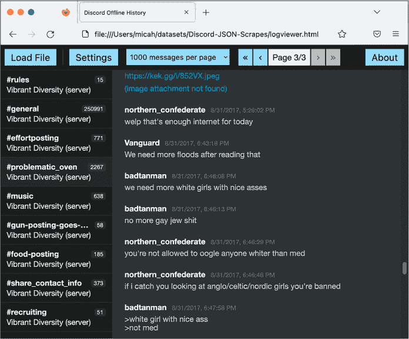
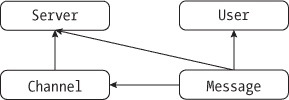
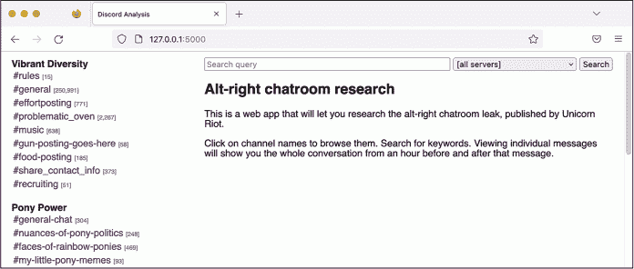
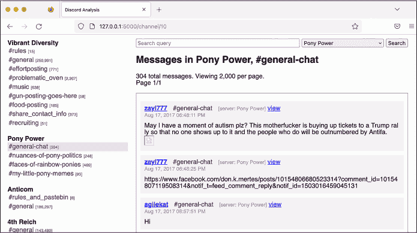

## 第十四章：14 新纳粹分子及其聊天室


2017 年 8 月初，数百名白人至上主义者在弗吉尼亚州夏洛茨维尔市集结，参加“团结右派”集会。抗议者们来自先锋美国、身份欧洲（Identity Evropa）、南方联盟（League of the South）和三 K 党等团体，举着纳粹和南方邦联战旗，戴着红色的“让美国再次伟大”帽子，喊着“犹太人不会取代我们！”等口号。

2017 年 8 月 12 日，詹姆斯·亚历克斯·菲尔兹（James Alex Fields Jr.）被他的高中历史老师形容为“对阿道夫·希特勒和白人至上主义深感兴趣”，他驾车冲入一群反对抗议者中，造成 32 岁的赫瑟·海耶（Heather Heyer）死亡，19 人受伤。在事件发生之前，菲尔兹曾被看到拿着先锋美国的盾牌参加游行。就在那天，一群六个白人男子跟随 20 岁的黑人特殊教育助理教师德安德烈·哈里斯（DeAndre Harris）进入一个停车库，用棍棒和金属管殴打他，这一袭击被拍成视频并上传到互联网。面对这种种族主义暴力，特朗普曾著名地表示，“双方都有非常优秀的人。”

“团结右派”集会，像 2017 至 2021 年特朗普总统任期内美国法西斯主义运动的许多活动一样，主要是在网上组织的，使用的是 Discord 平台——一个为游戏玩家设计的群聊平台。在 Discord 中，用户加入*服务器*（一组聊天室）或*频道*（单个聊天室）。每个频道讨论不同的主题。法西斯分子为他们的地方仇恨团体创建了 Discord 服务器，也用于像组织“团结右派”这样的项目。

一名反法西斯渗透者获得了用于组织“团结右派”集会的服务器访问权限，这个服务器名为 Charlottesville 2.0，此外还访问了当时法西斯分子使用的许多其他服务器。随后，他们将聊天日志泄露给了 Chris Schiano 和 Dan Feidt，这两位记者与独立非营利新闻团体 Unicorn Riot 合作。此次泄露以 Discord 应用的截图、包含数千条信息的大型 JSON 文件和语音会议的录音形式呈现。

在本章中，我将描述 JSON 聊天日志文件的结构，以及我如何分析这些文件，使用的技术涵盖在第十一章中。我会介绍我编写的自定义应用程序，用于调查这个数据集，并解释我如何使用它调查一个名为 Pony Power 的 Discord 服务器，其成员曾揭露他们的政治敌人。你还将了解 DiscordLeaks 的内幕故事，这是 Unicorn Riot 基于我的应用程序创建的公共可搜索档案，包含来自极右翼 Discord 服务器的数百万条聊天消息。最后，我将讨论发生在“夏洛茨维尔集会”四年半后，美国新纳粹组织 Patriot Front 的一次重大黑客事件。此次黑客攻击包括来自 RocketChat 的聊天日志，RocketChat 是一个自托管系统，Unicorn Riot 也将其托管在 DiscordLeaks 中。

就像我对 AFLDS 数据集的报道一样，这个案例研究是具有现实世界影响的新闻报道。我的工作，连同 Unicorn Riot、反法西斯渗透者和其他匿名开发者的努力，帮助导致了针对美国最臭名昭著的白人至上主义领导人和组织的庭外和解，结果造成超过 2500 万美元的赔偿。我希望这个案例研究能够激励你在未来获得结构化聊天记录数据集时，也能开展自己的工作。随着远程工作的兴起，以及 Discord、Slack 和 RocketChat 等聊天平台的日益流行，这类泄露事件变得愈发常见。

我将从简要描述这些聊天记录是如何泄露的开始。

### 反法西斯分子如何渗透新纳粹 Discord 服务器

Unicorn Riot 的记者们在 Charlottesville 地面上报道了 Unite the Right 集会。随后几天，这个组织宣布它收到了来自参与集会的极右翼团体，特别是 Charlottesville 2.0 Discord 服务器的匿名泄露聊天记录。它开始根据这些泄露内容发布文章，展示了有关暴力预谋的证据、关于用车撞击抗议者的恶搞图片，以及集会后庆祝 Heather Heyer 谋杀的帖子。它还发布了包含成千上万张来自渗透 Discord 服务器的截图的 ZIP 文件。研究人员，包括业余和专业人士，立刻开始将这些聊天记录中的线索与社交媒体上发布的事件照片和视频进行关联，以识别具体的法西斯活动分子。

除了 Charlottesville 2.0，其他泄露的法西斯 Discord 服务器的名称还包括 Vibrant Diversity、Ethnoserver、Safe Space 3 和 4th Reich。一些服务器只有几十个用户，而其他服务器的用户数超过了千人。那个时候最活跃的服务器 Vibrant Diversity 有一个名为 #problematic_oven 的频道，用户们在这里分享种族主义的恶搞图片。4th Reich 服务器有一个名为 #rare_hitlers 的频道，用户们分享来自纳粹德国的复古宣传资料。

一旦 Unicorn Riot 和其他媒体的报道让 Discord 意识到纳粹分子正在依赖它的服务，聊天平台关闭了许多极右翼的聊天服务器和账号。公司在一份声明中表示：“Discord 的使命是围绕游戏将人们聚集在一起。我们倡导积极性和包容性，不容忍仇恨，不容忍暴力。” “我们将继续采取行动，反对白人至上主义、纳粹意识形态以及所有形式的仇恨。”然而，关闭个别服务器和账号并没有奏效；法西斯分子很快就创建了新的账号，设立了新的聊天服务器。反法西斯分子也同样迅速渗透这些新服务器，并继续将聊天记录泄露给 Unicorn Riot。

法西斯分子开始传播阴谋论，声称没有渗透者，实际上是 Discord 自己将他们的聊天记录出售给了南方贫困法律中心（Southern Poverty Law Center），这个非营利组织专门监控仇恨团体。臭名昭著的纳粹网站《每日风暴》（The Daily Stormer）创始人安德鲁·安格林（Andrew Anglin）在 2018 年 4 月的一篇博客文章中写道：“即使‘夏洛茨维尔策划服务器’是高度安全的，没人能弄明白是谁泄露了它，它仍然被泄露了。”他继续说道，“从那时起，服务器屡次被泄露，人们在无法弄清楚如何被泄露的情况下被人肉搜索。我反复且持续地得到理由相信，这些并不是 Discord ‘泄露’，而是我们的敌人购买的数据。” 当然，这不是真的。安格林没有提供任何证据，Discord 的隐私政策承诺不出售用户数据，而我们确切知道数据是如何泄露的：反法西斯分子通过假装是种族主义者被邀请进入群组。

在“联合极右”（Unite the Right）事件发生几周后，我自己也获得了一些这些聊天记录，并开始分析它们。

### 分析泄露的聊天记录

在 2017 年 8 月下旬，Unicorn Riot 开始根据泄露的聊天记录发布文章时，集体中的某个人问我是否愿意为《拦截报》（The Intercept）报道法西斯聊天记录。虽然新闻行业的竞争激烈，每个新闻机构都在争抢率先发布新闻而不被抢先报道，但当涉及复杂的数据集时，情况往往正好相反。当显然没有单一新闻机构拥有足够资源来发现数据集中的所有重要信息时，邀请其他新闻机构并共享数据访问权限显得很有意义。这种合作有助于每个人，因为不同的新闻机构有不同的受众，并且这样可以增加报道对现实世界产生影响的可能性。

我的 Unicorn Riot 联系人发给我一个 ZIP 文件，里面包含了多个 Discord 服务器的 JSON 文件和 Discord 聊天截图。JSON 文件包含了这些聊天室中所有发布内容的完整日志，而截图仅捕捉了特定的对话。虽然截图最初使用起来更简单，因为你不需要编写任何代码或使用特殊工具来查看它们，但将聊天记录存储在像 JSON 这样的结构化数据格式中，从长远来看要有用得多。浏览聊天截图的最佳方式是打开单个图片，一次阅读一个，记下包含有趣内容的文件名，并根据需要回看它们。当你处理成千上万张截图时，这种方法很快就变得难以管理。

我开始深入研究这些 JSON 文件，看看我到底在处理什么。具体来说，我使用了方便的命令行工具jq，以便准确了解这些数据的结构，从而找到用户和频道的列表，并读取每个频道中的消息。

> 注意

*除了手动阅读截图并做笔记外，另一个选择是使用像 Aleph 这样的软件对截图进行索引，这在第五章中提到过。Aleph 然后会对图片进行 OCR 处理，提取文本并使我能够在其中搜索关键字。这有助于定位特定消息，但最终它仍然不如结构化数据有用。如果今天我只拥有截图而没有 JSON 数据，我一定会依赖 Aleph。*

#### 使 JSON 文件可读

我的源发送的 ZIP 文件中的每个 JSON 文件都包含了一个给定 Discord 服务器的完整聊天记录归档。例如，一个 29MB 的 JSON 文件名为 *VibrantDiversityComplete-Sept5at327PM*。为了本书的示例更易阅读，我将其重命名为 *VibrantDiversity.json*。

当我在文本编辑器中打开这个文件时，它的内容如下：

```
{"meta":{"users":{"231148326249037824":{"name":"D'Marcus Liebowitz"},"232213403974893569":{"nam
e":"northern_confederate"},"279620004641767424":{"name":"☇Unlimited Power☇"},"23338059623405977
6":{"name":"OrwellHuxley"},"289851780521787392":{"name":"badtanman"},"337421867700715524":{"nam
e":"spadegunner"},"315936522656546818":{"name":"erz1871"},"122932975724789761":{"name":"Archer"
},"201547638129164290":{"name":"SLUG2_"},"288899711929286667":{"name":"million plus"},"25019824
`--snip--`
```

这块数据对人类来说不太容易阅读。正如你在第十一章中学到的，重新格式化后的 JSON 数据更容易阅读，使用换行、缩进和语法高亮。通过 jq 命令，我在终端中对其进行了格式化并添加了语法高亮，结果如下：

```
micah@trapdoor Discord-JSON-Scrapes % **cat VibrantDiversity.json | jq**
{
  "meta": {
    "users": {
      "231148326249037824": {
        "name": "D'Marcus Liebowitz"
      },
      "232213403974893569": {
        "name": "northern_confederate"
      },
      "279620004641767424": {
        "name": "☇Unlimited Power☇"
      },
`--snip--`
```

运行这个命令为文件内容添加了格式化和语法高亮，但仍然导致 29MB 的文本在我的终端中疯狂滚动。为了更好地理解数据，我需要运行更具体的命令来揭示它的整体结构。

#### 使用 jq 探索对象、键和值

我可以通过查看 JSON 数据的开头，判断整个文件是一个大的 JSON 对象，而该对象的一个键是 meta。我运行了以下 jq 命令来查看还有哪些其他的键：

```
**cat VibrantDiversity.json | jq 'keys'**
```

输出告诉我，每个 Discord 服务器的数据包括两部分：data 和 meta：

```
[
  "data",
  "meta"
]
```

猜测 meta 包含了服务器的元数据，我运行了以下命令来确定 meta 对象的键：

```
**cat VibrantDiversity.json | jq '.meta | keys'**
```

该命令将cat VibrantDiversity.json的输出作为输入传递给jq '.meta | keys'命令。看起来像是有第二个管道符号，其实没有。字符串'.meta | keys'实际上只是传递给jq的一个单独参数。管道符号用于将多个jq过滤器链在一起，使得一个过滤器的输出被传递给下一个过滤器的输入；在这种情况下，.meta输出<meta>键的值，并将其传递给< samp class="SANS_TheSansMonoCd_W5Regular_11">keys，从中输出该值的所有键。

输出显示，元数据中包含了关于频道、服务器和用户的信息：

```
[
  "channels",
  "servers",
  "userindex",
  "users"
]
```

到目前为止，我只看过 JSON 对象的键值。现在是时候查看一些内容了，从服务器开始。通过运行jq '.meta .servers'，我可以查看<meta>对象内< samp class="SANS_TheSansMonoCd_W5Regular_11">servers键的值：

```
**cat VibrantDiversity.json | jq '.meta.servers'**
```

清单 14-1 中的输出显示，*VibrantDiversity.json*在元数据部分列出了一个服务器，Vibrant Diversity，正如我所预期的。

```
[
  {
    "name": "Vibrant Diversity",
    "type": "SERVER"
  }
]
```

清单 14-1：VibrantDiversity.json 中的服务器列表

我能看出这个输出是一个数组，因为它是一个由方括号([和])包围的项目列表。

接下来，我想查看这个服务器有哪些频道，于是我运行了以下命令来查看<meta>对象中< samp class="SANS_TheSansMonoCd_W5Regular_11">channels键的值：

```
**cat VibrantDiversity.json | jq '.meta.channels'**
```

清单 14-2 显示了这个命令的输出。

```
{
  "274024266435919872": {
    "server": 0,
    "name": "rules"
  },
  "274262571367006208": {
    "server": 0,
    "name": "general"
  },
  "292812979555139589": {
    "server": 0,
    "name": "effortposting"
  },
  "288508006990348299": {
    "server": 0,
    "name": "problematic_oven" },
  "274055625988898816": {
    "server": 0,
    "name": "music"
  },
  "343979974241550337": {
    "server": 0,
    "name": "gun-posting-goes-here"
  },
  "328841016352440320": {
    "server": 0,
    "name": "food-posting"
  },
  "274025126641795074": {
    "server": 0,
    "name": "share_contact_info"
  },
  "288901961313550336": {
    "server": 0,
    "name": "recruiting"
  }
}
```

清单 14-2：Vibrant Diversity 服务器中的频道列表

与清单 14-1 中的输出是一个数组不同，.meta.channels的输出是一个 JSON 对象，正如其周围被大括号（{和<sam class="SANS_TheSansMonoCd_W5Regular_11">}）包围所示。

这个对象的键是长数字，可能是频道的 ID，而它们的值是包含 server 和 name 键的对象。例如，键为 288508006990348299 的频道，其值为 {"server": 0, "name": "problematic_oven"}。这些频道的 server 值都是 0。我猜测这是来自 清单 14-1 中服务器数组的索引。由于这个 JSON 文件中只有一个服务器，所以所有频道的索引都是列表中的第一个项，0。name 值为 problematic_oven。当我稍后阅读该频道的聊天记录时，发现充满了反犹太言论和纳粹表情包，*oven* 这个词显然是对大屠杀的暗示。这无疑是一个新纳粹的聊天服务器。

我想查看这个服务器的用户列表，因此我运行了以下命令来查看 users 键在 meta 对象中的值：

```
**cat VibrantDiversity.json | jq '.meta.users'**
```

清单 14-3 显示了我的输出。

```
{
  "231148326249037824": {
    "name": "D'Marcus Liebowitz"
  },
  "232213403974893569": {
    "name": "northern_confederate"
  },
  "279620004641767424": { "name": "☇Unlimited Power☇"
  },
`--snip--`
```

清单 14-3：Vibrant Diversity 服务器中的用户列表

就像 清单 14-2 中的频道列表一样，清单 14-3 中的 .meta.users 输出是一个 JSON 对象。键是长数字，可能是用户的 ID，而值是只有一个键的对象——用户的名字。

到目前为止，我已经探索了元数据键 channels、servers 和 users，但还有一个没有查看：userindex 键。我运行了以下命令来查看 userindex 键的值：

```
**cat VibrantDiversity.json | jq '.meta.userindex'**
```

清单 14-4 显示了我的输出。

```

  "231148326249037824",
  "232213403974893569",
  "279620004641767424",
`--snip--`
```

清单 14-4：Vibrant Diversity 服务器中每个用户的用户 ID 列表

.meta.userlist 命令的输出是一个 JSON 数组，而不是一个对象，数组中的每一项都是看起来像是 Discord ID 的字符串。果然，第一个项 231148326249037824，就是[清单 14-3 中的第一个用户，D’Marcus Liebowitz 的 ID。此时我还不完全理解 userlist 的用途，但很快就清楚了，正如你将在本节后面看到的那样。

在对服务器的元数据有了基本了解之后，我运行了以下命令以查找 data 对象的键：

```
**cat VibrantDiversity.json | jq '.data | keys'**
```

清单 14-5 显示了我的输出。

```
[
  "274024266435919872",
  "274025126641795074",
  "274055625988898816",
  "274262571367006208",
  "288508006990348299",
  "288901961313550336",
  "292812979555139589",
  "328841016352440320",
  "343979974241550337"
]
```

清单 14-5：Vibrant Diversity 服务器中 data 对象的键

这些键与清单 14-2 中的相同频道 ID，因此我猜测每个键的值包含了这些聊天频道中的实际消息。因为我需要从某个地方开始，所以我决定查看 #problematic_oven 频道中的聊天消息，于是我运行了以下命令：

```
**cat VibrantDiversity.json | jq '.data."288508006990348299"'**
```

这个 jq 命令的完整参数被单引号包围。过滤器的 .data 部分查看键 data，而 ."288508006990348299" 部分查看键 288508006990348299，这个键是 #problematic_oven 频道的 ID。我将 ID 用引号括起来，以便 jq 知道这个键是字符串而不是数字。

和第一次使用 jq 读取这个 JSON 文件一样，这个命令的输出滚动过一大块文本，虽然比之前少了很多。在这种情况下，输出只显示了来自一个频道的聊天消息，而不是显示 JSON 文件中的所有数据。清单 14-6 显示了输出中的几条聊天消息。

```
micah@trapdoor Discord-JSON-Scrapes % **cat VibrantDiversity.json | jq** '.data
."288508006990348299"'
{
`--snip--`
  "352992491282366485": {
    "u": 4,
    "t": 1504230368205,
    "m": "we need more white girls with nice asses"
  },
  "352992512752746496": {
    "u": 4,
    "t": 1504230373324,
    "m": "no more gay jew shit"
  },
  "352992579949690890": {
    "u": 1,
    "t": 1504230389345,
    "m": "you're not allowed to oogle anyone whiter than med"
  },
  "352992652687441920": {
    "u": 1,
    "t": 1504230406687,
    "m": "if i catch you looking at anglo/celtic/nordic girls you're banned"
  },
`--snip--`
```

清单 14-6：Vibrant Diversity 服务器中 #problematic_oven 频道的聊天消息

就像在列表 14-2 中的频道一样，这个输出是一个包含长数字的键的 JSON 对象。在这种情况下，这些键看起来像是消息 ID，而值则包含该特定聊天消息的详细信息。在每条消息中，u字段代表用户，m字段包含消息内容。t字段是 Unix 时间戳，它表示自 1970 年 1 月 1 日以来的秒数，有时是毫秒数，这是计算机科学中常用的表示特定日期和时间的方式。这些特定的时间戳是毫秒级的。

到这个时刻，我知道我正在查看两名新纳粹分子之间的对话。列表 14-6 中的前两条消息来自 ID 为 4 的用户，后两条消息来自 ID 为 1 的用户。由于 t 的值随着每条消息的发送而增大，所以这些消息似乎是按时间顺序显示的。我决定仔细查看用户 4 发送的消息 352992512752746496，其时间戳为 1504230373324。

#### 转换时间戳

Unix 时间戳是计算机以单一数字存储完整日期——年份、月份、日期和时间——的有用方式。我需要将与该消息关联的时间戳转换为人类可读的格式，以找出消息发布的日期和时间。

我在 Python 解释器中使用了以下几行代码，将 1504230373324 时间戳转换为更易于人类理解的 Python datetime 对象：

```
>>> **from datetime import datetime**
>>> **timestamp = datetime.fromtimestamp(1504230373324 / 1000)**
>>> **print(timestamp)**
```

这段代码的语法与 第八章 中用于导入模块的语法相似。不同的是，这段代码使用的语法是 from module import resource_name，从 datetime 模块中加载一个 datetime 资源。接下来，代码定义了一个名为 timestamp 的变量，并将其值设置为 datetime.fromtimestamp() 函数的返回值。该函数接受自 1970 年 1 月 1 日以来的秒数作为参数。由于 Discord 日志以毫秒为单位，而不是秒，因此这段代码首先将 Discord 时间戳除以 1000，将其转换为秒，然后再将其传递给该函数。该函数返回一个 Python 的 datetime 对象。

当我通过 print(timestamp) 显示 datetime 对象时，我可以看到这条聊天消息是在 2017 年 8 月 31 日下午 6:46 发布的：

```
2017-08-31 18:46:13.324000
```

现在，我对这次聊天交流发生的时间范围有了大致的了解。接下来，我想查看参与的用户。

#### 查找用户名

我想找到在 Listing 14-6 中发布了 352992512752746496 消息的人的用户名。该消息的 u 值是 4，于是我检查了 Listing 14-3 中的输出，查看 4 是否是一个有效的用户 ID，但发现它不在那里；该 JSON 对象中的所有用户 ID 都是 18 位数字。我转而查看了 Listing 14-4 中的输出，查看 meta 对象中 userindex 的值。userindex 的值是一个字符串数组，每个元素都是一个 18 位的用户 ID。

如第十一章所述，JSON 数组是按特定顺序排列的项目列表。另一方面，对象没有任何顺序。你通过它们的数字索引来选择数组中的值，索引从第一个项目的 0 开始。由于对象没有数字索引，因此在对象中没有第一、第二或第三个项目的概念；你可以编辑 JSON 文件来重新排列对象中的项目，结果仍然是同一个对象。因此，我猜测 u 值实际上是 userindex 数组的一个索引。

为了确定哪个用户 ID 对应于其 u 值为 4 的用户，我通过运行以下命令查找了 userindex 在索引 4 处的值：

```
**cat VibrantDiversity.json | jq '.meta.userindex[4]'**
```

这个命令类似于列表 14-4 中的命令，但因为它使用了 .meta.userindex[4]，它选择了 .meta.userindex 数组中索引为 4 的值，并且只显示那个结果。我的输出显示这个值是字符串 289851780521787392，一个 18 位的用户 ID：

```
"289851780521787392"
```

现在我有了一个用户 ID，我在以下命令中使用它来找到匹配的用户名：

```
**cat VibrantDiversity.json | jq '.meta.users."289851780521787392"'**
```

与前面的命令类似，这个命令只选择一个值进行输出。在这个例子中，它选择了 meta 键，然后是 users 键，再是 289851780521787392 键。结果是一个包含 name 键的对象：

```
{
  "name": "badtanman"
}
```

*badtanman* 是我正在寻找的用户名。

在列表 14-6 中引用的聊天记录中，用户 *badtanman* 正在与 u 值为 1 的人交谈。为了找到那个人的用户名，我运行了相同的命令，并替换了相应的 ID 数字：

```
micah@trapdoor Discord-JSON-Scrapes % **cat VibrantDiversity.json | jq '.meta.userindex[1]'**
"232213403974893569"
micah@trapdoor Discord-JSON-Scrapes % **cat VibrantDiversity.json | jq '.meta.users."232213403974**
**893569"'**
{
  "name": "northern_confederate"
}
```

我发现，列表 14-6 中的聊天记录片段是 *badtanman* 和 *northern_confederate* 于 2017 年 8 月 31 日晚上的对话。

执行所有这些 jq 命令，并在 Python 解释器中运行代码以转换时间戳，确实很繁琐。如果面对大量的聊天记录，你不会想通过这种方式逐一研究每一组消息。但当你首次探索一个陌生的数据集时，你需要像这样手动探索，直到更好地理解数据的结构。在做完这个初步分析后，我就可以利用对聊天记录的新理解编写 Python 脚本，甚至开发一个完整的自定义应用程序（就像我最终为这个数据集开发的那样）来辅助我的研究。

然而，在我真正开始编写 Python 代码以更轻松地解析这些聊天记录之前，我注意到在 Unicorn Riot ZIP 文件中有一个我之前错过的文件，它可能会让研究这个数据集变得更加轻松。

### Discord 历史跟踪器

我从 Unicorn Riot 联系人处获得的 ZIP 文件中有几十个文件，其中大多数是 JSON 文件和 PNG 截图，还有一些文件夹包含其他 JSON 文件。我立即将注意力集中在 JSON 文件上，分析它们的数据结构，但直到现在，我才注意到 *logviewer.html* 文件。这是一个 HTML 和 JavaScript 文件，当在网页浏览器中打开时，它可以让我加载 JSON 聊天记录文件并阅读其中的内容。

与我的 Unicorn Riot 联系人交谈后，我了解到这个本地 HTML 文件是一个名为 Discord History Tracker 的开源软件的一部分。这个软件与 Discord 没有任何关联，它允许用户以 JSON 格式保存他们在特定 Discord 服务器中可以访问的所有内容的离线副本。反法西斯活动家使用这个软件从 Vibrant Diversity、Charlottesville 2.0 以及其他法西斯主导的 Discord 服务器中提取聊天记录。

Discord 历史跟踪器包括两个组件。主要组件负责实际创建 Discord 服务器的备份。用户需要在他们的网页浏览器中加载 Discord 服务器，打开开发者工具，并将 Discord 历史跟踪器的 JavaScript 代码复制并粘贴到浏览器控制台中。这样就会抓取 Discord 服务器中的所有数据，并保存为 JSON 格式的备份文件。Discord 历史跟踪器的第二个组件是 *logviewer.html* 文件，它包含了查看这些备份文件的离线 HTML 软件。

图 14-1 显示了在网页浏览器中加载的 *logviewer.html*。在截图中，我已经滚动到了 #problematic_oven 频道中 *badtanman* 和 *northern_confederate* 之间的上述消息。

> 注意

*图 14-1 中的截图展示的是 2017 年的软件界面。自那时以来，Discord 历史跟踪器的界面有了很大变化。除了其他变化，它现在将数据保存在 SQLite 数据库中，而不是 JSON 文件中，并且你可以在桌面应用程序中查看日志，而不再需要使用* logviewer.html *文件。你可以在* [`dht.chylex.com`](https://dht.chylex.com) *了解更多关于该软件的信息。*



图 14-1：2017 年 8 月 31 日， badtanman 与 northern_confederate的聊天记录，查看自 Discord 离线历史网页应用程序

这个离线 HTML 查看器软件使得浏览和阅读 JSON 文件的内容变得更容易。我可以点击左侧的频道，然后一次性阅读一页聊天记录。然而，它也缺少一些对我持续调查很重要的功能：

+   没有简单的方法来搜索单个消息。例如，假设我想搜索提到**伯克利**（我当时居住的城市）的消息。我必须点击像#general 这样的频道，使用我浏览器的搜索功能搜索*Berkeley*，然后找出出现在#general 频道中的哪些消息。我还需要更改设置，将每页显示的消息数量改为显示所有消息，这样我就能一次性搜索所有消息，而不是像图 14-1 中所示，每次仅显示 1,000 条消息。然后，我还需要为服务器中的其他每个频道重复这个搜索，如果我还想搜索其他 Discord 服务器的消息，我就必须为每个服务器中的每个频道重复此操作。

+   离线查看器仅支持一次查看一个服务器，但我希望能够同时搜索多个服务器，并且能够追踪一个用户在不同服务器中的消息。

+   没有办法生成指向单个消息的超链接。当你根据聊天记录为故事做笔记时，能够追踪感兴趣的消息是非常有用的。如果没有链接，你就必须不断地回去重新搜索特定的消息。

我决定构建自己的 Web 应用程序，添加这些缺失的功能。我已经将所有的聊天记录按结构化格式整理好了，这也是构建自定义应用程序的最大前提条件，就像你在第十章中讨论 BlueLeaks Explorer 时学到的那样。如果我只有 Discord 服务器的截图，拥有这些功能的自定义应用程序将是不可能的。截图不是结构化数据，且没有简便的方式编写软件，让你浏览其中包含的聊天消息。

### 一个用于搜索 JSON 文件的脚本

正如你在本书中学到的，理解数据的结构是编写能够与其交互的代码的前提。因此，我决定利用通过手动调查 JSON 文件获得的知识，使用jq构建一个简单的 Python 脚本，允许我在其中一个 JSON 文件中搜索关键词。最初我认为这个脚本可以完成我所有需要的分析工作，但结果证明这是错误的；我最终还是写了一个完整的自定义应用程序来调查这个数据集。尽管如此，这个初始的（相对简单的）脚本使我能够使用 Python 代码表达我已经掌握的数据集结构，从而简化了编写完整 Web 应用程序的过程。在这一部分，我将详细介绍我的初始 Discord JSON 搜索脚本是如何工作的。

例如，我知道我的脚本需要能够根据我搜索的内容显示聊天消息。假设我希望我的代码显示来自 Listing 14-6 的以下聊天消息：

```
"352992491282366485": {
  "u": 4,
  "t": 1504230368205,
  "m": "we need more white girls with nice asses"
}
```

u键的值是4，但现在我知道如何找到发布此消息的人的实际用户名。首先，我的代码需要在 JSON 的meta对象中查找，并选择userindex数组中的第四个项，这是用户 ID 289851780521787392。然后，我的代码会再次查找 JSON 中的meta对象，这次查找users键，并使用该用户 ID 作为键来获取该用户对象：

```
{
  "name": "badtanman"
}
```

我的代码会从该对象中选择name字符串，获取消息发布者的用户名badtanman，然后复制整个过程，显示每条消息的正确用户名。

我打开了文本编辑器，并开始编写一个 Python 脚本，*discord-json -search.py*，用于在其中一个 JSON 文件中搜索关键词。以下是我完成的源代码（你也可以在[*https://<wbr>github<wbr>.com<wbr>/micahflee<wbr>/hacks<wbr>-leaks<wbr>-and<wbr>-revelations<wbr>/blob<wbr>/main<wbr>/chapter<wbr>-14<wbr>/discord<wbr>-analysis<wbr>/discord<wbr>-json<wbr>-search<wbr>.py*](https://github.com/micahflee/hacks-leaks-and-revelations/blob/main/chapter-14/discord-analysis/discord-json-search.py)中找到它）：

```
#!/usr/bin/python3
import sys
import json
import click
from datetime import datetime

def highlight(message, query): ❶
    new_message = ""
    index = 0
    while True:
        new_index = message.lower().find(query.lower(), index)
        if new_index > 0:
            # Found
            new_message += message[index:new_index]
            new_message += click.style(
                message[new_index : new_index + len(query)], underline=True
            )
            index = new_index + len(query)
        else:
            # Not found
            new_message += message[index:]
            break

    return new_message

def display(channel_name, server_name, user_name, timestamp, message, query): ❷
    click.echo(
        "{} {}".format(
            click.style("#{}".format(channel_name), fg="bright_magenta"),
            click.style("[server: {}]".format(server_name), fg="bright_black"),
        )
    )
    click.echo(
        "{} {}".format(
            click.style(user_name, bold=True),
            click.style(timestamp.strftime("%c"), fg="bright_black"),
        )
    )
    click.echo(highlight(message, query))
    click.echo("")

def search(data, query): ❸
    # Loop through each channel
    for channel_id in data["data"]: ❹
        # Get the channel name and server name
        channel_name = data["meta"]["channels"][channel_id]["name"] ❺ server_name = data["meta"]["servers"][
            data["meta"]["channels"][channel_id]["server"]
        ]["name"]

        for message_id in data["data"][channel_id]: ❻
            # Pull the user data, timestamp, and message body from the message
            user_index = data["data"][channel_id][message_id]["u"]
            user_id = data["meta"]["userindex"][user_index]
            user_name = data["meta"]["users"][user_id]["name"]
            timestamp = datetime.fromtimestamp(
                data["data"][channel_id][message_id]["t"] / 1000
            )
            message = data["data"][channel_id][message_id]["m"]

            # Is the query in the message?
            if query.lower() in message.lower(): ❼
                display(channel_name, server_name, user_name, timestamp, message, query) 

@click.command()
@click.argument("filename", type=click.Path(exists=True))
@click.argument("query")
def main(filename, query): ❽
    # Load the JSON file
    try:
        with open(filename) as f:
            data = json.loads(f.read())
    except:
        print("Failed to load JSON file")
        sys.exit()

    # Search
    search(data, query)

if __name__ == "__main__":
    main()
```

从下到上解释这个脚本是最简单的，因为它就是这样执行的，也是我编写它的方式。main() 函数 ❽ 是一个 Click 命令，接受两个参数：一个名为 filename 的 JSON 文件，包含 Discord 聊天记录；另一个是名为 query 的搜索词。代码打开传入的文件名，并使用 json.loads() 解析它，将其转换为 JSON 对象。然后它调用 search() 函数，传入来自 JSON 文件的数据和搜索查询。

search() 函数 ❸ 是所有“魔法”发生的地方。从我之前的分析中，我知道这些 Discord JSON 对象有两个键：data 键，它包含每个频道的消息，以及 meta 键，它包含这些消息的元数据。我的脚本首先通过循环遍历 data['data'] ❹ 中的每个频道，然后使用它的 channel_id 查找该频道的名称和服务器的元数据 ❺。接着，它遍历该频道中的每一条消息 ❻，并将消息的用户名、时间戳和消息内容存储在变量中。

然后，代码检查传递给脚本的搜索查询（存储在 query 中）是否存在于消息（存储在 message 中） ❼。正如在第七章中所述，它使用 lower() 方法将两个字符串转换为小写，从而使搜索不区分大小写。如果消息的小写版本包含搜索词的小写版本，脚本就会将所有相关变量传递给 display() 函数，以在终端显示该消息。

`display()` 函数 ❷ 接受关于消息的元数据、消息文本本身和搜索词的参数，并利用这些参数显示消息。此代码使用 `click.echo()` 替代 `print()` 来显示终端文本，并使用 `click.style()` 来应用不同的颜色和格式。 (你也可以仅使用 `print()` 函数来实现这一点，但 `click` 模块使得终端输出的样式更为简便。) 在显示了消息的两行元数据后，脚本接着显示了 `highlight()` 函数的输出，该函数将消息以带颜色的形式返回，并将搜索词加下划线。

`highlight()` 函数 ❶ 创建了一个名为 `new_message` 的空字符串，然后将它设置为 `message` 的副本，显示的原始消息，除了搜索词的所有实例都使用 `click.style()` 被加上了下划线。然后它返回 `new_message` 并在 `display()` 函数中显示给终端。

例如，如果我想在 *VibrantDiversity.json* 中搜索 *berkeley*，我可以运行：

```
**python3 discord-json-search.py ~/datasets/Discord-JSON-Scrapes/VibrantDiversity.json "berkeley"**
```

输出列出了上百条提到 Berkeley 的聊天消息。每条消息显示了频道的名称、Discord 服务器的名称、发布者的用户名和时间，以及消息的内容。以下是第一段输出，它在消息中将搜索词加了下划线：

```
#general [server: Vibrant Diversity]
Hector Sun Sep  3 20:19:11 2017
Look at how many antifa were at Boston and Berkeley.  We need numbers.  We can't have rallies with less than a thousand people now.  Even that's a low number.
`--snip--`
```

第一条提到 Berkeley 的消息是 2017 年 9 月 3 日 *Hector* 用户在 #general 频道中的一条帖子。该用户抱怨与“antifa”反对抗议者相比，波士顿和 Berkeley 的集会中出现的法西斯主义者人数相对较少。

这个脚本让我能够在整个 Discord 服务器中搜索关键词，但它仍然缺乏我想要的几个功能：它一次只能处理一个 Discord 泄漏，并且没有简便的方法浏览和按顺序阅读数据，或者保存特定有趣消息的链接。我开始构建一个 web 应用程序，帮助我完成这些缺失的任务。

### 我的 Discord 分析代码

我发现，在获得一个包含大量结构化数据的数据集后，像我在 BlueLeaks Explorer 中做的那样，构建一个自定义网页应用来探索数据，能更轻松地发现其中隐藏的启示。在编写*discord-json -search.py*后，我花了大约一周时间创建了 Discord 分析工具，一个自定义网页应用，用于分析泄露的 Discord 聊天记录。

由于我希望能够同时搜索多个 Discord 服务器，我决定最好的解决方案是将所有数据从 JSON 文件转换成 SQL 数据库。我使用了自己已经熟悉的 Python 技术栈，Flask（在第十章中简要讨论）用于网页应用，SQLAlchemy 用于与 SQL 数据库通信。

SQLAlchemy 是一个*对象关系映射（ORM）*的 Python 模块，能够简化编写与 SQL 数据库交互的代码，并提高安全性。ORM 允许你以无需直接编写 SQL 代码的方式与 SQL 数据库交互，这意味着你的项目不会容易受到 SQL 注入攻击。这个网页应用使用了 Flask-SQLAlchemy，这是一个将 SQLAlchemy 支持添加到 Flask 应用中的 Flask 扩展。

在开发我的 Discord 分析网页应用时，我积极使用它来研究泄露的 neo-Nazi 聊天记录。如果我对数据有了新的问题（比如某个用户发布了哪些其他消息），或者发现需要新的功能（比如将搜索限制在单个服务器内），我就会在过程中直接编写相应的功能。这通常是我构建研究工具的方式：在工具还未完成之前，我就开始使用它，并让我的研究方向指导我接下来添加的功能。

在本节中，我将解释如何开发应用的不同组件：设计 SQL 数据库、将 Discord JSON 文件中的聊天记录导入到数据库中，以及构建网页界面来研究这些聊天记录。你将学习如何使用 SQLAlchemy 定义数据库表，向表中插入行，并从表中选择行。你还将学习如何使用 Flask 构建这个网页应用，包括如何制作 Jinja 模板以及如何定义路由——这些技能对你未来构建自己的 Flask 网页应用非常重要。

> 注意

*完全解释如何构建一个 Flask 和 SQLAlchemy 的 web 应用程序超出了本书的范围。相反，我将大致讲述我如何构建这个应用程序的过程，这对你如果将来决定构建类似的应用程序依然会有帮助。学习如何制作自己的 Flask 应用程序的最佳方式是通过探索 Flask 的优秀文档，* [`flask.palletsprojects.com`](https://flask.palletsprojects.com)*；* *那就是我学习的方式。Flask 文档包括一个教程，带你逐步开发一个简单的 web 应用程序。你在 第七章 和 第八章 学到的 Python 技能足以让你跟随教程的步骤。你还可以在* [`<wbr>www<wbr>.sqlalchemy<wbr>.org`](https://www.sqlalchemy.org) *找到 SQLAlchemy 的文档，并在* [`flask-sqlalchemy.palletsprojects.com`](https://flask-sqlalchemy.palletsprojects.com)* 找到 Flask 的 SQLAlchemy 扩展的文档。*

Discord 分析的代码已经悄悄地在我的 GitHub 账户上公开多年，自 2017 年以来没有太多更新，除了我为本书做准备时进行的一些小改动。我并不打算继续维护它。不过，如果你想深入探索，它应该能在本地运行，并且你可以将它作为你自己未来使用类似技术栈的项目的灵感来源。阅读这一节，了解它是如何工作的，如果你感兴趣，可以尝试自己在本地运行它。

在解释应用程序时，我会引用一些源代码片段。源代码太长，不能在这里全部展示，但你可以在本书的 GitHub 仓库中找到完整的代码，地址是 [*https://<wbr>github<wbr>.com<wbr>/micahflee<wbr>/hacks<wbr>-leaks<wbr>-and<wbr>-revelations<wbr>/tree<wbr>/main<wbr>/chapter<wbr>-14<wbr>/discord<wbr>-analysis*](https://github.com/micahflee/hacks-leaks-and-revelations/tree/main/chapter-14/discord-analysis)。我建议你在我描述代码如何工作时，查看每个文件的完整源代码。

#### 设计 SQL 数据库

我从一个名为 *app.py* 的 Python 脚本开始构建我的 web 应用程序。你可以在 [*https://<wbr>github<wbr>.com<wbr>/micahflee<wbr>/hacks<wbr>-leaks<wbr>-and<wbr>-revelations<wbr>/blob<wbr>/main<wbr>/chapter<wbr>-14<wbr>/discord<wbr>-analysis<wbr>/app<wbr>.py*](https://github.com/micahflee/hacks-leaks-and-revelations/blob/main/chapter-14/discord-analysis/app.py) 找到该文件的完整源代码。首先，我的代码导入了适当的 Flask 和 SQLAlchemy 模块，创建了一个新的 Flask 应用程序对象，命名为 app，并创建了一个新的 Flask-SQLAlchemy 对象，命名为 db：

```
from flask import Flask, render_template, request, escape, flash, redirect
from flask_sqlalchemy import SQLAlchemy

app = Flask(__name__)
app.config["SQLALCHEMY_DATABASE_URI"] = "sqlite:///database.sqlite3"
app.config["DEBUG"] = True

db = SQLAlchemy(app)
```

我首先从flask模块中导入了几个我知道以后会用到的项目，例如Flask和render_template。在接下来的代码行中，我还从flask_sqlalchemy模块中导入了SQLAlchemy。

使用新导入的Flask，我创建了一个名为app的 Flask 对象。每个 Flask web 应用都会包含这样一个对象（通常是这个名字），用来准确地定义应用如何工作。我修改了app.config字典，设置了一些配置项，告诉它我要使用存储在文件*database.sqlite3*中的 SQLite3 数据库，并且希望开启调试模式，这在开发 web 应用时非常有用。最后，我创建了一个名为db的 SQLAlchemy 对象，并将app传入其中。

在接下来的代码部分，我将向你介绍一个新的 Python 概念，虽然我在第三部分中没有明确讲解，但你实际上一直在使用：类。在 Python 中，*类*是创建新对象的模板，这些对象可以存储数据（使用称为*属性*的变量）并执行操作（使用称为*方法*的函数）。例如，字符串本质上是类。当你运行代码s = "example"时，变量s是字符串类的一个实例，它存储的数据是字符串example，并且它有很多可以调用的方法，比如s.upper()，它会返回字符串的大写版本。当你编写 SQLAlchemy 代码时，你会为每个数据库表定义一个类。通过这种方式，你可以编写与 Python 对象交互的代码，而无需自己编写 SQL 查询。

我开始编写代码，定义存储 Discord 数据的 SQL 表，这些数据包括服务器、用户、频道和消息。例如，以下代码定义了Server类，它代表了存储服务器数据的 SQL 表：

```
class Server(db.Model):
    id = db.Column(db.Integer, autoincrement=True, primary_key=True)
    name = db.Column(db.String(128), unique=True, nullable=False)

    channels = db.relationship("Channel", back_populates="server")
    messages = db.relationship("Message", back_populates="server")

    def __init__(self, name):
        self.name = name
```

使用 SQLAlchemy 要求你定义自己的类。你可以将这个Server类看作是一个描述新类型 Python 对象的定义，该对象代表服务器 SQL 表中的一行。因为我将其定义为Server(db.Model)，所以这个类继承了 SQLAlchemy 中db.Model类的所有功能。在类定义内部，我定义了表的列：id（一个自动递增的数字）和name（一个字符串）。接下来，我定义了该表与其他表的关系，在这种情况下将servers与channels和messages关联——Channel表和Message表都包含一个server_id列。

最后，我定义了__init__()方法。当你定义一个类时，必须调用每个方法的第一个参数self，以表示这个 Python 对象本身。你也可以选择性地包含其他参数。__init__()方法是一种被称为*构造函数*的方法，它在你创建对象时立即运行。这个构造函数将对象的name属性的值（你可以在类内部通过self.name访问）设置为传入__init__()方法的参数name的值。

例如，要向 Vibrant Diversity Discord 服务器的 SQL 数据库中的Server表添加一行，我可以运行列表 14-7 中的代码。（我的 Discord 分析应用实际上并没有使用这段代码——它是从 JSON 数据加载服务器的——但我包含这个示例是为了帮助你理解如何使用 SQLAlchemy 类与数据库交互，而无需编写 SQL 查询。）

```
server = Server("Vibrant Diversity")
db.session.add(server)
db.session.commit()
```

列表 14-7：使用 SQLAlchemy 将数据插入 SQL 数据库

第一行代码通过运行Server("Vibrant Diversity")来创建一个Server对象。这将执行构造方法，并将字符串Vibrant Diversity作为name传入。构造方法随后会将其name属性的值设置为传入的名称。当构造方法执行完成后，代码将把这个新创建的 Python 对象保存在server变量中。接下来的两行代码使用 SQLAlchemy 对象db执行 SQL 数据库中的INSERT查询并插入这一行数据。db.session.add()方法收集一系列 SQL 查询，而db.session.commit()方法则会在数据库上执行这些 SQL 查询。在 SQL 中，有时一次性执行多个查询并提交比一个一个执行更高效。

换句话说，清单 14-7 中的代码基本上等同于执行 SQL 查询INSERT INTO server SET name='Vibrant Diversity';，只不过这种方式，你只需要与 Python 对象进行交互，而不需要自己编写 SQL。创建完 server 对象后，我可以通过server.id访问该对象的 ID 属性，或通过server.name访问该对象的 name 属性。

除了我刚才描述的<sam class="SANS_TheSansMonoCd_W5Regular_11">Server表格，我还创建了以下表格，您可以在[*app.py*文件中详细查看](https://github.com/micahflee/hacks-leaks-and-revelations/blob/main/chapter-14/discord-analysis/app.py)：

用户 一个 Discord 用户。我包括了列id、discord_id和name。id列是一个自动递增的数字，而discord_id是 Discord 本身使用的原始 ID。这对于在不同服务器间识别相同的用户非常有用。

频道 Discord 服务器中的一个频道。列包括 id、discord_id、名称 和 server_id。server_id 列与 Server 表格形成关系，因为每个服务器都有一组频道。每个 Discord 服务器的 JSON 文件都包含一个频道列表。添加此关系意味着我设计的 SQL 数据库将与 JSON 文件中的数据结构匹配。

消息 一个 Discord 消息。列包括 id、discord_id、时间戳、消息内容、附件 _json、user_id、channel_id 和 server_id。附件 _json 列包含带有附件的消息的额外数据，比如当有人向 Discord 发布图片时。user_id、channel_id 和 server_id 列与 User、Channel 和 Server 表格形成关系。这些列的结构也与 JSON 文件中的结构匹配。

图 14-2 显示了这四个表之间的关系。Channel 表包含一个 server_id 列，因此它与 Server 表相关联。Message 表包含 channel_id、server_id 和 user_id 列，因此它与 Channel、Server 和 User 表相关联。



图 14-2：Discord 分析应用中的 SQL 表之间的关系

我为这个网页应用的目标是构建一个界面，让我能够浏览存储在这些 SQL 表中的数据。我希望能够一次性搜索所有消息，包括来自多个服务器的消息，以便查看哪些用户在多个服务器中发布了消息，并且能够生成指向单个消息的链接，方便我在笔记中保存。不过，在构建网页界面之前，我需要先将 JSON 文件中的数据加载到数据库中。

#### 将聊天记录导入 SQL 数据库

我编写了一个单独的脚本 *admin.py*，用于将数据导入 SQL 数据库。这个脚本将命令作为第一个参数。如果我传入 create-db，它将使用 SQLAlchemy 创建我在 *app.py* 中定义的 SQL 表。如果我传入 import-json，并跟上 JSON 文件的文件名，代码将把该 JSON 文件中的 Discord 数据导入 SQL 数据库。最终，我还添加了 user-stats 命令，它显示了数据库中每个用户发布的消息数量，以及发布的服务器。

这个 *admin.py* 文件太长，无法在本章中完整展示，但与 *app.py* 一样，你可以在本书的 GitHub 仓库中找到完整代码的副本，网址是 [*https://<wbr>github<wbr>.com<wbr>/micahflee<wbr>/hacks<wbr>-leaks<wbr>-and<wbr>-revelations<wbr>/blob<wbr>/main<wbr>/chapter<wbr>-14<wbr>/discord<wbr>-analysis<wbr>/admin<wbr>.py*](https://github.com/micahflee/hacks-leaks-and-revelations/blob/main/chapter-14/discord-analysis/admin.py)。

在这一部分，我将解释我如何构建 import-json 命令（具体来说，是 import_json() 函数，它是在运行 import-json 时被调用的），这是脚本中最有趣的部分。这段代码打开包含 Discord 服务器泄露数据的 JSON 文件，遍历所有数据，然后将其插入 SQL 数据库中。与 *discord-json -search.py* 脚本一样，我依赖之前对 Discord JSON 文件的手动分析来编写这段代码。基本上，这部分需要理解原始数据的结构。

import_json() 函数过长，无法在此处全部展示，因此我将展示一些代码片段，解释它的基本工作原理。该函数接受一个包含 Discord 泄露数据的 JSON 文件的文件名作为参数。它打开这个文件，将其加载到名为 data 的变量中，然后使用 data 中的信息将服务器、用户、频道和消息添加到 SQL 数据库中。我将很快展示添加用户、频道和消息的代码，但首先，列表 14-8 展示了添加服务器的代码。

```
print("Adding servers: ", end="", flush=True)
for item in data["meta"]["servers"]:
    name = item["name"]

    try:
        server = Server(name)
        db.session.add(server)
        db.session.commit()
        print("+", end="", flush=True)
    except sqlalchemy.exc.IntegrityError:
        db.session.rollback()
        print(".", end="", flush=True)
print("")
```

列表 14-8：来自 admin.py 的代码，用于将服务器添加到数据库

这段代码循环遍历它在 data["meta"]["servers"] 中找到的所有服务器，为每个找到的服务器在数据库中添加一行。例如，在列表 14-1 中，我使用 jq 查看 *VibrantDiversity.json* 中的服务器列表，发现它只包含一个服务器。列表 14-8 使用 Python 代码从目标泄露的 JSON 文件中的相同部分查找相同的服务器列表。

对于它找到的每个服务器，代码将服务器的名称存储在 name 变量中，然后尝试将该服务器添加到数据库中。此代码使用了 Python 异常处理，你在第七章中学到过。 在 try 块中，代码创建了一个新的 Server 对象（这代表了 SQLAlchemy 中的 Server 表中的一行），使用 db.session.add(server) 将该行添加到数据库中，并最终通过 db.session.commit() 提交数据库更改，就像在列表 14-7 中的 SQLAlchemy 代码一样。服务器成功插入数据库后，程序显示一个加号符号（+），然后进入下一个循环。

当我在 *app.py* 中定义 Server 表时，我指定了 name 列应该是唯一的，意味着不允许有两行具有相同的 name 列。如果 SQLAlchemy 在脚本尝试向数据库添加行时抛出 sqlalchemy.exc.IntegrityError 异常，意味着数据库中已经存在具有该名称的服务器，应该运行 except 块。如果发生这种情况，代码将回滚它即将做出的更改，并显示一个点（.），而不是加号（+）。

为什么我一开始要担心捕获这些异常，而不是直接向数据库添加行？就像你在前几章完成的编程练习一样，我并不是第一次写好整个脚本然后运行它。相反，我是一次写一些小段代码并运行它们，以确保脚本到目前为止能正常工作。这种异常处理让我能够在每次导入相同的 JSON 文件时从中断的地方重新开始。如果我的脚本显示加号（+），那意味着它已经向数据库添加了一行。如果它显示的是点（.），则表示该行已经存在，脚本继续执行下去。

你可能还注意到，在列表 14-8 中，熟悉的 print() 函数调用看起来有些奇怪：我的代码传入了 end="" 和 flush=True 这两个关键字参数。默认情况下，print() 会显示用户传入的字符串作为参数，然后在末尾添加一个换行符 (\n)。end 参数替代了换行符（在这种情况下是一个空字符串）。换句话说，这就是我如何在不换行的情况下打印字符串。flush=True 参数确保输出会立即显示在屏幕上；没有它，输出仍然会显示，但不会在函数调用之后立即显示。这让我能够实时监控导入进度。

添加服务器后，脚本添加了用户，如列表 14-9 所示。

```
print("Adding users: ", end="", flush=True)
for user_discord_id in data["meta"]["users"]:
    name = data["meta"]["users"][user_discord_id]["name"]

    try:
        user = User(user_discord_id, name)
        db.session.add(user)
        db.session.commit()
        print("+", end="", flush=True)
    except sqlalchemy.exc.IntegrityError:
        db.session.rollback()
        print(".", end="", flush=True)
print("")
```

列表 14-9：来自 admin.py 的代码，用于向数据库添加用户

这段代码与 第 14-8 节 非常相似，但它不是循环遍历列表 data["meta"]["servers"]，而是循环遍历字典 data["meta"]["users"]。 第 14-3 节 展示了来自 *VibrantDiversity.json* 的用户 JSON 对象。如同在 第八章 中所描述，当你循环遍历字典时，实际上是在循环遍历字典的键。在这种情况下，脚本将每个键存储在 user_discord_id 变量中。获取了用户的 Discord ID 后，它接着在元数据中查找该用户的姓名。

在 try 块中，脚本接着创建了一个新的 User 对象，这次包含了用户的 Discord ID 和姓名，并尝试将其添加到数据库。当我在 *app.py* 中定义 User 表时，我指定 user_discord_id 应该是唯一的，以防止用户重复。像 第 14-8 节 中一样，代码在将用户添加到数据库时显示了一个加号，若发生错误则显示一个点。这个错误处理代码在我开始导入多个服务器时非常重要：如果一个 Discord 用户已经在数据库中，因为他们是某个先前服务器的成员，代码就不会为他们创建重复的用户。

在添加完服务器和用户后，脚本接着添加频道，使用了 第 14-10 节 中的代码。

```
print("Adding channels: ", end="", flush=True)
for channel_discord_id in data["meta"]["channels"]:
    name = data["meta"]["channels"][channel_discord_id]["name"] server_id = data["meta"]["channels"][channel_discord_id]["server"]
 ❶ server = Server.query.filter_by(
        name=data["meta"]["servers"][server_id]["name"]
    ).first()

    try:
        channel = Channel(server, channel_discord_id, name)
        db.session.add(channel)
        db.session.commit()
        print("+", end="", flush=True)
    except sqlalchemy.exc.IntegrityError:
        db.session.rollback()
        print(".", end="", flush=True)
print("")
```

第 14-10 节：来自 admin.py 的代码，用于将频道添加到数据库

这段代码与第 14-8 节和第 14-9 节也非常相似。不过，这次它循环遍历了 data["meta"]["channels"] 字典的键，将每个键存储为 channel_discord_id。

列表 14-2 展示了来自*VibrantDiversity .json*的频道 JSON 对象，你可以回顾它来提醒自己这个字典的样子。对于每个频道，列表 14-8 中的代码将频道名称存储在name中，并将该频道的服务器索引存储在server_id中。然后，代码查询 SQL 数据库本身，以获取列表 14-10 中的服务器行 ❶，该行应该已经被列表 14-9 中的代码提前添加，并将该值存储在server中。Server.query.filter_by()函数调用运行的 SQL 查询类似于SELECT * FROM servers WHERE name='name';，其中name是服务器名称。

在try代码块中，代码创建了一个新的Channel对象，这次告诉它服务器、频道的 Discord ID 和频道名称。与之前的列表一样，它尝试将此频道添加到数据库中，成功时显示加号，若频道已存在则显示一个点。

最后，在添加服务器、用户和频道后，代码将所有消息添加到数据库中，如列表 14-11 所示。

```
for channel_discord_id in data["data"]:
    # Get the channel
    channel = Channel.query.filter_by(discord_id=channel_discord_id).one() ❶

    # Loop through each message in this channel
    print(f"Adding messages from {channel.server.name}, #{channel.name}: ", end="", flush=True)
    for message_discord_id in data["data"][channel_discord_id]:
        try:
            timestamp = data["data"][channel_discord_id][message_discord_id]["t"]
            message = data["data"][channel_discord_id][message_discord_id]["m"]

            user_index = data["data"][channel_discord_id][message_discord_id]["u"]
            user_discord_id = data["meta"]["userindex"][user_index]
            user = User.query.filter_by(discord_id=user_discord_id).first() ❷
 if "a" in data["data"][channel_discord_id][message_discord_id]:
                attachments_json = json.dumps(
                    data["data"][channel_discord_id][message_discord_id]["a"]
                  )
            else:
                attachments_json = None

            message = Message(
                channel.server,
                message_discord_id,
                timestamp,
                message,
                user,
                channel,
                attachments_json,
            )
            db.session.add(message)
            db.session.commit()
            print("+", end="", flush=True)
        except sqlalchemy.exc.IntegrityError:
            db.session.rollback()
            print(".", end="", flush=True)
    print("")
```

列表 14-11：来自 admin.py 的代码，用于将消息添加到数据库中

这次，代码遍历了data["data"]字典的所有键。正如你在列表 14-5 中学到的，这个字典的键是频道的 Discord ID。我的代码将每个 ID 存储在变量channel_discord_id中。然后，我使用 SQLAlchemy 查询数据库，以加载该实际频道的行 ❶（此命令运行的 SQL 查询类似于SELECT * FROM channel WHERE channel_discord_id=channel_discord_id，其中channel_discord_id是频道 ID）。在了解了正在处理的是哪个频道之后，代码遍历了该频道的所有消息，并将它们添加到数据库中，将每条消息的 Discord ID 存储为message_discord_id。

清单 14-11 中的其余代码也类似于清单 14-8 到 14-10。在try块中，对于每条消息，代码将时间戳和消息存储在timestamp和message变量中。然后，它从元数据中查找用户的 Discord ID，并查询 SQL 数据库中的User对象❷；如果消息包含附件，它还会创建一个名为attachments_json的字符串。最后，它创建一个Message对象，并将此消息插入数据库。如前所述，如果成功插入消息，代码会显示一个加号；如果该消息已经在数据库中，则显示一个点。

由于异常处理确保了*admin.py*不会导入重复的行，我可以使用此脚本导入来自同一 Discord 服务器的更新版 JSON 文件。例如，如果 Unicorn Riot 的渗透者在一个月后使用 Discord History Tracker 保存了 Vibrant Diversity 中所有内容的另一份离线副本，并且我导入了这个新的 JSON 文件，它只会导入新的消息。

一旦编写了这段代码，我便用它来导入我从 Unicorn Riot 接收到的所有 Discord JSON 文件。要导入 Vibrant Diversity 频道的数据，我会运行以下命令：

```
**python3 admin.py import-json ~/datasets/Discord-JSON-Scrapes/VibrantDiversity.json**
```

这是输出：

```
Adding servers: +
Adding users: +++++++++++++++++++++++++++++++++++++++++++++++++++++++++++++++++++++++++++++++++
+++++++++++++++++++++++++++++++++++++++++++++++++++++++++++++++++++++++++++++++++++++++++++++++
`--snip--`
Adding channels: +++++++++
Adding messages from Vibrant Diversity, #rules: +++++++++++++++
Adding messages from Vibrant Diversity, #general: +++++++++++++++++++++++++++++++++++++++++++++
+++++++++++++++++++++++++++++++++++++++++++++++++++++++++++++++++++++++++++++++++++++++++++++++
`--snip--`
Adding messages from Vibrant Diversity, #recruiting: ++++++++++++++++++++++++++++++++++++++++++
+++++++++
Import complete
```

输出中的每个加号代表插入到数据库中的不同数据行。*VibrantDiversity.json*文件添加了 1 个服务器，530 个用户，9 个频道，和总共 255,349 条消息，每次导入一条消息。

然后我使用*admin.py*导入了我拥有的其余 Discord JSON 文件，包括来自 Anticom、4th Reich、Ethnoserver 和其他泄露服务器的聊天记录。例如，接下来我导入了一个名为 Pony Power 的小型服务器，我将在本章后面进一步讨论，具体如下：

```
**python3 admin.py import-json ~/datasets/Discord-JSON-Scrapes/PonyPowerComplete-Sept5at155PM.txt**
```

这是该命令的输出（在这种情况下，我已经导入了 Vibrant Diversity 数据，并且这两个 Discord 频道有一些重叠的用户，所以我的脚本跳过了一些用户的导入）：

```
Importing: /Users/micah/datasets/Discord-JSON-Scrapes/PonyPowerComplete-Sept5at155PM.txt
Adding servers: +
Adding users: .++++..+++++.+++++..++++.++.+++++++++++..+.+......
Adding channels: ++++
Adding messages from Pony Power, #general-chat: +++++++++++++++++++++++++++++++++++++++++++++++
+++++++++++++++++++++++++++++++++++++++++++++++++++++++++++++++++++++++++++++++++++++++++++++++
+++++++++++++++++++++++++++++++++++++++++++++++++++++++++++++++++++++++++++++++++++++++++++++++
+++++++++++++++++++++++++++++++++++++++++++++++++++++++++++++++++++
`--snip--`
```

这个 JSON 文件包含了 50 个用户。代码跳过了其中 17 个用户（显示点而非加号），因为他们已经在 Vibrant Diversity 数据库中，并添加了 33 个新用户。

我的数据库现在充满了新纳粹的聊天记录，这让我准备好构建一个 Web 界面来浏览它们。当你在构建 Web 应用以调查数据时，你需要一些数据来探索，以确保你的应用实际上按照预期工作。如果我没有首先导入实际的数据，我就得虚构一些测试数据并导入，以便在构建 Web 应用时能有一些数据用于调试。但我决定首先导入真实数据，因为我知道最终我无论如何都需要编写那段代码。

#### 构建 Web 界面

在构建 Web 应用时，通常会将 Web 页面拆分为可重用的组件，比如页眉、页脚和侧边栏。每个页面也可以有自己的可重用组件。例如，列出聊天消息的页面可能会为页面上的每条消息重复相同的消息组件。你可以在*模板*中定义这些组件，模板是包含变量和逻辑（如if语句或for循环）的 HTML 文件。你可以通过将模板文件和变量一起传递给*模板引擎*，即将模板转换为 HTML 的代码，来渲染模板（将其转换为 HTML）。

Flask 附带了一个流行的模板引擎，叫做 Jinja。为了构建用于浏览我刚导入的聊天记录的 Web 界面，我首先在 Jinja 中创建了布局模板。简而言之，我编写了构成我 Web 应用所有页面布局的 HTML 代码，但也包括了 Python 变量和循环。清单 14-12 展示了我的布局模板*layout.html*的代码。

```
<!doctype html>
<html>

<head>
  <title>Discord Analysis</title>
  <link rel=stylesheet type=text/css href="{{url_for('static', filename='style.css')}}"> ❶
</head>

<body>
  <div class="wrapper">
    <div class="sidebar">
       ❷
      <div class="server">
        <p><strong>{{server.name}}</strong></p>
        <ul>
           ❸
          <li class="active" ><a
              href="{{c.permalink()}}">#{{c.name}}</a> <span class="message-count">[{{
              "{0:,}".format(c.message_count() | int)}}]</span></li>
            
        </ul>
      </div>
      
 <p><a href="/users">Users</a></p>
    </div>

    <div class="content">
      <div class="search">
        <form method="get" action="/search">
          <input type="text" name="q" class="q" placeholder="Search query" 
            value="{{q}}"  /> ❹
          <select name="s">
            <option value="">[all servers]</option>
             ❺
            <option value="{{server.id}}"  selected="selected" >
              {{server.name}}
            </option>
            
          </select>
            <input type="submit" value="Search" />
        </form>
      </div>

      <div class="messages">
         ❻
        <div class=flash>{{message}}</div>
        
      </div>

       ❼
    </div>
  </div>
</body>

</html>
```

清单 14-12: layout.html布局模板

清单 14-12 中的代码乍一看像 HTML，但如果仔细观察，你会发现它实际上是一个 Jinja 模板。例如，看看那段将*CSS（层叠样式表）*文件——定义页面样式——添加到页面的代码❶。添加样式表的 HTML 语法是

```
<link rel=stylesheet type=text/css href="`style.css`">
```

其中，style.css是 CSS 文件的路径或 URL。与实际的文件名不同，清单 14-12 中的代码使用了以下内容：

```
{{url_for('static', filename='style.css')}}
```

在 Jinja 模板中，将一个 Python 表达式放在{{和}之间，意味着 Python 会在渲染模板时计算这个表达式。在这个例子中，清单 14-12 将该行渲染为<link rel=stylesheet type=text/css href="/static/style.css">，因为 Flask 中的url_for()函数返回了/static/style.css字符串。

清单 14-12 中的模板还包含了一些for循环。在 Jinja 中，你可以通过代码来开始一个for循环，并通过来结束它。在布局的左侧边栏中，模板列出了数据库中的所有 Discord 服务器❷，并依次循环遍历servers列表中的项目。（为了使这个模板正确渲染，我需要确保在 Flask 代码中渲染模板时将servers作为变量传递给模板。）对于每个服务器，在显示服务器名称后，模板会循环遍历该服务器中的所有频道❸，从server.channels获取频道列表。对于每个频道，代码会显示一个链接，点击后可以查看该频道的消息，并显示该频道包含的消息数量。

模板还在页面顶部包含了一个搜索框❹，以及一个下拉菜单，用户可以选择搜索特定服务器或搜索所有服务器❺。它还包含了一些通知消息❻，如果我想显示错误消息时可以使用——例如，如果我尝试加载一个链接来查看一个在数据库中不存在的频道的消息。最后，模板显示了该页面特定内容块❼。虽然所有页面都共享这个模板，但每个页面的内容块各不相同。

在开始编写模板后，我写了几个 *路由* 的代码，这些路由告诉 web 应用程序用户的浏览器正在尝试查看哪个页面。在 web 开发中，你可以将路由视为一个网页的路径，但它可以包含占位符。例如，如果 web 应用托管在 *http://<wbr>localhost:5000* 上，且 Python 代码为搜索页面定义了 /search 路由，那么用户可以通过 URL *http://<wbr>localhost:5000<wbr>/search* 查看该路由。

主页路由（/），如 列表 14-13 中所示，是我 web 应用中最简单的一个。此页面显示了消息：“这是一个 web 应用，允许你研究由 Unicorn Riot 发布的 Alt-right 聊天室泄露事件。”

```
@app.route("/")
def index():
    servers = Server.query.all()
    return render_template("index.html", servers=servers)
```

列表 14-13: 主页路由 (/)

在 Flask 中，每个路由都是一个返回该网页 HTML 的函数。index() 函数以 @app.route("/") 装饰器开始，这就是 Flask 知道 / 路由应该调用这个函数的方式。这个函数首先运行一个 SQL 查询，从数据库中获取所有服务器，结果存储在变量 servers 中。然后，它调用 render_template() 函数，渲染 *index.html* 模板，将 servers 变量传递给模板，并返回它收到的 HTML。

列表 14-14 显示了渲染的 *index.html* Jinja 模板的代码。

```


<h2>Alt-right chatroom research</h2>
<p>This is a web app that will let you research the alt-right chatroom leak,
    published by Unicorn Riot.</p>
<p>Click on channel names to browse them. Search for keywords. Viewing
    individual messages will show you the whole conversation from an hour
    before and after that message.</p>

```

列表 14-14: The index.html 模板

这个模板中的第一行代码意味着 Jinja 应该渲染 *layout.html* 模板，但将  替换为此处定义的内容块——一些文本，内容是“Alt-right 聊天室研究”，以及对 web 应用的简要描述。还需要注意的是，在 列表 14-13 中，我将 servers 变量传递给了模板；在 列表 14-11 中的 *layout.html* 模板使用了这个变量来在侧边栏中列出服务器。

图 14-3 显示了此时应用程序主页的样子，主页文本来自于 *index.html*，左侧是服务器，顶部是搜索栏，这些都在 *layout.html* 中定义。



图 14-3：我的 Discord 分析 Web 应用的主页

让我们再看一个比 / 路由做得更多的路由——/search 路由，它将帮助解释我们 Web 应用的核心功能之一——搜索聊天记录是如何工作的。下面是 Python 代码：

```
@app.route("/search")
def search():
    q = request.args.get("q")
    s = request.args.get("s", 0)
    if s == "":
        s = 0
    page, per_page = get_pagination_args() server = Server.query.filter_by(id=s).first()

    messages = Message.query
    if server:
        messages = messages.filter_by(server=server)
    pagination = (
        messages.filter(Message.message.like(f"%{q}%"))
        .order_by(Message.timestamp)
        .paginate(page=page, per_page=per_page)
    )

    if server:
        description = f"Search {server.name}: {q}"
    else:
        description = f"Search: {q}"

    servers = Server.query.all()
    pagination_link = f"/search?q={q}&s={s}"
    return render_template(
        "results.html",
        q=q,
        s=int(s),
        servers=servers,
        pagination=pagination,
        pagination_link=pagination_link,
        description=description,
    )
```

search() 函数以装饰器 @app.route("/search") 开始，这样 Flask 就知道 /search 路由应该调用这个函数。在函数的开头，我将 q、s、page 和 per_page 变量定义为 URL 查询字符串中的值。例如，如果 URL 以 */search?q*=*berkeley* 结尾，那么这段代码会将 q 的值设置为 berkeley。

我从 Flask 变量 request.args 中获取了这个查询字符串信息，它是一个字典，包含了 URL 中 ? 后的所有值。代码通过评估 request.args.get("q") 获取了这个字典中 q 键的值，但 request.args["q"] 也能正常工作。使用字典的 .get() 方法时，你可以选择默认值，正如我在下面的代码行中所做的那样。表达式 request.args.get("s", 0) 会在 request.args 中查找 s 键，并在找到时返回它。如果没有找到 s，则返回 0。

在搜索页面中，q 是搜索查询，s 是要搜索的服务器 ID（如果 s 为 0，则表示我想搜索所有服务器）。page 和 per_page 变量用于 *分页*，它决定了应用每页显示多少个结果。page 变量表示页码，per_page 表示每页的结果数量。

由于我的应用中有三个路由使用了分页（/search、/channel 和 /user），我编写了代码来查找函数 get_pagination_args() 中的 page 和 per_page 查询字符串，这样我就可以直接调用该函数，而无需在多个地方重复相同的代码。

然后，我查询了 SQL 数据库，查找存储在 s 中的服务器 ID，并将结果保存在 server 变量中。server 变量可用于选择性地搜索单个 Discord 服务器，而不是所有服务器。如果 SQL 数据库中没有该 ID 的服务器，则 server 被设置为 None，这意味着应用程序将搜索所有服务器。接着，我开始构建 SQL 查询，搜索所有消息，将结果存储在 messages 变量中。如果此次搜索限定在特定服务器（也就是说，如果 s 有值），代码会修改 messages，仅筛选该服务器的消息。最后，我使用 SQLAlchemy 分页功能执行 SQL 查询，确保选择正确的结果页，并将搜索结果存储在 pagination 变量中。SQLAlchemy 查询的一部分包括 Message.message.like(f"%{q}%")，最终执行使用 SQL 的 LIKE 运算符的 SQL 查询，进行不区分大小写的搜索，查找任何包含字符串 q 的消息，正如 第十二章 中所描述的。

在以下的 if 语句中，我的代码将 description 变量定义为搜索的描述，显示搜索查询的内容，或者同时显示搜索查询和正在搜索的服务器名称。接着，它加载了所有服务器，代码为 servers = Server.query.all()，这是 *layout.html* 布局模板渲染侧边栏所需的。最后，代码渲染了 *results.html* Jinja 模板，传递了所有适当的变量，从而生成了搜索结果页面。

除了首页路由（/）和搜索路由（/search），我为我的 Web 应用创建了以下其他路由：

/view/message_id 指向特定 Discord 消息的超链接

/channel/channel_id 指向 Discord 服务器中特定频道的超链接

/users 列出了数据库中所有 Discord 用户的页面，并显示每个用户发布了多少条消息

/users/user_id 列出每个 Discord 用户在所有服务器和频道中发布的消息的页面

如你在图 14-3 中看到的，我在开发应用程序时导入的 Discord 服务器都列在左侧边栏中，并且每个服务器的频道也一并列出。为了开始我的研究，我可以搜索关键字（使用/search路由），或者我也可以点击左侧的频道名称，查看其聊天记录（使用/channel/channel_id路由）。

你可以在[*https://<wbr>github<wbr>.com<wbr>/micahflee<wbr>/hacks<wbr>-leaks<wbr>-and<wbr>-revelations<wbr>/blob<wbr>/main<wbr>/chapter<wbr>-14<wbr>/discord<wbr>-analysis<wbr>/app<wbr>.py*](https://github.com/micahflee/hacks-leaks-and-revelations/blob/main/chapter-14/discord-analysis/app.py)查看所有这些路由的代码，代码位于*app.py*中。

现在你已经了解了 Discord 分析 Web 应用程序的工作原理，让我们来看看我如何使用它来分析 Discord 泄漏数据。

#### 使用 Discord 分析工具查找揭示信息

当我构建好足够的 Discord 分析 Web 应用程序，能够开始实际研究时，我首先开始阅读我导入的所有 Discord 泄漏数据的交叉部分，并记录下哪些内容可能成为好的文章——在此过程中，我不断修复发现的 bug，并根据需要添加功能。我逐一查看 Discord 服务器，尝试理解每个频道中讨论的要点。我搜索了像*WikiLeaks*这样的术语，看看法西斯分子在说些什么，因为它在特朗普 2016 年竞选胜利中起了作用。我偶然发现了各种关于数字安全建议的对话，以及信任哪些加密通讯应用的讨论，所有这些都与众多阴谋论、种族主义言论和持枪自拍混杂在一起。

下面是我在电脑上使用 Discord 分析工具的实际过程。当我想在开发过程中运行我的 Web 应用程序进行测试，或者开始研究新纳粹聊天时，我会运行python3 app.py。它会显示这种输出，这也是你每次启动 Flask Web 应用程序时看到的典型输出：

```
 * Serving Flask app 'app'
 * Debug mode: on
WARNING: This is a development server. Do not use it in a production
deployment. Use a production WSGI server instead.
 * Running on http://127.0.0.1:5000
Press CTRL+C to quit
 * Restarting with stat
 * Debugger is active!
 * Debugger PIN: 654-228-939
```

输出显示 Flask Web 服务器已启动，并在 URL *http://<wbr>127<wbr>.0<wbr>.0<wbr>.1:5000* 运行。Web 服务器将一直运行，直到我通过按 CTRL-C 准备退出它。我在浏览器中加载了该 URL 以查看 Web 应用程序。当我发起 Web 请求时，我的终端输出显示了 Web 服务日志。例如，当我加载主页时，我的应用程序生成了这些日志：

```
127.0.0.1 - - [14/Jan/2023 11:58:30] "GET / HTTP/1.1" 200 -
127.0.0.1 - - [14/Jan/2023 11:58:30] "GET /static/style.css HTTP/1.1" 200 -
127.0.0.1 - - [14/Jan/2023 11:58:30] "GET /favicon.ico HTTP/1.1" 404 -
```

左侧列显示了加载每个路由的网页浏览器的 IP 地址（127.0.0.1）；在这个例子中，我是从我自己的计算机加载路由的。它还显示了路由加载的时间戳、加载了哪个路由以及其他信息。我加载的第一个路由是主页（你可以从第一行日志中看出来，日志上写着GET /），并且响应了 HTTP 代码200，意味着加载成功。紧接着，我的浏览器加载了 CSS 样式表/static/style.css，并且也加载成功了，还尝试加载了位于/favicon.ico的 favicon（浏览器标签页角落的图标）。然而，服务器返回了 HTTP 代码404，表示“文件未找到”，因为我没有为我的应用程序创建 favicon。

在 Web 应用程序的每个页面顶部都有一个搜索框，旁边是一个下拉菜单，允许我选择搜索所有服务器或仅搜索某一个。例如，我尝试在所有我导入数据的 Discord 服务器中搜索字符串berkeley。在我的终端中，我可以看到浏览器加载了/search?q=berkeley&s=路由：

```
127.0.0.1 - - [14/Jan/2023 11:58:57] "GET /search?q=berkeley&s= HTTP/1.1" 200 -
127.0.0.1 - - [14/Jan/2023 11:58:57] "GET /static/style.css HTTP/1.1" 304 -
```

搜索页面也加载了 CSS 样式表/static/style.css，但这次返回了 HTTP 代码304，意味着自上次浏览器发起请求以来，样式表没有被修改。

图 14-4 显示了 Discord 分析 Web 应用程序显示这些搜索结果。你可以看到页面的 URL 是*http://127.0.0.1:5000/search?q*=*berkeley&s*=，并列出了所有服务器中包含字符串berkeley的搜索结果。


图 14-4：在我的 Discord 分析 Web 应用程序中搜索字符串 berkeley

我的搜索找到了 417 条包含字符串berkeley的消息，并且显示了每条消息的发布者、所在频道、所在服务器、发布时间以及消息内容，搜索词本身被高亮显示。如果我点击用户的名字，它会链接到/users/user_id路由，我将看到该用户的所有帖子，包括在多个 Discord 服务器上的帖子。

每条消息还提供了一个查看链接，链接到/view/message_id路由，显示该条消息的页面。这让我能够将单独消息的链接保存在我的笔记中。当我点击保存的查看链接时，Web 应用程序不仅会显示该条消息，还会显示它前后各 20 条消息，方便我轻松查看整个对话。

该应用程序还允许我通过手动浏览每个频道来探索泄漏的聊天记录。我可以通过点击左侧边栏中的链接选择单独的频道。例如，图 14-5 显示了 Pony Power 服务器中的#general 频道。在这种情况下，URL 是*http://<wbr>127<wbr>.0<wbr>.0<wbr>.1:5000<wbr>/channel<wbr>/10*，这意味着在channel_id的/channel/channel_id路由中，channel_id为 10。Channel表中的 ID 字段会自动递增，所以第一行从 1 开始，然后是 2、3，依此类推。我首先导入了 Vibrant Diversity JSON 文件，这创建了 ID 为 1 到 9 的频道，然后导入了 Pony Power JSON 文件，这创建了 ID 为 10 到 13 的频道。



图 14-5：在我的 Discord 分析 Web 应用程序中查看 Pony Power 服务器的#general-chat 频道的聊天记录

以这个案例研究为灵感，我希望当你在未来的调查中接触到类似这样的大型结构化数据集时，能够自信地构建类似的自定义应用程序。

在花了几天时间在编写代码和阅读互联网上一些最恶心的内容之间分配时间后，我最终决定写关于 Pony Power 的报道——这是一个专门用来骚扰和曝光他人的服务器。

### Pony Power Discord 服务器

Pony Power 是一个较小的服务器，只有 50 个用户，且在仅仅 10 天内发布了 1000 多条消息。与其他服务器相比，它充满了对反法西斯成员的个人识别信息（PII）。我决定将报道重点放在这个服务器上，因为这一骚扰活动显然具有新闻价值，而且该服务器足够小，我能够浏览所有的消息并撰写亮点。作为一名独立记者，如果是更大的服务器，比如 Vibrant Diversity，完成同样的工作将需要花费更多时间。

在 Pony Power 聊天记录中，我发现了来自全国 14 个州、超过 50 人的私人数据，涵盖了从加利福尼亚到佛罗里达的各地。信息通常包括用户的照片、社交媒体资料、家庭住址、电话号码、电子邮件地址、出生日期、驾驶证号、车辆信息、工作地点，以及在一个案例中，社会保障号码。在阅读 Pony Power 聊天记录的过程中，从头到尾，我建立了一个电子表格，列出每个被曝光的人，以帮助我追踪他们，同时也提供了 Discord 分析链接，指向曝光发生的消息。服务器的#faces-of-rainbow-ponies 频道几乎包含了所有的个人识别信息（PII）。

Pony Power 的法西斯分子对他们的目标并不挑剔。任何他们认为是反法西斯（antifa）成员或反法西斯同情者的人都可以成为攻击对象，包括他们意见不合的记者、来自自由主义大学的教授，或者任何反对种族主义的人。

2017 年，法西斯分子八次前往伯克利举行抗议活动。他们带着种族主义和反犹太的标语，武装着武器准备进行街头斗争。其中一次抗议活动——反马克思主义集会——定于 8 月下旬举行。对此，反法西斯分子开始准备反抗议活动。“那么，谁会站出来反对反法西斯？这是个很好的机会来曝光他们，了解他们到底是谁，”一名 Pony Power 成员在聊天中发布道。“我们应该去他们的[Facebook]页面，如果他们有活跃的页面，曝光所有计划到场并点赞此帖的人。”

另一位 Pony Power 用户发布了一个网站链接，内容是“白人努力成为黑人解放斗争的盟友”，并表示：“这些白人盟友需要被曝光。”另一位用户则表示要曝光美国民主社会主义者和南方贫困法律中心的成员。有些小组成员对曝光所有他们不喜欢的人这一策略表示异议。“老实说，去他妈的这些随机的人，”另一位用户发帖说。“我们需要曝光记者和激进团体的领导。”一位名为*Klaus Albricht*的人建议：“是时候开始列出大学的自由派教师了。”

*Albricht*决定曝光一位 22 岁的大学生，因为她的 Facebook 封面照片显示她穿着印有“打更多纳粹”字样的 T 恤，这是一句指代理查德·斯宾塞的口号，斯宾塞是一位白人至上主义者，以一段他在接受采访时被打脸的病毒视频而广为人知。*Albricht*制定了一个计划，想通过一个恶意链接来骗她点击，以便他可以获取她的 IP 地址。他还表示，他会曝光喜欢她 T 恤的人。不到 20 分钟后，他就发布了她的家庭地址、她在大学学习的专业以及她所有社交媒体账号的链接。

在写故事的过程中，我联系了这位被曝光的女性。她告诉我：“我从来没有点击那个链接，因为看起来实在太可疑了。”她还表示，她并没有出去抗议法西斯分子，她很生气他们仅仅因为她伤害了他们的感情就曝光了她。她“非常害怕”他们有她的地址，因为“现在不仅是我自己有风险，我的父母也住在这里，他们也受到了威胁。”

在我手头的 10 天 Pony Power 聊天记录中，我还发现法西斯分子曝光了 Emily Gorcenski 的个人信息。Emily 是一位来自夏洛茨维尔的反法西斯数据科学家，她曾亲眼目睹 Fields 的汽车冲撞抗议者。她是一名跨性别女性，法西斯分子发布了她的“死名”（她在过渡前使用的名字）和家庭地址。她后来搬到了德国。

法西斯分子还曝光了来自佛罗里达州盖恩斯维尔的一个反法西斯团体的 10 名成员。一个使用*adolphus (not hitler)*这个名字的用户发布了：“我因为这些[同性恋侮辱词]失去了工作。”后来他再次发帖表示，他因为参加了夏洛茨维尔的“联合右翼”集会而失去了工作，所以“我得和我当地的反法西斯分子算账。”我在网上搜索了*Gainesville Charlottesville fired*等关键词，很快就找到了关于一个盖恩斯维尔男子的新闻报道，他因为和新纳粹分子一起在夏洛茨维尔游行而被解雇。他是亲奴隶制仇恨团体“南方联盟”的成员，并且因携带隐藏手枪在夏洛茨维尔被逮捕。我追踪到了一份与他被捕相关的法院文件，并找到了其中包含他电话号码的一份文件。因为我决定在文章中提到他的名字，所以我给他打了电话，按照第一章中描述的新闻实践，给他一个机会提供自己的看法。为了保护我的实际电话号码不被他和南方联盟得知，我使用了一个为此目的专门创建的虚拟电话号码（如今，我有一个公开电话号码，仅用于与像他这样的消息来源沟通）。我留下了信息，但他从未回应。

“马力小队”的成员们也针对了迈克尔·诺维克，当时他是一个 70 岁的洛杉矶退休教师，已经有超过 50 年的反法西斯活动经验。在 80 年代末，诺维克帮助创立了一个名为“反种族主义行动”的组织，之后他一直面临着新纳粹分子的威胁。由于诺维克的名字出现在反种族主义网站上，“马力小队”的用户们认为他一定是一个反法西斯领导人。“迈克尔就是我们所知道的权力结构背后的人，”*阿尔布里赫特*发布道。然后，“马力小队”的用户们发现了他们认为的“金矿”：他们找到了诺维克在 2011 年洛杉矶住房与饥饿危机大会上发言的视频，其中他说：“我是犹太血统。” “他承认自己是犹太人！我就知道！”*阿尔布里赫特*兴奋地说道。“我们找到了我们的线索，反法西斯是一个犹太组织！”他补充道：“现在我们要把这些[反犹太侮辱词]撕个粉碎！”并开始编造一个反法西斯组织结构图，把诺维克放在最上面。“我们知道这个人肯定是反法西斯的领袖。 […] 所有其他分支都向他报告。”

诺维克告诉我，他是犹太人这一点并不是什么秘密。“我父亲在 30 年代初期作为青少年从波兰来到美国，他的很多家人（包括许多姑姑、叔叔和表亲）都在比亚韦斯托克的贫民区暴动中或在集中营里被纳粹屠杀，”他说。他还告诉我，反法西斯阵营没有“指挥结构”或“组织架构图”。他补充道：“一些反法西斯分子是犹太人。考虑到法西斯分子和新纳粹分子表现出的反犹太主义，这一点并不令人惊讶。”

根据 Unicorn Riot 记者 Chris Schiano 的报道，Pony Power 服务器是由 Dan Kleve 创建的。当时，Kleve 是内布拉斯加大学林肯分校的生物化学专业学生，也是新纳粹团体 Vanguard America 的成员。在 Kleve 被曝光为参加夏洛茨维尔游行的法西斯分子之一后，很多人开始打电话给他的系主任，要求将他开除。Schiano 写道，Kleve 创建了 Pony Power 服务器，显然是为了报复那些要求他开除的人，“通过恶意发布所谓反法西斯分子的个人信息，并鼓励他人骚扰他们，给他们带来伤害，从而寻求复仇。”

你可以阅读我在 Pony Power Discord 聊天记录上的完整报告，链接在此：[*https://<wbr>theintercept<wbr>.com<wbr>/2017<wbr>/09<wbr>/06<wbr>/how<wbr>-right<wbr>-wing<wbr>-extremists<wbr>-stalk<wbr>-dox<wbr>-and<wbr>-harass<wbr>-their<wbr>-enemies<wbr>/*](https://theintercept.com/2017/09/06/how-right-wing-extremists-stalk-dox-and-harass-their-enemies/)。

### DiscordLeaks 的发布

在发布我的 Pony Power 文章后，我确信在泄露的聊天记录中有更多的揭露散布在成千上万条消息中，但我决定暂时休息一下，远离纳粹。我希望能让其他人也能分析这些 Discord 服务器，但我知道从我自己处理这些数据集的经验来看，分析它们存在技术挑战，这也是我最初开发 Discord Analysis 的原因。我与 Unicorn Riot 的记者们进行了交谈，并向他们展示了我用来撰写文章的 Discord Analysis 网页应用程序。我们决定由 Unicorn Riot 为研究人员、记者和公众运行该应用的公共版本。这就是 DiscordLeaks 诞生的过程。

DiscordLeaks（[*https://<wbr>discordleaks<wbr>.unicornriot<wbr>.ninja*](https://discordleaks.unicornriot.ninja)）是一个可搜索的公共数据库，旨在方便任何人访问由反法西斯分子渗透的数百个 Discord 服务器中的庞大法西斯聊天记录。我和一小组匿名开发者在业余时间工作，给这个应用程序增加新功能，并处理托管高流量公共网站时出现的扩展问题。我们将修改后的 DiscordLeaks 源代码保密，但它基于我刚才描述的 Discord Analysis 源代码。到 2017 年底，DiscordLeaks 已经上线，到了 2018 年初，它充满了由 Unicorn Riot 记者上传的多个 Discord 服务器的聊天记录，其中包括用于组织“团结右翼”活动的服务器。DiscordLeaks 上的聊天记录唯一被删减的部分是受到极右翼分子恶意揭露和骚扰的受害者的个人身份信息（PII）；其余数据都是完全公开的。

多年来，Unicorn Riot 不断获取来自法西斯团体的 Discord 聊天记录，并将其继续编入 DiscordLeaks。我最终停止了对该项目的贡献。在我离开的这段时间里，它逐渐成熟：现在基础设施已经运行在 Docker 容器中，得益于加入了 Elasticsearch 数据库，搜索速度有了大幅提升（这两项技术在第五章中讨论过）。如今，DiscordLeaks 包含了来自近 300 个极右翼 Discord 服务器的数百万条消息，供公众进行研究。它还包含了来自 RocketChat 服务器的聊天记录，这部分内容将在下一节中讨论。

### 后果

到 2019 年，我已不再亲自为 DiscordLeaks 编写代码，但我仍与开发者保持联系，并继续宣传该网站。我为自己在开发这个重要的极端主义研究工具中所扮演的角色感到自豪，但那时我仍然不知道它最终会产生多大的积极影响。

在本节中，我将讨论自 2017 年我编写初始代码以来，DiscordLeaks 项目的两大发展。2021 年，夏洛茨维尔恐怖袭击的幸存者通过 DiscordLeaks 发布的证据，在一场诉讼中赢得了 2500 万美元的和解金。这场诉讼在一定程度上得益于 DiscordLeaks 上的证据。DiscordLeaks 仍然是极端主义研究人员的重要工具：2022 年，DiscordLeaks 的匿名开发者更新了该工具，增加了另一起来自新纳粹组织“爱国阵线”（Patriot Front）的聊天记录泄露。

#### 对“联合右翼”组织的诉讼

1871 年，为回应南北战争结束后席卷南方的对黑人种族主义恐怖主义浪潮，美国国会通过了《三 K 党法案》。该法案允许种族暴力的受害者在民事法院起诉施暴者。如果受害者能够证明存在剥夺他们民权的阴谋，他们可以迫使这些种族主义者支付经济赔偿。这正是夏洛茨维尔的九名幸存者所做的。

这些案件的原告都是夏洛茨维尔居民，其中一些人在那天受了重伤——有一个人头骨骨折，另一个人腿部和脚踝骨折。他们在 2017 年 10 月提起了“Sines 诉 Kessler”诉讼，起诉 14 名个人和 10 个组织，目标是使美国法西斯运动破产。个人被告包括“联合右翼”主要组织者 Jason Kessler；新纳粹恐怖分子 James Alex Fields Jr.（因谋杀 Heather Heyer 而服刑）；Richard Spencer；以及组织“联合右翼”的法西斯团体领导人。被告还包括一些法西斯团体本身，如先锋美国（Vanguard America）、传统主义工人党（Traditionalist Worker Party）、三 K 党各分支和国家社会主义运动。

查尔茨维尔幸存者的诉讼由一个名为 Integrity First for America (IFA)的法律非营利组织组织和资助。该组织成立于响应“联合右翼”的暴力事件，其使命是“捍卫民主规范并确保每位美国人的平等权利。”通过使用超过 5TB 的证据，包括电话记录、短信、来自“联合右翼”的视频、电子邮件、社交媒体帖子以及私人消息和聊天记录，原告成功地陈述了案件。IFA 将诉讼中使用的所有证据公开提供，网址为[*https://<wbr>www<wbr>.integrityfirstforamerica<wbr>.org<wbr>/exhibits*](https://www.integrityfirstforamerica.org/exhibits)。

在其博客中，IFA 解释道，虽然其律师最终从 Discord 直接获得了新纳粹聊天记录的副本，这作为诉讼发现过程的一部分，但 DiscordLeaks 在诉讼提出之前提供了“大量”细节。在 Unicorn Riot 发布的聊天记录中，“联合右翼”活动的与会者讨论是否可以用车撞击抗议者，然后主张自卫，而这正是发生的事情。这个证据“提供了至关重要的早期信息，使得最初投诉的速度和广度成为可能。”

2021 年 11 月，法院裁定这些法西斯组织者有罪，并命令他们支付超过 2500 万美元的赔偿金。2022 年底，IFA 结束了其运营。

#### 爱国者阵线聊天记录

在查尔茨维尔“联合右翼”暴力抗议事件之后，出席的一个新纳粹团体——先锋美国因内讧而解散。先锋美国的废墟中，诞生了一个新的法西斯组织——爱国者阵线。爱国者阵线总部位于德州，以要求成员每周进行“激进活动”而闻名，这些活动包括用带有种族主义信息的涂鸦破坏财产，并到处张贴爱国者阵线的宣传材料，比如贴纸。根据反诽谤联盟的统计，爱国者阵线在 2021 年负责了所有报道事件的 82%，这些事件涉及在美国分发种族主义、反犹太主义和其他仇恨宣传。

2022 年 1 月，有人黑客入侵了爱国阵线并将 400GB 的数据泄露给 Unicorn Riot，其中包括成千上万条发布到该组织内部 RocketChat 服务器的消息，RocketChat 是一个开源聊天平台，任何人都可以自行托管。Unicorn Riot 与 DDoSecrets 合作，发布了这份 400GB 的爱国阵线数据集，你可以在[*https://<wbr>ddosecrets<wbr>.com<wbr>/wiki<wbr>/Patriot<wbr>_Front*](https://ddosecrets.com/wiki/Patriot_Front)找到它。作为对此泄露事件的回应，DiscordLeaks 的开发者们还更新了应用程序，增加了对 RocketChat 的支持，并从两个爱国阵线聊天服务器中导入了超过 12,000 条新消息。你可以在[*https://<wbr>discordleaks<wbr>.unicornriot<wbr>.ninja<wbr>/rocket<wbr>-chat<wbr>/*](https://discordleaks.unicornriot.ninja/rocket-chat/)找到爱国阵线的聊天记录。

图 14-6 显示了来自爱国阵线数据集中一段视频的静帧，视频中成员正在阅读他们的宣言并高喊“生命、自由、胜利！”视频的结尾有几秒钟的画面，一名新纳粹分子显然以为录制已结束，大喊：“塞格他妈的海尔！”


图 14-6：来自被黑客入侵数据集的视频中的爱国阵线成员

不幸的是，自从 2016 年唐纳德·特朗普当选总统以来，美国的法西斯主义运动稳步增长。然而，关于这一运动有大量公开数据集，等待像你这样的研究人员深入挖掘并揭露。

### 总结

在本章中，你了解到反法西斯分子如何渗透到美国法西斯主义运动使用的 Discord 服务器，包括 2017 年致命的“团结右派”集会的组织者，并将数百万条聊天记录以 JSON 格式泄露给 Unicorn Riot。你看到了我如何分析这些 JSON 文件以理解其结构，了解我构建的定制 Flask 和 SQLAlchemy Web 应用程序如何在后台工作，以及该应用程序最终如何成为 DiscordLeaks。我还描述了我自己对法西斯分子用来曝光敌人的 Pony Power 服务器的调查。最后，你了解了 Sines 诉 Kessler 诉讼的惊人结果，以及 DiscordLeaks 工具的持续成功。
