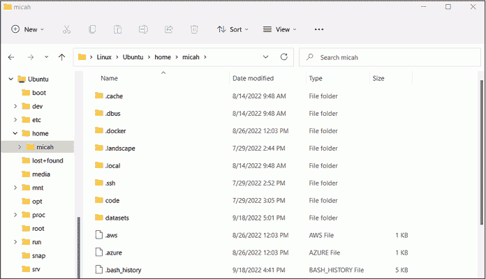

# A 常见 WSL 问题的解决方案


我很难想象在没有 Linux 的情况下进行我所做的数据分析工作。然而，我每天依赖的许多 Linux 工具在 Windows 生态系统中根本不存在。例如，单独使用 Windows，你无法像使用 Aleph 一样让数据集可搜索，或者快速启动流行的 SQL 服务器来导入泄露的数据库。Windows 子系统 for Linux（WSL）让你可以在 Windows 中完成这些任务，甚至更多，包括运行命令行工具，而无需设置自己的 Linux 虚拟机。

WSL 通常运行良好，但在你尝试从 Linux 终端处理存储在 Windows 格式化磁盘上的数据时，可能会遇到一些问题，尤其是与磁盘性能相关的。一些任务可能需要你的计算机几个小时或几天才能完成，而实际上这些任务应该只需几分钟。附录将帮助 Windows 用户了解 Linux 文件系统的某些特性，并提供各种解决磁盘性能问题的可能方案。对于 Windows 用户来说，这是可选内容，但如果你遇到程序运行时间比我描述的要长得多的情况，本附录应该能帮助你诊断问题并提出解决方案。

我建议等到完成 第三章（你将安装 WSL）和 第四章（你将学习实现这里描述的性能解决方案所需的命令行代码）后再阅读本附录。你可能需要在 第五章（你在 Docker 中绑定挂载或在 Aleph 中索引数据集时）参考本附录；在 第十一章（你使用 Linux 工具提取超过一百万个文件时）；以及在 第十二章（你将 20GB 数据导入运行在 Docker 中的 SQL 数据库时）。

## 理解 WSL 的 Linux 文件系统

在解决可能遇到的 WSL 问题之前，你需要了解 WSL 如何以及在何处存储 Linux 文件。在本节中，你将了解 WSL Linux 文件系统如何在 Windows 中工作，如何在 Windows 中访问 Linux 文件，以及如何在 Linux 中访问 Windows 文件。我还会概述一些你可能会遇到的简单问题以及如何解决它们。

你的 WSL Linux 文件系统包含的不仅仅是你存储在其中的数据。它还包括 Ubuntu 操作系统的完整副本，当你使用 apt 安装新程序时，这些程序也会安装到 Linux 文件系统中。就像在真实的 Ubuntu 系统中一样，*/* 是根文件夹，它包含了 Ubuntu 系统的所有默认文件夹。在你的 Ubuntu 终端中，运行 ls / 命令来列出根文件系统中的文件夹名称。你应该会看到以下输出：

```
bin dev home lib lib64 lost+found mnt proc run snap sys usr

boot etc init lib32 libx32 media opt root sbin srv tmp var
```

该输出列出了 Ubuntu 系统中根文件夹内的所有文件夹。你的主文件夹在 */home*。例如，由于我的 Ubuntu 用户名是 *micah*，所以我的 Ubuntu 主文件夹是 */home/micah*。如果你使用的是 Windows 11 或更高版本，你应该能够直接从文件资源管理器浏览你的 Linux 文件。当你浏览 Linux 文件时，你会看到 *所有* 的 Linux 文件，而不仅仅是主文件夹中的数据。如果你正在运行一个足够新的 Windows 版本，切换到你的主文件夹（cd ~），然后运行命令 explorer.exe . 来在 Windows 文件资源管理器中打开你当前在 Linux 中工作的文件夹。

> 注意

*如果你需要在 Linux 中运行 Windows 程序（例如 explorer.exe）、在 Windows 中运行 Linux 程序，或在 WSL 中执行更高级的任务，请查阅 Microsoft 的详细文档，链接如下：* [`learn.microsoft.com/en-us/windows/wsl/filesystems`](https://learn.microsoft.com/en-us/windows/wsl/filesystems)。

例如，图 A-1 显示了在 Windows 文件资源管理器应用中查看的 Linux 文件列表。



图 A-1：在 Windows 的文件资源管理器中浏览 Linux 文件

了解 Windows 和 Linux 文件系统的不同行为也是很有帮助的。Windows 文件系统格式是 NTFS，而最流行的 Linux 文件系统格式是 ext4。每个 Linux 文件都有单独的读取、写入和执行权限，但 NTFS 系统中的文件没有这些元数据。

如果你在 Linux 中访问 Windows 文件系统（例如，当你访问 WSL 中的 */mnt/c* 时），Linux 会将每个文件视为具有读取、写入和执行权限，并且默认情况下不能更改这些权限。这通常不是问题，但这意味着如果你将文件从 Linux 复制到 Windows，你将丢失它们的原始权限。如果你希望能够使用文件权限，你需要在一个真正的 Linux 文件系统上工作。

从底层来看，WSL Linux 文件系统存储在 *C:* 驱动器的用户主文件夹中的一个文件里。在我的 Windows 11 电脑上，文件名是 *C:\Users\micah\AppData\Local\Packages\CanonicalGroupLimited .UbuntuonWindows_79rhkp1fndgsc\LocalState\ext4.vhdx*。你电脑上的路径会稍有不同，但包含 Linux 文件系统的文件仍然叫做 *ext4.vhdx*。你在 Linux 文件系统中存储的数据越多，*ext4.vhdx* 文件就会变得越大。

比如，假设你想把数据集直接保存到 Linux 文件系统中的 *~/datasets* 文件夹，而不是保存到 USB 磁盘。将 BlueLeaks 数据集下载到这个文件夹会导致你的 *ext4.vhdx* 文件增长数百 GB。因为整个 WSL Linux 文件系统都存储在 *C:* 驱动器上，这意味着你在 Linux 中可用的磁盘空间就等于该驱动器上的空闲空间。除了 *C:* 驱动器上空闲空间的限制外，默认情况下，你的 WSL Linux 文件系统最大只能占用 256GB 的空间。

如果你想存储比这个更多的数据，你需要采取额外的步骤来扩展你的 Linux 文件系统的大小。你可以在[*https://<wbr>learn<wbr>.microsoft<wbr>.com<wbr>/zh<wbr>-cn<wbr>/windows<wbr>/wsl<wbr>/vhd<wbr>-size*](https://learn.microsoft.com/en-us/windows/wsl/vhd-size)找到详细的操作说明。

最后，你可能会遇到这样一种情况：你打开一个 Ubuntu 终端，尝试访问挂载在 */mnt* 中的 Windows 格式的 USB 磁盘，结果发现它根本不存在。这是因为你需要在打开 Ubuntu shell 之前，*先*挂载你的 Windows USB 磁盘（插入磁盘，并且如果磁盘加密了，还需要输入 BitLocker 密码）。如果你无法在 Ubuntu 中通过类似 */mnt/d* 的路径访问 USB 磁盘（假设你的 USB 磁盘挂载在 *D:* 驱动器上），你需要重新启动 WSL。

为此，打开 PowerShell 并运行 wsl --shutdown。这将关闭所有打开的 Ubuntu 终端并停止所有正在运行的 Docker 容器。之后，再次打开 Ubuntu 终端，你应该能够访问那个 USB 磁盘。

在掌握了 WSL 的基础之后，让我们来讨论你可能遇到的主要问题：磁盘性能。

## 磁盘性能问题

在 WSL 中使用 Windows 文件（比如挂载在 */mnt* 中的磁盘）存在严重的性能问题。当你在 Windows 磁盘上处理文件时，读取和写入的速度比在 WSL 的 Linux 文件系统（比如 */home* 中的文件）上要慢得多。某些磁盘密集型任务，比如提取一个包含百万个小文件的压缩文件，在 Windows 磁盘上可能需要几个小时，而同样的任务在 Linux 磁盘上可以在几秒钟内完成。这些性能问题可能严重影响你的工作效率。

因此，微软建议将数据存储在与你打算使用的工具相同的操作系统文件系统中。使用 Linux 工具，如 find、grep 和 unzip（见第四章）或使用 Aleph 使数据可搜索（见第五章）时，最好的做法是将数据集存储在 Linux 文件系统中。与此同时，使用 Windows 软件（如 7-Zip）分析数据集时，如果这些数据集存储在 Windows 文件系统中，则效果最佳。

到目前为止，解决性能问题的最简单方法是将所有数据集存储在 Linux 文件系统中，并使用 Linux 工具进行处理。然而，数据集通常过大，无法放入 *C:* 驱动器。例如，单是 BlueLeaks 就占用了我目前使用的笔记本电脑上超过一半的磁盘空间。这迫使你将数据集存储在像第一章中加密的 *datasets* 磁盘这样的 USB 磁盘上。如果你在 *C:* 驱动器上没有足够的空间来处理你想要的数据，你将需要实施我在下一节中讨论的解决方案之一。

有时，你可以通过使用本地 Windows 程序而非 Linux 程序来绕过磁盘性能问题，执行最消耗磁盘的任务。在本书中，我建议在合适的情况下使用本地 Windows 工具。例如，Linux 程序 unzip 和 tar 用于解压缩文件。如果你从 WSL 中工作，使用这些工具解压存储在 Windows 磁盘上的文件可能会非常慢。相反，你可以像在第四章中解压 BlueLeaks 时那样，使用 Windows 压缩程序 7-Zip。由于使用 7-Zip 解压文件完全不涉及 WSL，因此没有磁盘性能问题。

同样，当你运行 Python 脚本时，可以使用 Windows 版本的 Python（可以从[*https://<wbr>www<wbr>.python<wbr>.org*](https://www.python.org)下载），而不是 Ubuntu 版本。这样，你的 Python 脚本就能处理来自 Windows 格式化的 USB 磁盘的数据，避免了 WSL 性能问题，这也是第七章建议你使用 PowerShell 而非 WSL 的原因。

然而，这种技术也仅能解决部分问题。并非所有情况下都有本地 Windows 替代方案。例如，如果没有 WSL，你无法运行 Docker 容器，而 Docker 容器是运行像 Aleph 这样的软件所必需的。在这些情况下，你最好将数据存储在 Linux 文件系统中，使用以下解决方案之一。

## 解决磁盘性能问题

本节介绍了解决 WSL 磁盘性能问题的两种潜在方案：仅将当前工作所需的数据集存储在 WSL Linux 分区中，或者将整个 WSL Linux 分区存储在具有更多磁盘空间的 USB 磁盘上。我建议选择第一个更简单的选项，如果你只想轻松地完成本书中的任务。第二个选项是一个更好的长期解决方案，如果你计划将来在 Windows 中使用 Linux 工具定期处理大数据集。

### 仅在 Linux 中存储活动数据集

如果你的 *C:* 驱动器没有足够的空间存储所有数据集，你可以仅将当前工作所需的部分数据集存储在 Linux 文件系统中，其余数据保留在 USB 磁盘上。例如，你可以将正在处理的文件夹复制到 Ubuntu 的主文件夹中（即 *~/datasets*），并在进行特定研究时将它们保留在这里。当你不再需要这些文件时，可以将它们复制回外部 Windows 磁盘，并从主文件夹中删除以腾出空间。

### 将你的 Linux 文件系统存储在 USB 磁盘上

另一个选择是将整个 Ubuntu 安装——也就是包含 Linux 文件系统的 *ext4.vhdx* 文件——移动到具有大量空闲空间的 USB 磁盘上。这样，如果你将所有数据集存储在 Ubuntu 的主文件夹中（即 *~/datasets*），数据将物理地存储在 USB 磁盘上，而不是存储在内部 *C:* 驱动器中。

使用这个解决方案，你将无法打开 Ubuntu 终端，除非 USB 磁盘已插入并挂载，这样不太方便。如果你在 USB 磁盘未挂载的情况下尝试打开 Ubuntu 终端，你将收到错误消息 The system cannot find the path specified。然而，如果你打算将来研究自己的数据集，我推荐使用这种方法。以下是如何实现它。

打开 PowerShell 终端，并通过运行以下命令在外部 USB 磁盘上创建一个新的文件夹，用于存储 Linux 文件系统：

```
**New-Item -Path** **`D:\WSL`** **-ItemType 'directory'**
```

在 PowerShell 中，New-Item 命令用于创建新文件或文件夹。在此案例中，它正在 *D:\WSL* 创建一个新的文件夹。如果你希望将 *ext4.vhdx* 文件存储在其他位置，可以在运行此命令时更改路径。

WSL 允许你同时安装多个 Linux 发行版（即不同版本的 Linux）。为了将其中一个移动到 USB 磁盘上，你需要知道其名称。它可能叫做 Ubuntu，但你可以通过运行 wsl --list 命令来检查：

```
PS C:\Users\micah> **wsl --list**

Windows Subsystem for Linux Distributions:

Ubuntu (Default)

docker-desktop-data

docker-desktop
```

该输出列出了你安装的每个 WSL 发行版。在我的例子中，我有Ubuntu（我的默认发行版），以及docker-desktop -data和docker-desktop，它们都是 Docker Desktop 使用的。如果你已经完成了第五章并自己安装了 Docker Desktop，你也应该有这些 WSL 发行版。

以下步骤展示了如何将 WSL 发行版从*C:*驱动器移动到 USB 磁盘。这些说明主要针对 Ubuntu 发行版，但如果其他 WSL 发行版也占用了*C:*驱动器的太多空间，你也可以按照相同的步骤将它们移动到 USB 磁盘，只需在运行命令时更改发行版名称。我不建议移动 Docker 发行版，因为这可能会导致 Docker Desktop 无法正常工作。

一旦你确认了要移动到磁盘的发行版名称，使用以下命令导出该发行版的副本，将Ubuntu替换为适当的名称：

```
**wsl --export** **`Ubuntu`** **D:\WSL\backup.tar**
```

这应该会将你选择的发行版的所有数据保存到文件*D:\WSL\backup.tar*中。完成后，通过运行此命令从 WSL 中取消注册你在*C:*驱动器上的 Ubuntu 发行版：

```
**wsl --unregister** **`Ubuntu`**
```

这将从你的计算机中移除该发行版，并删除 Linux 文件系统文件*ext4.vhdx*。没关系，因为你刚刚创建了备份。

接下来，导入你的备份，这次告诉 WSL 你希望将该发行版的数据存放在*D:\WSL*中：

```
**wsl --import** **`Ubuntu`** **D:\WSL D:\WSL\backup.tar**
```

该命令创建一个新的 WSL 发行版，在本例中称为Ubuntu。现在，通过运行以下命令将该发行版设为默认 WSL 发行版：

```
**wsl --set-default** **`Ubuntu`**
```

当你稍后打开 WSL 终端时，它应该会打开你刚刚选择的默认发行版的 shell。

到此为止，你已经将 Ubuntu 文件系统从*C:*驱动器移动到了*D:*驱动器（或你在运行命令时更改的路径）。原来的*ext4.vhdx*文件应该不再存在，应该已经有了一个新的文件在*D:\WSL\ext4.vhdx*。

现在你已经恢复了临时备份文件，*D:\WSL\backup.tar*，你可以通过在 PowerShell 终端中运行以下命令删除它：

```
**Remove-Item -Path D:\WSL\backup.tar**
```

打开一个新的 Ubuntu 终端。它应该可以正常工作，但有一个问题：你会自动以 root 用户登录，而之前你会自动以一个没有权限的用户登录。要解决此问题，你将创建一个名为*/etc/wsl.conf*的文件，使用第四章中描述的 nano 文本编辑器。

运行以下命令打开 nano：

```
**nano /etc/wsl.conf**
```

在文本编辑器文件中输入以下两行来设置你的默认用户，将 micah 更改为你在将 *ext4.vhdx* 移动到 USB 磁盘之前的用户名：

```
**[user]**

**default=****`micah`**
```

按下 CTRL-O，然后按 ENTER 保存文件，再按 CTRL-X 退出。回到 PowerShell 终端，通过运行以下命令关闭 WSL：

```
**wsl --shutdown**
```

当你打开一个新的 Ubuntu 终端时，你现在应该已作为正常的非特权用户登录，而不是 root 用户。

现在，运行 Linux 文件系统从 USB 磁盘应该可以正常工作，但即使你的 USB 磁盘更大，Linux 文件系统仍然受到默认 256GB 数据的限制。最后一步是扩展 Linux 文件系统的大小，以便它可以使用 USB 磁盘上所有可用的空间。

在 PowerShell 中，通过运行以下命令关闭 WSL：

```
**wsl --shutdown**
```

接下来，作为管理员打开一个命令提示符窗口。（因为你需要以管理员身份打开，所以直接打开命令提示符比在 Windows Terminal 中打开命令提示符标签页更简单。）点击 **开始**，搜索 **命令提示符**，右键点击 **命令提示符**，然后点击 **以管理员身份运行**。在管理员命令提示符中，运行以下命令打开 Windows CLI 程序 DiskPart：

```
**diskpart**
```

这个程序帮助你管理计算机的磁盘和分区。打开它时，它应该会进入一个类似于 Python Shell 的交互式 shell。在 DiskPart 中，你必须先选择你想要调整大小的磁盘，这里是 *ext4.vhdx* 文件。运行以下命令，将 *ext4.vhdx* 的路径替换为你机器上正确的路径：

```
DISKPART> **select vdisk file="****`D:\WSL\ext4.vhdx`****"**

DiskPart successfully selected the virtual disk file.
```

然后，你可以通过运行以下命令检查 Linux 文件系统的当前大小：

```
DISKPART> **detail vdisk**

Device type ID: 0 (Unknown)

Vendor ID: {00000000-0000-0000-0000-000000000000} (Unknown)

State: Added

Virtual size:  256 GB

Physical size: 7664 MB

Filename: D:\WSL\ext4.vhdx

Is Child: No

Parent Filename:

Associated disk#: Not found.
```

`detail vdisk 的输出显示了你正在检查的虚拟磁盘的信息，包括在 Virtual size 字段中显示的 Linux 文件系统的总最大大小，以及在 Physical size 字段中显示的 Linux 文件系统当前使用的实际磁盘空间。

接下来，你需要将虚拟磁盘调整为大于 256GB。首先，你需要确定想要的大小。如果你的 USB 磁盘除了这个 *ext4.vhdx* 文件外是空的，那么选择整个 USB 磁盘的大小是合理的。你可以通过右键点击文件资源管理器中的磁盘，点击 **属性** 来查看 USB 磁盘的总大小。在“常规”标签页下，你将看到有关磁盘空间使用的信息，包括磁盘的总容量。你应该避免将虚拟磁盘的大小设置得大于 USB 磁盘的总大小；如果这样做，可能会导致 USB 磁盘空间不足，而 WSL 未能察觉，进而导致无法预料的 Linux 问题。

一旦你确定了 Linux 分区的大小，确保你知道该数字的大小，单位是兆字节。例如，如果你希望它的最大大小为 1TB，那么这将是 1,048,576MB。有关如何计算这个数字的信息，请查阅第四章中的“文件大小单位与转换”框。现在运行以下命令来调整大小，将1048576替换为你选择的最大大小（单位为兆字节）：

```
DISKPART> **expand vdisk maximum=****`1048576`**

  100 percent completed

DiskPart successfully expanded the virtual disk file.
```

再次运行detail vdisk命令，确认虚拟大小字段现在显示你刚设置的新的最大大小，然后通过运行exit命令退出 DiskPart：

```
DISKPART> **exit**

Leaving DiskPart...
```

关闭管理员命令提示符。

你已经在*ext4.vhdx*中扩展了虚拟磁盘的大小，但你仍然需要扩展该磁盘上的实际 Linux 分区。为此，你需要确定虚拟磁盘本身的路径。

首先，打开 Ubuntu 终端并运行以下命令：

```
**sudo mount -t devtmpfs none /dev**
```

该命令检查确保*/dev*在 WSL 中已挂载。这是一个特殊的 Linux 文件夹，包含每个硬件组件的文件，包括硬盘。当我运行这个命令时，我得到了以下输出：

```
[sudo] password for micah:

mount: /dev: none already mounted on /dev.
```

由于该命令使用了sudo，你首先需要输入密码才能继续。如果你看到警告信息mount: /dev: none already mounted on /dev，可以安全忽略它；这意味着*/dev* 已经被挂载。

运行以下命令：

```
**mount | grep ext4**
```

该命令运行mount，该命令列出所有在 Linux 中挂载的文件系统，然后将输出结果传递给grep，以筛选出 ext4 文件系统。输出应该会显示虚拟硬盘的路径。例如，我的输出显示硬盘的路径是*/dev/sdc*：

```
/dev/sdc on / type ext4 (rw,relatime,discard,errors=remount-ro,data=ordered)
```

最后，运行以下命令，将你的 Linux 分区调整为占用尽可能多的空间，确保使用上一个命令中确定的虚拟硬盘的正确路径：

```
**sudo resize2fs** **`/dev/sdc`**
```

当我运行这个命令时，得到以下输出：

```
resize2fs 1.45.5 (07-Jan-2020)

Filesystem at /dev/sdc is mounted on /; on-line resizing required

old_desc_blocks = 32, new_desc_blocks = 128

The filesystem on /dev/sdc is now 268435456 (4k) blocks long.
```

如果一切顺利，你应该看到一条确认分区已被调整大小，并且现在与整个虚拟磁盘一样大的信息。完成了！你已经扩展了 Linux 文件系统，现在可以在其中存储更多的数据集了。

## 下一步

在我看来，微软通过将 WSL 集成到 Windows 中，极大地提升了 Windows 操作系统的实用性，特别是当你需要分析被黑客攻击和泄露的数据集时。如果你打算定期使用 WSL，建议你阅读官方文档：[**https://<wbr>learn<wbr>.microsoft<wbr>.com<wbr>/en<wbr>-us<wbr>/windows<wbr>/wsl<wbr>/**](https://learn.microsoft.com/en-us/windows/wsl/)。这些文档涵盖了本附录之外的内容，比如如何将 WSL 与 VS Code 结合使用、如何在 WSL 中直接安装 SQL 数据库软件而不是在 Docker 中使用它、如何直接在 Windows 中运行图形化 Linux 应用等。

除了使用 WSL 外，你可能还想通过阅读本书，尝试在计算机上运行虚拟机来体验不同的 Linux 发行版（参见第一章），并在云端玩转 Linux 服务器（参见第四章），以此来更好地熟悉 Linux。
