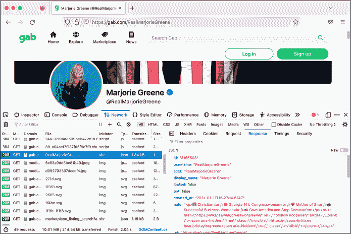
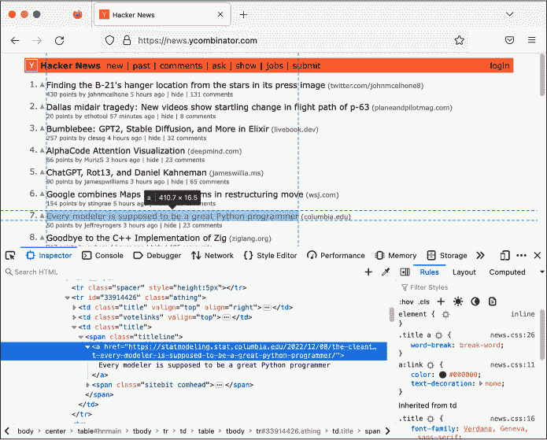
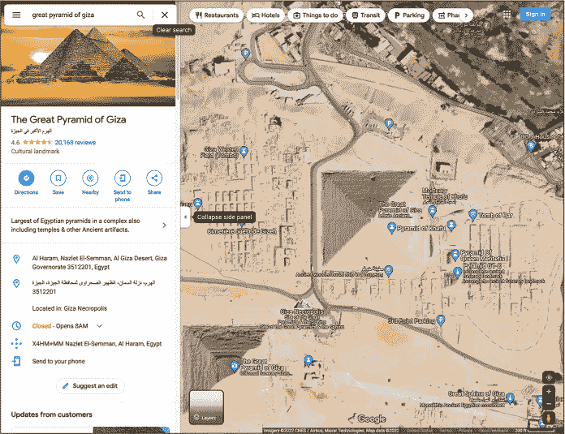

<hgroup>

# <samp class="SANS_Futura_Std_Bold_Condensed_B_11">B</samp> <samp class="SANS_Dogma_OT_Bold_B_11">抓取网络</samp>

</hgroup>

有时，为了研究重要的在线公共数据，你需要下载一份本地副本。当网站没有提供结构化的可下载格式（如电子表格、JSON 文件或数据库）时，你可以通过*网络抓取*（或*屏幕抓取*）来制作自己的副本：编写代码为你加载网页并提取其内容。这些内容可能包括社交媒体帖子、法院文件或任何其他在线数据。你可以使用网络抓取下载完整的数据集，或者定期下载同一网页，以查看其内容是否随着时间发生变化。

例如，考虑第十一章中讨论的 Parler 数据集。在 Parler 因拒绝审查鼓励和煽动暴力的内容而被其托管服务提供商下线之前，档案管理员@donk_enby 编写了代码来抓取所有 32TB 的视频——超过一百万个——并分发给研究人员和记者。本附录将教你如何在类似情况下进行操作。

我将讨论网络抓取的法律考虑，并简要概述 HTTP，这是网页浏览器与网站通信时使用的协议。最后，我会介绍三种不同的技术，帮助你抓取不同类型的网站。在跟随本章之前，请完成第七章、第八章、第九章和第十一章，因为你需要掌握其中讲解的 Python 编程、CSV、HTML 和 JSON 的基础知识。

## <samp class="SANS_Futura_Std_Bold_B_11">法律考虑</samp>

网络抓取本身并不是犯罪，但其合法性仍然模糊不清。一般来说，使用已授权的计算机系统（如访问公共网站）是完全合法的，但未经授权访问（如登录他人账户）则属于非法黑客行为。

在美国，未经授权的访问违反了极其过时的黑客法——1986 年的《计算机欺诈和滥用法案》（CFAA）。网络抓取不应被视为未经授权的访问，因为它仅涉及编写代码来加载所有人都能访问的公共网页，而不是像正常方式那样加载这些网页（使用网页浏览器）。问题在于，抓取可能会违反网站的服务条款，而且关于这是否构成违反 CFAA 的行为，法律界并无共识——法院对此有不同的裁定。

尽管如此，网络抓取仍然是一个极为常见的做法。像 Google 这样的搜索引擎本质上是大规模的网络抓取操作，像互联网档案馆的 Wayback Machine（[*https://<wbr>web<wbr>.archive<wbr>.org*](https://web.archive.org)）这样的归档网站也是如此。公司常常使用网络抓取来跟踪航空机票价格、招聘信息和其他公共数据。这也是调查报道的重要工具。

> <samp class="SANS_Dogma_OT_Bold_B_21">注意</samp>

*CFAA 最初的通过，至少部分是响应 1983 年电影《战争游戏》（WarGames）而通过的。在电影中，少年黑客（由马修·布罗德里克饰演）闯入一台军事超级计算机，并差点无意间引发了第三次世界大战。那时，并没有针对黑客入侵计算机的法律。这部广受欢迎的电影吓得国会通过了相关法律。*

作为一个调查科技行业的非营利新闻机构，《Markup》总结了网页抓取的案例，其中包括依赖网页抓取的几篇调查新闻。例如，Reveal 新闻室抓取了 Facebook 上极端主义团体和执法团体的内容，发现这些团体的成员有很大重叠。路透社也抓取了社交媒体和留言板，揭露了一个地下市场，专门交易被领养的孩子；这项调查导致了一起绑架案件的定罪。你可以阅读完整的文章，链接地址是 [*https://<wbr>themarkup<wbr>.org<wbr>/news<wbr>/2020<wbr>/12<wbr>/03<wbr>/why<wbr>-web<wbr>-scraping<wbr>-is<wbr>-vital<wbr>-to<wbr>-democracy*](https://themarkup.org/news/2020/12/03/why-web-scraping-is-vital-to-democracy)。

在你开始编写自己的网页抓取代码之前，你需要了解 HTTP 请求是什么。

## <samp class="SANS_Futura_Std_Bold_B_11">HTTP 请求</samp>

当你加载网页时，你的网页浏览器会发出 *HTTP 请求*。你可以将其理解为浏览器向网站服务器发送一条消息，内容是：“我想下载这个 URL 页面上的内容，这样我就可以在我的电脑上查看它。”服务器会回复一个 *HTTP 响应*，其中包含内容，通常是 HTML 代码。你的浏览器解析这段 HTML，以确定还需要下载哪些内容，以便完整显示网页：图像、字体、定义网页外观的层叠样式表（CSS）文件，以及告知网站如何运行的 JavaScript 文件。浏览器会针对每个资源再发出一个 HTTP 请求，获取它们的内容。你在使用网站时，网站也通常会发出大量 HTTP 请求，例如检查更新并实时显示在页面上。

HTTP 请求和响应有 *头部*，即关于请求或响应的元数据。根据你要抓取的网站，你可能需要发送特定的头部，以确保抓取正常工作。你也可能需要让你的代码跟踪 *cookies*，这些是任何具有登录选项的网站所必需的。你可以在你的网页抓取代码中使用许多不同类型的请求，例如 *POST* 请求，用于提交表单。然而，本附录中的代码将仅使用 *GET* 请求，这是最简单、最常见的请求类型，用于从 URL 下载内容。

许多网站不喜欢网页抓取工具，原因有很多，包括如果一个脚本频繁向网站发送 HTTP 请求，这会增加网站的带宽成本，甚至可能导致网站崩溃。有时，网站会增加障碍，例如限制你在短时间内可以发送的请求数量，或者要求用户（或机器人）填写验证码，试图阻止或防止抓取行为。

> <samp class="SANS_Dogma_OT_Bold_B_21">注意</samp>

*大约在 2002 年，当时我还在高中，我和我的朋友们决定创建一个歌词网站。类似的网站已经存在，但它们不完整。我认为从那些网站抓取歌词并创建一个包含*所有*歌词的网站应该很简单。我写了一个脚本，从一个特定的网站抓取了成千上万的歌词，但我的脚本在运行时崩溃了。我意识到是因为源网站已经宕机了。几天后，那个网站重新上线，并发布了一条信息：网站的所有者得知网站的流量有多大后非常高兴，但为了应对这些流量，他们需要筹集资金才能维持网站的运行。我感到很内疚，最终我们没有推出那个歌词网站。*

## <samp class="SANS_Futura_Std_Bold_B_11">抓取技术</samp>

本节介绍了三种不同的网页抓取技术，每种技术都引入了不同的 Python 模块。你将使用一个名为 HTTPX 的 Python 包来发起 HTTP 请求，然后使用另一个名为 Beautiful Soup 的包来帮助你从混乱的 HTML 代码中选择你关心的数据。最后，你将使用一个名为 Selenium 的包编写代码，启动一个浏览器并控制其行为。

网页抓取需要大量的反复试验，并且需要彻底了解你要抓取数据的网站的布局。本附录提供了几个简单的示例，而不是一个全面的概述，但这些示例应该能为你未来编写自己的网页抓取脚本提供一个良好的开端。

### <samp class="SANS_Futura_Std_Bold_Condensed_Oblique_BI_11">使用 HTTPX 加载页面</samp>

HTTPX 是一个第三方 Python 包，允许你用 Python 发起自己的 HTTP 请求。在本节中，你将学习如何使用它抓取极右翼社交媒体网站 Gab 上任何给定用户的最新帖子，这个网站你在第一章、第十二章和第十三章中都有提到。

使用 pip 安装 <samp class="SANS_TheSansMonoCd_W5Regular_11">httpx</samp> 模块，通过运行 <samp class="SANS_TheSansMonoCd_W7Bold_B_11">python3 -m pip install</samp> <samp class="SANS_TheSansMonoCd_W7Bold_B_11">httpx</samp>。在将 <samp class="SANS_TheSansMonoCd_W5Regular_11">httpx</samp> 导入到您的代码中后，您应该能够通过运行 <samp class="SANS_TheSansMonoCd_W7Bold_B_11">httpx.get()</samp> 函数并传入一个 URL 来加载一个网页。此函数返回一个请求对象，您可以通过 <samp class="SANS_TheSansMonoCd_W5Regular_11">.content</samp> 访问二进制数据，或者通过 <samp class="SANS_TheSansMonoCd_W5Regular_11">.text</samp> 访问文本数据。例如，清单 B-1 显示了使用 Python 代码发起 HTTP 请求到 *https://<wbr>example<wbr>.com* 并查看其内容。

```
>>> **import** **httpx**
>>> **r =** **httpx.get("https://example.com")**
>>> **print(r.text)**
<!doctype html>
<html>
<head>
    <title>Example Domain</title>
`--snip--`
</head>

<body>
<div>
    <h1>Example Domain</h1>
    <p>This domain is for use in illustrative examples in documents. You may use this
    domain in literature without prior coordination or asking for permission.</p>
    <p><a href="https://www.iana.org/domains/example">More information...</a></p>
</div>
</body>
</html>
```

<samp class="SANS_Futura_Std_Book_Oblique_I_11">清单 B-1: 抓取来自</samp> <samp class="SANS_Futura_Std_Book_11">https://example.com</samp> 的 HTML

首先，这段代码导入了 <samp class="SANS_TheSansMonoCd_W5Regular_11">httpx</samp> 模块。接着调用了 <samp class="SANS_TheSansMonoCd_W5Regular_11">httpx.get()</samp> 函数，传入一个 URL 作为参数，并将响应保存在变量 <samp class="SANS_TheSansMonoCd_W5Regular_11">r</samp> 中。最后，它显示了 <samp class="SANS_TheSansMonoCd_W5Regular_11">r.text</samp> 变量，该变量包含了构成 *https://<wbr>example<wbr>.com* 的所有 HTML 代码。（如果您加载的是二进制文件，如图像，则可以在 <samp class="SANS_TheSansMonoCd_W5Regular_11">r.content</samp> 变量中获取二进制数据。）这个简单的 <samp class="SANS_TheSansMonoCd_W5Regular_11">httpx.get()</samp> 函数通常就是您抓取整个网站数据库信息所需的全部功能。本节中我将展示的从 Gab 抓取帖子的脚本就依赖于这个函数。

由于网页抓取意味着编写加载 URL 的代码，因此您的第一步应该是确定需要加载哪些 URL。最简单的方法是使用您网页浏览器内置的开发者工具。您可以通过按 F12 键在大多数浏览器中打开它们。在 Firefox 和 Chrome 中，您可以在开发者工具的网络标签页中查看浏览器发出的 HTTP 请求以及响应的内容。例如，如果您打开浏览器的开发者工具并加载一个 Gab 用户的个人资料页面，您可以看到它发出的 HTTP 请求，以及如何获取该用户的最新帖子。一旦获取到这些信息，您就可以编写一个脚本，自动为您发出相同的 HTTP 请求。

> <samp class="SANS_Dogma_OT_Bold_B_21">注意</samp>

<samp class="SANS_Dogma_OT_Bold_B_21">注意</samp>*Firefox、Chrome 和其他浏览器内置的开发者工具是了解你的网页浏览器在访问网站时来回传输数据的绝佳方式，能够查看网页的布局等更多信息。有关 Firefox 开发者工具的更多内容，请参见* [`firefox-source-docs.mozilla.org/devtools-user/index.html`](https://firefox-source-docs.mozilla.org/devtools-user/index.html)*；* *Chrome 的相关信息请参见* [`developer.chrome.com/docs/devtools`](https://developer.chrome.com/docs/devtools)*。*

例如，Marjorie Taylor Greene 的 Gab 页面（这位美国国会议员也是一名基督教民族主义者和 QAnon 阴谋论者）位于 [*https://<wbr>gab<wbr>.com<wbr>/RealMarjorieGreene*](https://gab.com/RealMarjorieGreene)。在网页浏览器中加载该网址后，打开开发者工具。刷新页面以使所有 HTTP 请求在“网络”标签中显示。

在“网络”标签中，你应该能看到在开发者工具面板的左半部分列出了几个 HTTP 请求。当你点击某个请求时，面板的右半部分会显示该请求的详细信息。右半部分有自己的标签，你可以切换查看请求的头部信息、cookies 以及请求和响应的正文内容。

当我加载这个页面并查看浏览器的 HTTP 请求及其响应时，我决定我最感兴趣的是以下几个网址：

[***https://<wbr>gab<wbr>.com<wbr>/api<wbr>/v1<wbr>/account<wbr>_by<wbr>_username<wbr>/RealMarjorieGreene***](https://gab.com/api/v1/account_by_username/RealMarjorieGreene) 该请求的响应包含一个 JSON 对象，包含关于 Greene 的 Gab 个人资料信息，包括她的 Gab 账户 ID：3155503。

[***https://<wbr>gab<wbr>.com<wbr>/api<wbr>/v1<wbr>/accounts<wbr>/3155503<wbr>/statuses<wbr>?sort<wbr>_by<wbr>=newest***](https://gab.com/api/v1/accounts/3155503/statuses?sort_by=newest) 该请求的响应包含一个 JSON 数组，列出了 Greene 最近的 Gab 帖子。她的账户 ID 已包含在网址中。

第一个网址让我查找任何账户的 Gab ID，第二个网址让我根据其 Gab ID 查找某个账户的最近帖子。图 B-1 展示了 Firefox 开发者工具在加载此页面时的操作。



<samp class="SANS_Futura_Std_Book_Oblique_I_11">图 B-1：在 Firefox 开发者工具的“网络”标签中查看特定请求的 JSON 响应</samp>

如你所见，响应是 JSON 格式的。我想写一个脚本，给定一个 Gab 用户名，能够下载该用户的最新帖子。为了编写这个脚本，我花了一些时间查看这些响应中的 JSON 内容，理解它的结构以及我感兴趣的信息。例如，既然我想从一个 Gab 用户名开始，脚本首先需要加载网址 *https://<wbr>gab<wbr>.com<wbr>/api<wbr>/v1<wbr>/account<wbr>_by<wbr>_username<wbr>/<username>*，将 *<username>* 替换为我的目标用户名。然后，它需要解析收到的 JSON，提取这个 Gab 用户的 ID。接着，使用该 ID，它需要加载网址 *https://<wbr>gab<wbr>.com<wbr>/api<wbr>/v1<wbr>/accounts<wbr>/<id><wbr>/statuses<wbr>?sort<wbr>_by<wbr>=newest*，将 *<id>* 替换为目标账户的 Gab ID。最后，它需要解析该 JSON 响应并显示最新的 Gab 帖子。

基于这项研究，我编写了以下脚本来抓取任何目标 Gab 账户的最新帖子。以下是这个网页抓取脚本的代码，*httpx<wbr>-example<wbr>.py*：

```
import httpx
import click

@click.command()
@click.argument("gab_username") ❶
def main(gab_username):
    """Download a user's posts from Gab"""

    # Get information about the user
    r = httpx.get(f"https://gab.com/api/v1/account_by_username/{gab_username}") ❷
    user_info = r.json() if "error" in user_info:
        print(user_info["error"])
        return

    # Display some user info
    click.echo(f"Display name: {user_info['display_name']}") 
    click.echo(f"{user_info['followers_count']:,} followers, {user_info['following_count']:,} following, {user_info['statuses_count']:,} posts") ❸
    print()

    # Get this user's posts
    r = httpx.get(f"https://gab.com/api/v1/accounts/{user_info['id']}/statuses") ❹
    posts = r.json()
    for post in posts:
        if post["reblog"]:
            print(f"repost @{post['reblog']['account']['username']}: {post['reblog']['created_at']}: {post['reblog']['content']}")
        else:
            print(f"{post['created_at']}: {post['content']}")

if __name__ == "__main__":
    main()
```

这个脚本首先导入 <samp class="SANS_TheSansMonoCd_W5Regular_11">httpx</samp> 模块，因为它需要这个模块来进行 HTTP 请求。和本书中许多 Python 脚本一样，它使用 <samp class="SANS_TheSansMonoCd_W5Regular_11">click</samp> 模块来接受命令行参数。在这种情况下，它接受一个名为 <samp class="SANS_TheSansMonoCd_W5Regular_11">gab_username</samp> 的参数，这是目标 Gab 用户的用户名 ❶。

当 <samp class="SANS_TheSansMonoCd_W5Regular_11">main()</samp> 函数运行时，它通过调用 <samp class="SANS_TheSansMonoCd_W5Regular_11">httpx.get()</samp> 函数并传入网址 *https://<wbr>gab<wbr>.com<wbr>/api<wbr>/v1<wbr>/account<wbr>_by<wbr>_username<wbr>/<gab<wbr>_username>*，将 <gab_username> 替换为命令行参数的值，并将结果存储在变量 <samp class="SANS_TheSansMonoCd_W5Regular_11">r</samp> 中 ❷。正如我浏览器的开发者工具所示，响应应该是一个 JSON 对象，因此脚本接下来调用 <samp class="SANS_TheSansMonoCd_W5Regular_11">r.json()</samp> 让 HTTPX 将其转换成一个名为 <samp class="SANS_TheSansMonoCd_W5Regular_11">user_info</samp> 的字典。然后，它会检查 <samp class="SANS_TheSansMonoCd_W5Regular_11">user_info</samp> 是否有一个 <samp class="SANS_TheSansMonoCd_W5Regular_11">error</samp> 键；如果有，它会显示错误信息并提前退出。如果你尝试用无效的用户名加载该网址，你将看到 <samp class="SANS_TheSansMonoCd_W5Regular_11">error</samp> 键中的错误信息：字符串 <samp class="SANS_TheSansMonoCd_W5Regular_11">Record not found</samp>。

一旦脚本成功获取了某个 Gab 用户的信息，它会在终端 ❸ 显示这些信息——显示名称、粉丝数、关注人数以及发布的帖子数。然后，脚本使用 HTTPX 发出另一个 HTTP 请求，这次是加载用户的帖子。注意，这个 URL 包含了 <samp class="SANS_TheSansMonoCd_W5Regular_11">user_info['id']</samp>，这是通过之前的 HTTP 请求 ❹ 获取到的用户 ID。如前所述，脚本调用 <samp class="SANS_TheSansMonoCd_W5Regular_11">r.json()</samp> 来将 JSON 转换为 Python 对象，这次是一个名为 <samp class="SANS_TheSansMonoCd_W5Regular_11">posts</samp> 的列表。在接下来的 <samp class="SANS_TheSansMonoCd_W5Regular_11">for</samp> 循环中，脚本会遍历这个帖子列表，一次显示一个。

你可以在本书的 GitHub 仓库中找到这段代码的完整副本，链接为 [*https://<wbr>github<wbr>.com<wbr>/micahflee<wbr>/hacks<wbr>-leaks<wbr>-and<wbr>-revelations<wbr>/blob<wbr>/main<wbr>/appendix<wbr>-b<wbr>/httpx<wbr>-example<wbr>.py*](https://github.com/micahflee/hacks-leaks-and-revelations/blob/main/appendix-b/httpx-example.py)。

在撰写本文时，我可以通过在脚本中加入用户的用户名作为参数，下载任何 Gab 用户的近期帖子。例如，当我运行此脚本时，以下是我获得的 Andrew Torba（Gab 的创始人和所有者、书籍 *《基督教民族主义》* 的作者）的账户信息，他的 Gab 用户名是 <samp class="SANS_TheSansMonoCd_W5Regular_11">a</samp>：

```
micah@trapdoor appendix-b % **python3** **httpx-example.py** **a**
Display name: Andrew Torba
3,803,381 followers, 2,662 following, 67,317 posts

2022-12-07T04:56:56.989Z: Is it really so crazy to think that I care nothing
at all about a particular historical atrocity that happened on another
continent 80 years ago when there is a genocide of babies happening right
here, right now, today?
repost @ScipioAmericanus: 2022-12-07T04:50:37.560Z: Jews literally believe
that they can reject God because they're justified according to the flesh and
their own laws. Wicked stuff.
`--snip--`
```

输出显示了 Torba 的显示名称、账户统计数据以及他最近发布的几条 Gab 帖子。如你所见，这些帖子属于法西斯派别。Torba 拥有 380 万粉丝，因为每个 Gab 用户在创建账户时都会自动关注他。

> <samp class="SANS_Dogma_OT_Bold_B_21">注意</samp>

*尽管 380 万粉丝听起来很多，但这些账户中的大多数并不活跃。2021 年，我分析了被黑的 Gab 数据，发现约 400 万账户中，只有 150 万个账户发布过任何内容，只有 40 万个账户发布过超过 10 次内容，而只有 10 万个账户发布过近期的内容。你可以阅读我的分析文章，链接为* [`theintercept.com/2021/03/15/gab-hack-donald-trump-parler-extremists/`](https://theintercept.com/2021/03/15/gab-hack-donald-trump-parler-extremists/)*。*

尝试在任何你喜欢的 Gab 账户上运行*httpx<wbr>-example<wbr>.py*。除非 Gab 的网站发生了变化，否则这应该会下载该用户的最近帖子。不过，也有可能在你运行这个脚本时，网站已经发生了变化，导致脚本无法再正常工作。这就是网页爬虫的遗憾之处。你写的每一个爬取网页的脚本都依赖于网站的行为是某种特定的方式；如果它们不再如此，脚本就可能会崩溃。不过，通常更新脚本使其重新运行是件简单的事。为此，你需要使用浏览器的开发者工具，找出网站的变化，并更新你的脚本，以匹配其新的 URL 和行为——基本上就是重复你刚才做的事情。在最坏的情况下，如果网站发生了很大变化，你可能需要从头开始重写你的爬虫脚本。

使用 Python 逻辑和 HTTPX，你还可以修改脚本，以获取某个账户的*所有*帖子，而不仅仅是最近的那些。你可以编写一个脚本，找到目标的 Gab 用户，并下载他们关注的账户列表。或者，你可以获取一个目标 Gab 帖子，并下载喜欢该帖子的账户列表。你只需要学习准确的 HTTP 请求，以获取你感兴趣的信息，然后让 Python 为你发送这些请求。这些任务有些比其他任务更复杂——例如，要获取你想要的数据，你可能需要创建一个 Gab 账户，并让你的爬虫在你登录时发送请求。你编写的每一个类似的网页爬虫脚本，都会让你在这方面变得越来越熟练。

要了解更多关于使用 HTTPX 包的信息，请查看其文档，链接为 [*https://<wbr>www<wbr>.python<wbr>-httpx<wbr>.org*](https://www.python-httpx.org)。

### <samp class="SANS_Futura_Std_Bold_Condensed_Oblique_BI_11">使用 Beautiful Soup 解析 HTML</samp>

爬取 Gab 很简单，因为 HTTP 请求的响应是 JSON 格式的，但从网页中的 HTML 中提取特定信息要更具挑战性。在 Python 中解析 HTML 最简单的方法是使用一个叫做 Beautiful Soup（简称 BS4）的包。通过运行 <samp class="SANS_TheSansMonoCd_W7Bold_B_11">python3 -m pip install bs4</samp> 安装 <samp class="SANS_TheSansMonoCd_W5Regular_11">bs4</samp> 模块。

例如，以下是一些代码，使用 <samp class="SANS_TheSansMonoCd_W5Regular_11">httpx</samp> 模块下载 *https://<wbr>example<wbr>.com* 的 HTML，就像你在上一节做的那样：

```
>>> **import** **httpx**
>>> **from bs4 import BeautifulSoup**
>>> **r =** **httpx.get("https://example.com")**
```

这段代码导入了 `<samp class="SANS_TheSansMonoCd_W5Regular_11">httpx</samp>` 模块，然后从 `<samp class="SANS_TheSansMonoCd_W5Regular_11">bs4</samp>` 模块导入了 Beautiful Soup。接下来，使用 `<samp class="SANS_TheSansMonoCd_W5Regular_11">httpx.get()</samp>` 发起一个 HTTP 请求到 *https://<wbr>example<wbr>.com*，并将结果存储在 `<samp class="SANS_TheSansMonoCd_W5Regular_11">r</samp>` 中，这样你就可以通过 `<samp class="SANS_TheSansMonoCd_W5Regular_11">r.text</samp>` 变量访问 HTML 字符串。如你在清单 B-1 中看到的，这个 HTTP 响应是 HTML 格式的，包含了页面标题（在 `<samp class="SANS_TheSansMonoCd_W5Regular_11"><title></samp>` 标签中）以及两个段落的文本（在 `<samp class="SANS_TheSansMonoCd_W5Regular_11"><p</samp><samp class="SANS_TheSansMonoCd_W5Regular_11">></samp>` 标签内，位于 `<samp class="SANS_TheSansMonoCd_W5Regular_11"><body></samp>` 标签内）。

使用 BS4，你可以解析 HTML 来选择特定的内容——在这个例子中，是页面标题和第一段的内容：

```
>>> **soup = BeautifulSoup(r.text, "html.parser")**
>>> **print(soup.title.text)**
Example Domain
>>> **paragraph = soup.find("p")**
>>> **print(paragraph.text)**
This domain is for use in illustrative examples in documents. You may use this
    domain in literature without prior coordination or asking for permission.
>>> **for link in soup.find_all("a"):**
...      **print(link.get("href"))**
...
https://www.iana.org/domains/example
```

这段代码使用 BS4 解析 HTML 字符串（`<samp class="SANS_TheSansMonoCd_W5Regular_11">r.text</samp>`），并将解析结果的 `<samp class="SANS_TheSansMonoCd_W5Regular_11">BeautifulSoup</samp>` 对象存储在第一行代码中定义的 `<samp class="SANS_TheSansMonoCd_W5Regular_11">soup</samp>` 变量中。这使得你可以使用 `<samp class="SANS_TheSansMonoCd_W5Regular_11">soup</samp>` 从 HTML 中提取你感兴趣的信息。然后，代码通过打印 `<samp class="SANS_TheSansMonoCd_W5Regular_11">soup.title.text</samp>` 的值来显示页面标题。

接下来，脚本会在 HTML 页面中搜索第一段，并通过打印 `<samp class="SANS_TheSansMonoCd_W5Regular_11">paragraph.text</samp>` 的值来显示其文本。最后，它会找到页面上的所有链接（这些是 `<samp class="SANS_TheSansMonoCd_W5Regular_11"><a></samp>` 标签），通过一个 `<samp class="SANS_TheSansMonoCd_W5Regular_11">for</samp>` 循环遍历这些链接，并打印每个链接的 URL（URL 定义在 `<samp class="SANS_TheSansMonoCd_W5Regular_11">href</samp>` 属性中）。*https://<wbr>example<wbr>.com* 网页只有一个链接，所以代码只会显示这个链接。

在实践中，接下来我们将探索一个从 Hacker News ([*https://<wbr>news<wbr>.ycombinator<wbr>.com*](https://news.ycombinator.com)) 获取内容的脚本，Hacker News 是一个关于科技创业公司和计算机科学的新闻聚合网站。Hacker News 与 Reddit 类似，任何人都可以发布链接，用户可以对这些链接进行投票，最受欢迎的链接会排到最前面。它的网页设计简单，且多年未变，是进行网页抓取练习的一个好选择。

你的练习脚本将下载前五页热门链接的标题和 URL。Hacker News 的首页显示最近最受欢迎的 30 条帖子。如果你滚动到页面底部并点击“更多”，你将看到第二页的结果，展示接下来 30 条最受欢迎的帖子，URL 为 [*https://news.ycombinator.com/?p*=*2*](https://news.ycombinator.com/?p=2)。同样，第三页的结果有 URL [*https://news.ycombinator.com/?p*=*3*](https://news.ycombinator.com/?p=3)，依此类推。

图 B-2 显示了一个打开了 Hacker News 并启用了开发者工具的 Firefox 窗口。这次，我切换到了检查器（Inspector）标签，它允许你检查页面的 HTML 布局。检查器标签显示了构成页面的所有 HTML 标签，当你将鼠标悬停在某个标签上时，浏览器会高亮显示网页上的相应设计元素。在这个例子中，我将鼠标悬停在一个 <samp class="SANS_TheSansMonoCd_W5Regular_11"><a></samp> 标签上，浏览器高亮显示了该元素。



<samp class="SANS_Futura_Std_Book_Oblique_I_11">图 B-2：使用 Firefox 开发者工具检查构成 Hacker News 帖子的 HTML</samp>

开发者工具显示，Hacker News 网站的所有帖子都以 HTML 表格的形式布局。在 HTML 中，表格通过 <samp class="SANS_TheSansMonoCd_W5Regular_11"><table></samp> 标签定义。每一行是一个 <samp class="SANS_TheSansMonoCd_W5Regular_11"><tr></samp> 标签，其中的每一个单元格都有一个 <samp class="SANS_TheSansMonoCd_W5Regular_11"><td></samp> 标签。以下是典型的 Hacker News 帖子的 HTML 代码：

```
<tr **class="athing"** id="34466985">
  <td class="title" valign="top" align="right"><span class="rank">4.</span></td>
  <td class="votelinks" valign="top">
    <center>
      <a id="up_34466985" href="vote?id=34466985&amp;how=up&amp;goto=news">
      <div class="votearrow" title="upvote"></div></a>
    </center>
  </td>
  <td class="title">
    <span class="titleline">
      <a href="https://people.ece.cornell.edu/land/courses/ece4760/RP2040/C_SDK_DMA_machine/DMA_machine_rp2040.html">
        Direct Memory Access computing machine RP2040
      </a>
      <span class="sitebit comhead"> (<a href="from?site=cornell.edu">
        <span class="sitestr">cornell.edu</span></a>)
      </span>
    </span>
  </td>
</tr>
```

带有 <samp class="SANS_TheSansMonoCd_W5Regular_11">class="athing"</samp> 的行，或者将属性 <samp class="SANS_TheSansMonoCd_W5Regular_11">class</samp> 设置为 <samp class="SANS_TheSansMonoCd_W5Regular_11">athing</samp> 的行，包含用户发布的链接。在每一行 <samp class="SANS_TheSansMonoCd_W5Regular_11">athing</samp> 中，有三个单元格（即三个 <samp class="SANS_TheSansMonoCd_W5Regular_11"><</samp><samp class="SANS_TheSansMonoCd_W5Regular_11">td></samp> 标签）。最后一个单元格包含实际的链接，即 <samp class="SANS_TheSansMonoCd_W5Regular_11"><a></samp> 标签。

以下脚本 *bs4-example.py* 会抓取 Hacker News 上最近发布的最受欢迎帖子前五页的标题和 URL，将它们保存到 CSV 表格中，并同时在终端显示：

```
import csv
import time
import httpx
from bs4 import BeautifulSoup

def main():
    with open("output.csv", "w") as f:
        writer = csv.DictWriter(f, fieldnames=["Title", "URL"])
        writer.writeheader()

        for page_number in range(1, 6):
            print(f"LOADING PAGE {page_number}")
            r = httpx.get(f"https://news.ycombinator.com/?p={page_number}")
            print("")

            soup = BeautifulSoup(r.text, "html.parser")
            for table_row in soup.find_all("tr", class_="athing"):
                table_cells = table_row.find_all("td")
                last_cell = table_cells[-1] link = last_cell.find("a")
                link_url = link.get("href")

                print(link.text)
                print(link_url)
                print("")

                writer.writerow({"Title": link.text, "URL": link_url})

            time.sleep(1)
if __name__ == "__main__":
    main()
```

首先，脚本导入 <samp class="SANS_TheSansMonoCd_W5Regular_11">csv</samp>、<samp class="SANS_TheSansMonoCd_W5Regular_11">time</samp>、<samp class="SANS_TheSansMonoCd_W5Regular_11">httpx</samp> 和 <samp class="SANS_TheSansMonoCd_W5Regular_11">bs4</samp> 模块。在 <samp class="SANS_TheSansMonoCd_W5Regular_11">main()</samp> 函数中，它打开一个新的 CSV 文件进行写入，名为 *output.csv*，创建一个 <samp class="SANS_TheSansMonoCd_W5Regular_11">csv.DictWriter()</samp> 对象，并使用该对象写入 CSV 头部（在此例中为 <samp class="SANS_TheSansMonoCd_W5Regular_11">Title</samp> 和 <samp class="SANS_TheSansMonoCd_W5Regular_11">URL</samp>），正如你在 第九章 中学到的。

以下 <samp class="SANS_TheSansMonoCd_W5Regular_11">for</samp> 循环遍历 <samp class="SANS_TheSansMonoCd_W5Regular_11">range(1, 6)</samp> 的结果，将每个项目保存为 <samp class="SANS_TheSansMonoCd_W5Regular_11">page</samp>。<samp class="SANS_TheSansMonoCd_W5Regular_11">range()</samp> 函数用于遍历数字列表；在此案例中，它从 1 开始，然后是 2，依此类推，直到到达 6 并停止，这意味着它返回 1 到 5 的数字。代码显示即将加载的页面号码，然后使用 <samp class="SANS_TheSansMonoCd_W5Regular_11">httpx.get()</samp> 发出 HTTP 请求加载该页面，在每次循环中为当前页面创建不同的 URL。在每次发出 HTTP 请求获取页面结果后，代码使用 BS4 解析该页面的所有 HTML 内容，并将其存储为 <samp class="SANS_TheSansMonoCd_W5Regular_11">soup</samp>。

现在情况稍微复杂一些。如前所述，所有具有类名 <samp class="SANS_TheSansMonoCd_W5Regular_11">athing</samp> 的 HTML 表格行都包含用户发布的链接。脚本通过调用 <samp class="SANS_TheSansMonoCd_W5Regular_11">soup.find_all("tr", class_="athing")</samp> 获取所有这些行的列表。<samp class="SANS_TheSansMonoCd_W5Regular_11">find_all()</samp> 方法会在 BS4 对象 <samp class="SANS_TheSansMonoCd_W5Regular_11">soup</samp> 中搜索所有的 HTML 标签 <samp class="SANS_TheSansMonoCd_W5Regular_11"><tr></samp> 实例，并返回一个匹配项的列表。在这种情况下，代码还包含 <samp class="SANS_TheSansMonoCd_W5Regular_11">class_="athing"</samp>，这告诉 BS4 只包括具有 <samp class="SANS_TheSansMonoCd_W5Regular_11">class</samp> 属性并且设置为 <samp class="SANS_TheSansMonoCd_W5Regular_11">athing</samp> 的标签。<samp class="SANS_TheSansMonoCd_W5Regular_11">for</samp> 循环遍历它们，将每个项目保存在 <samp class="SANS_TheSansMonoCd_W5Regular_11">table_row</samp> 变量中。

现在，代码正在遍历包含用户发布的链接的每个表格行，它会继续寻找该链接标签。每个表格行中有多个链接，因此它会找出哪个是用户发布的链接。首先，它调用<samp class="SANS_TheSansMonoCd_W5Regular_11">table_row.find_all("td")</samp>来获取<table_row>内所有表格单元格的列表，并将该列表存储在<samp class="SANS_TheSansMonoCd_W5Regular_11">table_cells</samp>中。如前所述，最后一个单元格包含我们关心的链接。因此，代码仅提取该列表中的最后一个单元格，并将其存储在变量<samp class="SANS_TheSansMonoCd_W5Regular_11">last_cell</samp>中（<samp class="SANS_TheSansMonoCd_W5Regular_11">−1</samp>索引是列表中的最后一项）。代码仅在<samp class="SANS_TheSansMonoCd_W5Regular_11">last_cell</samp>中搜索它包含的链接（<samp class="SANS_TheSansMonoCd_W5Regular_11"><a></samp>标签），并使用<samp class="SANS_TheSansMonoCd_W5Regular_11">print()</samp>显示该链接的标题和 URL。最后，它调用<samp class="SANS_TheSansMonoCd_W5Regular_11">writer.writerow()</samp>，将该行也保存到 CSV 文件中。

该代码对页面的每一行 30 行执行一次。然后，它等待一秒钟，使用<samp class="SANS_TheSansMonoCd_W5Regular_11">time.sleep(1)</samp>，并继续处理下一页，直到从前五页中提取了所有链接。当脚本运行结束时，它会创建一个名为*output.csv*的文件，该文件应包含发布到 Hacker News 的 150 个最新流行链接。当你在进行调查时抓取真实数据时，通常会将数据保存到 CSV 电子表格中，就像这个脚本所做的那样，或者保存到 SQL 数据库中（如第十二章所讨论的），以便以后进行处理。

> <samp class="SANS_Dogma_OT_Bold_B_21">注意</samp>

*此代码中的<samp class="SANS_TheSansMonoCd_W5Regular_Italic_I_11">find_all()</samp>方法传递了一个名为<samp class="SANS_TheSansMonoCd_W5Regular_Italic_I_11">class_</samp>的参数，而不是<samp class="SANS_TheSansMonoCd_W5Regular_Italic_I_11">class</samp>。这是因为<samp class="SANS_TheSansMonoCd_W5Regular_Italic_I_11">class</samp>是 Python 的关键字，不能用作变量名。如果你希望使用<samp class="SANS_TheSansMonoCd_W5Regular_Italic_I_11">find_all()</samp>来选择具有其他属性的标签，那么参数名称将与属性名称相同。例如，<samp class="SANS_TheSansMonoCd_W5Regular_Italic_I_11">soup.find_all("a", href="https://<wbr>example<wbr>.com")</samp>* *将会找到<samp class="SANS_TheSansMonoCd_W5Regular_Italic_I_11">soup</samp>中所有 href 属性设置为<samp class="SANS_TheSansMonoCd_W5Regular_Italic_I_11">https://<wbr>example<wbr>.com<wbr>的链接标签。*

你也可以在本书的 GitHub 仓库中找到这段代码的副本，网址为[*https://<wbr>github<wbr>.com<wbr>/micahflee<wbr>/hacks<wbr>-leaks<wbr>-and<wbr>-revelations<wbr>/blob<wbr>/main<wbr>/appendix<wbr>-b<wbr>/bs4<wbr>-example<wbr>.py*](https://github.com/micahflee/hacks-leaks-and-revelations/blob/main/appendix-b/bs4-example.py)。

这是我运行这段脚本时的样子：

```
micah@trapdoor appendix-b % **python3 bs4-example.py**
LOADING PAGE 1

Buy Hi-Resolution Satellite Images of Any Place on Earth
https://www.skyfi.com/pricing

The McMurdo Webcams
https://www.usap.gov/videoclipsandmaps/mcmwebcam.cfm

`--snip--`
LOADING PAGE 2

Thoughts on the Python Packaging Ecosystem
https://pradyunsg.me/blog/2023/01/21/thoughts-on-python-packaging/
`--snip--`
```

现在你可以自己试试看。假设 Hacker News 没有更新其网页设计，应该能正常运行；不过，URL 会有所不同，因为 Hacker News 上最热门的最近链接是不断变化的。

该脚本仅抓取 Hacker News 上的前五页内容。从理论上讲，你可以抓取自 2007 年该网站成立以来的*所有*内容。为了做到这一点，你需要修改脚本，使其在不停止于第 5 页，而是直到抓取到最后一页时才停止，假设那一页上没有任何链接。这假设该网站实际上会显示如此久远的内容，并且你可以在不被屏蔽 IP 地址的情况下发出数百万次 HTTP 请求。我不知道 Hacker News 是否真的是这样——我自己并没有尝试抓取这个网站上的所有内容。

我在“HTTP 请求”一节中提到过，某些网站会增加障碍来使抓取变得更加困难，事实证明，Hacker News 也采取了这种做法。当我最初写这个脚本时，它没有包含 <samp class="SANS_TheSansMonoCd_W5Regular_11">time .sleep(1)</samp> 代码，它会在每次 HTTP 请求之间等待一秒钟。我发现 Hacker News 限制了你发出 HTTP 请求的速度，快速连续的第五次请求返回了一个带有错误信息的 HTML 页面，错误信息是 <samp class="SANS_TheSansMonoCd_W5Regular_11">抱歉，我们无法这么快地处理您的请求</samp>。我通过在每次 HTTP 请求之间等待一秒来解决这个问题。遇到像这样的障碍是写抓取脚本时常见的情况，但通常只需要像这样修改脚本，就可以绕过这些障碍。

想要了解更多关于使用 BS4 包的信息，可以查看它的文档，地址为[*https://<wbr>www<wbr>.crummy<wbr>.com<wbr>/software<wbr>/BeautifulSoup<wbr>/bs4<wbr>/doc<wbr>/*](https://www.crummy.com/software/BeautifulSoup/bs4/doc/)。

### <samp class="SANS_Futura_Std_Bold_Condensed_Oblique_BI_11">用 Selenium 自动化浏览器</samp>

有时，仅靠 Beautiful Soup 进行网页抓取会显得过于挑战。尤其是在一些 JavaScript 较多的网站上，查看 HTML 源代码并不能提供你所关注的很多信息。这对于像 Facebook、YouTube 和 Google Maps 这样的网站尤其如此。通过 Web 浏览器从这些网站获取信息要比理清需要发送的复杂 HTTP 请求更为简单，这些请求本来可以获取相同的信息。一些网站也会设置抓取的障碍，它们可能会添加 JavaScript 代码，确保访客使用真实的 Web 浏览器才能显示内容，防止用户仅通过使用 cURL（在第四章中讨论）或类似 HTTPX 的 Python 包发送 HTTP 请求。

你可以通过使用名为 Selenium 的软件来控制真实的 Web 浏览器进行抓取。仅通过 HTTP 请求进行的脚本比使用 Selenium 更加高效，运行得更快，因为它们不需要启动完整的 Web 浏览器并下载目标网站的所有资源。当我写抓取程序时，我通常从尝试使用 HTTPX 进行抓取开始，但如果这种方法太复杂，我就会转而使用 Selenium。

要使用 Selenium Python 包，还必须安装一个*web driver*，这是 Selenium 用来控制网页浏览器的软件。Selenium 支持 Chrome、Firefox、Safari 和 Edge。本节中的示例使用的是 Firefox 驱动程序，名为 geckodriver。

要继续，请按照操作系统的说明进行操作，然后跳至“在 Python 解释器中测试 Selenium”部分。

#### <samp class="SANS_Futura_Std_Bold_Condensed_B_11">在 Windows 上安装 Selenium 和 geckodriver</samp>

对于此任务，Windows 用户应使用原生 Windows 工具，而不是 WSL。通过打开 PowerShell 并运行以下命令来安装<samp class="SANS_TheSansMonoCd_W5Regular_11">selenium</samp> Python 模块：

```
**python -m pip install selenium**
```

同时确保你已安装 Firefox（请参见[*https://<wbr>www<wbr>.mozilla<wbr>.org<wbr>/en<wbr>-US<wbr>/firefox<wbr>/new<wbr>/*](https://www.mozilla.org/en-US/firefox/new/)）。

要安装 geckodriver，请访问 *[`<wbr>github<wbr>.com<wbr>/mozilla<wbr>/geckodriver<wbr>/releases<wbr>`](https://github.com/mozilla/geckodriver/releases)*。你将看到多个 ZIP 文件，包含最新版本的 geckodriver，你可以下载适合的 Windows 版本并解压缩。解压后，你应该得到一个名为*geckodriver.exe*的文件。在文件资源管理器中，复制该文件并粘贴到*C:\Windows\System32*。这样，你就可以在任何工作目录下通过 PowerShell 运行 geckodriver。

#### <samp class="SANS_Futura_Std_Bold_Condensed_B_11">在 macOS 上安装 Selenium 和 geckodriver</samp>

如果你使用 macOS，打开终端。通过运行以下命令安装<samp class="SANS_TheSansMonoCd_W5Regular_11">selenium</samp> Python 模块：

```
**python3 -m pip install selenium**
```

然后运行以下命令安装 geckodriver：

```
**brew install geckodriver**
```

这将为你提供在 Python 中使用 Selenium 所需的一切。

#### <samp class="SANS_Futura_Std_Bold_Condensed_B_11">在 Linux 上安装 Selenium 和 geckodriver</samp>

如果你使用的是 Linux，打开终端。通过运行以下命令安装<samp class="SANS_TheSansMonoCd_W5Regular_11">selenium</samp> Python 模块：

```
**python3 -m pip install selenium**
```

通过运行以下命令来安装 geckodriver：

```
**sudo apt update**
**sudo apt install firefox-geckodriver**
```

这将为你提供在 Python 中使用 Selenium 所需的一切。

#### <samp class="SANS_Futura_Std_Bold_Condensed_B_11">在 Python 解释器中测试 Selenium</samp>

现在你已经安装了 Selenium 和 geckodriver，可以在 Python 解释器中测试它们，加载本书的 GitHub 仓库网站，感受一下 Selenium 如何控制浏览器：

```
>>> **from selenium import webdriver**
>>> **driver = webdriver.Firefox()**
>>> **driver.get("****https://github.com/micahflee/hacks-leaks-and-revelations")**
>>> **print(driver.title)**
GitHub - micahflee/hacks-leaks-and-revelations: Code that goes along with the Hacks, Leaks, and Revelations book
>>> **driver.quit()**
```

这段代码首先从<samp class="SANS_TheSansMonoCd_W5Regular_11">selenium</samp>模块导入<samp class="SANS_TheSansMonoCd_W5Regular_11">webdriver</samp>。然后通过调用<samp class="SANS_TheSansMonoCd_W5Regular_11">webdriver.Firefox()</samp>来创建一个新的 Firefox 驱动，并将其保存在变量<samp class="SANS_TheSansMonoCd_W5Regular_11">driver</samp>中。当你创建 Selenium 驱动时，应该会在你的电脑上打开一个新的 Firefox 窗口，地址栏中会出现一个机器人图标——这就是你知道浏览器正在被 Selenium 控制的方式。

然后，代码指示浏览器加载网址[*https://<wbr>github<wbr>.com<wbr>/micahflee<wbr>/hacks<wbr>-leaks<wbr>-and<wbr>-revelations*](https://github.com/micahflee/hacks-leaks-and-revelations)。运行该命令后，你应该会看到 Firefox 加载该 GitHub 页面。一旦页面加载完成，包括所有的 JavaScript 或其他复杂组件，你就可以编写代码来控制它。在这个例子中，代码只是将页面的标题显示在终端上，使用<samp class="SANS_TheSansMonoCd_W5Regular_11">print(driver.title)</samp>。最后，它退出了 Firefox。

#### <samp class="SANS_Futura_Std_Bold_Condensed_B_11">使用 Selenium 自动化截图</samp>

现在让我们尝试做一些稍微复杂的事情。在这一节中，我们将讲解一个脚本，它将接受两个参数：一个位置名称和一个截图保存的文件名。使用 Selenium，脚本将加载 Google 地图[*https://<wbr>maps<wbr>.google<wbr>.com*](https://maps.google.com)，搜索该位置，稍微放大地图，开启卫星图层，并截取该位置的卫星图像，保存到磁盘。

当我编写网页抓取程序时，我发现保持一个交互式 Python 解释器在终端中开启是很有帮助的，这样我可以实时测试 Selenium 或 BS4 命令，看它们是否能正常工作，而不需要重新启动脚本。当我写 Selenium 脚本时，我会在我控制的浏览器内打开开发者工具，检查所有的 HTML 标签，这有助于我决定运行哪些命令。一旦有了有效的代码，我就把它复制到我在文本编辑器中写的脚本里。

例如，为了在 Google 地图中搜索位置，我需要让 Selenium 浏览器选择搜索框，输入位置并按下 ENTER。在 HTML 中，标签通常具有 <samp class="SANS_TheSansMonoCd_W5Regular_11">id</samp> 属性。通过使用 Firefox 开发者工具，我发现 Google 地图中的搜索框是一个 <samp class="SANS_TheSansMonoCd_W5Regular_11"><input></samp> 标签，包含了 <samp class="SANS_TheSansMonoCd_W5Regular_11">id="searchboxinput"</samp> 属性，这意味着搜索框的 <samp class="SANS_TheSansMonoCd_W5Regular_11">id</samp> 为 <samp class="SANS_TheSansMonoCd_W5Regular_11">searchboxinput</samp>。这使我能够在 Python 解释器中输入代码，选择搜索框，输入搜索查询并在它控制的浏览器中按下 ENTER。虽然我并不是每次第一次都能做对，但经过一些试验和错误后，我写出了可以工作的代码。到此为止，我将这段代码添加到了我的脚本中。

我还使用开发者工具来弄清楚如何打开卫星图层。在 Google 地图的左下角有一个叫做 *minimap* 的图标，可以让你切换不同的图层。开发者工具显示，这个图标的 <samp class="SANS_TheSansMonoCd_W5Regular_11">id</samp> 是 <samp class="SANS_TheSansMonoCd_W5Regular_11">minimap</samp>，我可以点击 minimap 元素中的一个按钮来打开卫星图层；就像搜索框一样，我在 Python 解释器中测试点击这个图标，直到它成功为止。

以下脚本 *selenium-example.py* 使用 Selenium 从 Google 地图获取卫星图像截图：

```
import click
import time
from selenium import webdriver
from selenium.webdriver.common.keys import Keys
from selenium.webdriver.common.by import By

@click.command()
@click.argument("location")
@click.argument("screenshot_filename", type=click.Path(exists=False))
def main(location, screenshot_filename):
    driver = webdriver.Firefox()
    driver.implicitly_wait(10)

    driver.get("https://maps.google.com")
    search_box = driver.find_element(By.ID, "searchboxinput")
    search_box.clear()
    search_box.send_keys(location)
    search_box.send_keys(Keys.RETURN)

    body = driver.find_element(By.TAG_NAME, "body")
    body.send_keys(Keys.ADD)
    body.send_keys(Keys.ADD)

    minimap = driver.find_element(By.ID, "minimap")
    buttons = minimap.find_elements(By.TAG_NAME, "button")
    buttons[2].click()

    time.sleep(2)
    driver.save_screenshot(screenshot_filename)
    driver.quit()

if __name__ == "__main__":
    main()
```

首先，脚本导入了 <samp class="SANS_TheSansMonoCd_W5Regular_11">click</samp> 和 <samp class="SANS_TheSansMonoCd_W5Regular_11">time</samp> 模块，然后从 <samp class="SANS_TheSansMonoCd_W5Regular_11">selenium</samp> 模块导入了几个组件。具体来说，它导入了 <samp class="SANS_TheSansMonoCd_W5Regular_11">webdriver</samp>，这是实际启动和控制网页浏览器所需的组件。它还导入了 <samp class="SANS_TheSansMonoCd_W5Regular_11">Keys</samp> 和 <samp class="SANS_TheSansMonoCd_W5Regular_11">By</samp>，用来在搜索后自动按下 ENTER 并通过 <samp class="SANS_TheSansMonoCd_W5Regular_11">id</samp> 属性查找 HTML 元素。

> <samp class="SANS_Dogma_OT_Bold_B_21">注意</samp>

*你需要从 <samp class="SANS_TheSansMonoCd_W5Regular_Italic_I_11">selenium</samp> 导入的内容，取决于你想要做什么。查阅 Selenium for Python 文档，了解确切的需求和使用时机——我就是通过这个方式弄明白的。*

代码在 <samp class="SANS_TheSansMonoCd_W5Regular_11">main()</samp> 函数之前包含了 Click 装饰器，这使得它成为一个命令行程序，该程序接受两个参数，<samp class="SANS_TheSansMonoCd_W5Regular_11">location</samp> 和 <samp class="SANS_TheSansMonoCd_W5Regular_11">screenshot_filename</samp>。<samp class="SANS_TheSansMonoCd_W5Regular_11">location</samp> 变量是一个 Google 地图搜索查询，如 *曼哈顿，纽约* 或 *吉萨大金字塔*，而 <samp class="SANS_TheSansMonoCd_W5Regular_11">screenshot_filename</samp> 是保存最终截图的路径。

当 <samp class="SANS_TheSansMonoCd_W5Regular_11">main()</samp> 函数运行时，代码首先创建一个 Selenium 网页驱动，这应该会打开一个 Firefox 窗口，脚本将控制该窗口。<samp class="SANS_TheSansMonoCd_W5Regular_11">driver.implicitly_wait(10)</samp> 函数告诉 Selenium 等待最多 10 秒钟，直到页面元素加载完成。代码通过 <samp class="SANS_TheSansMonoCd_W5Regular_11">driver.get()</samp> 函数在 Firefox 中加载 [*https://<wbr>maps<wbr>.google<wbr>.com*](https://maps.google.com)，然后找到页面上的搜索框元素，并将其存储在变量 <samp class="SANS_TheSansMonoCd_W5Regular_11">search_box</samp> 中。它通过运行 <samp class="SANS_TheSansMonoCd_W5Regular_11">driver.find_element(By.ID, "searchboxinput")</samp> 来找到搜索框。一旦代码将该搜索框对象存储在 <samp class="SANS_TheSansMonoCd_W5Regular_11">search_box</samp> 中，它通过调用 <samp class="SANS_TheSansMonoCd_W5Regular_11">clear()</samp> 方法清除文本框中的任何文本，然后通过调用 <samp class="SANS_TheSansMonoCd_W5Regular_11">send_keys(location)</samp> 输入 <samp class="SANS_TheSansMonoCd_W5Regular_11">location</samp> 字符串中的文本。最后，它按下 ENTER 键以通过调用 <samp class="SANS_TheSansMonoCd_W5Regular_11">send_keys(Keys.RETURN)</samp> 搜索该位置。此时，Google 地图应该开始搜索该位置。

然后，代码通过选择 <samp class="SANS_TheSansMonoCd_W5Regular_11"><body></samp> 标签进行缩放，该标签是包含所有其他标签的主要 HTML 标签，然后告诉 Firefox 按下 + 键两次，这是 Google 地图的缩放快捷键。

此时，Firefox 已加载了 Google 地图，搜索了一个位置，并将视图放大至该位置。接着，代码通过定位屏幕角落的迷你地图，开启了卫星图像层。它找到后，通过调用<samp class="SANS_TheSansMonoCd_W5Regular_11">find_elements(By.TAG_NAME, "button")</samp>方法定位迷你地图中的所有<button>标签，然后点击列表中的第三个按钮，调用<samp class="SANS_TheSansMonoCd_W5Regular_11">click()</samp>方法（该按钮的索引为<samp class="SANS_TheSansMonoCd_W5Regular_11">2</samp>）。这将开启卫星图像层。

最后，脚本等待两秒钟，以确保卫星图像已加载完成，然后将网页截图保存为<samp class="SANS_TheSansMonoCd_W5Regular_11">screenshot_filename</samp>。完成后，它退出 Firefox。

你可以在本书的 GitHub 仓库中找到该代码的完整副本，地址是[*https://<wbr>github<wbr>.com<wbr>/micahflee<wbr>/hacks<wbr>-leaks<wbr>-and<wbr>-revelations<wbr>/blob<wbr>/main<wbr>/appendix<wbr>-b<wbr>/selenium<wbr>-example<wbr>.py*](https://github.com/micahflee/hacks-leaks-and-revelations/blob/main/appendix-b/selenium-example.py)。

你可以使用*selenium-example.py*生成你喜欢的任何位置的 Google 地图截图。例如，我运行了以下命令：

```
**python3 selenium-example.py "great pyramid of giza" giza.png**
```

这打开了一个由 Selenium 控制的 Firefox 窗口。它加载了 Google 地图，搜索了*吉萨大金字塔*，缩小了视图，开启了卫星图像层，并将窗口截图保存为文件*giza.png*。图 B-3 显示了从 Google 地图抓取的*giza.png*。



<samp class="SANS_Futura_Std_Book_Oblique_I_11">图 B-3：来自 Selenium 的吉萨大金字塔卫星图像</samp>

你也可以自己尝试搜索*美国国会大厦*；*华盛顿特区*；*克里姆林宫，莫斯科*；或者*东京，日本*，这可能会很有趣。

这个示例脚本使用 Selenium 来截取截图。你可以修改它，使得每当公众人物在社交媒体上发布内容时，Selenium 自动截图，这样你就可以保留记录，以防他们删除内容。不过，你不止可以以这种方式存档信息；你还可以使用 Selenium 从网页中提取信息，并将其存储到 CSV 电子表格或任何你想要的格式，就像使用 BS4 一样。

要了解更多关于 Python Selenium 的信息，请查看其文档，访问[*https://<wbr>selenium<wbr>-python<wbr>.readthedocs<wbr>.io*](https://selenium-python.readthedocs.io)。

## <samp class="SANS_Futura_Std_Bold_B_11">下一步</samp>

在本附录中，我介绍了一些网页抓取的技巧，并提供了一些简单的示例脚本，以展示它们的基本工作原理。然而，为了编写你未来网页抓取项目的代码，你可能需要学习更多的网页开发知识，而这些内容本书中并未涉及，这取决于你要抓取的网站。例如，你的 HTTPX 和 BS4 抓取器可能需要先登录到网站，然后以该登录用户身份发起后续的所有请求，才能访问你需要的内容。这就需要发送 HTTP POST 请求而不仅仅是 GET 请求，并且需要跟踪 Cookies，这些在本书中并未涉及。

作为下一步，我建议你更加熟悉浏览器内置的开发者工具。这将帮助你了解浏览器发出的 HTTP 请求以及它们的响应内容。花更多时间浏览 HTML 元素的布局，就像你在本附录中所做的那样。你了解的关于网页开发的内容越多，包括像 HTTP 头部和 Cookies 这样的复杂话题，网页抓取就会变得越容易。如果你能够在网页浏览器中访问某些信息，那么你就可以编写一个脚本来自动化访问这些信息。
