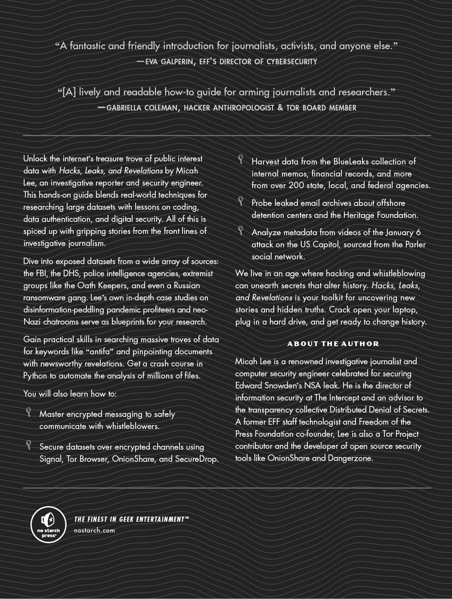

<hgroup>

# <samp class="SANS_Dogma_OT_Bold_B_11">INDEX</samp>

</hgroup>

+   <samp class="SANS_Futura_Std_Bold_Condensed_B_11">A</samp>

+   绝对路径，65

+   Adminer，350，352–358

+   管理员用户，58

+   阿富汗战争日志，34

+   Aingimea，Lionel，158–159

+   隔离计算机，9–10，18，20，30，50，147

+   Aleph（调查软件），xxvi，9，119–120，135–148，165–166，248，297，430，473

+   集合，142

+   Alexander，Ali，374

+   全俄国家电视广播公司（VGTRK），153，164–165

+   字母数字排序，97

+   交替大写，190–191，197，232–233

+   亚马逊 S3 存储桶（云服务提供商），154，306

+   美国前线医生（AFLDS），xxvii，10–12，180，309，371，389–426

+   Cadence Health，11，390，393–402，405，411–426

+   Gold，Simone，11，389–392，424–426

+   Ravkoo 药房，390，393–401，405–411，422–424

+   SpeakWithAnMD，390，393，400，404–405，410–411，413，423–425

+   亚马逊网络服务（AWS；托管服务提供商），8，49，106，302–303，424

+   Anderson，John，278

+   Anglin，Andrew，429

+   匿名，11，35，38–39，104，372

+   Antifa，87，100–101，244–248，285，344，443，462–465

+   反法西斯主义者, 17, 100, 428–429, 438, 463–466

+   应用程序编程接口（API）, 146, 298, 398, 414–416, 487–489

+   *学徒*, *The*（电视节目）, 19

+   apt（包管理器）, 71, 74–76

+   参数, 192–194

+   ARIC, 101–102, 278

+   亚利桑那州高强度毒品走私地区, 94–95, 101

+   升序（排序）, 242

+   阿桑奇, 朱利安, 14, 34–35

+   美联社, 14, 391

+   *大西洋*, 12

+   *奥斯汀纪事报*, 278

+   奥斯汀地区情报中心, 101–102, 278

+   AZHIDTA（亚利桑那州高强度毒品走私地区）, 94–95, 101

+   <samp class="SANS_Futura_Std_Bold_Condensed_B_11">B</samp>

+   巴比特, 阿什莉, 302

+   backend, 298

+   Base64, 151–152, 154, 157, 166

+   bash（shell）, 56, 59, 72, 82, 91, 123–124, 128, 139, 141

+   Bellingcat, 222

+   贝尔根格伦, 韦拉, 424

+   伯纳德, 纳撒尼尔, 278

+   Best, 艾玛, 35

+   拜登, 亨特, 149, 164

+   笔记本电脑, 149

+   拜登, 乔, 149, 164, 301, 303

+   二进制文件, 77–78

+   bind mounts（Docker）, 126

+   比甘蒙, 布兰特, 278

+   BitLocker（磁盘加密软件）, 22–23, 26–27

+   BitTorrent, xxv, 34, 37–39, 113–117

+   BitTorrent 客户端, 38

+   magnet 链接, 38

+   peer, 37

+   seed, 37

+   swarm, 37

+   Bitwarden（密码管理器）, 19–21

+   黑人的命也是命起义, xxv, 36, 38, 94, 100, 103–104, 140, 242, 244–247, 254–255, 257–258, 278, 343–344

+   代码块, 180, 183

+   BlueLeaks, xxv–xxvii, 36–39, 89–91, 93–105, 140, 144–145, 207–208, 223, 228, 237, 243–248, 252–260, 267–271, 275, 277–278, 282–296

+   奥斯汀地区情报中心, 101–102, 278

+   亚利桑那州高强度毒品走私区, 94–95, 101

+   特拉华州信息分析中心, 240

+   文档, 144, 242, 257–258, 269

+   内部结构, 89–91, 93–94, 96–105, 207–208, 223, 228

+   联合区域情报中心, 286–296

+   缅因州信息与分析中心, 278

+   北加州地区情报中心, 97, 243–248, 253–260, 269–271, 278, 282–286

+   起源, 38–39, 94–95

+   BlueLeaks Explorer, xxvii, 244, 277–299, 314, 348–349, 440, 444

+   布尔值, 182, 311

+   Bowers, Robert, 347, 371

+   Breitbart, 391

+   内置模块, 200

+   BuzzFeed 新闻, 6, 40, 302

+   Byobu（基于文本的窗口管理器）, 111–112

+   <samp class="SANS_Futura_Std_Bold_Condensed_B_11">C</samp>

+   Cablegate, 34

+   Cadence Health，11，390，393–402，405，411–426

+   调用函数，192

+   塔克·卡尔森，164–165，347

+   单元格（电子表格），239

+   德里克·肖文，94，140

+   Chocolately（包管理器），71

+   调查 FBI 公民委员会，xxiv

+   <samp class="SANS_TheSansMonoCd_W5Regular_11">click</samp>（Python 模块），208–212

+   希拉里·克林顿，7，149，284

+   云，8，18，106–113

+   詹姆斯·克莱本，389–390，424–425

+   CNN，50，223，303

+   COINTELPRO，xxiv

+   集合（Aleph），142

+   列（SQL），349

+   命令行参数，63，210–212

+   命令行界面（CLI），xxvi，55–85，88–94，96–104

+   Linux，57–58，62，71，74–76

+   macOS，57–58，62，72–74

+   Windows，57–62，74–76，92–94，473–482

+   命令提示符（shell），56，62

+   代码中的注释，173

+   计算机欺诈和滥用法案（CFAA），484

+   *消费者报告*，256

+   容器镜像，120

+   Conti（俄罗斯勒索病毒团伙），xxvi，216–223

+   控制流，182–191

+   cookies（HTTP），485

+   杰罗姆·科尔西，413，424

+   COVID-19 大流行，xxvii，4，11，257，391，393，407，418，421

+   Crikey，159

+   帕特里克·克鲁修斯，371，380–381

+   CSV（逗号分隔值）文件格式，xxvi–xxvii，103–104，145，200，237–243，245，248–254，270–276，280–281，335，349，358，390，398–399，401–420，493–495

+   cURL（命令行工具），72，76–77，96

+   当前工作目录，63

+   Currier, Cora，14

+   <samp class="SANS_Futura_Std_Bold_Condensed_B_11">D</samp>

+   《每日点》，374

+   《每日风暴报》，371，429

+   危险区（安全软件），xxv，29–32，101，120–121，123

+   *黑暗网络日记*（播客），19

+   克里姆林宫的黑暗面，35

+   数据集

+   阿富汗战争日志，34

+   全俄国家电视广播公司（VGTRK），153，164–165

+   美国前线医生，xxvii，10–12，180，309，371，389–426

+   BlueLeaks，xxv–xxvii，36–39，89–91，93–105，140，144–145，207–208，223，228，237，243–248，252–260，267–271，275，277–278，282–296

+   Cablegate，34

+   Conti（俄罗斯勒索病毒团伙），xxvi，216，223

+   克里姆林宫的黑暗面，35

+   DiscordLeaks，xxvii，428，462–469

+   DNC 电子邮件，35，149

+   Epik 失败，xxvii，36，348，350，370–385

+   Gab（社交网络），11，309，347–348，371–372，422–423，486–491

+   传统基金会，xxvi，154，161–162

+   亨特·拜登笔记本，149

+   伊拉克战争日志，34

+   瑙鲁警察部队，xxvi，153，156–159

+   Oath Keepers，xxvi，36，113–117，146，152–154，160–161，304，371，373–374

+   巴拿马文件，135，148

+   Parler（社交网络），xxvii，36，183，301–309，318–324，330–333，335–344，371，398，414，484

+   五角大楼文件，xxiv

+   俄罗斯 2022 年入侵乌克兰后的俄罗斯数据集，35，148–149

+   Snowden 档案，xxiv，9，42，147，496

+   茶党爱国者，xxv，47，391

+   WikiLeaks Twitter 群聊，xxv，4，12–14

+   Datashare（调查软件），147–148

+   装饰器（Python），211

+   DEDIAC，240

+   默认参数（Python），193–194

+   特拉华信息分析中心，240

+   民主党，7，35，164，259

+   依赖关系（编程），208，210

+   *Der Spiegel*，34

+   降序（排序），242

+   字典（Python），214

+   DigitalOcean（云服务提供商），49，106，108–111，113，117

+   DiscordLeaks，xxvii，428，462–469

+   假信息，10，18，284，371，389，405，407–408，425

+   分布式拒绝服务（DDoSecrets）, xxv, 7, 34–39, 96, 113, 135, 146, 149, 153–154, 160, 216, 239, 303–307, 372, 375, 422, 468, 472

+   DNC 邮件数据集, 35, 149

+   Docker, xxvi, 31, 119–142, 279–282, 350, 352–353, 384, 466, 472, 474, 476–478

+   Docker Compose, 120, 122, 132–143, 279–280, 352–353

+   *docker-compose.yaml*。*见* Docker Compose

+   Docker Desktop, 31, 121–122, 126, 128, 137, 478

+   Docker 引擎, 121–122

+   Docstring（Python）, 196

+   Durfee, Edward, 374

+   <samp class="SANS_Futura_Std_Bold_Condensed_B_11">E</samp>

+   Edwards, Natalie Mayflower Sours, 6, 40

+   8chan, 371, 380–382

+   8kun, xxvii, 371, 380

+   Ellsberg, Daniel, xxiv

+   电子邮件消息（EML）格式, 150–152, 156–159, 165, 175

+   加密, 8, 19, 21–28, 39–42, 47–49, 104–106

+   实体（Aleph）, 119, 140

+   环境变量, 92, 129

+   Epik Fail, xxvii, 36, 347–348, 350, 370–386

+   转义字符 (<samp class="SANS_TheSansMonoCd_W5Regular_11">\</samp>), 70, 203, 230

+   Espinal, Roque, 405, 423–425

+   异常处理 (Python), 187–189, 314–316, 449

+   可执行文件, 83

+   表达式 (Python), 173–175

+   可扩展标记语言 (XML), 334

+   <samp class="SANS_Futura_Std_Bold_Condensed_B_11">F</samp>

+   法西斯主义者, xxviii, 11, 301–304, 342–344, 347–348, 370–375, 392, 421–422, 427–429, 462–469, 487–490, 496

+   费德, 丹, 428

+   字段 (电子表格), 239

+   田野, 詹姆斯·亚历克斯, Jr., 427, 464, 467

+   文件对象 (Python), 229

+   文件系统, 25, 57

+   文件保险箱 (磁盘加密软件), 24

+   指纹 (加密), 107, 111

+   弗林, 吉姆, 424

+   浮动点数, 327

+   弗洛伊德, 乔治, 38, 94, 140, 144, 244, 277

+   分支 (开源), 351–352

+   <samp class="SANS_TheSansMonoCd_W5Regular_11">for</samp> 循环, 88–93, 96–98, 107, 180–181

+   福克斯新闻, 164, 347

+   新闻自由基金会, 46, 50

+   前端, 298–299

+   f-strings (Python), 176–177

+   函数 (Python), 192–198

+   融合中心, 38, 97, 101, 254–260

+   <samp class="SANS_Futura_Std_Bold_Condensed_B_11">G</samp>

+   Gab (社交网络), 11, 309, 347–348, 371–372, 422–423, 486–491

+   吉尔伯特, 乔伊, 425–426

+   吉莱斯皮, 伊登, 158

+   git 仓库, 84

+   朱利安尼, 鲁迪, 136

+   *环球邮报*, 50

+   戴尔, 西蒙娜, 11, 389–392, 424–426

+   戈尔森基, 艾米丽, 463

+   GPS（全球定位系统），xxvii，16，302–303，314，316，318–322，324–344，414–418

+   Grauer, Yael，349

+   Greene, Marjorie Taylor，487

+   Greenwald, Glenn，496

+   *Guardian*，34，50

+   <samp class="SANS_Futura_Std_Bold_Condensed_B_11">H</samp>

+   黑客

+   匿名，11，35，38–39，104，372

+   @donk_enby，302–303，344–345，484

+   JaXpArO 和 My Little Anonymous Revival Project，11

+   黑客攻击 Conti 的乌克兰安全研究员，216，223

+   黑客行动主义者，6，11，35，38–39，94–95，113

+   硬编码（Python），212

+   Harris, DeAndre，427

+   Heritage Foundation，xxvi，154，161–163

+   Heyer, Heather，427–429，467

+   Hoback, Cullen，380

+   Holly, Mary-Emma (Hazelpress)，12，14

+   Homebrew（包管理器），71–74

+   主机（网络），129

+   HTML，44，150，254，260

+   <samp class="SANS_TheSansMonoCd_W5Regular_11"><table></samp> 标签，493

+   <samp class="SANS_TheSansMonoCd_W5Regular_11"><td></samp> 标签，493

+   <samp class="SANS_TheSansMonoCd_W5Regular_11"><tr></samp> 标签，493

+   HTTP，130，209，416，460–461，485–491

+   HTTPS，45，130

+   <samp class="SANS_Futura_Std_Bold_Condensed_B_11">我</samp>

+   <samp class="SANS_TheSansMonoCd_W5Regular_11">if</samp> 语句（Python），183–184

+   Immanuel, Stella，413

+   ImportExportTools NG（Thunderbird 插件），155–158，160–162，166

+   索引（Python），179

+   索引数据集，119，121，139–140，148

+   Intella (调查软件), 147–148, 243

+   The Intercept, xxiv, 12, 14, 16, 29, 47, 50, 136, 147–148, 243, 277, 385, 389, 392, 410, 423, 429

+   国际调查记者联盟 (ICIJ), 135, 148

+   互联网档案馆, 10, 37, 484

+   Ioffe, Julia, 12

+   伊拉克战争日志, 34

+   <samp class="SANS_Futura_Std_Bold_Condensed_B_11">J</samp>

+   詹姆斯·韦布太空望远镜, 186

+   2021 年 1 月 6 日，叛乱, xxvii, 11, 36, 113, 154, 160–161, 301–304, 342, 371, 373–375, 392, 425

+   JavaScript (编程语言), 29, 44, 76, 78, 298, 301, 309, 398, 438, 485, 496

+   JaXpArO 和我的小匿名复兴计划, 11

+   联合区域情报中心, 286–296

+   记者

+   Anderson, John, 278

+   Assange, Julian, 14, 34–35

+   Bergengruen, Vera, 424

+   Bernard, Nathan, 278

+   Best, Emma, 35

+   Bingamon, Brant, 278

+   Carlson, Tucker, 164, 347

+   Currier, Cora, 14

+   Feidt, Dan, 428

+   Gillespie, Eden, 158

+   Grauer, Yael, 349

+   Greenwald, Glenn, 496

+   Hoback, Cullen, 380

+   Ioffe, Julie, 12

+   Leopold, Jason, 6, 40

+   Mac, Ryan, 302

+   Paczkowski, John, 302

+   Poitras, Laura, 14, 496

+   Poulsen, Kevin, 50

+   Rhysider, Jack, 19

+   Satter, Raphael, 14

+   Schiano, Chris, 428, 465

+   Stern, Carl, xxiv

+   Thalen, Mikael, 374–375

+   Wilson, Cam, 159

+   JRIC（联合区域情报中心），286–297

+   JSON 格式, xxvii, 301, 309–318, 396, 428, 430, 487

+   Jupyter Notebook, 120, 130–131

+   <samp class="SANS_Futura_Std_Bold_Condensed_B_11">K</samp>

+   KeePassXC（密码管理器）, 19–20

+   Kessler, Jason, 467

+   Keyhole Markup Language（KML），333–344

+   键（Python 字典）, 214

+   关键字参数, 194

+   Kleve, Dan, 465

+   KML 格式, 333–344

+   <samp class="SANS_Futura_Std_Bold_Condensed_B_11">L</samp>

+   纬度, 324, 330

+   Lawson, Kristina, 390

+   Leopold, Jason, 6, 40

+   LibreOffice, 238

+   Linux 容器, 29, 120

+   列表（Python）, 178

+   本地文件夹, 155, 157, 162

+   经度, 324, 330

+   洛杉矶联合区域情报中心, 286–297

+   LUKS（磁盘加密技术）, 24

+   <samp class="SANS_Futura_Std_Bold_Condensed_B_11">M</samp>

+   Mac, Ryan, 302

+   缅因州信息与分析中心, 278

+   *Mainer*，278

+   Manning, Chelsea, xxiv, 14, 33, 49

+   man 手册，67

+   MapBox, 335, 417

+   MariaDB, 351–352

+   标记语言, 484

+   MBOX（格式）, 152–154, 160, 166

+   McAfee, John, 16

+   MIAC, 278

+   Microsoft Outlook（电子邮件客户端）, 163–164

+   MIME 格式, 150

+   模块, 200

+   Monster, Rob, 370

+   mount（Docker），125

+   Mueller, Robert, 413

+   多用途互联网邮件扩展（MIME）格式, 150

+   MySQL, 348, 351–355, 366–370

+   <samp class="SANS_Futura_Std_Bold_Condensed_B_11">N</samp>

+   nano（文本编辑器）, 108, 479

+   南太平洋岛屿警察部队, xxvi, 153, 156–159

+   Navalny, Alexei, 223

+   NBC, xxiv

+   NCRIC（北加州地区情报中心）, 97, 243–248, 253–260, 269–271, 278, 282–286

+   嵌套代码块（Python）, 185

+   新纳粹分子, xxvii, 14, 17, 36, 223, 370–371, 427–429, 432–436, 443, 462–469

+   Netsential, 94

+   换行符 (<samp class="SANS_TheSansMonoCd_W5Regular_11">\n</samp>), 91, 230

+   *纽约时报*, 34, 49, 50, 94

+   北加州地区情报中心, 97, 243–248, 253–260, 269–271, 278, 282–286

+   Notte, Iven, 158–159

+   Novick, Michael, 465

+   <samp class="SANS_Futura_Std_Bold_Condensed_B_11">O</samp>

+   Oath Keepers, xxvi, 36, 113–117, 146, 152–154, 160–161, 304, 371, 373–374

+   Obama, Barack, 413

+   对象关系映射（ORM）, 444

+   1Password（密码管理器）, 19–20

+   OnionShare（匿名文件共享）, xxv, 12, 34, 42–47, 50

+   开源情报（OSINT）, 6, 10, 14, 94, 410, 422

+   运算符, 173, 175, 182–183

+   算术, 173

+   比较, 182–183

+   <samp class="SANS_TheSansMonoCd_W5Regular_11">in</samp> 运算符, 185

+   逻辑的, 182, 186–187

+   光学字符识别（OCR）, 29–30, 119–120, 141, 165

+   有组织犯罪与腐败报道项目（OCCRP）, 43, 119, 135–136, 148

+   Outlook（邮件客户端）, 163–165

+   Outlook 数据文件, 152

+   <samp class="SANS_Futura_Std_Bold_Condensed_B_11">P</samp>

+   包管理器, 70–73, 208, 210

+   Paczkowski, John, 302

+   巴拿马文件, 135, 148

+   Parallels（虚拟机软件）, 32

+   Parler（社交网络）, xxvii, 36, 183, 301–309, 318–324, 330–333, 335–344, 371, 398, 414, 484

+   分区, 25

+   密码短语, 20, 48

+   密码生成器, 20, 25

+   密码管理器, 18–20, 25, 41

+   Patel, Alpesh, 410, 422

+   路径, 57–58

+   Pence, Mike, 302

+   五角大楼文件, xxiv

+   个人可识别信息（PII），7, 16, 36, 113, 154

+   PGP（漂亮的好隐私加密软件）, 42, 47, 107

+   网络钓鱼, 29, 101

+   Pip（Python 包安装器）, 208

+   Pipenv（Python 包管理器）, 210

+   管道操作符 (<samp class="SANS_TheSansMonoCd_W5Regular_11">|</samp>), 98

+   Pizzagate（阴谋论）, 35

+   Podesta, John, 149

+   Podman, 123

+   Poetry（Python 包管理器）, 210

+   Poitras, Laura, 14

+   端口（网络）, 129

+   位置参数, 193

+   Poulsen, Kevin, 50

+   PowerShell, 56, 59–60, 62, 92–93, 109, 476, 478–480, 497

+   ProPublica，50, 333

+   协议，150

+   Proud Boys, 304, 371

+   PST（格式），152–155, 161–166

+   公钥，42, 107, 109–111

+   发布（Docker），130

+   俄罗斯总统普京（Vladimir Putin），135, 199

+   Python（编程语言），xxvi, 13, 78, 278

+   属性，446

+   <samp class="SANS_TheSansMonoCd_W5Regular_11">bs4</samp> 模块，491

+   类，446

+   <samp class="SANS_TheSansMonoCd_W5Regular_11">click</samp> 模块，208

+   构造函数，446

+   <samp class="SANS_TheSansMonoCd_W5Regular_11">continue</samp> 语句，204

+   <samp class="SANS_TheSansMonoCd_W5Regular_11">csv.DictReader()</samp>，248–249

+   <samp class="SANS_TheSansMonoCd_W5Regular_11">csv</samp> 模块，248–249

+   <samp class="SANS_TheSansMonoCd_W5Regular_11">datetime.fromtimestamp()</samp> 函数，198, 436

+   <samp class="SANS_TheSansMonoCd_W5Regular_11">def</samp> 关键字，192

+   <samp class="SANS_TheSansMonoCd_W5Regular_11">except</samp> 语句，188

+   <samp class="SANS_TheSansMonoCd_W5Regular_11">exit()</samp> 函数，172

+   <samp class="SANS_TheSansMonoCd_W5Regular_11">file.readlines()</samp> 方法，231

+   <samp class="SANS_TheSansMonoCd_W5Regular_11">file.read()</samp> 方法，229

+   <samp class="SANS_TheSansMonoCd_W5Regular_11">file.write()</samp> 方法，230

+   <samp class="SANS_TheSansMonoCd_W5Regular_11">float()</samp> 函数，327

+   <samp class="SANS_TheSansMonoCd_W5Regular_11">f.write()</samp> 方法，229

+   <samp class="SANS_TheSansMonoCd_W5Regular_11">httpx.get()</samp> 函数，416, 486, 489

+   <samp class="SANS_TheSansMonoCd_W5Regular_11">httpx</samp> 模块，209, 416, 486

+   <samp class="SANS_TheSansMonoCd_W5Regular_11">import</samp> 语句，200

+   解释器，172

+   <samp class="SANS_TheSansMonoCd_W5Regular_11">json.loads()</samp> 方法，312

+   <samp class="SANS_TheSansMonoCd_W5Regular_11">json</samp> 模块，216, 312

+   <samp class="SANS_TheSansMonoCd_W5Regular_11">kml.newpoint()</samp> 方法，334

+   <samp class="SANS_TheSansMonoCd_W5Regular_11">kml.save()</samp> 方法，334

+   <samp class="SANS_TheSansMonoCd_W5Regular_11">len()</samp> 函数，179，181，194

+   <samp class="SANS_TheSansMonoCd_W5Regular_11">list.append()</samp> 方法，180

+   <samp class="SANS_TheSansMonoCd_W5Regular_11">math</samp> 模块，329

+   <samp class="SANS_TheSansMonoCd_W5Regular_11">math.sqrt()</samp> 函数，329

+   方法，446

+   模块，200

+   <samp class="SANS_TheSansMonoCd_W5Regular_11">_</samp><samp class="SANS_TheSansMonoCd_W5Regular_11">_name</samp><samp class="SANS_TheSansMonoCd_W5Regular_11">_</samp><samp class="SANS_TheSansMonoCd_W5Regular_11">_</samp> 变量，202

+   <samp class="SANS_TheSansMonoCd_W5Regular_11">open()</samp> 函数，229

+   <samp class="SANS_TheSansMonoCd_W5Regular_11">os.listdir()</samp> 函数 203

+   <samp class="SANS_TheSansMonoCd_W5Regular_11">os</samp> 模块，202

+   <samp class="SANS_TheSansMonoCd_W5Regular_11">os.path.getsize()</samp> 函数，207

+   <samp class="SANS_TheSansMonoCd_W5Regular_11">os.path.isdir()</samp> 函数，204–205

+   <samp class="SANS_TheSansMonoCd_W5Regular_11">os.path.isfile()</samp> 函数，205

+   <samp class="SANS_TheSansMonoCd_W5Regular_11">os.path.join()</samp> 函数，204

+   <samp class="SANS_TheSansMonoCd_W5Regular_11">os.walk()</samp> 函数，205

+   包，208

+   <samp class="SANS_TheSansMonoCd_W5Regular_11">pass</samp> 语句，202

+   <samp class="SANS_TheSansMonoCd_W5Regular_11">print()</samp> 函数，171

+   <samp class="SANS_TheSansMonoCd_W5Regular_11">simplekml.Kml()</samp> 类，334

+   <samp class="SANS_TheSansMonoCd_W5Regular_11">simplekml</samp> 模块，334

+   <samp class="SANS_TheSansMonoCd_W5Regular_11">sqlalchemy</samp> 模块，169，209

+   <samp class="SANS_TheSansMonoCd_W5Regular_11">str.capitalize()</samp> 方法，172

+   <samp class="SANS_TheSansMonoCd_W5Regular_11">str.lower()</samp> 方法，172

+   <samp class="SANS_TheSansMonoCd_W5Regular_11">str.replace()</samp> 方法，327

+   <samp class="SANS_TheSansMonoCd_W5Regular_11">str.split()</samp> 方法，326

+   <samp class="SANS_TheSansMonoCd_W5Regular_11">str.strip()</samp> 方法，231

+   <samp class="SANS_TheSansMonoCd_W5Regular_11">str.upper()</samp> 方法，171, 172

+   <samp class="SANS_TheSansMonoCd_W5Regular_11">time</samp> 模块，200

+   <samp class="SANS_TheSansMonoCd_W5Regular_11">time.sleep()</samp> 函数，200

+   <samp class="SANS_TheSansMonoCd_W5Regular_11">try</samp> 语句，188

+   <samp class="SANS_TheSansMonoCd_W5Regular_11">type()</samp> 函数，218, 312

+   <samp class="SANS_TheSansMonoCd_W5Regular_11">with</samp> 语句，229

+   <samp class="SANS_Futura_Std_Bold_Condensed_B_11">Q</samp>

+   QAnon（阴谋论），xxvii, 380–381, 487

+   <samp class="SANS_Futura_Std_Bold_Condensed_B_11">R</samp>

+   Ravkoo Pharmacy，390, 393–401, 405–411, 422–424

+   记录（电子表格），239

+   删除，14–17

+   重定向，77

+   正则表达式（regex），102

+   相对路径，65

+   远程代码执行漏洞，94

+   共和党，6, 303, 391

+   返回值，192–197

+   路透社，484

+   Reveal，484

+   Rhodes, Stewart, 154, 304, 374

+   Rhysider, Jack, 19

+   Rich, Seth, 7, 35

+   *风险*（电影），14

+   root 用户，58

+   行（电子表格），239

+   行（SQL），349

+   俄罗斯 2022 年入侵乌克兰后的俄罗斯数据集，35, 148–149

+   今日俄罗斯，14

+   <samp class="SANS_Futura_Std_Bold_Condensed_B_11">S</samp>

+   Sagan, Carl, 350, 356, 360–361, 363–365

+   Satter, Raphael, 14

+   Schiano, Chris, 428, 465

+   Schulze, Nancy, 391

+   范围（Python），192

+   抓取，xxviii, 302–303, 398, 438, 483–502

+   秘钥，42, 107

+   SecureDrop（举报人提交软件），xxv, 35, 50

+   Sena, Mike, 260

+   服务器密钥，111

+   服务器软件，129–131

+   7-Zip（归档软件），92–93，476–477

+   shell，56，95

+   shell 命令

+   <samp class="SANS_TheSansMonoCd_W5Regular_11">7z</samp>，93

+   <samp class="SANS_TheSansMonoCd_W5Regular_11">apt</samp>，74，76

+   <samp class="SANS_TheSansMonoCd_W5Regular_11">brew</samp>，72

+   <samp class="SANS_TheSansMonoCd_W5Regular_11">byobu</samp>，111

+   <samp class="SANS_TheSansMonoCd_W5Regular_11">cat</samp>，77–78

+   <samp class="SANS_TheSansMonoCd_W5Regular_11">chmod</samp>，83

+   <samp class="SANS_TheSansMonoCd_W5Regular_11">code</samp>，79

+   <samp class="SANS_TheSansMonoCd_W5Regular_11">curl</samp>，77，305

+   <samp class="SANS_TheSansMonoCd_W5Regular_11">docker</samp>，120，123，132

+   <samp class="SANS_TheSansMonoCd_W5Regular_11">docker-compose</samp>，120

+   <samp class="SANS_TheSansMonoCd_W5Regular_11">du</samp>，96，395

+   <samp class="SANS_TheSansMonoCd_W5Regular_11">echo</samp>，83

+   <samp class="SANS_TheSansMonoCd_W5Regular_11">exiftool</samp>，344，346

+   <samp class="SANS_TheSansMonoCd_W5Regular_11">find</samp>，99

+   <samp class="SANS_TheSansMonoCd_W5Regular_11">gdu</samp>，96，395

+   <samp class="SANS_TheSansMonoCd_W5Regular_11">git</samp>，84–85

+   <samp class="SANS_TheSansMonoCd_W5Regular_11">grep</samp>，100，104，166，316

+   <samp class="SANS_TheSansMonoCd_W5Regular_11">gunzip</samp>，306

+   <samp class="SANS_TheSansMonoCd_W5Regular_11">head</samp>，395

+   <samp class="SANS_TheSansMonoCd_W5Regular_11">jq</samp>，317–318，430，438，166，316

+   <samp class="SANS_TheSansMonoCd_W5Regular_11">ls</samp>，63，66

+   <samp class="SANS_TheSansMonoCd_W5Regular_11">man</samp>，80

+   <samp class="SANS_TheSansMonoCd_W5Regular_11">mkdir</samp>，81，94

+   <samp class="SANS_TheSansMonoCd_W5Regular_11">munpack</samp>，157

+   <samp class="SANS_TheSansMonoCd_W5Regular_11">mv</samp>，94，307

+   <samp class="SANS_TheSansMonoCd_W5Regular_11">mysql</samp>，367–368

+   <samp class="SANS_TheSansMonoCd_W5Regular_11">neofetch</samp>，73，75

+   <samp class="SANS_TheSansMonoCd_W5Regular_11">pv</samp>，376

+   <samp class="SANS_TheSansMonoCd_W5Regular_11">pwd</samp>，63

+   <samp class="SANS_TheSansMonoCd_W5Regular_11">readpst</samp>，155，161–162

+   <samp class="SANS_TheSansMonoCd_W5Regular_11">reboot</samp>，112

+   <samp class="SANS_TheSansMonoCd_W5Regular_11">restic</samp>，105

+   <samp class="SANS_TheSansMonoCd_W5Regular_11">rm</samp>，90

+   <samp class="SANS_TheSansMonoCd_W5Regular_11">rsync</samp>，115

+   <samp class="SANS_TheSansMonoCd_W5Regular_11">scp</samp>，115

+   <samp class="SANS_TheSansMonoCd_W5Regular_11">sort</samp>，97

+   <samp class="SANS_TheSansMonoCd_W5Regular_11">ssh</samp>，107

+   <samp class="SANS_TheSansMonoCd_W5Regular_11">sudo</samp>，59，69

+   <samp class="SANS_TheSansMonoCd_W5Regular_11">tar</samp>，308，394

+   <samp class="SANS_TheSansMonoCd_W5Regular_11">transmission-cli</samp>，113

+   <samp class="SANS_TheSansMonoCd_W5Regular_11">unzip</samp>，66

+   <samp class="SANS_TheSansMonoCd_W5Regular_11">wc</samp>，100，316，395

+   <samp class="SANS_TheSansMonoCd_W5Regular_11">wget</samp>，305，307

+   <samp class="SANS_TheSansMonoCd_W5Regular_11">which</samp>，76

+   <samp class="SANS_TheSansMonoCd_W5Regular_11">whoami</samp>，58

+   <samp class="SANS_TheSansMonoCd_W5Regular_11">whois</samp>，373

+   shell 脚本，xxvi，56，78，80，90，96

+   Shokin, Viktor，164

+   Sicknick, Brian，302

+   Signal（加密消息应用），xxv，5，9，12，34，39–42，44，46–48，50，260

+   安全号码，41

+   封闭发送者，40

+   丝绸之路，22

+   Snowden, Edward，xxiv，9，42，147，496

+   Snowden 档案, xxiv, 9, 42, 147, 496

+   索罗斯, 乔治, 259, 278

+   排序, 242

+   SpeakWithAnMD, 390, 393, 400, 404–405, 410–411, 413, 423–425

+   矛钓攻击, 29

+   斯宾塞, 理查德, 463, 467

+   SQL（结构化查询语言）, xxvii, 280, 348

+   <samp class="SANS_TheSansMonoCd_W5Regular_11">COUNT()</samp> 函数, 360

+   <samp class="SANS_TheSansMonoCd_W5Regular_11">DELETE</samp> 语句, 366

+   <samp class="SANS_TheSansMonoCd_W5Regular_11">GROUP BY</samp> 子句, 383

+   <samp class="SANS_TheSansMonoCd_W5Regular_11">INNER JOIN</samp> 子句, 363

+   <samp class="SANS_TheSansMonoCd_W5Regular_11">JOIN</samp> 子句, 362, 365

+   <samp class="SANS_TheSansMonoCd_W5Regular_11">LEFT JOIN</samp> 子句, 363

+   <samp class="SANS_TheSansMonoCd_W5Regular_11">LIKE</samp> 操作符, 361

+   <samp class="SANS_TheSansMonoCd_W5Regular_11">ORDER BY</samp> 子句, 359

+   <samp class="SANS_TheSansMonoCd_W5Regular_11">OR</samp> 操作符, 362

+   <samp class="SANS_TheSansMonoCd_W5Regular_11">RIGHT JOIN</samp> 子句, 363

+   <samp class="SANS_TheSansMonoCd_W5Regular_11">SELECT</samp> 语句, 357, 365

+   语句, 350

+   <samp class="SANS_TheSansMonoCd_W5Regular_11">UPDATE</samp> 语句, 365

+   <samp class="SANS_TheSansMonoCd_W5Regular_11">WHERE</samp> 子句, 360, 362, 365

+   SQLAlchemy, 444–452

+   SQL 注入, 94, 444

+   SQLite, 280

+   SSH, 49, 107–108, 111

+   SSH 密钥, 107–110

+   斯特恩, 卡尔, xxiv

+   斯特兰德, 约翰, 392, 425

+   字符串, 175–176

+   结构（BlueLeaks Explorer）, 281

+   结构化数据, 145

+   斯瓦茨, 亚伦, 50

+   语法, 56, 172

+   语法高亮, 79

+   <samp class="SANS_Futura_Std_Bold_Condensed_B_11">T</samp>

+   标签补全，67–68

+   表（SQL），349

+   标签（HTML），260

+   塔拉，瓦苏达，260

+   tarball，304

+   塔里奥，恩里克，304

+   泰勒，布雷昂娜，277

+   茶党爱国者，xxv，47，391

+   技术栈，298

+   终端，55–57，62–63

+   基于文本的窗口管理器，107

+   文本编辑器，78–80，108

+   文本文件，77

+   塔伦，米卡埃尔，374–375

+   第三方模块，208

+   Thunderbird（电子邮件客户端），152，154–163，165–166

+   *时间*，424

+   提示页面，50

+   Tor（匿名网络），xxv，43–46，49，107，296，383

+   节点，43

+   洋葱服务，42–43，45，50

+   托尔巴，安德鲁，490

+   Transmission（BitTorrent 客户端），39

+   特朗普，唐纳德，xxiv，xxvii，6，11，16，19，35–36，100，136，149，301，389，391，408，428，469

+   特朗普，唐纳德·小，12

+   首次使用即信任（TOFU），111

+   元组（Python），205

+   <samp class="SANS_Futura_Std_Bold_Condensed_B_11">U</samp>

+   乌尔布里希特，罗斯，22

+   Unicorn Riot，428–430，438，452–453，456，464–468

+   联合右翼抗议活动（夏洛茨维尔，弗吉尼亚州），xxvii，17，427–428，466–468

+   UTM（虚拟机软件），32

+   <samp class="SANS_Futura_Std_Bold_Condensed_B_11">V</samp>

+   值（变量），88

+   值（Python 字典），214

+   变量，88，173–174

+   VeraCrypt（磁盘加密软件），23–24, 27–28, 48

+   VGTRK（全俄国家电视广播公司），153, 164

+   *Vice*，16, 303

+   vim（文本编辑器），108

+   VirtualBox（虚拟机软件），31, 164

+   虚拟环境，210

+   虚拟机（VM），31, 59, 121, 164, 482

+   虚拟专用网络（VPN），49, 156, 256

+   虚拟专用服务器（VPS），49, 106

+   VMware Fusion（虚拟机软件），32

+   卷（Docker），125

+   VS Code（文本编辑器），78–82, 108, 171

+   <samp class="SANS_Futura_Std_Bold_Condensed_B_11">W</samp>

+   *华盛顿邮报*，34, 49–50

+   沃特金斯（Jim Watkins），380–382, 385

+   沃特金斯（Ron Watkins），380

+   web scraping（网页抓取），xxviii, 302–303, 398, 438, 483–502

+   web shell, 95

+   WhatsApp（加密消息应用），39–40

+   吹哨人，6, 50

+   纳塔莉·梅花·苏尔斯（Natalie Mayflower Sours Edwards），6, 40

+   埃尔斯伯格（Daniel Ellsberg），xxiv

+   霍利（Mary-Emma Holly，Hazelpress），12, 14

+   曼宁（Chelsea Manning），xxiv, 14, 33, 49

+   爱德华·斯诺登（Edward Snowden），xxiv, 9, 496

+   Reality Winner，16, 29

+   WHOIS，373–374, 380–382, 385–386

+   米哈伊尔·“蒙蒂”·维登纽斯（Michael “Monty” Widenius），351–352

+   WikiLeaks, xxv, 7, 12–14, 34–36

+   WikiLeaks Twitter Group DMs, xxv, 4, 12–14

+   威尔逊（Cam Wilson），159

+   Windows Subsystem for Linux（WSL），59–62, 473–482

+   Reality Winner，16, 29

+   WordPress，120, 132–135, 350–353

+   <samp class="SANS_Futura_Std_Bold_Condensed_B_11">X</samp>

+   XML 格式, 334

+   <samp class="SANS_Futura_Std_Bold_Condensed_B_11">Y</samp>

+   YAML 格式, 132

+   YubiKey, 42

+   <samp class="SANS_Futura_Std_Bold_Condensed_B_11">Z</samp>

+   泽连斯基, 弗拉基米尔, 408, 413

+   泽连斯基, 弗拉基米尔, 223

+   zsh（Shell）, 56, 62, 82

