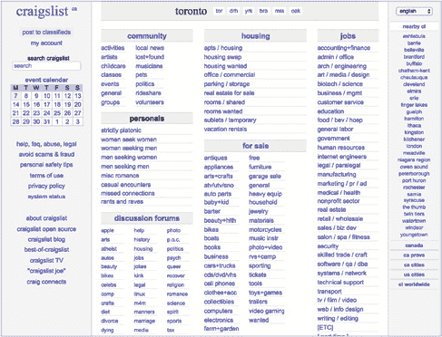

## 第一章

## 如果你只读一章，那就读这一章

如果你碰到这本书，并且只有时间读一章，那就读这一章吧。为什么？因为它向你展示了改进设计的最快方法。

### 设计的效果比外观更重要

我知道你可能是来这本书寻求如何改进设计外观的帮助，但请耐心听我说一下：你的设计*如何工作*比它*看起来*如何更重要。

以 Craigslist 为例。多年来，该网站基本没有变化，设计看起来非常过时（**图 1-1**）。

如果外观最重要的话，Craigslist 很早就会被其他新兴的、现代化的分类广告网站淘汰。

Craigslist 之所以依然是分类广告的领先者，仅仅因为它简单直观，使用起来非常方便。没有花哨的效果或令人分心的横幅广告，Craigslist 使发布广告和搜索现有广告变得非常简单。

**图 1-1：** Craigslist 即使没有现代化的网页设计，依然是行业的佼佼者。

如果你担心你的网站太简单，看起来不够“现代”——也就是说，不符合所有最新的趋势，而这些趋势不一定代表“好的”网站设计——我在这里安慰你，外观远不如设计是否能达到你和用户的目标来得重要。

确保你的设计能带来良好的用户体验有两个重要步骤：知道你希望设计达成的目标，并从他人那里获得反馈。

#### *确定什么是成功的标志*

在你确定设计目标之前，你无法评估设计的效果。不同类型的设计有不同的目标。例如，你可能希望访客：

+   填写表格。

+   平均花费至少 30 秒浏览一个页面。

+   订阅新闻通讯。

+   留下评论。

你可能在用户体验书籍中听说过“转化率”这个术语，这是一个高大上的说法，意思是：“有多少人做了我希望他们做的事情？”一旦你为你的网站定义了“成功”的标准，就能做出更好的设计决策，衡量当前设计的效果，并提高转化率。

#### *请其他人查看并评价你的设计*

如果你对自己新学的设计技能感到害羞，可能不愿意将自己的设计展示给别人看。万一他们不喜欢怎么办？万一他们说些负面的评价呢？

克服这些不安全感，将你的设计展示给那些不是你的人，将带来设计上*最大的*改进。作为设计师，你无法客观评估你的设计效果。你会对潜在问题视而不见。

通过将你的设计展示给他人，你能够看到人们是否能成功地完成你想要他们做的事情，以及网站的任何部分是否让人感到困惑。你也可能会得到一些点赞。

反馈是有用的，但不要觉得你需要遵循每个建议或处理你收到的每个评论。把它们存放在心里，或者列个清单，等你听取了几个人的意见后再处理这些变化。有时候，你会从两个人那里收到相互矛盾的反馈，这是正常的（如果其中一个人的反馈更贴近你的目标用户画像，那么那个人的反馈更为重要！）。也许存在第三种方法能让每个人都满意，或者也许现在根本不需要为那个问题担忧。

### 快速提高设计的技巧

“但 Tracy，”你可能会说，“我也希望我的设计不仅仅*更好用*，还要*更好看*。”

我明白你的意思！你设计的外观同样会影响用户体验，你可以通过牢记一个关键概念来改进你的设计（这个概念适用于很多方面）：*减少杂乱*。

#### *减少杂乱，创造更美观的设计*

杂乱——就像你在繁忙、杂乱无章的设计中看到的那样——是良好用户体验的祸根，清理杂乱可以让你的网站既*看起来*更好，也*运作*得更好。

在此基础上，我们将介绍一些简短、易于理解的原则，稍后我们会更深入地探讨：

##### 使用网格

大多数设计通过使用网格来减少杂乱，网格为你的设计创建了一个框架，帮助定位对象并无意识地营造一种秩序感。小的像素差异会让设计看起来显得杂乱无章和不专业。

*我们将在第二章，第 2.1 节中更深入地讨论这个话题。*

##### 只选几种颜色

充满各种颜色的设计（24 种蓝色、5 种红色等等）看起来很繁杂。设定一个特定的色彩调色板，并在设计中只使用这些颜色，可以创造出更加统一的外观。

*我们将在第二章，第 2.2 节中更深入地讨论这个话题。*

##### 限制使用两种字体

虽然你*可以*为你的导航使用一种字体，为文本使用另一种字体，为按钮使用另一种字体，为标题使用另一种字体——这会让你的设计显得杂乱无章。限制你使用的字体数量，并使用加粗、斜体、大写字母及其他变换来创造多样性并表示强调。

*我们将在第二章，第 2.3 节中更深入地讨论这个话题。*

##### 简化你的文本

大段文本看起来像是杂乱。简化句子，并将段落限制在两到三句话内。你还可以通过添加项目符号和标题来分割文本。网络上的读者倾向于浏览文本，而较短的段落能让更多读者继续阅读。

*我们将在第二章、第 2.6 节中深入讨论这个话题。*

##### 添加空白

空白是减少杂乱的终极法宝。新设计师常犯的一个最大错误是将元素之间放得太近。通过在元素之间（内容、小部件、表单、按钮、图片、文本等）添加空白，可以使设计更加易于阅读，更现代、通透并富有吸引力。

*我们将在第二章、第 2.4 节中深入讨论这个话题。*

上述所有内容可以浓缩为一句话：

**确保你的设计*效果*良好，

并尽可能减少杂乱。**

这些建议将帮助你走上创建更好设计的正确道路，接下来的章节会更详细地探讨这些指南。
