## 第二章

## 理论与设计原则

我们来深入探讨一下这个信息，好吗？

本章的每一节都将平衡理论（让你了解背景和事物的原因）、现实生活中的例子（让你看到这些原则的应用）以及快捷方式（让你能够快速应用这些原则，而无需从头开始）。

我会给你一些规则和建议供你记住。当然，每个规则都有例外，每个规则也可以被打破。因为这些章节是面向初学者的，我们将遵循这些原则，但随着你作为设计师的成长，你会学会什么时候可以打破一些规则。

在我们深入每一节内容时，我们将把这些原则应用到这个小部件上（如**图 2-1**所示）。

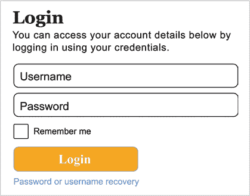

**图 2-1：** 一个（相当丑的）小部件。我们来改善一下它的外观吧，怎么样？

它现在看起来不怎么样，但随着我们应用所学的内容，它会逐渐变得更好。

让我们开始吧！

第 2.1 节

网格

我们的第一个原则很简单：对齐！

你可能听过这个常见的设计师抱怨：

设计师制作了一个像素完美的模型，并交给开发者来实现。开发者根据设计建造了该设计，但实际的设计与模型的差距只有两个像素！

“傻设计师，”开发者说。“为什么这么小的差异会重要？它基本上是一样的。”

事情是这样的——像素级的小差异确实很重要，尤其是在页面元素方面。如果一个元素接近但没有完全与另一个元素对齐，它可能会产生一点微小的不均匀感，而这种小小的混乱会导致不安和杂乱的感觉（**图 2-2**）。

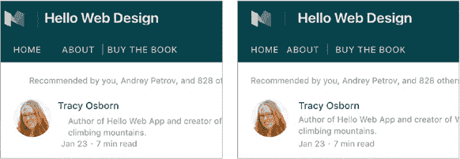

**图 2-2：** 这两张截图基本相同，但左边那张，所有东西稍微不对齐，看起来不那么协调和专业。

确保元素之间对齐的最简单方法是给我们的设计加上一个网格。网格为我们的应用添加了一个看不见的框架，这是我们用来设置和排列元素的支架，使得整体布局看起来整洁有序。将元素对齐到基础网格上，将帮助你在整个设计中实现对齐和一致性。

*纽约时报* 网站 **(图 2-3)** 使用五个主要的 *列* 来组织大量信息。列与列之间的红色高亮部分是 *缝隙*。网格中的对象可以跨越多个列，有些对象可能会突破网格，但一切大致上都遵循网格。

你可以在设计中使用任意数量的列 **(图 2-4)**，但 12 列网格 **(图 2-5)** 是最常用的，因为它的通用性。

网格还帮助你为网站布局创建一个计划，因为它限制了你将元素放置在特定区域，而不是让你自由选择整个页面的任何地方。双赢三赢。

本质上：有很多元素吗？将它们对齐（水平、垂直，或两者）以创建一种整体感。

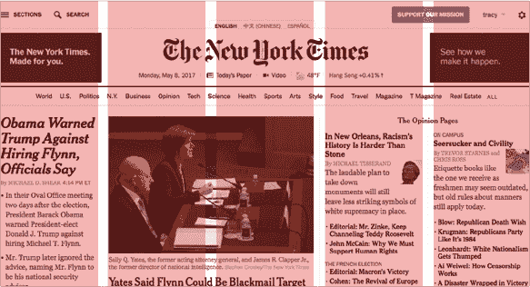

**图 2-3:** *纽约时报* 网站使用网格有效地组织大量元素，并在主页上展示项目。

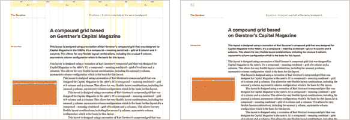

**图 2-4:** Gridset 网站演示了带或不带引导线的复合 4+6 网格。

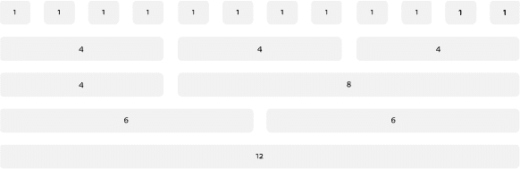

**图 2-5:** Bootstrap CSS 框架中的 12 列网格系统。

### 快捷键

这里的理论很简单——只需对齐元素——但有很多工具可以帮助确保我们使用网格。

#### *模型程序中的网格*

如果你正在设计一些不会用 CSS 构建的东西，你需要为设计添加引导线。

所有模型程序——如 Photoshop、Sketch 或 GIMP——都允许你设置浮动的引导线，使得对齐设计元素到引导线变得轻松。

如果你在像 Photoshop 这样的程序中制作网站模型，可以使用网格模板来布置网站，使用与你的网站框架系统中相同的列数 (**图 2-6**)。

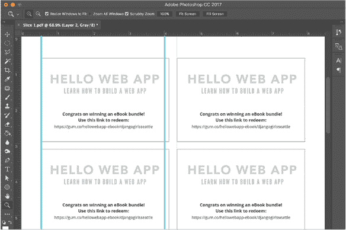

**图 2-6:** 在 Photoshop 中，可以通过拖动屏幕左侧和顶部的标尺来设置引导线。

引导线在大多数幻灯片程序和其他简单布局中也可以访问，如 Keynote **(图 2-7)**。

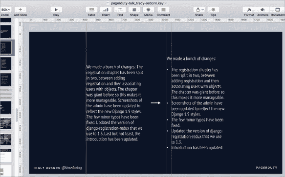

**图 2-7:** Keynote 也允许你从屏幕上的标尺拉出引导线。许多其他程序也有类似的选项。

对于幻灯片，你无需为系统添加一个完整的 12 列网格——**图 2-7** 中的幻灯片只有几个引导线，足以保持不同页面上的元素对齐。

然而，如果你正在设计一些更复杂的内容，你可以下载一些已设置多列的模板，如 960.gs (*[hellobks.com/hwd/4](http://hellobks.com/hwd/4)*) 系统。

#### *网页设计中的网格*

我强烈推荐使用带有网格的 CSS 框架，如 Bootstrap (*[hellobks.com/hwd/5](http://hellobks.com/hwd/5)*), Foundation (*[hellobks.com/hwd/6](http://hellobks.com/hwd/6)*), Skeleton (*[hellobks.com/hwd/7](http://hellobks.com/hwd/7)*), mini.css (*[hellobks.com/hwd/8](http://hellobks.com/hwd/8)*), 或 PureCSS (*[hellobks.com/hwd/9](http://hellobks.com/hwd/9)*) **(图 2-8)**。

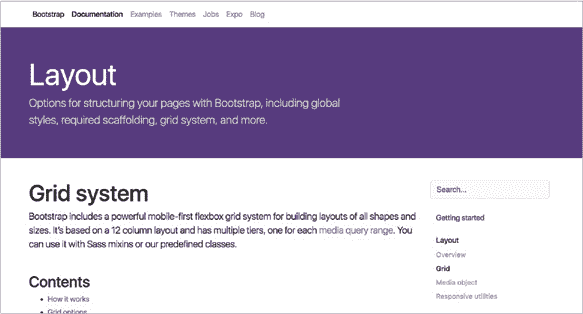

**图 2-8:** Bootstrap CSS 框架中包含的网格系统。

通过使用 HTML 类将设计约束在底层 CSS 网格中，元素将自然而然地与页面上的其他元素对齐 **(图 2-9)**。只需记住，CSS 中可能添加的额外边距或内边距可能会导致元素错位。

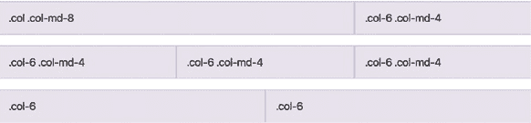

**图 2-9：** Bootstrap 中用于对齐和设置对象在底层网格中的一些 CSS 类。

CSS 正在获得一个新元素，叫做 CSS 网格（多方便啊！），它让元素无需使用 CSS 框架就能轻松地对齐到网格中。在本书写作时，CSS 网格已经接近发布，并且大多数浏览器都已经覆盖了它。尽管本书不涉及 CSS，但使用 CSS 网格会让实现基于网格的设计变得更加简单 **(图 2-10)**。

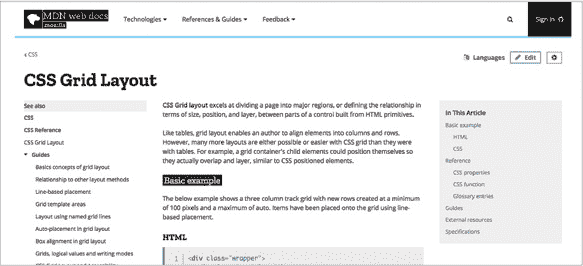

**图 2-10：** Mozilla 开发者网络上的 CSS 网格文档 (*[hellobks.com/hwd/10](http://hellobks.com/hwd/10)*)

### 现实生活中的例子

记得我们在本章开始时介绍的小部件吗？让我们通过对齐元素来更新设计 **(图 2-11)**。

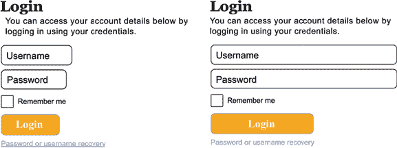

**图 2-11：** 左边是原始小部件，右边是我们对齐了盒子中元素的边缘，使其看起来更干净，少了一些混乱感。

尽管小部件仍然存在问题（毕竟我们才刚刚开始），但你可以看到，这一点小小的变化已经带来了显著的积极效果。所有的内部元素现在都已对齐：标题、内容、输入框、按钮。由于表单中的内边距，输入框的占位符文字稍微偏移了一些，但它的容器元素已对齐到网格。整体感觉稍微更加一致，混乱感减少了一些。

再次简而言之：只需将元素排列整齐。添加引导线，将元素对齐到一个看不见的网格，并注意那些细微的像素差异和不对齐的地方，这些都会让设计显得更混乱。偶尔打破规则，跳出网格也是可以的（*哈*），但对于大多数元素来说，使用网格会让设计看起来更干净、更有条理。

接下来，我们来聊聊颜色！

第 2.2 节

颜色

颜色对设计非常重要，但它也是一个可能让人感到不知所措的话题。我们可以触手可及地使用所有的彩虹色，怎样才能选择合适的颜色呢？这就是为什么色彩理论是设计专业学生一个学期课程的原因。

在我自己的色彩理论课程中，我必须在 20 个色样中创建一个从黑到白的完美渐变。实现这个目标的最佳方法是涂 200 多个色样：先用黑色涂料，加一滴白色涂料，涂一个色样……再加一滴白色涂料，再涂一个色样……然后将这些数百个色样缩减为 20 个完美均匀的从白到黑的步骤。

别担心，我不会让你经历这些的。看看你通过阅读这本书节省了多少时间和精力！

色彩理论课程涉及很多术语，这里我们将跳过——CMYK 与 RGB 色彩、色彩和谐理论与色轮、三色与类色——这些内容可能会让人感到非常复杂。我将提供一个非常广泛的色彩理论概览，旨在让你尽可能快地适应；在本章的最后，我将提供一些资源，供你深入学习我们所涉及的内容。

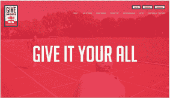

**红色：** 攻击性、重要、激情

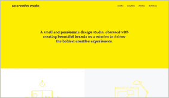

**黄色：** 友好、快乐、专注

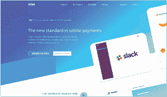

**蓝色：** 值得信赖、舒适、放松

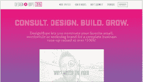

**粉色：** 顽皮、天真、年轻

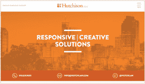

**橙色：** 充满活力、顽皮、实惠

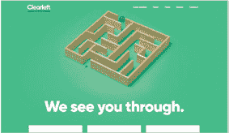

**绿色：** 成长、自然、成功

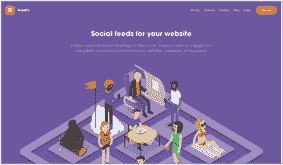

**紫色：** 奢华、浪漫、神秘

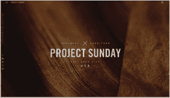

**棕色：** 稳定、乡村、自然

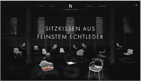

**黑色：** 强大、复杂、前卫

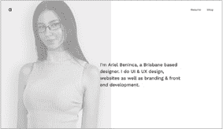

**灰色：** 正式、中立、专业

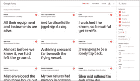

**白色：** 纯洁、无菌、健康

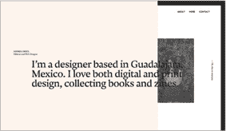

**象牙色：** 安静、冷静、优雅

首先是色彩心理学，这是一种色彩“技巧”，你可以用它来在作品中唤起各种情感。颜色能影响你设计的感受和认知。一般来说，以下是某些颜色唤起的情感：

+   **红色：** 攻击性、重要性、激情

+   **橙色：** 活力、顽皮、实惠

+   **黄色：** 友善、幸福、专注

+   **绿色：** 成长、大自然、成功

+   **蓝色：** 信任、舒适、放松

+   **紫色：** 奢华、浪漫、神秘

+   **粉色：** 顽皮、天真、青春

+   **棕色：** 稳定、乡村、自然

+   **黑色：** 力量、复杂、前卫

+   **白色：** 美德、无菌、健康

+   **灰色：** 正式、中立、专业

+   **象牙色：** 安静、冷静、优雅

当你希望你的设计唤起成功和稳定的感觉时，绿色和蓝色是非常好的选择。一个现代酒店的网站可能会使用黑色和紫色。一般来说，温暖的颜色（红色、黄色）更具活力和激动人心，而冷色调（蓝色、紫色）则更稳定和宁静。

值得注意的是，这些是西方文化的联想——如果你在为其他文化设计，最好研究一下该文化对颜色的特殊联想。例如，在中国，白色是丧服色，而在西方文化中则是黑色。

你也可以尝试色彩的鲜艳度。像“Keep Portland Weird”页面上使用的色调（Oblio 的 Keep Earthquakes Weird 网站）比 Citysets 网站上使用的明亮和鲜艳的色调更加平静和微妙。在色彩心理学中，蓝色让人放松，但明亮的、耀眼的蓝色感觉更具活力**(图 2-12)**。

这些不是硬性规则。你当然可以使用红色来创建一个冷静而优雅的网站——然而，这些色彩心理学的技巧为你提供了一个起点，这样你就不会在一开始就被大量的颜色选项所压倒。

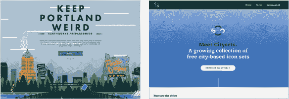

**图 2-12：** 较少鲜艳的色调比明亮、耀眼的色调更加平静和不那么有活力。

### 快捷方式

现在我们已经了解了一些基础知识，让我们来看看一些可以帮助我们节省时间的快捷方式。

#### *限制你的配色方案*

避免随意选择颜色进行设计。为你的网站选择两到四种颜色，并将所有元素限制在你的调色板颜色范围内，这样能让你的网站感觉不那么杂乱**(图 2-13)**。

#### *使用色彩让设计更有“突出感”*

在创建色彩调色板时，避免冲动地选择所有明亮的颜色。使用大部分较灰或更中性的颜色，并搭配一个“突出”颜色，可以更容易突出重要元素，而不会造成设计上的混乱**(图 2-14)**。

#### *注意对比度*

灰色文本在白色背景上看起来很漂亮，但阅读起来是噩梦，尤其是对于可能有视觉障碍的读者**(图 2-15)**。如果没有足够的对比度，彩色文本在彩色背景上也会让你陷入困境。若有疑虑，可以使用像 WebAIM 这样的色彩对比度检查工具（*[hellobks.com/hwd/25](http://hellobks.com/hwd/25)*)来确保文本的可读性。

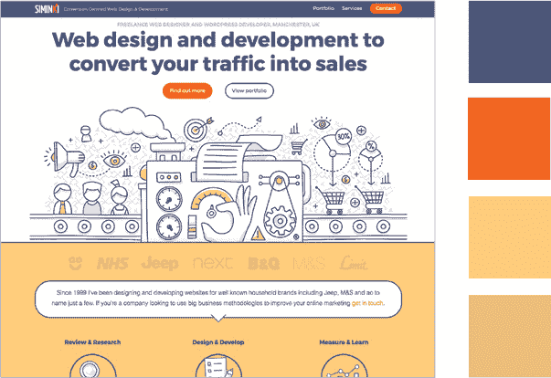

**图 2-13：** Siminki 网站有一个有限的配色方案，使其看起来更加统一。

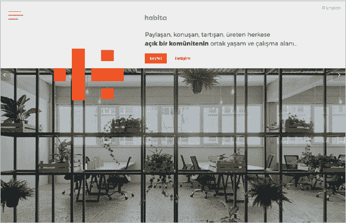

**图 2-14：** Habita 网站有强烈的颜色突出。

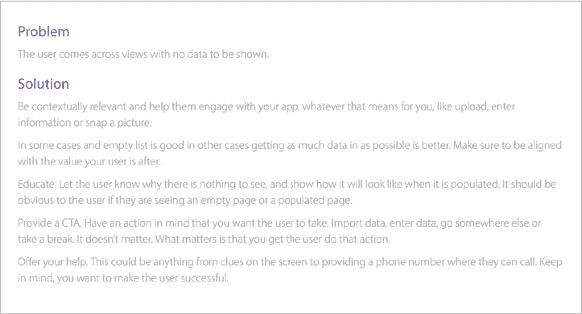

**图 2-15：** 白色背景上的浅灰色文本对比度低，阅读起来可能很困难。

#### *使用色彩调色板网站*

从头开始创建一个色彩调色板可能需要很长时间和大量的思考。幸运的是，很多网站专门帮助你选择设计所用的色彩调色板。

Adobe Color CC（*[hellobks.com/hwd/28](http://hellobks.com/hwd/28)*)根据你选择的基础色和各种色彩方案来构建一个调色板——我推荐使用“互补色”**(图 2-16)**。

Material Design Palette 网站（*[hellobks.com/hwd/29](http://hellobks.com/hwd/29)*)会自动展示色彩在示例设计中的效果，这在你努力想象两种颜色如何搭配时非常有帮助**(图 2-17)**。

新选择是 Colormind（*[hellobks.com/hwd/30](http://hellobks.com/hwd/30)*），它使用深度学习来生成配色方案。你可以在设置一个或多个特定颜色后循环使用配色方案，或者生成配色方案 **（图 2-18）**。

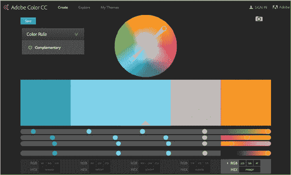

**图 2-16:** Adobe Color CC（*[hellobks.com/hwd/28](http://hellobks.com/hwd/28)*）

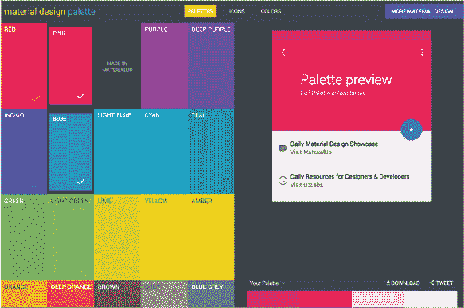

**图 2-17:** 材料设计配色网站（*[hellobks.com/hwd/29](http://hellobks.com/hwd/29)*）

*Adobe 产品截图已获得 Adobe Systems Incorporated 的许可。*

*本页面的部分内容是由 Google 创建和共享，并根据创作共享 3.0 署名许可使用。*

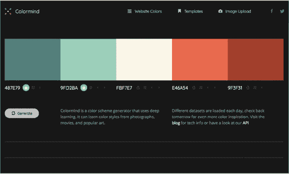

**图 2-18:** Colormind（*[hellobks.com/hwd/30](http://hellobks.com/hwd/30)*）

请记住，如果你希望的话，可以轻微调整预设配色方案中的颜色 —— 它们并非一成不变。我经常发现，为了在设计中获得良好的对比度，我需要将某个色调调亮或调暗。

### 真实生活例子

不要过于固执于特定的配色方案 —— 一旦你将颜色实施到设计中，你可能会发现你最初喜欢的颜色效果并不如你所希望的那样好。我通常会经历至少几个配色方案，直到找到一个感觉最好的。

让我们通过几种不同的配色方案来运行我们的小部件 **（图 2-19）**。

最后一个选项为我们的文本增加了良好的对比度，为我们的按钮提供了一个漂亮的“突显”颜色，并且有一个舒适的绿色背景 —— 看起来非常不错，肯定比完全没有颜色的原始版本要好！

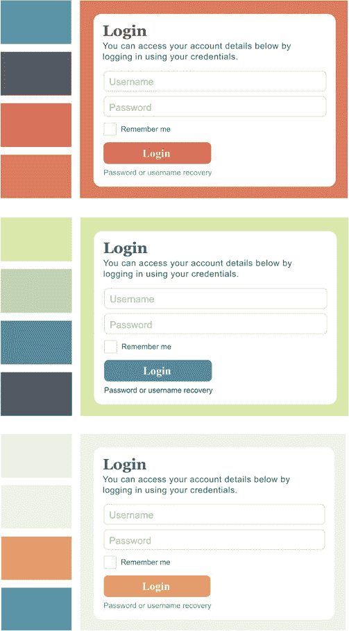

**图 2-19:** 应用不同的想法和选项，直到找到合适的东西。

想要阅读更多吗？这篇来自*Smashing Magazine*的文章，“网页开发人员的色彩指南”，是我对网页色彩理论最喜欢的文章：*[hellobks.com/hwd/31](http://hellobks.com/hwd/31)*。

有了数百万种颜色，要缩小选项以找到适合你网站的漂亮配色方案可能感到很困难。通过使用我们提到的选项生成的配色方案，可以为你的设计提供一个和谐的配色方案，从而为自己减轻难度。

接下来是另一个重要主题 —— 排版和文字！

第 2.3 节

排版

如果你的设计包含任何形式的文字，你就在处理排版。根据维基百科的说法，“排版是安排排版以使书面语言在显示时清晰、可读且吸引人的艺术和技术。” 简单来说，让你的文字既易于阅读又令人愉悦。

字体可以很漂亮，但有时难以阅读（使用时髦的细、苍白灰色字体的网站），但也可以很容易阅读，却不那么令人愉悦（几乎任何使用默认系统字体的网站）。在这两个领域取得成功似乎很复杂，但有很多很好的快捷方式可以让它变得更简单。

我们本可以用整个学期来讲解排版理论、字体历史等内容。相反，我将这些信息浓缩成一个简短的部分。

你可能会想知道*字体*和*字形*之间的区别。严格来说，字形是一个“家族”，或者说是字体的集合。*Arial*是一个字形，*Arial Bold*是一个字体。尽管如此，这两个术语经常被交替使用（除非你是一个排版师），我们在这里也是这么做的。

### 排版基础

让我们从一些关于排版的重要术语和概念开始。

#### *字体分类*

字体的主要区别在于是否包含*衬线*，即字母末端的小装饰部分。本书的正文使用衬线字体（Tisa Pro），而标题使用无衬线字体（字面上是*没有*衬线——这里的标题字体是 Tisa Sans Pro）**(图 2-20)**。

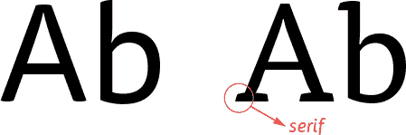

**图 2-20：** 无衬线字体与衬线字体的对比。左侧为 Tisa Sans Pro，右侧为 Tisa Pro。

通常，衬线字体在印刷文本中更易于阅读，而无衬线字体在屏幕上更易于阅读。印刷文本中的衬线帮助眼睛快速读取字母，而在屏幕上，微小的衬线更难呈现，反而影响了可读性（不过，随着新型高清晰度屏幕的出现，这一区别正在消失）。

字体可以进一步细分为几个类别**(图 2-21)**：

+   **厚衬线字体：** 衬线像“厚板”一样——比典型的衬线更加方形和有角度。

+   **等宽字体：** 每个字母占据相同的空间。在其他字形中，像“i”这样的细字母占用的空间比“m”这样的宽字母少。

+   **展示字体：** 花哨、通常带有弯曲的字体，虽然不太适合阅读，但在标题或大字号文本中适度使用时，能够起到强调作用。

+   **手写字体：** 看起来像某人手写的字体。这些字体通常与展示字体一起归类。

**图 2-21：** 厚衬线字体（Chaparral Pro）、等宽字体（Courier New）、展示字体（Buttermilk）、手写字体（HanziPen TC）。

#### *行距与行高*

确保文本行之间的间距不要太小，否则会产生杂乱的感觉。段落中行与行之间的空间在排版学中被称为“行距”（来自于排字工人曾在文本行之间加入铅条的历史）。在 CSS 中，相同的概念被称为“行高”**(图 2-22)**。

目标是找到恰到好处的间距——如果文本行之间的距离太近或太远，段落就会难以阅读。给文本行留出一点间距，可以提高可读性并减少杂乱的感觉，但不要留得太多，以免难以阅读。1.6 是一个不错的起始比率（例如，12px 字体大小配 19.2px 行高，14px 字体大小配 22.4px 行高）。你可以随意调整间距，找到最适合你特定情况的感觉。

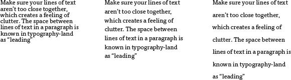

**图 2-22：**文本可能太近或太远，影响可读性。中间的示例最易阅读。

#### *字距和字间距*

字距是调整单个字母之间间距的过程，而字间距是所有字母之间的间距（调整字间距会影响每个字母，而字距只影响一对字母）。和行距一样，我们既不希望间距过多也不希望过少。幸运的是，浏览器显示文本时默认的设置通常是比较理想的，但 CSS 允许你使用 letterspacing 属性调整字母之间的间距。图形程序也允许你调整字距。大标题有时通过去掉一些间距看起来会更好，而小字可能会受益于增加一些间距**(图 2-23)**。

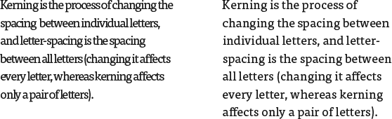

**图 2-23：**字母间距太近会使单词和句子更难阅读。

### 排版原则

现在，让我们来讨论一些在进行排版时需要记住的重要原则。

#### *限制设计使用两种字体*

使用大量字体可能会导致混乱和杂乱。通过选择一种字体用于标题，另一种用于内容来简化设计；这样会使你的设计看起来更简洁。你可以使用粗体、斜体、大写字母以及其他样式化处理来在文本中创造更多样式**(图 2-24)**。

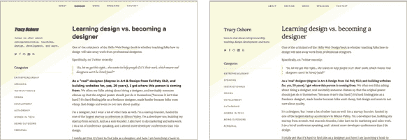

**图 2-24：**大量字体会让设计显得混乱（左）。较少的字体更容易管理，看起来也更专业。

#### *避免对齐或居中文本*

对齐文本是完全填充在一列中的文本；两侧边距都要对齐，而不仅仅是一个边距。基于第 2.1 节，我们讨论了对齐内容，你可能会想使用对齐文本来在文本右侧创建一个均匀的线条**(图 2-25)**。

然而，对齐文本会引发一些严重问题：

+   为了适应列宽而拉伸单词，可能会在单词之间添加不美观的大空格。

+   词语之间的大空格可能会在多行文本中形成不美观的“白色河流”**(图 2-26)**。

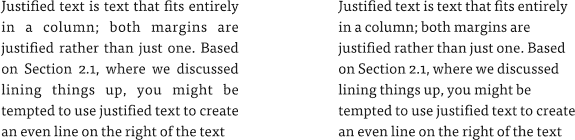

**图 2-25：**“右对齐”文本（右），比对齐文本（左）更容易阅读。

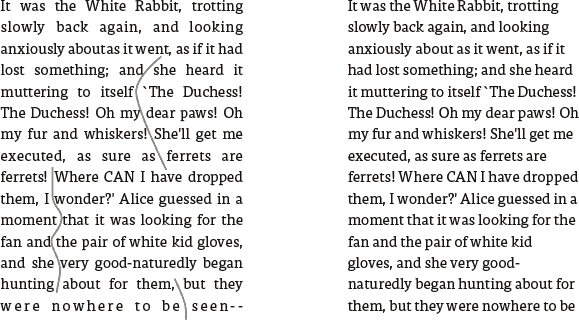

**图 2-26：** 未经过连字符处理的对齐文本（左侧）有不美观的空隙和白色空间流（标记为红色）。

除非你有大量的时间进行调整，否则使用对齐文本并不值得。使用左对齐文本（也称为右边不对齐文本）可以确保文本的易读性。

#### *居中文本可能会比较难以处理*

居中对齐的文本适合用作标题，但如果不确定时，最好将文本左对齐，并依据底层网格进行排版，以便让文本整齐排列，便于阅读。居中对齐的段落*尤其*难以阅读，因为每一行的起始位置都会发生变化 **(图 2-27)**。

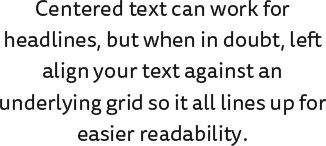

**图 2-27：** 居中内容的不平整左边缘使其更加难以阅读。

#### *行长度*

如果每句话的字符数超过 75 或者少于 45，那么段落将变得难以阅读。确保段落的宽度（或字体大小）合适，以便每行的长度恰到好处，确保最大的可读性 **(图 2-28)**。

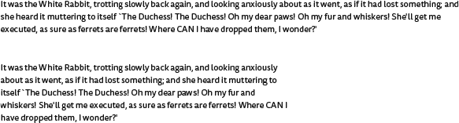

**图 2-28：** 段落中过长的行让阅读变得困难。

### 快捷键

现在你已经掌握了这些新知识，让我们来了解一些快捷键，这些快捷键将让你的排版设计变得更加高效。

#### *免费字体资源*

最美丽的字体通常需要支付高昂费用——对于专业设计师来说是值得的，但对于像我们这样的业余设计师来说，可能就不那么划算了。

幸运的是，像 Google Fonts (*[hellobks.com/hwd/32](http://hellobks.com/hwd/32)*) **(图 2-29)** 和 Adobe Fonts (*[hellobks.com/hwd/33](http://hellobks.com/hwd/33)*) **(图 2-30)** 这样的站点为我们提供了美丽的字体选项，可以用于在线和印刷设计。Google Fonts 允许你下载字体，而 Adobe 的 Creative Cloud 功能则使得 Adobe Fonts 的网络字体可以在设计和幻灯片程序中使用。

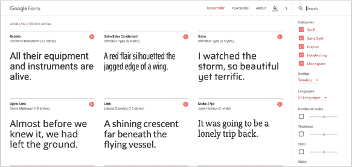

**图 2-29：** Google 字体 (*[hellobks.com/hwd/32](http://hellobks.com/hwd/32)*)

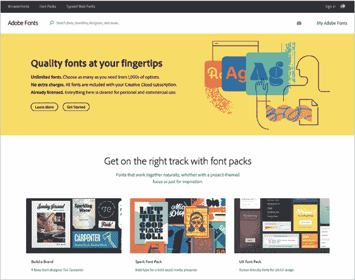

**图 2-30：** Adobe 字体 (*[hellobks.com/hwd/33](http://hellobks.com/hwd/33)*)

*Adobe 产品截图经 Adobe 系统公司许可转载。*

*本页面的部分内容摘自 Google 创作并共享的作品，并根据创意共享 3.0 署名许可协议使用。*

还有其他免费的字体网站，但这两个网站一直以来都拥有最大且易于使用的字体库，且看起来非常好。

#### *精选字体网站*

Google 字体和 Adobe 字体中存在成千上万种字体和字形——你如何为你的设计选择最佳的字体？

与其浏览成百上千的选项，一遍遍读着相同的默认句子（保证让任何人的眼睛都要瞪直了），不如查看那些设计师精心挑选的免费字体网站，以缩小你的选择范围。这些网站让你更容易选择适合设计的字体，并帮助你挑选出美观且专业设计的字体 **(图 2-31)**。

| 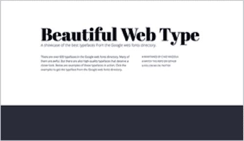*Beautiful Web Type ([hellobks.com/hwd/34](http://hellobks.com/hwd/34))* |  | 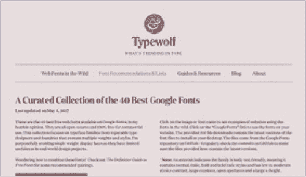*Typewolf ([hellobks.com/hwd/35](http://hellobks.com/hwd/35))* |
| --- | --- | --- |
|  |  |  |
| 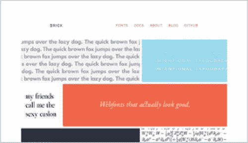*Brick.im ([hellobks.com/hwd/36](http://hellobks.com/hwd/36))* |  | 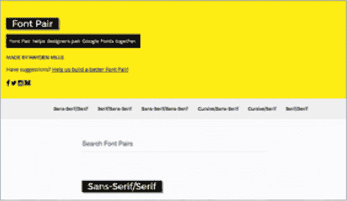*Font Pair ([hellobks.com/hwd/37](http://hellobks.com/hwd/37))* |

**图 2-31：** 推荐免费字体并挑选最佳选项的各类网站。

### 真实案例

让我们选一个组件，并仅限于使用两种字体：一种衬线字体和一种无衬线字体 **(图 2-32)**。

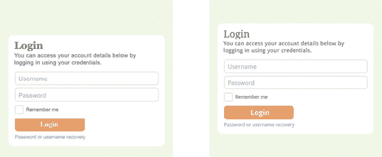

**图 2-32：** 新的、统一的字体使我们的组件看起来更专业。

新的字体（Tisa Pro 和 Tisa Sans Pro）比组件之前使用的四种独立字体更专业且更和谐。

像颜色一样，排版是一个巨大且迷人的主题。希望这一简短的章节能为你提供一个良好的概览，帮助你入门，并为进一步学习提供一个良好的平台。

通过将你的字体选择缩小到那些已经被他人验证过的字体，并减少设计中的字体数量，你就能迈向具有美丽排版的设计。

接下来，我们将讨论白色空间以及如何为设计提供呼吸空间。

第 2.4 节

白色空间

如果你只使用一种工具来改善你的设计，我保证白色空间会带来最大的变化。白色空间是 *终极* 杂乱减少器。

也称为负空间，白色空间是空白区域（不一定是白色）。本质上，白色空间是页面上留白的区域，以及元素之间的空间 **(图 2-33、2-34 和 2-35)**。

在设计时，你可能会有填充设计内容的冲动，比如信息、链接和其他有用的元素。毕竟，空白区域可能会让人觉得是浪费的空间，是你可以添加更多内容的地方，以说服读者停留更久、使用你的网站或购买你的产品。为什么不填满这个空间呢？

然而，一个杂乱无章、拥挤的网站——即使它包含了更多信息——也比一个在简洁和呼吸空间方面有所取舍的网站表现得更差。白色空间对于改善设计的感知和功能至关重要。

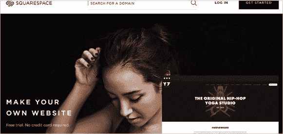

**图 2-33：** 让我们来检查一下 Squarespace 网站上的白色空间。

**图 2-34：** 红色高亮部分显示的白色空间是页面上没有内容的区域。背景图像和纹理通常被视为白色空间。

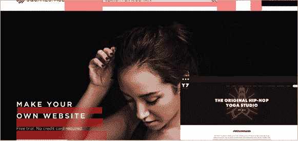

**图 2-35：** 白色空间也指元素和文本行之间的空间。

### 白色空间基础

下面是一些白色空间重要性的额外原因。

#### *白色空间提升理解力*

设计拥挤的网站往往让用户难以跟随，并且过多信息让人感到压力。简洁的网站设计能让用户更轻松地消化你展示的内容，而不会被多余、不必要的细节所困扰 **(图 2-36)**。

**图 2-36：** Foursquare 网站有丰富的白色空间，清楚地引导用户知道该阅读什么和接下来做什么。简洁性使设计更易理解。

#### *白色空间提升可读性*

我们将重复一些在上一节中讲过的信息，以确保这些内容能记住。

还记得我们在排版部分讲过行间距（行与行之间的空间）吗？以行间距形式呈现的白色空间可以提升可读性。行间距过小会把句子挤在一起，而行间距过大会使可读性下降——这正是一个需要寻找到“恰到好处”的情况。增加文本和元素之间的空间，有助于用户理解你要表达的内容 **(图 2-37)**。

**图 2-37：** 行与行之间空间太小的段落难以阅读。

同样，字母之间的空间（字距）也很重要。确保字母之间不要过于紧密，保留足够的空间，可以让文本更易读 **(图 2-38)**。

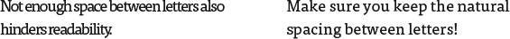

**图 2-38：** 字母之间距离过近也很难阅读。增加一些间距可以提升可读性。

#### *白色空间提升行动号召效果*

更多的元素拥挤在同一空间中，会让用户难以辨识你的行动号召（也称为 CTA）。无论你希望读者关注哪个元素，它如果拥有更多的白色空间，便更容易被看到和使用——这样既能吸引用户注意行动号召，又能减少来自其他元素的干扰 **(图 2-39)**。

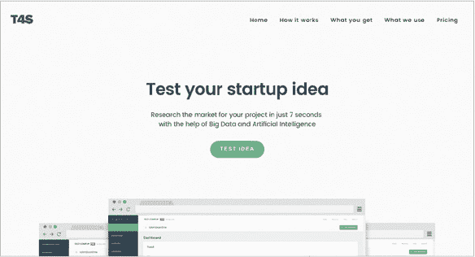

**图 2-39：** T4S 网站中的介绍文本和按钮通过大量的白色空间突出显示。

#### *白色空间帮助设定氛围*

开放的空白空间与奢华和高质量相关，而设计中元素拥挤、空间较少则常常与节俭和混乱的氛围相关——就像繁忙的跳蚤市场和奢华品牌的店面之间的对比。

如果你想让你的设计给人一种奢华、专业、优雅或卓越的印象，可以通过宽泛地使用空白空间来增强这种印象 **(图 2-40 和 2-41)**。

**图 2-40：** 缺乏空白空间的凌乱网站给人一种廉价的感觉。

**图 2-41：** 专注于帆船的 Helm 网站拥有大量的开放空间，给人一种奢华的感觉。

### 简短理论

作为新设计师，你的本能会让你倾向于减少空间，而不是增加空间。让我们看看你可以在哪里在设计中添加空白空间。

#### *行与行之间的空白空间*

空白空间从内容层面开始。你的文本需要空间呼吸。确保给文本行足够的空间，以提高可读性 **(图 2-42)**。

**图 2-42：** 行与行之间的空白空间。

#### *元素之间的空格*

现在我们已经弄清楚了文本的排版，让我们将重点放在元素之间的间距上。这指的是内容和段落与其他段落之间，或者段落和其标题之间的空间——任何靠近另一个元素的元素 **(图 2-43)**。

元素之间的间距有助于将元素分开，使眼睛能够更有效地识别各个独立的组。在**图 2-43**中，新闻通讯注册（位于文章标题的右侧）和标题之间的空间确保了这两个元素保持独立。

**图 2-43：** 元素之间的空白空间。

#### *元素组之间的空白空间*

从宏观角度来看，我们还需要确保*元素组*之间有足够的空间。这意味着在元素列与其他列之间，行与其他行之间，以及整个页面的元素与其容器（如浏览器窗口）之间要有足够的空间 **(图 2-44)**。

**图 2-44：** 元素组之间的空白空间。

### 快捷方式

这里有几个简单的技巧，可以帮助你在设计中更有效地使用空白空间。

#### *元素之间的双倍空格*

使用比你认为需要的更多的空白空间！是的，确实会有“过多”的情况，但在刚开始时，使用比你认为合适的更多空白空间是一个不错的经验法则。尝试将初始直觉认为合适的空间翻倍。走得比你舒服的程度更远，休息一下，然后重新评估。一开始觉得过于宽敞的地方，可能现在会感觉自然且平衡。

#### *确保段落之间有足够的行距*

为了强调，我们再次重复我们的排版部分！记住要保持足够的行距（段落中行与行之间的垂直空白），这样你的段落才容易阅读。

### 现实生活中的例子

移除我个人网站上的白色空间展示了白色空间如何极大地改变设计效果。没有白色空间，网站看起来杂乱且不专业。加入白色空间，尤其是非常宽敞的中间部分，使得设计看起来更专业且经过深思熟虑**(图 2-45)**。

让我们在小部件中加入更多白色空间：在每一行文本之间，以及小部件中各个元素之间**(图 2-46)**。

这样看起来是不是整洁多了？我还调整了元素之间的间距（容器内各个元素之间的空间相同，标题和内容之间、内容和表单之间的空间也相同）。这种均匀的间距同样减少了杂乱和混乱感。

**图 2-45：** 在我的个人网站中加入白色空间前后的对比。轻盈的设计让页面看起来不那么杂乱。

**图 2-46：** 在文本行之间、元素之间以及元素周围增加白色空间有助于我们的部件看起来更加专业。

字体、颜色和元素对齐都能起到很大作用，但增加呼吸空间是你整理设计的最强工具，有助于构建更具美感的设计。

接下来，我们将从整体上探讨布局——从这些微观问题出发，开始从宏观角度看待我们的设计！

2.5 节

布局与层次结构

过去的几个部分讲解了具体概念：颜色、字体和白色空间。现在我们将考虑更抽象的概念：布局和层次结构。

*布局* 指的是信息的排列与优先级排序；你在布局上做出的选择会影响信息传递的效果和理解程度。我们之前已经讨论了网格：通过对齐元素，减少那些可能让设计显得杂乱的像素差异。元素的位置和层次结构是布局的其他重要方面。

元素可以放在任何地方——你如何确定它们的合适位置？

作为英语读者，我们是从左到右阅读的，这意味着我们的视线自然从页面的左上角开始。研究表明，网站用户浏览网站的方式呈现出“F”形模式**(图 2-47 和 2-48)**。

利用这一发现，构建从页面左上角开始，接着向右和向下延伸的布局。这也是为什么大多数网站将其 logo 放在左上角，而不是底部。

**图 2-47：** Google Ventures 网站是“F”形布局的一个良好示例。

**图 2-48：** 眼动追踪热图显示了读者如何以“F”形模式浏览网站。

进入层次感！在设计时，一些元素比其他元素更重要。你的任务是建立一个视觉层次感，让读者和用户能够看出哪些项目更重要。本质上，视觉层次感引导你的受众，并帮助他们决定首先关注什么**（图 2-49）**。

*本页面的部分内容摘自由 Google 创建并分享的作品，依据创作共用 3.0 署名许可协议使用。*

**图 2-49：** 左侧块没有层次感。右侧通过增加一个元素的大小，使其首先引起注意。

没有层次感的页面看起来平淡无奇且无聊。有几种方法可以用来标示重要性并增加可见性：

+   **大小：** 更大的项目更重要，也更吸引眼球。

+   **颜色：** 饱和度更高的颜色比低对比度的颜色更显眼。暖色（红色、橙色、黄色）比冷色（蓝色、紫色、绿色）更显眼。

+   **定位：** 放置在左上角的项目更重要。

+   **对比度：** 对比度更大的项目比低对比度的项目更吸引眼球。

+   **空白空间：** 四周有更多空白空间的项目看起来更重要。

+   **排版：** 字体选择可以是另一个层次感的指示符。为标题使用一种字体，为内容使用另一种字体，可以形成视觉层次感。

排版在网页工作中尤为重要。以下段落没有视觉层次感，赋予每个项目相同的重要性：

我们要开派对啦！你被邀请参加 Zuni Cafe 的年度庆典。庆祝活动将在纽约的 Zuni Cafe 举行，时间为下午 6 点。要求正式着装；请回复出席。

我们可以通过增加一些空白空间来增强层次感：

我们要开派对啦！

你被邀请参加 Zuni Cafe 的年度庆典。庆祝活动将在纽约的 Zuni Cafe 举行，时间为下午 6 点。

要求正式着装；请回复出席。

一旦我们开始玩转排版和颜色，层次感变得更加明显：

**我们要开派对啦！**

你被邀请参加 Zuni Cafe 的年度庆典。庆祝活动将在纽约的 Zuni Cafe 举行，时间为下午 6 点。

要求正式着装；请回复出席。

这三种设计都可以阅读，但最后一种设计在视觉上最有趣，并且立刻清晰地显示了信息的层次感。

如何判断你是否正确地为设计添加了层次感？试试眯眼测试。眯起眼睛，直到设计变得模糊。

当内容消失，只剩下布局和元素的抽象呈现时，就更容易看到哪个元素最先引起注意。在 *纽约时报* 网站**（图 2-50）**，logo 和图片最先吸引眼球（尤其是广告上的橙色按钮，可能并不理想，因为它分散了对网站本身的注意）。在内容部分，居中的图片和最左侧、带有最大标题文字的文章也很突出。

**图 2-50：** *纽约时报*首页的模糊版本。当你无法阅读文本时，内容的层次结构变得更加清晰。

在进行设计时，列出所有元素并按重要性进行排序。然后查看你的设计，根据元素在设计中的展示情况对它们进行排序。这两个列表一致吗？

当我们未能建立视觉层次结构时，读者或用户就不知道从哪里开始或结束他们的浏览；这种困惑可能会降低用户参与度和转化率。设计效果将会变差。

如果某个元素需要看起来更重要，并在视觉层次中排得更高，可以根据上面提到的设计理念进行调整——改变颜色或位置，添加间距，改进排版——直到该元素在视觉上更加突出。

如果你希望打破设计中的“F”型模式，可以通过使用我们上面列出的视觉工具来建立正确的层次结构。例如，通过放大或使用更丰富的颜色将页面右上角的元素引起注意。“F”型模式是由于元素的典型位置而自然形成的层次结构，这是一个很好的起点，层次结构是我们工具箱中的一部分，可以打破这个模式，同时仍然实现自然的网页体验。

### 实际示例

让我们分析一下我们的组件，看看我们是如何建立视觉层次结构的**（图 2-51）**。

**图 2-51：** 我们的下载按钮使用更亮的颜色来提升其视觉层次结构。我们可不想无意中隐藏这个重要按钮！

我们首先看到的两个重要元素是标题和登录按钮。标题颜色与内容不同，并且字体较大。登录按钮的颜色比小部件其他部分更加鲜明、温暖。你可能会首先看到标题或按钮，然后浏览剩余的小部件——因此，在我们更新颜色和字体的早期部分时，已经建立了正确的层次结构。我们做得好！

我们在之前的章节中讨论了许多原则——颜色、排版和空白空间——布局是这些概念开始真正协同工作的地方。现在，我们将从单纯的视觉设计转向更多关注用户体验。

在接下来的章节中，我们将讨论内容原则以及如何通过内容和层次结构来提升设计效果！

第 2.6 节

内容

初看之下，关于内容的讨论似乎在一本关于设计的书中不太合适，但对文字和内容做出明智的选择在减少杂乱方面起着至关重要的作用。

本节涵盖内容原则和策略，帮助你创建用户愿意阅读和享受的内容，同时提高设计的有效性。

内容密集的段落容易让人产生杂乱感，尤其是在屏幕上查看内容时（而不是纸质版）。研究表明，在线读者比起完整阅读，更多倾向于浏览内容。大段的文字更可能被跳过，而不是被完全阅读**（图 2-52）**。

人们很少逐字阅读网页内容；他们通常是扫描页面，挑选出个别的词语和句子。

*《用户如何在网页上阅读》，Nielsen Norman Group（* [hellobks.com/hwd/45](http://hellobks.com/hwd/45)）*

首先，关于内容，通常少即是多。

**图 2-52：** 用户只有在兴趣被激发的情况下才会完整阅读网页内容，否则他们会快速浏览内容，寻找能引起他们注意的部分。

在编写网页内容时，人们容易陷入囊括每个可能细节并使用复杂、专业词汇的诱惑。但更好的做法是少写一些，使用更简单、更清晰的词语，帮助读者通过最少的文字理解你要表达的意思。大段的文字是杂乱的标志——一个很好的经验法则是每段不超过两到三句话。

面对一大段信息时，尽量将其简化并缩短。让我们来看一个来自 *《简单且可用的网页、移动和交互设计》*（Giles Colborne 著）中的好例子（*《[hellobks.com/hwd/46](http://hellobks.com/hwd/46)*》）。

请注意，尽管 Chrome 浏览器在 Mac 和 Windows 操作系统上都得到了支持，但为了获得最佳效果，建议所有该网站的用户切换到最新版的 Firefox 浏览器。

虽然上面的内容从技术上讲是正确的并且涵盖了所有要点，但它有些冗长。我们可以简化：

为了获得最佳效果，使用最新版的 Firefox 浏览器。Mac 和 Windows 上也支持 Chrome。

仍然是正确的，它涵盖了我们想要讲的所有内容，但更加简洁，且一目了然。

在内容创作时很难限制自己。我理解——你有很多重要的信息要表达！但请记住：无论你写多少，读者最终也只会读 80、100，甚至最多 200 个字，如果你*非常*幸运的话。

提供的内容超过了读者愿意阅读的量，他们可能会选择浏览或完全放弃。

如果你写了冗长的段落，把最重要的信息深藏其中，那么你就冒着一个大风险：读者可能浪费他们的 80 个字去阅读不太重要的信息。

你展示的内容越多，你对读者实际阅读内容的控制就越少。

如果你不能通过使用更少的词语来缩短内容，也可以尝试将段落拆成要点列表。以这个段落为例：

我们做了一些改动：注册章节已分为两部分，分别是添加注册和将用户与对象关联。之前这一章节内容庞大，因此将其分开更容易管理。管理员界面的截图已更新，以反映新的 Django 1.9 风格。已经修复了一些小的拼写错误。更新了我们使用的 django-registration-redux 版本至 1.3。最后但同样重要的是，介绍部分已更新。

这一段更适合用项目符号展示：

我们做了一些改动：

+   注册章节已分为两部分，分别是添加注册和将用户与对象关联。之前这一章节内容庞大，因此将其分开更容易管理。

+   管理员界面的截图已更新，以反映新的 Django 1.9 风格。

+   已经修复了一些小的拼写错误。更新了我们使用的 django-registration-redux 版本至 1.3。

+   介绍部分已更新。

项目符号和其他视觉辅助工具有助于读者从一块内容中挑选出信息，使得内容更有可能被阅读。

我还鼓励有策略地使用加粗，特别是在技术文档中，它有助于突出句子的最重要部分，进一步使内容更容易被浏览。

例如：

**我们做了一些改动：**

+   **注册章节已分为两部分**，分别是添加注册和将用户与对象关联。之前这一章节内容庞大，因此将其分开更容易管理。

+   **管理员界面的截图已更新**，以反映新的 Django 1.9 风格。

+   **已经修复了一些小的拼写错误。** 更新了我们使用的 django-registration-redux 版本至 1.3。

+   **介绍部分已更新。**

重要的部分已被加粗，这样读者可以快速浏览内容，找到对他们最感兴趣的部分，并在需要时继续阅读。

请注意，我们还更改了标题的格式！我们来看看标题的一般规则。

组织内容的最佳方法之一是使用标题。这些部分以较大且显眼的风格呈现，以引入后续内容，使得文本更容易浏览和阅读。

标题可能会显得冗长——你也希望这些部分简洁明了，以帮助理解并保持读者的兴趣。为了更好的用户体验，简化并明确你的标题，同时确保它们有吸引力，并说明对读者的好处。

例如，看看我的网站上关于我其他书籍的两种版本，《*Hello Web App*》系列。在 **图 2-53** 中，标题冗长且无趣。而在 **图 2-54** 中，标题已经被重写，简洁明了，讲述了这本书为网站访问者所做的事情，从而增加了访问者进一步浏览我网站的可能性。

**图 2-53：** *Hello Web App* 网站上的标题非常冗长。从技术上讲是正确的，但并不吸引人。

**图 2-54：** 这个标题依然正确，但它更简短、更激动人心，最重要的是，它更好地突出了读者的好处。

如果你写的是介绍产品或吸引注意的标题，确保你以展示产品好处的方式来写，而不仅仅是描述产品的功能。

这样的变化可以极大地影响你的利润。在 webprofits 的一项研究中（*[hellobks.com/hwd/47](http://hellobks.com/hwd/47)*） **(图 2-55)**，将标题改为讲述好处而非细节，使转化率（购买产品的人数）提高了 52.8%。

**图 2-55：** 在这个示例中，将标题改为讲述好处而非细节，导致了 52.8% 的转化率提升，来源于 webprofits（*[hellobks.com/hwd/47](http://hellobks.com/hwd/47)*）。

### 真实案例

回到我们的那个小部件！在了解了这些内容原则之后，我们可以大幅更新内容 **(图 2-56)**。

**图 2-56：** 我们已经更新了小部件中的内容，使其更简短、更清晰、更激动人心，且更容易理解。

我们已经缩短了内容，并让一切看起来更激动人心、更具人情味。表单本身已经更新为更友好、更具人性化的句子，按钮也从简单的“登录”更新为更具行动感的“登录你的账户”。总体来说，这些更新应该能让小部件更容易阅读、理解和一眼看懂。

内容可能最初看起来不像设计的一部分，但它确实非常重要。内容、写作和文字定义了你的设计（特别是针对网页的设计）如何被用户消费，因此确保你将一些设计时间用于改善内容和写作。

总之，尽量精简并澄清你的内容。将段落保持在两到三句话之内。

确保你的内容工作也扩展到你的标题中。如果你的标题介绍的是页面或产品，确保标题讲述的是页面或产品如何影响读者，而不是它的功能。

接下来，我们来讨论一下用户体验！

第 2.7 节

用户体验

这一部分将所有内容结合起来。你所有让设计既愉悦又易于观看的工作，你所有让内容简洁易懂的努力，以及让布局易于理解的设计——这些概念都与*用户体验*息息相关。

用户体验（UX）是用户在使用你的网站时的整体体验——这是设计中最重要的一部分。

让我们来拆解一下用户体验的各个部分。

### 设计前

在你开始设计工作之前，你应该能够回答几个主要问题：谁是你的理想用户？他们的个人目标是什么？你的商业目标是什么？用户体验研究可以帮助回答这些问题。

例如，访问你个人网站的人可能在寻找更多关于你的工作和你做什么的信息（他们的个人目标）；你的商业目标可能是让他们注册你的个人新闻通讯。

或者，对于一款新 iPhone 应用的网页，你的用户会寻找有关应用的信息以及如何下载它；而你的商业目标则是尽可能多地获得下载量。

我们关注的是两件事：顾客是否达成了他们想要达成的目标，以及你是否达成了你的商业目标。希望你的设计能够实现这两者。

对于一个小型个人项目，你可能不需要做用户体验研究，但在大型重要项目的预设计阶段，你可以做一些工作来帮助了解你的用户及其目标。

#### *竞争分析*

简而言之，观察竞争对手并分析他们做得好的地方和做得不好的地方。

第三章，第 3.1 节：寻找灵感讲述了如何查看网站并从中提取可以在自己设计中实现的创意和内容。观察竞争对手是创建网站用户体验的重要部分——它为你提供了对比的标准，并帮助你创造出优于竞争对手的用户体验，从而吸引他们的顾客。

#### *调查和访谈*

如果你不问顾客，他们怎么知道自己想要什么和需要什么呢？许多网页设计师会掉进为自己不了解的用户设计的陷阱——例如，如果你自己没策划过婚礼，却设计了一款婚礼策划应用。你可能会有一些关于婚礼策划者需要什么的想法，但除非你真正与正在策划婚礼的人交谈，否则可能会做出一些错误的假设。

你需要对理想用户从设计中想要和需要什么有清晰的了解。有了这些知识，你就能设计出更好的产品，帮助顾客实现他们的目标，从而也帮助你实现更多自己的目标。

### 在设计过程中

你不希望花时间将设计实现为代码后，才发现用户对网站上的某个具体过程或流程感到困惑（例如，某人购买商品的步骤）。为了避免这些错误，你可以通过使用线框图、原型和可用性测试来进行设计的“测试运行”。

#### *线框图、原型和可用性测试*

线框图和原型是你设计的快速低保真模型。可用性测试让你在正式开始全面设计之前，先获得有关布局和交互的反馈。我们将在第三章、第 3.3 节中更详细地讨论这些概念：原型。

线框图和原型可以让你快速制作粗略的设计模型，并拿去给别人反馈，了解你的布局和流程是否合理。研究表明，使用低保真纸质原型可以像使用高保真屏幕原型一样容易发现并解决重大可用性问题。通过早期测试布局和流程，可以为自己节省宝贵的时间。

### 发布设计后

一旦发布了设计，你需要追踪自己是否真的达成了目标。你的转化率如何？你的跳出率够低吗——即访问者加载网页后立即离开的百分比？你是否获得了良好的客户反馈？为了帮助回答这些问题，你可以进行多种测试来衡量这些数据。

#### *更多可用性测试*

用户体验的一个关键部分是确保使用合适的分析工具（例如 Google Analytics: *[hellobks.com/hwd/48](http://hellobks.com/hwd/48)*) 收集有关网站上线后表现的数据。

A/B 测试是对比当前网站与设计更改的过程——比如测试两个不同版本的标题，看看哪个版本更能达到目标，例如增加访问者的购买次数。这些测试可以在网站上线后进行，以持续改进设计的效果。

可用性测试是将你的设计展示给他人，获取反馈并确保网站对除了你以外的其他用户也能正常使用的过程，我们将在第三章、第 3.4 节中讨论这一点：获取反馈。

### 快捷方式

现在是我最喜欢的部分：在考虑用户体验时需要记住的最重要的事情。

#### *让用户想要的操作易于找到和使用*

无论你希望用户做什么，确保完成这些操作的步骤易于找到且简单易用。

让提交按钮设计得普通且难以看到是没有意义的——一个明亮的按钮更突出，能让表单提交变得更容易 **(FIGURE 2-57)**。

**FIGURE 2-57:** 表单的提交按钮很重要（就像我们在上一节中讨论的那样！）左侧的按钮可能有点难以找到，右侧的按钮更容易被发现并使用。

新闻通讯的注册链接不应隐藏在内容中（记得我们说过的关于浏览者的事）。将它们单独列出，方便更容易看到 **(FIGURE 2-58)**。

**图 2-58：** 如果你希望有人注册你的新闻通讯，不要将链接隐藏在你的内容中。应将其推向前面，并确保它显而易见。

#### *注意网站大小*

下载速度慢会促使人们在未查看网站前就离开。请注意图像大小；随着家中大屏幕和快速下载成为常态，很多人忘记了很多人仍然在信号差的手机上或有着过载 Wi-Fi 的咖啡店浏览网页。此外，还要考虑 JavaScript；下载大量脚本会减慢网站速度，性能不佳的脚本也会影响网站的流畅度。

在多个浏览器中检查你的网站，使用不同的屏幕大小和下载速度，确保它加载快速。

#### *进行可用性测试*

我们将在第三章、第 3.4 节：获取反馈中更深入地讨论可用性测试。本质上，就是向他人展示你的设计并获取他们的反馈，尽管这可能会让人感到很难。作为设计师，我们天生容易忽视设计中的问题，因此，找到更多人来查看设计以发现这些问题至关重要。

#### *包括分析工具*

确保在你的设计中包含分析追踪软件，这样你就能在发布后看到设计的表现。至少，可以考虑使用 Google Analytics（*[hellobks.com/hwd/48](http://hellobks.com/hwd/48)）或类似 Segment 的客户数据平台（*[hellobks.com/hwd/49](http://hellobks.com/hwd/49)），它们可以与 Google Analytics 及其他分析平台进行结合。

### 真实案例

回到我们的部件**(图 2-59)**，我们可以看到我们的登录按钮是一个明亮且易于识别的颜色。用户不会困惑该如何提交！

用户体验是书本中难以展示的一项内容。记住，你应该尽力了解你的受众，关注你的页面以及一个人如何在页面之间移动（并确保这一过程简便），从外部来源获取设计的反馈，并关注设计发布后它的表现。

恭喜你完成了这一部分！

**图 2-59：** 用户体验与层次结构密切相关。我们的表单更加易用，因为提交按钮是明亮且对比强烈的颜色。

第 2.8 节

图像与图像表现

到目前为止，我们仅使用了线条、框和文本进行设计，但图片（以及图标、图形等图像）可以发挥重要作用。在这一节中，我们将讨论你可以在哪里找到适合你项目使用的图片以及如何有效使用它们。

首先，让我们来讨论版权和许可。虽然右键点击并“另存为”几乎任何你在网上找到的图片非常容易，但你不能使用任何找到的东西。图片是有版权保护的，未经允许使用他人创作的图片是非法的。

你应该留意的术语概览：

+   **版权管理图像：** 应包括额外的条款，指明图像可用的用途。

+   **免版税图像：** 通常，你可以在*遵循*图像条款的前提下使用图像。例如，很多免版税图像只能用于非盈利性用途，这意味着你不能将其用于任何可能赚取金钱的应用场景。

+   **创意共享：** 为内容创作者提供的一个系统，允许他们的作品在不要求明确许可的情况下被使用。创意共享图像可以通过多种方式授权，包括要求注明出处、禁止修改（你不能自己更改图像）、禁止商业用途，或者允许任何用途。

如果图像没有特别说明你可以使用它，那么*你不能用于你的项目*。绝大多数国家已经采纳了《伯尔尼公约》，该公约规定，版权默认授予作者——即使没有明确说明。你实际上无需在你的网站上放置小小的版权声明！

### 基础知识

在向设计中添加图像时，了解一些基本要点非常重要。

#### *不要觉得你必须使用照片或图标*

不必担心你*必须*在设计中使用人物照片。文字和产品截图也可以大有作为**(图 2-60)**。

通过调整排版——使用不同的字体和样式——你可以创建一个美观且简洁的网站，而不必过多依赖图像。

如果你正在为网络开发产品，那么该产品的网站不需要比截图更多的内容**(图 2-61)**。

你可以随时添加图像和视觉元素——从一个干净、以文字为主的网站开始，可能帮助你更快上线，而无需过多纠结这些细节。

**图 2-60：** John Gruber 的 Daring Fireball 网站是一个美丽、成功的设计，使用了全文本（除了标志中的图标）。

**图 2-61：** T4S 网站简洁明了，展示了他们产品的截图。

#### *面孔是强大的*

开心的面孔引发开心的情感；愤怒的面孔引发愤怒的情感。你可以在设计中使用面孔来强调你想传达的情感，并引导视线集中在页面最重要的部分**(图 2-62)**。这是你设计工具箱中强大的工具。

**图 2-62：** Dan Mall 的个人网站。Dan 的照片吸引了眼球，他的目光引导我们看到介绍文本。

#### *注意文件大小*

图像很容易迅速增加网站的大小，从而导致下载时间变慢，并让用户感到沮丧，最终离开。此外，越来越多的屏幕变得更加高清，分辨率更高，像素更小，从而显示出更清晰的画面——这使得老分辨率的照片和图像显得模糊。

一些需要记住的原则：

+   **确保你的图片是最大必要尺寸。** 把一张 2000px 的图片放进 1200px 的框里毫无意义。

+   **提供视网膜和非视网膜图片。** 设置你的 HTML 和 CSS，让使用视网膜屏幕的用户能够下载更详细、分辨率更高的图片，而使用传统屏幕的用户则能获得更小的图片，避免浪费像素。这是一个很棒的指南：[hellobks.com/hwd/54](http://hellobks.com/hwd/54)。

#### *小心那些看起来像库存照片的照片*

在 Google 上搜索“库存照片”会找到许多宣称提供大量你可以使用的好选项（付费和免费的）的网站，但也有大量低质量的图片。看看一些大型网站，如 iStock **(图 2-63)**，但尽量找到看起来更自然的图片，而不是示例图片（未来的数字建设！）。

**图 2-63：** iStock ([hellobks.com/hwd/53](http://hellobks.com/hwd/53)) 有很多库存图片可以浏览，但要小心那些看起来过于摆拍和不自然的图片。

#### *图标*

尽管图片适合用作背景和大元素，但图标更像是支持角色——小图形支持你的内容和设计。你不*需要*图标，但它们可以让你的设计显得独特。

图标通过创造内容的图形表现形式来支持信息的吸收。Kite 网站有效地使用图标，通过抽象的内容表现形式吸引视线集中在三列特性上 **(图 2-64)**。

**图 2-64：** Kite 网站的图标简单但有效。

当然，这也是你需要关注授权的地方。就像照片一样，图标也受到版权保护。

### 快捷键

#### *库存照片网站*

我最喜欢的自然风格库存照片资源是 Unsplash (*[hellobks.com/hwd/56](http://hellobks.com/hwd/56)*) **(图 2-65)**，它提供免费的创意共享图片。

其他库存照片网站包括 IM Free (*[hellobks.com/hwd/60](http://hellobks.com/hwd/60)*), picjumbo (*[hellobks.com/hwd/61](http://hellobks.com/hwd/61)*), iStock (*[hellobks.com/hwd/62](http://hellobks.com/hwd/62)*), Gratisography (*[hellobks.com/hwd/63](http://hellobks.com/hwd/63)*), 和 PhotoPin (*[hellobks.com/hwd/57](http://hellobks.com/hwd/57)*) **(图 2-66)**。

#### *图像（图标、图形和插图）*

为了给你的设计增添一点特别的触感，可以尝试使用一些预设计的图标网站，比如 The Noun Project (*[hellobks.com/hwd/58](http://hellobks.com/hwd/58)*) **(图 2-67)**，或者通过像 Fiverr (*[hellobks.com/hwd/59](http://hellobks.com/hwd/59)*) **(图 2-68)** 和 Upwork (*[hellobks.com/hwd/64](http://hellobks.com/hwd/64)*) 这样的网页定制设计。

**图 2-65：** Unsplash (*[hellobks.com/hwd/56](http://hellobks.com/hwd/56)*) 是一个很好的自然风格图像来源。

**图 2-66：** PhotoPin (*[hellobks.com/hwd/57](http://hellobks.com/hwd/57)*) 搜索 Flickr 上的创作共用图像。

**图 2-67：** Noun Project (*[hellobks.com/hwd/58](http://hellobks.com/hwd/58)*) 包含了很多不同的创作共用图标，你可以在项目中使用。

**图 2-68：** 需要设计图标？试试类似 Fiverr 的平台 (*[hellobks.com/hwd/59](http://hellobks.com/hwd/59)*)

### 现实生活中的例子

我们的小部件已经可读、间距良好且易于使用——但通过添加背景图案、细微的阴影和有趣的图标，我们可以真正提升它的外观 (**图 2-69**)。我们经常可以省略这些细节（我个人有时也会跳过这些步骤，快速完成一些设计工作），但正如你所看到的，对于重要的设计工作，这些小细节值得花时间去做。

**图 2-69：** 我们的小部件已经相当不错了，但加入背景图案、淡淡的阴影和一个有趣的图标，让它提升到了另一个层次。

接下来，我们将介绍一些有趣的设计小贴士，这些内容没有适合放在前面的章节中。

SECTION 2.9

额外小贴士

我们通过回顾一些有趣的设计小贴士来结束本章内容。本节是一些之前提到过的内容的集合，或者是那些不完全适合放在某一类中的内容；所有内容都很有趣，并且会为你的设计工作增添一些色彩。

### 从简单开始

当你刚开始时，刻意选择简单的界面和设计会让你的生活更轻松。简单的布局、简单的用户界面（UI）和简单的用户体验（UX）可能会让你觉得很无聊（但你绝对不是！），但它们非常有效，并且对初学者来说更容易掌控 **(图 2-70)**。

别害怕从小处开始——毕竟，你总是可以在第一次迭代后添加更多元素或进行重新设计。

### 考虑“三分法则”

“三分法则”是一个通常应用于摄影的概念。将物体居中拍摄会让照片显得单调无趣。相反，将图像水平和垂直地分为三等分；这些线的交点是放置兴趣点的好指南，能创造出视觉上更具吸引力的照片 **(图 2-71)**。

**图 2-70：** Appcanary 的网站简洁且非常有效。

这同样适用于网页设计——三栏布局之所以视觉上有吸引力，就是因为它遵循了三分法则。你还可以将背景图像和重要的元素（如人脸）沿这些线条布置 **(图 2-72)**。

这又是一个可以（并且常常应该）打破的规则，但它是一个值得记住的好概念。

### 避免使用纯黑色

纯黑色——自然界中并不存在——会让设计显得冷峻、不自然。相反，可以使用接近黑色的颜色；例如，十六进制色值 `#222222` 非常适合用作标题，`#444444` 用于正文，而不是使用 `#000000`。你还可以使用特定的 CSS 属性 RGBA (`color: rgb(a(0,0,0,0.2));`)，让文本加深背景颜色，而不是使用纯灰色 **(图 2-73 和 2-74)**。

**图 2-71：** 三分法则。兴趣点不应居中——而是将兴趣点放在“三分”交点上，以获得更具吸引力的布局。

**图 2-72：** Comovee 的网站背景基本上按照三等分的方式布局。

白色不太容易引发这种冷峻感，但在设计中使用接近白色的色调仍然值得尝试。

### 光线应该来自上方

如果你在设计元素中添加阴影或渐变，最好设置成看起来像是从正上方或正面照射的效果 **(图 2-75)**。从下方照射的物体看起来不自然，因为我们习惯了光线通常来自上方（如太阳、顶灯等） **(图 2-76)**。

**图 2-73：** 黑色可读性较好，但显得冷峻且对眼睛有些刺激。

**图 2-74：** 深灰色仍然可读，但在电脑屏幕上看起来更加柔和。

**图 2-75：** 从上方照射的光线让按钮显得自然地从页面中凸显出来。

**图 2-76：** 当按钮从下方照射光线时，看起来不自然。

### 对比度突出重要内容

在设计、控件和表单中，可以通过对比度来突出某些元素（或使其退后）。特别是在表单元素中使用这种方法，能够直观地显示哪些是可编辑的内容，哪些只是帮助文本 **(图 2-77)**。

### 颜色在不同环境下看起来会有所不同

你调色板中那款可爱的桃色，放在亮橙色背景上时可能会突然看起来像棕色 **(图 2-78)**。这不是你的调色板问题，是我们的眼睛——我们对颜色的感知会根据环境发生变化。你可以适当调整调色板中的颜色，使其在新的环境中也能视觉上与其原始环境相匹配。你的调色板不必是固定不变的！

**图 2-77：** 表单的帮助文本比主文本要浅，表明其重要性较低。

**图 2-78：** 这两张图片中的内方框颜色相同，但在右侧的示例中看起来明显更暗且更偏棕色。

### 小心在图像上覆盖文本

我们已经在不同的章节中讨论了排版、可读性和图片。将图像和文本结合起来可能很困难，因为图像本身可能会影响可读性（进而影响你的设计对用户的有效性）**(图 2-79)**。如果可读性可能成为问题，尝试在图像上覆盖透明色（通常使用黑色，但你也可以尝试白色或其他颜色）**(图 2-80)**，在文本后添加一个实心颜色块，或如果可读性问题较大，则模糊图像背后的内容。

**图 2-79：** 根据背景，文本可能变得不可读。

**图 2-80：** 将背景变暗可以确保文本始终可读。

### 设计重复工作流程时的一些技巧

本书主要集中在设计那些试图将首次访问者转化为某种行为的网页，这意味着我们尽量避免那些需要任何学习曲线的设计。

然而，日常使用频繁的内部工具让我们能够在要求一定的学习成本和提高用户工作流程效率之间做出权衡。比如创建键盘快捷键，或允许更多的杂乱，以便让重要信息集中显示。彭博终端 —— 对新手来说几乎令人恐惧，但对专业人士来说不可替代 —— 就是一个故意在专家界面中制造杂乱的例子**(图 2-81)**。

**图 2-81：** 彭博终端的设计杂乱无章，但却是有目的的。

在理想情况下，我们可以创造出两全其美的设计：既直观又美观，让用户尽可能快速地完成任何任务。但现实却通常要求我们在简洁性和功能性之间做出妥协。对于偏重哪一方面的决策，必须要有意识地做出选择。

这就是关于理论和快捷方式章节的结尾！

在过去的几个小节中，我们的小部件逐渐得到了改进。这就是我们如何将其转变的**(图 2-82)**。

**图 2-82：** 我们的小部件从最初到现在的变化。在每个部分，我们都增加了改进，使小部件更加美观和可用。

相当棒！
