## 第三章

## 设计过程与训练你的设计眼光

现在我们已经聊过了设计原则和设计要素，接下来让我们来探讨设计的过程。虽然前几节内容讲了很多理论，但接下来的内容将会帮助你将所学的理论与现实世界的背景结合起来，帮助你进行设计工作。

接下来的几节将引导你从头到尾完成设计的各个部分——寻找灵感、草绘项目、获取反馈和构建。我们将抽象地讨论这些步骤，并将它们应用到一个示例项目中，让你看到所有内容如何结合在一起。

在我们的示例项目中，我们将构建一个理论上的开源项目主页——一个让访客可以了解和使用该项目的地方，同时提供文档链接和有关如何参与项目的信息。

我们开始吧！

第 3.1 节

寻找灵感

启动设计项目时，第一件事应该做什么？

如果你认为应该坐下来开始构思创意、绘制布局、规划内容——你已经接近了，但还没有完全准备好开始。

在没有先做研究和寻找灵感的情况下直接开始处理设计问题，就像是试图在没有互联网查找问题和错误的情况下进行编码——是可以做到的，但会更慢且更令人沮丧。

把灵感看作是视觉调试。查看优秀的设计和灵感将帮助你解决在创建自己设计时可能遇到的问题。

哪里可以找到灵感？对于网页设计，有许多网站收集并分享优秀设计 **（图 3-1）**。

当然，*不要*抄袭设计。如果你发现了喜欢的设计，你可以做类似的设计，但直接照搬是非常不可取的。不过，你*可以*从布局、颜色处理、语气、图像以及排版中获得灵感，并将你喜欢的元素融入到自己的项目中。尝试专注于设计中你喜欢的某一特定方面，而不是整个设计，并将其应用到你的项目中。

| 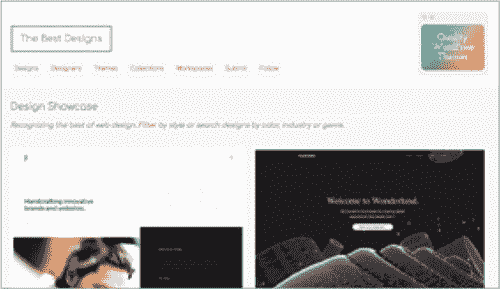*最佳设计（[hellobks.com/hwd/67](http://hellobks.com/hwd/67))* |  | *无与伦比的风格（[hellobks.com/hwd/68](http://hellobks.com/hwd/68))* |
| --- | --- | --- |
|  |  |  |
| 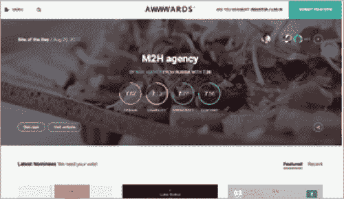*Awwwards（[hellobks.com/hwd/69](http://hellobks.com/hwd/69))* |  | 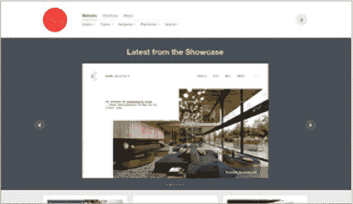*Site Inspire（[hellobks.com/hwd/70](http://hellobks.com/hwd/70))* |

**图 3-1：** 一些你可以用来寻找网页设计灵感的众多选项。

作为设计师，你的工作不是重新发明轮子。注意已建立的设计规范和“有效”的设计元素将帮助你在自己的设计中实现熟悉的流程和布局——使用户在使用你的产品时更直观地进行导航。

我的*Hello Web App*书籍受到了精彩的*A Book Apart*系列书籍的启发**（图 3-2）。**

我特别为我的*Hello Web App*设计感到自豪，但我真诚地认为，如果没有受到*A Book Apart*的深刻启发，它们的设计可能不会变成现在这样。看到那些书籍帮助我确定了我喜欢的尺寸和厚度，平面化的明亮颜色也激发了我自己对*Hello Web App*封面的图形处理。

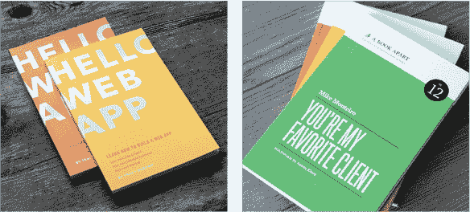

**图 3-2：** 我的*Hello Web App*书籍在左边，而精美设计的*A Book Apart*系列书籍在右边。

巴勃罗·毕加索曾著名地说过：“好艺术家模仿，伟大艺术家盗窃。”当你找到自己喜欢的东西，想要自己做的东西——无论是布局、颜色、字体选择等等——就把它作为灵感，创作出*类似的*作品，但不要*完全*一样。

让自己在设计方面变得更好的最有用的方式之一，就是观察其他设计，并批判性地思考它们做得好的地方和做得不好的地方。这是一个很好的练习过程，尤其是在寻找灵感时！

你做得越多（无论是好的设计还是差的设计），你就越能训练你的“设计眼”和设计直觉，这将使你更容易从零开始创作出好的设计。

让我们以 GitHub 首页设计为例**（图 3-3）**。

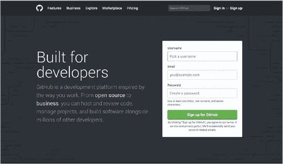

**图 3-3：** GitHub 一直拥有令人赏心悦目的首页设计，非常适合用来练习挑选出优秀的设计决策。

运用我们在第二章《理论与设计原则》中讲解的原则，你认为他们做得怎么样？以下是我挑选出的一些细节：

+   **大量的空白区域。** 标题、内容和表单上下方都有足够的空白区域，吸引眼球并强调内容。空白区域的量恰到好处——不多也不少。

+   **注册表单位于显眼位置。** 无需复杂操作——GitHub 让你可以从首页轻松注册账户。注意，“用户名”字段默认已获得焦点，用户可以立即开始输入。

+   **重要的词汇在内容中被加粗并链接。** “开源”和“商业”这两个词都被加粗、链接，并且使用了更亮的颜色。乍一看，你可以看到 GitHub 关注的两个领域。

+   **微妙的背景图案让空白区域看起来不那么空洞。** 想象一下背景是平坦的灰色——设计依然看起来不错，但会感觉没有那么精致。微妙的图案填充了空白区域，同时让内容更突出。

+   **主按钮是亮眼的突出颜色。** 设计的主体部分是深色和灰色的，使得明亮的绿色表单提交按钮格外显眼。

你还看到了哪些其他好的设计决策？

开始更加有意识地浏览网页，批判性地思考哪些设计做得好，哪些做得不好。随着时间的推移，你的设计直觉会不断提高。把这作为一种练习，会使你更自然地创造出更好的设计。

当你正在积极工作于一个新的设计时，这一点尤其重要。首先，通过寻找你所在领域中优秀设计的示例以及查看竞争对手的设计来获取灵感。挑选出他们做得好的地方，并在你自己的设计中加以应用。挑选出你认为不太成功的地方（尤其是竞争对手的设计），确保在自己的设计中避免这些问题。

我们在第二章的示例项目是我们的控件。对于本章，我们将构建一个开源项目的主页。让我们从寻找一些干净且具有视觉吸引力的开源项目主页开始**（图 3-4）**。

有一些趋势是值得在我们自己的设计中实现的：

+   **大量的白色空间** —— 开源项目的主页通常比较简洁（相比之下，比如报纸首页），而且通透、设计感强的感觉与面向开发者的项目形成了很好的对比。

**图 3-4：** 一些设计精良的开源项目主页，我们将以此为灵感。

+   **明亮的颜色** —— 无论是作为背景色，还是作为白色背景上的高光。

+   **清晰、突出的标题，解释工具的功能。**

+   **代码是重中之重** —— 自然地，为开发者制作的产品应该一开始就展示相关的代码，而不是将其隐藏。

这个过程很大程度上受个人偏好的影响——我选择了四个我个人喜欢并激发我灵感的设计；你可能不赞同我的选择。这完全没问题！设计是非常个人化的，最终你会想要一个能够代表*你*的设计。

第 3.2 节

计划阶段

你*可以*直接跳入编码阶段，开始用你的灵感创建网站，但设计过程中的中间步骤——制定计划、绘制创意和布局、制作模型——将帮助你尝试更多的创意，并且在总体上节省更多时间。虽然前期稍微费点劲，但从长远来看，它能节省大量时间。

如果你在开始设计和开发之前进行一些基本的规划，你的生活将会变得更加轻松。你需要多少页面？这些页面需要什么样的内容？你需要什么样的表单，字段有多少个？

我们将把开源项目主页示例项目构建为一个单一页面，并链接到外部文档——使得我们的计划非常简单。只有一页！

在这一页中，我们列出我们所需要的元素：

+   项目 Logo/名称。

+   解释项目的标题。

+   带有指向外部文档的链接菜单，包含 Read the Docs、GitHub 页面和作者的 Twitter。

+   显示代码的块（展示安装有多么简单）。

+   三个模块，分别详细介绍优势和功能。

+   贡献者的积极评价。

+   页脚中重复的菜单。

大多数网站不会这么简单。我们可以考虑另一种情景，比如一个设计师 Jane 的个人作品集网站，这需要更多的页面。

首先，我们来确定为 Jane 设计个人网站时需要哪些页面：

+   **主页：** 用户访问网站时看到的第一个页面。

+   **关于页面：** 深入了解 Jane 的背景和经验。

+   **作品集页面：** Jane 项目的概述。

    — **单独的项目页面：** 这些页面可能会使用相同的布局，因此我们可以将它们归为一类。

+   **联系页面：** 展示 Jane 的位置和联系她的方式。

我们可以立刻看到，我们需要为五种基本类型的页面设计布局。现在我们有了基本页面，我们希望每个页面包含哪些内容呢？

+   **每个页面：**

    — 个人标志或名字。

    — 顶部菜单列出网站中的所有顶级页面（也就是说，我们只列出上面的四个主要项目，而不是每个单独的作品集页面）。

    — 内容后的页脚菜单。

+   **主页：**

    — 简短、令人兴奋的 Jane 介绍。

    — Jane 的照片。

+   **关于页面：**

    — 更长的描述段落。

    — Jane 的另一张照片。

+   **作品集页面：**

    — 每个 Jane 项目的模块，包含每个项目的照片/截图、项目标题以及链接到各个项目页面。

+   **单独的项目页面：**

    — 项目代表的图片。

    — 项目的详细描述。

    — 外部资源链接（GitHub 上的代码、已上线的网站等）。

+   **联系页面：**

    — 简短的介绍段落。

    — 电子邮件地址和位置。

    — 联系表单，包含姓名、电子邮件、简短内容区和提交按钮。

制定一个计划，并列出所有这些页面、功能、组件和模块，将帮助你组织设计过程，确保在绘制和构建设计时不会错过任何重要元素。

在这个阶段，你可以跳过直接进行网站编码，但我强烈建议你花些时间来制作一些原型。我们将在下一节中详细讨论！

第 3.3 节

原型

绘制你的想法和制作原型的过程将帮助你比直接进入编码阶段更快速地尝试不同的解决方案。这个过程通常与灵感的激发并行进行。当你找到自己喜欢的想法时，应该记下这些想法，并草拟出它们如何融入你自己的设计。

绘制草图看起来可能比实际操作更令人生畏。也许你见过像**图 3-5**这样的网页草图。

如果你愿意，可以像**图 3-5**那样画个草图，但这并不是最初草图的制作方式。草图更抽象，使用最少的细节，并通过你的想象力将一切构思结合起来。你真正需要的只是框框和线条，用来快速记录一些布局的想法以及设计应如何呈现**(图 3-6)**。

这为你快速开始草图绘制设计想法提供了简便的方式。这里有一些更多的例子，来自我在重新设计*Hello Web Books*网站时的个人草图本**(图 3-7)**。

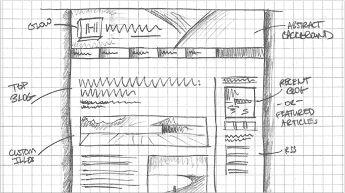

**图 3-5：** 草图不*需要*有这么多细节。

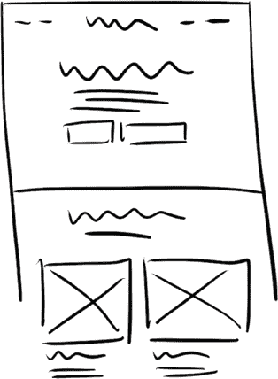

**图 3-6：** 低信息量的草图。弯曲的线条表示标题或较大的文本，直线表示内容，方框表示按钮，打叉的方框表示图片。

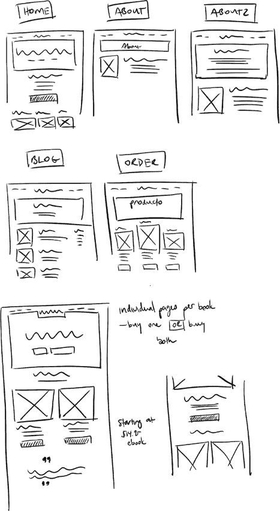

**图 3-7：** 我个人笔记本中的杂乱（数字化）草图，规划的是新的*Hello Web Books*网站设计。

再次强调，这些草图并不是像素完美：它们是为了提供快速的布局想法，帮助你开始构建设计。快速、杂乱、简单，绝对不完美。

你可以通过添加阴影或不同的灰度来升级你的草图，但尽量保持草图尽可能简单，不加修饰。在这第一轮中不要用花哨的字体，不用颜色，也不精确尺寸。尽量让这一轮对自己来说尽可能简单，这样你才能快速产生尽可能多的不同想法**(图 3-8)**。

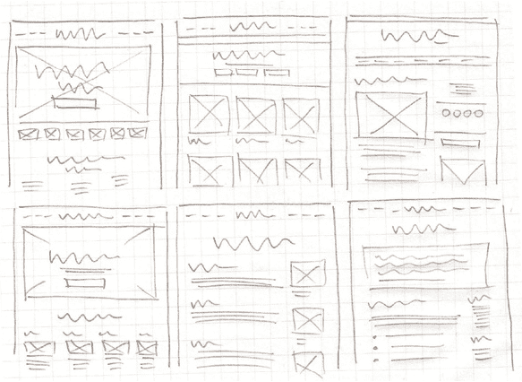

**图 3-8：** 显示基础线条、方框、图片位置和内容布局的纸质草图。草图不需要太复杂。

让我们回到示例项目，画出几个快速的主页布局想法，针对我们的开源项目**(图 3-9)**。

这里是两种不同主页布局设计的快速草图，但我建议你在草图时多做一些。做得越多，你经过的想法就越多，这将帮助你在选择构建线框的草图时更加自信。

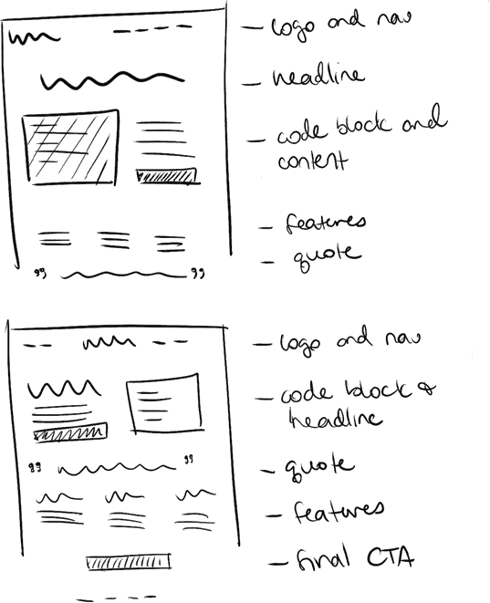

**图 3-9：** 显示两种不同主页布局设计的几个快速草图，针对我们的示例开源项目主页。

如果你没有具体的项目要做，画出你最喜欢网站的布局是很好的练习。

### 线框图

接下来，我们让快速草图更加具体。线框图帮助我们从草图中加入更多细节，使用实际的尺寸进行布局，并帮助我们在设计的更精细表现中确定间距。

有很多不同的软件工具可以帮助你完成这一阶段**(图 3-10)**。

| 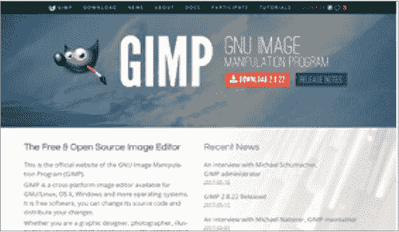*GIMP ([hellobks.com/hwd/77](http://hellobks.com/hwd/77))* |  | 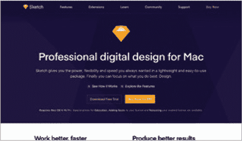*Sketch ([hellobks.com/hwd/78](http://hellobks.com/hwd/78))* |
| --- | --- | --- |
|  |  |  |
| 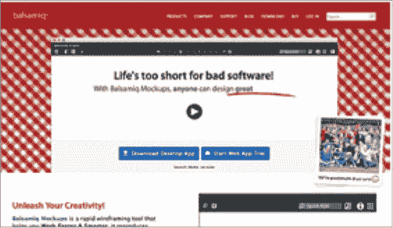*Balsamiq ([hellobks.com/hwd/79](http://hellobks.com/hwd/79))* |  | 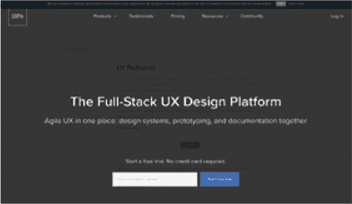*UXPin ([hellobks.com/hwd/80](http://hellobks.com/hwd/80))* |

**图 3-10：** 可用的几种线框图软件解决方案。

**免费选项**

+   **GIMP.** 开源图像编辑器： *[hellobks.com/hwd/77](http://hellobks.com/hwd/77)*

+   **Inkscape.** 开源矢量图形编辑器： *[hellobks.com/hwd/81](http://hellobks.com/hwd/81)*

**付费选项**

+   **Adobe Illustrator 或其他 Adobe 产品。** *[hellobks.com/hwd/82](http://hellobks.com/hwd/82)*

+   **Sketch.** *[hellobks.com/hwd/78](http://hellobks.com/hwd/78)*

+   **演示软件，如 Keynote（Mac）和 PowerPoint（Windows）**。你可以设置可点击的区域，跳转到不同的幻灯片或你网站的“页面”，这样你的模型看起来更具互动性： *[hellobks.com/hwd/83](http://hellobks.com/hwd/83)*， *[hellobks.com/hwd/84](http://hellobks.com/hwd/84)*

+   **Balsamiq.** 在线线框图软件： *[hellobks.com/hwd/79](http://hellobks.com/hwd/79)*

+   **UXPin.** 在线设计平台： *[hellobks.com/hwd/80](http://hellobks.com/hwd/80)*

线框图位于草图和模型阶段之间。在这个阶段，我们*并不*选择颜色或字体——我们只是继续思考布局和流程。

回到我们的开源项目主页，我们将使用我最喜欢的草图来创建一个线框图 **(图 3-11)**。

我们使用三列布局，开始规划我们的内容（确保简短、易懂并具有吸引力），并确定间距和布局。一旦这些元素就位，我们可以开始测试我们的设计（见 第 3.4 节：获取反馈），并尝试不同的想法，直到我们有了一个想要推进的方案。

我们仍然缺少一些重要的设计决策，如字体、颜色和图形，但这个基础的线框图为我们获取他人反馈和进行网站编码提供了一个很好的起点。

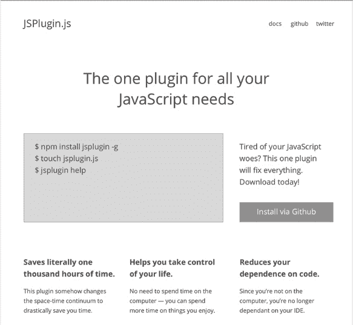

**图 3-11：** 基于我们草图的快速线框图。没有做重大设计选择——只是布局和间距。

使用真实内容非常重要——尽量避免使用假内容，例如 Lorem Ipsum（设计行业使用的虚拟文本）。使用真实内容，你将知道所需文本的长度，这对于布局设计至关重要，而不是使用可能比实际使用的文本更长或更短的虚假文本。

注意我们之前讨论的内容原则，确保你的内容简洁、易于阅读并且具有吸引力。在进行草图绘制、线框设计和模拟图制作的过程中——修订和测试不同版本的设计——你也应该同时修订和改进你的内容。

让我们看一个不相关的例子，以便获得另一个线框设计的示例**(FIGURE 3-12)**。

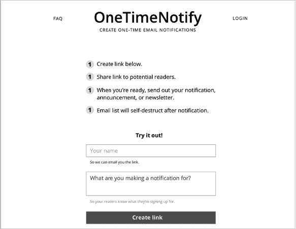

**FIGURE 3-12:** 另一个线框示例。

再次提醒，没有字体或颜色，但这个快速线框展示了规划的布局（主要是一个狭窄的列，菜单选项围绕着 logo），以及一些设计决策，比如使用项目符号列表来展示内容，并且表单足够高，能够在不滚动的情况下看到。

线框设计应该帮助你做出简单的布局决策，以便你能够快速尝试不同的想法并进行测试，而无需花时间在小的设计细节上或修改大量代码。

根据你所做的事情，你*可以*在创建线框后直接转到代码，或者你可以创建一个模拟图来探索最终的颜色、字体和图像。

### 制作模拟图

线框设计的保真度较低——我们也可以在设计程序中创建高保真的模拟图，在转向代码之前，我们可以将每个设计细节（字体、颜色、背景等）都规划好。

如果你以前没有使用过设计程序，这部分设计过程会有点困难。在第五章《附加资源》中，我提供了关于主要设计程序的基础设计技能教程和视频。

在制作设计模拟图时，花费额外时间的一些优缺点：

**优点**

+   你将会看到你设计的*确切*样子（希望如此），当你开始在 HTML 和 CSS 中构建时。

+   对象可以轻松移动和转换，因此你可以比设计已经编码时更快地改变主意。

**缺点**

+   增加了一个额外的步骤，可能需要更多的时间。

+   当你为网页设计时，你最终的网站需要是*响应式的*（设计可以适应不同的屏幕大小，既能在小屏幕上显示良好，也能在大屏幕上显示）。响应式设计更难制作模拟图，因为大多数设计方案是静态的。你需要创建模拟图，展示设计如何适应不同的屏幕尺寸（手机、电脑等）。

+   如果你不熟悉设计程序（或者你更熟悉代码），模拟图的制作可能会比直接编写 HTML 和 CSS 代码花费更多时间。

你的模拟图应该包括你在设计线框时所做的所有内容和布局决定，并且额外考虑了图形、颜色、字体以及额外的精美设计调整**(FIGURE 3-13)**。

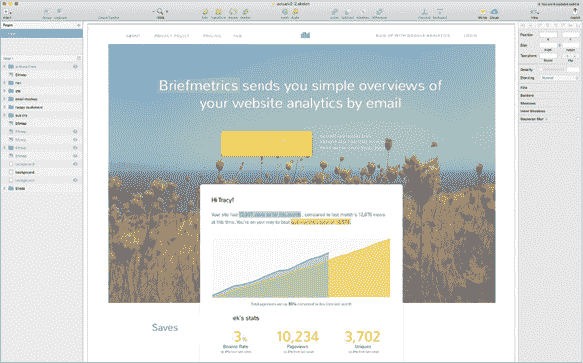

**FIGURE 3-13:** 使用设计程序 Sketch 展示颜色、字体和图像决策的模拟图。

让我们拿出我们的示例首页线框图，开始添加一些颜色、字体和图像。专注于使这个初稿*足够*好，以便可以发布并展示给他人，因为你可以随着时间的推移继续迭代和改进设计**(FIGURE 3-14)**。

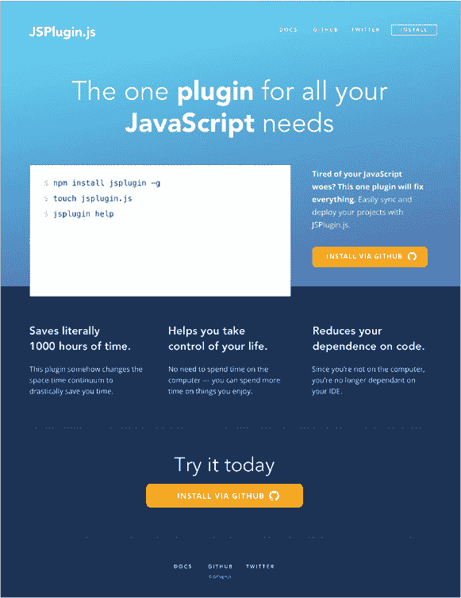

**FIGURE 3-14:** 回到我们的示例项目。通过添加颜色、图像、字体和其他风格决策，从线框图转换为模型。这个示例仍然很简单，但它作为第一个版本已经足够。你可以发布它，然后在此基础上迭代设计并逐步改进。

一旦你有了一个自己喜欢的模型，是时候进行下一轮测试，并与朋友和家人分享设计（在下一部分中会详细讨论），以确保在花时间编写网站代码之前，您没有遗漏任何重要的内容。

到这个阶段，你可以复制你的首页设计，构建其他页面（例如“关于”页面）的模型，并且模拟你的网站在小屏幕上的展示效果**(FIGURE 3-15)**。

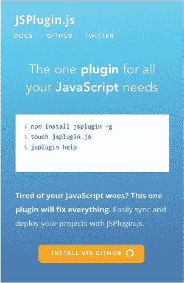

**FIGURE 3-15:** 我们创建的模型，修改后显示设计在小屏幕上的样子。记住，确保你的网站在小屏幕上可用且易读是非常重要的。

在下一部分，我们将讨论设计过程中的一个非常重要的部分（在本部分中有所提示）——获取反馈！

SECTION 3.4

获取反馈

设计过程中最难但最关键的部分之一就是获取对你设计的反馈。

与编程不同，你设计的东西没有简单的“有效”或“无效”答案。你不能仅凭一眼判断设计是否成功，必须从外部来源获取反馈。这个简单的步骤可能是最难的，因为我们天生都害怕负面反馈。如果那个人讨厌我们设计的东西怎么办？如果他们发现问题怎么办？

一个设计对你来说可能是合适的，但你是设计师——你知道设计的所有细节、它如何工作以及应该如何使用*因为*你是设计师。你只有在将设计展示给他人后，才知道这些路径和目标是否显而易见。你的设计可能很美，但你并不知道它是否会被欣赏和使用，直到你展示给别人。

如果有人发现设计中存在问题，感到难过是很自然的。当这种情况发生时，把它看作是一次学习的机会，尽量记住这些反馈会改善你的设计，并教给你一些新的东西。优雅地接受不好的反馈——不需要感到尴尬或受辱。最好在发布之前就听到坏消息，而不是发布后才发现。

不想听到负面反馈是完全正常的，但找出你的设计可以改进的地方，将使你的设计变得更强大，并在长远来看提升你的体验。抽离情绪，坚定意志，尽早发现问题。

### 以全新的眼光看待你的设计

在你展示设计给他人之前，给自己一个机会来批评自己的设计。简单地暂时放下设计（几个小时或过夜）可以帮助你发现潜在的设计问题。这是获取反馈最简单的方法，因为你正与一个自然赞同的“合作者”——你自己合作！

当你重新审视你的设计时，尽量将自己与设计师身份保持距离，尝试代入潜在用户的角度。你的设计是否可用？是否易于阅读和理解？设计是否便于使用并且感觉自然？仔细体验用户体验，并设想网站的使用方式——尽早发现所有“容易”的问题，然后再与他人分享你的设计。

获取设计新鲜反馈的另一个小技巧是拍一张截图并水平翻转。它仍然是相同的布局，但你的大脑会失去一些对设计的熟悉感，这样就能更容易客观地发现问题。

### 关于向他人展示设计的一些建议

你可以把设计展示给别人，得到“看起来很棒！”的反馈，拍拍自己背后，然后继续你的工作。但这真的是有价值的反馈吗？

确保你明确知道自己需要什么样的反馈。也许你希望帮助找出设计中的问题，并且你愿意接受一般性的反馈（正面或负面）和批评，或者你需要在两个选项中做出选择。或者，你可能已经完成了 90%的工作，只是想在发布前做一些小调整。

给你的审阅者提供明确的指示，告诉他们你需要什么，并确保他们有充足的时间来审视你的工作。快速浏览你的设计是不够的，所以不要在他们忙于其他任务时突然让他们审阅。让他们有时间真正深入思考你所做的工作。快速的反馈更可能仅仅涵盖表面问题或是空洞的赞美。

如果你只收到正面的反馈，尝试特别询问审阅者*不喜欢*的部分。这可能会促使更深入的反馈，也表明你在寻求（而非回避）负面反馈。

请记住，当你请求反馈时，你还需要判断收到的反馈。与不止一个人交流，因为一个问题只出现一次可能并不是真正的问题。如果一个问题反复出现，*那*就说明是需要解决的问题。

并非所有反馈都需要被采纳。你作为设计师，需要分辨哪些是实际的问题，哪些只是审阅者为了提供帮助而提出的建议。

#### *向朋友和家人展示设计*

你的朋友和家人是你可以寻求设计反馈的最友好的人，无论结果如何。那些离你最近的人最有可能想取悦你，可能只会给出积极的反馈。在这里，尤其需要明确表明你希望获得所有反馈（既有*正面*也有负面）。

如果你能把设计展示给符合你理想用户的人（如果你在为开发者开发工具，一个开发者朋友会是很好的测试者），那当然很好，但不要觉得只能局限于这个规则——任何人都可能发现 UX 问题。

#### *把你的设计展示给陌生人*

虽然这要难得多，但把设计展示给陌生人能获得更有价值的反馈，因为他们不会受到与你的个人关系的影响。

你可以在哪里找到可能愿意提供反馈的陌生人？

+   **黑客松、冲刺和其他社区活动。** 一些志同道合的聚会和活动是获得设计反馈的好地方。礼貌地询问别人是否愿意花 5 到 10 分钟时间审查你的设计。

+   **在线社区。** Reddit 的*design_critiques*子版块（*[hellobks.com/hwd/85](http://hellobks.com/hwd/85)）和 Bootstrapped.fm（*[hellobks.com/hwd/86](http://hellobks.com/hwd/86)）等论坛和社区可以帮助你审查你的设计草图和早期版本。互联网的匿名性使得陌生人往往会给出负面反馈，因此你需要特别注意筛选出有用的反馈和不好的反馈。厚脸皮是必不可少的。

+   **在线评审服务。** 有不少在线服务允许你上传设计截图以获取反馈。一个例子是 Five Second Test（*[hellobks.com/hwd/87](http://hellobks.com/hwd/87)*）。

+   **咖啡店等地方的人们。** 周围没有黑客松活动？你还可以尝试经典的可用性测试技巧——购买几张价值 5 美元的咖啡店礼品卡，找些看起来友善的陌生人，问他们愿不愿意用五分钟的反馈换取礼品卡（或者一杯咖啡，或类似的东西）。在公共场合接近陌生人可能让人害怕，但获得陌生人对设计的反馈是非常有价值的，值得一试。

这个步骤非常容易跳过，尤其是在你遵循最小可行产品（*MVP*）尽快上线的建议时，但获取反馈可以大大改善你项目的设计和可用性。你可能会发现一个可能决定你项目能否顺利推出的问题。

如果向别人获取反馈让你觉得害怕，我可以向你保证——你做得越多，就越容易。去吧，去获取你设计的反馈！

第 3.5 节

编码你的设计

如果这本书包括代码，它的篇幅将增加三倍！但在这里我确实想在吸引你注意力的同时谈一谈一些编码哲学。

### 别担心原创性

很多设计师抱怨说，太多网站看起来都一样 **(FIGURE 3-16)**。

作为初学者设计师，*不要担心自己要做到百分之百的原创。* 使用有效的设计！有时，令人熟悉的设计反而可能是一种优势。

当你作为设计师成长时，你会变得更加擅长创造新的、独特的细节。但当你刚起步时，如果你的设计与其他设计相似，不必担心，就像上面的那些美丽（但布局相似）的示例网站。如果你的设计看起来与其他设计相似，没有人会受到伤害（除非你完全照抄设计；那可不行！）。记住，设计如何运作比设计看起来如何更重要。

在打破规则之前，先学习规则和趋势。

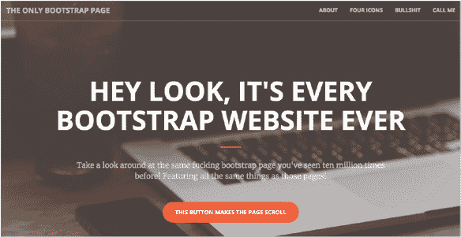

**图 3-16：** Bootstrap 是一个流行的设计框架，这意味着很多网站会有相似的布局。这个网站取笑了这种趋势。

### 使用 CSS 框架

专业设计师和前端开发人员常常不屑一顾框架——最著名的是 Bootstrap (*[hellobks.com/hwd/5](http://hellobks.com/hwd/5)*)，但也包括 Skeleton (*[hellobks.com/hwd/7](http://hellobks.com/hwd/7)*)、Foundation (*[hellobks.com/hwd/6](http://hellobks.com/hwd/6)*) 或 PureCSS (*[hellobks.com/hwd/9](http://hellobks.com/hwd/9)*)——因为它们限制了你的设计以适应它们的方案，通常内置了设计（所以你并没有创造独特的东西；和上面的抱怨一样），而且可能让你的代码膨胀，包含不必要的 CSS 和 JavaScript。

但初学设计的设计师使用框架会受益匪浅。它将为你节省大量在 CSS、布局和最佳实践上浪费的时间。许多框架（比如 Bootstrap）附带的设计元素提供了一个很好的起点，你不需要花费大量时间去设计每个独立的元素。

在开始时，尽快推出设计是最重要的。你总是可以在发布后减少设计代码的大小并重新设计元素。

### 记住响应式设计

我们在前面的几节中提到了响应式设计，它在你编码网站时发挥着最重要的作用。

如今，随着各种尺寸屏幕的设备——从小巧的手机屏幕到巨大的显示器——出现，确保你的设计能够在多种格式中正常工作变得尤为重要。

了解媒体查询（*[hellobks.com/hwd/89](http://hellobks.com/hwd/89)）以便你可以指定仅适用于某一屏幕尺寸的 CSS 规则。

框架通常附带响应式工具，这也是我推荐它们的另一个原因。注意你可以使用哪些功能来帮助你的设计，比如 Bootstrap 的可见/隐藏 CSS 类，这样你就可以根据屏幕尺寸显示/隐藏元素。

在你发布网站之前，查看你的设计在各种格式下的效果，确保你设计的流程在每种尺寸下都能正常工作——你的设计应该*在任何媒介上都能正常运作* **(FIGURE 3-17)**。编码响应式设计需要花费大量时间，但它对设计的工作效果至关重要。不要忘了这一点！

### 关注网站大小

漂亮的图像（普通 *和* 高清图像）、JavaScript、框架代码——很快，你的网站可能就会变得下载缓慢。检查哪些部分可以优化，减少你的 CSS、图片和 JavaScript 的大小：下载缓慢会导致你失去访问者 **(图 3-18)**。

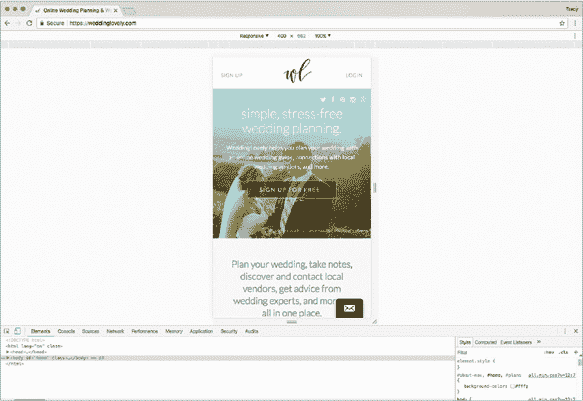

**图 3-17：** Chrome 开发者工具 (*[hellobks.com/hwd/90](http://hellobks.com/hwd/90)*) 允许你在浏览器中查看不同尺寸的设计——无需拥有实际设备即可查看兼容性。

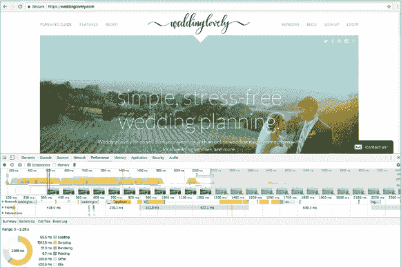

**图 3-18：** Chrome 开发者工具还会显示你网站的加载时间，让你看到哪些内容可能会导致网站加载变慢。

### 使用分析工具

不要只发布一个设计就忘了它——发布后要查看它的表现如何。你的跳出率（即访客在查看页面后立即离开的网站比例）是否很高？是否没人查看你的“关于我们”页面？批评设计可能很难，因为它非常定性，依赖于直觉和个人偏好。通过分析工具添加数据可以帮助你做出更具量化依据的设计决策。

分析的黄金标准是 Google Analytics (*[hellobks.com/hwd/48](http://hellobks.com/hwd/48)*)，但你也可以选择其他分析工具。一个选择是 Segment (*[hellobks.com/hwd/49](http://hellobks.com/hwd/49)*)，它允许你与其他分析服务集成，包括 Google Analytics 以及 Mixpanel (*[hellobks.com/hwd/91](http://hellobks.com/hwd/91)*) 等。

恭喜你完成本章！我已将大量信息提炼成更小的、希望更易于管理的块。在本书的这一部分，我希望你对做出设计决策、规划、原型设计和构建设计感到更加自信。
