# 第一章：建造工具和材料

要制作一些基本的机器人，首先需要一些工具。在制作你的小机器人过程中，你将使用几乎所有基本的手动工具。事实上，你将使用的电动工具非常有限，不过稍后会提到这一点。

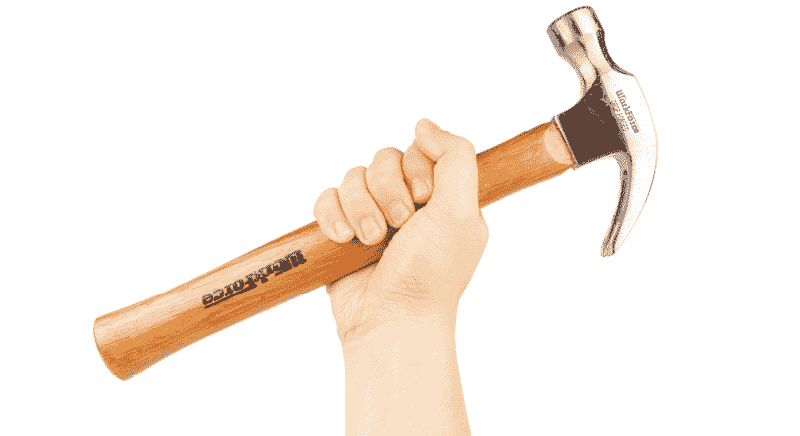

你可能已经有了大部分需要的工具，而且我假设你已经了解了像锤子或螺丝刀这样的基本操作原理。

对于那些从未使用过电钻的人，我将简要介绍一下。如果你已经掌握了这部分内容，可以快速浏览本节并可能发现一些新的有用技巧，或者直接跳到有关紧固件和材料的部分。

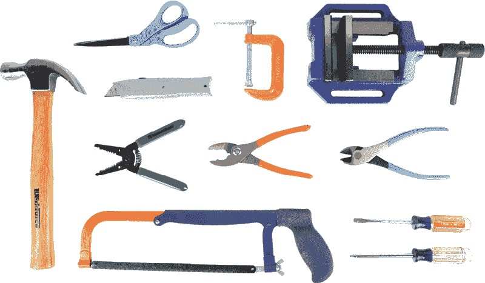

你的工具箱应包含以下工具：

**工具和材料**

+   锤子

+   螺丝刀（十字和一字）

+   钳子

+   剪线钳

+   剥线钳

+   剪刀

+   美工刀

+   锯条

+   C 型夹具

+   台钳

## 电钻和钻头

本书中你将使用的主要电动工具是电钻。无论你的电钻是电池供电还是有线电源都没关系；不过，我个人更喜欢使用有线电钻，因为它更便宜，而且在工作时不会突然没电。

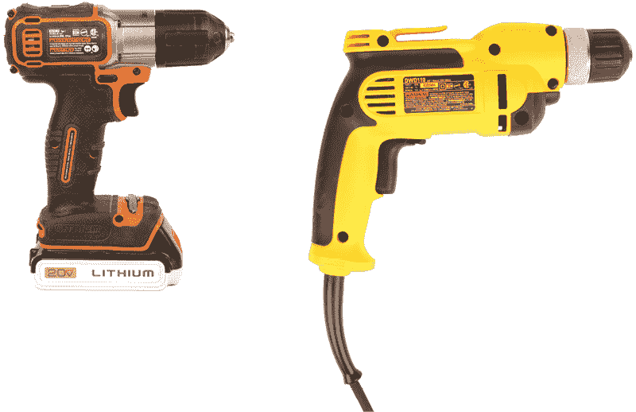

除了电钻，你还需要一些通用的*分点钻头*。这些是电钻旋转时用来在物体上打孔的工具。电钻会始终打出与钻头宽度相同的孔，因此尽量选择一套包括多种尺寸的钻头。购买一套是确保能够打各种孔的简单且经济的方法。五金店里通常出售的钻头套装，尺寸从 1/16 英寸到 1/2 英寸不等。

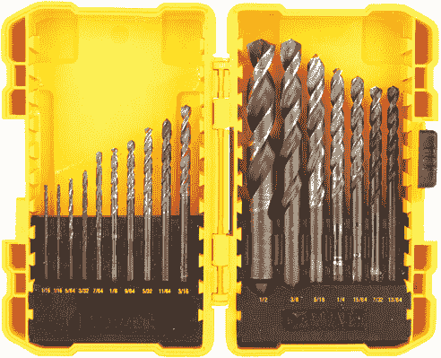

本书中你还将使用*平头钻头*。这种钻头由一个中心点和外部切削边缘（称为*螺旋齿*）组成。*中心点*在你钻孔时会在中间打一个小孔，保持平头钻头的位置，而螺旋齿则切割出更大的外孔。这种钻头适用于打孔宽度超过 1/2 英寸的情况。你最常用的平头钻头尺寸是 3/4 英寸。

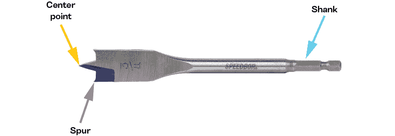

首先，找到电钻前端的旋转部件，那里是插入钻头的地方。这个部件叫做*卡盘*，内部有夹钳，用来张开和闭合，以夹住钻头。

要打开卡盘的夹钳，逆时针旋转直到夹钳的开口略大于钻头。将钻头插入卡盘，确保卡盘与钻头的螺旋切削槽之间有一定的间隙。顺时针旋转卡盘，直到夹钳紧紧夹住钻头的柄部。

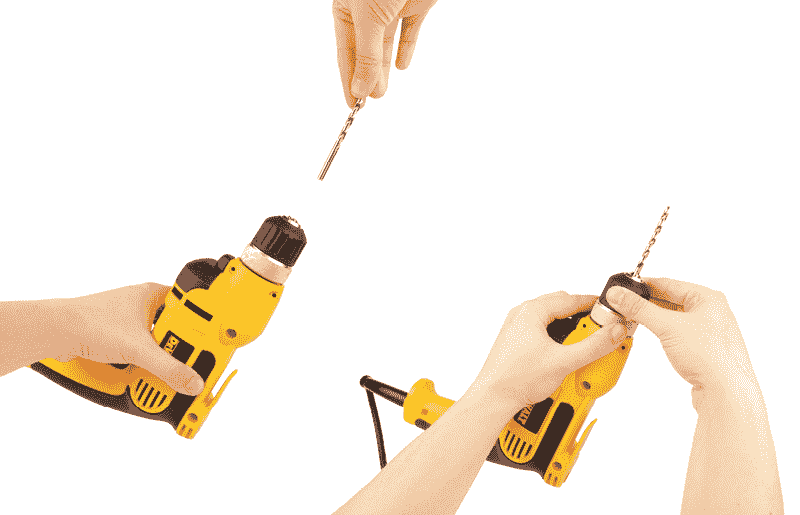

在使用电钻时，钻头在旋转时不应晃动。换句话说，钻头应完全居中旋转。如果它看起来没有居中安装，请取下钻头并重新插入。

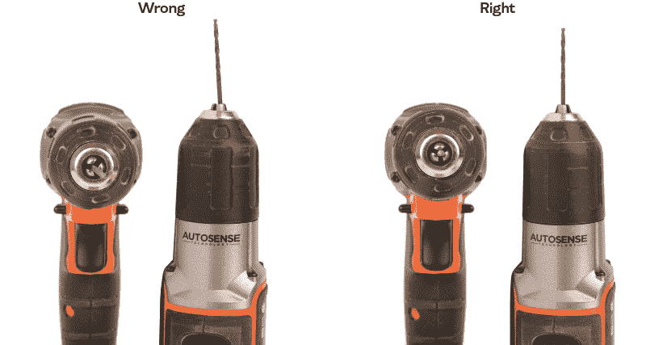

几乎所有现代电钻都允许你控制钻头的转速和旋转方向。你通常可以通过电钻触发按钮附近的开关来改变旋转方向（顺时针或逆时针），而按下触发按钮的力度决定了转速。按得越用力，钻头转得越快。

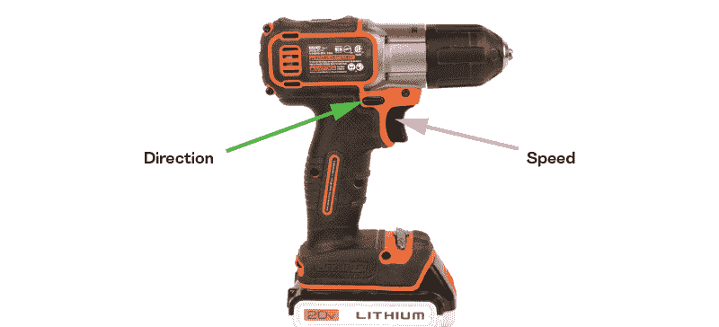

在使用任何电钻之前，首先使用工作台虎钳或 C 形夹具夹紧你想要钻孔的物体。

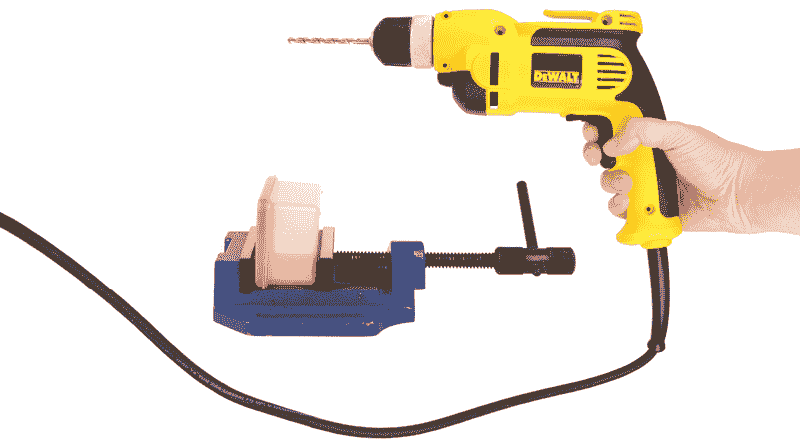

将钻头的尖端垂直于你想要钻穿的表面，并慢慢加速钻头。轻轻按下电钻，直到钻头完全穿透表面。

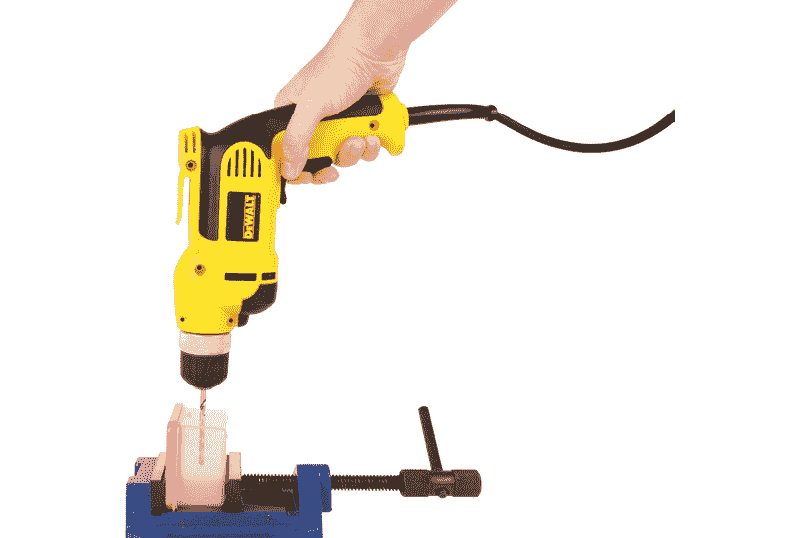

## 紧固件和粘合剂

一旦你钻了许多孔，你就可以用紧固件将它们连接在一起。构建机器人时，你主要会遇到两种机械紧固件：*扎带*和*螺母螺栓*。

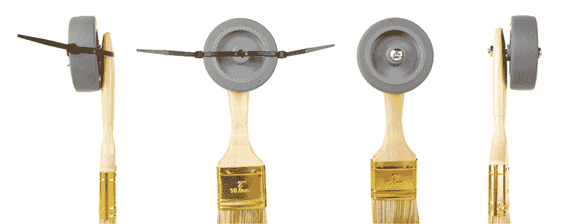

在本书的几乎每个项目中，你都会用到扎带。扎带非常容易使用，可以将物体固定在一起，而且如果出错也容易解开。它们结实耐用，不容易断裂或折断，并且便宜且容易获得——这些都是构建简单机器人时的优秀属性。

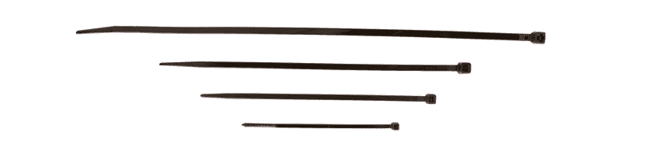

使用扎带时，只需将“尾部”插入“小嘴”端并拉紧。你会听到塑料通过时发出“咝”的声音。注意，一旦扎带被紧固，就无法松开了。这既是一个优点，也是一种缺陷。如果你搞错了，唯一能解开扎带的方法就是用剪刀或切割钳。

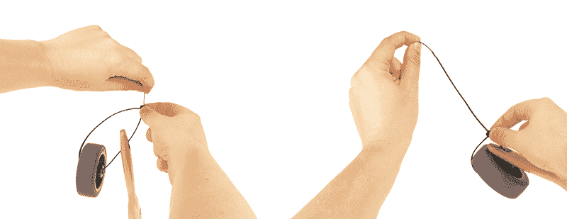

除了扎带外，一些机器人可能会使用螺母和螺栓，它们也很容易使用，并且有各种不同的尺寸。螺母和螺栓有两种测量标准：英制和公制。在美国，标准是英制的，所以所有的尺寸都是以英寸和英寸的分数表示。公制在世界其他地区使用。本书主要面向美国读者，因此我将使用英制单位。

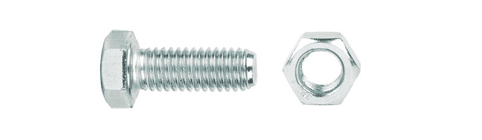

螺母和螺栓有两种测量方式。第一种是螺栓的宽度，第二种是螺纹间距。例如，一个¼-20 的螺栓宽度为 1/4 英寸，每英寸有 20 根螺纹。一个½-13 的螺栓宽度为 1/2 英寸，每英寸有 13 根螺纹。

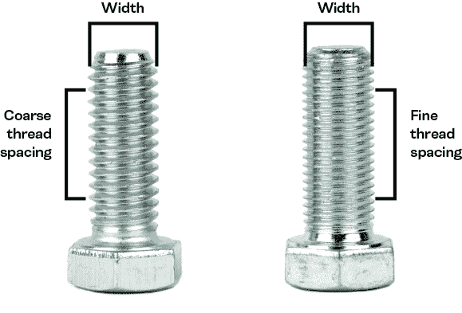

螺母和螺栓*仅*在宽度和螺纹数量匹配时才能互相旋合。

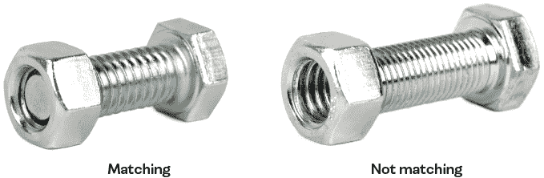

使用螺母和螺栓时，将螺栓穿过你想连接的两个物体的孔。将螺栓穿过两个物体后，顺时针旋转螺母，将物体固定在一起。

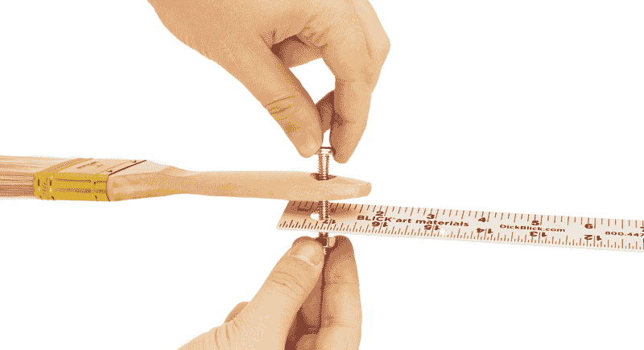

在本书中，或者在你自己的探索中，你可能需要一些其他的专业紧固硬件，你应该能在当地的五金店找到。不过，你可能需要在线订购一些。查看附录 A 中的“基础电子元件购物清单”获取资源。

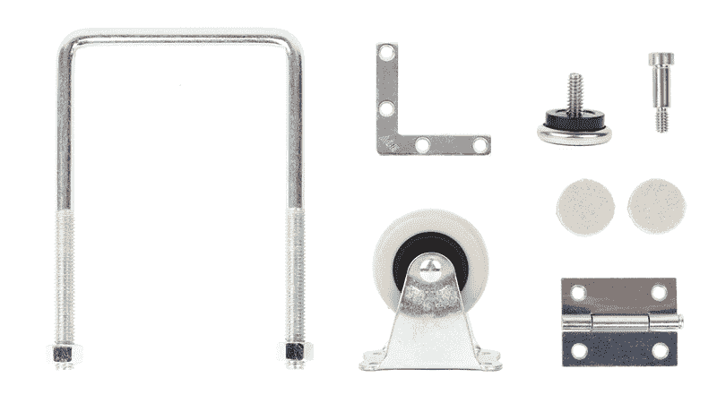

另一种将物体连接在一起的方法是使用粘合剂，最常见的是胶水或胶带。通常来说，使用机械紧固件比使用粘合剂更可取，因为机械紧固件更容易拆卸。不过，在本书中的某些地方，你将使用粘合剂来连接物品——主要是当你用画家胶带将纸质钻孔模板暂时固定在物体上时。某个项目（Skitter Bot）使用了胶水，我将在第十章中介绍。

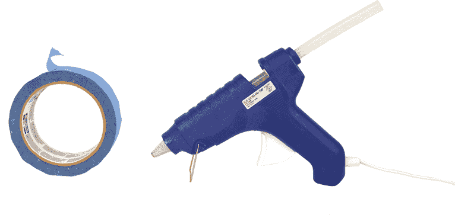

## 替代材料

本书不要求使用固定的材料或建造套件。你可以用家里找到的东西来建造这些机器人，你可能无法找到与这里使用的完全相同的零件。我会尽量在每个机器人的材料清单中描述零件，但你可以用手头上的东西进行即兴创作。例如，如果本书要求使用塑料容器作为机器人的身体，你可以用纸板或木盒来替代。同样，你也可以用一个大的圆形自行车反光镜替代一个用 CD 做的轮子。关键是观察不同组件的基本形状和材料，并用你手头有的替代它们。除了电子元件外，零件很少有那么具体，以至于不能替换。

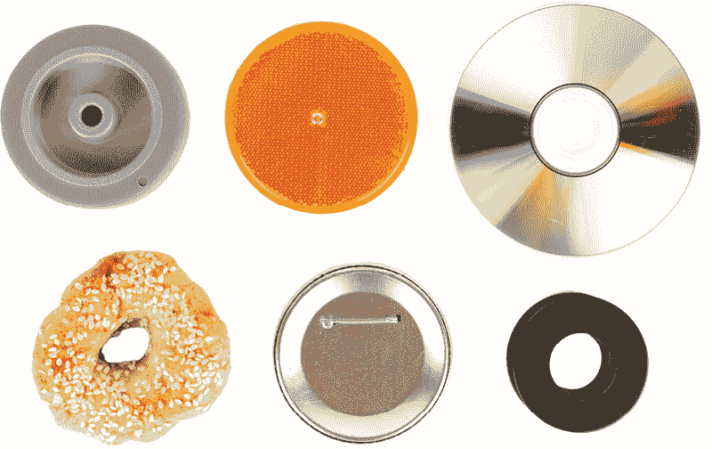

令许多严肃工程师感到沮丧的是，我常常喜欢说：“建造机器人不是一门精确的科学。”不过，这只是半真半假。大多数机器人技术使用的是精确的科学原理，但本书探讨的是需要创意、聪明才智和实验的机器人部分。目的是激发你去玩耍、即兴创作和创新。把这些指导方向当作指南，随时根据需要进行调整。

一旦你熟练建造机器人，如果你真的想发挥创意，你甚至可以用不寻常的建材替换零件，例如旧的毛绒玩具甚至食物。
