# 第二章：电子学入门

学习机器人技术最令人生畏的方面之一就是掌握电子学。尽管这个领域内容广泛，且可能非常技术性强，但只要掌握一些基本信息，几乎任何人都能让电流为他们工作。幸运的是，我在这里提供这些信息。所需要的只是耐心和学习的意愿。有些信息可能一开始不太容易理解，但没关系。随着你开始实际制作一些机器人，一切都会变得清晰。

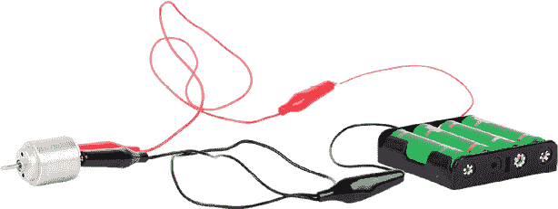

## 电池与电力

本书中所用的所有电力都将来自电池。当你使用电池时，请记住电流总是从电压源流向地面。你可能已经注意到电池有一个正极和一个负极。按照传统，电池的负极是地线，正极是正电压。

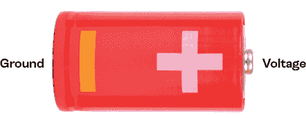

电荷可以有两个属性：*电流*（电路中的电荷量）和*电压*（电荷通过电路时的推动力）。如果你把电路想象成一个花园水管，那么电流就是水流通过水管的量，电压就是推动水通过水管的力量。

常见的圆柱形电池，从 AAA 电池到 D 电池，都能提供 1.5 V 的电压。这些电池之间的区别不在于它们能提供多少电压，而在于它们能提供多少电流。电池越大，它能够提供的电流就越多，提供电力的时间也就越长。

## 电路

现在你对电池有了更多了解，你可能在想如何使用它们为电路提供高于 1.5 V 的电压。答案很简单：你将电池*串联*起来，以实现更高的电压。这意味着将电池首尾相接，其中一节电池的正极接触到另一节电池的负极。串联电池的总电压会相加，因此通过将四个 1.5 V 的电池首尾相连，你可以轻松创造出一个 6 V 的电源。

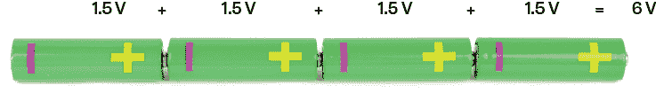

*电池架*是一个用于将电池串联起来的外壳。电池架中电池的数量越多，电压就越高。你可以通过将电池的数量乘以 1.5 来计算电池架的总电压。

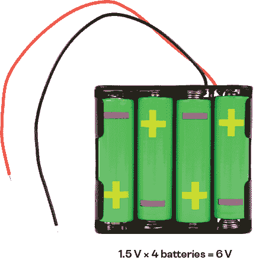

### 电线

你可以看到电池组有一根红线和一根黑线从中出来。在*直流（DC）*电子学中，电池组的红线始终是电源连接线，黑线始终是地线。

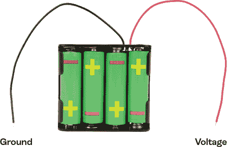

要将电池组连接到其他设备，你需要一根导电线。*导体*是指可以轻松让电流通过的材料。对于所有的机器人项目，你将使用绝缘电线。*绝缘体*是指能够防止电流通过的材料。通过使用带有导电芯的绝缘电线，你可以将电流引导到所需的地方，而不必担心电线接触并造成错误的连接。

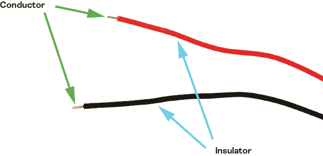

为了使用绝缘电线，你需要剥去电线末端的一些绝缘层。我发现最好剥去 1/2 英寸到 1 英寸的绝缘层。少剥一点可能难以操作，而剥得太多可能会暴露出太多电线，导致接触错误。

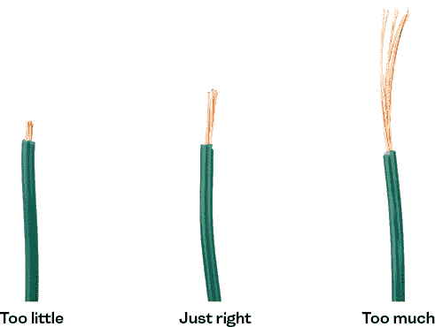

### 使用鳄鱼夹的测试引线

使用*鳄鱼夹*的测试引线非常适合暂时连接不同的电线。使用时，按下鳄鱼夹的背部，将你要夹住的物品放到夹口处，然后松开让夹口紧闭。

只有当鳄鱼夹夹住导体时，它才会有效。

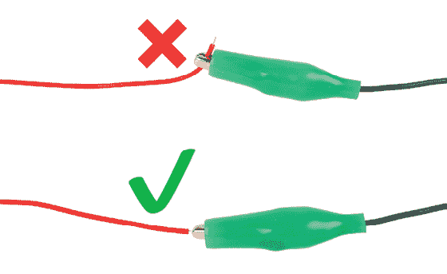

你可以使用测试引线将电池组连接到不同的电子元件。如果这些元件的连接方式允许电流在电源和地之间流动，那么你就创建了一个电路。*电路*就是电源和地之间的完整通路。

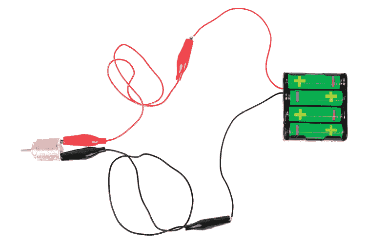

### 短路

如果你决定绕过所有电子元件，通过将两个电池组的电线连接在一起来创建最简单的电路（不要这么做），恭喜你，你刚刚创建了一个短路！

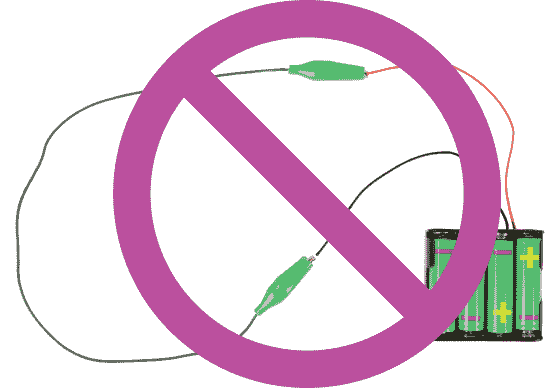

*短路*是指电路中正极与地极之间没有负载来消耗流经电路的能量的情况。*负载*基本上是任何使用电能的设备。

当电池的正极电压端子直接连接到地端时，流经电线的能量没有任何东西可以“消耗”。由于电子只流动了短短的一段距离，它们会积聚大量的热量。这会导致电子元件本身开始加热、熔化，甚至可能着火，这显然是非常危险的情况。看看这根在短路过程中熔化的电线：

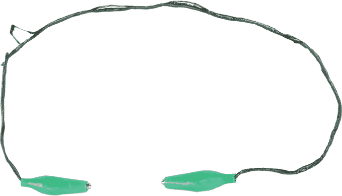

一个非常警示的信号，表明你已经创建了短路，那就是看到“魔法烟雾”，它突然出现，并似乎神秘地从电路内部冒出来。如果你看到这股烟雾，迅速断开电源。

始终将电源连接到负载上是非常重要的。就本书的目的而言，最容易将电源连接到的设备是电动机。电动机消耗大量能量。

### 开关

为了控制电路中的电流流动，你需要一个*开关*，它是一个机械装置，用来交替断开或完成电路。开关字面上的含义是两个金属片，它们要么接触在一起（关闭），要么分开（打开）。

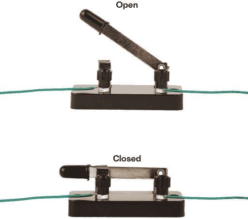

最基本的开关类型打开和关闭一个机械连接，并控制一个电路。这被称为*单极单掷*（*SPST*）开关。*极*是电流进入电路的点，*掷*是一个潜在的输出点。

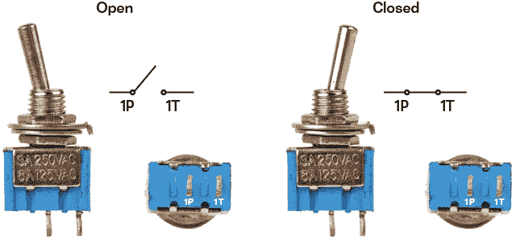

带有单个掷点的开关使用起来很简单，因为它只有一个输出，但带有多个掷点的开关可以有不同的输出，具体取决于它是如何切换的。例如，*单极双掷（SPDT）*开关有一个极，连接一个公共接点，但它有一个双掷点，允许它在两个不同的输出连接之间切换。当切换到一种方式时，它会输出到*常闭*（*NC*）连接，而切换到另一种方式时，它则通过*常开*（*NO*）连接导电。

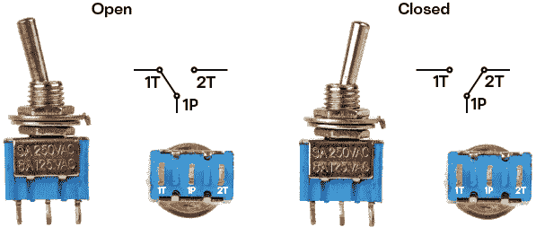

一些开关甚至可以有多个极，例如下面所示的*双极双掷（DPDT）*开关。这个开关就像是将两个独立的 SPDT 开关合并成一个开关。每个极是一个独立的电气输入连接，每个极都会切换到两个独立的电气输出。

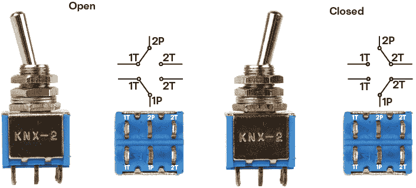

### 其他开关

到目前为止，我描述的是切换开关，它通过前后推拉来激活。然而，存在许多类型的开关，它们通过不同的方式触发。在本书中，你将使用几种不同类型的开关，包括杠杆开关、簧片（磁性）开关和倾斜开关。

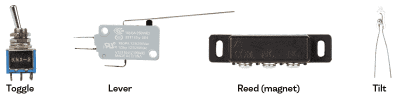

开关通常通过某种物理输入来激活。然而，*继电器*是一种由电磁铁激活的开关。当电磁铁的线圈通电时，继电器内部的开关被接通，当电源切断时，继电器内部的开关恢复到正常状态。在第十三章和第十四章中，你将使用继电器来制作一些高级电路。

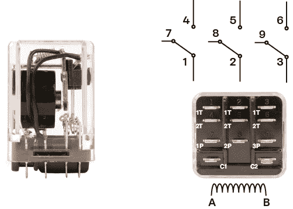

### 串联电路

正如你在本章早些时候所学的那样，将东西串联意味着将它们一个接一个地连接起来。在这种情况下，电池组的电源线先通过开关，然后通过电动机，最后接地。

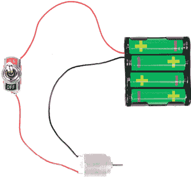

电流通过串联中的每个元件。如果你断开电路中的任何连接，如下所示，电源将会关闭。

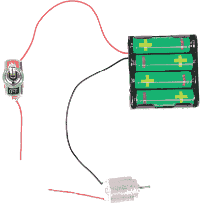

在下图电路中，开关的作用基本上与断开电线相同。如果开关打开，连接就建立，电流可以流动；如果开关关闭，连接被断开，电路被切断，电流无法流动。

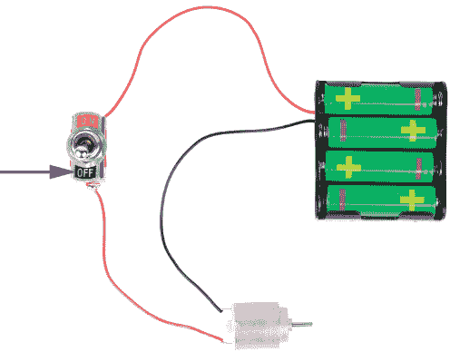

你甚至可以将两个电动机串联接线。然而，通常你不会这样做，因为当电压需要通过两个串联的线圈才能到达地面时，你会使两个电动机的速度大约减半。换句话说，如果电动机串联接入，提供正常速度所需的电压将是原来的两倍。

### 并联电路

最好将电动机*并联接线*。在并联电路中，负载是并排接入的，电流同时流过两个电动机，最终流向地面。在这种配置中，两个电动机都会以正常速度、正常电压旋转，但它们现在从电池中抽取的电流是原来的两倍。这种配置更好，因为电池组通常能提供更多的电流，但无法提供更高的电压。

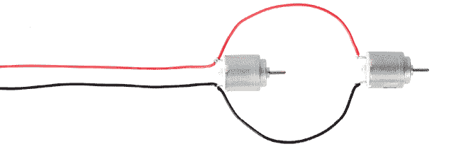

另一种将电动机并联接线的好处是，即使你断开一个电动机与电源的连接，另一个电动机仍然会持续供电而不会中断。因此，如果一个电动机发生故障或停止运转，另一个电动机仍会继续工作。

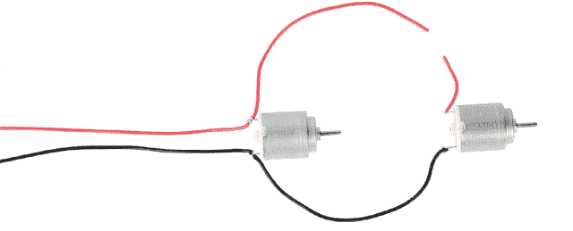

根据本书的一般规则，电动机应仅以并联方式接线。实际上，所有使用两个或更多电动机的机器人都是并联接线的。有时，它们会将一个开关与并联的一个或多个电动机串联接入。这使得开关能够单独控制一个或多个电动机的开关。你将在下一章了解更多关于电动机的内容。

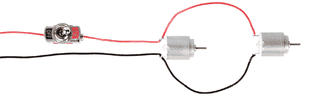
