# 第三章：电机

机器人的肌肉几乎总是其电机。简单来说，*电机*是一种电机机械装置，当电流通过时，电机轴会旋转。电机有很多种类型，但通常用于机器人技术的电机是直流（DC）电机。

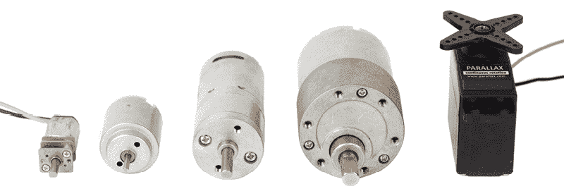

## 直流电机

你需要理解的关于直流电机的最基本的事情是，电磁力使得直流电机旋转。当电力施加到电机端子时，电机轴会朝一个方向旋转。

当你反转电源线接到端子时，电机轴会朝相反的方向旋转。这是因为当你反转电磁铁的电源时，电机内部产生的磁场也会发生反转。

## H 桥

如果你想通过开关改变电机的旋转方向，你需要创建一个名为*H 桥*的电路，简单来说，它是一个允许电机旋转方向反转的电路。

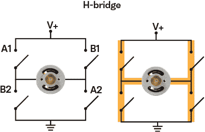

一个基本的 H 桥由两对单极单掷（SPST）开关组成。一对开关位于每个电机端子与电压源之间，另一对开关位于每个电机端子与地之间。当你把它画在纸上时，你会发现它看起来有点像一个*H*，这也是该电路得名的原因。

当标有“A”的开关组闭合时，电力通过电机流动，使其顺时针旋转。当另一个标有“B”的开关组闭合时，电力反向流动，电机则逆时针旋转。

两组开关不能同时闭合。如果你这样做，电力将直接连接到地面，你就创建了前一章中讨论的可怕短路。

此外，如果你混合并匹配这些开关，比如关闭 A1 和 B2，你还会造成短路。重要的是，只有“A”开关组或“B”开关组中的开关能被闭合，切勿让两组开关同时闭合。

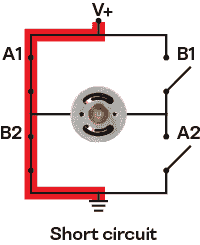

显然，需要切换四个不同的开关是不实际的，且容易出错。幸运的是，你可以将电路中的四个 SPST 开关全部替换为一个双极双掷（DPDT）开关。通过使用 DPDT 开关，你可以创建最基本的 H 桥电路。

当 DPDT 开关切换到一个方向时，电机会顺时针旋转；当它切换到相反方向时，电机会反向旋转并逆时针旋转。

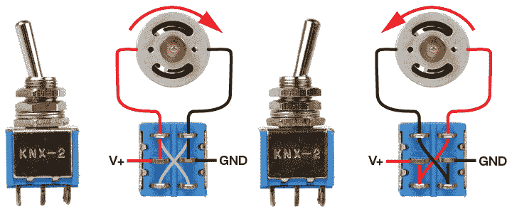

要制作第一个 H 桥开关，将一个 3 × AA 电池座的红色电线焊接到 DPDT 开关的一个中央引脚，将黑色电线焊接到另一个中央引脚（详细的焊接说明请参考第四章）。

接下来，选择一对外侧引脚。将一根红色电动机线焊接到与中心引脚对齐的开关端子上，中心引脚连接有红色电池线。然后，将另一根黑色电动机线焊接到另一根外侧引脚上。

现在，当切换开关时，电动机要么由电池组供电并顺时针旋转，要么完全不转动。

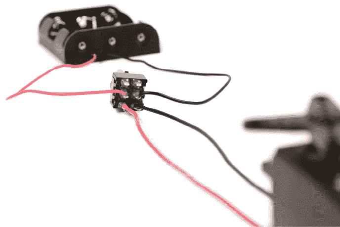

这是一个积极的第一步，但请记住，实际上你希望在切换开关时，电动机改变方向，而不是关闭。为了实现这一点，你需要找到一种方法来反转电动机的电源。

### 反转电动机的电源

为了让 H 桥完全功能化，你需要以一种方式将开关的剩余引脚接线，以便反转电动机的电源。你只需要将开关端子的一对未使用的外侧端子与连接到电动机的端子进行交叉接线。

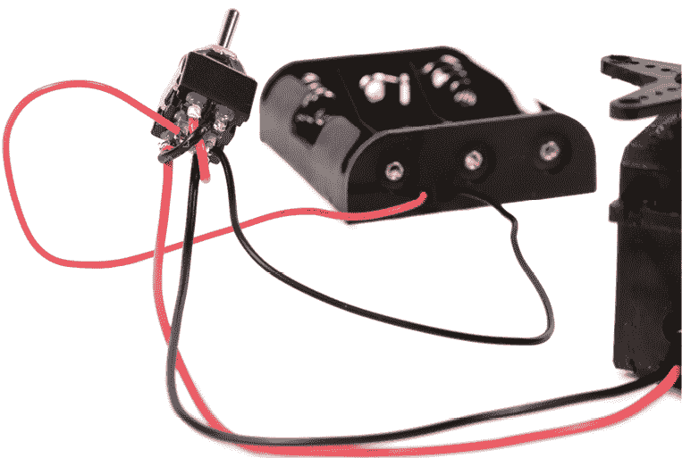

当切换开关来建立这个连接时，电池组的黑线与电动机的红线连接，而电池组的红线与电动机的黑线连接。通过交叉接线，你实际上在切换开关时反转了电动机的电源。

H 桥的 A1 和 A2 连接是直接连接到电动机的第一组端子。H 桥上的 B1 和 B2 连接是另外一组外侧端子，当切换开关翻转时，交叉接线会连接到这些端子。

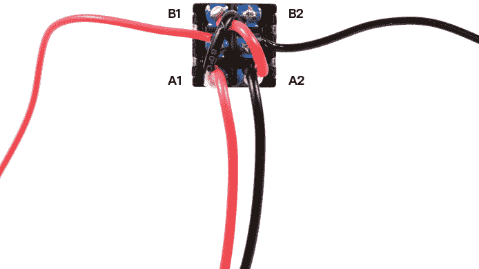

### 调节电动机的速度

现在你已经理解了如何调整电动机的方向，接下来你将调整它的速度。虽然有许多方法可以控制电动机速度，但最简单的方法是改变你施加的电压。施加的电压越高，电动机旋转得越快。

然而，如果施加的电压过高，电动机内部的线圈会过热，线圈的保护涂层会熔化，电线会短路，电动机就会停止工作。因此，了解电动机的最大电压额定值非常重要，这样你就不会使电动机过热并释放出“魔法烟雾”。

如果你不知道电动机的工作电压，可以使用一种非常科学的试错方法来猜测。先从 3 伏的小电压供应开始，逐渐增加电量。如果电动机或电池变得非常热，以至于你无法触摸它们，那么你就给电动机施加了过多的电压。让它们冷却下来，使用之前测试过的电源，直到它们不再过热。

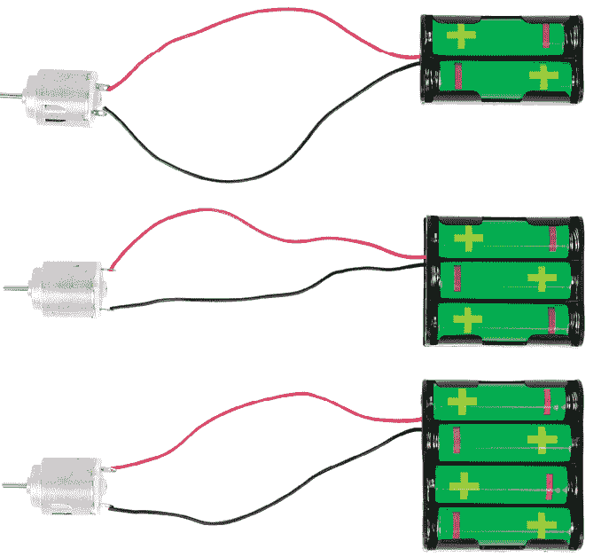

尽管你可以通过施加更多或更少的电力来改变电动机的速度，但更好的方法是使用额外的齿轮箱来改变电动机的输出速度。许多电动机都配有齿轮箱，用来加速或减慢输出速度。

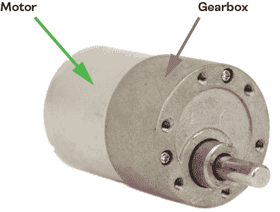

## 舵机电动机

*伺服电机* *马达*是一种带有电子控制板的齿轮电机。你可以使用一种叫做*微控制器*（一种小型计算机）的电路板与其控制板进行通信，并控制它的旋转。

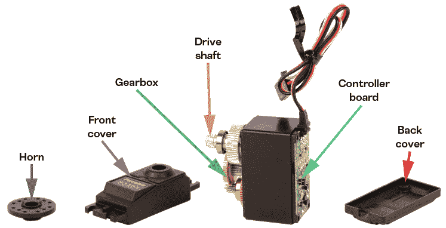

在本书中，你将修改伺服电机，使其通过电池供电而无需使用微控制器。为此，你需要移除控制板，并将电源线和接地线直接连接到电机上。你会发现这些伺服电机只有两根带颜色的电线，而不是三根。

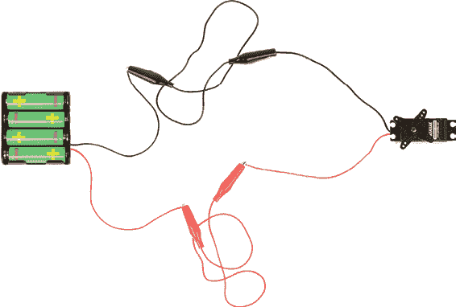

然而，在你开始修改伺服电机之前，理解一些关于伺服电机的基本概念是很重要的。首先，虽然它们看起来几乎相同，但标准伺服电机和连续旋转伺服电机之间有很大的区别。

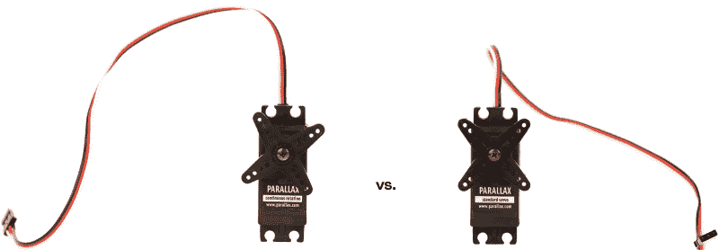

*标准伺服电机*无法完成完整的旋转。需要一个微控制器发送信号给伺服电机，指示它旋转到某个特定位置，通常是 0º到 180º之间的某个值。事实上，齿轮箱内部甚至有一个物理挡位，阻止驱动轴完成完整旋转。

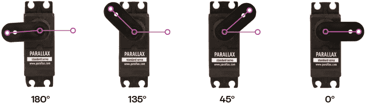

*连续伺服电机*可以进行完整的连续旋转（因此得名）。它们不能被指示到达圆周的某个特定角度。微控制器并不是用来控制伺服电机的具体位置，而是用来发送控制伺服电机旋转速度的信号。由于连续旋转伺服电机的齿轮箱内没有物理停止装置，它是最适合你移除控制板并直接通过电池包供电进行修改的伺服电机类型。

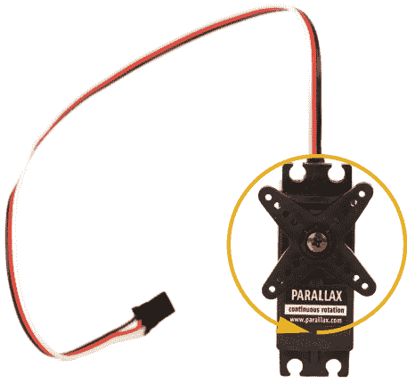

伺服电机有多种尺寸。最常见的伺服电机尺寸，也是你在本书中将要使用的尺寸是“标准”尺寸。不要将标准尺寸伺服电机与标准*操作*伺服电机混淆。你将专门使用一种标准尺寸的伺服电机，该电机是用于连续旋转的。

一些连续旋转伺服电机也有微型尺寸。这些伺服电机太弱，无法在本书中的项目中使用。它们很小（几乎和一枚硬币差不多大），通常采用透明的蓝色外壳。

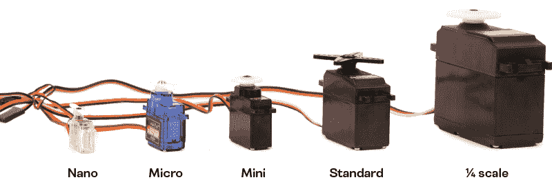

你可能会想，为什么你要修改伺服电机，而不是直接购买一个带齿轮的直流电机。

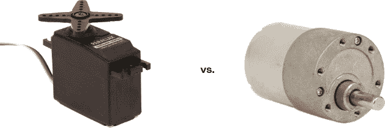

首先，爱好者伺服电机的工作电压范围为 3 V 到 6 V，常见的电池组（如 2×AA 或 4×AA 电池）就可以轻松为其供电。

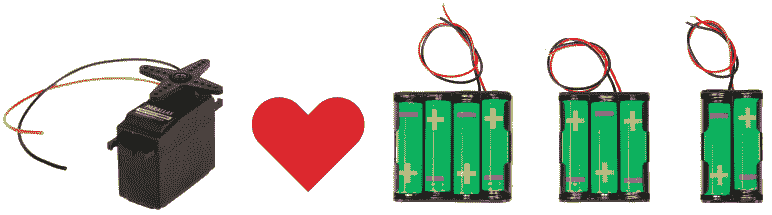

标准的连续旋转伺服电机通常是相同的尺寸，并且总是具有相同的安装标签。这使得它们在构建时非常通用，且无需专门的安装硬件即可轻松地安装到其他物体上。

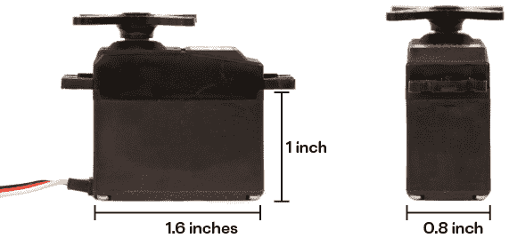

伺服电机上有一个部分连接到它的旋转轴，称为*角盘*。伺服电机的角盘形状和附件种类繁多，使得将物品固定到伺服电机的旋转轴上变得非常方便。用拉链扎带将物品固定到伺服角盘上，远比将物品固定到普通齿轮直流电机的旋转轴上容易得多。

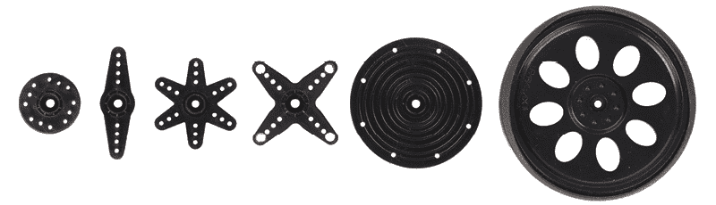

未改装的伺服电机常用于带有微控制器的更先进的机器人中。因为所有标准尺寸的伺服电机尺寸相同并且具有相同的安装孔，所以后续可以轻松更换伺服电机，并将本书中制作的机器人转换为能够由像 Arduino 这样的微控制器控制的机器人。

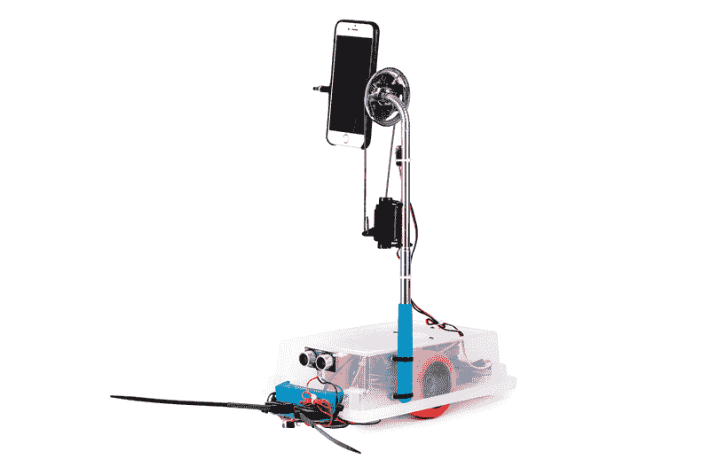

改装伺服电机的一个缺点是，如果你是电子学新手，改装过程可能会让人头痛，但当你在下一章学习如何焊接时，你将获得所需的所有技能来完成改装。不幸的是，截止目前，市场上很难找到预先改装好的无控制器伺服电机。

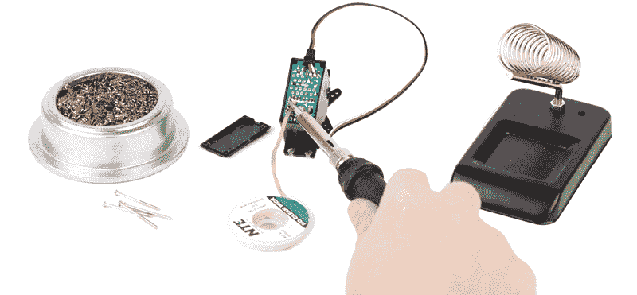

如果你不想修改伺服电机，并且更倾向于使用齿轮电机，虽然有一些替代方案，但它们都需要一定程度的临时处理才能与本书中的项目兼容。虽然它们看起来可能比修改伺服电机稍微简单或便宜，但你会发现使这些电机正常工作所需的努力实际上是相当高的。

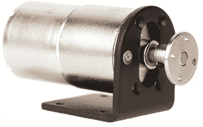

尽管如此，你仍然可以在附录 A 中找到一些方法，提供可行的伺服电机改装替代方案。
