# 第四章：焊接与拆焊

焊锡是一种可熔合的金属合金，用于在电线和其他电子元件之间建立永久性的电气连接。如果你真心想深入了解机器人技术，最终你需要学会焊接。通过使用在几百度低温下熔化的焊锡，你可以将两块金属连接在一起并创建电气连接。这需要一套特定的工具和若干安全措施。

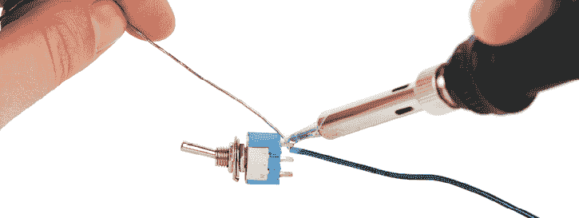

## 焊接工具和材料

在焊接之前，你需要一些基本物品。首先是焊接铁。尽管你可以花几百美元购买一把 fancy 焊接铁，但一把 $15 的可调式焊接铁（约 60 W）就足够入门了。

一旦你拥有了焊接铁，你就需要一个耐热的支架来放置不使用时的焊接铁。大多数焊接铁通常会配备一个支架，但如果你的没有，你一定需要购买一个。

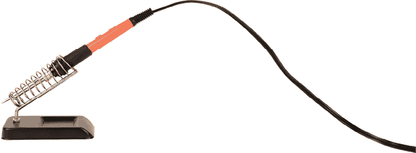

清洁垫也是必要的，用于每次使用后清洁焊接铁的尖端。有两种常见的选择：一种是金属丝清洁垫，通常更耐用，另一种是稍微潮湿的海绵，你应该能在家里找到。任选其一即可。

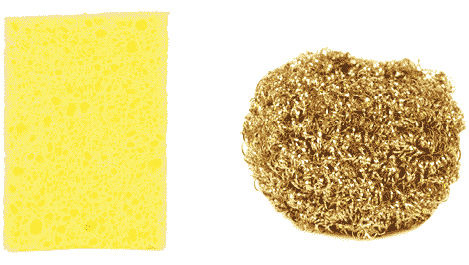

你还需要一些焊锡。我强烈推荐你使用无铅焊锡。它的熔化温度略高于含铅焊锡，操作起来稍微有点困难，但它不会像含铅焊锡那样有毒。最终，你的健康应该比使用上的便捷性更重要。

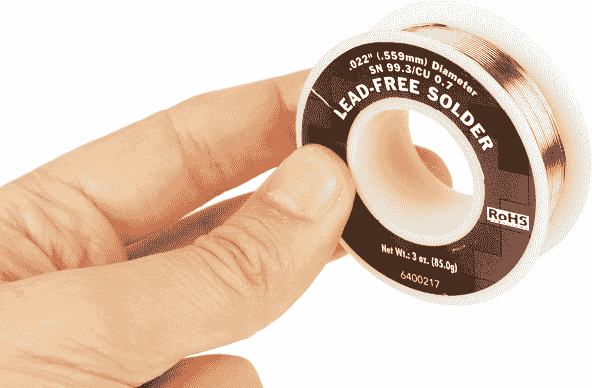

拆焊编带，用于修正焊接错误，是本书项目中的另一项必备工具。它对于从伺服电机的电路板上去除焊锡也至关重要，因为你需要拆卸电机与电路之间的连接，这是你在制作这些机器人时反复进行的操作。

最后，你应该购买一个抽烟机，以去除焊接时的烟雾并保护你的肺部。当焊锡熔化时，会释放出有害的烟雾，应该避免吸入。最好在焊接时使用带过滤的排风扇。至少，你应该选择一个空气流通良好的地方，确保气流从你身边吹走烟雾，避免烟雾滞留在你周围。

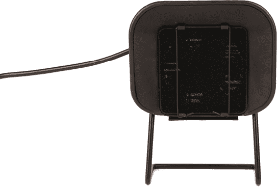

## 入门

在插入焊接铁之前，理解如何在通电时安全地操作它是非常重要的。你应该像拿铅笔一样拿焊接铁，但有一个非常重要的例外：你不应该靠近焊接铁的尖端，而应该始终抓住绝缘手柄。

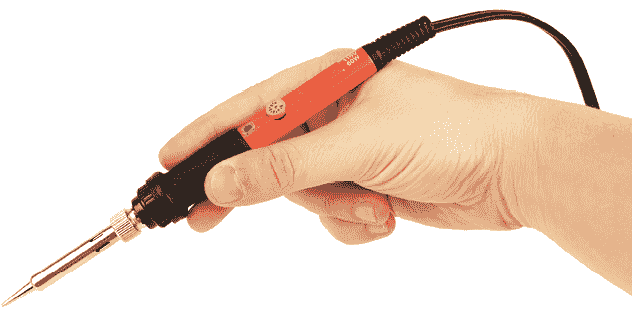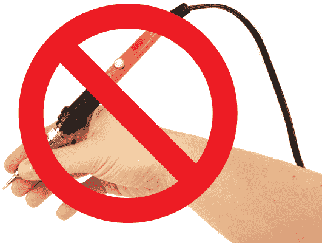

一旦掌握了这个过程，将焊接铁放回支架中，插上电源，等待几分钟，让其加热到足够高的温度以融化焊锡。你可以通过将焊接头接触焊锡并观察是否熔化来测试它是否准备好了。如果焊锡融化了，就可以开始焊接了。同时，在操作时，记得开启排气扇，并确保手边有焊锡和焊接铁清洁垫。

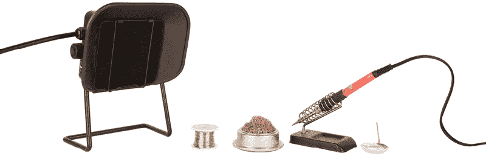

当你第一次使用焊接铁时，你需要对其焊接头进行*镀锡*处理。这意味着将一层焊锡熔化并涂抹在焊接头表面，以保持其正常工作。

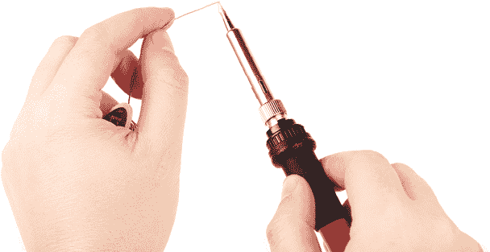

将焊锡融化并均匀涂抹在焊接铁头的表面，直到它形成一个漂亮、闪亮的银色涂层。这将保护金属焊接头免于氧化，并使它能够轻松融化焊锡。

### 焊接电线

最好的焊接练习方法是将两根电线焊接在一起。剥开两段电线的末端，并将金属末端扭在一起或勾住。接下来，加热电线的金属端，同时将一块焊锡推进接头。焊锡应该会熔化并覆盖接头，将两者融合在一起。如果操作正确，接头应该是银色且闪亮的，没有黑色斑点或突出的圆形焊锡块。

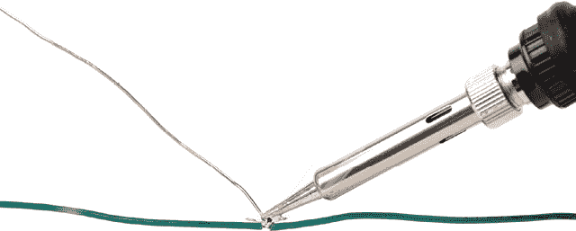

在成功地将两根电线焊接在一起后，清理焊接铁头，可以将其在清洁垫上拖动两到三次，直到多余的焊锡被清除。

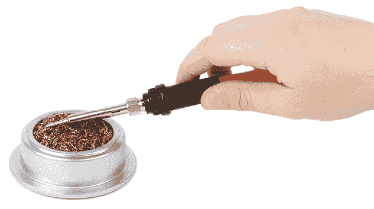

如果你的焊接接头呈灰色、黑色、膨胀状，或者在冷却后摸起来粗糙，你可能因为没有充分加热电线而导致了*冷焊接头*。你可能需要重新焊接。最简单的方法是修剪电线并重新开始。

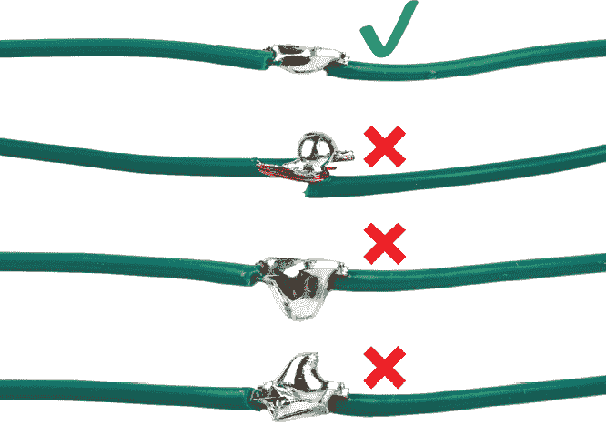

最后需要考虑的是，最佳的做法是对电线连接进行绝缘。这有助于防止短路和其他不必要的故障。最好的方法是使用收缩管覆盖焊接接头。

请记住，你需要在焊接电线之前，将收缩管滑到电线上，然后在电线焊接完毕后将其调整到正确位置。最后，你需要使用热风枪加热收缩管，使其紧密地包裹在焊接接头周围。

热风枪基本上是一种超强的吹风机，能够加热到非常高的温度。你需要小心将其指向远离自己的方向，否则可能会烫伤自己。你还需要小心不要将其指向可能意外起火的物品（如纸张）。

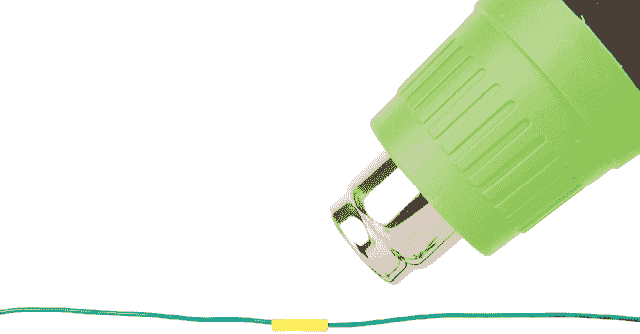

除了将电线焊接在一起，你还可以将电线焊接到组件上，如电机端子和开关。你还可以将组件和电线直接焊接到电路板上，例如伺服电机内部的组件。

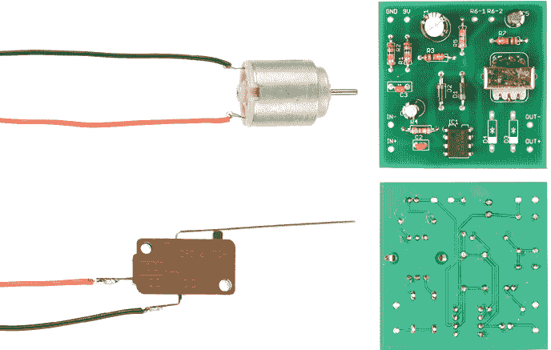

### 去焊

如果你搞错了，把不该焊接的东西焊在一起，你可以使用去焊带移除焊料并分开零件。要去焊，从卷轴上拉出一些去焊带，并将其平铺在你想要撤销的焊接点上。接着，用烙铁压下去焊带，直到焊料开始熔化并被去焊带吸收。

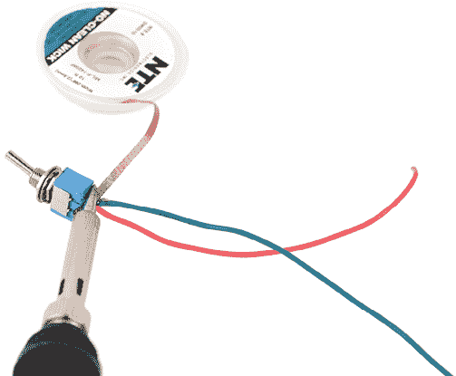

这有点棘手，需要一些练习才能做到正确，但你将在修改伺服电机以实现直接驱动时得到一些练习。

## 为直接驱动改装伺服电机

当你开始制作机器人时，你会发现经常重复这些步骤。每个机器人至少需要一个改装过的伺服电机。本书中的每个机器人都需要使用改装过的伺服电机。你可能会发现去焊过程有时令人沮丧，但坚持下去。你做得越多，越容易掌握。

打开伺服电机，拆下固定伺服背盖的四个螺丝，然后取下背盖。

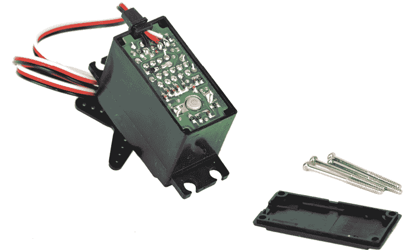

从去焊带的卷轴上拉出几英寸的去焊带。

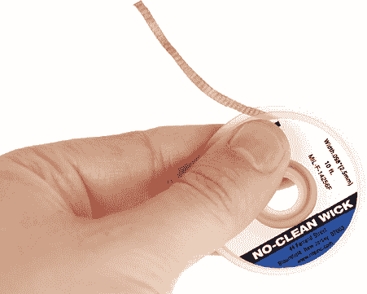

找到伺服电机在电路板上的两个焊接点。这些连接点将是电路板一端两个最大的焊料块。通常电路板上会有一个切割口，你甚至能看到一些金属电机外壳。

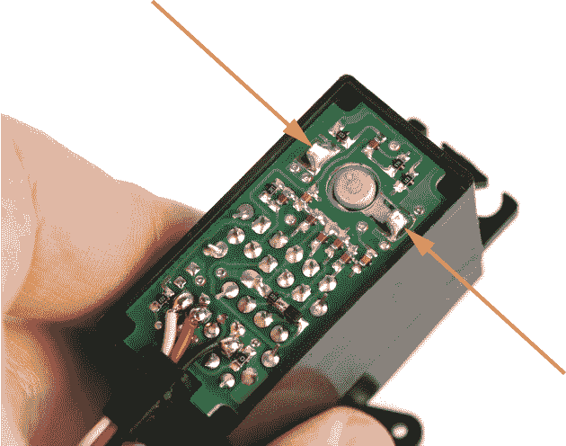

将去焊带放置在电机焊接点上。

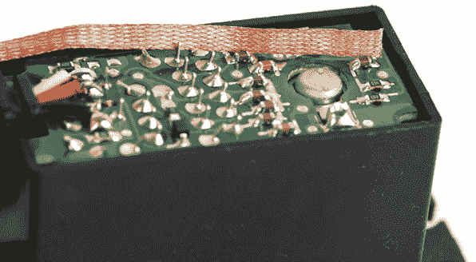

用烙铁压在去焊带上，直到你看到和/或感觉到去焊带下方的焊料开始熔化并流动。你会看到烙铁尖端附近的去焊带开始变成银色。

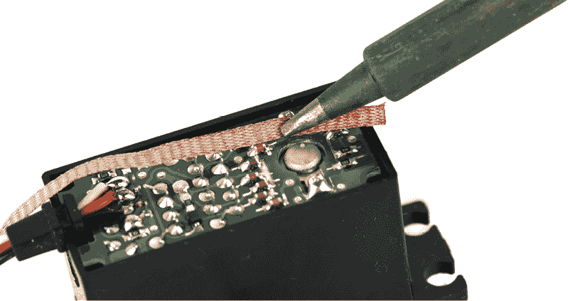

一旦去焊带开始变成银色，数到二，同时提起烙铁和去焊带，抓住去焊带的包装（而不是裸露的金属部分）。

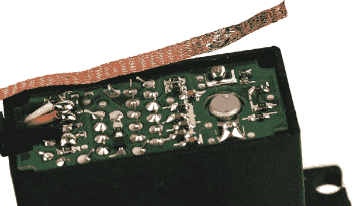

在去焊带上，你现在应该能看到一个光亮的焊料块。如果一切顺利，电路板上的大部分焊料块将不复存在，电路板将与电机引脚分离。如果电机引脚仍然与电路板相连，只需重复这个过程，直到电机引脚完全从电路板上去焊。对于第二个电机引脚，重复同样的过程。

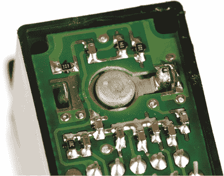

一旦两个引脚都被解脱，取下电路板和伺服电机的机身。

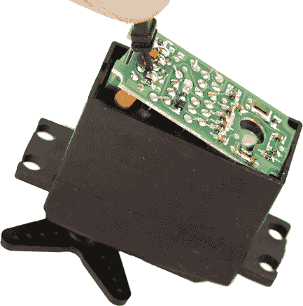

现在，你可以练习你的焊接技巧了。首先，剪下 6 英寸长的红色电线和黑色电线，然后将每根电线的末端剥去 1/2 英寸的绝缘层。接下来，给每根电线的末端涂上一层薄薄的焊锡。

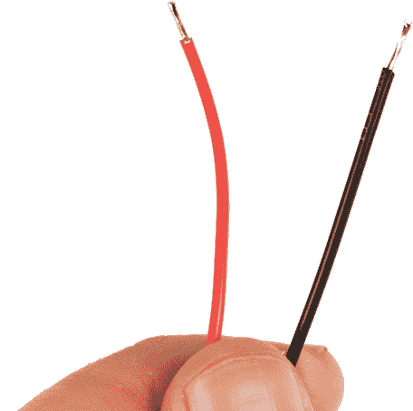

这叫做*打锡*，就像你之前在烙铁尖端所做的那样。你这样做是因为焊锡非常喜欢粘附在其他焊锡上。由于电机针脚已经有了一点焊锡，给每根电线涂上一点焊锡会让连接电线和针脚变得更加容易。

将红色电线接触到靠近电机背面红点的电机针脚。如果你的电机没有红点，可以选定伺服电机的一侧作为“左侧”，并始终将红色电线连接到该侧。

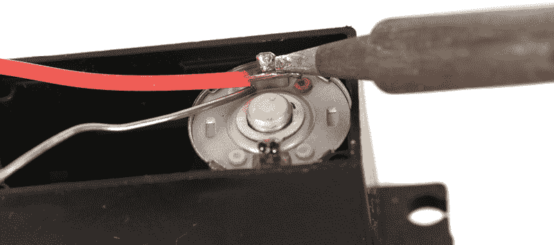

一旦这个问题解决后，小心地将烙铁应用于电线和针脚相接的地方，融化一些焊锡。你应该看到焊锡开始液化并在两者之间扩散。当发生这种情况时，移开烙铁和焊锡，等待焊接点冷却并固化后再进行操作。

使用黑色电线和另一个电机针脚重复此过程。

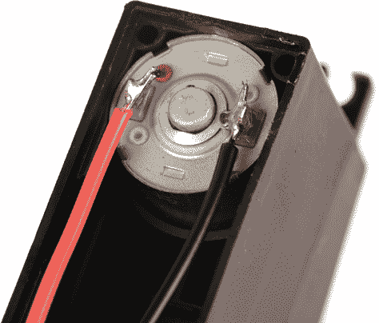

将电机的电线打个结，使得如果你拉动电缆时，结会位于伺服电机外壳的外部。一旦确认这一点，将结放入伺服电机的外壳内部。这样做可以防止电机的电线在拉扯时从电机针脚脱落。

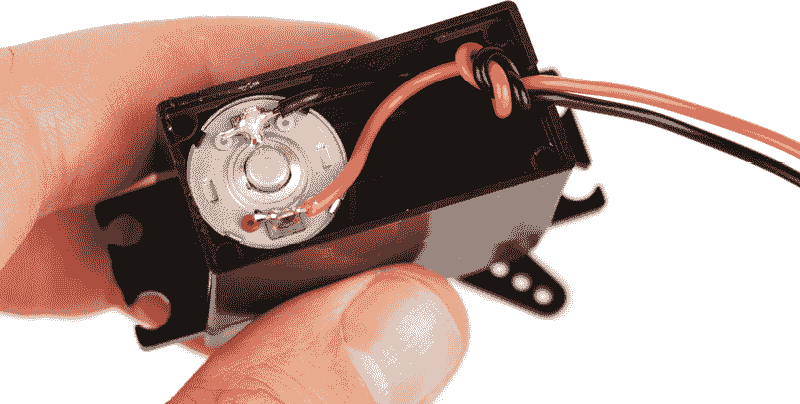

重新组装伺服电机，并重新插入固定它的螺丝。

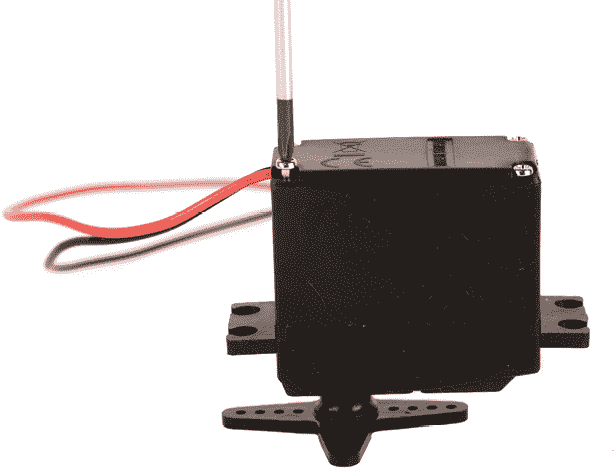

现在，你的伺服电机可以直接由电池供电了。要使其旋转，只需将伺服电机的每根电线连接到来自电池组的同颜色电源线上。

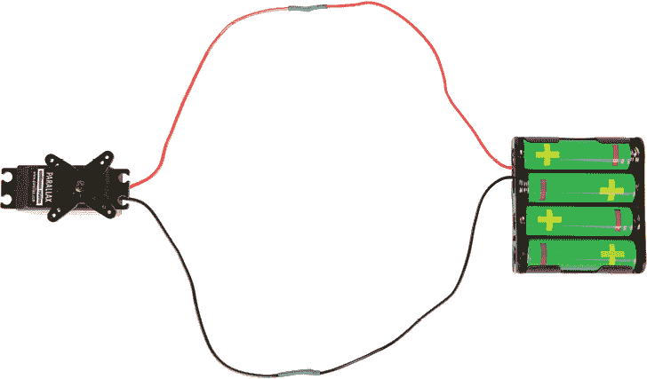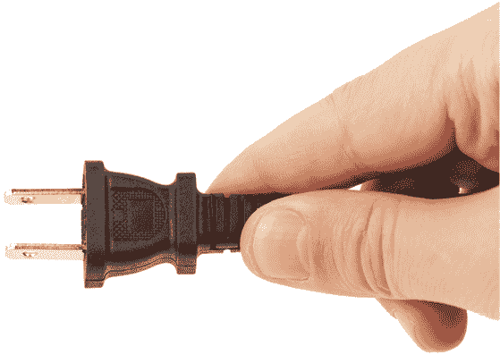

虽然焊接和拆焊是机器人技术中必须掌握的技能，但如果你还没有准备好尝试这些技能，你也可以在不焊接的情况下构建整个电路。要了解如何在不焊接的情况下进行电气连接，请查看附录 A。
