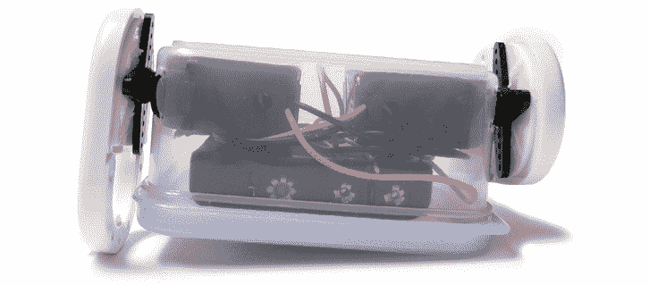
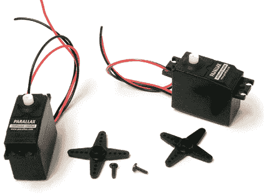
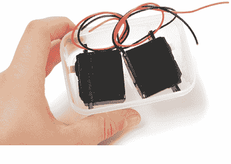
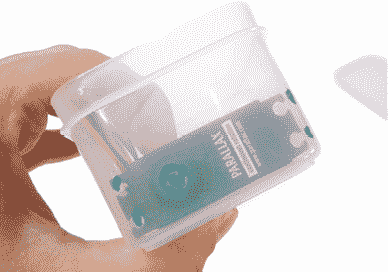
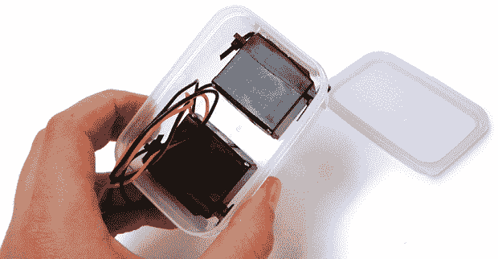
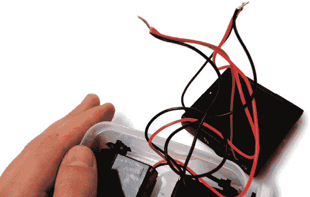
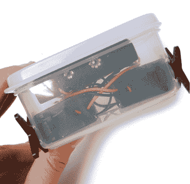
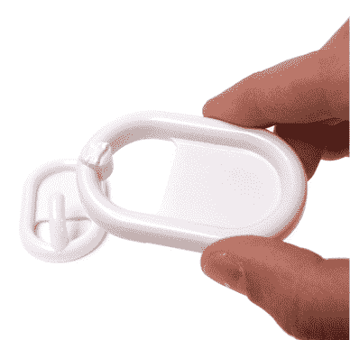
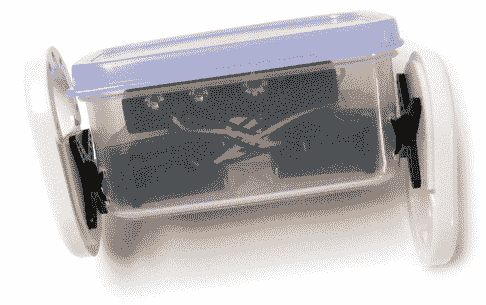
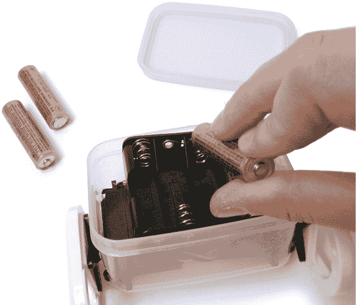

# 第五章：Wobbler

正如你从名字中猜到的，Wobbler 是一个通过前后摆动来移动的机器人。虽然刚开始看起来可能有点笨拙，但不要让第一印象迷惑了你。Wobbler 是一个充满热情和毅力的小机器人，随时准备迎接挑战。

这个项目所需的零件都很容易找到，即使是经验较少的机器人制造者也能轻松组装 Wobbler。经验丰富的机器人制造者则可以通过修改这个设计来获得乐趣，因为该设计的简单性为扩展和实验提供了很大的空间。

**工具和材料**

+   两个已拆除控制器的连续旋转伺服电机

+   两个自粘椭圆形衣钩

+   一个 4 × AA 电池盒

+   四节 AA 电池

+   带盖的小塑料容器

+   四根扎带

+   马克笔

+   剥线钳/剪线钳

+   电动钻

+   一把 1/8 英寸的钻头

+   一把 3/8 英寸或½英寸的钻头

## Wobbler 概述

你将分阶段构建 Wobbler。首先，你需要提前将连续旋转伺服电机改装为直接驱动（第四章），或者按照附录 A 中列出的要求，使用一个齿轮电机替代品。一旦完成，你需要在塑料盒上标记并打孔以安装电机，将电机固定在盒内，并接好电路。最后，你将把 Wobbler 的椭圆形“轮子”安装在盒子的外侧。

## 构建 Wobbler

第 1 步

1.  第 1 步。从电机上取下伺服舵机臂。（伺服舵机臂是附着在电机轴上的转动部分。）

1.  第 2 步。将伺服电机放入塑料容器内，使它们背对背地放置。伺服电机轴的位置应该接近容器底部，并稍微偏离中心，以帮助 Wobbler 摇摆。

1.  第 3 步。使用马克笔在塑料容器上标出安装螺丝孔和电机轴的位置。

    第 2 步

    

    第 3 步

1.  第 4 步。在你做标记的地方在塑料容器上钻孔。

    第 4 步

对于较小的安装孔，使用 1/8 英寸的钻头应该足够。对于电机轴，使用 3/8 英寸或½英寸的钻头。

1.  第 5 步。将电机放置在塑料容器内，并用扎带将它们牢牢固定。

    第 5 步

1.  第 6 步。将一根红线从一个电机连接到另一个电机的黑线。然后将配对的电线与电池盒的一个电线连接。接着，将剩下的三根松散电线连接在一起形成另一组。你可以将这些电线焊接在一起，或者使用机械连接器。

    第 6 步

1.  第 7 步。将电池盒放入塑料容器内。然后关闭塑料容器并重新安装伺服电机的舵机臂。

    第 7 步

    

    第 8 步

1.  第 8 步。虽然这一步不是完全必要的，但你可以用斜口钳或小锯子将外套钩的钩部分剪掉。这样，你将得到自粘的椭圆形轮子。

1.  第 9 步。撕下背面的胶纸，将轮子粘贴到伺服器的舵轮上，确保每个舵轮完全被轮子遮挡。确保将轮子粘得偏离旋转轴心，以便给机器人带来良好的摇摆效果。

    第 9 步

1.  第 10 步。移除盖子，将电池放入电池盒中，再次盖好盖子，然后启动 Wobbler。只要安装了电池，机器人就会一直运行。

第 10 步

尝试将机器人放在不同的位置，观察它的所有移动方式。还可以尝试将外套钩“轮子”替换为其他物体，得到独特的效果。只需使用双面胶带或扎带将不同的物体固定在伺服器的舵轮上即可。
