# 第六章：缓冲器

缓冲器在许多方面与 Wobbler 非常相似，但主要的区别在于它的轮子。对于这个机器人，你将把两个圆形的“缓冲”轮子安装到朝下的电机上，这些电机彼此旋转。当你启动机器人时，它会朝着清扫器旋转的方向前进。缓冲器看起来有点像一个微型扫地车，但它的运动方式与其较大的表兄不同。然而，它可能真的能清洁你的地板。缓冲器是一个容易制作且有趣的机器人。

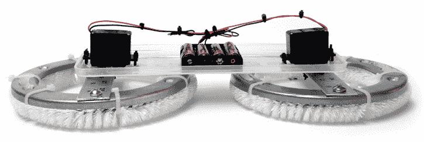

**工具和材料**

+   两个去除控制器的连续旋转伺服电机

+   一个 4 × AA 电池盒

+   一个 12 英寸塑料矩形容器的盖子

+   两个烘干机絮状物捕捉刷

+   两个不锈钢管道法兰修复环

+   一根 24 英寸的铝制直尺

+   四个¼英寸的螺母和螺栓

+   两个 4-40 × ¼英寸的螺母和螺栓

+   不同尺寸的扎带

+   电钻

+   三个钻头：1/8、1/4 和 1/2 英寸

+   钢锯

+   线缆剥离工具/剪线钳

+   标记笔

## 缓冲器概述

首先，你需要像制作 Wobbler 一样修改伺服电机（也可以参考第四章）或使用附录 A 中的齿轮电机替代品。完成后，你将制作毛絮刷缓冲轮子。然后，将电机固定到盒盖上，将缓冲轮安装到电机上，朝下朝地面。最后，将整个电路接线并供电。

## 构建缓冲器

1.  第 1 步。为缓冲器的刷子轮子准备横杆。你将使用这些横杆将伺服电机角盘固定到轮子本身。将直尺切成两段，每段 7 英寸，应该是那种不锈钢管道法兰修复环的直径。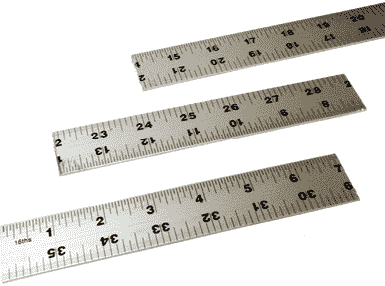

    第 1 步

1.  第 2 步。你需要在直尺的段落上钻孔，将这些直尺段落固定到修复环上，并开始制作缓冲器的轮子。首先，将一段直尺放在修复环上，并用标记笔在直尺两端通过修复环的安装孔标记直尺的位置，如图所示。尽量将标记放置在直尺宽度的中心位置。第二段直尺重复相同的操作。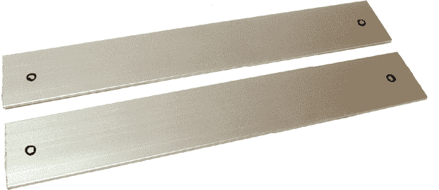

    第 2 步

1.  第 3 步。将直尺段牢牢夹紧，钻入标记上的 1/8 英寸引导孔，然后将孔扩大至¼英寸。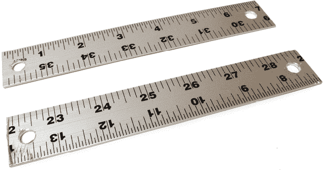

    第 3 步

1.  第 4 步。拆下固定伺服电机角盘的螺丝，并将角盘从电机箱中取出。

1.  第 5 步。在每个伺服电机角盘的两端钻 1/8 英寸的孔。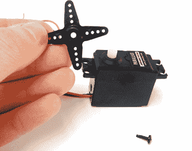

    第 4 步

    

    第 5 步

1.  步骤 6. 将一个舵机号角对准一个尺子段的中心位置。你之前钻好的两个舵机号角孔应悬挂在尺子边缘外。通过舵机号角的其他两个孔，在尺子上做标记。对另一个尺子段重复相同操作。

    步骤 6

1.  步骤 7. 使用 1/8 英寸的钻头，在你刚才标记的每个标记位置钻孔。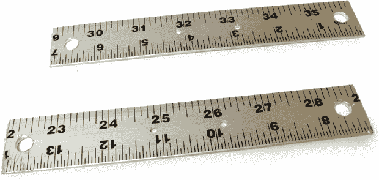

    步骤 7

1.  步骤 8. 使用 ¼ 英寸的螺母和螺栓，通过你钻好的较大孔，将每段尺子固定到修复环上。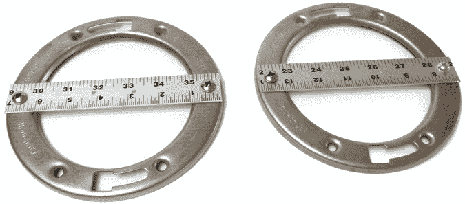

    步骤 8

1.  步骤 9. 剪掉去毛刷的把手。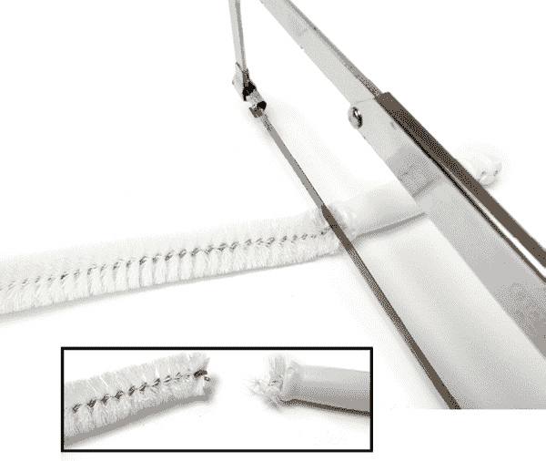

    步骤 9

1.  步骤 10. 要完成缓冲轮，先将一个去毛刷绕在修复环的底面，形成一个圆形，边绕边用拉链扎带固定。剪掉多余的拉链扎带和剩余的去毛刷。对第二个去毛刷和修复环重复此过程。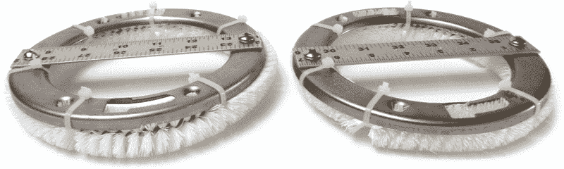

    步骤 10

1.  步骤 11. 拿起塑料盒盖，分别在盖子的两个较短边缘内侧约 ¾ 英寸处做标记。尽量确保标记在中心位置。根据两个标记的位置钻一个 ½ 英寸的孔。如果塑料有轻微裂纹或缺口没关系，只要你能仍然用拉链扎带将电机固定好即可。

    步骤 11

1.  步骤 12. 现在，你需要添加安装舵机电机的孔，使用拉链扎带进行固定。将舵机电机的轴放置在你刚钻好的一个孔的中心位置。通过每个舵机安装孔，在盖子上做标记。对另外一个孔重复此过程。最后，使用 1/8 英寸的钻头在这些八个标记上钻孔。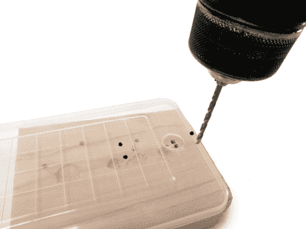

    步骤 12

1.  步骤 13. 通过这些孔，用拉链扎带将电机固定在盒盖上，确保盖子的边缘指向与电机轴相反的方向。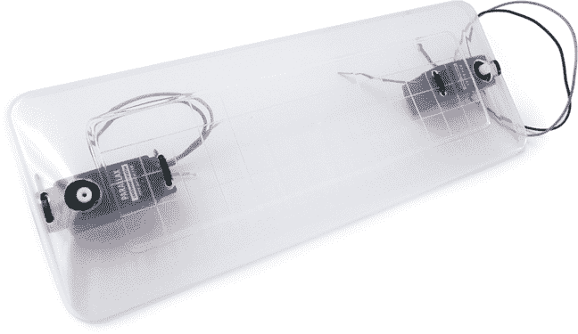

    步骤 13

1.  步骤 14. 将电池支架放置在盖子中心，并通过电池支架的两个安装孔标记盖子。使用 1/8 英寸的钻头在这些标记上钻孔。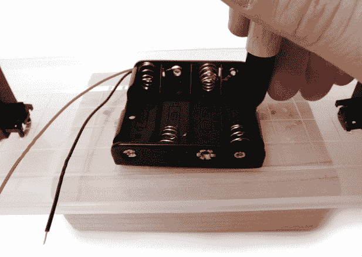

    步骤 14

1.  步骤 15. 使用 4-40 × ¼ 英寸的螺母和螺栓，将电池支架固定在盖子与电机同一侧。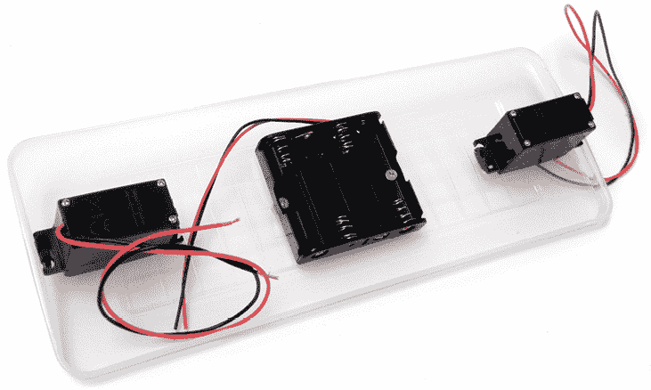

    步骤 15

1.  步骤 16. 将舵机号角重新安装到舵机上。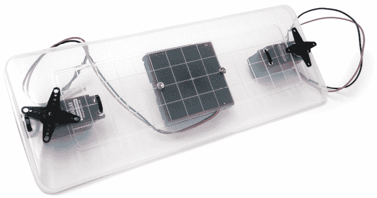

    步骤 16

1.  步骤 17. 通过你之前钻好的安装孔，用拉链扎带将缓冲轮固定在舵机号角上。对于每一对轮子和舵机号角，将拉链扎带穿过舵机号角和尺子上的一个孔，再从舵机号角另一端的孔穿回来，最后绑紧拉链扎带。用第二个拉链扎带重复这个过程，并确保所有部件都牢固固定。修剪掉所有多余的拉链扎带。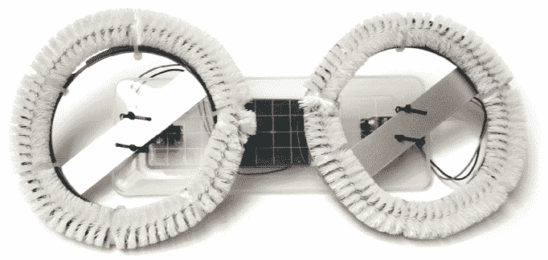

    步骤 17

1.  步骤 18. 将一个伺服器的红线连接到另一个伺服器的黑线。将剩下的两根黑线和红线连接在一起。将其中一对连接到电池包的红线，另一对连接到黑线。使用绑线将所有电线整齐地绑在一起，确保没有裸露的焊接点互相接触，以免短路。或者，用热缩管为连接部分做绝缘处理。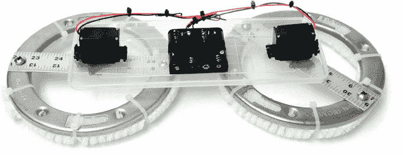

    步骤 18

1.  步骤 19. 将一些电池插入电池盒，放下缓冲器，然后看它运转！！f06021

    步骤 19
