# 第七章：Daze

Daze 是一款与众不同的机器人，原因有几个。首先，它的轮子就是它的身体。其次，它的运动机制由两个伺服电机组成，电机轴连接在一起并偏心。这个设计最初只是一个实验，我从没想到这个机器人会以这种方式运动。在任何时候，Daze 都可能决定向前滚动、向后滚动，或者干脆停留在原地。它就像是迷迷糊糊地四处移动——因此得名“Daze”。

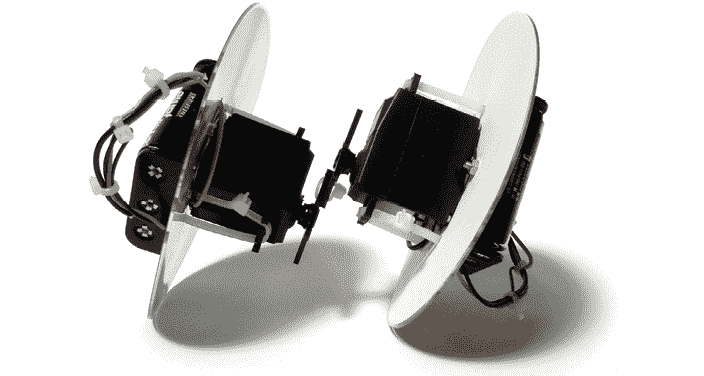

**工具和材料**

+   两个去除控制器的连续旋转伺服电机

+   两个 3 × AA 电池托架

+   六个 AA 电池

+   两个 CD 或 DVD

+   四个 4-40 × 3/8 英寸的螺母和螺栓

+   剪切模板（参见附录 B）

+   不同尺寸的扎带

+   剪刀

+   一卷画家胶带（或类似的胶带）

+   电钻

+   一把 1/8 英寸钻头

+   剥线钳/剪线钳

## Daze 概述

你将使用与其他机器人相同的改装伺服电机（第四章）或齿轮电机替代品（附录 A）。Daze 由两个相同的半部分组成，这两部分在偏心位置连接在一起。你将从使用钻孔模板开始，修改作为机器人轮子的 CD（或 DVD）。接下来，你将把电机和电池包固定到轮子上，然后将伺服电机的喇叭连接在一起（偏心）。最后，你将为每个电机接上独立的电池包，并启动 Daze。

## 构建 Daze

1.  第一步。从[`nostarch.com/homemaderobots/`](https://nostarch.com/homemaderobots/)打印出模板纸（或从附录 B 中描绘），然后剪下两个圆形钻孔模板。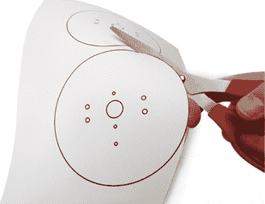

    第一步

1.  第二步。将钻孔模板居中并粘贴在每个 CD 上。

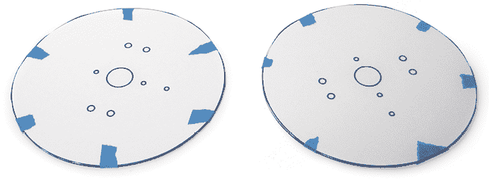

第二步

1.  第三步。使用 1/8 英寸钻头钻出模板上标明的孔。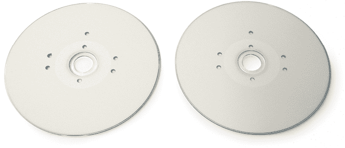

    第三步

1.  第四步。取下伺服电机的喇叭。在每个伺服电机喇叭的一个臂上钻两个 1/8 英寸的孔：一个靠近喇叭的尖端，另一个靠近基部。在另一只喇叭上钻相同的孔。然后将喇叭重新安装到伺服电机上。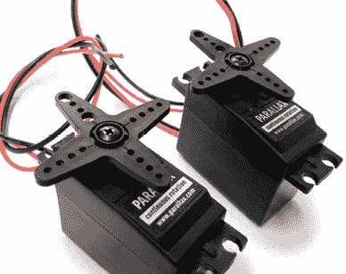

    第四步

1.  第五步。对于每一对 CD 和伺服电机，将 CD 平放，伺服电机放在 CD 中央的顶部，喇叭朝向 CD 的外侧。将 CD 的四个孔与伺服电机的安装孔对齐，然后用扎带将伺服电机固定在 CD 上。修剪掉扎带的尾部。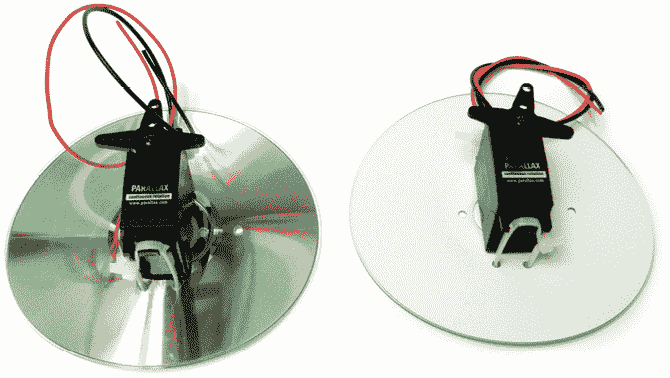

    第五步

1.  第六步。使用螺母和螺栓将电池托架固定在 CD 的与伺服电机相对的一侧。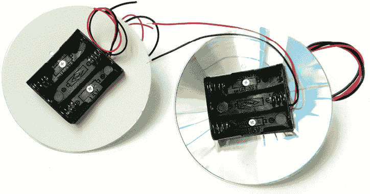

    第六步

1.  第七步。用扎带将两个伺服电机的喇叭通过你之前钻的四个孔绑在一起。拉紧扎带，修剪掉多余部分，并确保伺服电机的喇叭可以自由旋转。

1.  第八步。将两个伺服电机的电线通过每个 CD 中剩余的一个未使用的孔，朝着电池托架方向拉过。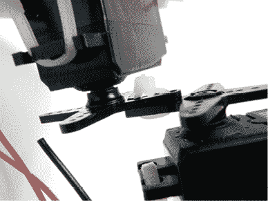

    第七步

    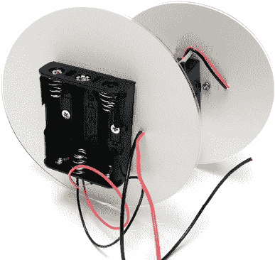

    第 8 步

1.  第 9 步。在其中一张 CD 上，将红色电机线与红色电池线连接，黑色电机线与黑色电池线连接。在另一张 CD 上，将红色电机线连接到黑色电池线，黑色电机线连接到红色电池线，使其接线与第一张 CD 相反。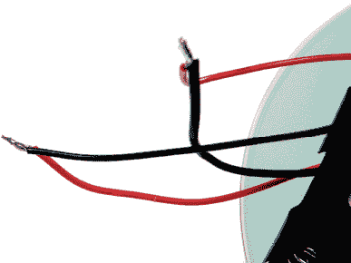

    第 9 步

1.  第 10 步。将所有东西用绑带紧紧绑在一起，消除松弛，以确保焊接点不会接触并导致短路。

1.  第 11 步。为了让 Daze 运行，将其放置在一个无法掉落的表面上，插入每个电池座的电池，然后惊讶地观看。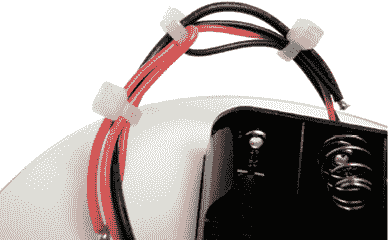

    第 10 步

    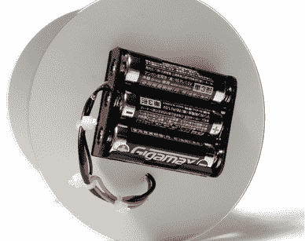

    第 11 步
