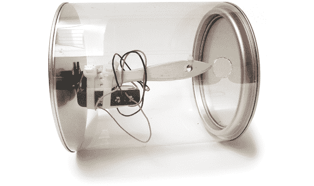
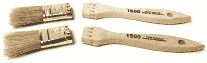
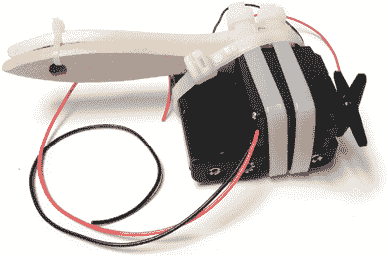
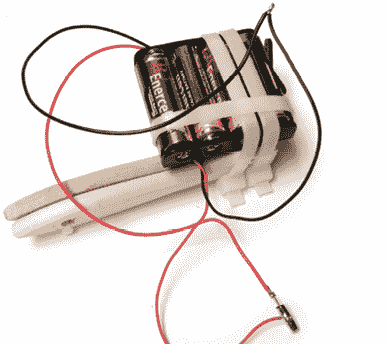
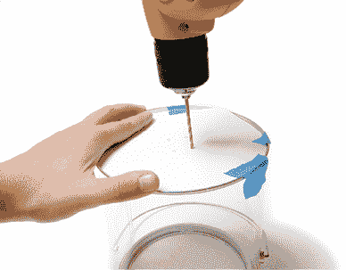
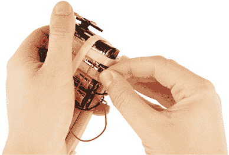
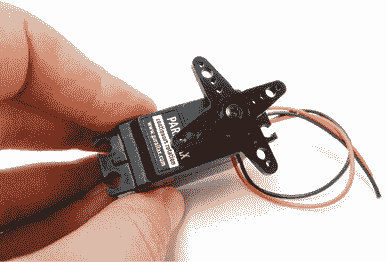
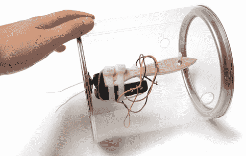
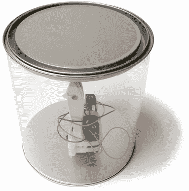

# 第八章：Barreller

Barreller 机器人似乎能够持续向前推进。在简单来说，它的工作原理是：电动机作为一个偏心的重物，放置在油漆罐内。当重物（即电动机）在重力作用下向下掉落时，油漆罐会向前滚动。普通的油漆罐可能会在这个时候停下来，但这个油漆罐配有一个倾斜开关，当罐子倾斜时，开关触发电动机启动，导致电动机向上旋转（然后再关掉），从而重新启动这个过程。如果你能想象这一过程发生得非常迅速，并且持续一段时间，你就能理解这个机器人是如何工作的。Barreller 看起来似乎在自行向前滚动，甚至能做出一些看似不可能的事情，比如沿坡道滚动。这个机器人非常有趣。如果你不相信我，自己动手做一个。它既快速又简单。

**工具与材料**

+   去除控制器的连续旋转伺服电机

+   油漆罐（或类似物）

+   两根 1 英寸的油漆刷

+   一个 4 × AA 电池架

+   四个 AA 电池

+   倾斜开关（Mouser #107-2002-EV）

+   各种扎带

+   钻孔模板（见附录 B）

## Barreller 概述

Barreller 是在一个油漆罐内部构建的（我使用了一个透明的创意油漆罐）。在开始之前，请确保你已经按照第四章修改了连续旋转伺服电机以实现直接驱动，或者按照附录 A 使用了其中一种齿轮电机替代品。一旦完成了这一点，下一步就是构建内部“重物”机制，它本质上是由电动机、电池组和倾斜开关组成的电路。你将把这个机制插入油漆罐并固定在中心位置。

## 构建 Barreller

1.  步骤 1. 拆开两根油漆刷，得到两根木制手柄。

    步骤 1

1.  步骤 2. 将电池放入电池架，并将其放置在一根扎带上，电池朝下。将电动机放在电池架上方，使得伺服舵角垂直朝一个方向延伸，木制手柄朝相反方向延伸。用扎带将所有部分紧固在一起，直到它们成为一个整体，且无法拆开。

    步骤 2

1.  步骤 3. 将电动机的黑色电线与电池架的黑色电线扭在一起，并进行焊接。将电池架的红色电线焊接到倾斜开关上突出的尖端。将电动机的红色电线焊接到倾斜开关的导电金属外壳上。当倾斜开关被激活时，电流将通过尖端和外壳之间流动。

    步骤 3

1.  步骤 4. 准备油漆罐，移除任何可能阻止其滚动的物件，如手柄，并清理罐内的杂物。

1.  第 5 步：打印（或描摹）并剪下模板。将模板用胶带固定在罐子底部，并使用 1/8 英寸的钻头或适合你扎带尺寸的钻头打四个小孔。

    第 4 步

    

    第 5 步

1.  第 6 步：将倾斜开关滑入电池座中两个电池之间，使其与电池平行。但请确保这不会导致开关短路。如果你担心这个问题，可以用热缩管将其覆盖（未显示）。

1.  第 7 步：使用 1/8 英寸的钻头扩孔，使伺服器的控制头上的孔与罐子底部打好的孔对齐。

    第 6 步

    

    第 7 步

1.  第 8 步：将伺服器的控制头用扎带固定到罐子底部打好的孔里。修剪掉扎带的尾部。

    第 8 步

1.  第 9 步：完成后，重新盖上盖子。

    第 9 步
