# 第九章：懒惰

顾名思义，懒惰机器人已经优化到几乎不做任何事。这是一个设计特点，而不是一个缺陷。懒惰机器人每分钟晃动前进一次，然后停下来。这得益于一个磁铁激活的簧片开关和一个附着在钟表秒针上的小磁铁。当秒针带着磁铁经过簧片开关时，机器人会启动几秒钟。这样，懒惰机器人在它被赋予的任务上非常高效。我可以想象，在不久的将来，机器人在懒散方面的能力甚至可能超过人类。

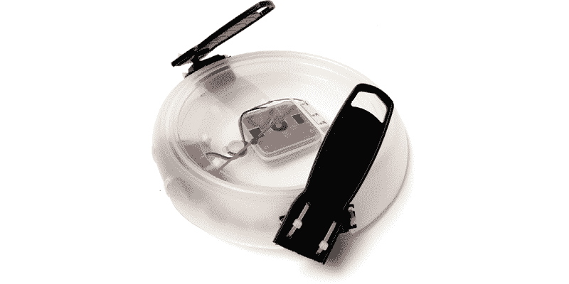

**工具与材料**

+   两个去掉控制器的连续旋转伺服电机

+   两个 1½英寸的油灰刀

+   圆形壁挂钟

+   簧片开关

+   锯子

+   小圆盘磁铁

+   热缩管

+   一个 3 × AA 电池盒

+   三节 AA 电池

+   各种扎带

## 懒惰概览

懒惰机器人由一个简单的电路构成，该电路围绕着钟表的机芯构建。在开始构建之前，确保你已经修改了连续旋转伺服电机以便直接驱动（见第四章），或者使用了附录 A 中列出的齿轮电机替代品。下一步是拆开钟表面板，并把所有零件放到一旁。一旦你能够顺利进入钟表内部，你将安装簧片开关和电池。接下来，你将改造钟表机身，以便能够安装电机及其驱动臂。在所有组件到位后，你就可以完成电路的接线。最后一个主要步骤是将磁铁安装到秒针上，并重新将其安装到钟表机身内。然后，如果需要，你可以将钟表的保护盖重新安装上。

## 构建懒惰机器人

1.  步骤 1。取下钟表的前盖。小心地从机芯中取下时针和分针，然后取下钟表面板。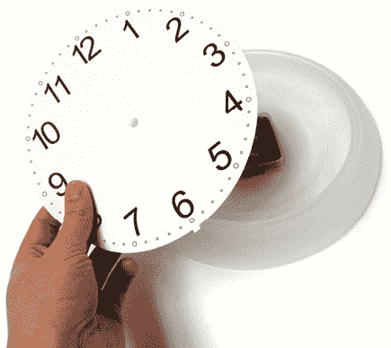

    步骤 1

1.  步骤 2。将一根红色电线连接到簧片开关的中心端子，黑色电线连接到外侧的公共端子。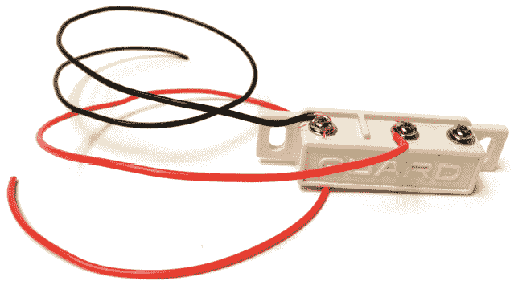

    步骤 2

1.  步骤 3。用扎带将簧片开关固定在钟表内部，使其围绕钟表机芯并且端子朝下。

1.  步骤 4。找一个位置将电池盒固定在钟表机身内部。在电池盒的两侧做标记，这样当你钻孔时，就可以将电池盒用扎带固定到钟表上。另外，标记一个额外的孔，用于穿过簧片开关的电线。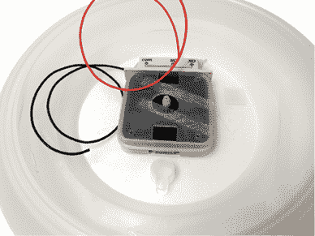

    步骤 3

    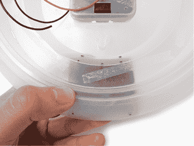

    步骤 4

1.  步骤 5。用 3/16 英寸的钻头钻出所有标记的地方。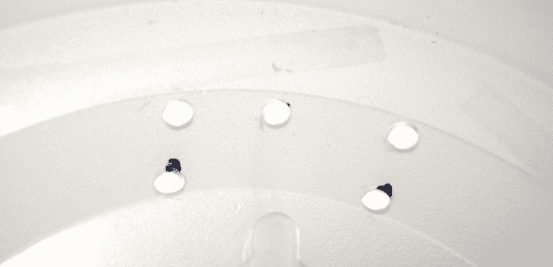

    步骤 5

1.  步骤 6。将簧片开关的电线通过你刚刚标记并钻好的额外孔。如果可能的话，通过将电线绑在钟表机身的一部分或系成一个大于孔径的结来固定电线。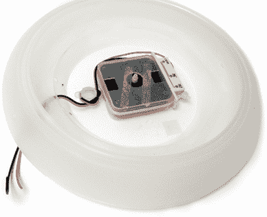

    步骤 6

1.  第 7 步. 将电池放入电池座。你可以选择在其中一根导线导线上贴上一块胶带，直到准备使用这些电线时再移除，这样可以防止电线相互交叉。

1.  第 8 步. 使用扎带将电池座固定在钟表主体上。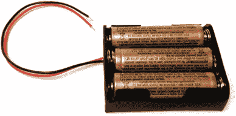

    第 7 步

    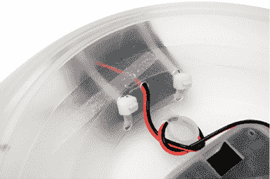

    第 8 步

1.  第 9 步. 将钟面放回钟表主体上。在钟表外部，2 点和 3 点之间做两个标记，以指示伺服电机的宽度。在 9 点和 10 点之间做类似的标记。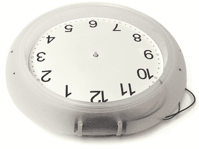

    第 9 步

1.  第 10 步. 在做标记的地方，使用锯条锯掉两个足够大的矩形，以便伺服电机的主体可以通过。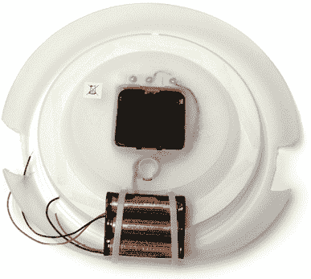

    第 10 步

1.  第 11 步. 使用锯条锯掉塑料刮刀大约 1.5 英寸的末端。你应该只剩下手柄部分。

1.  第 12 步. 从电机轴上取下伺服齿轮，并将螺钉放在安全的地方保存。

    第 11 步

    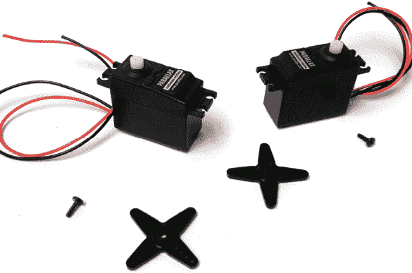

    第 12 步

1.  第 13 步. 在每个伺服齿轮的外端钻一个 1/8 英寸的孔。另一个伺服齿轮上也重复相同操作。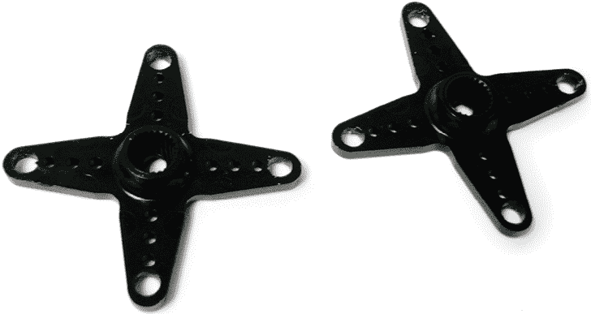

    第 13 步

1.  第 14 步. 使用伺服齿轮作为钻孔导向，钻出四个安装孔，靠近塑料刮刀锯掉的边缘。

1.  第 15 步. 将伺服齿轮重新安装到电机轴上。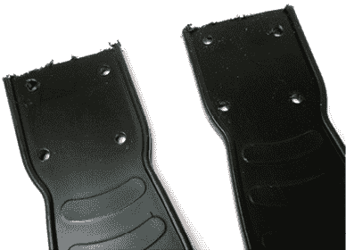

    第 14 步

    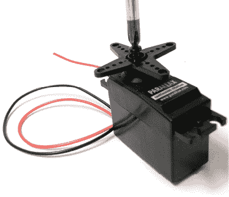

    第 15 步

1.  第 16 步. 将伺服电机插入你在钟表主体侧面打的孔中。使用伺服安装支架作为钻孔导向，以便在钟表主体上钻孔。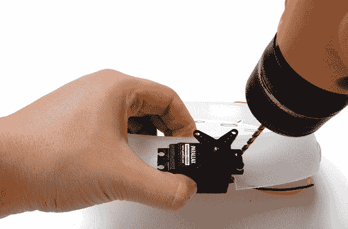

    第 16 步

1.  第 17 步. 使用扎带将电动机固定在钟表主体上，使得两个伺服电机的伺服齿轮靠近 12 点钟方向。

1.  第 18 步. 使用扎带将塑料刮刀固定在伺服齿轮上。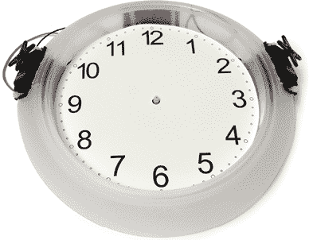

    第 17 步

    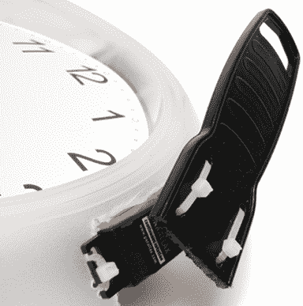

    第 18 步

1.  第 19 步. 将你的磁性圆盘用热缩管固定在钟表秒针的底部，使得磁铁在重新放回钟表机芯时会经过簧片开关。如果你没有热缩管，一小块胶带也能起到作用。

    第 19 步

1.  第 20 步. 如果需要，你现在可以再次移除钟面。更重要的是，将秒针重新安装到钟表机芯上。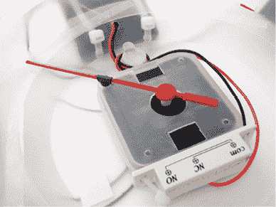

    第 20 步

1.  第 21 步. 将簧片开关的红线焊接到电池座的红线。将簧片开关的黑线焊接到一个伺服电机的黑线和另一个伺服电机的红线上。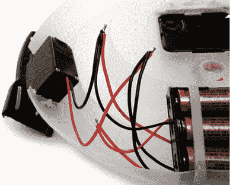

    第 21 步

将电池座的黑线焊接到剩余的两个自由伺服电机电线。

1.  步骤 22. 用拉链绑带将所有电线绑在一起，以确保电线拉紧，避免任何焊接点相互接触。

    步骤 22

1.  步骤 23. 将前盖重新安装到时钟上，以保护秒针。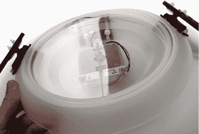

    步骤 23

1.  步骤 24. 插入一块全新的（而非部分耗尽的）电池并等待。当秒针经过簧片开关时，机器人会短暂唤醒并快速跳动，直达你的心中。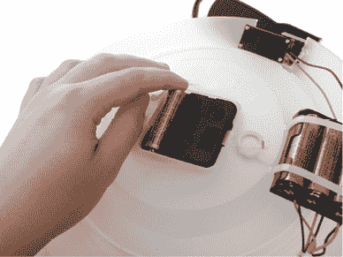

    步骤 24
